# 🛡️ Harness — Complete Beginner-to-Expert Reference

> The modern **software delivery platform** — pipelines-as-code CI/CD, **AI-driven continuous verification**, feature flags, GitOps, IaC management, chaos engineering, and cloud cost control. How Harness rethinks deployment beyond [[06 Jenkins]] and [[07 CICD GitHub Actions]].

---

## 📑 Table of Contents

1. [Executive Summary](#-executive-summary)
2. [Fundamentals (Beginner)](#1--fundamentals-beginner-level)
3. [Core Concepts (Intermediate)](#2--core-concepts-intermediate-level)
4. [Advanced Concepts (Senior)](#3--advanced-concepts-senior-level)
5. [Real-World System Design](#4--real-world-system-design-usage)
6. [Interview Preparation](#5--interview-preparation)
7. [Hands-On Projects](#6--hands-on-projects)
8. [Deep Dive: Internals](#7--deep-dive-internals)
9. [Production Checklists](#-production-checklists)
10. [Learning Roadmap](#-learning-roadmap)
11. [Self-Review Completion Loop](#-self-review-completion-loop)
12. [Official References](#-official-references)
13. [Final Summary](#-final-summary)

---

## 🎯 Executive Summary

**Harness** is a unified, AI-powered **software delivery platform** — it takes code from commit to production and manages everything around it: **CI** (builds/tests), **CD** (deployments), **feature flags**, **infrastructure-as-code**, **chaos engineering**, **cloud cost management**, and **security scanning** — all in one platform with pipelines defined as YAML. Its signature innovation is **Continuous Verification**: after a deploy, Harness uses machine learning on your observability data to *automatically* decide whether the release is healthy and **auto-rollback** if not — turning risky manual deployments into safe, automated ones.

| What it is | What it replaces | Core superpower |
|---|---|---|
| Unified AI-driven software delivery platform | Stitched-together [[06 Jenkins]] + scripts + manual verification + separate tools | **Automated, verified, self-healing deployments** — ML decides if a release is safe and rolls back automatically |

> [!IMPORTANT]
> The idea that sets Harness apart: **deployment should be a *verified, automated* decision, not a manual leap of faith.** Traditional CI/CD ([[06 Jenkins]], [[07 CICD GitHub Actions]]) *ships* your code but then a human stares at dashboards ([[09-Quality-and-Operations/02 Observability|Observability]]) wondering "did that break anything?" Harness's **Continuous Verification** closes that loop: it ingests your metrics/logs from Prometheus, Datadog, Splunk, etc., applies **ML anomaly detection** comparing the new version against the baseline, and *automatically* promotes or **rolls back** the deployment based on evidence — no human guesswork. Around this core, Harness bundles the *whole* delivery lifecycle (CI, CD, flags, IaC, chaos, cost, security) into one platform, so you stop stitching together a dozen tools. It's best understood as **"CD reimagined for the cloud-native era"** — pipelines-as-code + AI verification + a unified module suite. This deepens [[07-DevOps-and-Infrastructure/07 CICD GitHub Actions|CI/CD]] and connects to [[02 Kubernetes]], [[04 Terraform]], and [[09-Quality-and-Operations/02 Observability|Observability]].

Related guides: [[06 Jenkins]] · [[07 CICD GitHub Actions]] · [[02 Kubernetes]] · [[04 Terraform]] · [[03 Helm Charts]] · [[03 Microservices]] · [[09-Quality-and-Operations/02 Observability|Observability]]

---

## 1. 🌱 FUNDAMENTALS (Beginner Level)

### What problem does Harness solve?

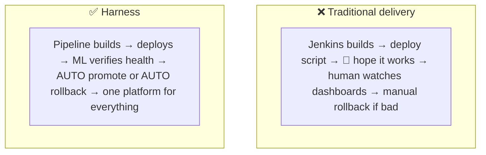

> [!IMPORTANT]
> Getting code to production reliably is genuinely hard, and most teams cobble it together: [[06 Jenkins]] for builds, custom bash/[[03 Helm Charts]] for deploys, manual dashboard-watching for verification, separate tools for feature flags and cost — a fragile, high-toil pipeline where **the riskiest moment (does this deploy break prod?) is handled by a human squinting at graphs.** Harness attacks this on two fronts: **(1) unification** — one platform for CI, CD, flags, IaC, chaos, cost, and security, so you stop integrating a dozen tools; and **(2) intelligence** — ML-driven **Continuous Verification** automates the "is this release healthy?" judgment and self-heals via auto-rollback. The pitch: *faster, safer, less-manual delivery.* For a beginner, think of Harness as "[[07 CICD GitHub Actions|CI/CD]] plus a smart safety net plus a bundle of related delivery tools."

### CI vs CD (quick grounding)

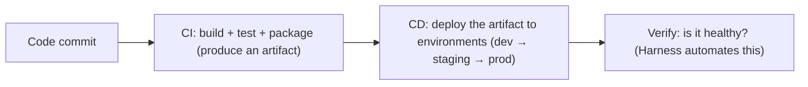

| Term | Meaning |
|---|---|
| **CI (Continuous Integration)** | Build, test, and package code on every change (produce an artifact) |
| **CD (Continuous Delivery/Deployment)** | Automatically deploy artifacts to environments |
| **Continuous Verification** | Automatically confirm a deployment is healthy (Harness's signature) |
| **Pipeline** | The end-to-end automated flow (CI → CD → verify) |
| **GitOps** | Git as the single source of truth for deployment state |

> [!TIP]
> Harness has separate **modules** for each stage (fully covered in [[07 CICD GitHub Actions]] for the general CI/CD concepts). **CI** turns source into a tested artifact; **CD** ships that artifact through environments; **Continuous Verification** is the layer Harness adds on top. The distinction between **Continuous Delivery** (auto-deploy to staging, *manual* approval to prod) and **Continuous Deployment** (fully automated all the way to prod) matters — Harness supports both, and its verification + auto-rollback is precisely what makes *full* Continuous Deployment safe enough to trust.

### The Harness module suite

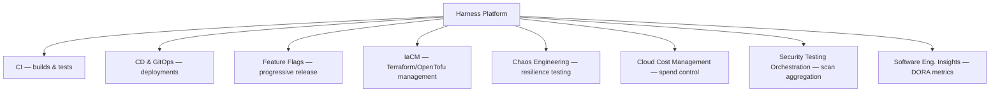

> [!TIP]
> Harness isn't a single tool — it's a **suite of modules** on a common platform, and you adopt the ones you need. The core is **CI** + **CD/GitOps**. Around it: **Feature Flags** (§2.5), **Infrastructure as Code Management** (wraps [[04 Terraform]]/OpenTofu with governance), **Chaos Engineering** (§3.5, deliberately breaking things to test resilience — [[06 Distributed Systems]]), **Cloud Cost Management** (§3.6, FinOps — finding and cutting cloud waste), **Security Testing Orchestration** (aggregating scanner results — [[08-Security-and-Auth/02 Web Security and OWASP Top 10|security]]), and **Software Engineering Insights** (DORA metrics, developer productivity). The strategic idea is a **single control plane for the entire delivery lifecycle** rather than a patchwork — which is Harness's main differentiator versus point tools.

### Real-world analogy ✈️

Harness is like a **modern aircraft's autopilot + flight-management system** vs manually flying:
- Traditional CI/CD is a pilot manually flying, watching every instrument, and deciding by feel when something's wrong.
- Harness's **pipeline** is the flight plan (declared once, as code).
- **Continuous Verification** is the autopilot's sensors continuously checking altitude, speed, and engine health — and *automatically correcting* (or aborting the landing / **rolling back**) if readings go out of safe bounds.
- The **module suite** is the integrated cockpit — navigation, weather, fuel management, collision avoidance — all on one panel instead of separate gadgets.
- The pilot (you) sets the destination and policies; the system handles the safe execution and reacts to problems faster than a human could.

> [!TIP]
> Beginner takeaway: Harness is a **unified software delivery platform** that not only builds and deploys (like [[06 Jenkins]]/[[07 CICD GitHub Actions]]) but **automatically verifies** deployments with ML and **self-heals** via rollback — plus bundles feature flags, IaC, chaos, cost, and security into one place. The headline features to remember: **pipelines-as-code + Continuous Verification + auto-rollback + a unified module suite.**

---

## 2. 🧩 CORE CONCEPTS (Intermediate Level)

### 2.1 Pipelines, Stages, Steps

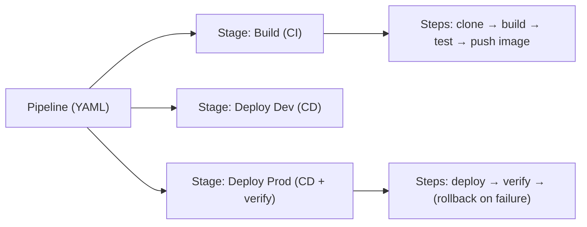

> [!IMPORTANT]
> Harness pipelines follow a **Pipeline → Stages → Steps** hierarchy, defined as **YAML** (pipelines-as-code, versioned in Git). A **pipeline** is the whole flow; a **stage** is a major phase (a CI build stage, a CD deployment stage per environment) with its own infrastructure and settings; a **step** is an individual action (run tests, deploy a [[03 Helm Charts|Helm]] chart, verify, approve). **Steps** can be grouped into **step groups** and run in parallel. This structure mirrors other modern CI/CD ([[07 CICD GitHub Actions]] jobs/steps) but adds CD-specific step types — deployment strategies, verification, approvals, rollback — as first-class citizens. Everything being **declarative YAML** means pipelines are reviewable, reusable via **templates**, and stored in Git (GitOps-friendly). You build pipelines visually in the UI *or* write the YAML directly — they're two views of the same thing.

### 2.2 Connectors, Services, Environments & Infrastructure

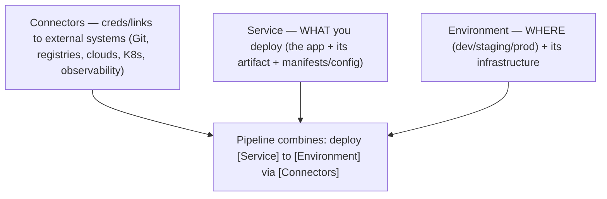

> [!IMPORTANT]
> Harness separates deployment concerns into reusable entities. **Connectors** hold the credentials/links to external systems — your Git repo, container registry, cloud accounts (AWS/GCP/Azure), [[02 Kubernetes]] clusters, [[09-Quality-and-Operations/02 Observability|observability]] tools — configured once and referenced everywhere. A **Service** defines *what* you deploy: the application, its **artifact** source (which image/build), and its manifests/config ([[03 Helm Charts]], K8s YAML, values). An **Environment** defines *where*: dev/staging/prod, each with its **Infrastructure Definition** (the target cluster/namespace/VMs). A pipeline stage then composes these — "deploy *Service X* to *Environment Y*." This **separation of what/where/how** is powerful: the same Service deploys to multiple Environments, and swapping a Connector (e.g., a new cluster) doesn't touch the pipeline logic. It's a cleaner model than [[06 Jenkins]]'s often-hardcoded scripts, promoting reuse across teams.

### 2.3 Deployment Strategies

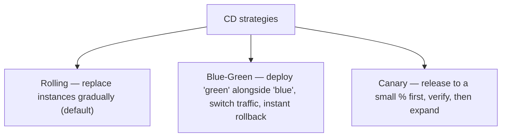

| Strategy | How | Rollback | Best for |
|---|---|---|---|
| **Rolling** | Replace pods/instances batch by batch | Roll back batches | Default, simple, resource-efficient |
| **Blue-Green** | Run new (green) beside old (blue), flip traffic | Instant (flip back) | Zero-downtime, fast rollback, needs 2× resources |
| **Canary** | Send small % of traffic to new version, verify, ramp up | Stop & revert the canary | Risk reduction, gradual validation |

> [!IMPORTANT]
> Harness makes advanced **deployment strategies** first-class (a big step up from a raw `kubectl apply`). **Rolling** gradually replaces old instances with new ones (efficient, some version-mixing during rollout). **Blue-Green** runs the new version ("green") entirely *alongside* the old ("blue"), then switches traffic at the load balancer — giving **instant rollback** (flip traffic back) and zero downtime, at the cost of temporarily doubling resources. **Canary** releases the new version to a *small subset* of traffic/users first, **verifies** it's healthy (this is where Continuous Verification shines — §2.4), then progressively expands — minimizing blast radius if something's wrong. Harness orchestrates these strategies *and integrates verification + auto-rollback into them*, so a canary that fails its health check automatically aborts. Choosing the right strategy per service (risk vs cost vs speed) is core CD design, connecting to [[02 Kubernetes]] and [[03 Microservices]] deployment patterns.

### 2.4 Continuous Verification (the signature feature)

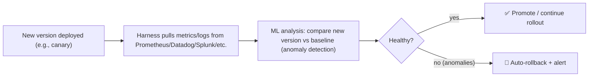

> [!IMPORTANT]
> **Continuous Verification (CV)** is Harness's crown jewel and the thing to know for interviews. After a deployment (especially a canary), Harness automatically **ingests your observability data** ([[09-Quality-and-Operations/02 Observability|Observability]] — metrics, logs, traces from Prometheus, Datadog, New Relic, Splunk, AppDynamics, etc.) and applies **machine-learning analysis** to compare the *new* version's behavior against a **baseline** (the previous version or the canary vs the stable set). It looks for **anomalies** — error-rate spikes, latency regressions, unusual log patterns — and produces a **risk score**. If the new version is healthy, the rollout proceeds; if CV detects a regression, Harness **automatically rolls back** and alerts, *before* most users are affected. This automates the single most error-prone, stressful part of deployment — the human "is it broken?" judgment — replacing gut-feel dashboard-watching with **evidence-based, ML-driven decisions**. It's why Harness pitches "self-healing" deployments and is the clearest articulation of "verified delivery."

### 2.5 Feature Flags

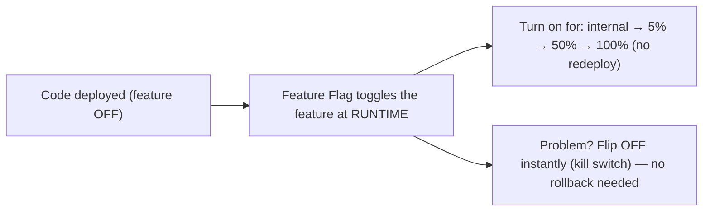

> [!IMPORTANT]
> **Feature Flags** (feature toggles) decouple **deployment** from **release**: you deploy code with a new feature *turned off*, then enable it *at runtime* for specific users/percentages *without redeploying*. This is transformative — you can **progressively roll out** a feature (internal users → 5% → 50% → 100%), **A/B test**, target segments, and most importantly **kill a broken feature instantly** (flip the flag off) without a code rollback or deploy. Harness's Feature Flags module manages flags centrally with targeting rules, and *integrates with pipelines* (a pipeline can flip flags as a step, and CV can trigger a flag kill-switch on anomalies). Feature flags + progressive delivery + verification together = you ship code continuously but *release* cautiously, decoupling the risk of deploying from the risk of exposing. (Caveat: flags add complexity and "flag debt" — stale flags must be cleaned up.) This pairs conceptually with canary deployments (§2.3) as two forms of **progressive delivery**.

### 2.6 SaaS vs Self-Managed & the Delegate

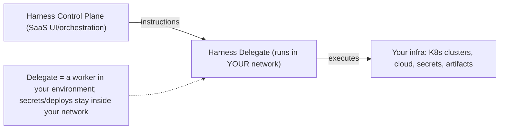

> [!IMPORTANT]
> Harness is primarily **SaaS** (Harness runs the control plane/UI) but with a critical architectural piece: the **Delegate** — a lightweight worker (typically a [[02 Kubernetes]] pod or Docker container) that you install *inside your own network*. The SaaS control plane never directly touches your infrastructure; instead it sends *instructions* to the Delegate, which **executes** them from within your environment — connecting to your clusters, pulling secrets, running deployments. This **outbound-only** model means Harness doesn't need inbound access to your network and your **secrets/credentials never leave your environment** (a key security and compliance point — [[08-Security-and-Auth/02 Web Security and OWASP Top 10|security]]). There's also a fully **Self-Managed (on-prem) Enterprise Edition** for regulated environments that can't use SaaS at all. Understanding the **control-plane-plus-delegate** split is essential — it's how Harness balances SaaS convenience with keeping sensitive operations inside your security perimeter.

---

## 3. ⚙️ ADVANCED CONCEPTS (Senior Level)

### 3.1 GitOps in Harness

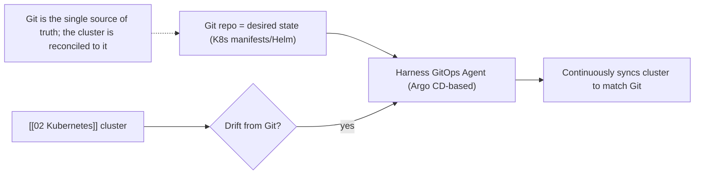

> [!IMPORTANT]
> **GitOps** makes **Git the single source of truth** for your deployed state: your [[02 Kubernetes]] manifests/[[03 Helm Charts]] live in Git, and an agent **continuously reconciles** the actual cluster to match what's in Git — if someone manually changes the cluster (drift), it's detected and reverted; to deploy, you just commit a change and the agent syncs it. Harness's GitOps is built on **Argo CD** (the CNCF standard) with added enterprise governance, RBAC, and integration with its pipelines and verification. The key contrast: **push-based CD** (the traditional model — the pipeline *pushes* changes into the cluster, needing cluster credentials) vs **pull-based GitOps** (an in-cluster agent *pulls* desired state from Git — more secure, self-healing against drift, and auditable via Git history). Harness supports *both*, and often combines them: pipelines for orchestration/verification + GitOps for declarative cluster state. GitOps is a major cloud-native CD paradigm and a common senior discussion point ([[07 CICD GitHub Actions]], [[02 Kubernetes]]).

### 3.2 Templates, Pipeline-as-Code & Reuse

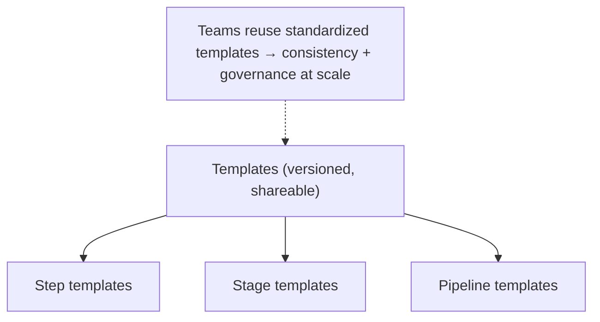

> [!TIP]
> At scale (hundreds of services, many teams), you don't want every team hand-writing pipelines — you want **standardization**. Harness **Templates** let a platform team define reusable **step**, **stage**, and **pipeline** templates (versioned in Git), which product teams then instantiate — so best practices (security scans, verification steps, approval gates) are baked in and enforced centrally. Combined with **pipelines-as-code** (YAML in Git), this gives you **governance without bottlenecks**: teams move fast within guardrails the platform team sets. This "golden path" / paved-road philosophy is central to modern **platform engineering** — Harness positions itself as a platform-engineering tool, and templates are how it delivers consistency across a large [[03 Microservices]] estate without central teams manually reviewing every pipeline.

### 3.3 Policy as Code (OPA) & Governance

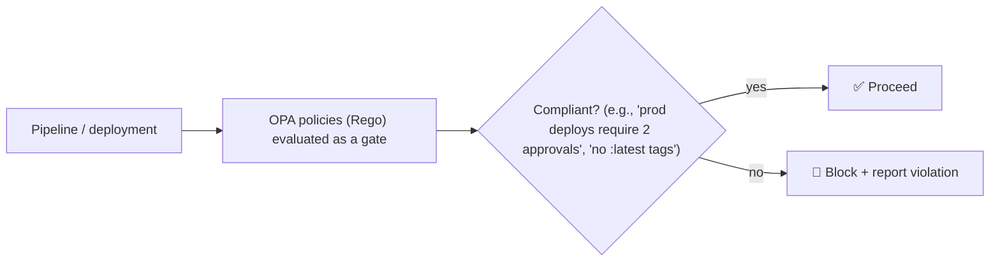

> [!IMPORTANT]
> Harness embeds **Policy as Code** using **Open Policy Agent (OPA)** — you write governance rules in **Rego** that are automatically evaluated as gates in pipelines. Examples: "production deployments require two approvals," "no container images tagged `:latest`," "every service must include a security scan step," "only approved base images." Policies are enforced *automatically* across all pipelines, so compliance and security guardrails aren't dependent on humans remembering them ([[08-Security-and-Auth/02 Web Security and OWASP Top 10|Web Security]] — enforcing secure defaults). This is essential for **enterprise governance at scale** — regulated industries, SOC2/compliance requirements — letting a central team define policy once and have it enforced everywhere, while teams still self-serve. It's the same "shift-left governance" philosophy as OPA in [[02 Kubernetes]] admission control.

### 3.4 Continuous Verification internals & auto-rollback

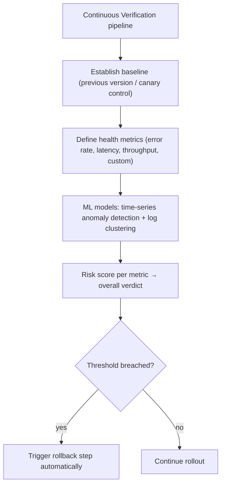

> [!IMPORTANT]
> Digging deeper into CV (§2.4): it works by establishing a **baseline** (the healthy prior version, or the stable pods in a canary), defining **health metrics** (error rate, latency percentiles, throughput, plus custom queries against your [[09-Quality-and-Operations/02 Observability|observability]] stack), and running **ML models** — time-series **anomaly detection** on metrics and **clustering** on logs to spot new/unexpected error patterns. It produces a **risk score**; if it breaches thresholds, Harness **automatically executes the rollback step** defined in the stage. The sophistication: it's not crude static thresholds ("error rate > 5%") but *comparative, learned* analysis (this version behaves anomalously *relative to* the baseline under similar load), reducing false alarms. This closes the deploy→observe→decide→act loop *automatically* — the essence of **self-healing deployments**. Understanding CV as "ML-driven comparative anomaly detection on your observability data, wired to auto-rollback" is the senior-level insight that distinguishes Harness from plain CD tools.

### 3.5 Chaos Engineering

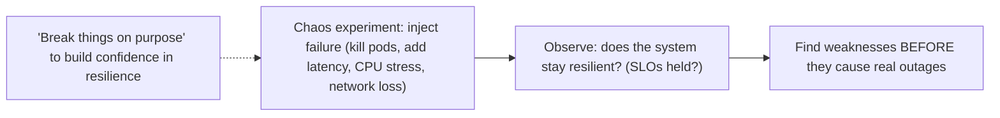

> [!TIP]
> Harness includes **Chaos Engineering** (from its LitmusChaos acquisition) — the practice of *deliberately injecting failures* (killing [[02 Kubernetes]] pods, adding network latency/loss, stressing CPU/memory, simulating zone outages) to verify your system stays resilient *before* a real incident proves it isn't. The philosophy (pioneered by Netflix's Chaos Monkey): **you don't know your system is resilient until you test its failure modes**, so break things *on purpose, in a controlled way*, and observe whether SLOs hold, failover works, and [[06 Distributed Systems]] resilience patterns (retries, circuit breakers, redundancy) actually function. Harness integrates chaos *into pipelines* — you can run a chaos experiment as a pipeline step (a "resilience gate") and even tie it to CV. This connects deeply to [[06 Distributed Systems]] (designing for failure) and [[09-Quality-and-Operations/02 Observability|Observability]] (you must *observe* the experiment's impact) — testing the failure assumptions those guides emphasize.

### 3.6 Cloud Cost Management & failure/pitfalls

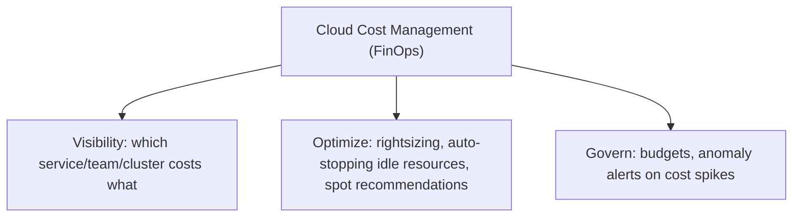

| Pitfall | Cause | Mitigation |
|---|---|---|
| **CV false rollbacks** | Noisy metrics, bad baseline, too-tight thresholds | Tune metrics/thresholds; good baselines |
| **Over-complex pipelines** | Everything crammed into one mega-pipeline | Modular pipelines + templates |
| **Flag debt** | Feature flags never cleaned up | Lifecycle process; remove stale flags |
| **Delegate bottleneck/outage** | Single/under-scaled delegate | Scale + HA delegates |
| **Vendor lock-in concern** | Deep platform coupling | Keep pipelines-as-code portable; standards (OPA, Argo) |
| **Secret sprawl** | Ad-hoc secret handling | Central secret managers via connectors |
| **Cost surprises** | Unmonitored cloud spend | Enable CCM budgets/anomaly alerts |

> [!TIP]
> Harness's **Cloud Cost Management (CCM)** brings **FinOps** into the platform: **visibility** (which service/team/cluster/pipeline is spending what — cost attribution), **optimization** (rightsizing recommendations, **auto-stopping idle** non-prod resources, spot-instance guidance), and **governance** (budgets and **anomaly alerts** on cost spikes). It reflects a reality of cloud-native systems: without active management, [[02 Kubernetes]]/cloud costs balloon from over-provisioning and forgotten resources. On the **pitfalls** side, the most Harness-specific is **CV false rollbacks** — if your metrics are noisy or the baseline/thresholds are poorly chosen, CV can roll back healthy deploys, eroding trust (the tuning here matters, much like avoiding flaky tests in [[01 Testing Strategies]]). The broader caution any platform buyer weighs is **vendor lock-in** — Harness mitigates this by building on open standards (OPA, Argo CD, OpenTofu, LitmusChaos) and keeping pipelines as portable YAML, but deep adoption still creates coupling worth acknowledging.

---

## 4. 🏗️ REAL-WORLD SYSTEM DESIGN USAGE

### 4.1 A full delivery pipeline in Harness

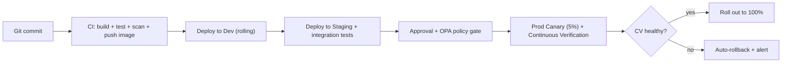

> [!IMPORTANT]
> A realistic end-to-end Harness pipeline shows how the pieces combine: a commit triggers **CI** (build, test, [[08-Security-and-Auth/02 Web Security and OWASP Top 10|security scan]], push image to registry), then **CD** deploys progressively — rolling to Dev, to Staging with integration tests ([[01 Testing Strategies]]), through an **approval + OPA policy gate**, then a **prod canary** (5% of traffic) guarded by **Continuous Verification**. CV analyzes the canary's health against baseline; if healthy, the rollout expands to 100%; if anomalous, it **auto-rolls-back and alerts** — all without human intervention at the risky moment. This is the *whole thesis* of Harness in one diagram: **pipelines-as-code orchestrating progressive, policy-governed, ML-verified, self-healing delivery.** It replaces what would otherwise be [[06 Jenkins]] + shell scripts + manual approvals + dashboard-watching + panicked manual rollbacks with a single declared, automated flow.

### 4.2 Where Harness fits vs Jenkins/GitHub Actions/Argo

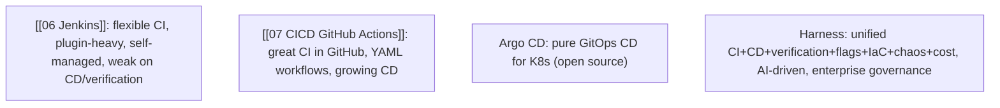

| Tool | Strength | Gap Harness fills |
|---|---|---|
| **[[06 Jenkins]]** | Ultra-flexible CI, huge plugin ecosystem | Weak native CD, no verification, high maintenance |
| **[[07 CICD GitHub Actions]]** | Seamless CI in GitHub | Less advanced CD, no ML verification |
| **Argo CD** | Best-in-class GitOps for K8s | CD-only; no CI, verification, flags, cost |
| **Harness** | Unified platform + AI verification + governance | (its whole pitch) — one place, self-healing, enterprise-ready |

> [!TIP]
> Positioning matters in interviews. **[[06 Jenkins]]** is the incumbent — endlessly flexible via plugins but self-managed, maintenance-heavy, and *weak on modern CD* (no built-in verification, deployment strategies bolted on). **[[07 CICD GitHub Actions]]** excels at CI tightly integrated with GitHub but its CD is less mature. **Argo CD** is the GitOps CD standard for [[02 Kubernetes]] but is *CD-only* (no CI, verification, flags, cost). **Harness** differentiates by being **unified** (the whole lifecycle in one platform), **AI-driven** (Continuous Verification — unique), and **enterprise-focused** (governance, RBAC, policy-as-code, self-managed option). The honest trade-off: Harness is a commercial platform (cost, some lock-in) where the others are free/open — so teams weigh "unified + intelligent + supported" against "free + flexible + more assembly required." Many orgs actually *combine* them (GitHub Actions or Jenkins for CI feeding Harness CD, or Harness wrapping Argo for GitOps).

### 4.3 Adoption patterns & platform engineering

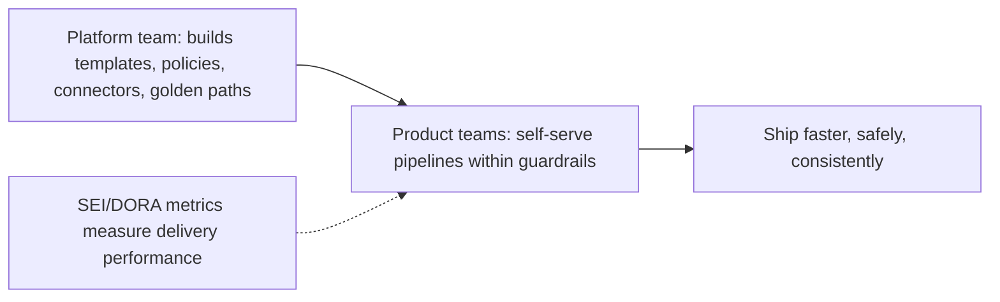

> [!IMPORTANT]
> Harness is fundamentally a **platform engineering** play. The pattern: a central **platform team** builds the golden paths — reusable **templates** (§3.2), **OPA policies** (§3.3), **connectors** to shared infra, and standardized deployment strategies — while **product teams self-serve** their delivery within those guardrails, moving fast without needing to become CD experts or wait on a central ops team. Harness's **Software Engineering Insights** module then measures the outcome via **DORA metrics** (deployment frequency, lead time for changes, change failure rate, mean time to recovery — the industry-standard delivery performance metrics). This reflects the modern org structure: platform teams provide *internal developer platforms* (IDPs) so stream-aligned teams ship autonomously — the same Conway's-Law-aware, team-topology thinking as [[04 Domain-Driven Design]] bounded contexts. Harness sells itself as the engine of this developer-self-service delivery model.

---

## 5. 🎤 INTERVIEW PREPARATION

### 5.1 Most important questions

<details>
<summary><b>Q1: What is Harness and how is it different from Jenkins?</b></summary>

Harness is a unified, AI-driven software delivery platform covering CI, CD, feature flags, IaC, chaos, cost, and security in one place. Versus [[06 Jenkins]] (a flexible but self-managed CI tool with plugin-based, weak native CD and no verification), Harness adds **Continuous Verification** (ML-driven health checks with auto-rollback), first-class deployment strategies (canary/blue-green), pipelines-as-code with templates and OPA governance, and a whole module suite — replacing the "Jenkins + scripts + manual verification + separate tools" patchwork with an integrated, self-healing platform.
</details>

<details>
<summary><b>Q2: Explain Continuous Verification.</b></summary>

After a deployment (often a canary), Harness ingests your observability data (Prometheus, Datadog, Splunk, etc.) and applies ML — time-series anomaly detection on metrics and clustering on logs — to compare the new version against a baseline. It produces a risk score; if the new version shows anomalies (error/latency regressions, new error patterns), Harness **automatically rolls back** and alerts, before most users are affected. It automates the error-prone human "is this release healthy?" judgment with evidence-based decisions — the essence of self-healing deployments.
</details>

<details>
<summary><b>Q3: Rolling vs Blue-Green vs Canary deployments?</b></summary>

**Rolling**: replace instances gradually (efficient, some version mixing). **Blue-Green**: run the new version fully alongside the old, switch traffic at the LB — zero downtime and instant rollback, but ~2× resources. **Canary**: release to a small % of traffic first, verify health, then progressively expand — smallest blast radius, ideal with Continuous Verification. Harness orchestrates all three and integrates verification + auto-rollback into them.
</details>

<details>
<summary><b>Q4: What is the Harness Delegate and why does it matter?</b></summary>

The Delegate is a lightweight worker you install inside your own network (usually a K8s pod). The Harness SaaS control plane sends it instructions; the Delegate executes them locally — connecting to your clusters, secrets, and registries. It's **outbound-only** (no inbound access to your network needed) and keeps secrets/credentials inside your environment. This control-plane-plus-delegate split gives SaaS convenience while keeping sensitive operations within your security perimeter.
</details>

<details>
<summary><b>Q5: How do feature flags relate to deployments?</b></summary>

Feature flags decouple **deployment** from **release** — you deploy code with the feature off, then enable it at runtime for percentages/segments without redeploying. Benefits: progressive rollout, A/B testing, targeting, and an instant kill switch (flip off a broken feature without a code rollback). Combined with canary deployments and Continuous Verification, they let you ship code continuously but release cautiously. The cost is flag debt — stale flags must be cleaned up.
</details>

<details>
<summary><b>Q6: What is GitOps and how does Harness support it?</b></summary>

GitOps makes Git the single source of truth for deployed state: manifests live in Git and an in-cluster agent continuously reconciles the cluster to match, reverting drift and deploying via commits. Harness's GitOps is built on Argo CD with added governance. It contrasts push-based CD (pipeline pushes changes, needs cluster creds) with pull-based GitOps (agent pulls desired state — more secure, self-healing, auditable). Harness supports both and often combines pipelines (orchestration/verification) with GitOps (declarative state).
</details>

<details>
<summary><b>Q7: What is Policy as Code in Harness?</b></summary>

Harness embeds Open Policy Agent (OPA) with policies written in Rego, evaluated automatically as pipeline gates — e.g., "prod deploys need two approvals," "no `:latest` image tags," "every service must run a security scan." This enforces governance and security guardrails automatically across all pipelines without relying on humans to remember them — essential for enterprise compliance and shift-left governance at scale.
</details>

<details>
<summary><b>Q8: When would you NOT choose Harness?</b></summary>

For a small team/simple app where [[07 CICD GitHub Actions]] or a basic pipeline suffices, Harness's platform is overkill (cost and complexity outweigh benefit). If you're all-in on free/open tooling and don't need ML verification or unified governance, Argo CD + GitHub Actions may be enough. Concerns include commercial cost and some vendor lock-in (mitigated by its use of open standards — OPA, Argo, OpenTofu). Harness shines for larger orgs with many services/teams needing unified, governed, verified delivery at scale.
</details>

### 5.2 Tricky questions

> [!TIP]
> **"Does Continuous Verification replace testing?"** — No. Testing ([[01 Testing Strategies]]) validates code *before* deployment; CV validates the *running deployment's real-world behavior* against production traffic/baselines *after* deploy. They're complementary layers — CV catches issues tests can't (production load, real dependencies, config/environment differences), while tests catch logic bugs cheaply before you ever deploy.

> [!TIP]
> **"Deploy vs release — what's the difference in Harness?"** — Deploying puts code on servers; releasing exposes a feature to users. Feature flags decouple them: you can *deploy* code (feature off) many times, then *release* it later by flipping a flag — and un-release instantly via kill switch, independent of deployments. This separation is central to progressive delivery.

> [!TIP]
> **"How does auto-rollback know when to fire?"** — Via Continuous Verification's ML risk score breaching thresholds (not just static rules), comparing the new version to a baseline on your real metrics/logs. If anomalous, it triggers the rollback step. The quality depends on good baselines and tuned metrics — poorly configured, it can cause false rollbacks (the main CV pitfall).

> [!TIP]
> **"Is Harness just a CI/CD tool?"** — No — CI/CD is the core, but Harness is a *platform* spanning feature flags, IaC management, chaos engineering, cloud cost/FinOps, security orchestration, and engineering insights (DORA). The differentiator is unification + AI verification, positioning it as a platform-engineering / internal-developer-platform product, not just a pipeline runner.

### 5.3 Common mistakes candidates make

| Mistake | Reality |
|---|---|
| "Harness is just another Jenkins" | Unified platform + ML verification, not just CI |
| "CV is static threshold alerts" | ML-driven comparative anomaly detection |
| "Feature flags = deployment" | Flags decouple release from deployment |
| "SaaS means my secrets go to Harness" | Delegate keeps secrets in your network |
| "Canary and blue-green are the same" | Canary = % traffic; blue-green = full parallel + switch |
| "GitOps is just CD" | Git as source of truth + drift reconciliation |
| "One mega-pipeline for everything" | Modular pipelines + templates |

### 5.4 What interviewers actually expect

- **What Harness is** (unified AI-driven delivery platform) vs [[06 Jenkins]]/[[07 CICD GitHub Actions]].
- **Continuous Verification** + auto-rollback (the signature feature) — explained as ML anomaly detection on observability data.
- **Deployment strategies** (rolling/blue-green/canary) and when each.
- **Feature flags** and deploy-vs-release decoupling.
- **The Delegate** model (SaaS + in-network worker; secrets stay local).
- **GitOps**, **templates**, and **OPA policy-as-code** for governance.
- The **platform-engineering** framing (self-service delivery + DORA metrics).

---

## 6. 🛠️ HANDS-ON PROJECTS

### Project 1: First Pipeline — CI + CD to Kubernetes (Beginner→Intermediate)

**Goal:** Ship an app end-to-end with Harness.

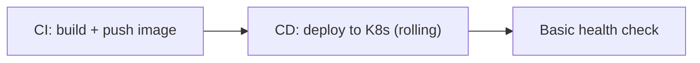

**Steps:**
1. Sign up for Harness (free tier); install a **Delegate** in a local/[[02 Kubernetes]] cluster (minikube/kind).
2. Create **Connectors** (Git, Docker registry, K8s cluster).
3. Build a **CI stage** (build + push a container image).
4. Define a **Service** ([[03 Helm Charts]]/manifest) and **Environment**; add a **CD stage** with a **rolling** deployment.
5. Run the pipeline; watch it build and deploy; inspect the YAML behind the visual pipeline.

**Learn:** delegates, connectors, services/environments, pipeline structure, pipelines-as-code.

---

### Project 2: Canary + Continuous Verification (Intermediate→Senior)

**Goal:** Experience self-healing deployment.

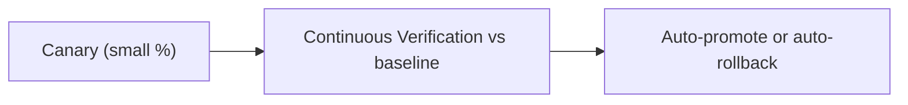

**Steps:**
1. Wire an **observability connector** (Prometheus/Datadog) to Harness.
2. Convert the deploy to a **canary** strategy (deploy to a small subset first).
3. Add a **Continuous Verification** step comparing the canary to baseline metrics.
4. Deploy a **healthy** version → watch CV promote it.
5. Deploy a **deliberately broken** version (inject errors/latency) → watch CV detect anomalies and **auto-rollback**.
6. Tune metrics/thresholds to reduce false positives.

**Learn:** canary deployments, Continuous Verification, ML analysis, auto-rollback, threshold tuning.

---

### Project 3: Governance, Flags & GitOps at Scale (Senior)

**Goal:** Platform-engineering setup.

```mermaid
flowchart TB
    Templates2["Reusable pipeline templates"]
    OPA2["OPA policies (approval gates, image rules)"]
    Flags2["Feature flag with progressive rollout + kill switch"]
    GitOps2["GitOps app synced from Git"]
```

**Steps:**
1. Create a reusable **pipeline template** and have two "services" instantiate it.
2. Write **OPA policies** (e.g., block `:latest` tags, require approval for prod) and see them gate a pipeline.
3. Add a **feature flag**; roll a feature out 5% → 50% → 100%; trigger the **kill switch**.
4. Set up a **GitOps** application (Argo-based); change Git and watch the cluster reconcile; manually drift the cluster and watch it revert.
5. Explore **DORA metrics** (SEI) and **Cloud Cost** visibility.

**Learn:** templates, policy-as-code, feature flags, GitOps/drift reconciliation, DORA metrics, FinOps.

---

## 7. 🔬 DEEP DIVE: INTERNALS

### 7.1 The Delegate execution model

```mermaid
flowchart LR
    CP["Control Plane (SaaS): stores config, orchestrates, UI"] -->|"polls for tasks (outbound)"| Delegate2["Delegate (in your network)"]
    Delegate2 --> Exec["Executes: kubectl/helm/terraform, pulls secrets, calls APIs"]
    Delegate2 -->|"reports status/logs back"| CP
    Note["Delegate POLLS the control plane (outbound-only) — no inbound firewall holes"] -.-> Delegate2
```

> [!IMPORTANT]
> The **Delegate** is the architectural key to Harness's security model. It runs in *your* environment and **polls** the control plane for tasks over an **outbound** connection — meaning you never open inbound firewall ports to Harness, a major security and compliance win ([[08-Security-and-Auth/02 Web Security and OWASP Top 10|Web Security]] — minimize attack surface). When a pipeline needs to deploy, the control plane queues a task; the Delegate picks it up, executes it *locally* (running `kubectl`/`helm`/`terraform`, fetching secrets from *your* secret manager, calling *your* cloud APIs), and reports status/logs back. Crucially, **secrets and sensitive operations stay inside your network** — Harness orchestrates but the Delegate does the actual touching of infrastructure. Delegates should be run **highly available** (multiple replicas) since they're the execution bottleneck — a down Delegate stalls deployments. This poll-based, in-network-worker pattern is how Harness (and similar SaaS ops tools) reconcile "managed SaaS convenience" with "don't expose my infrastructure."

### 7.2 How CV's ML actually classifies risk

```mermaid
flowchart TB
    Data["Time-series metrics + log streams"] --> Baseline2["Baseline window (prior version / control group)"]
    Baseline2 --> Compare["Statistical + ML comparison of new vs baseline distributions"]
    Compare --> Metrics2["Metric anomalies (latency/error/throughput deviations)"]
    Compare --> Logs2["Log clustering: detect NEW/unexpected message clusters"]
    Metrics2 & Logs2 --> Risk["Combined risk score → pass/fail verdict"]
```

> [!TIP]
> Continuous Verification's intelligence lies in **comparative analysis**, not absolute thresholds. For **metrics**, it compares the new version's time-series (latency percentiles, error rates, throughput) against a **baseline window** using statistical/ML methods — flagging *deviations in behavior relative to the known-good version under similar conditions*, which catches regressions that a fixed threshold would miss (e.g., latency that's "within limits" but doubled vs baseline). For **logs**, it uses **clustering** to group log messages into patterns and detects *new or newly-frequent clusters* — surfacing novel error messages or stack traces the new version introduced, without you predefining what to look for. Combining metric and log signals into a **risk score** gives a holistic verdict. The reason this beats static alerting: it adapts to *your* baseline and reduces false positives from normal variation, while catching subtle regressions. (It's not magic — noisy signals or bad baselines still degrade it, hence tuning matters — §3.6.) This is applied ML for ops, conceptually akin to the anomaly detection in [[09-Quality-and-Operations/02 Observability|Observability]] / AIOps.

### 7.3 Pipeline execution & the entity graph

```mermaid
flowchart LR
    YAML["Pipeline YAML (Git)"] --> Resolve["Resolve references: templates, services, environments, connectors, secrets, variables"]
    Resolve --> Plan["Build execution plan (stages → step groups → steps, with parallelism)"]
    Plan --> Dispatch["Dispatch steps to Delegates"]
    Dispatch --> State["Track state, expressions, outputs between steps"]
```

> [!TIP]
> A Harness pipeline is more than linear YAML — at runtime it's **resolved into an execution graph**. References to reusable entities (templates, Services, Environments, Connectors, secrets) are resolved, **variables and expressions** (Harness has an expression language — `<+pipeline.variables.x>`, `<+artifact.tag>`) are evaluated, and an **execution plan** of stages → step groups → steps (with parallel branches, conditional execution, failure strategies) is built and dispatched to Delegates. **Outputs from one step flow to later steps** (e.g., the image tag built in CI feeds the CD deploy). **Failure strategies** are declarative (retry, ignore, rollback, manual intervention) per step/stage — so rollback isn't ad-hoc scripting but a first-class configured behavior. Understanding that the declarative YAML is compiled into a stateful, expression-driven execution graph (with entity reuse and typed failure handling) explains how Harness achieves reuse and reliability that hand-rolled [[06 Jenkins]] Groovy scripts struggle with.

### 7.4 Progressive delivery: canary + flags + verification together

```mermaid
flowchart LR
    Deploy3["Deploy new version (dark/canary)"] --> Flag3["Feature flag gates exposure"]
    Flag3 --> CV3["CV monitors as exposure increases"]
    CV3 --> Ramp{"Healthy at each step?"}
    Ramp -->|"yes"| More["Increase % (traffic and/or flag)"]
    Ramp -->|"no"| Halt["Halt: rollback deploy OR kill flag"]
```

> [!IMPORTANT]
> The senior synthesis: **progressive delivery** is the umbrella combining **canary deployments** (gradually shifting *traffic*), **feature flags** (gradually exposing *features* at runtime), and **Continuous Verification** (gating each increment on *measured health*). Harness lets you compose these: deploy a version to a canary, expose its new feature via a flag to a small segment, let CV watch the metrics, and *automatically* ramp exposure up (more traffic %, more flag targeting) only while health holds — halting via **rollback** (infrastructure) or **kill switch** (feature) at the first sign of trouble. This is the state of the art in safe delivery: change reaches users *incrementally and reversibly*, with automated, evidence-based gates at each step, so the blast radius of any bad change is tiny and containment is instant. It operationalizes the [[06 Distributed Systems]] principle of designing for failure and the [[01 Testing Strategies]] idea of catching problems as early (and cheaply) as possible — here, catching them in production with minimal exposure rather than in a big-bang release.

### 7.5 Where Harness sits in the CNCF/cloud-native landscape

```mermaid
flowchart TB
    Open["Built ON open standards"] --> Argo2["Argo CD (GitOps)"]
    Open --> OPA2b["OPA (policy)"]
    Open --> Tofu["OpenTofu/Terraform (IaC — [[04 Terraform]])"]
    Open --> Litmus["LitmusChaos (chaos)"]
    Harness3["Harness = commercial platform integrating + governing these + adding AI/CV + enterprise features"]
```

> [!TIP]
> A nuanced point that shows landscape awareness: Harness deliberately **builds on open-source/CNCF standards** rather than reinventing them — its GitOps is **Argo CD**, its policy engine is **OPA**, its IaC wraps **Terraform/OpenTofu** ([[04 Terraform]]), its chaos is **LitmusChaos**. Harness's value-add is **integration, governance, AI (Continuous Verification), and enterprise features** (RBAC, SSO, support, unified UI, self-managed option) layered on top. This is strategically smart: it lowers lock-in fears (your GitOps is standard Argo; your policies are portable Rego) while selling the "batteries-included, governed, intelligent" experience. It also means learning Harness teaches you *transferable* cloud-native concepts (GitOps, policy-as-code, progressive delivery) — the same primitives underpinning [[02 Kubernetes]] and the broader ecosystem. For interviews, framing Harness as "a commercial platform that unifies and adds intelligence *over* open cloud-native standards" is a mature, accurate characterization.

---

## ✅ Production Checklists

### Pipelines & Delivery
- [ ] Pipelines defined **as-code** (YAML in Git), not click-ops only
- [ ] Reusable **templates** for standard flows; avoid mega-pipelines
- [ ] Appropriate **deployment strategy** per service (rolling/blue-green/canary)
- [ ] **Approval gates** + **OPA policies** on production
- [ ] **Rollback / failure strategies** configured per stage

### Verification & Safety
- [ ] **Continuous Verification** wired to your [[09-Quality-and-Operations/02 Observability|observability]] stack
- [ ] Good **baselines** + tuned thresholds (avoid false rollbacks)
- [ ] **Feature flags** for risky features + kill-switch runbook
- [ ] Flag **lifecycle/cleanup** process (avoid flag debt)
- [ ] Chaos experiments validate resilience of critical services

### Platform & Ops
- [ ] **Delegates** run HA (multiple replicas); monitored
- [ ] **Secrets** via central secret managers (connectors), not inline
- [ ] **RBAC** + SSO configured; least privilege
- [ ] **Cloud Cost** budgets + anomaly alerts enabled
- [ ] **DORA metrics** tracked to measure delivery performance

---

## 🗺️ Learning Roadmap

```mermaid
flowchart TB
    A["1️⃣ CI/CD basics<br/>pipelines, stages, steps"] --> B["2️⃣ Harness entities<br/>connectors, services, environments, delegate"]
    B --> C["3️⃣ Deployment strategies<br/>rolling/blue-green/canary"]
    C --> D["4️⃣ Continuous Verification<br/>observability + ML + auto-rollback"]
    D --> E["5️⃣ Progressive delivery<br/>feature flags, deploy vs release"]
    E --> F["6️⃣ Governance<br/>templates, OPA policy-as-code, RBAC"]
    F --> G["7️⃣ GitOps + advanced modules<br/>Argo, IaCM, chaos, cost"]
    G --> H["8️⃣ Platform engineering<br/>golden paths, DORA, self-service at scale"]
```

| Stage | Focus | You can... |
|---|---|---|
| 1–2 | Basics + entities | Build and run a pipeline |
| 3–4 | Strategies + CV | Do canary + verified auto-rollback |
| 5–6 | Progressive + governance | Flags, policies, templates |
| 7–8 | GitOps + platform | Run governed self-service delivery at scale |

---

## 🔁 Self-Review Completion Loop

Reviewed against Harness docs, CNCF/GitOps (Argo) and OPA references, DORA research, and continuous-delivery literature.

### Gap Review Matrix

| Dimension | Covered? | Where |
|---|---|---|
| What Harness is / problem | ✅ | §1 |
| CI vs CD vs verification | ✅ | §1 |
| Module suite | ✅ | §1 |
| Pipelines/stages/steps | ✅ | §2.1 |
| Connectors/services/environments | ✅ | §2.2 |
| Deployment strategies | ✅ | §2.3 |
| Continuous Verification | ✅ | §2.4, §3.4, §7.2 |
| Feature flags | ✅ | §2.5 |
| SaaS + Delegate model | ✅ | §2.6, §7.1 |
| GitOps | ✅ | §3.1 |
| Templates / pipeline-as-code | ✅ | §3.2 |
| Policy as Code (OPA) | ✅ | §3.3 |
| Chaos engineering | ✅ | §3.5 |
| Cloud cost / FinOps | ✅ | §3.6 |
| Pitfalls | ✅ | §3.6 |
| Full pipeline example | ✅ | §4.1 |
| vs Jenkins/GHA/Argo | ✅ | §4.2 |
| Platform engineering / DORA | ✅ | §4.3 |
| Delegate internals | ✅ | §7.1 |
| CV ML internals | ✅ | §7.2 |
| Execution graph | ✅ | §7.3 |
| Progressive delivery synthesis | ✅ | §7.4 |
| CNCF landscape | ✅ | §7.5 |
| Interview Q&A + mistakes | ✅ | §5 |
| Hands-on projects | ✅ | §6 |

> [!NOTE]
> **Remaining depth to explore independently:** Harness expression language details, the Harness CI "Hosted" vs self-hosted build infra, secret manager integrations (Vault/cloud KMS), RBAC/resource-group model, multi-service & multi-environment deployments, Harness IDP (Internal Developer Portal / Backstage-based), Harness AIDA (AI assistant), migration from [[06 Jenkins]]/Spinnaker, Terraform provider for Harness (managing Harness itself as code), pipeline triggers/webhooks, and comparison with Spinnaker, GitLab CI, and CircleCI. General CI/CD fundamentals are in [[07 CICD GitHub Actions]].

---

## 📚 Official References

| Resource | Source |
|---|---|
| Harness Developer Hub (docs) | https://developer.harness.io/ |
| Harness — Continuous Verification | https://developer.harness.io/docs/continuous-delivery/verify/ |
| Harness University (free training/certs) | https://university.harness.io/ |
| Argo CD (GitOps foundation) | https://argo-cd.readthedocs.io/ |
| Open Policy Agent (policy engine) | https://www.openpolicyagent.org/ |
| DORA / Accelerate metrics | https://dora.dev/ |
| LitmusChaos (chaos engineering) | https://litmuschaos.io/ |
| *Continuous Delivery* — Humble & Farley | Foundational book |

---

## 🎁 Final Summary

> [!IMPORTANT]
> **The one-paragraph takeaway:** Harness is a unified, AI-driven **software delivery platform** that takes code from commit to production and manages the whole lifecycle around it — **CI**, **CD**, **feature flags**, **IaC**, **chaos**, **cloud cost**, and **security** — as **pipelines-as-code** (YAML in Git), replacing the fragile "[[06 Jenkins]] + scripts + separate tools + manual verification" patchwork with one governed platform. Its signature and most interview-critical feature is **Continuous Verification**: after a deploy (typically a **canary**), Harness ingests your [[09-Quality-and-Operations/02 Observability|observability]] data and applies **ML — comparative anomaly detection on metrics and clustering on logs vs a baseline** — to produce a risk score and **automatically roll back** if the release is unhealthy, turning the riskiest, most manual moment of delivery into an evidence-based, self-healing decision. It supports **rolling, blue-green, and canary** deployment strategies as first-class citizens, and combines them with **feature flags** (which decouple *deployment* from *release* — deploy code off, enable at runtime, kill instantly) into **progressive delivery**, where change reaches users incrementally and reversibly with automated health gates at each step. Architecturally, Harness is **SaaS control plane + in-network Delegate** — the Delegate polls outbound and executes deployments locally, so **secrets and infra access never leave your network**. For scale and governance it offers **templates** (reusable pipelines), **OPA policy-as-code** (Rego rules enforced as gates), **GitOps** (Argo-based, Git as source of truth with drift reconciliation), RBAC, and **DORA metrics** — positioning it as a **platform-engineering** tool where a central team provides golden paths and product teams self-serve delivery within guardrails. Smartly, it **builds on open standards** (Argo, OPA, OpenTofu, LitmusChaos) and layers integration + AI + enterprise features on top, which lowers lock-in and makes the concepts transferable. The honest trade-off vs free/open tools ([[07 CICD GitHub Actions]], Argo CD): Harness costs money and adds some coupling, but delivers **unified, intelligent, governed, self-healing delivery** that's compelling for larger organizations running many [[03 Microservices]] across many teams.

**Golden rules:**
1. 🛡️ Harness = **unified AI-driven delivery platform** (CI+CD+flags+IaC+chaos+cost+security), not just CI.
2. 🤖 **Continuous Verification** = ML anomaly detection on observability data → **auto-rollback** (the signature feature).
3. 🐤 Prefer **canary + verification** for risky changes — smallest blast radius, evidence-based promotion.
4. 🚩 **Feature flags decouple deploy from release** — ship code off, enable at runtime, kill instantly.
5. 🔌 The **Delegate** runs in your network (outbound-only) — **secrets stay local**.
6. 📜 Enforce governance with **OPA policy-as-code** and reusable **templates**.
7. 🔄 **GitOps** (Argo) = Git as source of truth + drift reconciliation; complements pipelines.
8. 📈 It's a **platform-engineering** play — golden paths + self-service + **DORA metrics**.
9. 🧱 Built on **open standards** (Argo/OPA/OpenTofu/Litmus) — lowers lock-in, transferable skills.
10. ⚖️ Worth it for **scale & governance**; overkill for simple apps where [[07 CICD GitHub Actions]] suffices.

---

*Related guides in this vault: [[06 Jenkins]] · [[07 CICD GitHub Actions]] · [[02 Kubernetes]] · [[03 Helm Charts]] · [[04 Terraform]] · [[03 Microservices]] · [[09-Quality-and-Operations/02 Observability|Observability]] · [[06 Distributed Systems]] · [[01 Testing Strategies]] · [[08-Security-and-Auth/02 Web Security and OWASP Top 10|Web Security and OWASP Top 10]]*
