# 🔐 OAuth2 / OIDC / JWT — Complete Beginner-to-Expert Reference

> How modern authentication and authorization *actually* work — delegated access with **OAuth2**, identity with **OpenID Connect**, and self-contained tokens with **JWT**. Flows, grants, PKCE, token validation, refresh rotation, and the security pitfalls that break real systems.

---

## 📑 Table of Contents

1. [Executive Summary](#-executive-summary)
2. [Fundamentals (Beginner)](#1--fundamentals-beginner-level)
3. [Core Concepts (Intermediate)](#2--core-concepts-intermediate-level)
4. [Advanced Concepts (Senior)](#3--advanced-concepts-senior-level)
5. [Real-World System Design](#4--real-world-system-design-usage)
6. [Interview Preparation](#5--interview-preparation)
7. [Hands-On Projects](#6--hands-on-projects)
8. [Deep Dive: Internals](#7--deep-dive-internals)
9. [Production Checklists](#-production-checklists)
10. [Learning Roadmap](#-learning-roadmap)
11. [Self-Review Completion Loop](#-self-review-completion-loop)
12. [Official References](#-official-references)
13. [Final Summary](#-final-summary)

---

## 🎯 Executive Summary

Three technologies, three distinct jobs, constantly confused:

| Technology | What it does | The one-liner |
|---|---|---|
| **OAuth2** | **Authorization** — delegated access | "Let App X access my data on Service Y without giving X my password" |
| **OpenID Connect (OIDC)** | **Authentication** — identity | "Prove *who* the user is" (a layer *on top of* OAuth2) |
| **JWT** | **Token format** — self-contained claims | "A signed, tamper-proof JSON token you can verify without a database lookup" |

> [!IMPORTANT]
> The single most important distinction — and the #1 interview trap: **OAuth2 is about authorization (what you can access), NOT authentication (who you are).** OAuth2 was designed to let a third-party app get *delegated access* to your resources (your Google contacts, your GitHub repos) without seeing your password. People misused it for login, so **OpenID Connect (OIDC)** was built *as a thin identity layer on top of OAuth2* to do authentication *properly* (adding the **ID Token**). Meanwhile **JWT** is just a *token format* — a signed JSON blob — that OAuth2/OIDC often (but not always) use to represent tokens. So: **OAuth2 = delegated authorization protocol, OIDC = authentication built on OAuth2, JWT = a self-contained token format used by both.** Getting these three straight is the foundation; conflating them is the most common mistake engineers make. This guide connects directly to [[10 Spring Security]], [[11 Spring Boot Authentication]], and [[06 API Gateway]].

Related guides: [[10 Spring Security]] · [[11 Spring Boot Authentication]] · [[06 API Gateway]] · [[02 REST API Design]] · [[03 Microservices]] · [[01 System Design Fundamentals]] · [[05 WebSockets]]

---

## 1. 🌱 FUNDAMENTALS (Beginner Level)

### AuthN vs AuthZ — the two words everything hinges on

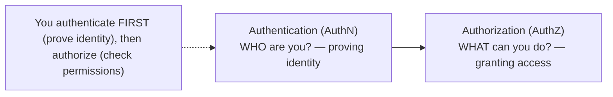

| Concept | Question | Example |
|---|---|---|
| **Authentication** | Who are you? | Logging in with email + password |
| **Authorization** | What are you allowed to do? | "This user can read but not delete" |

> [!IMPORTANT]
> **Authentication** answers *"who are you?"* (identity); **Authorization** answers *"what are you allowed to do?"* (permissions). You authenticate *first*, then authorize. This pair is the bedrock: **OIDC handles authentication, OAuth2 handles authorization.** Every confusion in this space traces back to blurring these. Say them out loud until it's automatic — interviewers deliberately probe whether you mix them up.

### The problem OAuth2 solves: the "password anti-pattern"

Imagine a photo-printing app wants to access your Google Photos. The naive (terrible) solution: give the app your Google *password*. Now the app can do *anything* — read your email, delete your account — and you can't revoke it without changing your password everywhere.

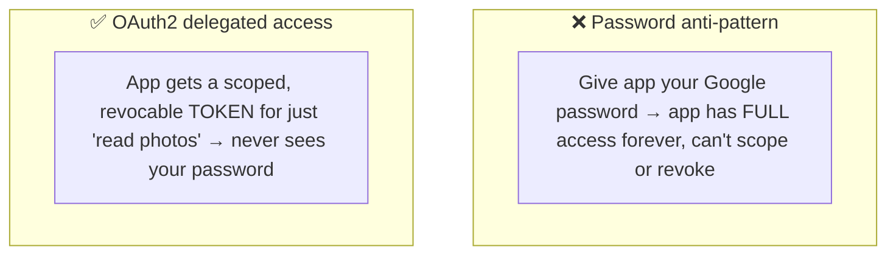

> [!IMPORTANT]
> OAuth2 exists to kill the **password anti-pattern**. Before OAuth2, sharing access meant sharing credentials — giving a third party your password, which grants *total, unrevocable, unscoped* access. OAuth2 introduces **delegated authorization**: you authenticate directly with the trusted service (Google), which issues the app a **limited, scoped, revocable access token** (e.g., "read photos only, expires in 1 hour"). The app never sees your password, can only do what you consented to, and you can revoke it anytime. This is the "Login with Google/GitHub/Facebook" and "Connect your account" magic — delegated access via tokens, not shared passwords.

### The four OAuth2 roles

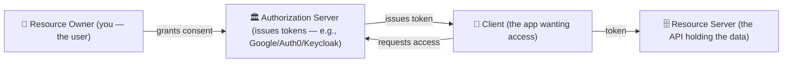

| Role | Who it is |
|---|---|
| **Resource Owner** | The user who owns the data |
| **Client** | The application requesting access |
| **Authorization Server** | Authenticates the user, issues tokens (the "IdP") |
| **Resource Server** | The API that hosts protected resources |

### Real-world analogy 🏨

OAuth2 is like a **hotel key card**:
- You (**resource owner**) check in at the **front desk** (**authorization server**) with your ID.
- The desk issues a **key card** (**access token**) — scoped (opens *your* room + gym, not other rooms), time-limited (expires at checkout), and revocable (deactivated if lost).
- The **door lock** (**resource server**) checks the card — it doesn't need to know your identity or call the front desk each time; it just validates the card.
- The **hotel app on your phone** (**client**) holds the card to open doors on your behalf.
- Crucially: the key card is **not your ID/password** — losing it doesn't compromise your identity, and the desk can revoke just that card.

> [!TIP]
> Beginner takeaway: OAuth2 replaces "share your password" with "get a scoped, expiring, revocable **token**." Four roles pass tokens around so an app can act on your behalf *without* your credentials. **OIDC** adds "...and here's a verified statement of *who* the user is" (the ID token). **JWT** is a common way to *encode* those tokens so they're self-verifiable. The rest of this guide is *how* the tokens get issued (flows) and *how* they're validated safely.

---

## 2. 🧩 CORE CONCEPTS (Intermediate Level)

### 2.1 The Authorization Code Flow (the main one)

This is the standard, most secure flow for web/mobile apps where a user is present.

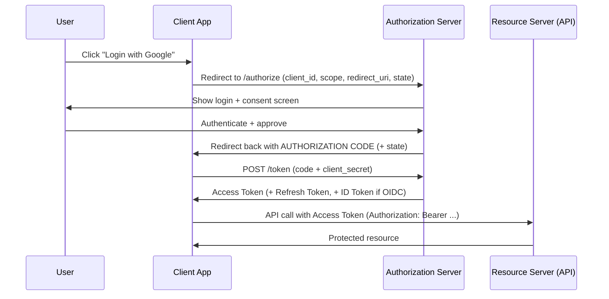

> [!IMPORTANT]
> The **Authorization Code flow** has a two-step design that's often misunderstood. Step 1: the user is redirected to the authorization server, logs in, consents, and the server redirects back with a short-lived **authorization code** (through the browser). Step 2: the client exchanges that code (via a *back-channel* server-to-server call, including its `client_secret`) for the actual **tokens**. **Why two steps?** So the powerful tokens never travel through the browser/URL (where they'd be logged or leaked) — only the one-time code does, and exchanging it requires the client secret that only the server knows. This front-channel (browser redirect) + back-channel (server token exchange) split is the security heart of OAuth2. The `state` parameter prevents CSRF (§3.6).

### 2.2 The token types

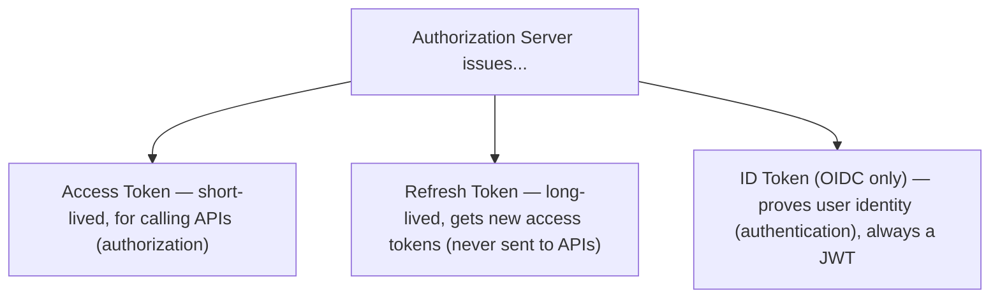

| Token | Purpose | Audience | Lifetime |
|---|---|---|---|
| **Access Token** | Call protected APIs | Resource Server | Short (mins–1hr) |
| **Refresh Token** | Obtain new access tokens | Authorization Server | Long (days–months) |
| **ID Token** (OIDC) | Assert user identity | The Client | Short |

> [!WARNING]
> A critical distinction candidates botch: **the ID Token and the Access Token have different audiences and purposes.** The **ID Token** (OIDC) is *for the client* — it tells your app "this user is Alice, verified at this time." Your app reads it to know who logged in. The **Access Token** is *for the resource server/API* — it's a credential to *access* resources; your client should treat it as opaque and just forward it. **Never use an ID token to call an API, and never try to read/trust an access token's contents in the client.** Mixing these up is a real security bug. The **refresh token** is the most sensitive — it's long-lived and only ever sent to the authorization server, never to APIs.

### 2.3 Scopes & Consent

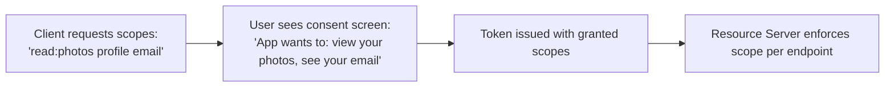

> [!TIP]
> **Scopes** are the mechanism for *least-privilege* delegated access — they define *what* the token can do (`read:photos`, `write:repo`, `profile`). The client requests scopes, the user sees them on the **consent screen** and approves (or not), and the token is minted with the granted scopes. The resource server then enforces them per endpoint (this endpoint needs `write:repo`). Scopes are *coarse-grained authorization* — they're about API-level permissions, not fine-grained business rules (that "this user can edit *this specific* document" logic stays in your app). Requesting minimal scopes is both good security and better UX (users trust apps that ask for less).

### 2.4 What is a JWT? (structure)

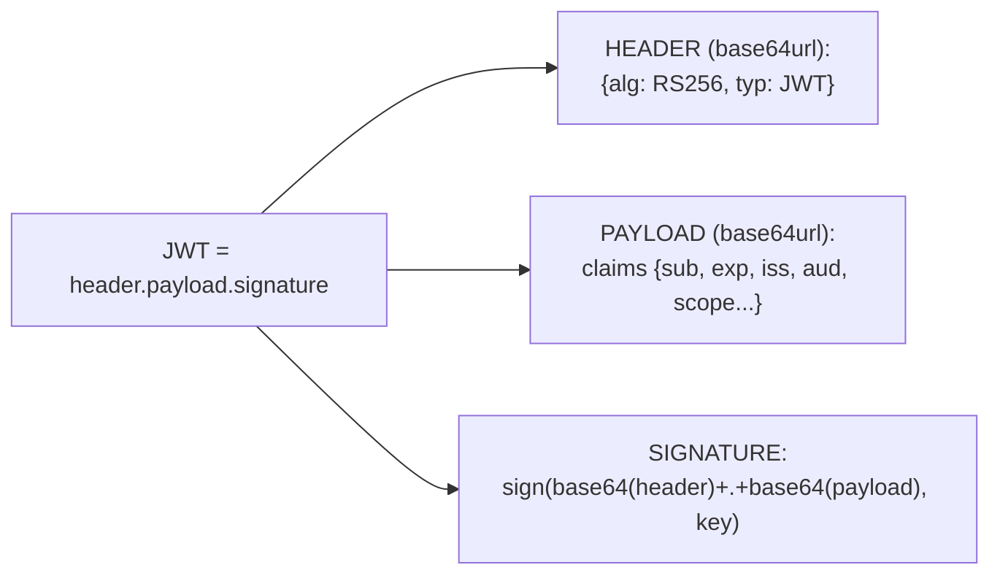

```
eyJhbGciOiJSUzI1NiIsInR5cCI6IkpXVCJ9   ← header
.eyJzdWIiOiIxMjMiLCJuYW1lIjoiQWxpY2UifQ  ← payload (claims)
.SflKxwRJSMeKKF2QT4fwpMeJf36POk6yJV_adQ  ← signature
```

> [!IMPORTANT]
> A **JWT** (JSON Web Token) has three base64url-encoded parts separated by dots: **header** (algorithm + type), **payload** (the **claims** — data like `sub` [subject/user id], `exp` [expiry], `iss` [issuer], `aud` [audience], plus custom claims), and **signature** (a cryptographic signature over the header+payload). The killer feature: because it's **signed**, anyone with the key can verify it *wasn't tampered with* — so a resource server can validate a token and trust its claims **without a database lookup or a call back to the auth server**. This makes JWTs **stateless** and perfect for [[03 Microservices]] (each service self-validates). ⚠️ But note: **base64 is encoding, NOT encryption** — anyone can *read* a JWT's payload (paste it into jwt.io). The signature prevents *forgery*, not *reading*. So **never put secrets in a JWT.**

### 2.5 JWT Signing: HMAC vs RSA

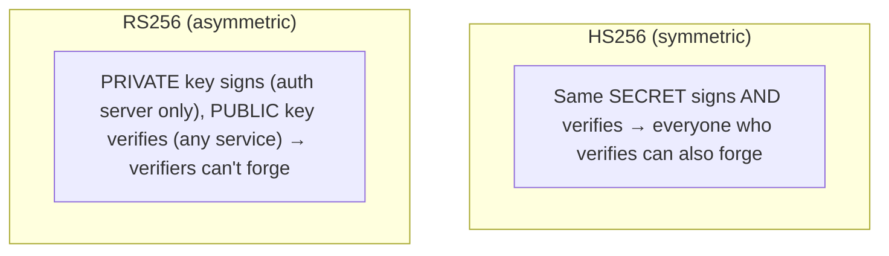

> [!IMPORTANT]
> How a JWT is signed determines who can verify vs forge it. **HS256 (HMAC, symmetric)** uses one shared secret for both signing and verifying — simple, but *anyone who can verify can also forge* tokens, so the secret must never leave trusted parties (bad for distributed systems). **RS256 (RSA, asymmetric)** uses a **private key** to sign (held only by the authorization server) and a **public key** to verify (freely distributed to all resource servers). This is the standard for real systems: dozens of [[03 Microservices]] can independently verify tokens using the public key, but none can mint fake tokens (only the auth server has the private key). The public keys are published at a **JWKS endpoint** (§3.3). Choosing HS256 in a multi-service system is a classic design mistake.

### 2.6 Stateless JWT vs Stateful Sessions

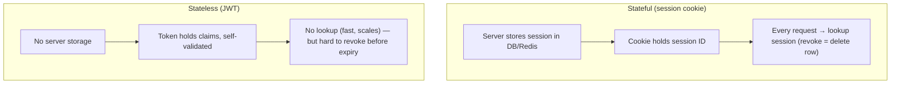

> [!WARNING]
> The **stateless vs stateful** trade-off is a central design decision. **Stateful sessions** store session data server-side ([[04 Redis]]/DB) and give the client a session ID — easy to revoke instantly (delete the session), but every request needs a lookup and you need shared session storage across servers. **Stateless JWTs** carry all needed data signed in the token — no lookup, scales beautifully across [[03 Microservices]] — **but you can't easily revoke a JWT before it expires** (there's no server-side record to delete; the token is valid until `exp`). This is JWT's biggest weakness. Mitigations: **short access-token lifetimes** (5–15 min, so a leaked token dies fast) + **refresh tokens**, plus a **revocation/deny-list** ([[04 Redis]]) for emergencies. The pragmatic pattern: stateless JWT access tokens + a stateful refresh mechanism — best of both.

---

## 3. ⚙️ ADVANCED CONCEPTS (Senior Level)

### 3.1 The Grant Types (which flow when?)

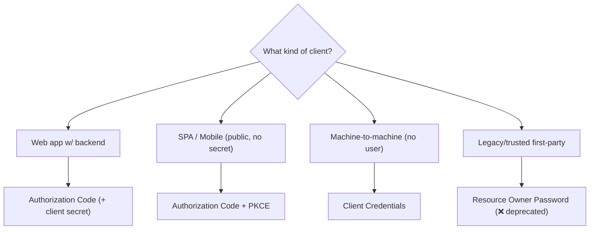

| Grant | Use case | Status |
|---|---|---|
| **Authorization Code** | Server-side web apps | ✅ Standard |
| **Authorization Code + PKCE** | SPAs, mobile, all public clients | ✅ Recommended default |
| **Client Credentials** | Machine-to-machine (no user) | ✅ For service-to-service |
| **Refresh Token** | Renewing access tokens | ✅ Standard |
| **Implicit** | (old SPA flow) | ❌ Deprecated (insecure) |
| **Resource Owner Password** | Direct username/password | ❌ Deprecated (avoid) |

> [!IMPORTANT]
> **Modern guidance (OAuth 2.1) has consolidated the flows.** Use **Authorization Code + PKCE** for *all* interactive clients (web, SPA, mobile) — PKCE (§3.2) makes it safe even for clients that can't hold a secret. Use **Client Credentials** for machine-to-machine (a service calling another service with no user involved — the service itself authenticates with its own id/secret). The **Implicit flow** (tokens returned directly in the redirect URL) is **deprecated** — it exposed tokens in browser history/logs. The **Resource Owner Password Credentials** grant (client collects the raw password) is **deprecated** — it defeats OAuth2's whole purpose (the password anti-pattern returns). Knowing *which grant for which client type* — and that Implicit/ROPC are dead — is exactly what senior interviews test.

### 3.2 PKCE — securing public clients

Public clients (SPAs, mobile apps) can't safely store a `client_secret` (it'd be in the JS bundle / app binary). **PKCE** (Proof Key for Code Exchange) secures the code flow without a secret.

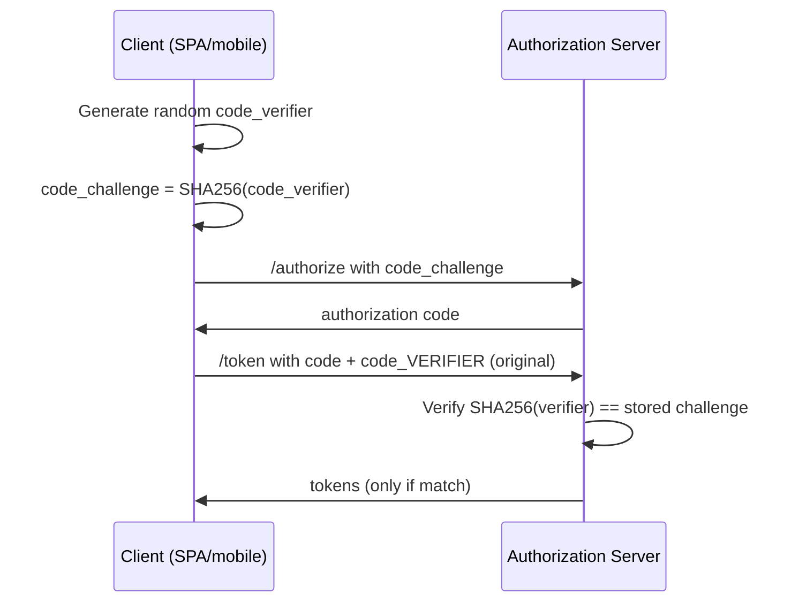

> [!IMPORTANT]
> **PKCE** defeats the **authorization code interception attack**. Without a client secret, a malicious app that intercepts the authorization code (e.g., via a hijacked mobile redirect URI) could exchange it for tokens. PKCE fixes this: the client generates a random secret (`code_verifier`), sends only its *hash* (`code_challenge`) when requesting the code, and must present the *original* `code_verifier` to redeem the code. An attacker who steals the code can't use it — they don't have the verifier (only its hash was sent, over a different channel). It's a dynamically-generated, per-request secret. **PKCE is now recommended for *all* clients, even confidential ones** (defense in depth). If asked "how do you secure OAuth in a SPA/mobile app without a secret?" — the answer is PKCE.

### 3.3 Token Validation & JWKS

```mermaid
flowchart LR
    RS["Resource Server receives JWT"] --> Fetch["Fetch public keys from JWKS endpoint (cached)"]
    Fetch --> V1["1. Verify signature (with matching 'kid' key)"]
    V1 --> V2["2. Check exp (not expired)"]
    V2 --> V3["3. Check iss (trusted issuer)"]
    V3 --> V4["4. Check aud (this API is the audience)"]
    V4 --> V5["5. Check scopes/claims for authorization"]
    V5 --> OK["✅ Accept"]
```

> [!IMPORTANT]
> Validating a JWT is **not just checking the signature** — a common under-implementation. A resource server must verify: **(1) signature** (using the correct public key, identified by the `kid` header, fetched from the auth server's **JWKS endpoint** — a JSON document of public keys, cached and refreshed to support key rotation); **(2) `exp`** — not expired; **(3) `iss`** — issued by a trusted issuer; **(4) `aud`** — *this* API is the intended audience (prevents a token minted for service A being replayed against service B); **(5) claims/scopes** — the token actually authorizes this action. Skipping `aud` or `iss` checks is a real vulnerability. The **JWKS endpoint** (`/.well-known/jwks.json`) is how resource servers get verification keys *without* pre-sharing them and how **key rotation** works (auth server publishes new keys; the `kid` header tells verifiers which to use). This whole dance is what libraries in [[10 Spring Security]] do for you — but you must know it.

### 3.4 Refresh Token Rotation

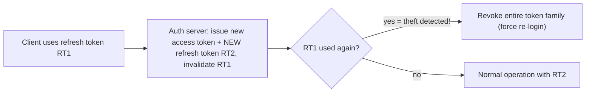

> [!WARNING]
> Refresh tokens are long-lived and powerful, so **refresh token rotation** hardens them: each time a refresh token is used, the auth server issues a **new** refresh token and **invalidates the old one**. The security payoff is **theft detection**: if an attacker steals a refresh token and uses it, then the *legitimate* client later uses the same (now-invalidated) token — the server sees a **reuse of an already-consumed token**, concludes the token was compromised, and **revokes the entire token family** (forcing re-authentication). Without rotation, a stolen refresh token grants indefinite access silently. Combined with short access-token lifetimes, rotation is the standard defense for public clients. Store refresh tokens securely (httpOnly cookies for web, secure storage for mobile — *never* localStorage).

### 3.5 OIDC Deep — the ID Token & UserInfo

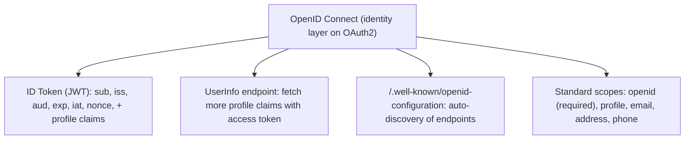

> [!IMPORTANT]
> **OIDC adds a standardized identity layer** that raw OAuth2 lacks. The key addition is the **ID Token** — always a **JWT**, always *for the client*, containing standard identity claims (`sub` = stable user id, `iss`, `aud`, `exp`, `iat`, and a **`nonce`** that binds the token to the original request to prevent replay). Requesting the special **`openid`** scope is what turns an OAuth2 flow into an OIDC flow. OIDC also standardizes: a **UserInfo endpoint** (call with the access token to get more profile data), a **Discovery document** (`/.well-known/openid-configuration` — clients auto-configure all endpoints), and standard scopes (`profile`, `email`). This standardization is why "Login with Google/Microsoft/Okta" works uniformly — they all speak OIDC. **When you need *login/identity*, use OIDC; when you need *API access delegation*, use OAuth2.** (You often use both together.)

### 3.6 Security Pitfalls & Attacks

| Attack / Pitfall | What happens | Defense |
|---|---|---|
| **CSRF on redirect** | Attacker injects their code | **`state` parameter** (bind to session) |
| **Authorization code interception** | Stolen code → tokens | **PKCE** |
| **`alg: none` attack** | Forged unsigned JWT accepted | Reject `none`; pin expected algorithm |
| **Algorithm confusion (RS→HS)** | Public key used as HMAC secret | Pin algorithm; don't let token dictate `alg` |
| **Token in localStorage** | XSS steals token | httpOnly cookies; strong CSP |
| **Open redirect** | `redirect_uri` to attacker | Strict allow-list of redirect URIs |
| **Missing `aud`/`iss` check** | Token replay across services | Validate audience + issuer |
| **Long-lived access tokens** | Leaked token = long exposure | Short expiry + refresh rotation |

> [!WARNING]
> Two JWT-specific attacks every senior must know. **(1) The `alg: none` attack**: early JWT libraries honored a header `{"alg":"none"}` meaning "unsigned" — an attacker strips the signature, sets `alg: none`, and forges any claims. **Defense: never accept `none`; explicitly pin the expected algorithm.** **(2) Algorithm confusion (RS256→HS256)**: the server verifies with RS256 (public key). An attacker changes the token's `alg` to HS256 and signs it using the *public key* (which is, well, public) as the HMAC secret — if the server naively uses the public key as an HMAC key, the forgery verifies. **Defense: pin the algorithm server-side; never let the token's header dictate the verification algorithm.** Both attacks exploit *trusting the token to describe how to verify itself* — the fix is always to enforce your *own* expectations. Also: the **`state` parameter is mandatory** for CSRF protection, and **never store tokens in localStorage** (XSS-readable) — prefer httpOnly cookies.

---

## 4. 🏗️ REAL-WORLD SYSTEM DESIGN USAGE

### 4.1 Auth in a Microservices Architecture

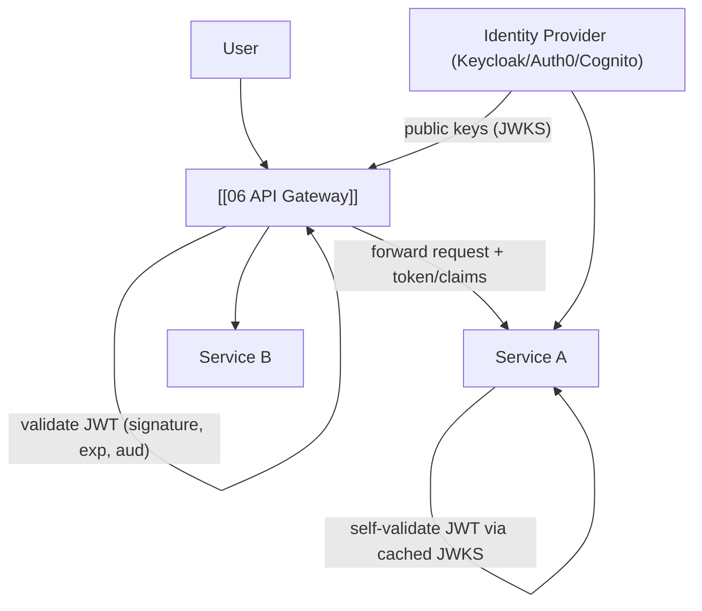

> [!IMPORTANT]
> The reference pattern: a central **Identity Provider** (Keycloak, Auth0, Okta, Cognito) handles login (OIDC) and issues **JWT access tokens** (RS256). The **[[06 API Gateway]]** validates tokens at the edge (rejecting invalid ones early) and forwards the request downstream. Each [[03 Microservices]] can *independently* re-validate the JWT using the IdP's **public keys (JWKS, cached)** — no central session store, no call back to the IdP per request. This is why JWTs shine in microservices: **stateless, self-contained, self-verifiable** authorization that scales horizontally. For **service-to-service** calls (no user), services use the **Client Credentials** grant to get their own tokens. The gateway often also does coarse authorization (scope checks), while fine-grained business authorization stays in each service. This is the practical realization of everything in [[10 Spring Security]]'s resource-server support.

### 4.2 Where do tokens live? (client-side storage)

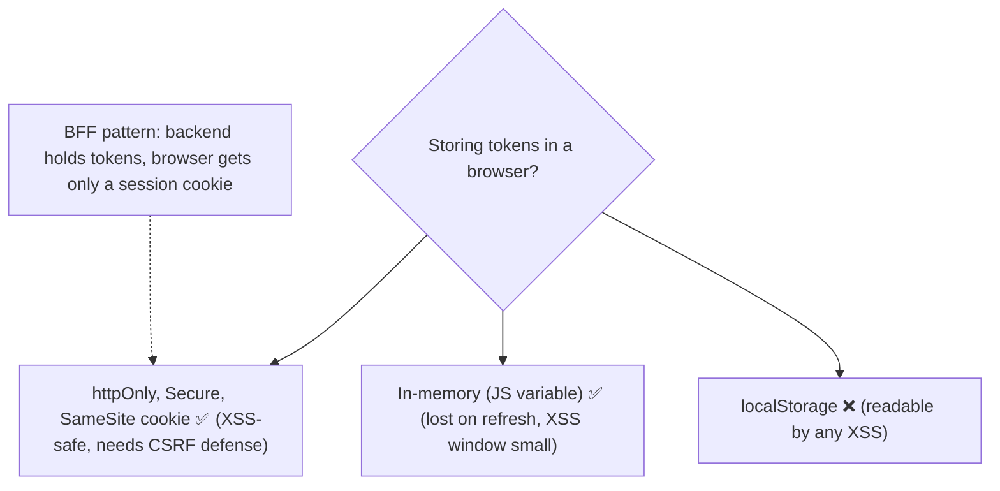

> [!TIP]
> Token storage in browsers is a genuine dilemma. **localStorage is convenient but XSS-vulnerable** — any injected script reads it (avoid for tokens). **httpOnly cookies** can't be read by JS (XSS-safe for reading) but need CSRF protection (`SameSite`, anti-CSRF tokens). A modern best practice is the **Backend-for-Frontend (BFF)** pattern: a lightweight backend holds the actual OAuth tokens server-side and gives the browser only a normal **session cookie** — the SPA never touches tokens at all, sidestepping the storage problem entirely. This is increasingly recommended for SPAs handling sensitive data. The trade-off is you're back to a stateful backend session — but often worth it for security.

### 4.3 Choosing your identity strategy

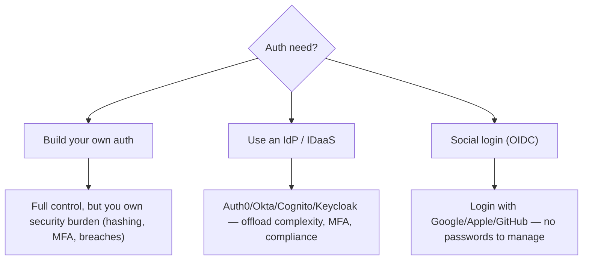

> [!TIP]
> A real architectural decision: **rolling your own auth vs using an identity provider.** Building your own (password hashing, MFA, account recovery, breach handling, protocol correctness) is a large, security-critical burden that's easy to get dangerously wrong. Most teams should use a dedicated **IdP** — hosted (**Auth0, Okta, AWS Cognito, Firebase Auth**) or self-hosted (**Keycloak**) — which implements OAuth2/OIDC correctly, handles MFA/compliance, and offloads the hardest parts. **Social login** (OIDC with Google/Apple/GitHub) eliminates password management entirely. The senior instinct: *don't reinvent auth* — it's a solved problem with well-tested implementations, and mistakes here are catastrophic. Reserve custom auth for genuinely unusual requirements.

---

## 5. 🎤 INTERVIEW PREPARATION

### 5.1 Most important questions

<details>
<summary><b>Q1: OAuth2 vs OIDC vs JWT — explain the difference.</b></summary>

**OAuth2** is an *authorization* protocol — it delegates scoped, revocable access to resources without sharing passwords (answers "what can this app access?"). **OIDC** is an *authentication* layer built on top of OAuth2 — it proves *who* the user is by adding an **ID Token** (answers "who is this user?"). **JWT** is a *token format* — a signed, self-contained JSON token — often used to represent OAuth2/OIDC tokens. In short: OAuth2 = delegated authorization, OIDC = authentication on OAuth2, JWT = a token format used by both. The classic trap is thinking OAuth2 does authentication — it doesn't; that's OIDC's job.
</details>

<details>
<summary><b>Q2: Walk me through the Authorization Code flow. Why two steps?</b></summary>

User clicks login → redirected to the auth server (front-channel) with client_id, scope, redirect_uri, state → logs in and consents → redirected back with a short-lived **authorization code** → the client exchanges that code plus its client_secret via a back-channel server call for the actual **tokens**. Two steps so the powerful tokens never pass through the browser (where they'd be logged/leaked) — only the one-time code does, and redeeming it requires the secret only the server has. `state` prevents CSRF; PKCE secures it for public clients.
</details>

<details>
<summary><b>Q3: What's in a JWT and how is it validated?</b></summary>

Three base64url parts: **header** (alg, typ), **payload** (claims: sub, exp, iss, aud, scope...), **signature**. Validation: verify the signature with the right public key (via `kid` + JWKS), check `exp` (not expired), `iss` (trusted issuer), `aud` (this API is the audience), and required scopes/claims. Note base64 is encoding not encryption — payloads are readable, so never store secrets in a JWT; the signature prevents tampering, not reading.
</details>

<details>
<summary><b>Q4: What is PKCE and what attack does it prevent?</b></summary>

Proof Key for Code Exchange secures the auth code flow for public clients (SPAs/mobile) that can't store a client_secret. The client generates a random `code_verifier`, sends its SHA256 hash (`code_challenge`) when requesting the code, then must present the original verifier to redeem the code. It prevents the **authorization code interception attack** — a stolen code is useless without the verifier. It's now recommended for all clients.
</details>

<details>
<summary><b>Q5: How do you revoke a stateless JWT? What's the trade-off?</b></summary>

You can't easily revoke a JWT before `exp` — it's self-contained with no server record to delete (the core weakness of stateless auth). Mitigations: keep access tokens short-lived (5–15 min) so leaked ones expire fast, use refresh tokens for renewal, and maintain a **deny-list/revocation store** ([[04 Redis]]) for emergency revocation (checked per request — which sacrifices some statelessness). The common pattern: stateless short JWT access tokens + a stateful, revocable refresh mechanism.
</details>

<details>
<summary><b>Q6: Access token vs ID token vs refresh token?</b></summary>

**Access token** — credential to call APIs (for the resource server), short-lived, treated as opaque by the client. **ID token** (OIDC) — asserts user identity (for the client to read), always a JWT. **Refresh token** — long-lived, used only against the auth server to get new access tokens, never sent to APIs. Key rule: don't call APIs with an ID token, don't read/trust access token contents in the client, and guard the refresh token most carefully.
</details>

<details>
<summary><b>Q7: HS256 vs RS256 — when to use which?</b></summary>

**HS256** (HMAC, symmetric) uses one shared secret to sign and verify — simple but anyone who can verify can also forge, so it's only safe when signer and verifier are the same trusted party. **RS256** (RSA, asymmetric) signs with a private key (auth server only) and verifies with a public key (distributed via JWKS) — verifiers can't forge tokens. Use RS256 for distributed systems/microservices so many services validate without being able to mint tokens; HS256 only for simple single-party setups.
</details>

<details>
<summary><b>Q8: Name two JWT-specific attacks and their defenses.</b></summary>

**(1) `alg: none`** — attacker sets the algorithm to "none" and strips the signature; naive libraries accept it. Defense: reject `none`, pin the expected algorithm. **(2) Algorithm confusion (RS256→HS256)** — attacker signs with HS256 using the public key as the HMAC secret; if the server uses the public key to verify HMAC, the forgery passes. Defense: pin the algorithm server-side; never let the token's header choose the verification method. Both stem from trusting the token to describe its own verification.
</details>

### 5.2 Tricky questions

> [!TIP]
> **"Is a JWT encrypted?"** — No. It's *signed* (integrity/authenticity), not encrypted (confidentiality). The payload is base64url — readable by anyone. For confidentiality you'd need JWE (JSON Web Encryption). Never put secrets in a standard JWT.

> [!TIP]
> **"Can you use OAuth2 for login/authentication?"** — Not properly on its own — OAuth2 only proves the app got *access*, not *who* the user is (the token could be anyone's). Using access-token possession as "login" is the flawed pattern OIDC was created to fix. Use OIDC (ID token) for authentication.

> [!TIP]
> **"Where should a SPA store its tokens?"** — Not localStorage (XSS-readable). Prefer httpOnly Secure cookies, in-memory, or better, the **BFF pattern** where the backend holds tokens and the SPA only gets a session cookie.

> [!TIP]
> **"Why not just make access tokens last a long time to avoid refresh complexity?"** — Because you can't revoke stateless JWTs before expiry, a long-lived leaked token is a long-lived breach. Short access tokens + refresh (with rotation) limit the blast radius of a leak while keeping UX smooth.

### 5.3 Common mistakes candidates make

| Mistake | Reality |
|---|---|
| "OAuth2 authenticates users" | OAuth2 = authorization; OIDC = authentication |
| "JWTs are encrypted/secure to store secrets" | Signed, not encrypted — payload is readable |
| Using ID token to call APIs | ID token is for the client; use the access token |
| HS256 in a multi-service system | Use RS256 (asymmetric) so services can't forge |
| Skipping `aud`/`iss` validation | Enables token replay across services |
| Tokens in localStorage | XSS-vulnerable; use httpOnly cookies/BFF |
| Long-lived access tokens, no rotation | Big blast radius on leak |
| Implicit/ROPC grants | Deprecated; use Auth Code + PKCE |

### 5.4 What interviewers actually expect

- The **OAuth2 vs OIDC vs JWT** distinction, cold (authZ vs authN vs token format).
- The **Authorization Code (+ PKCE)** flow, step by step, and *why* two steps.
- **JWT structure + full validation** (signature, exp, iss, aud, scopes) and JWKS.
- **Token types** and their audiences; **refresh rotation**.
- **HS256 vs RS256** and why RS256 for distributed systems.
- **Stateless vs stateful** trade-off and JWT revocation problem.
- Security: **PKCE, state, alg:none, algorithm confusion, token storage**.

---

## 6. 🛠️ HANDS-ON PROJECTS

### Project 1: Implement "Login with Google/GitHub" (Beginner→Intermediate)

**Goal:** Do a real OIDC Authorization Code flow end to end.

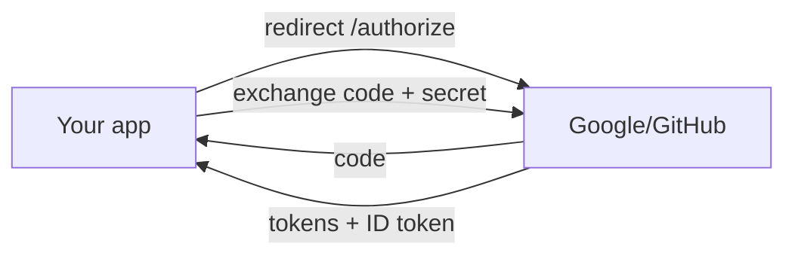

**Steps:**
1. Register an OAuth app (Google/GitHub), get client_id/secret, set redirect_uri.
2. Implement the redirect to `/authorize` with `state` and scopes (`openid profile email`).
3. Handle the callback, verify `state`, exchange the code for tokens.
4. Decode the **ID token**, validate it, extract the user identity, create a session.
5. Inspect tokens on jwt.io — *see* that the payload is readable (not encrypted).

**Learn:** Authorization Code flow, OIDC, ID tokens, state, consent, token exchange.

---

### Project 2: Secure an API with JWT Validation + PKCE SPA (Intermediate→Senior)

**Goal:** A resource server that validates JWTs, and a public-client SPA using PKCE.

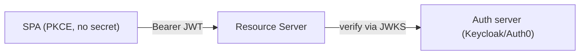

**Steps:**
1. Stand up an IdP (Keycloak locally or Auth0 free tier).
2. Build a SPA using **Authorization Code + PKCE** (generate verifier/challenge).
3. Build a resource server ([[05 Spring Boot]]/[[06 Express.js]]) that validates JWTs: **signature via JWKS, exp, iss, aud, scopes**.
4. Enforce scope-based authorization on different endpoints.
5. Break it deliberately: try an `alg:none` token, an expired token, a wrong-`aud` token — confirm each is rejected.

**Learn:** PKCE, JWKS, full token validation, scope enforcement, attack testing.

---

### Project 3: Full Auth System — Refresh Rotation + Revocation + BFF (Senior)

**Goal:** Production-grade token lifecycle and storage.

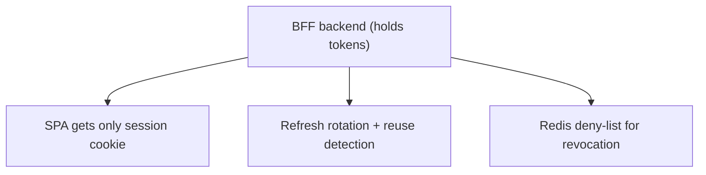

**Steps:**
1. Issue short-lived access tokens (10 min) + refresh tokens.
2. Implement **refresh token rotation** with **reuse detection** (revoke the family on reuse).
3. Add an emergency **revocation deny-list** in [[04 Redis]]; check it on sensitive endpoints.
4. Implement the **BFF pattern**: backend holds tokens, browser gets an httpOnly session cookie only.
5. Add logout that revokes refresh tokens and clears the session.

**Learn:** refresh rotation, theft detection, revocation strategies, BFF, secure storage, logout.

---

## 7. 🔬 DEEP DIVE: INTERNALS

### 7.1 The `state` parameter & CSRF protection

```mermaid
flowchart LR
    C["Client generates random 'state', stores in session"] --> AS["/authorize?state=xyz"]
    AS --> CB["Callback returns same state=xyz"]
    CB --> Check{"Returned state == stored state?"}
    Check -->|"yes"| OK["✅ Genuine — proceed"]
    Check -->|"no/missing"| Reject["❌ CSRF attempt — reject"]
```

> [!IMPORTANT]
> The **`state` parameter** is OAuth2's built-in CSRF defense, and it's mandatory. Without it, an attacker could trick a victim's browser into completing an OAuth flow with the *attacker's* authorization code — linking the victim's session to the attacker's account (or vice versa). The client generates an unguessable random `state`, stores it (in the session), includes it in the `/authorize` request, and the auth server echoes it back on the callback. The client verifies the returned `state` matches what it stored — proving the callback corresponds to a flow *this client initiated for this user*. A missing or mismatched `state` means the request is forged. In OIDC, the **`nonce`** plays an analogous role for the ID token (binding it to the original request, preventing token replay). Both are "prove this response belongs to my request" mechanisms.

### 7.2 JWKS & Key Rotation Internals

```mermaid
flowchart LR
    AS["Auth server has keypairs (each with a 'kid')"] --> JWKS["Publishes public keys at /.well-known/jwks.json"]
    Token["JWT header includes 'kid'"] --> RS["Resource server"]
    RS -->|"match kid → pick public key"| JWKS
    RS --> Verify["Verify signature"]
    Rotate["Rotation: add new key (new kid), sign new tokens with it, keep old key until old tokens expire"] -.-> AS
```

> [!TIP]
> **JWKS (JSON Web Key Set)** is how public keys are distributed and rotated without downtime. The auth server publishes its public keys as a JSON document at a well-known URL; each key has a **`kid`** (key ID). Every JWT's header includes the `kid` of the key that signed it, so a resource server knows *which* public key to use for verification. Resource servers **cache** the JWKS (fetching periodically) to avoid a network call per token. **Key rotation** works elegantly: the auth server generates a new keypair (new `kid`), starts signing *new* tokens with it, but keeps the *old* public key in the JWKS until all tokens signed with it have expired. Verifiers pick the right key by `kid`, so old and new tokens both validate during the transition. This is production-grade cryptographic hygiene — rotate keys regularly, and a leaked key has a bounded blast radius.

### 7.3 Why the token exchange happens server-side (channels)

```mermaid
flowchart TB
    subgraph Front["Front-channel (browser redirects — visible, loggable)"]
        F["Carries: auth request, one-time code, state — NOTHING sensitive long-lived"]
    end
    subgraph Back["Back-channel (server-to-server — private)"]
        B["Carries: code + client_secret → tokens. Never touches the browser."]
    end
```

> [!IMPORTANT]
> OAuth2's security rests on separating the **front-channel** (via browser redirects — inherently visible: URLs are logged, cached in history, exposed to scripts) from the **back-channel** (direct server-to-server HTTPS — private). The design principle: **only non-sensitive, single-use data crosses the front-channel** (the authorization request and the one-time code), while **all sensitive, long-lived credentials (client_secret, tokens) stay on the back-channel.** This is *why* the Authorization Code flow exchanges a code rather than returning tokens directly — the deprecated **Implicit flow** returned tokens on the front-channel (in the redirect URL fragment), exposing them in browser history and logs, which is exactly why it's dead. Understanding channels explains *why* every flow is shaped the way it is: minimize what the untrusted browser channel ever sees.

### 7.4 Token Introspection (the stateful alternative)

```mermaid
flowchart LR
    RS["Resource Server (opaque token)"] -->|"POST /introspect (token)"| AS["Auth Server"]
    AS -->|"active: true/false + scopes + exp + sub"| RS
    Note["Trades statelessness for instant revocation & opaque tokens"] -.-> AS
```

> [!TIP]
> Not all access tokens are JWTs. **Opaque tokens** are random strings with no readable content — the resource server can't self-validate them; instead it calls the auth server's **introspection endpoint** (RFC 7662) to ask "is this token active, and what are its scopes/subject/expiry?" This is the **stateful** approach: it reintroduces a network call per validation (or per cache window) but gains **instant revocation** (the auth server is the live source of truth — revoke a token and it's immediately dead) and keeps token contents private (nothing leaks in the token). The trade-off vs self-validated JWTs is the classic **stateless (fast, scalable, hard to revoke) vs stateful (revocable, private, but a network dependency)** decision (§2.6). Many systems use JWTs for scale but introspection for high-security operations, or short-lived JWTs to bound the un-revocable window. Knowing *both* models — and their trade-offs — signals depth.

### 7.5 mTLS, Token Binding & Sender-Constraining

```mermaid
flowchart LR
    Bearer["Bearer token: whoever HOLDS it can use it (like cash)"] --> Risk["Stolen token = full access"]
    Sender["Sender-constrained (mTLS / DPoP): token bound to the client's key"] --> Safe["Stolen token useless without the client's private key"]
```

> [!IMPORTANT]
> Standard OAuth2 tokens are **bearer tokens** — like cash, *whoever holds it can spend it*. If stolen (via logs, XSS, a compromised proxy), an attacker uses it freely until it expires. **Sender-constrained tokens** fix this by cryptographically **binding the token to the legitimate client**. Two mechanisms: **mTLS-bound tokens** (RFC 8705) tie the token to the client's TLS certificate — the resource server checks the presented cert matches the one the token was bound to. **DPoP** (Demonstrating Proof-of-Possession, RFC 9449) has the client sign each request with a private key referenced in the token — so a stolen token can't be used without the client's private key. These are increasingly required in **high-security domains** (open banking, healthcare) where bearer-token theft is unacceptable. It's the frontier of OAuth security — moving from "possession = use" to "proof of possession = use." Overkill for most apps, essential for high-value ones.

---

## ✅ Production Checklists

### Flows & Tokens
- [ ] **Authorization Code + PKCE** for all interactive clients (no Implicit/ROPC)
- [ ] **Client Credentials** for machine-to-machine
- [ ] Access tokens **short-lived** (5–15 min); refresh tokens **rotated**
- [ ] **Refresh token reuse detection** (revoke family)
- [ ] Tokens use **RS256** (asymmetric) in multi-service systems

### Validation (resource server)
- [ ] Verify **signature** via cached **JWKS** (by `kid`)
- [ ] Validate **exp, iss, aud**, and required **scopes/claims**
- [ ] **Reject `alg: none`**; **pin the algorithm** (no algorithm confusion)
- [ ] Enforce authorization per endpoint (scopes + business rules)

### Storage & Transport
- [ ] Tokens **never in localStorage**; httpOnly Secure cookies or BFF
- [ ] Always **HTTPS**; `state` (CSRF) + `nonce` (OIDC replay) enforced
- [ ] Strict **redirect_uri allow-list** (no open redirects)
- [ ] Refresh tokens stored securely; revocation/deny-list available
- [ ] Consider **sender-constrained tokens** (mTLS/DPoP) for high-value APIs

---

## 🗺️ Learning Roadmap

```mermaid
flowchart TB
    A["1️⃣ AuthN vs AuthZ<br/>OAuth2 vs OIDC vs JWT"] --> B["2️⃣ Roles & Auth Code flow<br/>front/back channel"]
    B --> C["3️⃣ Tokens & JWT<br/>structure, claims, validation"]
    C --> D["4️⃣ Grants & PKCE<br/>which flow for which client"]
    D --> E["5️⃣ OIDC<br/>ID token, UserInfo, discovery"]
    E --> F["6️⃣ Security<br/>state, alg:none, storage, rotation"]
    F --> G["7️⃣ Distributed auth<br/>JWKS, microservices, gateway"]
    G --> H["8️⃣ Advanced<br/>introspection, mTLS/DPoP, BFF"]
```

| Stage | Focus | You can... |
|---|---|---|
| 1–3 | Concepts + tokens | Explain the model and read/validate JWTs |
| 4–5 | Flows + OIDC | Implement login and API access correctly |
| 6 | Security | Avoid the common vulnerabilities |
| 7–8 | Distributed + advanced | Architect auth for microservices at scale |

---

## 🔁 Self-Review Completion Loop

Reviewed against RFC 6749 (OAuth2), RFC 7519 (JWT), the OpenID Connect Core spec, OAuth 2.1 draft, and OWASP guidance.

### Gap Review Matrix

| Dimension | Covered? | Where |
|---|---|---|
| AuthN vs AuthZ | ✅ | §1 |
| OAuth2 vs OIDC vs JWT | ✅ | Exec, §1, §5 |
| Password anti-pattern | ✅ | §1 |
| Four roles | ✅ | §1 |
| Authorization Code flow | ✅ | §2.1 |
| Token types | ✅ | §2.2 |
| Scopes & consent | ✅ | §2.3 |
| JWT structure | ✅ | §2.4 |
| HS256 vs RS256 | ✅ | §2.5 |
| Stateless vs stateful | ✅ | §2.6 |
| Grant types | ✅ | §3.1 |
| PKCE | ✅ | §3.2 |
| Token validation & JWKS | ✅ | §3.3, §7.2 |
| Refresh rotation | ✅ | §3.4 |
| OIDC deep (ID token, UserInfo) | ✅ | §3.5 |
| Security pitfalls/attacks | ✅ | §3.6 |
| Microservices auth | ✅ | §4.1 |
| Token storage / BFF | ✅ | §4.2 |
| IdP strategy | ✅ | §4.3 |
| state / CSRF | ✅ | §7.1 |
| Channels (front/back) | ✅ | §7.3 |
| Token introspection | ✅ | §7.4 |
| mTLS / DPoP | ✅ | §7.5 |
| Interview Q&A + mistakes | ✅ | §5 |
| Hands-on projects | ✅ | §6 |

> [!NOTE]
> **Remaining depth to explore independently:** SAML (the older enterprise SSO standard, and SAML vs OIDC), session management & Single Logout (SLO / front-channel & back-channel logout), OAuth for native/device flows (Device Authorization Grant for TVs/CLIs), JWE (encrypted JWTs) and JWS details, token exchange (RFC 8693) for delegation/impersonation, FAPI (Financial-grade API) profiles, Pushed Authorization Requests (PAR), consent management at scale, and passwordless/WebAuthn/passkeys as the emerging authentication frontier.

---

## 📚 Official References

| Resource | Source |
|---|---|
| RFC 6749 — OAuth 2.0 | https://datatracker.ietf.org/doc/html/rfc6749 |
| RFC 7519 — JSON Web Token (JWT) | https://datatracker.ietf.org/doc/html/rfc7519 |
| OpenID Connect Core | https://openid.net/specs/openid-connect-core-1_0.html |
| RFC 7636 — PKCE | https://datatracker.ietf.org/doc/html/rfc7636 |
| OAuth 2.1 (draft — consolidated best practices) | https://oauth.net/2.1/ |
| OAuth 2.0 Security Best Current Practice | https://datatracker.ietf.org/doc/html/rfc9700 |
| jwt.io (decode/inspect JWTs) | https://jwt.io/ |
| OWASP — JWT / Authentication Cheat Sheets | https://cheatsheetseries.owasp.org/ |

---

## 🎁 Final Summary

> [!IMPORTANT]
> **The one-paragraph takeaway:** These three are constantly confused but do distinct jobs — **OAuth2** is *delegated authorization* (letting an app access your resources with a scoped, revocable **token** instead of your password — killing the password anti-pattern), **OIDC** is *authentication* built as a thin layer on OAuth2 (adding the **ID Token** to prove *who* the user is), and **JWT** is a *token format* (a signed, self-contained JSON blob whose claims any holder of the key can verify — but which is **signed, not encrypted**, so the payload is readable and must never hold secrets). The workhorse is the **Authorization Code flow (+ PKCE)**: the browser front-channel carries only a one-time **code** and the CSRF-guarding **`state`**, while the server back-channel exchanges that code for **tokens** — keeping powerful credentials out of the browser (which is exactly why the Implicit and ROPC grants are deprecated). Know the **three tokens and their audiences** (access → APIs, ID → client, refresh → auth server only), and that validating a JWT means checking **signature (via JWKS by `kid`), exp, iss, aud, and scopes** — not signature alone. Prefer **RS256** (asymmetric) so many [[03 Microservices]] can self-verify tokens via public keys without being able to forge them, enabling stateless, scalable auth behind an [[06 API Gateway]]. The central trade-off is **stateless JWT (fast, scalable, but hard to revoke before expiry) vs stateful sessions/introspection (revocable, private, but a lookup per request)** — the pragmatic answer is short-lived JWT access tokens + rotating refresh tokens + a revocation deny-list. Finally, respect the security minefield: enforce **`state`** and OIDC **`nonce`**, **reject `alg:none`** and pin your algorithm (defeating algorithm-confusion), **never store tokens in localStorage** (use httpOnly cookies or the **BFF** pattern), and for high-value APIs move from bearer tokens to **sender-constrained** tokens (mTLS/DPoP). And the senior instinct throughout: **don't roll your own auth — use a proven IdP** (Keycloak/Auth0/Okta/Cognito), because mistakes here are catastrophic.

**Golden rules:**
1. 🎭 **OAuth2 = authorization, OIDC = authentication, JWT = token format** — never conflate them.
2. 🔑 OAuth2 kills the **password anti-pattern** — scoped, expiring, revocable tokens, never shared credentials.
3. 🔀 **Authorization Code + PKCE** for all interactive clients; Implicit & ROPC are dead.
4. 📜 **JWT is signed, not encrypted** — payload is readable; never store secrets in it.
5. ✅ Validate **signature (JWKS) + exp + iss + aud + scopes** — not just the signature.
6. 🔐 Use **RS256** so services self-verify without being able to forge (public/private keys).
7. ♻️ Short access tokens + **refresh rotation with reuse detection**; deny-list for emergencies.
8. ⚖️ **Stateless (JWT) vs stateful (introspection/session)** — a deliberate revocation/scale trade-off.
9. 🛡️ Enforce **`state`/`nonce`**, reject **`alg:none`**, pin the algorithm, never use **localStorage**.
10. 🏛️ **Don't build your own auth** — use a proven identity provider.

---

*Related guides in this vault: [[10 Spring Security]] · [[11 Spring Boot Authentication]] · [[06 API Gateway]] · [[02 REST API Design]] · [[03 Microservices]] · [[01 System Design Fundamentals]] · [[06 Distributed Systems]] · [[04 Redis]]*
