# 🛡️ Web Security & OWASP Top 10 — Complete Beginner-to-Expert Reference

> How web apps get hacked — and how to stop it. **Injection, XSS, CSRF, broken access control, SSRF**, and the rest of the OWASP Top 10, plus the defensive mindset, secure-by-design principles, and the concrete code patterns that keep systems safe.

---

## 📑 Table of Contents

1. [Executive Summary](#-executive-summary)
2. [Fundamentals (Beginner)](#1--fundamentals-beginner-level)
3. [Core Concepts (Intermediate)](#2--core-concepts-intermediate-level)
4. [Advanced Concepts (Senior)](#3--advanced-concepts-senior-level)
5. [Real-World System Design](#4--real-world-system-design-usage)
6. [Interview Preparation](#5--interview-preparation)
7. [Hands-On Projects](#6--hands-on-projects)
8. [Deep Dive: Internals](#7--deep-dive-internals)
9. [Production Checklists](#-production-checklists)
10. [Learning Roadmap](#-learning-roadmap)
11. [Self-Review Completion Loop](#-self-review-completion-loop)
12. [Official References](#-official-references)
13. [Final Summary](#-final-summary)

---

## 🎯 Executive Summary

**Web security** is the practice of building applications that resist attackers who actively try to steal data, hijack accounts, and abuse your systems. The **OWASP Top 10** is the industry-standard list of the most critical web application security risks — a shared vocabulary every engineer is expected to know. This guide covers each risk, *why* it happens, and the concrete defenses, anchored by one unifying principle: **never trust input, always enforce on the server, and design for defense in depth.**

| What it is | What it replaces | Core superpower |
|---|---|---|
| Systematic defense against web attacks (OWASP-guided) | "It works, ship it" / security as an afterthought | **Building software that stays safe under active attack** — protecting users, data, and trust |

> [!IMPORTANT]
> The single mental shift that makes you a security-aware engineer: **all input is hostile until proven otherwise, and the client is fully controlled by the attacker.** Every field, header, cookie, URL parameter, and API payload can be crafted maliciously — a real user's browser can be replaced by `curl`, a script, or a proxy that sends *anything*. This is why **all security must be enforced server-side**: client-side validation is UX, never security (an attacker just skips it). Nearly every entry in the OWASP Top 10 is a variation of *trusting something you shouldn't* — trusting input (injection, XSS), trusting the client's claim of identity/permission (broken access control), or trusting a default/misconfiguration. Internalize "**never trust the client**" and most vulnerabilities become obvious. This guide builds directly on [[01 HTTP Deep Dive]] (cookies, CORS, CSP, TLS) and [[01 OAuth2 OIDC and JWT]] (authentication).

Related guides: [[01 OAuth2 OIDC and JWT]] · [[01 HTTP Deep Dive]] · [[02 REST API Design]] · [[10 Spring Security]] · [[06 API Gateway]] · [[02 Postgres]] · [[01 System Design Fundamentals]]

---

## 1. 🌱 FUNDAMENTALS (Beginner Level)

### The CIA triad — what "security" means

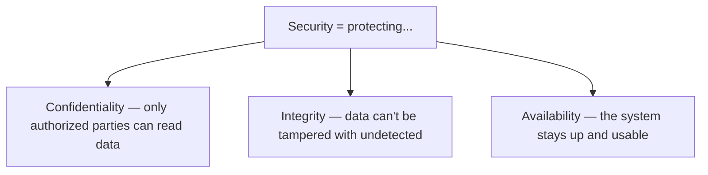

> [!IMPORTANT]
> Security isn't one thing — it's the **CIA triad**: **Confidentiality** (keeping secrets secret — encryption, access control), **Integrity** (preventing unauthorized changes — signatures, validation), and **Availability** (staying online — DDoS defense, rate limiting). A breach violates one or more: a data leak breaks confidentiality, a tampered transaction breaks integrity, a DoS attack breaks availability. Every defense maps to protecting one of these three. When you evaluate a risk, ask "which of C/I/A does this threaten?" — it sharpens your thinking. ([[01 HTTP Deep Dive]]'s TLS provides all three for data in transit.)

### AuthN vs AuthZ vs the rest

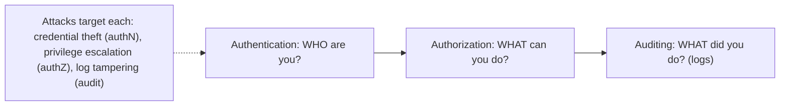

> [!TIP]
> Recall from [[01 OAuth2 OIDC and JWT]]: **Authentication** proves *who* you are; **Authorization** decides *what* you can do. Most access-control breaches are **authorization** failures — the user *is* authenticated (logged in legitimately) but manages to do something they shouldn't (view another user's data, hit an admin endpoint). Keeping authN and authZ distinct in your head is essential because they fail differently and are defended differently. Auditing (logging who did what) is the third leg — critical for detecting and investigating breaches.

### The attacker's mindset

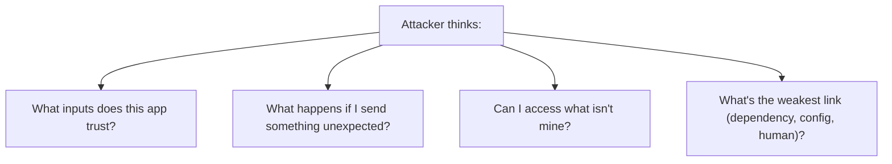

> [!IMPORTANT]
> To defend, think like an attacker: they systematically probe *where you placed trust* and *what you assumed*. They send a quote in a name field (SQL injection), a `<script>` in a comment (XSS), change an ID in a URL from `123` to `124` (broken access control), or point a URL parameter at your internal network (SSRF). They don't play by your UI's rules. The defensive counterpart is **"assume breach" and "defense in depth"** — no single control is trusted to be perfect; you layer validation, authorization, encryption, monitoring, and least-privilege so that when one layer fails, others contain the damage. Security is not a feature you add; it's a property you design in at every layer.

### What is the OWASP Top 10?

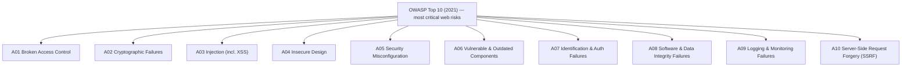

> [!TIP]
> **OWASP** (Open Worldwide Application Security Project) publishes the **Top 10** every few years — a data-driven ranking of the most critical web application security risks. It's *the* shared reference: interviewers ask about it, security audits check against it, and compliance frameworks reference it. It's not exhaustive (thousands of vulnerability types exist) but it captures where the real-world damage concentrates. Note the 2021 list emphasizes **categories** (e.g., "Broken Access Control" #1) over specific bugs, reflecting that *classes* of mistakes matter more than individual CVEs. Know each category, a concrete example, and its primary defense.

### Real-world analogy 🏰

Web security is like defending a **castle**:
- **Never trust anyone at the gate** (input validation) — check every visitor, assume some are enemies in disguise.
- **Multiple walls** (defense in depth) — if attackers breach the outer wall, inner walls still hold.
- **Least privilege** — the cook gets a kitchen key, not the armory key.
- **Don't hide the key under the mat** (no secrets in code/URLs) and **don't rely on a secret castle location** (security through obscurity fails).
- **Guards patrol and keep logs** (monitoring) — you must *detect* intruders, not just wall them out.
- **The weakest point decides everything** — a strong gate is useless if a window is unlocked (the vulnerable dependency, the misconfigured server).

> [!TIP]
> Beginner takeaway: web security is a *mindset* — treat all input as hostile, enforce everything server-side, layer your defenses, grant least privilege, and assume you'll be attacked (so monitor and log). The OWASP Top 10 is your checklist of where attacks concentrate. The rest of this guide is each attack, *how* it works, and the *specific* defense.

---

## 2. 🧩 CORE CONCEPTS (Intermediate Level)

### 2.1 Injection (A03) — SQL Injection

The attacker sends input that gets **interpreted as code/commands** rather than data.

```mermaid
flowchart TB
    subgraph Vuln["❌ Vulnerable (string concatenation)"]
        V["query = \"SELECT * FROM users WHERE name='\" + input + \"'\""]
        V --> Attack["input = ' OR '1'='1  → returns ALL users / bypasses login"]
    end
    subgraph Safe["✅ Parameterized query"]
        S["query = \"SELECT * FROM users WHERE name = ?\"  + bind(input)"]
        S --> None["input treated as DATA, never executed"]
    end
```

```sql
-- Attacker inputs:  '; DROP TABLE users; --
-- Concatenated query becomes:
SELECT * FROM users WHERE name = ''; DROP TABLE users; --'
```

> [!IMPORTANT]
> **SQL injection** happens when user input is concatenated into a query string, so the database interprets attacker input as *SQL commands*. Classic payloads: `' OR '1'='1` (bypass a login WHERE clause), `'; DROP TABLE users; --` (destroy data), or `UNION SELECT` to exfiltrate other tables. **The definitive fix is parameterized queries (prepared statements)**: the SQL structure is sent to the database *separately* from the parameters, so user input is *always* treated as data and can never change the query's meaning — no amount of quotes or semicolons matters. ORMs ([[08 JPA vs Hibernate]], [[09 Java Hibernate]]) parameterize by default, which is a major reason to use them — but you can *still* introduce injection with raw/native queries or dynamically built HQL/JPQL. **Never build queries by string concatenation. Ever.** Injection is #3 on OWASP and the archetype of "trusting input." The same principle applies to NoSQL ([[03 MongoDB]]), OS commands, and LDAP injection.

### 2.2 Cross-Site Scripting (XSS) — injection into the browser

XSS injects malicious **JavaScript** that runs in *other users'* browsers — stealing cookies/tokens, hijacking sessions, defacing pages.

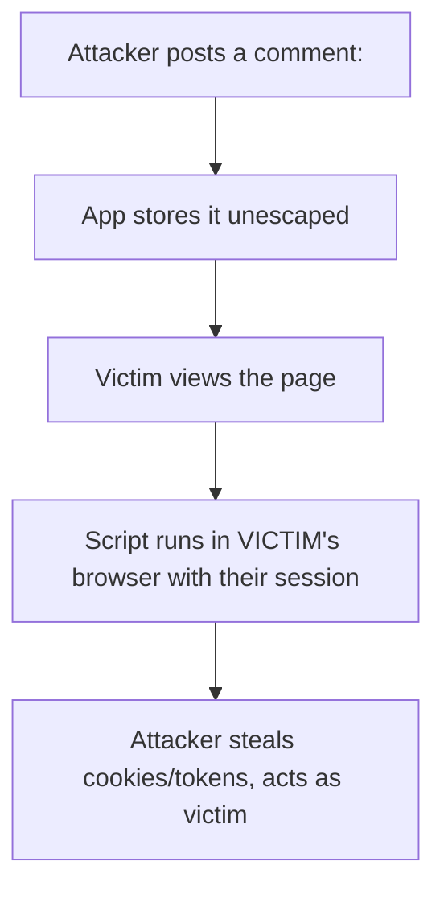

| XSS type | How | Example |
|---|---|---|
| **Stored (persistent)** | Malicious script saved in DB, served to all viewers | A comment, profile bio |
| **Reflected** | Script in a URL/param reflected back in the response | Search results echoing the query |
| **DOM-based** | Client-side JS writes untrusted data into the DOM | `innerHTML = location.hash` |

> [!IMPORTANT]
> **XSS is injection targeting the browser** — untrusted data is rendered as *executable HTML/JS* in a victim's page, running with the victim's privileges (their session, their cookies). The consequences are severe: session hijacking, credential theft, actions performed as the victim. **Defenses, layered:** **(1) Output encoding / escaping** — the primary fix — encode data for its context so `<script>` becomes harmless text (`&lt;script&gt;`). Modern frameworks ([[08 React]], Angular) auto-escape by default, which is why XSS is rarer in them — *but* you re-open the hole with `dangerouslySetInnerHTML`/`innerHTML`. **(2) Content Security Policy (CSP)** — a browser-enforced allowlist of script sources ([[01 HTTP Deep Dive]] security headers) that blocks inline/injected scripts even if one slips through — defense in depth. **(3) `HttpOnly` cookies** so stolen-via-XSS scripts *can't read* the session cookie. **(4) Input validation** as a supporting layer. The golden rule: **escape on output, based on context** (HTML vs attribute vs JS vs URL context each need different encoding).

### 2.3 Cross-Site Request Forgery (CSRF)

CSRF tricks a logged-in victim's browser into making an *unwanted authenticated request* — exploiting that browsers **auto-attach cookies** ([[01 HTTP Deep Dive]]).

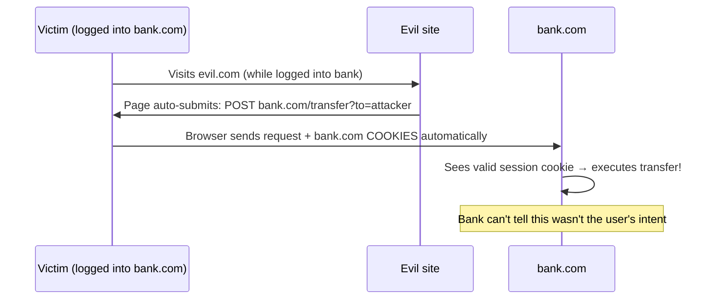

> [!IMPORTANT]
> **CSRF** abuses the browser's automatic cookie attachment: if you're logged into `bank.com` and visit a malicious site, that site can trigger a request to `bank.com` (a form auto-submit, an image tag) — and your browser *dutifully attaches your bank session cookie*, so the bank thinks *you* made the request. The attacker can't *read* the response (Same-Origin Policy), but for state-changing actions (transfer money, change email), reading isn't needed. **Defenses:** **(1) CSRF tokens** — the server embeds an unpredictable token in forms that the attacker's site can't know or guess; the server rejects requests missing it (the classic defense). **(2) `SameSite` cookies** — `SameSite=Lax` (now the browser default) or `Strict` stops cookies being sent on cross-site requests, largely neutralizing CSRF ([[01 HTTP Deep Dive]]). **(3)** Checking `Origin`/`Referer` headers. Note: **token-based auth in a header** ([[01 OAuth2 OIDC and JWT]] `Authorization: Bearer`) is *inherently* CSRF-resistant because the browser doesn't auto-attach headers (only cookies) — which is one reason APIs favor bearer tokens. CSRF is the flip side of XSS: XSS runs attacker script on your site; CSRF makes the victim's browser send requests to your site.

### 2.4 Broken Access Control (A01 — the #1 risk)

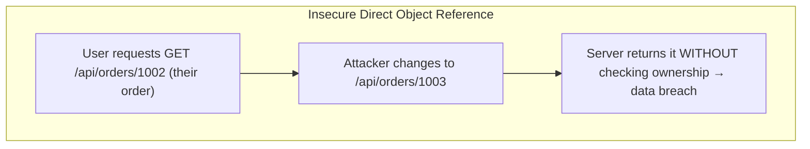

> [!WARNING]
> **Broken Access Control is OWASP's #1 risk** — the app fails to enforce that users can only do/see what they're allowed to. The most common form is **IDOR (Insecure Direct Object Reference)**: an endpoint like `GET /api/orders/1002` returns the order *without checking it belongs to the requesting user* — so an attacker just increments the ID to read everyone's orders. Other forms: accessing `/admin` without being an admin, forced browsing to hidden URLs, missing function-level checks, or trusting a client-sent `role=admin` field. **The fix: enforce authorization on EVERY request, server-side, based on the authenticated user's identity — never trust IDs, roles, or paths from the client.** For every object access, ask "does *this* user own/have permission for *this* resource?" Critically, **hiding a button in the UI is not access control** — the attacker calls the API directly. Deny by default; require explicit grants. This is where [[10 Spring Security]]'s method-level `@PreAuthorize` and per-resource checks earn their keep.

### 2.5 Authentication Failures (A07)

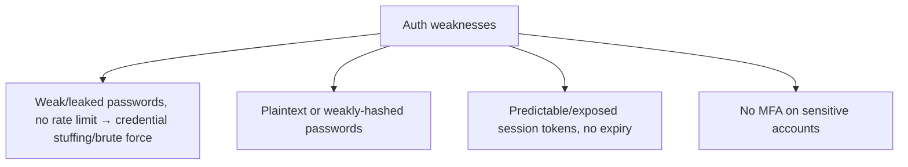

> [!IMPORTANT]
> **Authentication failures** let attackers become other users. Key defenses: **(1) Never store plaintext passwords** — hash with a *slow, salted* algorithm designed for passwords (**bcrypt, scrypt, Argon2** — §7.1), *never* fast hashes like MD5/SHA-256 (which are crackable at billions/sec). **(2) Rate-limit and lock** login attempts to stop brute-force and **credential stuffing** (attackers replaying username/password pairs leaked from other breaches). **(3) Enforce MFA** for sensitive accounts — the single highest-impact control, since it defeats stolen passwords. **(4) Secure session management** — cryptographically random tokens, proper expiry, invalidation on logout, secure cookie flags. **(5) Don't leak** whether a username exists ("invalid username or password", not "no such user"). Most of this is *solved* by using a proven identity provider or framework ([[01 OAuth2 OIDC and JWT]], [[10 Spring Security]]) rather than rolling your own — reinforcing "don't build your own auth."

### 2.6 Sensitive Data Exposure & Cryptographic Failures (A02)

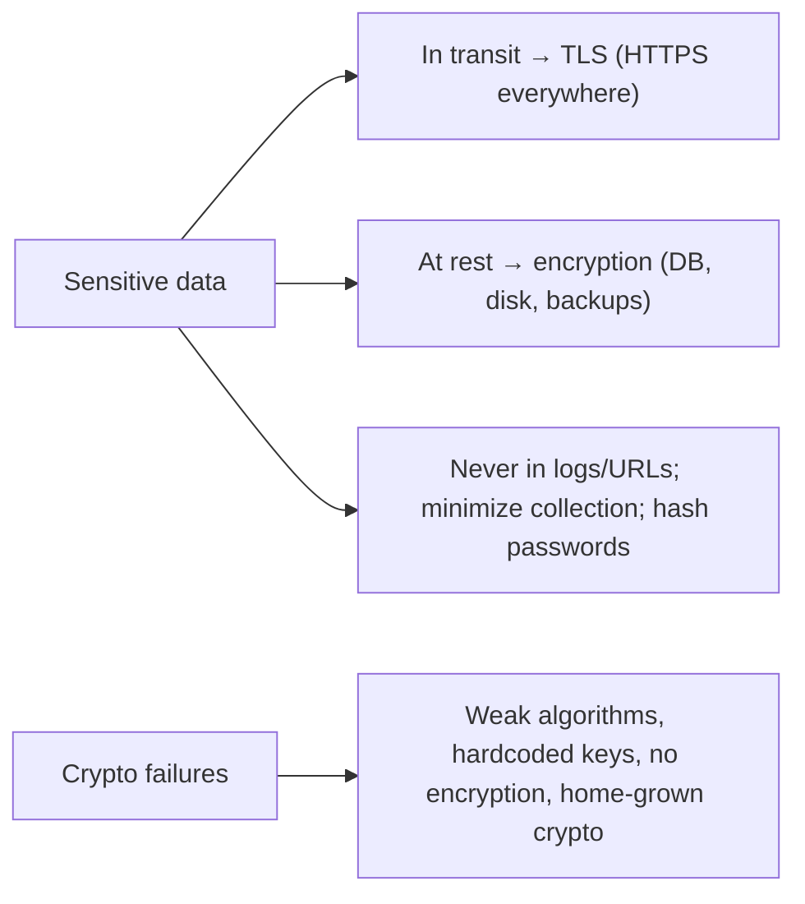

> [!WARNING]
> **Cryptographic failures** (formerly "Sensitive Data Exposure") cover failing to properly protect sensitive data. Rules: **encrypt in transit** (TLS/HTTPS everywhere — [[01 HTTP Deep Dive]], plus HSTS), **encrypt at rest** (databases, backups, disks — so a stolen DB dump is useless), **hash passwords** (bcrypt/Argon2, never encrypt them — you never need to decrypt a password). Critical don'ts: **never log sensitive data** (passwords, tokens, PII, card numbers leak into log files/aggregators), **never put secrets in URLs** (they're logged everywhere — [[01 HTTP Deep Dive]]), **never hardcode keys/passwords in code or Git** (a top real-world breach source — use a secrets manager/vault), and **never roll your own crypto** (use vetted libraries; home-grown crypto is almost always broken). Also **minimize data collection** — data you don't store can't be breached. Getting crypto details right (algorithm choice, key management, IVs) is genuinely hard, which is exactly why you use established, audited implementations.

---

## 3. ⚙️ ADVANCED CONCEPTS (Senior Level)

### 3.1 The full OWASP Top 10 (2021) with defenses

| # | Risk | Core defense |
|---|---|---|
| **A01** | **Broken Access Control** | Server-side authz on every request; deny by default; no IDOR |
| **A02** | **Cryptographic Failures** | TLS everywhere, encrypt at rest, bcrypt/Argon2, no home-grown crypto |
| **A03** | **Injection** (SQL/NoSQL/XSS/cmd) | Parameterized queries; output encoding; input validation |
| **A04** | **Insecure Design** | Threat modeling, secure-by-design, secure defaults |
| **A05** | **Security Misconfiguration** | Hardened configs, no defaults, minimal surface, security headers |
| **A06** | **Vulnerable/Outdated Components** | Dependency scanning (SCA), patching, SBOM |
| **A07** | **Identification & Auth Failures** | MFA, strong hashing, rate limits, session mgmt |
| **A08** | **Software & Data Integrity Failures** | Verify updates/signatures, secure CI/CD, no untrusted deserialization |
| **A09** | **Logging & Monitoring Failures** | Log security events, alert, detect breaches |
| **A10** | **SSRF** | Validate/allowlist outbound URLs; block internal metadata endpoints |

> [!IMPORTANT]
> The 2021 Top 10 reflects a shift toward **root-cause categories** over specific bugs. **A04 Insecure Design** is new and important — it says some vulnerabilities come not from a coding mistake but from a *missing security control in the design itself* (no rate limiting on password reset, no defense against business-logic abuse), which no amount of careful coding fixes — you need **threat modeling** upfront. **A08 Integrity Failures** covers trusting unverified code/data — insecure deserialization (§3.3), unsigned auto-updates, and CI/CD compromise ([[07 CICD GitHub Actions]] supply-chain risk). **A09** emphasizes that *not detecting* breaches is itself a top risk — you must log security events and alert ([[02 Observability]]). Knowing all ten by category, with one example and one defense each, is exactly what senior security interviews expect.

### 3.2 Server-Side Request Forgery (SSRF, A10)

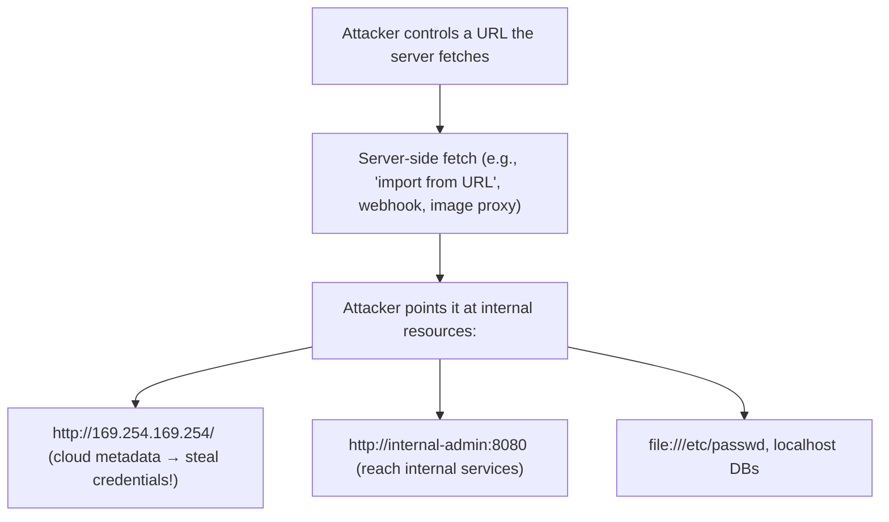

> [!WARNING]
> **SSRF** made the Top 10 because cloud architectures made it devastating. It occurs when an app fetches a URL *the attacker controls* (webhooks, "import from URL," image/PDF fetchers, link previews) without validation — the attacker points it at **internal** resources the server can reach but they can't. The nightmare scenario in the cloud: fetching **`http://169.254.169.254/`** (the **cloud metadata endpoint** on AWS/GCP/Azure) which returns the instance's **IAM credentials** — the 2019 Capital One breach (100M+ records) was SSRF reaching AWS metadata. **Defenses:** **allowlist** permitted destinations (not a blocklist — too easy to bypass with encodings/redirects/DNS tricks), **block requests to internal/private IP ranges and the metadata IP**, disable unneeded URL schemes (`file://`, `gopher://`), use **IMDSv2** (which requires a token, mitigating naive SSRF), and isolate the fetching service. SSRF turns "the server can reach it" into "the attacker can reach it" — a potent [[06 Distributed Systems]]/cloud risk.

### 3.3 Insecure Deserialization & Integrity (A08)

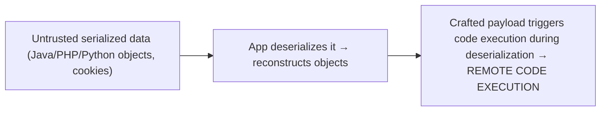

> [!WARNING]
> **Insecure deserialization** is a severe (often **RCE — remote code execution**) vulnerability: deserializing attacker-controlled data can instantiate arbitrary objects and trigger code during reconstruction ("gadget chains"). Java's native serialization is notorious here ([[01 Basic Java]]) — a crafted byte stream can execute commands. **Defenses:** **don't deserialize untrusted data** at all if avoidable; prefer **data-only formats** (JSON with a strict schema, no polymorphic type resolution), never native/binary object serialization from untrusted sources; if unavoidable, use allowlists of permitted classes and integrity checks (signatures). More broadly, **A08 Integrity Failures** means *verifying what you trust*: check signatures on updates and dependencies, secure your [[07 CICD GitHub Actions]] pipeline against supply-chain attacks (a compromised build injects malware into everything you ship), and pin/verify third-party scripts (Subresource Integrity). The theme: **don't execute or trust code/data you haven't verified.**

### 3.4 Security Misconfiguration & Hardening (A05)

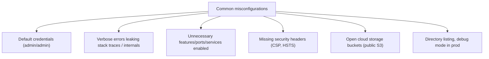

> [!IMPORTANT]
> **Security misconfiguration** is pervasive because systems are complex and insecure-by-default is common. The classics: **default credentials** left unchanged, **verbose error pages** leaking stack traces and internal structure to attackers (return generic errors to users, log details internally), **unnecessary attack surface** (open ports, unused features, sample apps), **missing security headers** ([[01 HTTP Deep Dive]]: CSP, HSTS, `nosniff`, X-Frame-Options), **debug mode in production**, and famously **publicly-exposed cloud storage** (misconfigured S3 buckets have leaked billions of records). **Defenses:** **hardening** (disable defaults, minimize surface — the least-functionality principle), **secure-by-default configs**, automated **configuration scanning**, immutable infrastructure ([[04 Terraform]], [[01 Docker]]), and a repeatable hardened baseline. This is where security meets DevOps — misconfiguration is often an *ops* failure, and IaC/policy-as-code helps enforce secure settings consistently.

### 3.5 Rate Limiting, DoS & Business-Logic Abuse

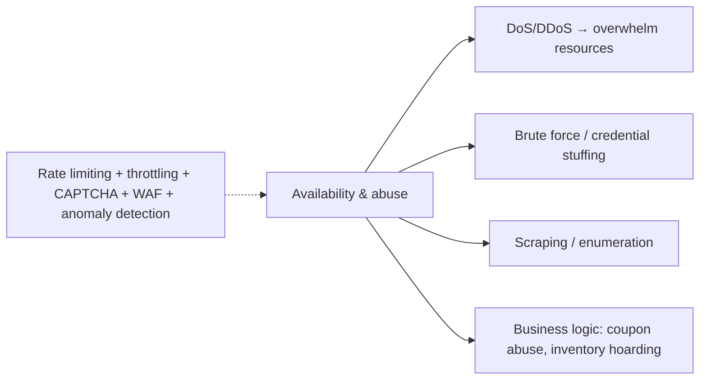

> [!TIP]
> Not all attacks steal data — some abuse **availability** or **business logic**. **Rate limiting** (at the [[06 API Gateway]]/[[05 Nginx]], returning `429` — [[01 HTTP Deep Dive]]) is a foundational, multi-purpose defense: it blunts brute-force/credential-stuffing, scraping, enumeration, and application-layer DoS. **DDoS** (distributed floods) needs upstream defenses (CDN, cloud scrubbing). **Business-logic abuse** is subtle — no "bug," just legitimate features used maliciously (applying a coupon infinitely, reserving all inventory, exploiting a race condition to double-spend). These require *domain-specific* controls and are exactly what **A04 Insecure Design** / threat modeling catches (you must *anticipate* abuse of your specific workflows). A **WAF** (Web Application Firewall) adds a filtering layer for known attack patterns, but is a supplement — not a substitute — for secure code.

### 3.6 Failure Scenarios & the Cost of Getting It Wrong

| Vulnerability | Real-world impact |
|---|---|
| **SQL injection** | Full DB dump, data destruction, auth bypass |
| **XSS** | Account takeover, session/token theft, worms |
| **Broken access control** | Mass data breach (IDOR enumeration) |
| **SSRF** | Cloud credential theft → full infra compromise |
| **Weak auth** | Account takeover at scale (credential stuffing) |
| **Insecure deserialization** | Remote code execution (server takeover) |
| **Exposed secrets** | Full system compromise (leaked keys in Git) |
| **Vulnerable dependency** | Log4Shell-style mass exploitation |

> [!WARNING]
> Security failures are uniquely costly because they're **actively exploited by intelligent adversaries** and often catastrophic + irreversible: a leaked database can't be un-leaked, stolen credentials enable ongoing access, and breaches carry legal/regulatory (GDPR fines), financial, and reputational damage. **Log4Shell** (2021) showed how a single vulnerable dependency (A06) in a ubiquitous logging library gave RCE to millions of servers overnight — you were vulnerable through code you never wrote. **Capital One** (SSRF → AWS metadata) and countless **S3 bucket** leaks (misconfiguration) show that the *boring* categories (config, dependencies, access control) cause the biggest breaches — not exotic exploits. This is why security must be **systematic and continuous** (scanning, patching, monitoring), not a one-time review. The asymmetry is brutal: defenders must close *every* hole; attackers need *one*.

---

## 4. 🏗️ REAL-WORLD SYSTEM DESIGN USAGE

### 4.1 Defense in depth — layered security

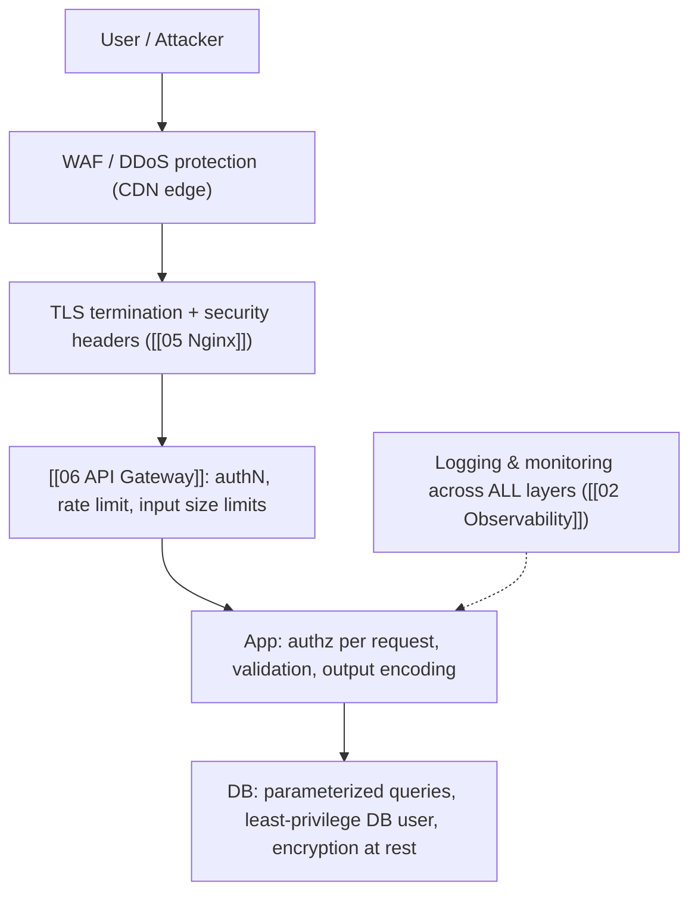

> [!IMPORTANT]
> Real security is **layered (defense in depth)** — no single control is trusted. At the **edge**: CDN/WAF filters volumetric and known-pattern attacks. At the **proxy** ([[05 Nginx]]): TLS, security headers, request limits. At the **gateway** ([[06 API Gateway]]): authentication ([[01 OAuth2 OIDC and JWT]]), rate limiting, payload-size caps. In the **app**: per-request authorization, input validation, output encoding, CSRF tokens. At the **data layer**: parameterized queries, a **least-privilege database account** (the app's DB user shouldn't be able to DROP tables), and encryption at rest. And spanning everything: **logging and monitoring** to detect what gets through ([[02 Observability]], A09). The point of layering: an attacker who bypasses one control still faces the next, and each layer both *prevents* and *detects*. Designing this into a [[03 Microservices]]/[[01 System Design Fundamentals]] architecture is a core senior responsibility.

### 4.2 Secure SDLC — shifting left

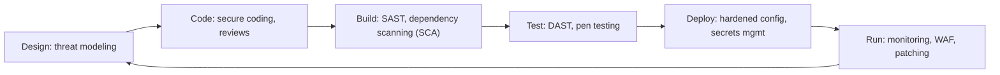

> [!TIP]
> Modern security is **"shifted left"** — built into every phase of the development lifecycle rather than bolted on before release (or after a breach). **Threat modeling** at design (A04). **Secure coding + code review** during development. **SAST** (static analysis — scans your code) and **SCA/dependency scanning** (checks libraries for known CVEs — A06) in CI ([[07 CICD GitHub Actions]]). **DAST** (dynamic scanning of the running app) and periodic **penetration testing**. **Secrets management** (vaults, not Git) and hardened configs at deploy. **Monitoring + patching** in production. Automating security in the pipeline (scanning on every PR) makes it continuous and cheap, versus expensive manual audits. This DevSecOps integration is increasingly what "senior" means — security is everyone's job, embedded in the workflow.

### 4.3 Practical secure-coding defaults

| Concern | Secure default |
|---|---|
| DB access | Parameterized queries / ORM ([[08 JPA vs Hibernate]]) |
| HTML output | Auto-escaping framework ([[08 React]]); context-aware encoding |
| Passwords | bcrypt/Argon2 (never MD5/SHA/plaintext) |
| Auth | Proven IdP/framework ([[01 OAuth2 OIDC and JWT]], [[10 Spring Security]]) |
| Secrets | Secrets manager / env vars, never in code |
| Cookies | HttpOnly, Secure, SameSite |
| Headers | CSP, HSTS, nosniff via gateway/[[05 Nginx]] |
| Access control | Deny by default; check ownership every request |
| Dependencies | Automated scanning + regular updates |
| Errors | Generic to users, detailed to logs |

> [!IMPORTANT]
> The most effective security strategy is **secure defaults** — making the safe path the easy/default path so developers don't have to remember to be secure on every line. Using an ORM (parameterized by default), an auto-escaping template engine ([[08 React]]), a proven auth framework ([[10 Spring Security]]), a secrets manager, and a gateway that sets security headers means most OWASP risks are handled *by construction*. The dangerous moments are when you *bypass* the safe default — raw SQL, `dangerouslySetInnerHTML`, custom crypto, `role` from the client. Train yourself to feel a flash of suspicion whenever you leave the guardrails. This "pit of success" design — where the easy way is the secure way — is how large teams stay secure at scale.

---

## 5. 🎤 INTERVIEW PREPARATION

### 5.1 Most important questions

<details>
<summary><b>Q1: What is SQL injection and how do you prevent it?</b></summary>

SQL injection is when user input is concatenated into a SQL query, letting the attacker inject SQL commands (e.g., `' OR '1'='1` to bypass login, or `'; DROP TABLE users; --`). The definitive fix is **parameterized queries / prepared statements** — the query structure and the data are sent separately, so input is always treated as data and can never alter the query. ORMs parameterize by default. Never build queries with string concatenation; add input validation and least-privilege DB accounts as supporting layers.
</details>

<details>
<summary><b>Q2: XSS — types and defenses?</b></summary>

XSS injects JavaScript that runs in victims' browsers (session/token theft, account takeover). Types: **stored** (script saved in DB, served to all), **reflected** (script in a URL reflected back), **DOM-based** (client JS writes untrusted data to the DOM). Defenses: **output encoding/escaping** (context-aware — the primary fix; frameworks like React auto-escape), **Content Security Policy** (blocks injected scripts), **HttpOnly cookies** (so scripts can't read the session), and input validation. Watch for `innerHTML`/`dangerouslySetInnerHTML` which bypass auto-escaping.
</details>

<details>
<summary><b>Q3: What is CSRF and how do you defend against it?</b></summary>

CSRF tricks a logged-in victim's browser into making an unwanted state-changing request, exploiting that browsers auto-attach cookies. The attacker's site triggers a request to your site; the browser sends the victim's session cookie, so the server thinks it's legitimate. Defenses: **CSRF tokens** (unpredictable per-form token the attacker can't know), **SameSite cookies** (Lax/Strict — now default), and Origin/Referer checks. Header-based bearer tokens are inherently CSRF-resistant since browsers don't auto-attach headers.
</details>

<details>
<summary><b>Q4: What's the #1 OWASP risk and what does it look like?</b></summary>

**Broken Access Control (A01).** The app fails to enforce what users are allowed to do. The most common form is **IDOR** — `GET /api/orders/1002` returns the order without checking ownership, so an attacker increments the ID to read others' data. Also: accessing admin functions without authorization, trusting a client-sent role. Fix: enforce authorization server-side on every request based on the authenticated user, deny by default, never trust IDs/roles/paths from the client, and remember hiding a UI button isn't access control.
</details>

<details>
<summary><b>Q5: How should passwords be stored?</b></summary>

Hashed with a **slow, salted, password-specific algorithm** — **bcrypt, scrypt, or Argon2** — never plaintext, never encrypted (you never need to reverse a password), and never with fast general hashes (MD5/SHA-256 crack at billions/sec). The salt (unique per password) defeats rainbow tables; the deliberate slowness makes brute-force expensive. Add rate limiting on login and MFA. Ideally, use a proven auth framework/IdP rather than implementing this yourself.
</details>

<details>
<summary><b>Q6: What is SSRF and why is it dangerous in the cloud?</b></summary>

Server-Side Request Forgery: the app fetches an attacker-controlled URL without validation, letting the attacker reach internal resources the server can access but they can't. In the cloud it's devastating because attackers target the **metadata endpoint** (`169.254.169.254`) to steal IAM credentials (the Capital One breach). Defenses: allowlist outbound destinations, block private/internal IPs and the metadata IP, disable risky URL schemes, and use IMDSv2.
</details>

<details>
<summary><b>Q7: Walk through defense in depth for a web app.</b></summary>

Layer controls so no single failure is fatal: **edge** (WAF/DDoS/CDN), **proxy** (TLS, security headers), **gateway** (authentication, rate limiting, size limits), **app** (per-request authorization, input validation, output encoding, CSRF tokens), **data** (parameterized queries, least-privilege DB user, encryption at rest), and **cross-cutting** logging/monitoring to detect what gets through. Each layer both prevents and detects; an attacker bypassing one still faces the next.
</details>

<details>
<summary><b>Q8: How do you handle a vulnerable dependency (like Log4Shell)?</b></summary>

Prevent via continuous **dependency scanning (SCA)** in CI that flags known CVEs, keep dependencies patched, maintain an SBOM (inventory of what you ship), and minimize dependencies. When a critical CVE drops: assess exposure (are you using the vulnerable path?), patch/upgrade urgently, apply mitigations (config/WAF rules) if a patch isn't ready, and monitor for exploitation attempts. Log4Shell showed you're exposed through transitive dependencies you didn't choose — hence automated, continuous scanning is essential (A06).
</details>

### 5.2 Tricky questions

> [!TIP]
> **"Is input validation enough to stop XSS/SQLi?"** — No. Input validation is a helpful *supporting* layer, but the *definitive* fixes are **output encoding** (XSS — the problem is at output/rendering time, in a specific context) and **parameterized queries** (SQLi — separating code from data). Relying on input filtering alone is fragile (encodings, edge cases bypass filters).

> [!TIP]
> **"XSS vs CSRF — what's the difference?"** — XSS runs *attacker's script on your site* (in the victim's browser) — an injection/execution problem, defended by output encoding + CSP. CSRF makes the *victim's browser send a request to your site* without running your-site script — defended by CSRF tokens + SameSite. XSS can actually *defeat* CSRF defenses (a script on your page can read the CSRF token), so XSS is the more fundamental threat.

> [!TIP]
> **"Why not just hide the admin button from non-admins?"** — Because that's client-side UI, and the attacker calls the API directly (curl/Postman), bypassing your UI entirely. Access control must be enforced *server-side* on the endpoint. Hiding UI is UX, not security — the same "never trust the client" principle.

> [!TIP]
> **"Is HTTPS enough to be secure?"** — No. HTTPS/TLS protects data *in transit* (confidentiality/integrity/authenticity on the wire), but does nothing against injection, XSS, broken access control, weak auth, etc. — which all operate at the application layer over a perfectly encrypted connection. HTTPS is necessary but far from sufficient.

### 5.3 Common mistakes candidates make

| Mistake | Reality |
|---|---|
| "Input validation prevents SQLi/XSS" | Parameterization + output encoding are the real fixes |
| Client-side validation as security | Attacker bypasses the client entirely |
| "HTTPS = secure" | Only protects transit; app-layer attacks remain |
| Storing passwords with MD5/SHA | Use bcrypt/scrypt/Argon2 (slow + salted) |
| Hiding UI = access control | Enforce authz server-side on every request |
| Confusing XSS and CSRF | Different attacks, different defenses |
| Secrets in code/Git | Use a secrets manager/vault |
| "We're too small to be targeted" | Automated bots attack everyone |

### 5.4 What interviewers actually expect

- **"Never trust input / never trust the client"** as the unifying principle.
- **Injection** (SQLi) and its fix (**parameterized queries**), plus XSS (**output encoding + CSP**).
- **CSRF** (SameSite/tokens) and how it differs from XSS.
- **Broken Access Control / IDOR** — enforce authz server-side per request.
- **Password storage** (bcrypt/Argon2) and **auth** best practices (MFA, rate limiting).
- **SSRF** and cloud metadata; **dependency**/supply-chain risk.
- **Defense in depth** and secure-by-default design.

---

## 6. 🛠️ HANDS-ON PROJECTS

### Project 1: Exploit & Fix a Vulnerable App (Beginner→Intermediate)

**Goal:** *Attack* to understand *defense* (in a safe, legal sandbox).

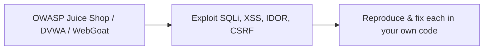

**Steps:**
1. Run **OWASP Juice Shop** (or DVWA/WebGoat) locally — a deliberately vulnerable app.
2. Perform **SQL injection** to bypass login and dump data.
3. Perform **stored + reflected XSS**; steal a (fake) cookie.
4. Exploit **IDOR** by changing IDs; access another user's data.
5. In your *own* small app, reproduce each vuln, then fix it (parameterized queries, output encoding, ownership checks) and verify the exploit fails.

> [!WARNING]
> Only attack systems you own or are explicitly authorized to test. Use the intentionally-vulnerable training apps — never test on systems without permission (it's illegal).

**Learn:** how attacks actually work, why each defense exists, hands-on exploitation + remediation.

---

### Project 2: Secure an API End-to-End (Intermediate→Senior)

**Goal:** Build a genuinely hardened API.

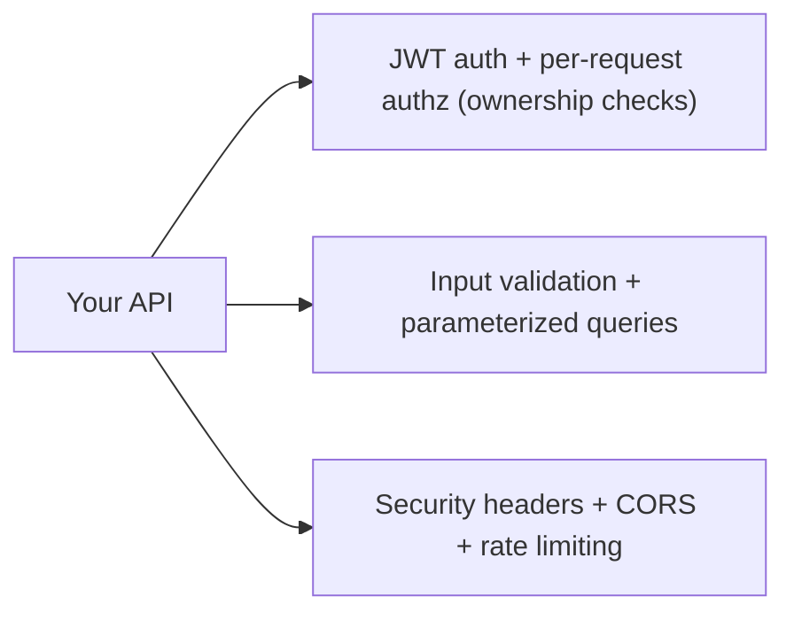

**Steps:**
1. Build an API ([[05 Spring Boot]]/[[06 Express.js]]) with [[01 OAuth2 OIDC and JWT]] auth.
2. Enforce **per-resource authorization** (ownership checks — defeat IDOR).
3. Use **parameterized queries**/ORM; add input validation.
4. Add **security headers** (CSP, HSTS), correct **CORS**, `HttpOnly`/`Secure`/`SameSite` cookies.
5. Add **rate limiting** (→429) and generic error responses (no stack traces).
6. Store passwords with **bcrypt/Argon2**.

**Learn:** applying every core defense together in a realistic service.

---

### Project 3: Security in the CI/CD Pipeline (Senior)

**Goal:** Automate security — shift left.

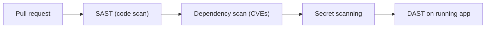

**Steps:**
1. Add **dependency scanning** (SCA — e.g., Dependabot/Snyk/OWASP Dependency-Check) to [[07 CICD GitHub Actions]]; break the build on critical CVEs.
2. Add **SAST** (static code analysis) and **secret scanning** (catch committed keys).
3. Run **DAST** (e.g., OWASP ZAP) against a deployed test instance.
4. Integrate **secrets management** (vault/env, remove secrets from code).
5. Add security-event **logging + alerting** ([[02 Observability]]).

**Learn:** DevSecOps, SAST/DAST/SCA, secrets management, continuous security.

---

## 7. 🔬 DEEP DIVE: INTERNALS

### 7.1 Why bcrypt/Argon2 and not SHA-256 (password hashing internals)

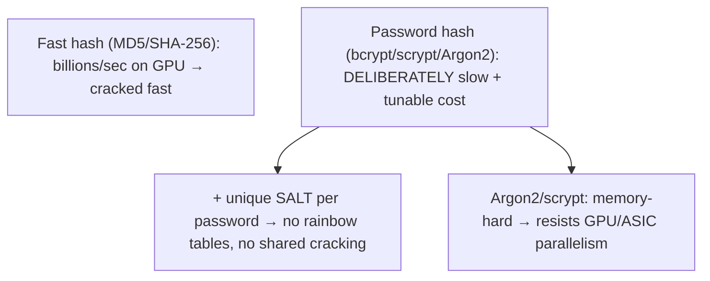

> [!IMPORTANT]
> The crucial insight: **general-purpose hashes (SHA-256, MD5) are designed to be *fast*, which is exactly wrong for passwords.** A GPU computes billions of SHA-256/sec, so a stolen hash database is cracked quickly. **Password hashing functions are deliberately *slow* and *tunable*:** **bcrypt** has a configurable "cost factor" (each increment doubles the work — you raise it as hardware improves); **scrypt** and **Argon2** are additionally **memory-hard** (they require large amounts of RAM, which defeats the massive parallelism of GPUs/ASICs — you can't cheaply run millions in parallel if each needs megabytes). Every password gets a **unique random salt** stored alongside the hash, so identical passwords produce different hashes (defeating precomputed **rainbow tables**) and each must be cracked individually. **Argon2** (the modern winner of the Password Hashing Competition) is the current recommendation. This is a beautiful case of *intentionally inefficient* cryptography — slowness *is* the security feature.

### 7.2 How Content Security Policy stops XSS

```mermaid
flowchart LR
    CSP["Content-Security-Policy: script-src 'self' https://trusted.cdn"] --> Browser["Browser enforces"]
    Browser --> Block["Inline <script> and unlisted sources BLOCKED"]
    Injected["Attacker's injected <script> (inline)"] --> Blocked["❌ Refused to execute — even if XSS injected it"]
```

> [!TIP]
> **CSP** is a *defense-in-depth* layer against XSS that works even when output encoding fails. It's an HTTP response header ([[01 HTTP Deep Dive]]) declaring an **allowlist of trusted sources** for scripts, styles, images, etc. The browser then **refuses to load or execute anything not on the list** — critically, `script-src 'self'` blocks **inline scripts** and scripts from other origins, so an attacker who *does* manage to inject `<script>evil()</script>` finds it simply won't run (the browser refuses inline execution). Modern CSP uses **nonces** or **hashes** to allow specific known-good inline scripts while blocking injected ones. CSP doesn't *prevent* the injection — it *contains* the blast radius, embodying "assume a control will fail, and have another behind it." A well-configured CSP is one of the highest-value security headers, though it takes effort to deploy without breaking legitimate scripts.

### 7.3 The Same-Origin Policy — the browser's foundational boundary

```mermaid
flowchart TB
    SOP["Same-Origin Policy: origin = scheme + host + port"] --> Same["Same origin → JS can read the response"]
    SOP --> Cross["Different origin → JS is BLOCKED from reading (CORS can relax)"]
    Note["The fundamental isolation that makes CSRF need cookies & CORS exist"] -.-> SOP
```

> [!IMPORTANT]
> The **Same-Origin Policy (SOP)** is the bedrock of browser security — the reason the web is (somewhat) safe despite running untrusted code from every site you visit. An **origin** is the triple `scheme://host:port`; SOP dictates that JavaScript from one origin generally **cannot read** data from another origin. Without it, a malicious tab could read your open Gmail, bank, etc. This single policy is *why* so many web-security mechanisms exist as they do: **CORS** ([[01 HTTP Deep Dive]]) is the controlled *relaxation* of SOP (a server opting to share); **CSRF** exists *because* SOP blocks *reading* responses but not *sending* requests (with cookies auto-attached), so attackers exploit state-changing requests they can't read; **`SameSite` cookies** patch that gap. Understanding SOP unifies CORS, CSRF, XSS, and cookie policy — they're all facets of managing cross-origin trust in the browser. It's the constitutional law of web security.

### 7.4 Timing attacks & constant-time comparison

```mermaid
flowchart LR
    Naive["Naive compare: return false at first differing char"] --> Leak["Response time leaks HOW MUCH matched → attacker guesses secret char-by-char"]
    Constant["Constant-time compare: always checks all chars"] --> Safe["No timing signal → secret protected"]
```

> [!TIP]
> A subtle, advanced class: **timing attacks** exploit that *how long* an operation takes can leak secret information. A naive string comparison (`==`) returns as soon as it finds a mismatched character — so comparing an attacker's guess to a secret token/password/HMAC takes *microscopically longer* the more leading characters match. By measuring response times over many requests, an attacker can reconstruct the secret one character at a time. The defense is **constant-time comparison** — always comparing the full length regardless of where mismatches occur (libraries provide `hmac.compare_digest`, `MessageDigest.isEqual`, `crypto.timingSafeEqual`). This matters for comparing security tokens, HMAC signatures ([[01 OAuth2 OIDC and JWT]] JWT verification), API keys, and CSRF tokens. It's a reminder that security bugs live not just in logic but in *physical execution characteristics* — the same lesson as cache-timing side channels in [[04 Java Concurrency and JVM]]. Most developers never think about it, which is exactly why it's a strong senior signal.

### 7.5 Supply-chain attacks & the trust boundary

```mermaid
flowchart TB
    You["Your code (you review it)"] --> Deps["Dependencies (you DON'T review — huge trust)"]
    Deps --> Trans["Transitive deps (deps of deps — you don't even know them all)"]
    Trans --> Risk["A compromise ANYWHERE runs with YOUR privileges"]
    Build["Build tools, CI/CD, base images also part of the chain"] -.-> Risk
```

> [!WARNING]
> The **software supply chain** is the modern security frontier (OWASP A06/A08). Your application is mostly code you *didn't write* — dependencies, their transitive dependencies, base [[01 Docker]] images, build tools, [[07 CICD GitHub Actions]] runners. You implicitly *trust* all of it, and any compromise anywhere executes with your app's privileges. Attack vectors: a popular package gets **hijacked** (maintainer account compromised, or malicious version published — e.g., `event-stream`, `xz`), **typosquatting** (`reqeusts` vs `requests`), a poisoned **base image**, or a compromised **build pipeline** that injects malware into your artifacts (SolarWinds). **Log4Shell** wasn't even malicious — just a vulnerability in trusted code exploited at scale. Defenses: **pin and verify** dependency versions (lockfiles, checksums, signatures), automated **SCA scanning**, minimal dependencies, **SBOMs** (know exactly what you ship), signed builds/provenance (SLSA), and least-privilege CI. The uncomfortable truth: you're only as secure as the least-secure package in a dependency tree you can't fully audit — which is why *verification and minimization* matter more than ever.

---

## ✅ Production Checklists

### Input & Output
- [ ] **Parameterized queries** everywhere (no string-built SQL)
- [ ] **Output encoding** (context-aware); auto-escaping framework
- [ ] **CSP** deployed (defense-in-depth for XSS)
- [ ] Input validation (allowlist) as a supporting layer
- [ ] File uploads validated (type, size, storage location)

### Auth & Access
- [ ] **Authorization enforced server-side on every request** (no IDOR)
- [ ] Deny by default; ownership checks per resource
- [ ] Passwords hashed with **bcrypt/scrypt/Argon2** + salt
- [ ] **MFA** on sensitive accounts; login rate-limited
- [ ] Secure sessions (random tokens, expiry, HttpOnly/Secure/SameSite)
- [ ] **CSRF** protection (SameSite + tokens for cookie-auth)

### Data & Config
- [ ] **TLS everywhere** + HSTS; encrypt sensitive data at rest
- [ ] **No secrets in code/Git**; use a secrets manager
- [ ] Security headers (CSP, HSTS, nosniff, X-Frame-Options)
- [ ] No default credentials; hardened configs; generic errors
- [ ] **SSRF** defenses (allowlist, block internal/metadata IPs)

### Process
- [ ] **Dependency scanning (SCA)** + patching in CI ([[07 CICD GitHub Actions]])
- [ ] SAST/DAST + secret scanning in the pipeline
- [ ] Security **logging + monitoring + alerting** ([[02 Observability]])
- [ ] Rate limiting / WAF at the edge ([[06 API Gateway]])
- [ ] Incident response plan; regular pen testing

---

## 🗺️ Learning Roadmap

```mermaid
flowchart TB
    A["1️⃣ Mindset<br/>never trust input, CIA, attacker thinking"] --> B["2️⃣ Injection & XSS<br/>parameterization, output encoding"]
    B --> C["3️⃣ CSRF & access control<br/>SameSite, tokens, IDOR, authz"]
    C --> D["4️⃣ Auth & crypto<br/>hashing, MFA, TLS, secrets"]
    D --> E["5️⃣ Full OWASP Top 10<br/>SSRF, misconfig, deserialization, deps"]
    E --> F["6️⃣ Defense in depth<br/>layered controls, secure defaults"]
    F --> G["7️⃣ Internals<br/>hashing, CSP, SOP, timing, supply chain"]
    G --> H["8️⃣ DevSecOps<br/>SAST/DAST/SCA, threat modeling, monitoring"]
```

| Stage | Focus | You can... |
|---|---|---|
| 1–3 | Core attacks | Prevent injection, XSS, CSRF, IDOR |
| 4–5 | Full picture | Cover the whole OWASP Top 10 |
| 6 | Architecture | Design layered, secure-by-default systems |
| 7–8 | Depth + process | Reason deeply and automate security |

---

## 🔁 Self-Review Completion Loop

Reviewed against the OWASP Top 10 (2021), OWASP Cheat Sheet Series, OWASP ASVS, and the OWASP Testing Guide.

### Gap Review Matrix

| Dimension | Covered? | Where |
|---|---|---|
| Security mindset / CIA | ✅ | §1 |
| OWASP Top 10 overview | ✅ | §1, §3.1 |
| SQL injection | ✅ | §2.1 |
| XSS (all types) | ✅ | §2.2 |
| CSRF | ✅ | §2.3 |
| Broken access control / IDOR | ✅ | §2.4 |
| Auth failures | ✅ | §2.5 |
| Crypto failures / data exposure | ✅ | §2.6 |
| Full Top 10 table | ✅ | §3.1 |
| SSRF | ✅ | §3.2 |
| Insecure deserialization/integrity | ✅ | §3.3 |
| Security misconfiguration | ✅ | §3.4 |
| Rate limiting / DoS / logic abuse | ✅ | §3.5 |
| Real-world impact | ✅ | §3.6 |
| Defense in depth | ✅ | §4.1 |
| Secure SDLC / shift left | ✅ | §4.2 |
| Secure defaults | ✅ | §4.3 |
| Password hashing internals | ✅ | §7.1 |
| CSP internals | ✅ | §7.2 |
| Same-Origin Policy | ✅ | §7.3 |
| Timing attacks | ✅ | §7.4 |
| Supply chain | ✅ | §7.5 |
| Interview Q&A + mistakes | ✅ | §5 |
| Hands-on projects | ✅ | §6 |

> [!NOTE]
> **Remaining depth to explore independently:** OWASP ASVS (verification standard) and the API Security Top 10 (distinct list), threat modeling frameworks (STRIDE, attack trees), OAuth/OIDC-specific attacks (token replay, PKCE, redirect manipulation — [[01 OAuth2 OIDC and JWT]]), clickjacking deep-dive, subdomain takeover, JWT-specific attacks (alg confusion — [[01 OAuth2 OIDC and JWT]]), cloud security (IAM, least privilege, misconfig), container/K8s security ([[02 Kubernetes]], [[01 Docker]]), zero-trust architecture, secrets rotation, WAF tuning, and security in [[03 Microservices]] (mTLS, service identity).

---

## 📚 Official References

| Resource | Source |
|---|---|
| OWASP Top 10 (2021) | https://owasp.org/www-project-top-ten/ |
| OWASP Cheat Sheet Series | https://cheatsheetseries.owasp.org/ |
| OWASP ASVS (Application Security Verification Standard) | https://owasp.org/www-project-application-security-verification-standard/ |
| OWASP Juice Shop (practice) | https://owasp.org/www-project-juice-shop/ |
| PortSwigger Web Security Academy (free labs) | https://portswigger.net/web-security |
| MDN — Web security | https://developer.mozilla.org/en-US/docs/Web/Security |
| OWASP API Security Top 10 | https://owasp.org/www-project-api-security/ |
| Argon2 / Password Hashing Competition | https://www.password-hashing.net/ |

---

## 🎁 Final Summary

> [!IMPORTANT]
> **The one-paragraph takeaway:** Web security starts with one mindset — **never trust input, never trust the client** (the attacker fully controls the browser and can send anything), so **all security must be enforced server-side**. Nearly every OWASP Top 10 risk is a form of misplaced trust. **Injection** (A03) — including **SQL injection** — happens when input is interpreted as code; the definitive fix is **parameterized queries** (separate code from data), never string concatenation. **XSS** is injection into the browser; defend with **context-aware output encoding** (frameworks auto-escape — beware `innerHTML`/`dangerouslySetInnerHTML`), **CSP** as defense-in-depth, and **HttpOnly cookies**. **CSRF** abuses browsers auto-attaching cookies; defend with **`SameSite` cookies** and **CSRF tokens** (header-based bearer tokens are inherently immune). **Broken Access Control (A01, the #1 risk)** — especially **IDOR** — means failing to check that a user owns/can access a resource; enforce **authorization on every request, server-side, deny-by-default** (hiding a UI button is not access control). Store passwords with **slow, salted, memory-hard hashes (bcrypt/scrypt/Argon2)** — never plaintext or fast hashes — and add **MFA + rate limiting**. Protect data with **TLS everywhere + encryption at rest**, keep **secrets out of code/Git**, and never roll your own crypto. Know the rest of the Top 10: **SSRF** (A10 — attacker-controlled server-side fetches reaching cloud metadata/internal services — allowlist and block internal IPs), **insecure deserialization** (A08 — RCE from untrusted data), **security misconfiguration** (A05 — defaults, verbose errors, open buckets), **vulnerable dependencies** (A06 — Log4Shell-style supply-chain risk, defended by continuous scanning), and **logging failures** (A09 — you must *detect* breaches). Architect **defense in depth** (edge WAF → proxy TLS/headers → gateway auth/rate-limit → app authz/validation/encoding → data parameterization/least-privilege → monitoring everywhere) and **secure defaults** so the easy path is the safe path, then **shift security left** into the pipeline (SAST/DAST/SCA, secrets management, threat modeling). The asymmetry is unforgiving — you must close every hole; the attacker needs only one — which is why security is systematic, continuous, and everyone's job.

**Golden rules:**
1. 🚫 **Never trust input; never trust the client** — enforce everything server-side.
2. 💉 Stop injection with **parameterized queries** — never string-concatenate SQL.
3. 🖥️ Stop XSS with **context-aware output encoding** + **CSP** + HttpOnly cookies.
4. 🎣 Stop CSRF with **SameSite cookies** + **CSRF tokens** (bearer tokens are immune).
5. 🔑 **Enforce authorization on every request** (deny by default) — UI hiding ≠ access control.
6. 🔒 Hash passwords with **bcrypt/scrypt/Argon2** (slow + salted); add **MFA**.
7. 📜 **Secrets never in code/Git**; TLS everywhere; encrypt at rest; don't roll your own crypto.
8. 🌐 Defend **SSRF** — allowlist outbound URLs, block internal/metadata IPs.
9. 📦 **Scan dependencies continuously** — you're exposed through code you didn't write.
10. 🛡️ **Defense in depth + secure defaults + shift left** — layer controls; make safe the default.

---

*Related guides in this vault: [[01 OAuth2 OIDC and JWT]] · [[01 HTTP Deep Dive]] · [[02 REST API Design]] · [[10 Spring Security]] · [[06 API Gateway]] · [[02 Postgres]] · [[08 JPA vs Hibernate]] · [[01 System Design Fundamentals]] · [[07 CICD GitHub Actions]] · [[02 Observability]]*
