# 🧪 Testing Strategies — Complete Beginner-to-Expert Reference

> How to build software that *works and keeps working* — the **testing pyramid**, unit/integration/e2e tests, **TDD**, mocking, test doubles, contract testing, coverage, flaky tests, and the strategy that makes a codebase safe to change fast.

---

## 📑 Table of Contents

1. [Executive Summary](#-executive-summary)
2. [Fundamentals (Beginner)](#1--fundamentals-beginner-level)
3. [Core Concepts (Intermediate)](#2--core-concepts-intermediate-level)
4. [Advanced Concepts (Senior)](#3--advanced-concepts-senior-level)
5. [Real-World System Design](#4--real-world-system-design-usage)
6. [Interview Preparation](#5--interview-preparation)
7. [Hands-On Projects](#6--hands-on-projects)
8. [Deep Dive: Internals](#7--deep-dive-internals)
9. [Production Checklists](#-production-checklists)
10. [Learning Roadmap](#-learning-roadmap)
11. [Self-Review Completion Loop](#-self-review-completion-loop)
12. [Official References](#-official-references)
13. [Final Summary](#-final-summary)

---

## 🎯 Executive Summary

**Testing** is the practice of writing automated checks that verify your code behaves correctly — and *keeps* behaving correctly as it changes. The goal isn't "prove there are no bugs" (impossible) — it's **confidence to change code fast without breaking things**. A good test strategy is a *layered* one: many fast, focused **unit tests**, fewer **integration tests** that verify components work together, and a small number of **end-to-end tests** that validate whole user journeys.

| What it is | What it replaces | Core superpower |
|---|---|---|
| Automated, layered verification of behavior | Manual testing, "works on my machine," fear of changing code | **Confidence to refactor and ship fast** — a safety net that catches regressions instantly |

> [!IMPORTANT]
> The mental shift that makes testing click: **tests are not about proving correctness — they're about enabling *change*.** A codebase without tests becomes *fragile* — every change risks breaking something invisible, so developers slow down, fear refactoring, and bugs pile up. A well-tested codebase is *malleable* — you refactor boldly because the tests instantly tell you if you broke something. The best tests verify **behavior** (what the code *does* for a user) not **implementation** (how it does it internally), so they survive refactoring. And the strategy matters more than the quantity: the **testing pyramid** — lots of fast unit tests, some integration tests, few slow e2e tests — gives you the best confidence-per-second. This connects to nearly everything: [[05 Spring Boot]], [[08 React]], [[07 CICD GitHub Actions]] (tests run in the pipeline), and [[03 Microservices]] (contract testing).

Related guides: [[07 CICD GitHub Actions]] · [[05 Spring Boot]] · [[08 React]] · [[03 Microservices]] · [[02 REST API Design]] · [[01 Docker]] · [[01 System Design Fundamentals]]

---

## 1. 🌱 FUNDAMENTALS (Beginner Level)

### Why test at all?

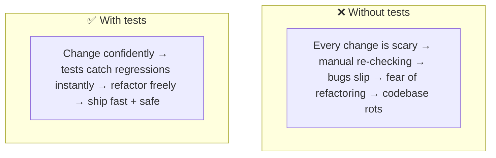

> [!IMPORTANT]
> The real value of automated tests isn't catching bugs *once* — it's catching them **forever, automatically, in seconds**. Manual testing doesn't scale: you can't re-click through every feature on every change. Automated tests re-verify everything on every commit ([[07 CICD GitHub Actions]]), so a mistake made today that breaks a feature from six months ago is caught *immediately*, before it reaches users. This transforms how you work: instead of fearing change, you refactor and add features boldly, because the tests are a **safety net**. A codebase's *velocity over time* is largely determined by its test quality — untested code slows to a crawl as it grows; well-tested code stays fast to change.

### What is a test? (Arrange-Act-Assert)

```java
@Test
void addingItemsIncreasesCartTotal() {
    // ARRANGE — set up the scenario
    Cart cart = new Cart();
    Item item = new Item("Book", 10.00);

    // ACT — perform the action under test
    cart.add(item);

    // ASSERT — verify the expected outcome
    assertEquals(10.00, cart.getTotal());
}
```

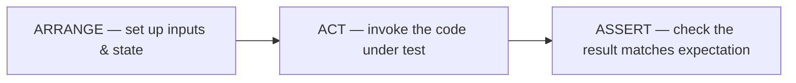

> [!TIP]
> Every good test follows **Arrange-Act-Assert (AAA)** (also called Given-When-Then): set up the scenario, perform the action, verify the outcome. This structure makes tests readable and focused. Two rules of thumb: **test one behavior per test** (a failing test should point to one specific problem), and **name tests to describe the behavior** (`addingItemsIncreasesCartTotal`, not `test1`) — a good test name reads like a specification of what the system does. When a well-named test fails in CI, you know *exactly* what broke without even reading the code.

### The Testing Pyramid

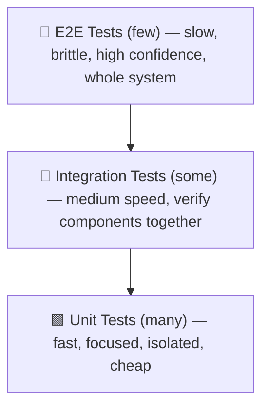

| Layer | Scope | Speed | Count | Confidence per test |
|---|---|---|---|---|
| **Unit** | One function/class in isolation | ⚡ ms | Many (70%) | Low individually |
| **Integration** | Multiple components together (+ DB, etc.) | 🐢 100s ms | Some (20%) | Medium |
| **E2E** | Whole system via the UI/API | 🐌 seconds | Few (10%) | High but expensive |

> [!IMPORTANT]
> The **testing pyramid** (Mike Cohn) is the foundational strategy: **write many fast unit tests, fewer integration tests, and only a few end-to-end tests.** Why this shape? Unit tests are **fast and precise** — they run in milliseconds and pinpoint exactly what broke, so you can have thousands. E2E tests are **slow, brittle, and expensive** — they exercise the whole system (realistic!) but take seconds each, break for unrelated reasons (flakiness), and only tell you "something's wrong somewhere." The pyramid maximizes **confidence per second of test-run time**. The classic anti-pattern is the **"ice cream cone"** (inverted pyramid) — mostly slow e2e tests, few unit tests — which gives a slow, flaky, hard-to-maintain suite. Balance is the skill: enough e2e to know the system works end-to-end, but built on a broad base of fast unit tests.

### Real-world analogy 🚗

Testing a car:
- **Unit tests** = testing each part in isolation on a bench — does the spark plug fire? the brake pad grip? Fast, cheap, precise (you know *exactly* which part failed).
- **Integration tests** = testing subsystems together — does the engine + transmission work as a drivetrain? Catches interface problems parts-in-isolation can't.
- **E2E tests** = actually driving the car around a track — the real experience, but slow, and if it fails you don't immediately know *which* part is at fault.
- You wouldn't ship a car tested *only* by full test-drives (too slow to find issues) *or* only by bench-testing parts (they might not work together). You need **all layers, weighted toward the cheap ones**.

> [!TIP]
> Beginner takeaway: tests are automated safety nets that let you change code fearlessly. Structure them as a **pyramid** — a broad base of fast unit tests, a middle of integration tests, a thin top of e2e tests. Each test follows **Arrange-Act-Assert** and verifies *one behavior*. The goal is confidence to ship fast, not 100% bug-freedom.

---

## 2. 🧩 CORE CONCEPTS (Intermediate Level)

### 2.1 Unit Tests

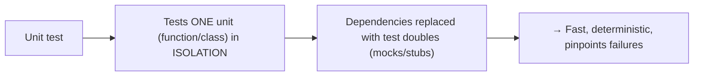

> [!IMPORTANT]
> A **unit test** verifies a single "unit" (a function, method, or class) **in isolation** — its external dependencies (database, network, other services) are replaced with **test doubles** (§2.3) so the test is **fast** (no I/O), **deterministic** (no external flakiness), and **precise** (a failure means *this* unit is broken). Unit tests form the pyramid's base because they're cheap to write and run. The debate is *what counts as a "unit"* — the strict "London school" isolates a single class (mocking all collaborators); the "classicist/Detroit school" tests a small cluster of real objects together (mocking only awkward dependencies like the DB). The classicist approach often produces less brittle tests (fewer mocks tied to implementation). Either way: unit tests should test **behavior and logic**, especially edge cases and business rules — the stuff that's tedious and error-prone to check manually.

### 2.2 Integration & End-to-End Tests

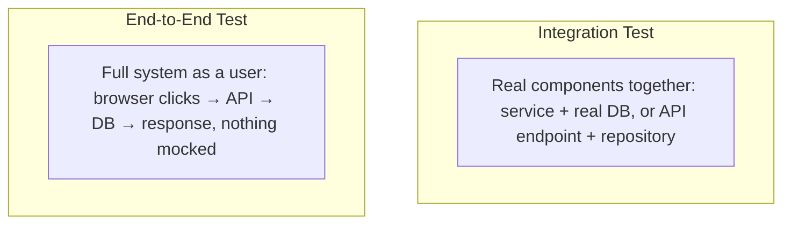

> [!IMPORTANT]
> **Integration tests** verify that components work **together** — the seams unit tests can't cover. Examples: a repository actually querying a **real database** (does the SQL work? do the mappings? — [[01 SQL and Transactions Deep Dive]], [[08 JPA vs Hibernate]]), or an API endpoint through its full request → service → DB path. They catch bugs unit tests miss: wrong SQL, serialization mismatches, misconfigured wiring. They're slower (real I/O) but far more realistic. **End-to-end (e2e) tests** go furthest — driving the *entire* system as a real user would (a browser automating clicks through [[08 React]] → API → DB, nothing mocked). They give the highest confidence that the whole thing works, but are the slowest and most brittle. The key modern enabler: **[[01 Docker]]/Testcontainers** spin up real dependencies (a real Postgres, Kafka, Redis) in a container for integration tests — so you test against the *real thing*, not a fake, without polluting a shared environment.

### 2.3 Test Doubles — Mocks, Stubs, Fakes, Spies

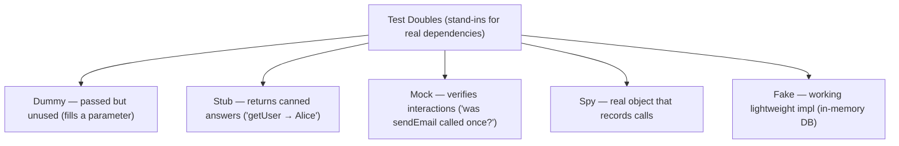

| Double | Purpose |
|---|---|
| **Dummy** | Fills a required parameter, never used |
| **Stub** | Provides predefined return values (state) |
| **Mock** | Verifies *how* it was called (behavior/interactions) |
| **Spy** | Wraps a real object, records interactions |
| **Fake** | A simplified but functional implementation (in-memory repo) |

> [!TIP]
> **Test doubles** replace real dependencies so you can test a unit in isolation — but the types differ in important ways (Gerard Meszaros's taxonomy). A **stub** provides canned data ("when asked for user 5, return Alice") — you use it for **state verification** (check the *result*). A **mock** has *expectations* about *interactions* ("`sendEmail` must be called exactly once with this argument") — you use it for **behavior verification** (check the *calls*). A **fake** is a real working implementation, just lightweight (an in-memory database). The common confusion is calling everything a "mock" (mocking libraries blur the line). The senior insight: **prefer stubs/fakes over strict mocks where possible** — mocks that verify exact interactions couple your test to the *implementation*, so they break when you refactor even if behavior is unchanged. Over-mocking is a top cause of brittle tests.

### 2.4 Test-Driven Development (TDD)

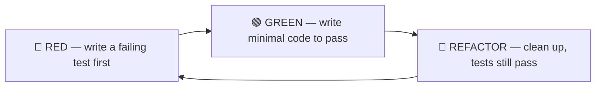

> [!IMPORTANT]
> **TDD** inverts the usual order: write the **test first** (it fails — **red**), write the **minimal code** to make it pass (**green**), then **refactor** with the test as a safety net (**blue**) — repeat in tight cycles. Benefits: it **forces you to design the interface from the caller's perspective** (you write how you *want* to use the code before implementing it), guarantees testable code (you can't write untestable code if the test comes first), gives 100% meaningful coverage by construction, and prevents over-engineering (you only write code a test demands). It's also a *design* discipline as much as a testing one. TDD isn't universal — it shines for logic-heavy code with clear requirements and is awkward for exploratory/UI work — but understanding the **red-green-refactor** loop and *why* test-first improves design is expected of senior engineers. Even if you don't do strict TDD, the habit of asking "how would I test this?" *before* writing code improves the design.

### 2.5 What makes a GOOD test — the FIRST principles

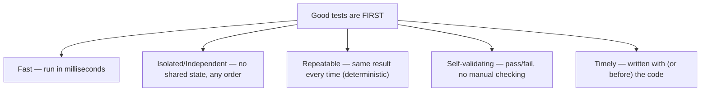

> [!IMPORTANT]
> The **FIRST** principles define a good test: **Fast** (slow tests don't get run), **Isolated** (no dependence on other tests or execution order — shared state is a top cause of flakiness), **Repeatable** (deterministic — same result every run, no dependence on time/network/randomness), **Self-validating** (a clear pass/fail, no human eyeballing output), and **Timely** (written alongside the code). Beyond FIRST, the **single most important property is testing behavior, not implementation**: assert *what* the code produces (outputs, effects observable to a caller), not *how* it works internally (which private methods it calls). Implementation-coupled tests break on every refactor even when nothing's actually wrong — creating "change-detector" tests that punish improvement. A test that survives a refactor but catches a real behavior regression is a *good* test.

### 2.6 Code Coverage — useful and misleading

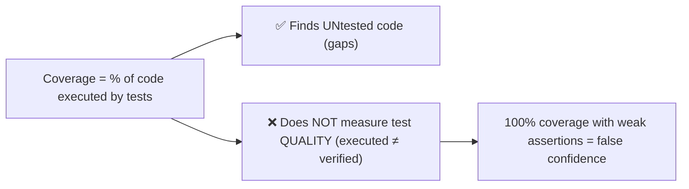

> [!WARNING]
> **Code coverage** (the % of lines/branches executed by tests) is a useful *diagnostic* but a dangerous *target*. It's great for finding **untested** code — 40% coverage clearly means big gaps. But high coverage does **not** mean good tests: code can be *executed* without its behavior being *verified* (a test that calls a function but asserts nothing gives 100% coverage and catches nothing). Chasing a coverage *number* (e.g., a mandated 90%) incentivizes gaming it — writing assertion-free tests, or testing trivial getters — producing false confidence and busywork ("Goodhart's law: when a measure becomes a target, it ceases to be a good measure"). Use coverage to *find gaps*, not to *prove quality*. **Branch coverage** (did each if/else path run?) is more meaningful than line coverage. And some code (critical payment logic) deserves near-100%, while other code (trivial glue) doesn't — coverage should be *risk-weighted*, not uniform.

---

## 3. ⚙️ ADVANCED CONCEPTS (Senior Level)

### 3.1 Contract Testing (for microservices)

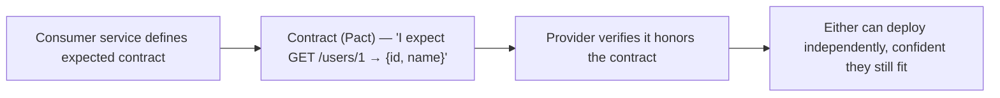

> [!IMPORTANT]
> In [[03 Microservices]], full e2e tests across all services are slow, flaky, and require deploying everything together — undermining service independence. **Contract testing** solves this: instead of testing services *together*, each pair agrees on a **contract** (the shape of requests/responses). The **consumer** writes tests defining what it expects from the provider ("when I GET `/users/1`, I expect a JSON with `id` and `name`"), generating a contract (e.g., **Pact**). The **provider** independently runs tests verifying it *honors* that contract. If both pass, they're guaranteed compatible **without ever running together** — so each team deploys independently with confidence. This catches the #1 microservices integration bug — one service changing its API and breaking consumers ([[02 REST API Design]], [[05 Event-Driven Architecture]] schema evolution) — while preserving deployment autonomy. It's the answer to "how do you test microservices integration without a fragile full-system test?"

### 3.2 The Test Trophy (modern alternative to the pyramid)

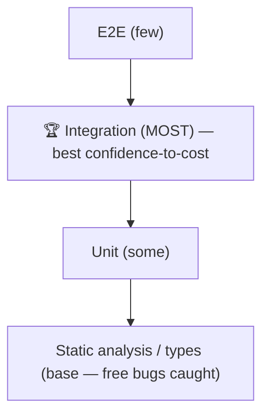

> [!TIP]
> Kent C. Dodds proposed the **Test Trophy** as a modern refinement, especially for frontend/[[08 React]] and API code. Its argument: **static analysis** ([[03 TypeScript]], linters) forms the base — catching whole classes of bugs (typos, type errors) for free before any test runs. Then it weights **integration tests as the sweet spot** — they give high confidence (testing real interactions the way users experience them) at reasonable cost, avoiding both brittle over-mocked unit tests *and* slow e2e tests. The famous principle behind it: **"the more your tests resemble the way your software is used, the more confidence they give you."** For a [[08 React]] component, testing it the way a *user* interacts (clicking, typing — via Testing Library) beats testing internal state. The pyramid and trophy aren't contradictory — they emphasize different layers for different contexts (the pyramid suits logic-heavy backends; the trophy suits integration-heavy UI/API code). Knowing *both* and *when each applies* is a senior signal.

### 3.3 Flaky Tests — the silent killer

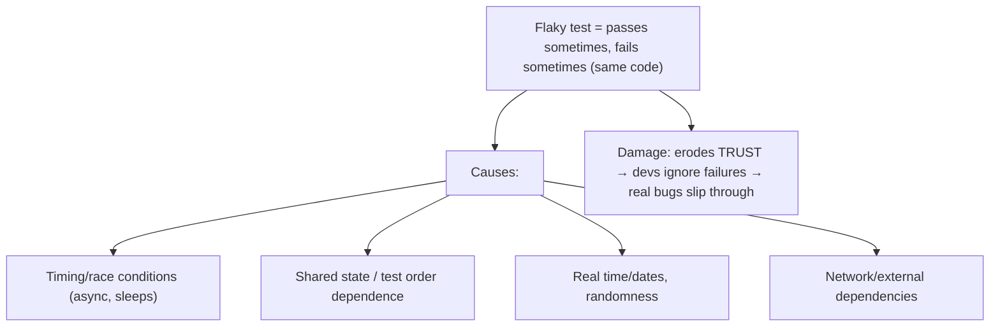

> [!WARNING]
> **Flaky tests** — tests that pass or fail nondeterministically on the *same* code — are one of the most corrosive problems in a test suite, because they **destroy trust**. Once developers see tests fail randomly, they start *ignoring* failures ("just re-run it") — and then a *real* failure gets ignored too, defeating the entire point of testing. Common causes: **timing/race conditions** (async operations, `sleep()`-based waits that sometimes aren't long enough — [[04 JavaScript and Nodejs Concurrency]]), **shared mutable state** between tests (violating Isolation — test A leaves data that test B depends on, so order matters), **real time/dates/randomness** (a test that breaks at midnight or on Feb 29), and **real network calls**. Fixes: proper async waiting (poll for a condition, don't sleep), full test isolation (fresh state per test), inject/freeze **time and randomness** (clock abstractions, seeded RNG), and mock external services. **Treat a flaky test as a bug** — quarantine and fix it, never ignore it. Flakiness is a leading cause of teams abandoning testing discipline.

### 3.4 Testing the hard stuff — async, time, external systems

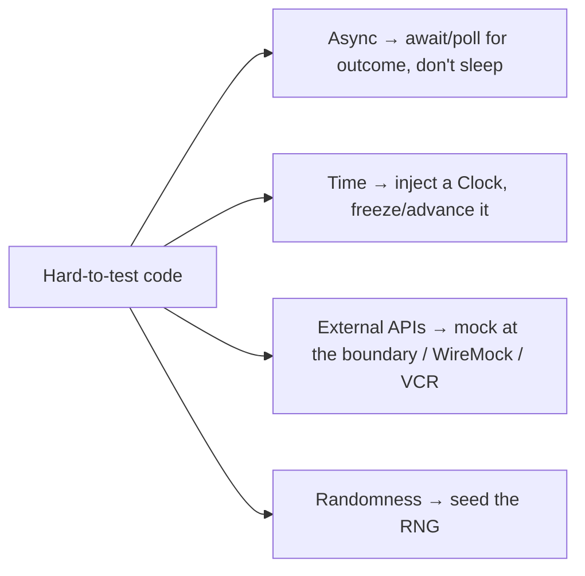

> [!TIP]
> Certain code is notoriously hard to test, and the techniques matter. **Async code** ([[04 JavaScript and Nodejs Concurrency]], [[04 Java Concurrency and JVM]]): never use fixed `sleep()` (flaky + slow) — instead *await* the operation or *poll* for the expected condition with a timeout. **Time-dependent code**: don't call `now()` directly — **inject a clock abstraction** you can freeze or advance in tests (so you can test "what happens after 30 days" instantly). **External APIs**: mock at your boundary or use tools like **WireMock**/**nock** to stub HTTP responses (record-replay), so tests don't depend on a third party being up. **Randomness**: seed the RNG for determinism. The underlying principle: **inject your dependencies** (time, randomness, I/O) rather than reaching for them globally — this **dependency injection** ([[05 Spring Boot]], [[02 Design Patterns]]) is what makes code testable in the first place. *Untestable code is usually a design problem* (hard dependencies, hidden state), and making it testable improves the design.

### 3.5 Other test types you should know

| Type | Verifies |
|---|---|
| **Regression test** | A previously-fixed bug stays fixed |
| **Smoke test** | Basic "does it even start/work" sanity |
| **Performance/Load test** | Speed & capacity under load ([[01 System Design Fundamentals]]) |
| **Property-based test** | Invariants hold for *many generated* inputs |
| **Snapshot test** | Output matches a saved reference (UI/[[08 React]]) |
| **Mutation test** | Tests actually catch injected bugs (tests the tests!) |
| **Security test** | Vulnerabilities ([[02 Web Security and OWASP Top 10]]) |
| **Accessibility test** | Usable with assistive tech |

> [!TIP]
> Beyond the pyramid layers, know these. **Property-based testing** (QuickCheck/jqwik/fast-check) generates *hundreds of random inputs* and checks an **invariant** holds (e.g., "reversing a list twice equals the original") — brilliant at finding edge cases you'd never think to write, and it *shrinks* failing cases to a minimal reproduction. **Mutation testing** (PIT, Stryker) *tests your tests*: it introduces small bugs ("mutations") into your code and checks whether your tests catch them — if a mutation survives, your tests have a gap (a far better quality signal than coverage §2.6). **Snapshot testing** ([[08 React]]) saves a rendered output and flags changes — convenient but easy to abuse (people blindly update snapshots). **Load/performance testing** validates the system holds up under traffic ([[01 System Design Fundamentals]]). Each serves a purpose; a mature strategy picks the right ones for the risk.

### 3.6 Failure Scenarios & Testing Anti-Patterns

| Anti-pattern | Problem | Fix |
|---|---|---|
| **Ice cream cone** | Too many slow e2e, few unit | Rebalance toward the pyramid |
| **Over-mocking** | Tests coupled to implementation | Mock less; use fakes/real objects |
| **Testing implementation** | Breaks on refactor, catches nothing new | Test behavior/outputs |
| **Flaky tests** | Erode trust; failures ignored | Fix determinism; isolate; inject time |
| **Coverage as target** | Assertion-free tests, false confidence | Use coverage to find gaps only |
| **Slow suite** | Devs skip running it | Fast unit base; parallelize |
| **Shared test state** | Order-dependent, flaky | Isolate; fresh fixtures |
| **Testing trivial code** | Wasted effort (getters) | Test logic & risk, not glue |

> [!WARNING]
> The two most damaging anti-patterns are **over-mocking** and **testing implementation details** — and they're related. When you mock every collaborator and assert exact interaction sequences, your tests become a mirror of the *current implementation* — so any refactor (even one that improves the code without changing behavior) breaks a pile of tests. These "change-detector" tests actively *punish* good engineering and give a false sense of safety (they pass because the implementation matches, not because the behavior is correct). The cure is to **test behavior through public interfaces** with minimal mocking — verify *what* the system does for a caller, using real objects where practical and faking only slow/external dependencies. A good heuristic: **if a behavior-preserving refactor breaks your test, the test was testing the wrong thing.** Tests should give you *freedom* to change internals, not chain you to them.

---

## 4. 🏗️ REAL-WORLD SYSTEM DESIGN USAGE

### 4.1 Testing in the CI/CD pipeline

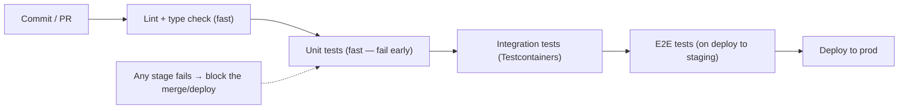

> [!IMPORTANT]
> Tests deliver their value through **automation in the pipeline** ([[07 CICD GitHub Actions]]). The standard staging: **fast checks first** (lint, type-check, unit tests) so failures surface in seconds and cheap mistakes are caught before expensive stages run ("fail fast"); then **integration tests** (spinning up real dependencies via [[01 Docker]]/Testcontainers); then **e2e tests** against a deployed staging environment; and only if *everything* passes does code merge/deploy. This ordering optimizes feedback speed and cost. Critically, **a failing test must block the merge/deploy** — tests that don't gate anything are theater. This is the practical realization of "tests enable confident, frequent deployment": the pipeline is your automated quality gate, running the whole suite on every change so no regression reaches production. Combined with fast unit tests, developers get feedback in minutes and ship many times a day safely.

### 4.2 A layered strategy for a full-stack app

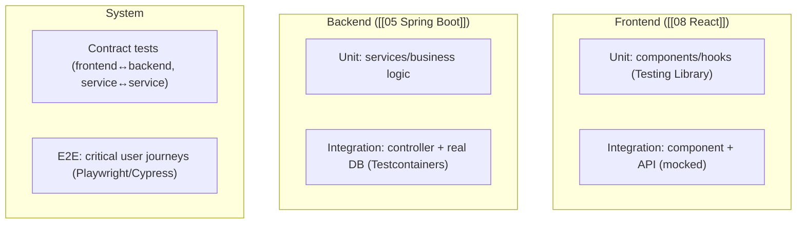

> [!TIP]
> A real full-stack strategy layers appropriately. **Frontend** ([[08 React]]): unit-test components and hooks with **Testing Library** (interacting as a user — clicks, typed input — not asserting internal state), and integration-test flows with the API mocked (MSW). **Backend** ([[05 Spring Boot]]): unit-test business logic/services in isolation, integration-test controllers through the full stack against a **real database** (Testcontainers). **System-wide**: **contract tests** ensure frontend↔backend and service↔service compatibility without full integration; a *small* set of **e2e tests** (Playwright/Cypress) covers the *critical user journeys* only (login, checkout — the flows that must never break). The art is *not* testing everything at every layer — that's wasteful and slow. Test each concern at the *cheapest layer* that can verify it: business logic in unit tests, DB mapping in integration tests, and only the highest-value end-to-end flows in e2e.

### 4.3 What (and what not) to test

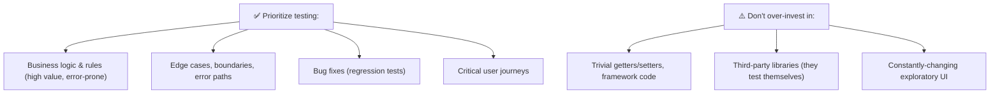

> [!IMPORTANT]
> **Testing is an investment — spend it where the risk and value are.** Prioritize: **business logic and rules** (the domain's core, most error-prone, expensive if wrong), **edge cases and error handling** (where bugs hide — empty inputs, boundaries, failures), **regression tests for every bug fix** (encode the bug so it can never return — one of the highest-ROI habits), and **critical user journeys** (the flows that lose money if broken). *Don't* over-invest in: trivial getters/setters and glue code (low risk, high churn), **third-party code** (libraries test themselves — test *your usage*, not the library), or rapidly-changing exploratory UI (tests become churn). This risk-based allocation is what separates pragmatic testing from dogmatic coverage-chasing. Ask of each test: *"if this breaks, how bad is it, and how likely?"* — and invest accordingly.

---

## 5. 🎤 INTERVIEW PREPARATION

### 5.1 Most important questions

<details>
<summary><b>Q1: Explain the testing pyramid.</b></summary>

A strategy for balancing test types: **many fast unit tests** (base — test units in isolation, milliseconds, precise failures), **fewer integration tests** (middle — verify components work together, e.g., with a real DB), and **few e2e tests** (top — slow, brittle, but high confidence, exercising the whole system). The shape maximizes confidence per second: unit tests are cheap and pinpoint failures; e2e tests are expensive and vague. The anti-pattern is the inverted "ice cream cone" (mostly slow e2e tests) — slow, flaky, hard to maintain.
</details>

<details>
<summary><b>Q2: Unit vs integration vs e2e — differences?</b></summary>

**Unit**: one function/class in isolation, dependencies mocked, fast and deterministic, tests logic. **Integration**: multiple real components together (service + real DB, API endpoint through its stack), catches wiring/SQL/serialization bugs, slower. **E2E**: the whole system as a real user (browser → API → DB, nothing mocked), highest confidence but slowest and most brittle. Each catches different bugs; you want mostly unit, some integration, few e2e.
</details>

<details>
<summary><b>Q3: Mock vs stub vs fake?</b></summary>

A **stub** returns canned data for state verification (check the result). A **mock** has expectations about interactions for behavior verification (check that/how it was called). A **fake** is a lightweight working implementation (in-memory DB). Prefer stubs/fakes over strict mocks where possible — mocks that assert exact interactions couple tests to the implementation and break on refactoring. Over-mocking is a leading cause of brittle tests.
</details>

<details>
<summary><b>Q4: What is TDD and why use it?</b></summary>

Test-Driven Development: write a failing test first (red), write minimal code to pass (green), refactor (blue), repeat. Benefits: forces you to design the API from the caller's view, guarantees testable code and meaningful coverage, prevents over-engineering (only write what a test requires), and gives a safety net for refactoring. It's a design discipline as much as testing. Not universal — great for logic with clear requirements, awkward for exploratory/UI work.
</details>

<details>
<summary><b>Q5: Is 100% code coverage a good goal?</b></summary>

No. Coverage measures *executed* code, not *verified* behavior — you can have 100% coverage with assertion-free tests that catch nothing. It's useful for finding *untested* code (gaps), but chasing a coverage number incentivizes gaming it and gives false confidence (Goodhart's law). Use it as a diagnostic, weight it by risk (critical logic deserves high coverage, glue code doesn't), and prefer branch coverage. Mutation testing is a better quality signal.
</details>

<details>
<summary><b>Q6: What are flaky tests and how do you deal with them?</b></summary>

Tests that pass/fail nondeterministically on the same code. They're dangerous because they erode trust — devs start ignoring failures, then miss real ones. Causes: timing/race conditions, shared state/order dependence, real time/dates/randomness, network calls. Fixes: proper async waiting (poll, don't sleep), full test isolation with fresh state, inject/freeze time and seed randomness, mock external services. Treat flakiness as a bug to fix, never ignore.
</details>

<details>
<summary><b>Q7: How do you test microservices integration?</b></summary>

Full e2e across all services is slow and fragile and breaks deployment independence. Use **contract testing** (e.g., Pact): the consumer defines what it expects from the provider (a contract), and the provider independently verifies it honors it. If both pass, they're compatible without running together — catching breaking API changes while preserving each team's autonomy to deploy independently. Supplement with a few e2e tests for critical cross-service journeys.
</details>

<details>
<summary><b>Q8: What makes a good test?</b></summary>

FIRST: **Fast, Isolated, Repeatable, Self-validating, Timely.** Above all, it tests **behavior, not implementation** — it asserts what the code does for a caller (outputs/effects), not internal details, so it survives refactoring while catching real regressions. It's readable (clear AAA structure, descriptive name), tests one behavior, and covers meaningful cases (edge cases, error paths) rather than trivial code.
</details>

### 5.2 Tricky questions

> [!TIP]
> **"If a refactor breaks your tests but the behavior is unchanged, what does that tell you?"** — Your tests are coupled to implementation, not behavior (over-mocking, asserting internals). Good tests should survive behavior-preserving refactors. This is the signal to test through public interfaces with less mocking.

> [!TIP]
> **"Should you write tests before or after the code?"** — TDD says before (drives design, guarantees testability). Pragmatically, either can work — but *before* forces you to think about the interface and testability upfront. The worst option is "much later / never," when the code is already hard to test and you've lost the design benefit.

> [!TIP]
> **"Your test suite takes 40 minutes — what do you do?"** — Diagnose the shape: likely too many slow e2e/integration tests (ice cream cone). Rebalance toward fast unit tests, parallelize the suite, use faster test doubles for non-critical paths, run slow e2e only on merge/nightly (not every commit), and split fast vs slow test stages so devs get quick feedback.

> [!TIP]
> **"How do you test code that calls an external payment API?"** — Don't hit the real API in tests. Inject the dependency and mock/stub it at your boundary (WireMock/nock) to simulate success, failure, and timeout responses. Add a small number of contract tests against the real API's sandbox to verify your assumptions, run separately from the fast suite.

### 5.3 Common mistakes candidates make

| Mistake | Reality |
|---|---|
| "More tests = better" | Balance (pyramid) and quality matter more |
| Testing implementation details | Test behavior; survive refactors |
| Over-mocking everything | Couples tests to implementation; use fakes |
| 100% coverage = well-tested | Coverage ≠ verification quality |
| Ignoring flaky tests | They erode trust in the whole suite |
| Only e2e tests | Slow, brittle "ice cream cone" |
| Not testing edge cases | Bugs live in boundaries/error paths |
| No regression test for bugs | The bug can silently return |

### 5.4 What interviewers actually expect

- The **pyramid** (and awareness of the trophy) — layering strategy.
- **Unit vs integration vs e2e** and what each catches.
- **Test doubles** (mock/stub/fake) and the over-mocking trap.
- **TDD** (red-green-refactor) and *why* test-first aids design.
- **Behavior over implementation** — the mark of maintainable tests.
- **Coverage** nuance (diagnostic, not target) and **flaky tests**.
- **Contract testing** for [[03 Microservices]]; testing in [[07 CICD GitHub Actions]].

---

## 6. 🛠️ HANDS-ON PROJECTS

### Project 1: TDD a Feature from Scratch (Beginner→Intermediate)

**Goal:** Internalize red-green-refactor.

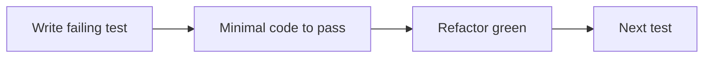

**Steps:**
1. Pick a self-contained feature (a shopping cart, a string calculator, a password-strength validator).
2. Strictly **TDD** it: write one failing test, make it pass minimally, refactor — repeat.
3. Cover edge cases (empty, boundaries, invalid input) each as its own red→green cycle.
4. Reflect: notice how test-first shaped the API design.
5. Try **property-based testing** for one invariant (e.g., calculator commutativity).

**Learn:** TDD loop, AAA, edge-case thinking, how tests drive design, property-based basics.

---

### Project 2: Layered Tests for an API (Intermediate→Senior)

**Goal:** Build a real pyramid for a backend service.

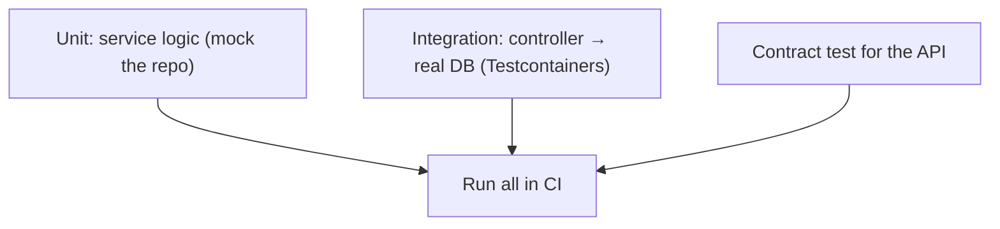

**Steps:**
1. Build a small API ([[05 Spring Boot]]/[[06 Express.js]], [[02 REST API Design]]).
2. **Unit-test** the business logic in isolation (mock the repository).
3. **Integration-test** the endpoints against a **real database** via [[01 Docker]]/Testcontainers.
4. Add a **contract test** (Pact) for a consumer.
5. Wire it all into [[07 CICD GitHub Actions]]; make failures block the merge.
6. Deliberately introduce over-mocking, then refactor the code and watch brittle tests break — then fix them to test behavior.

**Learn:** the full pyramid, Testcontainers, contract testing, CI gating, over-mocking pitfalls.

---

### Project 3: Harden a Flaky, Slow Suite (Senior)

**Goal:** Diagnose and fix real test-suite problems.

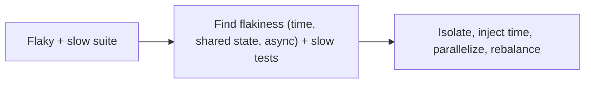

**Steps:**
1. Take (or create) a suite with **flaky tests** — a time-dependent test, an order-dependent one, an async race.
2. Fix each: inject a **clock**, ensure **isolation** (fresh fixtures), replace `sleep` with **polling**.
3. Profile the suite; **parallelize** and split fast/slow stages.
4. Add **mutation testing** (PIT/Stryker); find and close gaps the coverage number hid.
5. Rebalance an "ice cream cone" toward the pyramid.

**Learn:** flakiness root-causing, determinism (time/async/state), parallelization, mutation testing, suite architecture.

---

## 7. 🔬 DEEP DIVE: INTERNALS

### 7.1 How mocking frameworks work

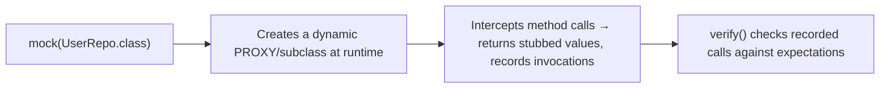

> [!TIP]
> Mocking frameworks (Mockito, Jest mocks, Sinon) work via **dynamic proxies / runtime code generation**. When you `mock(UserRepo.class)`, the framework generates a fake implementation at runtime — in Java, a dynamic subclass/proxy (via bytecode manipulation, [[04 Java Concurrency and JVM]]); in JS, replacing the function with an instrumented wrapper. Every call to the mock is **intercepted**: it returns whatever you stubbed (`when(repo.find(1)).thenReturn(alice)`) and **records** the invocation (arguments, call count). Later, `verify(repo).find(1)` checks the recorded calls against your expectations. This is why mocks can both *provide* behavior (stubbing) and *verify* interactions. Understanding this demystifies mocking and explains its limits — e.g., why you can't easily mock static methods or final classes in some languages (no proxy point), and why mock-heavy tests are implementation-coupled (they assert on the *recorded call structure*, which is an implementation detail).

### 7.2 Test isolation & the database problem

```mermaid
flowchart TB
    Problem["Integration tests share a DB → state leaks between tests → flakiness"] --> Strategies["Isolation strategies:"]
    Strategies --> Tx["Transaction rollback per test (fast, common)"]
    Strategies --> Truncate["Truncate/recreate tables between tests"]
    Strategies --> Container["Fresh container per test class (Testcontainers)"]
```

> [!IMPORTANT]
> Integration tests that hit a database face the **isolation problem**: test A inserts data that test B accidentally sees, making tests order-dependent and flaky (violating the "I" in FIRST). Strategies, by speed/isolation trade-off: **(1) Transaction rollback** — wrap each test in a transaction and roll it back at the end ([[01 SQL and Transactions Deep Dive]]) — fast and clean, but can't test transaction-commit behavior itself and hides some concurrency issues. **(2) Truncate/reset** — clear the tables between tests — more realistic, slower. **(3) Fresh database/container per test class** — ultimate isolation via [[01 Docker]]/Testcontainers, slowest. The common default is transaction rollback for speed with per-suite container reuse. This directly applies the transaction isolation concepts from [[01 SQL and Transactions Deep Dive]] — the test's rollback *is* using ACID atomicity to undo its effects. Getting DB test isolation right is what makes an integration suite reliable rather than a flaky nightmare.

### 7.3 Mutation testing — testing your tests

```mermaid
flowchart LR
    Code["Your code"] --> Mutate["Inject mutations: change > to >=, true→false, +→-, remove a line"]
    Mutate --> Run["Run your tests against each mutant"]
    Run --> Killed{"Tests fail (catch the bug)?"}
    Killed -->|"yes = mutant KILLED"| Good["✅ Tests are effective here"]
    Killed -->|"no = mutant SURVIVED"| Gap["❌ A test gap — tests didn't notice the bug"]
```

> [!IMPORTANT]
> **Mutation testing** is the gold standard for measuring test *quality* (vs coverage's mere *quantity*). A mutation tool (PIT for Java, Stryker for JS) systematically introduces small bugs — **mutations** — into your code: flipping `>` to `>=`, `&&` to `||`, `true` to `false`, removing a statement, changing a return value. For each **mutant**, it runs your test suite: if a test **fails**, the mutant is "**killed**" (good — your tests caught the injected bug); if all tests still **pass**, the mutant "**survived**" (bad — your tests have a blind spot; that line could be broken and you'd never know). The **mutation score** (% killed) is a far more honest quality signal than coverage — 100% line coverage with survived mutants proves the tests *execute* code without *verifying* it (§2.6). It's computationally expensive (runs the suite many times), so it's typically run periodically on critical code rather than every commit. It directly answers "are my tests actually any good?"

### 7.4 Why dependency injection makes code testable

```mermaid
flowchart TB
    subgraph Hard["❌ Hard dependency (untestable)"]
        H["class Service { db = new RealDatabase(); } → can't replace db in a test"]
    end
    subgraph DI["✅ Injected dependency (testable)"]
        D["class Service(db) { this.db = db; } → pass a fake db in tests"]
    end
```

> [!IMPORTANT]
> The deepest connection: **testability is a design property, achieved through dependency injection.** If a class *constructs its own dependencies* internally (`new RealDatabase()`, calls a global `Clock.now()`, hits a hardcoded API), you *cannot* replace them in a test — the code is welded to real, slow, non-deterministic collaborators. If instead dependencies are **injected** (passed in via constructor/parameters — [[05 Spring Boot]] DI, [[02 Design Patterns]] inversion of control), a test can pass **fakes/stubs** in their place. This is why "write testable code" and "write well-designed code" are nearly the same instruction: both demand *loose coupling* and *explicit dependencies*. It also explains the TDD design benefit (§2.4) — writing the test first *forces* you to inject dependencies because you need to substitute them. When you find code hard to test, the root cause is almost always a design problem (hidden dependencies, hard-wired state, doing too much) — and fixing the testability improves the architecture. Untestable code is a design smell.

### 7.5 The economics of testing — where's the ROI?

```mermaid
flowchart LR
    Cost["Cost of a test: writing + running + maintaining"] --> ROI{"ROI = bugs prevented × cost-of-bug ÷ test-cost"}
    Value["Value: high for critical/complex/stable code; low for trivial/volatile code"] --> ROI
    ROI --> Decide["→ Invest where value is high & cost is low"]
```

> [!TIP]
> Mature testing is fundamentally an **economic** decision, not a moral one. Every test has a **cost**: writing it, running it (suite time), and — often the biggest — **maintaining** it as the code evolves (a brittle test that breaks on every change has huge maintenance cost). Its **value** is the expected bugs it prevents times how expensive those bugs would be. So the ROI varies wildly: a test on **complex, critical, stable** business logic (a pricing engine, an auth check — [[02 Web Security and OWASP Top 10]]) has enormous ROI; a test on a **trivial getter** or **volatile exploratory UI** has near-zero or negative ROI (maintenance exceeds value). This economic lens explains all the earlier advice — the pyramid (cheap tests give more ROI per second), avoiding over-mocking (brittle tests have high maintenance cost), coverage-as-diagnostic (not all lines are worth testing equally), and risk-based prioritization. The senior mindset isn't "test everything" — it's **"invest testing effort where value is high and cost is low,"** treating your test suite as a portfolio to optimize, not a checkbox to fill.

---

## ✅ Production Checklists

### Strategy
- [ ] Suite shaped like a **pyramid** (many unit, some integration, few e2e)
- [ ] Tests verify **behavior**, not implementation
- [ ] Critical business logic & edge cases well-covered (risk-weighted)
- [ ] Every **bug fix** ships with a regression test
- [ ] Contract tests for service boundaries ([[03 Microservices]])

### Quality
- [ ] Tests follow **FIRST** (fast, isolated, repeatable, self-validating, timely)
- [ ] Minimal mocking; prefer fakes/real objects for non-external deps
- [ ] **No flaky tests** (deterministic; time/randomness injected; isolated state)
- [ ] Coverage used as a **gap-finder**, not a target
- [ ] Critical paths validated by **mutation testing** (periodically)

### Automation
- [ ] Full suite runs in **CI on every PR** ([[07 CICD GitHub Actions]])
- [ ] Failures **block merge/deploy** (fast checks first)
- [ ] Integration tests use real deps via **[[01 Docker]]/Testcontainers**
- [ ] Suite is **fast** (parallelized; slow e2e gated to merge/nightly)
- [ ] E2E covers only **critical user journeys**

---

## 🗺️ Learning Roadmap

```mermaid
flowchart TB
    A["1️⃣ Why + basics<br/>AAA, first unit tests"] --> B["2️⃣ The pyramid<br/>unit/integration/e2e"]
    B --> C["3️⃣ Test doubles<br/>mock/stub/fake, avoid over-mocking"]
    C --> D["4️⃣ TDD + good tests<br/>red-green-refactor, FIRST, behavior"]
    D --> E["5️⃣ Coverage & flakiness<br/>diagnostics, determinism"]
    E --> F["6️⃣ Advanced types<br/>contract, property, mutation testing"]
    F --> G["7️⃣ Internals<br/>mocking, DB isolation, DI, testability"]
    G --> H["8️⃣ Strategy at scale<br/>CI/CD, full-stack layering, economics"]
```

| Stage | Focus | You can... |
|---|---|---|
| 1–3 | Fundamentals | Write clean unit tests with good doubles |
| 4–5 | Discipline | TDD, write behavior-focused, stable tests |
| 6 | Advanced | Apply contract/property/mutation testing |
| 7–8 | Strategy | Architect a fast, reliable suite in CI |

---

## 🔁 Self-Review Completion Loop

Reviewed against *Test-Driven Development* (Beck), *Growing Object-Oriented Software* (Freeman/Pryce), Martin Fowler's testing articles, and Kent C. Dodds' testing writing.

### Gap Review Matrix

| Dimension | Covered? | Where |
|---|---|---|
| Why test / value | ✅ | §1 |
| AAA structure | ✅ | §1 |
| Testing pyramid | ✅ | §1 |
| Unit tests | ✅ | §2.1 |
| Integration & e2e | ✅ | §2.2 |
| Test doubles | ✅ | §2.3 |
| TDD | ✅ | §2.4 |
| FIRST / good tests | ✅ | §2.5 |
| Code coverage | ✅ | §2.6 |
| Contract testing | ✅ | §3.1 |
| Test trophy | ✅ | §3.2 |
| Flaky tests | ✅ | §3.3 |
| Testing async/time/external | ✅ | §3.4 |
| Other test types | ✅ | §3.5 |
| Anti-patterns | ✅ | §3.6 |
| CI/CD integration | ✅ | §4.1 |
| Full-stack strategy | ✅ | §4.2 |
| What to test | ✅ | §4.3 |
| Mocking internals | ✅ | §7.1 |
| DB test isolation | ✅ | §7.2 |
| Mutation testing | ✅ | §7.3 |
| DI & testability | ✅ | §7.4 |
| Testing economics | ✅ | §7.5 |
| Interview Q&A + mistakes | ✅ | §5 |
| Hands-on projects | ✅ | §6 |

> [!NOTE]
> **Remaining depth to explore independently:** BDD (Cucumber/Gherkin, specification by example), consumer-driven contracts in depth (Pact broker, can-i-deploy), testing event-driven systems ([[05 Event-Driven Architecture]] — testing consumers, async assertions), chaos engineering ([[06 Distributed Systems]] resilience testing), performance/load testing tools (k6, Gatling, JMeter — [[01 System Design Fundamentals]]), visual regression testing, test data management & factories, testing in production (feature flags, canaries, synthetic monitoring — [[02 Observability]]), and approval/golden-master testing for legacy code.

---

## 📚 Official References

| Resource | Source |
|---|---|
| Martin Fowler — Testing articles (TestPyramid, Mocks Aren't Stubs) | https://martinfowler.com/testing/ |
| Kent C. Dodds — Testing Trophy / Testing Library | https://kentcdodds.com/blog/the-testing-trophy-and-testing-classifications |
| *Test-Driven Development: By Example* — Kent Beck | Book |
| *Growing Object-Oriented Software, Guided by Tests* — Freeman & Pryce | Book |
| Pact — Contract testing | https://docs.pact.io/ |
| Testcontainers | https://testcontainers.com/ |
| xUnit Test Patterns — Gerard Meszaros (test doubles) | http://xunitpatterns.com/ |
| Google Testing Blog | https://testing.googleblog.com/ |

---

## 🎁 Final Summary

> [!IMPORTANT]
> **The one-paragraph takeaway:** Testing isn't about *proving* correctness — it's about **confidence to change code fast without breaking things**, turning a fragile codebase into a malleable one. Structure your suite as a **pyramid**: a broad base of **unit tests** (fast, isolated, one unit at a time — the bulk), a middle of **integration tests** (real components together — service + real database via [[01 Docker]]/Testcontainers — catching wiring/SQL/serialization bugs), and a thin top of **e2e tests** (the whole system as a user — high confidence but slow and brittle, so reserve them for *critical journeys only*); the inverted "ice cream cone" is the anti-pattern. Use **test doubles** wisely — **stubs** provide canned data (state verification), **mocks** verify interactions (behavior verification), **fakes** are lightweight working implementations — but **avoid over-mocking**, because tests that assert exact interactions couple to the *implementation* and shatter on any refactor: the golden rule is **test behavior, not implementation** (if a behavior-preserving refactor breaks a test, the test was wrong). Good tests are **FIRST** (Fast, Isolated, Repeatable, Self-validating, Timely); **TDD**'s red-green-refactor loop drives testable design by writing the interface from the caller's view first. Treat **coverage** as a gap-finder, never a target (executed ≠ verified — Goodhart's law), and prove real test quality with **mutation testing** (inject bugs, check your tests catch them). Fight **flaky tests** ruthlessly — they erode trust until failures get ignored — by injecting time/randomness, isolating state, and polling instead of sleeping. For [[03 Microservices]], use **contract testing** (Pact) to verify service compatibility without fragile full-system tests. Automate everything in [[07 CICD GitHub Actions]] with fast checks first and failures blocking deploys. Underneath it all: **testability is a design property achieved through dependency injection** (untestable code is a design smell), and testing is ultimately an **economic** decision — invest effort where value is high (critical, complex, stable logic; every bug's regression test) and cost is low, not uniformly everywhere.

**Golden rules:**
1. 🎯 Tests exist to give **confidence to change**, not to prove bug-freedom.
2. 🔺 Follow the **pyramid**: many unit, some integration, few e2e (not an ice cream cone).
3. 🧪 **Test behavior, not implementation** — good tests survive refactoring.
4. 🎭 Use doubles wisely; **avoid over-mocking** (it couples tests to internals).
5. 🔄 **TDD** (red-green-refactor) drives testable design; write the interface first.
6. ⚡ Good tests are **FIRST** (fast, isolated, repeatable, self-validating, timely).
7. 📊 **Coverage finds gaps; it doesn't prove quality** — use mutation testing for that.
8. 🚫 **Fix flaky tests** immediately — they destroy trust in the whole suite.
9. 🤝 **Contract testing** verifies microservice compatibility without brittle e2e.
10. 💰 Testing is an **economic** choice — invest where value is high and cost is low.

---

*Related guides in this vault: [[07 CICD GitHub Actions]] · [[05 Spring Boot]] · [[08 React]] · [[03 Microservices]] · [[02 REST API Design]] · [[01 Docker]] · [[01 SQL and Transactions Deep Dive]] · [[02 Web Security and OWASP Top 10]] · [[01 System Design Fundamentals]]*
