# 🔭 Observability — Complete Beginner-to-Expert Reference

> Metrics, logs, and traces — how to understand what your distributed system is *actually* doing in production, using Prometheus, Grafana, and OpenTelemetry.

---

## 📑 Table of Contents

1. [Executive Summary](#-executive-summary)
2. [Fundamentals (Beginner)](#1--fundamentals-beginner-level)
3. [Core Concepts (Intermediate)](#2--core-concepts-intermediate-level)
4. [Advanced Concepts (Senior)](#3--advanced-concepts-senior-level)
5. [Real-World System Design](#4--real-world-system-design-usage)
6. [Interview Preparation](#5--interview-preparation)
7. [Hands-On Projects](#6--hands-on-projects)
8. [Deep Dive: Internals](#7--deep-dive-internals)
9. [Production Checklists](#-production-checklists)
10. [Learning Roadmap](#-learning-roadmap)
11. [Self-Review Completion Loop](#-self-review-completion-loop)
12. [Official References](#-official-references)
13. [Final Summary](#-final-summary)

---

## 🎯 Executive Summary

**Observability** is the ability to understand a system's internal state from its external outputs — answering *"why is it behaving this way?"* without shipping new code. It rests on **three pillars**: **metrics** (numeric trends), **logs** (discrete events), and **traces** (a request's journey across services). The modern stack is **Prometheus** (metrics), **Grafana** (visualization), **Loki/ELK** (logs), and **OpenTelemetry** (vendor-neutral instrumentation) + **Jaeger/Tempo** (traces).

| What it is | What it replaces | Core superpower |
|---|---|---|
| Understanding system internals from outputs | "SSH in and grep logs", guesswork, blindness at scale | **Ask arbitrary questions** about production behavior after the fact |

> [!IMPORTANT]
> Observability isn't just "monitoring with more tools." **Monitoring answers questions you predefined** ("is CPU > 80%?"); **observability lets you ask questions you didn't anticipate** ("why are 0.1% of checkout requests from mobile users in Europe slow, but only on Tuesdays?"). In a [[03 Microservices]]/[[02 Kubernetes]] world where one request touches dozens of services, you *cannot* operate blind — without the three pillars (metrics/logs/traces), you can't tell *which* service caused a slow response. This is the operational backbone of [[01 System Design Fundamentals]] made concrete.

Related guides: [[01 System Design Fundamentals]] · [[03 Microservices]] · [[02 Kubernetes]] · [[01 Docker]] · [[01 Kafka]] · [[05 Node.js]] · [[05 Spring Boot]] · [[05 Nginx]]

---

## 1. 🌱 FUNDAMENTALS (Beginner Level)

### What is observability in simple terms?

When your app runs on **your laptop**, debugging is easy — you print, step through, and watch. When it runs as **50 services across 1000 containers** serving millions of users, you can't. A user reports "checkout is slow" — but *which* of the 20 services in that request path is the culprit? **Observability is the instrumentation that lets you answer that**, by continuously emitting data about what's happening inside, so you can investigate *after* the fact.

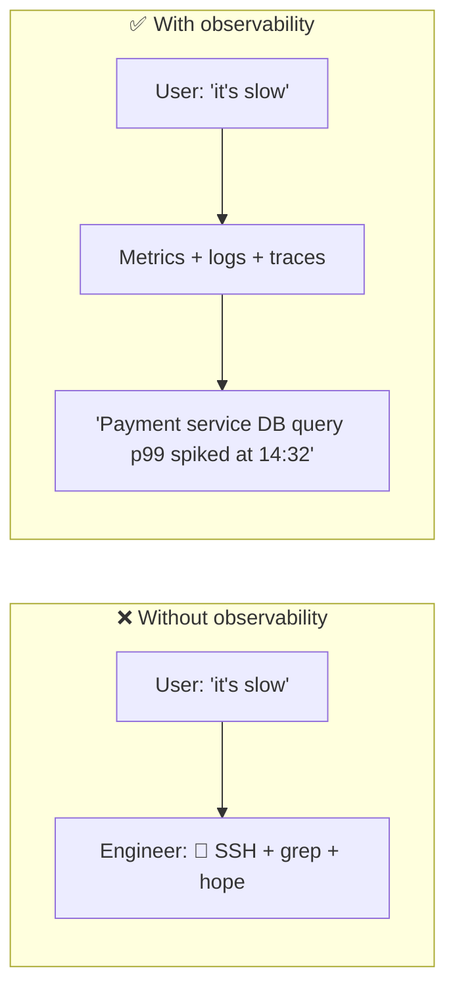

### Why does observability exist?

Distributed systems fail in ways monoliths never did:

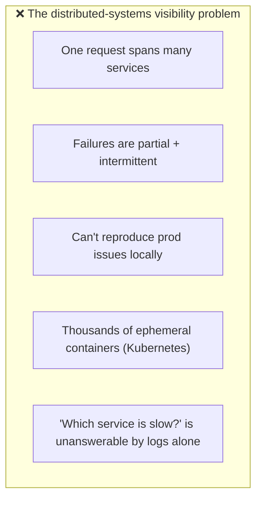

As systems moved to [[03 Microservices]] and [[02 Kubernetes]], traditional "check the server" monitoring broke down. Observability emerged to make complex, dynamic systems understandable.

### Monitoring vs Observability

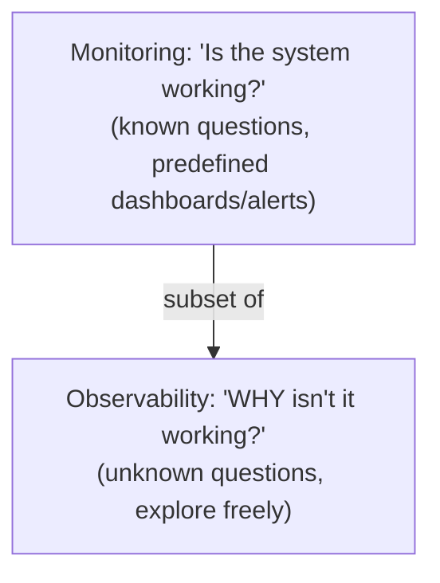

| Aspect | Monitoring | Observability |
|---|---|---|
| Question type | Known ("CPU high?") | Unknown ("why is *this* slow?") |
| Approach | Predefined dashboards/alerts | Ad-hoc exploration |
| "Known unknowns" | ✅ | ✅ |
| "Unknown unknowns" | ❌ | ✅ |
| Relationship | A *part* of observability | The broader capability |

> [!TIP]
> Don't get lost in the debate — **monitoring is a subset of observability**. You still need dashboards and alerts (monitoring) for known failure modes, *and* the ability to explore high-cardinality data (observability) for novel problems. A mature setup does both: alert on the symptoms you know, and instrument richly enough to investigate the ones you don't.

### The Three Pillars

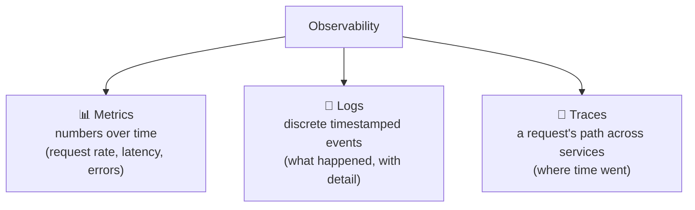

| Pillar | Answers | Example | Cost |
|---|---|---|---|
| **Metrics** | "Is something wrong? How much?" | p99 latency = 800ms, error rate = 2% | Cheap (aggregated numbers) |
| **Logs** | "What exactly happened?" | "NullPointerException in OrderService line 42" | Expensive (volume) |
| **Traces** | "Where did the time go across services?" | "DB call took 700ms of the 800ms request" | Medium (sampled) |

> [!IMPORTANT]
> The three pillars are **complementary, not redundant** — each answers a different question, and you need all three. **Metrics** tell you *that* something is wrong and trend it cheaply (aggregate numbers). **Traces** tell you *where* (which service/span in a request). **Logs** tell you *what* exactly (the error detail). The workflow is usually: a **metric** alert fires → you find the slow **trace** → you drill into the **logs** for that specific request. Missing any pillar leaves a blind spot.

### Core vocabulary

| Term | Plain meaning |
|---|---|
| **Metric** | A numeric measurement over time |
| **Log** | A timestamped text/structured event |
| **Trace** | The end-to-end record of one request |
| **Span** | One operation within a trace (a DB call, an HTTP call) |
| **Cardinality** | Number of unique label combinations |
| **Instrumentation** | Code that emits telemetry |
| **Exporter** | Component that exposes/ships telemetry |
| **Scrape** | Prometheus pulling metrics from a target |
| **SLI/SLO/SLA** | Indicator / Objective / Agreement of service level |

### Real-world analogy 🏥

Observability is like **hospital patient monitoring**:
- **Metrics** = the **vital-signs monitor** (heart rate, blood pressure over time) — continuous numbers showing *if* something's off.
- **Traces** = the **patient's journey** through the hospital (ER → X-ray → surgery → recovery) — showing *where* the delay/problem occurred.
- **Logs** = the **detailed chart notes** at each step ("administered 5mg at 14:03, patient stable") — the *what* and *why*.
- **Alerts** = the **monitor beeping** when a vital crosses a threshold.
- A doctor uses **all three** to diagnose — vitals to notice, journey to localize, notes for detail.

> [!TIP]
> The mental model: **metrics say "the patient's heart rate is high," traces say "it spiked during surgery," logs say "reaction to anesthesia at 14:03."** You need the cheap continuous signal (metrics) to *notice*, the path (traces) to *localize*, and the detail (logs) to *diagnose*.

---

## 2. 🧩 CORE CONCEPTS (Intermediate Level)

### 2.1 Metrics & Prometheus

**Prometheus** is the de-facto open-source metrics system. It **pulls** (scrapes) metrics from your services' HTTP endpoints and stores them as **time series**.

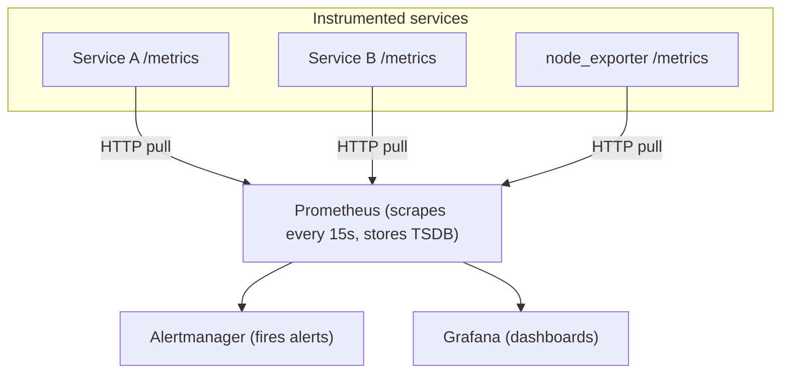

**The four metric types:**

| Type | Meaning | Example |
|---|---|---|
| **Counter** | Only goes up (reset on restart) | `http_requests_total` |
| **Gauge** | Goes up and down | `memory_usage_bytes`, `queue_depth` |
| **Histogram** | Distribution in buckets | `request_duration_seconds` (for percentiles) |
| **Summary** | Client-side quantiles | Similar to histogram, pre-computed |

```
# A Prometheus metric with labels (dimensions)
http_requests_total{method="GET", path="/api/users", status="200"} 1027
```

> [!IMPORTANT]
> **Prometheus uses a PULL model** — it scrapes `/metrics` endpoints on a schedule, rather than services pushing to it. This is a deliberate design: Prometheus controls the rate, can detect a target being *down* (scrape fails), and services don't need to know where Prometheus is. The exception is short-lived jobs (batch/serverless) that die before being scraped — those use the **Pushgateway**. This pull model shapes everything about how you instrument and deploy in a Prometheus world (especially [[02 Kubernetes]] service discovery).

### 2.2 PromQL (the query language)

```promql
# Request rate per second over the last 5 minutes
rate(http_requests_total[5m])

# Error rate (percentage of 5xx)
sum(rate(http_requests_total{status=~"5.."}[5m]))
  / sum(rate(http_requests_total[5m]))

# p99 latency from a histogram
histogram_quantile(0.99, rate(http_request_duration_seconds_bucket[5m]))

# Memory by pod, top 5
topk(5, container_memory_usage_bytes)
```

> [!TIP]
> **`rate()` is the most important PromQL function.** Counters only ever increase, so their raw value is meaningless ("1,000,000 total requests since startup"). `rate(counter[5m])` gives the **per-second rate of increase** over a window — *that's* what you actually want ("500 requests/sec right now"). A classic beginner mistake is graphing a raw counter (an ever-rising line) instead of its rate. For gauges, you graph the value directly. Master `rate`, `sum`, `by`, and `histogram_quantile` and you can answer most questions.

### 2.3 Grafana (visualization)

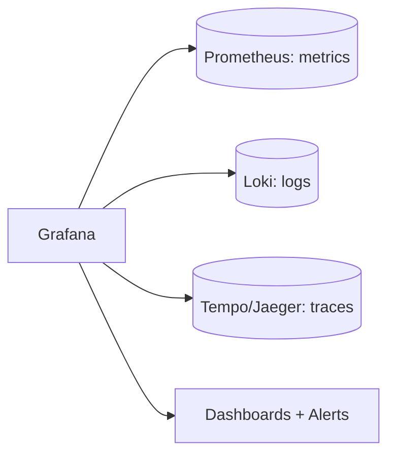

**Grafana** is the visualization layer — it queries data sources (Prometheus, Loki, Tempo, etc.) and renders **dashboards**, **panels**, and **alerts**. It's the "single pane of glass" where you *look* at your telemetry.

> [!TIP]
> Grafana is a **frontend, not a data store** — it queries other systems (Prometheus for metrics, Loki for logs, Tempo/Jaeger for traces) and unifies them in one UI. Its superpower is **correlation**: click a spike on a metrics graph → jump to the logs from that time window → open the trace for a slow request — all in one place. Build dashboards around the **RED/USE methods** (§3.4), not around "every metric we have" — dashboards with 200 panels are useless in an incident.

### 2.4 Logs & the Logging Stack

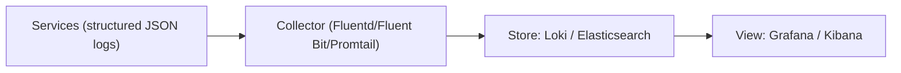

| Stack | Components |
|---|---|
| **ELK / Elastic** | Elasticsearch (store/index) + Logstash (process) + Kibana (view) |
| **PLG (Grafana)** | Promtail (ship) + Loki (store) + Grafana (view) |
| **EFK** | Elasticsearch + Fluentd + Kibana |

> [!IMPORTANT]
> **Structured logging is non-negotiable at scale.** A log line like `"User 42 failed login from 1.2.3.4"` is human-readable but hard to query. **Structured logs** (JSON: `{"level":"error","userId":42,"event":"login_failed","ip":"1.2.3.4"}`) are machine-parseable — you can filter, aggregate, and correlate them. Also include a **trace ID** in every log (§3.1) so you can jump from a log to its trace and vice versa. **Loki vs Elasticsearch**: Loki indexes only *labels* (cheap, like Prometheus for logs), while Elasticsearch indexes *full text* (powerful search, expensive). Loki is cheaper for high-volume logs; ELK for rich full-text search.

### 2.5 Traces & Distributed Tracing

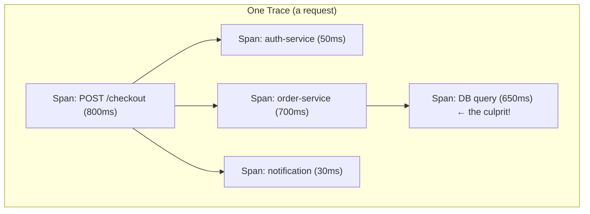

- A **trace** follows one request across all services; it's a tree of **spans**.
- Each **span** = one operation (an HTTP call, a DB query) with a start time, duration, and metadata.
- A **trace ID** propagates through every service (in HTTP headers / message metadata), stitching the spans together.

> [!IMPORTANT]
> **Distributed tracing is what makes [[03 Microservices]] debuggable.** When a `/checkout` request is slow, metrics say "checkout p99 is high" but not *why*. The **trace** shows the request fanning out across auth, order, payment, and DB services — and reveals that a **DB query took 650ms of the 800ms**. Without tracing, you'd guess. The magic is **context propagation**: a trace ID (and span context) is passed in request headers (`traceparent`) through every hop, so spans from different services join into one coherent picture. This is impossible to retrofit cheaply — instrument for it early.

### 2.6 OpenTelemetry (the unifying standard)

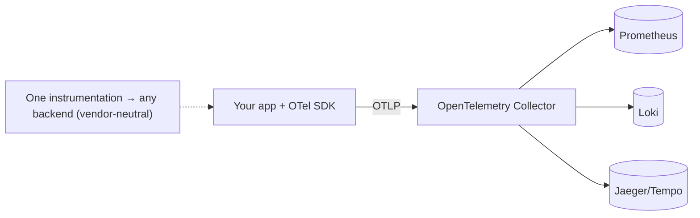

> [!IMPORTANT]
> **OpenTelemetry (OTel)** is the game-changer: a single, **vendor-neutral standard** for generating and collecting all three signals (metrics, logs, traces). Before OTel, you instrumented your code with vendor-specific SDKs (Datadog, New Relic, Jaeger) — switching vendors meant re-instrumenting everything. With OTel, you instrument **once** with the OTel SDK (or auto-instrumentation), emit the standard **OTLP** protocol, and the **OTel Collector** routes it to *any* backend (Prometheus, Jaeger, Datadog, etc.). This decouples your instrumentation from your observability vendor — the [[02 Design Patterns|"program to an interface"]] principle applied to telemetry. It's now the CNCF standard and the default choice for new systems.

---

## 3. ⚙️ ADVANCED CONCEPTS (Senior Level)

### 3.1 Correlation — The Three Pillars Together

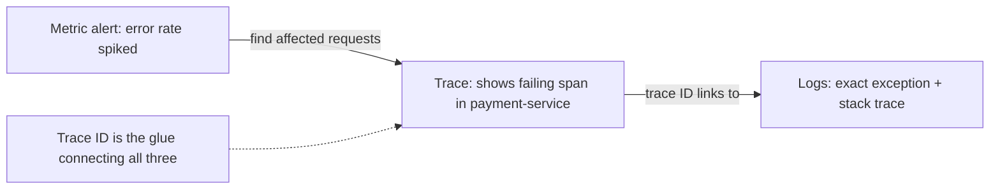

> [!IMPORTANT]
> The real power of observability is **correlation via shared context** — especially the **trace ID**. When you inject the trace ID into your **logs** (as a field) and tag your **metrics** with exemplars, you can pivot seamlessly: a metrics dashboard shows a latency spike → click an **exemplar** to open the exact slow **trace** → the trace's spans carry the trace ID → filter **logs** by that ID to see exactly what that request did. This "three pillars, one trace ID" workflow is what separates a mature observability setup from three disconnected tools. Always propagate and log the trace ID.

### 3.2 Cardinality — The Silent Killer

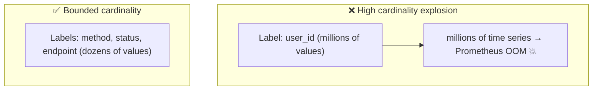

> [!WARNING]
> **Cardinality is the #1 way to blow up a metrics system.** Each unique combination of label values creates a *separate time series*. Labels with **bounded** values (HTTP method: ~5, status code: ~10, endpoint: ~50) are fine. But putting **unbounded** values in labels — `user_id`, `email`, `request_id`, full URLs with IDs — creates **millions of time series**, exhausting Prometheus memory and grinding it to a halt. **Rule: never put high-cardinality data in metric labels.** High-cardinality context belongs in **logs and traces** (which are built for it), not metrics. This is the single most important operational lesson for metrics — and a favorite senior interview question.

### 3.3 Sampling — You Can't Trace Everything

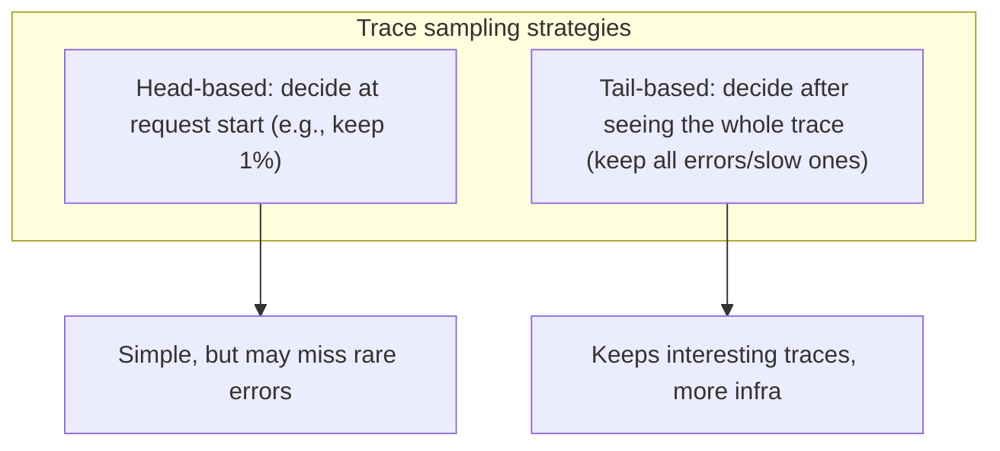

> [!IMPORTANT]
> Tracing *every* request at high volume is prohibitively expensive (storage, network, cost). **Sampling** keeps a representative subset. **Head-based sampling** decides at the *start* (e.g., "keep 1% of all traces") — simple and cheap, but you might drop the rare error trace you actually need. **Tail-based sampling** buffers the whole trace and decides *after* — so you can "keep 100% of errors and slow traces, 1% of normal ones" — much smarter but requires more infrastructure (the collector must hold traces in memory until complete). Senior systems use tail-based sampling to guarantee they capture the interesting traces. Metrics and logs have their own volume-control concerns (aggregation, log levels).

### 3.4 The Golden Signals — RED & USE Methods

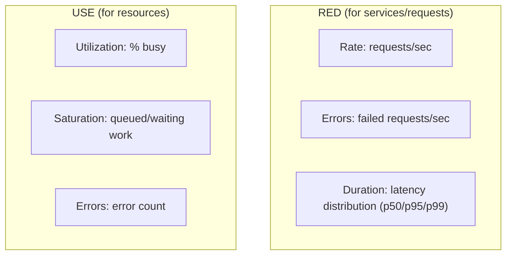

| Method | For | Signals |
|---|---|---|
| **RED** | Services / requests | **R**ate, **E**rrors, **D**uration |
| **USE** | Resources (CPU, disk, memory) | **U**tilization, **S**aturation, **E**rrors |
| **Four Golden Signals** (Google SRE) | Overall | Latency, Traffic, Errors, Saturation |

> [!TIP]
> Don't drown in metrics — **focus on the golden signals**. For every *service*, track **RED** (Rate, Errors, Duration) — these tell you if users are having a good experience. For every *resource*, track **USE** (Utilization, Saturation, Errors). Google's **Four Golden Signals** (Latency, Traffic, Errors, Saturation) are the SRE standard. Percentiles matter more than averages: **p99 latency** (the slowest 1%) reveals pain that a mean hides — "average 100ms" can hide "1% of users wait 5 seconds." Always alert and dashboard on **p95/p99**, not averages.

### 3.5 SLI, SLO, SLA & Error Budgets

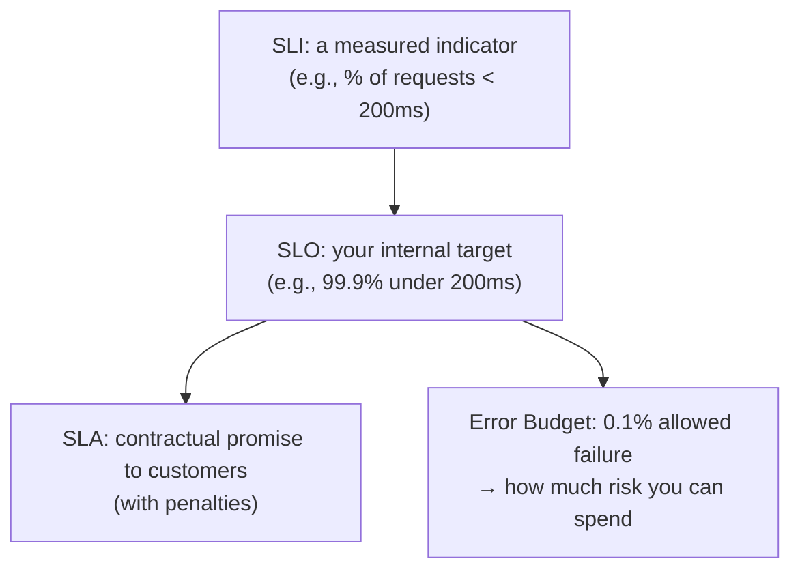

> [!IMPORTANT]
> These drive **how you operate**, not just what you measure. An **SLI** is a *measured* signal (e.g., success rate). An **SLO** is your *target* (99.9% success). An **SLA** is a *contract* with penalties (usually looser than the SLO). The killer concept is the **error budget**: if your SLO is 99.9%, you're "allowed" 0.1% failures — that budget is a *resource* you spend on risk. Budget remaining? Ship features fast. Budget exhausted? Freeze releases and focus on reliability. This turns reliability from a vague goal into a quantified, decision-driving metric — the heart of Google's SRE practice. Alert on **SLO burn rate**, not raw thresholds.

### 3.6 Alerting — Symptoms, Not Causes

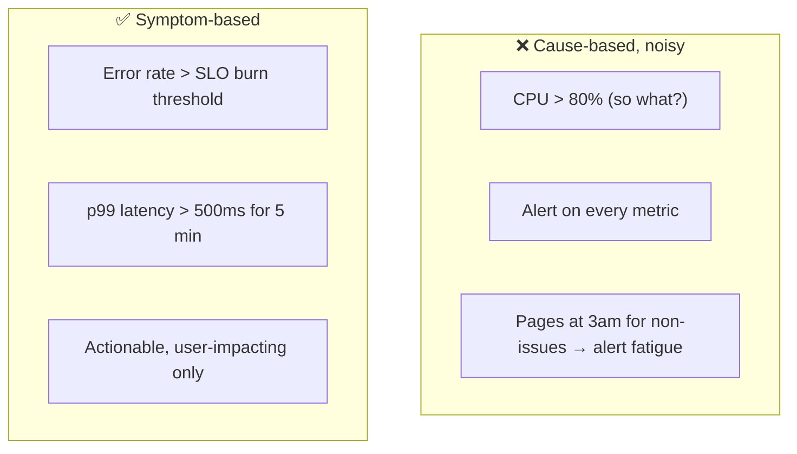

> [!WARNING]
> **Alert fatigue** kills observability programs: too many noisy, non-actionable alerts train engineers to ignore them — and then they miss the real one. **Alert on symptoms users feel** (high error rate, high latency, SLO burn) — not on causes (CPU high, disk 70% — which may be totally fine). Every alert should be **actionable** (a human needs to do something) and **urgent** (if it can wait, it's a ticket, not a page). High CPU that doesn't affect users is noise. This "symptom-based, SLO-driven alerting" is core SRE discipline — quality over quantity.

### 3.7 Failure Scenarios & Anti-Patterns

| Problem | Cause | Fix |
|---|---|---|
| **Metrics system OOM** | High-cardinality labels | Bound label values; move detail to logs/traces |
| **Alert fatigue** | Too many/cause-based alerts | Symptom-based, actionable, SLO-driven |
| **Can't debug a slow request** | No distributed tracing | Instrument tracing; propagate trace IDs |
| **Logs too expensive** | Logging everything at high volume | Sampling, log levels, Loki (label-indexed) |
| **Averages hide pain** | Alerting on mean latency | Use p95/p99 percentiles |
| **Vendor lock-in** | Vendor-specific instrumentation | OpenTelemetry (standard) |
| **"Dashboard of 200 panels"** | Metric hoarding | RED/USE, focused dashboards |
| **Missing trace ID in logs** | No correlation | Inject trace ID into all logs |
| **Observability = SPOF** | Single Prometheus | HA/federation, remote storage |

---

## 4. 🏗️ REAL-WORLD SYSTEM DESIGN USAGE

### 4.1 A Full Observability Stack

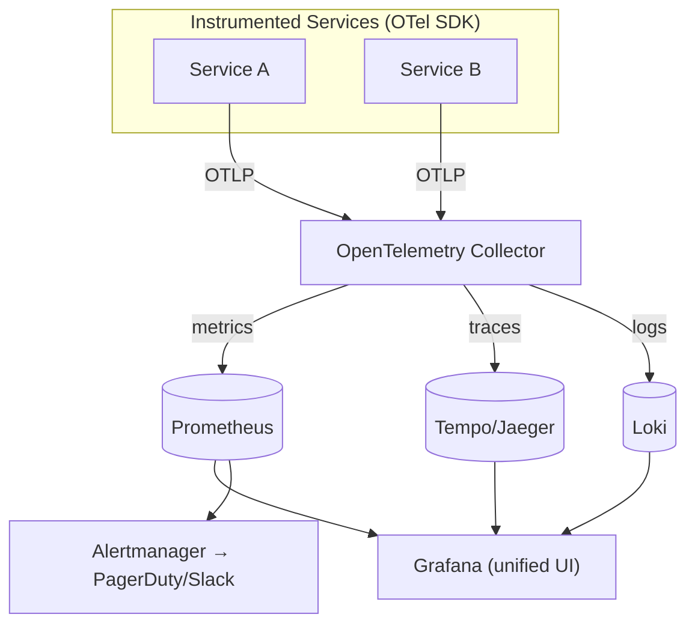

The modern cloud-native pattern: services instrumented with **OpenTelemetry** → **OTel Collector** (receives, processes, routes) → specialized backends (**Prometheus** metrics, **Tempo/Jaeger** traces, **Loki** logs) → **Grafana** unifies them → **Alertmanager** pages on-call.

### 4.2 Observability in Kubernetes

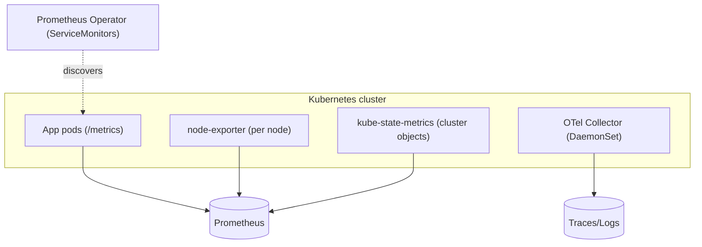

> [!IMPORTANT]
> [[02 Kubernetes]] is *the* observability challenge and showcase: pods are ephemeral (constantly created/destroyed), so static monitoring configs don't work. Prometheus uses **service discovery** — via the **Prometheus Operator** and **ServiceMonitor** CRDs — to *automatically* find and scrape new pods as they appear. The **kube-prometheus-stack** Helm chart ([[03 Helm Charts]]) bundles Prometheus + Grafana + Alertmanager + exporters as the standard K8s observability install. **node-exporter** (node metrics) and **kube-state-metrics** (K8s object states) provide infrastructure visibility. This dynamic auto-discovery is why Prometheus's pull model + K8s are a natural fit.

### 4.3 How companies do observability

| Company | Practice |
|---|---|
| **Google** | Pioneered SRE, SLOs, error budgets, Dapper (tracing → OpenTelemetry lineage) |
| **Netflix** | Deep observability + chaos engineering (observe under induced failure) |
| **Uber** | Built Jaeger (distributed tracing, now CNCF) + M3 (metrics at scale) |
| **Most cloud-native shops** | Prometheus + Grafana + OTel + Loki/Tempo (or SaaS: Datadog/Honeycomb) |

### 4.4 Open-Source vs SaaS

| Approach | Examples | Trade-off |
|---|---|---|
| **Self-hosted OSS** | Prometheus, Grafana, Loki, Tempo, Jaeger | Full control, no per-host cost, but *you* operate it |
| **SaaS** | Datadog, New Relic, Honeycomb, Grafana Cloud | Managed, powerful, but expensive at scale (billing surprises) |
| **Hybrid** | OTel → SaaS backend | Vendor-neutral instrumentation, managed backend |

> [!TIP]
> A recurring real-world pain: **observability costs can rival or exceed compute costs at scale** — SaaS vendors (Datadog especially) bill by host/data volume, and high-cardinality metrics or verbose logs cause bill shock. The **OpenTelemetry-first strategy** hedges this: instrument with vendor-neutral OTel, so you can start with a SaaS backend and migrate to self-hosted OSS (or vice versa) *without re-instrumenting*. Control costs by managing **cardinality** (§3.2), **sampling** traces (§3.3), and setting log **retention/levels** deliberately. "Observe everything" is a budget trap.

### 4.5 Observability-Driven Development & Incident Response

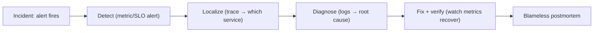

> [!TIP]
> Observability isn't a passive tool — it drives the **incident lifecycle**: an **alert** (metric/SLO) detects, a **trace** localizes to a service, **logs** diagnose the root cause, and **metrics** confirm the fix. Mature teams practice **observability-driven development**: instrumenting features *as they build them* (not after an outage), and treating "can we debug this in production?" as a definition-of-done criterion. Combined with **blameless postmortems**, this turns every incident into better instrumentation — the SRE feedback loop.

---

## 5. 🎤 INTERVIEW PREPARATION

### 5.1 Most important questions

<details>
<summary><b>Q1: What is observability and how does it differ from monitoring?</b></summary>

**Observability** is understanding a system's internal state from its outputs — the ability to ask *arbitrary* questions ("why is this specific thing slow?") without new code. **Monitoring** answers *predefined* questions ("is CPU > 80%?"). Monitoring handles "known unknowns" (dashboards/alerts for anticipated problems); observability handles "unknown unknowns" (novel issues you explore). Monitoring is a subset of observability.
</details>

<details>
<summary><b>Q2: What are the three pillars?</b></summary>

**Metrics** (numeric time series — cheap, tell you *that/how much* something is wrong), **logs** (discrete events — tell you *what* exactly happened), and **traces** (a request's path across services — tell you *where* the time went). They're complementary: a metric alert → find the slow trace → drill into that request's logs. All three are needed; each covers a different question.
</details>

<details>
<summary><b>Q3: How does Prometheus work? Pull vs push?</b></summary>

Prometheus **pulls** (scrapes) metrics from services' `/metrics` HTTP endpoints on a schedule, storing them as time series in its TSDB. Pull lets Prometheus control the rate and detect down targets (failed scrape = target down). Short-lived jobs that die before scraping use the **Pushgateway**. It queries via **PromQL**, alerts via **Alertmanager**, and uses **service discovery** (e.g., Kubernetes) to find dynamic targets.
</details>

<details>
<summary><b>Q4: What is cardinality and why does it matter?</b></summary>

Cardinality is the number of unique label-value combinations, each of which is a separate time series. **High-cardinality labels** (user_id, request_id, email) create millions of series and can OOM the metrics system. Rule: keep metric labels **bounded** (method, status, endpoint); put high-cardinality context in **logs/traces**, which are built for it. It's the #1 way to blow up Prometheus.
</details>

<details>
<summary><b>Q5: What is distributed tracing and how does context propagate?</b></summary>

Distributed tracing follows one request across all services as a tree of **spans**, revealing where latency/errors occur. A **trace ID** (and span context) propagates through every hop via headers (e.g., W3C `traceparent`) or message metadata, so spans from different services join into one trace. It's essential for debugging [[03 Microservices]] — metrics say "checkout is slow," the trace says "the DB call took 650ms."
</details>

<details>
<summary><b>Q6: What is OpenTelemetry and why does it matter?</b></summary>

OpenTelemetry is a **vendor-neutral standard** (CNCF) for generating and collecting metrics, logs, and traces. You instrument **once** with the OTel SDK (or auto-instrumentation), emit **OTLP**, and the **Collector** routes to any backend (Prometheus, Jaeger, Datadog). It decouples instrumentation from vendor — switch backends without re-instrumenting. It's the modern default, replacing fragmented vendor-specific SDKs.
</details>

<details>
<summary><b>Q7: Explain SLI, SLO, SLA, and error budgets.</b></summary>

**SLI** = a measured indicator (e.g., % requests < 200ms). **SLO** = your internal target (99.9%). **SLA** = a customer contract with penalties (usually looser than SLO). **Error budget** = the allowed failure (0.1% for a 99.9% SLO) treated as a spendable resource: budget left → ship features; budget gone → freeze and fix reliability. This quantifies reliability and drives decisions — core SRE.
</details>

<details>
<summary><b>Q8: How should you design alerts?</b></summary>

Alert on **symptoms users feel** (high error rate, high latency, SLO burn rate) — not causes (CPU high, which may be harmless). Every alert must be **actionable** and **urgent** (page-worthy); non-urgent issues are tickets. Use **percentiles (p95/p99)**, not averages. This avoids **alert fatigue**, where noisy alerts train people to ignore the real one.
</details>

### 5.2 Tricky questions

> [!TIP]
> **"Why not just log everything?"** — Logs are expensive at volume (storage, indexing, cost) and hard to aggregate for trends. Metrics are cheap for trends/alerting; traces show cross-service flow. Each pillar is optimized for its job — logging everything is costly *and* still doesn't answer "which service is slow?" as well as a trace.

> [!TIP]
> **"Average latency looks fine but users complain — why?"** — Averages hide tail latency. If 99% of requests are 50ms and 1% are 5s, the average is ~100ms (looks fine) but 1% of users have a terrible experience. Always look at **p95/p99** — the tail is where users feel pain.

> [!TIP]
> **"You added a `user_id` label and Prometheus crashed — why?"** — High cardinality. Each unique user_id becomes a separate time series; with millions of users, that's millions of series → memory exhaustion. Never put unbounded values in metric labels; use logs/traces for per-user detail.

> [!TIP]
> **"Head-based vs tail-based sampling?"** — Head-based decides whether to keep a trace at its *start* (cheap, but may drop rare errors). Tail-based decides *after* seeing the full trace (can keep all errors/slow traces + a sample of normal), but needs the collector to buffer traces. Tail-based guarantees you capture the interesting ones.

### 5.3 Common mistakes candidates make

| Mistake | Reality |
|---|---|
| "Observability = monitoring" | Monitoring is a subset (known vs unknown questions) |
| "Just add more metrics/logs" | Focus (RED/USE); manage cardinality/cost |
| High-cardinality metric labels | OOMs the metrics system |
| Alerting on averages | Use p95/p99 percentiles |
| Alerting on causes (CPU) | Alert on user-facing symptoms |
| No trace ID in logs | Can't correlate pillars |
| Vendor-specific instrumentation | Use OpenTelemetry (neutral) |
| Ignoring observability cost | Can exceed compute cost at scale |

### 5.4 What interviewers actually expect

- **Metrics/logs/traces** distinction and *when* to use each.
- **Prometheus pull model + PromQL (`rate`) + cardinality** dangers.
- **Distributed tracing + context propagation** for [[03 Microservices]].
- **OpenTelemetry** as the vendor-neutral standard.
- **SLO/error budgets** and **symptom-based alerting** (SRE fluency).
- **Percentiles over averages**, and cost/cardinality awareness.

---

## 6. 🛠️ HANDS-ON PROJECTS

### Project 1: Instrument a Service with Metrics + Grafana (Beginner→Intermediate)

**Goal:** Expose metrics, scrape with Prometheus, dashboard in Grafana.

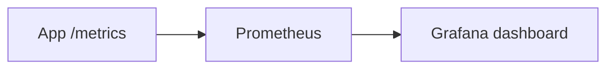

**Steps:**
1. Add a metrics library to a [[05 Node.js]]/[[05 Spring Boot]] app (prom-client / Micrometer); expose `/metrics`.
2. Instrument **RED** metrics: request counter, error counter, latency **histogram**.
3. Run Prometheus ([[01 Docker]]) scraping the app; write PromQL (`rate`, `histogram_quantile`).
4. Build a **Grafana** dashboard: request rate, error rate, p99 latency.
5. Add an **Alertmanager** rule (error rate > threshold → Slack).

**Learn:** metric types, instrumentation, PromQL, dashboards, alerting.

---

### Project 2: Distributed Tracing with OpenTelemetry (Intermediate→Senior)

**Goal:** Trace a request across multiple services.

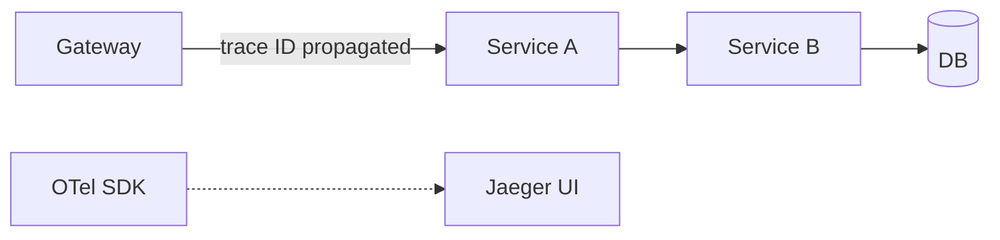

**Steps:**
1. Build 2–3 [[03 Microservices]] calling each other (HTTP/[[04 gRPC]]).
2. Add **OpenTelemetry** auto-instrumentation; export traces to **Jaeger/Tempo**.
3. Verify **context propagation** (one trace spans all services via `traceparent`).
4. Inject the **trace ID into logs**; correlate a slow trace with its logs.
5. Introduce artificial latency in one service → find it in the trace.

**Learn:** tracing, spans, context propagation, OTel, correlation.

---

### Project 3: Full Observability Stack on Kubernetes with SLOs (Senior)

**Goal:** Production-grade three-pillar stack with SLO-based alerting.

```mermaid
flowchart TB
    Apps["Services (OTel)"] --> Collector[OTel Collector]
    Collector --> Prom[(Prometheus)] & Loki[(Loki)] & Tempo[(Tempo)]
    Prom & Loki & Tempo --> Grafana[Grafana]
    Prom --> SLO["SLO burn-rate alerts"]
```

**Steps:**
1. Deploy **kube-prometheus-stack** ([[03 Helm Charts]]) on [[02 Kubernetes]] + Loki + Tempo.
2. Instrument services with **OTel** → Collector → the three backends.
3. Define **SLIs/SLOs** (e.g., 99.9% of requests < 300ms); compute **error budget**.
4. Configure **SLO burn-rate alerts** (multi-window) instead of static thresholds.
5. Build correlated Grafana dashboards (metric spike → trace → logs by trace ID).
6. Add **tail-based sampling** in the collector (keep all errors).

**Learn:** full stack, K8s observability, SLOs/error budgets, burn-rate alerting, sampling, correlation.

---

## 7. 🔬 DEEP DIVE: INTERNALS

### 7.1 How Prometheus Stores Time Series (TSDB)

```mermaid
flowchart LR
    Scrape["Scrape samples"] --> Head["In-memory head block (recent)"]
    Head -->|"every 2h"| Block["Persistent block on disk"]
    Block --> Compact["Compaction (merge blocks)"]
    Series["Each series = metric name + label set → stream of (timestamp, value)"] -.-> Head
```

> [!IMPORTANT]
> Prometheus's **TSDB** stores each unique time series (a metric name + its label set) as a compressed stream of `(timestamp, float64 value)` samples. Recent data lives in an **in-memory head block** (fast writes), flushed to **immutable disk blocks** every ~2 hours, then **compacted**. Compression is remarkable — using **delta-of-delta** timestamp encoding and **XOR** value encoding (from Facebook's Gorilla paper), it stores a sample in ~1–2 bytes. This is why **cardinality** matters so much: memory scales with the *number of active series* (each needs head-block state), not the number of samples — a million series will OOM long before a billion samples on a few series.

### 7.2 The Scrape & Service Discovery Loop

```mermaid
flowchart LR
    SD["Service Discovery (K8s API, Consul, DNS)"] --> Targets["List of targets"]
    Targets --> Scrape["Scrape /metrics every interval"]
    Scrape --> Relabel["Relabeling (filter/rename labels)"]
    Relabel --> Store["Store in TSDB"]
```

> [!TIP]
> Prometheus continuously **discovers targets** (via [[02 Kubernetes]] API, Consul, DNS, static config), then scrapes each target's `/metrics` on the scrape interval. A powerful, under-appreciated step is **relabeling** — rules that filter which targets to scrape and rewrite/drop labels *before* storage. This is how you control cardinality at ingestion (drop a noisy label), route metrics, or add contextual labels (like `pod`/`namespace` in K8s). Understanding relabeling is a senior Prometheus skill — it's your cardinality and cost control valve.

### 7.3 Trace Context Propagation (W3C Trace Context)

```mermaid
flowchart LR
    A["Service A: generates trace_id + span_id"] -->|"header: traceparent: 00-{trace_id}-{span_id}-01"| B["Service B: reads parent, creates child span"]
    B -->|propagates| C["Service C"]
```

> [!IMPORTANT]
> Distributed tracing works because of **context propagation** standardized by **W3C Trace Context**: the `traceparent` HTTP header carries `version-traceid-spanid-flags`. When Service A calls B, it injects this header; B extracts it, sees A's span as its **parent**, and creates a **child span** with the same trace ID. This continues through every hop — so all spans share one trace ID and form a parent-child tree. For async ([[01 Kafka]]/[[02 RabbitMQ]]), the context is propagated in **message headers** instead. OpenTelemetry handles this injection/extraction automatically for instrumented libraries — but for custom protocols, you propagate context manually. Break the chain (drop the header) and the trace fragments.

### 7.4 The OpenTelemetry Architecture

```mermaid
flowchart TB
    subgraph SDK["OTel SDK (in your app)"]
        API["API (instrument code)"]
        Providers["Tracer/Meter/Logger providers"]
        Exporters["Exporters (OTLP)"]
    end
    SDK -->|OTLP| Collector["OTel Collector"]
    subgraph Collector
        Recv["Receivers"] --> Proc["Processors (batch, sample, filter)"]
        Proc --> Exp["Exporters → backends"]
    end
```

> [!TIP]
> OpenTelemetry has two parts: the **SDK** (in your app — the API you instrument with, plus providers and exporters) and the **Collector** (a standalone service). The **Collector's pipeline** — **receivers** (accept OTLP/Prometheus/etc.) → **processors** (batch, tail-sample, filter, add attributes) → **exporters** (send to Prometheus/Jaeger/Datadog) — is where the real power lives. Running a Collector (vs exporting directly from apps) gives you a central place to **process, sample, and re-route** telemetry without touching app code, and buffers against backend outages. It's the [[02 Design Patterns|Pipeline/Chain-of-Responsibility]] pattern for telemetry — the same shape as [[05 Nginx]]/gateway filters.

### 7.5 Metrics vs Events — The Aggregation Trade-off

```mermaid
flowchart TB
    Events["Raw events (every request)"] -->|"aggregate → lose detail"| Metrics["Metrics (counts/histograms — cheap, lossy)"]
    Events -->|"keep detail → expensive"| Logs["Logs/traces (full context — rich, costly)"]
    HighCard["High-cardinality observability (Honeycomb-style):<br/>keep wide events, aggregate at query time"] -.-> Events
```

> [!IMPORTANT]
> The deepest tension in observability: **aggregate early (metrics) = cheap but lossy; keep raw events (logs/traces) = rich but expensive.** Metrics pre-aggregate ("500 requests, p99=800ms") — tiny to store, but you *can't* later ask "which users?" because that detail is gone. A newer philosophy (championed by Honeycomb) argues for **wide, high-cardinality events** — store rich structured events per request and **aggregate at query time** — giving metrics-like dashboards *and* the ability to slice by any dimension (user, region, version) after the fact. This is more expensive but far more powerful for "unknown unknowns." The senior insight: **know what detail you're throwing away when you aggregate** — that lost detail is exactly what you'll wish you had during a novel incident.

---

## ✅ Production Checklists

### Instrumentation
- [ ] **RED** metrics on every service (Rate, Errors, Duration/histograms)
- [ ] **USE** metrics on resources (Utilization, Saturation, Errors)
- [ ] **Structured (JSON) logs** with **trace IDs** included
- [ ] **Distributed tracing** with context propagation (W3C Trace Context)
- [ ] **OpenTelemetry** (vendor-neutral) instrumentation
- [ ] Percentiles (p95/p99), not just averages

### Metrics & Cardinality
- [ ] **No high-cardinality labels** (no user_id/request_id in metrics)
- [ ] Relabeling to control ingested cardinality
- [ ] Prometheus HA / remote-write for long-term storage
- [ ] Recording rules for expensive queries

### Alerting & SLOs
- [ ] **SLIs/SLOs** defined; **error budgets** tracked
- [ ] **Symptom-based, actionable** alerts (SLO burn rate)
- [ ] No alert fatigue (every page is urgent + actionable)
- [ ] Runbooks linked from alerts
- [ ] On-call rotation + escalation (PagerDuty/Opsgenie)

### Cost & Ops
- [ ] **Trace sampling** (tail-based: keep errors/slow)
- [ ] Log **retention + levels** tuned; sampling for high-volume
- [ ] Observability **cost** monitored (can exceed compute)
- [ ] Dashboards focused (RED/USE), not metric hoards
- [ ] Correlation working (metric → trace → log by trace ID)

---

## 🗺️ Learning Roadmap

```mermaid
flowchart TB
    A["1️⃣ Fundamentals<br/>3 pillars, monitoring vs observability"] --> B["2️⃣ Metrics<br/>Prometheus, metric types, PromQL"]
    B --> C["3️⃣ Visualization<br/>Grafana dashboards + alerts"]
    C --> D["4️⃣ Logs<br/>structured logging, Loki/ELK"]
    D --> E["5️⃣ Tracing<br/>spans, context propagation, Jaeger"]
    E --> F["6️⃣ OpenTelemetry<br/>unified instrumentation + Collector"]
    F --> G["7️⃣ SRE practices<br/>SLI/SLO/error budgets, alerting"]
    G --> H["8️⃣ Advanced<br/>cardinality, sampling, cost, correlation, internals"]
```

| Stage | Focus | You can... |
|---|---|---|
| 1–3 | Metrics + dashboards | Instrument and visualize a service |
| 4–5 | Logs + traces | Debug across services |
| 6–7 | OTel + SRE | Run a unified stack with SLOs |
| 8 | Advanced | Operate at scale; control cost/cardinality |

---

## 🔁 Self-Review Completion Loop

Reviewed against Prometheus/Grafana/OpenTelemetry docs, Google SRE books, and production observability practice.

### Gap Review Matrix

| Dimension | Covered? | Where |
|---|---|---|
| What/why, monitoring vs observability | ✅ | §1 |
| Three pillars | ✅ | §1, §2 |
| Prometheus + pull model | ✅ | §2.1 |
| Metric types | ✅ | §2.1 |
| PromQL (rate) | ✅ | §2.2 |
| Grafana | ✅ | §2.3 |
| Logs + structured logging + Loki/ELK | ✅ | §2.4 |
| Distributed tracing + spans | ✅ | §2.5 |
| OpenTelemetry | ✅ | §2.6, §7.4 |
| Correlation (trace ID) | ✅ | §3.1 |
| Cardinality | ✅ | §3.2, §7.1 |
| Sampling (head/tail) | ✅ | §3.3 |
| RED/USE/golden signals | ✅ | §3.4 |
| SLI/SLO/SLA/error budgets | ✅ | §3.5 |
| Alerting (symptom-based) | ✅ | §3.6 |
| Full stack architecture | ✅ | §4.1 |
| Observability in Kubernetes | ✅ | §4.2 |
| OSS vs SaaS + cost | ✅ | §4.4 |
| Incident response | ✅ | §4.5 |
| TSDB internals | ✅ | §7.1 |
| Scrape/service discovery/relabeling | ✅ | §7.2 |
| W3C trace context propagation | ✅ | §7.3 |
| OTel Collector pipeline | ✅ | §7.4 |
| Metrics vs events trade-off | ✅ | §7.5 |
| Interview Q&A + mistakes | ✅ | §5 |
| Hands-on projects | ✅ | §6 |

> [!NOTE]
> **Remaining depth to explore independently:** Prometheus federation & Thanos/Cortex/Mimir (long-term/HA metrics), eBPF-based observability (auto-instrumentation without code changes — Pixie, Cilium), continuous profiling (Pyroscope/Parca — the "fourth pillar"), Grafana alerting internals, log-based metrics, exemplars (linking metrics to traces), and OpenTelemetry semantic conventions.

---

## 📚 Official References

| Resource | URL |
|---|---|
| Prometheus Docs | https://prometheus.io/docs/ |
| PromQL | https://prometheus.io/docs/prometheus/latest/querying/basics/ |
| Grafana Docs | https://grafana.com/docs/ |
| OpenTelemetry | https://opentelemetry.io/docs/ |
| W3C Trace Context | https://www.w3.org/TR/trace-context/ |
| Google SRE Books | https://sre.google/books/ |
| Loki | https://grafana.com/docs/loki/ |
| Jaeger | https://www.jaegertracing.io/docs/ |
| The RED Method (Weave) | https://www.weave.works/blog/the-red-method-key-metrics-for-microservices-architecture/ |

---

## 🎁 Final Summary

> [!IMPORTANT]
> **The one-paragraph takeaway:** Observability is the ability to understand your system's internals from its outputs — asking *arbitrary* questions about production behavior (vs monitoring's *predefined* ones). It rests on **three complementary pillars**: **metrics** (cheap numeric trends — Prometheus, queried with PromQL's `rate()`), **logs** (rich discrete events — structured JSON, stored in Loki/ELK), and **traces** (a request's cross-service journey — spans stitched by a propagated **trace ID**, viewed in Jaeger/Tempo), unified in **Grafana**. **OpenTelemetry** is the vendor-neutral standard that lets you instrument *once* and send to any backend via the **Collector**. The senior-level disciplines: guard against **cardinality explosions** (never put unbounded values in metric labels), use **percentiles (p99) not averages**, **sample** traces intelligently (tail-based keeps errors), alert on **user-facing symptoms** (SLO burn) not causes (CPU), and drive operations with **SLIs/SLOs/error budgets**. In [[02 Kubernetes]], Prometheus's pull model + service discovery + the kube-prometheus-stack are standard. The workflow that ties it together: a **metric** alert fires → find the slow **trace** → drill into that request's **logs** — all correlated by the trace ID. And always remember: **observability cost can rival compute cost**, so manage cardinality, sampling, and retention deliberately.

**Golden rules:**
1. 🔭 **Three pillars, complementary**: metrics (*that*), traces (*where*), logs (*what*).
2. 📊 Prometheus **pulls**; use **`rate()`** on counters; graph **p95/p99**, not averages.
3. 💣 **Never put high-cardinality data in metric labels** — it OOMs the system.
4. 🔗 Propagate a **trace ID** everywhere and put it in logs — correlation is the point.
5. 🌐 Instrument with **OpenTelemetry** — vendor-neutral, one instrumentation, any backend.
6. 🎯 Track **RED** (services) + **USE** (resources); focus dashboards, don't hoard metrics.
7. 🚨 Alert on **symptoms/SLO burn**, not causes — avoid alert fatigue.
8. 📉 Drive reliability with **SLOs + error budgets**.
9. 💰 Watch **cost** — sample traces (tail-based), tune retention, manage cardinality.

---

*Related guides in this vault: [[01 System Design Fundamentals]] · [[03 Microservices]] · [[02 Kubernetes]] · [[01 Docker]] · [[01 Kafka]] · [[05 Node.js]] · [[05 Spring Boot]] · [[05 Nginx]] · [[03 Helm Charts]] · [[06 API Gateway]]*
