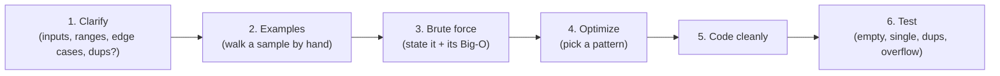
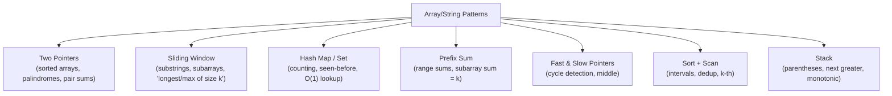
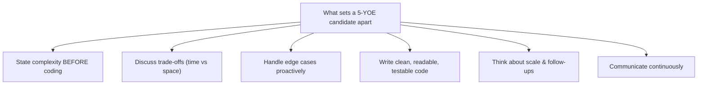

# 💻 Coding Interview Questions — Strings & Arrays (Java + JavaScript)

> The most commonly asked DSA interview questions with dual-language solutions, complexity analysis, patterns, and senior-level follow-ups. Calibrated for **3–5+ years experience**.

---

## 📑 Table of Contents

1. [How to Approach Any Problem](#-how-to-approach-any-problem)
2. [The Core Patterns (memorize these)](#-the-core-patterns-memorize-these)
3. [Complexity Cheat Sheet](#-complexity-cheat-sheet)
4. [Array Questions](#-array-questions)
5. [String Questions](#-string-questions)
6. [Bonus: Stack / HashMap / Two-Pointer Classics](#-bonus-stack--hashmap--two-pointer-classics)
7. [Senior-Level Interview Tips (5 YOE)](#-senior-level-interview-tips-5-yoe)
8. [Quick Revision Table](#-quick-revision-table)

> Related: [[01 Basic Java]] · [[01 JavaScript]] · [[03 TypeScript]] · [[01 System Design Fundamentals]]

---

## 🧭 How to Approach Any Problem

> [!IMPORTANT]
> At 5 YOE, interviewers care **less** about whether you know the trick and **more** about your **process**: clarifying requirements, discussing trade-offs, stating complexity *before* coding, handling edge cases, and testing. Talk through it.



**The clarifying questions that score points:**
- Can the input be empty / null? Negative numbers? Duplicates?
- Is the array sorted? Any size bounds (overflow risk)?
- ASCII or Unicode strings? Case-sensitive?
- Can I modify the input in place? Multiple valid answers?
- Optimize for time or space?

---

## 🎯 The Core Patterns (memorize these)



| Pattern | Signal in the problem | Typical complexity |
|---|---|---|
| **Two Pointers** | Sorted array, pair/triplet, palindrome, in-place | O(n) or O(n²) |
| **Sliding Window** | "longest/shortest/max substring/subarray" | O(n) |
| **Hash Map/Set** | "have I seen this?", counting, grouping | O(n) time, O(n) space |
| **Prefix Sum** | Range sums, "subarray sums to k" | O(n) |
| **Sort + Scan** | Intervals, order matters, dedup | O(n log n) |
| **Stack** | Matching pairs, "next greater", nesting | O(n) |

> [!TIP]
> **90% of string/array interview questions map to one of these six patterns.** When stuck, ask "which pattern fits?" — the phrasing usually gives it away ("longest substring" → sliding window; "sorted, find pair" → two pointers; "seen before" → hash set).

---

## 📊 Complexity Cheat Sheet

| Operation | Array | HashMap/Set | Sorted |
|---|---|---|---|
| Access by index | O(1) | — | O(1) |
| Search (unsorted) | O(n) | O(1) avg | O(log n) binary search |
| Insert/delete (end) | O(1)* | O(1) avg | — |
| Insert/delete (middle) | O(n) | O(1) avg | O(n) |

\*amortized. **Common Big-O targets:** brute force O(n²) → optimized O(n) (hashing) or O(n log n) (sorting).

---

## 📦 ARRAY QUESTIONS

### 1. Two Sum
**Return indices of two numbers that add up to a target.** (The #1 most-asked question.)

**Approach:** One-pass hash map — for each number, check if `target - num` was seen.

```java
public int[] twoSum(int[] nums, int target) {
    Map<Integer, Integer> seen = new HashMap<>();
    for (int i = 0; i < nums.length; i++) {
        int complement = target - nums[i];
        if (seen.containsKey(complement)) {
            return new int[]{seen.get(complement), i};
        }
        seen.put(nums[i], i);
    }
    return new int[]{}; // no solution
}
```

```javascript
function twoSum(nums, target) {
  const seen = new Map();
  for (let i = 0; i < nums.length; i++) {
    const complement = target - nums[i];
    if (seen.has(complement)) return [seen.get(complement), i];
    seen.set(nums[i], i);
  }
  return [];
}
```

**Complexity:** O(n) time, O(n) space. **Follow-up:** If the array were *sorted*, use two pointers for O(1) space.

---

### 2. Best Time to Buy and Sell Stock
**Max profit from one buy + one later sell.**

**Approach:** Track the minimum price so far; at each price, compute profit vs that min.

```java
public int maxProfit(int[] prices) {
    int minPrice = Integer.MAX_VALUE, maxProfit = 0;
    for (int price : prices) {
        minPrice = Math.min(minPrice, price);
        maxProfit = Math.max(maxProfit, price - minPrice);
    }
    return maxProfit;
}
```

```javascript
function maxProfit(prices) {
  let minPrice = Infinity, maxProfit = 0;
  for (const price of prices) {
    minPrice = Math.min(minPrice, price);
    maxProfit = Math.max(maxProfit, price - minPrice);
  }
  return maxProfit;
}
```

**Complexity:** O(n) time, O(1) space. **Follow-up:** Multiple transactions? Sum every positive `prices[i]-prices[i-1]`.

---

### 3. Maximum Subarray (Kadane's Algorithm)
**Find the contiguous subarray with the largest sum.**

**Approach:** At each element, decide: extend the previous subarray or start fresh.

```java
public int maxSubArray(int[] nums) {
    int current = nums[0], best = nums[0];
    for (int i = 1; i < nums.length; i++) {
        current = Math.max(nums[i], current + nums[i]);
        best = Math.max(best, current);
    }
    return best;
}
```

```javascript
function maxSubArray(nums) {
  let current = nums[0], best = nums[0];
  for (let i = 1; i < nums.length; i++) {
    current = Math.max(nums[i], current + nums[i]);
    best = Math.max(best, current);
  }
  return best;
}
```

**Complexity:** O(n) time, O(1) space. **Follow-up:** Return the subarray *indices* → track start/end when `current` resets.

---

### 4. Move Zeroes
**Move all 0s to the end, keep non-zero order, in place.**

**Approach:** Two pointers — `insertPos` tracks where the next non-zero goes.

```java
public void moveZeroes(int[] nums) {
    int insertPos = 0;
    for (int num : nums) {
        if (num != 0) nums[insertPos++] = num;
    }
    while (insertPos < nums.length) nums[insertPos++] = 0;
}
```

```javascript
function moveZeroes(nums) {
  let insertPos = 0;
  for (const num of nums) {
    if (num !== 0) nums[insertPos++] = num;
  }
  while (insertPos < nums.length) nums[insertPos++] = 0;
}
```

**Complexity:** O(n) time, O(1) space.

---

### 5. Contains Duplicate
**Return true if any value appears at least twice.**

```java
public boolean containsDuplicate(int[] nums) {
    Set<Integer> seen = new HashSet<>();
    for (int num : nums) {
        if (!seen.add(num)) return true; // add returns false if already present
    }
    return false;
}
```

```javascript
function containsDuplicate(nums) {
  return new Set(nums).size !== nums.length;
}
```

**Complexity:** O(n) time, O(n) space. **Follow-up:** O(1) space? Sort first (O(n log n)) and check adjacent.

---

### 6. Product of Array Except Self
**Return array where `output[i]` = product of all elements except `nums[i]` — without division.**

**Approach:** Two passes — prefix products, then suffix products.

```java
public int[] productExceptSelf(int[] nums) {
    int n = nums.length;
    int[] result = new int[n];
    result[0] = 1;
    for (int i = 1; i < n; i++) result[i] = result[i - 1] * nums[i - 1];
    int suffix = 1;
    for (int i = n - 1; i >= 0; i--) {
        result[i] *= suffix;
        suffix *= nums[i];
    }
    return result;
}
```

```javascript
function productExceptSelf(nums) {
  const n = nums.length, result = new Array(n).fill(1);
  for (let i = 1; i < n; i++) result[i] = result[i - 1] * nums[i - 1];
  let suffix = 1;
  for (let i = n - 1; i >= 0; i--) {
    result[i] *= suffix;
    suffix *= nums[i];
  }
  return result;
}
```

**Complexity:** O(n) time, O(1) extra space (output doesn't count). **Why no division?** Interviewers add that constraint to prevent the trivial solution and to handle zeros.

---

### 7. Merge Intervals
**Merge all overlapping intervals.**

**Approach:** Sort by start; merge when the current start ≤ last merged end.

```java
public int[][] merge(int[][] intervals) {
    Arrays.sort(intervals, (a, b) -> Integer.compare(a[0], b[0]));
    List<int[]> merged = new ArrayList<>();
    for (int[] interval : intervals) {
        if (merged.isEmpty() || merged.get(merged.size() - 1)[1] < interval[0]) {
            merged.add(interval);
        } else {
            merged.get(merged.size() - 1)[1] =
                Math.max(merged.get(merged.size() - 1)[1], interval[1]);
        }
    }
    return merged.toArray(new int[0][]);
}
```

```javascript
function merge(intervals) {
  intervals.sort((a, b) => a[0] - b[0]);
  const merged = [];
  for (const [start, end] of intervals) {
    const last = merged[merged.length - 1];
    if (!last || last[1] < start) merged.push([start, end]);
    else last[1] = Math.max(last[1], end);
  }
  return merged;
}
```

**Complexity:** O(n log n) time (sort dominates), O(n) space. **Very commonly asked** — also appears in [[01 System Design Fundamentals]] scheduling.

---

### 8. Rotate Array
**Rotate an array right by k steps, in place.**

**Approach:** The reversal trick — reverse whole, reverse first k, reverse rest.

```java
public void rotate(int[] nums, int k) {
    k %= nums.length;
    reverse(nums, 0, nums.length - 1);
    reverse(nums, 0, k - 1);
    reverse(nums, k, nums.length - 1);
}
private void reverse(int[] nums, int l, int r) {
    while (l < r) {
        int tmp = nums[l]; nums[l] = nums[r]; nums[r] = tmp;
        l++; r--;
    }
}
```

```javascript
function rotate(nums, k) {
  k %= nums.length;
  const reverse = (l, r) => {
    while (l < r) { [nums[l], nums[r]] = [nums[r], nums[l]]; l++; r--; }
  };
  reverse(0, nums.length - 1);
  reverse(0, k - 1);
  reverse(k, nums.length - 1);
}
```

**Complexity:** O(n) time, O(1) space. **Watch:** `k %= n` handles k > n.

---

### 9. Find the Missing Number
**Array of n distinct numbers in [0, n], find the missing one.**

**Approach:** Expected sum minus actual sum (or XOR to avoid overflow).

```java
public int missingNumber(int[] nums) {
    int n = nums.length;
    int expected = n * (n + 1) / 2, actual = 0;
    for (int num : nums) actual += num;
    return expected - actual;
    // Overflow-safe alt: XOR all indices 0..n and all values.
}
```

```javascript
function missingNumber(nums) {
  const n = nums.length;
  const expected = (n * (n + 1)) / 2;
  const actual = nums.reduce((a, b) => a + b, 0);
  return expected - actual;
}
```

**Complexity:** O(n) time, O(1) space. **Follow-up:** For very large n, XOR avoids integer overflow — a good senior detail.

---

### 10. 3Sum
**Find all unique triplets that sum to zero.**

**Approach:** Sort, then for each element do a two-pointer scan; skip duplicates.

```java
public List<List<Integer>> threeSum(int[] nums) {
    Arrays.sort(nums);
    List<List<Integer>> res = new ArrayList<>();
    for (int i = 0; i < nums.length - 2; i++) {
        if (i > 0 && nums[i] == nums[i - 1]) continue; // skip dup pivot
        int l = i + 1, r = nums.length - 1;
        while (l < r) {
            int sum = nums[i] + nums[l] + nums[r];
            if (sum == 0) {
                res.add(Arrays.asList(nums[i], nums[l], nums[r]));
                while (l < r && nums[l] == nums[l + 1]) l++;
                while (l < r && nums[r] == nums[r - 1]) r--;
                l++; r--;
            } else if (sum < 0) l++;
            else r--;
        }
    }
    return res;
}
```

```javascript
function threeSum(nums) {
  nums.sort((a, b) => a - b);
  const res = [];
  for (let i = 0; i < nums.length - 2; i++) {
    if (i > 0 && nums[i] === nums[i - 1]) continue;
    let l = i + 1, r = nums.length - 1;
    while (l < r) {
      const sum = nums[i] + nums[l] + nums[r];
      if (sum === 0) {
        res.push([nums[i], nums[l], nums[r]]);
        while (l < r && nums[l] === nums[l + 1]) l++;
        while (l < r && nums[r] === nums[r - 1]) r--;
        l++; r--;
      } else if (sum < 0) l++;
      else r--;
    }
  }
  return res;
}
```

**Complexity:** O(n²) time, O(1) extra (ignoring output). **The dedup logic is the hard part** — practice it.

---

### 11. Container With Most Water
**Two lines form a container; maximize water area.**

**Approach:** Two pointers from both ends; move the shorter line inward.

```java
public int maxArea(int[] height) {
    int l = 0, r = height.length - 1, max = 0;
    while (l < r) {
        int area = Math.min(height[l], height[r]) * (r - l);
        max = Math.max(max, area);
        if (height[l] < height[r]) l++; else r--;
    }
    return max;
}
```

```javascript
function maxArea(height) {
  let l = 0, r = height.length - 1, max = 0;
  while (l < r) {
    max = Math.max(max, Math.min(height[l], height[r]) * (r - l));
    if (height[l] < height[r]) l++; else r--;
  }
  return max;
}
```

**Complexity:** O(n) time, O(1) space. **Key insight:** moving the taller line can never increase area, so move the shorter.

---

### 12. Subarray Sum Equals K
**Count subarrays whose sum equals k.**

**Approach:** Prefix sum + hash map of prefix-sum frequencies.

```java
public int subarraySum(int[] nums, int k) {
    Map<Integer, Integer> prefixCount = new HashMap<>();
    prefixCount.put(0, 1);
    int sum = 0, count = 0;
    for (int num : nums) {
        sum += num;
        count += prefixCount.getOrDefault(sum - k, 0);
        prefixCount.merge(sum, 1, Integer::sum);
    }
    return count;
}
```

```javascript
function subarraySum(nums, k) {
  const prefixCount = new Map([[0, 1]]);
  let sum = 0, count = 0;
  for (const num of nums) {
    sum += num;
    count += prefixCount.get(sum - k) || 0;
    prefixCount.set(sum, (prefixCount.get(sum) || 0) + 1);
  }
  return count;
}
```

**Complexity:** O(n) time, O(n) space. **Pattern:** prefix sum + hashmap — appears constantly. Handles negatives (sliding window would not).

---

### 13. Sort Colors (Dutch National Flag)
**Sort an array of 0s, 1s, 2s in one pass, in place.**

**Approach:** Three pointers — low, mid, high.

```java
public void sortColors(int[] nums) {
    int low = 0, mid = 0, high = nums.length - 1;
    while (mid <= high) {
        if (nums[mid] == 0) swap(nums, low++, mid++);
        else if (nums[mid] == 1) mid++;
        else swap(nums, mid, high--);
    }
}
private void swap(int[] a, int i, int j) { int t = a[i]; a[i] = a[j]; a[j] = t; }
```

```javascript
function sortColors(nums) {
  let low = 0, mid = 0, high = nums.length - 1;
  const swap = (i, j) => { [nums[i], nums[j]] = [nums[j], nums[i]]; };
  while (mid <= high) {
    if (nums[mid] === 0) swap(low++, mid++);
    else if (nums[mid] === 1) mid++;
    else swap(mid, high--);
  }
}
```

**Complexity:** O(n) time, O(1) space, single pass.

---

## 🔤 STRING QUESTIONS

### 1. Reverse a String
**Reverse in place (array of chars) — the warm-up.**

```java
public void reverseString(char[] s) {
    int l = 0, r = s.length - 1;
    while (l < r) {
        char tmp = s[l]; s[l] = s[r]; s[r] = tmp;
        l++; r--;
    }
}
```

```javascript
function reverseString(s) {           // s is an array of chars
  let l = 0, r = s.length - 1;
  while (l < r) { [s[l], s[r]] = [s[r], s[l]]; l++; r--; }
}
// For a JS string: s.split('').reverse().join('')
```

**Complexity:** O(n) time, O(1) space. **Note:** Java strings are immutable → work on `char[]`. JS strings too → work on arrays.

---

### 2. Valid Palindrome
**Ignore non-alphanumeric and case; check if it reads the same both ways.**

```java
public boolean isPalindrome(String s) {
    int l = 0, r = s.length() - 1;
    while (l < r) {
        while (l < r && !Character.isLetterOrDigit(s.charAt(l))) l++;
        while (l < r && !Character.isLetterOrDigit(s.charAt(r))) r--;
        if (Character.toLowerCase(s.charAt(l)) != Character.toLowerCase(s.charAt(r)))
            return false;
        l++; r--;
    }
    return true;
}
```

```javascript
function isPalindrome(s) {
  let l = 0, r = s.length - 1;
  const isAlnum = c => /[a-z0-9]/i.test(c);
  while (l < r) {
    while (l < r && !isAlnum(s[l])) l++;
    while (l < r && !isAlnum(s[r])) r--;
    if (s[l].toLowerCase() !== s[r].toLowerCase()) return false;
    l++; r--;
  }
  return true;
}
```

**Complexity:** O(n) time, O(1) space. **Two-pointer classic.**

---

### 3. Valid Anagram
**Do two strings have the same character counts?**

```java
public boolean isAnagram(String s, String t) {
    if (s.length() != t.length()) return false;
    int[] count = new int[26];
    for (int i = 0; i < s.length(); i++) {
        count[s.charAt(i) - 'a']++;
        count[t.charAt(i) - 'a']--;
    }
    for (int c : count) if (c != 0) return false;
    return true;
}
```

```javascript
function isAnagram(s, t) {
  if (s.length !== t.length) return false;
  const count = {};
  for (const c of s) count[c] = (count[c] || 0) + 1;
  for (const c of t) {
    if (!count[c]) return false;
    count[c]--;
  }
  return true;
}
```

**Complexity:** O(n) time, O(1) space (fixed 26-letter alphabet). **Follow-up:** Unicode? Use a hash map instead of a 26-array.

---

### 4. First Unique Character
**Return the index of the first non-repeating character.**

```java
public int firstUniqChar(String s) {
    int[] count = new int[26];
    for (char c : s.toCharArray()) count[c - 'a']++;
    for (int i = 0; i < s.length(); i++) {
        if (count[s.charAt(i) - 'a'] == 1) return i;
    }
    return -1;
}
```

```javascript
function firstUniqChar(s) {
  const count = {};
  for (const c of s) count[c] = (count[c] || 0) + 1;
  for (let i = 0; i < s.length; i++) {
    if (count[s[i]] === 1) return i;
  }
  return -1;
}
```

**Complexity:** O(n) time, O(1) space. **Two-pass counting** — a very frequent warm-up.

---

### 5. Longest Substring Without Repeating Characters
**Length of the longest substring with all-unique characters.** (Top sliding-window question.)

**Approach:** Sliding window; store last-seen index; jump the left pointer past duplicates.

```java
public int lengthOfLongestSubstring(String s) {
    Map<Character, Integer> lastSeen = new HashMap<>();
    int left = 0, max = 0;
    for (int right = 0; right < s.length(); right++) {
        char c = s.charAt(right);
        if (lastSeen.containsKey(c) && lastSeen.get(c) >= left) {
            left = lastSeen.get(c) + 1;
        }
        lastSeen.put(c, right);
        max = Math.max(max, right - left + 1);
    }
    return max;
}
```

```javascript
function lengthOfLongestSubstring(s) {
  const lastSeen = new Map();
  let left = 0, max = 0;
  for (let right = 0; right < s.length; right++) {
    const c = s[right];
    if (lastSeen.has(c) && lastSeen.get(c) >= left) {
      left = lastSeen.get(c) + 1;
    }
    lastSeen.set(c, right);
    max = Math.max(max, right - left + 1);
  }
  return max;
}
```

**Complexity:** O(n) time, O(min(n, alphabet)) space. **The canonical sliding-window problem — know it cold.**

---

### 6. Group Anagrams
**Group words that are anagrams of each other.**

**Approach:** Key each word by its sorted characters (or a count signature).

```java
public List<List<String>> groupAnagrams(String[] strs) {
    Map<String, List<String>> map = new HashMap<>();
    for (String s : strs) {
        char[] chars = s.toCharArray();
        Arrays.sort(chars);
        String key = new String(chars);
        map.computeIfAbsent(key, k -> new ArrayList<>()).add(s);
    }
    return new ArrayList<>(map.values());
}
```

```javascript
function groupAnagrams(strs) {
  const map = new Map();
  for (const s of strs) {
    const key = s.split('').sort().join('');
    if (!map.has(key)) map.set(key, []);
    map.get(key).push(s);
  }
  return [...map.values()];
}
```

**Complexity:** O(n·k log k) (k = word length). **Optimization:** use a 26-count string as the key → O(n·k). Great follow-up.

---

### 7. Valid Parentheses
**Check if brackets `()[]{}` are correctly matched and nested.** (Top stack question.)

```java
public boolean isValid(String s) {
    Deque<Character> stack = new ArrayDeque<>();
    Map<Character, Character> pairs = Map.of(')', '(', ']', '[', '}', '{');
    for (char c : s.toCharArray()) {
        if (pairs.containsValue(c)) {
            stack.push(c);
        } else if (pairs.containsKey(c)) {
            if (stack.isEmpty() || stack.pop() != pairs.get(c)) return false;
        }
    }
    return stack.isEmpty();
}
```

```javascript
function isValid(s) {
  const stack = [];
  const pairs = { ')': '(', ']': '[', '}': '{' };
  for (const c of s) {
    if (c === '(' || c === '[' || c === '{') stack.push(c);
    else if (stack.pop() !== pairs[c]) return false;
  }
  return stack.length === 0;
}
```

**Complexity:** O(n) time, O(n) space. **The classic stack problem.** Don't forget the final `stack.isEmpty()` check.

---

### 8. Longest Common Prefix
**Find the longest common prefix among an array of strings.**

```java
public String longestCommonPrefix(String[] strs) {
    if (strs.length == 0) return "";
    String prefix = strs[0];
    for (int i = 1; i < strs.length; i++) {
        while (strs[i].indexOf(prefix) != 0) {
            prefix = prefix.substring(0, prefix.length() - 1);
            if (prefix.isEmpty()) return "";
        }
    }
    return prefix;
}
```

```javascript
function longestCommonPrefix(strs) {
  if (strs.length === 0) return "";
  let prefix = strs[0];
  for (let i = 1; i < strs.length; i++) {
    while (!strs[i].startsWith(prefix)) {
      prefix = prefix.slice(0, -1);
      if (!prefix) return "";
    }
  }
  return prefix;
}
```

**Complexity:** O(S) where S = total characters. **Edge cases:** empty array, empty string, single element.

---

### 9. String to Integer (atoi)
**Parse a leading integer from a string, handling sign, whitespace, overflow.** (Tests edge-case handling.)

```java
public int myAtoi(String s) {
    int i = 0, n = s.length(), sign = 1;
    long result = 0;
    while (i < n && s.charAt(i) == ' ') i++;                 // skip spaces
    if (i < n && (s.charAt(i) == '+' || s.charAt(i) == '-')) {
        sign = s.charAt(i++) == '-' ? -1 : 1;               // sign
    }
    while (i < n && Character.isDigit(s.charAt(i))) {
        result = result * 10 + (s.charAt(i++) - '0');
        if (sign * result > Integer.MAX_VALUE) return Integer.MAX_VALUE;
        if (sign * result < Integer.MIN_VALUE) return Integer.MIN_VALUE;
    }
    return (int) (sign * result);
}
```

```javascript
function myAtoi(s) {
  let i = 0, sign = 1, result = 0;
  const n = s.length;
  const INT_MAX = 2147483647, INT_MIN = -2147483648;
  while (i < n && s[i] === ' ') i++;
  if (s[i] === '+' || s[i] === '-') sign = s[i++] === '-' ? -1 : 1;
  while (i < n && s[i] >= '0' && s[i] <= '9') {
    result = result * 10 + (s.charCodeAt(i++) - 48);
    if (sign * result > INT_MAX) return INT_MAX;
    if (sign * result < INT_MIN) return INT_MIN;
  }
  return sign * result;
}
```

**Complexity:** O(n) time. **Why asked:** it's less about algorithm, more about **carefully handling edge cases** (spaces, sign, overflow, non-digits) — a senior signal.

---

### 10. Longest Palindromic Substring
**Find the longest palindromic substring.**

**Approach:** Expand around each center (2n−1 centers: chars + gaps).

```java
public String longestPalindrome(String s) {
    if (s.length() < 2) return s;
    int start = 0, maxLen = 1;
    for (int i = 0; i < s.length(); i++) {
        int len1 = expand(s, i, i);       // odd-length
        int len2 = expand(s, i, i + 1);   // even-length
        int len = Math.max(len1, len2);
        if (len > maxLen) {
            maxLen = len;
            start = i - (len - 1) / 2;
        }
    }
    return s.substring(start, start + maxLen);
}
private int expand(String s, int l, int r) {
    while (l >= 0 && r < s.length() && s.charAt(l) == s.charAt(r)) { l--; r++; }
    return r - l - 1;
}
```

```javascript
function longestPalindrome(s) {
  if (s.length < 2) return s;
  let start = 0, maxLen = 1;
  const expand = (l, r) => {
    while (l >= 0 && r < s.length && s[l] === s[r]) { l--; r++; }
    return r - l - 1;
  };
  for (let i = 0; i < s.length; i++) {
    const len = Math.max(expand(i, i), expand(i, i + 1));
    if (len > maxLen) { maxLen = len; start = i - Math.floor((len - 1) / 2); }
  }
  return s.substring(start, start + maxLen);
}
```

**Complexity:** O(n²) time, O(1) space. **Follow-up:** Manacher's algorithm does O(n) — mention it exists; you won't be asked to code it.

---

### 11. Reverse Words in a String
**Reverse the order of words; trim extra spaces.**

```java
public String reverseWords(String s) {
    String[] words = s.trim().split("\\s+");
    Collections.reverse(Arrays.asList(words));
    return String.join(" ", words);
}
```

```javascript
function reverseWords(s) {
  return s.trim().split(/\s+/).reverse().join(' ');
}
```

**Complexity:** O(n) time, O(n) space. **Follow-up:** In place with O(1) space → reverse whole string, then reverse each word (harder, char-array based).

---

### 12. String Compression (Run-Length)
**Compress `"aabcccccaaa"` → `"a2b1c5a3"`; return original if not shorter.**

```java
public String compress(String s) {
    StringBuilder sb = new StringBuilder();
    int i = 0, n = s.length();
    while (i < n) {
        char c = s.charAt(i);
        int count = 0;
        while (i < n && s.charAt(i) == c) { i++; count++; }
        sb.append(c).append(count);
    }
    return sb.length() < s.length() ? sb.toString() : s;
}
```

```javascript
function compress(s) {
  let result = "", i = 0;
  while (i < s.length) {
    const c = s[i];
    let count = 0;
    while (i < s.length && s[i] === c) { i++; count++; }
    result += c + count;
  }
  return result.length < s.length ? result : s;
}
```

**Complexity:** O(n) time. **Note:** Use `StringBuilder` in Java — string concatenation in a loop is O(n²) (immutable strings). Same care in JS for very large inputs.

---

### 13. Minimum Window Substring (Hard — advanced sliding window)
**Smallest window in `s` containing all characters of `t`.**

**Approach:** Sliding window with a need-count map; expand right, contract left when valid.

```java
public String minWindow(String s, String t) {
    if (s.length() < t.length()) return "";
    Map<Character, Integer> need = new HashMap<>();
    for (char c : t.toCharArray()) need.merge(c, 1, Integer::sum);
    int required = need.size(), formed = 0, left = 0;
    int[] result = {-1, 0, 0}; // len, start, end
    Map<Character, Integer> window = new HashMap<>();
    for (int right = 0; right < s.length(); right++) {
        char c = s.charAt(right);
        window.merge(c, 1, Integer::sum);
        if (need.containsKey(c) && window.get(c).intValue() == need.get(c).intValue())
            formed++;
        while (formed == required) {
            if (result[0] == -1 || right - left + 1 < result[0]) {
                result[0] = right - left + 1; result[1] = left; result[2] = right;
            }
            char lc = s.charAt(left);
            window.merge(lc, -1, Integer::sum);
            if (need.containsKey(lc) && window.get(lc) < need.get(lc)) formed--;
            left++;
        }
    }
    return result[0] == -1 ? "" : s.substring(result[1], result[2] + 1);
}
```

```javascript
function minWindow(s, t) {
  if (s.length < t.length) return "";
  const need = new Map();
  for (const c of t) need.set(c, (need.get(c) || 0) + 1);
  let required = need.size, formed = 0, left = 0;
  let result = [-1, 0, 0]; // len, start, end
  const window = new Map();
  for (let right = 0; right < s.length; right++) {
    const c = s[right];
    window.set(c, (window.get(c) || 0) + 1);
    if (need.has(c) && window.get(c) === need.get(c)) formed++;
    while (formed === required) {
      if (result[0] === -1 || right - left + 1 < result[0]) {
        result = [right - left + 1, left, right];
      }
      const lc = s[left];
      window.set(lc, window.get(lc) - 1);
      if (need.has(lc) && window.get(lc) < need.get(lc)) formed--;
      left++;
    }
  }
  return result[0] === -1 ? "" : s.substring(result[1], result[2] + 1);
}
```

**Complexity:** O(n) time, O(alphabet) space. **The hard sliding-window template** — if you understand this, you understand the pattern deeply.

---

## 🎁 BONUS: Stack / HashMap / Two-Pointer Classics

### Merge Two Sorted Arrays (in place, from the back)
```java
public void merge(int[] nums1, int m, int[] nums2, int n) {
    int i = m - 1, j = n - 1, k = m + n - 1;
    while (j >= 0) {
        nums1[k--] = (i >= 0 && nums1[i] > nums2[j]) ? nums1[i--] : nums2[j--];
    }
}
```
```javascript
function merge(nums1, m, nums2, n) {
  let i = m - 1, j = n - 1, k = m + n - 1;
  while (j >= 0) {
    nums1[k--] = (i >= 0 && nums1[i] > nums2[j]) ? nums1[i--] : nums2[j--];
  }
}
```
**Trick:** fill from the **back** to avoid overwriting. O(m+n) time, O(1) space.

---

### Two Sum II (sorted input — two pointers, O(1) space)
```java
public int[] twoSumSorted(int[] numbers, int target) {
    int l = 0, r = numbers.length - 1;
    while (l < r) {
        int sum = numbers[l] + numbers[r];
        if (sum == target) return new int[]{l + 1, r + 1};
        else if (sum < target) l++;
        else r--;
    }
    return new int[]{};
}
```
```javascript
function twoSumSorted(numbers, target) {
  let l = 0, r = numbers.length - 1;
  while (l < r) {
    const sum = numbers[l] + numbers[r];
    if (sum === target) return [l + 1, r + 1];
    else if (sum < target) l++;
    else r--;
  }
  return [];
}
```
**The sorted follow-up to Two Sum** — demonstrates two-pointer space optimization.

---

### Majority Element (Boyer-Moore Voting — O(1) space)
```java
public int majorityElement(int[] nums) {
    int count = 0, candidate = 0;
    for (int num : nums) {
        if (count == 0) candidate = num;
        count += (num == candidate) ? 1 : -1;
    }
    return candidate;
}
```
```javascript
function majorityElement(nums) {
  let count = 0, candidate = 0;
  for (const num of nums) {
    if (count === 0) candidate = num;
    count += num === candidate ? 1 : -1;
  }
  return candidate;
}
```
**Boyer-Moore voting** — an elegant O(n) time / O(1) space trick interviewers love.

---

## 🎓 Senior-Level Interview Tips (5 YOE)

> [!IMPORTANT]
> At 5 YOE, correct code isn't enough — you're expected to demonstrate **engineering maturity**. These separate a senior from a junior in the same interview.



| Do | Why it matters at senior level |
|---|---|
| **Clarify before coding** | Shows you gather requirements ([[01 System Design Fundamentals]] mindset) |
| **State brute force + Big-O first** | Demonstrates you see the whole solution space |
| **Name the pattern out loud** | "This is a sliding-window problem" signals experience |
| **Handle edge cases unprompted** | empty, null, single element, duplicates, overflow, Unicode |
| **Use clean naming + helper methods** | Production-quality code, not competitive-programming golf |
| **Test your code by hand** | Walk a sample input through; catch off-by-one errors |
| **Discuss trade-offs** | "Hashing gives O(n) time but O(n) space; sorting is O(1) space but O(n log n)" |
| **Mention real-world parallels** | e.g., prefix-sum ~ range queries; hashing ~ [[04 Redis]] lookups |

### Language-specific gotchas to mention

**Java:**
- Strings are **immutable** → use `StringBuilder` in loops (concatenation is O(n²)).
- `int` overflow → use `long` for sums, or XOR tricks.
- `Integer` caching / `==` vs `.equals()` for boxed types.
- `ArrayDeque` for stacks (faster than `Stack`/`Vector`).

**JavaScript:**
- Strings immutable → build arrays and `.join('')`.
- `Map`/`Set` preserve insertion order and allow any key type (vs plain objects).
- Beware `sort()` default is **lexicographic** — always pass `(a,b)=>a-b` for numbers.
- No integer type — numbers are float64; watch precision beyond 2^53.
- Destructuring swap: `[a, b] = [b, a]` (clean, but has minor overhead in hot loops).

> [!TIP]
> **The single best habit:** narrate your thinking continuously. Silence during coding reads as uncertainty; a running commentary ("I'll use a hash map here to get O(1) lookups, trading space for time") reads as senior. Interviewers hire the person they'd want to pair with.

---

## 📋 Quick Revision Table

| # | Problem | Pattern | Time | Space |
|---|---|---|---|---|
| A1 | Two Sum | Hash Map | O(n) | O(n) |
| A2 | Buy/Sell Stock | Track min | O(n) | O(1) |
| A3 | Maximum Subarray | Kadane | O(n) | O(1) |
| A4 | Move Zeroes | Two Pointers | O(n) | O(1) |
| A5 | Contains Duplicate | Hash Set | O(n) | O(n) |
| A6 | Product Except Self | Prefix/Suffix | O(n) | O(1) |
| A7 | Merge Intervals | Sort + Scan | O(n log n) | O(n) |
| A8 | Rotate Array | Reversal | O(n) | O(1) |
| A9 | Missing Number | Sum/XOR | O(n) | O(1) |
| A10 | 3Sum | Sort + Two Pointers | O(n²) | O(1) |
| A11 | Container With Water | Two Pointers | O(n) | O(1) |
| A12 | Subarray Sum = K | Prefix Sum + Map | O(n) | O(n) |
| A13 | Sort Colors | 3 Pointers | O(n) | O(1) |
| S1 | Reverse String | Two Pointers | O(n) | O(1) |
| S2 | Valid Palindrome | Two Pointers | O(n) | O(1) |
| S3 | Valid Anagram | Count | O(n) | O(1) |
| S4 | First Unique Char | Count | O(n) | O(1) |
| S5 | Longest Substring (no repeat) | Sliding Window | O(n) | O(k) |
| S6 | Group Anagrams | Hash Map + sort key | O(nk log k) | O(nk) |
| S7 | Valid Parentheses | Stack | O(n) | O(n) |
| S8 | Longest Common Prefix | Scan | O(S) | O(1) |
| S9 | atoi | Careful parsing | O(n) | O(1) |
| S10 | Longest Palindrome | Expand center | O(n²) | O(1) |
| S11 | Reverse Words | Split/reverse | O(n) | O(n) |
| S12 | String Compression | Two Pointers | O(n) | O(n) |
| S13 | Minimum Window Substring | Sliding Window | O(n) | O(k) |
| B1 | Merge Sorted Arrays | Two Pointers (back) | O(m+n) | O(1) |
| B2 | Two Sum II (sorted) | Two Pointers | O(n) | O(1) |
| B3 | Majority Element | Boyer-Moore | O(n) | O(1) |

---

## 🎯 Final Summary

> [!IMPORTANT]
> **Master the six patterns** (Two Pointers, Sliding Window, Hash Map/Set, Prefix Sum, Sort+Scan, Stack) and you can solve the vast majority of string/array interview questions. At **5 YOE**, the differentiator is **process over recall**: clarify requirements, state complexity before coding, name the pattern, handle edge cases proactively, write clean/testable code, and discuss trade-offs out loud. Memorize the **canonical templates** — sliding window (Longest Substring, Min Window), two pointers (3Sum, palindrome), prefix sum (Subarray Sum = K), and Kadane (Max Subarray) — because most questions are variations of these. Know your **language gotchas** (Java `StringBuilder`/overflow, JS `sort` comparator/immutable strings). Practice explaining while coding — the interviewer is evaluating whether they'd want you on their team, not just whether the code compiles.

**Golden rules:**
1. 🗣️ **Narrate continuously** — silence reads as uncertainty.
2. 📊 **State Big-O before coding** — brute force, then optimize.
3. 🎯 **Name the pattern** — "this is sliding window" signals experience.
4. 🧪 **Edge cases unprompted** — empty, null, single, dups, overflow, Unicode.
5. ⚖️ **Discuss trade-offs** — time vs space, sorting vs hashing.
6. 🧹 **Clean code** — helper methods, good names, not code-golf.
7. 🔁 **Test by hand** — walk a sample, catch off-by-ones.
8. 🚀 **Think follow-ups** — "if the array were sorted / streamed / huge...".

---

*Related guides in this vault: [[01 Basic Java]] · [[01 JavaScript]] · [[03 TypeScript]] · [[01 System Design Fundamentals]] · [[05 Node.js]] · [[04 Redis]]*
