# 🚂 Express.js — The Complete Interview Preparation Guide

> **Target audience:** Candidates preparing for SDE-1 → Staff/Principal interviews at Google, Meta, Amazon, Microsoft, Apple, Netflix, Uber, Airbnb, Stripe, Databricks, Snowflake, OpenAI, Anthropic, NVIDIA, Palantir, Bloomberg, Goldman Sachs, JPMorgan, Walmart Global Tech, Salesforce, Atlassian, DoorDash, Coinbase, Shopify, Pinterest, Tesla, Adobe, Oracle, Qualcomm, Cisco, Cloudflare, Rippling — plus Indian product & service companies (TCS, Infosys, Wipro, Cognizant, Accenture, Capgemini, LTIMindtree, HCL).
>
> **Version baseline (August 2026):** **Express 5** is the production-recommended line — 5.0.0 shipped **15 October 2024** after a decade in beta, and 5.1 became the npm `latest` tag in March 2025. It requires **Node.js 18+**. **Express 4 is still everywhere in production** and has no formally published EOL date as of 2026, though the Technical Committee has pivoted to 5 and a sunset is expected around Express 6. **Express 3 is EOL.**
>
> **You must know both.** Interviewers ask v4 questions because that's what their codebase runs, and v5 questions to see whether you keep up. Every version-sensitive item below is marked `v4` / `🆕 v5`.
>
> **The single biggest v4→v5 change:** async route handlers that reject now **automatically forward to the error middleware** — no more `asyncHandler` wrapper.
>
> **Last synthesized:** August 2026.

---

## 📑 Table of Contents

| # | Section | What it covers |
|---|---------|----------------|
| 0 | [How to Use This Guide](#0-how-to-use-this-guide) | Study strategy per company tier |
| 1 | [Beginner Concepts](#1--beginner-concepts) | What/why/problems solved/analogies/misconceptions |
| 2 | [Intermediate Concepts](#2--intermediate-concepts) | Middleware pipeline internals, routing, req/res, errors, Router |
| 3 | [Advanced Concepts](#3--advanced-concepts) | Trade-offs, scaling, caching, resilience, observability, tuning |
| 4 | [Interview Questions by Level](#4--interview-questions-by-level) | Beginner → Staff → FAANG → Startup → Product → Service |
| 5 | [Frequently Asked Questions (Ranked)](#5--frequently-asked-questions-ranked-by-frequency) | Frequency-ranked master list |
| 6 | [Coding Questions](#6--coding-questions) | Easy/Medium/Hard with full solutions |
| 7 | [System Design Questions](#7--system-design-questions-express-centric) | Express-centric design rounds |
| 8 | [Real Production Usage](#8--real-production-usage-at-scale) | Who runs Express, and how |
| 9 | [Common Bugs & Production Incidents](#9--common-bugs--production-incidents) | Real failures + debugging playbooks |
| 10 | [Security](#10--security) | Express ships no defaults — the full hardening stack |
| 11 | [Performance](#11--performance) | Profiling, benchmarks, latency, throughput |
| 12 | [Best Practices](#12--best-practices) | Production-ready recommendations |
| 13 | [Anti-patterns](#13--anti-patterns) | What NOT to do and why |
| 14 | [Comparison Tables](#14--comparison-tables) | Every "X vs Y" you'll be asked |
| 15 | [Cheat Sheet](#15--cheat-sheet-one-page-revision) | One-page revision |
| 16 | [Flash Cards](#16--flash-cards) | Q → A rapid recall |
| 17 | [Interview Revision Checklist](#17--interview-revision-checklist) | Tick-box coverage |
| 18 | [Learning Roadmap](#18--learning-roadmap) | Beginner → Expert |
| 19 | [Sources & Further Reading](#19--sources--further-reading) | Where this was synthesized from |

---

## 0. How to Use This Guide

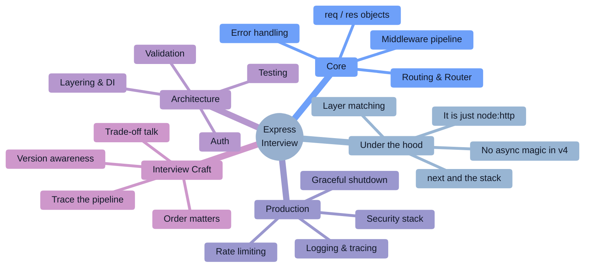

### Study strategy by company tier

| Tier | Companies | What they actually test | Time split |
|------|-----------|--------------------------|-----------|
| **FAANG / Big Tech** | Google, Meta, Amazon, Microsoft, Apple | DSA first. Express appears only as "you said you know it" — expect middleware/error-handling depth and API design, rarely trivia. | 60% DSA, 25% API/system design, 15% Express depth |
| **High-scale product** | Netflix, Uber, Airbnb, DoorDash, Pinterest, Shopify | Express as a BFF/API tier: middleware ordering, timeouts, error taxonomy, observability, graceful shutdown, and *when you'd move off it*. | 30% DSA, 35% production Express, 35% design |
| **Payments / fintech** | Stripe, Coinbase, PayPal, Razorpay | Correctness: idempotency, webhook signature verification (raw body!), validation, auth, audit logs. Bug-fix rounds in a real repo. | 25% DSA, 40% correctness + security, 35% design |
| **Indian product** | Walmart Global Tech, Flipkart, Swiggy, Zomato, PhonePe, Meesho, Zepto | **The heaviest Express weighting anywhere.** Middleware internals, `next()` semantics, error middleware, Router, JWT auth, MongoDB/SQL, plus a 90-minute machine-coding build. | 20% DSA, 40% Express + Node internals, 40% machine coding |
| **Startups** | Seed → Series C | Ship a working API end to end with validation, auth, error handling, and a test; then explain the trade-offs. | 50% build-something, 30% debugging, 20% architecture chat |
| **Service companies** | TCS, Infosys, Wipro, Accenture, Cognizant, Capgemini, LTIMindtree | Rapid-fire theory: what is middleware, `app.use` vs `app.get`, `next()`, error middleware's 4 args, routing, `req.params` vs `query` vs `body`, REST verbs, CORS, JWT basics. | 70% theory Q&A, 20% simple coding, 10% DB |

### The 2026 shift you must internalize

> [!IMPORTANT]
> **"Express is a minimal web framework for Node" is the setup, not the answer.** In 2026 interviewers immediately follow with: *"Then why did your error middleware never fire?"*, *"Where does the request actually enter your code?"*, *"You have 20 middlewares — what's that costing per request?"*, and *"Would you still pick Express today, and why?"* Every canonical question below is paired with the **depth follow-up** that decides the hire.

> [!TIP]
> **The single highest-leverage sentence in an Express interview:** *"Express is a thin layer over `node:http` — a routing table plus an ordered array of functions — so let me trace what happens to a request as it walks that array."* That framing turns middleware, errors, performance, and security into one coherent story.

---

# 1. 🌱 Beginner Concepts

## 1.1 What is Express?

**Express is a minimal, unopinionated HTTP framework for Node.js.** It does not replace `node:http` — it *wraps* it. Strip everything away and Express is three ideas:

1. **A request handler** you hand to `http.createServer`.
2. **An ordered array of functions** (the middleware stack) that each request walks through.
3. **A routing table** that decides which of those functions apply to which method + path.

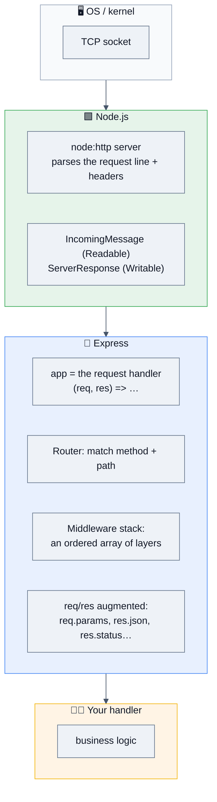

**Canonical minimal app:**

```js
import express from 'express';

const app = express();

app.get('/health', (req, res) => res.json({ ok: true }));

const server = app.listen(3000, () => console.log('listening on :3000'));
```

**What `app` really is** — a fact interviewers love:

```js
import http from 'node:http';
const app = express();
// `app` IS a function (req, res) => void. These are equivalent:
app.listen(3000);
http.createServer(app).listen(3000);
// …which is exactly how you attach Socket.IO, HTTPS, or HTTP/2 to an Express app:
const server = http.createServer(app);
io.attach(server);
server.listen(3000);
```

## 1.2 Why does Express exist? (History that gets asked)

| Year | Event | Why it matters in interviews |
|------|-------|------------------------------|
| **2010** | TJ Holowaychuk releases Express, inspired by Ruby's **Sinatra** | Explains the minimalist, unopinionated philosophy: routing + middleware, nothing else. |
| **2014** | Express 4 — `connect` middleware unbundled into separate packages; `express.Router()` introduced | This is why you `npm install` `body-parser`, `morgan`, `cors` separately. Express 4 is still the most-deployed version. |
| **2014** | Express donated to the Node.js Foundation (later OpenJS) | Governance answer for staff-level "is this project healthy?" questions. |
| **2016** | `express.json()` / `express.urlencoded()` folded back in (4.16) | You no longer need `body-parser` as a direct dependency. |
| **2016–2020** | Koa, Hapi, Fastify, NestJS emerge; Express development slows | Sets up the "would you still choose Express?" question. |
| **2022–23** | Express joins the OpenSSF; funded security and maintenance push | The project's revival story. |
| **15 Oct 2024** | **Express 5.0.0 released** — after ~10 years in beta | Native async error propagation, `path-to-regexp` 8, dropped legacy APIs, Node 18+ required. |
| **Mar 2025** | **Express 5.1** becomes the npm `latest` tag | v5 is now the default install and the recommended production line. |
| **2026** | Express 3 is EOL; Express 4 still widely deployed with no published EOL date | Know both versions. Assume v5 for new work, v4 for maintenance. |

## 1.3 Problems Express solves

| Problem with raw `node:http` | Express's answer | Trade-off you must name |
|---|---|---|
| Manual URL parsing and method branching in one giant `if/else` | Declarative routing: `app.get('/users/:id', …)` | A regex-backed matcher has a per-request cost; deep stacks add up |
| No way to share cross-cutting logic (auth, logging, parsing) | **Middleware**: composable `(req, res, next)` functions | Order is implicit and easy to get wrong — the #1 source of Express bugs |
| No body parsing | `express.json()`, `express.urlencoded()` | Must be size-limited or it's a trivial DoS |
| No response helpers | `res.json()`, `res.status()`, `res.sendFile()`, `res.redirect()` | Thin sugar over `ServerResponse` — you can always drop down |
| Errors scattered everywhere | A single **error-handling middleware** at the end | It only catches what reaches `next(err)` — in v4, async throws don't |
| No modularity for large apps | `express.Router()` — mini-apps you mount | Nested routers make the effective ordering harder to reason about |
| Everyone rebuilding the same primitives | The largest middleware ecosystem in Node | It's also the largest supply-chain surface |

> [!NOTE]
> **"Unopinionated" is the double-edged answer.** Express gives you no project structure, no validation, no DI, no security headers, no error taxonomy. That's why two Express codebases look nothing alike, and why senior interviews focus on *what you added around it*.

## 1.4 Real-world analogies (interviewers remember these)

| Concept | Analogy |
|---|---|
| **Middleware pipeline** | An airport. Every passenger (request) walks the same corridor: check-in → security → passport → gate. Each station can **let you through** (`next()`), **stop you and send you home** (`res.send()`), or **send you to the incident office** (`next(err)`). **Order is everything** — you can't check a bag after you've boarded. |
| **`next()`** | The "next, please" call at a counter. If nobody calls it, the queue simply stops and the passenger stands there forever — that's a hung request. |
| **Error middleware** | The incident office at the end of the corridor. It only ever sees people who were *explicitly escorted* there (`next(err)`). Someone who quietly collapses in a side room (an unhandled async throw in v4) never arrives. |
| **`express.Router()`** | A terminal within the airport: its own corridor of stations, mounted at a gate number (`app.use('/api/v1', router)`). |
| **`app.use` vs `app.get`** | `use` = "everyone passing this point," matched by **path prefix**. `get` = "only passengers on this exact flight," matched by **method + full path**. |
| **Express vs Fastify** | A well-worn family car vs a track car. The track car is genuinely faster on an empty circuit; in city traffic (database calls, JSON payloads, network) the difference shrinks a lot. |

## 1.5 The request lifecycle, end to end

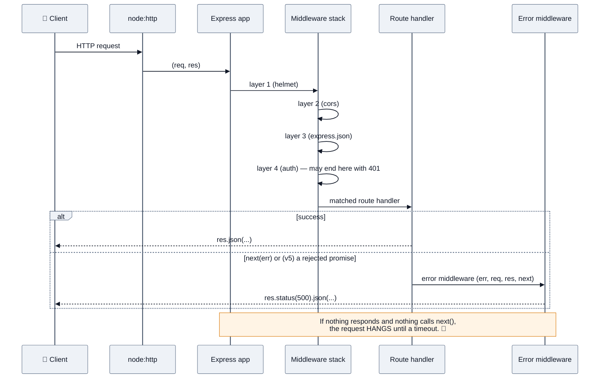

## 1.6 Your first ten Express idioms

```js
// 1. The standard security + parsing preamble (ORDER MATTERS)
app.use(helmet());
app.use(cors({ origin: ALLOWED_ORIGINS }));
app.use(express.json({ limit: '100kb' }));        // ✅ always cap the body

// 2. Route params, query, body — know which is which
app.get('/users/:id', (req, res) => {
  req.params.id;      // "/users/42"      → "42"
  req.query.page;     // "?page=2"        → "2"  (always a string!)
  req.body;           // JSON POST body   → object (only if a parser ran)
});

// 3. Chained response helpers
res.status(201).location(`/users/${id}`).json(user);

// 4. Router as a mini-app
const users = express.Router();
users.get('/', list);
app.use('/api/v1/users', users);

// 5. Route-scoped middleware
app.post('/orders', requireAuth, validate(orderSchema), createOrder);

// 6. Error middleware — FOUR parameters, mounted LAST
app.use((err, req, res, next) => { /* … */ });

// 7. 404 handler — after all routes, before the error handler
app.use((req, res) => res.status(404).json({ error: 'Not Found' }));

// 8. Trust the proxy so req.ip and req.protocol are correct behind a LB
app.set('trust proxy', 1);

// 9. Static files with caching
app.use('/assets', express.static('public', { maxAge: '1y', immutable: true }));

// 10. Keep the server handle so you can shut down gracefully
const server = app.listen(PORT);
process.on('SIGTERM', () => server.close(() => process.exit(0)));
```

## 1.7 `app.use` vs `app.METHOD` — the distinction everything depends on

```js
app.use('/api', mw);          // runs for ANY method, any path STARTING WITH /api
app.get('/api', handler);     // runs only for GET on EXACTLY /api
app.all('/api/*splat', mw);   // any method, matching the full pattern
```

| | `app.use(path, fn)` | `app.get/post/... (path, fn)` |
|---|---|---|
| Method | any | that method only |
| Path match | **prefix** | **full path** (with params) |
| `req.url` inside | rewritten — the mount prefix is stripped | unchanged |
| `req.params` | ❌ not populated from the mount path | ✅ populated |
| Typical use | cross-cutting concerns | endpoints |

## 1.8 Common beginner misconceptions ❌ → ✅

| ❌ Misconception | ✅ Reality |
|---|---|
| "Express is a full framework like Spring or Rails" | It's a routing + middleware layer. No ORM, no validation, no DI, no structure, **no security defaults**. |
| "Express handles my async errors" | **In Express 4 it does not** — a rejected promise in a handler is an unhandled rejection, the request hangs, and (Node 15+) the process may crash. `🆕 v5` fixes exactly this. |
| "Order of middleware doesn't matter much" | Order *is* the program. Body parser after the route = empty `req.body`. Error handler before the routes = never fires. Auth after the handler = a security hole. |
| "`app.use()` runs on every request" | Only for requests whose path **starts with** the mount path, and only if an earlier layer called `next()`. |
| "Error middleware catches everything" | It catches only what reaches `next(err)`. Sync throws in a handler are caught by Express; async throws are not (v4). Errors thrown *after* a response has been sent go to `res` teardown, not your handler. |
| "`res.send()` ends the function" | It ends the **response**, not the JavaScript. Code after it keeps running — and a second `res.send()` throws `ERR_HTTP_HEADERS_SENT`. `return res.send(...)` is the habit. |
| "`req.query.id` is a number" | It's always a string (or an array, or — in v4's `extended` parser — a nested object an attacker controls). Coerce and validate. |
| "Express is slow, so my API is slow" | The framework overhead is typically tens of microseconds. Your database call is milliseconds. Profile before blaming Express. |
| "`express.json()` is safe by default" | Without a `limit`, a single large body can exhaust memory and block the event loop while parsing. |
| "Express 5 is a drop-in upgrade" | It's a **breaking** release: `path-to-regexp` 8 route syntax, removed `res.sendfile`/`app.del`/`req.param()`, changed default query parser, and Node 18+. |
| "One `try/catch` in the error middleware covers the app" | The error middleware is not a `try/catch` — it's a layer that only receives what's forwarded to it. |
| "Middleware runs in parallel" | It runs strictly sequentially, one layer at a time, driven by `next()`. |

---

# 2. ⚙️ Intermediate Concepts

## 2.1 The middleware pipeline — what Express actually does

Internally, an Express app holds a **stack of Layers**. Each layer has a path matcher and a handle function. `next()` is a closure that advances an index through that stack.

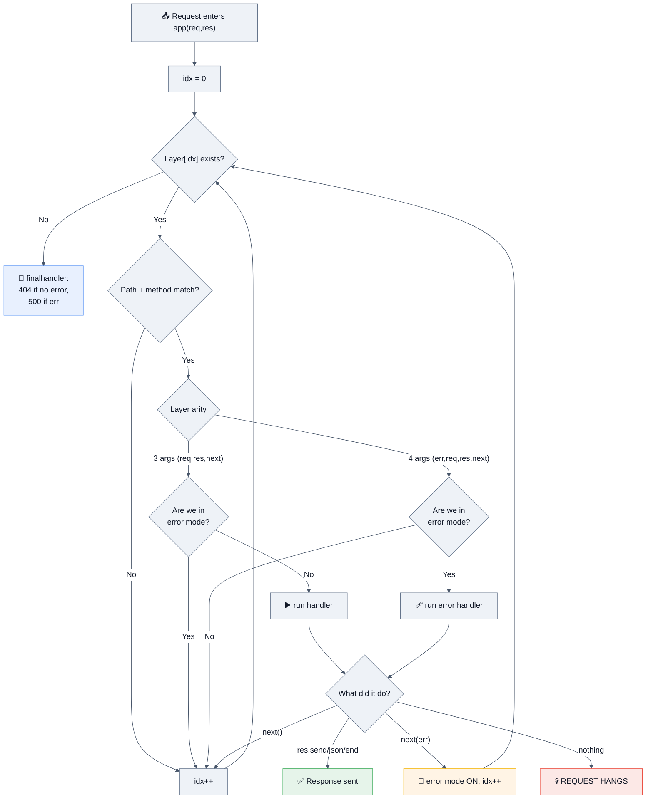

**A ~30-line Express, to prove you understand it** (a real interview ask):

```js
function createApp() {
  const stack = [];

  function app(req, res) {
    let idx = 0;
    function next(err) {
      const layer = stack[idx++];
      if (!layer) {                                   // finalhandler
        res.statusCode = err ? 500 : 404;
        return res.end(err ? 'Internal Server Error' : 'Not Found');
      }
      if (!matches(layer, req)) return next(err);
      const isErrorLayer = layer.handle.length === 4;  // ⭐ ARITY decides everything
      if (err && !isErrorLayer) return next(err);      // skip normal layers in error mode
      if (!err && isErrorLayer) return next();         // skip error layers in normal mode
      try {
        return err ? layer.handle(err, req, res, next) : layer.handle(req, res, next);
      } catch (e) {
        return next(e);                                // sync throws ARE caught
      }
    }
    next();
  }

  app.use = (path, handle) => {
    if (typeof path === 'function') { handle = path; path = '/'; }
    stack.push({ method: null, path, handle });
    return app;
  };
  app.get = (path, handle) => { stack.push({ method: 'GET', path, handle }); return app; };
  return app;
}
```

> [!IMPORTANT]
> **The arity rule is the single most important internal fact about Express.** A function with **four** declared parameters is an error handler; anything else is normal middleware. This is why `app.use((err, req, res) => {...})` **silently never runs** — three parameters means Express treats it as normal middleware. It's also why you can't use default parameters or rest args in an error handler signature: `(err, req, res, next = noop)` has arity 3.

## 2.2 Error handling — the topic that decides Express interviews

### The v4 problem

```js
// Express 4 — this is a HUNG REQUEST and an unhandled rejection
app.get('/users/:id', async (req, res) => {
  const user = await db.findUser(req.params.id);   // ❌ if this rejects…
  res.json(user);                                  // …nothing catches it
});
```

Express 4's `try/catch` around a layer only catches **synchronous** throws. An async function returns a promise; the rejection escapes. The client waits until a timeout, and on Node 15+ an unhandled rejection can terminate the process.

**The v4 fixes:**

```js
// Fix A — the classic wrapper (you WILL be asked to write this)
const asyncHandler = fn => (req, res, next) =>
  Promise.resolve(fn(req, res, next)).catch(next);

app.get('/users/:id', asyncHandler(async (req, res) => {
  res.json(await db.findUser(req.params.id));
}));

// Fix B — try/catch in every handler (noisy, easy to forget)
// Fix C — the express-async-errors package (monkey-patches the router)
```

### `🆕 v5` — native async error propagation

```js
// Express 5 — a rejected promise is forwarded to the error middleware automatically
app.get('/users/:id', async (req, res) => {
  const user = await db.findUser(req.params.id);   // ✅ rejection → next(err)
  if (!user) throw new NotFound('user');           // ✅ async throw → next(err)
  res.json(user);
});
```

> [!WARNING]
> **The v5 upgrade gotcha nobody mentions:** code that previously *relied on rejections being swallowed* now surfaces them. Upgrading can turn a silently-ignored background failure into a visible 500. That's an improvement — but it means a v5 migration needs a look at your error middleware and alerting, not just your routes.

### The complete error-handling setup

```js
// 1. Domain errors with HTTP semantics
class AppError extends Error {
  constructor(message, { status = 500, code = 'INTERNAL', expose = false, cause } = {}) {
    super(message, { cause });
    this.name = new.target.name;
    Object.assign(this, { status, code, expose });
    Error.captureStackTrace?.(this, new.target);
  }
}
class NotFound   extends AppError { constructor(w) { super(`${w} not found`, { status: 404, code: 'NOT_FOUND', expose: true }); } }
class Validation extends AppError { constructor(d)  { super('Validation failed', { status: 422, code: 'VALIDATION', expose: true }); this.details = d; } }

// 2. 404 for unmatched routes — AFTER all routes
app.use((req, res, next) => next(new NotFound(`route ${req.method} ${req.originalUrl}`)));

// 3. The error handler — LAST, four arguments
app.use((err, req, res, next) => {
  if (res.headersSent) return next(err);            // ⚠️ delegate to Node's default; can't re-send

  const status = err.status ?? err.statusCode ?? 500;
  const log = status >= 500 ? req.log.error : req.log.warn;
  log({ err, status, requestId: req.id }, 'request failed');

  res.status(status).json({
    error: {
      code: err.code ?? 'INTERNAL',
      // 🛡️ never leak internals: only expose messages you marked safe
      message: err.expose ? err.message : 'Internal Server Error',
      ...(err.details && { details: err.details }),
      requestId: req.id
    }
  });
});
```

| Rule | Why |
|---|---|
| Error middleware goes **last** | It only sees layers registered before it |
| It must have **exactly four** parameters | Arity is how Express identifies it |
| Check `res.headersSent` first | You cannot send a second response; delegate to the default handler |
| Never expose stacks/messages in production | Information disclosure |
| Distinguish 4xx (client, `warn`) from 5xx (yours, `error` + alert) | Otherwise your alerting drowns in user typos |

## 2.3 Routing

```js
app.get('/users/:id', h);                    // named param → req.params.id
app.get('/files/*splat', h);                 // 🆕 v5: wildcards MUST be named
app.get('/posts/:year/:month', h);           // multiple params
app.route('/books')                          // chainable, one path
   .get(list).post(create).put(replace);
app.param('id', (req, res, next, id) => {    // runs once for any route with :id
  req.userId = Number(id); next();
});
```

### `🆕 v5` route-syntax breaking changes (`path-to-regexp` 0.x → 8.x)

| v4 | v5 | Why it changed |
|---|---|---|
| `/*` | **`/*splat`** | Wildcards must be named |
| `/:id?` (optional) | **`/{:id}`** (braces) | New optional syntax |
| `/:id(\\d+)` (inline regex) | ❌ **removed** | Sub-expression regexes were a **ReDoS** vector — validate in a handler instead |
| `/ab+cd`, `/ab*cd` char modifiers | ❌ removed / changed | Simplified, safer grammar |
| `/*` capture in `req.params[0]` | `req.params.splat` | Named capture |

> [!WARNING]
> **The #1 Express 5 upgrade error:** `TypeError: Missing parameter name at 1` — caused by a bare `*` or a `:` with no name (very often in a catch-all like `app.get('*', spaFallback)` or a path containing a stray colon such as a full URL). Fix: `app.get('/*splat', …)` or `app.use(spaFallback)`.

**Route matching order is first-match-wins:**

```js
app.get('/users/new', h1);     // ✅ must come FIRST
app.get('/users/:id', h2);     // otherwise "new" is captured as :id
```

### `express.Router()` — modularity

```js
// routes/users.js
import { Router } from 'express';
const router = Router({ mergeParams: true });   // ⭐ inherit params from the parent mount

router.use(requireAuth);                         // scoped to THIS router only
router.get('/', list);
router.get('/:id', getOne);
export default router;

// app.js
app.use('/api/v1/users', usersRouter);
```

| Option | Effect |
|---|---|
| `mergeParams: true` | Child router can read parent params (`/orgs/:orgId/users/:id`) — **without it `req.params.orgId` is undefined** |
| `caseSensitive` | `/Foo` ≠ `/foo` |
| `strict` | `/foo` ≠ `/foo/` |

## 2.4 The `req` and `res` objects

```js
// ── req (extends http.IncomingMessage) ──
req.params      // route params (strings)
req.query       // parsed query string
req.body        // ONLY if a body parser ran
req.headers     // lowercase keys
req.get('content-type')
req.cookies     // needs cookie-parser
req.ip          // ⚠️ needs app.set('trust proxy', …) behind a load balancer
req.protocol    // same
req.originalUrl // full path BEFORE router mount rewriting
req.baseUrl     // the mount path
req.path        // path after the mount
req.method
req.signal      // 🆕 v5: AbortSignal aborted when the client disconnects

// ── res (extends http.ServerResponse) ──
res.status(201).json(obj);
res.send('text' | Buffer | obj);       // guesses content-type
res.sendStatus(204);
res.set('cache-control', 'no-store');
res.cookie('sid', v, { httpOnly: true, secure: true, sameSite: 'lax' });
res.redirect(302, '/login');
res.sendFile(path, { root: BASE });    // ⚠️ always set root — traversal defense
res.locals.user = user;                // per-request data for templates/later middleware
```

> [!IMPORTANT]
> **`trust proxy` is a real security setting, not a convenience.** Behind a load balancer, `req.ip` is the proxy's IP unless you enable it — which silently breaks IP rate limiting and audit logs. But setting `app.set('trust proxy', true)` blindly lets **any client spoof `X-Forwarded-For`** and bypass your rate limiter. The correct answer is to trust a **specific hop count or subnet**: `app.set('trust proxy', 1)` or `app.set('trust proxy', 'uniquelocal')`.

### `🆕 v5` API removals to memorize

| Removed | Replacement |
|---|---|
| `res.sendfile()` (lowercase) | `res.sendFile()` |
| `app.del()` | `app.delete()` |
| `res.json(status, obj)` / `res.send(status, body)` | `res.status(status).json(obj)` |
| `res.send(status)` | `res.sendStatus(status)` |
| `req.param(name)` | `req.params.name` / `req.query.name` / `req.body.name` |
| `res.redirect('back')` | `res.redirect(req.get('Referrer') || '/')` |
| `app.param(fn)` (array/function form) | `app.param(name, fn)` |
| Default query parser `extended` | **`simple`** — `req.query` no longer produces deep nested objects by default |

## 2.5 Body parsing, uploads, and the raw-body trap

```js
app.use(express.json({ limit: '100kb', strict: true }));          // JSON
app.use(express.urlencoded({ extended: false, limit: '100kb' })); // forms
app.use(express.text({ type: 'text/plain', limit: '10kb' }));
app.use(express.raw({ type: 'application/octet-stream', limit: '5mb' }));
```

| Option | Meaning |
|---|---|
| `limit` | Max body size — **mandatory in production** |
| `strict` | Only accept objects/arrays at the top level |
| `extended` | `true` = `qs` (nested objects, prototype-pollution surface); `false` = `querystring` (flat) |
| `type` | Which content-types this parser claims |
| `verify(req, res, buf)` | Hook to capture the **raw** buffer while still parsing |

> [!WARNING]
> **The webhook signature trap** — asked at every payments company. `express.json()` consumes the stream and gives you a *re-serialized* object; `JSON.stringify(req.body)` will **not** byte-match what the sender signed. You must keep the raw bytes:
> ```js
> // Option A: a raw parser mounted BEFORE the JSON parser, on that path only
> app.post('/webhooks/stripe', express.raw({ type: 'application/json' }), verifyAndHandle);
> // Option B: capture during parsing
> app.use(express.json({ verify: (req, _res, buf) => { req.rawBody = buf; } }));
> ```

**File uploads:** Express has no built-in multipart parser. Use `multer` (disk or memory storage) or `busboy` for streaming. **The senior answer is usually "don't proxy the bytes":** issue a pre-signed S3/GCS URL and let the client upload directly; Express only authorizes and records metadata.

## 2.6 Serving static files & templates

```js
app.use('/assets', express.static('public', {
  maxAge: '1y', immutable: true,      // content-hashed filenames
  etag: true, lastModified: true,
  dotfiles: 'ignore',                  // 🛡️ don't serve .env, .git
  index: false,
  fallthrough: true
}));

app.set('view engine', 'ejs');
app.set('views', './views');
res.render('profile', { user });       // ⚠️ escape by default; never render raw user HTML
```

> [!NOTE]
> **In production, don't serve static assets from Express.** A CDN or nginx does it faster, with better caching, range support, and compression — and it keeps your event loop free. Say this: *"`express.static` is fine for dev and small internal tools; in production the assets live on a CDN with content-hashed, immutable filenames."*

## 2.7 Validation, auth, and the layered app

```js
// Validation as middleware — schema at the boundary, typed after it
import { z } from 'zod';
const validate = (schema, source = 'body') => (req, res, next) => {
  const result = schema.safeParse(req[source]);
  if (!result.success) return next(new Validation(result.error.flatten()));
  req[source] = result.data;                       // ✅ replace with the parsed/coerced value
  next();
};

app.post('/orders',
  requireAuth,                                     // 1. who are you
  requireRole('customer'),                         // 2. may you do this
  validate(createOrderSchema),                     // 3. is the input sane
  asyncHandler(createOrder));                      // 4. do the work
```

```js
// Auth middleware — verify, don't trust
export const requireAuth = (req, res, next) => {
  const token = req.cookies?.sid ?? req.get('authorization')?.replace(/^Bearer /, '');
  if (!token) return next(new AppError('Unauthenticated', { status: 401, expose: true }));
  try {
    req.user = jwt.verify(token, PUBLIC_KEY, {
      algorithms: ['RS256'], issuer: ISS, audience: AUD   // 🛡️ pin the algorithm
    });
    next();
  } catch (err) {
    next(new AppError('Invalid token', { status: 401, expose: true, cause: err }));
  }
};
```

**Layering that survives a code review:**

```
src/
  routes/        thin: parse → validate → call a service → format the response
  services/      business logic; framework-agnostic (no req/res in here)
  repositories/  data access; the ONLY place SQL/queries live
  middleware/    cross-cutting concerns
  errors/        the error taxonomy
  config/        validated env at boot
```

> [!TIP]
> **The strongest architecture answer:** *"Handlers stay thin and framework-coupled; services take plain arguments and return plain values, so they're unit-testable without HTTP and portable if we ever move off Express. Tenant scoping lives in the repository layer, not in each handler — one forgotten handler is a breach."*

## 2.8 Middleware ordering — the canonical production stack

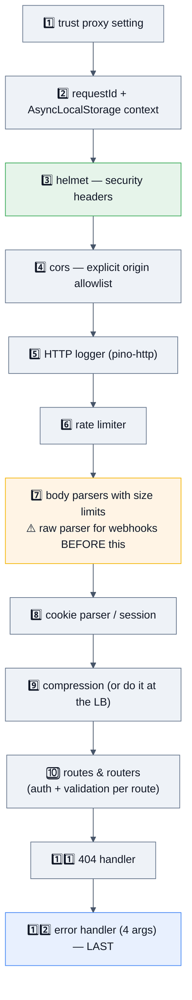

**Ordering rules to state out loud:**
1. Security headers first — they must be set even on error responses.
2. Request id/context before logging, so every log line is correlated.
3. Rate limiting **before** body parsing — don't parse 10 MB from an abuser.
4. Webhook raw-body routes **before** `express.json()`.
5. Auth before validation before the handler.
6. 404 after routes; error handler absolutely last.
7. Health checks **before** the rate limiter and auth, so probes never get throttled or 401'd.

## 2.9 Express 4 vs Express 5 — the migration table

| Area | `v4` | `🆕 v5` |
|---|---|---|
| Node requirement | 0.10+ | **18+** |
| Async errors | ❌ hang / unhandled rejection | ✅ auto-forwarded to error middleware |
| Router | `path-to-regexp` 0.x | **8.x** — named wildcards, no inline regex |
| Optional param | `/:id?` | `/{:id}` |
| Wildcard | `/*` | `/*splat` |
| Default query parser | `extended` (qs) | **`simple`** (querystring) |
| `res.sendfile`, `app.del`, `req.param()` | present (deprecated) | ❌ removed |
| `res.status(code)` with an invalid code | lenient | throws |
| `req.signal` | ❌ | ✅ abort on client disconnect |
| Body parsers | bundled since 4.16 | bundled |
| `app.listen` | returns server | returns server |

**A pragmatic migration order:** pin and upgrade in a branch → run the test suite → fix route syntax errors first (they crash at boot, so they're fast to find) → remove `asyncHandler` wrappers (optional, they still work) → re-check anything depending on nested `req.query` (`extended`→`simple`) → verify the error middleware still catches what you expect, and that newly-surfaced rejections are handled → canary one service.

---

# 3. 🚀 Advanced Concepts

*Everything a senior/staff engineer running Express in production is expected to reason about unprompted.*

## 3.1 What Express costs you (and what it doesn't)

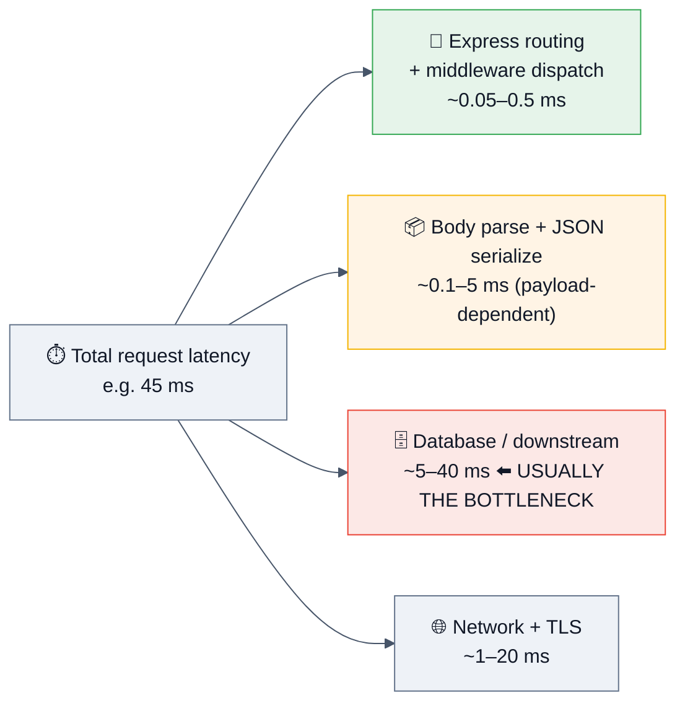

Synthetic "hello world" benchmarks commonly show **Fastify at roughly 3–5× Express's requests/second** (tens of thousands vs. a much lower ceiling for Express), largely because of Fastify's schema-compiled JSON serialization and a leaner router. **But those benchmarks measure the one part of a real request that is almost never the bottleneck.** Once you add a database call, realistic payloads, and the same middleware (logging, CORS, helmet, compression) to both sides, the gap narrows dramatically.

> [!IMPORTANT]
> **How to answer "is Express slow?" at a senior level:** *"Express's per-request overhead is on the order of tens to a few hundred microseconds. If my p99 is 300 ms, Express is 0.1% of it — I'd profile before rewriting. Where Express genuinely costs you is (a) a deep middleware stack where every layer runs on every request, and (b) `JSON.stringify` on large payloads, which Fastify's schema serializer beats. If I've fixed the database and I'm still CPU-bound in the framework, that's when a Fastify migration earns its risk."*

**Where Express overhead is real:**
- **Layer count.** Every `app.use` runs on every matching request. A 25-layer stack applied globally, where half are only needed on 3 routes, is pure waste — mount them per-route.
- **`JSON.stringify` on big responses.** Schema-based serializers (`fast-json-stringify`) are several times faster.
- **Regex route matching** on very large route tables (hundreds of routes with params).
- **Per-request object allocation** (logger children, context objects) → GC pressure at high RPS.

## 3.2 Scaling an Express app

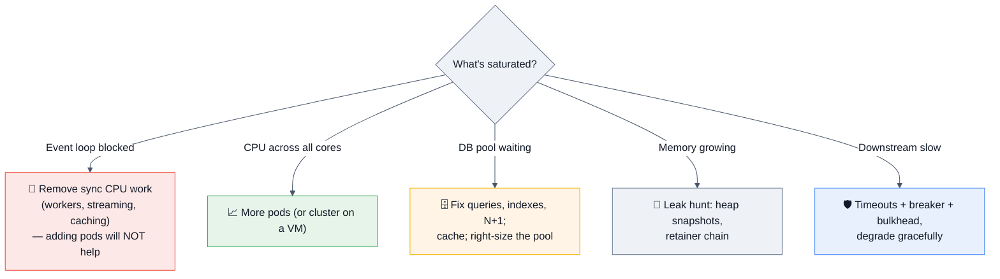

**Express is stateless — keep it that way.** The moment you have two instances, anything stored in process memory breaks:

| In-memory thing | Why it breaks at 2+ instances | Fix |
|---|---|---|
| Sessions (`express-session` MemoryStore) | User bounces between pods and appears logged out. The default store also **leaks memory and is explicitly not for production**. | Redis-backed session store, or stateless tokens |
| `express-rate-limit` default store | Each instance counts separately — with N pods the effective limit is **N×**. | Redis store |
| Caches (`Map`) | N caches, N stampedes, inconsistent reads | Redis + in-process LRU with single-flight |
| `setInterval` jobs | Runs N times, or zero times after a rolling deploy | A durable queue / leader election / a cron service |
| WebSocket connection registry | Fan-out only reaches one pod's clients | Redis pub/sub or NATS adapter |

**Process model:** the 2026 default is **one Express process per container, scale pods**. `cluster`/PM2 makes sense on a single VM; inside Kubernetes it splits one memory limit N ways and complicates graceful shutdown and metrics.

## 3.3 Trade-offs a staff engineer must be able to argue

| Decision | Option A | Option B | How to decide |
|---|---|---|---|
| Framework | **Express** | Fastify / NestJS / Hono | Express for ecosystem, familiarity, and hiring; Fastify when you're genuinely framework-CPU-bound or want built-in schema validation + serialization; Nest for large teams that need enforced structure; Hono for edge portability. **"We already ship reliably on Express" is a legitimate answer.** |
| Express version | v4 | **v5** | v5 for new services (async errors alone justify it); v4 stays until you can budget the route-syntax migration. |
| Validation | manual `if` checks | schema (zod/Joi/AJV) | Schema always — it's your only runtime type safety, and it doubles as documentation. |
| Structure | routes-only | layered services/repos | Layer once the app outgrows ~10 endpoints; the win is testability, not aesthetics. |
| Auth | session cookie | JWT | Sessions when you need instant revocation; short-lived JWT + rotating refresh when you need statelessness. Don't put a long-lived JWT in `localStorage`. |
| ORM | Prisma/TypeORM | Kysely / raw SQL | ORMs are fine if you read the generated SQL. N+1 and unindexed scans ship silently otherwise. |
| Compression | `compression` middleware | at the LB/CDN | At the edge — it burns CPU that competes with your handlers. |
| Static files | `express.static` | CDN | CDN in production, always. |
| Errors | ad-hoc `res.status(500)` | typed error taxonomy + one handler | Taxonomy — it makes alerting and client contracts possible. |
| Rate limiting | in-process | Redis-backed or at the gateway | Anything past one instance needs a shared store, or the limit is fiction. |
| TypeScript | plain JS | TS | TS is table stakes at product companies; combine with runtime schemas since types erase. |

## 3.4 Edge cases interviewers use to separate levels

```js
// 1. Sending twice
app.get('/x', (req, res) => {
  res.json({ a: 1 });
  res.json({ b: 2 });          // 💥 ERR_HTTP_HEADERS_SENT
});                            // ✅ habit: `return res.json(...)`

// 2. Error middleware after headers are sent
app.use((err, req, res, next) => {
  if (res.headersSent) return next(err);   // ✅ must delegate — you cannot re-send
});

// 3. next() after responding
app.use((req, res, next) => { res.send('hi'); next(); });   // ❌ later layers run on a dead response

// 4. Forgetting next() → the request hangs forever (until a timeout)
app.use((req, res, next) => { if (req.user) next(); });     // ❌ anonymous requests hang

// 5. Route order
app.get('/users/:id', a);
app.get('/users/me', b);        // ❌ unreachable — :id matched "me" first

// 6. app.use path is a PREFIX
app.use('/api', mw);            // also runs for /apifoo?  No — but it DOES run for /api/anything
                                // and for exactly /api. It does NOT match /apix.

// 7. Middleware registered after listen() still works…
app.listen(3000);
app.get('/late', h);            // ⚠️ works, but ordering surprises: it lands after the 404 handler

// 8. Query parser differences
// v4 extended: ?a[b]=1        → { a: { b: '1' } }
// v5 simple:   ?a[b]=1        → { 'a[b]': '1' }

// 9. Async error in v4
app.get('/v4', async () => { throw new Error('boom'); });   // hangs + unhandled rejection

// 10. Throwing inside error middleware
app.use((err, req, res, next) => { throw new Error('worse'); }); // → Node's finalhandler, ugly 500
```

## 3.5 Concurrency, blocking, and the event loop

Express handles concurrency exactly the way Node does: **one event loop, run-to-completion**. Express adds no threads. Therefore:

```js
// ❌ Every one of these blocks EVERY concurrent request
app.post('/report', (req, res) => {
  const raw = fs.readFileSync(req.body.path, 'utf8');        // sync fs
  const rows = JSON.parse(raw);                               // multi-MB parse
  const hash = crypto.pbkdf2Sync(pw, salt, 100_000, 64, 'sha512');  // sync crypto
  res.send(rows.sort((a,b) => a.n - b.n).map(render).join('')); // big sort + string build
});
```

**The senior framing:** *"In Express, a slow handler isn't slow for one user — it's slow for everyone, because they all share one thread. So my rule is: nothing synchronous and CPU-bound in a handler. Heavy work goes to `worker_threads`, a queue, or a different service, and I watch event-loop lag p99 to prove it."*

```js
// Load shedding on lag — protects p99 for the requests you do accept
import { monitorEventLoopDelay } from 'node:perf_hooks';
const h = monitorEventLoopDelay({ resolution: 10 }); h.enable();

app.use((req, res, next) => {
  if (req.path === '/healthz') return next();                  // never shed probes
  if (h.percentile(99) / 1e6 > 200) {                          // 200 ms lag
    res.set('Retry-After', '2');
    return res.status(503).json({ error: 'Service overloaded' });
  }
  next();
});
```

## 3.6 Request context, tracing, and correlation

```js
import { AsyncLocalStorage } from 'node:async_hooks';
import { randomUUID } from 'node:crypto';

export const als = new AsyncLocalStorage();

app.use((req, res, next) => {
  const requestId = req.get('x-request-id') ?? randomUUID();
  req.id = requestId;
  res.set('x-request-id', requestId);
  als.run({ requestId, traceId: req.get('traceparent'), userId: undefined }, next);
});

// Anywhere, 12 frames deep, with no parameter threading:
export const log = pino({ mixin: () => als.getStore() ?? {} });
```

**Why this matters in an interview:** it's the mechanism behind "find every log line for the request that failed," and it's what OpenTelemetry uses internally to keep the active span alive across `await`. Mention that context is lost across `worker_threads` and across promises created in another request's scope.

## 3.7 Caching layers an Express service owns

```mermaid
%%{init: {'theme':'base','themeVariables':{'background':'#ffffff','mainBkg':'#eef2f7','primaryColor':'#eef2f7','primaryTextColor':'#111827','primaryBorderColor':'#64748b','secondaryColor':'#e8f0fe','tertiaryColor':'#f1f5f9','lineColor':'#475569','textColor':'#111827','clusterBkg':'#f8fafc','clusterBorder':'#94a3b8','edgeLabelBackground':'#ffffff','titleColor':'#111827','actorBkg':'#eef2f7','actorTextColor':'#111827','actorBorder':'#64748b','actorLineColor':'#475569','signalColor':'#111827','signalTextColor':'#111827','noteBkgColor':'#fff4e5','noteTextColor':'#111827','noteBorderColor':'#d97706','labelBoxBkgColor':'#eef2f7','labelBoxBorderColor':'#64748b','labelTextColor':'#111827','loopTextColor':'#111827','altBackground':'#f8fafc'}}}%%
flowchart LR
    C["👤 Client"] --> CDN["1️⃣ CDN / LB<br/>Cache-Control, ETag,<br/>stale-while-revalidate"]
    CDN --> APP["2️⃣ In-process LRU<br/>μs · per-pod · stampede-prone"]
    APP --> RED["3️⃣ Redis<br/>shared · ~1 ms ·<br/>single-flight lock"]
    RED --> DB["4️⃣ Database<br/>indexes, query cache"]
    style CDN fill:#e6f4ea,stroke:#34a853,color:#111827
    style APP fill:#e8f0fe,stroke:#4285f4,color:#111827
    style RED fill:#fff4e5,stroke:#f4b400,color:#111827
    style DB fill:#fce8e6,stroke:#ea4335,color:#111827
```

```js
// Conditional requests — the cheapest win in any read-heavy Express API
app.get('/api/products/:id', async (req, res) => {
  const product = await repo.get(req.params.id);
  if (!product) throw new NotFound('product');

  const etag = `"${product.version}"`;
  res.set({ etag, 'cache-control': 'public, max-age=60, stale-while-revalidate=300' });
  if (req.get('if-none-match') === etag) return res.status(304).end();   // ✅ no body, no serialization

  res.json(product);
});
```

**Also cover:** `Vary` headers (a personalized response cached by a CDN without `Vary: Authorization` is a data leak), cache keys that include locale/currency/auth state, and **single-flight** so N concurrent misses become one downstream call.

## 3.8 Resilience: timeouts, retries, breakers

```js
// 1. Server-level timeouts (Node, not Express)
const server = app.listen(PORT);
server.keepAliveTimeout = 61_000;    // ⚠️ MUST exceed the LB idle timeout (ALB default 60 s)
server.headersTimeout   = 65_000;
server.requestTimeout   = 30_000;

// 2. Per-request deadline propagated to every downstream call
app.use((req, res, next) => {
  req.deadline = AbortSignal.any([
    req.signal ?? new AbortController().signal,        // 🆕 v5: aborts on client disconnect
    AbortSignal.timeout(Number(req.get('x-deadline-ms') ?? 10_000))
  ]);
  next();
});

// 3. Downstream call: timeout + breaker + bounded retry
const getUser = breaker(id => retry(
  () => fetch(`${USERS}/users/${id}`, { signal: AbortSignal.timeout(2000) }),
  { retries: 2, baseMs: 100 }        // full jitter, idempotent GET only
));
```

> [!WARNING]
> **The classic Express BFF outage:** a downstream slows to 30 s; your handlers have no timeout; every concurrent request sits waiting; the pod's sockets and memory fill; health checks fail; Kubernetes restarts pods mid-flight; the restart storm makes it worse. **Every** outbound call needs a timeout, a bounded retry with jitter, and a circuit breaker — plus a degraded response so the page still renders.

## 3.9 Observability

| Signal | Express implementation |
|---|---|
| **Logs** | `pino-http` — structured JSON, auto request/response logging, `req.id` correlation, `redact` for secrets. Never `morgan` to stdout in a high-RPS prod service without sampling. |
| **Metrics** | `prom-client` histogram labelled by **route template**, method, status — never the raw URL (cardinality explosion) |
| **Traces** | `@opentelemetry/instrumentation-express` + `-http`; spans per middleware layer are extremely useful for finding a slow middleware |
| **Runtime** | event-loop lag p99, heap/RSS, GC, DB pool `waitingCount`, active handles |
| **Errors** | Sentry/OTel error recording inside the error middleware, tagged with `requestId`, route, and status class |

```js
const httpDuration = new Histogram({
  name: 'http_request_duration_seconds',
  labelNames: ['method', 'route', 'status'],
  buckets: [0.005, 0.01, 0.05, 0.1, 0.3, 1, 3, 10]
});

app.use((req, res, next) => {
  const end = httpDuration.startTimer();
  res.on('finish', () => end({
    method: req.method,
    route: req.route?.path ?? req.baseUrl ?? 'unmatched',   // ⭐ TEMPLATE, not req.url
    status: res.statusCode
  }));
  next();
});
```

> [!TIP]
> **`req.route?.path` is only populated after a route matches**, so a naive metric labels every 404 as `undefined`. Falling back to `'unmatched'` (rather than `req.originalUrl`) is what keeps your cardinality bounded — and mentioning it signals you've actually run this in production.

## 3.10 Distributed-systems concerns for an Express service

| Concern | Answer |
|---|---|
| **Idempotency** | `Idempotency-Key` header → store key→response in Redis with a TTL, replay on retry, 409 while in progress. Implement it as middleware (§6 M5). |
| **At-least-once** | Assume every webhook and every client retry can be duplicated; make handlers idempotent at the database level (unique constraint), not just in the cache. |
| **Deadlines** | Shrink the budget at each hop; propagate `x-deadline-ms` or an OTel baggage value. |
| **Backpressure** | Bound the body size, bound pagination, bound concurrency to downstreams, shed load on lag. |
| **Consistency** | If you read from replicas, be explicit about read-your-writes (route to primary briefly after a write). |
| **Graceful shutdown** | Readiness 503 → `server.close()` → drain in-flight → close DB/Redis/queues → flush telemetry → exit, with a hard timeout below `terminationGracePeriodSeconds`. |
| **Versioning** | `/api/v1` + additive-only changes; never change a field's meaning in place. |
| **Multi-tenancy** | Enforce tenant scoping in the repository layer; a handler that forgets it is an IDOR. |

```js
let shuttingDown = false;
app.get('/readyz', (_req, res) => res.sendStatus(shuttingDown ? 503 : 200));
app.get('/healthz', (_req, res) => res.sendStatus(200));    // liveness must NOT check the DB

async function shutdown(signal) {
  if (shuttingDown) return;
  shuttingDown = true;
  log.info({ signal }, 'shutting down');
  const hard = setTimeout(() => process.exit(1), 25_000).unref();
  await new Promise(r => server.close(r));
  server.closeIdleConnections?.();
  await Promise.allSettled([db.end(), redis.quit(), queue.close(), otel.shutdown()]);
  clearTimeout(hard);
  process.exit(0);
}
process.on('SIGTERM', () => shutdown('SIGTERM'));
```

## 3.11 Performance tuning: levers ranked by impact

| Rank | Lever | Typical win |
|---|---|---|
| 1 | **Fix the database** (indexes, N+1, pool size) | Usually the whole problem |
| 2 | **Remove sync CPU work from handlers** | p99 collapses |
| 3 | **Cache + ETag/304 + single-flight** | Order-of-magnitude on hot reads |
| 4 | **Mount middleware per-route instead of globally** | Removes work from every request |
| 5 | **Keep-alive + connection pooling** (undici agent, DB pool) | Removes handshake cost |
| 6 | **Parallelize independent awaits** (`Promise.all`) | Latency = max, not sum |
| 7 | **Trim response payloads / paginate** | Less `JSON.stringify`, less bandwidth |
| 8 | **Compress at the edge, not in Express** | Frees CPU |
| 9 | **`fast-json-stringify` for hot, schema-known responses** | Several × on serialization |
| 10 | Framework swap (Express → Fastify) | Last, and only with profile evidence |

## 3.12 Cost optimization

| Cost | Express lever |
|---|---|
| **Compute** | Right-size pods from measured p99 RSS; one process per pod; scale on RPS/lag, not CPU alone |
| **Egress** | Compress at the CDN; paginate; return only the fields the client uses (a "fields" query param) |
| **Database** | Cache + ETag; kill N+1s; pool sizing so `pods × pool ≤ max_connections` |
| **Observability** | Sample traces (1–10%), cap metric cardinality (route templates!), sample access logs at high RPS |
| **Static assets** | CDN, never Express |
| **CI/images** | `npm ci` with a warm cache, multi-stage build, prune devDependencies, distroless runtime |

## 3.13 Failure recovery

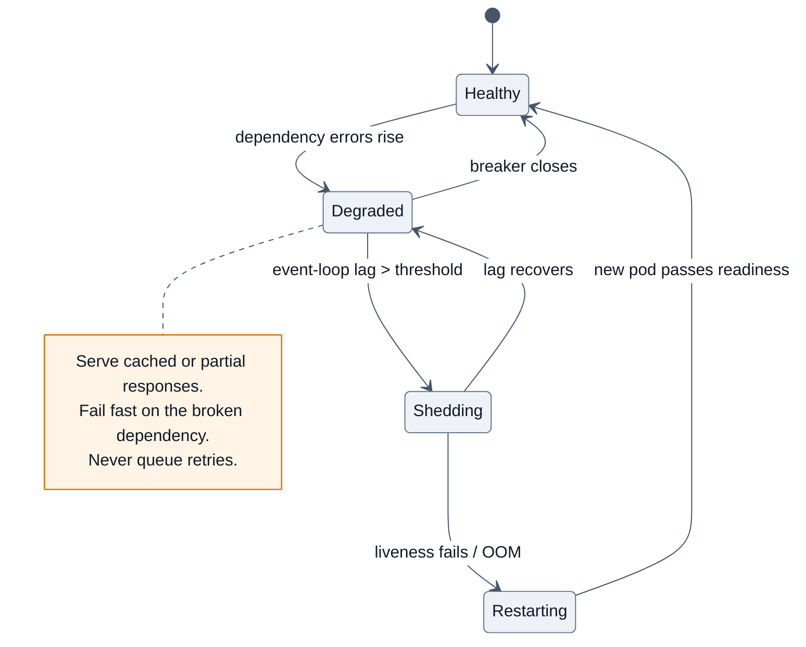

**The stack, in the order to say it:** per-call timeouts → bounded retries with full jitter (idempotent only, at one layer) → circuit breaker per dependency → bulkheads (separate pools) → load shedding on lag → graceful degradation (cached/partial responses, feature flags) → graceful shutdown → alert on SLO burn, not raw error counts.

---

# 4. 🎤 Interview Questions by Level

**Rating legend:** ★★★★★ Must know (asked in >50% of loops) · ★★★★☆ Very common · ★★★☆☆ Situational/differentiator

---

## 4.1 Beginner (0–2 yrs · SDE-1 · service companies)

### Q1. What is Express and why use it over plain `node:http`? ★★★★★

**Why interviewers ask it:** it separates "I followed a tutorial" from "I understand what the library does for me."

**Expected answer:** Express is a minimal, unopinionated HTTP framework for Node. It doesn't replace `node:http` — `app` *is* a `(req, res)` handler you can pass to `http.createServer`. It adds three things: declarative routing, a composable middleware pipeline, and helpers on `req`/`res`. It deliberately provides no ORM, validation, DI, or security defaults.

**Follow-ups:** *"Show me how you'd attach Socket.IO or HTTPS."* → `http.createServer(app)`. *"What does Express NOT give you?"* → security headers, validation, structure, error taxonomy — name them.

**Common mistakes:** calling Express "a full-stack framework"; not knowing it wraps `node:http`.

---

### Q2. What is middleware? ★★★★★

**Expected answer:** A function `(req, res, next)` that runs in an ordered stack on the way to a route handler. It can read/modify `req`/`res`, end the response, or pass control with `next()`. Types: application-level (`app.use`), router-level (`router.use`), route-level, built-in (`express.json`, `express.static`), third-party (`helmet`, `cors`, `morgan`), and **error-handling** (four arguments).

**Follow-ups:** *"What happens if a middleware never calls `next()` and never responds?"* → the request hangs until a timeout. *"Does middleware run in parallel?"* → no, strictly sequential. *"Give me the correct order for a production stack."* → §2.8.

---

### Q3. `app.use()` vs `app.get()`? ★★★★★
`use` = any method, **prefix** match, no route params, strips the mount path from `req.url`. `get` = that method only, **full path** match, populates `req.params`. See §1.7.

---

### Q4. How do you handle errors in Express? ★★★★★

**Expected answer:** Register a middleware with **exactly four parameters** `(err, req, res, next)` **last**. Anything that calls `next(err)` — or throws synchronously — routes there. `🆕 v5` also forwards rejected promises from async handlers automatically; **in v4 it does not**, which is why the `asyncHandler` wrapper exists.

**Follow-ups:** *"Why four arguments?"* → Express inspects `fn.length`; a 3-arg function is treated as normal middleware and silently never runs as an error handler. *"What if headers are already sent?"* → `if (res.headersSent) return next(err)`. *"Where does the 404 handler go?"* → after all routes, before the error handler.

---

### Q5. `req.params` vs `req.query` vs `req.body`? ★★★★★

| | Source | Example | Notes |
|---|---|---|---|
| `req.params` | route pattern | `/users/:id` → `req.params.id` | always strings |
| `req.query` | query string | `?page=2` → `req.query.page` | always strings/arrays; `v4` extended parser can produce nested objects |
| `req.body` | request body | JSON POST | **only populated if a body parser middleware ran** |

**Follow-up:** *"Why is `req.body` undefined?"* → no `express.json()`, or it's mounted after the route, or the `content-type` doesn't match.

---

### Q6. What does `next()` do? ★★★★★
Passes control to the next matching layer. `next()` continues normally; `next(err)` switches to **error mode** and skips to the next 4-arg handler; `next('route')` skips remaining handlers of the **current route** and moves to the next matching route.

---

### Q7. What is `express.Router()`? ★★★★☆
A mountable mini-app with its own middleware and routes, used to modularize large apps. Mount with `app.use('/api/v1/users', usersRouter)`. **Follow-up:** *"How does the child router read `:orgId` from the parent mount?"* → `Router({ mergeParams: true })`.

---

### Q8. How do you serve static files? ★★★☆☆
`app.use('/assets', express.static('public', { maxAge: '1y', immutable: true, dotfiles: 'ignore' }))`. **The senior addition:** in production this belongs on a CDN, not in Express.

---

### Q9. How do you parse a JSON body? ★★★★☆
`app.use(express.json({ limit: '100kb' }))`. Mention that `body-parser` has been bundled since Express 4.16, and that the `limit` is a security control, not a nicety.

---

### Q10. How do you enable CORS? ★★★★☆
The `cors` middleware with an **explicit origin allowlist** — never `origin: '*'` together with `credentials: true` (the browser rejects it, and it's the wrong instinct anyway). Emphasize: **CORS is browser-enforced; the request still reached your server, so it is not authorization.**

---

### Q11–20 Rapid-fire (service-company round)

| Q | Rating | One-line answer |
|---|---|---|
| REST verbs & status codes | ★★★★☆ | GET/POST/PUT/PATCH/DELETE; 200/201/204, 400/401/403/404/409/422/429, 500/502/503 |
| `res.send` vs `res.json` vs `res.end` | ★★★★☆ | Guesses content-type / always JSON + correct header / raw Node, no helpers |
| `res.sendStatus(404)` vs `res.status(404)` | ★★★☆☆ | Sends the status **and** body / sets status and returns `res` for chaining |
| How do you set a cookie? | ★★★★☆ | `res.cookie(name, val, { httpOnly: true, secure: true, sameSite: 'lax' })` |
| What is `app.set()`? | ★★★☆☆ | App settings: `view engine`, `trust proxy`, `env`, `query parser` |
| Template engines | ★★☆☆☆ | EJS/Pug/Handlebars via `app.set('view engine', …)` + `res.render()` |
| How do you read env config? | ★★★★☆ | `process.env`, validated at boot; `node --env-file` or `dotenv` in dev |
| Route parameters vs wildcards | ★★★☆☆ | `:id` named; `🆕 v5` wildcards must be named too (`/*splat`) |
| How do you structure a large Express app? | ★★★★☆ | Routers per resource + services + repositories; thin handlers |
| `nodemon` / restart on change | ★★☆☆☆ | `node --watch` is built in now — no dependency needed |

---

## 4.2 Intermediate (2–5 yrs · SDE-2)

### Q1. Walk me through the request lifecycle in Express. ★★★★★
The §2.1 answer: `node:http` parses the request → `app(req, res)` → an index walks the layer stack → each layer is matched on method + path → arity decides normal vs error handler → the layer responds, calls `next()`, calls `next(err)`, or hangs → `finalhandler` produces a 404/500 if nothing responded.

**Follow-ups:** *"Where exactly does a sync `throw` go?"* → Express wraps the call in `try/catch` and forwards it to `next(err)`. *"And an async throw in v4?"* → nowhere; it becomes an unhandled rejection and the request hangs.

---

### Q2. Your error middleware isn't firing. Debug it. ★★★★★
**The checklist to recite:**
1. Does it have **exactly four** parameters? (Three = normal middleware, silently skipped.)
2. Is it registered **after** all routes and routers?
3. Is the error actually forwarded — `next(err)`, a sync throw, or (v5) a rejected promise? In v4, an async throw is not.
4. Did an earlier layer already send the response? Then `res.headersSent` is true and you must delegate.
5. Is a nested Router swallowing it with its own error handler?
6. Is something `catch`ing and logging without re-throwing or calling `next(err)`?

---

### Q3. Explain the Express 4 async-error problem and three ways to fix it. ★★★★★
See §2.2. Fixes: `asyncHandler` wrapper (write it from memory), try/catch in every handler, `express-async-errors`, or **upgrade to Express 5**. Mention the v5 upgrade nuance: previously-swallowed rejections now surface as 500s.

---

### Q4. What's new/breaking in Express 5? ★★★★★
Native async error propagation · `path-to-regexp` 8 (named wildcards `/*splat`, optional `{:id}`, **no inline regex** because of ReDoS) · removed `res.sendfile`, `app.del`, `req.param()`, `res.json(status, obj)`, `res.redirect('back')` · default query parser `extended` → `simple` · Node 18+ · `req.signal`. Name the top upgrade error: `TypeError: Missing parameter name` from a bare `*`.

---

### Q5. Give me the correct middleware order for a production API, and justify each position. ★★★★★
§2.8. The justifications matter more than the list: security headers must apply to error responses too; request-id before logging; **rate limit before body parsing** so you don't parse an abuser's 10 MB; webhook raw-body routes before `express.json()`; health checks before the limiter and auth so probes aren't throttled.

---

### Q6. How do you validate input? ★★★★☆
Schema validation as middleware (zod/Joi/AJV) on `body`/`query`/`params`, replacing the raw value with the parsed one. Emphasize: **TypeScript types don't exist at runtime**, so a schema is your only real boundary. Also mention allowlisting fields to prevent **mass assignment** (`req.body` containing `role: "admin"`).

---

### Q7. How do you implement authentication and authorization? ★★★★★
`requireAuth` verifies the credential (session cookie lookup, or JWT with **pinned `algorithms`** and verified `iss`/`aud`/`exp`) and sets `req.user`. `requireRole`/`requirePermission` handles authorization. **The point interviewers are really checking:** authorization must be checked **per resource**, in the data layer (`WHERE tenant_id = ?`), not just per route — otherwise you have an IDOR.

---

### Q8. How do you secure an Express app? ★★★★★
§10 in full: helmet, explicit CORS allowlist, rate limiting (with a **shared store** if you have >1 instance), body-size limits, schema validation, parameterized queries, `HttpOnly; Secure; SameSite` cookies, CSRF for cookie-based sessions, `trust proxy` set to a specific hop, no stack traces in responses, `npm ci` + audit, secrets from a manager. Lead with: **"Express ships with no security defaults — everything here is something you have to add."**

---

### Q9. How do you test an Express app? ★★★★☆
Export the `app` separately from `server.listen()` so tests can import it without binding a port. Use `supertest` (or `fetch` against an ephemeral port) for route-level tests, real dependencies via Testcontainers for integration, `MockAgent`/`nock` for outbound HTTP, and unit tests on services (which take plain arguments, not `req`/`res`).

```js
// app.js  → export const app = express(); …
// server.js → import { app } from './app.js'; app.listen(PORT);
// app.test.js
const res = await request(app).post('/api/v1/orders').send({ sku: 'X' }).expect(201);
```

---

### Q10. How do you handle file uploads? ★★★★☆
`multer` (memory storage only for small files — it buffers into RAM) or `busboy` for streaming. Always: size limits, MIME/extension allowlist verified by **content sniffing** not the header, random generated filenames (never the client's), storage outside the web root, and temp-file cleanup on error. **The senior answer:** pre-signed URLs so the bytes never touch your Express process.

---

### Q11. How do you scale Express? ★★★★★
Stateless first (nothing in process memory), then horizontal pods behind a load balancer; `cluster`/PM2 only on a single VM. Then: caching, DB tuning, connection pooling. **The trap:** if the event loop is blocked, more pods don't help — find the blocking call.

---

### Q12. Rapid-fire intermediate

| Q | Rating | Core |
|---|---|---|
| `next('route')` — what does it do? | ★★★☆☆ | Skips the rest of the current route's handlers, tries the next matching route |
| `app.param()` | ★★★☆☆ | A hook that runs once when a named param appears in a matched route |
| `mergeParams` | ★★★★☆ | Lets a child router see the parent's params |
| Why is `req.ip` wrong behind a load balancer? | ★★★★☆ | Need `app.set('trust proxy', 1)` — but never `true` blindly (spoofable `X-Forwarded-For`) |
| Difference between `req.originalUrl`, `req.baseUrl`, `req.path`? | ★★★☆☆ | Full original / mount prefix / remainder after the mount |
| `res.locals` vs `app.locals` | ★★★☆☆ | Per-request vs app-lifetime data |
| Can you send two responses? | ★★★★☆ | No — `ERR_HTTP_HEADERS_SENT`; always `return res.json(...)` |
| How do you add a request timeout? | ★★★★☆ | `server.requestTimeout`, plus per-handler `AbortSignal.timeout` for downstream calls |
| Express vs Fastify | ★★★★☆ | Ecosystem/familiarity vs ~3–5× synthetic throughput + built-in schema validation; the gap shrinks with real DB calls |
| Why avoid `compression()` in production? | ★★★☆☆ | It burns event-loop CPU; the LB/CDN does it better |

---

## 4.3 Senior (5–8 yrs)

### Q1. A route intermittently hangs and the client times out. Diagnose. ★★★★★

**Expected answer (as a funnel):**
1. **Is a response ever sent?** Check the access log — a hang means no `finish` event. Add a middleware that logs requests still open after N seconds.
2. **Classic causes:** a middleware with a code path that neither responds nor calls `next()` (e.g. `if (user) next()` with no `else`); an async handler that rejects in **Express 4**; an `await` on a downstream with no timeout; a stream that's never ended; a `next()` called inside a callback that never fires.
3. **Instrument:** `res.on('finish' | 'close')` timing, per-middleware OTel spans (you'll see which layer the trace stops in), `--cpu-prof` if the loop is also blocked.
4. **Fix + prevent:** every branch either responds or calls `next()`; a global `server.requestTimeout`; `AbortSignal.timeout` on all downstream calls; a lint rule/test that asserts every handler terminates.

---

### Q2. p99 latency tripled; CPU is 40%. What do you check, in order? ★★★★★
Event-loop lag p99 (blocked loop looks exactly like this) → DB pool `waitingCount` → downstream error/latency in traces → GC pauses → payload sizes. **Only then** the framework. Say explicitly: *"Adding pods won't fix a blocked event loop; it just multiplies downstream load."*

---

### Q3. Would you still choose Express in 2026? Argue both sides. ★★★★★
**For:** enormous ecosystem and hiring pool, minimal learning curve, v5 fixed the biggest ergonomic wart, framework overhead is a rounding error next to I/O, and "the team ships reliably on it" is a real engineering argument.
**Against:** no built-in validation/serialization (Fastify's schema-compiled JSON is genuinely faster), no structure for large teams (Nest), no first-class TypeScript story, slower feature velocity, and its unopinionated-ness means every codebase reinvents the same middleware.
**Land the decision:** *"New greenfield high-throughput service with a fresh team → Fastify or Nest. Existing Express estate, or a service dominated by I/O → stay on Express, upgrade to v5, and spend the effort on the database and observability instead."*

---

### Q4. Design the error-handling and observability strategy for 30 Express services. ★★★★☆
A shared internal middleware package (request id + ALS context, pino-http, OTel, error taxonomy, the error handler, health/readiness, graceful shutdown) versioned with a deprecation policy → a uniform error envelope so clients can program against `code` → 4xx logged at `warn`, 5xx at `error` and alerting on SLO burn → traces with per-middleware spans → metrics labelled by route template with a cardinality budget → runbooks linked from alerts. **The staff point:** make the paved road easier than rolling your own.

---

### Q5. How do you migrate 200 endpoints from Express 4 to 5? ★★★★☆
Branch + upgrade + run tests (route-syntax errors crash at boot, so they surface immediately) → codemod the route patterns (`*` → `*splat`, `:id?` → `{:id}`, extract inline regex into validation) → audit anything reading nested `req.query` (parser default changed) → keep `asyncHandler` wrappers initially (they're harmless) and remove them later → **watch for newly-surfaced rejections** that were previously swallowed → canary one low-risk service, watch the 5xx rate, then roll out. Give a rollback plan.

---

### Q6. Your Express service leaks memory. Walk me through it. ★★★★★
Confirm growth **across GC cycles** (heapUsed, not just RSS) → three heap snapshots under identical load → diff → follow the **retainer chain** to a GC root → fix → verify flat. Express-specific suspects: middleware that pushes into a module-level array per request, `req`/`res` captured in a cache or a closure, an in-memory session/rate-limit store, listeners added per request on a long-lived emitter, `express-session` MemoryStore (explicitly not production-safe), and unbounded response buffering. Mention that Buffer growth shows in `external`, not `heapUsed`.

---

### Q7. How do you do zero-downtime deploys with Express on Kubernetes? ★★★★☆
`preStop` sleep so the LB deregisters first → SIGTERM → readiness returns 503 → `server.close()` → drain in-flight → `closeIdleConnections()` → close DB/Redis/queues → flush telemetry → exit, with a hard timeout **below** `terminationGracePeriodSeconds`. Plus: `keepAliveTimeout > LB idle timeout`, exec-form `CMD ["node","server.js"]` so SIGTERM actually arrives, liveness that doesn't check the database, and backward-compatible DB migrations (expand → migrate → contract).

---

### Q8. Rapid-fire senior

| Q | Rating | Core |
|---|---|---|
| Rate limiting across 20 pods | ★★★★☆ | In-process stores multiply the limit by N — use a Redis store or limit at the gateway |
| How do you version a public API? | ★★★★☆ | URL prefix + additive-only changes + deprecation headers + a sunset date |
| Where does tenant scoping live? | ★★★★☆ | The repository layer, enforced — not per handler |
| How do you sample logs at 50k RPS? | ★★★☆☆ | Sample 2xx access logs, keep 100% of 5xx, always keep traces for errors |
| BFF fan-out with partial failure | ★★★★☆ | `Promise.allSettled` + per-call timeouts + degraded fields, not a blanket 500 |
| Streaming a large export | ★★★★☆ | Cursor + `res.write` honouring backpressure + cleanup on `req.on('close')` |
| What breaks when you put Express behind a CDN? | ★★★☆☆ | Missing `Vary` on personalized responses → cross-user cache leak |

---

## 4.4 Staff / Principal (8+ yrs)

### Q1. Standardize the Node/Express platform for 40 teams. ★★★★★
A golden-path service template (logging, tracing, metrics, error taxonomy, health/readiness, graceful shutdown, config validation, Dockerfile, CI) → a versioned shared middleware package with a deprecation policy → one HTTP framework as the paved road with a written-justification escape hatch → an Express/Node upgrade train tied to security-support windows → production-readiness reviews → SLOs with error budgets. Measure **adoption**, not compliance, and make the paved road the path of least resistance.

### Q2. Argue for or against migrating the fleet from Express to Fastify. ★★★★☆
Frame as cost/benefit with evidence: profile a representative service to see what fraction of CPU is actually framework (usually small) → identify the services that are genuinely serialization-bound → pilot one, measure p99 and CPU-per-request, and count the engineering days → weigh against ecosystem/middleware rewrites, retraining 200 engineers, and the risk of subtle behaviour changes. **A staff answer includes kill criteria and an unwind plan**, and is willing to conclude "not worth it."

### Q3. Post-incident: a middleware ordering change caused an auth bypass. Run the review. ★★★★★
Blameless timeline; blast radius (which endpoints, which data, for how long — check access logs); contributing factors (auth mounted after a route module; no test asserting 401 on protected routes; ordering is implicit and invisible in review; no integration test matrix); immediate actions (revert, rotate anything exposed, notify per policy); **systemic fixes** (a contract test that every route under `/api` returns 401 unauthenticated; auth applied at the router level not per-handler; an architecture test that fails the build if a route module is mounted before the auth layer; making the paved-road template do it by default).

### Q4. How do you evolve a public API that 10k customers depend on? ★★★★☆
SemVer-ish versioning in the URL, additive-only within a version, deprecation headers with a documented sunset date and a migration guide, usage telemetry per endpoint/field so you know who'd break, a compatibility layer during transitions, contract tests against recorded client traffic, and a policy that you can never silently change a field's meaning. **Cite Stripe's model** (dated API versions pinned per account) as the gold standard.

### Q5. What do you standardize vs leave to teams? ★★★☆☆
Standardize: framework choice, error envelope, auth middleware, observability SDK, health/shutdown behaviour, base image, CI/CD, security policy, Node version. Leave free: internal folder layout, test style, local caching. Justify with **cost of inconsistency vs cost of coordination**.

---

## 4.5 FAANG-specific patterns

| Company | What their Express-touching rounds look like | Prepare |
|---|---|---|
| **Amazon** | DSA + system design + **Leadership Principles in every round**. Express appears in the backend domain round: API design, error handling, "tell me about a production issue you dove into." | STAR stories with metrics; REST/API design; DynamoDB access patterns |
| **Netflix** | Senior-only, pragmatic. Express/Node in the BFF tier — expect fan-out, timeouts, fallbacks, and observability questions grounded in real problems. | Resilience patterns; degraded responses; tracing |
| **Meta / Google** | Mostly DSA + design; Express only if you claim it. Depth on HTTP semantics and API design rather than framework trivia. | LeetCode; HTTP/caching fundamentals |
| **Microsoft** | Balanced DSA + design + practical debugging; TypeScript-friendly. | TS + Express typing, middleware composition |
| **Uber / DoorDash / Airbnb** | Express/Node gateways: middleware ordering, per-request deadlines, circuit breakers, plus a design round. | Production Express + service design |
| **Stripe / Coinbase / Razorpay** | The most Express-specific of the lot: **webhook raw-body signature verification**, idempotency keys, error taxonomy, a bug-fix round in a real repo. | §6 M5 and M9 cold |
| **Cloudflare / Vercel** | Express vs edge runtimes: why Express doesn't run on an isolate, what a Node-compat shim gives you, streaming responses. | Web-standard APIs, framework portability |

**Universal advice:** state assumptions, quantify (RPS, payload size, latency budget), narrate the middleware pipeline when relevant, and close design answers with *"here's the metric that tells me it's working."*

---

## 4.6 Startups

Expect: build a working endpoint end to end in 45–60 minutes (route → validation → auth → DB → error handling → one test), debug a broken repo, "add rate limiting to this," "our API is slow — what do you check?"

**What impresses:** pragmatism, correct middleware ordering by instinct, real error handling instead of `res.status(500).send('error')`, and knowing when *not* to add a dependency. **What sinks candidates:** scaffolding hexagonal architecture, DI containers, and CQRS onto a five-endpoint CRUD app.

---

## 4.7 Product companies (Walmart, Flipkart, Swiggy, PhonePe, Razorpay, Atlassian, Shopify)

**This tier weights Express the most.** The distinctive round is **machine coding / LLD**: 60–120 minutes to build something real.

| Common prompts | What's graded |
|---|---|
| REST API with JWT auth, pagination, filtering, validation | Layering, correct status codes, cursor pagination, error middleware, no secrets in code |
| Rate-limiting middleware | Algorithm correctness, per-key limits, `Retry-After` + `X-RateLimit-*`, the "now make it work across pods" follow-up |
| File upload + processing | Streaming, size/type limits, safe filenames, cleanup |
| URL shortener / paste bin | ID generation, collision handling, caching, redirect status choice |
| Webhook receiver | **Raw body** signature verification, replay window, idempotency, fast 2xx |
| Role-based access control | Middleware composition, resource-level checks, deny-by-default |
| Request logging + correlation | ALS context, structured logs, redaction |

Plus **Express internals** (pipeline, `next`, arity, ordering), **Node internals** (event loop, streams), **DB** (indexes, N+1, transactions), and a short LLD discussion.

> [!TIP]
> **Machine coding is decided in the last 10 minutes.** A working happy path + validation + a real error handler + one meaningful test + a short README of trade-offs beats a half-built "perfect" architecture. Write the README even if you skip tests — it's where you bank the points for judgment.

---

## 4.8 Service companies (TCS, Infosys, Wipro, Cognizant, Accenture, Capgemini, HCL, LTIMindtree)

Format: rapid-fire theory, 20–40 questions in 30 minutes, often after an MCQ screen. Breadth and confidence win.

**The list they actually use:** what is Express · why use it · what is middleware · types of middleware · `app.use` vs `app.get` · what is `next()` · error-handling middleware and its 4 arguments · `req.params` vs `req.query` vs `req.body` · how to parse JSON · `express.Router()` · how to serve static files · REST verbs and status codes · how to set headers/cookies · CORS · what is `res.render` · template engines · how to connect MongoDB/Mongoose or MySQL · JWT authentication flow · `process.env` and dotenv · what is `nodemon` · how to handle 404 · `res.send` vs `res.json` · what is `app.listen` · what is a route parameter · how to redirect · what is `body-parser` (and that it's bundled now) · MVC structure in Express · what is CRUD.

Then 2–3 tiny coding tasks: write a GET and a POST endpoint, write a logging middleware, write an auth middleware that checks a header, connect to a database and return a list, handle a 404.

> [!NOTE]
> **Service-company strategy:** two sentences plus one concrete example from a project you built, then stop. Say "in my project I used X for Y" whenever it's true — practical exposure is weighted heavily and long answers just invite follow-ups.

---

# 5. 📊 Frequently Asked Questions (Ranked by Frequency)

*Synthesized and deduplicated across Simplilearn/Hirist/GUVI/FinalRound/Devinterview question banks, Glassdoor and AmbitionBox reports, Blind, r/node and r/developersIndia threads, the official Express docs and migration guide, and 2026 interview roundups. "Frequency" = share of Express-touching loops where the question (or a direct variant) appears.*

## 🔥 Very High (expect in almost every Express interview)

| # | Question | Rating | The one-line answer that satisfies |
|---|---|---|---|
| 1 | What is middleware? Types? | ★★★★★ | `(req,res,next)` in an ordered stack; app/router/route/built-in/third-party/error |
| 2 | How does error handling work? Why 4 args? | ★★★★★ | Express identifies error handlers by `fn.length === 4`; mount last |
| 3 | `app.use` vs `app.get` | ★★★★★ | Any method + prefix match vs one method + full path with params |
| 4 | What does `next()` do? | ★★★★★ | Advance the stack; `next(err)` → error mode; `next('route')` → next matching route |
| 5 | `req.params` vs `query` vs `body` | ★★★★★ | Route pattern / query string / parsed body (needs a parser) |
| 6 | The request lifecycle end to end | ★★★★★ | http → app → layer stack → match → handler → response or finalhandler |
| 7 | Async errors in Express 4 (and the fix) | ★★★★★ | Rejections aren't caught → hang; wrap with `asyncHandler`, or use v5 |
| 8 | What's new/breaking in Express 5? | ★★★★★ | Async error propagation, path-to-regexp 8, removed legacy APIs, Node 18+ |
| 9 | Middleware ordering for a production app | ★★★★★ | helmet → cors → logger → rate limit → parsers → routes → 404 → error |
| 10 | `express.Router()` and modular structure | ★★★★★ | Mountable mini-app; `mergeParams` for parent params |
| 11 | How do you secure an Express app? | ★★★★★ | Express has **no** defaults: helmet + cors allowlist + rate limit + validation + limits |
| 12 | How do you parse JSON / handle body parsing? | ★★★★★ | `express.json({ limit })`; bundled since 4.16 |
| 13 | REST design: verbs, status codes, idempotency | ★★★★★ | PUT/DELETE idempotent; 201 + Location; 409 vs 422 |
| 14 | Authentication with JWT or sessions | ★★★★★ | Verify with pinned algorithms; `HttpOnly` cookie; authorize per resource |
| 15 | How do you handle 404s? | ★★★★☆ | A catch-all `app.use` after routes, before the error handler |

## 🔴 High

| # | Question | Rating | Core |
|---|---|---|---|
| 16 | Express vs Fastify vs Nest vs Koa | ★★★★☆ | Ecosystem vs schema+speed vs structure vs minimal async middleware |
| 17 | How do you structure a large Express app? | ★★★★☆ | Routers + services + repositories; thin handlers |
| 18 | Rate limiting | ★★★★☆ | `express-rate-limit`; **needs a Redis store past one instance** |
| 19 | CORS: what and how | ★★★★☆ | Browser-enforced; explicit origin allowlist; not authorization |
| 20 | Validation (zod/Joi/AJV) as middleware | ★★★★☆ | Schema at the boundary; replace `req.body` with parsed data |
| 21 | How do you test Express routes? | ★★★★☆ | Export `app` separately from `listen`; supertest; Testcontainers |
| 22 | File uploads | ★★★★☆ | multer/busboy, size + type limits, or pre-signed URLs |
| 23 | `res.send` vs `res.json` vs `res.end` vs `sendStatus` | ★★★★☆ | Type-guessing / JSON / raw / status + body |
| 24 | Serving static files & caching | ★★★★☆ | `express.static` with `maxAge`+`immutable`; CDN in production |
| 25 | `trust proxy` — why and the danger | ★★★★☆ | Correct `req.ip`/`protocol`; `true` lets clients spoof `X-Forwarded-For` |
| 26 | Graceful shutdown | ★★★★☆ | readiness 503 → `server.close()` → drain → close deps → exit |
| 27 | Logging & correlation ids | ★★★★☆ | pino-http + AsyncLocalStorage request id |
| 28 | Env config & secrets | ★★★★☆ | Validate at boot; secrets from a manager, never the repo |
| 29 | Connecting to a database | ★★★★☆ | One pool created at boot, closed on shutdown — never per request |
| 30 | Can you send two responses? | ★★★★☆ | No — `ERR_HTTP_HEADERS_SENT`; `return res.json(...)` |
| 31 | `next('route')` and `app.param()` | ★★★☆☆ | Skip current route's handlers / hook on a named param |
| 32 | Pagination design | ★★★★☆ | Cursor over offset; cap the page size |
| 33 | Error taxonomy & response envelope | ★★★★☆ | Typed `AppError` with `status`/`code`/`expose`; stable client contract |
| 34 | Why is `req.body` undefined? | ★★★★☆ | No parser, wrong order, or mismatched `content-type` |
| 35 | Compression and when not to use it | ★★★☆☆ | Do it at the LB/CDN — it competes with your handlers for CPU |

## 🟡 Medium

| # | Question | Rating | Core |
|---|---|---|---|
| 36 | Webhook signature verification | ★★★☆☆ | **Raw body** required — `express.json()` breaks it |
| 37 | Idempotency keys | ★★★☆☆ | Store key→response with a TTL; 409 while in progress |
| 38 | CSRF protection | ★★★☆☆ | Needed for cookie-based auth; `SameSite` + a token; not needed for pure Bearer APIs |
| 39 | Sessions vs JWT | ★★★☆☆ | Revocation vs statelessness; MemoryStore is not production-safe |
| 40 | Streaming responses (`res.write` + backpressure) | ★★★☆☆ | Honour the `write()` return value; clean up on `req.on('close')` |
| 41 | `express-session` and stores | ★★★☆☆ | Redis store; secure cookie flags; rolling/absolute expiry |
| 42 | ETag / 304 conditional requests | ★★★☆☆ | Cheapest read-path win; needs correct `Vary` |
| 43 | OpenTelemetry instrumentation for Express | ★★★☆☆ | Per-middleware spans reveal the slow layer |
| 44 | Metrics with route templates | ★★★☆☆ | `req.route?.path`, never `req.url` (cardinality) |
| 45 | Prototype pollution via `qs`/deep merge | ★★★☆☆ | `extended: false`, schema validation, reject `__proto__` |
| 46 | SSRF from a user-supplied URL | ★★★☆☆ | Host allowlist + resolved-IP check + no redirects |
| 47 | Path traversal in `res.sendFile`/static | ★★★☆☆ | Always set `root`; `resolve` + prefix check |
| 48 | Helmet: which headers and why | ★★★☆☆ | CSP, HSTS, `X-Frame-Options`, `nosniff`, referrer policy |
| 49 | Clustering / PM2 vs pods | ★★★☆☆ | One process per pod in an orchestrator |
| 50 | TypeScript with Express | ★★★☆☆ | Typed handlers, module augmentation for `req.user`, `RequestHandler` generics |
| 51 | Dependency injection / testability | ★★★☆☆ | Services take plain args; inject via a factory, not module singletons |
| 52 | API versioning | ★★★☆☆ | URL prefix + additive-only + deprecation headers |
| 53 | Health vs readiness endpoints | ★★★☆☆ | Liveness must not depend on the database |
| 54 | Multer memory vs disk storage | ★★★☆☆ | Memory buffers the whole file into RAM |
| 55 | Express in serverless (Lambda) | ★★★☆☆ | `serverless-http` adapter; cold starts; no long-lived connections |

## ⚪ Rare (but decisive — these mark the top decile)

| # | Question | Rating |
|---|---|---|
| 56 | Implement a minimal Express (stack + `next` + arity dispatch) | ★★★☆☆ |
| 57 | How does `path-to-regexp` compile a route, and why was inline regex removed? | ★★★☆☆ |
| 58 | What exactly does `finalhandler` do? | ★★★☆☆ |
| 59 | Why does `app.use` rewrite `req.url` inside the mounted handler? | ★★★☆☆ |
| 60 | Per-middleware latency attribution in production | ★★★☆☆ |
| 61 | Express + HTTP/2 (and why `http2` compat mode is limited) | ★★★☆☆ |
| 62 | Running Express on an edge/isolate runtime — what breaks | ★★★☆☆ |
| 63 | `res.locals` lifecycle and template-engine caching | ★★★☆☆ |
| 64 | Router `caseSensitive` / `strict` and trailing-slash SEO issues | ★★★☆☆ |
| 65 | Sub-app mounting (`app.use('/x', otherApp)`) vs Router | ★★★☆☆ |
| 66 | How would you enforce middleware ordering in CI? | ★★★☆☆ |
| 67 | Express's `finalhandler` vs your error middleware for `headersSent` | ★★★☆☆ |
| 68 | Memory characteristics of `express-session` MemoryStore | ★★★☆☆ |
| 69 | `Vary` header correctness behind a shared cache | ★★★☆☆ |
| 70 | Express 4 EOL risk and how you'd plan the fleet migration | ★★★☆☆ |

---

# 6. 💻 Coding Questions

> [!NOTE]
> **Three rounds exist. Know which one you're in.**
> 1. **DSA round** — Express is irrelevant; it's LeetCode.
> 2. **Middleware/utility round** (15–30 min) — write `asyncHandler`, a rate limiter, a validation middleware, an auth middleware, a request-timing middleware. **Most common at product companies.**
> 3. **Machine coding / take-home** (60–120 min) — build a real API with auth, validation, persistence, and tests.
>
> This section is weighted toward rounds 2 and 3.

## 6.1 🟢 Easy

### E1. `asyncHandler` — wrap async routes for Express 4 ★★★★★

```js
const asyncHandler = fn => (req, res, next) =>
  Promise.resolve(fn(req, res, next)).catch(next);

app.get('/users/:id', asyncHandler(async (req, res) => {
  const user = await db.findUser(req.params.id);
  if (!user) throw new NotFound('user');
  res.json(user);
}));
```
**Graded details:** `Promise.resolve` (so it also works with non-async functions), `.catch(next)` rather than `.catch(err => next(err))` — both fine, but know why it works, and **that this is unnecessary in Express 5**.
**Follow-ups:** *"Auto-wrap every route without touching each one."*
```js
// Monkey-patch the router methods (what `express-async-errors` does)
for (const m of ['get','post','put','patch','delete']) {
  const orig = express.Router[m];
  // …wrap each handler with asyncHandler before delegating
}
```

---

### E2. A request-timing / logging middleware ★★★★★

```js
export function requestLogger(logger) {
  return (req, res, next) => {
    const start = process.hrtime.bigint();          // ✅ monotonic, not Date.now()
    req.id = req.get('x-request-id') ?? randomUUID();
    res.set('x-request-id', req.id);

    res.on('finish', () => {                        // ✅ fires when the response is flushed
      const ms = Number(process.hrtime.bigint() - start) / 1e6;
      logger.info({
        id: req.id, method: req.method,
        route: req.route?.path ?? req.baseUrl ?? 'unmatched',   // ⭐ template, not raw URL
        status: res.statusCode, ms: +ms.toFixed(2)
      }, 'request');
    });
    res.on('close', () => { if (!res.writableEnded) logger.warn({ id: req.id }, 'client aborted'); });
    next();
  };
}
```
**Graded:** `hrtime` over `Date.now()`, listening on `finish` (**not** wrapping `res.end`), handling client aborts via `close`, route template for cardinality, and a correlation id.

---

### E3. Validation middleware ★★★★★

```js
import { z } from 'zod';

export const validate = (schemas) => (req, res, next) => {
  for (const key of ['body', 'query', 'params']) {
    if (!schemas[key]) continue;
    const result = schemas[key].safeParse(req[key]);
    if (!result.success) {
      return next(new AppError('Validation failed', {
        status: 422, code: 'VALIDATION', expose: true, details: result.error.flatten()
      }));
    }
    req[key] = result.data;                         // ✅ coerced + allowlisted
  }
  next();
};

const createUser = z.object({ email: z.string().email(), name: z.string().min(1).max(100) })
                    .strict();                       // 🛡️ reject unknown keys → no mass assignment
app.post('/users', validate({ body: createUser }), handler);
```
**Graded:** validating all three sources, replacing the raw value with parsed data, `.strict()`/allowlisting against mass assignment, and forwarding a 422 through `next()` rather than responding inline.

---

### E4. Auth middleware (JWT) ★★★★★

```js
export const requireAuth = (req, res, next) => {
  const bearer = req.get('authorization')?.match(/^Bearer (.+)$/i)?.[1];
  const token = req.cookies?.sid ?? bearer;
  if (!token) return next(new AppError('Unauthenticated', { status: 401, expose: true }));
  try {
    req.user = jwt.verify(token, PUBLIC_KEY, {
      algorithms: ['RS256'],                        // 🛡️ pin — else alg confusion / "none"
      issuer: ISS, audience: AUD, clockTolerance: 5
    });
    next();
  } catch (err) {
    next(new AppError('Invalid or expired token', { status: 401, expose: true, cause: err }));
  }
};

export const requireRole = (...roles) => (req, res, next) =>
  roles.includes(req.user?.role) ? next()
    : next(new AppError('Forbidden', { status: 403, expose: true }));
```
**The follow-up that matters:** *"Is `requireRole('admin')` enough?"* → **No.** That's endpoint-level authorization. You still need **resource-level** checks (`WHERE tenant_id = req.user.tenantId`) or you have an IDOR. Say this unprompted.

---

### E5. 404 + error handler pair ★★★★★

```js
// after all routes
app.use((req, res, next) => next(new NotFound(`${req.method} ${req.originalUrl}`)));

app.use((err, req, res, next) => {                  // ⭐ exactly 4 params, mounted LAST
  if (res.headersSent) return next(err);
  const status = err.status ?? 500;
  (status >= 500 ? req.log.error : req.log.warn)({ err, status }, 'request failed');
  res.status(status).json({
    error: {
      code: err.code ?? 'INTERNAL',
      message: err.expose ? err.message : 'Internal Server Error',
      ...(err.details && { details: err.details }),
      requestId: req.id
    }
  });
});
```

---

### E6. Cursor pagination ★★★★☆

```js
app.get('/orders', asyncHandler(async (req, res) => {
  const limit = Math.min(Number(req.query.limit) || 20, 100);        // 🛡️ cap it
  const cursor = req.query.after ? decodeCursor(req.query.after) : null;

  const rows = await db.orders.find({
    ...(cursor && { $or: [{ createdAt: { $lt: cursor.createdAt } },
                          { createdAt: cursor.createdAt, _id: { $lt: cursor.id } }] })  // tie-break!
  }).sort({ createdAt: -1, _id: -1 }).limit(limit + 1);              // +1 to detect "hasMore"

  const hasMore = rows.length > limit;
  const page = hasMore ? rows.slice(0, limit) : rows;
  res.json({
    data: page,
    nextCursor: hasMore ? encodeCursor(page.at(-1)) : null
  });
}));
```
**Why cursor over offset:** offset re-scans and **skips or duplicates rows** when items are inserted between pages, and gets slower as the offset grows. Graded: the tie-break field (two rows with the same timestamp), the `limit + 1` trick, and capping `limit`.

---

### E7. A CORS configuration you'd actually ship ★★★★☆

```js
const allowlist = new Set(['https://app.example.com', 'https://admin.example.com']);
app.use(cors({
  origin: (origin, cb) => {
    if (!origin) return cb(null, true);             // same-origin / curl / server-to-server
    cb(null, allowlist.has(origin));                // ✅ never reflect an arbitrary origin
  },
  credentials: true,                                 // ⚠️ illegal with origin '*'
  methods: ['GET','POST','PUT','PATCH','DELETE'],
  allowedHeaders: ['content-type','authorization','idempotency-key'],
  exposedHeaders: ['x-request-id','x-ratelimit-remaining'],
  maxAge: 86_400                                     // cache the preflight
}));
```
**The trap:** `origin: true` reflects whatever the caller sends — with `credentials: true` that's a full CSRF-style hole. Also mention preflight caching to cut `OPTIONS` traffic.

---

### E8. Graceful shutdown ★★★★★
See §3.10 — memorize the order: **readiness 503 → `server.close()` → drain → `closeIdleConnections()` → close DB/Redis/queues → flush telemetry → exit, with a hard timeout**. Asked as a coding question more often than candidates expect.

---

## 6.2 🟡 Medium

### M1. Rate-limiting middleware (and the "now scale it" follow-up) ★★★★★

```js
class TokenBucket {
  constructor({ capacity, refillPerSec }) {
    this.capacity = capacity; this.tokens = capacity;
    this.rate = refillPerSec; this.last = Date.now();
  }
  #refill() {
    const now = Date.now();
    this.tokens = Math.min(this.capacity, this.tokens + ((now - this.last) / 1000) * this.rate);
    this.last = now;
  }
  take(n = 1) { this.#refill(); if (this.tokens >= n) { this.tokens -= n; return true; } return false; }
  msUntil(n = 1) { this.#refill(); return this.tokens >= n ? 0 : ((n - this.tokens) / this.rate) * 1000; }
}

export function rateLimit({ capacity = 60, refillPerSec = 1, keyFn = req => req.user?.id ?? req.ip } = {}) {
  const buckets = new Map();
  setInterval(() => {                                        // 🧹 prevent unbounded Map growth
    const cutoff = Date.now() - 10 * 60_000;
    for (const [k, b] of buckets) if (b.last < cutoff) buckets.delete(k);
  }, 60_000).unref();

  return (req, res, next) => {
    const key = keyFn(req);
    let b = buckets.get(key);
    if (!b) buckets.set(key, b = new TokenBucket({ capacity, refillPerSec }));
    res.set('X-RateLimit-Limit', capacity);
    if (b.take()) { res.set('X-RateLimit-Remaining', Math.floor(b.tokens)); return next(); }
    res.set('Retry-After', Math.ceil(b.msUntil() / 1000));
    next(new AppError('Too Many Requests', { status: 429, code: 'RATE_LIMITED', expose: true }));
  };
}
```

**The follow-up is always: *"Now make it correct across 20 pods."*** In-process counters mean the effective limit is **N × your intended limit** — a client hitting pod A 60 times and pod B 60 times has made 120 requests while each pod thinks it saw 60. Use a Redis store with an **atomic** script (`INCR` then `EXPIRE` as two commands is racy):

```lua
local c = redis.call('INCR', KEYS[1])
if c == 1 then redis.call('PEXPIRE', KEYS[1], ARGV[1]) end
return c
```

**Also state:** the `keyFn` must handle `trust proxy` correctly or `req.ip` is the load balancer's; exempt `/healthz`; decide what happens when Redis is down (fail open = abuse risk, fail closed = outage — **name the trade-off**).

| Algorithm | Bursts | Memory | Boundary problem |
|---|---|---|---|
| Fixed window | ❌ 2× at the boundary | O(1) | yes |
| Sliding window log | ✅ exact | O(requests) | no |
| Sliding window counter | ✅ approximate | O(1) | mostly fixed |
| **Token bucket** | ✅ controlled bursts | O(1) | no |

---

### M2. Idempotency middleware ★★★★★

```js
export function idempotency(store, { ttlMs = 24 * 3600_000 } = {}) {
  return asyncHandler(async (req, res, next) => {
    if (!['POST', 'PATCH'].includes(req.method)) return next();
    const key = req.get('idempotency-key');
    if (!key) return next(new AppError('Idempotency-Key required', { status: 400, expose: true }));

    const fingerprint = sha256(req.method + req.originalUrl + JSON.stringify(req.body));
    const existing = await store.get(key);

    if (existing) {
      if (existing.fingerprint !== fingerprint)
        return next(new AppError('Key reused with a different payload', { status: 422, expose: true }));
      if (existing.state === 'pending')
        return next(new AppError('Request in progress', { status: 409, expose: true }));
      return res.status(existing.status).set(existing.headers).json(existing.body);   // ✅ replay
    }

    const claimed = await store.setIfAbsent(key, { fingerprint, state: 'pending' }, ttlMs);  // atomic
    if (!claimed) return next(new AppError('Request in progress', { status: 409, expose: true }));

    const json = res.json.bind(res);
    res.json = (body) => {
      if (res.statusCode < 500) {                    // don't cache transient failures
        store.set(key, { fingerprint, state: 'done', status: res.statusCode, headers: {}, body }, ttlMs)
             .catch(err => req.log.error({ err }, 'idempotency store write failed'));
      } else {
        store.del(key).catch(() => {});
      }
      return json(body);
    };
    next();
  });
}
```
**The senior nuance:** the store write and the business write are **not in one transaction**, so the handler must also be idempotent at the database level (a unique constraint on the key). Say it.

---

### M3. In-memory cache middleware with ETag + single-flight ★★★★☆

```js
export function cacheGet({ ttlMs = 30_000, max = 500 } = {}) {
  const store = new Map();                            // key → { body, etag, expires }
  const inflight = new Map();

  return asyncHandler(async (req, res, next) => {
    if (req.method !== 'GET') return next();
    const key = req.originalUrl + '|' + (req.user?.tenantId ?? 'anon');   // ⚠️ scope by tenant!

    const hit = store.get(key);
    if (hit && hit.expires > Date.now()) {
      if (req.get('if-none-match') === hit.etag) return res.status(304).end();
      return res.set('etag', hit.etag).set('x-cache', 'HIT').json(hit.body);
    }

    // single-flight: N concurrent misses → 1 downstream call
    if (inflight.has(key)) {
      const body = await inflight.get(key);
      return res.set('x-cache', 'COALESCED').json(body);
    }

    const json = res.json.bind(res);
    let resolve;
    inflight.set(key, new Promise(r => (resolve = r)));
    res.json = (body) => {
      if (res.statusCode === 200) {
        if (store.size >= max) store.delete(store.keys().next().value);   // LRU-ish eviction
        const etag = `"${sha1(JSON.stringify(body))}"`;
        const jitter = 0.9 + Math.random() * 0.2;                          // ⭐ TTL jitter
        store.set(key, { body, etag, expires: Date.now() + ttlMs * jitter });
        res.set('etag', etag);
      }
      resolve?.(body); inflight.delete(key);
      return json(body);
    };
    res.on('close', () => { resolve?.(null); inflight.delete(key); });     // don't leak on abort
    next();
  });
}
```
**Graded:** cache key includes the tenant/user (otherwise it's a **data leak**), bounded size, TTL jitter (so a thousand keys don't expire in the same second), single-flight, ETag/304, and cleanup on client abort.

---

### M4. Streaming a large export with backpressure ★★★★★

```js
app.get('/exports/orders.ndjson', requireAuth, asyncHandler(async (req, res) => {
  res.writeHead(200, {
    'content-type': 'application/x-ndjson',
    'content-disposition': 'attachment; filename="orders.ndjson"',
    'cache-control': 'no-store',
    'x-accel-buffering': 'no'                                   // don't let nginx buffer it
  });

  const cursor = db.orders.find({ tenantId: req.user.tenantId }).stream();
  req.on('close', () => cursor.destroy());                      // ✅ client gone → stop the query

  try {
    for await (const doc of cursor) {
      if (!res.write(JSON.stringify(doc) + '\n')) {
        await once(res, 'drain');                               // ⭐ BACKPRESSURE — the whole point
      }
    }
    res.end();
  } catch (err) {
    req.log.error({ err }, 'export failed mid-stream');
    res.destroy(err);        // ⚠️ headers already sent — you cannot send a 500 body
  }
}));
```
**The nuance interviewers probe:** once you've written the first byte you can't change the status code. Options: send a trailing error record, use HTTP trailers, or validate everything *before* writing the head.

---

### M5. Webhook receiver with raw-body signature verification ★★★★★

```js
import { createHmac, timingSafeEqual } from 'node:crypto';

// ⚠️ MOUNT BEFORE express.json() — the raw bytes are what was signed
app.post('/webhooks/provider',
  express.raw({ type: 'application/json', limit: '1mb' }),
  asyncHandler(async (req, res) => {
    const sig = req.get('x-signature') ?? '';
    const ts = Number(req.get('x-timestamp') ?? 0);

    if (!Number.isFinite(ts) || Math.abs(Date.now() / 1000 - ts) > 300)
      return res.sendStatus(400);                               // 🛡️ 5-minute replay window

    const expected = createHmac('sha256', SECRET).update(`${ts}.`).update(req.body).digest();
    const given = Buffer.from(sig, 'hex');
    if (given.length !== expected.length || !timingSafeEqual(given, expected))
      return res.sendStatus(401);                               // 🛡️ constant-time compare

    const event = JSON.parse(req.body.toString('utf8'));
    await queue.add('webhook', event, { jobId: event.id });      // idempotent by event id
    res.sendStatus(202);                                         // ✅ ACK FAST, process async
  }));
```
**Every graded detail is in there:** raw body, mount order, timestamp window, `timingSafeEqual`, length check before comparing, idempotency by event id, and a fast 2xx (providers retry aggressively on slow responses, which is how one slow handler becomes a self-inflicted DDoS).

---

### M6. RBAC / permission middleware ★★★★☆

```js
const PERMISSIONS = {
  admin:  new Set(['order:read', 'order:write', 'user:manage']),
  staff:  new Set(['order:read', 'order:write']),
  viewer: new Set(['order:read'])
};

export const can = (...required) => (req, res, next) => {
  const granted = PERMISSIONS[req.user?.role] ?? new Set();     // deny by default
  const missing = required.filter(p => !granted.has(p));
  if (missing.length) {
    req.log.warn({ userId: req.user?.id, missing }, 'authz denied');   // ✅ log denials
    return next(new AppError('Forbidden', { status: 403, code: 'FORBIDDEN', expose: true }));
  }
  next();
};

// Resource-level ownership — the part people forget
export const ownsOrder = asyncHandler(async (req, res, next) => {
  const order = await repo.getOrder(req.params.id, req.user.tenantId);   // scoped query
  if (!order) return next(new NotFound('order'));               // 404 not 403 — don't leak existence
  req.order = order;
  next();
});

app.patch('/orders/:id', requireAuth, can('order:write'), ownsOrder, updateOrder);
```

---

### M7. Circuit breaker for a downstream call ★★★★☆

```js
function breaker(fn, { threshold = 5, cooldownMs = 10_000, successesToClose = 2 } = {}) {
  let state = 'closed', failures = 0, successes = 0, openedAt = 0;
  const wrapped = async (...args) => {
    if (state === 'open') {
      if (Date.now() - openedAt < cooldownMs) throw new AppError('Upstream unavailable', { status: 503, expose: true });
      state = 'half-open'; successes = 0;
    }
    try {
      const out = await fn(...args);
      if (state === 'half-open' && ++successes >= successesToClose) { state = 'closed'; failures = 0; }
      else if (state === 'closed') failures = 0;
      return out;
    } catch (err) {
      if (++failures >= threshold || state === 'half-open') {
        state = 'open';
        openedAt = Date.now() + Math.random() * 1000;            // jittered cooldown
        metrics.increment('breaker.open', { dep: fn.name });     // 📊 make it visible
      }
      throw err;
    }
  };
  wrapped.state = () => state;
  return wrapped;
}
```
**Discuss:** a failure *rate* beats a raw count (5 failures out of 5 ≠ 5 out of 5000), a rolling window, one breaker **per dependency** (bulkheads), and always emitting state transitions as metrics so an open circuit shows on a dashboard rather than only in logs.

---

### M8. Testing an Express app properly ★★★★☆

```js
// app.js — export the app; DO NOT call listen() here
export function createApp({ db, cache, clock = Date }) {          // ⭐ inject deps → testable
  const app = express();
  app.use(express.json({ limit: '100kb' }));
  app.use('/api/v1/orders', ordersRouter({ db, cache, clock }));
  app.use(notFound); app.use(errorHandler);
  return app;
}
// server.js
createApp({ db, cache }).listen(PORT);

// orders.test.js
const app = createApp({ db: testDb, cache: new FakeCache() });

it('rejects unauthenticated requests', async () => {
  await request(app).get('/api/v1/orders').expect(401);
});
it('scopes results to the caller tenant', async () => {
  const res = await request(app).get('/api/v1/orders').set('authorization', `Bearer ${tokenTenantA}`).expect(200);
  expect(res.body.data.every(o => o.tenantId === 'A')).toBe(true);   // ⭐ the IDOR regression test
});
it('does not N+1', async () => {
  const before = testDb.queryCount;
  await request(app).get('/api/v1/orders?limit=50').set(auth).expect(200);
  expect(testDb.queryCount - before).toBeLessThan(4);                // ⭐ query-count assertion
});
```
**Graded:** separating `app` from `listen`, dependency injection via a factory, a contract test that every protected route 401s, tenant-scoping tests, and query-count assertions to catch N+1 regressions.

---

### M9. Request-context middleware with `AsyncLocalStorage` ★★★★☆

```js
export const als = new AsyncLocalStorage();

export const context = (req, res, next) => {
  const store = {
    requestId: req.get('x-request-id') ?? randomUUID(),
    traceparent: req.get('traceparent'),
    startedAt: Date.now()
  };
  req.id = store.requestId;
  res.set('x-request-id', store.requestId);
  als.run(store, () => {
    req.log = baseLogger.child({ requestId: store.requestId });
    next();                                                        // ⭐ next() INSIDE run()
  });
};

// Anywhere, with no parameter threading:
export const currentRequestId = () => als.getStore()?.requestId;
```
**The bug people write:** calling `als.run(store, next)` but then doing work *after* it in the same middleware — anything outside the callback loses the context. Also: context is lost across `worker_threads` and across promises created in another request's scope.

---

## 6.3 🔴 Hard

### H1. Implement a minimal Express ★★★★★
See §2.1 for the full implementation. **What separates a pass from a distinction:** the **arity check** (`handle.length === 4`) driving normal-vs-error dispatch, error mode skipping normal layers, the `try/catch` that catches sync throws, `finalhandler` producing 404 vs 500, and — for the follow-up — adding async support:

```js
// Express-5-style async support: wrap the handle call
const result = layer.handle(req, res, next);
if (result && typeof result.then === 'function') result.catch(next);   // ⭐ the whole v5 change
```
**Follow-ups:** add path params (compile `/users/:id` to a regex with named groups), add `Router` mounting with `req.url` rewriting, add `next('route')`.

---

### H2. A BFF endpoint: fan-out, partial failure, deadlines ★★★★★

```js
app.get('/api/v1/dashboard', requireAuth, asyncHandler(async (req, res) => {
  const budgetMs = Math.min(Number(req.get('x-deadline-ms')) || 3000, 5000);
  const deadline = AbortSignal.any([req.signal, AbortSignal.timeout(budgetMs)].filter(Boolean));
  const call = (fn, ms) => fn({ signal: AbortSignal.any([deadline, AbortSignal.timeout(ms)]) });

  const [profile, orders, recs] = await Promise.allSettled([
    call(getProfile, 800),      // critical
    call(getOrders,  1500),     // critical
    call(getRecs,    500)       // nice-to-have
  ]);

  if (profile.status === 'rejected')                       // a required field failed
    throw new AppError('Profile unavailable', { status: 503, expose: true, cause: profile.reason });

  res.set('cache-control', 'private, max-age=15');
  res.json({
    profile: profile.value,
    orders: orders.status === 'fulfilled' ? orders.value : null,
    recommendations: recs.status === 'fulfilled' ? recs.value : [],   // ⭐ degrade, don't fail
    degraded: [orders, recs].some(r => r.status === 'rejected')
  });
}));
```
**Graded:** `allSettled` not `all` (one optional widget must not 500 the page), **per-call timeouts inside the overall budget**, distinguishing critical from optional dependencies, surfacing `degraded` so the client can show a partial state, and propagating `req.signal` so a client disconnect cancels the fan-out.

---

### H3. Multi-tenant data isolation, enforced ★★★★☆

```js
// ❌ The IDOR: one forgotten handler is a breach
app.get('/orders/:id', asyncHandler(async (req, res) => res.json(await db.orders.findById(req.params.id))));

// ✅ Enforce it in the repository — handlers CANNOT forget
export function repoFor(tenantId) {
  if (!tenantId) throw new Error('tenant scope required');       // fail loudly at the seam
  return {
    orders: {
      get:  id      => db.orders.findOne({ _id: id, tenantId }),
      list: filter  => db.orders.find({ ...sanitize(filter), tenantId }),   // ⚠️ tenantId LAST — an
      // attacker-supplied filter must never be able to override it by spreading after
      create: doc   => db.orders.insertOne({ ...doc, tenantId })
    }
  };
}
app.use(requireAuth, (req, _res, next) => { req.repo = repoFor(req.user.tenantId); next(); });
```
**Graded:** the scope is applied where the query is built, spread order so a user-supplied filter can't override `tenantId`, throwing when scope is missing, returning **404 rather than 403** for another tenant's resource (don't leak existence), and a test that asserts cross-tenant access fails.

---

### H4. Diagnose a hanging endpoint (live exercise) ★★★★★

```js
// Given code — find every way this can hang
app.use((req, res, next) => {
  if (req.headers.authorization) {                  // ❌ 1: no else → anonymous requests hang forever
    verify(req.headers.authorization, (err, user) => {
      if (err) return;                              // ❌ 2: swallows the error, never calls next
      req.user = user; next();
    });
  }
});

app.get('/report', async (req, res) => {            // ❌ 3 (Express 4): a rejection hangs the request
  const data = await slowUpstream();                // ❌ 4: no timeout on the downstream
  res.json(data);
});
```
**The fixed version and the reasoning:**
```js
app.use(asyncHandler(async (req, res, next) => {
  const header = req.get('authorization');
  if (!header) return next();                                        // ✅ every branch terminates
  req.user = await verify(header);                                   // throws → next(err)
  next();
}));

app.get('/report', asyncHandler(async (req, res) => {
  const data = await slowUpstream({ signal: AbortSignal.timeout(2000) });   // ✅ bounded
  res.json(data);
}));

server.requestTimeout = 30_000;                                      // ✅ backstop
app.use((req, res, next) => {                                        // ✅ detection
  const t = setTimeout(() => req.log.error({ url: req.originalUrl }, 'request still open at 10s'), 10_000);
  res.on('close', () => clearTimeout(t));
  next();
});
```

---

### H5. Enforce middleware ordering and route safety in CI ★★★★☆

```js
// An architecture test — this is what "systemic fix" looks like after an auth-bypass incident
import { createApp } from '../src/app.js';

it('every /api route rejects unauthenticated requests', async () => {
  const app = createApp({ db: testDb });
  const routes = listRoutes(app).filter(r => r.path.startsWith('/api'));
  expect(routes.length).toBeGreaterThan(0);
  for (const { method, path } of routes) {
    if (PUBLIC_ROUTES.has(`${method} ${path}`)) continue;            // explicit allowlist
    const res = await request(app)[method.toLowerCase()](concretize(path));
    expect(res.status, `${method} ${path} must require auth`).toBe(401);
  }
});

it('mounts helmet before any route', () => {
  const names = app._router.stack.map(l => l.name);
  expect(names.indexOf('helmetMiddleware')).toBeLessThan(names.indexOf('router'));
});

it('has an error handler with arity 4 as the last layer', () => {
  const last = app._router.stack.at(-1);
  expect(last.handle.length).toBe(4);
});
```
**Why this is a staff-level answer:** ordering is implicit and invisible in code review, so you make the build enforce it. Caveat honestly that `app._router` is an internal — pin the Express version and treat the test as a canary, or use a public route-listing helper.

---

### H6. Per-middleware latency attribution ★★★☆☆

```js
// Wrap every layer to find WHICH middleware is slow in production
function instrument(app, histogram) {
  const stack = app._router.stack;
  for (const layer of stack) {
    const orig = layer.handle;
    if (orig.length === 4) continue;                                 // skip error handlers
    layer.handle = function (req, res, next) {
      const start = process.hrtime.bigint();
      const done = () => histogram.observe(
        { middleware: orig.name || 'anonymous' },
        Number(process.hrtime.bigint() - start) / 1e9
      );
      orig(req, res, (err) => { done(); next(err); });
    };
  }
}
```
**Discuss:** this only measures the *synchronous* portion up to `next()` (which is usually what you want for middleware); OpenTelemetry's Express instrumentation does this properly with spans; and the overhead means you'd sample it rather than run it on every request at high RPS.

---

### H7. DSA patterns that appear in Express-flavoured rounds

| Pattern | Express-flavoured framing |
|---|---|
| Sliding window | Rate limiter (§6 M1) |
| LRU + hash map | Response cache with eviction (§6 M3) |
| Trie / radix tree | How `path-to-regexp` and Fastify's router match paths |
| Topological sort | Middleware/plugin dependency ordering |
| Interval merge | Coalescing overlapping bookings/permissions |
| Heap | Priority job queue behind an API |
| Two pointers / cursor | Pagination correctness with a tie-break key |
| Hash map | Deduplicating webhook events by id |

> [!TIP]
> **State complexity before you code, then validate edge cases** — empty input, huge input, duplicates, unicode. In an Express round, add the **operational** edge cases unprompted: what happens with a 10 MB body, a client that disconnects mid-response, and 20 pods instead of one. That framing is what makes a routine answer sound senior.

---

# 7. 🏗️ System Design Questions (Express-centric)

> [!IMPORTANT]
> **In an Express design round the interviewer is checking whether you know what Express does *not* do for you.** Expect probes like: "where's your timeout?", "what happens to that in-memory thing with 20 pods?", "which middleware runs on this request and what does it cost?", "how does a client retry not double-charge?"

### The framework (say it out loud)

```mermaid
%%{init: {'theme':'base','themeVariables':{'background':'#ffffff','mainBkg':'#eef2f7','primaryColor':'#eef2f7','primaryTextColor':'#111827','primaryBorderColor':'#64748b','secondaryColor':'#e8f0fe','tertiaryColor':'#f1f5f9','lineColor':'#475569','textColor':'#111827','clusterBkg':'#f8fafc','clusterBorder':'#94a3b8','edgeLabelBackground':'#ffffff','titleColor':'#111827','actorBkg':'#eef2f7','actorTextColor':'#111827','actorBorder':'#64748b','actorLineColor':'#475569','signalColor':'#111827','signalTextColor':'#111827','noteBkgColor':'#fff4e5','noteTextColor':'#111827','noteBorderColor':'#d97706','labelBoxBkgColor':'#eef2f7','labelBoxBorderColor':'#64748b','labelTextColor':'#111827','loopTextColor':'#111827','altBackground':'#f8fafc'}}}%%
flowchart LR
    R["1️⃣ Requirements<br/>functional + NFR<br/>(RPS, payload, SLO, auth,<br/>consistency, retention)"] --> A["2️⃣ API contract<br/>resources, verbs, status codes,<br/>pagination, errors, versioning"]
    A --> D["3️⃣ Data model<br/>+ indexes + tenancy"]
    D --> M["4️⃣ Middleware stack<br/>+ what runs per route"]
    M --> S["5️⃣ Storage, cache, queue"]
    S --> F["6️⃣ Failure modes<br/>timeouts • retries • partial failure •<br/>pod death • hot keys • abuse"]
    F --> O["7️⃣ Ops<br/>metrics • alerts • rollout • cost"]
    style R fill:#e8f0fe,stroke:#4285f4,color:#111827
    style F fill:#fff4e5,stroke:#f4b400,color:#111827
    style O fill:#e6f4ea,stroke:#34a853,color:#111827
```

## 7.1 Beginner-level designs

### D1. Design a REST API for an orders service ★★★★★
**Contract:** `GET /api/v1/orders?after=&limit=`, `POST /api/v1/orders` (201 + `Location` + `Idempotency-Key`), `GET/PATCH /orders/:id` with `If-Match`/`version` for optimistic concurrency, `DELETE` → 204. Error envelope with a stable `code`. Cursor pagination with a capped `limit`. Filtering/sorting via an **allowlist** (never interpolate a user-supplied sort field into a query).
**Middleware plan:** helmet → cors → context/logger → rate limit → `express.json({limit})` → router (`requireAuth` → `can(...)` → `validate(...)` → handler) → 404 → error handler.
**Failure modes:** duplicate POST on client retry (idempotency key), a slow database (timeout + pool metrics), a hot tenant (per-tenant rate limits).

### D2. Design an authentication service ★★★★☆
Registration with argon2/scrypt (**async**, never the sync variant), email verification, login with rate limiting **per account and per IP** (to stop both brute force and credential stuffing), short-lived access token + rotating refresh token in an `HttpOnly; Secure; SameSite` cookie with **reuse detection**, logout that revokes server-side, password reset with single-use time-limited tokens, and audit logging of every auth event. Discuss session vs JWT trade-offs and where revocation lives.

### D3. Design a file-upload API ★★★★☆
**The senior answer first:** issue a **pre-signed S3/GCS URL** — Express authorizes and records metadata; the bytes never touch your process. If you must proxy: `busboy`/`multer` streaming, hard size limit, content-sniffed type allowlist, generated filenames, storage outside the web root, virus scanning asynchronously via a queue, temp cleanup on error, and a resumable/multipart path for large files.

## 7.2 Intermediate

### D4. Design a BFF for a mobile app ★★★★★

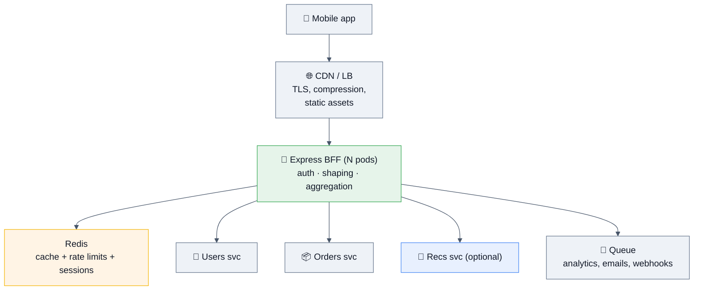

**Depth to cover:** `Promise.allSettled` fan-out with **per-call timeouts inside one request budget** · critical vs optional dependencies (degrade, don't 500) · response shaping so the client makes one call instead of five · per-dependency circuit breakers and bulkheads · caching with ETag and single-flight · token exchange at the edge · trace propagation · **why Express fits here** (I/O-bound aggregation, JSON shaping, shared types with the app) and where it stops fitting (heavy transforms → stream or move off-thread).

### D5. Design a webhook delivery + receiving system ★★★★☆
**Receiving:** raw-body HMAC verification, replay window, idempotency by event id, fast 202 + async processing (§6 M5).
**Sending:** durable queue, exponential backoff with jitter over hours, per-endpoint circuit breaking so one dead customer doesn't consume your workers, signed payloads with a rotating secret, a delivery log the customer can inspect and replay, and a dead-letter path with alerting. Cover ordering guarantees (usually "no ordering; include a sequence number") and SSRF protection since customers control the destination URL.

### D6. Design a multi-tenant SaaS API ★★★★☆
Tenant resolution (subdomain/header/token claim) → **scope enforced in the repository layer** (§6 H3) → per-tenant rate limits and quotas (noisy-neighbour protection) → per-tenant config/feature flags → connection-pool math (`pods × pool ≤ max_connections`; DB-per-tenant explodes this — use PgBouncer) → audit logs → data export/deletion for compliance → cache keys that include the tenant (a missing tenant in a cache key is a cross-tenant data leak).

## 7.3 Advanced

### D7. Design an API gateway in Express ★★★★☆
Routing/proxying to internal services, auth and token exchange at the edge, rate limiting and quota enforcement, request/response transformation, per-route timeouts and retries, circuit breaking, canary routing by header/percentage, request/response logging with redaction, schema validation at the boundary. **Be honest about the trade-off:** a Node/Express gateway is easy to extend but is another hop with its own event loop to protect — for pure proxying, Envoy/nginx does it with less latency and no GC. Express earns its place when you need *business logic* at the edge.

### D8. Design real-time features alongside an Express API ★★★★☆
Express handles HTTP; Socket.IO/`ws` attaches to the **same `http.Server`** (`http.createServer(app)`). Then: sticky routing or a Redis pub/sub adapter for cross-pod fan-out, auth at the handshake (not per message), heartbeats with idle eviction, **backpressure on slow consumers** (check `bufferedAmount` — buffering unboundedly is a real OOM path), reconnect storms after a deploy (jittered backoff + gradual rollout + a long enough grace period), and the honest caveat that long-lived connections make rolling deploys and autoscaling harder.

### D9. Design the API layer for a payments flow ★★★★★
Idempotency keys on every mutating endpoint · money as **integer minor units** · state machine with explicit transitions and an append-only event log · webhooks in and out with signature verification · reconciliation job · PCI scope minimization (card data never touches your server — use the provider's hosted fields/iframes) · strict authorization at the resource level · audit logging of every state change with actor and reason · retries that can never double-charge. **Cite Stripe's model** (idempotency keys + dated API versions) as the reference.

## 7.4 Production scenarios (staff rounds)

| Prompt | Signals expected |
|---|---|
| "One downstream slows to 30 s and the whole API dies." | No timeouts → concurrency exhausted → cascading failure. Fix: per-call timeouts, bulkheads, breaker, degraded responses, load shedding. **The classic Express BFF outage.** |
| "Traffic 10×'d overnight. First hour?" | Check saturation in order (loop lag → pool waiting → downstream errors → memory) → scale stateless pods → shed non-critical routes → raise cache TTLs → only then touch the DB pool. Communicate; capacity work after. |
| "Migrate 200 endpoints from Express 4 to 5." | Route-syntax codemod, query-parser audit, newly-surfaced rejections, canary, rollback plan. |
| "Our rate limiter isn't limiting anything." | In-process store × N pods; `trust proxy` misconfigured so every request looks like the LB's IP. |
| "Cut the API's p99 in half." | Profile first: DB indexes/N+1 → caching + ETag → per-route middleware instead of global → parallelize awaits → payload trimming. Framework swap last, with evidence. |
| "Design zero-downtime deploys." | Readiness gating + preStop + graceful shutdown + `keepAliveTimeout` > LB idle + backward-compatible migrations + canary with automated rollback. |

---

# 8. 🏢 Real Production Usage at Scale

| Company / project | How Express shows up | The detail worth quoting |
|---|---|---|
| **The npm ecosystem at large** | Express remains the most-downloaded Node web framework by a very wide margin — commonly cited as having **an order of magnitude more downloads than Fastify** | This is the strongest practical argument for Express: middleware, hiring, StackOverflow answers, and LLM training data all skew toward it. "Boring and well-understood" is a real engineering property. |
| **Uber** | Node/Express-era services in the API and dispatch-adjacent tiers | Uber's early large-scale Node work produced much of the industry's shared knowledge about event-loop blocking, timeouts, and fast deploys. |
| **PayPal** | The famous Java→Node rewrite of account pages, built on the Express-style middleware model (their Kraken.js framework layers on Express) | PayPal reported the Node version was built faster, with fewer lines of code, and served requests faster than the Java one — still the most-cited "why Node/Express" data point. |
| **IBM / Kraken (PayPal), LoopBack** | Enterprise frameworks built **on top of** Express | Shows Express's role as a substrate: opinionated frameworks add structure without replacing the middleware model. |
| **NestJS** | Uses **Express as its default HTTP adapter** (Fastify is opt-in) | A huge amount of "Nest in production" is Express underneath. Knowing this is a good interview aside. |
| **Netflix / Airbnb / Trello / Medium era** | Node service tiers and BFFs, many originally Express | The BFF pattern — one aggregation call per screen — is the archetypal Express use case. |
| **Walmart** | Node front tier at Black Friday peak | Their public post-mortem of a Node memory leak during peak traffic is one of the best real leak write-ups available. |
| **Serverless (Lambda/Cloud Run)** | `serverless-http` wraps an Express app as a handler | Legitimate for migrating an existing app; for greenfield, per-invocation DB connections and cold starts argue for a lighter handler. |
| **Internal tools & admin APIs everywhere** | The default choice for anything that isn't performance-critical | Be ready to say: *"Express is the right answer when the constraint is engineering time, not requests per second."* |

> [!TIP]
> **Use ecosystem size as an argument, not a fact.** *"Express has vastly more downloads and middleware than the alternatives, which means faster onboarding, more battle-tested middleware, and a much larger hiring pool — that outweighs a synthetic 3× throughput difference for a service whose p99 is dominated by Postgres."* That's a senior answer; "Express is popular" is not.

---

# 9. 🐞 Common Bugs & Production Incidents

## 9.1 The bug taxonomy

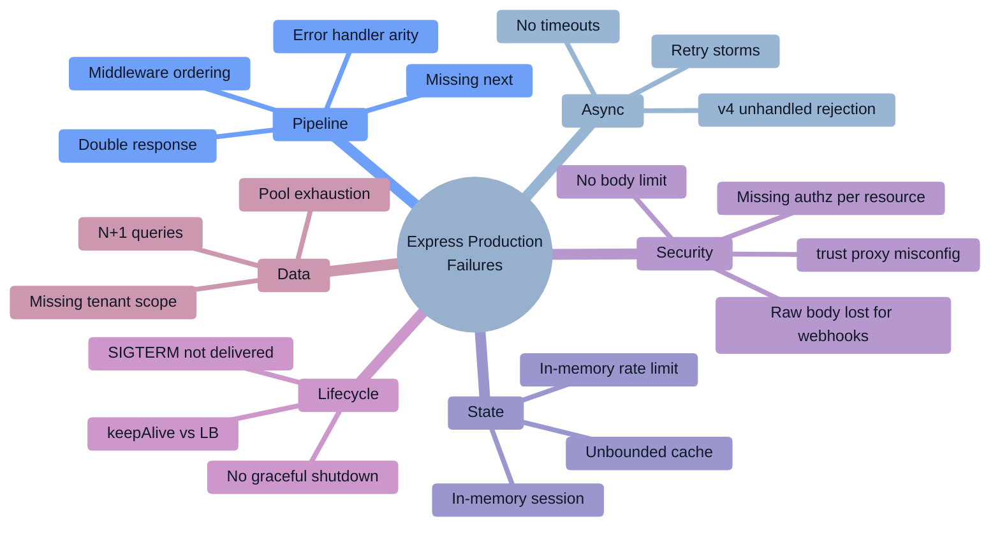

## 9.2 Twelve real bugs, with the debugging approach

### B1. The error middleware that never runs ★★★★★
**Symptom:** errors return Express's default HTML stack-trace page instead of your JSON envelope.
**Causes, in order of likelihood:** the handler has **three** parameters (arity!); it's registered before the routes; nothing calls `next(err)`; a v4 async throw never reaches it; a nested router has its own handler that swallows it.
**Debug:** log `app._router.stack.map(l => [l.name, l.handle.length])` and check the last layer is arity 4.

### B2. Requests hang forever ★★★★★
**Symptom:** the client times out; no response is ever logged.
**Causes:** a middleware branch that neither responds nor calls `next()`; an async rejection in Express 4; an awaited downstream with no timeout; `next()` inside a callback that never fires.
**Fix:** every branch terminates; `server.requestTimeout`; `AbortSignal.timeout` everywhere; a watchdog middleware that logs requests still open after 10 s (§6 H4).

### B3. `req.body` is undefined ★★★★★
`express.json()` missing, mounted **after** the route, or the request's `content-type` doesn't match the parser's `type`. Also: a proxy stripped the header, or the client sent form-encoded data to a JSON-only parser.

### B4. Rate limiting doesn't limit anything ★★★★★
**Two independent causes, both common:** (1) an in-process store with N pods → the effective limit is N×; (2) `trust proxy` not set, so `req.ip` is the load balancer's address and **every user shares one bucket** (or, if set to `true` blindly, clients spoof `X-Forwarded-For` and get unlimited buckets).
**Fix:** Redis store + `app.set('trust proxy', 1)` (a specific hop count), and a test that asserts the 429.

### B5. Webhook signature verification always fails ★★★★☆
`express.json()` ran first and consumed the stream; `JSON.stringify(req.body)` doesn't byte-match what was signed (key order, whitespace, unicode escaping). **Fix:** mount `express.raw()` on that route **before** the JSON parser, or capture `req.rawBody` via the `verify` hook.

### B6. `ERR_HTTP_HEADERS_SENT` ★★★★☆
Two responses on one request: a missing `return` before `res.json(...)`, or a handler that responds *and* calls `next()`. Also appears when the error middleware tries to respond after a stream already wrote headers — that's why `if (res.headersSent) return next(err)` exists.

### B7. Route shadowing ★★★★☆
`GET /users/:id` registered before `GET /users/me` → "me" is captured as an id and you get a 404 or a cast error. **Fix:** specific routes before parameterized ones; add a test.

### B8. Memory grows until OOMKill ★★★★★
**Express-specific suspects:** `express-session` with the default MemoryStore (documented as **not for production** — it leaks); an in-process rate-limit or response cache with no eviction; middleware pushing into a module-level array; `req`/`res` captured in a closure stored somewhere; unbounded response buffering.
**Debug:** heap growth across GC cycles → three snapshots → retainer chain → fix → verify flat.

### B9. Sporadic 502s behind the load balancer ★★★★☆
`server.keepAliveTimeout` is shorter than the LB's idle timeout (AWS ALB defaults to 60 s), so Node closes a pooled connection exactly as the LB reuses it. **Fix:** `keepAliveTimeout = 61_000`, `headersTimeout = 65_000`.

### B10. Deploys drop in-flight requests ★★★★☆
No graceful shutdown, or `CMD npm start` in the Dockerfile means SIGTERM never reaches Node, or readiness isn't gated so the LB keeps routing while you're closing. **Fix:** §3.10 sequence + exec-form `CMD ["node","server.js"]` + a `preStop` sleep.

### B11. N+1 queries under an innocent-looking endpoint ★★★★☆
`GET /orders` returns 50 orders and the serializer fetches each customer individually → 51 queries. **Debug:** slow-query log, query-count assertion in an integration test, or an APM trace showing 50 identical spans. **Fix:** a join, a batch loader (DataLoader-style), or eager loading.

### B12. Cross-tenant data leak via a cache key ★★★★★
A response cache keyed only by `req.originalUrl` serves tenant A's data to tenant B. The CDN variant: a personalized response cached without `Vary: Authorization`/`Cookie`. **Fix:** include the tenant/user in the cache key, set `Cache-Control: private` for personalized responses, and add a cross-tenant test.

## 9.3 The debugging playbook

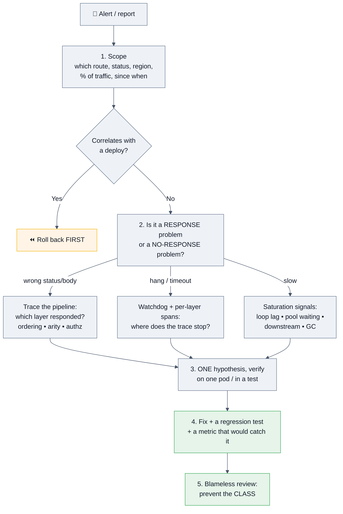

**Tools worth naming:**

| Need | Tool / technique |
|---|---|
| Which middleware ran / in what order | `app._router.stack` dump at boot (log it once); OTel Express instrumentation spans |
| Where a request stopped | Per-layer spans; a watchdog middleware logging still-open requests |
| Slow route attribution | `prom-client` histogram by route template; APM flame view |
| Event-loop blocked | `perf_hooks.monitorEventLoopDelay`, `--cpu-prof`, `clinic doctor` |
| Memory | `--heapsnapshot-signal=SIGUSR2`, three-snapshot diff, retainer chain |
| Outbound HTTP | undici diagnostics channel, `NODE_DEBUG=http`, trace spans |
| Load testing failure modes | `autocannon`, `k6` — test with a *slow downstream*, not just a fast one |
| Route inventory | A `listRoutes(app)` helper in tests (§6 H5) |

> [!TIP]
> **Answer "how would you debug X" as a funnel, not a tool list:** scope → correlate with change → classify (wrong response / no response / slow) → instrument → one hypothesis → verify → prevent the class. Interviewers grade the method.

---

# 10. 🔐 Security

> [!IMPORTANT]
> **Start every Express security answer with this sentence:** *"Express ships with virtually no security defaults — no protective headers, no input validation, no rate limiting, no body limits. Everything below is something you have to add deliberately."* That framing alone puts you ahead of most candidates.

## 10.1 Attack surface map

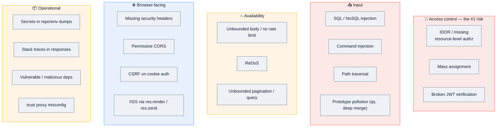

## 10.2 The baseline stack

```js
app.set('trust proxy', 1);                      // a SPECIFIC hop count, not `true`
app.disable('x-powered-by');                    // helmet does this too

app.use(helmet({                                 // 1. security headers, FIRST
  contentSecurityPolicy: { directives: { defaultSrc: ["'self'"], objectSrc: ["'none'"], baseUri: ["'none'"] } },
  hsts: { maxAge: 31_536_000, includeSubDomains: true, preload: true },
  referrerPolicy: { policy: 'no-referrer' }
}));
app.use(cors({ origin: allowlistFn, credentials: true }));   // 2. explicit allowlist
app.use(context);                                             // 3. request id
app.use(pinoHttp({ logger, redact: ['req.headers.authorization', 'req.headers.cookie'] }));
app.use(rateLimit({ store: new RedisStore({ client: redis }) }));   // 4. BEFORE parsing
app.use(express.json({ limit: '100kb' }));                    // 5. always a limit
app.use(express.urlencoded({ extended: false, limit: '100kb' }));   // ⭐ extended:false
```

**Helmet, cors, and express-rate-limit are not alternatives — they solve different problems and you need all three.**

| Header (via helmet) | Stops |
|---|---|
| `Content-Security-Policy` | XSS payload execution |
| `Strict-Transport-Security` | protocol downgrade |
| `X-Content-Type-Options: nosniff` | MIME confusion |
| `X-Frame-Options` / `frame-ancestors` | clickjacking |
| `Referrer-Policy` | URL/token leakage via `Referer` |
| removing `X-Powered-By` | trivial fingerprinting |

## 10.3 Broken access control (the #1 risk)

```js
// ❌ Authenticated ≠ authorized — any logged-in user reads any order
app.get('/orders/:id', requireAuth, async (req, res) => res.json(await db.orders.findById(req.params.id)));

// ✅ Scope the QUERY, and 404 (not 403) so you don't leak existence
app.get('/orders/:id', requireAuth, asyncHandler(async (req, res) => {
  const order = await db.orders.findOne({ _id: req.params.id, tenantId: req.user.tenantId });
  if (!order) return res.sendStatus(404);
  res.json(order);
}));
```

**Mass assignment:**
```js
await db.users.updateOne({ _id: id }, { $set: req.body });     // ❌ {"role":"admin"}
const { name, email } = updateSchema.strict().parse(req.body); // ✅ allowlist via schema
```

**Enforce scoping in the repository layer** (§6 H3) so a forgotten handler can't become a breach — that's the systemic answer, and it's what separates senior from mid.

## 10.4 Injection

```js
// SQL
db.query('SELECT * FROM users WHERE email = $1', [email]);              // ✅
db.query(`SELECT * FROM users WHERE email = '${req.body.email}'`);      // ❌

// NoSQL — an object where you expected a string
// POST {"email":{"$ne":null},"password":{"$ne":null}} logs in as the first user
if (typeof req.body.email !== 'string') throw new Validation();          // ✅ or a schema
// also: express-mongo-sanitize, or Mongoose with strict schema types

// Command
exec(`convert ${req.query.file} out.png`);                               // ❌ shell
execFile('convert', [safePath, 'out.png']);                              // ✅ argv array

// Dynamic sort/filter fields
const SORTABLE = new Set(['createdAt', 'total']);                        // ✅ allowlist
if (!SORTABLE.has(req.query.sort)) throw new Validation();
```

## 10.5 Path traversal & static files

```js
app.get('/files/:name', (req, res, next) => {
  const base = path.resolve('/srv/uploads');
  const full = path.resolve(base, req.params.name);
  if (full !== base && !full.startsWith(base + path.sep)) return next(new AppError('bad path', { status: 400 }));
  res.sendFile(full, { root: base, dotfiles: 'deny' });     // ✅ always set root
});

app.use('/assets', express.static('public', { dotfiles: 'ignore', index: false }));  // don't serve .env/.git
```
**Graded details:** `+ path.sep` (otherwise `/srv/uploads-evil` passes a naive `startsWith`), `realpath` for symlink escapes, `dotfiles` handling, and defense in depth — non-root container user, read-only mounts.

## 10.6 CSRF

```js
// Needed when auth rides on COOKIES. Pure Bearer-token APIs are not CSRF-able the same way.
res.cookie('sid', token, { httpOnly: true, secure: true, sameSite: 'lax', path: '/' });

// Defense in depth beyond SameSite:
// 1. Double-submit token or a synchronizer token for state-changing requests
// 2. Verify Origin / Sec-Fetch-Site headers
// 3. Never let GET mutate state
app.use((req, res, next) => {
  if (['GET','HEAD','OPTIONS'].includes(req.method)) return next();
  const origin = req.get('origin');
  if (origin && !allowlist.has(origin)) return next(new AppError('Forbidden', { status: 403 }));
  next();
});
```
> [!NOTE]
> **The nuance interviewers reward:** `SameSite=Lax` blocks most cross-site POSTs, but it is not sufficient alone (subdomain takeover, older clients, GET-based state changes). And **CSRF protection is irrelevant for a token-in-`Authorization`-header API** — knowing *when it doesn't apply* is as valuable as knowing how to add it.

## 10.7 Prototype pollution via `qs` and deep merge

```js
// v4's default extended query parser (qs) builds nested objects from ?a[b][c]=1
// A deep merge of that into a config/object can reach Object.prototype.
app.use(express.urlencoded({ extended: false }));      // ✅ flat parser
// 🆕 v5: the default query parser is now `simple` — safer by default
Object.freeze(Object.prototype);                        // startup hardening
// Reject __proto__ / constructor / prototype keys in any merge; validate with a schema first
```

## 10.8 DoS and resource limits

```js
app.use(express.json({ limit: '100kb' }));            // body size
app.use(rateLimit({ /* Redis store */ }));            // per user AND per IP
server.headersTimeout = 65_000;                        // slowloris
server.requestTimeout = 30_000;
// Cap pagination limits, cap file sizes, cap regex input length,
// cap DB query cost (LIMIT everything), shed load on event-loop lag.
```
**ReDoS reminder:** `🆕 v5` removed inline route regexes precisely because attacker-controlled paths hitting a backtracking regex could pin the CPU. Apply the same caution to your own validation regexes.

## 10.9 Secrets, logging, and dependencies

| Do | Don't |
|---|---|
| Secrets from a manager (Vault/KMS/cloud secret store), injected at runtime | Secrets in the repo, the image, or a committed `.env` |
| Validate all env at boot and fail fast | Silently default a missing secret |
| `redact` `authorization`, `cookie`, `set-cookie`, PII in the logger | Log full request bodies/headers |
| Generic error messages in responses; details only in logs | Stack traces or SQL errors in the response body |
| `npm ci` + committed lockfile + `--ignore-scripts` + audit gating | `npm install` in CI; auto-merging dependency bumps unreviewed |
| Pin Express and middleware versions; review lockfile diffs | `"express": "*"` |

**Supply chain matters especially for Express** because a typical app pulls in dozens of middleware packages. The npm registry saw large-scale attacks through 2025–26 (widely-used packages compromised, a self-propagating publish-token worm, and a hijack of a 100M+-weekly-download HTTP client shipping a RAT into CI). Controls: lockfile + `npm ci`, `--ignore-scripts`, provenance/attestation checks, short-lived scoped CI tokens, and an egress allowlist in the build.

## 10.10 Security checklist ✅

- [ ] `helmet()` first; `x-powered-by` disabled
- [ ] CORS with an explicit origin allowlist; never reflect arbitrary origins with `credentials: true`
- [ ] `trust proxy` set to a **specific** hop count / subnet
- [ ] Rate limiting with a **shared store** (Redis) — per user and per IP; health checks exempt
- [ ] Body-size limits on every parser; `extended: false` unless you truly need nesting
- [ ] Schema validation on `body`, `query`, `params`, with `.strict()` against mass assignment
- [ ] Authorization checked **per resource**, enforced in the repository layer; 404 not 403 for other tenants
- [ ] JWT verified with pinned `algorithms` + `iss`/`aud`/`exp`; sessions in `HttpOnly; Secure; SameSite` cookies
- [ ] CSRF protection for cookie-based auth; `Origin`/`Sec-Fetch-Site` checks
- [ ] Parameterized queries; type guards against NoSQL operator injection; sort/filter allowlists
- [ ] `execFile`/`spawn` with argv arrays — never a shell with user input
- [ ] Path safety: `resolve` + `+ path.sep` prefix check + `root` on `res.sendFile`; `dotfiles: 'ignore'`
- [ ] Webhooks: raw body, `timingSafeEqual`, timestamp replay window, idempotency
- [ ] No stack traces / internal identifiers in production responses
- [ ] Secrets from a manager; logger redaction configured
- [ ] `npm ci`, lockfile committed, `--ignore-scripts`, audit gating, reviewed lockfile diffs
- [ ] Node on a supported LTS line; Express on **v5** where possible (v3 is EOL)
- [ ] Non-root container user, minimal/distroless image, read-only FS

---

# 11. ⚡ Performance

## 11.1 Where the time actually goes

| Component | Typical share of a real API request |
|---|---|
| Express routing + middleware dispatch | **< 1%** (tens to a few hundred μs) |
| Body parse + JSON serialize | 1–10% (payload-dependent) |
| **Database / downstream calls** | **60–90%** ⬅️ start here |
| TLS + network | 5–20% |

> [!IMPORTANT]
> **Answer "is Express slow?" with numbers and a decision.** Synthetic hello-world benchmarks commonly put **Fastify at ~3–5× Express's throughput** (roughly 70–80k vs 20–30k req/s in published comparisons, with mean latency of a few ms vs low-teens ms). Those numbers are real — and almost entirely irrelevant to a service whose p99 is 300 ms because of Postgres. Once both sides carry the same middleware (logging, CORS, helmet, compression) and make a database call, the gap narrows sharply. **Profile before you migrate.**

## 11.2 The metrics to put on the dashboard

| Metric | Healthy | What it catches |
|---|---|---|
| p50/p95/p99 latency **by route template** | per SLO | Which endpoint regressed |
| Error rate by status class | < SLO burn | 4xx (client) vs 5xx (you) |
| **Event-loop lag p99** | < 10 ms | Blocked loop — the classic "high latency, moderate CPU" |
| DB pool `waitingCount` | ~0 | Requests queueing for connections |
| Heap / RSS / `external` | flat under steady load | Leaks (Buffers show in `external`) |
| GC pause time | < 50 ms | Allocation pressure |
| Active handles / sockets | stable | Leaked connections |
| Cache hit rate | route-dependent | Whether your cache is earning its memory |

## 11.3 Profiling and load testing

```bash
npx clinic doctor -- node server.js       # classify: CPU? I/O? GC? event loop?
npx clinic flame  -- node server.js       # CPU flame graph
node --cpu-prof --cpu-prof-dir=./prof server.js
node --heapsnapshot-signal=SIGUSR2 server.js
node --trace-gc server.js

npx autocannon -c 100 -d 30 -p 10 http://localhost:3000/api/v1/orders
k6 run load.js                            # scenarios, thresholds, ramping
```

**Benchmark honestly — the mistake that invalidates most framework comparisons:**
- Include the **same middleware** on both sides (logging, CORS, helmet, compression).
- Use **realistic payloads**, not `{"hello":"world"}`.
- Include the **database call**.
- Warm up, run long enough, report **p99 not mean**, and run the load generator on a different machine.
- Test the **failure mode** too: what happens when the downstream is slow?

**Reading an Express flame graph:** a wide `JSON.stringify` band → payload size or a missing schema serializer; wide framework internals → too many global middlewares; wide `pbkdf2`/`bcrypt` → sync crypto in a handler; a large `GC` band → per-request allocation pressure.

## 11.4 The optimization playbook, in order

1. **Fix the database.** Indexes, N+1, query shape, pool size. Usually the entire problem.
2. **Remove sync CPU work from handlers.** Workers, streaming, caching.
3. **Cache + `ETag`/304 + single-flight.** The cheapest read-path win; a 304 skips serialization entirely.
4. **Mount middleware per-route, not globally.** Every global layer runs on every request — including your 404s.
5. **Keep-alive + pooling** (undici agent for outbound, DB pool sized to `pods × pool ≤ max_connections`).
6. **Parallelize independent awaits** with `Promise.all`; latency becomes max, not sum.
7. **Trim payloads.** Pagination caps, field selection, no `SELECT *` serialized to JSON.
8. **Compress at the LB/CDN**, not in Express.
9. **`fast-json-stringify`** for hot routes with a known schema (several × faster than `JSON.stringify`).
10. **Framework migration** — last, and only with profile evidence.

```js
// #4 in practice — this alone often removes 30% of per-request work
// ❌ everything global
app.use(heavyAuthMiddleware);
app.use(auditLogger);
app.use(featureFlagLoader);
// ✅ scoped to where it's needed
app.use('/api/v1/admin', heavyAuthMiddleware, auditLogger, adminRouter);
app.use('/api/v1/public', publicRouter);
```

```js
// #9 in practice
import fastJson from 'fast-json-stringify';
const stringifyOrder = fastJson({
  type: 'object',
  properties: { id: { type: 'string' }, total: { type: 'integer' }, status: { type: 'string' } }
});
res.type('application/json').send(stringifyOrder(order));
```

## 11.5 Memory

Standard Node discipline applies: bound every cache, remove listeners, clear timers, stream large payloads, and remember Buffers live in `external` (RSS grows while `heapUsed` stays flat). Express-specific: **never `express-session` MemoryStore in production** (it leaks by design and is documented as dev-only), watch in-process rate-limit stores, and set `--max-old-space-size` to ~70–75% of the container limit so V8 GCs hard instead of getting OOMKilled.

---

# 12. ✅ Best Practices

### Application structure
- Export `app` separately from `server.listen()` so it's testable.
- Build the app with a factory that takes dependencies (`createApp({ db, cache })`) — that's your DI.
- Layer: routes (thin) → services (framework-agnostic) → repositories (the only place queries live).
- One `Router` per resource; mount under a versioned prefix.
- Config validated at boot with a schema; fail fast on a missing secret.

### Middleware
- Fix the order deliberately and document it (§2.8); enforce it with a test.
- Mount middleware **per-route** when it isn't universally needed.
- Every branch either responds or calls `next()`.
- `return res.json(...)` always — never risk a double response.
- Error handler last, four parameters, `res.headersSent` guard.

### Errors
- A typed error taxonomy (`status`, `code`, `expose`, `cause`) and one response envelope.
- 4xx at `warn`, 5xx at `error` with alerting on SLO burn.
- Never leak stacks, SQL, or internal ids to clients.
- On Express 4, wrap every async handler; on 5, verify your handler still catches what you expect.

### API design
- Cursor pagination with a capped limit; allowlisted sort/filter fields.
- Idempotency keys on every mutating public endpoint.
- Additive-only changes within a version; deprecation headers with a sunset date.
- Correct status codes: 201 + `Location`, 204 for empty, 409 vs 422, 429 with `Retry-After`.

### Production
- Graceful shutdown wired on day one; liveness ≠ readiness; liveness must not touch the DB.
- `keepAliveTimeout` > the LB idle timeout; exec-form `CMD`.
- One process per container; scale pods.
- Structured JSON logs with a request id; sample 2xx access logs at high RPS, keep all 5xx.
- Metrics labelled by route template; cardinality budget.
- Nothing in process memory that must survive a restart or be shared across pods.

### Security
- The §10.10 checklist, enforced in CI where possible.

### Testing
- `supertest` against the exported app; Testcontainers for real dependencies; `MockAgent`/`nock` for outbound.
- A contract test that every protected route 401s unauthenticated.
- Cross-tenant access tests (the IDOR regression guard).
- Query-count assertions to catch N+1 regressions.
- Load-test the failure modes (slow downstream, dead cache), not only the happy path.

---

# 13. 🚫 Anti-patterns

| Anti-pattern | Why it hurts | Do instead |
|---|---|---|
| Error handler with 3 parameters | Arity ≠ 4 → Express treats it as normal middleware and it **silently never runs** | Exactly `(err, req, res, next)` |
| Error handler mounted before routes | Never sees route errors | Mount last |
| No `return` before `res.json(...)` | Double response → `ERR_HTTP_HEADERS_SENT` | `return res.json(...)` |
| A middleware branch with no `next()` and no response | The request hangs until timeout | Every branch terminates |
| Async handlers without a wrapper on **Express 4** | Hang + unhandled rejection (process may exit) | `asyncHandler`, or upgrade to v5 |
| `try/catch` that logs and swallows | Client waits forever; the error never reaches your handler | `next(err)` |
| Body parser mounted after the route | `req.body` is undefined | Parsers before routes |
| `express.json()` before a webhook route | Destroys the raw bytes → signature verification always fails | `express.raw()` on that route first |
| `express.json()` with no `limit` | Trivial memory/CPU DoS | Always set a limit |
| Rate limiter **after** body parsing | You parse the abuser's 10 MB before rejecting them | Limit first |
| In-process rate limiter with >1 instance | Effective limit is N× — the limit is fiction | Redis store |
| `express-session` MemoryStore in production | Leaks memory; breaks with 2+ pods; documented as dev-only | Redis session store |
| `app.set('trust proxy', true)` | Clients can spoof `X-Forwarded-For` and evade IP limits | A specific hop count/subnet |
| No `trust proxy` behind a LB | Every request shares the LB's IP — limiter and audit logs are useless | `trust proxy` set correctly |
| `cors({ origin: true })` with `credentials` | Reflects any origin — a cross-origin hole | Explicit allowlist |
| Authorization only at the route level | IDOR — any user reads any id | Scope the query; enforce in the repository |
| Spreading a user filter **after** `tenantId` | The attacker overrides the scope | `{ ...sanitized, tenantId }` — scope last |
| Cache key without the tenant/user | Cross-tenant data leak | Include the scope in the key; `Cache-Control: private` |
| Personalized responses cached without `Vary` | A shared cache serves one user's data to another | Set `Vary`, or `private` |
| `/users/:id` registered before `/users/me` | Route shadowing — `me` is captured as an id | Specific routes first |
| Business logic inside route handlers | Untestable without HTTP; unportable | Thin handlers → services |
| Global middleware that only 3 routes need | Runs on every request, including 404s | Mount per-route |
| `compression()` in Express at high RPS | Burns event-loop CPU that competes with handlers | Compress at the LB/CDN |
| `express.static` serving production assets | Slower, no range/CDN benefits, occupies your loop | CDN with hashed immutable filenames |
| Sync `fs`/`crypto`/big `JSON.parse` in a handler | Blocks **every** concurrent request | Async APIs, workers, caching |
| No timeout on downstream calls | One slow dependency exhausts concurrency → cascading outage | `AbortSignal.timeout` on every call |
| Retries without jitter / at several layers | Retry storms multiply load (3×3×3 = 27) | Jitter, a budget, retry at one layer |
| Metrics labelled by `req.url` | Cardinality explosion and a large bill | `req.route?.path` template |
| Stack traces in the response body | Information disclosure | Generic message + `requestId` |
| Secrets in `.env` committed to the repo | Immediate compromise on leak | Secrets manager |
| `npm install` in CI | Non-reproducible builds; drift | `npm ci` |
| `process.exit()` on SIGTERM | Drops in-flight requests on every deploy | Graceful shutdown sequence |
| Liveness probe that checks the database | A DB blip restarts the whole fleet | Liveness = "am I alive" only |
| Rewriting in Fastify to fix a slow API | Optimizes < 1% of the latency | Profile; fix the database first |

---

# 14. 📊 Comparison Tables

## 14.1 Node HTTP frameworks

| | **Express** | Fastify | NestJS | Koa | Hapi | Hono |
|---|---|---|---|---|---|---|
| Philosophy | minimal, unopinionated | performance + schemas | opinionated, DI, modules | minimal, async middleware | config-driven, batteries-in | edge-first, tiny |
| Synthetic throughput | baseline | **~3–5×** | ~Fastify (uses it) | ~Express | ~Express | very high |
| Async errors | **v5 ✅ / v4 ❌** | ✅ | ✅ | ✅ | ✅ | ✅ |
| Validation & serialization | add-on | **built-in JSON Schema** | pipes + class-validator | add-on | built-in Joi | add-on |
| Structure / DI | none | plugins + encapsulation | **enforced (modules, DI)** | none | plugins | none |
| TypeScript | `@types/express` | good | **excellent, TS-first** | okay | good | excellent |
| Ecosystem / middleware | **largest by far** | growing | large (Nest modules) | small | moderate | growing |
| Learning curve | **lowest** | low | **high** | low | moderate | low |
| Runs on edge/isolates | ❌ | ❌ (Node-only) | ❌ | ❌ | ❌ | ✅ |
| Best for | most services, teams that need to ship | throughput-bound APIs, schema-first | large orgs needing structure | middleware purists | config-heavy enterprise | edge/multi-runtime |

> [!TIP]
> **The answer that lands:** *"Fastify wins the benchmark; Express wins the org. If a service is genuinely framework-CPU-bound — high RPS, small payloads, no heavy database — Fastify's schema-compiled serialization is a real, measurable win. Everywhere else the deciding factors are middleware availability, hiring, and the cost of retraining. I'd pick Fastify for a new high-throughput service and leave a working Express estate alone, upgrading it to v5 instead."*

## 14.2 Express 4 vs Express 5

| Area | `v4` | `🆕 v5` |
|---|---|---|
| Released / status | 2014; still widely deployed, no published EOL | Oct 2024; `latest` since Mar 2025; **recommended** |
| Node requirement | very old versions supported | **18+** |
| Async handler rejection | ❌ hangs; unhandled rejection | ✅ forwarded to error middleware |
| Router engine | `path-to-regexp` 0.x | **8.x** |
| Wildcard | `/*` | `/*splat` (must be named) |
| Optional param | `/:id?` | `/{:id}` |
| Inline regex in path | `/:id(\\d+)` | ❌ **removed** (ReDoS) |
| Default query parser | `extended` (qs, nested) | **`simple`** (flat) |
| `res.sendfile`, `app.del`, `req.param()`, `res.json(status,obj)`, `res.redirect('back')` | present/deprecated | ❌ removed |
| `req.signal` (client abort) | ❌ | ✅ |
| Migration effort | — | route syntax + removed APIs + query-parser audit |

## 14.3 Express vs raw `node:http`

| | `node:http` | Express |
|---|---|---|
| Routing | manual `if/switch` on `req.method`/`req.url` | declarative, with params |
| Middleware | roll your own | composable stack |
| Body parsing | manual stream accumulation | `express.json()` etc. |
| Response helpers | `writeHead` + `end` | `res.status().json()` |
| Overhead | lowest | tens–hundreds of μs |
| When to use raw | tiny proxies, benchmarks, edge cases, learning | almost everything else |

## 14.4 Middleware ecosystem — what to reach for

| Need | Package | Notes |
|---|---|---|
| Security headers | **helmet** | Mount first |
| CORS | **cors** | Explicit allowlist |
| Rate limiting | **express-rate-limit** (+ `rate-limit-redis`) | Redis store required past one instance |
| Body parsing | built-in `express.json/urlencoded/raw/text` | Always set `limit` |
| Cookies | **cookie-parser** | Signed cookies need a secret |
| Sessions | **express-session** + `connect-redis` | **Never** the default MemoryStore in prod |
| Logging | **pino-http** (prod), morgan (dev) | Structured JSON + redaction |
| Validation | **zod** / Joi / AJV (`express-validator`) | Schema at the boundary |
| Uploads | **multer** / busboy | Or pre-signed URLs |
| Auth | **passport** (strategies), jose/jsonwebtoken | Pin JWT algorithms |
| Compression | compression | Prefer the LB/CDN |
| Docs | swagger-ui-express + OpenAPI | Generate from schemas where possible |
| Testing | **supertest** | Against the exported app |
| Tracing | @opentelemetry/instrumentation-express | Per-middleware spans |

## 14.5 Auth approaches

| | Session cookie | JWT (stateless) | API key | OAuth2 / OIDC |
|---|---|---|---|---|
| Revocation | ✅ immediate | ❌ hard (denylist / short TTL) | ✅ | ✅ (token introspection) |
| Scale | needs a shared store | no lookup | store lookup | IdP dependency |
| Best for | browser apps | service-to-service, mobile | machine clients | third-party access, SSO |
| Main risk | session fixation, CSRF | can't un-issue; `alg` confusion | leakage in logs/URLs | misconfigured redirect URIs |
| Express note | `express-session` + Redis; `HttpOnly; Secure; SameSite` | verify with pinned `algorithms`, `iss`, `aud` | hash keys at rest; scope them | use a vetted library, never hand-roll |

## 14.6 Pagination strategies

| | Offset (`?page=3`) | **Cursor (`?after=…`)** | Keyset (`?since_id=…`) |
|---|---|---|---|
| Correct with concurrent inserts | ❌ skips/duplicates | ✅ | ✅ |
| Performance at depth | ❌ degrades (`OFFSET 100000`) | ✅ constant | ✅ constant |
| Jump to page N | ✅ | ❌ | ❌ |
| Total count | easy | expensive/omitted | expensive |
| Use for | small admin tables | **feeds, APIs, exports** | simple id-ordered lists |

## 14.7 Deployment models

| | Single VM + PM2/cluster | **Container per pod (K8s)** | Serverless (Lambda + `serverless-http`) |
|---|---|---|---|
| Scaling | vertical + cluster | horizontal, automatic | per-invocation |
| Memory | one limit shared by N processes | one process per limit | per-invocation |
| Cold start | none | seconds (pod) | 100s of ms |
| Long-lived connections | ✅ | ✅ | ❌ |
| DB connections | pooled per process | `pods × pool ≤ max_connections` | ⚠️ per-invocation — needs a proxy/pooler |
| Graceful shutdown | PM2 reload | SIGTERM + readiness gating | platform-managed |
| Best for | small/legacy deployments | **the 2026 default** | spiky, low-volume, event-driven |

---

# 15. 📄 Cheat Sheet (One-Page Revision)

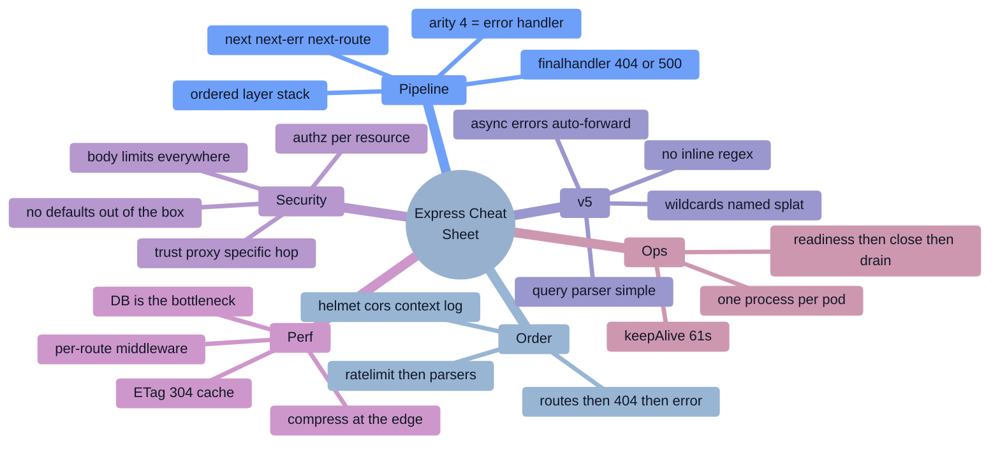

### The pipeline
```
app(req,res) → walk the layer stack by index
  match: method + path (use = prefix, METHOD = full path)
  arity 3 → normal middleware | arity 4 → ERROR handler
  next()      → next matching layer
  next(err)   → error mode; skip normal layers to the next 4-arg handler
  next('route') → skip the rest of THIS route's handlers
  respond     → done | nothing → REQUEST HANGS
  fell off the end → finalhandler: 404 (no err) / 500 (err)
```

### Canonical middleware order
```
trust proxy → requestId/ALS → helmet → cors → logger → rate limit
→ express.raw (webhooks) → express.json({limit}) → cookies/session
→ routes (auth → authz → validate → handler)
→ 404 handler → error handler (4 args, LAST)
```

### Routing
```
app.use(path, fn)      any method, PREFIX match, no params, rewrites req.url
app.METHOD(path, fn)   that method, FULL path, populates req.params
app.route('/x').get().post()
Router({ mergeParams: true })   ← child sees parent params
specific routes BEFORE parameterized ones (/users/me before /users/:id)
```

### v4 → v5
```
async rejection → auto next(err)        (v4: hangs)
/*        → /*splat                     (wildcards must be named)
/:id?     → /{:id}
/:id(\d+) → removed (ReDoS) — validate in a handler
query parser: extended → simple
gone: res.sendfile, app.del, req.param(), res.json(status,obj), res.redirect('back')
Node 18+ required
```

### Error handling
```
app.use((err, req, res, next) => { … })   ← EXACTLY 4 params, mounted LAST
if (res.headersSent) return next(err)      ← cannot re-send
sync throw     → caught by Express → next(err)
async throw    → v5 ✅ auto | v4 ❌ asyncHandler(fn)
const asyncHandler = fn => (req,res,next) => Promise.resolve(fn(req,res,next)).catch(next);
4xx = warn (client) | 5xx = error + alert (you)
never leak stacks/SQL to clients
```

### req / res quick reference
```
req.params .query .body .headers .cookies .ip .protocol
req.originalUrl (full) .baseUrl (mount) .path (after mount)
req.signal   ← v5, aborts on client disconnect
res.status().json() .send() .sendStatus() .set() .cookie() .redirect() .sendFile({root})
res.locals (per request) | app.locals (app lifetime)
ALWAYS: return res.json(...)
```

### Security one-liners
```
Express has NO security defaults — helmet + cors allowlist + rate limit are all additions
authorization per RESOURCE, enforced in the repository layer  ← #1 risk
app.set('trust proxy', 1)   ← specific hop; `true` is spoofable
express.json({ limit: '100kb' }) always
rate limit BEFORE body parsing; Redis store past one instance
webhooks: express.raw BEFORE express.json; timingSafeEqual; replay window
parameterize SQL; typeof-check to stop NoSQL operator injection
res.sendFile(path, { root }) ; path.resolve + startsWith(BASE + path.sep)
JWT: pin algorithms, verify iss/aud/exp ; sessions in HttpOnly cookies + Redis store
```

### Performance order of operations
```
1 database (indexes, N+1, pool)   2 no sync CPU in handlers
3 cache + ETag/304 + single-flight  4 per-route middleware, not global
5 keep-alive + pooling            6 Promise.all for independent awaits
7 trim payloads / paginate        8 compress at the edge
9 fast-json-stringify hot routes  10 framework swap (with evidence)
```

### Production checklist
```
export app separately from listen()      | graceful shutdown + readiness gating
server.keepAliveTimeout = 61_000         | liveness must NOT check the DB
CMD ["node","server.js"] (exec form)     | one process per pod
metrics by ROUTE TEMPLATE                | nothing important in process memory
npm ci + lockfile                        | --max-old-space-size ≈ 75% of the limit
```

---

# 16. 🎴 Flash Cards

<details><summary><b>Core pipeline (click to expand)</b></summary>

| Q | A |
|---|---|
| What is Express in one sentence? | A minimal routing + middleware layer over `node:http`; `app` is itself a `(req,res)` handler. |
| What is middleware? | A function `(req,res,next)` in an ordered stack that can modify the request, end the response, or pass control. |
| How does Express know a function is an error handler? | **Arity** — `fn.length === 4`. Three parameters means it's treated as normal middleware. |
| Where must the error handler be mounted? | Last, after all routes and routers. |
| What does `next('route')` do? | Skips the remaining handlers of the current route and tries the next matching route. |
| `app.use` vs `app.get`? | Any method + prefix match (no params, rewrites `req.url`) vs one method + full path (populates `req.params`). |
| What happens if no layer responds and none calls `next()`? | The request hangs until a timeout. |
| What happens if the stack runs out? | `finalhandler` sends 404 (no error) or 500 (error). |
| Does Express catch a synchronous `throw` in a handler? | Yes — it's wrapped in try/catch and forwarded to `next(err)`. |
| Does Express 4 catch an async rejection? | **No.** The request hangs and it becomes an unhandled rejection. |
| What does `mergeParams` do? | Lets a child router read the parent mount's route params. |
| Can you send two responses? | No — `ERR_HTTP_HEADERS_SENT`. Always `return res.json(...)`. |
</details>

<details><summary><b>Express 5 & routing</b></summary>

| Q | A |
|---|---|
| The headline Express 5 change? | Rejected promises from async handlers are forwarded to the error middleware automatically. |
| When did Express 5 ship, and what does it require? | 5.0.0 in October 2024 (latest tag from March 2025); Node 18+. |
| Why was inline route regex removed? | `path-to-regexp` sub-expressions were a ReDoS vector; v5 upgraded to path-to-regexp 8. |
| v5 wildcard syntax? | Must be named: `/*splat` — a bare `*` throws `Missing parameter name`. |
| v5 optional parameter syntax? | Braces: `/{:id}` (was `/:id?`). |
| What changed about `req.query`? | The default parser changed from `extended` (nested objects) to `simple` (flat). |
| Name three APIs removed in v5. | `res.sendfile()`, `app.del()`, `req.param()` (also `res.json(status,obj)`, `res.redirect('back')`). |
| What's the risk when upgrading to v5? | Rejections that were previously swallowed now surface as real 500s — check your error handler and alerting. |
| Route ordering rule? | Specific before parameterized: `/users/me` before `/users/:id`. |
| Is Express 4 EOL? | Not formally as of 2026, but v5 is the recommended line and a sunset is expected around Express 6. Express **3** is EOL. |
</details>

<details><summary><b>Production & performance</b></summary>

| Q | A |
|---|---|
| Correct production middleware order? | trust proxy → context → helmet → cors → logger → rate limit → parsers → routes → 404 → error. |
| Why rate limit before body parsing? | So you don't parse an abuser's 10 MB payload before rejecting them. |
| Why does an in-process rate limiter fail at scale? | Each pod counts separately — with N pods the effective limit is N×. Use a Redis store. |
| Why is `req.ip` wrong behind a load balancer? | You need `trust proxy` — but `true` lets clients spoof `X-Forwarded-For`; use a specific hop count. |
| Is Express slow? | Its overhead is tens to hundreds of μs. Synthetic benchmarks show Fastify ~3–5× faster, but real APIs are dominated by the database. Profile first. |
| First metric to check when p99 spikes at moderate CPU? | Event-loop lag p99, then DB pool `waitingCount`. |
| Why label metrics by route template? | `req.url` explodes cardinality; use `req.route?.path` with an `'unmatched'` fallback. |
| Graceful shutdown order? | Readiness 503 → `server.close()` → drain → `closeIdleConnections()` → close deps → flush telemetry → exit with a hard timeout. |
| Why `keepAliveTimeout = 61000`? | It must exceed the LB's idle timeout (ALB defaults to 60 s) or you get sporadic 502s. |
| Which session store must never ship to production? | `express-session`'s default MemoryStore — it leaks and doesn't work across pods. |
| Fastest read-path win in an Express API? | ETag + 304 conditional responses — no body, no serialization. |
| Where should static assets be served from? | A CDN with content-hashed immutable filenames, not `express.static`. |
</details>

<details><summary><b>Security</b></summary>

| Q | A |
|---|---|
| First sentence of any Express security answer? | Express ships with no security defaults — headers, validation, limits, and rate limiting are all additions. |
| #1 risk class in Express APIs? | Broken access control — IDOR / missing resource-level authorization. |
| Where should tenant scoping be enforced? | In the repository layer, so a forgotten handler can't become a breach. 404 (not 403) for another tenant's resource. |
| How do you stop mass assignment? | Schema validation with `.strict()`/allowlisting, then assign only the allowed fields. |
| How do you stop NoSQL operator injection? | Reject non-string values where you expect strings; validate with a schema before querying. |
| Why does webhook signature verification fail? | `express.json()` consumed the stream; you need the **raw body** (`express.raw()` mounted first, or the `verify` hook). |
| Two things `timingSafeEqual` needs? | Equal-length buffers (check first) and both values as `Buffer`s. |
| When is CSRF protection unnecessary? | For APIs authenticated purely by an `Authorization` header — CSRF rides on automatically-sent cookies. |
| Safe `res.sendFile`? | Always pass `{ root }`, plus `path.resolve` + `startsWith(BASE + path.sep)`. |
| What must never appear in a production error response? | Stack traces, SQL, internal identifiers — log them, return a code + `requestId`. |
| Three headers helmet sets that matter most? | CSP, HSTS, `X-Content-Type-Options: nosniff` (plus frame-ancestors/X-Frame-Options). |
| One npm control that most reduces supply-chain risk? | `npm ci` with a committed lockfile, plus `--ignore-scripts`. |
</details>

---

# 17. ✅ Interview Revision Checklist

### Core
- [ ] What Express is (and that `app` is an `http` handler)
- [ ] The layer stack, `next()`, `next(err)`, `next('route')`, `finalhandler`
- [ ] **Arity 4 = error handler**; mounted last; `res.headersSent` guard
- [ ] `app.use` vs `app.METHOD`; prefix vs full-path matching; `req.url` rewriting
- [ ] `req.params` / `query` / `body` / `originalUrl` / `baseUrl` / `path`
- [ ] `express.Router()`, `mergeParams`, `caseSensitive`, `strict`
- [ ] `app.param()`, `res.locals` vs `app.locals`
- [ ] Route ordering and shadowing

### Express 5
- [ ] Async error propagation (and the v4 `asyncHandler` workaround)
- [ ] `path-to-regexp` 8: `/*splat`, `/{:id}`, no inline regex
- [ ] Removed APIs; query-parser default change; Node 18+
- [ ] How you'd plan a fleet migration

### Building real APIs
- [ ] Correct middleware order and the justification for each position
- [ ] Body parsers with limits; the **raw-body webhook** case
- [ ] Schema validation as middleware; mass-assignment protection
- [ ] Auth middleware + **resource-level** authorization
- [ ] Error taxonomy + response envelope + 404 handler
- [ ] Cursor pagination, allowlisted sorting, status-code correctness
- [ ] Idempotency keys
- [ ] Streaming responses with backpressure and abort cleanup
- [ ] File uploads (and why pre-signed URLs are better)

### Production
- [ ] Statelessness: sessions, rate limits, caches all externalized
- [ ] Graceful shutdown, readiness vs liveness, `keepAliveTimeout`
- [ ] Structured logging + request id + `AsyncLocalStorage`
- [ ] Metrics by route template; event-loop lag; pool `waitingCount`
- [ ] Timeouts, retries with jitter, circuit breakers, load shedding
- [ ] Docker: multi-stage, non-root, exec-form `CMD`
- [ ] One process per pod; when `cluster` is still right

### Security
- [ ] The §10.10 checklist end to end
- [ ] `trust proxy` — why you need it and why `true` is dangerous
- [ ] One supply-chain story you can discuss with specifics

### Engineering
- [ ] The §6 implementations: `asyncHandler`, logger, validator, auth, rate limiter, idempotency, cache+ETag, streaming export, webhook receiver, RBAC, circuit breaker
- [ ] A minimal Express implementation (stack + `next` + arity dispatch)
- [ ] Testing: exported app, supertest, Testcontainers, auth contract test, cross-tenant test, query-count assertions
- [ ] One production incident **you personally debugged**, with metrics and the systemic fix

### Behavioral
- [ ] 6–8 STAR stories: an outage you owned, a disagreement resolved, an ambiguous project, a decision reversed, a performance win with numbers, mentoring
- [ ] Amazon: map each story to a Leadership Principle
- [ ] Questions to ask them: on-call load, deploy frequency, tech-debt prioritization, the first 90 days

---

# 18. 🗺️ Learning Roadmap


### 🌱 Beginner (weeks 1–3)
**Prerequisite:** solid JavaScript async (promises, `async/await`) and Node basics (modules, `process.env`, the event loop). If those are shaky, fix them first — Express interviews assume them.
**Learn:** routing, `app.use` vs `app.METHOD`, middleware, `next()`, `req`/`res`, body parsing, static files, `express.Router()`, status codes, a template engine (once, for context).
**Build:** a CRUD REST API over a real database with a `/healthz` endpoint, proper status codes, and a 404 handler.
**Read:** the official Express guide (Routing, Writing middleware, Using middleware, Error handling).
**Milestone:** you can explain why `req.body` is undefined without looking it up.

### ⚙️ Intermediate (weeks 4–11)
**Learn:** the error-handling middleware contract and the arity rule, the Express 4 async problem and its fixes, Express 5's changes, schema validation, JWT/session auth, authorization vs authentication, layered architecture (routes/services/repositories), database access and connection pooling, testing with supertest, structured logging, Docker.
**Build:** an authenticated multi-resource API with validation, RBAC, cursor pagination, rate limiting, Redis caching, structured logs, an integration test suite, and a Dockerfile. Then **rewrite the same API in Fastify** and benchmark both honestly (same middleware, same DB) — the exercise teaches you more about Express than any article.
**Practice:** every §6 Easy and Medium implementation from memory.
**Read:** *Node.js Design Patterns* (Casciaro & Mammino); the Express production best-practices pages (performance and security).
**Milestone:** you can lay out a production middleware stack in the right order and justify every position.

### 🚀 Advanced (weeks 12–24)
**Learn:** the full security checklist (§10), performance profiling and load testing, observability (pino + OTel + prom-client), resilience (timeouts, retries, breakers, bulkheads, shedding), graceful shutdown and the Kubernetes lifecycle, multi-tenancy, idempotency, webhooks, streaming, the Express 4→5 migration, TypeScript with Express.
**Build:** deliberately break your API — block the event loop, leak memory, remove a timeout while a downstream hangs — and diagnose each using only metrics and profiles. Add OTel tracing with per-middleware spans and find your slowest middleware. Implement a minimal Express from scratch. Ship graceful shutdown and prove zero-downtime deploys.
**Practice:** all §6 Hard problems; 4 Express system designs out loud, timed.
**Read:** OWASP Top 10 + the Node.js Security Cheat Sheet; the Express 5 migration guide end to end; the Google SRE Book chapters on SLOs, overload, and cascading failures.
**Milestone:** you can take "the API is slow/hanging/leaking" and drive it to a root cause with a repeatable method — and name the metric that would have caught it sooner.

### 🏆 Expert (ongoing)
**Do:** own the shared middleware/service template for your org; run design and post-incident reviews; contribute to Express or a widely-used middleware package; drive a framework or major-version migration with data; mentor; write publicly about a non-obvious debugging story.
**Signals you're there:** you argue trade-offs with evidence, you know when Express is the wrong answer and say so, and other teams route hard production problems to you.

### ⏱️ Time-boxed interview prep plans

| You have… | Do this |
|---|---|
| **1 week** | §15 cheat sheet daily · §16 flash cards · §5 Very High list · write from memory: `asyncHandler`, error handler, auth middleware, rate limiter, validation middleware · rehearse the middleware-order answer with justifications · 2 behavioral stories per competency |
| **1 month** | Week 1: pipeline + routing + §4.1–4.2 · Week 2: errors, auth, validation, all §6 Medium · Week 3: §6 Hard + security + one Express system design daily · Week 4: mock interviews, §9 incident stories, behavioral polish |
| **3 months** | Follow Intermediate → Advanced, plus 120 LeetCode (40/60/20), 6 machine-coding builds, 8 system designs, one real profiling/leak-hunt exercise on your own service, and 6 mocks with real people |

---

# 19. 📚 Sources & Further Reading

**This guide was synthesized from, and should be checked against, the following.** Official docs take precedence — Express 5 changed enough that older blog posts are actively misleading.

### Official documentation
- **expressjs.com** — the Guide (Routing, Writing/Using middleware, Error handling), **Migrating to Express 5** (the authoritative breaking-change list), and the **Production best practices** pages for performance and **security**
- **Express 5.0.0 release notes & the expressjs/express repository** — including the discussions on `path-to-regexp` errors
- **path-to-regexp** documentation — the v8 route grammar
- **Node.js API docs & Guides** — the event loop, streams, `http` server timeouts, `AsyncLocalStorage`, diagnostics
- **OWASP** — Top 10, Node.js Security Cheat Sheet, SSRF Prevention in Node.js, NodeGoat
- **helmet, cors, express-rate-limit, express-session, multer, pino-http** — their own docs (the defaults matter)
- **OpenTelemetry JS** — Express and HTTP instrumentation

### Interview-specific resources
- **Simplilearn**, **Hirist**, **GUVI**, **FinalRound AI**, **GoodSpace**, **VerveCopilot**, **Second Talent** — Express question banks (2026 editions)
- **Devinterview-io/express-interview-questions**, **goldbergyoni/nodebestpractices** (the single best Node/Express practices repo), **Tech Interview Handbook**, **Awesome Interview Questions** — GitHub
- **LeetCode**, **NeetCode**, **InterviewBit**, **GeeksforGeeks**, **Scaler Topics**, **Coding Ninjas** — DSA and framework theory
- **Glassdoor / AmbitionBox / Levels.fyi / Prepfully / Interview Query / Exponent / Blind / Fishbowl** — reported company experiences
- **Reddit** — r/node, r/expressjs, r/ExperiencedDevs, r/developersIndia
- **YouTube** — Hussein Nasser (backend/networking depth), Traversy Media, Web Dev Simplified, Academind, Fireship, freeCodeCamp

### System design
- **ByteByteGo**, **Hello Interview**, **Design Gurus**, **System Design Primer**, **High Scalability**
- **Martin Kleppmann — *Designing Data-Intensive Applications*** (highest-value book for backend design rounds)
- **Alex Xu — *System Design Interview* vols. 1–2**
- **Google SRE Book & Workbook** (free online) — SLOs, overload, cascading failures
- **Sam Newman — *Building Microservices***

### Books & long-form
- Mario Casciaro & Luciano Mammino — ***Node.js Design Patterns***
- Ethan Brown — ***Web Development with Node and Express*** (2nd ed.) — the dedicated Express book
- Liran Tal — ***Node.js Secure Coding*** series
- Roy Fielding's dissertation ch. 5 + **Zalando/Google API design guides** — for REST design rounds

### Comparisons & benchmarks (read critically)
Fastify's own benchmarks and the many community Express-vs-Fastify write-ups — **always check whether the benchmark includes middleware and a database call**, because most don't. PkgPulse/Better Stack/Markaicode 2025–26 comparisons are useful for the shape of the difference, not for absolute numbers.

### Engineering blogs & case studies
PayPal Engineering (the Java→Node case study, Kraken.js) · Netflix Tech Blog · Uber Engineering · Walmart Labs (Node at Black Friday scale + their memory-leak post-mortem) · Stripe (idempotency, API versioning, webhooks) · NearForm and Platformatic (deep Node/Fastify performance write-ups) · Cloudflare (edge runtimes, and the 2019 regex outage post-mortem)

### Staying current
Express release notes and the expressjs GitHub discussions · OpenJS Foundation blog · Node.js release schedule · Node Weekly · Socket.dev / Snyk supply-chain reports

---

<div align="center">

### 🎯 Final word

**Express interviews are not testing whether you can write `app.get`. They are testing whether you understand an ordered array of functions that every request must walk — and everything the framework deliberately refuses to do for you.**

For every answer, add one layer the question didn't ask for: which middleware runs and in what order, what happens with 20 pods instead of one, where the timeout is, what an attacker would try, and which metric would catch it. That single habit is the difference between "has used Express" and "runs Express in production."

**Good luck. 🚀**

</div>
