# 🗃️ Java Collections Framework — The Complete Interview Preparation Guide

> **Target audience:** Candidates preparing for SDE-1 → Staff/Principal interviews at Google, Meta, Amazon, Microsoft, Apple, Netflix, Uber, Airbnb, Stripe, Databricks, Snowflake, OpenAI, Anthropic, NVIDIA, Palantir, Bloomberg, Goldman Sachs, JPMorgan, Walmart Global Tech, Salesforce, Atlassian, DoorDash, Coinbase, Shopify, Pinterest, Tesla, Adobe, Oracle, Qualcomm, Cisco, Cloudflare, Rippling — plus Indian product & service companies.
>
> **Baseline:** Java 21 LTS is the assumed floor (Sequenced Collections, JEP 431); Java 25 LTS (Sep 2025) notes are flagged `🆕`. Java 8 remains the most-interviewed version at service companies.
>
> **Why this topic matters:** *"How does `HashMap` work internally?"* is the single most-asked Java interview question on earth. Collections is where interviewers test data-structure fundamentals, API taste, concurrency instincts, and memory awareness — all at once, in one question.
>
> **Last synthesized:** August 2026.

---

## 📑 Table of Contents

| # | Section | What it covers |
|---|---------|----------------|
| 0 | [How to Use This Guide](#0-how-to-use-this-guide) | Study strategy per company tier |
| 1 | [Beginner Concepts](#1--beginner-concepts) | What/why/problems solved/analogies/misconceptions |
| 2 | [Intermediate Concepts](#2--intermediate-concepts) | Internals of every implementation, architecture, lifecycle, APIs |
| 3 | [Advanced Concepts](#3--advanced-concepts) | Trade-offs, concurrency, distributed implications, tuning, observability |
| 4 | [Interview Questions by Level](#4--interview-questions-by-level) | Beginner → Staff → FAANG → Startup → Product → Service |
| 5 | [Frequently Asked Questions (Ranked)](#5--frequently-asked-questions-ranked-by-frequency) | Frequency-ranked master list |
| 6 | [Coding Questions](#6--coding-questions) | Easy/Medium/Hard, full solutions |
| 7 | [System Design Questions](#7--system-design-questions-collections-centric) | Collections-centric design rounds |
| 8 | [Real Production Usage](#8--real-production-usage-at-scale) | Kafka, Cassandra, Spark, Netflix, Goldman… |
| 9 | [Common Bugs & Production Incidents](#9--common-bugs--production-incidents) | Real failures + debugging playbooks |
| 10 | [Security](#10--security) | Hash-flooding DoS, gadget chains, mitigations |
| 11 | [Performance](#11--performance) | Memory footprint, benchmarks, cache locality, tuning |
| 12 | [Best Practices](#12--best-practices) | Production-ready recommendations |
| 13 | [Anti-patterns](#13--anti-patterns) | What NOT to do and why |
| 14 | [Comparison Tables](#14--comparison-tables) | Every "X vs Y" you'll be asked |
| 15 | [Cheat Sheet](#15--cheat-sheet-one-page-revision) | One-page revision |
| 16 | [Flash Cards](#16--flash-cards) | Q → A rapid recall |
| 17 | [Interview Revision Checklist](#17--interview-revision-checklist) | Tick-box coverage |
| 18 | [Learning Roadmap](#18--learning-roadmap) | Beginner → Expert |
| 19 | [Sources & Further Reading](#19--sources--further-reading) | Where this was synthesized from |

---

## 0. How to Use This Guide

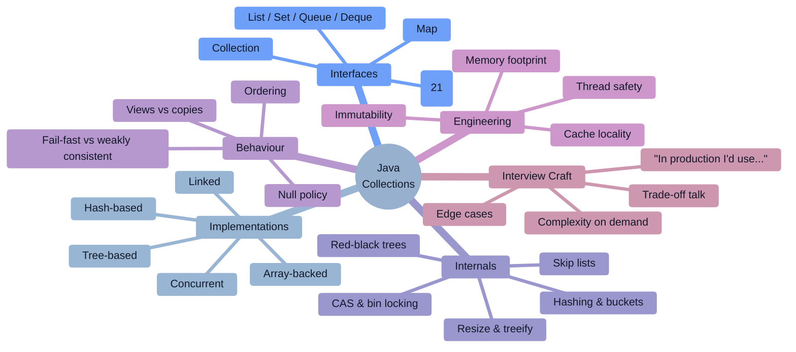

### Study strategy by company tier

| Tier | Companies | What they actually test | Time split |
|------|-----------|--------------------------|-----------|
| **FAANG / Big Tech** | Google, Meta, Amazon, Apple, Netflix, Microsoft | *Choosing the right structure under time pressure* during DSA. Collections trivia is rare; using `HashMap`/`Deque`/`PriorityQueue` fluently is everything. | 75% applied DSA, 15% internals, 10% concurrency |
| **High-bar product** | Stripe, Databricks, Snowflake, Uber, Airbnb, DoorDash, Coinbase, Cloudflare | Build a cache / index / dedup structure live; thread-safety; API design of a collection-like abstraction. | 40% applied, 30% internals, 30% concurrency & design |
| **Finance** | Goldman Sachs, JPMorgan, Bloomberg, Morgan Stanley | Deep internals + **memory footprint** + primitive collections + GC pressure + latency. Goldman literally wrote a collections library. | 25% DSA, 45% internals/memory, 30% concurrency |
| **Indian product** | Walmart Global Tech, Flipkart, Zomato, Swiggy, PhonePe, Razorpay | `HashMap`/`ConcurrentHashMap` internals recited in detail + Java 8 streams over collections + LLD. | 30% DSA, 45% internals, 25% LLD |
| **Service companies** | TCS, Infosys, Wipro, Accenture, Cognizant, Capgemini | Rapid-fire definitions and X-vs-Y tables. Speed and confidence beat depth. | 70% Q&A, 20% simple coding, 10% streams |

> [!TIP]
> **The single highest-leverage habit:** every time you name a collection, immediately state **(a) its complexity, (b) its ordering guarantee, (c) its thread-safety, and (d) why you rejected the alternative.** That four-part reflex is what turns "I'd use a HashMap" into a senior-sounding answer.

---

# 1. 🌱 Beginner Concepts

## 1.1 What is the Java Collections Framework?

The **Java Collections Framework (JCF)** is a unified architecture in `java.util` for representing and manipulating groups of objects. It has three parts:

1. **Interfaces** — abstract data types (`List`, `Set`, `Queue`, `Deque`, `Map`) that define *contracts*.
2. **Implementations** — concrete reusable data structures (`ArrayList`, `HashMap`, `TreeSet`, …).
3. **Algorithms** — polymorphic static methods (`Collections.sort`, `binarySearch`, `shuffle`, `reverse`).

It shipped in **Java 1.2 (1998)**, designed largely by **Joshua Bloch**, and was extended by **Doug Lea's `java.util.concurrent`** in Java 5.

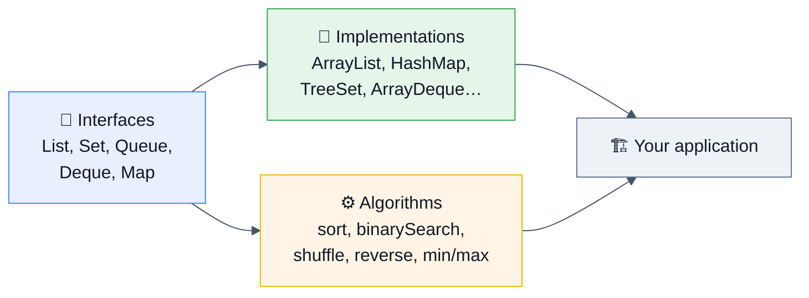

---

## 1.2 Why does it exist? (The problems it solved)

**Before Java 1.2** you had exactly four things: `Vector`, `Hashtable`, `Stack`, `Enumeration` — and arrays.

| Problem in the pre-JCF world | JCF's answer |
|---|---|
| No common type for "a bunch of things" — every API took `Vector` or `Object[]` | **`Collection` root interface** → polymorphic APIs |
| Everything was synchronized whether you needed it or not (`Vector`, `Hashtable`) | **Unsynchronized by default**, opt into thread-safety |
| No sorted, no ordered-by-insertion, no double-ended structures | `TreeMap`, `LinkedHashMap`, `Deque` |
| Every team wrote its own linked list / hash table with its own bugs | **One tested, tuned, documented implementation each** |
| Arrays are fixed-size, can't grow, can't be searched generically | **Resizable, generic, algorithm-friendly** |
| No way to write an algorithm once and run it on any container | **Interface-based algorithms** (`Collections.sort` works on any `List`) |
| Iteration was implementation-specific | **`Iterator`** — one protocol for all |

**Problems the JCF did NOT solve (be honest — this earns credibility):**
- ❌ **Primitives** — no `List<int>`; boxing costs ~4× memory and destroys cache locality (Project Valhalla is the eventual fix)
- ❌ **Immutability** was an afterthought until Java 9's `List.of` (`Collections.unmodifiableList` returns a *view*, not a copy)
- ❌ **`Map` isn't a `Collection`** — an inconsistency people still trip over
- ❌ **Optional operations** (`UnsupportedOperationException`) — an interface-design compromise Bloch himself has called a wart
- ❌ **No multimap / multiset / bimap / table** — you need Guava or Eclipse Collections
- ❌ Nullability policies are wildly inconsistent across implementations

---

## 1.3 Real-world analogies

| Concept | Analogy |
|---|---|
| **`List`** | A numbered shopping list. Order matters; duplicates allowed; you can say "item #3". |
| **`Set`** | A bag of unique guests at a party. No duplicates; nobody has a "position". |
| **`Map`** | A dictionary or phone book. Look up by key (word), get value (definition). |
| **`Queue`** | A queue at a ticket counter — FIFO, first in first served. |
| **`Deque`** | A double-sided cafeteria plate stack — add/remove at both ends. |
| **`ArrayList`** | A row of numbered lockers. Instant access to locker 42; inserting a locker in the middle means shifting everything. |
| **`LinkedList`** | A treasure hunt: each clue points to the next. Easy to splice a clue in; awful to find "the 500th clue". |
| **`HashMap`** | A library where a formula turns a book's title into a shelf number. Instant lookup — unless everyone's book maps to the same shelf. |
| **Hash collision** | Two books assigned the same shelf — you now scan that shelf (list), or the shelf gets its own mini-index (tree). |
| **Load factor** | "Refurbish the library once shelves are 75% full" — beyond that, collisions climb. |
| **`TreeMap`** | A physically alphabetized filing cabinet. Slower to insert, but "give me everything between K and P" is trivial. |
| **`LinkedHashMap`** | A dictionary that also remembers the order you looked words up — the basis of an LRU cache. |
| **`ConcurrentHashMap`** | A library with one librarian **per shelf** instead of one for the whole building. |
| **`CopyOnWriteArrayList`** | A printed newsletter: readers read their copy undisturbed; any edit prints a whole new edition. |
| **Fail-fast iterator** | A tour guide who aborts the tour if someone rearranges the museum mid-visit. |
| **View (`subList`, `keySet`)** | A window into a room — not a photograph. Change the room, the window shows it. |

---

## 1.4 The core interfaces at a glance

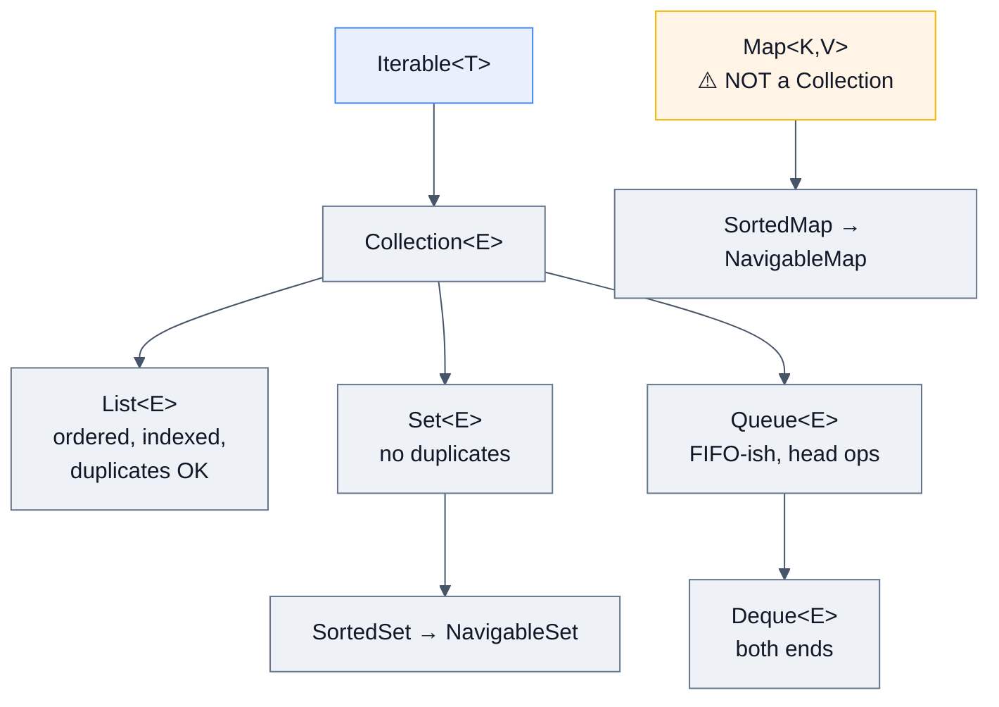

| Interface | Key contract | Core methods |
|---|---|---|
| `Iterable<T>` | Can be traversed with for-each | `iterator()`, `forEach()`, `spliterator()` |
| `Collection<E>` | A group of elements | `add`, `remove`, `contains`, `size`, `isEmpty`, `stream` |
| `List<E>` | **Ordered**, index-accessible, duplicates allowed | `get(i)`, `set(i,e)`, `add(i,e)`, `indexOf`, `subList`, `sort` |
| `Set<E>` | **No duplicates** (by `equals`) | inherits `Collection`; `add` returns `false` on duplicate |
| `SortedSet` / `NavigableSet` | Sorted; range and neighbour queries | `first`, `last`, `headSet`, `tailSet`, `ceiling`, `floor`, `higher`, `lower` |
| `Queue<E>` | Holds elements for processing, typically FIFO | `offer`/`add`, `poll`/`remove`, `peek`/`element` |
| `Deque<E>` | Double-ended queue; also *the* stack | `addFirst/Last`, `pollFirst/Last`, `peekFirst/Last`, `push`, `pop` |
| `Map<K,V>` | Key → value, unique keys | `put`, `get`, `containsKey`, `keySet`, `values`, `entrySet`, `getOrDefault`, `computeIfAbsent`, `merge` |
| `SortedMap` / `NavigableMap` | Keys sorted; range queries | `firstKey`, `subMap`, `ceilingEntry`, `floorKey`, `descendingMap` |
| 🆕 `SequencedCollection` (21) | Has a well-defined **encounter order** with a first and last | `getFirst`, `getLast`, `addFirst`, `addLast`, `removeFirst`, `removeLast`, `reversed()` |
| 🆕 `SequencedSet` / `SequencedMap` (21) | Sequenced + set/map semantics | `SequencedMap`: `firstEntry`, `lastEntry`, `putFirst`, `putLast`, `sequencedKeySet` |

> [!TIP]
> **Throwing vs returning variants** — a classic follow-up. `Queue` has pairs: `add`/`offer`, `remove`/`poll`, `element`/`peek`. The **first of each pair throws** on failure/empty; the **second returns `false`/`null`**. Use `offer`/`poll`/`peek` in bounded/concurrent code where failure is expected, and the throwing forms when failure is a bug.

---

## 1.5 Your first decisions

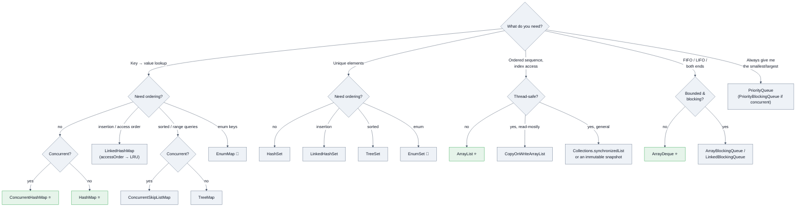

**The defaults you should reach for without thinking:** `ArrayList`, `HashMap`, `HashSet`, `ArrayDeque`, `ConcurrentHashMap`. Everything else needs a *reason*.

---

## 1.6 Common misconceptions (say the correction, win the round)

| ❌ Misconception | ✅ Reality |
|---|---|
| "`Map` extends `Collection`" | It does **not**. A map is a set of *mappings*; `add(E)` is meaningless for it. |
| "`HashMap` is O(1), guaranteed" | O(1) **amortized average**. Worst case is O(log n) since Java 8 (red-black tree bins); it was O(n) before. |
| "`LinkedList` is faster for insertions" | Only if you're *already at the position* with an iterator. Finding the position is O(n), and cache locality makes `ArrayList` win in almost every real benchmark. |
| "`ArrayList` is not synchronized, so use `Vector`" | Use `ArrayList` + explicit synchronization or a concurrent type. `Vector`'s per-method locking gives you no compound-operation safety anyway. |
| "`ConcurrentHashMap` makes my code thread-safe" | It makes *individual operations* atomic. `if (!map.containsKey(k)) map.put(k,v)` is still a race — use `putIfAbsent`/`computeIfAbsent`/`merge`. |
| "`Collections.synchronizedMap` == `ConcurrentHashMap`" | The former is one global mutex and **requires manual synchronization while iterating**; the latter locks per bin and iterates lock-free. |
| "`Collections.unmodifiableList` makes an immutable list" | It returns an **unmodifiable view**. Mutating the *backing* list changes what you see. Use `List.copyOf`. |
| "`List.of()` is just a nicer `Arrays.asList()`" | `List.of` is **truly immutable, rejects nulls**, and is memory-optimized. `Arrays.asList` is **fixed-size but mutable via `set`**, allows nulls, and **writes through to the backing array**. |
| "`HashSet` preserves insertion order" | No ordering guarantee at all. Use `LinkedHashSet`. (And `Set.of(...)` deliberately **randomizes iteration order per JVM run**.) |
| "`ConcurrentModificationException` only happens with threads" | Most CMEs are **single-threaded** — removing from a collection inside a for-each loop. |
| "Fail-fast iterators are a correctness guarantee" | The javadoc explicitly says they are **best-effort** and must not be relied on for correctness. |
| "`PriorityQueue` is sorted" | Only `peek()`/`poll()` respect order. **Iteration order is heap order, i.e. arbitrary.** `toString()` looks scrambled — a favourite gotcha. |
| "`TreeMap` uses `equals()`" | It uses **`compareTo`/`Comparator` only**. If those are inconsistent with `equals`, `TreeMap` and `HashMap` will disagree about what a duplicate is. |
| "`Stack` is the right class for a stack" | `Stack` extends `Vector` — legacy, synchronized, and it **iterates bottom-to-top**, which is the wrong order. Use `ArrayDeque`. |
| "Setting a big initial capacity is always good" | It wastes memory and hurts cache locality. Size it from the *expected* count: `new HashMap<>((int)(n/0.75f)+1)` — or `HashMap.newHashMap(n)` in Java 19+. |
| "Iterating a `HashMap` is O(n)" | It's O(n + capacity). A map that once held 1M entries and now holds 3 still iterates over 2M buckets — a real performance bug. |
| "Generics make collections type-safe at runtime" | Erasure means a raw-typed reference can poison a `List<String>` with an `Integer`; you get a `ClassCastException` later, far from the cause. |

---

# 2. ⚙️ Intermediate Concepts

## 2.1 The full hierarchy (memorize this diagram)

```mermaid
%%{init: {'theme':'base','themeVariables':{'background':'#ffffff','mainBkg':'#eef2f7','primaryColor':'#eef2f7','primaryTextColor':'#111827','primaryBorderColor':'#64748b','secondaryColor':'#e8f0fe','tertiaryColor':'#f1f5f9','lineColor':'#475569','textColor':'#111827','clusterBkg':'#f8fafc','clusterBorder':'#94a3b8','edgeLabelBackground':'#ffffff','titleColor':'#111827','actorBkg':'#eef2f7','actorTextColor':'#111827','actorBorder':'#64748b','actorLineColor':'#475569','signalColor':'#111827','signalTextColor':'#111827','noteBkgColor':'#fff4e5','noteTextColor':'#111827','noteBorderColor':'#d97706','labelBoxBkgColor':'#eef2f7','labelBoxBorderColor':'#64748b','labelTextColor':'#111827','loopTextColor':'#111827','altBackground':'#f8fafc'}}}%%
flowchart TB
    ITER["Iterable"] --> COLL["Collection"]

    COLL --> LIST["List"]
    COLL --> SET["Set"]
    COLL --> QUEUE["Queue"]

    LIST --> AL["ArrayList"]
    LIST --> LL["LinkedList"]
    LIST --> VEC["Vector → Stack (legacy)"]
    LIST --> COWL["CopyOnWriteArrayList"]
    LIST --> IL["List.of → ImmutableCollections"]

    SET --> HS["HashSet"]
    HS --> LHS["LinkedHashSet"]
    SET --> NS["SortedSet → NavigableSet"]
    NS --> TS["TreeSet"]
    NS --> CSLS["ConcurrentSkipListSet"]
    SET --> ES["EnumSet"]
    SET --> COWS["CopyOnWriteArraySet"]

    QUEUE --> DEQ["Deque"]
    QUEUE --> PQ["PriorityQueue"]
    QUEUE --> BQ["BlockingQueue"]
    QUEUE --> CLQ["ConcurrentLinkedQueue"]
    DEQ --> AD["ArrayDeque"]
    DEQ --> LL
    DEQ --> CLD["ConcurrentLinkedDeque"]
    DEQ --> BDQ["BlockingDeque → LinkedBlockingDeque"]
    BQ --> ABQ["ArrayBlockingQueue"]
    BQ --> LBQ["LinkedBlockingQueue"]
    BQ --> SQ["SynchronousQueue"]
    BQ --> PBQ["PriorityBlockingQueue"]
    BQ --> DQ["DelayQueue"]
    BQ --> LTQ["LinkedTransferQueue"]

    MAP["Map ⚠️ separate root"] --> HM["HashMap"]
    HM --> LHM["LinkedHashMap"]
    MAP --> NM["SortedMap → NavigableMap"]
    NM --> TM["TreeMap"]
    NM --> CSLM["ConcurrentSkipListMap"]
    MAP --> HT["Hashtable → Properties (legacy)"]
    MAP --> CHM["ConcurrentHashMap"]
    MAP --> EM["EnumMap"]
    MAP --> WHM["WeakHashMap"]
    MAP --> IHM["IdentityHashMap"]

    SEQ["🆕 SequencedCollection (21)"] -.-> LIST
    SEQ -.-> DEQ
    SEQ -.-> LHS
    SEQ -.-> NS
    SEQM["🆕 SequencedMap (21)"] -.-> LHM
    SEQM -.-> NM

    style MAP fill:#fff4e5,stroke:#f4b400,color:#111827
    style SEQ fill:#e8f0fe,stroke:#4285f4,color:#111827
    style SEQM fill:#e8f0fe,stroke:#4285f4,color:#111827
```

---

## 2.2 `ArrayList` internals

```java
transient Object[] elementData;    // the backing array (transient — custom serialization)
private int size;                  // number of elements, NOT elementData.length
private static final int DEFAULT_CAPACITY = 10;
```

**Lifecycle of a growing `ArrayList`:**

```mermaid
%%{init: {'theme':'base','themeVariables':{'background':'#ffffff','mainBkg':'#eef2f7','primaryColor':'#eef2f7','primaryTextColor':'#111827','primaryBorderColor':'#64748b','secondaryColor':'#e8f0fe','tertiaryColor':'#f1f5f9','lineColor':'#475569','textColor':'#111827','clusterBkg':'#f8fafc','clusterBorder':'#94a3b8','edgeLabelBackground':'#ffffff','titleColor':'#111827','actorBkg':'#eef2f7','actorTextColor':'#111827','actorBorder':'#64748b','actorLineColor':'#475569','signalColor':'#111827','signalTextColor':'#111827','noteBkgColor':'#fff4e5','noteTextColor':'#111827','noteBorderColor':'#d97706','labelBoxBkgColor':'#eef2f7','labelBoxBorderColor':'#64748b','labelTextColor':'#111827','loopTextColor':'#111827','altBackground':'#f8fafc'}}}%%
flowchart LR
    A["new ArrayList&lt;&gt;()<br/>elementData = shared EMPTY array<br/>capacity 0 — LAZY"] -->|"first add()"| B["capacity = 10"]
    B -->|"11th add()"| C["grow(): newCap = old + (old >> 1)<br/>= 15 → Arrays.copyOf"]
    C -->|"16th add()"| D["22 → 33 → 49 → 73 …<br/>(×1.5 each time)"]
    D -->|"trimToSize()"| E["capacity == size"]
    style A fill:#e8f0fe,stroke:#4285f4,color:#111827
    style C fill:#fff4e5,stroke:#f4b400,color:#111827
```

| Detail | Value / behaviour |
|---|---|
| Default capacity | **10**, allocated **lazily on first `add`** (a `new ArrayList<>()` allocates no backing array) |
| Growth | `newCapacity = oldCapacity + (oldCapacity >> 1)` → **~1.5×** (JDK 11+ routes through `ArraysSupport.newLength`) |
| Max capacity | ~`Integer.MAX_VALUE`; older JDKs used `MAX_ARRAY_SIZE = Integer.MAX_VALUE - 8` to leave room for array headers |
| `get(i)` / `set(i,e)` | **O(1)** — direct array index + bounds check |
| `add(e)` (append) | **O(1) amortized** (O(n) on the resize) |
| `add(i,e)` / `remove(i)` | **O(n)** — `System.arraycopy` shifts the tail |
| `contains` / `indexOf` | **O(n)** linear scan |
| `remove(Object)` | O(n) search + O(n) shift |
| Nulls | ✅ allowed, any number |
| Thread-safe | ❌ |
| Iterator | fail-fast via `modCount` |
| Serialization | `elementData` is `transient`; a custom `writeObject` writes only `size` elements (so an oversized backing array isn't serialized) |

> [!WARNING]
> **The `remove` overload trap** — asked constantly:
> ```java
> List<Integer> list = new ArrayList<>(List.of(10, 20, 30));
> list.remove(1);                      // removes INDEX 1 → [10, 30]      (remove(int))
> list.remove(Integer.valueOf(20));    // removes VALUE 20 → [10, 30]     (remove(Object))
> ```
> Overload resolution prefers the primitive `int` version. With a `List<Integer>` this silently does the wrong thing.

**`subList` is a view, not a copy** — and a genuine memory-leak source:
```java
List<String> huge = loadMillionRows();
List<String> firstTen = huge.subList(0, 10);   // ⚠️ holds a reference to `huge` — 1M rows stay alive
List<String> safe = List.copyOf(huge.subList(0, 10));  // ✅ independent copy
```
Structurally modifying the parent after creating a `subList` makes the sublist throw `ConcurrentModificationException`.

**`Arrays.asList` vs `List.of` vs `new ArrayList<>(…)`:**

| | `Arrays.asList(a,b)` | `List.of(a,b)` | `new ArrayList<>(...)` |
|---|---|---|---|
| Mutable | fixed-size; `set` ✅, `add`/`remove` ❌ | ❌ fully immutable | ✅ |
| Nulls | ✅ | ❌ `NullPointerException` | ✅ |
| Backed by | the **caller's array** (writes through!) | private, optimized layout | own array |
| Since | 1.2 | 9 |1.2 |
| Gotcha | `Arrays.asList(new int[]{1,2,3})` → **`List<int[]>` of size 1**, not `List<Integer>` | duplicate elements are fine in `List.of` but **throw in `Set.of`/`Map.of`** | — |

> [!TIP]
> **`toArray(new T[0])` is faster than `toArray(new T[size])`** — counterintuitive, and a great flex. The zero-length version lets the JVM allocate a correctly-sized array without pre-zeroing it, and it's an intrinsic-friendly path. Aleksey Shipilëv's *"Arrays of Wisdom of the Ancients"* is the canonical reference.

---

## 2.3 `LinkedList` internals

```java
private static class Node<E> { E item; Node<E> next; Node<E> prev; }
transient Node<E> first, last;
transient int size;
```

- Implements **both `List` and `Deque`** — that's its actual justification for existing.
- `get(i)` is O(n) but **optimized**: it walks from whichever end is closer (`if (index < (size >> 1))`).
- **Memory cost:** each node is a separate heap object — a 12-byte header plus three references. With compressed oops that's ~24 bytes *per element* of pure overhead (~40 bytes without), versus **4 bytes per slot** in `ArrayList`. Plus every node is a potential cache miss.

> [!WARNING]
> **The O(n²) trap:**
> ```java
> for (int i = 0; i < linkedList.size(); i++) sum += linkedList.get(i);  // 💥 O(n²)
> for (int x : linkedList) sum += x;                                     // ✅ O(n) via iterator
> ```

**Interview verdict:** *"`LinkedList` wins only when you're inserting/removing at a position you already hold an iterator for, and even then `ArrayList`'s `System.arraycopy` (which is a vectorized intrinsic) usually wins up to surprisingly large sizes. For queue/deque semantics use `ArrayDeque`. In 15 years I've never needed `LinkedList` in production."* — that's the answer interviewers are hoping for.

---

## 2.4 `ArrayDeque` internals

```java
transient Object[] elements;
transient int head;      // index of the first element
transient int tail;      // index one past the last element
```

A **circular (ring) buffer**. Both ends are O(1) with no shifting — `head` and `tail` wrap around.

| Detail | Behaviour |
|---|---|
| Default capacity | 16 |
| Growth | JDK 8: capacity was a **power of two** and doubled (so `index & (n-1)` masking worked). **JDK 11+ rewrote it** — the power-of-two constraint was removed; it now grows by roughly 2× while small (< 64) and ~1.5× beyond |
| `addFirst`/`addLast`/`pollFirst`/`pollLast` | **O(1)** amortized |
| `contains`/`remove(Object)` | O(n) |
| Nulls | ❌ **not permitted** — because `null` is the sentinel that `poll()`/`peek()` return for "empty" |
| Thread-safe | ❌ (use `ConcurrentLinkedDeque` or `LinkedBlockingDeque`) |
| Index access | ❌ not a `List` |

> [!TIP]
> **`ArrayDeque` is the right answer for both stacks and queues.** Faster than `LinkedList` (contiguous memory, no per-node allocation) and faster than `Stack` (no synchronization, correct iteration order). Say *"`ArrayDeque` as a stack, not `Stack`"* and you've signalled modern Java.

---

## 2.5 `PriorityQueue` internals

A **binary min-heap in an array** — `queue[0]` is the smallest; children of `i` are at `2i+1` and `2i+2`.

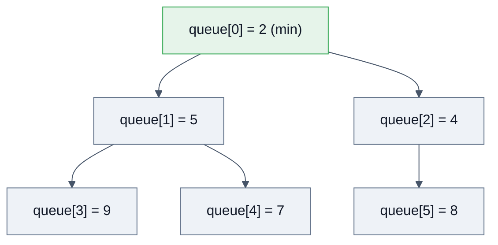

| Operation | Complexity | Note |
|---|---|---|
| `peek()` | **O(1)** | root |
| `offer()` / `add()` | **O(log n)** | sift-up |
| `poll()` | **O(log n)** | swap root with last, sift-down |
| `remove(Object)` | **O(n)** | linear search, then sift |
| `contains(Object)` | O(n) | |
| Heapify from a collection | O(n) | `PriorityQueue(Collection)` uses bottom-up `heapify` |

- Default initial capacity **11**; growth: `oldCapacity + (oldCapacity < 64 ? oldCapacity + 2 : oldCapacity >> 1)` — roughly double while small, 1.5× when large.
- **Unbounded** (grows) — never blocks. `PriorityBlockingQueue` is the concurrent version and also never blocks on `put`, only on `take`.
- Nulls ❌. Non-comparable elements without a `Comparator` → `ClassCastException` **on the second insert** (the first insert never compares).
- **Not stable** — equal-priority elements have no guaranteed order. Fix by making the comparator include a monotonically increasing sequence number.

> [!WARNING]
> **Iteration order is heap order, not sorted order.** `System.out.println(pq)` prints something like `[2, 5, 4, 9, 7, 8]`. To drain in sorted order you must `poll()` repeatedly (which is destructive) — an extremely common "gotcha" question.

**Max-heap:** `new PriorityQueue<>(Comparator.reverseOrder())` or `Comparator.comparingInt(X::score).reversed()`.

---

## 2.6 🔥 `HashMap` internals — the #1 interview topic

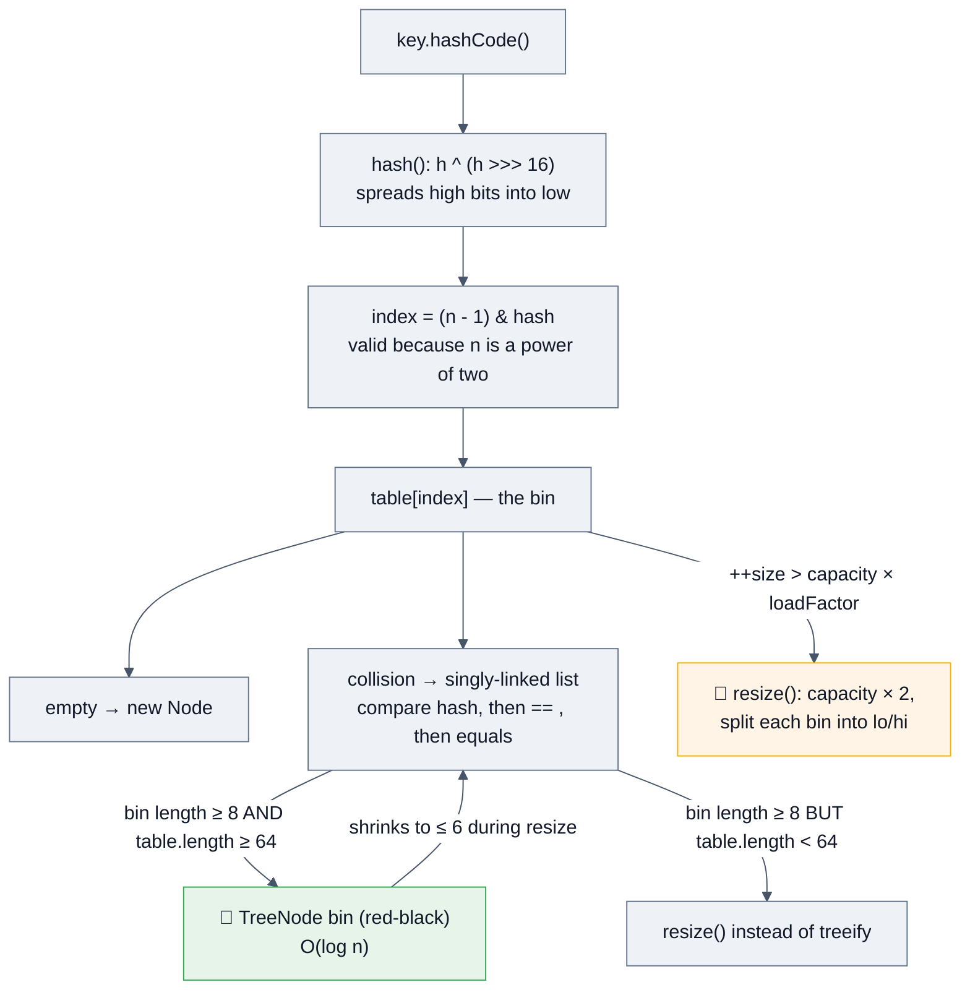

### The constants (recite these)

| Constant | Value | Why it is what it is |
|---|---|---|
| `DEFAULT_INITIAL_CAPACITY` | **16** | power of two, small enough not to waste memory |
| `DEFAULT_LOAD_FACTOR` | **0.75f** | the space/time sweet spot. The JDK javadoc justifies it with a **Poisson distribution**: with a good hash and load factor 0.75, P(a bin has 8 entries) ≈ 6×10⁻⁸ |
| `TREEIFY_THRESHOLD` | **8** | at this bin length, list → red-black tree |
| `UNTREEIFY_THRESHOLD` | **6** | tree → list. The gap from 8 provides **hysteresis** so a bin hovering at the boundary doesn't thrash |
| `MIN_TREEIFY_CAPACITY` | **64** | below this, a long bin means the *table* is too small, not that the hash is bad → **resize instead** |
| `MAXIMUM_CAPACITY` | `1 << 30` | |

### The `Node`

```java
static class Node<K,V> implements Map.Entry<K,V> {
    final int hash;      // cached! never recomputed
    final K key;
    V value;
    Node<K,V> next;      // chain within the bin
}
```
Caching the hash means a resize never calls `hashCode()` again, and lookups compare cheap `int`s before ever calling `equals`.

### Why `hash = h ^ (h >>> 16)`?

Indexing uses only the **low** bits (`(n-1) & hash`). With a 16-bucket table only the bottom 4 bits matter. Keys whose hash codes differ only in the *high* bits would all collide. XOR-ing the top 16 bits down mixes them in — one cheap instruction that dramatically improves real-world hash distributions (`Float.hashCode`, sequential IDs shifted left, etc.).

### Why must capacity be a power of two?

1. `hash % n` becomes `hash & (n-1)` — one AND instead of an integer division (~20–40× cheaper).
2. **Resize is nearly free:** when capacity doubles, an entry either stays at index `i` or moves to `i + oldCap`, decided by a **single bit test**: `(e.hash & oldCap) == 0`. Java 8 exploits this to split each bin into a "lo" and "hi" list in one pass, preserving relative order.

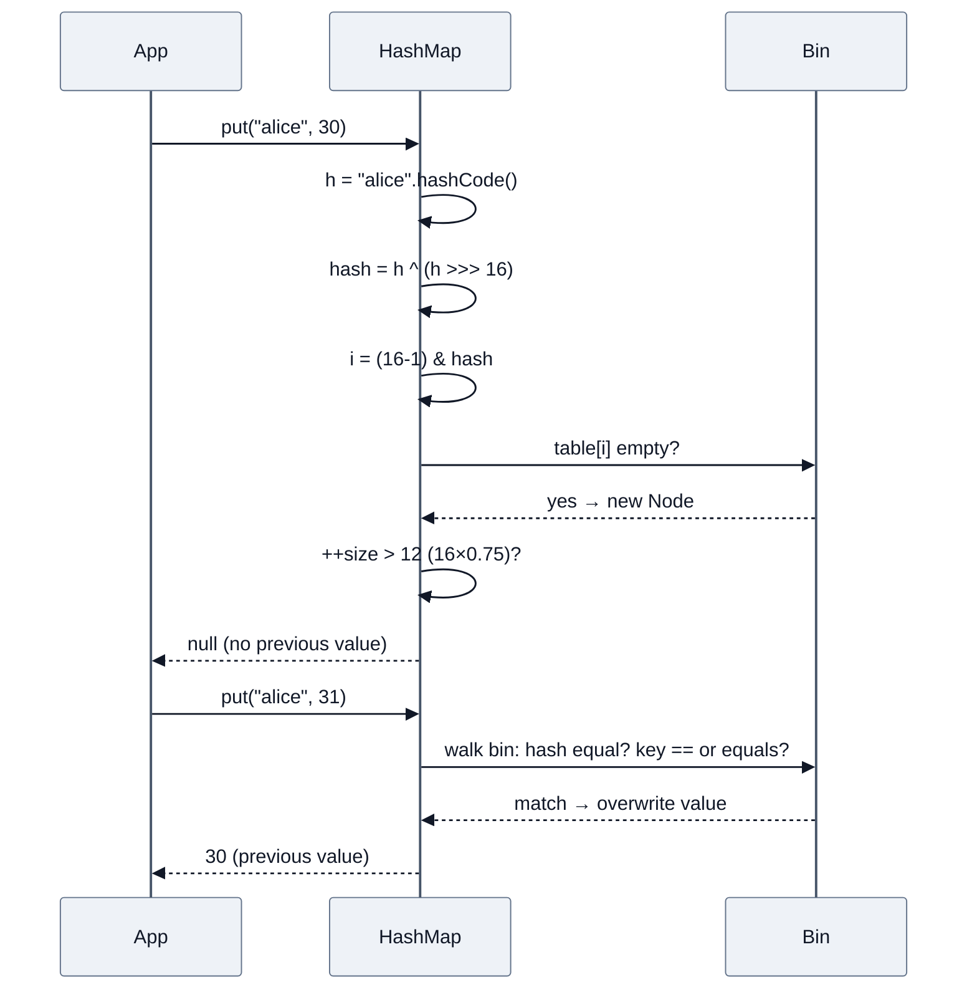

### Java 7 vs Java 8 — must-know differences

| | Java 7 | Java 8+ |
|---|---|---|
| Bin structure | linked list only | list → **red-black tree** at 8 |
| Worst-case lookup | **O(n)** | **O(log n)** |
| Insert position in a bin | **head** (prepend) | **tail** (append) |
| Resize transfer | reversed order → **infinite loop** possible under concurrent resize | order-preserving lo/hi split → no cycle |
| Hash function | four shift/xor rounds | single `h ^ (h >>> 16)` |
| Entry class | `Entry` | `Node` / `TreeNode` |

> [!WARNING]
> **The famous Java 7 incident:** a `HashMap` shared between threads could, during a concurrent `resize()`, build a **circular linked list** — after which any `get()` on that bin spins at 100% CPU forever. Java 8 removed the cycle, but **`HashMap` is still not thread-safe**: you can lose updates, read stale values, and even see a `null` for a key you just inserted.

### Tree bin ordering

Inside a treeified bin, nodes are ordered by hash; on hash ties the key's `Comparable` ordering is used if the class implements it; otherwise a deterministic tie-break on class name and `System.identityHashCode` keeps the tree valid. This is why **`String` keys benefit most from treeification** — a mitigation for hash-flooding attacks (§10).

### Null policy
`HashMap` allows **one null key** (it's forced into bucket 0 with hash 0) and **any number of null values**.

### Sizing it correctly

```java
// ❌ new HashMap<>(1000) does NOT hold 1000 without resizing (1000 × 0.75 = 750 threshold)
Map<K,V> m = new HashMap<>((int) (expected / 0.75f) + 1);   // pre-Java 19
Map<K,V> m2 = HashMap.newHashMap(expected);                 // ✅ Java 19+ — does the math for you
```

---

## 2.7 `LinkedHashMap` — and the 5-line LRU cache

`LinkedHashMap extends HashMap` and adds a **doubly-linked list threaded through all entries**:

```java
static class Entry<K,V> extends HashMap.Node<K,V> { Entry<K,V> before, after; }
transient LinkedHashMap.Entry<K,V> head, tail;
final boolean accessOrder;   // false = insertion order (default), true = access order
```

It hooks into `HashMap`'s protected callbacks: `afterNodeAccess`, `afterNodeInsertion`, `afterNodeRemoval`.

```java
// ⭐ The canonical LRU cache — write this from memory
class LruCache<K,V> extends LinkedHashMap<K,V> {
    private final int capacity;
    LruCache(int capacity) {
        super(16, 0.75f, true);              // accessOrder = true
        this.capacity = capacity;
    }
    @Override protected boolean removeEldestEntry(Map.Entry<K,V> eldest) {
        return size() > capacity;
    }
}
```

- Predictable iteration order at the cost of **2 extra references per entry**.
- With `accessOrder = true`, a **`get()` is a structural modification** for iteration purposes → iterating while calling `get` throws `ConcurrentModificationException`. A wonderful follow-up question.
- 🆕 Java 21: `LinkedHashMap` implements `SequencedMap` → `firstEntry()`, `lastEntry()`, `putFirst`, `putLast`, `reversed()`.

---

## 2.8 `TreeMap` / `TreeSet` internals

A **red-black tree** (self-balancing BST) implementing `NavigableMap`.

| Property | Detail |
|---|---|
| `get`/`put`/`remove`/`containsKey` | **O(log n)** guaranteed |
| Ordering | natural (`Comparable`) or a supplied `Comparator` |
| Null keys | ❌ `NullPointerException` (natural ordering); a null-tolerant comparator can allow it |
| Balance invariants | root black; no two consecutive reds; every root→leaf path has the same black height ⇒ height ≤ 2·log₂(n+1) |
| Thread-safe | ❌ (use `ConcurrentSkipListMap`) |
| `TreeSet` | literally a `TreeMap` with a shared dummy value |

**The `NavigableMap` API is where `TreeMap` earns its place** — memorize these:

```java
TreeMap<Integer,String> m = new TreeMap<>();
m.firstKey(); m.lastKey();                    // extremes
m.floorKey(50);    // greatest key ≤ 50
m.ceilingKey(50);  // smallest key ≥ 50
m.lowerKey(50);    // greatest key <  50   (strict)
m.higherKey(50);   // smallest key >  50   (strict)
m.headMap(50, true);  m.tailMap(50);  m.subMap(10, true, 50, false);   // range VIEWS
m.descendingMap();  m.navigableKeySet();  m.descendingKeySet();
m.pollFirstEntry();  m.pollLastEntry();        // atomic-ish remove+return
```

> [!WARNING]
> **`TreeMap` uses `compareTo`, never `equals`.** If your comparator says two objects are equal, `TreeMap` treats them as the *same key* even if `equals` disagrees. Canonical example: `new BigDecimal("1.0").equals(new BigDecimal("1.00"))` is `false`, but `compareTo` returns `0` — so a `HashSet` keeps both and a `TreeSet` keeps one. The `SortedMap` javadoc calls this being "inconsistent with equals" and warns that the map is then "well-defined but violates the general `Map` contract."

---

## 2.9 `HashSet` / `LinkedHashSet` / `TreeSet` / `EnumSet`

```java
// HashSet is literally a HashMap with a shared dummy value
private transient HashMap<E,Object> map;
private static final Object PRESENT = new Object();
public boolean add(E e) { return map.put(e, PRESENT) == null; }
```

- `LinkedHashSet extends HashSet` and calls a package-private `HashSet` constructor that builds a `LinkedHashMap` instead.
- `TreeSet` wraps a `TreeMap`.

### `EnumSet` — the collection interviewers love and candidates forget

`EnumSet` is **abstract** with two package-private implementations, chosen by the enum's **universe size** (number of constants), not by how many you store:

| Implementation | Universe size | Backing |
|---|---|---|
| `RegularEnumSet` | **≤ 64** | a **single `long`** used as a bit vector — the *i*-th constant is bit *i* |
| `JumboEnumSet` | **> 64** | a `long[]` bit vector |

Every operation (`add`, `contains`, `union` via `addAll`, `complementOf`) is a **bitwise arithmetic operation** — constant time, no hashing, no allocation per element.

```java
EnumSet<Day> weekend  = EnumSet.of(Day.SAT, Day.SUN);
EnumSet<Day> weekdays = EnumSet.complementOf(weekend);
EnumSet<Day> all      = EnumSet.allOf(Day.class);
EnumSet<Day> none     = EnumSet.noneOf(Day.class);
EnumSet<Day> range    = EnumSet.range(Day.MON, Day.WED);
```

**`EnumMap`** is the same idea for maps: a plain `Object[]` indexed by `ordinal()`. No hashing, no collisions, iteration in **natural enum order**, and dramatically less memory than a `HashMap`. *Effective Java* Item 37: "never use `ordinal()` to index an array — use `EnumMap`."

---

## 2.10 Special-purpose maps

| Map | Key comparison | Special behaviour | Use case |
|---|---|---|---|
| **`WeakHashMap`** | `equals` | Keys held by **weak references**; entries vanish once the key is otherwise unreachable. Stale entries are purged via a `ReferenceQueue` during subsequent operations | Canonicalizing caches, metadata keyed by class/object without preventing GC |
| **`IdentityHashMap`** | **`==`** (reference identity), `System.identityHashCode` | Uses **linear probing** in a single array with alternating key/value slots (not chaining!) | Serialization graphs, topology-preserving deep copy, proxy bookkeeping |
| **`Hashtable`** | `equals` | Every method `synchronized`; **no null key or value**; `Enumeration` is not fail-fast | Legacy only — `Properties` extends it |
| **`Properties`** | `equals` | `Hashtable<Object,Object>` with `String` conventions + `load`/`store` | Config files (its `Object`-typed API is a design wart) |
| **`ConcurrentSkipListMap`** | `compareTo` | **Lock-free skip list**, sorted, `ConcurrentNavigableMap`, weakly consistent iterators, `size()` is **O(n)** | Concurrent sorted indexes — Cassandra memtables, Kafka log segment index |

**Skip list in one picture** — the concurrent alternative to a red-black tree, because balancing rotations are hard to do lock-free but a probabilistic multi-level linked list is CAS-friendly:

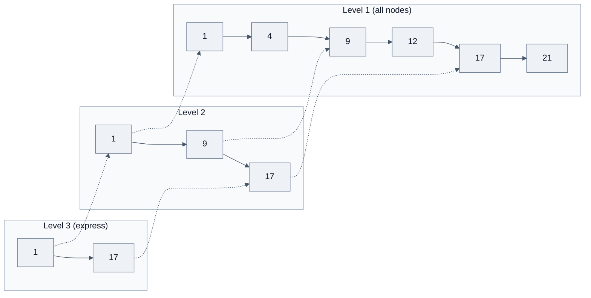

---

## 2.11 ⚡ `ConcurrentHashMap` internals

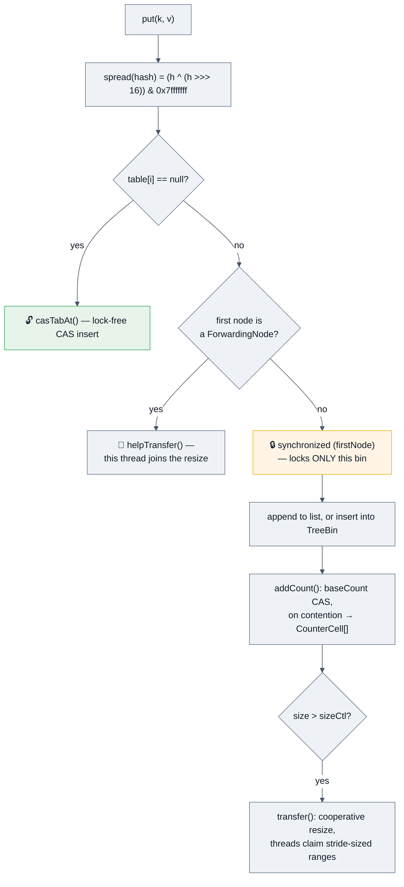

| | Java 7 | Java 8+ |
|---|---|---|
| Structure | `Segment[]` (each a `ReentrantLock` + its own table), default 16 segments | **No segments.** One `Node[] table` |
| Locking | Lock the whole segment | **CAS** on an empty bin, `synchronized` on the bin's **first node** otherwise |
| Effective concurrency | `concurrencyLevel` (fixed at construction) | **≈ number of bins** — scales with the table |
| Resize | Per segment | **Cooperative**: a resizing thread installs `ForwardingNode`s; other threads that hit one **help transfer** a stride of bins |
| `size()` | Lock-free retry, then lock all segments | `baseCount` + striped `CounterCell[]` (`LongAdder` design); `mappingCount()` returns `long` |
| Reads | Volatile reads | Volatile reads, **fully lock-free** |
| Tree bins | ❌ | ✅ (with a `TreeBin` holding its own lock so readers can still traverse) |

**Key facts to state:**
- **No `null` keys and no `null` values, ever.** Doug Lea's reason: in a concurrent map you cannot atomically disambiguate "absent" from "mapped to null" — `containsKey` + `get` isn't atomic, so the ambiguity would be unresolvable. `HashMap` gets away with it because you can check single-threadedly.
- **Iterators are weakly consistent** — they never throw `ConcurrentModificationException`, reflect the state at some point at or after creation, and may or may not show concurrent updates.
- **`size()` is an estimate** in the presence of concurrent updates. So is `isEmpty()`. Don't build logic on them.
- **Atomic compound operations** are the whole point: `putIfAbsent`, `computeIfAbsent`, `computeIfPresent`, `compute`, `merge`, `getOrDefault`, `replace(k, old, new)`.
- **Bulk parallel ops** (Java 8): `forEach`, `search`, `reduce` and their key/value/entry variants, each taking a `parallelismThreshold`.

```java
// ✅ Atomic counter — no lock, no read-modify-write race
counts.merge(word, 1L, Long::sum);

// ✅ Atomic lazy initialization
Connection c = pool.computeIfAbsent(host, this::openConnection);

// ✅ Atomic compare-and-set of a value
map.replace(key, expectedOld, newValue);
```

> [!WARNING]
> **`computeIfAbsent` deadlock** — a real, subtle production bug. The mapping function runs **while the bin is locked**. If it (directly or transitively) updates the *same* `ConcurrentHashMap`, you can deadlock or corrupt state. In `HashMap`, recursive modification inside `computeIfAbsent` throws `ConcurrentModificationException` (Java 9+ added the detection). **Rule: the mapping function must be short, side-effect-free, and must not touch the map.**

---

## 2.12 Concurrent lists, sets and queues

### `CopyOnWriteArrayList` / `CopyOnWriteArraySet`

```java
public boolean add(E e) {
    synchronized (lock) {                                  // a single write lock
        Object[] es = getArray();
        es = Arrays.copyOf(es, es.length + 1);             // ⚠️ FULL ARRAY COPY per write
        es[es.length - 1] = e;
        setArray(es);                                      // volatile write — publishes atomically
    }
    return true;
}
```
- **Reads are completely lock-free** and never block — they read a `volatile` array reference.
- Iterators operate on an immutable **snapshot** → never throw CME, but **never see later updates**, and `iterator.remove()`/`set` throw `UnsupportedOperationException`.
- **Writes are O(n)** and allocate. Use only when reads vastly outnumber writes and the collection is small — **event listener lists** are the textbook case.
- `CopyOnWriteArraySet` is a `CopyOnWriteArrayList` with an O(n) `contains` check per add → O(n²) to build. Fine for 20 listeners, catastrophic for 20,000 elements.

### BlockingQueues (the backbone of every thread pool)

| Queue | Bounded | Locking | Notes |
|---|---|---|---|
| `ArrayBlockingQueue` | ✅ always | **one** `ReentrantLock` + `notEmpty`/`notFull` conditions | Ring buffer, no per-element node allocation → lower GC. Optional fairness |
| `LinkedBlockingQueue` | optional (**defaults to `Integer.MAX_VALUE` — effectively unbounded ⚠️**) | **two** locks (`putLock`, `takeLock`) | Higher throughput under contention; allocates a node per element |
| `SynchronousQueue` | capacity **zero** | CAS-based `TransferStack`/`TransferQueue` | Direct hand-off; `put` blocks until a `take` arrives. Used by `newCachedThreadPool` |
| `PriorityBlockingQueue` | unbounded | one lock | Heap-ordered; `put` never blocks; `take` blocks when empty |
| `DelayQueue` | unbounded | one lock | Elements implement `Delayed`; only released when their delay expires. Basis of `ScheduledThreadPoolExecutor` |
| `LinkedTransferQueue` | unbounded | lock-free (dual queue) | Adds `transfer(e)` — block until a consumer takes it |
| `ConcurrentLinkedQueue` | unbounded | **lock-free** (Michael–Scott algorithm) | Non-blocking; `size()` is **O(n)** and only an estimate |

> [!WARNING]
> **`Executors.newFixedThreadPool(n)` uses an unbounded `LinkedBlockingQueue`.** Under a traffic spike the queue grows until `OutOfMemoryError`, and `maximumPoolSize` is never reached. Alibaba's public Java coding guidelines **ban the `Executors.*` factory methods** for exactly this reason. Always construct a `ThreadPoolExecutor` with an explicitly bounded queue and a rejection policy.

---

## 2.13 Iteration: `Iterator`, `ListIterator`, `Spliterator`

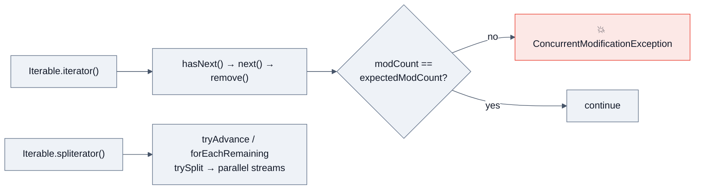

| | `Iterator` | `ListIterator` | `Spliterator` (Java 8) |
|---|---|---|---|
| Direction | forward only | **bidirectional** | forward, splittable |
| Mutation | `remove()` | `remove`, `set`, `add` | ❌ read-only traversal |
| Index | ❌ | `nextIndex`, `previousIndex` | ❌ |
| Applies to | any `Collection` | `List` only | any `Collection` |
| Purpose | sequential traversal | in-place list editing | **parallel decomposition for streams** |

**`Spliterator` characteristics** (a genuinely senior-level topic): `ORDERED`, `DISTINCT`, `SORTED`, `SIZED`, `SUBSIZED`, `NONNULL`, `IMMUTABLE`, `CONCURRENT`. These are how the streams engine optimizes — e.g. `SIZED` + `SUBSIZED` lets `ArrayList` split evenly in O(1), which is why `ArrayList.parallelStream()` is fast and `LinkedList.parallelStream()` is not (it can only split by consuming).

**Three correct ways to remove during iteration:**
```java
list.removeIf(x -> x.isExpired());                        // ✅ cleanest (Java 8)
Iterator<X> it = list.iterator();
while (it.hasNext()) if (it.next().isExpired()) it.remove();  // ✅ classic
List<X> keep = list.stream().filter(x -> !x.isExpired()).toList();  // ✅ rebuild
```

---

## 2.14 The `Collections` utility class

| Category | Methods |
|---|---|
| **Ordering** | `sort`, `sort(list, cmp)`, `reverse`, `shuffle`, `swap`, `rotate` |
| **Searching** | `binarySearch` (list **must** be sorted), `min`, `max`, `indexOfSubList` |
| **Wrappers** | `unmodifiableXxx` (**view**), `synchronizedXxx` (**mutex wrapper**), `checkedXxx` (runtime type enforcement — great for debugging heap pollution) |
| **Factories** | `emptyList`, `singletonList`, `nCopies`, `newSetFromMap`, `asLifoQueue` |
| **Bulk** | `addAll`, `fill`, `replaceAll`, `frequency`, `disjoint` |

> [!TIP]
> **`Collections.newSetFromMap(new ConcurrentHashMap<>())`** is how you get a **concurrent `HashSet`** — there is no `ConcurrentHashSet` class. Also: `ConcurrentHashMap.newKeySet()` does the same thing more directly. Knowing this answers "how do you make a thread-safe Set?" properly.

```java
// ⚠️ synchronizedMap requires MANUAL synchronization while iterating
Map<K,V> m = Collections.synchronizedMap(new HashMap<>());
synchronized (m) {                          // ← required, and easy to forget
    for (K k : m.keySet()) { ... }
}
```

---

## 2.15 Sorting: what actually runs

| Input | Algorithm | Why |
|---|---|---|
| `Arrays.sort(int[])` and other **primitives** | **Dual-Pivot Quicksort** (Yaroslavskiy) | In-place, no stability concept for primitives, excellent cache behaviour. O(n log n) average, O(n²) worst (adversarial) |
| `Arrays.sort(Object[])`, `Collections.sort`, `List.sort` | **TimSort** | **Stable** (required by the spec for objects, since identity matters), adaptive — exploits existing runs, O(n) on nearly-sorted data, guaranteed O(n log n), needs O(n) extra space |
| `Arrays.parallelSort` | Parallel merge sort on the common `ForkJoinPool` | Worth it above ~8k elements |

`Collections.sort(list)` delegates to `list.sort(null)` → `Arrays.sort` on `toArray()` → writes back through a `ListIterator`.

> [!WARNING]
> **`IllegalArgumentException: Comparison method violates its general contract!`** is thrown by TimSort when your comparator isn't transitive/consistent. The usual culprits:
> ```java
> (a, b) -> a.value - b.value          // ❌ int overflow when values straddle MIN/MAX
> (a, b) -> Integer.compare(a.v, b.v)  // ✅
> Comparator.comparingInt(X::v)        // ✅ best
> ```
> Also: `Double.compare` handles `NaN` and `-0.0`; raw subtraction does not.

---

## 2.16 Immutable & unmodifiable collections

```java
List<String> a = Collections.unmodifiableList(mutable);  // VIEW — changes to `mutable` show through
List<String> b = List.copyOf(mutable);                   // ✅ independent immutable copy (Java 10)
List<String> c = List.of("x", "y");                      // ✅ immutable, no nulls (Java 9)
Set<String>  d = Set.of("x", "y");                       // ⚠️ duplicates → IllegalArgumentException
Map<String,Integer> e = Map.of("a",1,"b",2);             // up to 10 pairs
Map<String,Integer> f = Map.ofEntries(Map.entry("a",1)); // unlimited
List<String> g = stream.toList();                        // Java 16 — unmodifiable, ALLOWS nulls
List<String> h = stream.collect(Collectors.toUnmodifiableList()); // rejects nulls
```

| | `Collections.unmodifiableList` | `List.of` / `List.copyOf` |
|---|---|---|
| Independent of source | ❌ **view** | ✅ copy |
| Nulls | ✅ allowed | ❌ NPE |
| Memory | wrapper + original | compact specialized classes (`List12`, `ListN`) |
| Since | 1.2 | 9 / 10 |
| `copyOf` on an already-immutable list | n/a | returns the **same instance** (no copy) |

> [!TIP]
> **`Set.of(...)` and `Map.of(...)` deliberately randomize iteration order on every JVM run** using a per-JVM `SALT`. This is intentional — it stops code from accidentally depending on an unspecified order. If a test passes locally and fails in CI on ordering, this is very often why. Excellent, memorable trivia.

---

## 2.17 🆕 Sequenced Collections (Java 21, JEP 431)

Before Java 21 there was no common supertype for "collections with a defined encounter order," so `list.get(0)`, `deque.peekFirst()`, `sortedSet.first()`, and `linkedHashMap.entrySet().iterator().next()` were four different idioms for the same idea — and **getting the *last* element of a `LinkedHashSet` required iterating the whole thing**.

```java
// The new uniform API
SequencedCollection<E>  : addFirst, addLast, getFirst, getLast, removeFirst, removeLast, reversed()
SequencedSet<E>         : SequencedCollection + Set, reversed() returns SequencedSet
SequencedMap<K,V>       : putFirst, putLast, firstEntry, lastEntry, pollFirstEntry, pollLastEntry,
                          sequencedKeySet, sequencedValues, sequencedEntrySet, reversed()
```

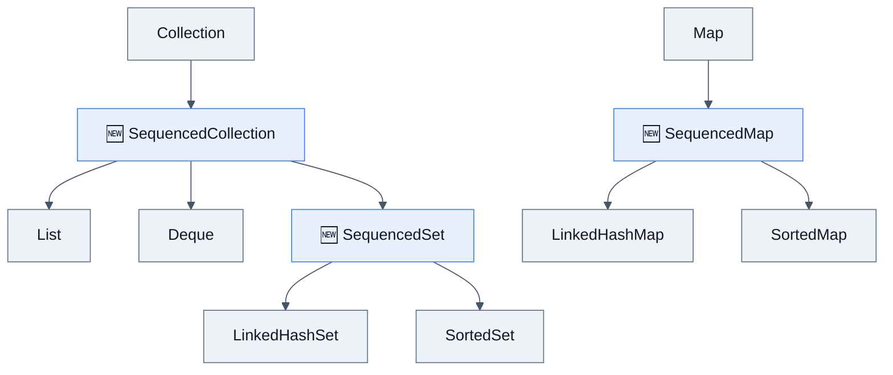

```java
var list = new ArrayList<>(List.of(1, 2, 3));
list.getFirst();          // 1   — was list.get(0)
list.getLast();           // 3   — was list.get(list.size()-1)
list.reversed();          // [3, 2, 1] — a VIEW, writes through
list.addFirst(0);         // [0, 1, 2, 3]

var lhs = new LinkedHashSet<>(List.of("a","b","c"));
lhs.getLast();            // "c" — previously required a full iteration!

var lhm = new LinkedHashMap<String,Integer>();
lhm.putFirst("newest", 1);
lhm.firstEntry(); lhm.pollLastEntry();
```

**Key points:** `reversed()` returns a **view**, not a copy — modifications write through in both directions. `SortedSet`/`SortedMap` inherit these, so `TreeMap.reversed()` is now the idiomatic `descendingMap()`. Note the one real-world friction: `List` gaining `reversed()` and `getFirst()` was a **source-compatibility hazard** for third-party classes that already defined incompatible methods with those names.

---

# 3. 🚀 Advanced Concepts

## 3.1 Complexity & memory: the table seniors are expected to know cold

| Structure | get / contains | add / put | remove | Ordered? | Nulls | ~Bytes per element (64-bit, compressed oops) |
|---|---|---|---|---|---|---|
| `ArrayList` | O(1) index / O(n) search | O(1)* | O(n) | insertion | ✅ | **4** (reference) + the element |
| `LinkedList` | O(n) | O(1) at ends | O(1) with iterator | insertion | ✅ | **~24** (node header + 3 refs) + element |
| `ArrayDeque` | O(1) ends | O(1)* | O(1) ends | insertion | ❌ | **4** + element |
| `HashMap` | O(1) avg / O(log n) worst | O(1) avg | O(1) avg | none | 1 key, N values | **~32** per `Node` + ~4–8 table slot |
| `LinkedHashMap` | O(1) | O(1) | O(1) | insertion or **access** | ✅ | ~32 + **8** (before/after refs) |
| `TreeMap` | O(log n) | O(log n) | O(log n) | **sorted** | ❌ key | **~40** per `Entry` (key, value, left, right, parent, color) |
| `HashSet` | O(1) | O(1) | O(1) | none | 1 | same as `HashMap` (shares the dummy value) |
| `TreeSet` | O(log n) | O(log n) | O(log n) | sorted | ❌ | same as `TreeMap` |
| `PriorityQueue` | O(1) peek / O(n) contains | O(log n) | O(log n) poll | heap (**not** iteration) | ❌ | **4** + element |
| `EnumMap` | O(1) | O(1) | O(1) | enum ordinal | ❌ key | **4** (plain array slot) |
| `EnumSet` | O(1) | O(1) | O(1) | enum ordinal | ❌ | **1 bit** 🚀 |
| `ConcurrentHashMap` | O(1) | O(1) | O(1) | none | ❌ both | ~32 + counter cells |
| `ConcurrentSkipListMap` | O(log n) | O(log n) | O(log n) | sorted | ❌ | ~40 + index nodes (~1.33 levels avg) |
| `CopyOnWriteArrayList` | O(1) | **O(n)** | O(n) | insertion | ✅ | 4, but ×2 transiently per write |

> [!TIP]
> **The memory answer that impresses finance/low-latency interviewers:** *"A `HashMap<Integer,Integer>` with 1M entries costs roughly 32 bytes per `Node`, plus ~2M table slots at 4 bytes, plus **two boxed `Integer` objects at 16 bytes each** — around **80 MB**. The same data in two `int[]` arrays is **8 MB**. That 10× is why Eclipse Collections, fastutil, Agrona and Koloboke exist, and why Spark's Tungsten engine abandoned `java.util` entirely."*

---

## 3.2 Choosing under real constraints

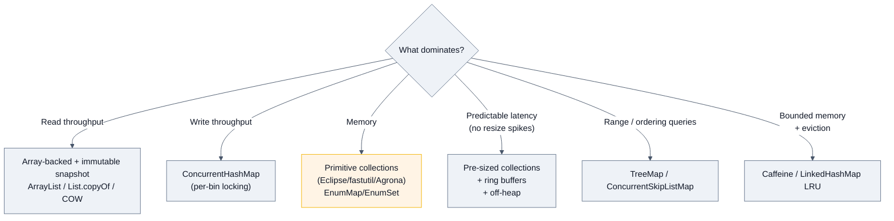

### Trade-offs you should be able to argue both ways

| Decision | For | Against |
|---|---|---|
| `HashMap` vs `TreeMap` | O(1) vs O(log n); hash wins on point lookups | Tree gives ordering, range queries, and **predictable worst case** (no hash-flooding DoS) |
| `ArrayList` vs `LinkedList` | Cache locality, 6× less memory, `arraycopy` is a vectorized intrinsic | Linked wins only for iterator-position splicing on very large lists |
| `ConcurrentHashMap` vs `synchronizedMap` | Per-bin locking scales; atomic compound ops | Synchronized wrapper allows locking *across* operations, which CHM can't |
| `CopyOnWriteArrayList` vs `synchronizedList` | Lock-free reads, no CME | O(n) writes and 2× transient memory; unusable above a few thousand elements |
| Immutable + rebuild vs mutable + lock | No synchronization at all; safe publication for free | Garbage churn; unusable for high write rates |
| Pre-sizing vs default | Avoids resize storms and rehashing | Wastes memory and cache lines when the estimate is wrong |
| Java collections vs primitive libraries | Standard, zero deps, well understood | 4–10× memory and major GC pressure at scale |

---

## 3.3 Edge cases interviewers probe

```java
// 1. Mutating a key after insertion — the entry is ORPHANED forever
Set<List<Integer>> set = new HashSet<>();
List<Integer> key = new ArrayList<>(List.of(1));
set.add(key);
key.add(2);                       // hashCode changed!
set.contains(key);                // ❌ false — it's in the wrong bucket
set.remove(key);                  // ❌ false — unreachable, and it leaks

// 2. Self-referential collection
List<Object> l = new ArrayList<>(); l.add(l);
l.hashCode();                     // 💥 StackOverflowError
l.toString();                     // "[(this Collection)]" — the JDK guards toString but not hashCode

// 3. removeAll can be accidentally O(n × m)
big.removeAll(alsoBig);           // AbstractCollection iterates `big` calling alsoBig.contains → O(n×m) if it's a List
big.removeAll(new HashSet<>(alsoBig));   // ✅ O(n + m)

// 4. Collectors.toMap explodes where groupingBy doesn't
people.stream().collect(Collectors.toMap(P::name, P::age));            // 💥 IllegalStateException on duplicate key
people.stream().collect(Collectors.toMap(P::name, P::age, (a,b) -> b)); // ✅ merge function
people.stream().collect(Collectors.toMap(P::name, P::nullableField));   // 💥 NPE on a null VALUE

// 5. Integer cache leaks into collection behaviour
List<Integer> nums = new ArrayList<>(List.of(1000, 2000));
nums.contains(1000);              // ✅ true — contains uses equals, not ==

// 6. An empty/oversized map still costs O(capacity) to iterate
Map<K,V> m = new HashMap<>(1 << 20);   // 1M buckets
m.put("a", 1);
for (var e : m.entrySet()) { }         // walks ~1M buckets to find 1 entry

// 7. Arrays.asList on a primitive array
List<int[]> oops = Arrays.asList(new int[]{1,2,3});   // size 1, element is the array
List<Integer> ok = Arrays.stream(new int[]{1,2,3}).boxed().toList();

// 8. A sorted collection with an inconsistent comparator silently loses data
TreeSet<String> ci = new TreeSet<>(String.CASE_INSENSITIVE_ORDER);
ci.add("Hello"); ci.add("HELLO");     // size == 1 — the second is a "duplicate"
```

---

## 3.4 Concurrency implications

### The three failure modes of an unsynchronized collection

| Failure | What it looks like |
|---|---|
| **Lost update** | Two threads `map.put(k, map.get(k)+1)` → one increment vanishes |
| **Corrupted structure** | Java 7 `HashMap` resize cycle → 100% CPU forever; in Java 8 you can still get a lost bin, wrong `size`, or a `null` read for a present key |
| **Visibility** | Thread B never sees thread A's write (no happens-before edge) — a `HashMap` published without synchronization may appear empty or half-built |

### Safe publication of collections

```java
// ❌ UNSAFE: another thread may see a partially initialized map
public Map<String,String> config;
void init() { config = new HashMap<>(); config.put("a","1"); }

// ✅ Safe: build fully, then publish immutably
private volatile Map<String,String> config = Map.of();
void reload() { config = Map.copyOf(loadFromDisk()); }   // atomic reference swap, immutable payload
```
This **copy-on-write-at-the-map-level** pattern is what most real config/feature-flag systems do: reads are completely lock-free and the write path is a single volatile store.

### Compound operations are never atomic just because the collection is

```java
// ❌ check-then-act race, even on ConcurrentHashMap
if (!map.containsKey(k)) map.put(k, v);
// ✅
map.putIfAbsent(k, v);

// ❌ read-modify-write race
map.put(k, map.getOrDefault(k, 0) + 1);
// ✅
map.merge(k, 1, Integer::sum);

// ❌ synchronizedList: each call is atomic, the SEQUENCE is not
if (!list.contains(x)) list.add(x);
// ✅ client-side locking on the wrapper's own mutex
synchronized (list) { if (!list.contains(x)) list.add(x); }
```

### Virtual threads (Java 21+) change the calculus

- Millions of virtual threads hammering one `ConcurrentHashMap` bin will still contend on that bin's monitor — but since **JDK 24 (JEP 491)** a virtual thread blocking in `synchronized` no longer **pins** its carrier, so `ConcurrentHashMap`, `ArrayBlockingQueue` and friends behave much better under Loom.
- **`ThreadLocal`-based per-thread collections are an anti-pattern with virtual threads** — one buffer per thread × 1M threads is a memory disaster. Use `ScopedValue` or a bounded pool instead.
- `CopyOnWriteArrayList` gets *worse*: more concurrent writers, more full-array copies.

---

## 3.5 Distributed-systems implications

This is where staff candidates separate themselves — the interviewer wants to know how a *local* data structure choice becomes a *distributed* problem.

| Collections concept | Distributed consequence |
|---|---|
| **`hashCode()` for sharding** | ⚠️ Never shard on `Object.hashCode()` or even `String.hashCode()` across JVMs and versions — identity hashes vary per run and `hashCode` is not a stability contract. Use an explicit stable hash (murmur3, xxHash) plus **consistent hashing**. |
| **`TreeMap` as a consistent-hashing ring** | The idiomatic Java implementation: `TreeMap<Long, Node>` with virtual nodes; lookup is `ring.ceilingEntry(hash)` falling back to `ring.firstEntry()` for wraparound. O(log n), and it's the answer to "implement consistent hashing" (§7 D5). |
| **Local `ConcurrentHashMap` cache** | Per-node ⇒ **eventual consistency** across the fleet. You've chosen AP: discuss TTL, versioned keys, and pub/sub invalidation rather than pretending it's coherent. |
| **Cache key design** | A key missing a tenant/version/locale component is a **cross-tenant data leak** or a poisoned cache. Use a `record` key so `equals`/`hashCode` are correct by construction. |
| **Serializing collections across services** | Java native serialization of collections is a security and versioning disaster (§10). Use Protobuf `repeated`/`map` or Avro arrays/maps with an explicit compatibility policy. |
| **Unbounded queues** | A queue is a liability, not a buffer. In a distributed system an unbounded in-memory queue converts downstream slowness into an OOM and hides the real signal. Bound everything and shed load. |
| **`size()` on a concurrent collection** | An estimate. Never use it for billing, quotas, or consistency decisions. |
| **Ordering guarantees** | `HashMap` iteration order is unspecified and **differs across JVM versions**. Any protocol, hash, signature, or checksum derived from map iteration order will silently break on upgrade. Sort explicitly. |
| **GC pressure from collections** | A 2-second Full GC caused by churning collections looks exactly like a network partition to a heartbeat-based cluster (Kafka, Cassandra, ZooKeeper) → spurious failover and split-brain. |
| **CAP framing** | A replicated in-memory map is a CP or AP choice, not a data structure choice. Hazelcast/Ignite `IMap` gives you distributed `Map` semantics but with network partitions, split-brain resolution, and near-cache staleness. |
| **Idempotency & dedup sets** | An unbounded `HashSet` of seen-IDs is an OOM waiting to happen. Use a **Bloom filter** (bounded memory, no false negatives) or a TTL cache. |

```mermaid
%%{init: {'theme':'base','themeVariables':{'background':'#ffffff','mainBkg':'#eef2f7','primaryColor':'#eef2f7','primaryTextColor':'#111827','primaryBorderColor':'#64748b','secondaryColor':'#e8f0fe','tertiaryColor':'#f1f5f9','lineColor':'#475569','textColor':'#111827','clusterBkg':'#f8fafc','clusterBorder':'#94a3b8','edgeLabelBackground':'#ffffff','titleColor':'#111827','actorBkg':'#eef2f7','actorTextColor':'#111827','actorBorder':'#64748b','actorLineColor':'#475569','signalColor':'#111827','signalTextColor':'#111827','noteBkgColor':'#fff4e5','noteTextColor':'#111827','noteBorderColor':'#d97706','labelBoxBkgColor':'#eef2f7','labelBoxBorderColor':'#64748b','labelTextColor':'#111827','loopTextColor':'#111827','altBackground':'#f8fafc'}}}%%
flowchart TB
    subgraph BAD["❌ Naive"]
      B1["HashMap&lt;String,Object&gt; cache<br/>unbounded, no TTL"]
      B2["Grows forever → Full GC → OOM"]
      B1 --> B2
    end
    subgraph GOOD["✅ Production"]
      G1["Caffeine: maximumSize + expireAfterWrite"]
      G2["Metrics: hit rate, evictions, load latency"]
      G3["Redis L2 + consistent hashing (TreeMap ring)"]
      G4["Bloom filter for negative lookups"]
      G1 --> G2 --> G3 --> G4
    end
    style BAD fill:#fce8e6,stroke:#ea4335,color:#111827
    style GOOD fill:#e6f4ea,stroke:#34a853,color:#111827
```

---

## 3.6 Caching with collections

| Layer | Structure | Notes |
|---|---|---|
| **L1 in-process** | `ConcurrentHashMap`, or **Caffeine** | Nanosecond access; per-node, so eventually consistent |
| Eviction: LRU | `LinkedHashMap(accessOrder=true)` + `removeEldestEntry` | Exact, but a global lock if you wrap it |
| Eviction: **W-TinyLFU** | Caffeine | Near-optimal hit rate; **scan-resistant** (a single full-table scan destroys an LRU cache but not this); records accesses into ring buffers so reads stay lock-free |
| Weak/soft caches | `WeakHashMap`, `SoftReference` values | ⚠️ Soft-reference caches make GC unpredictable and are widely discouraged now — prefer explicit bounds |
| **L2 distributed** | Redis / Memcached / Hazelcast | Network hop, serialization cost, coherence and stampede problems |

**Cache stampede (thundering herd)** — the classic follow-up: 10,000 threads miss the same key simultaneously and all hit the database.
```java
// ✅ single-flight: computeIfAbsent guarantees the mapping function runs ONCE per key
value = cache.computeIfAbsent(key, k -> db.load(k));
```
…but remember §2.11: the bin is locked while it runs, so the loader must not touch the same map. In real systems: Caffeine's `AsyncLoadingCache`, plus **jittered TTLs** so a million keys don't expire in the same second.

---

## 3.7 Observability & debugging collections

| Signal | How to get it | What it tells you |
|---|---|---|
| Which collection is eating the heap | Heap dump → **Eclipse MAT** dominator tree; `jmap -histo:live` | `Object[]`, `HashMap$Node[]`, `LinkedList$Node` at the top = unbounded collection |
| Retained size of a cache | MAT "retained heap" on the map instance | The true cost including keys and values |
| Allocation hot spots | **async-profiler `-e alloc`** flame graph | Which code path churns collections (resize storms, boxing, `toArray`) |
| Resize frequency | Allocation profile showing repeated `Arrays.copyOf` / `HashMap.resize` | Pre-size your collections |
| Cache effectiveness | Caffeine `recordStats()` → hit rate, load penalty, eviction count via Micrometer | Hit rate below ~80% usually means wrong size or wrong key |
| Lock contention on a collection | JFR `jdk.JavaMonitorEnter`, async-profiler `-e lock` | A hot `ConcurrentHashMap` bin or a `synchronizedMap` mutex |
| Queue saturation | `ThreadPoolExecutor.getQueue().size()`, `BlockingQueue.remainingCapacity()` | Backpressure — export it as a gauge, always |
| CME source | Stack trace names the iterator | Almost always a for-each with a `remove` |

> [!TIP]
> **Instrument every unbounded-by-design collection.** If a map is a cache, expose `size`, `hitRate`, and `evictionCount` as metrics. The number-one Java memory leak in production write-ups is a collection nobody was watching.

---

## 3.8 Performance tuning levers

1. **Pre-size**: `HashMap.newHashMap(n)` (19+) or `new ArrayList<>(n)`. Resizing a 1M-entry map re-hashes and re-links everything.
2. **Use the right structure**: `EnumMap` over `HashMap<MyEnum,…>`; `ArrayDeque` over `LinkedList`; `int[]` over `List<Integer>`.
3. **Avoid boxing** on hot paths: `IntStream`, primitive collections, `Map<K,long[]>` tricks.
4. **Batch**: `addAll` instead of `add` in a loop (it can pre-grow once).
5. **`removeIf`** instead of iterator loops — it's implemented with a bitset in `ArrayList` and does a single compaction pass.
6. **Iterate `entrySet()`**, never `keySet()` + `get()` (which doubles the hashing work).
7. **Cache the hash** for expensive immutable keys (a `record` with a lazily-computed hash, or precompute in the constructor).
8. **Bound everything** — size, TTL, and weight.
9. **Consider off-heap / open-addressing** (Agrona, Chronicle Map) when GC pause is the constraint rather than throughput.
10. **Measure with JMH**, never with a `System.currentTimeMillis()` loop.

---

## 3.9 Failure recovery & fault tolerance

| Scenario | Mitigation |
|---|---|
| Cache is cold after a restart → thundering herd on the DB | Staggered warmup, request coalescing, serve-stale-while-revalidate, readiness probe gating |
| A node's local cache diverges | TTL + versioned keys + pub/sub invalidation; accept eventual consistency explicitly |
| Queue overflow | Bounded queue + `CallerRunsPolicy` (backpressure) or explicit load shedding with a 429 |
| OOM from a runaway collection | `-XX:+HeapDumpOnOutOfMemoryError` + `-XX:+ExitOnOutOfMemoryError` so the orchestrator restarts a poisoned JVM, and you keep the evidence |
| Corrupted shared `HashMap` under concurrency | Switch to `ConcurrentHashMap`; add a JCStress or concurrent integration test to prevent regression |
| Slow degradation from an unbounded dedup set | Bloom filter with a known false-positive rate, or a TTL cache |

---

## 3.10 Cost optimization

- **Memory is money.** Dropping a 40 GB `HashMap<Long,Long>` fleet-wide to primitive maps can remove entire instance classes from your bill.
- **Right-size the heap**: an oversized heap doesn't just cost RAM, it lengthens GC and can push you past the **32 GB compressed-oops threshold**, which *increases* real memory usage.
- **Cache hit rate is a direct cost lever**: +10% hit rate on a 100k-QPS service can eliminate thousands of database queries per second.
- **Prefer a bigger local cache over a bigger Redis** when the data is read-mostly and per-node duplication is acceptable — local memory is far cheaper per lookup than a network round trip.
- **Don't pool objects to avoid GC.** Modern young-gen collection is nearly free for short-lived objects; pools cause leaks, contention and stale state. Pool only expensive *non-memory* resources.

---

# 4. 💬 Interview Questions by Level

> **Rating key:** ★★★★★ Must Know · ★★★★☆ Very Likely · ★★★☆☆ Good to Know

---

## 🟢 Beginner (0–2 years)

### Q1. What is the Java Collections Framework and what are its three parts? ★★★★★
**Why asked:** Establishes whether you think in terms of *contracts* or just class names.
**Expected answer:** Interfaces (contracts: `List`, `Set`, `Queue`, `Deque`, `Map`), implementations (`ArrayList`, `HashMap`, …), and algorithms (`Collections.sort`, `binarySearch`, `shuffle`). Add: it arrived in Java 1.2, designed largely by Joshua Bloch, and `java.util.concurrent` (Doug Lea, Java 5) extended it for concurrency.
**Follow-ups:** Why interfaces rather than just classes? (polymorphic APIs, swappable implementations, algorithms written once.) What existed before? (`Vector`, `Hashtable`, `Stack`, `Enumeration` — all synchronized, no common supertype.)
**Common mistake:** Listing only classes and never mentioning interfaces.

### Q2. Why is `Map` not a `Collection`? ★★★★★
**Expected answer:** A `Collection` is a group of *elements* and its core operation is `add(E)`. A `Map` is a group of *key→value mappings*; `add(E)` has no meaningful signature. Instead `Map` exposes three **collection views**: `keySet()` (a `Set`), `values()` (a `Collection`, not a `Set` — values can repeat) and `entrySet()` (a `Set<Map.Entry>`).
**Follow-up:** Are those views live? **Yes** — `map.keySet().remove(k)` removes the mapping. They're views, not copies.
**Common mistake:** "Because a map has two things" — true but shallow; name the `add(E)` signature problem.

### Q3. `ArrayList` vs `LinkedList` — which do you use and why? ★★★★★
**Expected answer:** Give the complexity table, then the *real* answer: `ArrayList` wins almost always because of **cache locality** and much lower memory (4 bytes per slot vs ~24 bytes per node), and because `System.arraycopy` is a vectorized JVM intrinsic. `LinkedList` only wins when you already hold an iterator at the insertion point. For queue/stack semantics use `ArrayDeque`.
**Follow-ups:** How does `ArrayList` grow? (lazily to 10 on first add, then `old + (old >> 1)` ≈ 1.5×.) Why is `elementData` `transient`? (custom `writeObject` serializes only `size` elements, not the oversized array.) What's `LinkedList`'s hidden feature? (it implements `Deque` too.)
**Common mistake:** Reciting "insertion is O(1) in LinkedList" without noting that *reaching* the position is O(n).

### Q4. `HashMap` vs `Hashtable`? ★★★★★
| | `HashMap` | `Hashtable` |
|---|---|---|
| Synchronized | ❌ | ✅ every method |
| Null key/value | 1 null key, N null values | ❌ neither |
| Since | 1.2 (JCF) | 1.0 (legacy) |
| Iterator | fail-fast `Iterator` | `Enumeration` (not fail-fast) + fail-fast iterator |
| Performance | fast | slow (global lock) |
| Replacement | — | **`ConcurrentHashMap`** |
**Follow-up:** Why does `Hashtable` forbid nulls? Largely historical — but it also means `get()` returning `null` unambiguously means "absent", the same reasoning Doug Lea later applied to `ConcurrentHashMap`.

### Q5. `HashSet` vs `LinkedHashSet` vs `TreeSet`? ★★★★★
Hash = no order, O(1); Linked = insertion order, O(1), 2 extra refs/entry; Tree = sorted, O(log n), no nulls, uses `compareTo` not `equals`. Then: **`HashSet` is a `HashMap` with a shared dummy `PRESENT` value; `LinkedHashSet` uses a `LinkedHashMap`; `TreeSet` uses a `TreeMap`.** Saying that wins the question.

### Q6. What is the initial capacity and load factor of a `HashMap`? ★★★★★
16 and 0.75. Resize (double + rehash) occurs when `size > capacity × loadFactor`, i.e. at 13 entries with defaults. **Why 0.75?** The JDK javadoc justifies it with a Poisson analysis — it's the point where the expected collision chain stays tiny while memory waste stays acceptable.
**Follow-up:** `new HashMap<>(1000)` — how many entries before it resizes? **750**, not 1000. Correct sizing: `(int)(n/0.75f)+1`, or `HashMap.newHashMap(n)` in Java 19+.

### Q7. What is a fail-fast iterator? ★★★★★
The collection keeps a `modCount`; the iterator snapshots it as `expectedModCount` and compares on every `next()`. A mismatch throws `ConcurrentModificationException`. **It's a bug detector, not a concurrency control** — the javadoc says it's best-effort and must not be relied upon.
**Follow-ups:** Can it happen single-threaded? (Yes — that's the *common* case.) Name three correct removal patterns. (`removeIf`, `Iterator.remove`, rebuild via stream.) What's the opposite? Weakly consistent iterators (`ConcurrentHashMap`) and snapshot iterators (`CopyOnWriteArrayList`).

### Q8. Which collections allow `null`? ★★★★☆
| Allows null | Doesn't |
|---|---|
| `ArrayList`, `LinkedList`, `Vector` | `ArrayDeque` (null is the empty sentinel) |
| `HashMap` (1 key, N values), `LinkedHashMap` | `Hashtable`, `ConcurrentHashMap` (neither) |
| `HashSet`, `LinkedHashSet` (one null) | `TreeMap`/`TreeSet` keys (NPE on compare) |
| — | `PriorityQueue`, most `BlockingQueue`s |
| — | `List.of` / `Set.of` / `Map.of` (all reject nulls) |
**Follow-up:** Why does `ConcurrentHashMap` forbid nulls? Because `get(k) == null` would be ambiguous and — unlike in `HashMap` — you can't atomically disambiguate with `containsKey`.

### Q9. `Comparable` vs `Comparator`? ★★★★★
`Comparable<T>.compareTo(T)` in `java.lang` = one natural ordering, defined inside the class. `Comparator<T>.compare(T,T)` in `java.util` = many external orderings, composable, works on classes you don't own.
```java
list.sort(Comparator.comparing(Emp::dept)
                    .thenComparing(Emp::salary, Comparator.reverseOrder())
                    .thenComparing(Emp::name));
```
**Follow-up:** What breaks if your comparator isn't transitive? `IllegalArgumentException: Comparison method violates its general contract!` from TimSort. Cause is usually `a - b` overflow — use `Integer.compare`.

### Q10. Why is `Stack` discouraged? What should you use? ★★★★☆
`Stack extends Vector` — legacy and fully synchronized, but worse: **it iterates bottom-to-top**, which is the opposite of stack order, so `for (X x : stack)` gives you the wrong sequence. Use **`ArrayDeque`** (`push`/`pop`/`peek`), or `LinkedList` if you also need `List` operations.

### Q11. What is the difference between `Iterator` and `ListIterator`? ★★★★☆
`Iterator`: forward only, `remove()` only, works on any `Collection`. `ListIterator`: bidirectional (`hasPrevious`/`previous`), supports `set` and `add`, exposes `nextIndex`/`previousIndex`, and only exists on `List`.

### Q12. `Collection` vs `Collections`? ★★★☆☆
`Collection` is the root **interface**; `Collections` is a **utility class** of static methods (`sort`, `unmodifiableList`, `synchronizedMap`, `emptyList`, `binarySearch`, `shuffle`). A pure vocabulary check — answer in one sentence and move on.

### Q13. How do you make a collection thread-safe? ★★★★★
Four options, in increasing quality:
1. `Collections.synchronizedList/Map/Set(...)` — one global mutex; **you must synchronize manually while iterating**.
2. `java.util.concurrent` types — `ConcurrentHashMap`, `CopyOnWriteArrayList`, `ConcurrentLinkedQueue`, `BlockingQueue`. ⭐
3. **Immutability** — `List.copyOf` + a `volatile` reference swap; reads need no synchronization at all.
4. Confinement — keep it in one thread.
**Follow-up:** How do you get a concurrent `Set`? `ConcurrentHashMap.newKeySet()` or `Collections.newSetFromMap(new ConcurrentHashMap<>())` — there is no `ConcurrentHashSet` class.

### Q14. `Array` vs `ArrayList`? ★★★★☆
Fixed vs resizable; primitives vs objects only; `length` field vs `size()`; **covariant** (`Object[] o = new String[1]` compiles then throws `ArrayStoreException`) vs **invariant** generics (compile error, safer); arrays are faster and denser; `ArrayList` gives you the whole framework.

### Q15. What does `Collections.unmodifiableList` actually return? ★★★★☆
An **unmodifiable view**, not an immutable copy. Writes through the view throw; writes to the **backing list** are visible through the view. For a true immutable copy use `List.copyOf(...)` (Java 10) or `List.of(...)`.

---

## 🟡 Intermediate (2–5 years)

### Q16. Explain `HashMap`'s internal working end to end. ★★★★★
**The structure interviewers want** (§2.6): `hashCode()` → `spread: h ^ (h >>> 16)` → `index = (n-1) & hash` → bin → list, treeify at 8 with table ≥ 64, untreeify at 6 → resize at `size > cap × 0.75`, doubling with a one-bit lo/hi split. Then: why power of two, why the XOR, what the `Node` caches, Java 7 vs 8 differences, and the null policy.
**Follow-ups:** What if `hashCode` always returns 1? (all entries in one bin → treeified → O(log n) since Java 8, O(n) before.) What if `equals` is inconsistent with `hashCode`? (entries become unfindable.) Why cache the hash in the `Node`? (resize never recomputes; lookups compare cheap ints first.)

### Q17. `HashMap` vs `ConcurrentHashMap` vs `Collections.synchronizedMap`? ★★★★★
| | `HashMap` | `synchronizedMap` | `ConcurrentHashMap` |
|---|---|---|---|
| Locking | none | one mutex on the wrapper | **CAS + per-bin `synchronized`** |
| Iteration | fail-fast | fail-fast, **needs manual sync** | weakly consistent, no sync needed |
| Nulls | ✅ | depends on backing | ❌ both |
| Atomic compound ops | ❌ | ❌ | ✅ `putIfAbsent`, `compute`, `merge` |
| Read throughput | best | worst (reads block) | near-`HashMap` |
| `size()` | exact | exact | **estimate** |
**Follow-up:** When would you still choose `synchronizedMap`? When you need to lock **across** several operations — `ConcurrentHashMap` can't give you that (its atomicity is per-key).

### Q18. Describe `ConcurrentHashMap`'s Java 8 redesign. ★★★★★
See §2.11: segments removed; `casTabAt` for empty bins; `synchronized` on the bin's first node otherwise; `ForwardingNode` + cooperative `transfer` where readers/writers *help* resize; `baseCount` + `CounterCell[]` for size (the `LongAdder` pattern); `TreeBin` for long bins; weakly consistent iterators; no nulls; bulk parallel ops with a `parallelismThreshold`.
**Follow-ups:** Why is `size()` only an estimate? Why can't the mapping function of `computeIfAbsent` modify the map? (the bin is locked → deadlock/corruption.)

### Q19. When does a `HashMap` bin become a tree, and why are the thresholds 8 / 6 / 64? ★★★★★
Treeify when a bin reaches **8** *and* the table is at least **64**; untreeify at **6**. The gap 8→6 is **hysteresis** to avoid thrashing at the boundary. Below 64 buckets, a long chain indicates the *table* is too small rather than the hash being bad, so `resize()` is cheaper and more effective than building a tree. And 8 is chosen because with a decent hash and load factor 0.75 the Poisson probability of a bin reaching 8 is ~6×10⁻⁸ — treeification should be a rare, defensive path.

### Q20. What happens if two keys have the same `hashCode`? ★★★★★
They land in the same bin. Within the bin, `HashMap` compares the **cached hash first**, then `==`, then `equals`. Different keys with equal hashes coexist as separate entries; the same key (by `equals`) has its value overwritten. Enough collisions in one bin and it treeifies to O(log n).
**Follow-up:** How would an attacker exploit this? Hash-flooding DoS (§10).

### Q21. Fail-fast vs fail-safe vs weakly consistent — and what does each cost? ★★★★★
| | Fail-fast | Snapshot (COW) | Weakly consistent |
|---|---|---|---|
| Examples | `ArrayList`, `HashMap`, `TreeMap` | `CopyOnWriteArrayList` | `ConcurrentHashMap`, `ConcurrentLinkedQueue` |
| Mechanism | `modCount` check | immutable array snapshot | traverses live structure, tolerating change |
| Sees concurrent updates | n/a — throws | ❌ never | maybe |
| Cost | free | **O(n) per write** | small |
> "Fail-safe" is the common interview term but it isn't JDK terminology — the javadocs say **weakly consistent**. Saying that is a nice precision signal.

### Q22. Explain `equals`/`hashCode` and what breaks in collections. ★★★★★
The contract (reflexive, symmetric, transitive, consistent, `x.equals(null)` false, equal ⇒ equal hash). Then the concrete failures: an object *disappears* from a `HashSet`; `map.get(key)` returns `null` for a key you just put; `distinct()` and `groupingBy` misbehave; **mutating a field used in `hashCode` while the object is a key orphans the entry in the wrong bucket forever** — it can be neither found nor removed, so it also leaks.
**Follow-up:** Why `31`? Odd prime, `31*i == (i<<5)-i`, good empirical dispersion. Modern answer: `Objects.hash(...)` or a `record`.

### Q23. What is `LinkedHashMap` and how do you build an LRU cache with it? ★★★★★
See §2.7 — write the 5-line class from memory, then explain `accessOrder`, the `before`/`after` links, and `removeEldestEntry`.
**Follow-ups:** Why does iterating while calling `get()` throw CME in access-order mode? (a `get` is a structural modification.) How do you make it thread-safe? (`Collections.synchronizedMap`, or use Caffeine, which uses ring buffers so reads stay lock-free.) Why is W-TinyLFU better than LRU? (scan resistance.)

### Q24. `TreeMap` internals and the `NavigableMap` API. ★★★★☆
Red-black tree, O(log n) guaranteed, sorted, uses `compareTo`/`Comparator` **never `equals`**, no null keys. Then demonstrate `floorKey`/`ceilingKey`/`higherKey`/`lowerKey`/`subMap`/`descendingMap`/`pollFirstEntry` — the API is the reason to choose it.
**Follow-up:** Give a real use case. **Consistent hashing ring** (`ceilingEntry` + wraparound), time-series range queries, leaderboards, interval lookup, IP-range → geolocation.

### Q25. `ArrayDeque` vs `LinkedList` as a `Deque`? ★★★★☆
`ArrayDeque` is a circular array — contiguous memory, no per-node allocation, better cache behaviour, and measurably faster for both stack and queue use. `LinkedList` allocates a node per element and is only preferable if you also need `List` indexing. Neither is thread-safe. `ArrayDeque` forbids `null` because `null` is the "empty" sentinel returned by `poll`/`peek`.

### Q26. What is `EnumMap`/`EnumSet` and why are they so fast? ★★★★☆
`EnumMap` = a plain `Object[]` indexed by `ordinal()` — no hashing, no collisions, iteration in enum declaration order. `EnumSet` = a **bit vector**: `RegularEnumSet` uses a single `long` for enums with ≤ 64 constants; `JumboEnumSet` uses a `long[]` beyond that. Every operation is bitwise arithmetic → constant time, near-zero memory (**one bit per element**).
**Follow-up:** Which implementation is chosen? Based on the **enum's universe size**, not on how many elements you store.

### Q27. What are `WeakHashMap` and `IdentityHashMap` for? ★★★★☆
`WeakHashMap`: keys are weak references, so an entry disappears once its key is otherwise unreachable; stale entries are purged via a `ReferenceQueue` on subsequent operations. Use for metadata keyed by an object you don't own. ⚠️ **Values are strongly held** — a value referencing its own key defeats the whole thing.
`IdentityHashMap`: compares with `==` and `System.identityHashCode`, and uses **linear probing** rather than chaining. Use for object-graph traversal (serialization, deep copy, cycle detection) where two `equals` objects must stay distinct.

### Q28. Explain `CopyOnWriteArrayList` and when you'd use it. ★★★★☆
Volatile array; every write takes a lock and copies the whole array; reads are lock-free; iterators are immutable snapshots (never CME, but `remove`/`set` throw `UnsupportedOperationException`). Use only for **small, read-dominated** collections — the canonical case is a listener/observer registry. It is a terrible choice for anything with meaningful write volume.

### Q29. Compare the `BlockingQueue` implementations. ★★★★★
See §2.12. Cover: `ArrayBlockingQueue` (bounded, one lock, ring buffer, low GC, optional fairness), `LinkedBlockingQueue` (**default capacity is `Integer.MAX_VALUE` — effectively unbounded**, two locks so higher throughput), `SynchronousQueue` (zero capacity, direct hand-off, used by `newCachedThreadPool`), `PriorityBlockingQueue` (unbounded heap, `put` never blocks), `DelayQueue` (the basis of `ScheduledThreadPoolExecutor`), `LinkedTransferQueue` (`transfer()`).
**Follow-up:** Which one makes `newFixedThreadPool` dangerous? The unbounded `LinkedBlockingQueue` — `maximumPoolSize` is never reached and the queue grows to OOM.

### Q30. `HashMap` vs `TreeMap` vs `LinkedHashMap` — when each? ★★★★★
Hash for point lookups (default). Linked when you need **predictable iteration order** or an LRU. Tree when you need **sorted order or range queries** — and note it also gives you a **guaranteed O(log n) worst case**, which is a real security property against hash-flooding.

### Q31. What is the difference between `Collections.sort` and `Arrays.sort`? ★★★★☆
`Collections.sort(list)` → `list.sort(null)` → copies to an array, `Arrays.sort`, writes back. For **objects** the JDK uses **TimSort** (stable, adaptive, O(n) on nearly-sorted input, needs O(n) space). For **primitives** it uses **Dual-Pivot Quicksort** (in place, no stability requirement). Explaining *why* the two differ — stability matters for objects but is meaningless for primitives, and object comparisons are expensive so minimizing comparison count matters — is the senior-level answer.

### Q32. How does `Collectors.groupingBy` differ from `Collectors.toMap`? ★★★★☆
`groupingBy` builds `Map<K, List<V>>` (or with a downstream collector, anything) and never complains about duplicates. `toMap` builds `Map<K,V>` and **throws `IllegalStateException` on a duplicate key** unless you supply a merge function — and **NPEs on a null value**, unlike `groupingBy`. Two of the most common stream bugs in production.
```java
m = list.stream().collect(Collectors.toMap(P::id, p -> p, (a,b) -> b, LinkedHashMap::new));
```

### Q33. What is a `Spliterator`? ★★★★☆
The parallel-capable traversal abstraction behind streams: `tryAdvance`, `forEachRemaining`, `trySplit`, `estimateSize`, and **characteristics** (`ORDERED`, `SIZED`, `SUBSIZED`, `DISTINCT`, `SORTED`, `IMMUTABLE`, `CONCURRENT`, `NONNULL`). It's why `ArrayList.parallelStream()` splits in O(1) and `LinkedList.parallelStream()` can't — a concrete reason parallel streams help on one and hurt on the other.

### Q34. What are the collection views of a `Map`? ★★★★☆
`keySet()`, `values()`, `entrySet()` — all **live views**, so `map.keySet().remove(k)` deletes the mapping and `entry.setValue(v)` updates the map. They don't support `add`. Iterating `entrySet()` is the efficient way to walk a map (`keySet()` + `get()` hashes twice).

### Q35. Immutable collection factories — what changed in Java 9/10/16? ★★★★☆
Java 9: `List.of`, `Set.of`, `Map.of`, `Map.ofEntries` — truly immutable, reject nulls, memory-optimized, **`Set`/`Map` iteration order randomized per JVM run**. Java 10: `List/Set/Map.copyOf` and `Collectors.toUnmodifiableList/Set/Map`. Java 16: `Stream.toList()` — unmodifiable but **allows nulls**, unlike `toUnmodifiableList()`.

---

## 🟠 Senior (5–8 years)

### Q36. Walk me through what happens on `map.put()` under concurrent access without synchronization. ★★★★★
Three failure classes: **lost updates** (two threads write the same bin, one link is overwritten), **structural corruption** (Java 7 resize cycle → infinite loop; in Java 8 a lost bin or wrong `size`), and **visibility** (no happens-before edge → a thread may not see the write at all, or may see a partially constructed `Node`). Then: why `ConcurrentHashMap` fixes all three (volatile reads for visibility, CAS/bin locks for atomicity, cooperative transfer for resize).

### Q37. Design a thread-safe LRU cache — three ways, with trade-offs. ★★★★★
1. `Collections.synchronizedMap(new LinkedHashMap<>(cap, 0.75f, true))` — correct and exact, but a single global lock serializes **reads** too.
2. **Striped** — `N` shards, each an independent LRU with its own lock; hash the key to a shard. Concurrency ×N; eviction becomes per-shard (approximate global LRU). This is essentially what Guava's `LocalCache` does.
3. **Caffeine (W-TinyLFU)** — `ConcurrentHashMap` for storage plus **ring buffers** that batch-record accesses, so reads never take a lock; a separate maintenance task applies the eviction policy. Near-optimal hit rate and **scan-resistant**.
**Say the ending:** *"In production I'd use Caffeine; I'd hand-roll only if a dependency were forbidden."*

### Q38. Your service OOMs after four days. How do you find the collection responsible? ★★★★★
**Structured answer:** (1) confirm from heap metrics that it's a slow leak, not a spike; (2) `-XX:+HeapDumpOnOutOfMemoryError` or `jcmd GC.heap_dump`; (3) **Eclipse MAT** → Leak Suspects → **dominator tree** → find the object with the largest *retained* heap; (4) it will almost always be `HashMap$Node[]`, `Object[]`, or `LinkedList$Node` under a static field, a cache, a listener registry, or a `ThreadLocal`; (5) walk the **GC-root path** to see who's holding it; (6) fix by bounding (`Caffeine maximumSize` + TTL), deregistering, or `ThreadLocal.remove()`; (7) add a size/eviction metric so it can never happen silently again.
Also worth naming: comparing two histograms (`jmap -histo:live`) taken hours apart to see growth deltas, and using **async-profiler `-e alloc`** to find the allocating code path.

### Q39. `computeIfAbsent` — what are its hazards? ★★★★☆
On `HashMap`: recursive modification inside the mapping function corrupts the map; Java 9+ detects it and throws `ConcurrentModificationException`. On `ConcurrentHashMap`: the **bin is locked while the function runs**, so a mapping function that touches the same map can **deadlock**, and a slow function blocks every other key in that bin. Also: if the function returns `null`, no mapping is created (so it isn't a memoizer for null-valued computations).
**Rule:** mapping functions must be short, pure, and must not touch the map.

### Q40. When would you deliberately choose a `TreeMap` over a `HashMap` for performance? ★★★★☆
- You need **range queries / ordering** (`subMap`, `ceilingKey`) — the deciding factor most of the time.
- You need a **guaranteed worst case**: `TreeMap` is O(log n) regardless of input, immune to hash-flooding DoS.
- Keys are expensive to hash but cheap to compare.
- You need `descendingMap`, `pollFirstEntry`, or navigation semantics.
Otherwise `HashMap` wins on constant factors, especially for `String` keys where `hashCode` is cached.

### Q41. Explain memory footprint differences and when they matter. ★★★★★
Give the numbers (§3.1): `ArrayList<Integer>` of 1M ints ≈ 4 MB references + 16 MB boxed `Integer`s ≈ 20 MB, versus 4 MB for `int[]`. A `HashMap<Integer,Integer>` of 1M ≈ 80 MB versus 8 MB for two parallel `int[]`. Then name the escape hatches: Eclipse Collections (originally **GS Collections**, from Goldman Sachs), fastutil, HPPC, Koloboke, **Agrona** (open-addressing `Int2ObjectHashMap`, used by Aeron/LMAX), and off-heap (**Chronicle Map**). Explain *why* it matters: GC pause is roughly proportional to live-set size, and crossing the **32 GB compressed-oops threshold** makes pointers 8 bytes.

### Q42. How do you safely publish and hot-reload a shared configuration map? ★★★★☆
```java
private volatile Map<String,String> config = Map.of();
void reload() { config = Map.copyOf(loadFromDisk()); }   // build fully, then one volatile store
String get(String k) { return config.get(k); }           // completely lock-free reads
```
Immutable payload + volatile reference swap = safe publication with zero read cost. Contrast with mutating a shared `ConcurrentHashMap` (readers can see a half-applied config — a real incident class).

### Q43. `size()` on a concurrent collection — why is it unreliable, and what would you do instead? ★★★★☆
`ConcurrentHashMap.size()` sums `baseCount` plus striped `CounterCell`s; under concurrent mutation it's a **best-effort estimate** (use `mappingCount()` for a `long`). `ConcurrentLinkedQueue.size()` is **O(n)** and also an estimate — calling it in a loop is a classic performance bug. For quotas/limits, maintain an explicit `AtomicLong`/`Semaphore` you control, or use a bounded collection so the bound *is* the invariant.

### Q44. What is the "iterating a shrunken map is slow" problem? ★★★☆☆
`HashMap` iteration walks the **entire bucket table**, not just the entries: it's O(n + capacity). A map that peaked at 1M entries keeps its ~2M-slot table forever (there is no shrink-on-remove). If it now holds 3 entries, each iteration still scans 2M slots. Fix: rebuild the map (`new HashMap<>(old)`) after a large bulk removal, or use a fresh map per cycle.

### Q45. How would you detect and prevent unbounded collection growth across a large codebase? ★★★★☆
Static analysis and review rules (ArchUnit / Error Prone / SpotBugs) that flag `static` mutable collections and cache-like maps without bounds; a shared cache abstraction (Caffeine wrapper) that **requires** a size or TTL; mandatory metrics on any cache; heap-growth alerts on `jvm_memory_used_bytes` trend, not just absolute; periodic heap-dump review in staging under soak test; and load/soak tests that run long enough for leaks to appear.

---

## 🔴 Staff / Principal

### Q46. Design the collection layer for a system holding 500M key→value pairs in memory. ★★★★★
**Expected shape:** reject `HashMap<Long,Long>` immediately with the arithmetic (≈ 40 GB+). Then walk the option space:
- **Primitive open-addressing maps** (Agrona `Long2LongHashMap`, Koloboke, fastutil) → ~8–16 GB, no per-entry objects, no GC scanning of entries.
- **Off-heap** (Chronicle Map, direct `ByteBuffer`, or the **Foreign Function & Memory API**, final in Java 22) → removes the data from GC scope entirely; costs serialization and manual lifetime management.
- **Sharding across JVMs/nodes** with consistent hashing → operational complexity, network hop, rebalancing.
- **Sorted structure on disk** (RocksDB/LSM) with an in-memory index → the Kafka/Cassandra answer.
Then discuss GC choice (ZGC for large heaps), the 32 GB compressed-oops cliff, `-XX:+AlwaysPreTouch`, NUMA, and how you'd **measure** rather than guess.

### Q47. Design a collection API that 500 internal teams will use for 10 years. ★★★★☆
Return interfaces, not implementations. Accept the **most general** parameter type (`Collection<? extends T>`) and return the **most specific useful** one. Return **immutable** results or defensive copies — never expose internal mutable state. Never return `null` (return `List.of()`). Document ordering, nullability, thread-safety, and complexity **in the javadoc** (the JDK's own `@implSpec` style). Beware `Optional` in collection positions. Version with a deprecation policy. Avoid leaking third-party collection types (Guava `ImmutableList`) in signatures — it forces the dependency on every caller. Consider `Iterable` or a `Stream` return for lazy/large results so you don't materialize a million-element list.

### Q48. You must cut p99 latency and the profile points at collection operations. Walk me through it. ★★★★★
1. **Attribute precisely** — async-profiler CPU + `alloc` flame graphs; JFR allocation and GC events. Distinguish *collection work* from *GC caused by collection churn*.
2. **Kill allocation**: pre-size, reuse buffers, `removeIf` over rebuild, avoid boxing, avoid `toArray`/`stream()` in hot loops, avoid `String` concat keys (use a `record` key).
3. **Kill indirection**: `EnumMap`/`EnumSet`, primitive collections, arrays of structs → struct of arrays for cache locality.
4. **Kill contention**: shard the map, replace a `synchronizedMap` with `ConcurrentHashMap`, replace a hot counter with `LongAdder`, remove `CopyOnWriteArrayList` from any write path.
5. **Kill resize spikes**: pre-size, or use a fixed-capacity ring buffer.
6. **Verify** with JMH microbenchmarks plus a canary on real traffic; watch throughput and cost, not just p99.
7. **Guardrail** it with a performance regression test.

### Q49. When should a team stop using `java.util` collections entirely? ★★★★☆
When *measurements* show GC pause or memory is the binding constraint and the data is (a) large, (b) primitive-typed, and (c) long-lived. Cite real precedents: **Spark's Project Tungsten** (off-heap, `BytesToBytesMap`, whole-stage codegen) abandoned the JVM object model because object overhead and GC dominated; **Lucene/Elasticsearch** uses packed ints and FSTs; **Aeron/LMAX** uses Agrona and ring buffers; **Presto/Trino** uses custom blocks and open-addressing tables. Then the counterweight: it costs readability, tooling, and hiring — do it in a contained module behind a normal interface, never across the whole codebase.

### Q50. Argue both sides: should a public API return `List` or `Stream`? ★★★☆☆
**`List`**: reusable, sized, indexable, easy to test and log, works with any consumer. **`Stream`**: lazy (never materializes a huge result), composable, supports short-circuiting, and can wrap a resource. **Costs of `Stream`**: single-use, awkward to test, easy to leak an unclosed resource, and callers usually just `.toList()` anyway. **Common resolution:** return `List` for small bounded results; return `Stream` (documented as needing `close()`) for potentially unbounded or I/O-backed results — the JDK itself does exactly this with `Files.lines()`.

---

## 🏢 FAANG-flavoured

| Company | Collections-specific patterns you'll actually see |
|---|---|
| **Google** | Collections appear *through* DSA: pick the right structure fast, justify complexity, write clean compiling code. Guava idioms (`Multimap`, `ImmutableList`, `Table`) are a plus. Rarely trivia. |
| **Meta** | Speed on hash-map/heap/deque-based problems; "now make it O(1)"; concurrency in the practical-coding round. |
| **Amazon** | LLD in Java with interfaces + enums + collections (design a parking lot, inventory, cache), plus Leadership Principles woven in. `ConcurrentHashMap` vs `synchronizedMap` in "Dive Deep". |
| **Microsoft** | Balanced DSA + `equals`/`hashCode` + collection choice justification. |
| **Netflix** | Senior bar: GC impact of collections, caching strategy, Caffeine/Guava, resilience patterns. |
| **Apple** | Deep internals and memory layout; occasionally very specific ("what's in a `HashMap$Node`?"). |
| **Uber / DoorDash / Airbnb** | Live-code a thread-safe cache, an in-memory index, a rate limiter with a `Deque`, or a top-K feed. |
| **Stripe** | Long realistic sessions in a real repo — correctness, idempotency, dedup sets, key design, error handling. |
| **Databricks / Snowflake** | Memory layout, off-heap, primitive collections, Spark internals, GC at TB scale. |
| **Bloomberg / Goldman / JPMorgan** | The deepest collections questions you'll get: memory per entry, primitive collections (Goldman *wrote* GS Collections → Eclipse Collections), latency, immutability, `TreeMap` for market data. |
| **Cloudflare / Coinbase** | Hash-flooding DoS, bounded structures, dedup at the edge, Bloom filters. |
| **Palantir** | Immutability, API design, defensive copies, code review as an interview round. |

### FAANG-tier questions
1. **Implement `HashMap` from scratch** (`put`/`get`/`remove`/resize) ★★★★★ — §6 C12
2. **Design an LRU cache with O(1) `get` and `put`** ★★★★★ — §6 C9
3. **Design an LFU cache** ★★★★☆ — §6 C18
4. **`insert`, `delete`, `getRandom` all in O(1)** ★★★★★ — §6 C13 (HashMap + ArrayList; the *swap-with-last* trick)
5. **Top K frequent elements** ★★★★★ — §6 C10 (heap O(n log k) vs bucket sort O(n))
6. **Sliding window maximum** ★★★★★ — §6 C14 (monotonic `Deque`)
7. **Merge k sorted lists** ★★★★☆ — §6 C15 (`PriorityQueue`)
8. **Why is `HashMap` O(1) and when is it not?** ★★★★★
9. **What would you change about the Collections Framework if you designed it today?** ★★★☆☆ — primitives (Valhalla), no optional operations, `Map` unified with `Collection`, immutability by default, nullability in the type system. A great "do you have taste?" question.

---

## 🚀 Startup

1. **Which collection would you use for X, and would you add a dependency for it?** ★★★★★ (Guava/Caffeine/Eclipse — justify the dependency cost)
2. **The service OOMs under load. Ten minutes. Go.** ★★★★★
3. **Build an in-memory store with TTL and eviction — no libraries.** ★★★★★
4. **How do you cache without introducing stale-data bugs?** ★★★★☆
5. **We're at 500 RPS and the map lookups are hot. What do you do?** ★★★★☆
6. **Would you use Redis or an in-process cache here?** ★★★★☆ (per-node duplication vs network hop vs coherence)
7. **How do you keep a small codebase from accumulating unbounded caches?** ★★★☆☆

---

## 🏭 Product Companies (Walmart, Flipkart, Swiggy, PhonePe, Razorpay, Atlassian, Adobe, Salesforce, Oracle)

1. `HashMap` internal working — **the** question ★★★★★
2. `ConcurrentHashMap` internal working (Java 7 vs 8) ★★★★★
3. `ArrayList` internal working, growth factor, why `transient` ★★★★★
4. `HashMap` vs `Hashtable` vs `ConcurrentHashMap` ★★★★★
5. `equals`/`hashCode` contract + write it for a class ★★★★★
6. Java 8 streams over collections: `groupingBy`, `partitioningBy`, `toMap`, `flatMap` ★★★★★
7. Fail-fast vs fail-safe; fix a `ConcurrentModificationException` live ★★★★★
8. LRU cache with `LinkedHashMap` ★★★★★
9. Sort a list of objects by multiple fields ★★★★★
10. `Comparable` vs `Comparator` ★★★★☆
11. Find duplicates / first non-repeating / frequency count using collections ★★★★★
12. How would you make `ArrayList` thread-safe? ★★★★☆
13. `TreeMap` use case in your project ★★★★☆
14. Difference between `poll`/`remove`, `peek`/`element`, `offer`/`add` ★★★☆☆
15. Convert `List` ↔ `Map` ↔ `Set` with streams ★★★★☆

---

## 🏗️ Service Companies (TCS, Infosys, Wipro, Accenture, Cognizant, Capgemini, HCL, LTIMindtree)

Rapid-fire. **Answer in 2–3 crisp sentences.**

| # | Question | ★ |
|---|---|---|
| 1 | What is the Collection Framework hierarchy? | ★★★★★ |
| 2 | `List` vs `Set` vs `Map` | ★★★★★ |
| 3 | `ArrayList` vs `LinkedList` | ★★★★★ |
| 4 | `ArrayList` vs `Vector` | ★★★★★ |
| 5 | `HashMap` vs `Hashtable` | ★★★★★ |
| 6 | `HashSet` vs `TreeSet` vs `LinkedHashSet` | ★★★★★ |
| 7 | `HashMap` vs `TreeMap` vs `LinkedHashMap` | ★★★★★ |
| 8 | How does `HashMap` work internally? | ★★★★★ |
| 9 | Default capacity and load factor? | ★★★★★ |
| 10 | What is a hash collision, how is it handled? | ★★★★★ |
| 11 | `equals()` and `hashCode()` contract | ★★★★★ |
| 12 | Fail-fast vs fail-safe iterator | ★★★★★ |
| 13 | What is `ConcurrentModificationException`? How to avoid? | ★★★★★ |
| 14 | `Iterator` vs `ListIterator` vs `Enumeration` | ★★★★☆ |
| 15 | `Comparable` vs `Comparator` | ★★★★★ |
| 16 | How do you sort a `HashMap` by value? | ★★★★★ |
| 17 | How do you remove duplicates from a `List`? | ★★★★★ |
| 18 | How do you make a collection read-only? | ★★★★☆ |
| 19 | How do you synchronize a collection? | ★★★★☆ |
| 20 | Which collections are synchronized by default? | ★★★★☆ |
| 21 | Can a `HashMap` have a null key? How many? | ★★★★★ |
| 22 | `Collection` vs `Collections` | ★★★★☆ |
| 23 | What is a `Deque`? | ★★★★☆ |
| 24 | `Queue` vs `Stack` | ★★★★☆ |
| 25 | What is `PriorityQueue`? Is it sorted? | ★★★★☆ |
| 26 | What is `EnumMap`? | ★★★☆☆ |
| 27 | What is a `WeakHashMap`? | ★★★☆☆ |
| 28 | Load factor — what happens when exceeded? | ★★★★★ |
| 29 | What is `ConcurrentHashMap` and why use it? | ★★★★★ |
| 30 | Write code: count word frequency / find duplicates / sort a map by value / reverse a list | ★★★★★ |

---

# 5. 📊 Frequently Asked Questions (Ranked by Frequency)

### 🔴 Very High (expect these in > 60% of Java interviews)

| # | Question | Where |
|---|---|---|
| 1 | How does `HashMap` work internally? | Everywhere — **the** question |
| 2 | `equals`/`hashCode` contract and what breaks | Everywhere |
| 3 | `ArrayList` vs `LinkedList` | Everywhere |
| 4 | `HashMap` vs `Hashtable` vs `ConcurrentHashMap` | Everywhere |
| 5 | `HashSet` vs `TreeSet` vs `LinkedHashSet` | Everywhere |
| 6 | Default capacity, load factor, and resize | Everywhere |
| 7 | Fail-fast vs fail-safe; fixing `ConcurrentModificationException` | Everywhere |
| 8 | How do you make a collection thread-safe? | Everywhere |
| 9 | `Comparable` vs `Comparator`; sorting by multiple fields | Everywhere |
| 10 | Which collections allow nulls? | Product + service |
| 11 | Build an LRU cache | FAANG + product |
| 12 | Sort a `Map` by value / by key | Service + product |
| 13 | `Map` is not a `Collection` — why? | Everywhere |
| 14 | Hash collision handling (chaining → treeify at 8) | Everywhere |
| 15 | Java 8 streams over collections (`groupingBy`, `toMap`) | Product + service |

### 🟠 High (30–60%)

| # | Question |
|---|---|
| 16 | `ConcurrentHashMap` internals: Java 7 segments vs Java 8 per-bin |
| 17 | `ArrayList` growth factor and lazy allocation |
| 18 | Treeify/untreeify thresholds (8 / 6 / 64) and why |
| 19 | `TreeMap` internals + `NavigableMap` API |
| 20 | `LinkedHashMap` access-order and `removeEldestEntry` |
| 21 | `ArrayDeque` vs `LinkedList` vs `Stack` |
| 22 | `PriorityQueue` — heap, complexity, iteration order gotcha |
| 23 | `Collections.synchronizedMap` vs `ConcurrentHashMap` |
| 24 | `CopyOnWriteArrayList` — mechanism and when to use |
| 25 | Immutable collections: `List.of` vs `Arrays.asList` vs `unmodifiableList` |
| 26 | `BlockingQueue` implementations and thread pools |
| 27 | Why must capacity be a power of two? |
| 28 | Why is `spread()` `h ^ (h >>> 16)`? |
| 29 | Memory leak from an unbounded collection |
| 30 | `EnumMap` / `EnumSet` |
| 31 | `remove(int)` vs `remove(Object)` trap |
| 32 | Views: `subList`, `keySet`, `entrySet` |
| 33 | Generics in collections; type erasure; PECS |
| 34 | `Collectors.toMap` duplicate-key / null-value failures |
| 35 | Sequenced Collections (Java 21) — rising fast |

### 🟡 Medium (10–30%)

| # | Question |
|---|---|
| 36 | `WeakHashMap`, `IdentityHashMap` and their use cases |
| 37 | `ConcurrentSkipListMap` and skip lists |
| 38 | `Spliterator` and parallel stream splitting |
| 39 | TimSort vs Dual-Pivot Quicksort — and why the split |
| 40 | Comparator contract violation (`IllegalArgumentException` from TimSort) |
| 41 | `computeIfAbsent` / `merge` / `compute` semantics and hazards |
| 42 | `Collections.newSetFromMap` / `ConcurrentHashMap.newKeySet` |
| 43 | Memory footprint per entry; primitive collection libraries |
| 44 | `Set.of` iteration-order randomization |
| 45 | `Iterable` vs `Iterator` vs `Enumeration` |
| 46 | Cache eviction policies: LRU vs LFU vs W-TinyLFU |
| 47 | `SynchronousQueue` / `DelayQueue` / `LinkedTransferQueue` |
| 48 | Bloom filters as a bounded alternative to a `HashSet` |
| 49 | Guava / Eclipse Collections / Caffeine — when to add the dependency |
| 50 | `HashMap` iteration cost is O(n + capacity) |

### ⚪ Rare (but high-signal when asked)

| # | Question |
|---|---|
| 51 | Hash-flooding DoS (CVE-2011-4858) and how treeification mitigates it |
| 52 | Commons-Collections deserialization gadget chains |
| 53 | `TreeBin` ordering and the `Comparable` tie-break in `HashMap` |
| 54 | Cooperative resize (`ForwardingNode`, `helpTransfer`) in `ConcurrentHashMap` |
| 55 | `CounterCell` / `LongAdder` striping for `size()` |
| 56 | Open addressing vs chaining; why Agrona/Koloboke choose open addressing |
| 57 | Off-heap collections (Chronicle Map, FFM API) |
| 58 | Project Valhalla's impact on collections (`List<int>`) |
| 59 | `ArrayDeque`'s JDK 11 rewrite (power-of-two constraint removed) |
| 60 | Source-compatibility hazards introduced by `SequencedCollection` |

---

# 6. 💻 Coding Questions

> Every solution: **problem → intuition → brute force → optimized → complexity → edge cases → follow-ups.**

---

## 🟢 Easy

### C1. Remove duplicates from a `List` while preserving order ★★★★★

```java
// Brute force: O(n²) — nested contains()
static <T> List<T> dedupBrute(List<T> in) {
    List<T> out = new ArrayList<>();
    for (T t : in) if (!out.contains(t)) out.add(t);   // contains is O(n) → O(n²)
    return out;
}

// Optimized: LinkedHashSet — O(n) time, O(n) space, order preserved
static <T> List<T> dedup(List<T> in) {
    return new ArrayList<>(new LinkedHashSet<>(in));
}

// Stream version
List<T> out = in.stream().distinct().toList();          // distinct() uses equals/hashCode
```
**Complexity:** O(n) / O(n).
**Edge cases:** nulls (`LinkedHashSet` allows one; `List.of` would reject), elements with broken `equals`/`hashCode` (duplicates survive), mutable elements.
**Follow-ups:** dedupe by a *field* → `Collectors.toMap(P::id, p->p, (a,b)->a, LinkedHashMap::new)`; dedupe a 1 TB stream → **Bloom filter** or external sort; why not `HashSet`? (loses order.)

---

### C2. Count word frequencies ★★★★★

```java
// Classic
Map<String, Integer> freq = new HashMap<>();
for (String w : words) freq.merge(w, 1, Integer::sum);         // ⭐ atomic-friendly, null-safe

// Stream
Map<String, Long> f2 = words.stream()
    .collect(Collectors.groupingBy(w -> w, Collectors.counting()));

// Concurrent
ConcurrentHashMap<String, LongAdder> f3 = new ConcurrentHashMap<>();
f3.computeIfAbsent(w, k -> new LongAdder()).increment();       // ⭐ scales far better than merge under contention
```
**Complexity:** O(n) / O(distinct).
**Follow-ups:** why `merge` over `put(k, get(k)+1)`? (one lookup instead of two, and no NPE on absent keys.) Why `LongAdder` values in the concurrent version? (avoids re-locking the bin on every increment.) Case-insensitive? (`toLowerCase(Locale.ROOT)` — mention the Turkish-i bug.) Order by count? → C10.

---

### C3. Sort a `Map` by value ★★★★★

```java
static <K,V extends Comparable<V>> LinkedHashMap<K,V> sortByValue(Map<K,V> m) {
    return m.entrySet().stream()
        .sorted(Map.Entry.<K,V>comparingByValue().reversed())
        .collect(Collectors.toMap(
            Map.Entry::getKey, Map.Entry::getValue,
            (a, b) -> a,             // merge fn (never used — keys are unique)
            LinkedHashMap::new));    // ⭐ MUST be LinkedHashMap or the sort is lost
}
```
**The trap this question exists to catch:** collecting into the default `HashMap` **throws the ordering away**. You must supply `LinkedHashMap::new`.
**Follow-ups:** ties? add `.thenComparing(Map.Entry::getKey)`. Why can't a `TreeMap` sort by value? (a `TreeMap` sorts by *key*; a value-comparing comparator would collapse equal values into one key.) Top-K only? → a bounded min-heap, O(n log k).

---

### C4. Find the first non-repeating character ★★★★★

```java
static char firstUnique(String s) {
    Map<Character, Integer> counts = new LinkedHashMap<>();   // ⭐ insertion order matters
    for (char c : s.toCharArray()) counts.merge(c, 1, Integer::sum);
    for (var e : counts.entrySet()) if (e.getValue() == 1) return e.getKey();
    return '_';
}

// Optimal for ASCII: int[128] — O(n) time, O(1) space
static int firstUniqIndex(String s) {
    int[] f = new int[128];
    for (int i = 0; i < s.length(); i++) f[s.charAt(i)]++;
    for (int i = 0; i < s.length(); i++) if (f[s.charAt(i)] == 1) return i;
    return -1;
}
```
**Why asked:** it's a direct test of "do you know `LinkedHashMap` preserves order and `HashMap` doesn't."
**Follow-ups:** streaming (can't do two passes) → maintain a queue of candidates; Unicode → map over code points.

---

### C5. Check if two collections have common elements ★★★☆☆

```java
Collections.disjoint(a, b);                       // ✅ built-in, returns true if NO common elements
boolean anyCommon = !Collections.disjoint(a, b);

// Manual, choosing the right side to hash:
Set<T> set = new HashSet<>(smaller);
boolean common = larger.stream().anyMatch(set::contains);   // O(n + m)
```
**The insight being tested:** hashing the **smaller** collection and streaming the larger keeps memory low and complexity at O(n + m). Doing `list1.retainAll(list2)` on two `List`s is **O(n × m)** because `AbstractCollection` calls `contains` on a list.

---

### C6. Reverse a `List` / find the last element ★★★☆☆

```java
Collections.reverse(list);                 // in place, O(n)
List<T> rev = list.reversed();             // 🆕 Java 21 — a VIEW, O(1), writes through
T last = list.getLast();                   // 🆕 Java 21 (was list.get(list.size()-1))
T lastOfLinkedHashSet = lhs.getLast();     // 🆕 Java 21 — previously required full iteration!
```
**Follow-up:** what's the difference between `Collections.reverse` and `List.reversed()`? The former **mutates**; the latter returns a **live reversed view** with no copy. Knowing the Java 21 API here is a strong recency signal.

---

### C7. Implement a `Set` using a `Map` ★★★☆☆

```java
class MySet<E> {
    private final Map<E, Boolean> map = new HashMap<>();
    boolean add(E e)      { return map.put(e, Boolean.TRUE) == null; }
    boolean contains(E e) { return map.containsKey(e); }
    boolean remove(E e)   { return map.remove(e) != null; }
    int size()            { return map.size(); }
}
```
This *is* how `HashSet` works (with a shared `PRESENT` dummy instead of `Boolean.TRUE`). **Follow-up:** the JDK gives you this for free — `Collections.newSetFromMap(new ConcurrentHashMap<>())` yields a concurrent set.

---

### C8. Group a list of objects by a field ★★★★★

```java
Map<Dept, List<Emp>> byDept = emps.stream().collect(Collectors.groupingBy(Emp::dept));

Map<Dept, Long> countByDept = emps.stream()
    .collect(Collectors.groupingBy(Emp::dept, Collectors.counting()));

Map<Dept, List<String>> namesByDept = emps.stream()
    .collect(Collectors.groupingBy(Emp::dept,
             Collectors.mapping(Emp::name, Collectors.toList())));

Map<Dept, Optional<Emp>> topPaid = emps.stream()
    .collect(Collectors.groupingBy(Emp::dept,
             Collectors.maxBy(Comparator.comparing(Emp::salary))));

Map<Boolean, List<Emp>> split = emps.stream()
    .collect(Collectors.partitioningBy(e -> e.salary() > 100_000));   // always exactly 2 keys
```
**Follow-ups:** `groupingBy` vs `partitioningBy` (arbitrary keys vs exactly `true`/`false`, and partitioning always contains both keys even if empty). Ordered result? `groupingBy(f, TreeMap::new, toList())`. Concurrent? `groupingByConcurrent` — but only with an unordered stream.

---

## 🟡 Medium

### C9. LRU Cache — O(1) `get` and `put` ★★★★★ (the most-asked collections design problem)

**Approach A — `LinkedHashMap` (shows JDK depth):**
```java
class LRUCache<K,V> extends LinkedHashMap<K,V> {
    private final int capacity;
    LRUCache(int capacity) { super(capacity, 0.75f, true); this.capacity = capacity; }
    @Override protected boolean removeEldestEntry(Map.Entry<K,V> eldest) { return size() > capacity; }
}
```

**Approach B — `HashMap` + doubly linked list (what they want you to write):**
```java
class LRUCache {
    private static class Node { int k, v; Node prev, next; Node(int k,int v){this.k=k;this.v=v;} }
    private final Map<Integer, Node> map = new HashMap<>();
    private final Node head = new Node(0,0), tail = new Node(0,0);   // sentinels → zero null checks
    private final int capacity;

    LRUCache(int capacity) { this.capacity = capacity; head.next = tail; tail.prev = head; }

    public int get(int key) {
        Node n = map.get(key);
        if (n == null) return -1;
        moveToFront(n);
        return n.v;
    }
    public void put(int key, int value) {
        Node n = map.get(key);
        if (n != null) { n.v = value; moveToFront(n); return; }
        if (map.size() == capacity) { Node lru = tail.prev; unlink(lru); map.remove(lru.k); }
        Node fresh = new Node(key, value);
        map.put(key, fresh); linkFront(fresh);
    }
    private void moveToFront(Node n) { unlink(n); linkFront(n); }
    private void unlink(Node n) { n.prev.next = n.next; n.next.prev = n.prev; }
    private void linkFront(Node n) { n.next = head.next; n.prev = head; head.next.prev = n; head.next = n; }
}
```
**Complexity:** O(1) both operations; O(capacity) space.
**Edge cases:** capacity 0 or 1; **updating an existing key must not evict**; sentinels eliminate every null check (say this out loud).
**Follow-ups:** thread-safe (§4 Q37 — three ways); LFU (→ C18); distributed (Redis `allkeys-lru`, consistent hashing, stampede prevention); why W-TinyLFU beats LRU (scan resistance).

---

### C10. Top K frequent elements ★★★★★

```java
// Approach 1: min-heap of size k — O(n log k)
static List<Integer> topK(int[] nums, int k) {
    Map<Integer,Integer> freq = new HashMap<>();
    for (int n : nums) freq.merge(n, 1, Integer::sum);
    PriorityQueue<Map.Entry<Integer,Integer>> heap =
        new PriorityQueue<>(Map.Entry.comparingByValue());          // MIN-heap on count
    for (var e : freq.entrySet()) {
        heap.offer(e);
        if (heap.size() > k) heap.poll();                            // evict the smallest
    }
    List<Integer> out = new ArrayList<>();
    while (!heap.isEmpty()) out.add(heap.poll().getKey());
    Collections.reverse(out);
    return out;
}

// Approach 2: bucket sort by frequency — O(n) 🚀
static List<Integer> topKBuckets(int[] nums, int k) {
    Map<Integer,Integer> freq = new HashMap<>();
    for (int n : nums) freq.merge(n, 1, Integer::sum);
    List<Integer>[] buckets = new List[nums.length + 1];             // index = frequency
    for (var e : freq.entrySet())
        (buckets[e.getValue()] == null ? buckets[e.getValue()] = new ArrayList<>() : buckets[e.getValue()])
            .add(e.getKey());
    List<Integer> out = new ArrayList<>();
    for (int f = buckets.length - 1; f >= 1 && out.size() < k; f--)
        if (buckets[f] != null) out.addAll(buckets[f]);
    return out.subList(0, Math.min(k, out.size()));
}
```
| Approach | Time | Space | When |
|---|---|---|---|
| Sort all | O(n log n) | O(n) | k ≈ n |
| **Min-heap size k** | **O(n log k)** | O(n) | ⭐ general, streaming-friendly |
| **Bucket sort** | **O(n)** | O(n) | frequencies bounded by n |
| Quickselect | O(n) avg | O(n) | when you need exactly k unordered |

**Follow-ups:** streaming with bounded memory → **count-min sketch** + a heap (approximate top-K, what real analytics systems use); distributed → per-shard top-K then merge (with an error bound caveat); ties?

---

### C11. Detect and fix a `ConcurrentModificationException` ★★★★★

```java
List<String> list = new ArrayList<>(List.of("a","b","c"));

for (String s : list) if (s.equals("b")) list.remove(s);      // 💥 CME (or worse — see below)

// ✅ Fix 1
list.removeIf("b"::equals);
// ✅ Fix 2
Iterator<String> it = list.iterator();
while (it.hasNext()) if (it.next().equals("b")) it.remove();
// ✅ Fix 3
list = list.stream().filter(s -> !s.equals("b")).collect(Collectors.toCollection(ArrayList::new));
```
> [!WARNING]
> **The scariest variant:** removing the **second-to-last** element silently *succeeds* without throwing. `ArrayList`'s `hasNext()` is `cursor != size`; after the removal `cursor == size`, so the loop simply exits early and the last element is never visited. A CME is the *lucky* outcome — silent wrong behaviour is the unlucky one. This detail impresses interviewers.

**Follow-ups:** does CME guarantee detection? (No — best-effort, per the javadoc.) Does `ConcurrentHashMap` throw it? (No — weakly consistent iterators.) How would you remove from a map while iterating? (`map.entrySet().removeIf(...)` or `values().removeIf(...)`.)

---

### C12. Implement a `HashMap` from scratch ★★★★★

```java
public class MyHashMap<K, V> {
    private static final int DEFAULT_CAPACITY = 16;
    private static final float LOAD_FACTOR = 0.75f;

    static class Node<K,V> {
        final int hash; final K key; V value; Node<K,V> next;
        Node(int hash, K key, V value, Node<K,V> next) {
            this.hash = hash; this.key = key; this.value = value; this.next = next;
        }
    }

    private Node<K,V>[] table;
    private int size;

    @SuppressWarnings("unchecked")
    public MyHashMap() { table = new Node[DEFAULT_CAPACITY]; }

    private static int spread(Object key) {                       // ⭐ the JDK's trick
        if (key == null) return 0;
        int h = key.hashCode();
        return h ^ (h >>> 16);
    }
    private int indexFor(int hash) { return (table.length - 1) & hash; }   // ⭐ power-of-two AND

    public V put(K key, V value) {
        int hash = spread(key);
        int i = indexFor(hash);
        for (Node<K,V> n = table[i]; n != null; n = n.next) {
            if (n.hash == hash && (n.key == key || (key != null && key.equals(n.key)))) {
                V old = n.value; n.value = value; return old;      // overwrite
            }
        }
        table[i] = new Node<>(hash, key, value, table[i]);          // prepend
        if (++size > table.length * LOAD_FACTOR) resize();
        return null;
    }

    public V get(K key) {
        int hash = spread(key);
        for (Node<K,V> n = table[indexFor(hash)]; n != null; n = n.next)
            if (n.hash == hash && (n.key == key || (key != null && key.equals(n.key))))
                return n.value;
        return null;
    }

    public V remove(K key) {
        int hash = spread(key);
        int i = indexFor(hash);
        Node<K,V> prev = null;
        for (Node<K,V> n = table[i]; n != null; prev = n, n = n.next) {
            if (n.hash == hash && (n.key == key || (key != null && key.equals(n.key)))) {
                if (prev == null) table[i] = n.next; else prev.next = n.next;
                size--;
                return n.value;
            }
        }
        return null;
    }

    @SuppressWarnings("unchecked")
    private void resize() {
        Node<K,V>[] old = table;
        table = new Node[old.length << 1];                          // ⭐ double → still a power of two
        size = 0;
        for (Node<K,V> head : old)
            for (Node<K,V> n = head; n != null; n = n.next) put(n.key, n.value);
    }

    public int size() { return size; }
}
```
**Complexity:** O(1) average, O(n) worst (no treeification here).
**What to volunteer while writing it:** why the hash is cached in the `Node`; why capacity is a power of two; why we compare `hash` before `equals`; that the real JDK adds red-black tree bins at 8, a smarter lo/hi resize split that avoids re-hashing, and `modCount` for fail-fast iterators.
**Follow-ups:** make `remove` O(1) with a doubly-linked bin? (not worth it — bins are short by design.) Add treeification. Add iteration + `modCount`. Make it thread-safe (per-bin `synchronized` + CAS on empty bins = you've just described `ConcurrentHashMap`). Open addressing instead of chaining? (better cache locality, no per-entry object — what Agrona/Koloboke do — but deletion needs tombstones and clustering hurts at high load factors.)

---

### C13. Insert, Delete, GetRandom — all O(1) ★★★★★

```java
class RandomizedSet {
    private final List<Integer> values = new ArrayList<>();
    private final Map<Integer,Integer> indexOf = new HashMap<>();
    private final Random rnd = new Random();

    public boolean insert(int val) {
        if (indexOf.containsKey(val)) return false;
        indexOf.put(val, values.size());
        values.add(val);
        return true;
    }
    public boolean remove(int val) {
        Integer i = indexOf.remove(val);
        if (i == null) return false;
        int last = values.get(values.size() - 1);
        values.set(i, last);                       // ⭐ swap the last element into the hole
        if (last != val) indexOf.put(last, i);     // ⭐ guard: removing the last element itself
        values.remove(values.size() - 1);          // O(1) — removing the TAIL
        return true;
    }
    public int getRandom() { return values.get(rnd.nextInt(values.size())); }
}
```
**The whole trick:** a `List` gives O(1) random access, a `HashMap` gives O(1) lookup — and removal is made O(1) by **swapping with the last element** so you never shift.
**Edge cases:** removing the last element (the `if (last != val)` guard — the classic bug), empty set in `getRandom`, duplicates.
**Follow-ups:** allow duplicates (`Map<Integer, Set<Integer>>` of indices); weighted random (prefix sums + binary search, O(log n)); thread-safe version; `ThreadLocalRandom` instead of a shared `Random` (contention on the CAS'd seed).

---

### C14. Sliding Window Maximum ★★★★★

```java
static int[] maxSlidingWindow(int[] nums, int k) {
    Deque<Integer> dq = new ArrayDeque<>();          // holds INDICES, values decreasing
    int[] out = new int[nums.length - k + 1];
    for (int i = 0; i < nums.length; i++) {
        while (!dq.isEmpty() && dq.peekFirst() <= i - k) dq.pollFirst();   // drop out-of-window
        while (!dq.isEmpty() && nums[dq.peekLast()] <= nums[i]) dq.pollLast(); // drop dominated
        dq.offerLast(i);
        if (i >= k - 1) out[i - k + 1] = nums[dq.peekFirst()];
    }
    return out;
}
```
**Complexity:** **O(n)** — each index is pushed and popped at most once. O(k) space.
**Why `ArrayDeque`:** you need efficient add/remove at **both ends**; `LinkedList` works but allocates a node per element, and `Stack`/`Vector` are the wrong shape entirely.
**Brute force:** O(n·k) recomputing the max per window. **Heap:** O(n log n) with lazy deletion.
**Follow-ups:** sliding-window minimum (flip the comparison); sliding-window median (two heaps, or a `TreeMap` with counts); rate limiter using the same deque-of-timestamps idea (→ §7 D4).

---

### C15. Merge K Sorted Lists ★★★★☆

```java
static ListNode mergeKLists(ListNode[] lists) {
    PriorityQueue<ListNode> pq = new PriorityQueue<>(Comparator.comparingInt(n -> n.val));
    for (ListNode l : lists) if (l != null) pq.offer(l);
    ListNode dummy = new ListNode(0), tail = dummy;
    while (!pq.isEmpty()) {
        ListNode n = pq.poll();
        tail.next = n; tail = n;
        if (n.next != null) pq.offer(n.next);
    }
    return dummy.next;
}
```
**Complexity:** O(N log k) where N is total elements and k is the number of lists; O(k) space.
**Alternatives:** pairwise merge (divide and conquer) is also O(N log k) with O(1) extra space; naive sequential merging is O(N·k).
**Follow-ups:** merge k sorted *files* too large for memory → the same heap, but streamed (this is external merge sort, the core of `sort -m`, Spark shuffle, and LSM-tree compaction); why `PriorityQueue` and not `TreeSet`? (duplicates are allowed in a heap; a `TreeSet` would deduplicate.)

---

### C16. Design a `TTL`-expiring concurrent map ★★★★★

```java
public class TtlMap<K, V> implements AutoCloseable {
    private record Entry<V>(V value, long expiresAtNanos) {
        boolean expired() { return System.nanoTime() - expiresAtNanos > 0; }  // ⭐ overflow-safe
    }
    private final ConcurrentHashMap<K, Entry<V>> map = new ConcurrentHashMap<>();
    private final ScheduledExecutorService janitor =
        Executors.newSingleThreadScheduledExecutor(r -> {
            Thread t = new Thread(r, "ttl-janitor"); t.setDaemon(true); return t;   // ⭐ daemon
        });

    public TtlMap(Duration sweep) {
        janitor.scheduleAtFixedRate(this::sweep, sweep.toMillis(), sweep.toMillis(), TimeUnit.MILLISECONDS);
    }
    public void put(K k, V v, Duration ttl) {
        map.put(k, new Entry<>(v, System.nanoTime() + ttl.toNanos()));
    }
    public Optional<V> get(K k) {
        Entry<V> e = map.get(k);
        if (e == null) return Optional.empty();
        if (e.expired()) { map.remove(k, e); return Optional.empty(); }   // ⭐ two-arg CAS remove
        return Optional.of(e.value());
    }
    private void sweep() { map.values().removeIf(Entry::expired); }
    @Override public void close() { janitor.shutdownNow(); }
}
```
**Design points to say out loud:** **lazy + active expiry together** (exactly what Redis does — lazy alone leaks never-read keys, active alone wastes CPU); `map.remove(k, e)` is the two-arg CAS remove so you don't delete a value another thread just wrote; `System.nanoTime() - deadline > 0` is the **overflow-safe** comparison idiom; daemon janitor so shutdown isn't blocked; and the missing pieces you'd add — max size, single-flight loading, hit/miss/evict metrics, *"in production: Caffeine."*
**Follow-ups:** add size-based eviction; make it distributed; expose it as a `Map` (and why implementing `Map` fully is harder than it looks — `entrySet()` must be a live view).

---

### C17. Find the intersection / union / difference of two large sets efficiently ★★★★☆

```java
Set<T> union = new HashSet<>(a); union.addAll(b);                 // O(n + m)
Set<T> inter = new HashSet<>(a); inter.retainAll(b);              // ⚠️ O(n) only if b is a Set!
Set<T> diff  = new HashSet<>(a); diff.removeAll(b);               // same caveat
```
> [!WARNING]
> `retainAll`/`removeAll` call `b.contains(...)` for each element. If `b` is a **`List`**, that's O(m) each → **O(n × m) overall**. Always wrap the argument in a `HashSet` first. This is a real production performance bug and a favourite trap.

**Follow-ups:** both sets are 100M elements → sort + merge-join on disk, or Bloom filter pre-filtering, or a distributed join; sorted inputs → linear merge with two pointers, O(n + m) and O(1) extra.

---

### C18. LFU Cache — O(1) ★★★★☆

```java
class LFUCache {
    private final Map<Integer,Integer> vals = new HashMap<>();
    private final Map<Integer,Integer> counts = new HashMap<>();
    private final Map<Integer, LinkedHashSet<Integer>> byFreq = new HashMap<>();  // ⭐ LinkedHashSet = LRU within a freq
    private final int capacity;
    private int min = 0;

    LFUCache(int capacity) { this.capacity = capacity; }

    public int get(int key) {
        if (!vals.containsKey(key)) return -1;
        touch(key);
        return vals.get(key);
    }
    public void put(int key, int value) {
        if (capacity <= 0) return;
        if (vals.containsKey(key)) { vals.put(key, value); touch(key); return; }
        if (vals.size() >= capacity) {
            int evict = byFreq.get(min).iterator().next();      // least-frequent, then least-recent
            byFreq.get(min).remove(evict);
            vals.remove(evict); counts.remove(evict);
        }
        vals.put(key, value); counts.put(key, 1); min = 1;
        byFreq.computeIfAbsent(1, k -> new LinkedHashSet<>()).add(key);
    }
    private void touch(int key) {
        int c = counts.get(key);
        counts.put(key, c + 1);
        byFreq.get(c).remove(key);
        if (c == min && byFreq.get(c).isEmpty()) min++;
        byFreq.computeIfAbsent(c + 1, k -> new LinkedHashSet<>()).add(key);
    }
}
```
**Complexity:** O(1) for `get` and `put`.
**The two insights:** a `LinkedHashSet` per frequency bucket gives O(1) removal *and* LRU tie-breaking within a bucket; tracking `min` avoids scanning for the minimum frequency.
**Follow-ups:** why does pure LFU age badly? (an item popular last year never gets evicted → use frequency **decay** or a sliding window, which is exactly what **W-TinyLFU** does with a count-min sketch plus a reset.) When is LFU better than LRU? (stable popularity distributions, e.g. CDN content.)

---

## 🔴 Hard

### C19. Build a thread-safe, bounded, blocking queue from scratch ★★★★★

```java
public class MyBlockingQueue<E> {
    private final Object[] items;
    private int head, tail, count;
    private final ReentrantLock lock = new ReentrantLock();
    private final Condition notFull  = lock.newCondition();
    private final Condition notEmpty = lock.newCondition();

    public MyBlockingQueue(int capacity) {
        if (capacity <= 0) throw new IllegalArgumentException();
        items = new Object[capacity];
    }
    public void put(E e) throws InterruptedException {
        Objects.requireNonNull(e);
        lock.lockInterruptibly();
        try {
            while (count == items.length) notFull.await();      // ⭐ while, never if
            items[tail] = e;
            if (++tail == items.length) tail = 0;               // circular buffer
            count++;
            notEmpty.signal();                                  // ✅ targeted signal
        } finally { lock.unlock(); }                            // ⭐ ALWAYS in finally
    }
    @SuppressWarnings("unchecked")
    public E take() throws InterruptedException {
        lock.lockInterruptibly();
        try {
            while (count == 0) notEmpty.await();
            E e = (E) items[head];
            items[head] = null;                                 // ⭐ avoid object loitering
            if (++head == items.length) head = 0;
            count--;
            notFull.signal();
            return e;
        } finally { lock.unlock(); }
    }
}
```
**Volunteer these points:** two `Condition`s avoid the lost-wakeup problem a single wait set has with `notify()`; nulling the slot prevents **object loitering** (a genuine leak class); `lockInterruptibly` makes shutdown responsive; the ring buffer avoids any shifting; and *"in production this is `ArrayBlockingQueue`."*
**Follow-ups:** add `offer(e, timeout)` with `awaitNanos`; make it lock-free (Michael–Scott) and explain why a *bounded* lock-free queue is much harder; multi-producer fairness; the **LMAX Disruptor** ring buffer for ultra-low latency.

---

### C20. Design a versioned / snapshot map (MVCC-lite) ★★★★☆

```java
// Requirement: readers get a consistent point-in-time view while writers continue.
public class SnapshotMap<K,V> {
    private volatile Map<K,V> current = Map.of();       // immutable payload
    private final Object writeLock = new Object();

    public Map<K,V> snapshot() { return current; }      // ⭐ O(1), lock-free, fully consistent
    public V get(K k) { return current.get(k); }

    public void put(K k, V v) {
        synchronized (writeLock) {                       // writers serialize
            Map<K,V> next = new HashMap<>(current);      // O(n) copy
            next.put(k, v);
            current = Map.copyOf(next);                  // one volatile store publishes it
        }
    }
}
```
**Trade-off to state:** reads are free and perfectly consistent; **writes are O(n)** — this is copy-on-write at map granularity, viable only for read-dominated, modest-sized data (config, feature flags, routing tables, service registries). For write-heavy workloads you need a **persistent (structurally shared) data structure** — a HAMT / CHAMP trie, as used by Clojure, Scala's immutable `Map`, and Java's PCollections/Vavr — which gives O(log₃₂ n) ≈ effectively-constant writes with structural sharing.
**Follow-ups:** implement real MVCC with per-entry version chains; garbage-collect old snapshots; how does this relate to a database's read view? How does `CopyOnWriteArrayList` compare? (same idea, list granularity.)

---

### C21. Design a rate limiter using collections ★★★★★

```java
// Sliding-window log: exact, memory O(requests in window)
public class SlidingWindowLimiter {
    private final Map<String, Deque<Long>> hits = new ConcurrentHashMap<>();
    private final int limit; private final long windowNanos;

    public SlidingWindowLimiter(int limit, Duration window) {
        this.limit = limit; this.windowNanos = window.toNanos();
    }
    public boolean allow(String user) {
        Deque<Long> dq = hits.computeIfAbsent(user, k -> new ArrayDeque<>());
        long now = System.nanoTime();                      // ⭐ nanoTime, never currentTimeMillis
        synchronized (dq) {                                // per-user lock — fine-grained
            while (!dq.isEmpty() && now - dq.peekFirst() > windowNanos) dq.pollFirst();
            if (dq.size() >= limit) return false;
            dq.offerLast(now);
            return true;
        }
    }
}
```
**Why `System.nanoTime()`:** `currentTimeMillis()` is wall-clock and can jump **backwards** on NTP correction → negative elapsed time → either free requests or a permanently closed window. A real production bug.
> [!WARNING]
> **The leak in this design:** `hits` grows forever — one `Deque` per user that never returns. You **must** add eviction (a Caffeine cache with `expireAfterAccess`, or a periodic sweep). Volunteering this before being asked is exactly what distinguishes a senior answer.

| Algorithm | Burst | Memory | Accuracy | Structure |
|---|---|---|---|---|
| Fixed window | ✅ up to 2× at the boundary | O(1) | ❌ worst | a counter |
| **Sliding window log** | ❌ | O(requests) | ✅ exact | `Deque<timestamp>` |
| **Sliding window counter** | small | O(1) | ✅ good | two counters + weighting |
| **Token bucket** | ✅ configurable | O(1) | ✅ | tokens + last-refill time |
| Leaky bucket | ❌ smooths | O(1) | ✅ | a queue |

**Follow-ups:** distributed (Redis Lua for atomicity; clock skew; fail-open vs fail-closed); lock-free with `AtomicLong` packing; `429` + `Retry-After` semantics.

---

### C22. Implement an iterator over a nested / composite collection ★★★★☆

```java
class FlatIterator<T> implements Iterator<T> {
    private final Deque<Iterator<?>> stack = new ArrayDeque<>();
    private T next;
    private boolean hasNext;

    FlatIterator(Iterable<?> root) { stack.push(root.iterator()); advance(); }

    public boolean hasNext() { return hasNext; }

    public T next() {
        if (!hasNext) throw new NoSuchElementException();
        T r = next; advance(); return r;
    }

    @SuppressWarnings("unchecked")
    private void advance() {
        hasNext = false;
        while (!stack.isEmpty()) {
            Iterator<?> it = stack.peek();
            if (!it.hasNext()) { stack.pop(); continue; }
            Object o = it.next();
            if (o instanceof Iterable<?> nested) { stack.push(nested.iterator()); }
            else { next = (T) o; hasNext = true; return; }
        }
    }
}
```
**Why `ArrayDeque` and not `Stack`:** `Stack` extends `Vector` (legacy, synchronized) and **iterates bottom-up**, which is wrong for stack semantics.
**Follow-ups:** lazy vs eager flattening (memory); compare with `Stream.flatMap` (and why a hand-rolled iterator is still needed for infinite or resource-backed sources); handle a `String` (which is `CharSequence`, not `Iterable` — good type-design discussion); make it fail-fast.

---

### C23. Design a data structure for a leaderboard: `addScore`, `top(k)`, `rank(user)` ★★★★☆

```java
public class Leaderboard {
    private final Map<String, Integer> scores = new HashMap<>();          // user → score
    private final TreeMap<Integer, LinkedHashSet<String>> byScore =
        new TreeMap<>(Comparator.reverseOrder());                         // score → users (desc)

    public void addScore(String user, int delta) {
        Integer old = scores.get(user);
        if (old != null) {
            var bucket = byScore.get(old);
            bucket.remove(user);
            if (bucket.isEmpty()) byScore.remove(old);
        }
        int now = (old == null ? 0 : old) + delta;
        scores.put(user, now);
        byScore.computeIfAbsent(now, k -> new LinkedHashSet<>()).add(user);
    }

    public List<String> top(int k) {
        List<String> out = new ArrayList<>(k);
        for (var e : byScore.entrySet()) {          // already in descending score order
            for (String u : e.getValue()) { if (out.size() == k) return out; out.add(u); }
        }
        return out;
    }

    public int rank(String user) {                  // 1-based; O(#distinct scores above)
        Integer s = scores.get(user);
        if (s == null) return -1;
        int above = 0;
        for (var e : byScore.headMap(s).values()) above += e.size();   // strictly higher scores
        return above + 1;
    }
}
```
**Complexity:** `addScore` O(log n); `top(k)` O(k); `rank` O(distinct scores above) — the weak spot.
**Follow-ups:** make `rank` O(log n) → an **order-statistic tree** (a BST augmented with subtree sizes) or a **Fenwick/BIT** over a bounded score range. Distributed → **Redis Sorted Set (ZSET)**, which is itself a skip list plus a hash map — *exactly this design*, which is a great thing to point out. Real-time updates → pub/sub or WebSocket fan-out. Ties → include a timestamp in the comparator.

---

# 7. 🏛️ System Design Questions (Collections-Centric)

## 🟢 Beginner

### D1. Design an in-memory cache for a single service ★★★★★
**Requirements:** bounded size, TTL, thread-safe, high hit rate, observable.
**Design:** `ConcurrentHashMap` storage + an eviction policy + expiry (see C16).

| Option | Pro | Con |
|---|---|---|
| `synchronized LinkedHashMap` | trivial, exact LRU | one global lock — even reads serialize |
| `ConcurrentHashMap` + approximate LRU | scales across cores | eviction is approximate |
| **Caffeine (W-TinyLFU)** | best hit rate, scan-resistant, async loading, size/time/weight eviction, built-in stats | a dependency |
| Redis | shared across the fleet, survives restarts | network hop, serialization, ops burden |

**Always volunteer:** metrics (hit rate, evictions, load latency), a bound (**never unbounded**), and stampede prevention.

### D2. Design an autocomplete / typeahead index ★★★★☆
**Trie** (`Map<Character, Node>` children, or a 26-slot array for lowercase) with a top-K list cached at each node. Discuss: memory (a `HashMap` per node is expensive → use arrays or a **DAWG/FST**, which is what **Lucene** does); prefix cache in a `ConcurrentHashMap`; updates vs rebuild; and — if the data fits — a simple `TreeMap` with `subMap(prefix, prefix + '￿')` gets you 80% of the value in 5 lines.

### D3. Design an event deduplication service ★★★★☆
Naive: `HashSet<String>` of event IDs → **unbounded, OOM in a week**. Production: **Bloom filter** (bounded memory, no false negatives, tunable false-positive rate) as a fast pre-filter, backed by a TTL cache or Redis `SETNX` for exactness. Discuss: false positives mean *dropping a real event* — so use the Bloom filter to decide "definitely new" and confirm "maybe seen" against the authoritative store.

---

## 🟡 Intermediate

### D4. Design a distributed rate limiter ★★★★★
Local per-node structure (`Deque` of timestamps or a token bucket) → Redis-backed with a **Lua script for atomicity** → sliding-window counter. Cover clock skew, Redis as a SPOF, **fail-open vs fail-closed** (state the trade-off explicitly), hot keys, per-user map growth (must be evicted!), and the `429` + `Retry-After` contract.

### D5. Design consistent hashing for a distributed cache ★★★★★
**The definitive "Java collections in system design" answer:**
```java
public class ConsistentHashRing<N> {
    private final TreeMap<Long, N> ring = new TreeMap<>();          // ⭐ TreeMap IS the ring
    private final int virtualNodes;

    public ConsistentHashRing(int virtualNodes) { this.virtualNodes = virtualNodes; }

    public void addNode(N node) {
        for (int i = 0; i < virtualNodes; i++)                       // ⭐ vnodes → even distribution
            ring.put(hash(node.toString() + "#" + i), node);
    }
    public void removeNode(N node) {
        for (int i = 0; i < virtualNodes; i++) ring.remove(hash(node.toString() + "#" + i));
    }
    public N getNode(String key) {
        if (ring.isEmpty()) return null;
        var e = ring.ceilingEntry(hash(key));                        // ⭐ first node clockwise
        return (e != null ? e : ring.firstEntry()).getValue();       // ⭐ wrap around
    }
    private long hash(String s) { /* murmur3 / xxHash — NOT String.hashCode */ }
}
```
**Talking points:** `ceilingEntry` + `firstEntry` wraparound is the whole algorithm; **virtual nodes** (100–200 per physical node) fix load skew and make rebalancing smooth; adding a node moves only ~1/N of the keys; **never use `String.hashCode`** (poor avalanche, and not a stability contract across JVMs); concurrency → `ConcurrentSkipListMap` or a volatile immutable ring swapped on membership change; this is exactly how Dynamo, Cassandra, Riak, and memcached clients do placement.

### D6. Design an in-memory time-series buffer ★★★★☆
Fixed-capacity **ring buffer** (`long[] timestamps` + `double[] values`, or an `ArrayDeque` with a cap) → O(1) append, O(1) eviction of the oldest, zero allocation in steady state, perfect cache locality. Contrast with a `TreeMap<Long,Double>` (range queries are easy, but per-entry object overhead and GC pressure are brutal at high ingest rates). Discuss downsampling, `HdrHistogram` for latency distributions (**never averages — and never average percentiles across hosts**), and cardinality explosion from unbounded tag values.

### D7. Design a session store ★★★★☆
`ConcurrentHashMap<SessionId, Session>` with TTL and active+lazy expiry (C16) → but for multiple nodes you need sticky sessions, replication (Hazelcast/Ignite `IMap`), or externalization (Redis/Spring Session). Discuss: session size limits (a `Map` in a session is a classic memory leak), serialization format, eviction under memory pressure, and why storing an entire object graph in a session is an anti-pattern.

---

## 🔴 Advanced

### D8. Design the in-memory index for a database / search engine ★★★★★
- **Point lookups** → open-addressing hash table over primitive arrays (not `HashMap` — no per-entry objects).
- **Range queries** → sorted structure: **B+ tree** for disk (high fan-out matches page size), **skip list** for lock-free in-memory (`ConcurrentSkipListMap` — what **Cassandra memtables** use), red-black tree for single-threaded.
- **Full-text** → inverted index: term → posting list, with delta + variable-byte encoding, skip lists inside postings (Lucene).
- **Memory** → off-heap or FFM API; packed ints; **Spark Tungsten's `BytesToBytesMap`** as the precedent.
- Discuss LSM (memtable → SSTable → compaction) vs B-tree (in-place update, write amplification vs read amplification) — the classic Kleppmann trade-off.

### D9. Design a high-throughput event pipeline ★★★★☆
Bounded `ArrayBlockingQueue` (or the **LMAX Disruptor** ring buffer for ultra-low latency — single-writer principle, ~6M ops/s on one thread, no lock, no GC in steady state). Cover: backpressure (block vs drop vs shed — and that dropping is sometimes correct); batching; `CallerRunsPolicy`; why `LinkedBlockingQueue`'s default unbounded capacity is a landmine; and how you'd expose queue depth as a gauge so saturation is visible before it's fatal.

### D10. Migrate a 40 GB `HashMap`-based service to fit in 8 GB ★★★★★
**A genuine staff-level question.**
1. **Measure first** — heap dump, MAT retained sizes, count entries and per-entry cost. Don't guess.
2. **Cheap wins** — pre-size to stop resize waste; remove duplicate `String`s (`-XX:+UseStringDeduplication` with G1, or a canonicalizing map); replace `HashMap<Enum,…>` with `EnumMap`; drop redundant indexes.
3. **Structural** — primitive collections (Agrona/fastutil/Eclipse) for boxed keys/values; struct-of-arrays instead of array-of-objects; interning or dictionary-encoding repeated strings to `int` IDs.
4. **Architectural** — is all of it *hot*? Move cold data to Redis/RocksDB with a bounded local cache; shard across nodes with consistent hashing; go off-heap (Chronicle Map / FFM API) so it leaves GC scope entirely.
5. **Verify** — soak test, GC pause comparison, p99 latency, and cost per request before/after.
6. **Guardrail** — a heap-size alert and a size metric on every cache.

### D11. Design for graceful degradation when a cache or queue misbehaves ★★★★☆
Timeouts on every cache/remote call; circuit breakers (Resilience4j); **bulkheads** (a separate bounded queue and pool per dependency); load shedding when queue depth exceeds a threshold; serve-stale-while-revalidate; and the observability to prove it works (queue depth, hit rate, eviction rate, rejection count as first-class metrics). State the principle: **a cache must never be a availability dependency** — a cache miss should be slow, not fatal.

---

# 8. 🏢 Real Production Usage at Scale

| Company / System | How collections show up | The interview-worthy detail |
|---|---|---|
| **Apache Kafka** (LinkedIn) | `ConcurrentHashMap` everywhere for metadata; **`ConcurrentSkipListMap`** for the log-segment index (offset → segment), because it needs a *sorted, concurrent* map with range lookups | Kafka deliberately keeps the **JVM heap small** (single-digit GB) and pushes data to the **OS page cache** — precisely to avoid GC pauses from large live sets. The perfect "design *around* the collections" story. |
| **Apache Cassandra** | The **memtable** is a `ConcurrentSkipListMap` (sorted + lock-free concurrent writes, then flushed in order to an SSTable); off-heap memtables were added specifically to cut GC pressure | Shows *why* skip lists exist: red-black tree rotations are hard to do lock-free, but a probabilistic level-linked list is CAS-friendly. |
| **Apache Spark / Databricks** | **Project Tungsten** abandoned `java.util` on hot paths: off-heap memory, `UnsafeRow`, `BytesToBytesMap`, cache-aware layouts, whole-stage bytecode generation | The single best story for "when do you stop using Java collections?" — JVM object overhead and GC *were* the bottleneck for TB-scale joins and aggregations. |
| **Goldman Sachs → Eclipse Collections** | GS built **GS Collections** for memory-efficient, primitive, and richly-API'd collections; donated it to Eclipse in 2015 | A bank wrote its own collections library because per-entry object overhead cost them real money in RAM and GC. Cite this in any finance interview. |
| **LMAX / Aeron (Real Logic)** | **Agrona**: `Int2ObjectHashMap`, `Object2ObjectHashMap` with **open addressing** (no per-entry `Node` objects), ring buffers, off-heap buffers | Open addressing vs chaining is the design trade-off: better cache locality and zero allocation, at the cost of tombstones on delete and clustering at high load factors. |
| **Netflix** | Heavy Guava/Caffeine caching; **Hollow** for read-only in-memory datasets using packed primitive arrays; extensive published GC tuning | Netflix's resilience patterns (bulkheads, circuit breakers) exist because a slow dependency filled *queues* until the service died. |
| **Google** | **Guava** — `ImmutableList/Map/Set`, `Multimap`, `Multiset`, `BiMap`, `Table`, `RangeMap`, `LoadingCache`; Error Prone lints collection misuse at scale | Guava exists because `java.util` lacks multimaps, immutability by default, and a real cache. Naming what Guava adds shows you know the JDK's gaps. |
| **Elasticsearch / Lucene** | Almost no `java.util` in hot paths — FSTs, packed ints, roaring bitmaps, custom postings | Their public guidance to keep heap **under ~32 GB** (compressed oops) and give the rest to the filesystem cache is the clearest real-world example of the oops threshold mattering. |
| **Presto / Trino** (Meta) | Custom `Block`/`Slice` abstractions, open-addressing hash tables for joins and aggregations, runtime bytecode generation | Shows the pattern: a query engine is essentially a very fast collections library. |
| **HikariCP** | `FastList` (an `ArrayList` without range checks) and `ConcurrentBag` (thread-local caching to avoid contention) | A famous case of replacing a JDK collection for measurable latency wins — and of *justifying* it with benchmarks. |
| **Caffeine** (Ben Manes) | `ConcurrentHashMap` storage + **ring buffers** that batch-record accesses so reads never lock + **W-TinyLFU** admission policy | Used inside Cassandra, Spring, Neo4j, Druid, Finagle, and Solr. The default answer to "which cache library?" |
| **Netty** | `PooledByteBufAllocator`, `Recycler` object pools, `FastThreadLocal` | Pools *buffers* (expensive native resources) — not ordinary objects. A good illustration of when pooling is and isn't justified. |
| **Redis** (for contrast) | Its Sorted Set (ZSET) is a **skip list + hash map** — literally the leaderboard design from §6 C23 | Great cross-language point: the same structures show up everywhere, only the language changes. |
| **Amazon / AWS** | Java service fleet; the **Builders' Library** articles on timeouts, retries with jitter, and avoiding queue backlogs | Their guidance that "queues are dangerous — bound them and shed load" is the operational counterpart to every `BlockingQueue` question. |
| **Uber / Airbnb / Stripe / DoorDash** | `ConcurrentHashMap`-backed local caches, Caffeine, idempotency/dedup key stores, consistent-hashing routing | The recurring theme: every one of these has had an incident caused by an unbounded collection. |

> [!TIP]
> **How to use these in an interview:** never recite them as trivia. Use one as *evidence*. *"I'd keep the heap small and let the page cache do the work — that's the reasoning Kafka documents for its brokers"* lands far better than "Kafka uses Java."

---

# 9. 🐛 Common Bugs & Production Incidents

## 9.1 The incident catalogue

| # | Symptom | Root cause | Diagnosis | Fix |
|---|---|---|---|---|
| 1 | Heap grows for days → `OutOfMemoryError: Java heap space` | **Unbounded collection**: a `static` map/list, a cache with no eviction, a listener registry that never deregisters | Heap dump → **Eclipse MAT** Leak Suspects → dominator tree shows `HashMap$Node[]` / `Object[]` | Bound it: Caffeine `maximumSize` + TTL; deregister listeners; add a size metric |
| 2 | Threads spinning at 100% CPU forever (Java 7) | Concurrent `HashMap.resize()` built a **circular linked list** | `top -H` → hex TID → match `nid` in `jstack` | `ConcurrentHashMap` |
| 3 | `ConcurrentModificationException` in production | Removing inside a for-each (usually **single-threaded**) | Stack trace names the iterator | `removeIf` / `Iterator.remove` / rebuild |
| 4 | A list quietly ends up with the **wrong contents** and no exception | Removing the **second-to-last** element in a for-each — `hasNext()` returns false early, so the loop exits silently | Very hard; usually found by a failing assertion far away | Same fixes as #3; add a test |
| 5 | Objects "vanish" from a `HashSet`/`HashMap` | A field used in `hashCode` was **mutated after insertion** → the entry is orphaned in the wrong bucket (and leaks) | `contains` returns false for an object you know is in there | Immutable keys; use `record` keys |
| 6 | `IllegalArgumentException: Comparison method violates its general contract!` | Non-transitive comparator — usually `a - b` int overflow, or `NaN` | Stack trace from `TimSort.mergeLo` | `Integer.compare` / `Comparator.comparingInt`; handle `NaN` |
| 7 | Lost updates in a counter map | `map.put(k, map.get(k)+1)` — read-modify-write race | Counts are consistently low under load | `merge(k, 1, Integer::sum)` or `computeIfAbsent(k, x -> new LongAdder()).increment()` |
| 8 | Requests hang, then OOM under a traffic spike | **Unbounded `LinkedBlockingQueue`** in `Executors.newFixedThreadPool` — `maximumPoolSize` never reached, queue grows to OOM | Queue-depth metric (if you have one); thread dump shows idle workers and a huge queue | Explicit `ThreadPoolExecutor` + bounded queue + `CallerRunsPolicy` |
| 9 | A tiny map takes forever to iterate | `HashMap` iteration is **O(n + capacity)**; a map that peaked at 1M keeps its 2M-slot table forever | Profiler shows time inside `HashMap$EntryIterator` | Rebuild the map after bulk removal, or use a fresh map per cycle |
| 10 | A `subList`/`keySet` view keeps a huge object alive | Views hold a reference to the **backing collection** | MAT shows a small list retaining a giant one | `List.copyOf(view)` |
| 11 | O(n²) blowup on a `removeAll`/`retainAll` | `AbstractCollection` calls `contains` on the argument; if it's a `List` that's O(m) each | Profiler shows `ArrayList.contains` dominating | Wrap the argument: `removeAll(new HashSet<>(other))` |
| 12 | O(n²) loop over a `LinkedList` | `for (int i…) list.get(i)` | Profiler shows `LinkedList.node` | Use the iterator / for-each, or `ArrayList` |
| 13 | `IllegalStateException: Duplicate key` from a stream | `Collectors.toMap` with duplicate keys | Stack trace names `toMap` | Supply a merge function, or use `groupingBy` |
| 14 | `NullPointerException` from `Collectors.toMap` | `toMap` rejects **null values** (`groupingBy` doesn't) | NPE inside `HashMap.merge` | Filter nulls, or use `groupingBy`/a manual loop |
| 15 | Results ordered correctly locally, scrambled in CI | Depending on `HashMap`/`Set.of` iteration order — `Set.of`/`Map.of` **randomize per JVM run** by design | Test passes locally, fails in CI or after a JDK upgrade | Sort explicitly; use `LinkedHashMap`/`TreeMap` when order matters |
| 16 | Deadlock inside a cache load | `ConcurrentHashMap.computeIfAbsent` whose mapping function touches the same map (bin is locked) | Thread dump shows threads blocked in `ConcurrentHashMap.computeIfAbsent` | Keep mapping functions short and map-free; two-phase load |
| 17 | `CopyOnWriteArrayList` writes destroy throughput | O(n) array copy per write; someone used it for a hot data path | Allocation profile dominated by `Arrays.copyOf` | `ConcurrentHashMap.newKeySet()` or a proper concurrent structure |
| 18 | `list.remove(1)` deleted the wrong thing | `remove(int)` vs `remove(Object)` overload on `List<Integer>` | A unit test — if you have one | `list.remove(Integer.valueOf(1))` |
| 19 | Memory ballooned after switching to `parallelStream` | `LinkedList`/iterator-based sources split badly; boxing; the shared common pool | Flame graph shows `ForkJoinPool.commonPool` | Use `ArrayList`/arrays, or don't parallelize |
| 20 | Cross-tenant data in responses 😱 | Cache key missing the tenant component | Usually reported by a customer | `record` cache keys with every discriminator; two-tenant integration tests |

## 9.2 The debugging playbook

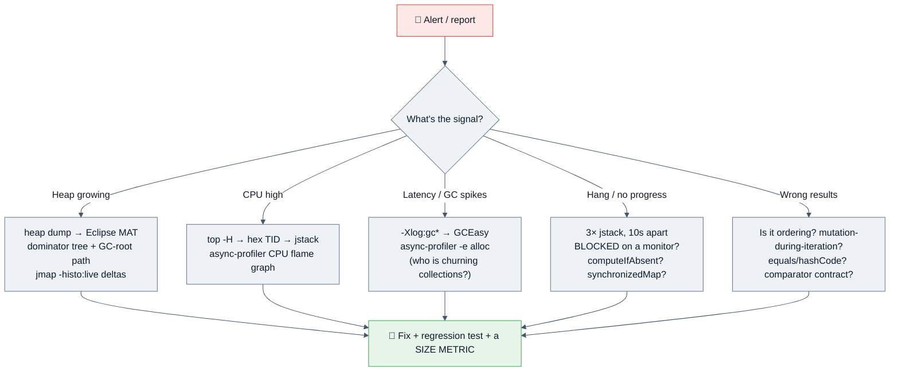

## 9.3 Tooling

| Tool | Use for collections specifically |
|---|---|
| **Eclipse MAT** | ⭐ Dominator tree + **retained size** — finds *which* map is holding the heap, and the GC-root path to who owns it. Its OQL lets you query e.g. all `HashMap`s with `size > 100000` |
| `jcmd <pid> GC.class_histogram` / `jmap -histo:live` | Two snapshots hours apart → growth delta by class. `HashMap$Node` climbing = an unbounded map |
| **async-profiler `-e alloc`** | Flame graph of *allocation* — instantly shows resize storms (`Arrays.copyOf`), boxing, and `toArray` churn |
| **JFR** | Always-on (~1% overhead): allocation, GC, `jdk.JavaMonitorEnter` for contention on a `synchronizedMap` |
| **JMH** | The only correct way to benchmark a collection choice |
| **JCStress** | Verifying that your concurrent collection usage is actually correct under the JMM |
| **Caffeine `recordStats()` + Micrometer** | Hit rate, eviction count, load penalty — export these or you're flying blind |
| `Collections.checkedList/Map` | Wrap in tests to catch **heap pollution** from raw types at the point of insertion rather than at a distant `ClassCastException` |
| **ArchUnit / Error Prone / SpotBugs** | Ban `static` mutable collections, unbounded caches, and raw types at build time |

> [!WARNING]
> **`jmap -histo:live` triggers a Full GC** — it will pause production. Prefer JFR or a heap dump taken during a maintenance window, or take the dump from a canary instance.

---

# 10. 🔒 Security

## 10.1 Attack vectors specific to collections

| Vector | Mechanism | Real-world | Mitigation |
|---|---|---|---|
| **Hash-flooding / hash-collision DoS** | An attacker crafts thousands of keys that hash to the same bucket. Pre-Java-8, each bin was a linked list → `HashMap` degrades from O(1) to **O(n)**, so *n* form parameters cost O(n²) CPU. A few hundred KB of POST body could pin a CPU core | **CVE-2011-4858** / oCERT-2011-003 hit Java, PHP, Python, Ruby, Node and ASP.NET simultaneously | **Java 8 treeification** degrades to O(log n) instead of O(n) — a genuine security fix, not just performance. Also: cap request parameter counts (Tomcat's `maxParameterCount`), validate input size, and use a `TreeMap` or a keyed HMAC hash for attacker-controlled keys |
| **Unbounded collection → memory-exhaustion DoS** | Any request-driven `add`/`put` with no cap: dedup sets, session maps, per-user rate-limiter maps, retry queues | The most common self-inflicted outage in Java services | **Bound everything**: max size, TTL, and weight. Reject or shed beyond the bound. Never let an attacker choose your collection's size |
| **Deserialization gadget chains** | `ObjectInputStream.readObject()` on untrusted bytes. **Apache Commons-Collections' `InvokerTransformer`** chained through `TransformedMap`/`LazyMap` gives arbitrary remote code execution | **CVE-2015-4852** — devastated WebLogic, JBoss, Jenkins, WebSphere. The gadget was literally a *collections* class | Never deserialize untrusted data. **`ObjectInputFilter`** allow-lists (Java 9+, backported to 8u121); `-Djdk.serialFilter`; prefer JSON/Protobuf. Upgrade Commons-Collections (3.2.2+ disables the dangerous transformers by default) |
| **Algorithmic complexity via a bad comparator/regex in a sort key** | Sorting attacker-influenced data with an expensive `compareTo`, or a `TreeMap` keyed on a regex-derived value (ReDoS) | | Bound input size; keep comparators trivial; precompute sort keys |
| **Zip/JSON expansion into collections** | Parsing an untrusted archive or deeply nested JSON straight into `List`/`Map` — a 1 KB payload can expand to gigabytes | "Billion laughs" for JSON/XML | Cap entry counts, nesting depth, total size, and compression ratio **before** materializing collections |
| **Exposing internal mutable collections** | A getter returns the live internal `List`; a caller mutates it and breaks your invariants (or escalates privileges via a mutated role set) | | Return `List.copyOf(...)` or an unmodifiable view; defensive-copy on the way **in** as well |
| **Sensitive data lingering in collections** | Credentials/PII in a long-lived cache appear in heap dumps and core dumps | | Don't cache secrets; use `char[]`/`byte[]` zeroed after use; redact before logging collections |
| **Cache poisoning / key confusion** | A cache key missing tenant, locale, auth-scope, or version → one user's data served to another | A severe, recurring SaaS bug class | **`record` cache keys** with every discriminator; test with two tenants; never build keys by string concatenation with user input |
| **`Set.of`/`Map.of` order assumptions in security logic** | Iteration order is randomized per JVM run; code that assumed order (e.g. picking "the first" credential or rule) behaves nondeterministically | | Never derive security decisions from unspecified iteration order — sort explicitly |
| **Raw types / heap pollution** | A raw `List` reference lets an `Integer` into a `List<String>`; the `ClassCastException` surfaces far from the injection point | | Generics everywhere; `Collections.checkedList` in tests; `-Xlint:unchecked` as an error |

## 10.2 Secure coding patterns

```java
// ✅ Defensive copies in AND out — protect invariants
public final class Order {
    private final List<Item> items;
    public Order(List<Item> items) { this.items = List.copyOf(items); }   // copy IN (and immutable)
    public List<Item> items() { return items; }                           // already unmodifiable
}

// ✅ Bounded, evicting cache — never an unbounded HashMap
Cache<Key, Value> cache = Caffeine.newBuilder()
    .maximumSize(10_000)
    .expireAfterWrite(Duration.ofMinutes(10))
    .recordStats()                                   // ⭐ observability is a security control
    .build();

// ✅ Cache keys that cannot be confused across tenants
record CacheKey(String tenantId, String userId, Locale locale, int schemaVersion) {}

// ✅ Deserialization allow-list
ObjectInputFilter filter =
    ObjectInputFilter.Config.createFilter("com.myapp.dto.*;java.util.*;java.base/*;!*");
ois.setObjectInputFilter(filter);

// ✅ Cap attacker-controlled collection growth at the boundary
if (request.params().size() > MAX_PARAMS) throw new BadRequestException("too many parameters");
```

## 10.3 Checklist

- [ ] **No unbounded collection is ever fed by user input** — size cap, TTL, or both
- [ ] Every cache has `maximumSize`/`expireAfter` **and** exported metrics
- [ ] Cache keys include tenant, locale, auth scope, and schema version
- [ ] Never deserialize untrusted Java objects; keep Commons-Collections current
- [ ] Defensive copies at every public API boundary (in and out)
- [ ] Attacker-controlled map keys: cap the count, or prefer `TreeMap`
- [ ] No security logic depends on `HashMap`/`Set.of` iteration order
- [ ] No secrets held in long-lived collections
- [ ] Generics everywhere; raw types are a build error

---

# 11. ⚡ Performance

## 11.1 The method (say this before any trick)

```mermaid
%%{init: {'theme':'base','themeVariables':{'background':'#ffffff','mainBkg':'#eef2f7','primaryColor':'#eef2f7','primaryTextColor':'#111827','primaryBorderColor':'#64748b','secondaryColor':'#e8f0fe','tertiaryColor':'#f1f5f9','lineColor':'#475569','textColor':'#111827','clusterBkg':'#f8fafc','clusterBorder':'#94a3b8','edgeLabelBackground':'#ffffff','titleColor':'#111827','actorBkg':'#eef2f7','actorTextColor':'#111827','actorBorder':'#64748b','actorLineColor':'#475569','signalColor':'#111827','signalTextColor':'#111827','noteBkgColor':'#fff4e5','noteTextColor':'#111827','noteBorderColor':'#d97706','labelBoxBkgColor':'#eef2f7','labelBoxBorderColor':'#64748b','labelTextColor':'#111827','loopTextColor':'#111827','altBackground':'#f8fafc'}}}%%
flowchart LR
    A["1️⃣ Define the goal<br/>p99? throughput?<br/>heap? cost/req?"] --> B["2️⃣ Measure<br/>JFR, async-profiler alloc,<br/>MAT retained size"]
    B --> C["3️⃣ Attribute<br/>Is it the collection,<br/>or the GC it causes?"]
    C --> D["4️⃣ Change ONE thing<br/>with a hypothesis"]
    D --> E["5️⃣ Re-measure<br/>JMH + canary"]
    E -->|goal met| F["6️⃣ Lock it in<br/>regression test + metric"]
    E -->|not yet| C
    style A fill:#fff4e5,stroke:#f4b400,color:#111827
    style F fill:#e6f4ea,stroke:#34a853,color:#111827
```

## 11.2 Memory footprint — the numbers that win finance interviews

**Per-element overhead (64-bit HotSpot, compressed oops):**

| Structure | Per-element cost | 1M elements |
|---|---|---|
| `int[]` | **4 B** | **4 MB** |
| `ArrayList<Integer>` | 4 B ref + **16 B boxed `Integer`** | ~20 MB (**5×**) |
| `LinkedList<Integer>` | ~24 B node + 16 B `Integer` | ~40 MB (**10×**) |
| `HashMap<Integer,Integer>` | ~32 B `Node` + ~5 B table slot + 2×16 B boxes | ~85 MB (**~10× vs two int[]**) |
| `TreeMap<Integer,Integer>` | ~40 B `Entry` + 2×16 B boxes | ~72 MB |
| `EnumSet` | **1 bit** 🚀 | negligible |
| Agrona `Int2IntHashMap` (open addressing) | ~8–16 B (two primitive arrays, load-factor slack) | ~8–16 MB |

> [!TIP]
> **The soundbite:** *"A `HashMap<Integer,Integer>` with a million entries costs about 85 MB. Two `int[]` arrays cost 8. That 10× is why Goldman Sachs wrote GS Collections — now Eclipse Collections — and why Spark's Tungsten engine abandoned `java.util` on hot paths. It matters when the live set drives GC pause, or when you're near the 32 GB compressed-oops cliff."*

**Also remember:** GC pause time scales roughly with the **live set** and the **number of objects to trace**, not with the heap size. A million `Node` objects is a million things for the GC to mark, every cycle.

## 11.3 Cache locality — the invisible 10×

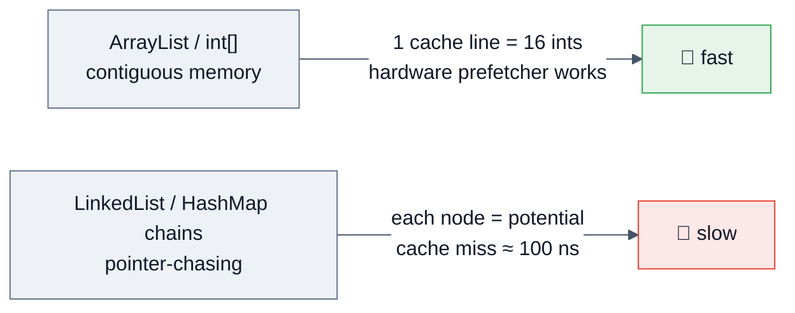
An L1 hit is ~1 ns; a main-memory access is ~100 ns. Traversing a `LinkedList` of 1M nodes scattered across the heap can be **10–50× slower** than traversing an equivalent array — even though both are "O(n)". This is why `ArrayList` beats `LinkedList` in almost every benchmark despite the textbook complexity table, and it is the single best explanation to give when an interviewer pushes back on "but insertion is O(1)!"

## 11.4 Benchmarking correctly (JMH)

```java
@BenchmarkMode(Mode.AverageTime)
@OutputTimeUnit(TimeUnit.NANOSECONDS)
@State(Scope.Benchmark)
@Warmup(iterations = 5, time = 1)
@Measurement(iterations = 10, time = 1)
@Fork(value = 2, jvmArgs = {"-Xms2g", "-Xmx2g"})
public class MapBenchmark {
    @Param({"1000", "1000000"}) int size;
    private Map<Integer,Integer> hashMap, treeMap;
    private int[] keys;

    @Setup public void setup() {
        hashMap = HashMap.newHashMap(size);            // ⭐ pre-sized: measures lookup, not resize
        treeMap = new TreeMap<>();
        keys = new Random(42).ints(size, 0, size * 10).toArray();
        for (int k : keys) { hashMap.put(k, k); treeMap.put(k, k); }
    }

    @Benchmark public void hashGet(Blackhole bh) {     // ⭐ Blackhole defeats dead-code elimination
        for (int k : keys) bh.consume(hashMap.get(k));
    }
    @Benchmark public void treeGet(Blackhole bh) {
        for (int k : keys) bh.consume(treeMap.get(k));
    }
}
```
**JMH pitfalls to name:** dead-code elimination, constant folding, loop hoisting, **OSR** compilation of the benchmark loop, insufficient warmup, a single fork letting one benchmark's JIT profile pollute the next, and — specific to collections — **measuring resize instead of lookup** because you forgot to pre-size, or benchmarking with sequential integer keys (which hash perfectly and hide collision behaviour).

## 11.5 Optimization levers, ranked by payoff

1. **Choose the right structure** — `EnumMap` over `HashMap<Enum,…>`, `ArrayDeque` over `LinkedList`, `int[]` over `List<Integer>`. Biggest single win.
2. **Pre-size** — `HashMap.newHashMap(n)` (19+), `new ArrayList<>(n)`. Resizing 1M entries re-links everything.
3. **Stop boxing** — `IntStream`, primitive collections, `long` keys packed into a single array.
4. **Iterate `entrySet()`**, never `keySet()` + `get()` (which hashes twice).
5. **`removeIf`** over iterator loops (`ArrayList` uses a bitset + single compaction pass).
6. **Batch** — `addAll` can pre-grow once instead of n times.
7. **Cache expensive hashes** — precompute in an immutable key's constructor.
8. **Kill contention** — shard a hot map, replace `synchronizedMap` with `ConcurrentHashMap`, replace hot counters with `LongAdder`, remove `CopyOnWriteArrayList` from write paths.
9. **Wrap arguments to `removeAll`/`retainAll` in a `HashSet`** — turns O(n×m) into O(n+m).
10. **Go off-heap** (Chronicle Map, FFM API) only when GC pause — not throughput — is the binding constraint.

## 11.6 Throughput vs latency vs footprint

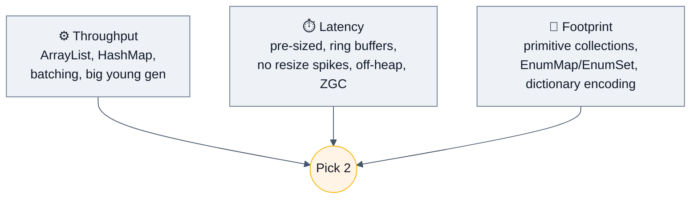

> [!TIP]
> **Little's Law (`L = λ × W`)** applies directly to queue sizing: in-flight items = arrival rate × service time. At 1,000 items/s with 200 ms processing you need **200 in flight** — so a 50-slot queue will reject and a 100,000-slot queue is just hiding the problem until you OOM. Use it live to size a `BlockingQueue`.

---

# 12. ✅ Best Practices

## 12.1 Choosing and declaring

| # | Practice | Why |
|---|---|---|
| 1 | **Declare the interface, instantiate the implementation**: `List<X> l = new ArrayList<>()` | Swappable, testable, and it stops callers depending on `ArrayList` specifics |
| 2 | **Default to `ArrayList`, `HashMap`, `HashSet`, `ArrayDeque`, `ConcurrentHashMap`** | Everything else needs a stated reason |
| 3 | **Pre-size when you know the size**: `HashMap.newHashMap(n)`, `new ArrayList<>(n)` | Avoids resize + rehash storms |
| 4 | **`ArrayDeque` for stacks and queues** — never `Stack`, never `LinkedList` | `Stack` is legacy `Vector` and iterates in the wrong order |
| 5 | **`EnumMap`/`EnumSet` for enum keys** | Array/bit-vector backed: faster and dramatically smaller |
| 6 | **Return `List.of()`/`Map.of()`, never `null`** | Removes an entire class of NPE at every call site |
| 7 | **Return immutable copies from getters**; defensive-copy in constructors | Protects invariants; makes the object safely shareable |
| 8 | **`record` types for composite keys** | Correct `equals`/`hashCode` by construction |
| 9 | **Never mutate an object while it is a key** in a hash or tree collection | The entry becomes unreachable and leaks |
| 10 | **Document ordering, nullability, thread-safety and complexity** in the javadoc of any collection you return | The JDK does this; your callers need it |

## 12.2 Concurrency

| # | Practice |
|---|---|
| 1 | **`ConcurrentHashMap` over `Collections.synchronizedMap`** unless you need to lock across operations |
| 2 | **Use the atomic compound ops**: `putIfAbsent`, `computeIfAbsent`, `merge`, `replace(k, old, new)` — never check-then-act |
| 3 | **Keep `computeIfAbsent`/`merge` functions short, pure, and map-free** (the bin is locked) |
| 4 | **Bound every queue.** Never `Executors.newFixedThreadPool` — build a `ThreadPoolExecutor` with an explicit bounded queue and rejection policy |
| 5 | **Immutable payload + `volatile` reference swap** for read-mostly shared state (config, routing tables) — zero read cost |
| 6 | **`ConcurrentHashMap.newKeySet()`** for a concurrent set (there is no `ConcurrentHashSet`) |
| 7 | **Never rely on `size()`/`isEmpty()` of a concurrent collection** for correctness — they're estimates |
| 8 | **`CopyOnWriteArrayList` only for small, read-dominated collections** (listener registries) |
| 9 | **Manually synchronize while iterating a `Collections.synchronizedXxx`** — the wrapper doesn't do it for you |
| 10 | **Don't use `ThreadLocal` collections with virtual threads** — one buffer × 1M threads. Prefer `ScopedValue` or a bounded pool |

## 12.3 Caching

- **Every cache needs a bound** (`maximumSize` and/or `expireAfterWrite`) — no exceptions.
- **Every cache needs metrics**: hit rate, eviction count, load latency, size. Caffeine's `recordStats()` + Micrometer.
- **Prevent stampedes**: single-flight loading (`computeIfAbsent` / `AsyncLoadingCache`) + **jittered TTLs**.
- **Namespace cache keys** with tenant, locale, auth scope, and schema version.
- **A cache must never be an availability dependency** — a miss should be slow, not fatal.
- **Prefer Caffeine** over hand-rolled LRU: better hit rate (W-TinyLFU), scan-resistant, lock-free reads, battle-tested.

## 12.4 Streams over collections

```java
// ✅ Good
Map<Dept, List<String>> byDept = emps.stream()
    .filter(e -> e.active())
    .collect(Collectors.groupingBy(Emp::dept, Collectors.mapping(Emp::name, Collectors.toList())));

// ⚠️ toMap needs a merge function when keys can repeat, and rejects null VALUES
Map<String,Integer> m = emps.stream()
    .collect(Collectors.toMap(Emp::name, Emp::age, (a, b) -> b, LinkedHashMap::new));
```
- **Don't mutate an external collection from inside a stream** — use a collector.
- **Don't parallelize by default.** `parallelStream()` uses the shared `ForkJoinPool.commonPool()`; one bad call starves every other parallel stream in the JVM. Only for large (≳10k), CPU-bound, independent work over a well-splitting source (`ArrayList`/array — **not** `LinkedList`), and only after measuring.
- Prefer **`Stream.toList()`** (Java 16) over `collect(Collectors.toList())` when you want an unmodifiable result.
- A `for` loop is often clearer and faster for trivial work — streams are not a moral obligation.

## 12.5 Testing

| Practice | Detail |
|---|---|
| Test the **contract**, not the implementation | Assert on content and (only if guaranteed) order |
| Use AssertJ | `assertThat(list).containsExactly(...)` vs `containsExactlyInAnyOrder(...)` makes ordering assumptions explicit |
| **Never assert on `HashMap`/`Set.of` iteration order** | It's unspecified and randomized per JVM run |
| Concurrency | JCStress, or `CountDownLatch`-driven deterministic tests — **never `Thread.sleep`** |
| Memory | Soak tests long enough to reveal unbounded growth; assert cache size stays bounded |
| `Collections.checkedList/Map` in tests | Catches heap pollution from raw types at the point of insertion |
| Property-based testing (jqwik) | Finds the edge cases in your custom collection you didn't imagine |
| ArchUnit | Ban `static` mutable collections and raw types as a test |

---

# 13. 🚫 Anti-patterns

| # | Anti-pattern | Why it's harmful | Do instead |
|---|---|---|---|
| 1 | **Unbounded cache / `static` collection** | The #1 Java memory leak in production write-ups | Caffeine with `maximumSize` + TTL + metrics |
| 2 | Using `Vector`, `Hashtable`, or `Stack` | Legacy; per-method locking gives no compound safety; `Stack` iterates in the wrong order | `ArrayList`, `ConcurrentHashMap`, `ArrayDeque` |
| 3 | `LinkedList` because "insertion is O(1)" | Reaching the position is O(n); ~6× the memory; terrible cache locality | `ArrayList` or `ArrayDeque` |
| 4 | `list.get(i)` in a loop over a `LinkedList` | O(n²) | Iterator / for-each |
| 5 | `Executors.newFixedThreadPool(n)` | Unbounded `LinkedBlockingQueue` → OOM under load; `maximumPoolSize` never reached | Explicit `ThreadPoolExecutor` + bounded queue + `CallerRunsPolicy` |
| 6 | Removing from a collection inside a for-each | CME — or worse, **silent wrong behaviour** at the second-to-last element | `removeIf` / `Iterator.remove` |
| 7 | `if (!map.containsKey(k)) map.put(k, v)` | Check-then-act race, even on `ConcurrentHashMap` | `putIfAbsent` / `computeIfAbsent` |
| 8 | `map.put(k, map.get(k) + 1)` | Read-modify-write race; two lookups; NPE on absent key | `merge(k, 1, Integer::sum)` |
| 9 | Mutating an object that is a map/set key | Entry orphaned in the wrong bucket — unfindable, unremovable, leaked | Immutable keys (`record`) |
| 10 | `equals` without `hashCode` (or vice versa) | Silent data loss in every hash container | Generate both, or use a `record` |
| 11 | Returning `null` instead of an empty collection | NPE at every call site | `List.of()` / `Collections.emptyList()` |
| 12 | Exposing the internal mutable collection from a getter | Callers can violate your invariants | `List.copyOf(...)` or an unmodifiable view |
| 13 | Treating `Collections.unmodifiableList` as immutable | It's a **view** — the backing list can still change | `List.copyOf(...)` |
| 14 | `Collectors.toMap` without a merge function | `IllegalStateException` on the first duplicate key in production | Supply a merge function, or `groupingBy` |
| 15 | Depending on `HashMap`/`Set.of` iteration order | Unspecified, and randomized per JVM run | `LinkedHashMap`/`TreeMap`, or sort explicitly |
| 16 | `CopyOnWriteArrayList` on a write path | O(n) copy per write; 2× transient memory | `ConcurrentHashMap.newKeySet()` or a proper concurrent structure |
| 17 | `retainAll`/`removeAll` with a `List` argument | O(n × m) | Wrap the argument in a `HashSet` |
| 18 | Long-lived `computeIfAbsent` mapping functions on a `ConcurrentHashMap` | Bin stays locked → contention or deadlock | Load outside, then `putIfAbsent` |
| 19 | `parallelStream()` sprinkled for "speed" | Common-pool starvation, worse latency, bad splitting on linked sources | Measure; use a dedicated pool or don't parallelize |
| 20 | Raw types (`List list = ...`) | Heap pollution; `ClassCastException` far from the cause | Generics; `-Xlint:unchecked` as an error |
| 21 | `new HashMap<>(1_000_000)` "to be safe" | Wastes memory, hurts locality, and makes iteration O(capacity) forever | Size from the expected count |
| 22 | Reimplementing `HashMap`/LRU/thread-safe list by hand in production | Subtle bugs the JDK took 20 years to shake out | Use the JDK, Guava, Caffeine, Eclipse Collections |
| 23 | Storing an entire object graph in a session/cache | Serialization cost, memory blowup, staleness | Store IDs; reload on demand |
| 24 | `synchronized` on the collection *and* on your own lock inconsistently | Deadlock or no protection at all | One documented locking strategy |
| 25 | Using `size()` of a concurrent collection for quotas/billing | It's an estimate | An explicit `AtomicLong` / `Semaphore` |
| 26 | `SoftReference`-based caches | Makes GC unpredictable; widely discouraged now | Explicit bounds + TTL |
| 27 | Keeping a `subList`/`keySet` view of a huge collection | Retains the entire backing collection | `List.copyOf(view)` |

---

# 14. 📊 Comparison Tables

## 14.1 `ArrayList` vs `LinkedList` vs `Vector` vs `CopyOnWriteArrayList`

| | `ArrayList` | `LinkedList` | `Vector` | `CopyOnWriteArrayList` |
|---|---|---|---|---|
| Backing | resizable array | doubly-linked nodes | resizable array | volatile array, copied per write |
| `get(i)` | **O(1)** | O(n) | O(1) | O(1) |
| `add` (end) | O(1)* | O(1) | O(1)* | **O(n)** |
| `add`/`remove` (middle) | O(n) | O(1) *if already positioned* | O(n) | O(n) |
| Growth | **×1.5** | n/a | **×2** | exact |
| Thread-safe | ❌ | ❌ | ✅ (every method) | ✅ (lock-free reads) |
| Memory/element | **4 B** | ~24 B | 4 B | 4 B (×2 during a write) |
| Cache locality | ✅ excellent | ❌ poor | ✅ | ✅ |
| Also a `Deque`? | ❌ | ✅ | ❌ | ❌ |
| Use for | **default** | almost never | legacy only | small read-mostly listener lists |

## 14.2 `HashMap` vs `LinkedHashMap` vs `TreeMap` vs `Hashtable` vs `ConcurrentHashMap`

| | `HashMap` | `LinkedHashMap` | `TreeMap` | `Hashtable` | `ConcurrentHashMap` |
|---|---|---|---|---|---|
| Ordering | none | insertion **or access** | **sorted** | none | none |
| get/put | O(1) avg, O(log n) worst | O(1) | O(log n) | O(1) | O(1) |
| Null key | 1 | 1 | ❌ | ❌ | ❌ |
| Null values | ✅ | ✅ | ✅ | ❌ | ❌ |
| Thread-safe | ❌ | ❌ | ❌ | ✅ whole-object | ✅ per-bin |
| Iterator | fail-fast | fail-fast | fail-fast | fail-fast (`Enumeration` isn't) | weakly consistent |
| Atomic compounds | ❌ | ❌ | ❌ | ❌ | ✅ `merge`, `compute`… |
| Extra memory | baseline | +2 refs/entry | tree links | baseline | +counter cells |
| Uses | `equals`+`hashCode` | `equals`+`hashCode` | **`compareTo` only** | `equals`+`hashCode` | `equals`+`hashCode` |
| Use for | **default** | **LRU**, predictable output | ranges, `floorKey`, `subMap` | never (legacy) | **concurrent default** |

## 14.3 `HashSet` vs `LinkedHashSet` vs `TreeSet` vs `EnumSet`

| | `HashSet` | `LinkedHashSet` | `TreeSet` | `EnumSet` |
|---|---|---|---|---|
| Backed by | `HashMap` | `LinkedHashMap` | `TreeMap` | **bit vector** (`long` or `long[]`) |
| Ordering | none | insertion | sorted | enum declaration order |
| add/contains | O(1) | O(1) | O(log n) | **O(1)**, bitwise |
| Null | 1 | 1 | ❌ | ❌ |
| Memory | baseline | +2 refs | tree links | **1 bit/element** 🚀 |
| Use for | default | dedupe + order | ranges, sorted output | any enum set |

## 14.4 Queue & Deque implementations

| | `ArrayDeque` | `LinkedList` | `PriorityQueue` | `ArrayBlockingQueue` | `LinkedBlockingQueue` | `ConcurrentLinkedQueue` |
|---|---|---|---|---|---|---|
| Structure | circular array | linked nodes | binary heap | ring buffer | linked nodes | lock-free linked (Michael–Scott) |
| Bounded | ❌ grows | ❌ | ❌ grows | **✅ always** | optional (**default ~unbounded ⚠️**) | ❌ |
| Blocking | ❌ | ❌ | ❌ | ✅ | ✅ | ❌ |
| Thread-safe | ❌ | ❌ | ❌ | ✅ (1 lock) | ✅ (2 locks) | ✅ lock-free |
| Ordering | FIFO/LIFO | FIFO/LIFO | **priority** | FIFO | FIFO | FIFO |
| Nulls | ❌ | ✅ | ❌ | ❌ | ❌ | ❌ |
| `size()` | O(1) | O(1) | O(1) | O(1) | O(1) | **O(n)**, estimate |
| Use for | **stack/queue default** | rarely | scheduling, top-K | producer-consumer w/ backpressure | high-contention producer-consumer | non-blocking hand-off |

## 14.5 Thread-safety strategies

| | No sync | `Collections.synchronizedXxx` | `java.util.concurrent` | Immutable + volatile swap |
|---|---|---|---|---|
| Read cost | free | **blocks** | ~free | **free** |
| Write cost | free | blocks | fine-grained | O(n) copy |
| Compound atomicity | ❌ | client-side locking possible | ✅ per key | n/a (whole snapshot) |
| Iteration | fail-fast | fail-fast + **manual sync required** | weakly consistent | perfectly consistent |
| Best for | single-threaded / confined | legacy, or lock-across-ops | **general concurrency** | read-mostly config/routing |

## 14.6 Java version timeline for collections

| Version | What arrived |
|---|---|
| **1.0/1.1** | `Vector`, `Hashtable`, `Stack`, `Enumeration` |
| **1.2** | 🎉 The **Collections Framework**: `Collection`, `List`, `Set`, `Map`, `ArrayList`, `HashMap`, `TreeMap`, `Collections`, `Iterator` |
| **1.4** | `LinkedHashMap`, `LinkedHashSet`, `IdentityHashMap`, `RandomAccess` |
| **5** | **Generics**, `Queue`, `java.util.concurrent` (Doug Lea): `ConcurrentHashMap`, `CopyOnWriteArrayList`, `BlockingQueue`, `EnumMap`/`EnumSet`, for-each |
| **6** | `Deque`, `ArrayDeque`, `NavigableMap`/`NavigableSet`, `ConcurrentSkipListMap` |
| **7** | `TransferQueue`/`LinkedTransferQueue`, diamond operator `<>` |
| **8** | **Streams**, `forEach`, `removeIf`, `computeIfAbsent`/`merge`/`getOrDefault`, `Spliterator`, `HashMap` **treeification**, `ConcurrentHashMap` redesign (no segments), `StampedLock` |
| **9** | **`List.of`/`Set.of`/`Map.of`** immutable factories, `Map.entry`, private interface methods |
| **10** | `List/Set/Map.copyOf`, `Collectors.toUnmodifiableXxx` |
| **11** | `Collection.toArray(IntFunction)` |
| **16** | **`Stream.toList()`** |
| **19** | `HashMap.newHashMap(n)` (and `newLinkedHashMap`, `newHashSet`) — correct pre-sizing |
| **21 LTS** | 🆕 **Sequenced Collections** (JEP 431): `SequencedCollection`/`Set`/`Map`, `getFirst`/`getLast`/`reversed()` |
| **24** | JEP 491 — `synchronized` no longer pins virtual threads (helps every `synchronized`-based collection under Loom) |
| **25 LTS** | Sep 2025; no major collections changes — the frontier is **Valhalla** (`List<int>` without boxing) |

## 14.7 JDK vs third-party collection libraries

| Library | What it adds | When to add the dependency |
|---|---|---|
| **Guava** (Google) | `Multimap`, `Multiset`, `BiMap`, `Table`, `RangeMap`, `ImmutableXxx`, `Sets.difference/union` views | You need multimaps or rich immutable factories. ⚠️ Guava's `Cache` is superseded by Caffeine |
| **Caffeine** | High-performance cache: W-TinyLFU, async loading, size/time/weight eviction, stats | ⭐ **Any** production cache |
| **Eclipse Collections** (ex-GS Collections, Goldman Sachs) | Primitive collections, memory-optimized containers, a much richer API, immutable variants | Memory-constrained or very large collections |
| **fastutil / HPPC / Koloboke** | Primitive-specialized maps/sets/lists, open addressing | Millions of primitive entries; GC pressure |
| **Agrona** (Real Logic) | `Int2ObjectHashMap`, ring buffers, off-heap buffers, zero-allocation design | Low-latency / HFT-style systems |
| **Chronicle Map** | Off-heap, persistent, shared-memory map | Data must survive GC scope or be shared between processes |
| **Vavr / PCollections** | Persistent (structurally shared) immutable collections — HAMT/CHAMP tries | Functional style; frequent "copy with one change" |
| **Apache Commons Collections** | Bags, bidi maps, older utilities | ⚠️ Mostly superseded by the JDK and Guava; **historic deserialization gadget-chain source** — keep it current or avoid |

## 14.8 Java collections vs other languages

| Concept | Java | C++ STL | Python | Go | Rust |
|---|---|---|---|---|---|
| Dynamic array | `ArrayList` | `vector` | `list` | slice | `Vec` |
| Hash map | `HashMap` | `unordered_map` | `dict` (**insertion-ordered since 3.7**) | `map` | `HashMap` |
| Sorted map | `TreeMap` (red-black) | `map` (red-black) | — (`sortedcontainers`) | — | `BTreeMap` |
| Set | `HashSet` | `unordered_set` | `set` | `map[T]struct{}` | `HashSet` |
| Deque | `ArrayDeque` | `deque` | `collections.deque` | slice | `VecDeque` |
| Heap | `PriorityQueue` | `priority_queue` | `heapq` | `container/heap` | `BinaryHeap` |
| Primitives in generics | ❌ (boxing; Valhalla pending) | ✅ | n/a | ✅ | ✅ |
| Iterator invalidation | CME (best-effort) | **undefined behaviour** ☠️ | RuntimeError | undefined map order | **prevented at compile time** by the borrow checker |
| Concurrent map | `ConcurrentHashMap` | — (needs a lock) | dict + GIL | `sync.Map` | `DashMap` (crate) |

> [!TIP]
> **A great comparative point:** Rust's borrow checker makes `ConcurrentModificationException` a *compile* error; C++ makes it undefined behaviour; Java makes it a best-effort runtime exception. That's a real design-trade-off observation, not trivia.

---

# 15. 🗂️ Cheat Sheet (One-Page Revision)

```text
╔══════════════════════════════════════════════════════════════════════════════╗
║                 JAVA COLLECTIONS — ONE-PAGE CHEAT SHEET                      ║
╚══════════════════════════════════════════════════════════════════════════════╝

HIERARCHY   Iterable → Collection → List | Set | Queue → Deque
            Map is SEPARATE (not a Collection) → SortedMap → NavigableMap
            Java 21: SequencedCollection / SequencedSet / SequencedMap

DEFAULTS    ArrayList · HashMap · HashSet · ArrayDeque · ConcurrentHashMap
            Anything else requires a REASON.

ARRAYLIST   lazy init; DEFAULT_CAPACITY 10 on first add; grow = old + (old>>1) ≈ ×1.5
            get O(1) | add(end) O(1)* | add/remove(mid) O(n) | contains O(n)
            elementData is transient (custom writeObject writes only `size`)
            ⚠️ remove(int) = INDEX, remove(Object) = VALUE
            ⚠️ subList/keySet are VIEWS → retain the whole backing collection

LINKEDLIST  doubly-linked, implements List AND Deque; ~24 B/node overhead
            get(i) walks from the nearer end; for-each not get(i) → avoid O(n²)
            Verdict: use ArrayList, or ArrayDeque for queue/stack

ARRAYDEQUE  circular buffer, default 16, no nulls (null = empty sentinel)
            O(1) both ends. JDK8: power-of-two + doubling; JDK11+: rewritten
            ⭐ THE stack and queue — not Stack (legacy Vector, iterates bottom-up)

PRIORITYQ   binary min-heap in an array; default cap 11
            peek O(1) | offer/poll O(log n) | remove(Object)/contains O(n)
            heapify(Collection) O(n) | unbounded, no nulls, NOT stable
            ⚠️ ITERATION ORDER IS HEAP ORDER, NOT SORTED

HASHMAP     hash = h ^ (h>>>16) → i = (n-1) & hash → bin → list → RB-tree
            16 / 0.75 / TREEIFY 8 / UNTREEIFY 6 / MIN_TREEIFY_CAPACITY 64
            Node caches the hash (resize never re-hashes)
            power of two ⇒ AND instead of %, and lo/hi split via (hash & oldCap)
            Java7→8: head→tail insert, list→tree, resize infinite loop fixed
            1 null key, N null values | iteration is O(n + CAPACITY)
            Pre-size: HashMap.newHashMap(n)  [Java 19+]  — (int)(n/0.75f)+1 before

LINKEDHM    HashMap + doubly-linked entries; accessOrder=true + removeEldestEntry = LRU
            ⚠️ in access-order mode a get() IS a structural modification

TREEMAP     red-black tree, O(log n) guaranteed, sorted, NO null keys
            uses compareTo/Comparator — NEVER equals
            floor/ceiling/higher/lower/subMap/headMap/tailMap/descendingMap
            ⭐ consistent-hashing ring = TreeMap + ceilingEntry + firstEntry wraparound

SETS        HashSet = HashMap w/ PRESENT dummy | LinkedHashSet = LinkedHashMap
            TreeSet = TreeMap | EnumSet = BIT VECTOR (RegularEnumSet ≤64 → one long;
            JumboEnumSet >64 → long[]) chosen by the ENUM'S UNIVERSE SIZE
            EnumMap = Object[] indexed by ordinal()

CONCURRENT  ConcurrentHashMap (J8): NO segments. CAS on empty bin,
              synchronized on the bin's FIRST NODE otherwise.
              ForwardingNode + helpTransfer = COOPERATIVE resize.
              size() = baseCount + CounterCell[] → an ESTIMATE (mappingCount → long)
              NO nulls (get()==null must mean absent)
              Atomic: putIfAbsent, computeIfAbsent, compute, merge, replace(k,old,new)
              ⚠️ computeIfAbsent's function runs WITH THE BIN LOCKED → never touch the map
            CopyOnWriteArrayList: lock-free reads, O(n) WRITES, snapshot iterators
            ConcurrentSkipListMap: lock-free skip list, sorted, size() O(n)
            newKeySet() / Collections.newSetFromMap → a concurrent Set

QUEUES      ArrayBlockingQueue  bounded, 1 lock, ring buffer, low GC
            LinkedBlockingQueue optional bound — DEFAULT Integer.MAX_VALUE ⚠️
            SynchronousQueue    capacity 0, direct hand-off (newCachedThreadPool)
            PriorityBlockingQueue unbounded heap | DelayQueue → ScheduledTPE
            ⚠️ Executors.newFixedThreadPool = UNBOUNDED QUEUE = OOM

ITERATION   fail-fast (modCount → CME, BEST-EFFORT ONLY)
            snapshot (COW) | weakly consistent (concurrent collections)
            Remove safely: removeIf | Iterator.remove | rebuild via stream
            ⚠️ removing the 2nd-to-last element in a for-each SILENTLY exits early

IMMUTABLE   List.of/Set.of/Map.of  → truly immutable, NO nulls (Java 9)
            List.copyOf                → independent copy (Java 10)
            Collections.unmodifiableX  → a VIEW, not a copy
            Arrays.asList              → fixed-size, mutable via set, writes through
            Stream.toList (16) allows nulls; toUnmodifiableList() doesn't
            ⚠️ Set.of / Map.of RANDOMIZE ITERATION ORDER PER JVM RUN

SORTING     objects → TimSort (STABLE, adaptive, O(n) on sorted, O(n) space)
            primitives → Dual-Pivot Quicksort (in place, stability irrelevant)
            ⚠️ (a,b)->a-b overflows → "Comparison method violates its general contract!"
               use Integer.compare / Comparator.comparingInt

JAVA 21     getFirst/getLast/addFirst/addLast/removeFirst/removeLast/reversed()
            SequencedMap: firstEntry/lastEntry/putFirst/putLast/sequencedKeySet
            reversed() is a VIEW (writes through)

MEMORY      int[] 4 B | ArrayList<Integer> ~20 B | LinkedList<Integer> ~40 B
            HashMap<Integer,Integer> ~85 B/entry → 1M entries ≈ 85 MB vs 8 MB int[]
            → Eclipse Collections (ex-GS), fastutil, Agrona, Koloboke, Chronicle Map
            Keep heap < 32 GB for compressed oops

TOP BUGS    unbounded collection (#1 leak) · CME · mutated key · lost update
            unbounded queue OOM · toMap duplicate key/null value
            removeAll(List) = O(n×m) · iteration-order dependence
            computeIfAbsent deadlock · subList view retention
```

---

# 16. 🃏 Flash Cards

<details>
<summary><b>Fundamentals & interfaces</b></summary>

| Q | A |
|---|---|
| Three parts of the JCF? | Interfaces, implementations, algorithms |
| Why isn't `Map` a `Collection`? | `Collection`'s core op is `add(E)`; a map stores *mappings*, not elements |
| Which three views does `Map` expose? | `keySet()`, `values()`, `entrySet()` — all live views |
| `Collection` vs `Collections`? | Root interface vs static utility class |
| `Iterator` vs `ListIterator`? | Forward + `remove` vs bidirectional + `set`/`add`/indices, `List` only |
| What is `Spliterator` for? | Splittable traversal for parallel streams; carries characteristics like `SIZED`, `ORDERED` |
| Throwing vs returning `Queue` methods? | `add`/`remove`/`element` throw; `offer`/`poll`/`peek` return `false`/`null` |
| What is `RandomAccess`? | A marker interface (`ArrayList`, `Vector`) telling algorithms indexed access is cheap |
| What did Java 21 add? | Sequenced Collections: `getFirst`/`getLast`/`reversed()` and `SequencedMap` |
| Is `reversed()` a copy? | **No** — a live view; writes go through |

</details>

<details>
<summary><b>Lists, deques and queues</b></summary>

| Q | A |
|---|---|
| `ArrayList` default capacity? | **10**, allocated lazily on the first `add` |
| `ArrayList` growth factor? | `old + (old >> 1)` ≈ **1.5×** (`Vector` doubles) |
| Why is `elementData` transient? | A custom `writeObject` serializes only `size` elements, not the oversized array |
| `list.remove(1)` on a `List<Integer>`? | Removes **index** 1 — use `remove(Integer.valueOf(1))` for the value |
| Memory per `LinkedList` node? | ~24 B with compressed oops (header + 3 refs), plus the element |
| Best stack implementation? | **`ArrayDeque`** — `Stack` extends `Vector` and iterates bottom-up |
| Why does `ArrayDeque` forbid null? | `null` is the sentinel `poll`/`peek` return for "empty" |
| Is `PriorityQueue` sorted when iterated? | **No** — heap order. Only `peek`/`poll` respect priority |
| `PriorityQueue` complexity? | `peek` O(1), `offer`/`poll` O(log n), `contains`/`remove(Object)` O(n) |
| Which `BlockingQueue` is unbounded by default? | `LinkedBlockingQueue` (`Integer.MAX_VALUE`) — the `newFixedThreadPool` landmine |
| What is `SynchronousQueue`? | Capacity zero — a direct hand-off; used by `newCachedThreadPool` |
| Is `subList` a copy? | No — a **view** that retains the entire backing list |

</details>

<details>
<summary><b>Maps & sets</b></summary>

| Q | A |
|---|---|
| `HashMap` default capacity and load factor? | 16 and 0.75 |
| Treeify conditions? | Bin length ≥ **8** **and** table length ≥ **64**; untreeify at **6** |
| Why 8 and 6, not 8 and 8? | Hysteresis — prevents thrashing at the boundary |
| Why `MIN_TREEIFY_CAPACITY = 64`? | Below it, long bins mean the table is too small → resize is cheaper and better |
| Why `h ^ (h >>> 16)`? | Indexing uses only low bits; XOR mixes the high bits in |
| Why must capacity be a power of two? | `& (n-1)` replaces `%`, and resize splits a bin by one bit test `(hash & oldCap)` |
| What does the `Node` cache? | The hash — so resize never re-hashes and lookups compare ints first |
| Java 7 vs 8 `HashMap` insert position? | Head (7) vs **tail** (8) |
| The famous Java 7 `HashMap` bug? | Concurrent resize created a circular list → 100% CPU forever |
| Worst-case `HashMap` lookup today? | O(log n) — tree bins |
| `HashMap` iteration complexity? | **O(n + capacity)** — the table never shrinks |
| How do you pre-size a `HashMap` correctly? | `HashMap.newHashMap(n)` (Java 19+), else `(int)(n/0.75f)+1` |
| `HashSet` internals? | A `HashMap` with a shared `PRESENT` dummy value |
| `LinkedHashMap` LRU recipe? | `super(cap, 0.75f, true)` + override `removeEldestEntry` |
| In access-order mode, is `get` structural? | **Yes** — iterating while calling `get` throws CME |
| Does `TreeMap` use `equals`? | **No** — only `compareTo`/`Comparator` |
| `TreeMap` navigation methods? | `floorKey` ≤, `ceilingKey` ≥, `lowerKey` <, `higherKey` >, `subMap`, `descendingMap` |
| Which two `EnumSet` implementations? | `RegularEnumSet` (one `long`, ≤64 constants) and `JumboEnumSet` (`long[]`) |
| What chooses between them? | The **enum's universe size**, not the element count |
| What is `WeakHashMap` for? | Metadata keyed by objects you don't own — ⚠️ values are held **strongly** |
| What is `IdentityHashMap` for? | `==` comparison, linear probing — object-graph traversal, deep copy, cycle detection |
| `Set.of` iteration order? | **Randomized per JVM run** by design |

</details>

<details>
<summary><b>Concurrency</b></summary>

| Q | A |
|---|---|
| `ConcurrentHashMap` locking in Java 8+? | CAS on an empty bin; `synchronized` on the bin's first node otherwise |
| What replaced segments? | Per-bin locking — concurrency scales with table size |
| How does resize work concurrently? | `ForwardingNode` + `helpTransfer` — threads cooperatively transfer strides |
| Why is `size()` an estimate? | `baseCount` + striped `CounterCell[]` (the `LongAdder` design) |
| Why no nulls in `ConcurrentHashMap`? | `get()==null` would be ambiguous and can't be disambiguated atomically |
| Name four atomic compound ops | `putIfAbsent`, `computeIfAbsent`, `compute`, `merge` (also `replace(k,old,new)`) |
| The `computeIfAbsent` hazard? | The bin is **locked** while the function runs → never touch the same map (deadlock) |
| `synchronizedMap` vs `ConcurrentHashMap`? | One global mutex + manual sync on iteration vs per-bin locking + weakly consistent iterators |
| When is `synchronizedMap` still right? | When you need to lock **across** multiple operations |
| How do you get a concurrent `Set`? | `ConcurrentHashMap.newKeySet()` or `Collections.newSetFromMap` |
| When is `CopyOnWriteArrayList` correct? | Small, read-dominated collections — listener registries |
| What does its iterator do on `remove()`? | Throws `UnsupportedOperationException` — it's an immutable snapshot |
| Fail-fast vs weakly consistent? | `modCount` check → CME vs traverses live structure, never throws |
| Is CME guaranteed? | **No** — the javadoc says best-effort; never rely on it |
| Safe publication pattern for shared config? | Immutable payload + a single `volatile` reference swap |

</details>

<details>
<summary><b>Practice, performance & pitfalls</b></summary>

| Q | A |
|---|---|
| Three ways to remove during iteration? | `removeIf`, `Iterator.remove`, rebuild via stream |
| The silent for-each bug? | Removing the **second-to-last** element exits the loop early with no exception |
| `Arrays.asList` vs `List.of`? | Fixed-size but `set`-able, allows nulls, writes through to the array vs fully immutable, no nulls |
| Is `Collections.unmodifiableList` immutable? | No — a **view**; use `List.copyOf` |
| `Collectors.toMap` failure modes? | `IllegalStateException` on duplicate keys; **NPE on null values** |
| Why supply `LinkedHashMap::new` when sorting a map? | Otherwise `toMap` collects into a `HashMap` and discards the order |
| Which sort does the JDK use? | TimSort for objects (stable), Dual-Pivot Quicksort for primitives |
| Cause of "Comparison method violates its general contract"? | Non-transitive comparator — usually `a - b` overflow |
| Why is `removeAll(list)` sometimes O(n×m)? | It calls `contains` on the argument; wrap it in a `HashSet` |
| Memory of 1M-entry `HashMap<Integer,Integer>`? | ~85 MB vs ~8 MB for two `int[]` |
| Which libraries fix that? | Eclipse Collections (ex-GS), fastutil, Koloboke, Agrona, Chronicle Map |
| Why does `ArrayList` beat `LinkedList` in practice? | Cache locality + `System.arraycopy` intrinsic + 6× less memory |
| The #1 Java memory leak? | An **unbounded collection** — static map, cache with no eviction, listener registry |
| Best cache library and why? | **Caffeine** — W-TinyLFU, scan-resistant, lock-free reads, built-in stats |
| Hash-flooding DoS mitigation in Java 8? | Treeification degrades a bin to O(log n) instead of O(n) |
| Which collections class caused RCE gadget chains? | Apache **Commons-Collections** (`InvokerTransformer`) — CVE-2015-4852 |

</details>

---

# 17. ☑️ Interview Revision Checklist

### Interfaces & structure
- [ ] Draw the full hierarchy from memory, including `Map` as a separate root
- [ ] `List` / `Set` / `Queue` / `Deque` / `Map` contracts and core methods
- [ ] `SortedSet`/`NavigableSet`, `SortedMap`/`NavigableMap` navigation API
- [ ] 🆕 `SequencedCollection`/`SequencedSet`/`SequencedMap` (Java 21) and that `reversed()` is a view
- [ ] Throwing vs returning `Queue` method pairs
- [ ] `Iterable` vs `Iterator` vs `ListIterator` vs `Enumeration` vs `Spliterator`

### Implementations & internals
- [ ] **`HashMap` end to end**: hash → spread → index → bin → treeify → resize, with all constants
- [ ] Java 7 vs Java 8 `HashMap` differences (including the infinite-loop bug)
- [ ] **`ConcurrentHashMap` Java 8 redesign**: CAS, bin locking, `ForwardingNode`, `CounterCell`, no nulls
- [ ] `ArrayList` lazy init, 1.5× growth, `transient elementData`, `remove` overload trap
- [ ] `LinkedList` node cost and why it loses in practice
- [ ] `ArrayDeque` ring buffer, no nulls, JDK 11 rewrite
- [ ] `PriorityQueue` heap, complexities, iteration-order gotcha
- [ ] `LinkedHashMap` access order + `removeEldestEntry` → LRU in 5 lines
- [ ] `TreeMap` red-black tree, `compareTo` not `equals`, `NavigableMap` API
- [ ] `EnumMap`/`EnumSet` (`RegularEnumSet` vs `JumboEnumSet`, chosen by universe size)
- [ ] `WeakHashMap`, `IdentityHashMap`, `ConcurrentSkipListMap` (skip lists)
- [ ] `CopyOnWriteArrayList` mechanism and its cost
- [ ] Every `BlockingQueue` and which one makes `newFixedThreadPool` dangerous

### Behaviour & contracts
- [ ] `equals`/`hashCode` contract and every way collections break without it
- [ ] Mutable-key hazard
- [ ] Null policy per implementation
- [ ] Fail-fast vs snapshot vs weakly consistent iterators; CME is best-effort
- [ ] Views vs copies: `subList`, `keySet`, `entrySet`, `unmodifiableXxx`, `reversed()`
- [ ] `Arrays.asList` vs `List.of` vs `List.copyOf` vs `Stream.toList`
- [ ] `Set.of`/`Map.of` order randomization
- [ ] Comparator contract and TimSort's `IllegalArgumentException`
- [ ] TimSort vs Dual-Pivot Quicksort and why the split

### Concurrency
- [ ] The three failure modes of an unsynchronized collection
- [ ] Four ways to get thread safety, with trade-offs
- [ ] Atomic compound ops and why check-then-act is always a bug
- [ ] `computeIfAbsent` hazards on both `HashMap` and `ConcurrentHashMap`
- [ ] Safe publication: immutable payload + volatile swap
- [ ] Why `size()` on a concurrent collection is an estimate
- [ ] How virtual threads change collection usage (and JEP 491)

### Performance & memory
- [ ] Full complexity table from memory
- [ ] Per-element memory costs and the 1M-entry arithmetic
- [ ] Cache locality — why it beats the complexity table
- [ ] Pre-sizing, `HashMap.newHashMap`, and O(n + capacity) iteration
- [ ] Primitive collection libraries and when to reach for them
- [ ] JMH pitfalls specific to benchmarking collections
- [ ] Which tool finds which problem (MAT, async-profiler alloc, JFR)

### Engineering judgement
- [ ] The incident catalogue and the debugging playbook
- [ ] Hash-flooding DoS and the Commons-Collections gadget chain
- [ ] Bounding, metrics, and stampede prevention for every cache
- [ ] Anti-patterns you can justify, not just recite
- [ ] Real production examples used as *evidence* (Kafka, Cassandra, Spark, Goldman)
- [ ] Two stories: a collection-related bug you debugged, and a design trade-off you made

### Coding fluency (write these without notes)
- [ ] LRU cache (both approaches) · LFU cache
- [ ] `HashMap` from scratch
- [ ] Insert/Delete/GetRandom O(1)
- [ ] Top-K frequent (heap and bucket)
- [ ] Sliding window maximum (monotonic deque)
- [ ] Merge k sorted lists
- [ ] TTL map · bounded blocking queue · rate limiter
- [ ] Consistent hashing ring with `TreeMap`
- [ ] Group/sort/dedupe with streams

---

# 18. 🗺️ Learning Roadmap

```mermaid
%%{init: {'theme':'base','themeVariables':{'background':'#ffffff','mainBkg':'#eef2f7','primaryColor':'#eef2f7','primaryTextColor':'#111827','primaryBorderColor':'#64748b','secondaryColor':'#e8f0fe','tertiaryColor':'#f1f5f9','lineColor':'#475569','textColor':'#111827','clusterBkg':'#f8fafc','clusterBorder':'#94a3b8','edgeLabelBackground':'#ffffff','titleColor':'#111827','actorBkg':'#eef2f7','actorTextColor':'#111827','actorBorder':'#64748b','actorLineColor':'#475569','signalColor':'#111827','signalTextColor':'#111827','noteBkgColor':'#fff4e5','noteTextColor':'#111827','noteBorderColor':'#d97706','labelBoxBkgColor':'#eef2f7','labelBoxBorderColor':'#64748b','labelTextColor':'#111827','loopTextColor':'#111827','altBackground':'#f8fafc'}}}%%
flowchart TB
    subgraph B["🌱 BEGINNER — weeks 1-3"]
      B1["Interfaces: List/Set/Queue/Deque/Map<br/>+ when to use each"]
      B2["ArrayList, HashMap, HashSet,<br/>ArrayDeque hands-on"]
      B3["Iteration, for-each, CME<br/>and the three fixes"]
      B4["equals/hashCode contract"]
      B5["✍️ Build: word counter, dedupe,<br/>group-by, sort-by-value"]
    end
    subgraph I["🌿 INTERMEDIATE — weeks 4-10"]
      I1["Complexity table for EVERY<br/>implementation, from memory"]
      I2["HashMap internals: hash, index,<br/>treeify, resize"]
      I3["LinkedHashMap LRU · TreeMap<br/>NavigableMap · EnumMap/EnumSet"]
      I4["Streams + Collectors:<br/>groupingBy, toMap, partitioningBy"]
      I5["Immutable factories, views vs copies,<br/>Sequenced Collections (21)"]
      I6["✍️ Build: LRU cache, TTL map,<br/>leaderboard, top-K"]
    end
    subgraph A["🌳 ADVANCED — months 3-7"]
      A1["ConcurrentHashMap internals<br/>(J7 segments vs J8 per-bin)"]
      A2["BlockingQueues + thread pools<br/>+ backpressure"]
      A3["Memory footprint, cache locality,<br/>primitive collections"]
      A4["Profiling: MAT, async-profiler alloc,<br/>JFR, JMH"]
      A5["Caching: LRU vs LFU vs W-TinyLFU,<br/>Caffeine, stampede"]
      A6["✍️ Build: HashMap from scratch,<br/>blocking queue, consistent-hash ring"]
    end
    subgraph E["🏆 EXPERT — year 2+"]
      E1["Read JDK source: HashMap,<br/>ConcurrentHashMap, ArrayList, TreeMap"]
      E2["Off-heap & primitive libs:<br/>Agrona, Chronicle, Eclipse Collections, FFM API"]
      E3["Distributed structures:<br/>skip lists, LSM trees, Bloom filters,<br/>count-min sketch, consistent hashing"]
      E4["Production incident command:<br/>leaks, contention, GC"]
      E5["Contribute to OSS; mentor;<br/>design review"]
    end
    B --> I --> A --> E
    style B fill:#e6f4ea,stroke:#34a853,color:#111827
    style I fill:#e8f0fe,stroke:#4285f4,color:#111827
    style A fill:#fff4e5,stroke:#f4b400,color:#111827
    style E fill:#fce8e6,stroke:#ea4335,color:#111827
```

## 18.1 A 4-week interview sprint (if you're interviewing *now*)

| Week | Focus | Daily |
|---|---|---|
| **1** | Interfaces, complexity table, choosing correctly | Re-derive the complexity table from memory; 2 easy problems from §6 |
| **2** | **`HashMap` + `ConcurrentHashMap` internals** (highest ROI) | Explain `HashMap` out loud daily until it's fluent; write `MyHashMap` (C12) twice; 2 mediums |
| **3** | Streams over collections + concurrency + caching | LRU, LFU, TTL map, blocking queue, rate limiter — one per day |
| **4** | Mocks, memory/perf, production stories | 1 mock/day; read the JDK source for `HashMap` and `ArrayList`; review §15 cheat sheet daily |

> [!TIP]
> **The 80/20 of collections interviews:** `HashMap` internals, `equals`/`hashCode`, the complexity table, `ArrayList` vs `LinkedList`, `ConcurrentHashMap` vs `synchronizedMap`, fail-fast/CME, the LRU cache, and Java 8 `Collectors`. Master those eight and you'll clear the collections portion of nearly any interview. Everything else turns a "hire" into a "strong hire."

## 18.2 Books & canonical resources

| Resource | Why |
|---|---|
| **Effective Java** — Joshua Bloch (3rd ed.) | Written by the JCF's designer. Items 10–14 (`equals`/`hashCode`/`toString`/`Comparable`), 28 (lists over arrays), 36–37 (`EnumSet`/`EnumMap`), 50–51 (defensive copies, API design) are quoted verbatim by interviewers |
| **Java Concurrency in Practice** — Brian Goetz et al. | The definitive treatment of concurrent collections, safe publication, and client-side locking |
| **The OpenJDK source** — `ArrayList`, `HashMap`, `ConcurrentHashMap`, `TreeMap`, `ArrayDeque` | ⭐ Reading these five classes is the single fastest way to sound senior. `HashMap`'s class-level comment is itself an excellent essay |
| **The `java.util` and `java.util.concurrent` package javadocs** | The authority when sources disagree — especially on ordering, nullability, and iterator semantics |
| **Oracle's Collections Framework tutorial** | The official conceptual walkthrough |
| **Baeldung** collections series | Practical, current, well-indexed |
| **Aleksey Shipilëv's blog** (`toArray`, JMH, object layout) | The reference for JVM-level collection performance |
| **JOL (Java Object Layout)** | Measure actual object sizes yourself — turns memory claims into data |
| **Designing Data-Intensive Applications** — Kleppmann | For where collections meet distributed systems (LSM vs B-tree, hashing, partitioning) |

---

# 19. 📚 Sources & Further Reading

Synthesized from official specifications and JEPs, the OpenJDK source, engineering blogs, community interview reports, and coding platforms, then cross-checked against 2025–2026 interview trends.

**Official / authoritative**
- [JEP 431: Sequenced Collections](https://openjdk.org/jeps/431) — the Java 21 addition
- [Creating Sequenced Collections, Sets, and Maps — Oracle Java SE 21 docs](https://docs.oracle.com/en/java/javase/21/core/creating-sequenced-collections-sets-and-maps.html)
- [Sequenced Collections in Java — Baeldung](https://www.baeldung.com/java-21-sequenced-collections)
- [New (Sequenced) Collections in Java 21 — Inside Java Newscast #45 (nipafx)](https://nipafx.dev/inside-java-newscast-45/)
- [Java 21 Sequenced Collections: Tutorial and Examples — HowToDoInJava](https://howtodoinjava.com/java/sequenced-collections/)
- [OpenJDK `HashMap.java` source (JDK 11u)](https://github.com/AdoptOpenJDK/openjdk-jdk11u/blob/master/src/java.base/share/classes/java/util/HashMap.java) — the constants and the class-level design notes
- [`PriorityQueue` javadoc (Java SE)](https://docs.oracle.com/javase/8/docs/api/java/util/PriorityQueue.html)

**Internals cross-verified across sources**
- [How HashMap Works in Java — Why Thresholds Are 8 and 64](https://medium.com/@hxu0407/how-hashmap-works-in-java-why-thresholds-are-8-and-64-9b2f78d369a4)
- [The Secret Improvement of HashMap in Java 8](https://runzhuoli.me/2018/08/31/the-secret-improvement-of-hashmap-in-java8.html)
- [HashMap Interview Questions — Java Concept of the Day](https://javaconceptoftheday.com/java-hashmap-interview-questions-and-answers/)
- [Guide to EnumSet — Baeldung](https://www.baeldung.com/java-enumset) — `RegularEnumSet` vs `JumboEnumSet`
- [EnumSet and EnumMap — TechEmpower](https://www.techempower.com/blog/2017/02/14/enumset-and-enummap/)
- [EnumSet in Java — GeeksforGeeks](https://www.geeksforgeeks.org/java/enumset-class-java/)
- [How the ArrayDeque works in Java](https://medium.com/@tsden/how-the-arraydeque-works-in-java-cccdcdcb072b)
- [Java Queue Implementations: Queue, Deque, PriorityQueue, BlockingQueue](https://www.cleverence.com/articles/oracle-documentation/queue-implementations-the-java-tutorials-4927/)

**Interview question corpora (used for frequency ranking and deduplication)**
- [Java Collections Framework — ArrayList vs HashMap Internals, Interview Guide (2026)](https://vamsilabs.netlify.app/java/collections/)
- [Java Collections Interview Questions for 2026 Placements — NareshIT](https://nareshit.com/blogs/java-collections-framework-interview-questions-2026)
- [67+ Java Collections Interview Questions and Answers (2026)](https://interviewquestions.guru/java-collections-interview-questions/)
- [Java Collection Framework Interview Questions — KaaShiv InfoTech](https://www.kaashivinfotech.com/blog/java-collection-framework-interview-questions/)
- [Collection Java Framework Interview Questions Updated 2026 — SoftwareTestingo](https://www.softwaretestingo.com/java-collection-interview-questions/)
- [Java Collections Interview Questions with Examples — 2026 Edition (Medium)](https://medium.com/@pandyahimanshu09041995/java-collections-interview-questions-with-example-2026-edition-abb4eb572d63)

**Additional recommended reading (standard references, not fetched here)**
- Oracle Java Tutorials — Collections trail; the JLS and `java.util` javadocs
- Baeldung, DZone, InfoQ Java; Aleksey Shipilëv's JVM performance writing
- Caffeine, Guava, Eclipse Collections, Agrona and Chronicle Map project documentation
- Kafka, Cassandra, Spark (Tungsten), Lucene and HikariCP engineering docs and source
- LeetCode / HackerRank / InterviewBit / GeeksforGeeks collection-tagged problem sets
- GitHub: *Tech Interview Handbook*, *Coding Interview University*, *awesome-java*
- Communities: r/java, r/leetcode, r/ExperiencedDevs, Blind, Stack Overflow

---

> [!NOTE]
> ### 🔄 Iterative completion log
> Reviewed against: official JDK documentation and JEPs (431, 491) · the OpenJDK source for `HashMap`, `ConcurrentHashMap`, `ArrayList`, `ArrayDeque`, `PriorityQueue`, `EnumSet` · engineering blogs (Kafka, Cassandra, Spark/Tungsten, Netflix, HikariCP, Caffeine) · aggregated 2026 interview corpora · production best practices · recent trends (Sequenced Collections, virtual threads, Valhalla) · edge cases · debugging scenarios · security (hash-flooding DoS, deserialization gadget chains, cache poisoning) · performance (memory footprint, cache locality, JMH) · scalability and distributed implications (consistent hashing, Bloom filters, LSM) · tooling (MAT, async-profiler, JFR, JOL, JCStress) · monitoring · testing · DevOps and cloud-native practices.
>
> **Known scope boundaries** — deliberately out of scope, each worth its own guide: the Streams API in depth, `java.util.concurrent` synchronizers (locks, latches, semaphores, `CompletableFuture`), JVM memory model and GC internals, Spring's collection-adjacent abstractions, Hibernate collection mapping, and language-agnostic DSA patterns.

---

<div align="center">

**⭐ Master `HashMap` internals, the complexity table, and `equals`/`hashCode` — then go deep on concurrency and memory.**
**Interviewers remember the candidate who said *why*, not the one who listed *what*.**

*Good luck. Go get the offer.* 🗃️🚀

</div>
