# ☕ Java Basics — The Complete Interview Preparation Guide

> **Target audience:** Candidates preparing for SDE-1 → Staff/Principal interviews at Google, Meta, Amazon, Microsoft, Apple, Netflix, Uber, Airbnb, Stripe, Databricks, Snowflake, OpenAI, Anthropic, NVIDIA, Palantir, Bloomberg, Goldman Sachs, JPMorgan, Walmart Global Tech, Salesforce, Atlassian, DoorDash, Coinbase, Shopify, Pinterest, Tesla, Adobe, Oracle, Qualcomm, Cisco, Cloudflare, Rippling — plus Indian product & service companies (TCS, Infosys, Wipro, Cognizant, Accenture, Capgemini, LTIMindtree, HCL).
>
> **Baseline:** Java 21 LTS is the assumed floor for modern interviews; Java 25 LTS (released 16 Sep 2025) content is flagged as `🆕 Java 25`. Java 8 remains the most-interviewed version at service companies.
>
> **Last synthesized:** August 2026.

---

## 📑 Table of Contents

| # | Section | What it covers |
|---|---------|----------------|
| 0 | [How to Use This Guide](#0-how-to-use-this-guide) | Study strategy per company tier |
| 1 | [Beginner Concepts](#1--beginner-concepts) | What/why/problems solved/analogies/misconceptions |
| 2 | [Intermediate Concepts](#2--intermediate-concepts) | Internals, components, architecture, lifecycle, APIs, flow |
| 3 | [Advanced Concepts](#3--advanced-concepts) | Trade-offs, concurrency, GC, distributed implications, tuning |
| 4 | [Interview Questions by Level](#4--interview-questions-by-level) | Beginner → Staff → FAANG → Startup → Product → Service |
| 5 | [Frequently Asked Questions (Ranked)](#5--frequently-asked-questions-ranked-by-frequency) | Frequency-ranked master list |
| 6 | [Coding Questions](#6--coding-questions) | Easy/Medium/Hard with full solutions |
| 7 | [System Design Questions](#7--system-design-questions-java-centric) | Java-centric design rounds |
| 8 | [Real Production Usage](#8--real-production-usage-at-scale) | Netflix, Uber, Google, Amazon, Stripe… |
| 9 | [Common Bugs & Production Incidents](#9--common-bugs--production-incidents) | Real failures + debugging playbooks |
| 10 | [Security](#10--security) | Attack vectors, CVEs, mitigations |
| 11 | [Performance](#11--performance) | JIT, profiling, benchmarks, memory, latency |
| 12 | [Best Practices](#12--best-practices) | Production-ready recommendations |
| 13 | [Anti-patterns](#13--anti-patterns) | What NOT to do and why |
| 14 | [Comparison Tables](#14--comparison-tables) | Every "X vs Y" you'll be asked |
| 15 | [Cheat Sheet](#15--cheat-sheet-one-page-revision) | One-page revision |
| 16 | [Flash Cards](#16--flash-cards) | Q → A rapid recall |
| 17 | [Interview Revision Checklist](#17--interview-revision-checklist) | Tick-box coverage |
| 18 | [Learning Roadmap](#18--learning-roadmap) | Beginner → Expert |
| 19 | [Sources & Further Reading](#19--sources--further-reading) | Where this was synthesized from |

---

## 0. How to Use This Guide

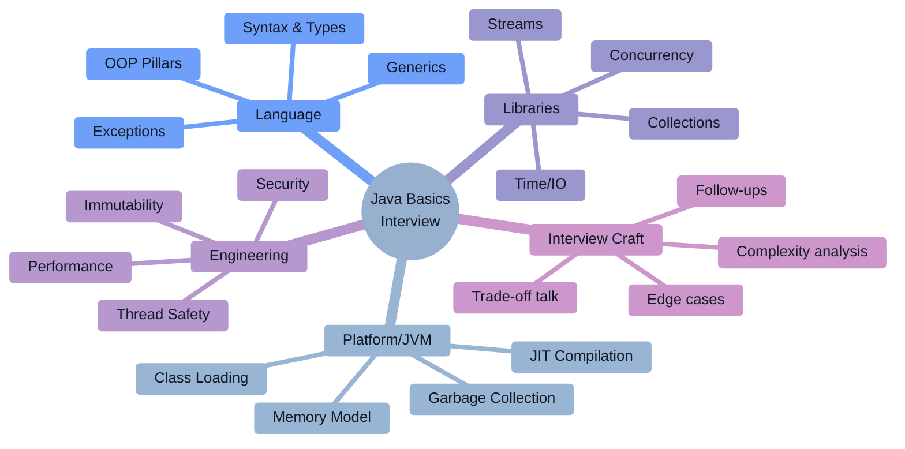

### Study strategy by company tier

| Tier | Companies | What they actually test | Time split |
|------|-----------|--------------------------|-----------|
| **FAANG / Big Tech** | Google, Meta, Amazon, Apple, Netflix, Microsoft | DSA in Java + language depth only when you claim it. JVM/GC/concurrency appear in senior+ rounds. | 70% DSA, 20% concurrency/JVM, 10% API design |
| **High-bar product** | Stripe, Databricks, Snowflake, Uber, Airbnb, DoorDash, Coinbase, Cloudflare | Practical Java: correctness under concurrency, API design, "build a rate limiter / cache" live coding. | 40% DSA, 30% concurrency, 30% design |
| **Finance** | Goldman Sachs, JPMorgan, Bloomberg, Morgan Stanley | Deep core Java: GC, memory layout, latency, `BigDecimal`, immutability, low-GC coding. | 30% DSA, 40% JVM/GC/latency, 30% core Java trivia |
| **Indian product** | Walmart Global Tech, Flipkart, Zomato, Swiggy, PhonePe, Razorpay | Collections internals + Java 8 streams + Spring Boot + LLD. | 30% DSA, 40% core Java, 30% LLD |
| **Service companies** | TCS, Infosys, Wipro, Accenture, Cognizant, Capgemini | Rapid-fire Java 8 + OOP + collections + exception handling + string trivia. | 70% core Java Q&A, 20% simple coding, 10% SQL |

> [!TIP]
> **The single highest-leverage sentence in a Java interview:** *"Let me tell you what the JVM actually does here."* Interviewers separate "syntax users" from "engineers" by whether you can explain the runtime beneath the code.

---

# 1. 🌱 Beginner Concepts

## 1.1 What is Java?

**Java is two things at once**, and confusing them is the #1 beginner mistake:

1. **A language** — statically typed, class-based, object-oriented, with C-like syntax.
2. **A platform** — the JVM, a managed runtime that provides memory management (GC), a security sandbox, dynamic linking, adaptive optimization (JIT), and rich standard libraries.

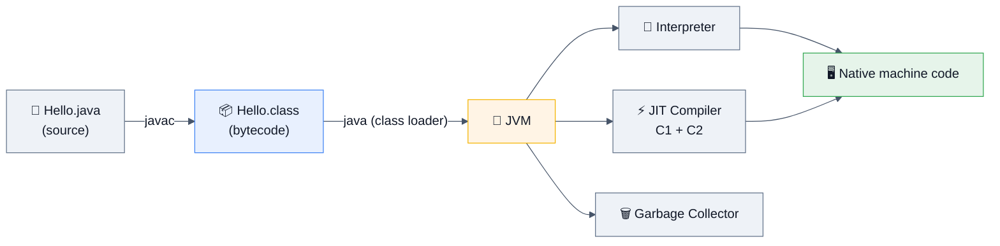

**Canonical minimal program:**

```java
public class Hello {
    public static void main(String[] args) {
        System.out.println("Hello, interviews!");
    }
}
```

`🆕 Java 25` — compact source files + instance `main` (JEP 512, **finalized in Java 25**) let beginners write:

```java
void main() {
    IO.println("Hello, interviews!");
}
```

> [!NOTE]
> **Interview soundbite:** "Java compiles *ahead of time to bytecode*, then compiles *just in time to machine code* at runtime. It's not interpreted-only and it's not AOT-only — it's a hybrid, and that hybrid is why a long-running Java server can beat naive C++ on some workloads via profile-guided inlining."

---

## 1.2 Why does Java exist? (The problems it solved)

| Year | Problem in the C/C++ world | Java's answer |
|------|----------------------------|---------------|
| 1995 | Recompile per OS/CPU (`#ifdef` hell) | **Bytecode + JVM** → "Write Once, Run Anywhere" |
| | Manual `malloc`/`free` → leaks, double-frees, dangling pointers | **Automatic garbage collection** |
| | Pointer arithmetic → buffer overflows, memory corruption | **No raw pointers**, bounds-checked arrays, references only |
| | Multiple inheritance ambiguity, operator overloading confusion | **Single class inheritance + interfaces** |
| | Threading was OS-specific and library-dependent | **Threads and locks in the language** (`synchronized`, `Thread`) |
| | No standard library — every team rewrote strings/collections | **Massive standard library** (`java.util`, `java.io`, …) |
| | Untrusted code execution (applets) | **Bytecode verifier + security manager** (sandbox) |

**Problems Java did NOT solve (be honest in interviews):**
- ❌ GC pauses (largely mitigated by ZGC/Shenandoah, not eliminated)
- ❌ Startup latency & memory footprint (mitigated by CDS, GraalVM native-image, Project Leyden)
- ❌ Verbosity (mitigated by `var`, records, lambdas, text blocks)
- ❌ `null` (still there; `Optional` is a partial patch, not a fix)

---

## 1.3 Real-world analogies

| Concept | Analogy |
|---------|---------|
| **JVM** | A universal power adapter. Your appliance (bytecode) plugs in anywhere; the adapter handles local voltage (OS/CPU). |
| **Bytecode** | An IKEA instruction manual — language-neutral pictures. Any assembler (JVM) in any country can follow it. |
| **Garbage Collector** | Hotel housekeeping. You don't return the room key for the towel; staff periodically clears what nobody's holding. |
| **Class vs Object** | Blueprint vs actual house. One blueprint, many houses, each with its own paint colour (state). |
| **Interface** | A power socket standard. Any device with the right plug shape works; the socket doesn't care what's inside. |
| **Abstract class** | A partially-built house — walls up, you finish the interior. |
| **`final`** | Permanent marker vs pencil. |
| **String immutability** | A printed book. To "change" a word you print a new book; the old one is untouched (and shareable safely). |
| **Heap vs Stack** | Heap = warehouse (big, shared, needs janitors). Stack = your desk (small, private, cleared when you leave). |
| **Checked exception** | A signed delivery receipt — the compiler forces you to acknowledge it. |
| **Thread** | A cashier lane. More lanes = more throughput, until they fight over the one card machine (shared lock). |
| **Virtual thread** | Uber drivers vs owning a car fleet. You don't pre-allocate an OS thread per task; the JDK schedules millions of cheap ones onto a few carriers. |

---

## 1.4 Core building blocks

### Primitives vs References

```java
int a = 42;                 // primitive: value lives in the stack frame / inline in object
Integer b = 42;             // reference: variable holds a reference to a heap object
```

| | Primitives | References |
|---|---|---|
| Types | `byte, short, int, long, float, double, char, boolean` | Everything else (classes, arrays, interfaces, enums) |
| Default | `0 / 0.0 / '' / false` | `null` |
| Nullable | ❌ | ✅ |
| Stored | Stack slot (locals) or inline in object | Heap object; variable holds the reference |
| Generics | ❌ (pre-Valhalla) | ✅ |

**Sizes (JLS-guaranteed):**

| Type | Bits | Range |
|------|------|-------|
| `byte` | 8 | −128 … 127 |
| `short` | 16 | −32,768 … 32,767 |
| `char` | 16 | 0 … 65,535 (**unsigned** — the only unsigned primitive) |
| `int` | 32 | −2³¹ … 2³¹−1 |
| `long` | 64 | −2⁶³ … 2⁶³−1 |
| `float` | 32 | IEEE-754 single |
| `double` | 64 | IEEE-754 double |
| `boolean` | JVM-dependent (typically 1 byte in arrays, 1 int slot on stack) | `true`/`false` |

> [!WARNING]
> **Classic trap:** `System.out.println(0.1 + 0.2);` → `0.30000000000000004`. IEEE-754 binary floating point cannot represent 0.1 exactly. **Never use `float`/`double` for money — use `BigDecimal` (with a `String` constructor) or `long` cents.** Bloomberg, Goldman, Stripe and JPMorgan ask this verbatim.

```java
new BigDecimal(0.1);        // ❌ 0.1000000000000000055511151231257827021181583404541015625
new BigDecimal("0.1");      // ✅ exactly 0.1
BigDecimal.valueOf(0.1);    // ✅ uses Double.toString → "0.1"
```

### Autoboxing & the Integer cache

```java
Integer a = 127, b = 127;
Integer c = 128, d = 128;
System.out.println(a == b);   // true   ← cached [-128, 127]
System.out.println(c == d);   // false  ← two distinct objects
System.out.println(c.equals(d)); // true
```

> [!TIP]
> `Integer.valueOf` caches −128..127 (upper bound tunable via `-XX:AutoBoxCacheMax`). `Boolean`, `Byte`, `Short`, `Character`, `Long` also cache. **`Float`/`Double` never cache.** Always compare wrappers with `.equals()` or unbox explicitly.

**The NPE trap:**
```java
Map<String, Integer> counts = new HashMap<>();
int n = counts.get("missing");  // 💥 NullPointerException — unboxing null
int m = counts.getOrDefault("missing", 0); // ✅
```

### Pass-by-value (the most misunderstood Java fact)

> **Java is always pass-by-value. Always. For object types, the *reference* is the value being copied.**

```java
void mutate(StringBuilder sb) { sb.append(" world"); }   // ✅ caller sees "hello world"
void reassign(StringBuilder sb) { sb = new StringBuilder("bye"); } // ❌ caller unaffected
```

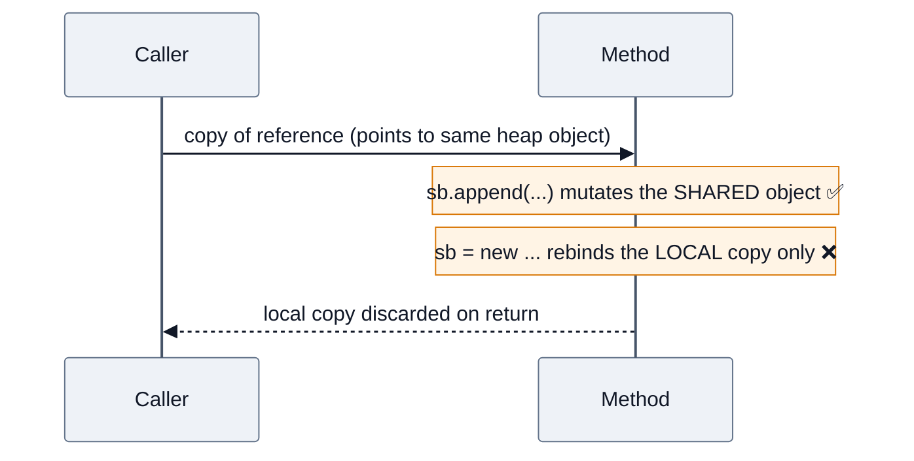

### Strings

```java
String s1 = "java";              // string pool (interned literal)
String s2 = "java";              // same pooled object
String s3 = new String("java");  // NEW heap object, not pooled
s1 == s2;          // true
s1 == s3;          // false
s1.equals(s3);     // true
s3.intern() == s1; // true
```

| | `String` | `StringBuilder` | `StringBuffer` |
|---|---|---|---|
| Mutable | ❌ | ✅ | ✅ |
| Thread-safe | ✅ (by immutability) | ❌ | ✅ (`synchronized`) |
| Speed | slow for concat in loops | **fastest** | slower (lock overhead) |
| Use when | keys, constants, sharing | single-threaded building | almost never (use `StringBuilder` + confinement) |

**Why is String immutable?** Five reasons — say all five:
1. **String pool safety** — sharing is only safe if nobody can mutate.
2. **Hash caching** — `hashCode()` is computed once and cached → fast `HashMap` keys.
3. **Security** — file paths, URLs, class names, DB credentials can't be changed after validation (TOCTOU defence).
4. **Thread safety** — free, no synchronization needed.
5. **Class loading** — class names are Strings; mutability would break the loader.

> [!NOTE]
> Since **Java 9 (JEP 254, Compact Strings)** `String` is backed by `byte[] + byte coder` (LATIN1 or UTF16), not `char[]`. Typical heap savings in real services: **5–15%**. This is a great "recent JDK knowledge" signal in interviews.

---

## 1.5 The four OOP pillars

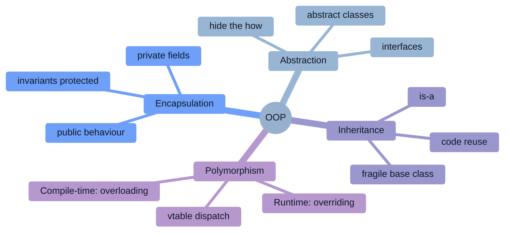

| Pillar | One-line definition | Java mechanism | Interview follow-up |
|--------|--------------------|----------------|---------------------|
| **Encapsulation** | Bundle data + behaviour, hide internal state | `private` fields + accessors, records | "Why are getters better than public fields if they just return the field?" → *invariants, future validation, binary compatibility, defensive copies* |
| **Abstraction** | Expose *what*, hide *how* | `interface`, `abstract class` | "Abstraction vs encapsulation?" → *abstraction = design-level hiding of complexity; encapsulation = implementation-level hiding of data* |
| **Inheritance** | Derive a type from another (`is-a`) | `extends` | "Why prefer composition?" → *inheritance breaks encapsulation, fragile base class problem, single-inheritance limit* |
| **Polymorphism** | One interface, many implementations | overriding (runtime) / overloading (compile-time) | "How does the JVM dispatch?" → *invokevirtual + vtable; invokeinterface + itable; invokedynamic for lambdas* |

### Overloading vs Overriding

```java
class Base {
    void greet(Object o) { System.out.println("Base/Object"); }
    void greet(String s) { System.out.println("Base/String"); }
}
class Derived extends Base {
    @Override void greet(Object o) { System.out.println("Derived/Object"); }
}

Base b = new Derived();
b.greet("hi");          // "Base/String"  ← overload chosen at COMPILE time by static type
b.greet((Object) "hi"); // "Derived/Object" ← override chosen at RUNTIME by actual type
```

| | Overloading | Overriding |
|---|---|---|
| Binding | Compile-time (static) | Runtime (dynamic) |
| Signature | Must differ (params) | Must match |
| Return type | Can differ freely | Must be same or **covariant** |
| Access modifier | Any | Cannot be **more restrictive** |
| Exceptions | Any | Cannot add new/broader **checked** exceptions |
| `static`/`private`/`final` | Can be overloaded | Cannot be overridden (`static` is **hidden**, not overridden) |

> [!WARNING]
> **Top trap:** overriding `equals(MyType o)` instead of `equals(Object o)` — that's *overloading*, and your `HashSet` silently breaks. Always use `@Override`.

---

## 1.6 Common misconceptions (say the correction, win the round)

| ❌ Misconception | ✅ Reality |
|---|---|
| "Java is pass-by-reference for objects" | Always pass-by-value; the *reference value* is copied. |
| "Java is purely interpreted" | Interpreted first, then JIT-compiled to native code (C1 → C2). |
| "Java is 100% object-oriented" | Primitives and `static` methods exist. It's *predominantly* OO. |
| "`final` makes an object immutable" | `final` only prevents **rebinding the variable**. `final List` can still be `add`-ed to. |
| "`finalize()` cleans up resources" | Deprecated since 9, **removed in Java 18+/disabled**. Use `try-with-resources` / `Cleaner`. |
| "`System.gc()` forces GC" | It's a *hint*. May be ignored (`-XX:+DisableExplicitGC`). |
| "Memory leaks are impossible in Java" | Very possible: static collections, listeners, `ThreadLocal` in pools, classloader leaks. |
| "`String` uses `char[]`" | Since Java 9 it's `byte[]` + coder (Compact Strings). |
| "`StringBuffer` is safer so use it" | Per-method locking gives you *no* compound-operation safety. Use `StringBuilder` locally. |
| "Checked exceptions make code safer" | Contested — Kotlin, C#, Scala dropped them. See §3.6. |
| "`HashMap` is O(1) always" | O(1) *amortized average*; worst case O(log n) since Java 8 (red-black tree bins), O(n) before. |
| "`ArrayList` is always faster than `LinkedList`" | Almost always true in practice (cache locality), but not for `Deque`-style head ops on huge lists — measure. |
| "`volatile` makes `count++` thread-safe" | No — `++` is read-modify-write. Use `AtomicInteger`/`LongAdder`. |
| "More threads = more throughput" | Only until context-switch + lock contention dominate (Amdahl / USL). |
| "Virtual threads make code faster" | They increase **concurrency/throughput** for blocking I/O; they do **not** speed up CPU-bound work. |
| "`Optional` should be used everywhere" | Designed as a **return type**. Not for fields, params, or collections (not `Serializable`, adds allocation). |

---

# 2. ⚙️ Intermediate Concepts

## 2.1 JDK vs JRE vs JVM

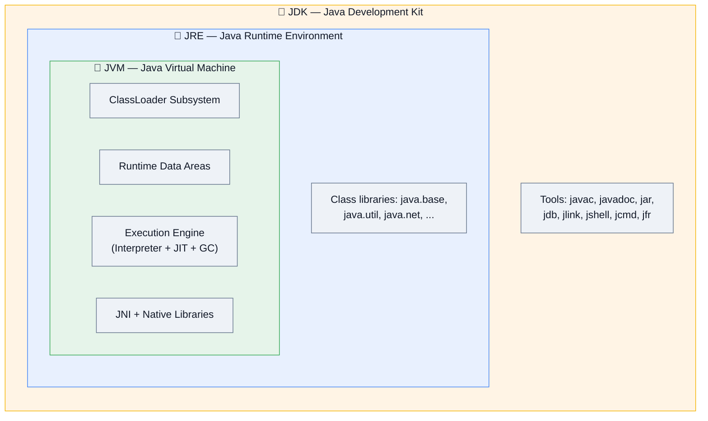

| | JVM | JRE | JDK |
|---|---|---|---|
| Purpose | Executes bytecode | Runs Java apps | Builds Java apps |
| Contains | Class loader, memory areas, execution engine, GC | JVM + core libraries | JRE + compiler + dev tools |
| Can compile? | ❌ | ❌ | ✅ |
| Spec vs impl | **Specification** (HotSpot, OpenJ9, GraalVM, Zing are implementations) | Implementation | Implementation |

> [!NOTE]
> Since **Java 11 the standalone JRE was discontinued** by Oracle. You now use `jlink` to build a trimmed runtime image. Mentioning this earns credibility.

**JVM implementations worth naming:** HotSpot (Oracle/OpenJDK, default), **Eclipse OpenJ9** (lower memory, faster startup — IBM/enterprise), **GraalVM** (polyglot + `native-image` AOT), **Azul Zing/Prime** (C4 pauseless GC — used in trading), **Amazon Corretto** (AWS's OpenJDK build).

---

## 2.2 Class loading & the class lifecycle

```mermaid
%%{init: {'theme':'base','themeVariables':{'background':'#ffffff','mainBkg':'#eef2f7','primaryColor':'#eef2f7','primaryTextColor':'#111827','primaryBorderColor':'#64748b','secondaryColor':'#e8f0fe','tertiaryColor':'#f1f5f9','lineColor':'#475569','textColor':'#111827','clusterBkg':'#f8fafc','clusterBorder':'#94a3b8','edgeLabelBackground':'#ffffff','titleColor':'#111827','actorBkg':'#eef2f7','actorTextColor':'#111827','actorBorder':'#64748b','actorLineColor':'#475569','signalColor':'#111827','signalTextColor':'#111827','noteBkgColor':'#fff4e5','noteTextColor':'#111827','noteBorderColor':'#d97706','labelBoxBkgColor':'#eef2f7','labelBoxBorderColor':'#64748b','labelTextColor':'#111827','loopTextColor':'#111827','altBackground':'#f8fafc'}}}%%
flowchart LR
    A["🔍 Loading<br/>read .class → binary"] --> B["✅ Verification<br/>bytecode verifier"]
    B --> C["📐 Preparation<br/>static fields = defaults"]
    C --> D["🔗 Resolution<br/>symbolic → direct refs (lazy)"]
    D --> E["🚀 Initialization<br/>static init + &lt;clinit&gt;"]
    E --> F["🏃 Usage"]
    F --> G["🗑️ Unloading<br/>when ClassLoader is GC'd"]
    subgraph Linking
      B --- C --- D
    end
```

**The delegation hierarchy (parent-first):**

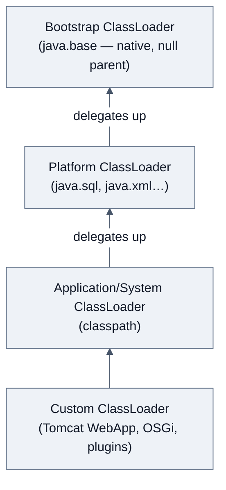

**Why parent-first delegation?** Security + uniqueness. You cannot substitute a rogue `java.lang.String` because the bootstrap loader resolves it first.

**Class identity = fully-qualified name + defining ClassLoader.** Two loaders loading the same `.class` produce two *incompatible* types → the classic `ClassCastException: com.X cannot be cast to com.X` in app servers.

> [!WARNING]
> **`ClassNotFoundException` vs `NoClassDefFoundError`:**
> - `ClassNotFoundException` (checked) — dynamic lookup failed: `Class.forName("com.Missing")`.
> - `NoClassDefFoundError` (Error) — class was present **at compile time** but is missing/failed to initialize **at runtime**. Very often the *real* cause is an exception in a `static` initializer (`ExceptionInInitializerError` on first touch, `NoClassDefFoundError` on every touch after).

**When is a class initialized?** On first *active* use: `new`, static method call, static non-final-constant field access, reflection, subclass init. **Not** on: array creation (`new Foo[10]`), or reading a `static final` compile-time constant (it's inlined into the caller's constant pool).

---

## 2.3 JVM runtime data areas (memory model layout)

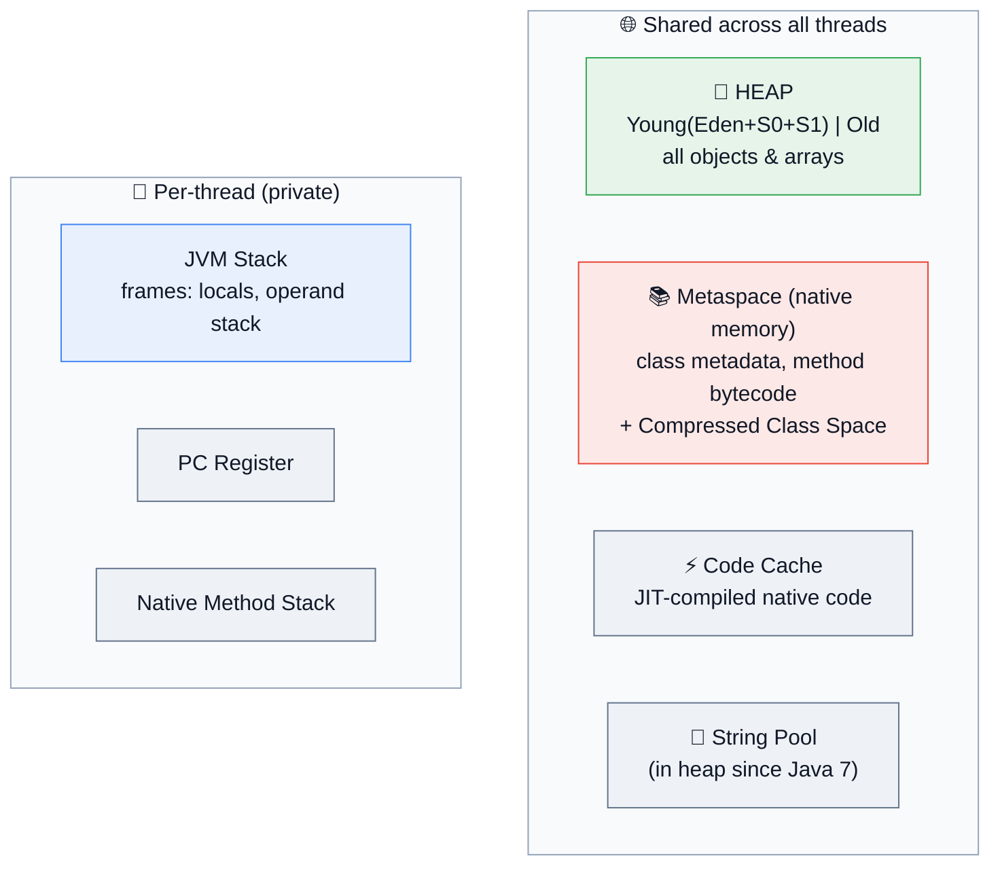

| Area | Shared? | Holds | Overflow error | Key flags |
|------|---------|-------|----------------|-----------|
| **Heap** | ✅ | All objects, arrays, string pool | `OutOfMemoryError: Java heap space` | `-Xms`, `-Xmx` |
| **Metaspace** | ✅ | Class metadata (native memory since Java 8) | `OutOfMemoryError: Metaspace` | `-XX:MaxMetaspaceSize` |
| **Code Cache** | ✅ | JIT output | `CodeCache is full` → compiler disabled | `-XX:ReservedCodeCacheSize` |
| **JVM Stack** | ❌ per thread | Frames: locals, operand stack, return addr | `StackOverflowError` | `-Xss` |
| **PC Register** | ❌ | Address of current instruction | — | — |
| **Native Stack** | ❌ | JNI frames | `OutOfMemoryError: unable to create native thread` | OS limits |

> [!TIP]
> **PermGen → Metaspace (Java 8) is a top-10 interview question.** PermGen was a fixed-size heap region → the infamous `OutOfMemoryError: PermGen space` on repeated redeploys. Metaspace lives in **native memory** and grows dynamically (bounded by `MaxMetaspaceSize`), so classloader leaks now exhaust RAM instead of a fixed region — different symptom, same root cause.

---

## 2.4 Object lifecycle & memory flow

```mermaid
%%{init: {'theme':'base','themeVariables':{'background':'#ffffff','mainBkg':'#eef2f7','primaryColor':'#eef2f7','primaryTextColor':'#111827','primaryBorderColor':'#64748b','secondaryColor':'#e8f0fe','tertiaryColor':'#f1f5f9','lineColor':'#475569','textColor':'#111827','clusterBkg':'#f8fafc','clusterBorder':'#94a3b8','edgeLabelBackground':'#ffffff','titleColor':'#111827','actorBkg':'#eef2f7','actorTextColor':'#111827','actorBorder':'#64748b','actorLineColor':'#475569','signalColor':'#111827','signalTextColor':'#111827','noteBkgColor':'#fff4e5','noteTextColor':'#111827','noteBorderColor':'#d97706','labelBoxBkgColor':'#eef2f7','labelBoxBorderColor':'#64748b','labelTextColor':'#111827','loopTextColor':'#111827','altBackground':'#f8fafc'}}}%%
flowchart LR
    N["new Foo()"] --> E["Eden"]
    E -->|Minor GC survives| S0["Survivor S0"]
    S0 -->|Minor GC| S1["Survivor S1"]
    S1 -->|age &gt; MaxTenuringThreshold| OLD["Old Gen (Tenured)"]
    E -->|"too big (&gt; PretenureSize)"| OLD
    OLD -->|Major/Full GC| DEAD["♻️ Reclaimed"]
    E -->|unreachable| DEAD
    style DEAD fill:#fce8e6,stroke:#ea4335,color:#111827
```

**The weak generational hypothesis** (the entire justification for generational GC): *most objects die young; few references point from old objects to young ones.*

**Object header layout (HotSpot, 64-bit, compressed oops):**

| Part | Size | Contains |
|------|------|----------|
| Mark word | 8 bytes | hash, GC age, lock state, biased-lock info (removed in 15+) |
| Klass pointer | 4 bytes (compressed) | pointer to class metadata |
| Array length | 4 bytes (arrays only) | length |
| Padding | → multiple of 8 | alignment |

> So an "empty" object costs **16 bytes**. An `Integer` costs 16 bytes vs 4 for an `int` — this is why `int[]` beats `List<Integer>` by ~4× memory and much more in cache misses. `-XX:+UseCompressedOops` is on by default under 32 GB heap; **crossing 32 GB heap can make your app slower** (a great Netflix/Bloomberg-tier answer).

---

## 2.5 The Collections Framework

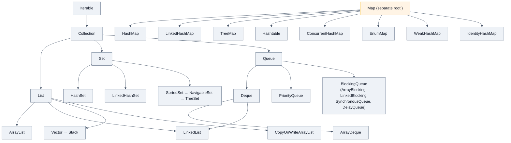

> [!TIP]
> **"`Map` does not extend `Collection`"** — a classic gotcha. A `Map` is a set of *mappings*, not a collection of elements; `add(E)` has no sensible meaning for it.

### Complexity cheat table

| Structure | get/contains | add/put | remove | Ordering | Nulls | Notes |
|-----------|-------------|---------|--------|----------|-------|-------|
| `ArrayList` | O(1) index, O(n) search | O(1)* amortized | O(n) | insertion | ✅ | array-backed, cache-friendly, grows 1.5× |
| `LinkedList` | O(n) | O(1) at ends | O(1) with iterator | insertion | ✅ | doubly-linked; also a `Deque` |
| `ArrayDeque` | O(1) ends | O(1)* | O(1) ends | insertion | ❌ no null | **preferred stack/queue** |
| `HashMap` | O(1) avg, O(log n) worst | O(1) avg | O(1) avg | none | 1 null key, many null vals | tree bins since 8 |
| `LinkedHashMap` | O(1) | O(1) | O(1) | insertion or **access** | ✅ | LRU cache in 5 lines |
| `TreeMap` | O(log n) | O(log n) | O(log n) | sorted | ❌ null key | red-black tree, `NavigableMap` |
| `HashSet` | O(1) | O(1) | O(1) | none | 1 null | wraps `HashMap` |
| `TreeSet` | O(log n) | O(log n) | O(log n) | sorted | ❌ | wraps `TreeMap` |
| `PriorityQueue` | O(1) peek | O(log n) | O(log n) poll | heap order (**not** iteration order) | ❌ | binary heap, **not** thread-safe, **not** sorted on iteration |
| `ConcurrentHashMap` | O(1) | O(1) | O(1) | none | ❌ no nulls at all | CAS + per-bin sync |
| `CopyOnWriteArrayList` | O(1) | **O(n)** | O(n) | insertion | ✅ | read-mostly (listeners) |
| `EnumMap` | O(1) | O(1) | O(1) | enum ordinal | ❌ key | array-backed, blazing fast |

### 🔥 HashMap internals (the #1 asked Java question)

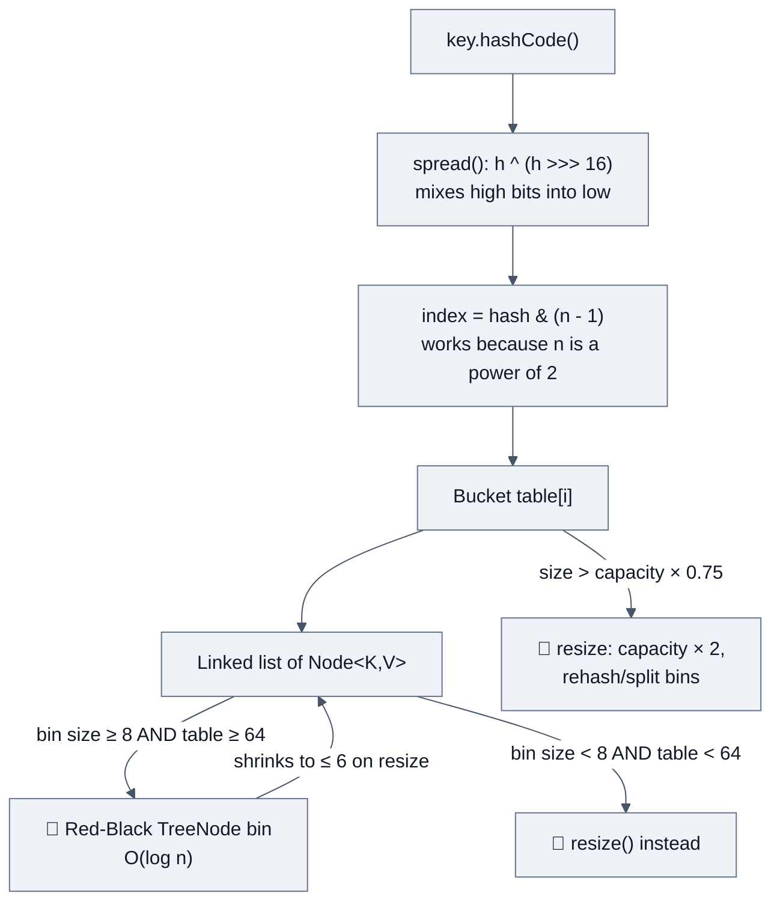

**Constants you should be able to recite:**

| Constant | Value | Why |
|----------|-------|-----|
| `DEFAULT_INITIAL_CAPACITY` | 16 | power of two |
| `DEFAULT_LOAD_FACTOR` | 0.75f | space/time sweet spot; Poisson analysis in the JDK javadoc shows P(bin size = 8) ≈ 6×10⁻⁸ |
| `TREEIFY_THRESHOLD` | 8 | list → red-black tree |
| `UNTREEIFY_THRESHOLD` | 6 | tree → list (hysteresis prevents thrashing at the boundary) |
| `MIN_TREEIFY_CAPACITY` | 64 | below this, **resize instead of treeify** (small tables collide for capacity reasons, not hash-quality reasons) |
| `MAXIMUM_CAPACITY` | 1 << 30 | |

**Java 7 vs Java 8 `HashMap` — must-know differences:**

| | Java 7 | Java 8+ |
|---|---|---|
| Bin structure | Linked list only | List → **red-black tree** at 8 |
| Worst case lookup | **O(n)** | **O(log n)** |
| Insert position | Head (prepend) | **Tail** (append) |
| Resize transfer | Reverses order → **infinite loop** under concurrent resize | Preserves order; split into lo/hi lists → no loop (still not thread-safe) |
| Hash function | 4 shifts/xors | `h ^ (h >>> 16)` |

> [!WARNING]
> **Production incident classic:** a `HashMap` shared across threads in Java 7 could spin at 100% CPU forever due to a circular linked list created during concurrent `resize()`. Java 8 fixed the cycle but `HashMap` is *still not thread-safe* — you can get lost updates and `null` reads. Use `ConcurrentHashMap`.

**Why capacity is a power of two:** `hash % n` becomes `hash & (n-1)` — one AND instead of a division (~20–40× cheaper), and resize can split a bin into "stays at i" / "moves to i + oldCap" by testing a single bit.

**Why `spread()` XORs the high 16 bits:** because indexing uses only the low bits, keys whose hashes differ only in high bits would all collide. `Float.hashCode`, small `Integer`s, and poorly-written `hashCode()`s are the motivating cases.

### ⚡ ConcurrentHashMap internals

| | Java 7 | Java 8+ |
|---|---|---|
| Design | **Segment[]** (ReentrantLock per segment), default 16 segments | **No segments.** CAS on empty bin + `synchronized` on the bin's first node |
| Concurrency level | Fixed at construction | Per-bucket → effectively `table.length` |
| `size()` | Locks all segments (retry-then-lock) | `LongAdder`-style `baseCount` + `CounterCell[]` → `mappingCount()` |
| Read locking | Volatile reads | Volatile reads, lock-free |
| Resize | Per segment | **Cooperative** — helper threads join `transfer()` via `ForwardingNode` |

**Why no nulls in `ConcurrentHashMap`?** Because `map.get(k) == null` would be ambiguous (absent vs mapped-to-null), and unlike `HashMap` you can't disambiguate with `containsKey()` *atomically* in a concurrent map. Doug Lea's own answer.

**Atomic compound ops you should name-drop:** `putIfAbsent`, `computeIfAbsent`, `compute`, `merge`, `getOrDefault`, `forEach`, `search`, `reduce`.

```java
// ✅ atomic counter increment
map.merge(key, 1L, Long::sum);
// ✅ atomic lazy init (careful: mapping function must not modify the map — can deadlock)
map.computeIfAbsent(key, k -> expensiveLoad(k));
```

### Fail-fast vs fail-safe iterators

```java
List<String> list = new ArrayList<>(List.of("a","b","c"));
for (String s : list) if (s.equals("b")) list.remove(s); // 💥 ConcurrentModificationException
list.removeIf("b"::equals);                              // ✅
Iterator<String> it = list.iterator();
while (it.hasNext()) if (it.next().equals("b")) it.remove(); // ✅
```

| | Fail-fast | Fail-safe (weakly consistent) |
|---|---|---|
| Examples | `ArrayList`, `HashMap`, `HashSet`, `TreeMap` | `ConcurrentHashMap`, `CopyOnWriteArrayList`, `ConcurrentLinkedQueue` |
| Mechanism | `modCount` vs `expectedModCount` check | Snapshot (COW) or weakly-consistent traversal |
| On concurrent modification | `ConcurrentModificationException` | No exception; may/may not see updates |
| Memory | cheap | COW copies whole array on write |

> [!NOTE]
> `ConcurrentModificationException` is **best-effort, not guaranteed** — the JDK explicitly says you must not depend on it for correctness. It's a bug detector, not a concurrency control.

### `equals()` / `hashCode()` contract 🔑

```java
public final class Point {
    private final int x, y;
    Point(int x, int y) { this.x = x; this.y = y; }

    @Override public boolean equals(Object o) {
        if (this == o) return true;
        if (!(o instanceof Point p)) return false;   // pattern matching, Java 16+
        return x == p.x && y == p.y;
    }
    @Override public int hashCode() { return Objects.hash(x, y); }
}
```

**The contract:**
1. **Reflexive:** `x.equals(x)` → true
2. **Symmetric:** `x.equals(y) == y.equals(x)`
3. **Transitive:** `x=y && y=z ⟹ x=z`
4. **Consistent:** repeated calls give the same result
5. **Null:** `x.equals(null)` → false (never NPE)
6. **`hashCode` consistency:** equal objects **must** have equal hash codes. Unequal objects *may* collide.

> [!WARNING]
> **Break it and:** your object vanishes from a `HashSet`, `map.get(key)` returns `null` for a key you just put, and `distinct()`/`groupingBy` misbehave. Also: **never mutate a field used in `hashCode` while the object is a key in a hash container** — you'll orphan it in the wrong bucket forever. (This is *the* answer to "what's the mutable-key bug?")

**Why `31` in the classic hash?** Odd prime; `31*i == (i<<5) - i` (JIT-friendly); good dispersion empirically. Modern answer: use `Objects.hash(...)` or a **record**.

---

## 2.6 Generics & type erasure

```java
List<String> a = new ArrayList<>();
List<Integer> b = new ArrayList<>();
a.getClass() == b.getClass();   // true! Both are ArrayList.class — erasure
```

**Erasure rules:** `<T>` → `Object`; `<T extends Number>` → `Number`; compiler inserts **checked casts** and generates **bridge methods** for covariant overrides.

**Consequences (name at least four):**
- ❌ `new T()`, `new T[10]` — no reifiable type
- ❌ `instanceof List<String>` — only `List<?>`
- ❌ Can't overload on `List<String>` vs `List<Integer>` (same erasure)
- ❌ No primitive type args (`List<int>`) — until **Project Valhalla**
- ❌ Static fields are shared across all parameterizations
- ✅ Backward compatible with pre-1.5 code (the reason it was done this way)

**PECS — Producer Extends, Consumer Super** (Joshua Bloch, *Effective Java*):

```java
// src PRODUCES T  → ? extends T   (read-only)
// dst CONSUMES T  → ? super T     (write-only)
static <T> void copy(List<? extends T> src, List<? super T> dst) {
    for (T t : src) dst.add(t);
}
```

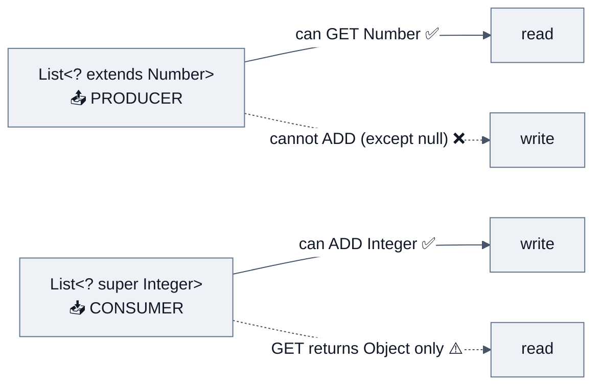

**Covariance trap:**
```java
Object[] objs = new String[1];  // ✅ compiles — arrays are COVARIANT
objs[0] = 42;                   // 💥 ArrayStoreException at RUNTIME
List<Object> l = new ArrayList<String>(); // ❌ compile error — generics are INVARIANT (safer)
```

---

## 2.7 Exception hierarchy & handling

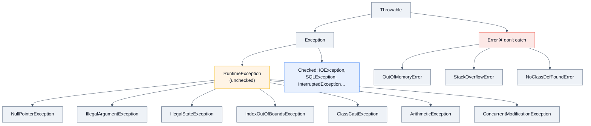

**Checked vs unchecked:**

| | Checked | Unchecked |
|---|---|---|
| Compiler enforced | ✅ must catch or declare | ❌ |
| Represents | Recoverable, expected external failure (network, disk, DB) | Programming bugs / illegal state |
| Extends | `Exception` (not `RuntimeException`) | `RuntimeException` or `Error` |
| Lambda-friendly | ❌ (breaks `Function`, `Stream`) | ✅ |

**Order matters:**
```java
try { risky(); }
catch (FileNotFoundException e) { }   // ✅ subclass FIRST
catch (IOException e) { }             // superclass after
// catch (IOException) before FileNotFoundException → compile error: already caught
```

**Multi-catch + try-with-resources:**
```java
try (var in = Files.newInputStream(p);        // closed in REVERSE order, automatically
     var out = Files.newOutputStream(q)) {
    in.transferTo(out);
} catch (NoSuchFileException | AccessDeniedException e) {   // e is implicitly final
    log.warn("path problem", e);
} catch (IOException e) {
    throw new UncheckedIOException(e);        // preserve cause!
}
```

> [!TIP]
> **Try-with-resources solves the *suppressed exception* problem.** With manual `finally`, an exception in `close()` **masks** the original exception. TWR keeps the primary and attaches the rest via `Throwable.getSuppressed()`. This is a strong senior-level answer.

**The `finally` puzzles interviewers love:**

```java
int f() { try { return 1; } finally { return 2; } }        // → 2 (finally return WINS, discards 1)
int g() { int x = 1; try { return x; } finally { x = 2; } } // → 1 (return value already evaluated)
// finally does NOT run if: System.exit(), JVM crash, infinite loop, daemon thread killed at shutdown
```

**`throw` vs `throws` vs `Throwable`:** `throw` = statement that raises; `throws` = method signature declaration; `Throwable` = root class.

**Java 14+ Helpful NullPointerMessages (`-XX:+ShowCodeDetailsInExceptionMessages`, on by default since 15):**
```
Cannot invoke "String.length()" because the return value of
"java.util.Map.get(Object)" is null
```
Mention this — it signals modern-JDK familiarity.

---

## 2.8 Java 8+ functional programming

### Functional interfaces

| Interface | Signature | Typical use |
|-----------|-----------|-------------|
| `Function<T,R>` | `R apply(T)` | `map` |
| `BiFunction<T,U,R>` | `R apply(T,U)` | `merge` |
| `Predicate<T>` | `boolean test(T)` | `filter` |
| `Consumer<T>` | `void accept(T)` | `forEach` |
| `Supplier<T>` | `T get()` | lazy init, `orElseGet` |
| `UnaryOperator<T>` | `T apply(T)` | `replaceAll` |
| `BinaryOperator<T>` | `T apply(T,T)` | `reduce` |
| `Runnable` / `Callable<V>` | `void run()` / `V call()` | executors |
| `Comparator<T>` | `int compare(T,T)` | sorting |

> Primitive specializations (`IntFunction`, `ToIntFunction`, `IntPredicate`, …) exist **to avoid boxing** — a real perf answer, not trivia.

### Lambdas ≠ anonymous classes

| | Lambda | Anonymous inner class |
|---|---|---|
| Bytecode | `invokedynamic` + `LambdaMetafactory` (class generated at runtime) | Separate `Outer$1.class` at compile time |
| `this` | **Enclosing** instance | The anonymous instance itself |
| Instances | May be cached/reused if non-capturing | New instance each time |
| Can have state | ❌ | ✅ (fields) |
| Target | Functional interface only | Any interface/abstract class |

> [!NOTE]
> **Why `invokedynamic`?** It avoids generating one class per lambda at compile time (class-count explosion → Metaspace + startup cost) and lets the JDK change the lambda strategy without recompiling your code. This is an excellent "how does it actually work" answer.

**Effectively final capture:** lambdas capture *values*, not variables. Local variables live on the stack, which dies when the method returns; capturing by reference would need heap promotion and would expose data races. Instance/static fields *can* be mutated (they're heap-resident) — which is why `list.forEach(x -> counter++)` fails but `this.counter++` compiles (and is racy).

### Streams

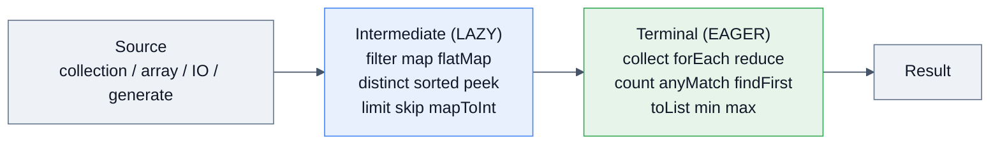

```java
Map<Department, List<String>> namesByDept = employees.stream()
    .filter(e -> e.salary() > 100_000)
    .collect(Collectors.groupingBy(
        Employee::department,
        Collectors.mapping(Employee::name, Collectors.toList())));

Map<Boolean, Long> partition = nums.stream()
    .collect(Collectors.partitioningBy(n -> n % 2 == 0, Collectors.counting()));

String csv = names.stream().collect(Collectors.joining(", ", "[", "]"));

IntSummaryStatistics stats = orders.stream().mapToInt(Order::qty).summaryStatistics();
```

**`map` vs `flatMap`** (asked constantly):
```java
// map:     Stream<List<String>> → Stream<List<String>>  (1:1)
// flatMap: Stream<List<String>> → Stream<String>        (1:N, flattens)
List<String> all = listOfLists.stream().flatMap(List::stream).toList();
```

**Streams are single-use, lazy, and non-mutating:**
```java
Stream<String> s = list.stream();
s.forEach(System.out::println);
s.count(); // 💥 IllegalStateException: stream has already been operated upon or closed
```
Without a terminal op, **nothing executes** — `peek(System.out::println)` alone prints nothing.

**Short-circuiting** ops (`findFirst`, `anyMatch`, `limit`) let infinite streams work: `Stream.iterate(1, x -> x*2).limit(10)`.

> [!WARNING]
> **`parallelStream()` is a trap in interviews and in production.** It uses the **shared** `ForkJoinPool.commonPool()` (`NCPU − 1` threads). In a web server, one bad parallel stream can starve every other one. Only use it when: data is large (≳10k elements), operations are CPU-bound and independent, the source splits well (`ArrayList`/array — **not** `LinkedList`/`Iterator`), and you've measured. Never do blocking I/O in a parallel stream. Say all of that and you've won the question.

### `Optional`

```java
Optional<User> u = repo.findById(id);
String name = u.map(User::name).filter(n -> !n.isBlank()).orElse("anonymous");
u.ifPresentOrElse(this::send, () -> log.warn("missing {}", id));
User user = u.orElseThrow(() -> new NotFoundException(id));
```

| ✅ Do | ❌ Don't |
|---|---|
| Return type for "may be absent" | Field type (not `Serializable`) |
| `orElseGet(supplier)` for expensive defaults | Method parameter (adds a third state: null Optional) |
| `map`/`flatMap` chains | `Optional<Collection>` — return empty collection instead |
| | `o.get()` without `isPresent()` |
| | `if (o.isPresent()) o.get()` — that's just a null check with extra allocation |

> **`orElse` vs `orElseGet`:** `orElse(expensive())` **always evaluates** the argument, even when present. `orElseGet(() -> expensive())` is lazy. This is a real production bug source (e.g., always hitting the DB fallback).

---

## 2.9 Modern Java: records, sealed types, pattern matching

```java
// Record (Java 16): immutable data carrier — auto equals/hashCode/toString/accessors
public record Money(BigDecimal amount, Currency currency) {
    public Money {                                  // compact canonical constructor
        Objects.requireNonNull(amount);
        if (amount.scale() > currency.getDefaultFractionDigits())
            throw new IllegalArgumentException("too precise");
    }
    public Money plus(Money o) { return new Money(amount.add(o.amount), currency); }
}

// Sealed interface (Java 17): closed hierarchy → exhaustive switch
public sealed interface Shape permits Circle, Square, Rectangle {}
record Circle(double r) implements Shape {}
record Square(double side) implements Shape {}
record Rectangle(double w, double h) implements Shape {}

// Pattern matching for switch (Java 21) + record deconstruction
static double area(Shape s) {
    return switch (s) {                              // no default needed — sealed = exhaustive
        case Circle(double r)         -> Math.PI * r * r;
        case Square(double side)      -> side * side;
        case Rectangle(double w, double h) -> w * h;
    };
}

// Text block (Java 15)
String json = """
    { "id": %d, "status": "OK" }""".formatted(id);
```

| Feature | JDK | Status | Why interviewers care |
|---------|-----|--------|-----------------------|
| Lambdas, Streams, `Optional`, `CompletableFuture`, `java.time` | 8 | ✅ | Still the most-asked baseline |
| Modules (JPMS), `var` | 9 / 10 | ✅ | Strong encapsulation, `jlink` |
| Text blocks | 15 | ✅ | SQL/JSON readability |
| Records | 16 | ✅ | DTOs, value semantics, less boilerplate |
| Sealed classes | 17 | ✅ | ADTs, exhaustive switch |
| Pattern matching for `switch`, record patterns | 21 | ✅ | Replaces visitor pattern |
| **Virtual threads (Project Loom)** | 21 | ✅ | 🔥 hottest modern topic |
| Sequenced collections (`getFirst`, `reversed()`) | 21 | ✅ | Fixes a 25-year API gap |
| Structured concurrency, scoped values | 21→25 | preview | Senior/staff signal |
| Synchronized w/o pinning (JEP 491) | 24 | ✅ | Removes Loom's biggest footgun |
| Compact source files + instance `main` (JEP 512) | 25 | ✅ | Onboarding/DX |
| Primitive types in patterns (JEP 507) | 25 | preview (3rd) | Trend awareness |
| Value classes / Valhalla | — | in progress | "Codes like a class, works like an int" |

---

# 3. 🚀 Advanced Concepts

## 3.1 The Java Memory Model (JMM) & happens-before

The JMM (JSR-133, Java 5) defines **when a write by one thread becomes visible to another**. Without it, the compiler, the JIT, the CPU's store buffers, and the cache coherence protocol are all free to reorder your code.

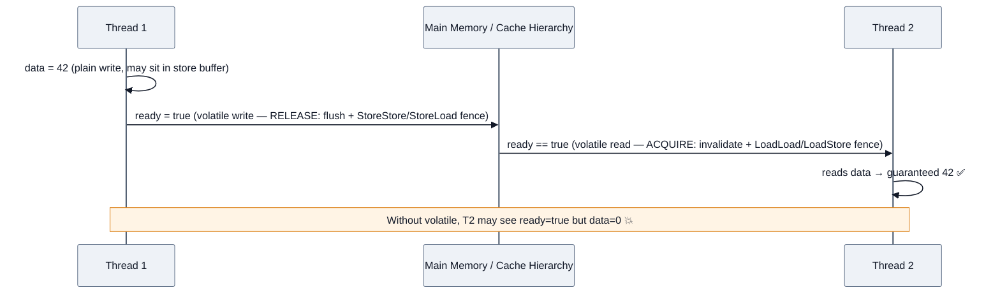

**Happens-before edges you must be able to list:**

| Rule | Edge |
|------|------|
| Program order | Within a thread, earlier statements HB later ones |
| Monitor lock | `unlock(m)` HB every subsequent `lock(m)` |
| Volatile | Write to `v` HB every subsequent read of `v` |
| Thread start | `t.start()` HB everything in `t` |
| Thread join | Everything in `t` HB `t.join()` returning |
| Final field | Correctly-constructed final fields are visible without sync |
| Interrupt | `t.interrupt()` HB `t` detecting the interrupt |
| Transitivity | A HB B, B HB C ⟹ A HB C |
| Concurrent collections | Actions before putting an element into a concurrent collection HB actions after retrieving it |

### `volatile` — what it does and doesn't

| ✅ Guarantees | ❌ Does NOT guarantee |
|---|---|
| **Visibility** — writes are immediately visible to other threads | **Atomicity** of compound ops (`i++`, check-then-act) |
| **Ordering** — prevents reordering across the access (fences) | Mutual exclusion |
| Atomic reads/writes of `long`/`double` (which are otherwise allowed to tear on 32-bit) | Cache-friendliness (false sharing still bites) |

```java
// ✅ Canonical valid use: a one-way status flag
private volatile boolean running = true;
public void stop() { running = false; }
public void run() { while (running) { work(); } }   // without volatile, JIT may hoist → infinite loop
```

### Double-Checked Locking (the classic)

```java
public class Singleton {
    private static volatile Singleton instance;    // ⚠️ volatile is MANDATORY
    public static Singleton getInstance() {
        Singleton local = instance;                // local var = 1 volatile read on fast path
        if (local == null) {
            synchronized (Singleton.class) {
                local = instance;
                if (local == null) instance = local = new Singleton();
            }
        }
        return local;
    }
}
```

**Why `volatile`?** `new Singleton()` is three steps: *(1) allocate, (2) run constructor, (3) assign reference.* The JIT may reorder (3) before (2). Another thread then sees a **non-null but partially constructed** object. `volatile` forbids that reordering. **Broken before Java 5** even with `volatile` (old JMM). This is the single most-asked "prove you understand the JMM" question.

> [!TIP]
> **Better answers:** (a) **enum singleton** — "the best way to implement a singleton" per *Effective Java* Item 3: serialization- and reflection-safe for free; (b) **initialization-on-demand holder idiom** — lazy, thread-safe, no synchronization, relies on JLS class-init guarantees:
> ```java
> private static class Holder { static final Singleton I = new Singleton(); }
> public static Singleton get() { return Holder.I; }
> ```
> (c) In real services: let the DI container (Spring) own the lifecycle.

---

## 3.2 Concurrency toolkit

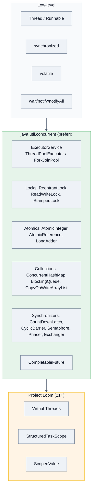

### Thread lifecycle

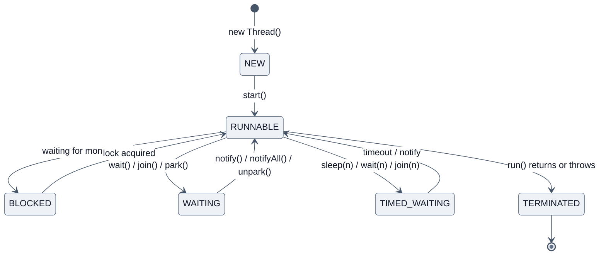

> [!WARNING]
> **`sleep()` vs `wait()` — asked in ~40% of Java concurrency screens:**
> | | `Thread.sleep(n)` | `obj.wait()` |
> |---|---|---|
> | Class | `Thread` (static) | `Object` (instance) |
> | Releases lock? | ❌ **keeps** monitor | ✅ **releases** monitor |
> | Needs sync block? | ❌ | ✅ (`IllegalMonitorStateException` otherwise) |
> | Woken by | timeout / interrupt | `notify`/`notifyAll` / timeout / **spurious wakeup** |
> | Always use in | — | `while (condition) obj.wait();` — **never `if`** |

### `synchronized` vs `ReentrantLock`

| | `synchronized` | `ReentrantLock` |
|---|---|---|
| Acquire | Implicit (monitorenter/monitorexit) | Explicit `lock()` / `unlock()` in `finally` |
| Released on exception | ✅ automatic | ❌ **only if you wrote `finally`** |
| Fairness | ❌ always barging | ✅ optional (`new ReentrantLock(true)`) |
| Interruptible | ❌ | ✅ `lockInterruptibly()` |
| Timeout | ❌ | ✅ `tryLock(5, SECONDS)` — **deadlock avoidance** |
| Multiple conditions | 1 wait set | ✅ N `Condition` objects |
| Lock across methods | ❌ block-scoped | ✅ hand-over-hand |
| Monitoring | Thread dump shows it clearly | `getHoldCount`, `isLocked`, `getQueueLength` |
| Virtual-thread friendly | ✅ **since JDK 24 (JEP 491)**; pinned before | ✅ always |

**Rule of thumb:** default to `synchronized` (simpler, JIT-optimizable via lock elision/coarsening); reach for `ReentrantLock` when you need timeouts, interruptibility, fairness, or multiple conditions.

### Deadlock, livelock, starvation

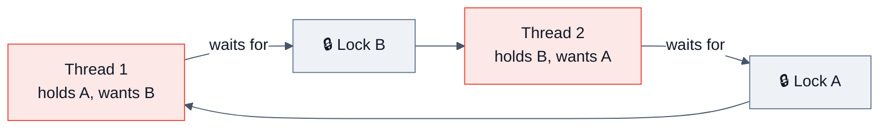

**Coffman conditions — all four must hold:** mutual exclusion, hold-and-wait, no preemption, circular wait. Break any one:

| Fix | How |
|-----|-----|
| **Lock ordering** ⭐ | Always acquire locks in a global order (e.g., by `System.identityHashCode` or account id). The standard bank-transfer answer. |
| **Timeout** | `tryLock(timeout)` + back off and retry with jitter |
| **Lock-free** | `AtomicReference` + CAS loop, immutable data |
| **Coarser granularity** | One lock instead of two |
| **Open calls** | Never call foreign/unknown code while holding a lock |

**Detection:** `jstack <pid>` prints `Found one Java-level deadlock:` explicitly. `ThreadMXBean.findDeadlockedThreads()` programmatically. JFR + Mission Control visually.

- **Livelock** — threads keep responding to each other and make no progress (two people stepping aside in a corridor). Fix: randomized backoff.
- **Starvation** — a thread never gets the resource (unfair locks, priority inversion). Fix: fair locks, bounded work per task.

### Atomics & CAS

```java
AtomicInteger counter = new AtomicInteger();
counter.incrementAndGet();                       // lock-free CAS loop
counter.updateAndGet(x -> Math.min(x + 1, MAX)); // arbitrary CAS function

LongAdder hits = new LongAdder();                // ✅ better under HIGH contention
hits.increment(); long total = hits.sum();
```

**CAS (`compareAndSet`)** maps to a single CPU instruction (`LOCK CMPXCHG` on x86, `LDREX/STREX` or `CAS` on ARM). It's optimistic: read → compute → swap-if-unchanged → retry.

**Why `LongAdder` > `AtomicLong` under contention:** `AtomicLong` has one hot cache line — every core's CAS invalidates it (cache-line ping-pong). `LongAdder` stripes across `Cell[]` padded with `@Contended` to avoid **false sharing**, summing only on read. Trade-off: more memory, `sum()` isn't an atomic snapshot. *(This answer alone is a senior signal.)*

**The ABA problem:** value goes A → B → A; CAS succeeds but the world changed underneath. Fix: `AtomicStampedReference` (value + version) or `AtomicMarkableReference`.

### Thread pools — `ThreadPoolExecutor` internals

```java
new ThreadPoolExecutor(
    corePoolSize,               // kept alive even when idle
    maximumPoolSize,            // hard cap
    keepAliveTime, TimeUnit.SECONDS,
    workQueue,                  // ⚠️ the most important parameter
    threadFactory,              // name your threads! aids debugging
    rejectedExecutionHandler);
```

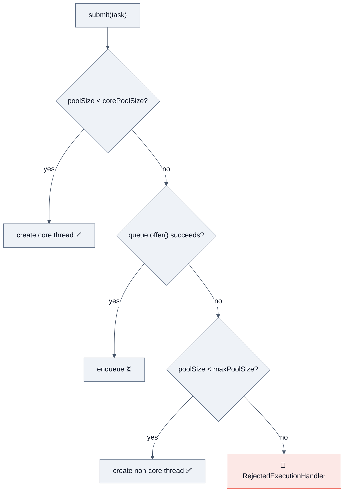

> [!WARNING]
> **The #1 thread-pool bug:** using an **unbounded** queue (`LinkedBlockingQueue` with no capacity — what `Executors.newFixedThreadPool` does). `maximumPoolSize` is then **never reached**, and the queue grows until `OutOfMemoryError`. Under a traffic spike this turns a latency problem into a total outage. **Always bound the queue** and pick an explicit rejection policy. Alibaba's public Java style guide bans `Executors.*` factories for exactly this reason.

| Rejection policy | Behaviour | Use when |
|---|---|---|
| `AbortPolicy` (default) | Throws `RejectedExecutionException` | You want fast, visible failure |
| `CallerRunsPolicy` | Caller thread executes it | ⭐ Natural backpressure — slows the producer |
| `DiscardPolicy` | Silently drops | Best-effort telemetry |
| `DiscardOldestPolicy` | Drops head, retries | Freshness > completeness |

**Pool sizing:**
- CPU-bound: `N_threads ≈ N_cores + 1`
- I/O-bound: `N_threads ≈ N_cores × target_utilization × (1 + W/C)` where `W/C` = wait-time / compute-time (Brian Goetz, *JCiP*)
- Better modern answer: **use virtual threads for I/O-bound work and stop sizing pools**; use a `Semaphore` to bound the *downstream* resource instead.

### Virtual threads (Project Loom) 🔥

```java
// One virtual thread per task — millions are fine
try (var executor = Executors.newVirtualThreadPerTaskExecutor()) {
    IntStream.range(0, 1_000_000).forEach(i ->
        executor.submit(() -> { fetchFromDownstream(i); return null; }));
}   // close() waits for all tasks
```

| | Platform thread | Virtual thread |
|---|---|---|
| Backed by | 1:1 OS thread | M:N onto carrier threads (`ForkJoinPool`) |
| Stack | ~1 MB reserved | Few hundred bytes → grows on heap (**stack chunk**) |
| Practical count | thousands | **millions** |
| Creation cost | ~1 ms, pooled | ~1 µs, **never pool them** |
| Blocking | Blocks the OS thread ❌ | **Unmounts** the carrier ✅ |
| Best for | CPU-bound, long-lived | I/O-bound, request-per-task |
| `ThreadLocal` | Fine | Works, but memory ×millions → prefer `ScopedValue` |

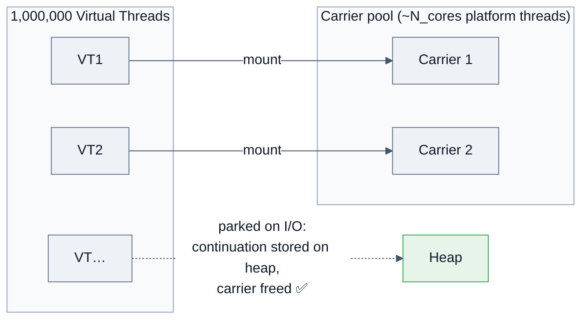

**Pinning** — when a virtual thread *cannot* unmount and holds its carrier hostage:
- ❌ Inside a native frame / JNI call — **still pins**
- ⚠️ Inside `synchronized` while blocking — **pinned in JDK 21–23; FIXED in JDK 24 by JEP 491**
- Detect with `-Djdk.tracePinnedThreads=full` (21–23) or the `jdk.VirtualThreadPinned` JFR event

> [!TIP]
> **Staff-level nuance:** virtual threads change *where* your bottleneck is, not whether you have one. If you fire 100k concurrent virtual threads at a DB with a 20-connection pool, you've just moved the queue from the thread pool into the connection pool — and made it invisible. **Always keep an explicit `Semaphore`/pool limit on scarce downstream resources.** Interviewers at Stripe/Uber/Netflix love this point.

### `CompletableFuture`

```java
CompletableFuture<Profile> profile =
    CompletableFuture.supplyAsync(() -> userSvc.load(id), ioPool)
        .thenCombine(CompletableFuture.supplyAsync(() -> orderSvc.recent(id), ioPool),
                     Profile::new)
        .orTimeout(500, TimeUnit.MILLISECONDS)
        .exceptionally(ex -> Profile.degraded(id));   // graceful degradation
```

| Method | Meaning |
|---|---|
| `thenApply` / `thenApplyAsync` | transform (sync on completing thread / async on pool) |
| `thenCompose` | **flatMap** — chain a dependent future (avoids `CF<CF<T>>`) |
| `thenCombine` | zip two independent futures |
| `allOf` / `anyOf` | fan-in / first-wins (hedged requests) |
| `exceptionally` / `handle` / `whenComplete` | recover / recover+transform / side-effect |
| `orTimeout` / `completeOnTimeout` (Java 9) | ⭐ deadline control |

> [!WARNING]
> `CompletableFuture.supplyAsync(task)` **without an executor** uses `ForkJoinPool.commonPool()`. Blocking I/O there starves every parallel stream and every other CF in the JVM. **Always pass an explicit executor.** Classic production incident.

### Structured concurrency (`🆕 preview → 25`)

```java
try (var scope = StructuredTaskScope.open()) {     // shape stabilized in JDK 25
    var user   = scope.fork(() -> userSvc.load(id));
    var orders = scope.fork(() -> orderSvc.recent(id));
    scope.join();                                   // both done, or all cancelled together
    return new Profile(user.get(), orders.get());
}
```
Solves **thread leaks** and **orphan tasks**: if one subtask fails, siblings are cancelled; the scope can't exit until children finish. Mention it as "the fix for `CompletableFuture`'s unstructured lifetimes."

---

## 3.3 Garbage collection deep dive

```mermaid
%%{init: {'theme':'base','themeVariables':{'background':'#ffffff','mainBkg':'#eef2f7','primaryColor':'#eef2f7','primaryTextColor':'#111827','primaryBorderColor':'#64748b','secondaryColor':'#e8f0fe','tertiaryColor':'#f1f5f9','lineColor':'#475569','textColor':'#111827','clusterBkg':'#f8fafc','clusterBorder':'#94a3b8','edgeLabelBackground':'#ffffff','titleColor':'#111827','actorBkg':'#eef2f7','actorTextColor':'#111827','actorBorder':'#64748b','actorLineColor':'#475569','signalColor':'#111827','signalTextColor':'#111827','noteBkgColor':'#fff4e5','noteTextColor':'#111827','noteBorderColor':'#d97706','labelBoxBkgColor':'#eef2f7','labelBoxBorderColor':'#64748b','labelTextColor':'#111827','loopTextColor':'#111827','altBackground':'#f8fafc'}}}%%
flowchart LR
    R["GC Roots<br/>• stack locals<br/>• static fields<br/>• JNI refs<br/>• active threads<br/>• monitors"] --> M["🔍 Mark reachable"]
    M --> S["🧹 Sweep / Copy / Compact"]
    S --> F["📦 Free memory"]
    style R fill:#fff4e5,stroke:#f4b400,color:#111827
```

**Reachability (not reference counting!)** — Java uses **tracing** GC, so reference *cycles* are collected fine. Interviewers ask this to see if you confuse it with Python/Swift ARC.

### Collector comparison

| Collector | Flag | Pause target | Heap sweet spot | Use case |
|---|---|---|---|---|
| **Serial** | `-XX:+UseSerialGC` | high | < 100 MB | containers with 1 CPU, CLI tools |
| **Parallel** (throughput) | `-XX:+UseParallelGC` | high, but max throughput | < 4 GB | batch jobs, ETL, Spark executors |
| **G1** ⭐ default since 9 | `-XX:+UseG1GC` | soft, `-XX:MaxGCPauseMillis=200` | 4–64 GB | **general server default** |
| **ZGC** | `-XX:+UseZGC -XX:+ZGenerational` | **< 1 ms**, concurrent | 8 GB – 16 TB | latency-critical (trading, ads, real-time) |
| **Shenandoah** | `-XX:+UseShenandoahGC` | **< 10 ms**, concurrent compaction | any | Red Hat/OpenJDK low-latency |
| **Epsilon** | `-XX:+UseEpsilonGC` | none — never collects | — | benchmarks, short jobs, GC-pressure tests |

**G1 in one paragraph (know this):** heap is split into ~2048 equal **regions** dynamically tagged Eden/Survivor/Old/Humongous. GC picks the regions with the most garbage first ("**Garbage First**") to meet a **soft pause goal**. Concurrent marking runs alongside the app; evacuation (copying) is a stop-the-world pause but bounded by the chosen collection set. **Humongous objects** (> 50% of a region) are allocated straight into contiguous old regions — a common source of surprise Full GCs.

**ZGC in one paragraph:** concurrent everything (mark, relocate, remap) using **colored pointers** (metadata in unused pointer bits) + **load barriers** that fix up references lazily. Pauses are O(1) w.r.t. heap size — sub-millisecond on multi-TB heaps. Cost: ~5–15% throughput and higher CPU/memory overhead.

### Reference types

| Type | Collected when | Use |
|------|---------------|-----|
| **Strong** `Object o = new O()` | Never while reachable | Normal |
| **Soft** `SoftReference` | Only under memory pressure, before OOM | Memory-sensitive caches |
| **Weak** `WeakReference` | Next GC, if only weakly reachable | `WeakHashMap`, canonicalizing maps, listener registries |
| **Phantom** `PhantomReference` | After finalization; `get()` always `null` | Post-mortem cleanup (`Cleaner`), off-heap resource release |

> [!TIP]
> `ThreadLocal` uses **weak keys** but **strong values** in `ThreadLocalMap`. In a thread pool, threads never die, so if you don't call `remove()`, the value leaks — and in a webapp it can pin the whole classloader → `Metaspace` OOM on redeploy. **`ThreadLocal` + thread pool + no `remove()` = the most-cited Java memory leak in production write-ups.**

### GC tuning workflow

```mermaid
%%{init: {'theme':'base','themeVariables':{'background':'#ffffff','mainBkg':'#eef2f7','primaryColor':'#eef2f7','primaryTextColor':'#111827','primaryBorderColor':'#64748b','secondaryColor':'#e8f0fe','tertiaryColor':'#f1f5f9','lineColor':'#475569','textColor':'#111827','clusterBkg':'#f8fafc','clusterBorder':'#94a3b8','edgeLabelBackground':'#ffffff','titleColor':'#111827','actorBkg':'#eef2f7','actorTextColor':'#111827','actorBorder':'#64748b','actorLineColor':'#475569','signalColor':'#111827','signalTextColor':'#111827','noteBkgColor':'#fff4e5','noteTextColor':'#111827','noteBorderColor':'#d97706','labelBoxBkgColor':'#eef2f7','labelBoxBorderColor':'#64748b','labelTextColor':'#111827','loopTextColor':'#111827','altBackground':'#f8fafc'}}}%%
flowchart LR
    A["📊 Measure<br/>-Xlog:gc*<br/>+ JFR"] --> B["📈 Analyze<br/>GCEasy / GCViewer /<br/>Mission Control"]
    B --> C{"Symptom?"}
    C -->|"High allocation rate"| D["Reduce garbage:<br/>object pooling for big buffers,<br/>primitives, avoid boxing"]
    C -->|"Long Young GC"| E["Larger young gen<br/>-Xmn / G1NewSizePercent"]
    C -->|"Frequent Full GC"| F["Heap too small OR leak<br/>→ heap dump + MAT"]
    C -->|"High pause, big heap"| G["Switch to ZGC/Shenandoah"]
    D --> A
    E --> A
    F --> A
    G --> A
```

**Essential flags:**
```bash
-Xms4g -Xmx4g                          # equal → avoid resize pauses & fragmentation
-XX:+UseG1GC -XX:MaxGCPauseMillis=200
-Xlog:gc*,safepoint:file=gc.log:time,uptime,level,tags:filecount=5,filesize=20M
-XX:+HeapDumpOnOutOfMemoryError -XX:HeapDumpPath=/var/log/heapdump.hprof
-XX:+ExitOnOutOfMemoryError            # let the orchestrator restart a poisoned JVM
-XX:MaxRAMPercentage=75.0              # ⭐ containers: NOT -Xmx
-XX:+UseContainerSupport               # on by default since 10 — respects cgroup limits
```

> [!WARNING]
> **Container gotcha (asked at every cloud-native shop):** before JDK 8u191, the JVM read the *host's* CPU/memory, not the cgroup limit → it sized the heap for a 64 GB host inside a 512 MB container → instant OOMKill (exit 137) with **no Java `OutOfMemoryError` and no heap dump**. Modern fix: `-XX:MaxRAMPercentage`, and remember the JVM needs **non-heap** memory too (Metaspace, code cache, thread stacks, direct buffers, GC structures) — budget heap at ~50–75% of the container limit.

---

## 3.4 JIT compilation & performance

```mermaid
%%{init: {'theme':'base','themeVariables':{'background':'#ffffff','mainBkg':'#eef2f7','primaryColor':'#eef2f7','primaryTextColor':'#111827','primaryBorderColor':'#64748b','secondaryColor':'#e8f0fe','tertiaryColor':'#f1f5f9','lineColor':'#475569','textColor':'#111827','clusterBkg':'#f8fafc','clusterBorder':'#94a3b8','edgeLabelBackground':'#ffffff','titleColor':'#111827','actorBkg':'#eef2f7','actorTextColor':'#111827','actorBorder':'#64748b','actorLineColor':'#475569','signalColor':'#111827','signalTextColor':'#111827','noteBkgColor':'#fff4e5','noteTextColor':'#111827','noteBorderColor':'#d97706','labelBoxBkgColor':'#eef2f7','labelBoxBorderColor':'#64748b','labelTextColor':'#111827','loopTextColor':'#111827','altBackground':'#f8fafc'}}}%%
flowchart LR
    BC["Bytecode"] --> INT["Interpreter<br/>(tier 0, profiling)"]
    INT -->|"~1.5k invocations"| C1["C1 client compiler<br/>(tiers 1-3, fast compile)"]
    C1 -->|"~10k invocations"| C2["C2 server compiler<br/>(tier 4, aggressive opts)"]
    C2 -->|"assumption violated"| DEOPT["🔙 Deoptimization<br/>back to interpreter"]
    DEOPT --> INT
    C2 --> NATIVE["Optimized native code<br/>in Code Cache"]
    style C2 fill:#e6f4ea,stroke:#34a853,color:#111827
```

**Optimizations to name:** inlining (the "mother of all optimizations"), **escape analysis** → scalar replacement + stack allocation + **lock elision**, loop unrolling, dead-code elimination, **branch prediction from profile data**, intrinsics (`Math.max`, `System.arraycopy`, `Arrays.equals` → SIMD), lock coarsening, **monomorphic/bimorphic inline caches** (megamorphic call sites ≥3 types lose inlining — a real design consideration for hot interfaces).

**Deoptimization** happens when a speculative assumption breaks (a new subclass loaded, a never-taken branch is taken, an uncommon trap). This is why **JMH benchmarks need warmup** — measuring cold code measures the interpreter.

> [!TIP]
> **"Why is my Java service slow for the first 30 seconds?"** — JIT warmup + class loading + lazy initialization. Mitigations: CDS/AppCDS (`-XX:SharedArchiveFile`), tiered compilation defaults, warmup traffic before adding to the load balancer, GraalVM `native-image` for instant startup (trade-off: no JIT peak performance, closed-world assumption, reflection needs config). Netflix, Twitter, and Alibaba have all published on this exact problem.

---

## 3.5 Immutability, thread safety & defensive copying

```java
public final class Order {                          // final class: no subclass can break invariants
    private final String id;                        // final fields
    private final List<Item> items;                 // ⚠️ mutable type
    private final Date created;                     // ⚠️ mutable legacy type

    public Order(String id, List<Item> items, Date created) {
        this.id = Objects.requireNonNull(id);
        this.items = List.copyOf(items);            // ✅ defensive copy IN (also unmodifiable)
        this.created = new Date(created.getTime()); // ✅ copy in
    }
    public List<Item> items()  { return items; }    // already unmodifiable
    public Date created()      { return new Date(created.getTime()); } // ✅ copy OUT
}
```

**Recipe for immutability:** (1) `final` class or private ctor, (2) all fields `private final`, (3) no setters, (4) **defensive copy on the way in and on the way out** for mutable components, (5) don't leak `this` from the constructor.

**Records give you 1–3 and 4 only if the components are themselves immutable** — `record Order(List<Item> items)` is *shallowly* immutable, and its accessor hands out your list. Say this; it's a common follow-up.

**Thread-safety levels** (Goetz's taxonomy) — useful vocabulary in design rounds:
`immutable` > `thread-safe` > `conditionally thread-safe` (client-side locking needed for compound ops) > `thread-compatible` (safe with external sync) > `thread-hostile`.

> [!WARNING]
> `Collections.synchronizedList(list)` makes each *method* atomic, not *sequences* of methods:
> ```java
> if (!list.contains(x)) list.add(x);  // 💥 STILL a race — check-then-act
> synchronized (list) { if (!list.contains(x)) list.add(x); }  // ✅ client-side locking
> ```

---

## 3.6 Distributed-systems implications of Java basics

This is where staff-level candidates separate themselves. Interviewers rarely ask "explain CAP" in a *Java* round — they ask how your Java choices interact with a distributed system.

| Java concept | Distributed-systems consequence |
|---|---|
| **`hashCode()`** | Never persist or shard on `Object.hashCode()` or `String.hashCode()` across JVMs/versions — identity hashes differ per run, and shard maps must be stable. Use an explicit stable hash (murmur3, xxhash) + **consistent hashing** for cache/shard placement. |
| **`equals`/`hashCode` on cache keys** | Wrong contract → cache misses that look like a "slow database", or cross-tenant data leaks if `equals` is too loose. |
| **Serialization** | Java native serialization is a **cross-service coupling and security disaster**. Use Protobuf/Avro/JSON with an explicit schema and a compatibility policy. |
| **Immutability** | Makes events/messages safe to share, replay, and cache — the foundation of event sourcing and CQRS. |
| **Thread pools** | A pool is a **bulkhead**. One pool per downstream dependency prevents a slow dependency from consuming all threads (the Netflix Hystrix thesis). |
| **Timeouts** | *Every* remote call needs one. A JDBC/HTTP call with no timeout turns a partial failure into a total outage; threads pile up until the pool is exhausted → **cascading failure**. |
| **Retries** | Naive retries amplify load 3× during an incident (**retry storm**). Use exponential backoff + **full jitter** + a **retry budget** + circuit breakers (Resilience4j). |
| **Idempotency** | At-least-once delivery is the norm; make consumers idempotent with an idempotency key + dedup store. |
| **CAP / consistency** | A `ConcurrentHashMap`-backed local cache is per-node ⇒ **eventual consistency** across your fleet. Discuss TTL, versioned keys, and pub/sub invalidation instead of pretending it's coherent. |
| **GC pauses** | A 2-second Full GC looks exactly like a network partition to a heartbeat-based cluster (Cassandra/Kafka/ZooKeeper) → **spurious failover, split brain**. Tune GC *and* pick failure-detection timeouts above p99.9 pause. |
| **Clock** | `System.currentTimeMillis()` can jump backwards (NTP). Use `System.nanoTime()` for durations, and never for cross-machine ordering — use logical clocks / Snowflake IDs. |
| **`ThreadLocal` context** | Trace IDs propagate via `ThreadLocal`/MDC — which silently break across `CompletableFuture` and pools. Use context-propagation libs or `ScopedValue`. |
| **Backpressure** | An unbounded queue is an unbounded liability. Reactive Streams / `CallerRunsPolicy` / bounded buffers push the pressure to the producer. |

```mermaid
%%{init: {'theme':'base','themeVariables':{'background':'#ffffff','mainBkg':'#eef2f7','primaryColor':'#eef2f7','primaryTextColor':'#111827','primaryBorderColor':'#64748b','secondaryColor':'#e8f0fe','tertiaryColor':'#f1f5f9','lineColor':'#475569','textColor':'#111827','clusterBkg':'#f8fafc','clusterBorder':'#94a3b8','edgeLabelBackground':'#ffffff','titleColor':'#111827','actorBkg':'#eef2f7','actorTextColor':'#111827','actorBorder':'#64748b','actorLineColor':'#475569','signalColor':'#111827','signalTextColor':'#111827','noteBkgColor':'#fff4e5','noteTextColor':'#111827','noteBorderColor':'#d97706','labelBoxBkgColor':'#eef2f7','labelBoxBorderColor':'#64748b','labelTextColor':'#111827','loopTextColor':'#111827','altBackground':'#f8fafc'}}}%%
flowchart TB
    subgraph BAD["❌ No bulkheads"]
      P1["Single 200-thread pool"] --> S1["Service A (slow)"]
      P1 --> S2["Service B"]
      P1 --> S3["Service C"]
      N1["Service A degrades → all 200 threads blocked → entire app down"]
    end
    subgraph GOOD["✅ Bulkheads + timeouts + breaker"]
      PA["Pool A (20) + 300ms timeout + CB"] --> SA["Service A (slow)"]
      PB["Pool B (20)"] --> SB["Service B ✅"]
      PC["Pool C (20)"] --> SC["Service C ✅"]
    end
    style BAD fill:#fce8e6,stroke:#ea4335,color:#111827
    style GOOD fill:#e6f4ea,stroke:#34a853,color:#111827
```

---

## 3.7 Serialization

```java
class Session implements Serializable {
    private static final long serialVersionUID = 1L;   // ⭐ ALWAYS declare explicitly
    private String user;
    private transient String password;                  // excluded from the byte stream
    private transient Connection conn;                  // non-serializable resource
}
```

**Why declare `serialVersionUID`?** If omitted, the JVM computes it from the class structure — adding a field then breaks deserialization with `InvalidClassException` across versions.

| Rule | Detail |
|---|---|
| `static` fields | Not serialized (class-level, not instance state) |
| `transient` fields | Skipped; restored to defaults (`null`/`0`) |
| Superclass not `Serializable` | Its **no-arg constructor runs** during deserialization |
| Deserialization | **Does not call the constructor** of the serializable class → invariants can be violated ⚠️ |
| `Externalizable` | Full manual control (`writeExternal`/`readExternal`), calls public no-arg ctor, faster |
| Singleton safety | Implement `readResolve()` — or use an `enum` |

> [!WARNING]
> 🔒 **Java deserialization of untrusted data is a remote-code-execution class of vulnerability** (gadget chains via Commons-Collections; CVE-2015-4852 hit WebLogic/JBoss/Jenkins/WebSphere). Oracle's own docs call it a "serious risk." Mitigations: never deserialize untrusted bytes; **`ObjectInputFilter`** allow-lists (Java 9+, backported to 8u121); prefer JSON/Protobuf. Bloomberg, Goldman, and security-conscious teams ask this directly.

---

# 4. 💬 Interview Questions by Level

> **Rating key:** ★★★★★ Must Know · ★★★★☆ Very Likely · ★★★☆☆ Good to Know

---

## 🟢 Beginner (0–2 years)

### Q1. What is the difference between JDK, JRE, and JVM? ★★★★★
**Why asked:** Fastest possible filter for "did you actually learn Java or just copy code?"
**Expected answer:** JVM = specification + runtime that executes bytecode (memory management, GC, JIT). JRE = JVM + core class libraries (run only). JDK = JRE + `javac`, `jar`, `jdb`, `jlink`, `jshell` (develop + run). Add: "JVM is a *spec*; HotSpot, OpenJ9, and GraalVM are implementations. The standalone JRE was discontinued after Java 11 in favour of `jlink` images."
**Follow-ups:** Name a non-HotSpot JVM. What does `javac` produce? Is Java compiled or interpreted?
**Common mistakes:** Saying "JVM converts Java code to machine code" (it converts *bytecode*); claiming Java is purely interpreted.

### Q2. Why is Java platform-independent — and is the JVM? ★★★★★
**Expected answer:** Source → **platform-neutral bytecode**. The bytecode runs anywhere a JVM exists → "Write Once, Run Anywhere." The **JVM itself is platform-dependent** — you download a Windows/Linux/macOS build. That inversion is the whole trick.
**Follow-ups:** What breaks WORA in practice? (native libs via JNI, file separators, default charset before Java 18, `Locale`-sensitive `toLowerCase` — the Turkish-i bug, endianness in `ByteBuffer`.)
**Common mistake:** Forgetting to say the JVM is platform-specific.

### Q3. Is Java pass-by-value or pass-by-reference? ★★★★★
**Expected answer:** **Always pass-by-value.** For reference types, the *reference* is copied — so the callee can mutate the shared object but cannot rebind the caller's variable. Demonstrate with a `StringBuilder` mutate-vs-reassign example and a swap that doesn't work.
**Follow-ups:** How would you write a real `swap`? (return a pair/record, or use a holder/array). Why does `String` "seem" pass-by-value? (immutability, not semantics.)
**Common mistake:** "It's pass-by-reference for objects." Instant downgrade.

### Q4. `==` vs `equals()` vs `hashCode()`? ★★★★★
**Expected:** `==` compares primitives by value and references by identity; `equals()` is logical equality, `Object`'s default is `==`; `hashCode()` returns a bucket int and **must** be consistent with `equals`. Then the Integer-cache demo (`127` vs `128`) and the `new String("a") == "a"` case.
**Follow-ups:** What breaks if `hashCode` is inconsistent? Can two unequal objects share a hash? (yes) Can two equal objects have different hashes? (no — contract violation)
**Common mistake:** "`==` compares content for `String`."

### Q5. Why is `String` immutable? Explain the String pool. ★★★★★
**Expected:** The five reasons (pool sharing, cached hash, security, thread safety, class loading) + the pool lives in the **heap since Java 7** (was PermGen) + `intern()` + `new String()` bypasses the pool. Bonus: Compact Strings (`byte[]`) since Java 9.
**Follow-ups:** How many objects does `String s = new String("hi")` create? (1 or 2 — the pooled literal if not already present, plus the new heap object.) Why is `String` a bad choice for passwords? (`char[]`/`byte[]` can be zeroed; Strings linger in the pool and in heap dumps.)

### Q6. What are the four pillars of OOP? ★★★★★
**Expected:** Encapsulation, abstraction, inheritance, polymorphism — with a **Java mechanism + real code example** for each, not textbook definitions.
**Follow-ups:** Abstraction vs encapsulation? Compile-time vs runtime polymorphism? Why does Java lack multiple inheritance of *state*? (diamond problem; interfaces give multiple inheritance of *type* and, since 8, of *behaviour* — with an explicit override required to resolve conflicts.)

### Q7. Interface vs abstract class — when do you use each? ★★★★★
**Expected:** See the table in §14. Decision rule: **interface = capability/contract ("can-do"), multiple inheritance, API boundary; abstract class = shared *state* + partial implementation ("is-a")**. Modern nuance: since Java 8 interfaces have `default`/`static` methods and since 9 `private` methods — so "interfaces can't have code" is outdated. They still can't hold **instance state**.
**Follow-ups:** Diamond problem with two default methods? (compile error → resolve with `Interface.super.method()`.) Why were default methods added? (to evolve `Collection` with `stream()`/`forEach()` **without breaking every implementor** — binary backward compatibility. Say this; it's the real reason.)

### Q8. `final`, `finally`, `finalize()`? ★★★★☆
**Expected:** `final` = keyword (immutable binding / no override / no subclass); `finally` = block that always runs (except `System.exit`, JVM crash, infinite loop); `finalize()` = deprecated `Object` method for pre-GC cleanup — **deprecated in 9, disabled by default in 18 (JEP 421), being removed**. Use `try-with-resources` or `Cleaner`.
**Common mistake:** Claiming `finalize()` is "called before GC, guaranteed." It's never guaranteed to run at all.

### Q9. `static` — what does it mean and when do you use it? ★★★★☆
**Expected:** Belongs to the class, not the instance; one copy per **classloader**; loaded during class initialization; can't access instance members; `static` nested classes don't hold an outer reference. Uses: constants, factory methods, utility classes, counters.
**Follow-ups:** Can you override a static method? (**No — it's hidden**, resolved by static type.) Why can't `main` be non-static? (JVM must call it before any instance exists.) Static block vs instance block execution order? (static blocks once at class init → then per-instance: instance blocks → constructor.)
**Trap:** `static` + mutable state = the most common accidental memory leak and the most common hidden race.

### Q10. Checked vs unchecked exceptions? ★★★★★
**Expected:** Compile-time enforcement, `Exception` vs `RuntimeException`, recoverable-external vs programming-bug. Then the *opinion*: modern Java practice leans toward unchecked (Spring wraps `SQLException` into unchecked `DataAccessException`; Kotlin/C#/Scala dropped checked exceptions entirely; they don't compose with lambdas/streams). But **know both sides** — Oracle's own tutorial still advocates checked exceptions for recoverable conditions, and library boundaries often benefit.
**Follow-up:** Can an overriding method throw a broader checked exception? (No.) Can it throw a broader *unchecked* one? (Yes.)

### Q11. `ArrayList` vs `LinkedList` — which and why? ★★★★★
**Expected:** Array-backed contiguous vs doubly-linked nodes; O(1) random access vs O(n); insert/delete cost; **and then the real answer: `ArrayList` wins almost always in practice** because of CPU cache locality and lower per-element overhead (`LinkedList` allocates a node with 3 references ≈ 40 bytes per element). Even Josh Bloch has said `LinkedList`'s practical use is near zero. Use `ArrayDeque` for stack/queue.
**Follow-up:** How does `ArrayList` grow? (`oldCapacity + (oldCapacity >> 1)` ≈ 1.5×, `Arrays.copyOf`; default 10 on first add, lazily.)

### Q12. How does `HashMap` work internally? ★★★★★
See §2.5 — this is *the* question. Structure your answer as: **hash → spread → index → bucket → list/tree → resize**, then recite the constants (16, 0.75, 8, 6, 64), then Java 7 vs 8 differences, then thread-safety.

### Q13. What is the `main` method signature and why? ★★★☆☆
`public static void main(String[] args)` — `public` (JVM calls from outside), `static` (no instance yet), `void` (exit code comes from `System.exit`), `String[]` (CLI args). `String... args` also works; `main(String args[])` works; the parameter name is irrelevant. `🆕 Java 25`: instance `main()` with no args/modifiers is now legal in compact source files.

### Q14. Access modifiers? ★★★★☆
| Modifier | Class | Package | Subclass | World |
|---|---|---|---|---|
| `private` | ✅ | ❌ | ❌ | ❌ |
| *(default/package-private)* | ✅ | ✅ | ❌ | ❌ |
| `protected` | ✅ | ✅ | ✅ | ❌ |
| `public` | ✅ | ✅ | ✅ | ✅ |

**Follow-up:** Top-level classes can only be `public` or package-private. `protected` also grants package access (surprises people). Since Java 9, **JPMS `exports`** adds a second, stronger layer — a `public` class in a non-exported package is inaccessible across modules.

### Q15. What is a constructor? Can it be `private`/`final`/`static`? ★★★☆☆
Initializes state; same name as class; no return type; default no-arg ctor supplied **only if you declare none**. Can be `private` (singleton, builders, static factories) but **never** `final`, `static`, `abstract`, or `synchronized`. Chaining: `this(...)` / `super(...)` must be the **first statement** (relaxed in recent previews of "flexible constructor bodies").

---

## 🟡 Intermediate (2–5 years)

### Q16. Explain `hashCode()`/`equals()` contract and what breaks without it. ★★★★★
Cover all 5 rules + the `HashSet` disappearance demo + **mutable key** hazard + why `31` + `Objects.hash`. Mention that `record` generates both correctly and that `equals` must be **symmetric** — the classic asymmetric bug is `Timestamp.equals(Date)`.

### Q17. `ConcurrentHashMap` vs `Hashtable` vs `Collections.synchronizedMap`. ★★★★★
| | `Hashtable` | `synchronizedMap` | `ConcurrentHashMap` |
|---|---|---|---|
| Locking | Whole map, every method | Whole map via wrapper mutex | **Per-bin** (CAS + `synchronized` node) |
| Nulls | ❌ | depends on backing map | ❌ key and value |
| Iteration | fail-fast, needs external sync | needs external `synchronized(map)` | **weakly consistent**, no external sync |
| Atomic compound ops | ❌ | ❌ | ✅ `compute`, `merge`, `putIfAbsent` |
| Throughput under contention | worst | poor | **best** |
| Status | legacy (Java 1.0) | legacy-ish | ⭐ use this |

### Q18. Fail-fast vs fail-safe iterators; what causes `ConcurrentModificationException`? ★★★★★
See §2.5. Emphasize it can be thrown even **single-threaded** (removing inside a for-each), that it's best-effort, and give three correct fixes (`Iterator.remove`, `removeIf`, collect-then-remove / concurrent collection).

### Q19. Explain type erasure and its consequences. ★★★★☆
See §2.6. Follow-ups: what is a **bridge method**? Why can't you have `void f(List<String>)` and `void f(List<Integer>)`? How do you work around `new T[]`? (`(T[]) new Object[n]` + `@SuppressWarnings`, or `Array.newInstance(clazz, n)` with a `Class<T>` token — the "type token" pattern.) What is a **super type token** (`TypeReference` in Jackson)?

### Q20. What is PECS? ★★★★☆
See §2.6. Follow-up: why is `List<Object> l = new ArrayList<String>()` illegal but `Object[] a = new String[1]` legal? (Generics are invariant by design; array covariance is a Java 1.0 mistake that trades compile-time safety for a runtime `ArrayStoreException`.)

### Q21. `synchronized` vs `volatile` vs `Atomic*`. ★★★★★
| Need | Use |
|---|---|
| Visibility only, single writer, no compound op | `volatile` |
| Atomic single-variable read-modify-write | `AtomicInteger` / `AtomicReference` (CAS) |
| Very high-contention counters | `LongAdder` |
| Atomicity across **multiple** variables / invariants | `synchronized` or `ReentrantLock` |
| Read-mostly shared structure | `ReadWriteLock` / `StampedLock` / immutable snapshot |

### Q22. What is a deadlock and how do you prevent, detect, and recover from one? ★★★★★
Coffman conditions → prevention (global lock ordering ⭐, `tryLock` timeout, lock-free, open calls) → detection (`jstack`, `ThreadMXBean.findDeadlockedThreads`, JFR) → recovery (there's no safe way to break a Java monitor deadlock — you must restart or design timeouts in from the start; that honesty scores points).

### Q23. Explain the thread lifecycle & `wait`/`notify`. Write a bounded buffer. ★★★★★
```java
class BoundedBuffer<T> {
    private final Queue<T> q = new ArrayDeque<>();
    private final int capacity;
    BoundedBuffer(int capacity) { this.capacity = capacity; }

    public synchronized void put(T item) throws InterruptedException {
        while (q.size() == capacity) wait();      // ⭐ while, not if (spurious wakeups)
        q.add(item);
        notifyAll();                              // ⭐ notifyAll, not notify (mixed wait sets)
    }
    public synchronized T take() throws InterruptedException {
        while (q.isEmpty()) wait();
        T item = q.remove();
        notifyAll();
        return item;
    }
}
```
**Then say:** "In production I'd just use `ArrayBlockingQueue` — this is the hand-rolled version." Also: `notify()` can cause a **lost wakeup** when producers and consumers share one wait set; `Condition` objects (`notFull`/`notEmpty`) fix that with `signal()`.

### Q24. Why must you call `wait()` inside a `synchronized` block? ★★★★☆
Because `wait` **releases the monitor** — you must hold it to release it (else `IllegalMonitorStateException`), and the check-then-wait sequence would otherwise have a **lost-wakeup race**: you test the condition, a producer signals, then you `wait()` forever.

### Q25. Stream vs Collection. Is `parallelStream` always faster? ★★★★★
| | Collection | Stream |
|---|---|---|
| Purpose | Store data | Compute over data |
| Evaluation | Eager | **Lazy** until terminal op |
| Traversal | Multiple times | **Once** |
| Mutation | Yes | No — produces new results |
| External vs internal iteration | External | Internal |

`parallelStream` is **often slower**: splitting cost, merge cost, boxing, common-pool contention, poor splitting sources. Give the checklist from §2.8.

### Q26. `map` vs `flatMap`; `findFirst` vs `findAny`; `reduce` vs `collect`. ★★★★☆
`findAny` may return any element (better in parallel); `findFirst` respects encounter order. `reduce` is for **immutable** accumulation (associative, must not mutate); `collect` is a **mutable reduction** with supplier/accumulator/combiner. Using `reduce` with a mutable accumulator breaks in parallel.

### Q27. What is a memory leak in Java? Give four real causes. ★★★★★
1. **Static collections** that only ever grow (unbounded cache).
2. **`ThreadLocal` without `remove()`** in a pooled thread.
3. **Unregistered listeners/callbacks** (observer holds a strong ref).
4. **Unclosed resources** (streams, connections, `ExecutorService` never shut down → non-daemon threads keep the JVM alive).
5. Bonus: **`String.substring` before Java 7u6** shared the parent `char[]`; **classloader leaks** on hot redeploy; **`equals`/`hashCode` mutation** orphaning entries; **inner (non-static) classes** silently pinning the outer instance.
**Follow-up:** How do you find one? → §9 playbook.

### Q28. `Comparable` vs `Comparator`. ★★★★☆
`Comparable<T>.compareTo` = natural ordering, one per class, in `java.lang`, modifies the class. `Comparator<T>.compare` = external, many per class, in `java.util`, composable:
```java
list.sort(Comparator.comparing(Employee::dept)
                    .thenComparing(Employee::salary, Comparator.reverseOrder())
                    .thenComparing(Employee::name));
```
**Trap:** an inconsistent comparator throws `IllegalArgumentException: Comparison method violates its general contract!` from TimSort. Also `compareTo` **should** be consistent with `equals` — `BigDecimal` famously isn't (`new BigDecimal("1.0").equals(new BigDecimal("1.00"))` is `false` but `compareTo` is `0`), which breaks `TreeSet` vs `HashSet` semantics. Great follow-up material.

### Q29. Shallow vs deep copy; how do you clone properly? ★★★★☆
Shallow shares nested mutable objects; deep copies them recursively. `Object.clone()` is **broken by design** (`Cloneable` is a marker interface with no `clone` method, no constructor runs, `final` fields can't be reassigned). **Prefer a copy constructor / static factory / builder / record + `withX`** — *Effective Java* Item 13.

### Q30. What are `ExecutorService` and its shutdown semantics? ★★★★☆
```java
executor.shutdown();                                  // no new tasks; finish queued
if (!executor.awaitTermination(30, SECONDS)) {
    executor.shutdownNow();                           // interrupt running; return queued
    if (!executor.awaitTermination(30, SECONDS)) log.error("did not terminate");
}
```
**Trap:** `shutdownNow()` only *interrupts* — tasks that ignore interruption keep running. And a non-daemon pool that's never shut down **prevents JVM exit**.

---

## 🟠 Senior (5–8 years)

### Q31. Explain the Java Memory Model & happens-before. ★★★★★
See §3.1. Structure: *problem* (reordering + caches + store buffers) → *solution* (HB edges) → *tools* (`volatile`, `synchronized`, `final`, atomics, concurrent collections) → *example* (DCL, safe publication).

### Q32. Implement a thread-safe LRU cache. ★★★★★
```java
// Simple: LinkedHashMap in access-order with removeEldestEntry
class LruCache<K,V> extends LinkedHashMap<K,V> {
    private final int cap;
    LruCache(int cap) { super(cap, 0.75f, true); this.cap = cap; }  // true = ACCESS order
    @Override protected boolean removeEldestEntry(Map.Entry<K,V> e) { return size() > cap; }
}
Map<K,V> cache = Collections.synchronizedMap(new LruCache<>(1000));
```
**Then discuss trade-offs** (this is what separates senior from mid):
- `synchronizedMap` serializes *reads* too — a global lock at high QPS.
- **Better:** Caffeine (Window-TinyLFU) — near-optimal hit rate, `ConcurrentHashMap`-based, O(1) amortized, async loading, size/time/weight eviction, `Ticker` for testing.
- Distributed: Redis with TTL, but now you have coherence, stampede (use `computeIfAbsent`/single-flight + jittered TTL), and hot-key problems.
- Custom lock-free: `ConcurrentHashMap` + a doubly-linked list is *hard* to get right; state the difficulty honestly.

### Q33. How would you design an immutable class with a mutable field? ★★★★☆
Defensive copy in **and** out, `List.copyOf`, `final` class, no `this` leak. Then the modern nuance: records are shallowly immutable; use `List.copyOf` inside the compact constructor.

### Q34. Explain GC algorithms and how you'd choose one. ★★★★★
See §3.3. Frame it as a **three-way trade-off: throughput vs latency vs footprint** — you can pick two. Give a concrete decision: "Batch/ETL → Parallel. General microservice on 4–16 GB → G1 with a p99 pause SLO. Sub-10ms p99.9 requirement or > 32 GB heap → ZGC generational, accepting ~10% throughput and more CPU."

### Q35. Diagnose: production service p99 latency jumped from 50 ms to 2 s. ★★★★★
**Expected structured method (see §9):**
1. **Is it GC?** `-Xlog:gc*` / JFR → look for Full GCs, allocation-rate spikes, humongous allocations, promotion failure.
2. **Is it locks?** Thread dumps ×3 at 10 s intervals → `BLOCKED` threads on the same monitor; JFR `jdk.JavaMonitorEnter`.
3. **Is it downstream?** Per-dependency latency metrics, connection-pool saturation (HikariCP `pending` gauge), timeouts.
4. **Is it the pool/queue?** Executor queue depth, rejected count, thread count.
5. **Is it the JIT/deopt?** `-XX:+PrintCompilation`, deopt storms after a new class loads.
6. **Is it the host?** CPU throttling (cgroup `nr_throttled`), noisy neighbour, page cache, disk.
7. **Is it a code change?** Correlate with deploy markers.
**Say:** "I'd start from RED/USE metrics and a flame graph (async-profiler) before touching flags."

### Q36. `ThreadLocal` — how does it work, and when does it leak? ★★★★☆
Each `Thread` owns a `ThreadLocalMap` whose **keys are `WeakReference<ThreadLocal>`** and **values are strong**. When the `ThreadLocal` is unreachable, the key clears but the value stays until a subsequent map operation cleans the stale entry — which may never happen in a pooled thread. **Always `remove()` in a `finally`.** Uses: `SimpleDateFormat` (non-thread-safe), MDC/trace context, per-request user identity, per-thread buffers.
**Modern alternative:** `ScopedValue` (Java 21+ preview→) — immutable, scoped, virtual-thread-friendly, no leak.

### Q37. `CompletableFuture` — orchestrate 3 calls with timeout and fallback. ★★★★☆
See §3.2. Follow-ups: `thenApply` vs `thenCompose` (map vs flatMap); which thread runs the callback (the completing thread for non-`Async` variants — so a slow callback blocks the completer ⚠️); how exceptions propagate (`CompletionException` wrapping); `allOf` returns `CompletableFuture<Void>` so you must re-collect results.

### Q38. Virtual threads: what changes, what breaks? ★★★★★
See §3.2. Cover: cheap creation → *never pool them*; `synchronized` pinning (fixed in 24); `ThreadLocal` memory ×N; the **hidden bottleneck moves downstream**; thread dumps get huge (use `jcmd Thread.dump_to_file -format=json`); CPU-bound work gains nothing; libraries doing `Thread.currentThread().getName()`-based routing or thread-pool-based tenancy may break.

### Q39. Why is `String` a bad password container, and how do you handle secrets? ★★★☆☆
Immutable → you cannot zero it; it lingers in the heap (and in heap dumps and core dumps) until GC; literals live in the pool possibly forever. Use `char[]`/`byte[]` and `Arrays.fill(arr, '\0')` after use; keep secrets in a vault; avoid logging; be aware `String.replace` doesn't help.

### Q40. Explain `equals` symmetry violation with inheritance and how to fix it. ★★★☆☆
`getClass() != o.getClass()` (strict, breaks Liskov for proxies/subclasses) vs `instanceof` (breaks symmetry when a subclass adds state). *Effective Java*: **favour composition over inheritance for value classes** — there is no way to extend an instantiable class and add a value component while preserving the `equals` contract. Records sidestep this (implicitly final).

---

## 🔴 Staff / Principal

### Q41. You must cut p99.9 latency from 200 ms to 20 ms in a JVM service. Walk me through it. ★★★★★
**Expected shape of answer — process before tricks:**
1. **Define & measure** — p99.9 of *what* (server-side, client-observed?), coordinated omission (use HdrHistogram/wrk2, not naive averages).
2. **Attribution** — flame graphs (async-profiler: CPU, alloc, lock, wall-clock modes), JFR, distributed traces.
3. **Remove the tail sources, ranked:** GC pauses → ZGC/Shenandoah + allocation reduction; lock contention → sharding/striping/lock-free; queueing → Little's Law (`L = λW`), bound queues, shed load; downstream tails → hedged requests, timeouts, circuit breakers; JIT deopt & warmup → CDS, warmup traffic; safepoint pauses (biased-lock revocation, `TTSP` from counted loops); page faults / swap → `-XX:+AlwaysPreTouch`, disable swap; CPU throttling in k8s → fix CPU limits/requests.
4. **Verify** — canary, A/B, statistical significance, watch throughput and cost regressions.
5. **Guardrails** — SLO alerts, continuous profiling in production.

### Q42. Design a Java library API that will be used by 500 internal teams for 10 years. ★★★★★
Talking points: interfaces + static factories, **no public constructors**; builders for >3 params; **immutable value types (records)**; return `Optional`/empty collections, never `null`; **unchecked exceptions with rich context**; no leaking of internal types or third-party types in signatures; JPMS module with a minimal `exports`; **semantic versioning + a deprecation policy** (`@Deprecated(since, forRemoval)`); binary compatibility rules (adding an abstract method to an interface breaks everyone → use `default` or sealed); nullability annotations; no static mutable state; async: return `CompletableFuture`, accept an `Executor`; observability hooks; **zero mandatory dependencies** (avoid the Guava/Jackson diamond-dependency hell); comprehensive javadoc with `@apiNote`/`@implSpec`.

### Q43. When would you *not* choose Java? ★★★★☆
Honest trade-off talk: sub-millisecond deterministic latency without tuning (C++/Rust); tiny cold-start serverless (Go, JS — unless GraalVM native-image / CRaC); heavy numeric/SIMD kernels (until Vector API is final); memory-constrained edge (~50 MB baseline RSS); ML research ecosystem (Python). Then flip it: Java wins for large team codebases (static typing + tooling + refactoring), long-running high-throughput services, the JVM data ecosystem (Kafka, Spark, Flink, Cassandra, Elasticsearch, Hadoop), and operational maturity (JFR, heap dumps, async-profiler — the best production diagnostics of any runtime).

### Q44. How do you enforce Java quality across 200 engineers? ★★★★☆
Build-gating: Error Prone / NullAway, SpotBugs, PMD, Checkstyle + Spotless (auto-format), ArchUnit for architectural rules, JaCoCo coverage gates (with mutation testing via PIT for real signal), OWASP Dependency-Check + Snyk/Dependabot, reproducible builds, a single BOM for versions, JMH gates for hot paths, `jdeps`/JPMS boundaries, golden-path templates. Plus culture: an owned style guide, design review for public APIs, and a paved road rather than policing.

### Q45. Explain false sharing and how you'd fix it. ★★★☆☆
Two independent variables land on the same 64-byte cache line; a write by core A invalidates core B's line even though B reads a different variable → silent 10× slowdowns. Detect with `perf c2c` / VTune. Fix: padding, `@jdk.internal.vm.annotation.Contended` (needs `-XX:-RestrictContended`), or use `LongAdder`/striped structures which already do it. Great answer for HFT/Bloomberg/NVIDIA-flavoured rounds.

### Q46. Argue for and against checked exceptions. ★★★☆☆
**For:** compiler-enforced documentation of recoverable failure modes; forces conscious handling at API boundaries; Oracle's official guidance. **Against:** they don't compose with lambdas/streams; they leak implementation details up the stack; they encourage `catch (Exception e) {}` swallowing and `throws Exception` signatures; every language designed after Java rejected them (C#, Kotlin, Scala, Go's explicit-error alternative). **Common resolution in practice:** unchecked for the vast majority; checked only when the caller can *realistically and specifically* recover; always wrap with cause preserved; never swallow.

---

## 🏢 FAANG-flavoured

| Company | Java-specific patterns you'll actually see |
|---|---|
| **Google** | DSA-first in your chosen language; Guava idioms; strong emphasis on **clean, compiling, tested code**; "what's the complexity, now optimize memory." Java trivia is rare — depth is tested through code quality. |
| **Meta** | Speed + correctness on DSA; concurrency in the "practical coding" round; product-sense-adjacent LLD. |
| **Amazon** | LLD + OOD is huge (design a parking lot / elevator / vending machine **in Java, with interfaces and enums**); every round is also a **Leadership Principles** round. `synchronized` vs `ConcurrentHashMap` in "Dive Deep." |
| **Microsoft** | Balanced DSA + OOP design + "explain a bug you fixed"; `equals`/`hashCode` and collections come up often. |
| **Netflix** | Senior-only bar. JVM tuning, GC, RxJava/reactive, resilience patterns (they *invented* Hystrix), operational war stories. |
| **Apple** | Deep language semantics, memory, and performance; sometimes very specific JVM internals. |
| **Uber / DoorDash / Airbnb** | Concurrency-heavy live coding (rate limiter, in-memory KV store, thread-safe cache), microservice design, idempotency. |
| **Stripe** | Long, realistic, "build this feature end-to-end" sessions in a real repo; correctness, money handling (`BigDecimal`/minor units), idempotency keys, error handling depth. |
| **Databricks / Snowflake** | JVM performance, memory layout, off-heap, Spark internals, GC tuning at TB scale. |
| **Bloomberg / Goldman / JPMorgan** | Core Java rapid-fire + latency + GC + `BigDecimal` + immutability + multithreading design. |
| **NVIDIA / Qualcomm / Tesla** | Systems angle: memory, JNI, real-time constraints, profiling. |
| **Palantir** | Strong typing, immutability (they open-sourced Immutables-style patterns), API design, code review as an interview round. |
| **Cloudflare / Coinbase** | Security-adjacent Java: deserialization, TLS, input validation, dependency CVEs. |

**Typical FAANG follow-up ladder on a single question:**
> "Reverse a string." → "In place, for a `char[]`." → "Now handle Unicode surrogate pairs." → "Now grapheme clusters (emoji with ZWJ)." → "Why does `String.length()` return 2 for 😀?" → "How would you test this?"

### FAANG-tier Java questions
1. **Why is `String` immutable, and what would break if it weren't?** ★★★★★ (Google, Amazon)
2. **`HashMap` internals + treeification + Java 7 infinite-loop bug.** ★★★★★ (everyone)
3. **Implement a thread-safe rate limiter (token bucket) without external libs.** ★★★★★ (Uber, Stripe, DoorDash)
4. **What happens between `java Main` and your first line of code executing?** ★★★★☆ (Apple, Google) — launcher → create JVM → bootstrap classloader → `java.base` init → load `Main` (load/verify/prepare/resolve/init) → static init → `invokestatic main`.
5. **Explain safe publication and write a class that publishes an object safely.** ★★★★☆
6. **Why can't you use `double` for currency? Show the failure.** ★★★★★ (finance, Stripe)
7. **Two JVMs, same code, different behaviour — how do you debug it?** ★★★★☆ (JVM version/flags, locale, charset, timezone, CPU features, class-path shadowing, JIT tier reached, container limits.)
8. **Design an object pool. Now argue why you shouldn't build one.** ★★★★☆ (modern GC makes short-lived allocation nearly free; pools cause leaks, contention, and stale state — pool only expensive *non-memory* resources: connections, threads, big direct buffers.)

---

## 🚀 Startup

Startups probe **breadth + pragmatism + ownership**, not trivia.

1. **You have 2 days to ship. How do you decide what to skip?** ★★★★★
2. **Build a REST endpoint with Spring Boot; how do you test it?** ★★★★★ (`@SpringBootTest` vs `@WebMvcTest`, Testcontainers, contract tests)
3. **The service falls over at 500 RPS. Ten minutes to diagnose — what do you do?** ★★★★★
4. **Would you use virtual threads or reactive (WebFlux) here? Why?** ★★★★☆ (Loom gives reactive's scalability with imperative debuggability; reactive still wins for streaming/backpressure semantics and non-blocking end-to-end pipelines.)
5. **How do you keep a small Java codebase from rotting?** ★★★★☆
6. **Java vs Kotlin vs Go for a new service?** ★★★★☆
7. **Cheapest way to run this JVM on our AWS bill?** ★★★☆☆ (right-size heap, Graviton/ARM builds, `MaxRAMPercentage`, ZGC vs G1 CPU cost, native-image for lambdas, spot instances + graceful shutdown hooks.)

---

## 🏭 Product Companies (Walmart, Flipkart, Swiggy, PhonePe, Razorpay, Atlassian, Adobe, Salesforce, Oracle)

1. Java 8 features **with real code** (streams, lambdas, `Optional`, `CompletableFuture`, `java.time`, default methods). ★★★★★
2. Internal working of `HashMap`, `ConcurrentHashMap`, `ArrayList` growth. ★★★★★
3. Design an LLD problem in Java: **parking lot, elevator, BookMyShow, splitwise, rate limiter, Snake & Ladder, ATM, vending machine, chess.** ★★★★★
4. SOLID principles with Java examples + which one your last PR violated. ★★★★★
5. Design patterns actually used: Builder, Factory, Strategy, Observer, Singleton, Adapter, Decorator, Template Method, Chain of Responsibility. ★★★★☆
6. Spring Boot: IoC/DI, bean scopes, `@Transactional` propagation & why self-invocation breaks it, `@Async`, actuator. ★★★★★
7. Exception handling strategy in a REST API (`@ControllerAdvice`, error contracts, RFC 7807 Problem Details). ★★★★☆
8. Multithreading: `ExecutorService`, `CompletableFuture`, thread pool sizing, `synchronized` vs `Lock`. ★★★★★
9. How do you handle a 10× traffic spike? ★★★★☆
10. Write a producer-consumer / print odd-even with two threads / dining philosophers. ★★★★☆

---

## 🏗️ Service Companies (TCS, Infosys, Wipro, Cognizant, Accenture, Capgemini, HCL, LTIMindtree)

Rapid-fire, definition-heavy, Java 8 centric. **Answer in 2–3 crisp sentences.**

| # | Question | ★ |
|---|---|---|
| 1 | JDK vs JRE vs JVM | ★★★★★ |
| 2 | Why is Java platform independent? | ★★★★★ |
| 3 | 4 pillars of OOP with examples | ★★★★★ |
| 4 | Method overloading vs overriding | ★★★★★ |
| 5 | Abstract class vs interface | ★★★★★ |
| 6 | `String` vs `StringBuilder` vs `StringBuffer` | ★★★★★ |
| 7 | `==` vs `equals()` | ★★★★★ |
| 8 | `final` vs `finally` vs `finalize()` | ★★★★★ |
| 9 | Checked vs unchecked exceptions | ★★★★★ |
| 10 | `ArrayList` vs `LinkedList` vs `Vector` | ★★★★★ |
| 11 | `HashMap` vs `Hashtable` vs `ConcurrentHashMap` | ★★★★★ |
| 12 | `HashSet` vs `TreeSet` vs `LinkedHashSet` | ★★★★☆ |
| 13 | What is a marker interface? (`Serializable`, `Cloneable`, `RandomAccess`) | ★★★★☆ |
| 14 | Can we override `static`/`private`/`final` methods? | ★★★★☆ |
| 15 | What is the diamond problem? | ★★★★☆ |
| 16 | `this` vs `super` | ★★★★☆ |
| 17 | Constructor vs method | ★★★★☆ |
| 18 | What is a singleton? Write one. | ★★★★★ |
| 19 | Java 8 features list | ★★★★★ |
| 20 | What is a functional interface? Write one. | ★★★★★ |
| 21 | Stream API: `filter`/`map`/`collect` example | ★★★★★ |
| 22 | What is `Optional`? | ★★★★☆ |
| 23 | Can you have multiple `catch` blocks? Order? | ★★★★☆ |
| 24 | `throw` vs `throws` | ★★★★☆ |
| 25 | Garbage collection basics | ★★★★☆ |
| 26 | `transient` vs `volatile` vs `static` | ★★★★☆ |
| 27 | Shallow vs deep copy | ★★★☆☆ |
| 28 | What is JIT? | ★★★☆☆ |
| 29 | `Comparable` vs `Comparator` | ★★★★☆ |
| 30 | Write a program: reverse a string / palindrome / Fibonacci / factorial / prime / Armstrong / duplicate chars / second largest | ★★★★★ |

---

# 5. 📊 Frequently Asked Questions (Ranked by Frequency)

### 🔴 Very High (expect these in > 60% of Java interviews)

| # | Question | Where it shows up |
|---|---|---|
| 1 | How does `HashMap` work internally? | Everywhere |
| 2 | `==` vs `equals()`; `equals`/`hashCode` contract | Everywhere |
| 3 | Why is `String` immutable? String pool. | Everywhere |
| 4 | JDK vs JRE vs JVM | Everywhere |
| 5 | Abstract class vs interface | Everywhere |
| 6 | Overloading vs overriding | Everywhere |
| 7 | Checked vs unchecked exceptions | Everywhere |
| 8 | `ArrayList` vs `LinkedList` | Everywhere |
| 9 | Java 8 features (streams, lambdas, `Optional`) | Product + service |
| 10 | `synchronized` vs `volatile` vs `Atomic` | Product + FAANG |
| 11 | `ConcurrentHashMap` vs `Hashtable` vs `synchronizedMap` | Product + FAANG |
| 12 | How does garbage collection work? | All levels |
| 13 | Is Java pass-by-value or pass-by-reference? | Everywhere |
| 14 | `final` vs `finally` vs `finalize()` | Service + product |
| 15 | Thread lifecycle; `sleep` vs `wait` | Everywhere |

### 🟠 High (30–60%)

| # | Question |
|---|---|
| 16 | Explain the Java Memory Model / happens-before |
| 17 | Deadlock: cause, prevention, detection |
| 18 | `ExecutorService` & thread pool sizing |
| 19 | Type erasure & generics limitations |
| 20 | `Comparable` vs `Comparator` |
| 21 | Singleton implementations & their flaws |
| 22 | `map` vs `flatMap`; lazy evaluation in streams |
| 23 | Memory leak causes in Java |
| 24 | `StringBuilder` vs `StringBuffer` |
| 25 | Heap vs stack; `OutOfMemoryError` vs `StackOverflowError` |
| 26 | Fail-fast vs fail-safe; `ConcurrentModificationException` |
| 27 | SOLID principles |
| 28 | Design patterns in Java |
| 29 | `CompletableFuture` composition |
| 30 | Records, sealed classes, pattern matching |
| 31 | Virtual threads (rising fast in 2025–26) |
| 32 | `Optional` best practices |
| 33 | Serialization & `serialVersionUID` |
| 34 | PermGen vs Metaspace |
| 35 | Immutable class design |

### 🟡 Medium (10–30%)

| # | Question |
|---|---|
| 36 | Class loading process & delegation model |
| 37 | JIT / tiered compilation / deoptimization |
| 38 | GC algorithm selection & tuning flags |
| 39 | PECS / bounded wildcards |
| 40 | `ThreadLocal` and its leak |
| 41 | `wait`/`notify` bounded buffer |
| 42 | Reference types (soft/weak/phantom) |
| 43 | `try-with-resources` & suppressed exceptions |
| 44 | Reflection & its costs |
| 45 | `java.time` vs `Date`/`Calendar` |
| 46 | Enum capabilities (methods, `EnumMap`, singleton) |
| 47 | Inner vs static nested vs anonymous vs local classes |
| 48 | `parallelStream` pitfalls |
| 49 | Varargs, autoboxing, and overload resolution order |
| 50 | JPMS modules |

### ⚪ Rare (but high-signal when asked)

| # | Question |
|---|---|
| 51 | False sharing / cache lines / `@Contended` |
| 52 | Safepoints & time-to-safepoint |
| 53 | Escape analysis & scalar replacement |
| 54 | `invokedynamic` and how lambdas compile |
| 55 | Off-heap memory, `DirectByteBuffer`, `Unsafe`, the Foreign Function & Memory API (JEP 454, final in 22) |
| 56 | Project Valhalla / value classes |
| 57 | `StampedLock` optimistic reads |
| 58 | `Cleaner` vs `finalize` |
| 59 | Compact strings and heap savings |
| 60 | GraalVM native-image trade-offs & CRaC |

---

# 6. 💻 Coding Questions

> Every solution below is interview-ready: **problem → intuition → brute force → optimized → complexity → edge cases → follow-ups.**

---

## 🟢 Easy

### C1. Reverse a String ★★★★★

**Problem:** Reverse a string in place (as `char[]`), without `StringBuilder.reverse()`.

**Intuition:** Two pointers swapping inward.

```java
// Brute force: build a new string — O(n) time, O(n²) if using String concat in a loop ❌
static String reverseBrute(String s) {
    String r = "";
    for (int i = s.length() - 1; i >= 0; i--) r += s.charAt(i);  // O(n²): new String each iteration
    return r;
}

// Optimized: two pointers — O(n) time, O(1) extra (on the char[])
static void reverse(char[] c) {
    for (int i = 0, j = c.length - 1; i < j; i++, j--) {
        char t = c[i]; c[i] = c[j]; c[j] = t;
    }
}
```

| Approach | Time | Space |
|---|---|---|
| Brute (`+=`) | O(n²) | O(n²) garbage |
| `StringBuilder` | O(n) | O(n) |
| In-place `char[]` | O(n) | O(1) |

**Edge cases:** `null`, empty, length 1, **surrogate pairs** (`"😀"` is 2 chars — naive reversal corrupts it), combining marks / ZWJ emoji families.

**Follow-ups:**
- *"Handle Unicode correctly."* → operate on **code points**: `s.codePoints()`, or `StringBuilder.reverse()` which already fixes surrogate pairs — but **not** grapheme clusters. For true user-perceived characters use `BreakIterator.getCharacterInstance()`.
- *"Reverse words, not characters."* → split on `\\s+`, reverse the array, join.
- *"Why is `s += c` in a loop O(n²)?"* → `String` is immutable; each `+=` allocates and copies. The compiler optimizes a *single* expression into `StringBuilder`, but **not** across loop iterations.

---

### C2. Check if a String is a Palindrome ★★★★★

```java
static boolean isPalindrome(String s) {
    int i = 0, j = s.length() - 1;
    while (i < j) {
        while (i < j && !Character.isLetterOrDigit(s.charAt(i))) i++;
        while (i < j && !Character.isLetterOrDigit(s.charAt(j))) j--;
        if (Character.toLowerCase(s.charAt(i++)) != Character.toLowerCase(s.charAt(j--)))
            return false;
    }
    return true;
}
```

**Complexity:** O(n) time, O(1) space.
**Edge cases:** empty / single char (true), punctuation, case, Unicode, locale (`"I".toLowerCase(Locale.forLanguageTag("tr"))` → `"ı"` — the famous Turkish-i bug; use `Locale.ROOT`).
**Follow-ups:** valid palindrome after deleting at most one char (two-pointer + one skip); longest palindromic substring (expand-around-center O(n²) / Manacher O(n)); palindrome linked list (reverse second half, O(1) space).

---

### C3. First Non-Repeating Character ★★★★★

```java
// LinkedHashMap keeps insertion order — one pass to count, one to find
static char firstUnique(String s) {
    Map<Character, Integer> counts = new LinkedHashMap<>();
    for (char c : s.toCharArray()) counts.merge(c, 1, Integer::sum);
    for (var e : counts.entrySet()) if (e.getValue() == 1) return e.getKey();
    return '_';
}

// Optimal for ASCII: int[128] frequency array — O(n) time, O(1) space
static int firstUniqIndex(String s) {
    int[] freq = new int[128];
    for (int i = 0; i < s.length(); i++) freq[s.charAt(i)]++;
    for (int i = 0; i < s.length(); i++) if (freq[s.charAt(i)] == 1) return i;
    return -1;
}
```

**Why this question:** it tests whether you know `LinkedHashMap` preserves order and `HashMap` doesn't — a top-5 collections signal.
**Follow-ups:** streaming version where two passes are impossible → maintain a queue of candidates; Unicode → an `int[]` won't fit, use a map over code points.

---

### C4. Two Sum ★★★★★

```java
// Brute force: O(n²) nested loops
// Optimized: one-pass hash map — O(n) time, O(n) space
static int[] twoSum(int[] nums, int target) {
    Map<Integer, Integer> seen = new HashMap<>(nums.length * 2);  // pre-size: avoid resize
    for (int i = 0; i < nums.length; i++) {
        Integer j = seen.get(target - nums[i]);
        if (j != null) return new int[]{j, i};
        seen.put(nums[i], i);
    }
    throw new IllegalArgumentException("no solution");
}
```

**Edge cases:** duplicates (`[3,3], 6`), negatives, no solution, and — in the 3Sum follow-up — **integer overflow** on sums.
**Follow-ups:** sorted input → two pointers, O(1) space; 3Sum → sort + two pointers O(n²) with duplicate skipping; "how would you do this over 1 TB?" → hash-partition by key so `x` and `target − x` land in the same shard.

---

### C5. Valid Anagram ★★★★☆

```java
static boolean isAnagram(String a, String b) {
    if (a.length() != b.length()) return false;
    int[] freq = new int[26];
    for (int i = 0; i < a.length(); i++) { freq[a.charAt(i)-'a']++; freq[b.charAt(i)-'a']--; }
    for (int f : freq) if (f != 0) return false;
    return true;
}
```

O(n) time / O(1) space. Sorting is the O(n log n) alternative.
**Follow-ups:** Unicode → `Map<Integer,Integer>` over code points; **group anagrams** → key by the 26-count signature (O(k) per word) rather than the sorted string (O(k log k)).

---

### C6. FizzBuzz — but make it extensible ★★★☆☆

```java
// The real test: do you hardcode, or design for change?
record Rule(int divisor, String word) {}

static String fizzBuzz(int n, List<Rule> rules) {
    StringBuilder sb = new StringBuilder();
    for (Rule r : rules) if (n % r.divisor() == 0) sb.append(r.word());
    return sb.isEmpty() ? Integer.toString(n) : sb.toString();
}
```

Interviewers use this to see whether you reach for open/closed design without being told. Screening filter — don't over-engineer, but don't write 15 `if/else if` branches either.

---

### C7. Remove Duplicates from a Sorted Array (in place) ★★★★☆

```java
static int removeDuplicates(int[] a) {
    if (a.length == 0) return 0;
    int k = 1;
    for (int i = 1; i < a.length; i++) if (a[i] != a[k-1]) a[k++] = a[i];
    return k;                          // first k elements are the unique ones
}
```

O(n) / O(1). **Follow-up:** allow at most two duplicates → compare against `a[k-2]`.

---

### C8. Reverse a Linked List ★★★★★

```java
static Node reverse(Node head) {
    Node prev = null;
    while (head != null) {
        Node next = head.next;
        head.next = prev;
        prev = head;
        head = next;
    }
    return prev;
}
```

O(n) / O(1). The recursive version is O(n) stack → `StackOverflowError` on a 1M-node list. Great JVM tie-in: **Java has no tail-call optimization**, so recursion depth is bounded by `-Xss`.
**Follow-ups:** reverse in k-groups; detect a cycle (**Floyd's tortoise & hare**, O(1) space); find the cycle's entry node.

---

## 🟡 Medium

### C9. LRU Cache ★★★★★ — the single most-asked Java design-coding question

**Approach A — `LinkedHashMap` (5 lines; shows JDK API depth):**

```java
class LRUCache<K,V> extends LinkedHashMap<K,V> {
    private final int capacity;
    public LRUCache(int capacity) {
        super(capacity, 0.75f, true);              // ⭐ accessOrder = true
        this.capacity = capacity;
    }
    @Override protected boolean removeEldestEntry(Map.Entry<K,V> eldest) {
        return size() > capacity;
    }
}
```

**Approach B — `HashMap` + doubly linked list (what they usually want you to write):**

```java
class LRUCache {
    private static class Node { int k, v; Node prev, next; Node(int k,int v){this.k=k;this.v=v;} }
    private final Map<Integer, Node> map = new HashMap<>();
    private final Node head = new Node(0,0), tail = new Node(0,0);   // sentinels: no null checks
    private final int capacity;

    LRUCache(int capacity) { this.capacity = capacity; head.next = tail; tail.prev = head; }

    public int get(int key) {
        Node n = map.get(key);
        if (n == null) return -1;
        moveToFront(n);
        return n.v;
    }

    public void put(int key, int value) {
        Node n = map.get(key);
        if (n != null) { n.v = value; moveToFront(n); return; }
        if (map.size() == capacity) {                 // evict LRU = node before tail
            Node lru = tail.prev;
            unlink(lru);
            map.remove(lru.k);
        }
        Node fresh = new Node(key, value);
        map.put(key, fresh);
        linkFront(fresh);
    }

    private void moveToFront(Node n) { unlink(n); linkFront(n); }
    private void unlink(Node n) { n.prev.next = n.next; n.next.prev = n.prev; }
    private void linkFront(Node n) {
        n.next = head.next; n.prev = head;
        head.next.prev = n; head.next = n;
    }
}
```

**Complexity:** O(1) for both `get` and `put`; O(capacity) space.
**Edge cases:** capacity 0 or 1; updating an existing key must **not** evict; sentinel nodes eliminate every null check — say this out loud, it's the cleanliness signal.

**Follow-ups (this is where seniors separate themselves):**
- *"Make it thread-safe."* → `synchronized` methods (simple, but serializes reads too); striped locks; or `ConcurrentHashMap` + **approximate** LRU. **Caffeine** records accesses into ring buffers and replays them in batches, so reads never take a lock.
- *"Now LFU."* → frequency buckets as a list-of-lists, or a min-heap with lazy deletion.
- *"Distributed?"* → Redis with `maxmemory-policy allkeys-lru`; consistent hashing for placement; cache stampede prevention via single-flight (`computeIfAbsent`) + jittered TTL.
- *"Which is better in production?"* → **W-TinyLFU (Caffeine)** beats pure LRU on real workloads because it's scan-resistant; a single full-table-scan burst evicts an LRU cache entirely.

---

### C10. Thread-Safe Rate Limiter (Token Bucket) ★★★★★

Asked at Uber, Stripe, DoorDash, Cloudflare, Coinbase.

```java
public final class TokenBucketRateLimiter {
    private final long capacity;
    private final double refillPerNano;
    private double tokens;
    private long lastRefillNanos;

    public TokenBucketRateLimiter(long capacity, long refillPerSecond) {
        this.capacity = capacity;
        this.refillPerNano = refillPerSecond / 1_000_000_000.0;
        this.tokens = capacity;
        this.lastRefillNanos = System.nanoTime();      // ⭐ nanoTime, never currentTimeMillis
    }

    public synchronized boolean tryAcquire(int permits) {
        refill();
        if (tokens >= permits) { tokens -= permits; return true; }
        return false;
    }

    private void refill() {
        long now = System.nanoTime();
        tokens = Math.min(capacity, tokens + (now - lastRefillNanos) * refillPerNano);
        lastRefillNanos = now;
    }
}
```

**Why `System.nanoTime()`?** `currentTimeMillis()` is wall-clock and can jump **backwards** on an NTP correction → negative elapsed time → either free tokens or a permanently closed bucket. This is a genuine production bug and a strong answer.

**Algorithm comparison (be ready to draw this):**

| Algorithm | Burst allowed | Memory | Accuracy at window edge | Notes |
|---|---|---|---|---|
| **Fixed window** | ✅ up to 2× at the boundary | O(1) | ❌ worst | simplest |
| **Sliding window log** | ❌ | O(n) timestamps | ✅ exact | memory-heavy |
| **Sliding window counter** | small | O(1) | ✅ good approximation | ⭐ common in production |
| **Token bucket** | ✅ configurable burst | O(1) | ✅ | ⭐ most used (AWS, Stripe) |
| **Leaky bucket** | ❌ smooths output | O(1) queue | ✅ | traffic shaping |

**Follow-ups:** per-user limiting (`ConcurrentHashMap<UserId, Limiter>` **plus eviction**, or it leaks); **distributed** (Redis Lua script for atomic check-and-decrement; clock skew; hot keys; fail-open vs fail-closed); lock-free version packing tokens + timestamp into a single 64-bit `AtomicLong` with CAS; HTTP semantics (`429` + `Retry-After`).

---

### C11. Producer–Consumer ★★★★★

```java
// ✅ Production answer: BlockingQueue does the waiting for you
BlockingQueue<String> queue = new ArrayBlockingQueue<>(100);   // ⭐ BOUNDED = backpressure
final String POISON = "__DONE__";

ExecutorService pool = Executors.newFixedThreadPool(4);

pool.submit(() -> {                                   // producer
    for (int i = 0; i < 1000; i++) queue.put("item-" + i);
    queue.put(POISON);
    return null;
});

pool.submit(() -> {                                   // consumer
    String item;
    while (!(item = queue.take()).equals(POISON)) process(item);
    queue.put(POISON);                                // pass the pill on to siblings
    return null;
});

pool.shutdown();
pool.awaitTermination(1, TimeUnit.MINUTES);
```

**Talk about:** bounded queue = backpressure; poison pill vs `shutdownNow()` + interruption; multiple consumers; `SynchronousQueue` for direct handoff; `LinkedBlockingQueue` (two locks → higher throughput) vs `ArrayBlockingQueue` (one lock, no per-element node allocation → less GC).
**Hand-rolled version:** see Q23 — `wait`/`notify` with `while` + `notifyAll`.

---

### C12. Print Odd–Even Alternately with Two Threads ★★★★☆

The classic Indian-product-company synchronization question.

```java
class OddEvenPrinter {
    private int n = 1;
    private final int max;
    private final Object lock = new Object();

    OddEvenPrinter(int max) { this.max = max; }

    void print(boolean odd) throws InterruptedException {
        synchronized (lock) {
            while (n <= max) {
                if ((n % 2 == 1) != odd) { lock.wait(); continue; }   // not my turn
                System.out.println(Thread.currentThread().getName() + ": " + n++);
                lock.notifyAll();
            }
            lock.notifyAll();     // wake the sibling so it can observe n > max and exit
        }
    }
}
```

**Follow-ups:** do it with two `Semaphore`s ping-ponging `acquire`/`release` (cleaner); with `ReentrantLock` + two `Condition`s; why not busy-spin on an `AtomicInteger` (burns a core); extend to three threads printing 1,2,3 in turn.

---

### C13. Group Anagrams ★★★★☆

```java
static Map<String, List<String>> groupAnagrams(List<String> words) {
    return words.stream().collect(Collectors.groupingBy(w -> {
        int[] f = new int[26];
        for (char c : w.toCharArray()) f[c - 'a']++;
        return Arrays.toString(f);                  // O(k) signature beats O(k log k) sorting
    }));
}
```

O(n·k). **Follow-up:** why not use a product of primes as the key? → overflows for long words. Naming and rejecting that trap scores points.

---

### C14. Merge Intervals ★★★★☆

```java
static int[][] merge(int[][] intervals) {
    Arrays.sort(intervals, Comparator.comparingInt(a -> a[0]));   // ⭐ not (a,b) -> a[0]-b[0]
    List<int[]> out = new ArrayList<>();
    for (int[] cur : intervals) {
        int[] last = out.isEmpty() ? null : out.get(out.size() - 1);
        if (last != null && cur[0] <= last[1]) last[1] = Math.max(last[1], cur[1]);
        else out.add(cur);
    }
    return out.toArray(new int[0][]);
}
```

O(n log n) / O(n).

> [!WARNING]
> **`(a,b) -> a[0] - b[0]` overflows** when values straddle `Integer.MIN_VALUE`/`MAX_VALUE`, producing a non-transitive comparator → `IllegalArgumentException: Comparison method violates its general contract!` thrown from TimSort. Always use `Integer.compare` / `Comparator.comparingInt`. Google and Bloomberg interviewers specifically watch for this.

**Follow-ups:** insert an interval into a sorted list; meeting rooms II (min-heap of end times); interval tree / segment tree for repeated queries.

---

### C15. Word Frequency with Streams (top-K) ★★★★☆

```java
static List<Map.Entry<String,Long>> topK(String text, int k) {
    return Arrays.stream(text.toLowerCase(Locale.ROOT).split("\\W+"))
        .filter(w -> !w.isBlank())
        .collect(Collectors.groupingBy(w -> w, Collectors.counting()))
        .entrySet().stream()
        .sorted(Map.Entry.<String,Long>comparingByValue().reversed()
                .thenComparing(Map.Entry.comparingByKey()))   // deterministic tie-break
        .limit(k)
        .toList();
}
```

**Follow-up:** for large n, don't sort everything — keep a **min-heap of size k**: O(n log k) instead of O(n log n). For 1 TB: map-reduce, or a **count-min sketch** for approximate top-K in bounded memory.

---

### C16. Detect a Cycle in a Linked List and find its start ★★★★☆

```java
static Node cycleStart(Node head) {
    Node slow = head, fast = head;
    while (fast != null && fast.next != null) {
        slow = slow.next;
        fast = fast.next.next;
        if (slow == fast) {                       // meeting point inside the cycle
            Node p = head;
            while (p != slow) { p = p.next; slow = slow.next; }
            return p;                             // cycle entry
        }
    }
    return null;
}
```

O(n) / O(1). Be ready to sketch the proof that distance(head → entry) equals distance(meeting point → entry).

---

### C17. `equals`/`hashCode` for a composite cache key ★★★★☆

```java
record CacheKey(String tenant, long userId, Locale locale) {}   // ✅ records generate both correctly

// Pre-record equivalent, if asked to hand-write it:
final class CacheKey {
    private final String tenant;
    private final long userId;
    private final Locale locale;
    private final int hash;                              // ⭐ cache it — the object is immutable

    CacheKey(String tenant, long userId, Locale locale) {
        this.tenant = Objects.requireNonNull(tenant);
        this.userId = userId;
        this.locale = Objects.requireNonNull(locale);
        this.hash = Objects.hash(tenant, userId, locale);
    }

    @Override public boolean equals(Object o) {
        return o instanceof CacheKey k
            && userId == k.userId              // cheap primitive compare first (short-circuit)
            && tenant.equals(k.tenant)
            && locale.equals(k.locale);
    }
    @Override public int hashCode() { return hash; }
}
```

**Follow-ups:** why cache the hash? (hot map key + immutable ⇒ safe and free). Why compare the `long` first? (short-circuit ordering by cost). What breaks if `tenant` were mutable? (the entry is orphaned in the wrong bucket forever).

---

## 🔴 Hard

### C18. Build a Bounded Blocking Queue from scratch ★★★★★

```java
public class MyBlockingQueue<E> {
    private final Object[] items;
    private int head, tail, count;
    private final ReentrantLock lock = new ReentrantLock();
    private final Condition notFull  = lock.newCondition();
    private final Condition notEmpty = lock.newCondition();

    public MyBlockingQueue(int capacity) {
        if (capacity <= 0) throw new IllegalArgumentException("capacity must be > 0");
        items = new Object[capacity];
    }

    public void put(E e) throws InterruptedException {
        Objects.requireNonNull(e);
        lock.lockInterruptibly();
        try {
            while (count == items.length) notFull.await();     // ⭐ while, never if
            items[tail] = e;
            if (++tail == items.length) tail = 0;              // circular buffer
            count++;
            notEmpty.signal();                                 // ✅ targeted signal, not signalAll
        } finally { lock.unlock(); }                           // ⭐ ALWAYS in finally
    }

    @SuppressWarnings("unchecked")
    public E take() throws InterruptedException {
        lock.lockInterruptibly();
        try {
            while (count == 0) notEmpty.await();
            E e = (E) items[head];
            items[head] = null;                                // ⭐ avoid object loitering
            if (++head == items.length) head = 0;
            count--;
            notFull.signal();
            return e;
        } finally { lock.unlock(); }
    }
}
```

**Points to volunteer:** two `Condition`s avoid the lost-wakeup problem that a single `wait` set has with `notify()`; nulling the slot prevents **object loitering** (a real leak class); `lockInterruptibly` makes shutdown responsive; the circular buffer avoids array shifting; and finally — *"in production this is `ArrayBlockingQueue`."*

**Follow-ups:** add `offer(e, timeout)` with `awaitNanos` in a loop (handling spurious returns); make it lock-free (Michael–Scott queue / `ConcurrentLinkedQueue`) and explain why a *bounded* lock-free queue is significantly harder; fairness for multi-producer/multi-consumer; the **LMAX Disruptor** ring buffer for ultra-low latency.

---

### C19. Production-grade `ThreadPoolExecutor` with graceful shutdown ★★★★☆

```java
ThreadPoolExecutor pool = new ThreadPoolExecutor(
    8, 32, 60L, TimeUnit.SECONDS,
    new ArrayBlockingQueue<>(1000),                          // ⭐ BOUNDED
    new ThreadFactory() {                                     // ⭐ named threads + UEH
        private final AtomicInteger n = new AtomicInteger();
        public Thread newThread(Runnable r) {
            Thread t = new Thread(r, "order-worker-" + n.incrementAndGet());
            t.setUncaughtExceptionHandler((th, e) -> log.error("uncaught in {}", th.getName(), e));
            return t;
        }
    },
    new ThreadPoolExecutor.CallerRunsPolicy());               // ⭐ backpressure

Runtime.getRuntime().addShutdownHook(new Thread(() -> {
    pool.shutdown();
    try {
        if (!pool.awaitTermination(30, TimeUnit.SECONDS)) pool.shutdownNow();
    } catch (InterruptedException e) {
        pool.shutdownNow();
        Thread.currentThread().interrupt();                   // ⭐ restore the interrupt flag
    }
}));
```

**Metrics to expose:** `getActiveCount`, `getQueue().size()`, `getCompletedTaskCount`, `getPoolSize`, `getLargestPoolSize`, rejection count.
**Silent-failure trap:** exceptions thrown by tasks submitted via `submit()` are captured in the `Future` and **disappear** unless someone calls `get()`. Use `execute()` for fire-and-forget with an uncaught-exception handler, or override `afterExecute` to log them.

---

### C20. Serialize / Deserialize a Binary Tree ★★★★☆

```java
static String serialize(TreeNode root) {
    StringBuilder sb = new StringBuilder();
    Deque<TreeNode> stack = new ArrayDeque<>();
    stack.push(root);
    while (!stack.isEmpty()) {
        TreeNode n = stack.pop();
        if (n == null) { sb.append("#,"); continue; }
        sb.append(n.val).append(',');
        stack.push(n.right); stack.push(n.left);   // reversed → pre-order pop order
    }
    return sb.toString();
}

static TreeNode deserialize(String data) {
    return build(Arrays.asList(data.split(",")).iterator());
}

private static TreeNode build(Iterator<String> it) {
    String t = it.next();
    if (t.equals("#")) return null;
    TreeNode n = new TreeNode(Integer.parseInt(t));
    n.left  = build(it);
    n.right = build(it);
    return n;
}
```

O(n) / O(n). **Follow-ups:** why not Java native serialization? (versioning, security, size, no cross-language support). What format for cross-service? (Protobuf/Avro + a schema registry). Iterative deserialization to avoid deep recursion on a skewed tree.

---

### C21. Find the Duplicate Number (no modification, O(1) space) ★★★★☆

```java
static int findDuplicate(int[] nums) {          // values in [1, n], array length n+1
    int slow = nums[0], fast = nums[0];
    do { slow = nums[slow]; fast = nums[nums[fast]]; } while (slow != fast);
    slow = nums[0];
    while (slow != fast) { slow = nums[slow]; fast = nums[fast]; }
    return slow;
}
```

Floyd's cycle detection applied to the implicit functional graph `i → nums[i]`. O(n) / O(1). The "aha" is recognising the array as a linked list — say that explicitly, it's what's being tested.

---

### C22. Concurrent In-Memory KV Store with TTL ★★★★★

```java
public class TtlCache<K, V> implements AutoCloseable {
    private record Entry<V>(V value, long expiresAtNanos) {
        boolean expired() { return System.nanoTime() - expiresAtNanos > 0; }  // ⭐ overflow-safe
    }

    private final ConcurrentHashMap<K, Entry<V>> map = new ConcurrentHashMap<>();
    private final ScheduledExecutorService janitor =
        Executors.newSingleThreadScheduledExecutor(r -> {
            Thread t = new Thread(r, "ttl-janitor");
            t.setDaemon(true);                       // ⭐ never block JVM shutdown
            return t;
        });

    public TtlCache(Duration sweepInterval) {
        long ms = sweepInterval.toMillis();
        janitor.scheduleAtFixedRate(this::sweep, ms, ms, TimeUnit.MILLISECONDS);
    }

    public void put(K k, V v, Duration ttl) {
        map.put(k, new Entry<>(v, System.nanoTime() + ttl.toNanos()));
    }

    public Optional<V> get(K k) {
        Entry<V> e = map.get(k);
        if (e == null) return Optional.empty();
        if (e.expired()) { map.remove(k, e); return Optional.empty(); }   // ⭐ two-arg CAS remove
        return Optional.of(e.value());
    }

    private void sweep() { map.values().removeIf(Entry::expired); }

    @Override public void close() { janitor.shutdownNow(); }
}
```

**Design points to say out loud:**
- **Lazy + active expiry together** — exactly what Redis does. Lazy alone leaks memory for never-read keys; active alone wastes CPU on cold keys.
- `map.remove(k, e)` is the **two-argument CAS remove** — it won't delete a value another thread just wrote.
- `System.nanoTime() - deadline > 0` is the **overflow-safe** comparison idiom (`nanoTime` has an arbitrary origin, can be negative, and wraps).
- **Daemon** janitor thread so shutdown isn't blocked.
- Missing pieces to volunteer before being asked: max-size eviction, per-key single-flight loading to prevent **cache stampede**, hit/miss/evict metrics, and *"in production: Caffeine."*

**Follow-ups:** make it distributed (Redis/Hazelcast — invalidation via pub/sub, coherence, hot keys); persist (WAL + snapshot); `computeIfAbsent`-style loading; approximate O(1) eviction with a clock algorithm.

---

### C23. Iterator over a Nested List (flatten) ★★★☆☆

```java
class FlatIterator implements Iterator<Integer> {
    private final Deque<Iterator<NestedInteger>> stack = new ArrayDeque<>();
    private Integer next;

    FlatIterator(List<NestedInteger> list) { stack.push(list.iterator()); advance(); }

    public boolean hasNext() { return next != null; }

    public Integer next() {
        if (next == null) throw new NoSuchElementException();
        Integer r = next;
        advance();
        return r;
    }

    private void advance() {
        next = null;
        while (!stack.isEmpty()) {
            Iterator<NestedInteger> it = stack.peek();
            if (!it.hasNext()) { stack.pop(); continue; }
            NestedInteger ni = it.next();
            if (ni.isInteger()) { next = ni.getInteger(); return; }
            stack.push(ni.getList().iterator());
        }
    }
}
```

**Follow-ups:** why `ArrayDeque` and not `Stack`? (`Stack` extends `Vector` — legacy, synchronized, and it **iterates bottom-up**, which is wrong for a stack). Lazy vs eager flattening (memory). Compare with `Stream.flatMap` and why a hand-rolled iterator is still needed for infinite/lazy sources.

---

# 7. 🏛️ System Design Questions (Java-Centric)

## 🟢 Beginner

### D1. Design an in-memory cache for a single service ★★★★★

**Requirements:** bounded size, TTL, thread-safe, high hit rate, observable.
**Design:** `ConcurrentHashMap` + eviction policy + expiry (see C22). Discuss LRU vs LFU vs **W-TinyLFU**. Recommend Caffeine and say why.

| Choice | Pro | Con |
|---|---|---|
| `synchronized` `LinkedHashMap` | trivial, exact LRU | one global lock — reads serialize |
| `ConcurrentHashMap` + approximate LRU | scales across cores | eviction is approximate |
| **Caffeine** | best hit rate (W-TinyLFU), async loading, size/time/weight eviction | a dependency |
| Redis | shared across the fleet, survives restarts | network hop, serialization cost, ops burden |

### D2. Design a URL shortener (Java layer focus) ★★★★☆
Java-specific angles: ID generation (`AtomicLong` per node vs **Snowflake** vs base62 of a DB sequence vs UUIDv7); collision handling; `ConcurrentHashMap` L1 + Redis L2; `String` vs `byte[]` storage cost; use `ThreadLocalRandom`, not a shared `Random` (contention on a CAS'd seed) and never `Math.random()` for anything security-adjacent.

### D3. Design a logging library ★★★★☆
Async appender over a bounded ring buffer (the LMAX Disruptor — what **Log4j2** actually uses); what to do when the buffer fills (block vs drop — and the irony that you drop logs exactly when you need them); MDC via `ThreadLocal` and its virtual-thread problem; log levels and parameterized messages; **structured JSON logging**; PII redaction; and *"never build this — use SLF4J + Logback or Log4j2."*

---

## 🟡 Intermediate

### D4. Design a distributed rate limiter ★★★★★
Local token bucket per node (fast, but N nodes × limit) → Redis-backed with a **Lua script for atomicity** → sliding-window counter → approximate distributed counting. Cover clock skew, Redis as a SPOF, **fail-open vs fail-closed** (fail-open protects availability, fail-closed protects against abuse — state the trade-off explicitly rather than picking silently), hot keys, and the `429` + `Retry-After` contract.

### D5. Design a job scheduler / task queue ★★★★★
`ScheduledThreadPoolExecutor` (single JVM) → DB-backed queue with `SELECT … FOR UPDATE SKIP LOCKED` → Kafka/SQS. Cover: at-least-once vs exactly-once (**exactly-once *delivery* is impossible; exactly-once *processing* via idempotency is achievable** — say it this way), visibility timeout, dead-letter queues, exponential backoff with **full jitter**, priorities, leader election for singleton jobs (ZooKeeper/etcd/DB lease), and draining in-flight work on shutdown.

### D6. Design a connection pool ★★★★☆
Bounded pool over a `BlockingQueue`; borrow with timeout; validation (`Connection.isValid` vs a test query); leak detection (HikariCP's `leakDetectionThreshold`); `maxLifetime` **shorter than** the DB/proxy idle timeout; sizing via the PostgreSQL formula `connections ≈ (core_count × 2) + effective_spindles` — **more connections usually makes a database slower**; why HikariCP is fast (`FastList` without range checks, `ConcurrentBag` with thread-local caching, aggressive bytecode minimalism).

> **Killer follow-up:** *"We moved to virtual threads and now the DB is dying. Why?"* → 50,000 virtual threads all borrowing from a 20-connection pool. The bottleneck didn't disappear, it moved — and it's now invisible because there's no thread-pool queue metric to look at. Fix: bound concurrency with a `Semaphore` upstream and size the pool for the database, not the app.

### D7. Design a metrics/monitoring client library ★★★★☆
`LongAdder` counters (not `AtomicLong` — contention); **HdrHistogram** for latency percentiles (never averages — they hide the tail; and **never average percentiles across hosts**, that's mathematically meaningless); **cardinality explosion** from unbounded tag values (a top-3 real observability incident); sampling; batching + async flush; backpressure when the collector is down; and the hard rule that **the monitoring system must never take down the app** (bounded queue, drop-on-full, circuit breaker).

---

## 🔴 Advanced

### D8. Design a high-throughput order matching engine ★★★★☆
Single-writer principle (LMAX Disruptor reached ~6M ops/s on one thread); **zero-GC steady state** (object reuse, primitive collections — Agrona / Eclipse Collections / fastutil, off-heap `ByteBuffer` or the FFM API); `long` fixed-point prices, never `double`; `-XX:+AlwaysPreTouch` and pre-sized heap; ZGC or Azul Zing; CPU pinning + `isolcpus`; avoiding safepoint polls in hot counted loops; warmup replay before market open; event sourcing for deterministic recovery.

### D9. Design a multi-tenant SaaS backend in Java ★★★★☆
Tenant context propagation (`ThreadLocal`/MDC → `ScopedValue`, and how it silently breaks across `CompletableFuture` and pools); noisy-neighbour isolation (per-tenant bulkheads, quotas, fair-share scheduling); data isolation (schema-per-tenant vs row-level with a mandatory `tenant_id` predicate); **cache key namespacing** — a missing tenant prefix in a cache key is a cross-tenant data leak, one of the most severe bug classes in SaaS; per-tenant rate limits and billing metering.

### D10. Migrate a 500k-LOC monolith from Java 8 to Java 21 ★★★★★

A genuine staff-level question at large enterprises.

1. **Inventory** — `jdeps --jdk-internals`, dependency audit for Java-version compatibility and CVEs, upgrade the build tooling first (Maven/Gradle + plugins).
2. **Blockers** — `javax.*` → `jakarta.*` (the Jakarta EE 9 namespace change is usually the single biggest cost); removed JDK modules (JAXB, JAX-WS, CORBA); `sun.misc.Unsafe`; strong encapsulation of JDK internals (Java 16+); `SecurityManager` deprecation; removed GC combinations; `finalize` disabled; bytecode libraries (ASM, ByteBuddy, cglib) needing new versions.
3. **Strategy** — compile *with* JDK 21 but `--release 8` first to decouple compiler from runtime; then **run** on 21 while still targeting 11/17; then adopt new language features module by module.
4. **Behavioural risks (the ones people forget)** — default GC changed from Parallel to G1 (different latency profile); **default charset is UTF-8 since Java 18 (JEP 400)** — silently changes file I/O; CLDR locale data (JEP 252) changes date/number formatting; time-zone data updates; `String` compact-strings memory profile.
5. **Verification** — full regression suite, a *performance* regression suite, canary with GC/latency dashboards, shadow traffic.
6. **Quantify the payoff** — GC pause reduction, throughput gain, virtual threads, security patches, hiring and morale.

### D11. Design for graceful degradation under partial failure ★★★★☆
Timeouts on **every** remote call; circuit breakers (Resilience4j: closed → open → half-open); bulkheads (thread-pool or semaphore isolation per dependency); retries with a **budget** and full jitter; fallbacks and cached responses; load shedding (reject early based on queue depth or an adaptive concurrency limit — see Netflix's `concurrency-limits`); and the observability to prove it works (chaos testing, game days).

```mermaid
%%{init: {'theme':'base','themeVariables':{'background':'#ffffff','mainBkg':'#eef2f7','primaryColor':'#eef2f7','primaryTextColor':'#111827','primaryBorderColor':'#64748b','secondaryColor':'#e8f0fe','tertiaryColor':'#f1f5f9','lineColor':'#475569','textColor':'#111827','clusterBkg':'#f8fafc','clusterBorder':'#94a3b8','edgeLabelBackground':'#ffffff','titleColor':'#111827','actorBkg':'#eef2f7','actorTextColor':'#111827','actorBorder':'#64748b','actorLineColor':'#475569','signalColor':'#111827','signalTextColor':'#111827','noteBkgColor':'#fff4e5','noteTextColor':'#111827','noteBorderColor':'#d97706','labelBoxBkgColor':'#eef2f7','labelBoxBorderColor':'#64748b','labelTextColor':'#111827','loopTextColor':'#111827','altBackground':'#f8fafc'}}}%%
stateDiagram-v2
    [*] --> CLOSED
    CLOSED --> OPEN: failure rate > threshold<br/>over a sliding window
    OPEN --> HALF_OPEN: after waitDuration
    HALF_OPEN --> CLOSED: probe calls succeed
    HALF_OPEN --> OPEN: probe call fails
    note right of OPEN
        fail fast, no downstream calls,
        serve fallback or cached data
    end note
```

---

# 8. 🏢 Real Production Usage at Scale

| Company | How Java shows up | The interview-worthy detail |
|---|---|---|
| **Netflix** | JVM microservices at massive scale; Zuul, Eureka, Ribbon, **Hystrix** (circuit breaker; superseded by Resilience4j), Conductor, Titus. | Netflix effectively *productionized* modern JVM resilience patterns because one slow dependency could take down streaming. They publish extensively on **G1 and ZGC tuning** with measured p99 improvements. Cite them for bulkheads, circuit breakers, and GC-driven tail latency. |
| **Uber** | Java + Go core services; huge Kafka, Hadoop and Spark footprint; Cadence/Temporal workflow engine. | Uber built a **continuous production profiler** and has published on GC tuning across thousands of JVM services. Perfect citation for "how do you find hotspots at fleet scale?" |
| **Google** | Java is one of the blessed internal languages; **Guava**, **Error Prone**, **Dagger**, **Bazel**, protobuf Java runtime; the entire Android app layer. | Error Prone + Refaster show how static analysis plus automated large-scale refactoring keeps a monorepo healthy. The best citation for "how do you maintain code quality across thousands of engineers?" |
| **Amazon / AWS** | Vast Java service fleet; **Amazon Corretto** (their own OpenJDK build); AWS SDK for Java v2 is fully non-blocking and `CompletableFuture`-based; Lambda Java runtime with **SnapStart** (Firecracker snapshot restore). | SnapStart is the definitive answer to "how do you fix JVM cold starts in serverless." Also cite the **Amazon Builders' Library** on timeouts, retries with jitter, and avoiding retry storms — it's the canonical public reference. |
| **Meta** | JVM backends for several systems; **Presto/Trino** is Java; RocksDB has a Java API; Android. | Presto/Trino is a masterclass in JVM performance: runtime **bytecode generation** for query operators, off-heap memory management, and careful GC tuning for TB-scale joins. |
| **Stripe** | Java is one of several primary backend languages. | Money handling: **integer minor units (cents)**, never floats; idempotency keys on every mutating API; extreme API backward-compatibility discipline. All three are Java *design* conversations, not trivia. |
| **Databricks / Apache Spark** | Spark core is Scala on the JVM; JVM memory behaviour is central to it. | **Project Tungsten**: Spark deliberately bypasses the JVM object model with off-heap memory, `sun.misc.Unsafe`, cache-aware layouts, and whole-stage codegen — *because* JVM object overhead and GC were the bottleneck. The single best story for "why do JVM internals matter?" |
| **LinkedIn** | Java-heavy; created **Kafka**, Samza, Rest.li, Voldemort. | Kafka brokers deliberately keep the **JVM heap small** (single-digit GB) and rely on the **OS page cache** for data, precisely to avoid GC pauses. An elegant "design around the JVM" answer. |
| **Elastic / Elasticsearch** | Pure Java on top of Lucene. | Their long-standing guidance: **keep the heap under ~32 GB to retain compressed oops**, and leave the rest of RAM to the filesystem cache. The clearest real-world example of the compressed-oops threshold mattering. |
| **Alibaba** | Enormous Java fleet; created **Dragonwell** JDK and contributed coroutine work pre-Loom. | Their public Java coding guidelines **ban the `Executors.*` factory methods** because of unbounded queues/thread counts. The perfect citation for the thread-pool question. |
| **Bloomberg / Goldman Sachs / JPMorgan** | Massive Java in trading, risk, and market data. | Low-latency Java: off-heap storage, object reuse, scaled `long` vs `BigDecimal`, pauseless GC (Azul Zing), JIT warmup before market open. |
| **Twitter (X)** | Historically Java/Scala on the JVM (Finagle, Manhattan). | Published detailed results from **GraalVM** adoption for throughput, and deep JVM tuning for timeline services. |
| **Palantir** | Java + TypeScript. | Open-sourced tooling around immutability, error handling, and strict style enforcement — good material for API-design and code-quality questions. |

> [!TIP]
> **How to use these in an interview:** never recite them as trivia. Use one as *evidence* for a design claim. *"I'd keep the heap small and let the page cache do the work — that's the same reasoning Kafka documents for its brokers"* lands far better than "Netflix uses Java."

---

# 9. 🐛 Common Bugs & Production Incidents

## 9.1 The incident catalogue

| # | Symptom | Root cause | Diagnosis | Fix |
|---|---|---|---|---|
| 1 | Heap creeps up over days → `OutOfMemoryError: Java heap space` | Unbounded cache; `ThreadLocal` never removed; listener never deregistered | Heap dump → **Eclipse MAT** Leak Suspects, dominator tree; `jcmd GC.class_histogram` sampled over time | Bound the cache (Caffeine `maximumSize`), `remove()` in `finally`, weak references |
| 2 | Threads spinning at 100% CPU, app unresponsive (Java 7) | Concurrent `HashMap.resize()` created a circular linked list | `top -H` → hot TID → `printf '%x'` → match `nid` in `jstack` | `ConcurrentHashMap` |
| 3 | Requests hang, thread count climbs, then OOM | HTTP/JDBC call with **no timeout**; unbounded work queue | Thread dump shows many threads in `socketRead0`; queue-depth metric | Connect **and** read timeouts on every client; bounded queues |
| 4 | Intermittent `ConcurrentModificationException` | Mutating a collection while iterating (often single-threaded!) | Stack trace points at the iterator | `removeIf`, `Iterator.remove`, or a concurrent collection |
| 5 | Throughput → zero, CPU idle | Two locks acquired in opposite order | `jstack` literally prints "Found one Java-level deadlock" | Global lock ordering; `tryLock` with timeout |
| 6 | p99 spikes periodically, p50 fine | Full GC / long young pauses; humongous allocations | `-Xlog:gc*` pause histogram; GCEasy; JFR | Tune G1 or move to ZGC; reduce allocation; fix humongous objects |
| 7 | Container killed, **exit code 137**, no Java OOM, no heap dump | OS OOM-killer — **native** memory (Metaspace, thread stacks, direct buffers, JNI) exceeded the cgroup limit | `dmesg`; k8s `OOMKilled`; `jcmd VM.native_memory summary` with `-XX:NativeMemoryTracking=summary` | `-XX:MaxRAMPercentage=70`, cap Metaspace and direct memory, fewer threads |
| 8 | `StackOverflowError` on certain input | Unbounded recursion; cyclic `toString`/`equals`; bidirectional JPA `toString` | Stack trace shows a repeating frame cycle | Iterative algorithm; break the cycle; raise `-Xss` only as a last resort |
| 9 | Works locally, wrong in prod | Default **locale / charset / timezone** differ | Log `Charset.defaultCharset()`, `TimeZone.getDefault()`, `Locale.getDefault()`; `-XX:+PrintFlagsFinal` | Always specify `StandardCharsets.UTF_8`, `Locale.ROOT`, explicit `ZoneId` |
| 10 | Money off by fractions of a cent | `double`/`float` arithmetic | Reproduce with `0.1 + 0.2` | `BigDecimal` (String ctor) + explicit `RoundingMode`, or `long` minor units |
| 11 | NPE deep in a stream/Optional chain | `map` returning null; `Collectors.toMap` with a null value | Helpful NPE message (Java 14+) names the exact expression | Null checks at boundaries; `Objects.requireNonNull` |
| 12 | `Comparison method violates its general contract!` | Non-transitive comparator — usually subtraction overflow or NaN | Stack trace from `TimSort.mergeLo` | `Integer.compare` / `Comparator.comparingInt`; handle NaN explicitly |
| 13 | Occasional stale reads across threads | Missing `volatile`/synchronization; unsafe publication | Very hard to reproduce; JCStress; code review | Establish the right happens-before edge; prefer immutability |
| 14 | Latency cliff right after deploy, recovers in ~60s | JIT warmup + class loading + lazy singletons | JFR compilation events; `-XX:+PrintCompilation` | AppCDS, warmup traffic before joining the LB, readiness-probe gating |
| 15 | `Metaspace` OOM after every few redeploys | **Classloader leak** — a static or thread reference pins the old webapp classloader | MAT: duplicate classes, `ClassLoader` GC roots | Fix the pinning reference; prefer container restarts over hot redeploy |
| 16 | Log flood → disk full → every service on the node dies | Unbounded error logging inside a retry loop | Log-volume metric spike | Rate-limited/sampled logging, rotation, bounded async appender with a drop policy |
| 17 | Tasks silently vanish from a thread pool | Exceptions swallowed by `submit()`'s `Future` | No error logs, just wrong results | `execute()` + UEH, always inspect `Future`s, or override `afterExecute` |
| 18 | Cross-tenant data in responses 😬 | Cache key missing the tenant prefix; `ThreadLocal` context not cleared between pooled requests | Usually reported by a customer | Namespaced cache keys; clear context in a `finally`/servlet filter; two-tenant integration tests |

## 9.2 The debugging playbook

```mermaid
%%{init: {'theme':'base','themeVariables':{'background':'#ffffff','mainBkg':'#eef2f7','primaryColor':'#eef2f7','primaryTextColor':'#111827','primaryBorderColor':'#64748b','secondaryColor':'#e8f0fe','tertiaryColor':'#f1f5f9','lineColor':'#475569','textColor':'#111827','clusterBkg':'#f8fafc','clusterBorder':'#94a3b8','edgeLabelBackground':'#ffffff','titleColor':'#111827','actorBkg':'#eef2f7','actorTextColor':'#111827','actorBorder':'#64748b','actorLineColor':'#475569','signalColor':'#111827','signalTextColor':'#111827','noteBkgColor':'#fff4e5','noteTextColor':'#111827','noteBorderColor':'#d97706','labelBoxBkgColor':'#eef2f7','labelBoxBorderColor':'#64748b','labelTextColor':'#111827','loopTextColor':'#111827','altBackground':'#f8fafc'}}}%%
flowchart TB
    S["🚨 Alert / report"] --> M{"What's the signal?"}
    M -->|"Memory growing"| H["jcmd GC.heap_info<br/>jmap -histo:live<br/>heap dump → Eclipse MAT"]
    M -->|"CPU high"| C["top -H → hex TID<br/>async-profiler flame graph<br/>JFR ExecutionSample"]
    M -->|"Latency spikes"| G["-Xlog:gc* → GCEasy<br/>JFR: GC, safepoint,<br/>JavaMonitorEnter events"]
    M -->|"Hangs / no progress"| T["3× jstack, 10s apart<br/>look for BLOCKED / WAITING<br/>and the deadlock section"]
    M -->|"Wrong results"| L["structured logs + trace ID<br/>correlate with deploy markers<br/>reproduce in a test"]
    H --> F["🔧 Fix + regression test + guardrail metric"]
    C --> F
    G --> F
    T --> F
    L --> F
    style S fill:#fce8e6,stroke:#ea4335,color:#111827
    style F fill:#e6f4ea,stroke:#34a853,color:#111827
```

## 9.3 Tooling you should be able to name and use

| Tool | Use |
|---|---|
| `jcmd <pid> help` | Swiss army knife: `Thread.print`, `GC.heap_dump`, `GC.class_histogram`, `VM.native_memory`, `VM.flags`, `JFR.start` |
| `jstack` / `jcmd Thread.print` | Thread dumps, automatic deadlock detection |
| `jmap -histo:live` | Heap histogram (⚠️ `:live` triggers a Full GC — it pauses production) |
| `jstat -gcutil <pid> 1s` | Live GC stats with zero setup |
| **JFR (Java Flight Recorder)** | ⭐ Always-on production profiler at ~1% overhead: `-XX:StartFlightRecording=duration=60s,filename=r.jfr` |
| **JDK Mission Control** | JFR viewer: allocation, locks, GC, hot methods, exception rates |
| **async-profiler** | ⭐ Flame graphs in CPU / `alloc` / `lock` / `wall` modes; no safepoint bias |
| **Eclipse MAT** | Heap dump analysis: dominator tree, leak suspects, OQL, retained size |
| **GCEasy / GCViewer** | GC log analysis with pause histograms |
| **JMH** | ⭐ The only correct way to microbenchmark on the JVM |
| **JCStress** | Concurrency correctness testing against the JMM |
| **Micrometer + Prometheus + Grafana** | JVM metrics (heap, GC, threads) + application RED metrics |
| **OpenTelemetry** | Distributed tracing across services |
| **Arthas** (Alibaba) | Live diagnostics: trace method timings, watch arguments, decompile, hot-swap |

> [!WARNING]
> **Never microbenchmark with `System.currentTimeMillis()` around a loop.** Dead-code elimination, constant folding, JIT warmup and OSR will give you numbers that are wrong by 100×. Use **JMH** with `@Benchmark`, `Blackhole`, `@State`, warmup iterations and forked JVMs. Simply saying *"I'd write a JMH benchmark"* immediately reads as senior.

---

# 10. 🔒 Security

## 10.1 Java-specific attack vectors

| Vector | Mechanism | Real-world | Mitigation |
|---|---|---|---|
| **Insecure deserialization** | `ObjectInputStream.readObject()` on untrusted bytes → gadget chains (e.g. Commons-Collections `InvokerTransformer`) → RCE | CVE-2015-4852 hit WebLogic, JBoss, Jenkins, WebSphere; still in the OWASP Top 10 | Never deserialize untrusted data; **`ObjectInputFilter`** allow-lists (Java 9+, backported to 8u121); `-Djdk.serialFilter`; prefer JSON/Protobuf |
| **Log injection → RCE (Log4Shell)** | Log4j2 evaluated `${jndi:ldap://…}` inside logged user input → remote class loading | **CVE-2021-44228**, CVSS 10.0 — one of the worst vulnerabilities ever shipped | Upgrade Log4j2; never let user input act as a format/template; SBOM + dependency scanning; restrict egress |
| **Expression-language injection** | SpEL / OGNL / JEXL evaluating attacker-controlled strings | Struts2 CVE-2017-5638 → the Equifax breach | Never evaluate user input as an expression; sandbox template engines |
| **SQL injection** | String-concatenated SQL | Perennial OWASP top-3 | `PreparedStatement` bind parameters **always**; for dynamic `ORDER BY`, allow-list column names — you cannot bind identifiers |
| **XXE (XML External Entity)** | Default `DocumentBuilderFactory`/`SAXParser` resolve external entities → file disclosure / SSRF | Extremely common in enterprise Java | `disallow-doctype-decl`, disable external general/parameter entities; prefer JSON |
| **Path traversal** | `new File(base, userInput)` with `../` | | `toRealPath()`/`normalize()` then verify `startsWith(base)` |
| **Reflection / `setAccessible` abuse** | Bypassing `private`, mutating `final`, breaking invariants | | Java 9+ strong module encapsulation (deny by default since 16); avoid `Unsafe`; least privilege |
| **Predictable randomness** | `Math.random()` / `new Random()` — a 48-bit LCG, fully predictable from two outputs | Session/token prediction | `SecureRandom` for anything security-relevant |
| **Timing attacks** | `String.equals` short-circuits at the first differing byte | Token / HMAC comparison | `MessageDigest.isEqual` (constant-time) |
| **Weak crypto** | MD5/SHA-1 for passwords, AES-ECB, static IVs, DES | | **bcrypt / scrypt / Argon2 / PBKDF2** for passwords; AES-**GCM** with a fresh random 96-bit IV per message; never reuse an IV |
| **Secrets in memory & logs** | `String` passwords survive in heap dumps and the string pool; request-body logging | | `char[]`/`byte[]` zeroed after use; redaction filters; a real secrets manager |
| **Supply chain** | Transitive CVEs; typosquatted artifacts | Log4Shell spread mostly through transitive deps | OWASP Dependency-Check, Snyk, Dependabot; **SBOM (CycloneDX)**; pinned versions; internal mirror; artifact signing |
| **ReDoS** | Catastrophic backtracking on user-supplied patterns or inputs | | Bound input length; avoid nested quantifiers; use RE2/J; timeouts |
| **Zip / decompression bomb** | `ZipInputStream` over untrusted archives | | Cap entry count, total uncompressed size, and compression ratio |
| **Integer overflow** | `int` wraparound → negative sizes, bypassed bounds checks | | `Math.addExact` / `multiplyExact` (throws), or use `long` |

## 10.2 Secure coding snippets

```java
// ✅ Parameterized SQL
try (PreparedStatement ps = conn.prepareStatement("SELECT * FROM users WHERE email = ?")) {
    ps.setString(1, email);
}

// ✅ Constant-time secret comparison
MessageDigest.isEqual(expectedHmac, actualHmac);     // NOT Arrays.equals / String.equals

// ✅ Cryptographically secure token
byte[] raw = new byte[32];
SecureRandom.getInstanceStrong().nextBytes(raw);
String token = Base64.getUrlEncoder().withoutPadding().encodeToString(raw);

// ✅ Safe path handling
Path base   = Paths.get("/srv/uploads").toRealPath();
Path target = base.resolve(userInput).normalize();
if (!target.startsWith(base)) throw new SecurityException("path traversal attempt");

// ✅ Deserialization allow-list
ObjectInputFilter filter =
    ObjectInputFilter.Config.createFilter("com.myapp.dto.*;java.base/*;!*");
ois.setObjectInputFilter(filter);

// ✅ Overflow-checked arithmetic
long total = Math.multiplyExact(quantity, unitPriceCents);
```

## 10.3 Checklist

- [ ] Validate **all** external input at the boundary — allow-list, not deny-list
- [ ] Least privilege for DB users, IAM roles, file permissions
- [ ] TLS everywhere with real certificate verification (**never** a trust-all `TrustManager` — the most common "temporary fix" that ships to production)
- [ ] No secrets in code, config, env dumps, or logs
- [ ] Automated dependency CVE scanning in CI; SBOM published
- [ ] No stack traces or internal error details in production responses
- [ ] AuthN/AuthZ **before** any expensive work; rate-limit every endpoint
- [ ] Audit-log security-relevant events, with PII redacted
- [ ] Never deserialize untrusted Java objects — full stop

> [!TIP]
> **Answer template for "how do you secure a Java service?"** Layer it: *dependencies (SBOM + scanning) → input validation → authN/authZ → data protection (crypto + secrets) → output encoding → runtime hardening (module encapsulation, least privilege, no native serialization) → observability (audit logs, anomaly alerts) → process (threat modelling, security review, incident response).* Naming Log4Shell and the deserialization gadget-chain class shows real-world awareness rather than checklist recall.

---

# 11. ⚡ Performance

## 11.1 The method (say this before any trick)

```mermaid
%%{init: {'theme':'base','themeVariables':{'background':'#ffffff','mainBkg':'#eef2f7','primaryColor':'#eef2f7','primaryTextColor':'#111827','primaryBorderColor':'#64748b','secondaryColor':'#e8f0fe','tertiaryColor':'#f1f5f9','lineColor':'#475569','textColor':'#111827','clusterBkg':'#f8fafc','clusterBorder':'#94a3b8','edgeLabelBackground':'#ffffff','titleColor':'#111827','actorBkg':'#eef2f7','actorTextColor':'#111827','actorBorder':'#64748b','actorLineColor':'#475569','signalColor':'#111827','signalTextColor':'#111827','noteBkgColor':'#fff4e5','noteTextColor':'#111827','noteBorderColor':'#d97706','labelBoxBkgColor':'#eef2f7','labelBoxBorderColor':'#64748b','labelTextColor':'#111827','loopTextColor':'#111827','altBackground':'#f8fafc'}}}%%
flowchart LR
    A["1️⃣ Define the goal<br/>p99 latency? throughput?<br/>cost per request? SLO"] --> B["2️⃣ Measure<br/>JFR, async-profiler,<br/>metrics, traces"]
    B --> C["3️⃣ Find the bottleneck<br/>Amdahl's law:<br/>optimize what dominates"]
    C --> D["4️⃣ Change ONE thing<br/>with a hypothesis"]
    D --> E["5️⃣ Re-measure<br/>JMH / load test / canary"]
    E -->|goal met| F["6️⃣ Lock it in<br/>regression test + alert"]
    E -->|not yet| C
    style A fill:#fff4e5,stroke:#f4b400,color:#111827
    style F fill:#e6f4ea,stroke:#34a853,color:#111827
```

> **"Premature optimization is the root of all evil"** — Knuth. Quote the *full* line: *"…in about 97% of cases. Yet we should not pass up our opportunities in that critical 3%."* Knowing the second half signals maturity, not pedantry.

## 11.2 Where Java performance actually goes

| Cost centre | Typical impact | Fix |
|---|---|---|
| **Allocation rate / GC pressure** | Frequently #1 in services | Reuse buffers, primitives over boxed types, `StringBuilder`, avoid defensive copies in hot loops |
| **Boxing** | 16 bytes + indirection + a cache miss per `Integer` | `IntStream`, `int[]`, primitive collections (Eclipse Collections, fastutil, Agrona) |
| **String operations** | Loop concat, recompiled regexes, `toLowerCase` allocations | `StringBuilder`, precompiled `Pattern`, `indexOf`, `replace` (literal) instead of `replaceAll` (regex) |
| **Lock contention** | Throughput cliff as cores increase | Shrink critical sections, stripe locks, atomics/lock-free, immutability, per-thread state |
| **False sharing** | Silent 5–10× on hot counters | Padding / `@Contended` / `LongAdder` |
| **Megamorphic call sites** | Inlining lost on hot interfaces (≥3 receiver types) | Fewer implementations on the hot path; `final`/`sealed` where possible |
| **Reflection** | 10–100× slower than a direct call | Cache `Method`/`MethodHandle`, use codegen, or records + pattern matching |
| **Logging** | String building and I/O even when the level is off | Parameterized `log.debug("x={}", x)`, guard expensive args with `isDebugEnabled()`, async appenders |
| **N+1 queries / chatty I/O** | Dominates everything else when present | Batch, join, cache; find it with the DB slow log and traces |
| **Serialization** | Often 30–50% of CPU in microservice fleets | Protobuf/Avro over JSON; **reuse `ObjectMapper`** (thread-safe, expensive to construct); never Java native serialization |
| **Container CPU throttling** | Mystery latency with low reported CPU | Check cgroup `nr_throttled`; fix CPU limits; verify `-XX:ActiveProcessorCount` |
| **JIT warmup** | First seconds to minutes after start | AppCDS, warmup traffic, GraalVM native-image, CRaC, AWS SnapStart |

## 11.3 Benchmarking correctly (JMH)

```java
@BenchmarkMode(Mode.AverageTime)
@OutputTimeUnit(TimeUnit.NANOSECONDS)
@State(Scope.Benchmark)
@Warmup(iterations = 5, time = 1)
@Measurement(iterations = 10, time = 1)
@Fork(value = 2, jvmArgs = {"-Xms2g", "-Xmx2g"})
public class ConcatBenchmark {
    @Param({"10", "1000"}) int n;
    private String[] parts;

    @Setup public void setup() {
        parts = IntStream.range(0, n).mapToObj(Integer::toString).toArray(String[]::new);
    }

    @Benchmark public String stringBuilder() {
        StringBuilder sb = new StringBuilder(n * 4);   // pre-sized: no internal array growth
        for (String p : parts) sb.append(p);
        return sb.toString();                          // returning defeats dead-code elimination
    }

    @Benchmark public void plusEquals(Blackhole bh) {  // ⭐ Blackhole also defeats DCE
        String s = "";
        for (String p : parts) s += p;
        bh.consume(s);
    }
}
```

**JMH pitfalls to name:** dead-code elimination, constant folding (use `@State` fields, not literals), loop hoisting, **OSR** compilation of the benchmark loop, insufficient warmup, a single fork letting JIT profiles from one benchmark pollute the next, and benchmarking on a laptop with turbo/thermal throttling.

## 11.4 Memory optimization

| Technique | Saving |
|---|---|
| `int[]` instead of `List<Integer>` | ~4–5× (4 bytes vs a 16-byte object plus a reference) |
| Pre-size collections: `new HashMap<>((int)(expected/0.75f)+1)` | avoids repeated resize + rehash |
| `EnumMap`/`EnumSet` instead of `HashMap`/`HashSet` of enums | array-backed — dramatically smaller and faster |
| `-XX:+UseStringDeduplication` (G1) | large in string-heavy heaps; safer than manual `intern()` |
| Compact Strings (Java 9+, automatic) | 5–15% heap in typical applications |
| Off-heap: `DirectByteBuffer`, FFM API (JEP 454, final in 22) | removes data from GC scope — Netty, Kafka, Spark, Cassandra all do this |
| Compressed oops (default under 32 GB heap) | ~30% of pointer memory. **Crossing 32 GB can *increase* real memory use** |
| Avoid non-static inner classes in long-lived structures | every instance pins its outer object |

## 11.5 Latency vs throughput vs footprint

```mermaid
%%{init: {'theme':'base','themeVariables':{'background':'#ffffff','mainBkg':'#eef2f7','primaryColor':'#eef2f7','primaryTextColor':'#111827','primaryBorderColor':'#64748b','secondaryColor':'#e8f0fe','tertiaryColor':'#f1f5f9','lineColor':'#475569','textColor':'#111827','clusterBkg':'#f8fafc','clusterBorder':'#94a3b8','edgeLabelBackground':'#ffffff','titleColor':'#111827','actorBkg':'#eef2f7','actorTextColor':'#111827','actorBorder':'#64748b','actorLineColor':'#475569','signalColor':'#111827','signalTextColor':'#111827','noteBkgColor':'#fff4e5','noteTextColor':'#111827','noteBorderColor':'#d97706','labelBoxBkgColor':'#eef2f7','labelBoxBorderColor':'#64748b','labelTextColor':'#111827','loopTextColor':'#111827','altBackground':'#f8fafc'}}}%%
flowchart TB
    T["⚙️ Throughput<br/>Parallel GC, large young gen,<br/>batching, big heap"]
    L["⏱️ Latency<br/>ZGC/Shenandoah, small pauses,<br/>low allocation, no lock contention"]
    F["💾 Footprint<br/>Serial GC, small heap,<br/>native-image, OpenJ9"]
    C(("Pick 2"))
    T --> C
    L --> C
    F --> C
    style C fill:#fff4e5,stroke:#f4b400,color:#111827
```

> [!TIP]
> **Little's Law (`L = λ × W`)** is the most useful formula in a Java performance interview: in-flight concurrency = arrival rate × latency. Serving 1,000 req/s at 200 ms means **200 concurrent requests** — so a 50-thread pool will queue, and queueing makes latency grow without bound. Use it live to size thread pools, queues, and connection pools.

---

# 12. ✅ Best Practices

## 12.1 Language & API design

| # | Practice | Why |
|---|---|---|
| 1 | **Program to interfaces**, return the most general useful type | Swappable implementations, testability |
| 2 | **Favour composition over inheritance** | Inheritance breaks encapsulation; the fragile base class problem is real |
| 3 | **Make classes immutable** unless there's a reason not to | Free thread safety, safe sharing, cacheable, no defensive copies needed downstream |
| 4 | **Minimize accessibility** — `private` by default, then package-private | Smaller API surface = fewer compatibility constraints forever |
| 5 | **Validate parameters at public boundaries** with `Objects.requireNonNull` / `IllegalArgumentException` | Fail fast, near the mistake, with a useful message |
| 6 | **Never return `null` for a collection** — return `List.of()` | Removes an entire class of NPE |
| 7 | **Use `Optional` as a return type only** | Not a field, param, or collection element |
| 8 | **`static` factory methods over constructors** (`of`, `valueOf`, `from`) | Named, can cache, can return a subtype |
| 9 | **Builder for 4+ parameters** or many optionals | Telescoping constructors are unreadable and easy to mis-order |
| 10 | **Override `toString()`** on every value type | Every log line and debugger view improves |
| 11 | **Use `records` for data carriers**, `enum` for fixed sets, `sealed` for closed hierarchies | Correct `equals`/`hashCode` for free; exhaustive `switch` |
| 12 | **Prefer `java.time` over `Date`/`Calendar`** | Immutable, thread-safe, unambiguous. `SimpleDateFormat` is **not thread-safe** — a classic production bug |
| 13 | **Always specify `Charset`, `Locale`, `ZoneId`, and `RoundingMode`** explicitly | Defaults differ between your laptop and production |
| 14 | **`@Override` on every override** | The compiler catches `equals(MyType)` typos |
| 15 | **Deprecate with `@Deprecated(since=…, forRemoval=true)` + javadoc `@deprecated` explaining the replacement** | Callers need a migration path, not a warning |

## 12.2 Concurrency

| # | Practice |
|---|---|
| 1 | **Prefer `java.util.concurrent` over raw `Thread`/`wait`/`notify`** — Doug Lea got it right; you probably won't |
| 2 | **Bound every queue and every pool.** Unbounded = an OOM waiting for a traffic spike |
| 3 | **Always pass an explicit `Executor`** to `CompletableFuture.*Async` — never rely on the common pool |
| 4 | **Always `wait()` in a `while` loop**, never `if` (spurious wakeups) |
| 5 | **Prefer `notifyAll()` over `notify()`**, or use distinct `Condition`s |
| 6 | **`lock()` outside `try`, `unlock()` inside `finally`** |
| 7 | **Never call foreign/unknown code while holding a lock** (open-call rule) |
| 8 | **Establish a global lock ordering** and document it |
| 9 | **Prefer immutable objects and confinement over locking** |
| 10 | **`ThreadLocal.remove()` in a `finally`** whenever threads are pooled |
| 11 | **Restore the interrupt flag** (`Thread.currentThread().interrupt()`) when you swallow `InterruptedException` |
| 12 | **Name your threads** in the `ThreadFactory` — anonymous `pool-1-thread-7` in a dump costs you an hour |
| 13 | **Don't pool virtual threads**; do bound concurrency to scarce downstream resources with a `Semaphore` |
| 14 | **Shut executors down** (`shutdown` → `awaitTermination` → `shutdownNow`) in a shutdown hook or `@PreDestroy` |

## 12.3 Exceptions & resources

- Use **try-with-resources** for anything `AutoCloseable`; never a manual `close()` in `finally`.
- **Never swallow an exception.** At minimum log it *with the stack trace* and enough context to act on.
- **Preserve the cause** when wrapping: `throw new ServiceException("loading user " + id, e)`.
- **Don't use exceptions for control flow** — they're expensive (stack trace capture) and obscure intent.
- **Don't catch `Throwable`/`Error`** except at a top-level supervisory boundary that then exits.
- **Throw the most specific exception** and include the *values* that caused it (not just "invalid input").
- **Fail fast at startup**: validate configuration before serving traffic, not on first request.

## 12.4 Production operations

```bash
# A sane baseline for a containerized Java service
java \
  -XX:MaxRAMPercentage=70.0 \
  -XX:+UseG1GC -XX:MaxGCPauseMillis=200 \
  -XX:+HeapDumpOnOutOfMemoryError -XX:HeapDumpPath=/var/log/app/heapdump.hprof \
  -XX:+ExitOnOutOfMemoryError \
  -Xlog:gc*:file=/var/log/app/gc.log:time,uptime,level,tags:filecount=5,filesize=20M \
  -XX:StartFlightRecording=disk=true,maxsize=256m,maxage=6h,dumponexit=true \
  -Dfile.encoding=UTF-8 -Duser.timezone=UTC \
  -jar app.jar
```

- [ ] Health checks distinguish **liveness** (am I alive?) from **readiness** (should I get traffic?) — a JVM in GC death-spiral is alive but not ready
- [ ] Graceful shutdown: stop accepting, drain in-flight, close pools, then exit (and set `terminationGracePeriodSeconds` above your drain time)
- [ ] Expose JVM metrics (heap, GC pause, thread count, class count) plus RED application metrics
- [ ] Structured JSON logs with a trace ID on every line
- [ ] `-XX:+ExitOnOutOfMemoryError` — a JVM after OOM is untrustworthy; let the orchestrator restart it
- [ ] Pin the JDK version in the image; track CVEs; rebuild base images regularly
- [ ] Load-test before launch, and keep a performance regression suite in CI

## 12.5 Testing

| Practice | Detail |
|---|---|
| JUnit 5 + AssertJ | Fluent assertions read as documentation |
| **Test behaviour, not implementation** | Otherwise every refactor breaks the suite |
| Mockito for collaborators; **don't mock what you don't own** | Wrap third-party clients in your own interface |
| **Testcontainers** over H2 for DB tests | H2 lies about SQL dialects and locking behaviour |
| Property-based testing (jqwik) | Finds the edge cases you didn't imagine |
| **Concurrency**: JCStress, `CountDownLatch`-driven deterministic tests, `awaitility` — never `Thread.sleep` | Sleep-based tests are flaky by construction |
| Mutation testing (PIT) | Coverage % is a vanity metric; mutation score isn't |
| ArchUnit | Enforce layering/dependency rules as tests |
| Deterministic time | Inject a `Clock`, never call `Instant.now()` directly in business logic |

---

# 13. 🚫 Anti-patterns

| # | Anti-pattern | Why it's harmful | Do instead |
|---|---|---|---|
| 1 | `catch (Exception e) { }` — the empty catch | Silently destroys the evidence; turns a bug into a mystery | Handle, wrap with cause, or rethrow. Log with the stack trace |
| 2 | `e.printStackTrace()` | Goes to stderr, unstructured, no context, no correlation ID | `log.error("context {}", value, e)` |
| 3 | String concatenation in a loop | O(n²) time and garbage | `StringBuilder` (pre-sized) |
| 4 | `Executors.newFixedThreadPool(n)` / `newCachedThreadPool()` | Unbounded queue → OOM; unbounded threads → thread exhaustion | Explicit `ThreadPoolExecutor` with a bounded queue and a rejection policy |
| 5 | `synchronized` on a `String` literal, a boxed `Integer`, or `this` | Literals/caches are shared JVM-wide → unrelated code deadlocks; `this` lets callers lock your object | `private final Object lock = new Object()` |
| 6 | Double-checked locking without `volatile` | Publishes a partially constructed object | `volatile`, holder idiom, or `enum` |
| 7 | `Thread.sleep()` as synchronization or in tests | Flaky, slow, hides races | `CountDownLatch`, `awaitility`, proper conditions |
| 8 | Mutable `public static` fields | Global shared mutable state — untestable, racy | DI, immutable constants |
| 9 | Mutating a key after inserting it into a `HashMap`/`HashSet` | The entry is orphaned in the wrong bucket forever | Immutable keys |
| 10 | `equals` without `hashCode` (or vice versa) | Silent, data-losing bugs in every hash container | Generate both, or use a `record` |
| 11 | Returning `null` instead of an empty collection | NPE at every call site | `List.of()` / `Collections.emptyList()` |
| 12 | `Optional` as a field or parameter | Not `Serializable`, adds a third null state, extra allocation | Plain nullable field + `Optional` on the getter |
| 13 | Overusing `parallelStream()` | Common-pool starvation, worse latency, non-obvious ordering | Measure; use a dedicated pool or virtual threads |
| 14 | God classes / 500-line methods | Untestable, unreviewable, merge-conflict magnets | SRP, extract collaborators |
| 15 | Deep inheritance hierarchies | Fragile base class; behaviour scattered across 6 files | Composition + interfaces |
| 16 | Anemic domain model (all getters/setters, logic in "services") | Invariants unenforced anywhere; state can go invalid | Behaviour with the data it guards |
| 17 | Java native serialization for RPC or storage | Security (RCE gadget chains), versioning, size, no cross-language | Protobuf / Avro / JSON with a schema |
| 18 | Business logic in `catch` blocks | Exceptions as control flow — slow and unreadable | Explicit checks, `Optional`, result types |
| 19 | Swallowing `InterruptedException` without restoring the flag | Breaks cooperative cancellation up the stack | Rethrow, or `Thread.currentThread().interrupt()` |
| 20 | Premature micro-optimization from folklore | Wasted effort, less readable code, often *slower* | Profile first (§11.1) |
| 21 | Reinventing `HashMap`, thread pools, caches, date parsing | Subtle bugs that took the JDK 20 years to fix | Use the JDK, Guava, Caffeine, Resilience4j |
| 22 | `finalize()` for cleanup | Non-deterministic, may never run, resurrects objects, disabled since 18 | `try-with-resources`, `Cleaner` |
| 23 | Field injection (`@Autowired` on a private field) | Untestable without reflection, hides required dependencies, allows circular deps | Constructor injection with `final` fields |
| 24 | Catching `NullPointerException` to handle a missing value | Masks real bugs elsewhere in the same expression | Explicit null/`Optional` checks |
| 25 | Sharing `SimpleDateFormat` / `Random` / `ObjectMapper` incorrectly | `SimpleDateFormat` is not thread-safe (silent corruption); `Random` contends; `ObjectMapper` *is* thread-safe and should be shared | `DateTimeFormatter` (immutable), `ThreadLocalRandom`, one shared `ObjectMapper` |
| 26 | Logging inside a tight loop or logging secrets/PII | Disk fill, latency, compliance breach | Sample, aggregate, redact |
| 27 | Unbounded caches "for performance" | The #1 Java memory leak | `maximumSize` + TTL + eviction metrics |

---

# 14. 📊 Comparison Tables

## 14.1 Interface vs Abstract class

| Aspect | Interface | Abstract class |
|---|---|---|
| Multiple inheritance | ✅ implement many | ❌ extend one |
| Instance state (fields) | ❌ only `public static final` constants | ✅ any fields |
| Constructors | ❌ | ✅ |
| Method bodies | ✅ `default`, `static` (8), `private` (9) | ✅ always |
| Access modifiers on methods | `public` (or `private` for helpers) | any |
| Purpose | Capability / contract — "**can-do**" | Shared implementation — "**is-a**" |
| Adding a method later | Breaks implementors unless `default` | Safe if concrete |
| Typical use | `Comparable`, `Runnable`, `Repository`, ports in hexagonal architecture | `AbstractList`, template method skeletons |

## 14.2 `HashMap` vs `LinkedHashMap` vs `TreeMap` vs `Hashtable` vs `ConcurrentHashMap`

| | `HashMap` | `LinkedHashMap` | `TreeMap` | `Hashtable` | `ConcurrentHashMap` |
|---|---|---|---|---|---|
| Ordering | none | insertion or access | **sorted** | none | none |
| get/put | O(1) avg | O(1) | O(log n) | O(1) | O(1) |
| Null key | 1 | 1 | ❌ | ❌ | ❌ |
| Null values | ✅ | ✅ | ✅ | ❌ | ❌ |
| Thread-safe | ❌ | ❌ | ❌ | ✅ (whole-object lock) | ✅ (per-bin) |
| Iteration | fail-fast | fail-fast | fail-fast | fail-fast (Enumeration is not) | weakly consistent |
| Extra memory | baseline | + 2 refs/entry | tree nodes | baseline | + counter cells |
| Use for | general purpose | **LRU cache**, predictable output | ranges, `floorKey`, `subMap` | legacy only | concurrent access |

## 14.3 `ArrayList` vs `LinkedList` vs `Vector` vs `CopyOnWriteArrayList`

| | `ArrayList` | `LinkedList` | `Vector` | `CopyOnWriteArrayList` |
|---|---|---|---|---|
| Backing | resizable array | doubly-linked nodes | resizable array | volatile array, copied on write |
| `get(i)` | **O(1)** | O(n) | O(1) | O(1) |
| `add` (end) | O(1) amortized | O(1) | O(1) amortized | **O(n)** |
| `add`/`remove` (middle) | O(n) | O(1) *with an iterator already there* | O(n) | O(n) |
| Growth | ×1.5 | n/a | **×2** | exact |
| Thread-safe | ❌ | ❌ | ✅ (every method) | ✅ (lock-free reads) |
| Memory per element | low (array slot) | **high** (node + 2 refs) | low | low, but ×2 during a write |
| Cache locality | ✅ excellent | ❌ poor | ✅ | ✅ |
| Use for | **default choice** | rarely — use `ArrayDeque` | legacy only | read-mostly listener lists |

## 14.4 `String` vs `StringBuilder` vs `StringBuffer`

| | `String` | `StringBuilder` | `StringBuffer` |
|---|---|---|---|
| Mutable | ❌ | ✅ | ✅ |
| Thread-safe | ✅ (immutable) | ❌ | ✅ (`synchronized`) |
| Performance | slow for repeated concat | **fastest** | ~10–30% slower than builder |
| Since | 1.0 | 5.0 | 1.0 |
| Pooled | ✅ literals | ❌ | ❌ |
| Use for | keys, constants, sharing | **all string building** | essentially never |

## 14.5 `synchronized` vs `ReentrantLock` vs `ReadWriteLock` vs `StampedLock` vs Atomics

| | `synchronized` | `ReentrantLock` | `ReadWriteLock` | `StampedLock` | Atomics |
|---|---|---|---|---|---|
| Blocking | yes | yes | yes | optimistic read possible | no (CAS spin) |
| Timeout / interruptible | ❌ | ✅ | ✅ | ✅ | n/a |
| Fairness option | ❌ | ✅ | ✅ | ❌ | n/a |
| Reentrant | ✅ | ✅ | ✅ read | ❌ **not reentrant** | n/a |
| Multiple conditions | ❌ | ✅ | ✅ | ❌ | n/a |
| Best for | simple mutual exclusion | advanced locking needs | read-heavy shared state | very read-heavy, short critical sections | single-variable counters/refs |
| Gotcha | pinned virtual threads before JDK 24 | forgetting `finally` | writer starvation | non-reentrant → self-deadlock | ABA problem |

## 14.6 GC collectors

| | Serial | Parallel | G1 | ZGC | Shenandoah |
|---|---|---|---|---|---|
| Threads | 1 | many | many | many | many |
| Pause | long | long | **bounded soft target** | **< 1 ms** | **< 10 ms** |
| Throughput | low | **highest** | high | good (~5–15% cost) | good |
| Compaction | ✅ | ✅ | ✅ | ✅ concurrent | ✅ concurrent |
| Generational | ✅ | ✅ | ✅ | ✅ (`ZGenerational`) | ✅ (recent) |
| Heap sweet spot | < 100 MB | < 4 GB | 4–64 GB | 8 GB – 16 TB | any |
| Default in | tiny containers | Java 8 | **Java 9+** | opt-in | opt-in |

## 14.7 Java 8 vs 11 vs 17 vs 21 vs 25

| | Java 8 | Java 11 | Java 17 | Java 21 | Java 25 |
|---|---|---|---|---|---|
| LTS | ✅ | ✅ | ✅ | ✅ | ✅ (Sep 2025) |
| Headline features | lambdas, streams, `Optional`, `java.time`, default methods | `var` (10), HTTP client, `jlink`, single-file run | sealed classes, records (16), text blocks (15), enhanced pseudo-random | **virtual threads**, pattern matching for `switch`, record patterns, sequenced collections | compact source files + instance `main`, scoped values, module import declarations, stable structured concurrency API shape |
| Default GC | Parallel | G1 | G1 | G1 | G1 |
| Notable removals | — | JavaFX, Java EE, CORBA modules | `SecurityManager` deprecated, applets removed | — | — |
| Interview weight | still #1 at service companies | baseline "modern" | common enterprise floor | **the modern default** | trend/awareness signal |

## 14.8 Java vs other languages (for "why Java?" questions)

| | Java | Kotlin | Go | Python | C++ | Rust |
|---|---|---|---|---|---|---|
| Typing | static, nominal | static + inference | static | dynamic | static | static, affine |
| Memory | GC | GC (JVM) | GC | GC + refcount | manual/RAII | ownership, no GC |
| Concurrency | threads, Loom virtual threads | coroutines | goroutines | GIL-limited | threads | async + `Send`/`Sync` |
| Null safety | ❌ (`Optional` partial) | ✅ built-in | zero values | ❌ | ❌ | ✅ `Option` |
| Startup | slow (JIT) | slow | **fast** | fast | fast | fast |
| Peak throughput | very high (JIT) | very high | high | low | **highest** | **highest** |
| Ecosystem | enormous, mature | JVM ecosystem | good for infra | best for ML/data | systems | growing |
| Best for | large-team backend services, data platforms | Android, JVM services with less boilerplate | infra, CLI, network services | ML, scripting, data science | systems, games, HFT | systems needing safety + speed |

## 14.9 Concurrency model comparison

| | Platform threads | Virtual threads (Loom) | Reactive (WebFlux/RxJava) | `CompletableFuture` |
|---|---|---|---|---|
| Programming style | imperative, blocking | **imperative, blocking** | declarative, callback/operator chains | callback chains |
| Scalability for I/O | limited by thread count | **millions** | very high | high |
| Debuggability | ✅ normal stack traces | ✅ normal stack traces | ❌ fragmented stacks, hard | ⚠️ medium |
| Backpressure | via bounded queues | via semaphores/queues | ✅ **built into the spec** | ❌ manual |
| Learning curve | low | low | **high** | medium |
| Best for | CPU-bound work | request-per-task I/O services | streaming, backpressure-critical pipelines | orchestrating a few async calls |

## 14.10 `Comparable` vs `Comparator`

| | `Comparable<T>` | `Comparator<T>` |
|---|---|---|
| Package | `java.lang` | `java.util` |
| Method | `int compareTo(T o)` | `int compare(T a, T b)` |
| Where | inside the class | external |
| Count | one natural ordering | many |
| Modifies the class | ✅ required | ❌ |
| Composable | ❌ | ✅ `comparing().thenComparing().reversed()` |
| Use for | *the* obvious ordering (`String`, `Integer`, `LocalDate`) | context-specific / multiple orderings, third-party classes |

---

# 15. 🗂️ Cheat Sheet (One-Page Revision)

```text
╔══════════════════════════════════════════════════════════════════════════════╗
║                       JAVA BASICS — ONE-PAGE CHEAT SHEET                     ║
╚══════════════════════════════════════════════════════════════════════════════╝

PLATFORM        JDK = JRE + tools | JRE = JVM + libs | JVM = spec (HotSpot/OpenJ9/Graal)
                .java --javac--> .class bytecode --JVM--> interpret -> C1 -> C2 -> native
MEMORY          Heap (shared: objects, string pool) | Metaspace (native, class meta)
                Code Cache (JIT) | per-thread: Stack, PC, Native stack
                OOM: heap space / Metaspace / GC overhead / unable to create native thread
                StackOverflowError = deep recursion (-Xss)

PRIMITIVES      byte8 short16 char16(unsigned) int32 long64 float32 double64 boolean
                Integer cache -128..127 → use .equals() on wrappers, NEVER ==
                double/float NEVER for money → BigDecimal("0.1") or long cents

STRING          Immutable: pool sharing, cached hash, security, thread-safety, classloading
                Pool in HEAP since Java 7; byte[]+coder since Java 9 (compact strings)
                "a"=="a" true | new String("a")=="a" false | .intern() → pooled
                Building: StringBuilder (single-thread) > StringBuffer (locked)

PASS SEMANTICS  ALWAYS pass-by-value. For objects the REFERENCE is copied.
                Mutate ✅ visible to caller | Reassign ❌ not visible

OOP             Encapsulation Abstraction Inheritance Polymorphism
                Overload = compile-time, static type | Override = runtime, actual type
                static/private/final: cannot override (static is HIDDEN)
                Override rules: same sig, covariant return, no narrower access,
                                no new/broader CHECKED exceptions

COLLECTIONS     ArrayList O(1) get / LinkedList O(1) ends / ArrayDeque = best stack+queue
                HashMap: hash ^ (h>>>16) → & (n-1) → bucket → list→RB-tree
                         16 / 0.75 / TREEIFY 8 / UNTREEIFY 6 / MIN_TREEIFY_CAP 64
                Java7→8: head→tail insert, list→tree, resize infinite loop fixed
                ConcurrentHashMap: CAS + synchronized per bin, no nulls, compute/merge
                TreeMap O(log n) sorted | LinkedHashMap accessOrder=true → LRU
                Map does NOT extend Collection
                Fail-fast (modCount, CME) vs fail-safe (COW / weakly consistent)

EQUALS/HASH     reflexive symmetric transitive consistent null-false
                equal ⇒ same hashCode | never mutate a key already in a hash container

GENERICS        Erased at compile time. No new T(), no T[], no instanceof List<String>
                PECS: Producer→? extends T (read) | Consumer→? super T (write)
                Arrays COVARIANT (ArrayStoreException) | Generics INVARIANT (safer)

EXCEPTIONS      Throwable → Error (don't catch) | Exception → checked / RuntimeException
                catch subclass first | multi-catch | try-with-resources (reverse close,
                getSuppressed) | finally return WINS | finally skipped on System.exit

JAVA 8+         Lambda = invokedynamic; captures effectively-final; `this` = enclosing
                Stream: lazy intermediates + ONE eager terminal; single-use
                map 1:1 | flatMap 1:N flatten | reduce immutable | collect mutable
                Optional: RETURN type only; orElseGet lazy, orElse eager
                parallelStream → shared ForkJoinPool.commonPool ⚠️

MODERN          record (16) sealed (17) pattern-switch + VIRTUAL THREADS (21)
                sequenced collections (21) | compact source + instance main (25)
                JEP 491 (24): synchronized no longer pins virtual threads

CONCURRENCY     JMM happens-before: program order, lock, volatile, start, join, final
                volatile = visibility + ordering, NOT atomicity
                DCL needs volatile | better: enum singleton or holder idiom
                sleep keeps lock / wait releases it (needs sync, use while + notifyAll)
                synchronized: simple, auto-release | ReentrantLock: timeout, fair, N conditions
                ThreadPoolExecutor: core → QUEUE → max → reject
                  ⚠️ unbounded queue means max is NEVER reached → OOM
                  CallerRunsPolicy = backpressure
                Sizing: CPU-bound ≈ cores+1 | IO-bound ≈ cores × (1 + W/C)
                Deadlock: mutual excl + hold&wait + no preempt + circular wait
                  → fix with GLOBAL LOCK ORDERING; detect with jstack
                LongAdder > AtomicLong under contention (false sharing)
                Virtual threads: never pool, unmount on block, watch downstream limits

GC              Tracing + reachability from GC roots (cycles ARE collected)
                Young(Eden+S0+S1) → Old | weak generational hypothesis
                Serial | Parallel(throughput) | G1(default, soft pause goal)
                ZGC(<1ms) | Shenandoah(<10ms) | Epsilon(none)
                Refs: strong > soft(cache) > weak(WeakHashMap) > phantom(Cleaner)
                Containers: -XX:MaxRAMPercentage, NOT -Xmx. Exit 137 = native OOM

PERF            Measure → attribute → change one thing → re-measure → guard
                JMH for micro | async-profiler flame graphs | JFR always-on | MAT for heaps
                Little's Law: concurrency = arrival rate × latency
                Compressed oops: keep heap < 32 GB

SECURITY        Never deserialize untrusted data (RCE gadget chains) → ObjectInputFilter
                PreparedStatement always | SecureRandom not Random | MessageDigest.isEqual
                bcrypt/Argon2 for passwords | AES-GCM + unique IV | scan dependencies (SBOM)

TOP LEAKS       static collections | ThreadLocal in a pool w/o remove() | listeners
                unclosed resources | classloader pinning | mutated hash keys
```

---

# 16. 🃏 Flash Cards

<details>
<summary><b>Fundamentals (click to expand)</b></summary>

| Q | A |
|---|---|
| JDK vs JRE vs JVM? | JDK = JRE + dev tools; JRE = JVM + libs; JVM = spec/runtime that executes bytecode |
| Is Java compiled or interpreted? | Both — `javac` → bytecode, then JVM interprets and JIT-compiles hot paths to native |
| Why is Java platform-independent? | Bytecode is platform-neutral; the JVM is platform-specific |
| Pass-by-value or reference? | **Always pass-by-value**; for objects, the reference value is copied |
| Default value of a local variable? | **None** — locals must be definitely assigned; only fields get defaults |
| Size of `char`? | 16 bits, **unsigned**, UTF-16 code unit |
| `0.1 + 0.2 == 0.3`? | `false` — IEEE-754 binary representation |
| Why is `String` immutable? | Pool sharing, cached hash, security, thread safety, class loading |
| What backs `String` since Java 9? | `byte[]` + a coder flag (LATIN1/UTF16) — Compact Strings |
| `new String("a") == "a"`? | `false` — `new` always creates a fresh heap object |
| Integer cache range? | −128 to 127 (upper bound tunable via `-XX:AutoBoxCacheMax`) |
| Can `main` be overloaded? | Yes — but the JVM only calls `public static void main(String[])` |
| Can a class be `private`? | Only a **nested** class; top-level classes are `public` or package-private |
| Marker interface? | An interface with no methods used as metadata: `Serializable`, `Cloneable`, `RandomAccess` |
| Can an interface have a constructor? | No |
| Diamond problem resolution? | Compile error → `Interface.super.method()` |
| Why were default methods added? | To evolve interfaces (`Collection.stream()`) without breaking every implementor |
| `final` vs `finally` vs `finalize()`? | Keyword / block that always runs / deprecated & disabled GC hook |
| Can you override a `static` method? | No — you **hide** it; resolution uses the static type |
| `static` block vs instance block order? | Static blocks once at class init; then per instance: instance blocks → constructor |

</details>

<details>
<summary><b>Collections</b></summary>

| Q | A |
|---|---|
| `HashMap` default capacity & load factor? | 16 and 0.75 |
| When does a bin treeify? | Bin size ≥ **8** *and* table length ≥ **64**; untreeify at **6** |
| Why is capacity a power of 2? | `hash & (n-1)` replaces modulo; resize splits a bin by one bit |
| Why `h ^ (h >>> 16)`? | Mixes high bits into the low bits used for indexing → fewer collisions |
| Java 7 `HashMap` concurrency bug? | Concurrent `resize()` created a circular list → 100% CPU infinite loop |
| Worst-case `HashMap` lookup? | O(log n) since Java 8 (was O(n)) |
| Why no nulls in `ConcurrentHashMap`? | `get()==null` would be ambiguous and can't be disambiguated atomically |
| `ConcurrentHashMap` locking in Java 8+? | CAS on an empty bin, `synchronized` on the bin's first node — no segments |
| Fail-fast vs fail-safe? | `modCount` check → `ConcurrentModificationException` vs snapshot / weakly consistent |
| Does `Map` extend `Collection`? | **No** |
| `ArrayList` growth factor? | ~1.5× (`old + (old >> 1)`); `Vector` doubles |
| Best stack/queue implementation? | `ArrayDeque` — not `Stack` (legacy `Vector`) and not `LinkedList` |
| `HashSet` internally? | A `HashMap` with a shared dummy `PRESENT` value |
| How do you make an LRU cache in 5 lines? | `LinkedHashMap(cap, 0.75f, true)` + override `removeEldestEntry` |
| `PriorityQueue` iteration order? | **Not sorted** — only `peek`/`poll` respect heap order |
| `EnumMap` advantage? | Array-backed by ordinal — much faster and smaller than `HashMap` |
| `Collections.unmodifiableList` vs `List.copyOf`? | A live *view* (source changes show through) vs an independent immutable copy |

</details>

<details>
<summary><b>Concurrency</b></summary>

| Q | A |
|---|---|
| What does `volatile` guarantee? | Visibility + ordering (and atomic `long`/`double` access) — **not** compound atomicity |
| Why does DCL need `volatile`? | Prevents seeing a non-null but partially constructed object due to reordering |
| Best singleton implementation? | `enum` (serialization- and reflection-safe) or the holder idiom |
| `sleep()` vs `wait()`? | `sleep` keeps the monitor; `wait` releases it and requires a `synchronized` block |
| Why `while` around `wait()`? | Spurious wakeups + the condition may have changed before you re-acquire |
| `notify()` vs `notifyAll()`? | `notify` risks lost wakeups with mixed wait sets; prefer `notifyAll` or `Condition`s |
| Four Coffman conditions? | Mutual exclusion, hold-and-wait, no preemption, circular wait |
| Primary deadlock fix? | Global lock ordering; secondary: `tryLock` with timeout |
| How do you find a deadlock? | `jstack` prints "Found one Java-level deadlock"; `ThreadMXBean.findDeadlockedThreads()` |
| `ThreadPoolExecutor` task flow? | core threads → **queue** → max threads → rejection handler |
| Biggest thread-pool mistake? | Unbounded queue → max pool never reached → OOM under load |
| Which rejection policy gives backpressure? | `CallerRunsPolicy` |
| CPU-bound pool size? | ≈ cores + 1 |
| I/O-bound pool size? | ≈ cores × utilization × (1 + wait/compute) |
| ABA problem fix? | `AtomicStampedReference` (value + version) |
| Why `LongAdder` over `AtomicLong`? | Striped cells avoid cache-line contention/false sharing under high write load |
| What is a virtual thread? | A JDK-scheduled lightweight thread multiplexed M:N onto carrier platform threads |
| When are virtual threads pinned? | Native/JNI frames; and `synchronized` blocking **before JDK 24** (fixed by JEP 491) |
| Should you pool virtual threads? | **No** — create one per task; bound scarce resources with a `Semaphore` |
| `thenApply` vs `thenCompose`? | `map` vs `flatMap` — `thenCompose` avoids nested futures |
| Default executor for `supplyAsync`? | `ForkJoinPool.commonPool()` — **always pass your own instead** |
| List four happens-before edges | Program order; unlock→lock; volatile write→read; `start()`/`join()`; final-field freeze |

</details>

<details>
<summary><b>JVM, GC & performance</b></summary>

| Q | A |
|---|---|
| PermGen vs Metaspace? | PermGen was fixed-size in the heap (Java 7); Metaspace is native and grows (Java 8+) |
| Where does the string pool live? | The heap, since Java 7 (previously PermGen) |
| Class loading phases? | Load → Verify → Prepare → Resolve → Initialize |
| Class loader delegation? | Parent-first: App → Platform → Bootstrap — prevents core-class spoofing |
| Class identity? | Fully-qualified name **+ defining classloader** |
| `ClassNotFoundException` vs `NoClassDefFoundError`? | Dynamic lookup failed vs present at compile time but missing/failed init at runtime |
| Default GC since Java 9? | G1 |
| Which GC for sub-millisecond pauses? | ZGC (or Shenandoah for < 10 ms) |
| Does Java use reference counting? | No — tracing from GC roots, so cycles are collected |
| Reference strength order? | Strong > soft > weak > phantom |
| What is a GC root? | Stack locals, static fields, JNI references, active threads, held monitors |
| Why keep the heap under 32 GB? | Compressed oops — beyond that, pointers become 8 bytes and memory use jumps |
| Why is the first request slow? | Class loading + JIT warmup + lazy initialization |
| C1 vs C2? | C1 compiles fast with light optimization; C2 optimizes aggressively for hot code |
| What is deoptimization? | Falling back to the interpreter when a speculative JIT assumption is invalidated |
| What is escape analysis? | Proving an object doesn't escape → scalar replacement, stack allocation, lock elision |
| Right way to microbenchmark? | JMH with warmup, forks, and `Blackhole` |
| Container exit code 137? | The OS OOM-killer — **native** memory exceeded the cgroup limit |
| Flag for container heap sizing? | `-XX:MaxRAMPercentage` (not a hardcoded `-Xmx`) |
| Little's Law? | Concurrency = arrival rate × latency |

</details>

<details>
<summary><b>Modern Java & practices</b></summary>

| Q | A |
|---|---|
| What does a `record` generate? | Canonical constructor, accessors, `equals`, `hashCode`, `toString`; it's implicitly final |
| Are records deeply immutable? | **No** — shallow; copy mutable components in the compact constructor |
| What are sealed classes for? | Closed hierarchies → exhaustive `switch` without a `default` |
| Streams: how many terminal ops? | Exactly one; without it nothing executes |
| Can a stream be reused? | No — `IllegalStateException` |
| `orElse` vs `orElseGet`? | `orElse` always evaluates its argument; `orElseGet` is lazy |
| Where should `Optional` be used? | As a return type — not fields, parameters, or collection elements |
| Lambda `this` refers to? | The **enclosing** instance (unlike an anonymous class) |
| Why `invokedynamic` for lambdas? | Avoids one generated class per lambda at compile time; strategy can change later |
| `serialVersionUID` purpose? | Version compatibility; without it, any structural change breaks deserialization |
| Biggest serialization risk? | Deserializing untrusted data → RCE via gadget chains |
| Why never `catch (Exception e) {}`? | Destroys the evidence and turns a bug into an unexplainable outage |
| Correct resource handling? | `try-with-resources` — reverse close order, suppressed exceptions preserved |
| Thread-safe date formatting? | `DateTimeFormatter` (immutable) — `SimpleDateFormat` is **not** thread-safe |
| Preferred DI style? | Constructor injection with `final` fields |
| Which JDK versions are LTS? | 8, 11, 17, 21, 25 |

</details>

---

# 17. ☑️ Interview Revision Checklist

### Core language
- [ ] JDK/JRE/JVM; compilation & execution pipeline; JVM implementations
- [ ] Primitives, wrappers, autoboxing, the Integer cache, `BigDecimal` for money
- [ ] Pass-by-value semantics, with a demo you can write from memory
- [ ] `String` immutability, the string pool, `intern()`, compact strings, `StringBuilder`
- [ ] Four OOP pillars, each with Java mechanism + code
- [ ] Overloading vs overriding, and the static-type/runtime-type dispatch demo
- [ ] Interface vs abstract class; `default`/`static`/`private` interface methods; diamond resolution
- [ ] Access modifiers (and JPMS as the second layer)
- [ ] `static`, `final`, initialization order, static vs instance blocks
- [ ] Inner vs static nested vs anonymous vs local classes (and the outer-reference leak)
- [ ] Enums: methods, constructors, `EnumMap`/`EnumSet`, enum singleton

### Collections
- [ ] The full hierarchy diagram from memory
- [ ] Complexity table for every major implementation
- [ ] **`HashMap` internals end to end**, with the constants
- [ ] `ConcurrentHashMap` internals (Java 7 segments vs Java 8+ per-bin)
- [ ] `equals`/`hashCode` contract and what breaks
- [ ] Fail-fast vs fail-safe; three correct ways to remove during iteration
- [ ] `Comparable` vs `Comparator`; comparator contract violations
- [ ] `LinkedHashMap` as an LRU cache
- [ ] Immutable and unmodifiable collections; `List.of` vs `Arrays.asList` vs `unmodifiableList`

### Generics & exceptions
- [ ] Type erasure and its five consequences
- [ ] PECS, wildcards, bounded types, type tokens, bridge methods
- [ ] Array covariance vs generic invariance
- [ ] Exception hierarchy; checked vs unchecked, with an opinion
- [ ] `try-with-resources`, suppressed exceptions, `finally` puzzles
- [ ] Custom exception design; wrapping while preserving the cause

### Functional & modern Java
- [ ] Functional interfaces; lambdas vs anonymous classes; effectively final capture
- [ ] Stream pipeline: lazy intermediates, one terminal, single-use
- [ ] `map`/`flatMap`, `reduce`/`collect`, `Collectors.groupingBy`/`partitioningBy`/`joining`
- [ ] `parallelStream` — when it helps and when it hurts
- [ ] `Optional` correct usage; `orElse` vs `orElseGet`
- [ ] Records, sealed classes, pattern matching, text blocks, `var`
- [ ] `java.time` and why `Date`/`Calendar`/`SimpleDateFormat` are out

### Concurrency
- [ ] Thread lifecycle diagram; `sleep` vs `wait`; `while` + `notifyAll`
- [ ] JMM and at least five happens-before edges
- [ ] `volatile` guarantees and non-guarantees; DCL with `volatile`
- [ ] `synchronized` vs `ReentrantLock` vs `ReadWriteLock` vs `StampedLock`
- [ ] Deadlock: causes, prevention, detection; write the bank-transfer fix
- [ ] Atomics, CAS, ABA, `LongAdder`, false sharing
- [ ] `ThreadPoolExecutor` parameters, task flow, rejection policies, sizing formulas
- [ ] `CompletableFuture` composition, timeouts, exception handling, explicit executors
- [ ] Virtual threads: model, pinning, what to stop doing, hidden bottlenecks
- [ ] `ThreadLocal` mechanics and its leak; `ScopedValue`
- [ ] Write from memory: bounded buffer, producer-consumer, rate limiter, thread-safe cache

### JVM, GC, performance
- [ ] Runtime data areas and which errors they throw
- [ ] Class loading phases and the delegation model
- [ ] Object header layout, compressed oops, the 32 GB threshold
- [ ] Generational GC, the weak generational hypothesis, GC roots
- [ ] Serial/Parallel/G1/ZGC/Shenandoah trade-offs and selection criteria
- [ ] Reference types and their uses
- [ ] JIT tiers, inlining, escape analysis, deoptimization, warmup
- [ ] Essential JVM flags, especially the container-safe ones
- [ ] JMH, JFR, async-profiler, MAT, `jcmd`, `jstack` — what each is for
- [ ] Little's Law, Amdahl's law, the measure-first method

### Engineering judgement
- [ ] The memory-leak catalogue and how you'd find each
- [ ] The incident catalogue and the debugging playbook
- [ ] Security: deserialization, Log4Shell, SQLi, XXE, crypto, secrets, supply chain
- [ ] Best practices and anti-patterns you can justify, not just recite
- [ ] Real production examples used as *evidence*, not trivia
- [ ] At least two stories: a bug you debugged, and a design trade-off you made

---

# 18. 🗺️ Learning Roadmap

```mermaid
%%{init: {'theme':'base','themeVariables':{'background':'#ffffff','mainBkg':'#eef2f7','primaryColor':'#eef2f7','primaryTextColor':'#111827','primaryBorderColor':'#64748b','secondaryColor':'#e8f0fe','tertiaryColor':'#f1f5f9','lineColor':'#475569','textColor':'#111827','clusterBkg':'#f8fafc','clusterBorder':'#94a3b8','edgeLabelBackground':'#ffffff','titleColor':'#111827','actorBkg':'#eef2f7','actorTextColor':'#111827','actorBorder':'#64748b','actorLineColor':'#475569','signalColor':'#111827','signalTextColor':'#111827','noteBkgColor':'#fff4e5','noteTextColor':'#111827','noteBorderColor':'#d97706','labelBoxBkgColor':'#eef2f7','labelBoxBorderColor':'#64748b','labelTextColor':'#111827','loopTextColor':'#111827','altBackground':'#f8fafc'}}}%%
flowchart TB
    subgraph B["🌱 BEGINNER — weeks 1-4"]
      B1["Syntax, types, operators,<br/>control flow, arrays"]
      B2["OOP: classes, objects,<br/>inheritance, polymorphism"]
      B3["String, StringBuilder,<br/>wrappers, autoboxing"]
      B4["Exceptions, try-with-resources"]
      B5["Collections basics:<br/>List, Set, Map"]
      B6["✍️ Build: CLI todo app,<br/>bank account, tic-tac-toe"]
    end
    subgraph I["🌿 INTERMEDIATE — weeks 5-12"]
      I1["Collections internals<br/>+ complexity"]
      I2["Generics, erasure, PECS"]
      I3["Java 8: lambdas, streams,<br/>Optional, functional interfaces"]
      I4["equals/hashCode,<br/>immutability, records"]
      I5["Threads, ExecutorService,<br/>synchronized, concurrent collections"]
      I6["File I/O, NIO, java.time,<br/>JDBC, JSON"]
      I7["✍️ Build: REST API + DB,<br/>multithreaded file processor,<br/>LRU cache, rate limiter"]
    end
    subgraph A["🌳 ADVANCED — months 4-8"]
      A1["JMM, happens-before,<br/>volatile, DCL, atomics"]
      A2["JVM internals: memory areas,<br/>class loading, JIT"]
      A3["GC algorithms + tuning,<br/>reading GC logs"]
      A4["Profiling: JFR, async-profiler,<br/>MAT, JMH"]
      A5["Virtual threads, structured<br/>concurrency, CompletableFuture"]
      A6["Design patterns, SOLID,<br/>API design, testing depth"]
      A7["✍️ Build: concurrent KV store,<br/>job scheduler, connection pool"]
    end
    subgraph E["🏆 EXPERT — year 2+"]
      E1["Read JDK source:<br/>HashMap, CHM, AQS, ThreadPoolExecutor"]
      E2["Low-latency: off-heap, FFM API,<br/>zero-GC, false sharing, Disruptor"]
      E3["Distributed systems on the JVM:<br/>Kafka, Spark, Cassandra internals"]
      E4["Production incident command,<br/>capacity planning, cost"]
      E5["Contribute to OSS;<br/>mentor; design review"]
    end
    B --> I --> A --> E
    style B fill:#e6f4ea,stroke:#34a853,color:#111827
    style I fill:#e8f0fe,stroke:#4285f4,color:#111827
    style A fill:#fff4e5,stroke:#f4b400,color:#111827
    style E fill:#fce8e6,stroke:#ea4335,color:#111827
```

## 18.1 A 6-week interview sprint (if you're interviewing *now*)

| Week | Focus | Daily |
|---|---|---|
| **1** | Core language + OOP + String + exceptions | 2h theory (§1–2), 2 easy LeetCode |
| **2** | **Collections internals** (highest ROI) | Re-derive `HashMap` from memory daily; 2 medium LeetCode |
| **3** | Java 8 functional + generics | Rewrite last week's solutions with streams; 2 medium |
| **4** | **Concurrency** | Write one concurrency primitive per day from scratch (§6 C10, C11, C18, C22) |
| **5** | JVM, GC, performance, debugging | Read a real GC log; take a heap dump of your own app; run one JMH benchmark |
| **6** | Mock interviews + system design + behavioural | 1 mock/day; prepare 6 STAR stories; review §15 cheat sheet daily |

> [!TIP]
> **The 80/20 of Java interviews:** `HashMap` internals, `equals`/`hashCode`, `String` immutability, collections complexity, Java 8 streams, `synchronized`/`volatile`/atomics, thread pools, and GC basics. Master those eight and you'll clear the Java-knowledge portion of nearly any round. Everything else is depth that turns a "hire" into a "strong hire."

## 18.2 Books & canonical resources

| Resource | Why |
|---|---|
| **Effective Java** — Joshua Bloch (3rd ed.) | The single most-cited Java book in interviews. Items 10–14 (`equals`/`hashCode`/`toString`/`Comparable`), 17 (immutability), 18 (composition over inheritance) are quoted verbatim by interviewers |
| **Java Concurrency in Practice** — Brian Goetz et al. | Still the definitive concurrency text despite its age; the JMM chapters are unmatched |
| **Optimizing Java** — Evans, Gough, Newland | JIT, GC, and profiling with real methodology |
| **The Java® Language Specification / JVM Specification** | The authority when sources disagree |
| **Java Performance** — Scott Oaks | Practical tuning |
| **Designing Data-Intensive Applications** — Kleppmann | For the distributed-systems half of senior rounds |
| **OpenJDK source** (`java.util.HashMap`, `ConcurrentHashMap`, `AbstractQueuedSynchronizer`, `ThreadPoolExecutor`) | Reading these four classes is the fastest path to sounding senior |
| **Inside.java / OpenJDK JEP index** | Authoritative, current feature information |
| **Baeldung, Oracle Java Tutorials, JEP texts** | Day-to-day reference |

---

# 19. 📚 Sources & Further Reading

This guide was synthesized from official specifications, engineering blogs, community interview reports, and the JDK source, then cross-checked against current (2025–2026) interview trends.

**Official / authoritative**
- [JDK 25 — OpenJDK project page](https://openjdk.org/projects/jdk/25/) — the 18 JEPs in the September 2025 LTS release
- [JEP 491: Synchronize Virtual Threads without Pinning](https://openjdk.org/jeps/491) — delivered in JDK 24
- [New Features in Java 25 — Baeldung](https://www.baeldung.com/java-25-features)
- [What's new in Java 25 — IBM Developer](https://developer.ibm.com/articles/java-whats-new-java25/)
- [Java 25 LTS and IntelliJ IDEA — JetBrains Blog](https://blog.jetbrains.com/idea/2025/09/java-25-lts-and-intellij-idea/)
- [JDK 24 Virtual Threads Without Pinning — Dan Vega](https://www.danvega.dev/blog/jdk-24-virtual-threads-without-pinning)
- [Java 24 — Thread pinning revisited](https://mikemybytes.com/2025/04/09/java24-thread-pinning-revisited/)
- OpenJDK source: `java.util.HashMap`, `java.util.concurrent.ConcurrentHashMap` — [HashMap.java (JDK 11u)](https://github.com/AdoptOpenJDK/openjdk-jdk11u/blob/master/src/java.base/share/classes/java/util/HashMap.java)

**Interview question corpora (used for frequency ranking and deduplication)**
- [Top Java Interview Questions & Answers For All Levels — DataCamp](https://www.datacamp.com/blog/java-interview-questions)
- [Java interview questions and answers (2026 guide) — hackajob](https://hackajob.com/talent/technical-assessment/java-technical-interview-preparation-guide)
- [Top Java Interview Questions to Nail Tech Interviews in 2026 — Interview Kickstart](https://interviewkickstart.com/blogs/interview-questions/java-interview-questions)
- [Ace Java Interview Questions for Software Developers in 2026 — Interview Kickstart](https://interviewkickstart.com/blogs/interview-questions/java-interview-questions-for-software-developers)
- [Top 130+ Core Java Interview Questions and Answers 2026 — GUVI](https://www.guvi.in/blog/java-interview-questions-and-answers/)
- [300+ Core Java Interview Questions and Answers — Tpoint Tech](https://www.tpointtech.com/corejava-interview-questions)
- [Top Core Java Interview Questions for Freshers 2026 — NareshIT](https://nareshit.com/blogs/top-core-java-interview-questions-and-answers-freshers-2026)
- [Top 50 Java Interview Questions and Answers (2026 Edition) — Medium](https://medium.com/@umesh382.kushwaha/top-50-java-interview-questions-and-answers-2026-edition-e49c18039a7c)

**HashMap internals (constants cross-verified across sources)**
- [How HashMap Works in Java — Why Thresholds Are 8 and 64](https://medium.com/@hxu0407/how-hashmap-works-in-java-why-thresholds-are-8-and-64-9b2f78d369a4)
- [HashMap Related Interview Questions — Java Concept of the Day](https://javaconceptoftheday.com/java-hashmap-interview-questions-and-answers/)
- [The Secret Improvement of HashMap in Java 8](https://runzhuoli.me/2018/08/31/the-secret-improvement-of-hashmap-in-java8.html)
- [Why is TREEIFY_THRESHOLD = 8 — CodeRanch discussion](https://coderanch.com/t/698933/java/TREEIFY-THRESHOLD-HashMap)
- [How HashMap Works Internally — CodeBegun](https://www.codebegun.com/learn/java/collections/how-hashmap-works-internally)

**Additional recommended reading (not fetched, but standard references)**
- Oracle Java Tutorials; the JLS and JVMS
- Baeldung; DZone; InfoQ Java
- Amazon Builders' Library (timeouts, retries, jitter)
- Netflix, Uber, LinkedIn, Databricks, and Elastic engineering blogs
- GitHub: *Tech Interview Handbook*, *Coding Interview University*, *system-design-primer*, *awesome-java*
- Communities: r/java, r/leetcode, r/ExperiencedDevs, Blind, Stack Overflow

---

> [!NOTE]
> ### 🔄 Iterative completion log
> This document was reviewed against: official JDK documentation and JEPs · engineering blogs · OpenJDK source · aggregated interview experiences · production best practices · 2025–2026 interview trends (virtual threads, records/sealed/pattern matching, Java 25 LTS) · edge cases · debugging scenarios · security (deserialization, Log4Shell, crypto, supply chain) · performance (JIT, GC, benchmarking) · scalability and distributed-systems implications · tooling (JFR, async-profiler, MAT, JMH) · monitoring and observability · testing · DevOps and cloud-native practices (containers, cgroups, graceful shutdown, native images).
>
> **Known scope boundaries** — deliberately out of scope here, each worth its own guide: Spring/Spring Boot internals, Hibernate/JPA, Kafka client tuning, reactive programming in depth, Android-specific Java, build tooling (Maven/Gradle) in depth, and language-agnostic DSA patterns.

---

<div align="center">

**⭐ Master the eight highest-ROI topics, then go deep on one thing you genuinely find interesting.**
**Interviewers remember the candidate who explained *why*, not the one who listed *what*.**

*Good luck. Go get the offer.* ☕🚀

</div>
