# 🟨 JavaScript — The Complete Interview Preparation Guide

> **Target audience:** Candidates preparing for SDE-1 → Staff/Principal interviews at Google, Meta, Amazon, Microsoft, Apple, Netflix, Uber, Airbnb, Stripe, Databricks, Snowflake, OpenAI, Anthropic, NVIDIA, Palantir, Bloomberg, Goldman Sachs, JPMorgan, Walmart Global Tech, Salesforce, Atlassian, DoorDash, Coinbase, Shopify, Pinterest, Tesla, Adobe, Oracle, Qualcomm, Cisco, Cloudflare, Rippling — plus Indian product & service companies (TCS, Infosys, Wipro, Cognizant, Accenture, Capgemini, LTIMindtree, HCL).
>
> **Baseline:** **ES2025** (approved 25 Jun 2025 — Iterator Helpers, Set methods, `Promise.try`, `RegExp.escape`, `Float16Array`, JSON modules) is the assumed floor for modern interviews. **ES2026** (finalized late 2025 — Temporal, explicit resource management `using`/`await using`, `Error.isError`, `Math.sumPrecise`, `Uint8Array` base64/hex) content is flagged `🆕 ES2026`. ES2015/ES6 remains the most-interviewed edition at service companies.
>
> **Runtime baseline:** V8 (Chrome/Node/Edge/Deno), SpiderMonkey (Firefox), JavaScriptCore (Safari/Bun). Node 22/24 LTS assumed.
>
> **Last synthesized:** August 2026.

---

## 📑 Table of Contents

| # | Section | What it covers |
|---|---------|----------------|
| 0 | [How to Use This Guide](#0-how-to-use-this-guide) | Study strategy per company tier |
| 1 | [Beginner Concepts](#1--beginner-concepts) | What/why/problems solved/analogies/misconceptions |
| 2 | [Intermediate Concepts](#2--intermediate-concepts) | Engine internals, event loop, prototypes, `this`, closures, modules, async |
| 3 | [Advanced Concepts](#3--advanced-concepts) | Trade-offs, memory, concurrency, distributed implications, tuning, observability |
| 4 | [Interview Questions by Level](#4--interview-questions-by-level) | Beginner → Staff → FAANG → Startup → Product → Service |
| 5 | [Frequently Asked Questions (Ranked)](#5--frequently-asked-questions-ranked-by-frequency) | Frequency-ranked master list |
| 6 | [Coding Questions](#6--coding-questions) | Easy/Medium/Hard with full solutions + polyfills |
| 7 | [System Design Questions](#7--system-design-questions-javascript-centric) | Frontend & Node system design rounds |
| 8 | [Real Production Usage](#8--real-production-usage-at-scale) | Google, Netflix, Uber, Meta, Amazon, Stripe, Airbnb, Databricks |
| 9 | [Common Bugs & Production Incidents](#9--common-bugs--production-incidents) | Real failures + debugging playbooks |
| 10 | [Security](#10--security) | XSS, prototype pollution, supply chain, CSP, mitigations |
| 11 | [Performance](#11--performance) | Profiling, Core Web Vitals, memory, CPU, latency, throughput |
| 12 | [Best Practices](#12--best-practices) | Production-ready recommendations |
| 13 | [Anti-patterns](#13--anti-patterns) | What NOT to do and why |
| 14 | [Comparison Tables](#14--comparison-tables) | Every "X vs Y" you'll be asked |
| 15 | [Cheat Sheet](#15--cheat-sheet-one-page-revision) | One-page revision |
| 16 | [Flash Cards](#16--flash-cards) | Q → A rapid recall |
| 17 | [Interview Revision Checklist](#17--interview-revision-checklist) | Tick-box coverage |
| 18 | [Learning Roadmap](#18--learning-roadmap) | Beginner → Expert |
| 19 | [Sources & Further Reading](#19--sources--further-reading) | Where this was synthesized from |

---

## 0. How to Use This Guide

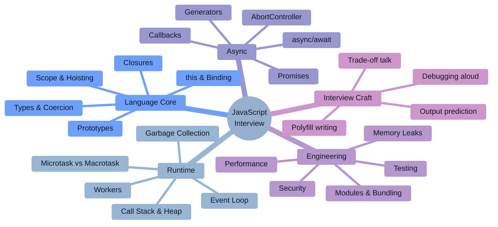

### Study strategy by company tier

| Tier | Companies | What they actually test | Time split |
|------|-----------|--------------------------|-----------|
| **FAANG / Big Tech (SWE-General)** | Google, Meta, Amazon, Apple, Microsoft | DSA in JS + language depth only if you claim JS. Event loop & closures appear in phone screens; `this`/prototype trivia is rare. | 65% DSA, 20% async/event loop, 15% design |
| **FAANG Frontend / UI specialists** | Meta (FE), Google (Web), Netflix, Airbnb, Pinterest | **Utility-function round** (debounce, `Promise.all`, deep clone, event emitter) + DOM round + frontend system design. | 35% utility fns, 25% DOM, 25% FE design, 15% DSA |
| **High-bar product** | Stripe, Databricks, Snowflake, Uber, DoorDash, Coinbase, Cloudflare, Shopify | Practical JS: correctness under async, API/SDK design, "build a rate limiter / retry-with-backoff / cache" live coding. Bug-fix rounds are common at Stripe. | 30% practical build, 30% async correctness, 25% design, 15% DSA |
| **Finance** | Goldman Sachs, JPMorgan, Bloomberg, Morgan Stanley | Numeric precision (IEEE-754, `0.1+0.2`), immutability, real-time streams over WebSocket, Node backpressure. | 30% DSA, 30% JS core trivia, 40% real-time/precision |
| **AI labs / infra** | OpenAI, Anthropic, NVIDIA, Palantir | Streaming responses (SSE, `ReadableStream`), TypeScript ergonomics, SDK design, Node concurrency. | 40% DSA, 30% streaming/async, 30% API design |
| **Indian product** | Walmart Global Tech, Flipkart, Zomato, Swiggy, PhonePe, Razorpay, Zepto | JS core internals (hoisting, closures, `this`, prototypes) + polyfills + React + machine coding (build a component in 60–90 min). | 30% core JS, 30% polyfills, 30% machine coding, 10% DSA |
| **Service companies** | TCS, Infosys, Wipro, Accenture, Cognizant, Capgemini, LTIMindtree | Rapid-fire theory: `var/let/const`, `==` vs `===`, hoisting, callback hell, `map/filter/reduce`, ES6 features. | 70% theory Q&A, 20% simple coding, 10% framework basics |
| **Startups** | Seed → Series C | "Ship it" pragmatism: can you build a working feature, wire an API, handle errors, and explain trade-offs in one sitting? | 50% build-something, 30% debugging, 20% architecture chat |

### The 2026 shift you must internalize

> [!IMPORTANT]
> **AI tools answer the surface version of every classic JS question instantly.** So interviewers have moved one layer down. In 2026 nobody asks *"what is a closure?"* — they ask *"what exactly does this closure retain, and show me how it leaks in a long-lived SPA."* Every canonical question in this guide is therefore paired with the **depth follow-up** that actually decides the hire.

> [!TIP]
> **The single highest-leverage sentence in a JavaScript interview:** *"Let me walk through what the engine and event loop actually do here, tick by tick."* Interviewers separate "framework users" from "engineers" by whether you can narrate the runtime beneath the code.

---

# 1. 🌱 Beginner Concepts

## 1.1 What is JavaScript?

**JavaScript is three things at once**, and conflating them is the #1 beginner mistake:

1. **A language specification** — ECMAScript (ECMA-262), maintained by TC39. Defines syntax, types, semantics, and the standard library (`Object`, `Array`, `Promise`, `Math`…). It says **nothing** about `document`, `fetch`, or `fs`.
2. **A host environment** — the browser (DOM, CSSOM, `fetch`, `localStorage`, Web Workers), Node.js (`fs`, `http`, `Buffer`, streams), Deno, Bun, or an embedded runtime (Hermes on React Native, QuickJS on edge). The host supplies the APIs *and the event loop*.
3. **An engine** — V8, SpiderMonkey, JavaScriptCore, Hermes. Turns source into machine code, manages the heap, runs the GC.

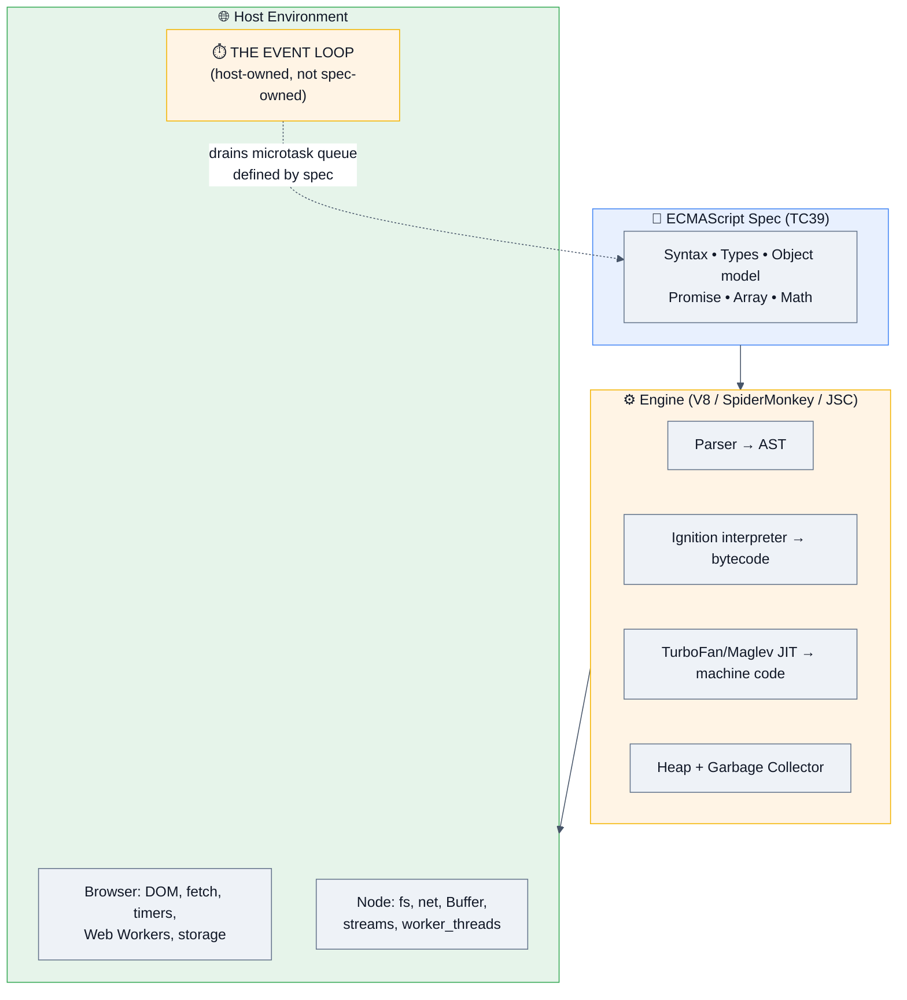

> [!WARNING]
> **Interview trap:** "Is `setTimeout` part of JavaScript?" — **No.** It is a host API (browser `Window`/Node `Timers`). The *microtask queue* and job semantics ARE in the ECMAScript spec; the *task/macrotask* loop is defined by HTML spec (browsers) or libuv (Node). Saying this correctly instantly marks you as senior.

**Canonical minimal program:**

```js
console.log("Hello, interviews!");
```

`🆕 ES2026` — explicit resource management gives deterministic cleanup, long a Java/C#/Python advantage:

```js
{
  using file = open("/tmp/data.json");   // Symbol.dispose called at block exit
  await using conn = await db.connect(); // Symbol.asyncDispose awaited at block exit
}  // both released here, even if an exception is thrown
```

## 1.2 Why does JavaScript exist? (History that actually gets asked)

| Year | Event | Why it matters in interviews |
|------|-------|------------------------------|
| **1995** | Brendan Eich writes Mocha → LiveScript → **JavaScript** in ~10 days at Netscape | Explains the warts: implicit coercion, `typeof null === "object"`, automatic semicolon insertion. "Designed in 10 days, deployed for 30 years." |
| **1997** | Standardized as **ECMAScript** (ECMA-262 Ed.1) | Name "JavaScript" is a Sun/Oracle trademark — hence "ECMAScript". |
| **1999** | ES3 — regex, try/catch, `do/while` | Baseline for very old enterprise code. |
| **2009** | **ES5** — strict mode, `Object.defineProperty`, JSON, array iteration methods. **Node.js released** (V8 outside the browser) | Server-side JS begins. `"use strict"` questions come from here. |
| **2015** | **ES6/ES2015** — `let/const`, classes, arrow functions, Promises, modules, `Map/Set`, destructuring, generators, `Symbol`, `Proxy` | **The single most-interviewed edition.** ~40% of all JS interview questions target ES6 features. |
| **2017** | ES2017 — **`async/await`**, `Object.entries`, shared memory + `Atomics` | Async/await is the #1 async question today. |
| **2020** | ES2020 — optional chaining `?.`, nullish coalescing `??`, `BigInt`, dynamic `import()`, `Promise.allSettled` | Very common "modern JS" questions. |
| **2021–24** | `??=`, `at()`, top-level `await`, `Object.hasOwn`, `Array.findLast`, immutable array methods (`toSorted`, `toReversed`, `with`), `Object.groupBy` | Immutable array methods now show up in "clean code" follow-ups. |
| **2025** | **ES2025** — Iterator Helpers, Set methods (`union`, `intersection`, `difference`), `Promise.try`, `RegExp.escape`, `Float16Array`, JSON/import attributes | Newest "do you keep up?" signal. |
| **2026** | **ES2026** — **Temporal**, `using`/`await using`, `Error.isError()`, `Math.sumPrecise`, `Uint8Array` base64/hex | Temporal replacing `Date` is the hot 2026 talking point. |

## 1.3 Problems JavaScript solves

| Problem | JS answer | Trade-off you must name |
|---------|-----------|--------------------------|
| Web pages were static documents | A scripting language embedded in the page with direct access to the document tree | Single-threaded UI → any long task freezes the whole page |
| Round-tripping to the server for every interaction | Client-side logic + `XMLHttpRequest`/`fetch` → SPAs | Ships logic to untrusted clients; **never trust client-side validation** |
| Two languages (front + back) slowed teams | Node.js: one language everywhere, shared validation/types | Node is bad at CPU-bound work — a single blocking loop stalls every concurrent request |
| Callback hell in async code | Promises (ES6) → `async/await` (ES2017) | `await` in a loop silently serializes what could be parallel |
| Thousands of concurrent I/O connections per box | Non-blocking I/O + event loop instead of thread-per-request | Ordering/fairness is subtle; one slow handler head-of-line-blocks everything |
| No modules → global namespace collisions | ES Modules (static, tree-shakeable) | Dual CJS/ESM ecosystem pain persists in Node |
| Untrusted third-party code on your page | Same-origin policy, CSP, `iframe` sandboxing, SES/Compartments | XSS remains the #1 web vulnerability class |

## 1.4 Real-world analogies (use these; interviewers remember them)

| Concept | Analogy |
|---------|---------|
| **Event loop** | A single barista (main thread) at a coffee shop. Orders that need brewing (I/O) go to the machine (Web APIs/thread pool); the barista keeps taking orders. When a brew finishes, the ticket joins the queue — but **VIP tickets (microtasks/Promises) always jump ahead of regular tickets (macrotasks/`setTimeout`)**, and the barista clears *every* VIP ticket before touching the next regular one. |
| **Closure** | A backpack a function carries. When the function was created it packed references to the variables it could see. It keeps the whole backpack — **not copies** — for as long as the function is alive. That's also why it leaks: one small function can pin a huge object. |
| **Prototype chain** | Looking for a tool: check your own toolbox, then your parent's, then grandparent's, until you hit an empty shelf (`null`). |
| **Hoisting** | The engine reads the whole script before running it and pre-registers declarations. `var` gets registered *and pre-filled with `undefined`*; `let/const` get registered but the box is **sealed** until the declaration line (the Temporal Dead Zone). |
| **`this`** | Not "the object where the function was written" — it's **"who is speaking the sentence right now."** Determined at call time, not definition time (except arrow functions, which have no `this` of their own). |
| **Promise** | A tracking number for a parcel. You get it immediately; the parcel arrives later, or the delivery fails. You can attach instructions ("when it arrives, do X") before it exists. |
| **Microtask vs macrotask** | Microtasks = "finish this thought"; macrotasks = "start a new topic." The engine never starts a new topic mid-thought. |
| **Garbage collection** | A librarian who removes books no longer reachable from any reading desk. Not "unused" — **unreachable**. A single bookmark (reference) keeps an entire shelf alive. |

## 1.5 The type system in one page

JavaScript has **8 types**: 7 primitives + object.

```js
typeof undefined      // "undefined"
typeof null           // "object"    ⚠️ famous 1995 bug, kept for compatibility
typeof true           // "boolean"
typeof 42             // "number"    (IEEE-754 double — no separate int type)
typeof 42n            // "bigint"    (ES2020)
typeof "hi"           // "string"    (UTF-16 code units)
typeof Symbol()       // "symbol"    (ES6, unique keys)
typeof {}             // "object"
typeof []             // "object"    ⚠️ use Array.isArray()
typeof function(){}   // "function"  ⚠️ not a real type — functions are callable objects
typeof class A {}     // "function"
```

**Robust type check (the answer interviewers want):**

```js
const typeOf = v => Object.prototype.toString.call(v).slice(8, -1);
typeOf(null);        // "Null"
typeOf([]);          // "Array"
typeOf(new Date());  // "Date"
typeOf(/x/);         // "RegExp"
typeOf(new Map());   // "Map"
typeOf(Promise.resolve()); // "Promise"
```

### 1.5.1 Primitives vs references — the mental model

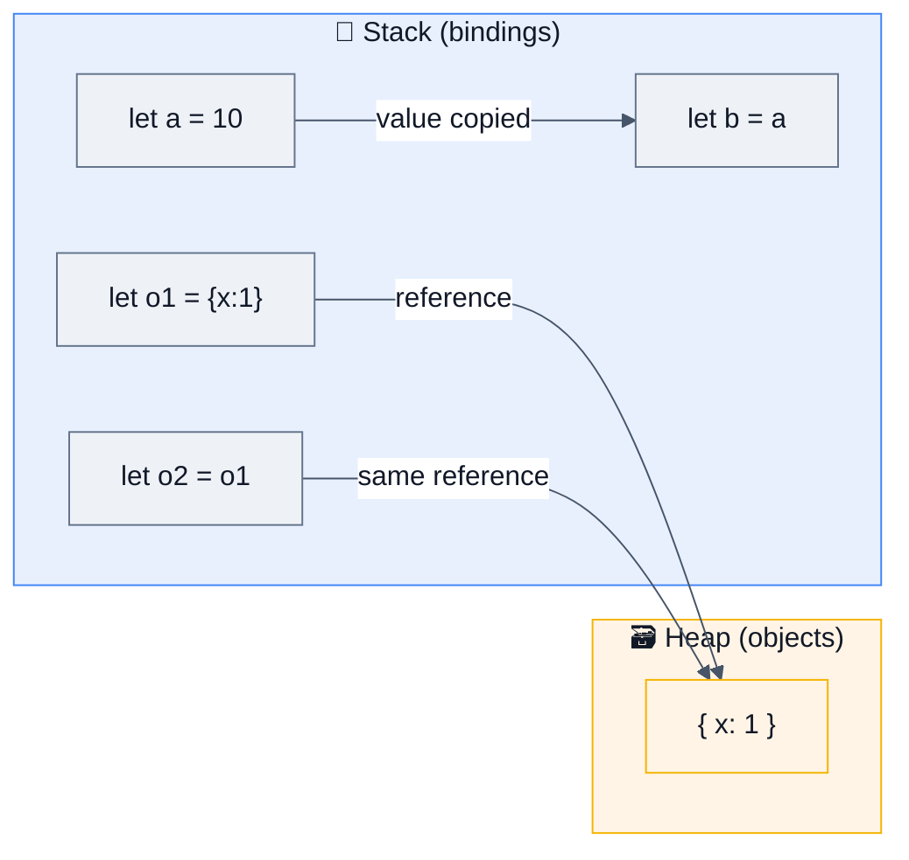

```js
let a = 10, b = a; b++;            // a === 10  (copy of value)
let o1 = {x:1}, o2 = o1; o2.x = 9; // o1.x === 9 (same heap object)
```

> [!NOTE]
> **"Is JavaScript pass-by-reference?"** — The precise answer: **JavaScript is always pass-by-value; for objects, the value being copied is a reference.** Sometimes called *call-by-sharing*. Proof: reassigning the parameter inside a function does **not** affect the caller.
> ```js
> function reassign(o) { o = {x: 99}; }
> const obj = {x: 1}; reassign(obj); // obj.x still 1  → not pass-by-reference
> function mutate(o) { o.x = 99; }
> mutate(obj); // obj.x === 99        → but the pointee is shared
> ```

## 1.6 Coercion — the classic beginner minefield

```js
1 == "1"        // true   — string → number
0 == false      // true   — boolean → number
null == undefined // true — special-cased in the spec
null == 0       // false  ⚠️ null only loosely equals undefined
NaN == NaN      // false  — NaN is never equal to anything
[] == false     // true   — [] → "" → 0 → false
[] + {}         // "[object Object]"
{} + []         // 0 in a REPL statement position ({} parsed as a block!)
"5" - 2         // 3      — minus has no string overload
"5" + 2         // "52"   — plus prefers string concat
```

**The rules, compressed:**

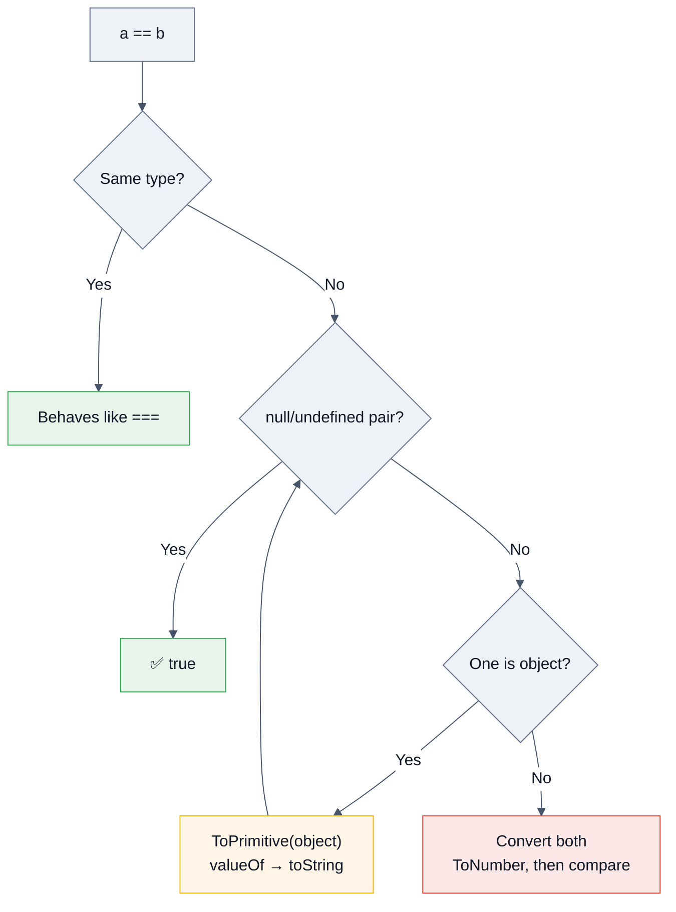

**Falsy values — memorize all 8:** `false`, `0`, `-0`, `0n`, `""`, `null`, `undefined`, `NaN`. **Everything else is truthy**, including `[]`, `{}`, `"0"`, `"false"`, and `function(){}`.

### The three equality operators

| Operator | Semantics | `NaN` | `+0/-0` | Use when |
|---|---|---|---|---|
| `==` | Loose, with coercion | `false` | equal | Only `x == null` to catch null-or-undefined |
| `===` | Strict, no coercion | `false` | equal | **Default choice** |
| `Object.is()` | SameValue | **`true`** | **not equal** | Detecting `NaN` or signed zero (React's re-render check uses this) |

## 1.7 Numbers: why `0.1 + 0.2 !== 0.3`

All JS numbers are **IEEE-754 double-precision binary floats**. `0.1` and `0.2` have no exact binary representation.

```js
0.1 + 0.2                 // 0.30000000000000004
0.1 + 0.2 === 0.3         // false
Math.abs(0.1+0.2-0.3) < Number.EPSILON  // true ✅ correct comparison
Number.MAX_SAFE_INTEGER   // 9007199254740991 (2^53 - 1)
9007199254740993 === 9007199254740992 // true ⚠️ precision lost
```

> [!WARNING]
> **Fintech interview killer (Stripe, Coinbase, Razorpay, Goldman):** *"How do you represent money in JavaScript?"*
> **Answer:** Never floats. Store **integer minor units** (cents/paise) in a `number` (safe to ~$90 trillion in cents) or use `BigInt` for larger/crypto amounts, and format with `Intl.NumberFormat`. Decimal libraries (`decimal.js`, `dinero.js`) when you need division/rounding rules. `Math.sumPrecise` (`🆕 ES2026`) fixes float summation error but is **not** a substitute for integer money.

```js
const cents = 1999;                                  // $19.99
new Intl.NumberFormat('en-US',{style:'currency',currency:'USD'}).format(cents/100);
// "$19.99"
```

## 1.8 Common beginner misconceptions ❌ → ✅

| ❌ Misconception | ✅ Reality |
|---|---|
| "JavaScript is single-threaded, so it can't do concurrency" | The *main thread* runs one JS task at a time, but I/O runs on other threads (libuv pool / browser networking). Real parallelism exists via **Web Workers / `worker_threads`**. JS has **concurrency without shared-memory parallelism** by default. |
| "`var` and `let` are basically the same" | `var` is **function-scoped**, hoisted-and-initialized to `undefined`, and creates a property on `globalThis` at top level. `let/const` are **block-scoped** with a **Temporal Dead Zone** and do not touch `globalThis`. |
| "`const` makes the value immutable" | `const` freezes the **binding**, not the value. `const a = []; a.push(1)` is legal. Use `Object.freeze` (shallow) or structural sharing for immutability. |
| "Arrow functions are just shorter functions" | They also have **no own `this`, `arguments`, `super`, or `new.target`**, cannot be used as constructors, and have no `prototype`. That's why they're wrong for object methods and right for callbacks. |
| "`setTimeout(fn, 0)` runs immediately" | It schedules a **macrotask**. All pending microtasks (Promise callbacks) run first, and browsers clamp nested timeouts to ≥4 ms after 5 levels. |
| "Hoisting moves code to the top" | Nothing moves. During **creation of the execution context**, declarations are registered in the environment record. `var` is bound to `undefined`; `let/const` are bound-but-uninitialized (TDZ). |
| "`typeof x === 'object'` means it's a plain object" | Also true for `null`, arrays, dates, regexes, maps. Use `Object.prototype.toString.call` or `Array.isArray`. |
| "Classes make JS a classical OO language" | `class` is **syntactic sugar over prototypes** (with real differences: non-enumerable methods, always strict, TDZ, must use `new`, private `#fields`). |
| "`async` makes code run in parallel" | `async` only wraps the return in a Promise and allows `await`. Parallelism comes from **starting operations before awaiting** (`Promise.all`), not from `async` itself. |
| "JSON is a subset of JavaScript" | Since ES2019 (JSON superset proposal) it essentially is — but `JSON.parse` still rejects trailing commas, comments, `undefined`, functions, `NaN`, and `Infinity`, and silently drops `undefined`/function values on stringify. |
| "Deleting a DOM node frees its memory" | Not if a JS variable, closure, or event listener still references it — that's the classic **detached DOM node leak**. |
| "`==` is fine if you know the rules" | Even experts get it wrong; ESLint's `eqeqeq` is near-universal. Say: "`===` always, except `x == null`." |

## 1.9 Your first ten idioms (rapid-fire, service-company favourites)

```js
// 1. Destructuring with defaults + rename
const { a: first = 1, ...rest } = { b: 2, c: 3 };

// 2. Spread copy (shallow!)
const copy = { ...obj };  const arr2 = [...arr];

// 3. Optional chaining + nullish coalescing
const city = user?.address?.city ?? "unknown";     // ?? only falls back on null/undefined

// 4. Template literals
`Hello ${name}, you have ${n} item${n === 1 ? "" : "s"}`;

// 5. Array pipeline
orders.filter(o => o.paid).map(o => o.total).reduce((s, t) => s + t, 0);

// 6. Unique values
[...new Set(list)];

// 7. Group by  (ES2024)
Object.groupBy(users, u => u.role);

// 8. Immutable sort (ES2023) — does NOT mutate
const sorted = nums.toSorted((a, b) => a - b);

// 9. Swap
[x, y] = [y, x];

// 10. Safe integer parse
Number.parseInt("08", 10);   // 8   (always pass the radix)
```

---

# 2. ⚙️ Intermediate Concepts

## 2.1 How the engine actually runs your code (V8 pipeline)

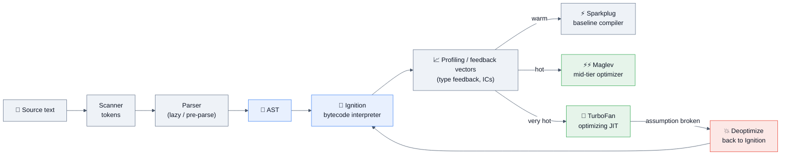

**Why this matters in interviews:** it explains *why* certain code is fast or slow.

- **Hidden classes (Maps/Shapes):** V8 gives each object a hidden class describing its layout. Objects created with the **same properties in the same order** share a hidden class → property access compiles to a fixed offset load.
- **Inline caches (ICs):** at each property-access site, V8 caches "for hidden class H, `.x` lives at offset 12." Repeating the same shape = **monomorphic IC** (fastest). 2–4 shapes = polymorphic. 5+ = **megamorphic** → falls back to a hash lookup.
- **Deoptimization:** adding a property later, deleting a property, or mixing types at a call site invalidates assumptions and throws away optimized code.

```js
// ❌ two hidden classes — polymorphic access site
const a = { x: 1, y: 2 };
const b = { y: 2, x: 1 };       // different insertion order!
b.z = 3;                        // transitions to yet another hidden class
delete b.x;                     // ⚠️ forces slow "dictionary mode"

// ✅ one hidden class — monomorphic, JIT-friendly
class Point { constructor(x, y) { this.x = x; this.y = y; } }
```

> [!TIP]
> **Staff-level line:** *"I initialize all fields in the constructor, in a fixed order, and never `delete` — that keeps objects monomorphic and property loads at a constant offset. I'd verify with `--trace-deopt` / `--trace-ic` before claiming a win, because engine heuristics change between versions."*

### Memory layout & garbage collection (V8 Orinoco)

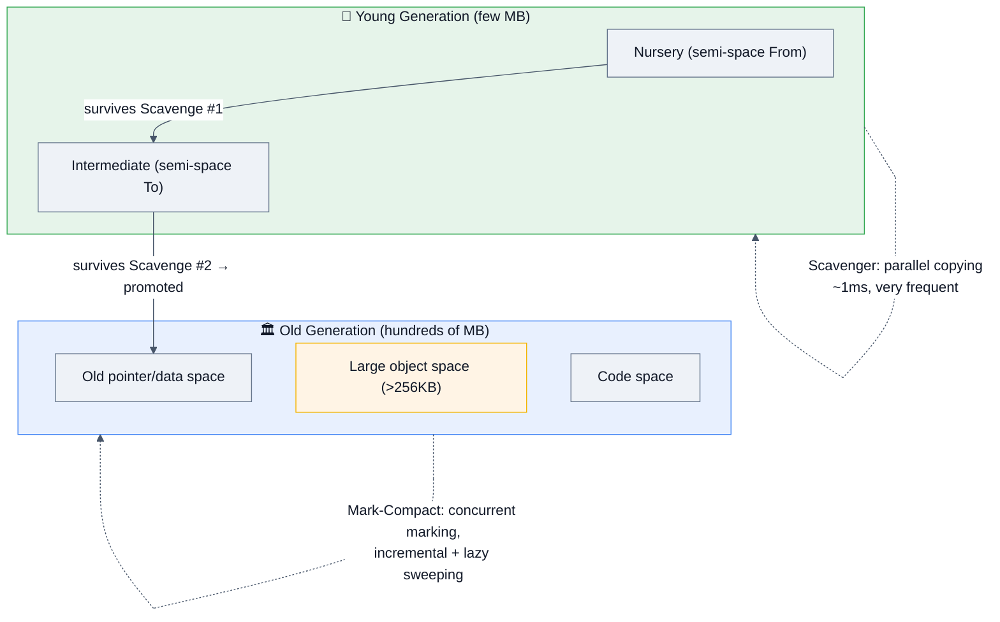

| Collector | Region | Algorithm | Typical pause |
|---|---|---|---|
| **Scavenger** | Young gen | Parallel semi-space copying (Cheney) | < 1 ms, very frequent |
| **Major GC (Mark-Compact)** | Old gen | Concurrent marking + incremental/lazy sweeping + compaction | 10–100 ms (mostly off-thread) |
| **Minor Mark-Compact** | Young gen under pressure | Mark-compact within nursery | few ms |

**The rule that matters:** GC frees the **unreachable**, not the unused. Reachability is from GC roots (global object, stack frames, active closures, DOM tree, timers, module scope).

## 2.2 Execution contexts, scope, and hoisting

Every function call pushes an **Execution Context** with:
1. **Lexical Environment** — `let/const`, function declarations, `this`, and an outer reference.
2. **Variable Environment** — `var` declarations.
3. **`this` binding** — resolved at call time.

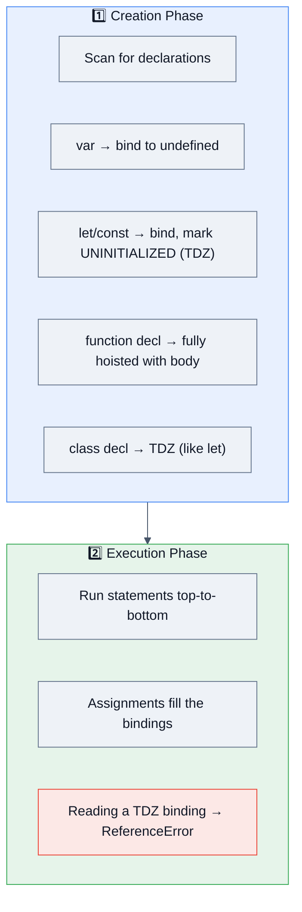

```js
console.log(v);   // undefined   ← var hoisted & initialized
console.log(f()); // "hi"        ← function declaration fully hoisted
console.log(l);   // ❌ ReferenceError: Cannot access 'l' before initialization (TDZ)
console.log(g);   // undefined   ← the VAR is hoisted...
g();              // ❌ TypeError: g is not a function  ← ...but not the function

var v = 1;
let l = 2;
function f() { return "hi"; }
var g = function () { return "bye"; };
```

| Declaration | Scope | Hoisted? | Initialized? | Redeclare? | On `globalThis`? |
|---|---|---|---|---|---|
| `var` | function | ✅ | ✅ to `undefined` | ✅ | ✅ (top level, scripts) |
| `let` | block | ✅ | ❌ TDZ | ❌ | ❌ |
| `const` | block | ✅ | ❌ TDZ | ❌ | ❌ |
| `function` decl | block (strict) / function | ✅ | ✅ with body | ✅ | ✅ (scripts) |
| `class` | block | ✅ | ❌ TDZ | ❌ | ❌ |

> [!WARNING]
> **The single most-asked output question in Indian product-company interviews:**
> ```js
> for (var i = 0; i < 3; i++) setTimeout(() => console.log(i), 0);  // 3 3 3
> for (let i = 0; i < 3; i++) setTimeout(() => console.log(i), 0);  // 0 1 2
> ```
> **Why:** `var` has one function-scoped binding shared by all three closures; by the time the timers fire, `i` is 3. `let` creates a **fresh binding per iteration** (the spec copies the loop variable into each iteration environment). Pre-ES6 fix: an IIFE, or `setTimeout(fn, 0, i)`.

## 2.3 Closures — the concept every interview touches

**Definition:** a closure is a function together with the lexical environment it was created in. It keeps a **live reference** to that environment, not a snapshot.

```js
function counter() {
  let count = 0;                 // captured, private
  return {
    inc: () => ++count,
    dec: () => --count,
    get value() { return count; }
  };
}
const c = counter();
c.inc(); c.inc();  c.value;      // 2 — `count` unreachable from outside
```

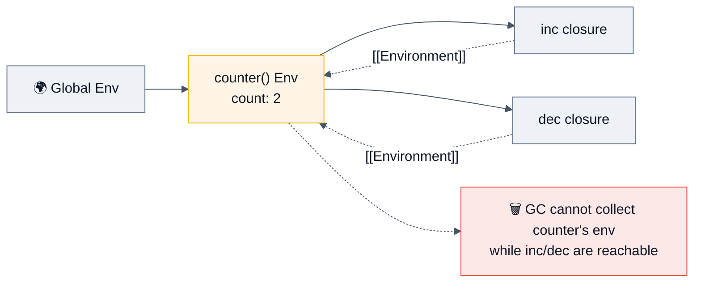

### What closures are used for (name at least four)

| Use | Example |
|---|---|
| **Data privacy / module pattern** | `counter()` above; pre-`#private` encapsulation |
| **Function factories / partial application** | `const add5 = add(5)` |
| **Memoization** | cache map lives in the closure |
| **Async state capture** | callbacks/handlers remembering request context |
| **Once / debounce / throttle / rate limiter** | timer + flag captured privately |
| **Iterators & generators (pre-ES6)** | state machine in closed-over variables |

### The 2026 depth follow-up: closures and memory leaks

> **"What exactly is the closure holding, and how does that leak in an SPA?"**

**The critical subtlety:** in V8, a closure captures a **context object containing the variables actually referenced by *any* inner function in that scope** — not just the ones this particular function uses. So an unrelated sibling function can pin a huge object.

```js
function attach() {
  const bigBlob = new Array(1e6).fill('x');   // ~8 MB
  const el = document.getElementById('btn');

  function rarelyUsed() { console.log(bigBlob.length); }  // ← pins bigBlob
  function onClick()   { console.log('clicked'); }        // uses nothing big

  el.addEventListener('click', onClick);
  // V8 may allocate ONE context for the scope; onClick can keep bigBlob alive
  // for as long as the listener is attached — i.e. forever.
  return rarelyUsed;
}
```

**Fixes:**
1. Null out large locals you no longer need (`bigBlob = null`) before returning.
2. Move the heavy variable into its own narrower scope/IIFE.
3. **Always remove listeners** on teardown (`removeEventListener`, `AbortController` signal, React cleanup return).
4. Use `WeakMap`/`WeakRef` for caches keyed by objects.

```js
// ✅ modern teardown: one controller kills every listener
const ac = new AbortController();
el.addEventListener('click', onClick, { signal: ac.signal });
window.addEventListener('resize', onResize, { signal: ac.signal });
// on unmount:
ac.abort();
```

## 2.4 `this` — five binding rules in priority order

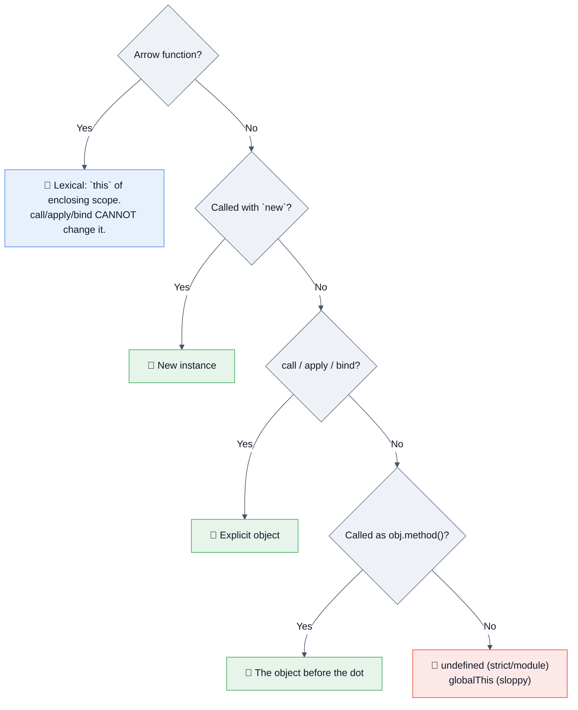

```js
const obj = {
  name: "obj",
  regular()  { return this.name; },
  arrow: ()  => this?.name,              // `this` = module/global, NOT obj
  nested()   { return [1].map(() => this.name)[0]; }  // ✅ arrow inherits `this`
};
obj.regular();            // "obj"
obj.arrow();              // undefined  ⚠️ classic trap
obj.nested();             // "obj"

const fn = obj.regular;   // 💥 lost binding
fn();                     // TypeError in strict mode / undefined in sloppy

fn.call(obj);             // "obj"
const bound = fn.bind(obj); bound();  // "obj" — permanent, cannot be re-bound
```

| Method | Invokes now? | Args | Returns |
|---|---|---|---|
| `call(thisArg, a, b)` | ✅ | comma-separated | result |
| `apply(thisArg, [a, b])` | ✅ | array | result |
| `bind(thisArg, a)` | ❌ | partial-applies | **new bound function** |

> [!WARNING]
> **`bind` is permanent.** `f.bind(A).bind(B)` still uses `A`. And a bound function used with `new` **ignores** the bound `this` (the `new` rule wins).

## 2.5 Prototypes and inheritance

Every object has an internal `[[Prototype]]` link (`__proto__` legacy accessor, `Object.getPrototypeOf` standard). Property lookup walks the chain.

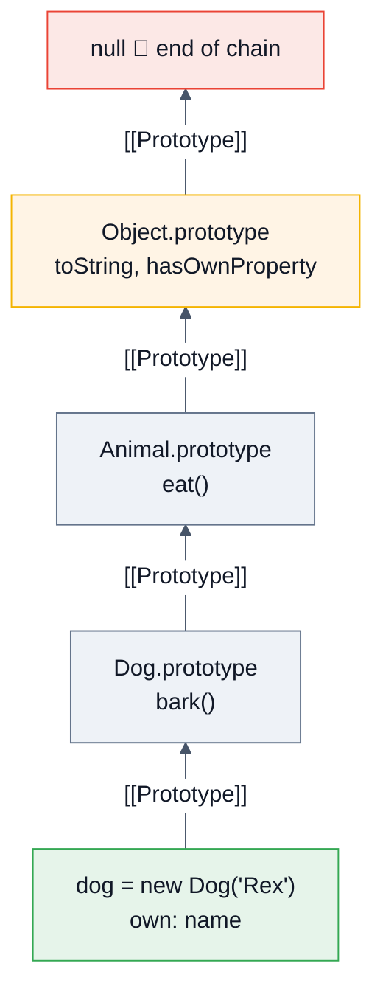

```js
class Animal {
  #secret = "hidden";                 // truly private (ES2022)
  static count = 0;                   // static field
  constructor(name) { this.name = name; Animal.count++; }
  eat() { return `${this.name} eats`; }
  get label() { return `A:${this.name}`; }
  static create(n) { return new this(n); }   // `this` = the class
}
class Dog extends Animal {
  constructor(name) { super(name); }  // must call super() before using `this`
  eat() { return super.eat() + " kibble"; }
  bark() { return "woof"; }
}
const d = new Dog("Rex");
d instanceof Dog;                      // true
Object.getPrototypeOf(Dog.prototype) === Animal.prototype;  // true
Object.hasOwn(d, "name");              // true   (ES2022, replaces hasOwnProperty)
```

### `class` vs `function` constructor — the differences that get asked

| | `function` constructor | `class` |
|---|---|---|
| Hoisting | Fully hoisted | TDZ (cannot use before declaration) |
| Strict mode | Inherits | **Always strict** |
| Call without `new` | Allowed (silently broken) | **TypeError** |
| Methods enumerable in `for...in` | ✅ yes | ❌ no (non-enumerable) |
| Private fields | Convention `_x` / closures | **`#x`, hard-private, enforced by engine** |
| `super` | manual `Parent.call(this)` | built-in |
| Subclassing built-ins (`Array`, `Error`) | broken | ✅ works |

### `Object.create` vs `new` vs `Object.setPrototypeOf`

```js
const proto = { greet() { return "hi"; } };
const o1 = Object.create(proto);           // ✅ clean, no constructor run
const o2 = Object.create(null);            // 🛡️ NO prototype — safe dictionary/map
Object.setPrototypeOf(o1, otherProto);     // ⚠️ deoptimizes: invalidates ICs. Avoid in hot paths.
```

> [!TIP]
> **`Object.create(null)` is a security answer too.** A prototype-less object cannot be poisoned via `__proto__` and has no inherited `toString`/`constructor` — the standard mitigation for prototype pollution in parsers and user-keyed dictionaries.

## 2.6 The event loop — browser vs Node (the #1 senior topic)

### Browser model (HTML spec)

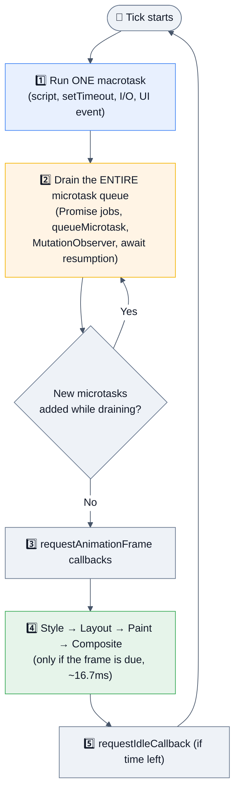

**Golden rules:**
1. **One macrotask, then ALL microtasks, then maybe render.** Never a render mid-microtask-drain.
2. An infinite microtask producer **starves the loop forever** — the page never paints, never responds. (Macrotask recursion doesn't; it yields between ticks.)
3. `await` resumption is a microtask.

```js
console.log('1: script start');
setTimeout(() => console.log('2: timeout'), 0);
Promise.resolve().then(() => console.log('3: promise'));
queueMicrotask(() => console.log('4: microtask'));
(async () => { console.log('5: async body (sync!)'); await null; console.log('6: after await'); })();
console.log('7: script end');

// 1: script start
// 5: async body (sync!)     ← async fn body runs SYNCHRONOUSLY up to first await
// 7: script end
// 3: promise                ← microtasks, FIFO
// 4: microtask
// 6: after await
// 2: timeout                ← macrotask last
```

### Node.js model (libuv phases)

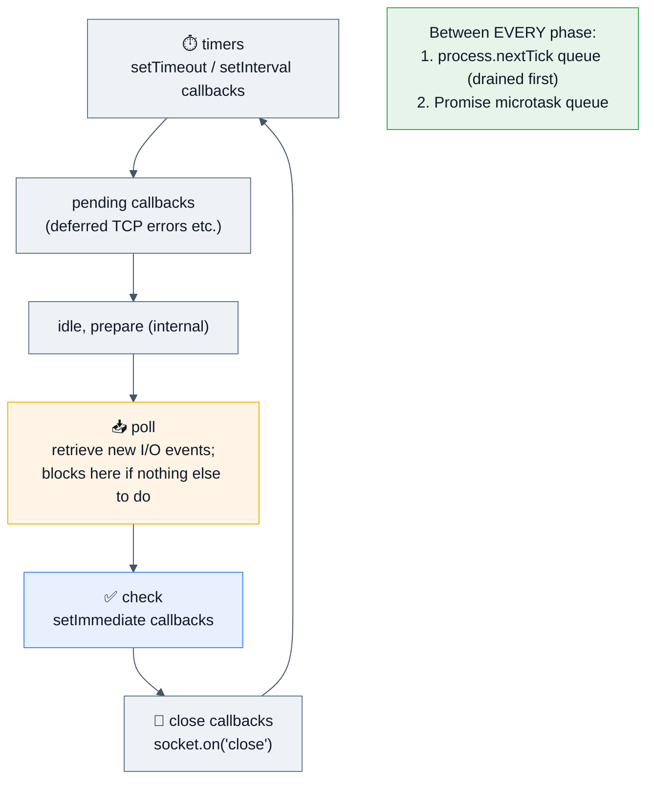

```js
// Node-only ordering question (Uber, Walmart, PayPal favourite)
setTimeout(() => console.log('timeout'), 0);
setImmediate(() => console.log('immediate'));
process.nextTick(() => console.log('nextTick'));
Promise.resolve().then(() => console.log('promise'));

// nextTick → promise → then (timeout | immediate) in NON-DETERMINISTIC order
// at the top level, because it depends on how long the loop took to start.
// INSIDE an I/O callback, `immediate` ALWAYS fires before `timeout`
// (check phase comes right after poll).
```

| | Browser | Node.js |
|---|---|---|
| Loop owner | HTML spec / renderer | libuv |
| Phases | task → microtasks → rAF → render | timers → pending → poll → check → close |
| Extra priority queue | none | **`process.nextTick`** (higher than promises) |
| `setImmediate` | ❌ (IE-only legacy) | ✅ check phase |
| Rendering step | ✅ | ❌ |
| Thread pool | networking, decoding | libuv pool (default 4) for fs, dns, crypto, zlib — tune `UV_THREADPOOL_SIZE` |

> [!WARNING]
> **`process.nextTick` starvation:** recursive `nextTick` calls prevent the loop from ever advancing to the next phase — I/O never runs. `setImmediate` is the safe "yield to the loop" primitive. Node's own docs recommend `setImmediate` for user code.

## 2.7 Asynchronous JavaScript

### Evolution

```mermaid
%%{init: {'theme':'base','themeVariables':{'background':'#ffffff','mainBkg':'#eef2f7','primaryColor':'#eef2f7','primaryTextColor':'#111827','primaryBorderColor':'#64748b','secondaryColor':'#e8f0fe','tertiaryColor':'#f1f5f9','lineColor':'#475569','textColor':'#111827','clusterBkg':'#f8fafc','clusterBorder':'#94a3b8','edgeLabelBackground':'#ffffff','titleColor':'#111827','actorBkg':'#eef2f7','actorTextColor':'#111827','actorBorder':'#64748b','actorLineColor':'#475569','signalColor':'#111827','signalTextColor':'#111827','noteBkgColor':'#fff4e5','noteTextColor':'#111827','noteBorderColor':'#d97706','labelBoxBkgColor':'#eef2f7','labelBoxBorderColor':'#64748b','labelTextColor':'#111827','loopTextColor':'#111827','altBackground':'#f8fafc'}}}%%
flowchart LR
    CB["📞 Callbacks<br/>1995<br/>❌ pyramid of doom<br/>❌ inversion of control"] --> PR["🤝 Promises<br/>ES2015<br/>✅ chainable, composable<br/>⚠️ still .then noise"]
    PR --> AA["✨ async/await<br/>ES2017<br/>✅ reads synchronously<br/>⚠️ easy to over-serialize"]
    AA --> AI["🔄 Async iterators + streams<br/>ES2018+<br/>✅ backpressure, cancellation"]
    style CB fill:#fce8e6,stroke:#ea4335,color:#111827
    style PR fill:#fff4e5,stroke:#f4b400,color:#111827
    style AA fill:#e6f4ea,stroke:#34a853,color:#111827
    style AI fill:#e8f0fe,stroke:#4285f4,color:#111827
```

### Promise state machine

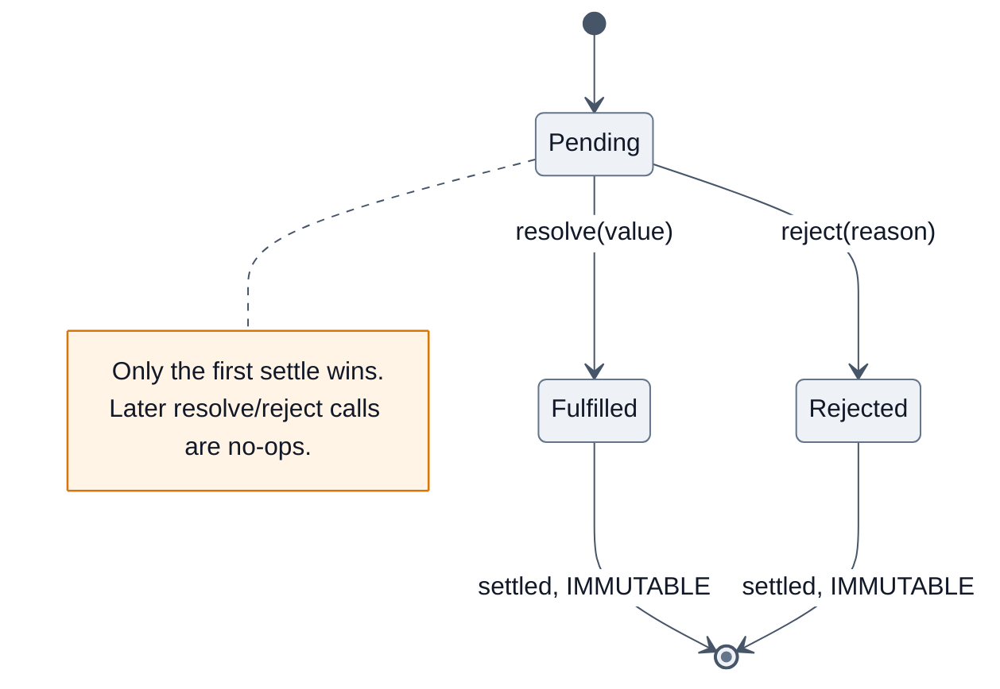

### Combinators — know all five cold

| Combinator | Resolves when | Rejects when | Result |
|---|---|---|---|
| `Promise.all` | **all** fulfil | **first** rejection (fail-fast) | array of values |
| `Promise.allSettled` | **all** settle | never | `[{status,value|reason}]` |
| `Promise.race` | **first** settles (either way) | first settles as rejection | that value/reason |
| `Promise.any` | **first** fulfilment | **all** reject | value, or `AggregateError` |
| `Promise.try` `🆕 ES2025` | callback returns/resolves | callback throws **synchronously or async** | uniform promise |

```js
// ⚠️ Promise.all does NOT cancel the other requests on rejection —
// they keep running and their rejections can become unhandled.
const results = await Promise.allSettled([a(), b(), c()]);
const ok = results.filter(r => r.status === 'fulfilled').map(r => r.value);

// Promise.try removes the "sync throw escapes the promise chain" footgun:
Promise.try(() => JSON.parse(maybeBad)).catch(handle);   // ✅ ES2025
```

### The sequential-vs-parallel mistake (asked EVERYWHERE)

```js
// ❌ 3 × 300ms = 900ms — serialized for no reason
for (const id of ids) results.push(await fetchUser(id));

// ✅ ~300ms — start all, then await
const results = await Promise.all(ids.map(fetchUser));

// ✅ bounded concurrency (the SENIOR answer — don't DDoS your own API)
async function mapLimit(items, limit, fn) {
  const out = new Array(items.length);
  let i = 0;
  const workers = Array.from({ length: Math.min(limit, items.length) }, async () => {
    while (i < items.length) {
      const idx = i++;
      out[idx] = await fn(items[idx], idx);
    }
  });
  await Promise.all(workers);
  return out;
}
```

> [!TIP]
> **Say this in the interview:** *"Unbounded `Promise.all` over N inputs is a self-inflicted load test. I'd cap concurrency (p-limit or a hand-rolled worker pool), add a timeout via `AbortSignal.timeout`, and use `allSettled` when partial success is acceptable."*

### Error handling & cancellation

```js
// ❌ silently swallows: an async callback's rejection escapes try/catch
try { arr.forEach(async x => { await risky(x); }); } catch { /* never runs */ }

// ✅ for...of + await, or Promise.all with catch
await Promise.all(arr.map(x => risky(x).catch(e => logAndDefault(e))));

// ✅ cancellation — the ONLY real way to stop in-flight work
const ctrl = new AbortController();
const p = fetch(url, { signal: ctrl.signal });
setTimeout(() => ctrl.abort(new Error('too slow')), 5000);
// or, since Node 17.3 / modern browsers:
await fetch(url, { signal: AbortSignal.timeout(5000) });
// combine multiple:
await fetch(url, { signal: AbortSignal.any([userCancel.signal, AbortSignal.timeout(5000)]) });
```

> [!WARNING]
> **Promises are not cancellable.** `AbortController` signals the *underlying operation* to stop and rejects with an `AbortError`; the promise itself still settles. Interviewers love this distinction.

### Generators & async iteration

```js
function* idGen() { let i = 0; while (true) yield i++; }   // lazy, infinite, O(1) memory

async function* paginate(url) {                            // async iterator
  let next = url;
  while (next) {
    const res = await fetch(next);
    const { items, nextUrl } = await res.json();
    yield* items;               // delegate
    next = nextUrl;
  }
}
for await (const item of paginate('/api/orders')) process(item);
```

`🆕 ES2025` **Iterator Helpers** make lazy pipelines first-class — no intermediate arrays:

```js
const firstTen = idGen()
  .map(n => n * n)
  .filter(n => n % 3 === 0)
  .take(10)
  .toArray();            // lazy: only pulls what's needed
```

## 2.8 Modules: ESM vs CommonJS

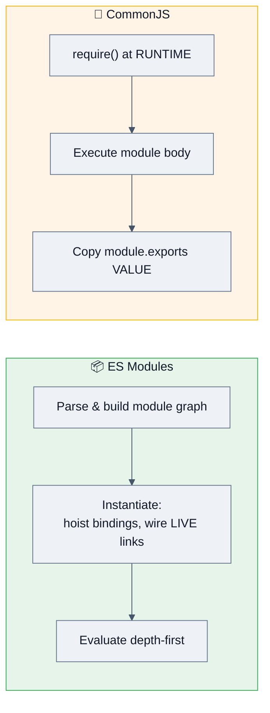

| | CommonJS (`require`) | ES Modules (`import`) |
|---|---|---|
| Resolution | Runtime, dynamic | **Static, compile-time** |
| Binding | **Value copy** of exports | **Live binding** (re-export updates visible) |
| Tree shaking | ❌ | ✅ (static analysis) |
| Top-level `await` | ❌ | ✅ |
| Loading | Synchronous | Asynchronous |
| `this` at top level | `module.exports` | `undefined` |
| `__dirname` | ✅ | ❌ → `import.meta.dirname` (Node 20.11+) |
| Circular deps | Partial exports (may be `undefined`) | TDZ error or hoisted-function success |
| Node file ext | `.cjs` / default | `.mjs` / `"type":"module"` |

```js
// Live binding proof — the #1 ESM interview demo
// counter.mjs
export let count = 0;
export const inc = () => count++;
// main.mjs
import { count, inc } from './counter.mjs';
console.log(count);  // 0
inc();
console.log(count);  // 1  ✅ live — with CommonJS this would still print 0
```

> [!NOTE]
> **"What is tree shaking and why does CJS break it?"** Tree shaking = dead-export elimination. It needs a **statically analysable** graph: bundlers must know at build time exactly which bindings are imported. `require()` can take a computed string, so nothing can be proven unused. Also mention `"sideEffects": false` in `package.json` — without it, bundlers conservatively keep modules that might have import-time side effects.

## 2.9 Collections & iteration protocols

| | `Object` | `Map` | `Set` | `WeakMap`/`WeakSet` |
|---|---|---|---|---|
| Keys | string \| symbol | **any value** (incl. objects, NaN) | any value | **objects/symbols only** |
| Order | integer keys first (ascending), then insertion | **insertion order** | insertion | n/a |
| Size | `Object.keys(o).length` O(n) | `.size` O(1) | `.size` O(1) | ❌ not enumerable |
| Iterable | ❌ (needs `Object.entries`) | ✅ | ✅ | ❌ |
| Prototype pollution risk | ✅ (`__proto__`) | ❌ | ❌ | ❌ |
| GC | strong refs | strong refs | strong | **weak — entries vanish when key is collected** |
| Best for | records, JSON | frequent add/delete, non-string keys, caches | uniqueness, membership | **metadata/caches keyed by objects without leaking** |

```js
// WeakMap — private data + leak-free cache (very strong senior signal)
const meta = new WeakMap();
function tag(el, data) { meta.set(el, data); }   // when el is removed from the DOM
// and no other reference remains, the entry is collected automatically.

// ES2025 Set methods
const a = new Set([1,2,3]), b = new Set([2,3,4]);
a.union(b);          // Set {1,2,3,4}
a.intersection(b);   // Set {2,3}
a.difference(b);     // Set {1}
a.symmetricDifference(b); // Set {1,4}
a.isSubsetOf(b);     // false
```

**Iteration protocol** — anything with `[Symbol.iterator]` works with `for...of`, spread, destructuring:

```js
class Range {
  constructor(a, b) { this.a = a; this.b = b; }
  *[Symbol.iterator]() { for (let i = this.a; i <= this.b; i++) yield i; }
}
[...new Range(1, 5)];   // [1,2,3,4,5]
```

| Loop | Iterates | Works on | Gotcha |
|---|---|---|---|
| `for...in` | **enumerable string keys, incl. inherited** | objects | ⚠️ picks up prototype props; wrong for arrays |
| `for...of` | **values** | iterables (Array, Map, Set, string, generators, NodeList) | not plain objects |
| `forEach` | values | arrays | **cannot `break`**, ignores `await` |
| `for` | index | arrays | fastest, most control |

## 2.10 Property descriptors, `Proxy`, and `Reflect`

```js
const o = {};
Object.defineProperty(o, 'id', {
  value: 42, writable: false, enumerable: false, configurable: false
});
Object.getOwnPropertyDescriptor(o, 'id');
// { value: 42, writable: false, enumerable: false, configurable: false }
```

| Freeze level | What it stops |
|---|---|
| `Object.preventExtensions` | adding new props |
| `Object.seal` | add + delete (existing stay writable) |
| `Object.freeze` | add + delete + write — **shallow only** |

```js
// Proxy: intercept fundamental operations (used by Vue 3 reactivity, MobX, immer)
const audited = new Proxy(target, {
  get(t, prop, recv)      { log('read', prop);  return Reflect.get(t, prop, recv); },
  set(t, prop, val, recv) { validate(prop, val); return Reflect.set(t, prop, val, recv); },
  has(t, prop)            { return !prop.startsWith('_') && Reflect.has(t, prop); }
});
```

> [!TIP]
> **Why `Reflect`?** It gives the *default* behaviour of each trap as a function, preserves the correct `receiver` for getters/setters up the prototype chain, and returns booleans instead of throwing. Saying *"I use `Reflect` inside traps so `this` resolves to the proxy, not the target"* is a strong senior signal.

---

# 3. 🚀 Advanced Concepts

*Everything a senior/staff engineer is expected to reason about unprompted.*

## 3.1 Concurrency model: what JavaScript can and cannot parallelize

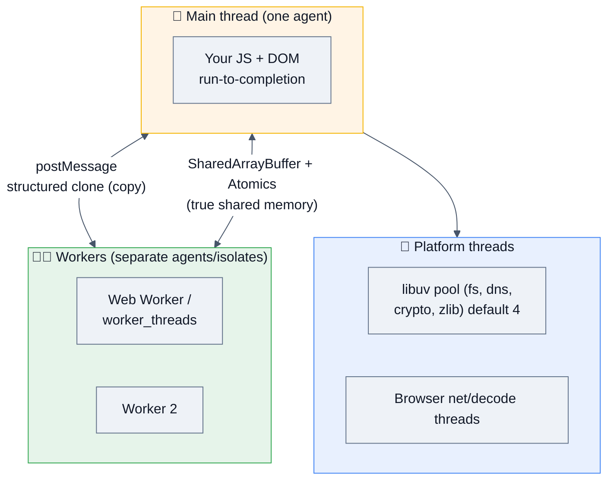

**Run-to-completion** is the core guarantee: once a task starts, it runs to the end without preemption. Consequence: **you never need mutexes for ordinary JS state** — but a single long task blocks *everything* (input, paint, other requests in Node).

| Mechanism | Real parallelism? | Shares memory? | Cost | Use for |
|---|---|---|---|---|
| Event loop / async I/O | ❌ (concurrency only) | n/a | ~free | I/O-bound work — **the default** |
| Web Worker / `worker_threads` | ✅ | ❌ (structured clone) or ✅ via SAB | ~1–5 ms spawn, copy cost | CPU-bound: parsing, crypto, image, compression |
| `SharedArrayBuffer` + `Atomics` | ✅ | ✅ **true shared memory** | needs COOP/COEP headers | Wasm threads, ring buffers, hot numeric work |
| `child_process` / cluster | ✅ (processes) | ❌ | ~30–50 ms spawn | Isolation, multi-core HTTP servers |
| `Atomics.wait/notify` | ✅ | ✅ | blocks the calling thread | Worker-side sync — **never on the main thread** |
| Off-main-thread `structuredClone` transfer | ✅ | move, not copy | ~0 for `ArrayBuffer` | Handing off large buffers |

```js
// Transferables: zero-copy handoff instead of a clone
worker.postMessage({ buf }, [buf]);   // buf is now DETACHED in the sender

// SharedArrayBuffer: the one place JS has real data races
const sab = new SharedArrayBuffer(1024);
const view = new Int32Array(sab);
Atomics.add(view, 0, 1);              // atomic RMW
Atomics.wait(view, 0, 0);             // worker only — blocking!
```

> [!WARNING]
> **`SharedArrayBuffer` requires cross-origin isolation** (`Cross-Origin-Opener-Policy: same-origin` + `Cross-Origin-Embedder-Policy: require-corp`) because of Spectre. Knowing *why* — timing side channels need a high-resolution timer, and SAB + a worker builds one — is a distinguishing answer at Google/Cloudflare.

## 3.2 Trade-offs a staff engineer must be able to argue

| Decision | Option A | Option B | How to decide |
|---|---|---|---|
| Rendering | **CSR** (SPA) | **SSR / RSC / SSG** | SEO + first-paint + low-end devices → SSR/SSG. Highly interactive, auth-walled app → CSR. Hybrid (streaming SSR + islands) is the 2026 default. |
| Data fetching | REST | GraphQL | Many clients with divergent shapes → GraphQL (but watch N+1, caching complexity, query-cost attacks). Simple, cacheable, CDN-friendly → REST. |
| State | Local component state | Global store | Start local; lift only on proven need. Server state ≠ client state — use a query cache (TanStack Query/SWR) rather than Redux for server data. |
| Bundling | Single bundle | Route/component code splitting | Split at route boundaries first; measure with a bundle analyzer, not intuition. |
| Node scaling | `cluster` (N processes) | Horizontal pods | Cluster wastes memory per process (each has its own V8 heap); container orchestration gives better isolation + rolling deploys. Most 2026 shops run 1 process/container and scale pods. |
| CPU work | Main thread | Worker | > ~50 ms of synchronous work → move it, or chunk with `scheduler.yield()`. |
| Immutability | Structural sharing (immer/Immutable.js) | Mutation + explicit copies | Structural sharing wins when large trees are diffed frequently (React); plain mutation wins in hot numeric loops. |
| Types | Plain JS + JSDoc | TypeScript | TS is table stakes at product companies in 2026; JSDoc-typed JS is a valid answer for libraries avoiding a build step. |
| Money/time | `number` + `Date` | integer minor units + **Temporal** | Never floats for money; `Date` is mutable, month-0-indexed, and timezone-hostile — Temporal (`🆕 ES2026`) fixes all three. |

## 3.3 Edge cases interviewers use to separate levels

```js
// 1. NaN and Object.is
[NaN].includes(NaN);   // true  (uses SameValueZero)
[NaN].indexOf(NaN);    // -1    (uses ===)

// 2. Array holes
const sparse = [1, , 3];
sparse.length;                 // 3
sparse.map(x => x * 2);        // [2, <1 empty>, 6]   ← map SKIPS holes
Array.from(sparse, x => x);    // [1, undefined, 3]   ← from does not
new Array(3).fill(0);          // ✅ the safe way to make a dense array

// 3. sort is lexicographic by default and (since ES2019) STABLE
[10, 9, 1].sort();             // [1, 10, 9]  ⚠️
[10, 9, 1].sort((a, b) => a - b);  // [1, 9, 10]

// 4. parseInt vs Number
['1','7','11'].map(parseInt);  // [1, NaN, 3] ⚠️ map passes (value, index) → radix!
['1','7','11'].map(Number);    // [1, 7, 11]  ✅

// 5. typeof on TDZ
{ typeof x; let x; }           // ❌ ReferenceError — typeof is NOT safe in TDZ

// 6. Automatic semicolon insertion
function f() {
  return                        // ⚠️ ASI inserts a semicolon HERE
    { ok: true };               // → returns undefined
}

// 7. String is UTF-16 — emoji and surrogate pairs
'👍'.length;                    // 2
[...'👍'].length;               // 1  (iterator is code-point aware)
'é'.normalize('NFC') === 'é'.normalize('NFD');  // false without normalize

// 8. Integer keys are reordered
Object.keys({ b: 1, 2: 2, a: 3, 1: 4 });  // ["1","2","b","a"]

// 9. Getters run during spread / JSON
JSON.stringify({ get a() { throw new Error('boom'); } });  // throws

// 10. structuredClone handles cycles; JSON round-trip does not
structuredClone({ d: new Date(), m: new Map() });  // ✅ preserves types
JSON.parse(JSON.stringify({ d: new Date() }));     // ❌ Date → string
```

## 3.4 Memory: leaks, retention, and diagnosis

### The five leak archetypes

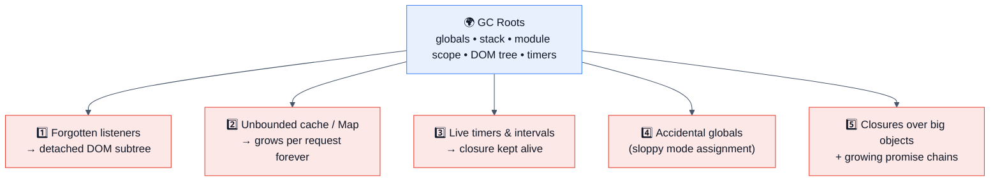

> [!NOTE]
> **Why Node leaks are brutal:** the process is long-lived and single-heap. A reference leaked once per request accumulates across **every request the process ever served**, until V8 hits `--max-old-space-size` (default ~2–4 GB on 64-bit, but **the container limit is what kills you** — an OOMKill at 512 MB long before V8's own limit).

### Diagnosis playbook

```mermaid
%%{init: {'theme':'base','themeVariables':{'background':'#ffffff','mainBkg':'#eef2f7','primaryColor':'#eef2f7','primaryTextColor':'#111827','primaryBorderColor':'#64748b','secondaryColor':'#e8f0fe','tertiaryColor':'#f1f5f9','lineColor':'#475569','textColor':'#111827','clusterBkg':'#f8fafc','clusterBorder':'#94a3b8','edgeLabelBackground':'#ffffff','titleColor':'#111827','actorBkg':'#eef2f7','actorTextColor':'#111827','actorBorder':'#64748b','actorLineColor':'#475569','signalColor':'#111827','signalTextColor':'#111827','noteBkgColor':'#fff4e5','noteTextColor':'#111827','noteBorderColor':'#d97706','labelBoxBkgColor':'#eef2f7','labelBoxBorderColor':'#64748b','labelTextColor':'#111827','loopTextColor':'#111827','altBackground':'#f8fafc'}}}%%
flowchart LR
    S1["📈 Confirm trend<br/>RSS / heapUsed rising<br/>across GC cycles"] --> S2["📸 Snapshot 3×<br/>baseline → load → post-GC"]
    S2 --> S3["🔍 Compare:<br/>'Objects allocated<br/>between snapshots'"]
    S3 --> S4["🧭 Follow the<br/>RETAINER chain<br/>to a GC root"]
    S4 --> S5["🛠️ Fix: unlisten •<br/>bound cache • clear timer •<br/>WeakMap • pipeline()"]
    S5 --> S6["✅ Verify: same load,<br/>flat heap after GC"]
    style S1 fill:#e8f0fe,stroke:#4285f4,color:#111827
    style S4 fill:#fff4e5,stroke:#f4b400,color:#111827
    style S6 fill:#e6f4ea,stroke:#34a853,color:#111827
```

```bash
# Node: capture heap snapshots without restarting
node --inspect app.js                         # then chrome://inspect → Memory
node --heapsnapshot-signal=SIGUSR2 app.js     # kill -USR2 <pid>
node --max-old-space-size=1024 app.js         # cap heap below container limit
node --expose-gc -e "global.gc()"             # force GC to prove reachability
clinic doctor -- node app.js                  # high-level diagnosis
```

```js
// In-process guardrails (ship these)
import v8 from 'node:v8';
setInterval(() => {
  const { heapUsed, rss } = process.memoryUsage();
  metrics.gauge('node.heap_used', heapUsed);
  metrics.gauge('node.rss', rss);
  metrics.gauge('node.heap_limit', v8.getHeapStatistics().heap_size_limit);
}, 15_000);

// Event loop lag — the single best Node health metric
import { monitorEventLoopDelay } from 'node:perf_hooks';
const h = monitorEventLoopDelay({ resolution: 10 });
h.enable();
setInterval(() => metrics.gauge('node.eventloop.p99_ms', h.percentile(99) / 1e6), 10_000);
```

### `WeakRef` and `FinalizationRegistry` (ES2021) — know when *not* to use them

```js
const cache = new Map();
function get(key) {
  const ref = cache.get(key);
  const val = ref?.deref();          // may be undefined if collected
  if (val) return val;
  const fresh = compute(key);
  cache.set(key, new WeakRef(fresh));
  return fresh;
}
const reg = new FinalizationRegistry(key => cache.delete(key));  // tidy the tombstones
```

> [!WARNING]
> The spec explicitly warns against relying on `WeakRef`/`FinalizationRegistry`: GC timing is **not observable or guaranteed**, callbacks may never run, and behaviour differs across engines. Correct answer: *"Prefer `WeakMap` and explicit lifecycle management; reach for `WeakRef` only for genuinely optional caches, never for correctness."*

## 3.5 Distributed-systems implications (yes, JS interviews go here)

Even a "frontend" role at Uber/DoorDash/Stripe will probe these.

| Concern | JavaScript-specific answer |
|---|---|
| **Idempotency** | Retries on flaky mobile networks duplicate writes. Generate an **idempotency key** client-side (`crypto.randomUUID()`), send it as a header, and have the server dedupe. This is exactly how Stripe's API works. |
| **Exactly-once** | Impossible over a network. Aim for **at-least-once delivery + idempotent handlers**. |
| **Retries** | Exponential backoff **with full jitter**, capped attempts, and a retry budget. Retry only idempotent methods and 5xx/429/network errors — never a 400. |
| **Thundering herd** | Every client retrying at t+1s synchronously stampedes the origin. Jitter + `Retry-After` + circuit breaker. |
| **Cache coherence** | Client caches (SWR/TanStack Query) are a distributed cache. Choose stale-while-revalidate vs read-through; use ETag/`If-None-Match` for conditional revalidation. |
| **CAP in the browser** | Offline-first PWAs choose **AP**: accept local writes, queue them (Background Sync), reconcile later with LWW or CRDTs (Yjs/Automerge — how Figma-style multiplayer works). |
| **Consistency** | Optimistic UI = temporarily inconsistent client. You need rollback on failure + conflict resolution, and must decide whether stale reads are acceptable per-screen (a balance display: no; a like count: yes). |
| **Clock skew** | Never trust `Date.now()` from a client for ordering. Use server timestamps, monotonic `performance.now()` for durations, or Lamport/hybrid clocks. |
| **Fault tolerance** | Timeouts on **every** network call (`AbortSignal.timeout`), circuit breaker, graceful degradation (skeletons, cached content), error boundaries so one widget's crash doesn't blank the app. |
| **Backpressure** | Node streams have it built in (`pipeline`, `highWaterMark`); manual `.on('data')` loops do not and will OOM. In the browser, `ReadableStream` gives you the same via the reader pull model. |

```js
// Production-grade fetch: timeout + jittered backoff + idempotency key
async function request(url, opts = {}, { retries = 3, timeoutMs = 5000 } = {}) {
  const idem = opts.idempotencyKey ?? crypto.randomUUID();
  for (let attempt = 0; ; attempt++) {
    try {
      const res = await fetch(url, {
        ...opts,
        headers: { ...opts.headers, 'Idempotency-Key': idem },
        signal: AbortSignal.timeout(timeoutMs)
      });
      if (res.status >= 500 || res.status === 429) throw new HttpError(res.status);
      return res;
    } catch (err) {
      if (attempt >= retries || err.name === 'AbortError' && opts.userCancelled) throw err;
      const base = Math.min(1000 * 2 ** attempt, 30_000);
      await sleep(Math.random() * base);            // full jitter
    }
  }
}
```

## 3.6 Caching layers a JS engineer owns

```mermaid
%%{init: {'theme':'base','themeVariables':{'background':'#ffffff','mainBkg':'#eef2f7','primaryColor':'#eef2f7','primaryTextColor':'#111827','primaryBorderColor':'#64748b','secondaryColor':'#e8f0fe','tertiaryColor':'#f1f5f9','lineColor':'#475569','textColor':'#111827','clusterBkg':'#f8fafc','clusterBorder':'#94a3b8','edgeLabelBackground':'#ffffff','titleColor':'#111827','actorBkg':'#eef2f7','actorTextColor':'#111827','actorBorder':'#64748b','actorLineColor':'#475569','signalColor':'#111827','signalTextColor':'#111827','noteBkgColor':'#fff4e5','noteTextColor':'#111827','noteBorderColor':'#d97706','labelBoxBkgColor':'#eef2f7','labelBoxBorderColor':'#64748b','labelTextColor':'#111827','loopTextColor':'#111827','altBackground':'#f8fafc'}}}%%
flowchart LR
    U["👤 User"] --> MEM["1️⃣ In-memory<br/>Map / query cache<br/>ms, per-tab"]
    MEM --> SW["2️⃣ Service Worker<br/>Cache Storage<br/>offline-capable"]
    SW --> HTTP["3️⃣ HTTP cache<br/>Cache-Control, ETag<br/>browser + CDN"]
    HTTP --> CDN["4️⃣ CDN / Edge<br/>Cloudflare, Fastly<br/>+ edge KV"]
    CDN --> ORIG["5️⃣ Origin<br/>Redis → DB"]
    style MEM fill:#e6f4ea,stroke:#34a853,color:#111827
    style SW fill:#e8f0fe,stroke:#4285f4,color:#111827
    style HTTP fill:#e8f0fe,stroke:#4285f4,color:#111827
    style CDN fill:#fff4e5,stroke:#f4b400,color:#111827
    style ORIG fill:#fce8e6,stroke:#ea4335,color:#111827
```

**The caching answers interviewers want:**

- **Content-hashed filenames + `Cache-Control: public, max-age=31536000, immutable`** for JS/CSS bundles; **`no-cache`** for `index.html` so a deploy is picked up immediately. Explain cache-busting via hash, not query strings.
- **`stale-while-revalidate`** — serve stale instantly, refresh in background. The single highest-leverage header for perceived speed.
- **Request deduplication / single-flight:** N components asking for the same resource in one tick must issue **one** network call.
- **Cache stampede protection:** on expiry, one requester refreshes while others serve stale (that's SWR); server-side use a lock/lease.

```js
// Single-flight + TTL cache in ~15 lines (a very common live-coding ask)
function createCache({ ttl = 30_000, max = 500 } = {}) {
  const store = new Map();            // key -> { value, expires }
  const inflight = new Map();         // key -> Promise
  return async function get(key, loader) {
    const hit = store.get(key);
    if (hit && hit.expires > Date.now()) return hit.value;
    if (inflight.has(key)) return inflight.get(key);          // dedupe
    const p = loader(key)
      .then(value => {
        if (store.size >= max) store.delete(store.keys().next().value); // LRU-ish
        store.set(key, { value, expires: Date.now() + ttl });
        return value;
      })
      .finally(() => inflight.delete(key));
    inflight.set(key, p);
    return p;
  };
}
```

## 3.7 Observability & debugging in production

| Signal | Browser | Node |
|---|---|---|
| **Errors** | `window.onerror`, `unhandledrejection`, Sentry, source maps uploaded (never served publicly) | `uncaughtException`, `unhandledRejection`, structured logger (pino) |
| **Traces** | OpenTelemetry web SDK, `traceparent` header propagated to the API | `@opentelemetry/sdk-node`, auto-instrumented http/pg/redis |
| **Metrics** | Core Web Vitals via `web-vitals` + `PerformanceObserver` | `prom-client`: RED (Rate, Errors, Duration) + event loop lag + heap |
| **Logs** | Sampled breadcrumbs, never PII | JSON lines with `trace_id`, log levels, redaction |
| **Profiles** | DevTools Performance, `PerformanceObserver('longtask')` | `--cpu-prof`, `--heap-prof`, `0x`, continuous profiling (Pyroscope) |

```js
// Field RUM — the numbers that matter (lab metrics ≠ real users)
import { onLCP, onINP, onCLS, onTTFB } from 'web-vitals';
[onLCP, onINP, onCLS, onTTFB].forEach(fn =>
  fn(({ name, value, rating, id }) =>
    navigator.sendBeacon('/rum', JSON.stringify({ name, value, rating, id })))
);

// Catch every long task (>50 ms) that hurts INP
new PerformanceObserver(list => {
  for (const e of list.getEntries()) report('longtask', e.duration, e.attribution);
}).observe({ type: 'longtask', buffered: true });
```

```js
// Node: never let these go unhandled
process.on('unhandledRejection', (reason, p) => { log.error({ reason }, 'unhandled'); });
process.on('uncaughtException', err => {
  log.fatal({ err }, 'uncaught — draining and exiting');
  server.close(() => process.exit(1));       // ⚠️ state is untrusted; restart, don't resume
  setTimeout(() => process.exit(1), 10_000).unref();
});
```

> [!IMPORTANT]
> **Node 15+ changed the default:** an unhandled promise rejection **crashes the process** (`--unhandled-rejections=throw`). Interviewers ask this. The right answer is: crash-and-restart is correct (an unknown-state process should not serve traffic), so make sure every promise has a `.catch` and your orchestrator restarts fast.

## 3.8 Performance tuning: the levers, ranked by impact

| Rank | Lever | Typical win | How to verify |
|---|---|---|---|
| 1 | **Ship less JavaScript** (split, tree-shake, drop polyfills, replace moment→date-fns/Temporal) | 100s of ms of parse+exec | bundle analyzer, coverage tab |
| 2 | **Break long tasks** (`scheduler.yield()`, chunking, `isInputPending`) | INP from 400 ms → <200 ms | Long Tasks API, INP field data |
| 3 | **Move CPU work off-thread** (Worker, Wasm) | main thread unblocked | Performance panel flame chart |
| 4 | **Fix the network waterfall** (preconnect, preload LCP image, HTTP/2 priority, no render-blocking JS) | LCP seconds | WebPageTest filmstrip |
| 5 | **Avoid layout thrash** (batch reads then writes, `content-visibility`, `contain`) | jank eliminated | Performance panel purple bars |
| 6 | **Virtualize long lists** | 10k rows → 20 nodes | DOM node count |
| 7 | **Algorithmic fixes** (O(n²) → O(n) with a Map; memoize) | orders of magnitude | benchmark |
| 8 | **Micro-opts** (monomorphic shapes, avoid `delete`, typed arrays) | few % | `--trace-deopt`, micro-benchmarks |

```js
// Breaking a long task — the 2026 canonical answer
async function processAll(items) {
  for (let i = 0; i < items.length; i++) {
    doWork(items[i]);
    if (i % 100 === 0) {
      await (scheduler.yield?.() ?? new Promise(r => setTimeout(r, 0)));
      // scheduler.yield() resumes at HIGH priority — unlike setTimeout(0),
      // which drops you to the back of the task queue.
    }
  }
}

// Layout thrashing: ❌ read-write-read-write forces N synchronous layouts
els.forEach(el => { el.style.height = el.offsetHeight + 10 + 'px'; });
// ✅ batch: all reads, then all writes
const hs = els.map(el => el.offsetHeight);
els.forEach((el, i) => { el.style.height = hs[i] + 10 + 'px'; });
```

## 3.9 Cost optimization (the question nobody prepares for)

| Cost | JS lever |
|---|---|
| **CDN egress** | Brotli (~15–20% over gzip), modern-only bundles (`module/nomodule` or `browserslist: last 2 versions`), image formats (AVIF/WebP), long-cache immutable assets |
| **Compute (SSR/serverless)** | Cache HTML at the edge; ISR/SSG where possible; keep cold starts low (small bundles, no heavy top-level imports); avoid per-request `JSON.parse` of huge configs |
| **Third-party scripts** | Each tag costs money *and* INP. Audit quarterly; load via a facade/`async` + Partytown-style worker offload |
| **Observability spend** | Sample traces (1–10%), aggregate metrics client-side, drop debug logs in prod, cardinality budgets on labels |
| **Bandwidth on mobile** | `navigator.connection.saveData`, adaptive image quality, defer non-critical fetches |
| **Node memory** | Right-size containers: over-provisioning RAM across 100 pods is real money; set `--max-old-space-size` ≈ 75% of the container limit so V8 GCs instead of getting OOMKilled |

## 3.10 Failure recovery patterns

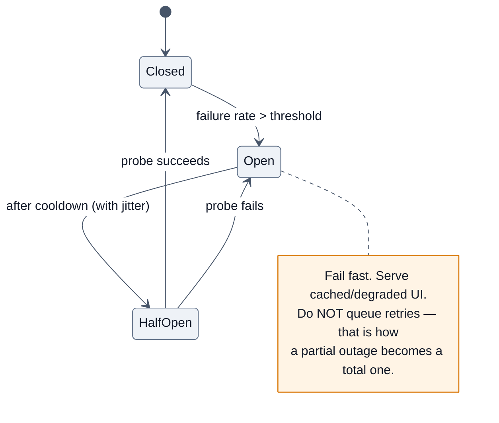

```js
// Circuit breaker in ~25 lines (a real Stripe/DoorDash live-coding ask)
function breaker(fn, { threshold = 5, cooldownMs = 10_000, halfOpenMax = 1 } = {}) {
  let state = 'closed', failures = 0, openedAt = 0, probes = 0;
  return async (...args) => {
    if (state === 'open') {
      if (Date.now() - openedAt < cooldownMs) throw new Error('circuit open');
      state = 'half-open'; probes = 0;
    }
    if (state === 'half-open' && probes >= halfOpenMax) throw new Error('circuit open');
    if (state === 'half-open') probes++;
    try {
      const out = await fn(...args);
      state = 'closed'; failures = 0;
      return out;
    } catch (e) {
      if (++failures >= threshold) { state = 'open'; openedAt = Date.now(); }
      throw e;
    }
  };
}
```

**Frontend resilience checklist:** error boundaries per route *and* per widget · skeletons not spinners · retry button that actually retries · offline banner + queued mutations · feature flags with a kill switch · SW `skipWaiting` strategy so a bad deploy can be rolled forward fast · versioned API contracts so an old cached bundle doesn't 400 against a new backend.

---

# 4. 🎤 Interview Questions by Level

**Rating legend:** ★★★★★ Must know (asked in >50% of loops) · ★★★★☆ Very common · ★★★☆☆ Situational/differentiator

---

## 4.1 Beginner (0–2 yrs · SDE-1 · service companies)

### Q1. What is the difference between `var`, `let`, and `const`? ★★★★★

**Why interviewers ask it:** It is the fastest way to find out whether you learned JS after 2015 and whether you understand *scope* at all. Every follow-up in the loop builds on it.

**Expected answer:** `var` is function-scoped, hoisted and initialized to `undefined`, redeclarable, and attaches to `globalThis` at script top level. `let`/`const` are block-scoped, hoisted but uninitialized (Temporal Dead Zone → `ReferenceError` if accessed early), not redeclarable, and don't touch `globalThis`. `const` prevents **reassignment of the binding**, not mutation of the value.

**Follow-ups:** *"Show me the loop-with-setTimeout difference."* → the `3 3 3` vs `0 1 2` example. *"How would you fix the `var` version without `let`?"* → IIFE or `setTimeout(fn, 0, i)`. *"Is `const arr = []; arr.push(1)` legal?"* → yes.

**Common mistakes:** saying "`const` is immutable"; saying "hoisting moves code up"; not knowing TDZ by name.

---

### Q2. `==` vs `===` — and when is `==` acceptable? ★★★★★

**Why:** tests whether you know the coercion algorithm rather than a memorized rule.

**Expected answer:** `===` compares type and value with no coercion. `==` applies the Abstract Equality algorithm: same type → strict; `null == undefined` is `true` and both are `false` against everything else; object vs primitive → `ToPrimitive` on the object; otherwise both to number. The one defensible `==` use is `x == null` to test "null or undefined" in one check.

**Follow-ups:** `[] == false` (true), `null >= 0` (**true** — relational operators use `ToNumber`, unlike `==`), `NaN === NaN` (false), `Object.is(NaN, NaN)` (true), `0 === -0` (true) vs `Object.is(0, -0)` (false).

**Common mistakes:** "`==` compares value, `===` compares value and type" — technically true but shallow; interviewers want ToPrimitive.

---

### Q3. What is hoisting? ★★★★★

**Expected answer:** During the creation phase of an execution context the engine registers all declarations in the environment record before executing any statement. `var` → initialized to `undefined`. `function` declarations → fully initialized with their body. `let`/`const`/`class` → registered but uninitialized (TDZ). Nothing physically moves.

**Follow-ups:** function declaration vs function expression; `typeof x` inside a TDZ (throws!); block-scoped function declarations in sloppy mode (Annex B — implementation-defined; a good "I'd avoid it" answer).

---

### Q4. Explain `null` vs `undefined`. ★★★★★

| | `undefined` | `null` |
|---|---|---|
| Meaning | "not assigned yet" — engine's default | "intentionally empty" — programmer's choice |
| `typeof` | `"undefined"` | `"object"` (legacy bug) |
| JSON | key dropped by `stringify` | serialized as `null` |
| Default params | triggers the default | **does not** trigger the default |
| Arithmetic | `undefined + 1` → `NaN` | `null + 1` → `1` |

---

### Q5. What are truthy and falsy values? ★★★★☆
List all 8 falsy values (`false, 0, -0, 0n, "", null, undefined, NaN`). Follow-up: *"Why is `??` safer than `||` for defaults?"* → `||` also replaces `0` and `""`; `??` only replaces `null`/`undefined`. That bug — a price of `0` becoming the fallback — is a real production story worth telling.

---

### Q6. `map` vs `forEach` vs `filter` vs `reduce`? ★★★★★
`map` returns a new same-length array; `forEach` returns `undefined` (side effects only, **cannot break, ignores `await`**); `filter` returns a subset; `reduce` folds to any shape. Follow-up: *"Implement `map` using `reduce`."* Follow-up: *"Which of these can be short-circuited?"* → `some`/`every`/`find`/`for...of`, not `map`/`forEach`.

---

### Q7. What is an arrow function and when should you NOT use one? ★★★★★
No own `this`, `arguments`, `super`, `new.target`; not constructible; no `prototype`; implicit return with concise body. **Don't use** for object methods, prototype methods, DOM handlers needing `this`, or anything called with `new`. **Do use** for callbacks inside methods (inherits the right `this`).

---

### Q8. What is a callback and what is callback hell? ★★★★☆
A function passed to be invoked later. Callback hell = deeply nested, error-prone pyramids with **inversion of control** (you trust someone else's library to call you exactly once). Promises fix composition; `async/await` fixes readability.

---

### Q9. Shallow vs deep copy? ★★★★★
`{...o}` / `Object.assign` / `slice` copy one level — nested objects stay shared. Deep copy: **`structuredClone(obj)`** (built-in, handles cycles, `Date`, `Map`, `Set`, `RegExp`, typed arrays — but **not functions, DOM nodes, or prototypes**), `JSON.parse(JSON.stringify())` (loses `undefined`, functions, `Date`→string, `NaN`/`Infinity`→`null`, throws on cycles), or a recursive clone / `lodash.cloneDeep`.

---

### Q10. What are template literals, destructuring, spread and rest? ★★★★☆
Rapid-fire ES6. Nail the spread-vs-rest distinction: **spread expands** (`f(...args)`, `[...a]`), **rest collects** (`function f(...args)`, `const {a, ...rest} = o`). Follow-up: *"Is spread deep or shallow?"* → shallow.

---

### Q11–20 Rapid-fire (service-company round)

| Q | Rating | One-line answer |
|---|---|---|
| What is an IIFE? | ★★★☆☆ | `(function(){})()` — pre-module scope isolation |
| `slice` vs `splice`? | ★★★★☆ | `slice` returns a copy (pure); `splice` **mutates** and returns removed items |
| `find` vs `filter`? | ★★★★☆ | `find` → first match or `undefined`; `filter` → array of all matches |
| `Array.isArray` vs `typeof`? | ★★★★☆ | `typeof []` is `"object"`; use `Array.isArray` |
| What is `use strict`? | ★★★☆☆ | Errors on undeclared vars, `this` is `undefined` in plain calls, no octals, duplicate params banned. Modules and classes are always strict. |
| `localStorage` vs `sessionStorage` vs cookies? | ★★★★☆ | ~5–10 MB sync string store, persists / per-tab / ~4 KB sent with every request. **Never store tokens in `localStorage`** (XSS-readable) — use `HttpOnly; Secure; SameSite` cookies. |
| Synchronous vs asynchronous? | ★★★★★ | Blocking vs scheduled-for-later via the event loop |
| What is JSON? | ★★★☆☆ | Text interchange format; `parse`/`stringify`; mention the `replacer`/`reviver` args and `toJSON()` |
| `null`, `undefined`, `NaN` checks | ★★★★☆ | `x == null`, `Number.isNaN(x)` (not global `isNaN`, which coerces) |
| What is the DOM? | ★★★★☆ | A tree API the browser exposes over the parsed HTML — **not part of JS** |

---

## 4.2 Intermediate (2–5 yrs · SDE-2)

### Q1. Explain the event loop, microtasks and macrotasks. ★★★★★

**Why:** the single best predictor of whether a candidate can debug async code.

**Expected answer:** Walk the tick: run one macrotask → drain the **entire** microtask queue (including microtasks queued during the drain) → rAF → render. Name the sources: macrotasks = `setTimeout`, `setInterval`, `MessageChannel`, I/O, UI events; microtasks = promise reactions, `queueMicrotask`, `MutationObserver`, `await` resumption. In Node add the phase list and `process.nextTick` (higher priority than promises).

**Follow-ups:** *"Trace this output."* (see §2.6) · *"Can a microtask starve the loop?"* → yes, an infinitely self-queuing microtask; macrotask recursion cannot. · *"Why is `setTimeout(fn,0)` not 0 ms?"* → minimum clamp (~4 ms after 5 nested levels), plus queue wait. · *"Where does `requestAnimationFrame` fit?"* → before render, after microtasks, ~60 fps, throttled in background tabs.

**Common mistakes:** saying "microtasks run after each macrotask" but then claiming only one microtask runs per tick; forgetting the `async` function body runs **synchronously** until the first `await`.

---

### Q2. What is a closure? Give a real use and a real leak. ★★★★★

Covered in §2.3. The 2026 depth follow-up — *"what exactly does it retain?"* — is the differentiator. Mention that V8 allocates a shared context per scope, so an unrelated sibling function can pin a large object, and give the `AbortController` teardown fix.

**Follow-ups:** implement `once`, `memoize`, a private counter, `debounce` with `cancel`/`flush`.

---

### Q3. How does `this` work? ★★★★★
The five rules in priority order (§2.4). **Follow-ups:** what happens to `this` in a callback passed to `setTimeout` (→ `globalThis`/`Timeout` object, not your object); why React class components needed `.bind(this)` in the constructor; can you `bind` an arrow function (no effect); does `new` on a bound function respect the binding (no).

---

### Q4. Explain prototypal inheritance vs classical inheritance. ★★★★★
Objects delegate to other **objects** at runtime; there are no classes at the machine level. `class` is sugar. Advantages: dynamic, memory-efficient (methods live once on the prototype), composable. Risks: mutating built-in prototypes (`Array.prototype.foo = …`) breaks `for...in` everywhere and is how **prototype pollution** escalates.

**Follow-ups:** *"What is `__proto__` vs `prototype`?"* → `prototype` is a property on **constructor functions** used to set the `[[Prototype]]` of instances; `__proto__` is a legacy accessor for an object's own `[[Prototype]]`. *"Implement `new`."* (see §6). *"Implement `instanceof`."*

---

### Q5. Promise vs `async/await` — and what does `await` really do? ★★★★★
`async` functions always return a promise; `await` suspends the function and schedules its continuation as a **microtask** when the awaited value settles (awaiting a non-promise still costs one microtask tick). `try/catch` works with `await`; with raw promises you need `.catch`.

**Follow-ups:** *"Sequential vs parallel"* (the `for await` vs `Promise.all` trap) · *"How do you add a timeout?"* → `Promise.race` or `AbortSignal.timeout` · *"How do you cancel?"* → you can't cancel a promise; abort the operation · *"What's an unhandled rejection and what happens in Node?"* → process crashes since Node 15.

---

### Q6. `Promise.all` vs `allSettled` vs `race` vs `any`. ★★★★★
Table in §2.7. **Killer follow-up:** *"If one of five `Promise.all` calls rejects, what happens to the other four?"* → **they keep running**; `Promise.all` doesn't cancel. If they later reject, those become unhandled rejections unless you attach handlers. Fix: `allSettled`, or pass a shared `AbortSignal`.

---

### Q7. Explain debounce vs throttle with a use case each. ★★★★★
Debounce: run **after** activity stops (search-as-you-type, resize end, autosave). Throttle: run **at most once per interval** (scroll position, mousemove, analytics beacons, infinite-scroll trigger). Follow-ups: leading vs trailing edge, `cancel()`/`flush()`, why `requestAnimationFrame` throttling is better for visual updates than a 16 ms timer.

---

### Q8. `Map` vs `Object`, `Set` vs array — when do you switch? ★★★★☆
Table in §2.9. Concrete triggers: non-string keys, frequent add/delete, need for `.size`, need for guaranteed insertion order, or **untrusted user-supplied keys** (prototype pollution). Follow-up: *"What's the complexity of `array.includes` vs `set.has`?"* → O(n) vs ~O(1) — the classic fix that turns an O(n²) loop into O(n).

---

### Q9. Event delegation, bubbling and capturing. ★★★★★
Events go capture (window→target) → target → bubble (target→window). Delegation = one listener on a stable ancestor + `event.target.closest('.item')`. Benefits: fewer listeners (memory + INP), works for dynamically added nodes. Follow-ups: `stopPropagation` vs `stopImmediatePropagation` vs `preventDefault`; which events don't bubble (`focus`, `blur`, `mouseenter` — use `focusin`/`focusout`); passive listeners (`{passive:true}`) and why they matter for scroll performance.

---

### Q10. ESM vs CommonJS; what is tree shaking? ★★★★☆
Table in §2.8. Follow-ups: circular dependencies in each; why you can't `require()` an ESM-only package synchronously; `"type": "module"`, `exports` map, dual packages; `"sideEffects": false`.

---

### Q11. How does garbage collection work and how do you find a leak? ★★★★☆
Reachability from GC roots; generational (Scavenger + Mark-Compact); the five leak archetypes; three-snapshot comparison and following the **retainer** chain. Naming *retainer chain* is the phrase that lands.

---

### Q12. Explain `call`, `apply`, `bind` — and implement `bind`. ★★★★☆
See §2.4 and the polyfill in §6.

---

### Q13. What is CORS and how do you fix a CORS error? ★★★★★
Browser-enforced (the server still got the request!). Simple vs preflighted requests (`OPTIONS` triggered by custom headers, non-simple content types, or non-GET/POST/HEAD). Fixed **only** on the server via `Access-Control-Allow-Origin/Headers/Methods/Credentials`; wildcards are illegal with credentials. Follow-up: *"Is CORS a security feature?"* → It **relaxes** the Same-Origin Policy; it protects users' credentialed cross-origin reads, and it is **not** a substitute for authorization.

---

### Q14. Explain `null` prototype objects and `Object.freeze`. ★★★☆☆
`Object.create(null)` for user-keyed dictionaries; `freeze` is shallow — write a `deepFreeze`.

---

### Q15. Rapid-fire intermediate

| Q | Rating | Answer core |
|---|---|---|
| `Object.keys` vs `for...in` vs `getOwnPropertyNames`? | ★★★★☆ | own enumerable / **inherited too** / own incl. non-enumerable |
| What is a `Symbol` for? | ★★★☆☆ | Collision-free keys, well-known protocol hooks (`Symbol.iterator`, `Symbol.asyncIterator`, `Symbol.toPrimitive`) |
| Generators — what problem do they solve? | ★★★☆☆ | Lazy sequences, pausable coroutines, infinite streams, backbone of pre-`async` libs (co, redux-saga) |
| `setTimeout` vs `setInterval` drift? | ★★★★☆ | `setInterval` drifts and can stack; prefer recursive `setTimeout` or an rAF loop with elapsed-time math |
| Currying? | ★★★★☆ | Transform `f(a,b,c)` into `f(a)(b)(c)`; used for partial application/config reuse |
| Memoization? | ★★★★☆ | Cache by serialized args; must bound the cache and handle object args (`WeakMap`) |
| Optional chaining pitfalls? | ★★★☆☆ | `a?.b.c` still throws if `b` is nullish; short-circuits the whole chain; `?.()` for optional calls |
| `Array.from` vs spread? | ★★★☆☆ | `from` works on array-likes (`arguments`, `NodeList`) **and** takes a map fn; spread needs a real iterable |
| What is a pure function? | ★★★★☆ | Same input → same output, no side effects; enables memoization, easy tests, React reconciliation |
| What is TypeScript's relationship to JS? | ★★★★☆ | Erasable static types; **no runtime guarantees** — you still validate untrusted input at the boundary (zod/valibot) |

---

## 4.3 Senior (5–8 yrs · SDE-3 / Senior)

### Q1. A page freezes for 2 seconds when the user types. Walk me through your diagnosis. ★★★★★

**Why:** performance debugging under ambiguity is the senior differentiator.

**Expected answer (say it as a funnel):**
1. **Reproduce & measure** — DevTools Performance recording; is it a long task, a layout storm, or GC? Check field INP data to confirm real users see it.
2. **Classify the flame chart** — yellow = scripting, purple = layout/style, green = paint. A single wide yellow block = an unbroken long task; repeated purple = layout thrashing; sawtooth memory + grey = GC pressure.
3. **Common causes** — synchronous work per keystroke (filtering 50k rows), a non-debounced handler, re-rendering the whole list, a synchronous `localStorage`/`JSON.parse` write, a third-party listener, forced reflow from reading `offsetHeight` in a loop.
4. **Fix** — debounce input; move filtering to a worker or an index (Map/trie); virtualize the list; batch DOM reads/writes; chunk with `scheduler.yield()`; memoize.
5. **Verify** — INP p75 in RUM, not just a local Lighthouse score.

**Follow-ups:** *"What if the freeze only happens on the 4th interaction?"* → leak or unbounded cache growth. *"What if only on Safari?"* → engine differences (JSC vs V8), or a polyfill.

---

### Q2. Your Node service's memory grows until it OOMKills every ~6 hours. ★★★★★
Full playbook in §3.4. Structure: confirm the trend across GC cycles (heapUsed, not RSS alone) → three snapshots under identical load → diff → retainer chain → fix → verify flat. Name concrete suspects: unremoved listeners on a long-lived emitter (`MaxListenersExceededWarning` is the smoking gun), a module-level `Map` cache with no eviction, `setInterval` never cleared, an unbounded in-memory queue, streams read with `.on('data')` instead of `pipeline()` (no backpressure), or closures capturing request objects in a global array. Mention the container-limit vs `--max-old-space-size` mismatch.

---

### Q3. Design the error-handling strategy for a large frontend app. ★★★★☆
Layers: input validation (zod at the boundary) → typed domain errors → React error boundaries per route **and** per widget → global `onerror`/`unhandledrejection` → Sentry with **uploaded, non-public source maps** and release tagging → user-facing recovery (retry, reload, degraded mode) → alerting on error-rate SLO burn, not raw counts. Distinguish **expected** failures (offline, 404, validation) from **bugs** (TypeError) — they get different UX and different alerting.

---

### Q4. How do you make an SPA resilient offline? ★★★★☆
Service Worker with a per-asset-class strategy (cache-first for hashed static, stale-while-revalidate for API GETs, network-only for mutations), IndexedDB for data, a mutation queue + Background Sync, conflict resolution policy (LWW vs CRDT), and a versioning/`skipWaiting` plan so users aren't stuck on a broken cached bundle. **Have a kill switch**: a SW that can unregister itself.

---

### Q5. Explain how you'd secure a JS application end-to-end. ★★★★★
See §10. The structure: **XSS** (contextual escaping, framework auto-escape, `DOMPurify` for rich text, strict CSP with nonces + `strict-dynamic`, no `innerHTML`/`eval`) → **tokens** (`HttpOnly; Secure; SameSite=Lax/Strict` cookies, never `localStorage`; short-lived access + rotating refresh) → **CSRF** (SameSite + double-submit or synchronizer token) → **prototype pollution** (`Object.create(null)`, reject `__proto__`/`constructor`/`prototype` keys, `Object.freeze(Object.prototype)` in Node) → **supply chain** (lockfiles, `npm ci`, `--ignore-scripts`, provenance, SRI, pinned versions, Dependabot/Socket) → **headers** (CSP, HSTS, `X-Content-Type-Options`, COOP/COEP, Permissions-Policy).

---

### Q6. Micro-frontends: when, and what breaks? ★★★★☆
Use when independent teams must deploy independently and the domains are genuinely separable. Costs: duplicated framework runtimes (bundle bloat), cross-app state and routing, version skew, inconsistent design system, harder E2E testing, CSS leakage, and **shared dependency singletons** (two Reacts = broken hooks). Module Federation solves sharing but adds runtime coupling. Default answer: *"a well-modularized monorepo first; micro-frontends only when the org chart demands it."*

---

### Q7. How would you migrate a 500k-LOC JS codebase to TypeScript? ★★★★☆
Incremental: `allowJs` + `checkJs` on new files → `strict: false` baseline → codemod low-risk leaves first → type the boundaries (API responses, env, DB rows) with generated types (openapi-typescript/Prisma) → ratchet compiler flags one at a time in CI → ban `any` via lint with an allowlist that only shrinks. Never a big-bang rewrite; ship types alongside features.

---

### Q8. Rapid-fire senior

| Q | Rating | Core |
|---|---|---|
| How do you prevent a cache stampede on the client? | ★★★★☆ | Single-flight dedupe map + SWR + jittered revalidation |
| Long list rendering strategy? | ★★★★★ | Windowing/virtualization, `content-visibility`, stable keys, avoid inline object props |
| How to test async code reliably? | ★★★★☆ | Fake timers, `await` the assertion not a `sleep`, MSW for network, deterministic seeds, no arbitrary waits |
| What is hydration and why is it slow? | ★★★★☆ | Attaching listeners + rebuilding the tree client-side; fixed by streaming SSR, islands, RSC, selective/progressive hydration |
| Bundle grew 40% after a release — find it | ★★★★☆ | CI bundle-size budget + analyzer diff; usual culprits: a barrel `index.ts` re-export killing tree shaking, moment/lodash full import, a duplicated dep version |
| How do feature flags interact with caching? | ★★★☆☆ | Vary the cache key or evaluate flags client-side; otherwise the CDN serves the wrong variant |
| Explain backpressure in Node streams | ★★★★☆ | `write()` returning `false` → wait for `drain`; use `pipeline()` which handles it plus error propagation and cleanup |

---

## 4.4 Staff / Principal (8+ yrs)

### Q1. We have 200 engineers, 12 teams, one web app. How do you keep it fast? ★★★★★
**Answer as governance, not tactics:** performance budgets enforced in CI (bundle size per route, INP/LCP thresholds from lab + field) → a RUM dashboard sliced by route/team/device class → ownership: every route has a named owner and an SLO → a "performance gate" that blocks merges over budget with an explicit, time-boxed override → make the paved path fast (shared design system, codemods, an app shell that's hard to make slow) → quarterly third-party script audit with a kill list → publish a leaderboard; social pressure works better than lectures.

### Q2. Argue for or against adopting React Server Components across the org. ★★★★☆
Structure the answer as **what problem it solves** (ship less JS, colocate data fetching, no client-side waterfalls) **vs cost** (framework lock-in, mental-model retraining for 200 engineers, harder debugging, server infrastructure and cost, ecosystem gaps for client-only libs, streaming complexity behind some CDNs). Decision framework: pilot on one high-traffic, content-heavy route; measure LCP/INP/bundle and *developer* velocity; define kill criteria upfront. Staff answers always include **how you'd decide and how you'd unwind**.

### Q3. Design the frontend platform's rendering strategy for a global product. ★★★★☆
Per-route strategy matrix: marketing → SSG at the edge; product listing → ISR/edge-cached SSR with SWR; logged-in dashboard → CSR with a cached shell; checkout → SSR for correctness + no third-party scripts. Discuss edge vs origin latency, cache keys (locale, currency, auth state), personalization without breaking CDN caching (edge-side includes / client hydration of personalized slots), and the cost model.

### Q4. How do you evolve a JS SDK used by 10k external customers? ★★★★☆
SemVer with a deprecation policy and console warnings that include a migration URL; dual ESM/CJS builds with an `exports` map; zero (or vendored) runtime deps to avoid supply-chain blast radius; tree-shakeable named exports; typed with `.d.ts` and tested with `tsd`; a stable public surface behind an internal one; codemods shipped with every breaking release; canary/next tags; subresource integrity for the CDN build; telemetry opt-in only. Mention **you can never remove a public API silently — the browser cache means old versions live for months.**

### Q5. What would you standardize vs leave to teams? ★★★☆☆
Standardize: language (TS), lint/format, error/telemetry SDK, design system, auth, data-fetching layer, build tooling, release process. Leave free: local state management, folder layout inside a package, test structure. Justify with **cost of inconsistency vs cost of coordination** — the real staff skill.

### Q6. Post-incident: a bad deploy took the checkout page down for 22 minutes. Run the review. ★★★★★
Blameless timeline (detect → mitigate → resolve), contributing factors (not "root cause" singular), what made detection slow (no client-side error-rate alert; only server metrics), what made mitigation slow (no instant rollback because the CDN cached the HTML; the SW served the broken bundle), action items with owners and dates, and a **systemic** fix (canary + automated rollback on error-rate SLO burn, `no-cache` on HTML, SW kill switch). Staff candidates are graded on whether the actions prevent a *class* of incidents, not this one bug.

---

## 4.5 FAANG-specific patterns

| Company | What their JS rounds actually look like | Prepare |
|---|---|---|
| **Google** | DSA-heavy in any language + a **Web Fundamentals** round for frontend (rendering path, CWV, accessibility, caching). Rarely JS trivia. | LeetCode medium/hard, browser rendering pipeline, `PerformanceObserver`, a11y semantics |
| **Meta** | The most JS-specific bar: **utility-function round** (`debounce`, `Promise.all`, `flatten`, event emitter, `deepEqual`) in 20-min slots, a DOM/UI build round (autocomplete, tabs, infinite scroll), plus FE system design (news feed). Meta expects **vanilla JS, no libraries**. | GreatFrontEnd/BFE-style problems; build UI components with no framework |
| **Amazon** | DSA + **Leadership Principles woven into every round**. JS depth is light; behavioral weight is heavy. Bar Raiser will dig for metrics. | STAR stories with numbers; ownership/dive-deep examples from real perf/incident work |
| **Netflix** | Senior-only culture: pragmatic, ambiguous, "here's a real problem we had." Streaming, A/B testing, performance on TVs (low-end devices, memory-constrained). | Deep performance + resilience; be ready to disagree respectfully |
| **Apple** | Team-dependent, often quiet and deep. Safari/WebKit quirks, memory discipline, privacy. | JSC vs V8 differences, `<video>`/media APIs, no-framework fluency |
| **Microsoft** | Balanced DSA + design + practical debugging. TypeScript-friendly (they built it). | TS generics, VS Code extension-style API design |

**Universal FAANG advice:** think aloud, restate the problem, state complexity before coding, write **runnable** code, test with edge cases unprompted (empty, single, huge, unicode, null), and finish with "here's what I'd change with more time."

---

## 4.6 Startups

They optimize for **shipping and breadth**. Expect: build a small feature end-to-end (form → API → optimistic UI → error state) in 45–60 min; debug a broken repo; explain a trade-off you made under deadline pressure; "how would you add auth to this?"; "our page is slow, what do you check first?".

**What impresses:** pragmatism over purity, knowing when *not* to add a library, comfort touching the backend, and clear communication about what you'd cut. **What sinks candidates:** over-engineering a 200-line app with a state machine + DI container + micro-frontends.

---

## 4.7 Product companies (Indian & global: Walmart, Flipkart, Swiggy, Razorpay, Atlassian, Shopify, Adobe)

The distinctive round is **machine coding / low-level design**: 60–120 minutes to build something working with clean structure.

| Common prompts | What's graded |
|---|---|
| Autocomplete/typeahead with debounce + caching + keyboard nav + ARIA | Debounce correctness, race-condition handling (stale response!), a11y |
| Infinite scroll feed with `IntersectionObserver` | Cleanup, loading/error states, no duplicate fetches |
| Todo/Kanban with drag & drop | State modelling, immutability, undo |
| A rate limiter / task scheduler with concurrency limit | Async control flow, correctness under bursts |
| Event emitter / pub-sub with `once` and `off` | API design, memory (removing listeners) |
| Nested comments tree renderer | Recursion, keys, performance |
| Custom `Promise` implementation | Deep spec understanding |

Plus **core JS internals**: hoisting, closures, `this`, prototypes, event loop, polyfills (`map`, `reduce`, `bind`, `Promise.all`), and React (reconciliation, hooks rules, `useMemo` vs `useCallback`, `key` correctness).

> [!TIP]
> **Machine-coding scoring is mostly about what you do in the last 10 minutes:** a working happy path + visible loading/error/empty states + a short README of trade-offs beats a half-finished "perfect" architecture. **Handle the stale-response race** — that single detail separates offers from rejections in typeahead rounds.

---

## 4.8 Service companies (TCS, Infosys, Wipro, Cognizant, Accenture, Capgemini, HCL, LTIMindtree)

Format: rapid-fire theory, 20–40 questions in 30 minutes, often with a written/MCQ pre-screen. Depth is shallow; **breadth and confidence** win.

**The list they actually use:** `var/let/const` · hoisting · closures (definition + one example) · `this` · `==` vs `===` · data types · `null` vs `undefined` · truthy/falsy · `map/filter/reduce` · `slice` vs `splice` · spread/rest · destructuring · template literals · arrow functions · callbacks & callback hell · promises & states · `async/await` · `try/catch/finally` · event bubbling · event delegation · `localStorage` vs `sessionStorage` vs cookie · DOM manipulation methods · `querySelector` vs `getElementById` · `setTimeout`/`setInterval` · IIFE · `call/apply/bind` · prototypes · ES6 classes · `JSON.parse/stringify` · CORS basics · what is AJAX/`fetch` · error types · array/string methods · `sort` with comparator · `typeof`/`instanceof` · higher-order functions · pure functions · shallow vs deep copy · `NaN` · `use strict`.

Then 2–3 tiny coding problems: reverse a string, palindrome, FizzBuzz, remove duplicates, find the second largest, count character frequency, flatten an array, sum of array, factorial (recursive), anagram check.

> [!NOTE]
> **Service-company strategy:** answer in **two sentences + one example**, then stop. Long answers eat the clock and invite follow-ups you may not want. Say "I've used this in X" whenever true — they weight practical exposure heavily.

---

# 5. 📊 Frequently Asked Questions (Ranked by Frequency)

*Synthesized and deduplicated across Glassdoor/AmbitionBox reports, GreatFrontEnd, Frontend Interview Handbook, BFE.dev, LeetCode discuss, Blind, r/leetcode, r/developersIndia, and company-specific interview write-ups. "Frequency" = share of JS-touching loops where the question (or a direct variant) appears.*

## 🔥 Very High (expect in almost every JS interview)

| # | Question | Rating | The one-line answer that satisfies |
|---|---|---|---|
| 1 | Explain closures (+ a leak example) | ★★★★★ | Function + live reference to its creation environment; retains the whole context, hence leaks |
| 2 | `var` vs `let` vs `const` (+ the loop/`setTimeout` output) | ★★★★★ | Function vs block scope; TDZ; per-iteration binding for `let` |
| 3 | Explain the event loop / predict async output | ★★★★★ | One macrotask → drain **all** microtasks → render |
| 4 | How does `this` work? Arrow vs regular | ★★★★★ | Call-site rules, arrow = lexical |
| 5 | `==` vs `===` (+ coercion puzzles) | ★★★★★ | Abstract vs Strict Equality; `x == null` is the only sane `==` |
| 6 | Promise vs `async/await`; `Promise.all` family | ★★★★★ | `await` = microtask continuation; know all 5 combinators |
| 7 | Hoisting & TDZ | ★★★★★ | Creation phase registers declarations; `let/const` stay uninitialized |
| 8 | Implement debounce (then throttle) | ★★★★★ | Timer + closure; add `cancel`, leading/trailing |
| 9 | Prototypes & prototypal inheritance | ★★★★★ | Delegation chain ending at `null`; `class` is sugar |
| 10 | Shallow vs deep copy (+ `structuredClone`) | ★★★★★ | Spread is one level; `structuredClone` handles cycles but not functions |
| 11 | `map` / `filter` / `reduce` (+ implement one) | ★★★★★ | Pure transforms; `reduce` folds to any shape |
| 12 | Event bubbling, capturing, delegation | ★★★★★ | Three phases; delegate on a stable ancestor with `closest()` |
| 13 | ES6 features you use daily | ★★★★★ | Destructuring, spread/rest, template literals, arrow fns, classes, modules, `Map`/`Set`, promises |
| 14 | `null` vs `undefined` | ★★★★★ | Engine default vs deliberate empty; `typeof null === "object"` |
| 15 | Sequential vs parallel `await` | ★★★★★ | `for await` serializes; `Promise.all` parallelizes; cap concurrency |

## 🔴 High

| # | Question | Rating | Core |
|---|---|---|---|
| 16 | `call` / `apply` / `bind` (+ polyfill `bind`) | ★★★★☆ | Invoke-with-`this` vs return-bound-fn |
| 17 | Implement `Promise.all` / a Promise from scratch | ★★★★☆ | Counter + index preservation; state machine + microtask |
| 18 | `Map`/`Set` vs `Object`/`Array` | ★★★★☆ | Key types, order, `.size`, O(1) membership |
| 19 | Memory leaks & GC | ★★★★☆ | Reachability; listeners, timers, caches, detached DOM |
| 20 | Currying / partial application | ★★★★☆ | `f(a)(b)(c)`; implement with `fn.length` |
| 21 | Flatten a nested array (+ depth param) | ★★★★☆ | Recursion or stack; `Array.prototype.flat(Infinity)` |
| 22 | CORS: what and how to fix | ★★★★☆ | Browser-enforced; preflight; server headers only |
| 23 | ESM vs CommonJS; tree shaking | ★★★★☆ | Static vs runtime; live bindings; `sideEffects` |
| 24 | `setTimeout(0)` vs `Promise.resolve().then` | ★★★★☆ | Macrotask vs microtask ordering |
| 25 | `localStorage` vs `sessionStorage` vs cookies (+ where to keep a JWT) | ★★★★☆ | `HttpOnly` cookie; never `localStorage` |
| 26 | Higher-order & pure functions | ★★★★☆ | Functions as values; determinism |
| 27 | Implement `memoize` | ★★★★☆ | Cache key strategy + bounding + `WeakMap` for objects |
| 28 | `for...in` vs `for...of` vs `forEach` | ★★★★☆ | Keys vs values vs callback; `forEach` can't break/await |
| 29 | Explain `NaN`, `Object.is`, `Number.isNaN` | ★★★★☆ | `NaN !== NaN`; global `isNaN` coerces |
| 30 | Error handling: `try/catch/finally`, custom errors, async errors | ★★★★☆ | `finally` runs on all paths; extend `Error`, set `cause` |
| 31 | Optional chaining & nullish coalescing | ★★★★☆ | `?.` short-circuits; `??` only on nullish |
| 32 | What is the Temporal Dead Zone | ★★★★☆ | Bound-but-uninitialized window; `typeof` throws |
| 33 | Implement an EventEmitter | ★★★★☆ | Map of event→handlers; `on/off/once/emit`; return an unsubscribe fn |
| 34 | Explain `Object.freeze` and immutability | ★★★★☆ | Shallow; `deepFreeze`; structural sharing |
| 35 | Web Workers: when and how | ★★★★☆ | CPU-bound off-main-thread; `postMessage`, structured clone, transferables |

## 🟡 Medium

| # | Question | Rating | Core |
|---|---|---|---|
| 36 | Generators & iterators; `Symbol.iterator` | ★★★☆☆ | Lazy pausable sequences |
| 37 | `Proxy` & `Reflect` use cases | ★★★☆☆ | Reactivity, validation, logging, negative array indices |
| 38 | Service workers & PWA caching strategies | ★★★☆☆ | Cache-first / network-first / SWR |
| 39 | `WeakMap`/`WeakSet`/`WeakRef` | ★★★☆☆ | Leak-free object-keyed metadata |
| 40 | Debug a race condition in a typeahead | ★★★☆☆ | Sequence numbers or `AbortController` |
| 41 | `requestAnimationFrame` vs `setTimeout` | ★★★☆☆ | Frame-aligned, throttled in background tabs |
| 42 | Explain `IntersectionObserver` / `ResizeObserver` / `MutationObserver` | ★★★☆☆ | Async, off-main-thread-friendly observation |
| 43 | Node: `process.nextTick` vs `setImmediate` | ★★★☆☆ | nextTick before promises; setImmediate = check phase |
| 44 | Node streams & backpressure | ★★★☆☆ | `pipeline()`, `highWaterMark` |
| 45 | Prototype pollution: what and how to prevent | ★★★☆☆ | `__proto__` keys; `Object.create(null)`; key allowlists |
| 46 | XSS types & mitigations | ★★★☆☆ | Stored/reflected/DOM; escape by context + CSP |
| 47 | Core Web Vitals: LCP, INP, CLS + thresholds | ★★★☆☆ | 2.5 s / 200 ms / 0.1 at p75 |
| 48 | `BigInt` and numeric precision | ★★★☆☆ | Money in minor units; `Number.EPSILON` |
| 49 | `Intl` APIs (dates, numbers, plurals, collation) | ★★★☆☆ | Localized formatting without libraries |
| 50 | Tagged template literals | ★★★☆☆ | `styled-components`, safe SQL/HTML builders |
| 51 | `structuredClone` vs `JSON` round-trip | ★★★☆☆ | Types, cycles, functions |
| 52 | Module bundlers: what does Vite/webpack actually do? | ★★★☆☆ | Graph, transform, split, minify, hash; esbuild/Rollup under Vite |
| 53 | How does `Array.prototype.sort` work? | ★★★☆☆ | Stable since ES2019; TimSort in V8; default is string comparison |
| 54 | Symbol-keyed & well-known symbols | ★★★☆☆ | `Symbol.toPrimitive`, `Symbol.hasInstance` |
| 55 | Explain event loop starvation | ★★★☆☆ | Infinite microtasks / recursive `nextTick` |

## ⚪ Rare (but decisive when asked — these mark the top decile)

| # | Question | Rating |
|---|---|---|
| 56 | Explain hidden classes, inline caches, and how to stay monomorphic | ★★★☆☆ |
| 57 | `SharedArrayBuffer` + `Atomics`; why COOP/COEP are required (Spectre) | ★★★☆☆ |
| 58 | Deoptimization triggers in V8 and how you'd detect them | ★★★☆☆ |
| 59 | Explain the Temporal API and why `Date` is broken | ★★★☆☆ |
| 60 | Explicit resource management (`using` / `Symbol.dispose`) | ★★★☆☆ |
| 61 | How does `async/await` desugar to generators + a driver? | ★★★☆☆ |
| 62 | Realms, agents, and agent clusters in the spec | ★★★☆☆ |
| 63 | How would you implement a CRDT-backed collaborative editor? | ★★★☆☆ |
| 64 | WASM interop: when is JS the wrong tool? | ★★★☆☆ |
| 65 | Explain `Symbol.species`, `Symbol.toStringTag` and subclassing built-ins | ★★★☆☆ |
| 66 | Compartments/SES and safely running untrusted plugin code | ★★★☆☆ |
| 67 | Source map security: why you upload but don't serve them | ★★★☆☆ |
| 68 | How does the browser's speculative parser interact with `async`/`defer`? | ★★★☆☆ |
| 69 | Explain `scheduler.postTask` priorities vs `requestIdleCallback` | ★★★☆☆ |
| 70 | libuv thread pool sizing and its effect on p99 latency | ★★★☆☆ |

---

# 6. 💻 Coding Questions

> [!NOTE]
> **Two different rounds exist. Know which one you're in.**
> 1. **DSA round** (Google, Amazon, Microsoft, Uber, Bloomberg): LeetCode-style. JavaScript is just the pen — but JS-specific pitfalls (default `sort`, `Map` vs object, recursion depth ~10k) still bite.
> 2. **Utility/machine-coding round** (Meta FE, Netflix, Airbnb, Stripe, all Indian product companies): implement a real-world function/component from scratch, no libraries, 15–30 minutes each. **This section is weighted toward round 2** because it's the one candidates under-prepare.

## 6.1 🟢 Easy

### E1. Flatten a nested array (with depth) ★★★★★

**Problem:** `flatten([1,[2,[3,[4]]]], 2) → [1,2,3,[4]]`.

**Intuition:** recursion with a depth counter, or an explicit stack to avoid stack overflow on deep input.

```js
// Brute force / idiomatic
const flatten = (arr, depth = 1) =>
  depth < 1 ? arr.slice()
            : arr.reduce((acc, v) =>
                acc.concat(Array.isArray(v) ? flatten(v, depth - 1) : v), []);

// Optimized: iterative, no recursion limit, O(n) with a stack
function flattenIter(arr) {
  const stack = [...arr], out = [];
  while (stack.length) {
    const v = stack.pop();
    if (Array.isArray(v)) stack.push(...v);
    else out.push(v);
  }
  return out.reverse();
}
```

**Complexity:** O(n) time where n = total elements; O(d) recursion depth / O(n) stack.
**Edge cases:** empty array, non-array input, sparse holes (`[1,,2]`), depth `0`/`Infinity`, huge arrays (`push(...v)` can blow the argument limit at ~100k — use a loop).
**Follow-ups:** *"Do it without recursion"* · *"What does the built-in `flat` do differently?"* (drops holes) · *"Flatten an object into dot-paths."*

---

### E2. Remove duplicates / find the first non-repeating character ★★★★☆

```js
const unique = arr => [...new Set(arr)];                    // O(n), SameValueZero

function firstUniqueChar(s) {
  const counts = new Map();
  for (const ch of s) counts.set(ch, (counts.get(ch) ?? 0) + 1);   // for...of = code points
  for (const [ch, n] of counts) if (n === 1) return ch;            // Map preserves insertion order
  return null;
}
```

**Why `Map` and `for...of`:** a plain object would break on the key `"__proto__"`, and `for (let i...)` over a string splits emoji surrogate pairs. Saying that unprompted is a strong signal.
**Edge cases:** empty string, all duplicates, unicode/emoji, case sensitivity.

---

### E3. Group an array of objects by a key ★★★★☆

```js
// Modern (ES2024)
Object.groupBy(people, p => p.dept);           // null-prototype object ✅
Map.groupBy(people, p => p.dept);              // Map — allows non-string keys

// Hand-rolled (what they usually want)
const groupBy = (arr, keyFn) => arr.reduce((acc, item) => {
  const k = keyFn(item);
  (acc[k] ??= []).push(item);
  return acc;
}, Object.create(null));                       // 🛡️ null proto avoids __proto__ collisions
```

---

### E4. Two Sum (the JS-specific version) ★★★★★

```js
function twoSum(nums, target) {
  const seen = new Map();                       // value → index
  for (let i = 0; i < nums.length; i++) {
    const need = target - nums[i];
    if (seen.has(need)) return [seen.get(need), i];
    seen.set(nums[i], i);
  }
  return [];
}
```
**Brute force** O(n²) nested loops → **optimized** O(n) time / O(n) space with a hash map.
**JS-specific follow-up:** *"Why `Map` and not `{}`?"* → numeric keys get stringified in an object, `Map` keeps types, has O(1) `.size`, and is safe against `__proto__`.

---

### E5. Debounced search input — the beginner version ★★★★★

```js
function debounce(fn, wait = 300) {
  let timer;
  return function (...args) {
    clearTimeout(timer);
    timer = setTimeout(() => fn.apply(this, args), wait);   // preserve `this`
  };
}
```
**Common mistakes:** arrow function for the returned wrapper (loses `this`), forgetting `clearTimeout`, forgetting to forward `args`.
**Follow-up:** the full version with `cancel`, `flush`, `leading`/`trailing` is in Medium (M1).

---

### E6. Implement `Array.prototype.map` as a polyfill ★★★★☆

```js
Array.prototype.myMap = function (cb, thisArg) {
  if (typeof cb !== 'function') throw new TypeError(cb + ' is not a function');
  const O = Object(this), len = O.length >>> 0;      // ToUint32, handles array-likes
  const out = new Array(len);
  for (let i = 0; i < len; i++) {
    if (i in O) out[i] = cb.call(thisArg, O[i], i, O);   // ⚠️ `i in O` skips holes, like the real map
  }
  return out;
};
```
**What earns points:** the `i in O` hole check, `>>> 0` length coercion, `thisArg`, the TypeError, and **not** using `Array.prototype.push` (which would break `length` for sparse arrays).

---

### E7. Reverse a string / check a palindrome (unicode-safe) ★★★☆☆

```js
const reverse = s => [...s].reverse().join('');           // code-point safe, not grapheme safe
// Grapheme-safe (👨‍👩‍👧, flags, skin tones):
const reverseGraphemes = s =>
  [...new Intl.Segmenter('en', { granularity: 'grapheme' }).segment(s)]
    .map(x => x.segment).reverse().join('');
```
**The differentiator:** mentioning that `'👍'.split('').reverse()` produces mojibake, and that `Intl.Segmenter` is the correct tool.

---

### E8. Sum/average with correct numerics ★★★☆☆

```js
arr.reduce((a, b) => a + b, 0);            // fine for integers
Math.sumPrecise(arr);                      // 🆕 ES2026 — exact float summation
```
**Follow-up:** *"Why does `[0.1,0.2,0.3].reduce(add,0)` not equal 0.6?"* → IEEE-754 accumulation error; use integer minor units for money.

---

## 6.2 🟡 Medium

### M1. `debounce` — production grade (leading/trailing/cancel/flush) ★★★★★

**Problem:** Match lodash semantics.

```js
function debounce(fn, wait = 0, { leading = false, trailing = true } = {}) {
  let timer = null, lastArgs = null, lastThis = null, result;

  function invoke() {
    result = fn.apply(lastThis, lastArgs);
    lastArgs = lastThis = null;
    return result;
  }

  function debounced(...args) {
    lastArgs = args; lastThis = this;
    const callNow = leading && timer === null;
    if (timer) clearTimeout(timer);
    timer = setTimeout(() => {
      timer = null;
      if (trailing && lastArgs) invoke();      // don't double-fire after a leading call
    }, wait);
    if (callNow) invoke();
    return result;
  }

  debounced.cancel = () => { clearTimeout(timer); timer = null; lastArgs = lastThis = null; };
  debounced.flush  = () => { if (timer) { clearTimeout(timer); timer = null; return invoke(); } };
  debounced.pending = () => timer !== null;
  return debounced;
}
```

**Complexity:** O(1) per call.
**Edge cases:** `wait = 0`; `leading && trailing` both true with a single call (should fire once, not twice); `this` binding when used as a method; cleanup on unmount (call `cancel()` — otherwise the timer keeps a closure, and your component, alive).
**Follow-ups:** *"Now write `throttle` in terms of `debounce`"* (`{leading:true, trailing:true, maxWait}`) · *"Which do you use for a scroll handler?"* (throttle, or better `rAF`) · *"Where does this leak in React?"* (recreating it every render — wrap in `useMemo`/`useRef` and `cancel` in the cleanup).

---

### M2. `throttle` ★★★★★

```js
function throttle(fn, limit = 0, { leading = true, trailing = true } = {}) {
  let lastCall = 0, timer = null, lastArgs = null, lastThis = null;
  return function (...args) {
    const now = Date.now();
    lastArgs = args; lastThis = this;
    if (!lastCall && !leading) lastCall = now;
    const remaining = limit - (now - lastCall);
    if (remaining <= 0) {
      if (timer) { clearTimeout(timer); timer = null; }
      lastCall = now;
      fn.apply(lastThis, lastArgs);
    } else if (trailing && !timer) {
      timer = setTimeout(() => {
        lastCall = leading ? Date.now() : 0;
        timer = null;
        fn.apply(lastThis, lastArgs);
      }, remaining);
    }
  };
}
```

| | Debounce | Throttle |
|---|---|---|
| Fires | after quiet period | at most once per interval |
| Use | search input, autosave, resize-end, validation | scroll, mousemove, drag, analytics, rate-limited API |
| Worst case | may never fire under continuous input | fires at a steady rate |

---

### M3. Deep clone (cycles, `Map`/`Set`/`Date`/`RegExp`, typed arrays) ★★★★★

```js
function deepClone(value, seen = new WeakMap()) {
  if (value === null || typeof value !== 'object') return value;     // primitives + functions
  if (seen.has(value)) return seen.get(value);                       // 🔁 cycle guard

  if (value instanceof Date)   return new Date(value.getTime());
  if (value instanceof RegExp) return new RegExp(value.source, value.flags);
  if (ArrayBuffer.isView(value)) return new value.constructor(value); // typed arrays
  if (value instanceof ArrayBuffer) return value.slice(0);

  let out;
  if (Array.isArray(value))      out = [];
  else if (value instanceof Map) out = new Map();
  else if (value instanceof Set) out = new Set();
  else out = Object.create(Object.getPrototypeOf(value));            // preserve prototype

  seen.set(value, out);                                              // register BEFORE recursing

  if (value instanceof Map) for (const [k, v] of value) out.set(deepClone(k, seen), deepClone(v, seen));
  else if (value instanceof Set) for (const v of value) out.add(deepClone(v, seen));
  else {
    for (const key of Reflect.ownKeys(value)) {                      // includes symbols
      const d = Object.getOwnPropertyDescriptor(value, key);
      if (d.get || d.set) Object.defineProperty(out, key, d);        // keep accessors
      else out[key] = deepClone(d.value, seen);
    }
  }
  return out;
}
```

**Complexity:** O(n) nodes, O(n) space.
**Edge cases:** cycles (the `WeakMap`), symbol keys, non-enumerable props, getters (clone the descriptor, don't invoke), `Date`/`RegExp` identity, prototypes, functions (usually copied by reference — say so explicitly), DOM nodes (can't clone meaningfully).
**Follow-ups:** *"Why `WeakMap` not `Map`?"* → avoids retaining the source graph. *"When would you just use `structuredClone`?"* → almost always in modern runtimes; hand-roll only when you need functions, prototypes, or custom logic. *"Make it iterative"* → explicit stack, needed for very deep trees.

---

### M4. `curry` (with placeholder support) ★★★★☆

```js
function curry(fn) {
  return function curried(...args) {
    return args.length >= fn.length
      ? fn.apply(this, args)
      : (...rest) => curried.apply(this, [...args, ...rest]);
  };
}
const add = curry((a, b, c) => a + b + c);
add(1)(2)(3);  add(1, 2)(3);  add(1)(2, 3);   // all → 6
```
**Gotchas:** `fn.length` ignores default parameters and rest params (`(a, b = 1) => …` has length 1) — mention it. Infinite currying (`sum(1)(2)(3)()`) needs a `toString`/`valueOf` trick or a terminating empty call.
**Follow-up:** *"Implement `partial` and explain the difference."* → partial fixes some args once; curry returns a chain.

---

### M5. `memoize` with a custom resolver and bounded cache ★★★★☆

```js
function memoize(fn, { resolver = (...a) => JSON.stringify(a), max = 1000 } = {}) {
  const cache = new Map();
  const memo = function (...args) {
    const key = resolver.apply(this, args);
    if (cache.has(key)) { const v = cache.get(key); cache.delete(key); cache.set(key, v); return v; } // LRU touch
    const val = fn.apply(this, args);
    cache.set(key, val);
    if (cache.size > max) cache.delete(cache.keys().next().value);   // evict LRU
    return val;
  };
  memo.clear = () => cache.clear();
  return memo;
}
```
**The senior points:** an **unbounded memo cache is a memory leak** — bound it. `JSON.stringify` keys break on functions/`undefined`/key order/cycles; for single object args prefer a `WeakMap`. Async functions should cache the **promise** (so concurrent callers dedupe) and **evict on rejection**.

---

### M6. Event emitter / pub-sub ★★★★★

```js
class EventEmitter {
  #listeners = new Map();                        // event -> Set<fn>

  on(event, fn) {
    if (!this.#listeners.has(event)) this.#listeners.set(event, new Set());
    this.#listeners.get(event).add(fn);
    return () => this.off(event, fn);            // ✅ return an unsubscribe fn
  }
  once(event, fn) {
    const wrap = (...a) => { this.off(event, wrap); fn(...a); };
    wrap.original = fn;                          // so off(event, fn) still works
    return this.on(event, wrap);
  }
  off(event, fn) {
    const set = this.#listeners.get(event);
    if (!set) return this;
    for (const l of set) if (l === fn || l.original === fn) set.delete(l);
    if (set.size === 0) this.#listeners.delete(event);   // 🧹 prevent unbounded Map growth
    return this;
  }
  emit(event, ...args) {
    const set = this.#listeners.get(event);
    if (!set) return false;
    for (const l of [...set]) {                  // copy: a handler may off() during emit
      try { l(...args); } catch (e) { queueMicrotask(() => { throw e; }); } // one bad handler ≠ all fail
    }
    return true;
  }
}
```
**Edge cases graded:** removing a listener during `emit` (hence the copy), `once` + `off` by original fn, a throwing handler, memory growth from never-removed events, wildcard/namespaced events.

---

### M7. Async pool / concurrency limiter ★★★★★

**Problem:** run 1000 tasks with at most `n` in flight, preserving result order.

```js
async function pool(tasks, limit) {
  const results = new Array(tasks.length);
  let next = 0;
  async function worker() {
    while (next < tasks.length) {
      const i = next++;
      try { results[i] = { status: 'fulfilled', value: await tasks[i]() }; }
      catch (reason) { results[i] = { status: 'rejected', reason }; }
    }
  }
  await Promise.all(Array.from({ length: Math.min(limit, tasks.length) }, worker));
  return results;
}
```
**Complexity:** O(n) with at most `limit` concurrent promises.
**Follow-ups:** *"Make it fail fast"* (share an `AbortController`, reject on first error) · *"Add per-task timeout and retries"* · *"Make it a streaming async generator that yields as results arrive"* · *"How does this differ from `Promise.all` with a `map`?"* (that one starts all N at once).

---

### M8. Retry with exponential backoff + jitter ★★★★☆

```js
const sleep = ms => new Promise(r => setTimeout(r, ms));

async function retry(fn, {
  retries = 3, baseMs = 200, maxMs = 10_000,
  shouldRetry = e => e.status >= 500 || e.status === 429 || e.name === 'TypeError',
  signal
} = {}) {
  for (let attempt = 0; ; attempt++) {
    signal?.throwIfAborted();
    try { return await fn(attempt); }
    catch (err) {
      if (attempt >= retries || !shouldRetry(err)) throw err;
      const cap = Math.min(maxMs, baseMs * 2 ** attempt);
      await sleep(Math.random() * cap);          // full jitter — decorrelates clients
    }
  }
}
```
**Why jitter:** without it, every client that failed at the same instant retries at the same instant — a self-inflicted DDoS (**thundering herd**). Also: honour `Retry-After`, never retry non-idempotent POSTs without an idempotency key, and cap the **total** time, not just the attempt count.

---

### M9. Deep equality ★★★★☆

```js
function deepEqual(a, b, seen = new WeakMap()) {
  if (Object.is(a, b)) return true;                       // handles NaN, +0/-0 strictly
  if (typeof a !== 'object' || typeof b !== 'object' || a === null || b === null) return false;
  if (Object.getPrototypeOf(a) !== Object.getPrototypeOf(b)) return false;
  if (seen.get(a) === b) return true;                      // cycle
  seen.set(a, b);

  if (a instanceof Date)   return a.getTime() === b.getTime();
  if (a instanceof RegExp) return a.source === b.source && a.flags === b.flags;
  if (a instanceof Map) {
    if (a.size !== b.size) return false;
    for (const [k, v] of a) { if (!b.has(k) || !deepEqual(v, b.get(k), seen)) return false; }
    return true;
  }
  if (a instanceof Set) {
    if (a.size !== b.size) return false;
    for (const v of a) if (!b.has(v)) return false;        // ⚠️ value-identity only
    return true;
  }
  const ka = Reflect.ownKeys(a), kb = Reflect.ownKeys(b);
  if (ka.length !== kb.length) return false;
  return ka.every(k => Object.prototype.hasOwnProperty.call(b, k) && deepEqual(a[k], b[k], seen));
}
```
**Discuss:** `NaN` equality, key order irrelevance, `Set` deep comparison being genuinely ambiguous (O(n²) matching), and why React uses **shallow** comparison instead (deep compare in a render path is a performance bug).

---

### M10. `Promise.all` / `allSettled` / `any` polyfills ★★★★★

```js
Promise.myAll = function (iterable) {
  return new Promise((resolve, reject) => {
    const items = [...iterable];
    const results = new Array(items.length);
    let remaining = items.length;
    if (remaining === 0) return resolve([]);          // ⚠️ empty input resolves immediately
    items.forEach((p, i) => {
      Promise.resolve(p).then(                        // ⚠️ handle non-promise values
        v => { results[i] = v; if (--remaining === 0) resolve(results); },  // index preserves order
        reject                                         // fail fast; later settles are ignored
      );
    });
  });
};

Promise.myAllSettled = iterable =>
  Promise.myAll([...iterable].map(p =>
    Promise.resolve(p).then(
      value  => ({ status: 'fulfilled', value }),
      reason => ({ status: 'rejected',  reason })
    )));

Promise.myAny = function (iterable) {
  return new Promise((resolve, reject) => {
    const items = [...iterable];
    const errors = new Array(items.length);
    let remaining = items.length;
    if (remaining === 0) return reject(new AggregateError([], 'All promises were rejected'));
    items.forEach((p, i) => Promise.resolve(p).then(resolve, e => {
      errors[i] = e;
      if (--remaining === 0) reject(new AggregateError(errors, 'All promises were rejected'));
    }));
  });
};
```
**The four things graded:** order preservation via index (not push), empty-iterable behaviour, wrapping non-promises with `Promise.resolve`, and knowing that resolving/rejecting twice is a harmless no-op.

---

### M11. `bind`, `call`, `apply` polyfills ★★★★☆

```js
Function.prototype.myCall = function (thisArg, ...args) {
  const key = Symbol('fn');                                     // avoid clobbering a real key
  const obj = thisArg ?? globalThis;
  Object(obj)[key] = this;
  try { return Object(obj)[key](...args); } finally { delete Object(obj)[key]; }
};

Function.prototype.myBind = function (thisArg, ...bound) {
  if (typeof this !== 'function') throw new TypeError('not callable');
  const target = this;
  function Bound(...args) {
    // ⚠️ when called with `new`, ignore thisArg and use the fresh instance
    return target.apply(this instanceof Bound ? this : thisArg, [...bound, ...args]);
  }
  Bound.prototype = Object.create(target.prototype ?? null);    // preserve instanceof
  return Bound;
};
```
**The differentiator:** handling `new` on a bound function, and preserving the prototype chain.

---

### M12. `flattenObject` / `get` / `set` (lodash-style paths) ★★★★☆

```js
const get = (obj, path, dflt) => {
  const keys = Array.isArray(path) ? path : path.replace(/\[(\d+)\]/g, '.$1').split('.').filter(Boolean);
  let cur = obj;
  for (const k of keys) {
    if (cur == null) return dflt;
    cur = cur[k];
  }
  return cur === undefined ? dflt : cur;
};

function set(obj, path, value) {
  const keys = Array.isArray(path) ? path : path.replace(/\[(\d+)\]/g, '.$1').split('.').filter(Boolean);
  let cur = obj;
  keys.forEach((k, i) => {
    if (['__proto__', 'constructor', 'prototype'].includes(k)) throw new Error('unsafe key'); // 🛡️
    if (i === keys.length - 1) cur[k] = value;
    else cur = cur[k] ??= /^\d+$/.test(keys[i + 1]) ? [] : {};
  });
  return obj;
}
```
> [!WARNING]
> **`set` with a user-supplied path is the #1 source of prototype pollution CVEs** (lodash, minimist, jQuery, handlebars have all shipped one). Rejecting `__proto__`/`constructor`/`prototype` unprompted is a big security signal.

---

### M13. Typeahead/autocomplete with race-condition handling ★★★★★

```js
function createSearch(fetchFn, { wait = 250, ttl = 30_000 } = {}) {
  const cache = new Map();
  let seq = 0, controller = null;

  const run = debounce(async (query, onResult, onError) => {
    if (!query.trim()) return onResult([]);
    if (cache.has(query)) return onResult(cache.get(query));

    controller?.abort();                       // 1️⃣ cancel the in-flight request
    controller = new AbortController();
    const mySeq = ++seq;                       // 2️⃣ sequence guard (belt AND braces)
    try {
      const data = await fetchFn(query, {
        signal: AbortSignal.any([controller.signal, AbortSignal.timeout(5000)])
      });
      if (mySeq !== seq) return;               // 3️⃣ a newer query already landed — DROP this one
      cache.set(query, data);
      setTimeout(() => cache.delete(query), ttl);
      onResult(data);
    } catch (e) {
      if (e.name !== 'AbortError') onError(e);
    }
  }, wait);

  return { run, cancel: () => { run.cancel(); controller?.abort(); } };
}
```
**This is the single most-asked Indian-product-company machine-coding problem.** The graded details: debounce, **stale-response race** (a slow "ap" response arriving after a fast "apple" one and overwriting the list), abort, caching, empty query, keyboard navigation (↑↓/Enter/Esc), and ARIA (`role="combobox"`, `aria-activedescendant`, `aria-expanded`).

---

## 6.3 🔴 Hard

### H1. Implement `Promise` from scratch (A+ compliant) ★★★★★

```js
const PENDING = 'pending', FULFILLED = 'fulfilled', REJECTED = 'rejected';

class MyPromise {
  #state = PENDING; #value; #handlers = [];

  constructor(executor) {
    const resolve = v => this.#settle(FULFILLED, v);
    const reject  = r => this.#settle(REJECTED, r);
    try { executor(resolve, reject); } catch (e) { reject(e); }
  }

  #settle(state, value) {
    if (this.#state !== PENDING) return;                 // only the first settle wins
    // Promise resolution procedure: adopt the state of a thenable
    if (state === FULFILLED && value && (typeof value === 'object' || typeof value === 'function')) {
      let then;
      try { then = value.then; } catch (e) { return this.#settle(REJECTED, e); }
      if (typeof then === 'function') {
        let called = false;
        try {
          then.call(value,
            v => { if (!called) { called = true; this.#settle(FULFILLED, v); } },
            r => { if (!called) { called = true; this.#settle(REJECTED, r); } });
        } catch (e) { if (!called) { called = true; this.#settle(REJECTED, e); } }
        return;
      }
    }
    this.#state = state; this.#value = value;
    this.#handlers.forEach(h => this.#schedule(h));
    this.#handlers = [];
  }

  #schedule(handler) {
    queueMicrotask(() => {                                // ⚠️ MUST be async — microtask, not sync
      const cb = this.#state === FULFILLED ? handler.onFulfilled : handler.onRejected;
      if (typeof cb !== 'function') {                     // pass-through for missing handlers
        return this.#state === FULFILLED ? handler.resolve(this.#value) : handler.reject(this.#value);
      }
      try { handler.resolve(cb(this.#value)); } catch (e) { handler.reject(e); }
    });
  }

  then(onFulfilled, onRejected) {
    return new MyPromise((resolve, reject) => {
      const handler = { onFulfilled, onRejected, resolve, reject };
      if (this.#state === PENDING) this.#handlers.push(handler);
      else this.#schedule(handler);
    });
  }
  catch(onRejected) { return this.then(undefined, onRejected); }
  finally(cb) {
    return this.then(
      v => MyPromise.resolve(cb()).then(() => v),
      r => MyPromise.resolve(cb()).then(() => { throw r; })   // finally is transparent
    );
  }
  static resolve(v) { return v instanceof MyPromise ? v : new MyPromise(res => res(v)); }
  static reject(r)  { return new MyPromise((_, rej) => rej(r)); }
}
```

**What separates a pass from a distinction:** (1) callbacks are **always asynchronous**, even when already settled; (2) the thenable-adoption procedure; (3) `then` returns a **new** promise, enabling chaining; (4) `finally` passes the value through untouched; (5) double-settle is a no-op; (6) a handler that throws rejects the derived promise.
**Follow-ups:** *"Now add `Promise.all`"* · *"How would you test A+ compliance?"* (`promises-aplus-tests`) · *"How does `async/await` build on this?"* (a generator + a driver that recursively `then`s).

---

### H2. LRU cache in O(1) ★★★★★

```js
// Interview-legal shortcut: JS Map preserves insertion order and has O(1) delete.
class LRUCache {
  constructor(capacity) { this.cap = capacity; this.map = new Map(); }
  get(key) {
    if (!this.map.has(key)) return -1;
    const v = this.map.get(key);
    this.map.delete(key); this.map.set(key, v);        // move to most-recent
    return v;
  }
  put(key, value) {
    if (this.map.has(key)) this.map.delete(key);
    else if (this.map.size >= this.cap) this.map.delete(this.map.keys().next().value); // evict LRU
    this.map.set(key, value);
  }
}
```
**Follow-up they always ask:** *"Now do it without `Map`'s ordering."* → hash map + doubly linked list; explain that `Map` gives you exactly that internally. Then: *"Add TTL"* (store expiry, lazy-evict on read + a periodic sweep), *"Make it thread-safe"* (trick question in JS — run-to-completion means no locks needed, unless you're on `SharedArrayBuffer`), *"LFU instead"* (frequency buckets).

---

### H3. Task scheduler with priorities, dependencies and cancellation ★★★★☆

```js
class Scheduler {
  #queue = [];  #running = 0; #seq = 0;
  constructor(concurrency = 4) { this.concurrency = concurrency; }

  add(task, { priority = 0, signal } = {}) {
    return new Promise((resolve, reject) => {
      const item = { task, priority, seq: this.#seq++, resolve, reject, signal };
      if (signal?.aborted) return reject(signal.reason);
      signal?.addEventListener('abort', () => {
        const i = this.#queue.indexOf(item);
        if (i >= 0) { this.#queue.splice(i, 1); reject(signal.reason); }   // cancel if not started
      }, { once: true });
      this.#queue.push(item);
      this.#queue.sort((a, b) => b.priority - a.priority || a.seq - b.seq); // stable: FIFO within priority
      this.#drain();
    });
  }

  #drain() {
    while (this.#running < this.concurrency && this.#queue.length) {
      const { task, resolve, reject } = this.#queue.shift();
      this.#running++;
      Promise.resolve().then(task).then(resolve, reject)
        .finally(() => { this.#running--; this.#drain(); });
    }
  }
}
```
**Discuss:** starvation of low-priority tasks (add aging), a binary heap instead of `sort` for O(log n) insert, dependency graphs (topological sort + `Promise.all` on parents), and what happens if a task never settles (wrap in a timeout).

---

### H4. Virtualized list renderer (vanilla) ★★★★☆

**Intuition:** render only the visible window plus an overscan buffer; keep total scroll height with a spacer.

```js
function virtualize({ container, itemHeight, total, overscan = 5, renderRow }) {
  const spacer = document.createElement('div');
  spacer.style.height = `${total * itemHeight}px`;
  const viewport = document.createElement('div');
  viewport.style.cssText = 'position:absolute;top:0;left:0;right:0';
  container.append(spacer, viewport);

  let raf = null;
  const draw = () => {
    raf = null;
    const start = Math.max(0, Math.floor(container.scrollTop / itemHeight) - overscan);
    const count = Math.ceil(container.clientHeight / itemHeight) + overscan * 2;
    viewport.style.transform = `translateY(${start * itemHeight}px)`;   // ✅ transform = compositor only
    viewport.replaceChildren(...Array.from({ length: Math.min(count, total - start) },
      (_, i) => renderRow(start + i)));
  };
  const onScroll = () => { raf ??= requestAnimationFrame(draw); };      // ✅ rAF-throttled
  container.addEventListener('scroll', onScroll, { passive: true });
  draw();
  return () => container.removeEventListener('scroll', onScroll);       // ✅ teardown
}
```
**Follow-ups:** variable row heights (measure + prefix-sum index, or an estimate + correction pass), sticky headers, keyboard/screen-reader accessibility (virtualization breaks `aria-setsize`/`aria-posinset` unless you set them), horizontal virtualization, and "why `transform` instead of `top`" (avoids layout; stays on the compositor thread).

---

### H5. Rate limiter — token bucket + sliding window ★★★★☆

```js
class TokenBucket {
  constructor({ capacity, refillPerSec }) {
    this.capacity = capacity; this.tokens = capacity;
    this.rate = refillPerSec; this.last = Date.now();
  }
  #refill() {
    const now = Date.now();
    this.tokens = Math.min(this.capacity, this.tokens + ((now - this.last) / 1000) * this.rate);
    this.last = now;
  }
  tryRemove(n = 1) { this.#refill(); if (this.tokens >= n) { this.tokens -= n; return true; } return false; }
  async remove(n = 1) {
    this.#refill();
    if (this.tokens < n) await sleep(((n - this.tokens) / this.rate) * 1000);
    this.#refill(); this.tokens -= n;
  }
}
```
**Compare the algorithms — this is the real question:**

| Algorithm | Bursts | Memory | Boundary problem |
|---|---|---|---|
| Fixed window | ❌ allows 2× at the boundary | O(1) | yes |
| Sliding window log | ✅ exact | O(requests) | no |
| Sliding window counter | ✅ approximate | O(1) | mostly fixed |
| **Token bucket** | ✅ **controlled bursts** | O(1) | no |
| Leaky bucket | ❌ smooths output | O(queue) | no |

**Follow-up:** *"Now make it distributed."* → Redis with an atomic Lua script (`INCR` + `EXPIRE` is racy), or a centralized rate-limit service; discuss clock skew and per-node approximation.

---

### H6. Streaming JSON / SSE consumer with backpressure ★★★★☆

```js
async function* streamNDJSON(url, { signal } = {}) {
  const res = await fetch(url, { signal });
  if (!res.ok) throw new Error(`HTTP ${res.status}`);
  const reader = res.body.pipeThrough(new TextDecoderStream()).getReader();
  let buffer = '';
  try {
    while (true) {
      const { value, done } = await reader.read();       // pull-based ⇒ natural backpressure
      if (done) break;
      buffer += value;
      let nl;
      while ((nl = buffer.indexOf('\n')) >= 0) {         // ⚠️ chunks split mid-line
        const line = buffer.slice(0, nl).trim();
        buffer = buffer.slice(nl + 1);
        if (line) yield JSON.parse(line);
      }
    }
    if (buffer.trim()) yield JSON.parse(buffer);          // trailing partial line
  } finally {
    reader.releaseLock();                                 // ✅ always release
  }
}

for await (const token of streamNDJSON('/api/chat', { signal: ac.signal })) render(token);
```
**Why it's asked at OpenAI/Anthropic/Vercel-style companies:** streaming LLM responses is exactly this. Graded on: chunk boundaries not aligning with lines, cancellation, `finally` cleanup, error propagation mid-stream, and **not** buffering the entire response (which defeats the point and OOMs on long generations).

---

### H7. `JSON.stringify` polyfill (subset) ★★★☆☆

```js
function stringify(value, seen = new WeakSet()) {
  if (value === null) return 'null';
  const t = typeof value;
  if (t === 'number')  return Number.isFinite(value) ? String(value) : 'null';   // NaN/Infinity → null
  if (t === 'boolean') return String(value);
  if (t === 'string')  return JSON.stringify(value);            // escaping is genuinely hairy
  if (t === 'bigint')  throw new TypeError('BigInt not serializable');
  if (t === 'undefined' || t === 'function' || t === 'symbol') return undefined;  // dropped
  if (typeof value.toJSON === 'function') return stringify(value.toJSON(), seen);
  if (seen.has(value)) throw new TypeError('Converting circular structure to JSON');
  seen.add(value);
  let out;
  if (Array.isArray(value)) {
    out = '[' + value.map(v => stringify(v, seen) ?? 'null').join(',') + ']';     // holes/undefined → null
  } else {
    const parts = [];
    for (const [k, v] of Object.entries(value)) {                                 // own enumerable strings only
      const s = stringify(v, seen);
      if (s !== undefined) parts.push(`${JSON.stringify(k)}:${s}`);               // undefined KEYS are dropped
    }
    out = '{' + parts.join(',') + '}';
  }
  seen.delete(value);
  return out;
}
```
**The asymmetry that earns the point:** `undefined` in an **array** becomes `null`; `undefined` as an **object value** drops the key entirely.

---

### H8. DSA in JavaScript — the patterns that actually appear

| Pattern | Canonical problems | JS-specific note |
|---|---|---|
| Hash map | Two Sum, group anagrams, subarray sum = k | `Map` over `{}` for numeric/mixed keys |
| Two pointers / sliding window | longest substring w/o repeats, min window substring | `for...of` over strings is code-point safe |
| Stack | valid parentheses, largest rectangle, next greater element | array `push`/`pop` is amortized O(1) |
| BFS/DFS | number of islands, word ladder, clone graph | recursion limit ~10k frames → prefer an explicit stack |
| Heap | top-K, merge K lists, median from stream | **no built-in heap** — implement one (a classic time sink; practice it) |
| Binary search | rotated array, search insert, koko bananas | `Math.floor((lo+hi)/2)` is safe (no int overflow in JS doubles) |
| Intervals | merge, insert, meeting rooms | remember `sort((a,b)=>a[0]-b[0])`, not default sort |
| DP | coin change, LIS, edit distance | typed arrays (`Int32Array`) for big tables = less GC |
| Trie | autocomplete, word search II | `Object.create(null)` children maps |
| Linked list | reverse, cycle detect, LRU | JS objects as nodes; watch for accidental cycles in logs |

> [!TIP]
> **Say your complexity before you code, and validate with edge cases after.** Interviewers score *communication of approach* as heavily as the code. In JS specifically, always mention: default `sort` is lexicographic, `Array.prototype.includes` is O(n), and recursion depth is limited.

---

# 7. 🏗️ System Design Questions (JavaScript-centric)

> [!IMPORTANT]
> **Frontend system design ≠ backend system design.** The backend is assumed to exist. You are graded on: requirements clarification → component architecture → **data model & API contract** → rendering/state strategy → **performance (Core Web Vitals)** → accessibility → error/offline handling → observability → trade-offs. Spend the first 5 minutes on requirements; candidates who jump straight to boxes fail.

### The universal framework (use this out loud)

```mermaid
%%{init: {'theme':'base','themeVariables':{'background':'#ffffff','mainBkg':'#eef2f7','primaryColor':'#eef2f7','primaryTextColor':'#111827','primaryBorderColor':'#64748b','secondaryColor':'#e8f0fe','tertiaryColor':'#f1f5f9','lineColor':'#475569','textColor':'#111827','clusterBkg':'#f8fafc','clusterBorder':'#94a3b8','edgeLabelBackground':'#ffffff','titleColor':'#111827','actorBkg':'#eef2f7','actorTextColor':'#111827','actorBorder':'#64748b','actorLineColor':'#475569','signalColor':'#111827','signalTextColor':'#111827','noteBkgColor':'#fff4e5','noteTextColor':'#111827','noteBorderColor':'#d97706','labelBoxBkgColor':'#eef2f7','labelBoxBorderColor':'#64748b','labelTextColor':'#111827','loopTextColor':'#111827','altBackground':'#f8fafc'}}}%%
flowchart LR
    R["1️⃣ Requirements<br/>functional + non-functional<br/>(scale, devices, offline, i18n, a11y)"] --> A["2️⃣ Architecture<br/>components + data flow"]
    A --> D["3️⃣ Data model<br/>+ API contract<br/>(REST/GraphQL, pagination)"]
    D --> S["4️⃣ Strategy<br/>rendering • state • caching"]
    S --> P["5️⃣ Performance<br/>LCP • INP • CLS • bundle"]
    P --> X["6️⃣ Cross-cutting<br/>a11y • i18n • security •<br/>errors • offline • telemetry"]
    X --> T["7️⃣ Trade-offs<br/>+ what you'd do next"]
    style R fill:#e8f0fe,stroke:#4285f4,color:#111827
    style P fill:#fff4e5,stroke:#f4b400,color:#111827
    style T fill:#e6f4ea,stroke:#34a853,color:#111827
```

## 7.1 Beginner-level design questions

### D1. Design an autocomplete / typeahead component ★★★★★

**Requirements to ask about:** results count, min query length, source (client list vs server), latency budget, keyboard + screen-reader support, mobile, caching, analytics.

```mermaid
%%{init: {'theme':'base','themeVariables':{'background':'#ffffff','mainBkg':'#eef2f7','primaryColor':'#eef2f7','primaryTextColor':'#111827','primaryBorderColor':'#64748b','secondaryColor':'#e8f0fe','tertiaryColor':'#f1f5f9','lineColor':'#475569','textColor':'#111827','clusterBkg':'#f8fafc','clusterBorder':'#94a3b8','edgeLabelBackground':'#ffffff','titleColor':'#111827','actorBkg':'#eef2f7','actorTextColor':'#111827','actorBorder':'#64748b','actorLineColor':'#475569','signalColor':'#111827','signalTextColor':'#111827','noteBkgColor':'#fff4e5','noteTextColor':'#111827','noteBorderColor':'#d97706','labelBoxBkgColor':'#eef2f7','labelBoxBorderColor':'#64748b','labelTextColor':'#111827','loopTextColor':'#111827','altBackground':'#f8fafc'}}}%%
sequenceDiagram
    participant U as 👤 User
    participant I as Input
    participant D as Debouncer (250ms)
    participant C as Cache (LRU+TTL)
    participant N as Network (AbortController)
    participant L as List (ARIA combobox)
    U->>I: types "ap"
    I->>D: onChange
    D-->>D: wait for quiet
    U->>I: types "apple"
    I->>D: onChange (resets timer)
    D->>C: lookup "apple"
    alt cache hit
        C-->>L: render instantly
    else miss
        D->>N: abort previous, fetch "apple" (seq=7)
        N-->>D: response (seq=7)
        Note over D: drop if seq !== latest ✅
        D->>C: store
        D->>L: render
    end
    U->>L: ArrowDown / Enter
    L-->>U: aria-activedescendant updates
```

**Answer skeleton:** debounce 200–300 ms · min 2 chars · **abort + sequence guard for stale responses** · LRU+TTL cache keyed by normalized query · prefix-trie or server search · virtualize if >100 results · highlight matched substring (escape it!) · full keyboard model (↑↓ Home End Enter Esc) · ARIA combobox pattern · loading/empty/error states · analytics on selection position · request coalescing across mounted instances.

**Trade-offs to name:** client-side trie (instant, but ships data and goes stale) vs server search (fresh, but network-bound); aggressive debounce (fewer requests, laggier) vs short debounce (snappier, costlier).

---

### D2. Design an infinite-scroll feed ★★★★☆

**Key decisions:** `IntersectionObserver` sentinel (not scroll listeners) · **cursor-based pagination**, never offset (offset breaks when items are inserted) · dedupe by id · virtualize once the list is long · preserve scroll position on back-navigation (`history.state` + a restoration key) · a "load more" fallback for a11y (infinite scroll traps keyboard users and hides the footer) · prefetch the next page one viewport early · handle rapid scrolling (cancel in-flight, don't queue).

**Trade-off:** infinite scroll boosts engagement but destroys "findability" and SEO; a hybrid (infinite + paginated URLs) is the mature answer.

---

### D3. Design a modal/dialog system ★★★☆☆
Portal to `document.body` · focus trap + restore focus on close · `inert`/`aria-hidden` on the background · `Esc` to close · scroll lock without layout shift (`scrollbar-gutter`) · stacking context & z-index registry · a promise-based imperative API (`await confirm()`) · SSR safety · animation with `dialog` element + `::backdrop` where supported.

---

## 7.2 Intermediate

### D4. Design a real-time collaborative document editor (Google Docs / Figma-lite) ★★★★★

```mermaid
%%{init: {'theme':'base','themeVariables':{'background':'#ffffff','mainBkg':'#eef2f7','primaryColor':'#eef2f7','primaryTextColor':'#111827','primaryBorderColor':'#64748b','secondaryColor':'#e8f0fe','tertiaryColor':'#f1f5f9','lineColor':'#475569','textColor':'#111827','clusterBkg':'#f8fafc','clusterBorder':'#94a3b8','edgeLabelBackground':'#ffffff','titleColor':'#111827','actorBkg':'#eef2f7','actorTextColor':'#111827','actorBorder':'#64748b','actorLineColor':'#475569','signalColor':'#111827','signalTextColor':'#111827','noteBkgColor':'#fff4e5','noteTextColor':'#111827','noteBorderColor':'#d97706','labelBoxBkgColor':'#eef2f7','labelBoxBorderColor':'#64748b','labelTextColor':'#111827','loopTextColor':'#111827','altBackground':'#f8fafc'}}}%%
flowchart TB
    subgraph CLIENT["💻 Client"]
        ED["Editor view"] --> LOC["Local CRDT/OT doc<br/>(optimistic, instant)"]
        LOC --> OUT["Outbound op queue"]
        IN["Inbound ops"] --> LOC
        LOC --> IDB["IndexedDB<br/>offline persistence"]
    end
    subgraph EDGE["🌐 Transport"]
        WS["WebSocket<br/>(fallback: SSE + POST)"]
    end
    subgraph SERVER["🖥️ Server"]
        HUB["Room hub<br/>(sticky by docId)"] --> LOG["Op log / snapshot store"]
        HUB --> PRES["Presence + awareness"]
    end
    OUT --> WS --> HUB
    HUB --> WS --> IN
    style LOC fill:#e6f4ea,stroke:#34a853,color:#111827
    style WS fill:#e8f0fe,stroke:#4285f4,color:#111827
    style LOG fill:#fff4e5,stroke:#f4b400,color:#111827
```

**The decision that defines the answer: OT vs CRDT.**

| | Operational Transform | CRDT (Yjs / Automerge) |
|---|---|---|
| Needs a central server to order ops | ✅ yes | ❌ no (peer-capable) |
| Metadata overhead | low | higher (tombstones, ids) |
| Offline-first | hard | ✅ natural |
| Implementation difficulty | very hard to get right | library-provided |
| Used by | Google Docs (historically) | Figma-style tools, Linear, modern editors |

**Also cover:** presence/cursors (throttled to ~10 Hz, ephemeral, not in the op log) · reconnection with op replay from a version vector · snapshotting to bound the log · undo/redo per-user (not global) · large-document performance (incremental rendering, virtualization) · access control on the server (never trust the client op) · conflict *semantics* the user can understand.

---

### D5. Design an image/asset-heavy e-commerce listing page ★★★★☆
LCP-first thinking: SSR/SSG the above-the-fold HTML · `<link rel=preload>` the LCP image with `fetchpriority=high` · responsive `srcset`/`sizes` + AVIF/WebP · explicit `width`/`height` (CLS!) · lazy-load below the fold · skeletons sized to final content · edge-cached HTML with SWR · client-side filtering only after the first paint · virtualize the grid · defer analytics/chat widgets (INP killers) · `Save-Data` and `prefers-reduced-motion` respect.

---

### D6. Design the frontend for a live dashboard (10k updates/min) ★★★★☆
Transport: WebSocket (bidirectional) vs SSE (simpler, auto-reconnect, HTTP/2-friendly) vs polling. **Batch and coalesce** on the client: buffer incoming messages and flush once per animation frame — never `setState` per message. Ring buffer for history. Web Worker for parsing/aggregation so the main thread only paints. Canvas/WebGL over DOM beyond ~1k visual elements. Backpressure: if the client falls behind, drop stale frames (last-write-wins per key) rather than queueing. Reconnect with exponential backoff + resume token.

---

## 7.3 Advanced

### D7. Design a design-system component library for 12 teams ★★★★☆
Versioning & release (changesets, semver, canary) · tree-shakeable ESM + CJS + types · CSS strategy (CSS variables + layers over runtime CSS-in-JS for performance) · theming/tokens (Style Dictionary) · a11y baked in and tested (axe in CI) · visual regression (Chromatic/Playwright screenshots) · SSR-safe (no `window` at import time) · documentation as the product (Storybook) · deprecation policy + codemods · a "kitchen sink" perf budget so the library itself can't regress apps.

### D8. Design a client-side observability/RUM SDK ★★★★☆
Collect: CWV, errors, resource timings, custom spans, breadcrumbs. Constraints: **must not hurt the page it measures** — <5 KB gzip, no blocking, `sendBeacon`/`fetch(keepalive)` on `visibilitychange` (not `unload`, which is unreliable on mobile), sampling with a stable per-session decision, PII scrubbing before send, offline buffering with a cap, graceful degradation if the endpoint is down, and a kill switch via a cached config. Discuss cardinality limits and the cost model.

### D9. Design a micro-frontend architecture ★★★☆☆
Composition: build-time (packages) vs run-time (Module Federation) vs server-side (edge-side includes). Shared runtime singletons (React, router, design system) with strict version ranges. Contract between shells and remotes (a typed event bus / props, never shared mutable globals). Independent deploys with a manifest + integrity hashes. Failure isolation: a remote that fails to load must degrade, not white-screen. Observability attributing errors to the owning team. **Be honest about the cost** — see §4.3 Q6.

### D10. Design a Node BFF (backend-for-frontend) ★★★★☆
Aggregate N downstream calls per screen · per-request timeouts + circuit breakers · response shaping to kill client waterfalls · caching layer (Redis + in-process LRU with single-flight) · streaming SSR / partial responses · structured logging with trace propagation · graceful shutdown (stop accepting, drain in-flight, then exit) · health/readiness probes · **never block the event loop** (move JSON-heavy transforms or crypto to workers) · backpressure on streaming endpoints · rate limiting per user and per IP.

---

## 7.4 Production-grade scenarios (staff rounds)

| Prompt | The senior signals expected |
|---|---|
| "Your SPA's bundle is 3.2 MB. Get it under 500 KB." | Measure first (analyzer + coverage) → route-split → replace heavy deps (moment→Temporal/date-fns, lodash→per-method or native) → drop legacy polyfills via `browserslist` → dynamic-import rare features → CI budget so it never regresses → **quantify** the LCP/INP win, not just the byte count |
| "p99 API latency is fine but users say the app is slow." | Server metrics ≠ user experience. Look at the *client* waterfall: TTFB vs render, hydration cost, long tasks, third parties, render-blocking resources. Get RUM field data segmented by device class and geography. |
| "Design a safe rollout for a rewrite of checkout." | Dark launch → shadow traffic → 1%/5%/25%/50% canary keyed by user id → guardrail metrics (conversion, error rate, INP) with automated rollback → feature flag kill switch → no big-bang; keep both paths working until the old one is deleted deliberately |
| "A third-party script is causing 30% of our INP." | Facade pattern (load on interaction) → `async` + `fetchpriority=low` → move to a worker (Partytown) → renegotiate with the vendor → set a hard rule: no synchronous third-party JS in the critical path |
| "Make the app work on a 2 GB Android device on 3G." | Ship less JS (the single biggest lever on low-end CPUs — parse+compile dominates) · SSR the shell · avoid large images · reduce main-thread work · test on a real throttled device, not a fast laptop with a slider |

---

# 8. 🏢 Real Production Usage at Scale

| Company | How JavaScript shows up | The detail worth quoting |
|---|---|---|
| **Google** | V8 itself; Angular; Closure Compiler; Chrome DevTools; Web Vitals as an industry standard | Google *defines* the metrics you're optimizing (LCP/INP/CLS) and V8's optimization pipeline (Ignition → Sparkplug → Maglev → TurboFan). INP replaced FID as a Core Web Vital in March 2024 — thresholds: LCP ≤2.5 s, INP ≤200 ms, CLS ≤0.1 at p75. |
| **Meta** | React, React Native, Hermes, Relay, Jest, Flow, Metro; the largest React codebase in existence | React Server Components and the "ship less JS" thesis came out of Meta's need to serve low-end devices globally. Hermes exists because JSC's startup and memory cost was too high on Android. |
| **Netflix** | Node.js BFF layer, React on web, JS on smart-TV devices with tiny memory budgets | Netflix's famous result: moving the sign-up page from a client-side React SPA to server-side rendering with minimal JS cut time-to-interactive by ~50%. Their TV UIs are extreme low-memory JS engineering. |
| **Uber** | Node.js in the API gateway/BFF, Fusion.js, huge web + React Native surface | Uber's early Node services taught the industry about event-loop blocking under load and the need for per-request timeouts + circuit breakers across a service mesh. |
| **Airbnb** | Pioneered universal/isomorphic React SSR; Hypernova; airbnb-eslint-config | The "Rendering on the Web" playbook (SSR + hydration, then partial hydration) is largely an Airbnb/Google-authored idea set. Their ESLint config is still the most-forked JS style guide. |
| **Stripe** | Stripe.js loaded from `js.stripe.com` (never self-hosted), Elements in cross-origin iframes | The iframe isolation is the whole point: card data never touches your DOM, keeping merchants out of PCI scope. Their SDK is a masterclass in versioning, idempotency keys, and error taxonomy. |
| **Amazon** | Massive JS on the retail frontend; AWS SDK for JavaScript v3 (modular, tree-shakeable); Lambda Node runtimes | AWS SDK v3's rewrite into per-service packages is the canonical "tree shaking at scale" case study — v2 was one giant bundle. Amazon's own studies tie 100 ms of latency to ~1% sales. |
| **Databricks / Snowflake** | Heavy React data-grid UIs, notebook editors (Monaco/CodeMirror), WebSocket streaming of query results | Virtualization + Web Workers + incremental parsing are mandatory when a single query returns a million rows to a browser. |
| **Cloudflare** | Workers: V8 **isolates** instead of containers — ~5 ms cold starts, thousands of tenants per process | The isolate model is a great interview talking point: no Node APIs by default, Web-standard APIs (`fetch`, `Request`, `Response`, `ReadableStream`), CPU-time limits, no filesystem. |
| **Shopify / Pinterest / Tinder** | PWA-first mobile web | Pinterest's PWA rebuild is the classic case: ~40% increase in time spent and large gains in ad revenue from cutting JS and adding a service worker. |
| **OpenAI / Anthropic** | Streaming chat UIs over SSE; TypeScript SDKs; `ReadableStream` token rendering | The H6 streaming-consumer problem in §6 is literally this production pattern. |
| **Vercel / Next.js ecosystem** | SSR/ISR/RSC at the edge | Popularized route-level rendering strategies — the vocabulary interviewers now expect (SSG/ISR/SSR/PPR/streaming). |

> [!TIP]
> **Use these as evidence, not trivia.** "Netflix cut TTI roughly in half by moving their landing page off client-side React" is a far stronger argument for SSR than "SSR is faster."

---

# 9. 🐞 Common Bugs & Production Incidents

## 9.1 The bug taxonomy

```mermaid
%%{init: {'theme':'base','themeVariables':{'background':'#ffffff','mainBkg':'#eef2f7','primaryColor':'#eef2f7','primaryTextColor':'#111827','primaryBorderColor':'#64748b','secondaryColor':'#e8f0fe','tertiaryColor':'#f1f5f9','lineColor':'#475569','textColor':'#111827','clusterBkg':'#f8fafc','clusterBorder':'#94a3b8','edgeLabelBackground':'#ffffff','titleColor':'#111827','actorBkg':'#eef2f7','actorTextColor':'#111827','actorBorder':'#64748b','actorLineColor':'#475569','signalColor':'#111827','signalTextColor':'#111827','noteBkgColor':'#fff4e5','noteTextColor':'#111827','noteBorderColor':'#d97706','labelBoxBkgColor':'#eef2f7','labelBoxBorderColor':'#64748b','labelTextColor':'#111827','loopTextColor':'#111827','altBackground':'#f8fafc'}}}%%
mindmap
  root((JS Production<br/>Failures))
    Async
      Race conditions
      Unhandled rejections
      Missing timeouts
      Serialized awaits
    Memory
      Detached DOM
      Unbounded caches
      Leaked listeners/timers
    Types & data
      undefined is not a function
      Silent coercion
      Float money errors
      Timezone/DST bugs
    Runtime
      Event loop blocked
      Microtask starvation
      Stack overflow
    Delivery
      Cache poisoning by deploy
      SW serving stale bundle
      Version skew API/client
    Third party
      Script breaks the page
      Supply chain compromise
```

## 9.2 Ten real bugs, with the debugging approach

### B1. The stale-response race (typeahead / tab switching) ★★★★★
**Symptom:** search results flash the wrong list; a slow earlier request overwrites a fast later one.
**Debug:** log a monotonically increasing sequence number with each request/response; you'll see responses arriving out of order.
**Fix:** sequence guard + `AbortController` (see §6 M13). In React, also guard against setting state after unmount.

### B2. `Cannot read properties of undefined (reading 'x')` ★★★★★
**Symptom:** the most common JS production error, by a wide margin.
**Debug:** source-mapped stack in Sentry → the exact property → then ask *why* it's undefined: API shape change, missing null check on an optional field, an array access past the end, or a race where render beats data.
**Fix:** validate at the boundary (zod), optional chaining with a **meaningful** default, and TypeScript with `strictNullChecks`. **Anti-fix:** sprinkling `?.` everywhere — it converts a loud crash into a silent wrong-value bug.

### B3. Event-loop block in Node (p99 explodes, CPU flat) ★★★★★
**Symptom:** p50 fine, p99 terrible, health checks flapping, all requests slow simultaneously.
**Debug:** event-loop lag histogram (`monitorEventLoopDelay`) correlates with the latency spike; `--cpu-prof` shows one wide frame.
**Usual culprits:** `JSON.parse`/`stringify` of multi-MB payloads, synchronous `crypto` (`pbkdf2Sync`, `bcrypt` sync), `fs.readFileSync` in a handler, a catastrophic regex, a big `Array.sort` per request, or template rendering of huge lists.
**Fix:** stream the JSON, move CPU work to `worker_threads`, use async crypto, cache the parsed result, bound the input size.

### B4. Catastrophic regex backtracking (ReDoS) ★★★★☆
```js
/^(a+)+$/.test('aaaaaaaaaaaaaaaaaaaaaaaaaaaaX');  // exponential — hangs the process
```
**Debug:** CPU pinned at 100% in one regex frame; `--cpu-prof` names it.
**Fix:** avoid nested quantifiers and ambiguous alternations, anchor patterns, cap input length, use `RegExp.escape` (`🆕 ES2025`) for user-supplied literals, or a linear-time engine (RE2). **Cloudflare's 2019 global outage was a regex with catastrophic backtracking** — the canonical war story.

### B5. Detached DOM leak in a long-lived SPA ★★★★★
**Symptom:** memory grows every route change; tab eventually crashes.
**Debug:** Chrome Memory → take a heap snapshot → filter "Detached" → look at the **retainers**: usually a listener, a global array of nodes, or a closure in a cache.
**Fix:** `AbortController` for all listeners, clear intervals, null out node references, `WeakMap` for node metadata, and check that observers (`Intersection`/`Resize`/`Mutation`) are `disconnect()`ed.

### B6. The deploy that broke everyone's cached HTML ★★★★☆
**Symptom:** after a deploy, users see a white screen or "ChunkLoadError: Loading chunk 42 failed."
**Cause:** `index.html` was cached by the CDN/browser, so old HTML references hashed chunks that no longer exist.
**Fix:** `Cache-Control: no-cache` on HTML, `immutable` long-cache on hashed assets, **keep the previous N deploys' chunks on the CDN**, and add a global handler that hard-reloads once on a chunk-load error (with a loop guard).

### B7. Service worker serving a broken bundle forever ★★★★☆
**Symptom:** a subset of users stuck on a broken version even after the fix ships.
**Fix/prevention:** version the cache name and delete old caches on `activate`; use `skipWaiting` + `clients.claim` deliberately; ship a **kill switch** SW that unregisters itself and clears caches; never cache-first the HTML.

### B8. Timezone / DST bug ★★★★☆
```js
new Date('2026-03-08')          // parsed as UTC midnight → previous day in the Americas
new Date('2026-03-08T00:00:00') // parsed as LOCAL time — different result!
```
**Fix:** store UTC ISO-8601 (or an epoch) on the wire, format with `Intl.DateTimeFormat` in the user's zone, do date **arithmetic** with a real library or **Temporal** (`🆕 ES2026`), and never do `date + 86400000` to add a day (DST days aren't 24 h).

### B9. Money rounding drift ★★★★☆
**Symptom:** invoice totals off by a cent; reconciliation fails at month end.
**Cause:** float accumulation, or rounding at the wrong step (round once at the end, per the business rule, not per line).
**Fix:** integer minor units, an explicit rounding policy (half-up vs banker's), and property-based tests.

### B10. Unhandled rejection crash-loop ★★★★☆
**Symptom:** the pod restarts repeatedly after a downstream dependency degrades.
**Cause:** Node 15+ exits on unhandled rejections; a `.then` without `.catch` on a background task.
**Fix:** attach handlers everywhere (lint rule `no-floating-promises`), wrap background work in a supervisor that logs and continues, and add a circuit breaker so a downstream blip doesn't create a restart storm.

## 9.3 The debugging playbook

```mermaid
%%{init: {'theme':'base','themeVariables':{'background':'#ffffff','mainBkg':'#eef2f7','primaryColor':'#eef2f7','primaryTextColor':'#111827','primaryBorderColor':'#64748b','secondaryColor':'#e8f0fe','tertiaryColor':'#f1f5f9','lineColor':'#475569','textColor':'#111827','clusterBkg':'#f8fafc','clusterBorder':'#94a3b8','edgeLabelBackground':'#ffffff','titleColor':'#111827','actorBkg':'#eef2f7','actorTextColor':'#111827','actorBorder':'#64748b','actorLineColor':'#475569','signalColor':'#111827','signalTextColor':'#111827','noteBkgColor':'#fff4e5','noteTextColor':'#111827','noteBorderColor':'#d97706','labelBoxBkgColor':'#eef2f7','labelBoxBorderColor':'#64748b','labelTextColor':'#111827','loopTextColor':'#111827','altBackground':'#f8fafc'}}}%%
flowchart TD
    A["🚨 Signal:<br/>alert / user report"] --> B["1. Scope it<br/>who, where, since when,<br/>what % of traffic"]
    B --> C{"Correlates with<br/>a deploy?"}
    C -->|Yes| D["⏪ Roll back FIRST,<br/>investigate after"]
    C -->|No| E["2. Reproduce<br/>same browser/device/network"]
    E --> F["3. Bisect<br/>feature flag, git bisect,<br/>disable third parties"]
    F --> G["4. Instrument<br/>logs • traces • profiles"]
    G --> H["5. Form ONE hypothesis<br/>and test it"]
    H --> I{"Confirmed?"}
    I -->|No| H
    I -->|Yes| J["6. Fix + regression test"]
    J --> K["7. Blameless review:<br/>prevent the CLASS"]
    style D fill:#fff4e5,stroke:#f4b400,color:#111827
    style J fill:#e6f4ea,stroke:#34a853,color:#111827
    style K fill:#e6f4ea,stroke:#34a853,color:#111827
```

**Tools worth naming in an interview:**

| Need | Browser | Node |
|---|---|---|
| CPU profile | DevTools Performance / Performance Insights | `--cpu-prof`, `0x`, `clinic flame` |
| Memory | Memory panel, 3-snapshot diff, allocation sampling | `--heapsnapshot-signal`, `heapdump`, `clinic heapprofiler` |
| Async debugging | Async stack traces, `console.trace`, breakpoints on event listeners | `--trace-warnings`, `async_hooks`/`AsyncLocalStorage` for request context |
| Network | Network panel, throttling, HAR | `NODE_DEBUG=http`, undici diagnostics channel |
| Errors | Sentry + source maps + release tagging | pino + OTel + error tracking |
| Live production | `debugger` behind a flag, remote logging, feature flags | `node --inspect` on a drained pod, `SIGUSR1` |
| Rendering | Paint flashing, layer borders, "forced reflow" warnings | n/a |

> [!TIP]
> **The best answer to "how do you debug X" is always a funnel, not a tool list:** *scope → reproduce → bisect → instrument → single hypothesis → verify → prevent the class.* Interviewers are testing method, not trivia.

---

# 10. 🔐 Security

## 10.1 Attack surface map

```mermaid
%%{init: {'theme':'base','themeVariables':{'background':'#ffffff','mainBkg':'#eef2f7','primaryColor':'#eef2f7','primaryTextColor':'#111827','primaryBorderColor':'#64748b','secondaryColor':'#e8f0fe','tertiaryColor':'#f1f5f9','lineColor':'#475569','textColor':'#111827','clusterBkg':'#f8fafc','clusterBorder':'#94a3b8','edgeLabelBackground':'#ffffff','titleColor':'#111827','actorBkg':'#eef2f7','actorTextColor':'#111827','actorBorder':'#64748b','actorLineColor':'#475569','signalColor':'#111827','signalTextColor':'#111827','noteBkgColor':'#fff4e5','noteTextColor':'#111827','noteBorderColor':'#d97706','labelBoxBkgColor':'#eef2f7','labelBoxBorderColor':'#64748b','labelTextColor':'#111827','loopTextColor':'#111827','altBackground':'#f8fafc'}}}%%
flowchart TB
    subgraph SUP["📦 Supply chain"]
        S1["npm packages<br/>install scripts<br/>typosquats"]
        S2["CDN scripts<br/>tag managers"]
    end
    subgraph APP["💻 Your app"]
        A1["XSS<br/>stored • reflected • DOM"]
        A2["Prototype pollution"]
        A3["Insecure token storage"]
        A4["Client-side 'auth'"]
    end
    subgraph NET["🌐 Transport & browser"]
        N1["CSRF"]
        N2["Clickjacking"]
        N3["Open redirect / postMessage"]
        N4["CORS misconfig"]
    end
    subgraph SRV["🖥️ Node server"]
        R1["SSRF via fetch"]
        R2["ReDoS"]
        R3["Path traversal"]
        R4["Command injection"]
        R5["Server-side prototype pollution → RCE"]
    end
    SUP --> APP
    APP --> NET
    APP --> SRV
    style SUP fill:#fce8e6,stroke:#ea4335,color:#111827
    style APP fill:#fff4e5,stroke:#f4b400,color:#111827
    style NET fill:#e8f0fe,stroke:#4285f4,color:#111827
    style SRV fill:#fce8e6,stroke:#ea4335,color:#111827
```

## 10.2 XSS — still #1

| Type | Where the payload lives | Example |
|---|---|---|
| **Stored** | Your database, served to every viewer | A comment containing `` |
| **Reflected** | The URL/request, echoed into the response | `?q=<script>…</script>` rendered unescaped |
| **DOM-based** | Never touches the server — client JS writes untrusted data into a sink | `el.innerHTML = location.hash.slice(1)` |
| **Mutation (mXSS)** | Sanitized HTML re-parsed differently by the browser | Bypasses naive sanitizers via namespace confusion |

**Dangerous sinks to name:** `innerHTML`, `outerHTML`, `insertAdjacentHTML`, `document.write`, `eval`, `new Function`, `setTimeout("string")`, `element.setAttribute('href'|'src', userInput)` with `javascript:`, jQuery `$(userInput)`, React `dangerouslySetInnerHTML`, Vue `v-html`, Angular `bypassSecurityTrust*`.

```js
// ❌ every one of these is an XSS sink
el.innerHTML = userInput;
new Function(userInput)();
location.href = userInput;                 // javascript: URLs

// ✅ safe by construction
el.textContent = userInput;                 // no parsing at all
el.setAttribute('href', safeUrl(userInput));// scheme allowlist: http/https/mailto only
el.innerHTML = DOMPurify.sanitize(richHtml, { USE_PROFILES: { html: true } });

// ✅ Trusted Types (Chromium): make DOM XSS structurally impossible
// CSP: require-trusted-types-for 'script'
const policy = trustedTypes.createPolicy('app', { createHTML: s => DOMPurify.sanitize(s) });
el.innerHTML = policy.createHTML(richHtml);
```

**Content Security Policy — the modern, correct form:**

```
Content-Security-Policy:
  default-src 'self';
  script-src 'nonce-{RANDOM_PER_REQUEST}' 'strict-dynamic' https: 'unsafe-inline';
  object-src 'none';
  base-uri 'none';
  frame-ancestors 'none';
  require-trusted-types-for 'script';
  report-uri /csp-report
```
> [!NOTE]
> `'unsafe-inline'` is present **only** as a fallback for old browsers — modern ones ignore it when a nonce is present. `'strict-dynamic'` lets a trusted script load its own dependencies, which is what makes nonce-CSP practical for real apps. **Allowlist-based CSPs (`script-src https://cdn.example.com`) are widely bypassable** — say "nonce + strict-dynamic," not "allowlist."

## 10.3 Prototype pollution — the JavaScript-unique class

**Mechanism:** a recursive merge/set/parse that copies attacker-controlled keys reaches `__proto__`, `constructor`, or `prototype`, mutating `Object.prototype` — which every object inherits from.

```js
// ❌ vulnerable merge
function merge(target, source) {
  for (const key in source) {
    if (typeof source[key] === 'object') merge(target[key] ??= {}, source[key]);
    else target[key] = source[key];
  }
  return target;
}
merge({}, JSON.parse('{"__proto__":{"isAdmin":true}}'));
({}).isAdmin;   // true 💥 EVERY object in the process is now "admin"
```

**Impact:** client side → XSS / auth bypass. **Server side → remote code execution** (polluting properties consumed by template engines, `child_process` options like `shell`/`env`, or config lookups).

**Defenses (name at least four):**
```js
const BAD = new Set(['__proto__', 'constructor', 'prototype']);
if (BAD.has(key)) continue;                                   // 1. key denylist (better: allowlist)
const dict = Object.create(null);                             // 2. null-prototype dictionaries
Object.freeze(Object.prototype);                              // 3. Node startup hardening
const clean = structuredClone(untrusted);                     // 4. no __proto__ resurrection
JSON.parse(text, (k, v) => (k === '__proto__' ? undefined : v)); // 5. reviver filter
// 6. Use Map for user-controlled keys.  7. Validate with a schema (zod) before merging.
// 8. node --disable-proto=throw
```

> [!WARNING]
> **This is a live, recurring CVE class, not history.** Recent examples include a March 2026 Handlebars advisory where partial resolution traversed the prototype chain and yielded XSS when `Object.prototype` was polluted, and a `protocol-buffers-schema` parser advisory (100k+ weekly downloads) in the same window. Hundreds of npm advisories are prototype pollution.

## 10.4 Supply chain — the 2025–26 headline risk

The npm registry is now the most actively attacked JS surface. Documented events include the **September 2025 compromise of widely-used packages such as `chalk` and `debug`** (billions of weekly downloads in aggregate), the **self-propagating "Shai-Hulud" worm** that used stolen publish tokens to replicate across hundreds of packages, and a **March 2026 hijack of `axios`** (100M+ weekly downloads) that shipped a RAT into developer machines and CI pipelines. Sonatype-style reporting counted **hundreds of thousands of new malicious packages in 2025 alone**.

**Defenses that actually reduce blast radius:**

| Layer | Control |
|---|---|
| Install | `npm ci` with a committed lockfile; `--ignore-scripts` by default (postinstall is the primary payload vector); pin exact versions for critical deps |
| Selection | Minimize dependency count; prefer zero-dep or vendored code for tiny utilities; check maintainer count, release cadence, and whether the package suddenly changed owners |
| Verification | npm **provenance**/attestations, Sigstore, `npm audit signatures`, Socket/Snyk/Dependabot in CI |
| Isolation | Build in a hermetic sandbox with no secrets in the default env; separate publish tokens with 2FA + short TTL; least-privilege CI |
| Runtime | SRI hashes on CDN `<script>`; CSP to limit exfiltration destinations; egress allowlists in CI |
| Detection | Lockfile-diff review in PRs; alert on new transitive deps; monitor for anomalous network calls at build time |

## 10.5 Auth, tokens, CSRF

| Storage | XSS-readable | Sent automatically | Verdict |
|---|---|---|---|
| `localStorage` | ✅ **yes** | ❌ | ❌ **never for tokens** |
| `sessionStorage` | ✅ yes | ❌ | ❌ |
| JS-readable cookie | ✅ yes | ✅ | ❌ |
| **`HttpOnly; Secure; SameSite` cookie** | ❌ no | ✅ | ✅ **the answer** |
| In-memory variable | only while running | ❌ | ✅ acceptable for short-lived access tokens + silent refresh |

```
Set-Cookie: session=…; HttpOnly; Secure; SameSite=Lax; Path=/; Max-Age=3600
```

**CSRF:** `SameSite=Lax` blocks most cross-site POSTs, but is **not** sufficient alone (GET-based state changes, subdomain takeover, older clients). Add a synchronizer token or double-submit cookie for state-changing requests, verify `Origin`/`Sec-Fetch-Site`, and never make GET mutate state.

**Also cover:** short access-token TTL + rotating refresh tokens with reuse detection · PKCE for public OAuth clients · never put secrets in frontend env vars (`NEXT_PUBLIC_*` is public — it ships to the browser) · JWT `alg: none` and algorithm-confusion attacks · always verify authorization **server-side** (hiding a button is not access control).

## 10.6 Node-specific

```js
// SSRF: user-controlled URL fetched by your server
await fetch(req.body.url);                 // ❌ can hit 169.254.169.254 (cloud metadata), localhost, internal RFC1918
// ✅ allowlist host + scheme, resolve DNS and re-check the IP (avoid DNS rebinding), no redirects, timeout, egress policy

// Command injection
exec(`convert ${req.query.file} out.png`); // ❌
execFile('convert', [file, 'out.png']);    // ✅ no shell, args are not re-parsed

// Path traversal
fs.readFile(path.join(BASE, req.params.name)); // ❌ "../../etc/passwd"
const p = path.resolve(BASE, req.params.name);
if (!p.startsWith(BASE + path.sep)) throw new Error('bad path');  // ✅

// Timing-safe comparison for secrets
crypto.timingSafeEqual(Buffer.from(a), Buffer.from(b));
```

**Also:** body-size limits (`express.json({ limit: '100kb' })`) · rate limiting · `helmet` for headers · disable `x-powered-by` · never log tokens/PII · run as non-root in a distroless image · keep Node patched (V8 CVEs are frequent).

## 10.7 Security checklist ✅

- [ ] CSP with per-request nonce + `strict-dynamic`; `object-src 'none'`; `base-uri 'none'`
- [ ] Trusted Types enabled (or a documented plan)
- [ ] No `innerHTML` with untrusted data; sanitizer for rich text; URL scheme allowlist
- [ ] Tokens in `HttpOnly; Secure; SameSite` cookies; CSRF token on mutations
- [ ] `frame-ancestors 'none'` (clickjacking); `X-Content-Type-Options: nosniff`; HSTS
- [ ] `postMessage`: always check `event.origin` and never `targetOrigin: '*'` with data
- [ ] `rel="noopener noreferrer"` on `target="_blank"` (reverse tabnabbing)
- [ ] Prototype-pollution guards on every merge/set/deserialize path
- [ ] `npm ci`, lockfile committed, `--ignore-scripts`, provenance checks, SRI on CDN scripts
- [ ] Schema-validate every untrusted input at the boundary (client **and** server)
- [ ] Source maps uploaded to the error tracker, **not** served publicly
- [ ] Secrets never in client bundles; scanned in CI
- [ ] Dependency and container images patched on a schedule, not on incident

---

# 11. ⚡ Performance

## 11.1 The metrics that matter (and their thresholds)

| Metric | What it measures | Good (p75, field) | Main JS lever |
|---|---|---|---|
| **LCP** | Largest contentful paint | ≤ 2.5 s | Don't block the parser; preload the hero; SSR |
| **INP** | Interaction → next paint (replaced FID in Mar 2024) | ≤ 200 ms | **Break long tasks**; less main-thread work |
| **CLS** | Layout shift | ≤ 0.1 | Reserve space: `width`/`height`, `aspect-ratio`, font `size-adjust` |
| **TTFB** | Server + network | ≤ 800 ms | Edge caching, streaming SSR |
| **TBT** (lab proxy for INP) | Blocking time > 50 ms | ≤ 200 ms | Code splitting, deferring third parties |
| **Event loop lag** (Node) | Scheduling delay | p99 < 50 ms | No sync CPU work in handlers |

> [!IMPORTANT]
> **Lab ≠ field.** A perfect Lighthouse score on a fast laptop tells you almost nothing about a p75 user on a mid-tier Android. Always answer with *"I'd look at RUM field data segmented by device class and geography."*

## 11.2 The rendering pipeline (why some CSS/JS is cheap and some isn't)

```mermaid
%%{init: {'theme':'base','themeVariables':{'background':'#ffffff','mainBkg':'#eef2f7','primaryColor':'#eef2f7','primaryTextColor':'#111827','primaryBorderColor':'#64748b','secondaryColor':'#e8f0fe','tertiaryColor':'#f1f5f9','lineColor':'#475569','textColor':'#111827','clusterBkg':'#f8fafc','clusterBorder':'#94a3b8','edgeLabelBackground':'#ffffff','titleColor':'#111827','actorBkg':'#eef2f7','actorTextColor':'#111827','actorBorder':'#64748b','actorLineColor':'#475569','signalColor':'#111827','signalTextColor':'#111827','noteBkgColor':'#fff4e5','noteTextColor':'#111827','noteBorderColor':'#d97706','labelBoxBkgColor':'#eef2f7','labelBoxBorderColor':'#64748b','labelTextColor':'#111827','loopTextColor':'#111827','altBackground':'#f8fafc'}}}%%
flowchart LR
    JS["JavaScript"] --> STY["Style<br/>recalc"]
    STY --> LAY["Layout<br/>(reflow) 💰💰💰"]
    LAY --> PNT["Paint 💰💰"]
    PNT --> COMP["Composite 💰"]
    T1["width, top, margin,<br/>font-size → full pipeline"] -.-> LAY
    T2["color, background,<br/>box-shadow → skip layout"] -.-> PNT
    T3["transform, opacity →<br/>compositor only ✅"] -.-> COMP
    style LAY fill:#fce8e6,stroke:#ea4335,color:#111827
    style PNT fill:#fff4e5,stroke:#f4b400,color:#111827
    style COMP fill:#e6f4ea,stroke:#34a853,color:#111827
```

**Animate `transform` and `opacity` only.** Reading a layout property (`offsetTop`, `getBoundingClientRect`, `scrollHeight`, `getComputedStyle`) after a write forces a **synchronous reflow** — do all reads first, then all writes, or use `requestAnimationFrame` batching / `ResizeObserver`.

## 11.3 Profiling: what to run and what to look for

```bash
# Browser
#   DevTools → Performance (record an interaction), Performance Insights, Coverage tab
#   Lighthouse for lab; web-vitals + RUM for field
#   chrome://tracing / Perfetto for deep traces

# Node
node --cpu-prof --cpu-prof-dir=./prof app.js     # → .cpuprofile, open in DevTools
node --heap-prof app.js                          # allocation sampling
node --prof app.js && node --prof-process isolate-*.log
npx clinic doctor -- node app.js                 # tells you WHICH kind of problem
npx clinic flame  -- node app.js                 # CPU flame graph
npx autocannon -c 100 -d 30 http://localhost:3000  # load generator

# V8 introspection (interview flex, use sparingly)
node --trace-deopt --trace-opt app.js
node --allow-natives-syntax -e "%HasFastProperties(obj)"
```

**Reading a flame chart:** wide = expensive; **wide and flat** = one slow function; **wide and deep** = a slow call tree; repeated sawtooth = per-frame work; a wide `GC` band = allocation pressure (look for per-iteration object/closure creation).

**Benchmarking honestly:**
```js
// ❌ console.time in a loop measures noise + JIT warmup
// ✅ use a real harness (tinybench/mitata), warm up, run many iterations,
//    report median + p95, and prevent dead-code elimination by consuming the result.
import { Bench } from 'tinybench';
const bench = new Bench({ time: 1000 });
bench.add('map', () => data.map(f)).add('for', () => { const o=[]; for (let i=0;i<data.length;i++) o.push(f(data[i])); return o; });
await bench.run();
console.table(bench.table());
```

## 11.4 Memory & CPU tuning

| Symptom | Likely cause | Fix |
|---|---|---|
| Sawtooth heap, frequent minor GC | Allocating objects/closures per iteration or per frame | Hoist allocations, reuse buffers, object pools in hot loops, typed arrays |
| Steadily rising heap | Leak (§3.4) | Retainer-chain analysis |
| High CPU, low throughput (Node) | Sync work in the event loop | Workers, streaming, caching |
| Long tasks > 200 ms | Monolithic work in one handler | `scheduler.yield()`, chunking, `requestIdleCallback` for non-urgent work |
| Slow property access in a hot loop | Megamorphic call sites | Consistent object shapes, avoid `delete`, avoid mixed-type arrays |
| Big JSON parse blocking | Multi-MB payload | Stream (NDJSON), paginate, parse in a worker, or use a binary format |

```js
// Typed arrays: less GC, contiguous memory, huge win in numeric hot paths
const grid = new Float64Array(width * height);      // vs Array(width*height).fill(0)
// Avoid allocation in the render loop
const tmp = new Float32Array(3);                    // reuse
```

## 11.5 Latency & throughput (Node)

| Lever | Why |
|---|---|
| **Keep-alive agents** (`undici`, `http.Agent({keepAlive:true})`) | TCP+TLS handshakes dominate short requests |
| **Connection pooling** to DB/Redis | Avoids per-request connect cost; cap pool size to DB limits |
| **Per-request timeouts everywhere** | Prevents one slow dependency from consuming all concurrency |
| **`UV_THREADPOOL_SIZE`** | fs/dns/crypto/zlib share 4 threads by default — raise it if you do heavy crypto/compression, but measure |
| **Compression at the edge, not in Node** | gzip/brotli in Node burns event-loop-adjacent CPU |
| **Cluster vs pods** | One process per core, or one process per container and scale pods — pick one and justify it |
| **Cache with single-flight** | Prevents stampedes converting a cache miss into an origin outage |
| **Streaming responses** | TTFB down, memory flat, backpressure honoured |

## 11.6 Bundle & delivery

```js
// Route-level code splitting
const Settings = lazy(() => import('./routes/Settings'));

// Import only what you use — barrels defeat tree shaking
import debounce from 'lodash-es/debounce';   // ✅
import { debounce } from 'lodash';           // ❌ pulls the whole library in CJS builds

// Preload what you'll need next, on intent (hover/focus), not eagerly
link.addEventListener('mouseenter', () => import('./routes/Checkout'), { once: true });
```

**Delivery checklist:** Brotli · HTTP/2 or /3 · content-hashed immutable assets · `no-cache` HTML · `preconnect` to API/CDN origins · `preload` the LCP image and critical font (with `font-display: swap` and `size-adjust` to avoid CLS) · `defer` for scripts (`async` only for independent ones) · modern-only bundles via `browserslist` · **a CI bundle-size budget that fails the build**.

---

# 12. ✅ Best Practices

### Language
- `const` by default, `let` when reassigning, **never `var`**.
- `===` always; `x == null` is the single sanctioned exception.
- Prefer immutable array methods (`toSorted`, `toReversed`, `with`, `toSpliced`) over mutating ones in shared state.
- Small pure functions; push side effects to the edges.
- Name things for **intent**, not type (`retryDelayMs`, not `num2`).
- Throw `Error` subclasses with a `cause`, never strings: `throw new AppError('x', { cause: err })`.
- Use `Object.hasOwn(o, k)` over `o.hasOwnProperty(k)`.
- Use `Number.parseInt(s, 10)`, `Number.isNaN`, `Number.isInteger` — never the coercing globals.

### Async
- Every network call gets a **timeout** and an **abort path**.
- `Promise.all` for independent work; **bounded concurrency** for N > ~10.
- Never `await` inside a loop unless order genuinely matters — say so in a comment when it does.
- Handle every rejection; enable `@typescript-eslint/no-floating-promises`.
- Prefer `for await...of` over manual `.then` chains for streams.

### Architecture
- TypeScript with `strict: true`; validate untrusted input at runtime (zod/valibot) — types vanish at runtime.
- Separate **server state** (query cache) from **client state** (UI store).
- Feature flags for anything risky; every flag has an owner and a removal date.
- Colocate code by feature, not by type (`/features/checkout/*`, not `/components`, `/hooks`, `/utils` at 500 files each).
- Public API surfaces get semver, deprecation warnings, and codemods.

### Frontend
- Semantic HTML first; ARIA only when semantics can't express it.
- Every interactive element must be keyboard-operable and focus-visible.
- Reserve space for async content (no CLS); skeletons over spinners.
- Virtualize any list over ~200 rows.
- One `AbortController` per component lifecycle for all listeners and fetches.

### Node
- Structured JSON logs with a `trace_id`; never log secrets or PII.
- Graceful shutdown: stop accepting → drain → close pools → exit.
- Health (`/healthz`) and readiness (`/readyz`) are different endpoints.
- `--max-old-space-size` ≈ 75% of the container memory limit.
- Move CPU-bound work to `worker_threads` and prove it with the event-loop-lag metric.

### Testing
- Test the **contract**, not the implementation; query by role/text, not CSS classes.
- Fake timers for debounce/throttle; MSW for network; deterministic seeds — **no arbitrary `sleep`s**.
- One E2E per critical user journey; everything else in unit/integration.
- Property-based tests for parsers, money math, and serializers.
- Coverage is a smoke detector, not a goal.

### Process
- Bundle-size and CWV budgets enforced in CI.
- Lint + format + typecheck on pre-commit, full suite in CI.
- Canary deploys with automated rollback on error-rate/latency SLO burn.
- Blameless post-incident reviews with owned, dated actions.

---

# 13. 🚫 Anti-patterns

| Anti-pattern | Why it hurts | Do instead |
|---|---|---|
| `var` anywhere in new code | Function scope + no TDZ = closure bugs and accidental globals | `const`/`let` |
| `==` "because I know the rules" | Nobody knows them under time pressure; hides type bugs | `===`, `x == null` |
| `for...in` over arrays | Iterates inherited enumerable keys and gives string indices | `for...of` / `forEach` / indexed `for` |
| `await` inside a `for` loop over independent items | Serializes N× latency | `Promise.all` / bounded pool |
| `Promise.all` over 5,000 items | Self-DDoS, socket exhaustion, OOM | Concurrency limit |
| `.forEach(async …)` | Rejections escape; the loop doesn't wait | `for...of` + `await`, or `Promise.all(map(...))` |
| Empty `catch {}` | Silently swallows real failures | Log with context, rethrow, or handle deliberately |
| `catch` that only `console.log`s | Same as above in production | Report to the error tracker with a correlation id |
| Mutating shared state in a reducer/selector | Breaks memoization and time-travel debugging | Return new objects / structural sharing |
| Modifying built-in prototypes | Breaks other libraries; escalates prototype pollution | Standalone helpers |
| `JSON.parse(JSON.stringify(x))` as deep clone | Loses `Date`/`Map`/`Set`/`undefined`/functions; throws on cycles | `structuredClone` |
| `innerHTML` with any user data | XSS | `textContent` / sanitizer / Trusted Types |
| Tokens in `localStorage` | One XSS = full account takeover | `HttpOnly` cookies |
| `eval` / `new Function` on input | RCE-equivalent in the client, real RCE on the server | A parser, a JSON schema, or a DSL |
| Unbounded caches / memo maps | Slow-burn OOM | TTL + max size + eviction |
| `setInterval` without `clearInterval` | Leak + drift + stacking when the callback is slow | Recursive `setTimeout` + explicit teardown |
| Listeners added without removal | Detached DOM leaks; duplicate handlers after re-mount | `AbortController` signal |
| Giant `useEffect` with everything in it | Impossible to reason about; re-runs unexpectedly | One effect per concern with precise deps |
| Index as React `key` for reorderable lists | State attaches to the wrong row | Stable domain id |
| Deep prop drilling 6 levels | Refactor friction, needless re-renders | Composition, context, or a store |
| Premature `useMemo`/`useCallback` everywhere | Adds allocation + complexity; often slower | Measure first; memoize proven hot paths |
| Barrel `index.ts` re-exporting everything | Kills tree shaking; slows builds | Deep imports or explicit, side-effect-free barrels |
| Blocking `<script>` in `<head>` | Delays FCP/LCP | `defer`, or `async` for independent scripts |
| Reading layout in a loop while writing | Forced synchronous reflow (layout thrash) | Batch reads then writes |
| Client-side-only validation/authorization | Trivially bypassed with DevTools | Enforce on the server; client checks are UX only |
| `try { await x } catch { retry forever }` | Retry storm turns a blip into an outage | Capped retries + jitter + circuit breaker |
| Blocking the event loop with sync crypto/fs/JSON | Every concurrent request slows down together | Async APIs, streaming, worker threads |
| One 400 KB "vendor" chunk for everything | Any dep change busts the whole cache | Granular splitting by change frequency |
| Chasing a Lighthouse score | Optimizes for a synthetic device nobody uses | Optimize field p75 |
| `any` sprinkled through TypeScript | Types become decorative | `unknown` + narrowing; ratchet strictness in CI |

---

# 14. 📊 Comparison Tables

## 14.1 Language & runtime

### JavaScript vs other languages (the "why JS?" question)

| | JavaScript | TypeScript | Python | Java | Go | Rust |
|---|---|---|---|---|---|---|
| Typing | dynamic, weak | **static (erased)** | dynamic, strong | static, strong | static, strong | static, strong + ownership |
| Concurrency | event loop + workers | same | GIL + asyncio | threads + virtual threads | goroutines | async + threads |
| Runs in browser | ✅ **only native option** | ✅ (compiles to JS) | ❌ (Pyodide/Wasm) | ❌ | via Wasm | via Wasm |
| Startup | ms | ms | ms | 100s of ms (JVM) | ms | ms |
| Memory model | GC, no manual control | same | GC | GC, tunable | GC, low-latency | **no GC** |
| Best for | UI, BFF, glue, I/O services | same, at scale | data/ML, scripting | enterprise backends | network services | systems, hot paths |
| Interview weight | universal for web | expected at product cos. | data roles | enterprise | infra roles | systems roles |

### Runtimes

| | Node.js | Deno | Bun | Browser | Workers (Cloudflare) |
|---|---|---|---|---|---|
| Engine | V8 | V8 | **JavaScriptCore** | varies | V8 isolates |
| Module default | CJS + ESM | ESM | both | ESM | ESM |
| TypeScript | needs a loader | ✅ built-in | ✅ built-in | ❌ | ✅ built-in |
| Package manager | npm/pnpm/yarn | URL + npm compat | **bun install (fast)** | n/a | npm compat |
| Permissions | full by default | **deny by default** | full | sandboxed | sandboxed |
| Cold start | ~30–100 ms | similar | faster | n/a | **~5 ms (isolates)** |
| Killer feature | ecosystem maturity | security model | speed + all-in-one toolchain | reach | edge latency & scale |

### Engines

| | V8 | SpiderMonkey | JavaScriptCore | Hermes |
|---|---|---|---|---|
| Used by | Chrome, Node, Edge, Deno, Workers | Firefox | Safari, Bun | React Native |
| Tiers | Ignition → Sparkplug → Maglev → TurboFan | Baseline → Warp | LLInt → Baseline → DFG → FTL | interpreter + AOT bytecode |
| Notable | most-targeted, best tooling | first with many proposals | fast startup, low memory | **precompiled bytecode, tiny memory — built for mobile startup** |

## 14.2 Async

| | Callback | Promise | async/await | Generator | Observable (RxJS) | AsyncIterator |
|---|---|---|---|---|---|---|
| Values | 1 | 1 | 1 | many (sync) | **many over time** | many (async) |
| Cancellable | manual | ❌ (abort the op) | ❌ | `.return()` | ✅ unsubscribe | ✅ via `return`/abort |
| Composition | nesting | `.then` chains | linear code | delegation | rich operators | `for await` |
| Error handling | error-first arg | `.catch` | `try/catch` | `throw` into it | error channel | `try/catch` |
| Backpressure | ❌ | ❌ | ❌ | ✅ pull | ⚠️ operator-dependent | ✅ pull |
| Use for | legacy APIs | one-shot ops | **most app code** | lazy sequences | event streams, complex timing | streaming responses |

## 14.3 Data structures

| Operation | Array | Object | Map | Set | WeakMap |
|---|---|---|---|---|---|
| Access by key | O(n) search | O(1) | O(1) | — | O(1) |
| Membership | O(n) `includes` | O(1) `in` | O(1) `has` | **O(1) `has`** | O(1) |
| Insert end | amortized O(1) | O(1) | O(1) | O(1) | O(1) |
| Insert front | **O(n) `unshift`** | O(1) | O(1) | O(1) | — |
| Delete | O(n) `splice` | O(1) `delete`* | **O(1)** | O(1) | O(1) |
| Ordered | ✅ index | integer keys first | ✅ insertion | ✅ insertion | ❌ |
| Iterable | ✅ | ❌ | ✅ | ✅ | ❌ |

*`delete` on an object is O(1) but pushes V8 into dictionary mode — slow forever after.

## 14.4 Frontend rendering strategies

| | CSR | SSR | SSG | ISR | Streaming SSR + RSC |
|---|---|---|---|---|---|
| TTFB | fast (shell) | slower | **fastest** | fast | fast |
| LCP on slow devices | ❌ worst | ✅ good | ✅ best | ✅ good | ✅ best |
| SEO | needs prerender | ✅ | ✅ | ✅ | ✅ |
| Personalization | ✅ easy | ✅ | ❌ | partial | ✅ |
| Server cost | lowest | highest | lowest | low | medium |
| Complexity | low | medium | low | medium | **high** |
| Best for | dashboards, auth apps | content + personalization | docs, marketing | catalogs | large content apps |

## 14.5 State management

| | `useState`/local | Context | Redux Toolkit | Zustand/Jotai | TanStack Query / SWR | XState |
|---|---|---|---|---|---|---|
| Scope | component | subtree | app | app | **server cache** | machine |
| Boilerplate | none | low | medium | low | low | medium |
| DevTools | basic | ❌ | ✅ excellent | ✅ | ✅ | ✅ visualizer |
| Re-render control | n/a | ⚠️ whole subtree | selectors | fine-grained | per-query | n/a |
| Right tool for | UI state | theme, locale, auth user | complex shared client state | most client state | **anything from a server** | complex flows/wizards |

> [!TIP]
> **The answer interviewers reward:** *"Most 'state management problems' are actually server-cache problems. Use a query library for server data and keep genuine client state small and local. Reach for a global store only when several distant components must share mutable UI state."*

## 14.6 Testing & tooling

| | Jest | Vitest | Playwright | Cypress | Testing Library |
|---|---|---|---|---|---|
| Type | unit/integration | unit/integration | E2E | E2E | DOM query layer |
| Speed | good | **fastest (Vite/esbuild)** | fast, parallel | slower | n/a |
| ESM support | historically painful | native | native | good | n/a |
| Cross-browser | jsdom only | jsdom/happy-dom | **Chromium+Firefox+WebKit** | Chromium-family focus | n/a |
| Best for | legacy React repos | new projects | modern E2E, traces, a11y snapshots | dev-friendly E2E | writing user-centric assertions |

| | webpack | Vite | Rollup | esbuild | Turbopack/Rspack |
|---|---|---|---|---|---|
| Dev speed | slow | **native ESM, instant HMR** | n/a | very fast | very fast |
| Ecosystem | largest | growing fast | libraries | primitive | newer |
| Best for | legacy/complex configs | apps | publishing libraries | speed-critical transforms | large monorepos |

## 14.7 API layers

| | REST | GraphQL | tRPC | gRPC-Web |
|---|---|---|---|---|
| Over-fetching | common | **solved** | solved (typed) | solved |
| HTTP caching | ✅ native | ⚠️ hard (POST) | ⚠️ | ⚠️ |
| Type safety | via OpenAPI codegen | via codegen | **end-to-end, no codegen** | via protobuf |
| Public API | ✅ best | ✅ | ❌ (TS-only) | ⚠️ |
| Complexity | low | high (server + client) | low (TS monorepo) | medium |
| Watch out for | endpoint sprawl | N+1, query-cost DoS, caching | TS-only coupling | tooling/proxy needs |

---

# 15. 📄 Cheat Sheet (One-Page Revision)

```mermaid
%%{init: {'theme':'base','themeVariables':{'background':'#ffffff','mainBkg':'#eef2f7','primaryColor':'#eef2f7','primaryTextColor':'#111827','primaryBorderColor':'#64748b','secondaryColor':'#e8f0fe','tertiaryColor':'#f1f5f9','lineColor':'#475569','textColor':'#111827','clusterBkg':'#f8fafc','clusterBorder':'#94a3b8','edgeLabelBackground':'#ffffff','titleColor':'#111827','actorBkg':'#eef2f7','actorTextColor':'#111827','actorBorder':'#64748b','actorLineColor':'#475569','signalColor':'#111827','signalTextColor':'#111827','noteBkgColor':'#fff4e5','noteTextColor':'#111827','noteBorderColor':'#d97706','labelBoxBkgColor':'#eef2f7','labelBoxBorderColor':'#64748b','labelTextColor':'#111827','loopTextColor':'#111827','altBackground':'#f8fafc'}}}%%
mindmap
  root((JS Cheat<br/>Sheet))
    Scope
      var=function let/const=block
      TDZ on let/const/class
      Closure=fn+lexical env
    this
      arrow=lexical
      new > bind > call > obj. > global
    Types
      8 falsy values
      === always
      Object.is for NaN/-0
    Event Loop
      1 macrotask
      ALL microtasks
      then render
    Async
      all/allSettled/race/any/try
      await=microtask resume
      AbortController=cancel
    Memory
      reachability not usage
      listeners timers caches
      WeakMap for object keys
    Perf
      LCP 2.5s INP 200ms CLS 0.1
      ship less JS
      transform+opacity only
    Security
      CSP nonce+strict-dynamic
      HttpOnly cookies
      no __proto__ keys
```

### Scope & declarations
```
var   → function scope, hoisted=undefined, on globalThis
let   → block scope, TDZ, no redeclare
const → block scope, TDZ, binding immutable (value is not)
class/function-expr → TDZ | function decl → fully hoisted
```

### `this` priority
```
arrow (lexical) > new > call/apply/bind > obj.method() > undefined|globalThis
```

### Falsy (all 8)
```
false  0  -0  0n  ""  null  undefined  NaN      // everything else is truthy
```

### Event loop
```
[macrotask] → drain ALL microtasks → rAF → style/layout/paint → idle → repeat
micro: Promise, queueMicrotask, MutationObserver, await-resume
macro: setTimeout, setInterval, MessageChannel, I/O, UI events
Node phases: timers → pending → poll → check(setImmediate) → close
             nextTick queue drains BEFORE promises, between every phase
```

### Promise combinators
```
all        → all fulfil | first reject (fail-fast, others keep running)
allSettled → never rejects, [{status,value|reason}]
race       → first to settle, either way
any        → first fulfil | AggregateError if all reject
try        → wraps sync throws into the chain (ES2025)
```

### Async correctness
```
❌ for (x of xs) await f(x)          → serialized
✅ await Promise.all(xs.map(f))       → parallel
✅ pool(xs, 5, f)                     → bounded (production answer)
   + AbortSignal.timeout(ms) on every call
   + retry w/ full jitter, only on 5xx/429/network
```

### Copying
```
shallow: {...o}  Object.assign  arr.slice()  Array.from(arr)
deep:    structuredClone(o)      // cycles ✅ Date/Map/Set ✅ functions ❌ prototype ❌
avoid:   JSON.parse(JSON.stringify(o))
```

### Equality
```
==   coercion (only use x == null)
===  strict (NaN!==NaN, 0===-0)
Object.is  SameValue (NaN is NaN ✅, 0 is not -0 ✅)
[].includes SameValueZero (finds NaN ✅)
```

### Numbers & money
```
0.1+0.2 !== 0.3        → Math.abs(a-b) < Number.EPSILON
MAX_SAFE_INTEGER 2^53-1 → BigInt beyond
money → integer minor units + Intl.NumberFormat
dates → UTC on the wire, Intl to display, Temporal to compute
```

### Complexity quick reference
```
arr.includes/indexOf/find   O(n)      set.has/map.get   O(1)
arr.push/pop                O(1)      arr.shift/unshift O(n)
arr.sort                    O(n log n) (stable, TimSort in V8)
spread copy                 O(n)      object delete → dictionary mode ⚠️
```

### Modern syntax worth using
```
?.  ??  ??=  ||=  &&=            at(-1)   structuredClone
toSorted toReversed with toSpliced        Object.groupBy / Map.groupBy
Object.hasOwn      Array.findLast         Promise.try (ES2025)
Set: union intersection difference        Iterator: map/filter/take/toArray
using / await using (ES2026)              Temporal.* (ES2026)
```

### Perf thresholds (p75 field)
```
LCP ≤ 2.5s   INP ≤ 200ms   CLS ≤ 0.1   TTFB ≤ 0.8s   long task > 50ms
```

### Security one-liners
```
textContent > innerHTML | DOMPurify + Trusted Types for rich HTML
CSP: nonce + 'strict-dynamic', object-src 'none', base-uri 'none'
tokens → HttpOnly; Secure; SameSite   (never localStorage)
reject keys: __proto__ constructor prototype   |  Object.create(null)
npm ci + lockfile + --ignore-scripts + provenance + SRI
```

---

# 16. 🎴 Flash Cards

<details><summary><b>Core language (click to expand)</b></summary>

| Q | A |
|---|---|
| Define a closure in one sentence | A function bundled with a live reference to the lexical environment where it was created. |
| What is the TDZ? | The window between a `let`/`const`/`class` binding being created and initialized, where any access throws `ReferenceError`. |
| Why does `typeof null` return `"object"`? | A 1995 implementation detail (the type tag for objects was 0, and null was the null pointer) kept for web compatibility. |
| All 8 falsy values? | `false, 0, -0, 0n, "", null, undefined, NaN` |
| `==` rule you can defend? | `x == null` — true for exactly `null` and `undefined`. |
| Difference between `Object.is(0,-0)` and `0 === -0`? | `Object.is` → `false`; `===` → `true`. |
| What does `const` actually freeze? | The binding, not the value. |
| Five `this` rules in order? | arrow (lexical) > `new` > `call/apply/bind` > method call > default (`undefined` strict). |
| `bind` twice — which wins? | The first. `bind` is permanent. |
| `prototype` vs `__proto__`? | `prototype` is a property of constructor functions used to set instances' `[[Prototype]]`; `__proto__` is a legacy accessor for an object's own `[[Prototype]]`. |
| Is `class` more than sugar? | Yes: always strict, TDZ, non-enumerable methods, `new` required, `#private` fields, correct built-in subclassing. |
| How do you make a safe dictionary? | `Object.create(null)` or a `Map`. |
| What does `Object.freeze` NOT do? | Freeze nested objects — it's shallow. |
| `Reflect.ownKeys` returns what? | All own keys including non-enumerable and symbols. |
| Why is `delete obj.x` slow? | It transitions V8 to dictionary mode, invalidating hidden-class optimizations permanently. |
</details>

<details><summary><b>Async & event loop</b></summary>

| Q | A |
|---|---|
| One-sentence event loop? | Run one macrotask, drain the entire microtask queue, then optionally render — repeat. |
| Is `setTimeout` part of JavaScript? | No — it's a host API. The microtask/job queue is the part defined by ECMAScript. |
| Does an `async` function body start asynchronously? | No — it runs synchronously up to the first `await`. |
| What does `await` cost when awaiting a non-promise? | One microtask tick. |
| `Promise.all` rejects — what happens to the others? | They keep running; it does not cancel anything. |
| How do you cancel a promise? | You can't. Abort the underlying operation with `AbortController`; the promise rejects with `AbortError`. |
| `process.nextTick` vs `setImmediate`? | `nextTick` drains before promises between every phase; `setImmediate` runs in the check phase. Recursive `nextTick` starves I/O. |
| Can a microtask starve the loop? | Yes — infinitely self-queuing microtasks prevent rendering and any further tasks. |
| Timeout on a fetch, one line? | `fetch(url, { signal: AbortSignal.timeout(5000) })` |
| Difference between `allSettled` and `any`? | `allSettled` never rejects and waits for all; `any` resolves on the first success and rejects with `AggregateError` only if all fail. |
| Why add jitter to backoff? | To decorrelate retries and avoid a thundering herd. |
</details>

<details><summary><b>Memory, performance, browser</b></summary>

| Q | A |
|---|---|
| What does GC actually collect? | Unreachable objects — not "unused" ones. |
| Name the five leak archetypes | Forgotten listeners/detached DOM, unbounded caches, live timers, accidental globals, closures over large objects. |
| First step when investigating a leak? | Confirm the heap grows across GC cycles, then take three snapshots and follow the retainer chain. |
| Which CSS properties are compositor-only? | `transform` and `opacity`. |
| What is layout thrashing? | Interleaving DOM reads and writes, forcing repeated synchronous reflows. |
| INP threshold and what fixes it? | ≤200 ms at p75; break long tasks and ship less main-thread JS. |
| `scheduler.yield()` vs `setTimeout(0)`? | `yield` resumes at high priority right after; `setTimeout` puts you at the back of the task queue. |
| When do you reach for a Web Worker? | CPU-bound work over ~50 ms that would otherwise block interaction. |
| Why does `SharedArrayBuffer` need COOP/COEP? | Cross-origin isolation mitigates Spectre-style timing attacks enabled by shared memory. |
| What is a monomorphic call site? | A property-access site that only ever sees one hidden class — the fastest inline-cache state. |
</details>

<details><summary><b>Security & production</b></summary>

| Q | A |
|---|---|
| Where do you store a session token? | An `HttpOnly; Secure; SameSite` cookie — never `localStorage`. |
| Modern CSP for scripts? | Per-request nonce + `'strict-dynamic'`, `object-src 'none'`, `base-uri 'none'`. |
| What is prototype pollution? | Attacker-controlled keys (`__proto__`/`constructor`/`prototype`) reaching a recursive merge/set, mutating `Object.prototype` for the whole process. |
| Three prototype-pollution defenses? | Null-prototype objects / `Map`, key denylist or schema validation, `Object.freeze(Object.prototype)` (+ `--disable-proto=throw`). |
| Is CORS a security feature for your server? | It relaxes the same-origin policy for browsers; it is not authorization, and the request still reached your server. |
| What does `rel="noopener"` prevent? | The opened page controlling `window.opener` (reverse tabnabbing). |
| One npm supply-chain control that matters most? | `npm ci` with a committed lockfile plus `--ignore-scripts` (postinstall is the usual payload). |
| Why not serve source maps publicly? | They hand attackers your original source; upload them to the error tracker instead. |
| What happens on an unhandled rejection in Node 15+? | The process crashes by default — which is correct; make the restart fast and the handler present. |
| Node graceful shutdown order? | Stop accepting connections → drain in-flight → close pools → exit (with a hard timeout). |
</details>

---

# 17. ✅ Interview Revision Checklist

### Core language
- [ ] `var`/`let`/`const`, hoisting, TDZ, and the `setTimeout` loop output
- [ ] All 8 falsy values; `==` vs `===` vs `Object.is` vs SameValueZero
- [ ] Primitives vs references; call-by-sharing (and why it isn't pass-by-reference)
- [ ] Coercion: `ToPrimitive`, `+` vs `-`, `[] == false`, `null >= 0`
- [ ] IEEE-754, `Number.EPSILON`, `MAX_SAFE_INTEGER`, `BigInt`, money as minor units
- [ ] Strings are UTF-16: `length` vs code points vs graphemes, `Intl.Segmenter`
- [ ] Closures: definition, four uses, and the leak mechanism
- [ ] `this`: five rules, arrow functions, `call/apply/bind` (+ `bind` polyfill)
- [ ] Prototypes, `class` semantics, `#private`, `super`, `instanceof`, `Object.create(null)`
- [ ] Property descriptors, `freeze`/`seal`, `Proxy` + `Reflect`
- [ ] Iteration protocols, generators, `Symbol.iterator`/`asyncIterator`

### Async
- [ ] Event loop: browser tick order **and** Node phases; predict any output question
- [ ] Microtask vs macrotask sources; starvation
- [ ] Promise states, chaining, error propagation, `finally` transparency
- [ ] All five combinators + their edge cases (empty iterable, non-promise values)
- [ ] `async/await` desugaring; sequential vs parallel; bounded concurrency
- [ ] `AbortController`, `AbortSignal.timeout/any`, cancellation semantics
- [ ] Retry with jitter, circuit breaker, idempotency keys
- [ ] Async iterators + streaming (`ReadableStream`, NDJSON/SSE)

### Browser & DOM
- [ ] Event phases, delegation, `stopPropagation` vs `preventDefault`, passive listeners
- [ ] Rendering pipeline; layout thrash; compositor-only properties
- [ ] `IntersectionObserver`/`ResizeObserver`/`MutationObserver`
- [ ] Storage options and their security properties
- [ ] Service workers & caching strategies; the stale-bundle failure mode
- [ ] Core Web Vitals with thresholds; `PerformanceObserver`; RUM vs lab
- [ ] Accessibility basics: semantics, focus management, ARIA combobox pattern

### Node
- [ ] libuv phases, `nextTick` vs `setImmediate`, thread pool
- [ ] Streams and backpressure; `pipeline()`
- [ ] Memory profiling; event-loop lag; graceful shutdown
- [ ] `worker_threads` vs `cluster` vs pods
- [ ] ESM/CJS interop, `exports` map, `import.meta`

### Engineering
- [ ] The 12 polyfills (§6): debounce, throttle, curry, memoize, deepClone, deepEqual, flatten, bind, call, `Promise.all/allSettled/any`, EventEmitter, Promise
- [ ] LRU cache, async pool, rate limiter, scheduler, virtualized list
- [ ] Module systems, tree shaking, code splitting, bundle budgets
- [ ] Testing strategy: unit/integration/E2E, fake timers, MSW
- [ ] Security checklist (§10.7) end to end
- [ ] One real production incident you personally debugged, with metrics

### Behavioral (don't skip — it fails more candidates than JS does)
- [ ] 6–8 STAR stories: conflict, failure, ambiguity, influence without authority, a performance win with numbers, a bad decision you reversed
- [ ] Amazon: map each story to a Leadership Principle
- [ ] Questions to ask them: on-call load, deploy frequency, how tech debt is prioritized, what a great first 90 days looks like

---

# 18. 🗺️ Learning Roadmap

```mermaid
%%{init: {'theme':'base','themeVariables':{'background':'#ffffff','mainBkg':'#eef2f7','primaryColor':'#eef2f7','primaryTextColor':'#111827','primaryBorderColor':'#64748b','secondaryColor':'#e8f0fe','tertiaryColor':'#f1f5f9','lineColor':'#475569','textColor':'#111827','clusterBkg':'#f8fafc','clusterBorder':'#94a3b8','edgeLabelBackground':'#ffffff','titleColor':'#111827','actorBkg':'#eef2f7','actorTextColor':'#111827','actorBorder':'#64748b','actorLineColor':'#475569','signalColor':'#111827','signalTextColor':'#111827','noteBkgColor':'#fff4e5','noteTextColor':'#111827','noteBorderColor':'#d97706','labelBoxBkgColor':'#eef2f7','labelBoxBorderColor':'#64748b','labelTextColor':'#111827','loopTextColor':'#111827','altBackground':'#f8fafc'}}}%%
flowchart LR
    B["🌱 Beginner<br/>2–4 weeks<br/>syntax • types • DOM<br/>array methods • ES6"] --> I["⚙️ Intermediate<br/>4–8 weeks<br/>closures • this • prototypes<br/>event loop • promises • modules"]
    I --> A["🚀 Advanced<br/>8–12 weeks<br/>polyfills • memory • perf<br/>security • Node internals"]
    A --> E["🏆 Expert<br/>ongoing<br/>engine internals • FE system design<br/>platform work • mentoring"]
    style B fill:#e6f4ea,stroke:#34a853,color:#111827
    style I fill:#e8f0fe,stroke:#4285f4,color:#111827
    style A fill:#fff4e5,stroke:#f4b400,color:#111827
    style E fill:#fce8e6,stroke:#ea4335,color:#111827
```

### 🌱 Beginner (weeks 1–4)
**Learn:** syntax, 8 types, operators, control flow, functions, array & string methods, objects, DOM manipulation & events, `fetch`, JSON, ES6 essentials (arrow fns, destructuring, spread/rest, template literals, `let/const`), basic debugging with DevTools.
**Build:** a todo app with `localStorage`; a weather app hitting a public API with loading/error states.
**Read:** MDN JavaScript Guide · javascript.info (parts 1–2) · Eloquent JavaScript ch. 1–7.
**Milestone:** you can explain `var` vs `let` vs `const` and the 8 falsy values without hesitation.

### ⚙️ Intermediate (weeks 5–12)
**Learn:** execution contexts & hoisting, closures, `this` and binding, prototypes & classes, the event loop, promises & `async/await`, error handling, `Map`/`Set`/`WeakMap`, modules & bundlers, `fetch` patterns (abort, retry), regular expressions, basic TypeScript.
**Build:** an autocomplete with debounce + caching + abort; an infinite-scroll feed; a small Express/Fastify API with proper error handling.
**Practice:** 30 easy + 30 medium LeetCode in JS; 15 utility functions from §6 without looking.
**Read:** You Don't Know JS Yet (Scope & Closures, this & Object Prototypes) · javascript.info parts 4–11 · Frontend Interview Handbook.
**Milestone:** you can predict the output of any microtask/macrotask ordering question and write `debounce` with `cancel` from memory.

### 🚀 Advanced (weeks 13–24)
**Learn:** V8 pipeline, hidden classes & ICs, GC generations, memory profiling, Core Web Vitals and how to move them, Web Workers & `SharedArrayBuffer`, service workers, streams & backpressure, Node internals (libuv phases, `worker_threads`, clustering), security (XSS/CSP/Trusted Types/prototype pollution/supply chain), testing strategy, TypeScript at depth (generics, conditional & mapped types).
**Build:** implement `Promise` A+ compliant and run the test suite; a virtualized 100k-row table; a Node service with graceful shutdown, OTel tracing, and a load test showing p99 under a concurrency limit; profile and fix a deliberate memory leak.
**Practice:** all §6 Hard problems; 3 frontend system designs out loud, timed.
**Read:** the ECMAScript spec sections on Jobs & the Promise algorithms · V8 blog · web.dev performance & Core Web Vitals · OWASP Top 10 & Node Security Cheat Sheet · High Performance Browser Networking.
**Milestone:** you can debug a production memory leak and a p99 latency regression using only profiles, and explain each fix's trade-off.

### 🏆 Expert (ongoing)
**Do:** read V8/SpiderMonkey blog posts and TC39 proposal repos; follow a proposal from stage 1 to 4; contribute to an open-source library; own a performance or platform initiative with measurable results; run design reviews and post-incident reviews; mentor; write publicly about a non-obvious debugging story.
**Signals you're there:** you argue trade-offs with data, you know when *not* to adopt something, and other engineers route hard problems to you.

### ⏱️ Time-boxed interview prep plans

| You have… | Do this |
|---|---|
| **1 week** | §15 cheat sheet daily · §16 flash cards · §5 Very High list · write `debounce`, `throttle`, `deepClone`, `Promise.all`, `curry`, EventEmitter from memory · 20 output-prediction questions · 2 behavioral stories per competency |
| **1 month** | Week 1: core language + §4.1–4.2 · Week 2: async + event loop + all §6 Medium · Week 3: §6 Hard + one FE system design daily · Week 4: mock interviews, §10–11, behavioral polish |
| **3 months** | Follow the Intermediate → Advanced roadmap, plus 150 LeetCode (50 easy/70 medium/30 hard), 10 machine-coding builds, 8 system designs, and 6 mock interviews with real people |

---

# 19. 📚 Sources & Further Reading

**This guide was synthesized from, and should be checked against, the following.** Official specs and vendor docs take precedence when anything conflicts.

### Specifications & official documentation
- **ECMA-262 (ECMAScript Language Specification)** — tc39.es/ecma262 · the final word on semantics
- **TC39 proposals repository** — github.com/tc39/proposals · stage tracking for ES2025/ES2026 features
- **MDN Web Docs** — developer.mozilla.org · the practical reference
- **WHATWG HTML Living Standard** — html.spec.whatwg.org · event loop, workers, storage
- **Node.js docs** — nodejs.org/docs · event loop guide, streams, worker_threads
- **web.dev** — Core Web Vitals, INP, rendering on the web, performance patterns
- **V8 blog** — v8.dev/blog · Ignition/Sparkplug/Maglev/TurboFan, Orinoco GC
- **OWASP** — Top 10, Cheat Sheet Series (XSS Prevention, Node.js Security, Prototype Pollution)
- **Chrome DevTools & Lighthouse docs** — profiling methodology

### Interview-specific resources
- **GreatFrontEnd** — "50+ must-know JavaScript interview questions by ex-interviewers"; web-performance interview questions; the front-end interview playbook
- **Frontend Interview Handbook** (frontendinterviewhandbook.com) — JavaScript utility-function questions, quiz bank
- **BigFrontEnd.dev (BFE)** — polyfill and output-prediction problems
- **LeetCode** (incl. the JavaScript problem set), **NeetCode**, **InterviewBit**, **GeeksforGeeks**, **Scaler Topics**, **Coding Ninjas**, **HackerRank**, **CodeSignal**, **AlgoExpert**, **Educative**
- **Tech Interview Handbook**, **Coding Interview University**, **Awesome Interview Questions**, **javascript-questions** (lydiahallie), **33-js-concepts**, **clean-code-javascript** — GitHub
- **Glassdoor / AmbitionBox / Levels.fyi / Prepfully / CareerCup / Interview Query / Exponent / Blind / Fishbowl** — company-specific reported experiences
- **Reddit** — r/leetcode, r/cscareerquestions, r/ExperiencedDevs, r/developersIndia, r/reactjs, r/node
- **YouTube** — Akshay Saini (Namaste JavaScript — the canonical Indian-interview JS series), Jack Herrington, Fireship, Theo, NeetCode, Gaurav Sen, freeCodeCamp, Web Dev Simplified

### System design
- **ByteByteGo**, **Hello Interview**, **Design Gurus**, **System Design Primer**, **frontendatlas / systemdesignhandbook** (frontend-specific), **High Scalability**, **Martin Kleppmann — *Designing Data-Intensive Applications***, **Alex Xu — *System Design Interview* vols. 1–2**

### Books
- Kyle Simpson — ***You Don't Know JS Yet*** (2nd ed.) — the deepest free treatment of scope, closures, `this`, types
- Marijn Haverbeke — ***Eloquent JavaScript*** (4th ed.)
- Axel Rauschmayer — ***JavaScript for impatient programmers*** / *Exploring JS* (updated per edition)
- Nicholas Zakas — ***Understanding ECMAScript 6***, ***Principles of Object-Oriented JavaScript***
- Ilya Grigorik — ***High Performance Browser Networking*** (free online)
- Addy Osmani — ***Learning JavaScript Design Patterns*** (2nd ed.)

### Engineering blogs worth mining for war stories
Netflix Tech Blog (SSR/TTI, device constraints) · Meta Engineering (React, Hermes, RSC) · Google/Chrome Developers (V8, CWV) · Uber Engineering (Node at scale, Fusion.js) · Airbnb Engineering (isomorphic React, Hypernova) · Stripe Engineering (SDK design, idempotency) · Cloudflare Blog (Workers/isolates, the 2019 regex outage post-mortem) · Shopify, Pinterest, Slack, Spotify, Dropbox, LinkedIn, Databricks, Snowflake engineering blogs

### Security & supply chain
Snyk, Socket.dev, Unit 42 (npm threat landscape), GitHub Advisory Database, Sonatype State of the Software Supply Chain, PortSwigger Web Security Academy (client-side prototype pollution & DOM XSS labs), Trusted Types documentation

### Staying current
TC39 meeting notes · V8 and WebKit release blogs · Node.js release notes · State of JS survey · web.dev newsletter · `#TC39` proposals RSS · the Baseline initiative for feature-availability decisions

---

<div align="center">

### 🎯 Final word

**Interviewers are not testing whether you memorized JavaScript. They are testing whether you can reason about a runtime you can't see.**

For every answer, add one layer of depth the question didn't ask for — what the engine does, what breaks at scale, what you'd measure, what you'd trade away. That single habit is the difference between "knows JavaScript" and "would hire again."

**Good luck. 🚀**

</div>
