# 🌊 Apache Kafka — The Complete Interview Preparation Guide

> **Target audience:** Candidates preparing for SDE-2 → Staff/Principal interviews at Google, Meta, Amazon, Microsoft, Apple, Netflix, Uber, Airbnb, Stripe, Databricks, Snowflake, OpenAI, Anthropic, NVIDIA, Palantir, Bloomberg, Goldman Sachs, JPMorgan, Walmart Global Tech, Salesforce, Atlassian, DoorDash, Coinbase, Shopify, Pinterest, Tesla, Adobe, Oracle, Qualcomm, Cisco, Cloudflare, Rippling — plus Indian product & service companies (TCS, Infosys, Wipro, Cognizant, Accenture, Capgemini, LTIMindtree, HCL).
>
> **Version baseline (August 2026) — read this first, Kafka changed more in 18 months than in the previous five years:**
>
> - 🪦 **ZooKeeper is gone.** **Kafka 4.0** (18 March 2025) was the **first major release with no ZooKeeper at all** — **KRaft** is now the only metadata mode, after 14 years of ZK. If your answer still contains "ZooKeeper stores the metadata," you are describing Kafka 3.x and it reads as out of date.
> - ⚡ **KIP-848 — the new consumer group protocol — went GA in 4.0.** Rebalancing moved from a client-side, stop-the-world join dance to a **broker-coordinated, incremental protocol**. This is the single most important operational change for anyone who has ever fought a rebalance storm.
> - 📬 **Queues for Kafka (KIP-932 "share groups") are now PRODUCTION-READY.** Early access in 4.0 → preview in 4.1 → **GA in Kafka 4.2 (17 February 2026)**, with the `RENEW` acknowledgement type, adaptive share-coordinator batching, fetch-quantity enforcement, and full lag metrics. **Kafka can now do point-to-point queue semantics with per-message acknowledgement and redelivery** — a genuine gap closed against RabbitMQ/SQS.
> - 🧵 **Kafka Streams:** the server-side rebalance protocol (**KIP-1071**) reached GA in 4.2 (limited feature set), plus **dead-letter-queue support in exception handlers** and anchored wall-clock punctuation.
> - ☁️ **Diskless topics (KIP-1150) were accepted on 2 March 2026** — but read the fine print, because interviewers do: it is a **directional "meta KIP"** establishing that Kafka should separate storage from compute by writing straight to object storage. **It is NOT in mainline Kafka.** The implementation KIPs (1163/1164/1165) are still under discussion, and the only running implementation is **Aiven's Inkless fork**. Saying "Kafka has diskless topics now" is wrong; saying "the community has committed to the direction, and vendors like WarpStream/AutoMQ already ship it" is right.
> - 📦 **Current releases:** **4.2.1** (30 May 2026, bugfix) · 4.2.0 (Feb 2026) · 4.1.0 (Sept 2025) · 4.0.0 (Mar 2025).
> - ☕ **Java requirements changed:** clients and Kafka Streams need **Java 11+**; brokers, Connect, and tools need **Java 17+**.
>
> **You must know both worlds.** Interviewers ask ZooKeeper-era questions because that's what their production runs, and 4.x questions to see whether you keep up. Everything version-sensitive below is tagged `🆕 4.x` / `🪦 legacy`.
>
> **The single biggest thing candidates get wrong:** they describe Kafka as "a message queue." It isn't — or rather, it wasn't until 4.2. **Kafka is a distributed, partitioned, replicated, append-only commit log.** Messages are not removed when consumed; consumers track a *position*. Every distinctive property — replayability, multiple independent consumers, ordering guarantees, throughput, and every one of its operational failure modes — falls out of that one design decision. Tell that story and you pass.
>
> **Last synthesized:** August 2026.

---

## 📑 Table of Contents

| # | Section | What it covers |
|---|---------|----------------|
| 0 | [How to Use This Guide](#0-how-to-use-this-guide) | Study strategy per company tier |
| 1 | [Beginner Concepts](#1--beginner-concepts) | The log abstraction, topics, partitions, offsets, analogies, misconceptions |
| 2 | [Intermediate Concepts](#2--intermediate-concepts) | KRaft, producer & consumer internals, replication/ISR, storage, delivery semantics |
| 3 | [Advanced Concepts](#3--advanced-concepts) | Transactions/EOS, KIP-848, share groups, performance internals, tiered storage, Streams, Connect |
| 4 | [Interview Questions by Level](#4--interview-questions-by-level) | Beginner → Staff → FAANG → Startup → Product → Service |
| 5 | [Frequently Asked Questions (Ranked)](#5--frequently-asked-questions-ranked-by-frequency) | Frequency-ranked master list |
| 6 | [Coding Questions](#6--coding-questions) | Producer/consumer/Streams/transactions with full code |
| 7 | [System Design Questions](#7--system-design-questions-kafka-centric) | Kafka-centric design rounds |
| 8 | [Real Production Usage](#8--real-production-usage-at-scale) | LinkedIn, Uber, Netflix, Pinterest, Cloudflare, Robinhood |
| 9 | [Common Bugs & Production Incidents](#9--common-bugs--production-incidents) | Real failures + debugging playbooks |
| 10 | [Security](#10--security) | Auth, ACLs, encryption, multi-tenancy |
| 11 | [Performance](#11--performance) | Zero-copy, page cache, batching, tuning, benchmarking |
| 12 | [Best Practices](#12--best-practices) | Production-ready recommendations |
| 13 | [Anti-patterns](#13--anti-patterns) | What NOT to do and why |
| 14 | [Comparison Tables](#14--comparison-tables) | Every "X vs Y" you'll be asked |
| 15 | [Cheat Sheet](#15--cheat-sheet-one-page-revision) | One-page revision |
| 16 | [Flash Cards](#16--flash-cards) | Q → A rapid recall |
| 17 | [Interview Revision Checklist](#17--interview-revision-checklist) | Tick-box coverage |
| 18 | [Learning Roadmap](#18--learning-roadmap) | Beginner → Expert |
| 19 | [Sources & Further Reading](#19--sources--further-reading) | Where this was synthesized from |

---

## 0. How to Use This Guide

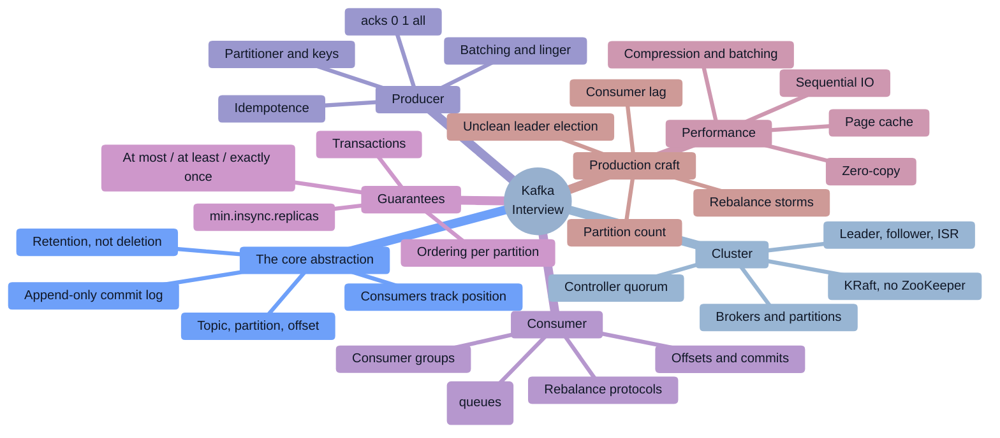

### Study strategy by company tier

| Tier | Companies | What they actually test | Time split |
|------|-----------|--------------------------|-----------|
| **FAANG / Big Tech** | Google, Meta, Amazon, Microsoft, Apple | DSA first. Kafka appears in the **design round** ("how do these services communicate?") and as a resume depth-probe: ordering guarantees, exactly-once, and what happens when a broker dies. Rarely config trivia. | 55% DSA, 30% design, 15% Kafka depth |
| **Data / streaming** | Databricks, Snowflake, Confluent, Datadog, Palantir | **Deep internals.** Replication protocol, ISR mechanics, the transaction protocol, Streams topology and state stores, exactly-once end to end, and the storage layer. Expect the hardest Kafka questions anywhere. | 20% DSA, 45% Kafka internals, 35% data architecture |
| **High-scale product** | Netflix, Uber, Airbnb, LinkedIn, DoorDash, Pinterest, Shopify | **Operational Kafka:** consumer lag, partition sizing, rebalance storms, hot partitions, multi-DC replication, schema evolution, and what breaks at 3 a.m. | 25% DSA, 40% production Kafka, 35% design |
| **Payments / fintech** | Stripe, Coinbase, Goldman, JPMorgan, Bloomberg, Razorpay, PhonePe | **Correctness.** Exactly-once vs at-least-once, the transactional outbox, idempotent consumers, ordering under retries, and why `acks=all` + `min.insync.replicas=2` is the only acceptable durability setting. | 25% DSA, 45% correctness, 30% design |
| **Indian product** | Walmart Global Tech, Flipkart, Swiggy, Zomato, Meesho, Zepto, Groww | **The heaviest Kafka weighting anywhere.** Full-stack Kafka: architecture, partitions, consumer groups, offsets, Spring Kafka annotations, error handling/DLQ, plus an LLD/design round. | 25% DSA, 40% Kafka + Spring, 35% design |
| **Data engineering roles** | Any company hiring DEs | Kafka Connect, schema registry and evolution, CDC/Debezium, Streams vs Flink vs Spark, lambda/kappa, and pipeline correctness. | 20% SQL/DSA, 45% Kafka + pipelines, 35% modelling |
| **Startups** | Seed → Series C | "Do we even need Kafka?" Pragmatism: when a database table or SQS would do, managed vs self-hosted, and the operational cost of running it. | 35% practical, 30% debugging, 35% architecture chat |
| **Service companies** | TCS, Infosys, Wipro, Accenture, Cognizant, Capgemini, LTIMindtree, HCL | Rapid-fire theory: what is Kafka, topic/partition/offset, consumer group, `acks`, replication factor, Kafka vs JMS/RabbitMQ, Spring `@KafkaListener`. | 70% theory Q&A, 25% Spring usage, 5% design |

### The 2026 shift you must internalize

> [!IMPORTANT]
> **"Kafka is a distributed publish-subscribe messaging system" is the setup, not the answer.** In 2026 the interviewer immediately follows with: *"Your consumer group has 400,000 messages of lag and it's growing — walk me through the next ten minutes."*, *"You said exactly-once — exactly-once between which two points, precisely?"*, *"A broker died and you lost messages even though replication factor was 3. How?"*, *"Why did adding partitions make your latency worse?"*, and *"You're on Kafka 4.x — what actually changed?"* Every canonical question below is paired with the **depth follow-up** that decides the hire.

> [!TIP]
> **The single highest-leverage sentence in a Kafka interview:** *"Kafka is not a queue — it's a replicated, append-only commit log that's partitioned for parallelism. Consumers don't remove messages; they track an offset. Everything follows from that: replay is free, multiple consumer groups are free, ordering is guaranteed only within a partition, and the throughput comes from sequential I/O plus zero-copy rather than from anything clever."* That framing unlocks ordering, delivery semantics, scaling, and performance in one breath.

### How to read the star ratings

| Rating | Meaning |
|--------|---------|
| ★★★★★ | **Must know.** Asked in a majority of Kafka-touching interviews. Not knowing it is disqualifying. |
| ★★★★☆ | Very common at mid/senior level. Expected from anyone claiming Kafka experience. |
| ★★★☆☆ | Differentiator. Senior/Staff signal; separates "used Kafka" from "operated Kafka." |

---

# 1. 🌱 Beginner Concepts

## 1.1 What is Kafka?

**Apache Kafka is a distributed, partitioned, replicated, append-only commit log**, used as a streaming platform. It is *not* a traditional message broker, and the difference is the whole point.

Strip it down and Kafka is five things:

1. **An append-only log per partition.** Producers append; the log is immutable; records get a monotonically increasing **offset**.
2. **Partitioned for parallelism.** A topic is split into partitions spread across brokers — that's how Kafka scales writes and reads horizontally.
3. **Replicated for durability.** Each partition has N replicas; one is the **leader**, the rest are **followers**.
4. **Consumers track a position, not a queue.** Reading doesn't delete. Ten independent consumer groups can read the same data without interfering.
5. **Retention-based, not consumption-based.** Data is deleted when it ages out (time/size) or is compacted — **not** when someone reads it.

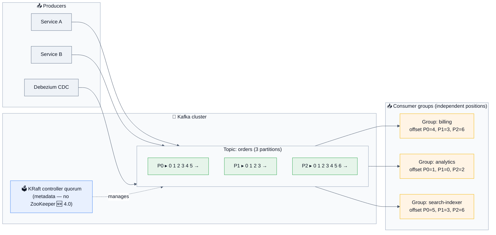

### The one-liner to open with

> *"Kafka is a distributed commit log. Producers append records to partitions, each record gets an offset, and consumers track their own position rather than removing messages. That single design gives you replay, independent consumers, per-partition ordering, and very high throughput from sequential I/O — and it also explains every constraint, like why global ordering is impossible without a single partition."*

## 1.2 Why does it exist? History that matters in interviews

| Year | Event | Why it matters |
|------|-------|----------------|
| **2010** | Built at **LinkedIn** by Jay Kreps, Neha Narkhede, and Jun Rao to replace a mess of point-to-point data integrations. Named after Franz Kafka. | **The origin story is the design rationale:** LinkedIn had N systems × M systems of bespoke pipelines. Kafka made it N + M by introducing a **universal log**. |
| 2011 | Open-sourced; Apache incubator. | |
| 2012 | Apache top-level project. | |
| 2014 | **Confluent** founded by the creators. | |
| 2015 | **0.9:** the new consumer API, security (SSL/SASL), Kafka Connect. | Connect is where most "how do I get data in/out?" answers live. |
| 2016 | **0.10: Kafka Streams**, record timestamps. | Stream processing without a separate cluster. |
| **2017** | **0.11: idempotent producer + transactions** → the foundation of exactly-once. Also the new message format (record batches, headers). | **The single most important release for correctness questions.** |
| 2018 | **2.0:** stability, better admin tooling. | |
| 2019 | **2.4:** follower fetching (rack-aware reads), incremental cooperative rebalancing. | |
| **2020** | **2.6/2.8:** **KRaft early access (KIP-500)** — the beginning of the end for ZooKeeper. | |
| 2021 | **3.0:** stronger durability defaults (`acks=all`, `enable.idempotence=true` **on by default**). | **Know that these became defaults in 3.0** — a common trick question. |
| 2022 | **3.3: KRaft marked production-ready** for new clusters. | |
| 2023 | **3.6: Tiered storage (KIP-405)** early access — offload old segments to object storage. | |
| 2024 | **3.7/3.8:** ZooKeeper deprecated; migration tooling matured; KIP-848 preview. | |
| **Mar 2025** | 🪦 **4.0: ZooKeeper REMOVED. KRaft only.** **KIP-848 consumer protocol GA.** KIP-932 share groups **early access**. Java 11 (clients) / 17 (brokers). | **The dividing line between "current" and "dated" Kafka knowledge.** |
| Sep 2025 | **4.1:** Queues **preview**; KIP-1071 Streams rebalance protocol early access. | |
| **Feb 2026** | **4.2: Queues (share groups) GA** — `RENEW` acks, adaptive batching, lag metrics. Streams rebalance protocol GA (limited). **DLQ support in Streams exception handlers.** | **The "what's new?" answer.** |
| **Mar 2026** | **KIP-1150 (Diskless Topics) accepted** — directional only; implementation KIPs still in discussion; not in mainline. | The "where is Kafka going?" answer. |
| May 2026 | **4.2.1** bugfix release. | Current. |

**The problems Kafka was built to solve:**
- 🎯 **The N×M integration problem** — every system talking directly to every other system. Kafka makes it N producers + M consumers around one log.
- 🎯 **Buffering between systems of different speeds** — a fast producer and a slow consumer shouldn't take each other down.
- 🎯 **Replay** — if a downstream consumer had a bug, you want to reprocess yesterday's data. A queue that deletes on consume cannot do this.
- 🎯 **Multiple independent consumers** of the same data — analytics, search indexing, billing, and ML features all needing the same event stream.
- 🎯 **Durability at high throughput** — millions of messages/second, persisted, without buying exotic hardware.

## 1.3 Real-world analogies (use these; interviewers remember them)

| Concept | Analogy |
|---------|---------|
| **The log** | A **newspaper archive**, not a mailbox. When you read yesterday's paper, it doesn't vanish — anyone else can read it too, and you can go back to last month. The archive throws papers away on a schedule (retention), not when someone reads them. |
| **Offset** | Your **bookmark** in the archive. Kafka doesn't track "who has read what" — *you* remember your page number. Lose your bookmark and you either start from the beginning or from today's paper. |
| **Partition** | **Multiple printing lines** of the same newspaper. Each line is strictly ordered internally, but there's no guaranteed order *between* lines. That's why global ordering needs one line — and one line is a throughput ceiling. |
| **Consumer group** | A **team of readers sharing the archive.** Each newspaper section goes to exactly one team member. Add a member and the sections get redistributed (rebalance). More members than sections means someone sits idle. |
| **Partition key** | The **rule for which printing line** a story goes to. All stories about customer #42 go to line 3 — so they stay in order relative to each other. |
| **Replication / ISR** | **Carbon copies of each printing line** kept in other buildings. The "in-sync" copies are the ones that are actually up to date. If you only accept a story once 2 buildings have it, losing one building loses nothing. |
| **Leader / follower** | One building is **the official one** for each line — all writes and (usually) reads go there. If it burns down, an in-sync copy is promoted. |
| **Retention** | The archive's **shredding schedule**: keep 7 days, or keep 100 GB, whichever comes first. |
| **Log compaction** | Instead of shredding by age, **keep only the latest edition per subject.** Perfect for "current state of every customer" — you can rebuild the whole picture from the compacted archive. |
| **Consumer lag** | **How many papers behind you are.** Zero is caught up. Growing is the single most important alarm in Kafka. |
| **Rebalance** | The team **stopping to redivide the sections.** In the old protocol everyone stopped and nobody read anything until it finished — a "stop-the-world" pause. 🆕 The new protocol redistributes incrementally so most readers keep reading. |
| **Exactly-once** | Not "the message is delivered once." It's *"the **effect** happens once"* — like a **cheque with a reference number**: if it arrives twice, the bank recognizes the number and doesn't pay twice. |

## 1.4 The vocabulary you must be fluent in

| Term | Precise meaning |
|------|-----------------|
| **Record / message / event** | A key-value pair plus a timestamp and headers. Key is optional but decides partitioning. |
| **Topic** | A named category of records. Purely logical. |
| **Partition** | The unit of parallelism, ordering, and storage. **An ordered, immutable sequence of records.** |
| **Offset** | A record's position within a partition. Monotonic, per-partition, never reused. |
| **Broker** | A Kafka server. Hosts partitions and serves reads/writes. |
| **Cluster** | A set of brokers plus the controller quorum. |
| **Controller** | The broker(s) managing cluster metadata and leader elections. 🆕 In KRaft, a **quorum** of controllers using Raft. |
| **Producer** | A client that appends records. |
| **Consumer** | A client that reads records. |
| **Consumer group** | A set of consumers cooperatively reading a topic — **each partition goes to exactly one member.** |
| **Group coordinator** | The broker managing a group's membership and offsets. |
| **Replica** | A copy of a partition on another broker. |
| **Leader** | The replica handling reads and writes for a partition. |
| **Follower** | A replica that fetches from the leader. |
| **ISR (In-Sync Replicas)** | The set of replicas caught up with the leader within `replica.lag.time.max.ms`. **The heart of Kafka's durability model.** |
| **High watermark (HW)** | The highest offset replicated to **all** ISR members. **Consumers can only read up to the HW** — that's what makes reads consistent with durability. |
| **LEO (Log End Offset)** | The next offset to be written on a replica. |
| **Segment** | The physical file a partition's log is split into. Retention and deletion operate on whole segments. |
| **Retention** | How long/large data is kept (`retention.ms`, `retention.bytes`). |
| **Compaction** | Retention by key — keep the latest value per key. |
| **Tombstone** | A record with a `null` value; in a compacted topic it means "delete this key." |
| **Consumer lag** | `log end offset − consumer's committed offset`. **The #1 health metric.** |
| **Rebalance** | Reassigning partitions among group members. |
| **KRaft** | 🆕 Kafka's built-in Raft-based metadata quorum, replacing ZooKeeper. |
| **Share group** | 🆕 (4.2 GA) A consumer group with **queue semantics** — per-message acknowledgement and redelivery, without partition-exclusive assignment. |

## 1.5 The core mental model: partitions, keys, and ordering 🔑

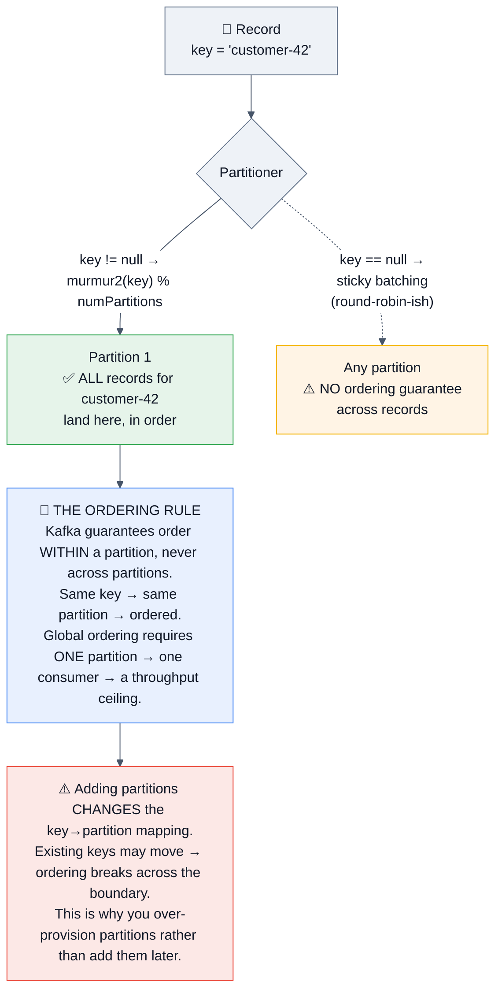

> [!IMPORTANT]
> **The three sentences that answer half of all Kafka ordering questions:**
> 1. **"Ordering is guaranteed only within a partition."**
> 2. **"Records with the same key always go to the same partition, so per-entity ordering comes free from choosing the right key."**
> 3. **"Adding partitions later rehashes keys and breaks that guarantee across the change, which is why you size partitions generously up front."**

## 1.6 Common misconceptions ❌ → ✅

| ❌ Misconception | ✅ Reality |
|------------------|-----------|
| "Kafka is a message queue." | Kafka is a **log**. Messages aren't removed on consume. 🆕 As of 4.2, **share groups do add genuine queue semantics** — so the modern answer is "it's a log that can *also* do queues now." |
| "Kafka guarantees global ordering." | **Only per partition.** Global ordering = one partition = one consumer = a hard throughput ceiling. |
| "Kafka deletes messages after they're consumed." | Deletion is by **retention policy** (time/size) or **compaction**. Consumption changes nothing. |
| "Exactly-once means no duplicates ever, anywhere." | Kafka's EOS covers **read-process-write within Kafka** (and idempotent producer writes). **Exactly-once to an external system requires an idempotent sink or 2PC.** Being precise here is a senior signal. |
| "More partitions always means more throughput." | Up to a point. Then you pay in **more open files, more replication fetch overhead, longer leader elections, slower rebalances, and more end-to-end latency**. There's a real optimum. |
| "Kafka needs ZooKeeper." | 🪦 **Not since 4.0.** KRaft is the only mode. Saying otherwise dates you immediately. |
| "`acks=all` means all replicas." | It means **all *in-sync* replicas**. If ISR has shrunk to 1, `acks=all` acknowledges after **one** replica — which is why **`min.insync.replicas=2` is essential**, and why this pair is the most important durability question in Kafka. |
| "Replication factor 3 means you can't lose data." | You can, via **unclean leader election**, `acks=1`, or `min.insync.replicas=1` with a shrunken ISR. RF is necessary but not sufficient. |
| "Kafka is slow because it writes to disk." | **Sequential disk writes plus the OS page cache plus zero-copy** make Kafka faster than many in-memory systems. Kafka deliberately doesn't maintain its own cache. |
| "Consumers pull, so there's no backpressure problem." | Pull *is* the backpressure mechanism — but **lag is unbounded** and a stalled consumer is invisible unless you monitor lag. |
| "A consumer group can have more consumers than partitions for more parallelism." | Extra consumers **sit idle**. Partition count is the hard parallelism ceiling per group. (🆕 Share groups change this — see §3.4.) |
| "Kafka Streams needs a separate cluster." | It's **a library** in your application. Flink and Spark need clusters; Streams doesn't. |
| "Kafka can replace a database." | It's a log with retention, not a queryable store. Compacted topics + state stores get you closer, but there are no ad-hoc queries, no secondary indexes, and no transactions across arbitrary entities. |
| "Kafka has diskless/S3 topics now." | 🆕 **KIP-1150 is accepted but directional only** — it's not in mainline Kafka. Vendors (WarpStream, AutoMQ, Aiven Inkless) ship the idea today. **Getting this nuance right is a strong 2026 signal.** |

## 1.7 The commands you should know cold

```bash
# Topics
kafka-topics.sh --bootstrap-server localhost:9092 --list
kafka-topics.sh --bootstrap-server localhost:9092 --describe --topic orders
kafka-topics.sh --bootstrap-server localhost:9092 --create --topic orders \
    --partitions 12 --replication-factor 3 \
    --config min.insync.replicas=2 --config retention.ms=604800000
kafka-topics.sh --bootstrap-server localhost:9092 --alter --topic orders --partitions 24  # ⚠️ rehashes keys

# Produce / consume
kafka-console-producer.sh --bootstrap-server localhost:9092 --topic orders \
    --property "parse.key=true" --property "key.separator=:"
kafka-console-consumer.sh --bootstrap-server localhost:9092 --topic orders \
    --from-beginning --property print.key=true --property print.offset=true

# 🔑 THE most important operational command — consumer lag
kafka-consumer-groups.sh --bootstrap-server localhost:9092 --describe --group billing
kafka-consumer-groups.sh --bootstrap-server localhost:9092 --list
kafka-consumer-groups.sh --bootstrap-server localhost:9092 --group billing \
    --reset-offsets --to-earliest --topic orders --execute     # ⚠️ group must be inactive

# Config
kafka-configs.sh --bootstrap-server localhost:9092 --describe --entity-type topics --entity-name orders
kafka-configs.sh --bootstrap-server localhost:9092 --alter --entity-type topics \
    --entity-name orders --add-config retention.ms=86400000

# Cluster & partitions
kafka-metadata-quorum.sh --bootstrap-server localhost:9092 describe --status   # 🆕 KRaft health
kafka-reassign-partitions.sh --bootstrap-server localhost:9092 --execute --reassignment-json-file plan.json
kafka-leader-election.sh --bootstrap-server localhost:9092 --election-type PREFERRED --all-topic-partitions
kafka-log-dirs.sh --bootstrap-server localhost:9092 --describe --broker-list 1,2,3   # disk usage per partition

# Benchmarking
kafka-producer-perf-test.sh --topic perf --num-records 1000000 --record-size 1000 \
    --throughput -1 --producer-props bootstrap.servers=localhost:9092 acks=all
kafka-consumer-perf-test.sh --bootstrap-server localhost:9092 --topic perf --messages 1000000
```

> [!TIP]
> **The one command that signals real experience:** `kafka-consumer-groups.sh --describe --group X`. It shows `CURRENT-OFFSET`, `LOG-END-OFFSET`, and **`LAG`** per partition — and **lag per partition, not just total lag**, is how you spot a single stuck consumer or a hot partition. Mentioning the per-partition view unprompted is a small but real credibility marker.

---
# 2. 🧩 Intermediate Concepts

## 2.1 Cluster architecture — KRaft, and why ZooKeeper died

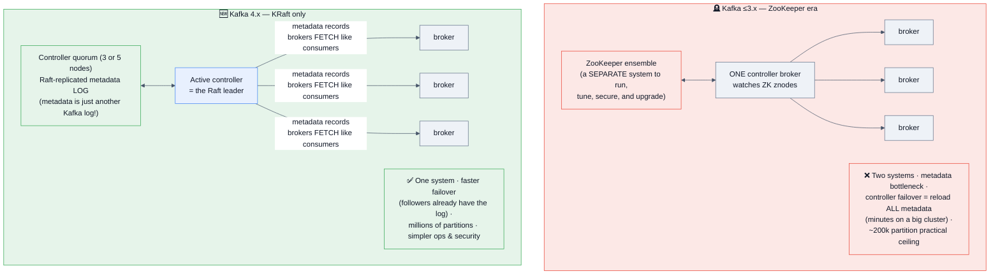

### The KRaft answer that scores

> *"KRaft replaces ZooKeeper with a Raft quorum built into Kafka itself, and the key insight is that **metadata becomes just another Kafka log** — an internal `__cluster_metadata` topic that brokers consume like any other. That changes controller failover from 'load all metadata from ZooKeeper', which took minutes on a large cluster, to 'the follower already has the log and just needs to catch up on the tail', which takes milliseconds. It also raises the partition ceiling from roughly 200,000 into the millions, and it removes an entire distributed system from your ops, security, and upgrade surface. Kafka 4.0 removed ZooKeeper entirely, so this isn't optional any more."*

**Deployment modes:** dedicated controllers (recommended for production — 3 or 5 nodes, isolating metadata from data load) vs **combined mode** (a node is both controller and broker — fine for dev, discouraged in production).

**Migration (still a live interview topic, because plenty of shops are mid-migration):** ZK → KRaft is a documented, online, rolling procedure with a dual-write bridge phase, and **you must be on a 3.x version first — you cannot jump from a ZooKeeper cluster straight to 4.0.** Saying that unprompted is a strong ops signal.

## 2.2 The producer — internals and configuration

```mermaid
%%{init: {'theme':'base','themeVariables':{'background':'#ffffff','mainBkg':'#eef2f7','primaryColor':'#eef2f7','primaryTextColor':'#111827','primaryBorderColor':'#64748b','secondaryColor':'#e8f0fe','tertiaryColor':'#f1f5f9','lineColor':'#475569','textColor':'#111827','clusterBkg':'#f8fafc','clusterBorder':'#94a3b8','edgeLabelBackground':'#ffffff','titleColor':'#111827','actorBkg':'#eef2f7','actorTextColor':'#111827','actorBorder':'#64748b','actorLineColor':'#475569','signalColor':'#111827','signalTextColor':'#111827','noteBkgColor':'#fff4e5','noteTextColor':'#111827','noteBorderColor':'#d97706','labelBoxBkgColor':'#eef2f7','labelBoxBorderColor':'#64748b','labelTextColor':'#111827','loopTextColor':'#111827','altBackground':'#f8fafc'}}}%%
flowchart LR
    APP["send(record)"] --> SER["1️⃣ Serializer<br/>key + value → bytes"]
    SER --> PART["2️⃣ Partitioner<br/>key ? murmur2(key) % N<br/>: sticky batching"]
    PART --> ACC["3️⃣ RecordAccumulator<br/>per-partition batches in<br/>buffer.memory (32 MB default)<br/>⏳ waits for batch.size OR linger.ms"]
    ACC --> COMP["4️⃣ Compression<br/>per BATCH, not per record<br/>(lz4 / zstd / snappy / gzip)"]
    COMP --> SEND["5️⃣ Sender thread<br/>groups batches by broker<br/>max.in.flight.requests"]
    SEND --> BRK["🌊 Broker leader"]
    BRK -->|"ack per acks setting"| CB["6️⃣ Callback / Future<br/>+ retries on retriable errors"]
    BRK -.->|"buffer full &<br/>max.block.ms exceeded"| BLOCK["🚫 send() BLOCKS then throws<br/>← backpressure lives here"]

    style ACC fill:#e6f4ea,stroke:#34a853,color:#111827
    style COMP fill:#e8f0fe,stroke:#4285f4,color:#111827
    style SEND fill:#e8f0fe,stroke:#4285f4,color:#111827
    style BLOCK fill:#fce8e6,stroke:#ea4335,color:#111827
    style BRK fill:#fff4e5,stroke:#f4b400,color:#111827
```

### `acks` — the most-asked producer question

| Setting | Producer waits for | Durability | Latency | Use when |
|---------|-------------------|------------|---------|----------|
| `acks=0` | **Nothing** — fire and forget | ❌ Messages lost on any failure | Lowest | Metrics/logs where loss is acceptable |
| `acks=1` | The **leader** only | ⚠️ **Lost if the leader dies before followers replicate** | Medium | Rarely the right answer |
| **`acks=all` (`-1`)** ⭐ | **All in-sync replicas** | ✅ With `min.insync.replicas ≥ 2` | Highest | **The default since Kafka 3.0, and the correct answer for anything that matters** |

> [!WARNING]
> **The `acks=all` trap — this is the single best Kafka durability question.** `acks=all` waits for all replicas **currently in the ISR**. If followers fall behind and the ISR shrinks to just the leader, `acks=all` acknowledges after **one** replica — and you're back to `acks=1` durability **without any error**. The fix is **`min.insync.replicas=2`** at the topic level: if fewer than 2 replicas are in sync, the broker **rejects the write** with `NotEnoughReplicasException` rather than silently accepting a fragile one.
> **The production triple to recite: `replication.factor=3`, `min.insync.replicas=2`, `acks=all`.** That tolerates one broker failure with zero data loss and still accepts writes.

### Producer configuration reference

```properties
bootstrap.servers=b1:9092,b2:9092,b3:9092
acks=all                                  # default since 3.0
enable.idempotence=true                   # default since 3.0 — dedups producer retries
max.in.flight.requests.per.connection=5   # ✅ safe with idempotence; >1 WITHOUT it reorders
retries=2147483647                        # effectively infinite; bounded by delivery.timeout.ms
delivery.timeout.ms=120000                # 🔑 the real end-to-end send deadline
request.timeout.ms=30000
linger.ms=5-100                           # ⏳ wait to fill batches — THE throughput/latency dial
batch.size=32768-131072                   # bytes per partition batch
compression.type=lz4                      # or zstd for better ratio at more CPU
buffer.memory=67108864                    # producer-side buffer; when full, send() blocks
max.block.ms=60000                        # how long send() blocks before throwing
max.request.size=1048576                  # ⚠️ must align with broker message.max.bytes
```

> [!TIP]
> **The `linger.ms` insight that reads as experience:** *"`linger.ms=0` is the lowest-latency setting but the worst for throughput, because you send tiny batches and pay per-request overhead. Setting it to 5–20 ms costs you a few milliseconds of latency and can multiply throughput several-fold, because compression works per batch — bigger batches compress dramatically better. On a high-volume topic that's also a direct network and storage cost saving."*

**Ordering nuance:** `max.in.flight.requests.per.connection > 1` combined with retries **can reorder records** — batch 2 succeeds while batch 1 is being retried. **With `enable.idempotence=true` (the default since 3.0), Kafka tracks sequence numbers and preserves order up to 5 in-flight requests.** That's exactly why idempotence became the default.

## 2.3 The consumer and consumer groups

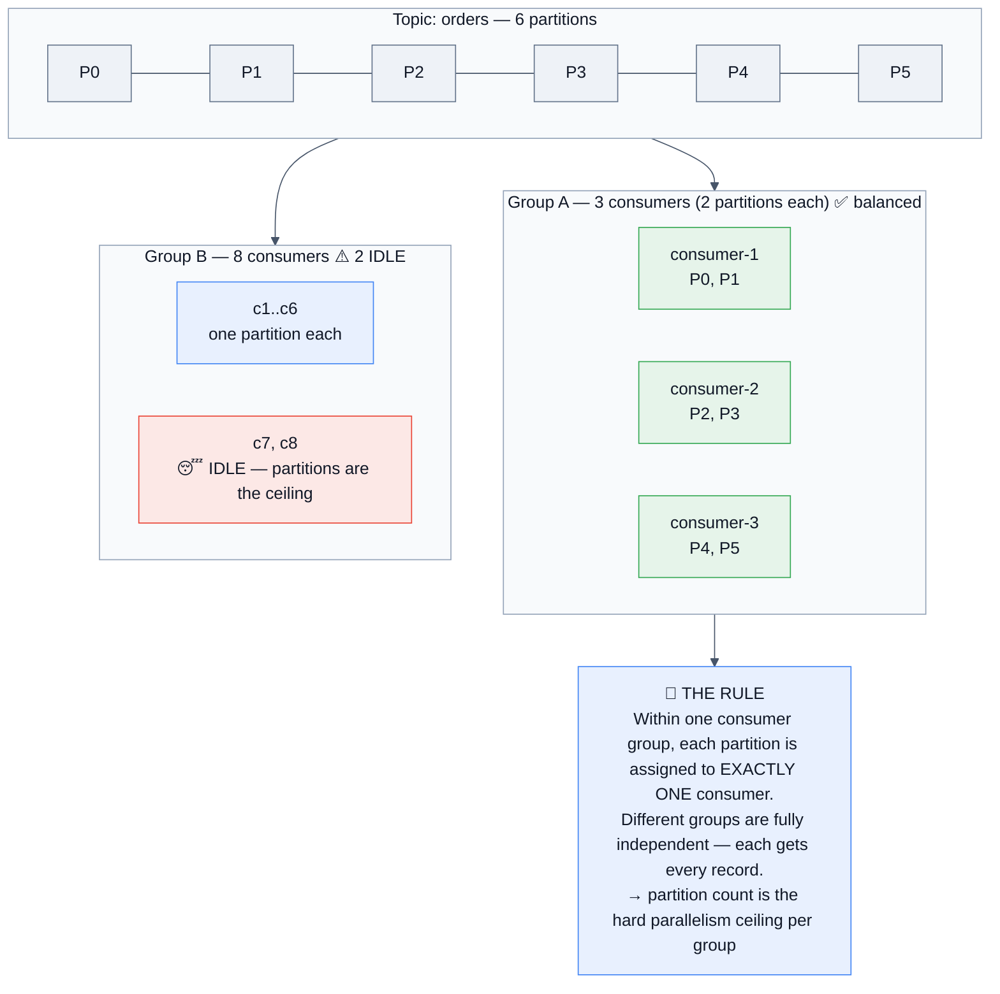

### Offset management — where at-least-once vs at-most-once actually lives

```java
// ❌ AT-MOST-ONCE: commit before processing → a crash after commit LOSES the record
consumer.commitSync();
process(records);

// ✅ AT-LEAST-ONCE: process, then commit → a crash before commit REPROCESSES
process(records);
consumer.commitSync();          // ← duplicates possible; consumer must be idempotent

// ⚠️ enable.auto.commit=true commits every auto.commit.interval.ms (5 s default)
//    on the NEXT poll() — so a crash can lose up to 5 s of *processed* work,
//    OR reprocess records already handled. It's convenient and imprecise.
```

| Setting | Meaning |
|---------|---------|
| `group.id` | The consumer group identity |
| `enable.auto.commit` | `true` by default. **Set to `false` for anything that matters** |
| `auto.offset.reset` | `latest` (default) / `earliest` / `none` — **what happens when there's no committed offset**. `latest` silently skipping a backlog is a classic surprise |
| `max.poll.records` | Records returned per `poll()` — **the main lever against `max.poll.interval.ms` timeouts** |
| `max.poll.interval.ms` | 5 min default. **Exceed it and the consumer is kicked out of the group → rebalance** |
| `session.timeout.ms` | 45 s default (raised in newer versions). Heartbeat-based liveness |
| `heartbeat.interval.ms` | ~1/3 of the session timeout |
| `fetch.min.bytes` / `fetch.max.wait.ms` | Batching on the fetch side — throughput vs latency |
| `isolation.level` | `read_uncommitted` (default) / **`read_committed`** — required to respect transactions |
| `partition.assignment.strategy` | `RangeAssignor`, `RoundRobinAssignor`, `StickyAssignor`, **`CooperativeStickyAssignor`** ⭐ |

> [!WARNING]
> **The `max.poll.interval.ms` death spiral — one of the most common real Kafka incidents.** Processing gets slow → a `poll()` cycle exceeds `max.poll.interval.ms` → the coordinator assumes the consumer is dead and **kicks it out** → rebalance → the partitions move to another consumer that is *also* slow → it gets kicked out too → **the group rebalances forever and processes nothing.** **The fix is almost always to lower `max.poll.records`** (process fewer records per cycle) rather than to raise the timeout, plus moving slow work off the poll thread.

## 2.4 Replication, ISR, and the high watermark

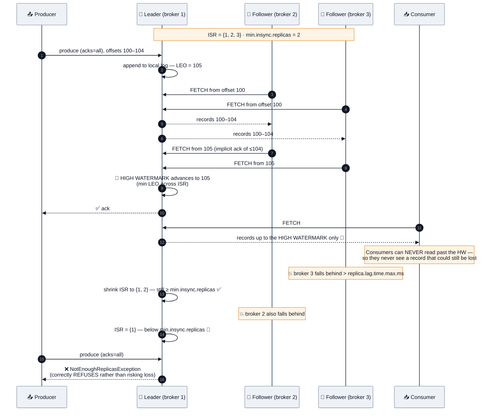

### The concepts to state precisely

| Concept | Meaning |
|---------|---------|
| **ISR** | Replicas caught up within **`replica.lag.time.max.ms`** (30 s default). ⚠️ Note it's a **time**-based measure, not a message-count one — that changed long ago and people still get it wrong. |
| **High watermark** | The minimum LEO across the ISR. **Consumers read only up to the HW**, which is why a consumer never sees a record that hasn't been replicated to all in-sync replicas. |
| **LEO** | Log End Offset — the next offset to be written on a given replica. |
| **Leader election** | When a leader fails, the controller promotes a replica **from the ISR**. |
| **Unclean leader election** | `unclean.leader.election.enable=true` allows promoting an **out-of-sync** replica when no ISR member survives. **This trades data loss for availability** — the default is `false`, and that default is correct for anything that matters. |
| **Preferred leader** | The first replica in the assignment list. `auto.leader.rebalance.enable` restores leadership to it so leadership stays evenly spread — otherwise after a few failovers one broker leads everything. |
| **Rack awareness** | `broker.rack` spreads replicas across racks/AZs so a rack failure doesn't take all replicas. |

> [!IMPORTANT]
> **"You have replication factor 3 and still lost messages. How?"** — a top-tier interview question. **Four answers, all real:**
> 1. **`acks=1`** — the leader acked and died before replicating.
> 2. **`min.insync.replicas=1`** with a shrunken ISR — `acks=all` degenerated to one replica.
> 3. **Unclean leader election** — an out-of-sync replica was promoted and truncated the log.
> 4. **All three replicas on the same rack/AZ**, which failed together. Replication without failure-domain spread is theatre.

## 2.5 Storage internals — why Kafka is fast

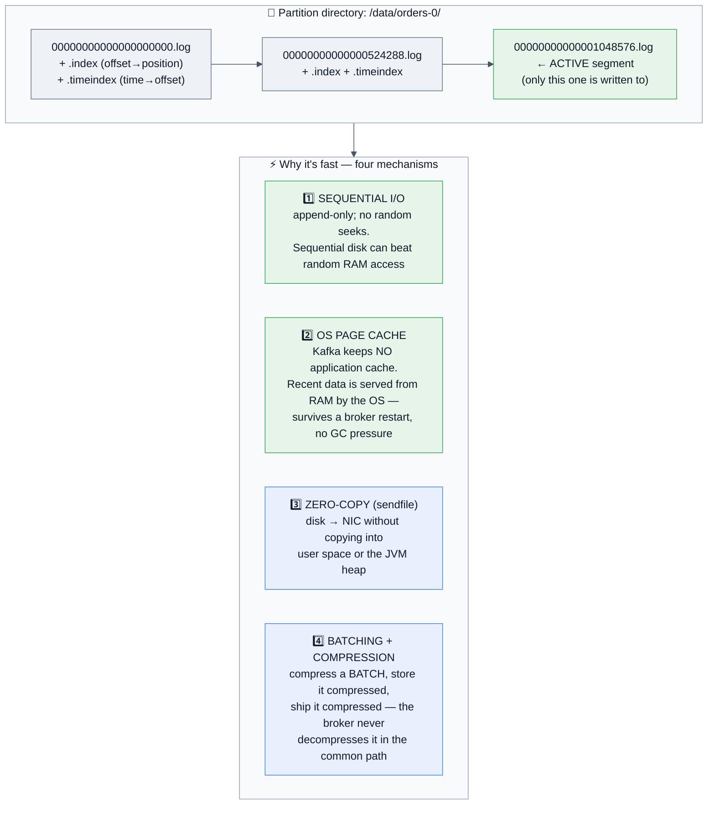

> [!TIP]
> **The "why is Kafka fast?" answer, in order of importance:** *"First, everything is **sequential I/O** — Kafka only appends, so there are no random seeks. Second, it **delegates caching to the OS page cache** rather than maintaining its own, which means no GC pressure from a huge heap and a warm cache that survives process restarts. Third, **zero-copy via `sendfile`** sends bytes from the page cache straight to the network card without passing through user space or the JVM heap. Fourth, **batching and compression happen once at the producer** and the broker stores and forwards the compressed batch untouched. None of that is exotic — it's careful use of what the OS already gives you."*

**Retention & compaction:**
```properties
cleanup.policy=delete            # default: drop whole segments by age/size
retention.ms=604800000           # 7 days
retention.bytes=-1               # per PARTITION, not per topic ⚠️
segment.bytes=1073741824         # 1 GB — deletion granularity is a segment
segment.ms=604800000

cleanup.policy=compact           # keep the LATEST record per key
min.cleanable.dirty.ratio=0.5
delete.retention.ms=86400000     # how long tombstones survive (consumers must see them)

cleanup.policy=compact,delete    # both: compact, and also drop very old data
```
**Compaction is the mechanism behind:** `__consumer_offsets`, Kafka Streams changelog topics, CDC "current state of every row" topics, and any "materialize the latest value per key" use case. **A tombstone (`null` value) means "delete this key"** — and `delete.retention.ms` exists so consumers get a chance to *see* the deletion before it's compacted away.

## 2.6 Delivery semantics — the question you will be asked

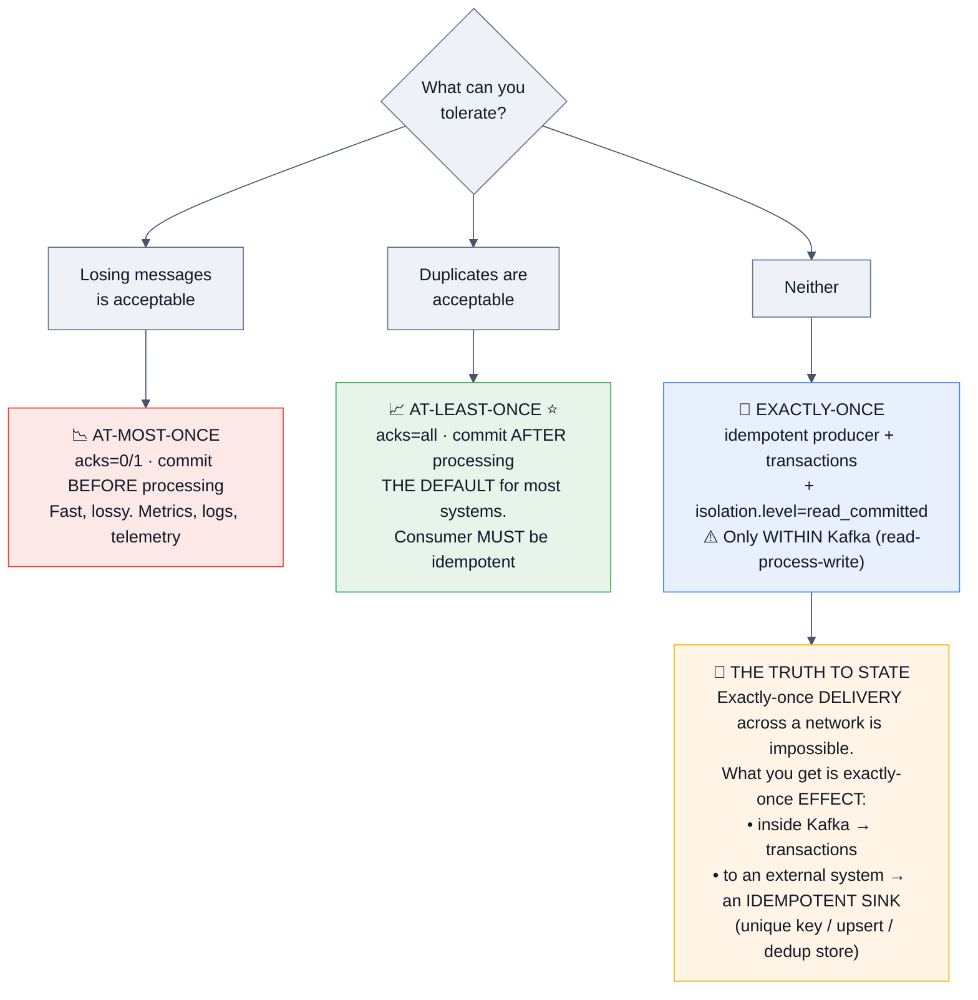

## 2.7 Serialization & the Schema Registry

**The problem:** a producer adds a field; 40 consumers break. Kafka stores bytes and enforces nothing.

**The answer:** a **Schema Registry** (Confluent's, or Apicurio) storing versioned schemas. The producer serializes with a **5-byte prefix: a magic byte + a 4-byte schema ID**, then the payload. The consumer reads the ID, fetches the schema (cached), and deserializes. **Schemas travel by reference, not by value** — that's the design insight.

| Format | Pros | Cons |
|--------|------|------|
| **Avro** ⭐ | Compact binary, rich schema evolution, first-class registry support, self-describing via the registry | Needs the registry; less human-readable |
| **Protobuf** | Compact, great tooling and codegen, gRPC-native | Evolution rules are subtler than Avro's |
| **JSON Schema** | Human-readable, debuggable | **Verbose — often 3–10× the bytes**, which is real money at volume |
| **Plain JSON (no schema)** | Zero setup | ❌ **No contract. This is how pipelines break at 2 a.m.** |

| Compatibility mode | Meaning | Who can upgrade first |
|--------------------|---------|----------------------|
| **BACKWARD** (default) | New schema can read old data | **Consumers first** |
| **FORWARD** | Old schema can read new data | **Producers first** |
| **FULL** | Both | Either |
| **NONE** | No checks | Nobody, safely |

**The rules that make evolution safe:** add fields **with defaults**; never remove a required field; never change a field's type; never rename (add a new one and deprecate). **State that compatibility mode determines deployment order** — that's the practical consequence most candidates miss.

## 2.8 Kafka Connect — the "how does data get in and out?" answer

**Connect is a framework for streaming data between Kafka and external systems without writing code.** Source connectors pull data *in*; sink connectors push data *out*.

- **Distributed mode** (production): a cluster of workers with tasks rebalanced across them; config, offsets, and status live in internal Kafka topics.
- **Standalone mode**: one process, local file state — dev only.
- **Key concepts:** connectors → **tasks** (the unit of parallelism, capped by `tasks.max` and the source's partitioning), converters (Avro/JSON/Protobuf, integrating with the registry), and **Single Message Transforms (SMTs)** for lightweight per-record changes (masking, routing, renaming).
- **The most-cited use:** **Debezium for CDC** — tailing a database's write-ahead log into Kafka. This is the correct answer to *"how do you get database changes into Kafka without dual writes?"*
- **Dead letter queues:** `errors.tolerance=all` + `errors.deadletterqueue.topic.name` — otherwise one poison record stops the connector.

> [!TIP]
> **Say this:** *"I'd reach for Connect before writing a bespoke producer/consumer, because it gives me offset management, restarts, scaling, DLQs, and monitoring for free. Writing that yourself is a month of work and a permanent maintenance burden."*

---
# 3. 🚀 Advanced Concepts

## 3.1 Transactions and exactly-once semantics 🔑

```mermaid
%%{init: {'theme':'base','themeVariables':{'background':'#ffffff','mainBkg':'#eef2f7','primaryColor':'#eef2f7','primaryTextColor':'#111827','primaryBorderColor':'#64748b','secondaryColor':'#e8f0fe','tertiaryColor':'#f1f5f9','lineColor':'#475569','textColor':'#111827','clusterBkg':'#f8fafc','clusterBorder':'#94a3b8','edgeLabelBackground':'#ffffff','titleColor':'#111827','actorBkg':'#eef2f7','actorTextColor':'#111827','actorBorder':'#64748b','actorLineColor':'#475569','signalColor':'#111827','signalTextColor':'#111827','noteBkgColor':'#fff4e5','noteTextColor':'#111827','noteBorderColor':'#d97706','labelBoxBkgColor':'#eef2f7','labelBoxBorderColor':'#64748b','labelTextColor':'#111827','loopTextColor':'#111827','altBackground':'#f8fafc'}}}%%
sequenceDiagram
    autonumber
    participant A as 🧠 App (read-process-write)
    participant TC as 🗳️ Transaction Coordinator
    participant IN as 📥 input-topic
    participant OUT as 📤 output-topic
    participant OFF as 🗂️ __consumer_offsets

    A->>TC: initTransactions() — register transactional.id
    TC-->>A: PID + epoch 🔑 (a NEW epoch FENCES any zombie<br/>instance using the same transactional.id)
    A->>IN: poll() records
    A->>TC: beginTransaction()
    A->>OUT: send(result)  — written but marked UNCOMMITTED
    A->>TC: sendOffsetsToTransaction(offsets, groupMetadata) 🔑
    Note over A,OFF: THE KEY INSIGHT — the consumer offset commit is<br/>PART OF THE SAME TRANSACTION as the output writes
    A->>TC: commitTransaction()
    TC->>OUT: write COMMIT marker
    TC->>OFF: write offsets + COMMIT marker
    Note over OUT: Consumers with isolation.level=read_committed<br/>now — and only now — see the records
```

### The concepts to state precisely

| Concept | What it does |
|---------|--------------|
| **Idempotent producer** (`enable.idempotence=true`, default since 3.0) | The broker assigns a **PID**, and every record carries a **per-partition sequence number**. The broker tracks the last accepted sequence and **silently drops duplicates from producer retries**. Solves duplicates *from retries*, per producer session, per partition. |
| **`transactional.id`** | A **stable, unique identity across restarts.** On `initTransactions()` the coordinator bumps the **epoch**, which **fences** any older instance still running with the same ID — that's how zombie processes are prevented from writing. |
| **Atomic multi-partition writes** | All writes across all partitions in the transaction become visible together, or none do. |
| **`sendOffsetsToTransaction`** ⭐ | **Commits the consumer's offsets inside the transaction.** This is what makes read-process-write atomic — you can't process a record, write output, and then fail to record that you consumed it. |
| **Transaction markers** | Control records the broker writes into partitions to mark commit/abort. Consumers use them to filter. |
| **`isolation.level=read_committed`** | ⚠️ **Consumers default to `read_uncommitted` and will see aborted records.** If you build a transactional pipeline and forget this on the consumer, you have silently defeated the entire thing. **A favourite gotcha.** |
| **LSO (Last Stable Offset)** | A `read_committed` consumer can only read up to the LSO — the offset before the first open transaction. **A long-running open transaction therefore stalls all `read_committed` consumers of that partition.** |
| **`transaction.timeout.ms`** | Bounds that stall. The broker aborts a transaction that runs too long. |

> [!IMPORTANT]
> **The answer that separates senior from mid on exactly-once:**
> *"Kafka's exactly-once is **exactly-once processing within Kafka** — a read-process-write loop where the output writes and the input offset commit are one atomic transaction. It does **not** extend to external systems. The moment my sink is Postgres, S3, or a payment API, Kafka's transaction can't cover it, so I need one of: an **idempotent sink** (upsert on a natural key, or a dedup table keyed by `topic-partition-offset`), or a **transactional outbox on the sink side**. In practice I default to **at-least-once delivery plus an idempotent consumer** — it's simpler, cheaper, and it's what most 'exactly-once' systems actually are underneath."*
> **The cost to name:** transactions add latency (commit markers, coordinator round trips), reduce throughput (typically noticeably), and introduce the LSO stall risk. **They are not free, and saying so is the mark of someone who has run them.**

## 3.2 Rebalancing — and what KIP-848 changed 🆕

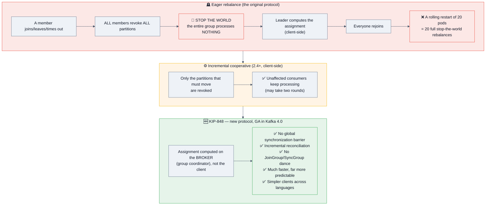

### What triggers a rebalance (know all five)
1. A consumer **joins** the group.
2. A consumer **leaves** gracefully (`close()` sends a LeaveGroup).
3. A consumer is **considered dead** — missed heartbeats (`session.timeout.ms`) or exceeded **`max.poll.interval.ms`**.
4. **Partitions are added** to a subscribed topic.
5. A **subscription changes** (e.g. a regex subscription now matches a new topic).

### Mitigations to name
- **`CooperativeStickyAssignor`** on the old protocol; **the new protocol (KIP-848) on 4.x** — the real fix.
- **`group.instance.id`** → **static membership**: a consumer restarting within `session.timeout.ms` **rejoins with its existing assignment and triggers no rebalance at all.** This is the single best mitigation for rolling deploys and is under-known.
- **Lower `max.poll.records`** rather than raising `max.poll.interval.ms`.
- Move slow processing **off the poll thread** (hand to a worker pool with bounded concurrency, then commit).
- Graceful shutdown (`consumer.close()`) so the group learns immediately instead of waiting for a timeout.

## 3.3 🆕 Queues for Kafka — share groups (KIP-932, GA in 4.2)

**This is the biggest functional addition to Kafka in years, and a guaranteed "what's new?" question in 2026.**

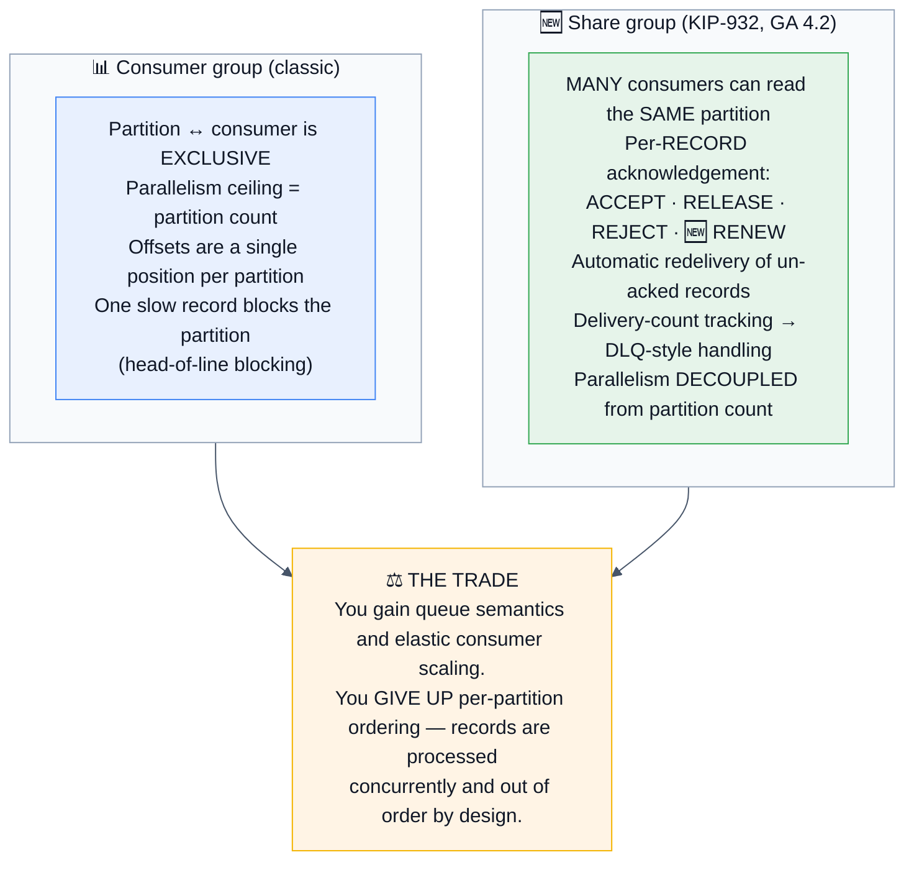

| Feature | Detail |
|---------|--------|
| **Acknowledgement types** | `ACCEPT` (done), `RELEASE` (give it back for redelivery), `REJECT` (poison — don't redeliver), 🆕 **`RENEW`** (added in 4.2 — extend the processing window for long-running work, like SQS's visibility-timeout extension) |
| **Share coordinator** | A broker component tracking per-record delivery state; 4.2 added **adaptive batching** for its writes |
| **Delivery count** | Tracked per record, so you can route repeatedly-failing records to a DLQ |
| **Lag metrics** | 4.2 added comprehensive share-group lag metrics — you can finally monitor these properly |
| **Fetch quantity** | Soft and strict enforcement of how many records a consumer holds in flight |
| **Maturity** | Early access (4.0) → preview (4.1) → **GA (4.2, Feb 2026)** |

> [!TIP]
> **The answer that shows you understand the *why*:** *"Share groups close Kafka's oldest functional gap. Before them, if you wanted work-queue semantics — competing consumers, per-message ack, redelivery of just the failed message — you either over-partitioned to get parallelism, or you put SQS/RabbitMQ next to Kafka. Now a single platform does both. **But it's a genuine trade, not a free upgrade:** you give up per-partition ordering, because the whole point is that multiple consumers work the same partition concurrently. So I'd use share groups for **task distribution where order doesn't matter** — sending emails, image resizing, webhook delivery — and stay with consumer groups for anything where per-entity ordering is part of the correctness argument."*

## 3.4 Kafka Streams

**A Java library — not a cluster.** Your application *is* the stream processor, which is the central architectural difference from Flink and Spark.

| Concept | Meaning |
|---------|---------|
| **KStream** | A record stream — every record is an independent event (a fact) |
| **KTable** | A changelog stream — the **latest value per key** (state). Backed by a compacted topic |
| **GlobalKTable** | A KTable fully replicated to **every** instance → enables non-co-partitioned joins, at the cost of memory |
| **Topology** | The DAG of processing nodes (source → processors → sinks) |
| **State store** | Local RocksDB (or in-memory), backed by a **changelog topic** for fault tolerance |
| **Stream–table duality** ⭐ | A stream aggregated becomes a table; a table's changes are a stream. **This is Kafka Streams' central idea** and worth naming |
| **Co-partitioning** | Joining two streams requires the **same number of partitions and the same partitioning strategy**. If not, you must repartition first — Streams inserts an internal repartition topic |
| **Windowing** | Tumbling (fixed, non-overlapping), hopping (fixed, overlapping), sliding, session (activity-gap-based) |
| **Grace period** | How long a window accepts late-arriving records before closing |
| **Exactly-once** | `processing.guarantee=exactly_once_v2` — uses transactions under the hood |
| **Standby replicas** | `num.standby.replicas` keeps warm copies of state stores so failover doesn't require rebuilding from the changelog (which can take a long time on a large store) |
| 🆕 **KIP-1071** | Server-side Streams rebalance protocol — **GA in 4.2 with a limited feature set** |
| 🆕 **DLQ in exception handlers** | 4.2 added dead-letter-queue support directly in Streams exception handlers |

```java
StreamsBuilder builder = new StreamsBuilder();
KStream<String, Order> orders = builder.stream("orders");
KTable<String, Customer> customers = builder.table("customers");   // compacted topic

orders.filter((k, o) -> o.getAmount() > 100)
      .join(customers, (order, customer) -> enrich(order, customer))   // ⚠️ needs co-partitioning
      .groupBy((k, e) -> e.getRegion())
      .windowedBy(TimeWindows.ofSizeAndGrace(Duration.ofMinutes(5), Duration.ofMinutes(1)))
      .aggregate(Stats::new, (k, v, agg) -> agg.add(v), Materialized.as("region-stats"))
      .toStream()
      .to("region-stats-output");
```

**Event time vs processing time** — a guaranteed follow-up: *"Streams defaults to **event time** (the record's timestamp), which is what you want for correctness — a 5-minute window should contain events that *happened* in those 5 minutes, not events that *arrived* then. The cost is that you need a **grace period** for late data, and you must decide what to do with data that arrives after it. Processing time is simpler and wrong for anything analytical."*

## 3.5 Tiered storage & the diskless future

**Tiered storage (KIP-405)** lets brokers offload old log segments to object storage (S3/GCS/Azure Blob) while keeping recent segments local.

| Benefit | Detail |
|---------|--------|
| **Cheap long retention** | Keep months of data at object-storage prices instead of on broker SSDs |
| **Faster rebalancing/recovery** | A new broker only replicates the *local* tier, not the entire history — **this is the underrated operational win** |
| **Elasticity** | Storage scales independently of compute |
| **Cost** | Reads from the remote tier are slower and incur API/egress charges — fine for backfill, not for the hot path |

### 🆕 KIP-1150 — Diskless Topics: get the nuance right

> [!WARNING]
> **The precise 2026 answer:** *"KIP-1150 was **accepted on 2 March 2026**, but it's a **directional 'meta KIP'** — it establishes community consensus that Kafka should support writing partition data **directly to object storage**, with broker disks as an optional cache, rather than specifying the implementation. **It is not in mainline Apache Kafka.** The implementation KIPs (1163/1164/1165) are still under discussion, and the only running implementation today is **Aiven's Inkless fork**. Meanwhile the commercial world already shipped the idea — **WarpStream** and **AutoMQ** are S3-backed Kafka-compatible systems whose entire pitch is eliminating cross-AZ replication traffic, which in a cloud deployment is often the **single largest line item** in a Kafka bill."*
> Candidates who claim Kafka "has" diskless topics are wrong; candidates who know it's accepted-but-not-shipped, and can explain the **cross-AZ cost motivation**, stand out sharply.

## 3.6 Monitoring & observability

| Metric | Why it matters | Alert when |
|--------|---------------|------------|
| **Consumer lag** ⭐ | **The single most important Kafka metric.** Records behind the log end | Growing steadily, or above a per-topic threshold |
| **Lag per partition** | Reveals a stuck consumer or a hot partition that total lag hides | One partition diverging from the others |
| `UnderReplicatedPartitions` ⭐ | Replicas outside the ISR — durability is degraded **right now** | **> 0 for more than a minute** |
| `UnderMinIsrPartitionCount` | ISR below `min.insync.replicas` → **producers are being rejected** | **> 0 — page immediately** |
| `OfflinePartitionsCount` | Partitions with no leader → **unavailable** | **> 0 — page immediately** |
| `ActiveControllerCount` | Must be exactly **1** across the cluster | ≠ 1 |
| `RequestHandlerAvgIdlePercent` | Broker request-thread saturation | < 30% |
| `NetworkProcessorAvgIdlePercent` | Network-thread saturation | < 30% |
| Request latency (produce/fetch p99) | End-to-end responsiveness | Above SLO |
| `IsrShrinksPerSec` / `IsrExpandsPerSec` | Flapping ISR = an unhealthy broker or network | Sustained non-zero |
| `LeaderElectionRateAndTimeMs` | Frequent elections = instability | Spikes |
| `BytesInPerSec` / `BytesOutPerSec` | Traffic shape and capacity | Anomalies |
| Disk usage per log dir | Kafka **stops accepting writes** on a full disk | > 70% |
| `FailedProduceRequestsPerSec` / `FailedFetchRequestsPerSec` | Client-visible errors | Any sustained rate |
| JVM GC pause time | Long pauses cause ISR shrink and session timeouts | p99 > 200 ms |
| 🆕 Share-group lag metrics | Queue-mode health (added in 4.2) | Growing |

**Tooling:** JMX → Prometheus (JMX exporter) → Grafana; **Burrow** or **Kafka Lag Exporter** for lag; **Cruise Control** (LinkedIn) for automated partition rebalancing and self-healing; **AKHQ/Kafdrop/Conduktor/Redpanda Console** for browsing; Confluent Control Center for commercial setups.

> [!TIP]
> **The observability answer that scores:** *"I'd alert on **consumer lag trend, not absolute lag**. A lag of 100,000 on a topic doing 50,000 messages/second is two seconds of delay and completely fine; a lag of 5,000 that's been growing steadily for an hour means the consumer can't keep up and will never recover on its own. **Rate of change is the signal; absolute value is noise.** I'd also alert on `UnderMinIsrPartitionCount` because that one means producers are actively failing right now."*

## 3.7 Multi-datacenter & disaster recovery

| Approach | How | Trade-offs |
|----------|-----|------------|
| **MirrorMaker 2** (Connect-based) | Replicates topics, configs, ACLs, and **offset translation** between clusters | Async, so RPO > 0. Topics get a cluster prefix by default (`us-east.orders`). Offset translation makes consumer failover feasible but not instant |
| **Active–passive** | One cluster serves; the other is a warm standby | Simple; the failover path must be tested or it's theatre |
| **Active–active** | Both clusters accept writes, replicating to each other | ⚠️ **Requires careful topic naming to avoid infinite replication loops**, and there is no global ordering across clusters |
| **Stretch cluster** | One cluster across AZs (**normal, recommended**) or across regions (**rare, risky**) | Across AZs: standard, use `broker.rack`. Across regions: inter-region latency enters your replication path and `acks=all` latency — usually a bad idea |
| **Confluent Cluster Linking** | Byte-for-byte replication preserving offsets | Commercial |

**The framing:** *"For DR I'd use MirrorMaker 2 to a second region with an explicit RPO — async replication means some data loss on a hard failover, and I'd quantify how much. For **multi-AZ within a region**, that's not DR, that's just a correctly-configured single cluster with `broker.rack` set. And I'd test the failover on a schedule, because an untested DR plan is a hypothesis."*

## 3.8 Capacity planning & partition sizing

```
PARTITION COUNT — the sizing formula to say out loud:
  partitions ≥ max( target_throughput / producer_throughput_per_partition,
                    target_throughput / consumer_throughput_per_partition )
  Then round up and add headroom — because ADDING partitions later rehashes keys
  and breaks per-key ordering across the change.

Practical guidance:
  • Consumer parallelism ceiling = partition count → size for peak consumer count
  • Rule of thumb: keep a partition's throughput in the low tens of MB/s
  • Aim for a few thousand partitions per broker at most; a huge partition count
    costs file handles, replication fetch overhead, and longer failovers
  • 🆕 KRaft raised the CLUSTER ceiling into the millions — but per-broker limits
    still apply, so "KRaft removed the limit" is only half true

STORAGE:
  bytes/day × retention_days × replication_factor × (1 + headroom)
  Example: 1 TB/day × 7 days × 3 replicas × 1.3 = ~27 TB of raw broker storage
  → tiered storage moves most of that to object storage at a fraction of the cost

THROUGHPUT SANITY:
  A well-tuned broker handles hundreds of MB/s; a cluster does GB/s.
  Kafka is rarely the bottleneck — the network, the disks, or the CONSUMER usually is.
```

---
# 4. 🎤 Interview Questions by Level

> **Format for every question:** ⭐ rating → 🎯 *why they ask* → ✅ *expected answer* → 🔁 *follow-ups* → ❌ *common mistakes*.

---

## 4.1 🌱 Beginner

### Q1. What is Kafka and what problem does it solve? ★★★★★
🎯 **Why:** Baseline. The differentiator is whether you say "message queue" and stop.
✅ **Answer:** A distributed, partitioned, replicated **append-only commit log** used as a streaming platform. Built at LinkedIn to replace the **N×M point-to-point integration problem** with one universal log. It solves: decoupling producers from consumers, buffering between systems of different speeds, **replay**, multiple independent consumers of the same data, and durable high-throughput ingest.
🔁 **Follow-ups:** "How is it different from RabbitMQ?" → §14.1. / "Why is it fast?" → sequential I/O + page cache + zero-copy + batching, **in that order**.
❌ **Mistakes:** "It's a message queue where consumers pull messages off." That misses the entire design.

### Q2. Explain topic, partition, and offset. ★★★★★
✅ A **topic** is a logical category. It's split into **partitions** — each an ordered, immutable, append-only sequence. Each record in a partition gets a monotonically increasing **offset**. Partitions are the unit of **parallelism, ordering, and storage**, and they're spread across brokers.
🔁 **Follow-ups:** "Are offsets unique across a topic?" → **No — per partition.** A record is identified by `(topic, partition, offset)`. / "Can offsets be reused?" → No, they're monotonic within a partition forever.

### Q3. What is a consumer group? ★★★★★
✅ A set of consumers cooperatively consuming a topic. **Within a group, each partition is assigned to exactly one consumer.** Different groups are fully independent — each receives every record. Adding consumers up to the partition count increases parallelism; **beyond that they sit idle**.
🔁 **Follow-ups:** "6 partitions, 8 consumers?" → 6 work, **2 idle**. / "1 partition, 3 consumers?" → 1 works, 2 idle. / "How do you get more parallelism than partitions?" → Add partitions (⚠️ rehashes keys), or 🆕 **use a share group**, which decouples parallelism from partition count.

### Q4. How does Kafka guarantee ordering? ★★★★★
✅ **Only within a partition.** Records with the same key hash to the same partition, so **per-key ordering is free**. Global ordering requires a single partition, which caps throughput at one consumer.
🔁 **Follow-ups:** "How do you keep all events for one order in sequence?" → Use `orderId` as the message key. / "What breaks ordering?" → Adding partitions (rehashes keys); `max.in.flight > 1` with retries and **idempotence disabled**; and processing records concurrently within a consumer.

### Q5. Explain `acks=0`, `1`, and `all`. ★★★★★
✅ §2.2's table. Then the trap: **`acks=all` means all *in-sync* replicas**, so without `min.insync.replicas=2` it can degrade to one replica silently.
🔁 **Follow-up:** "What's the production setting?" → **`replication.factor=3`, `min.insync.replicas=2`, `acks=all`.** Say all three together; they're one decision.

### Q6. What is replication factor and ISR? ★★★★★
✅ **RF** = how many copies of each partition exist. **ISR** = the subset of replicas currently caught up with the leader (within `replica.lag.time.max.ms`). Writes with `acks=all` wait for all ISR members; leaders are elected **from the ISR**.
🔁 **Follow-up:** "RF=3 and you still lost data — how?" → **The four answers in §2.4.** This is a top-tier question and having four causes ready is a strong signal.

### Q7. How does Kafka store data, and when is it deleted? ★★★★☆
✅ Each partition is a directory of **segment files**, plus offset and time indexes. Only the **active segment** is written to. Deletion happens by **retention** (`retention.ms` / `retention.bytes`, evaluated per partition, applied to whole segments) or by **compaction** (keep the latest value per key). **Consumption never deletes anything.**
🔁 **Follow-up:** "What's log compaction for?" → `__consumer_offsets`, Streams changelogs, and any "current state per key" topic — it lets you rebuild state by replaying a bounded log.

### Q8. Producer vs consumer — what does each do? ★★★★☆
✅ Producers serialize, partition, **batch**, optionally compress, and send with an `acks` guarantee. Consumers poll, deserialize, process, and **commit offsets**. **The key asymmetry: Kafka is pull-based** — consumers fetch at their own pace, which is what makes backpressure natural and lets a slow consumer avoid taking down the system.

### Q9. What is consumer lag and why does it matter? ★★★★★
✅ `log end offset − committed offset`, per partition. **The single most important Kafka health metric** — it tells you whether consumers are keeping up.
🔁 **Follow-ups:** "Lag of 1 million — is that bad?" → *"It depends on throughput. On a topic doing 500k/sec that's two seconds. **I'd alert on the trend, not the absolute number.**"* / "How do you reduce it?" → More consumers (up to partition count), faster processing, larger `max.poll.records` batches, or more partitions.

### Q10. Kafka vs RabbitMQ vs SQS — when do you pick each? ★★★★★
✅ §14.1's table. The one-liner: **"Kafka for a durable, replayable event log with multiple independent consumers and very high throughput; RabbitMQ for complex routing and per-message workflow semantics; SQS when you want a queue with zero operational burden."** 🆕 Add: *"Kafka 4.2's share groups narrow the gap with RabbitMQ/SQS for work-queue use cases."*

### Q11. What is a broker, and what's the minimum cluster? ★★★★☆
✅ A broker is a Kafka server hosting partitions. **Minimum useful production cluster: 3 brokers** (so RF=3 with `min.insync.replicas=2` tolerates one failure) plus **3 KRaft controllers** (a quorum tolerating one failure) — often 3 dedicated controller nodes, or combined-mode nodes in smaller setups.

### Q12. How do you use Kafka in Spring Boot? ★★★★☆ *(India-heavy)*
```java
@KafkaListener(topics = "orders", groupId = "billing", concurrency = "3")
public void consume(ConsumerRecord<String, Order> record, Acknowledgment ack) {
    process(record.value());
    ack.acknowledge();                    // manual ack — AckMode.MANUAL
}

@Autowired KafkaTemplate<String, Order> template;
template.send("orders", order.getId(), order)
        .whenComplete((res, ex) -> { if (ex != null) log.error("send failed", ex); });
```
🔁 **Follow-ups:** "What does `concurrency=3` do?" → Creates 3 consumer threads in the container — **effective only up to the partition count**. / "How do you handle errors?" → `DefaultErrorHandler` with a `FixedBackOff`/`ExponentialBackOff` and a **`DeadLetterPublishingRecoverer`**. / "Ack modes?" → `RECORD`, `BATCH` (default), `TIME`, `COUNT`, `MANUAL`, `MANUAL_IMMEDIATE`.

### Q13. What is `auto.offset.reset`? ★★★★☆
✅ What happens when a consumer group has **no committed offset** (new group) or the committed offset is **out of range** (the data aged out). `latest` (default) = start from now; `earliest` = start from the beginning; `none` = throw.
🔁 **Follow-up:** "Your new consumer group processed nothing — why?" → **`latest` means it skipped the entire existing backlog.** A very common real-world surprise, and a good answer to give unprompted.

### Q14. Does Kafka still need ZooKeeper? ★★★★★ 🆕
✅ **No.** **Kafka 4.0 (March 2025) removed ZooKeeper entirely** — **KRaft** is the only metadata mode. Metadata lives in an internal Raft-replicated log that brokers consume like any other topic.
🔁 **Follow-ups:** "What did that buy?" → Faster controller failover (followers already have the log), a much higher partition ceiling, one system instead of two, simpler security and upgrades. / "How do you migrate?" → An online rolling migration **from a 3.x version** — you **cannot** jump from a ZooKeeper cluster directly to 4.0.
❌ **Mistakes:** Describing ZooKeeper's role as current. This immediately dates your knowledge.

---

## 4.2 🌿 Intermediate

### Q15. Walk me through what happens when a producer sends a message. ★★★★★
✅ §2.2's pipeline: serialize → partition (key hash or sticky batching) → **accumulate into a per-partition batch** in `buffer.memory` → wait for `batch.size` or `linger.ms` → compress the batch → the sender thread groups batches by broker and sends → the leader appends and replicates → acks per the `acks` setting → callback/future, with retries on retriable errors.
🔁 **Follow-ups:** "Where's the backpressure?" → **When `buffer.memory` fills, `send()` blocks up to `max.block.ms`, then throws.** / "Why batch?" → Fewer requests and **far better compression** — compression is per batch, so bigger batches compress much better.

### Q16. Explain the three delivery semantics and how you'd implement each. ★★★★★
✅ §2.6. **At-most-once:** commit before processing. **At-least-once:** `acks=all` + commit *after* processing + **an idempotent consumer** — the default and correct choice for most systems. **Exactly-once:** idempotent producer + transactions + `isolation.level=read_committed`, and only *within* Kafka.
🔁 **Follow-up:** "How do you make a consumer idempotent?" → An upsert on a natural key; a dedup table keyed by `(topic, partition, offset)` or by a business idempotency key; or a conditional update (`WHERE status='pending'`). **Say that the dedup record and the side effect should be in the same transaction**, or you've only moved the race.

### Q17. Explain exactly-once semantics in Kafka. ★★★★★
✅ §3.1 in full: idempotent producer (PID + sequence numbers → the broker drops duplicate retries), `transactional.id` + **epoch fencing** (kills zombies), atomic multi-partition writes, **`sendOffsetsToTransaction` putting the offset commit inside the transaction**, commit markers, and `isolation.level=read_committed` on the consumer.
🔁 **Follow-ups:** **"Exactly-once between which two points?"** → *"Read-process-write within Kafka. Not to an external system."* **This is the question that separates people who've read about EOS from people who've used it.** / "What does it cost?" → Latency, throughput, and the **LSO stall** — a long open transaction blocks all `read_committed` consumers of that partition.
❌ **Mistakes:** Claiming end-to-end exactly-once to a database without mentioning idempotent sinks.

### Q18. What triggers a rebalance, and how do you avoid rebalance storms? ★★★★★
✅ The five triggers (§3.2). Mitigations: **the new KIP-848 protocol on 4.x**, `CooperativeStickyAssignor` on older versions, **`group.instance.id` for static membership** (a restart within the session timeout causes *no* rebalance — the best mitigation for rolling deploys), **lower `max.poll.records`**, move slow work off the poll thread, and graceful `close()`.
🔁 **Follow-up:** "Describe the rebalance death spiral." → §2.3's warning box. Being able to narrate it is a strong operational signal.

### Q19. How many partitions should a topic have? ★★★★★
✅ **Start from the requirement:** the consumer parallelism you need at peak, and the throughput per partition. Then round up with headroom, because **adding partitions later rehashes keys and breaks per-key ordering across the change.**
**The costs of too many:** more open file handles, more replication fetch overhead, longer leader elections and failovers, slower rebalances, more end-to-end latency, and more memory for producer batching.
🔁 **Follow-ups:** "Can you decrease partitions?" → **No.** You'd have to create a new topic and migrate. / "What's a sensible per-broker limit?" → Low thousands. 🆕 *"KRaft raised the cluster-wide ceiling into the millions, but per-broker limits still apply — so 'KRaft removed the partition limit' is only half true."*

### Q20. What is log compaction and when do you use it? ★★★★☆
✅ Retention by key rather than by time: keep the **latest value per key**, so replaying the topic reconstructs current state. A **tombstone** (null value) marks a key deleted; `delete.retention.ms` keeps tombstones around long enough for consumers to see them.
**Uses:** `__consumer_offsets`, Kafka Streams changelogs, CDC "current row state" topics, configuration/feature-flag topics.
🔁 **Follow-up:** "Does compaction guarantee only one record per key?" → **No** — compaction is background and best-effort; the active segment is never compacted, and duplicates can persist. **Consumers must still handle seeing an older value.**

### Q21. How do you handle a poison message? ★★★★★
✅ **Retry with backoff → then a dead-letter topic.** Never retry forever in place — you block the partition. Structure: `orders` → `orders.retry.5m` → `orders.retry.30m` → `orders.DLQ`, with the original topic, partition, offset, and the exception recorded in headers for triage.
🔁 **Follow-ups:** "What if you just `continue` past it?" → You've silently dropped data with no audit trail. / "Spring?" → `DefaultErrorHandler` + `DeadLetterPublishingRecoverer`. / 🆕 "Streams?" → **4.2 added DLQ support in the exception handlers.** / "Share groups?" → The **delivery count** lets you route repeatedly-failing records to a DLQ natively.

### Q22. A consumer is slow. How do you speed it up? ★★★★★
✅ **The diagnostic order:**
1. **Where is the time going?** Is it the processing, or a downstream call (a database, an API)? Usually downstream.
2. **Is it one partition or all?** Check **lag per partition** — one diverging partition means a hot key or a stuck consumer, not a capacity problem.
3. **Scale out** — up to the partition count. Beyond that, add partitions or use a share group.
4. **Batch the downstream work** — one bulk insert per poll instead of N inserts.
5. **Tune the fetch** — `max.poll.records`, `fetch.min.bytes`, `max.partition.fetch.bytes`.
6. **Parallelize within the consumer** — hand records to a worker pool, but then **you own ordering and offset-commit correctness** (only commit up to the lowest un-completed offset).
7. **Is it actually a rebalance loop?** Constant rebalancing looks like slowness but is a different problem.
❌ **Mistakes:** Jumping straight to "add more consumers" without checking whether partitions allow it.

### Q23. What is the transactional outbox pattern and why does it matter for Kafka? ★★★★★
✅ **The problem:** you cannot atomically write to your database *and* publish to Kafka. If the DB write succeeds and the publish fails (or vice versa), the two diverge permanently — a **dual write**.
**The solution:** write the business row **and** an `outbox` row in **one local database transaction**; a relay (a poller, or **Debezium CDC on the outbox table**) publishes the event and marks it sent. At-least-once publishing + idempotent consumers = correct.
🔁 **Follow-up:** "Alternative?" → **Listen-to-yourself**: publish to Kafka first and build your own state from consuming your own topic. Cleaner in theory, but your read-after-write becomes eventually consistent, which usually surprises the product.

### Q24. Explain the Schema Registry and compatibility modes. ★★★★☆
✅ §2.7. Schemas by reference (a 5-byte magic-byte + schema-ID prefix), Avro/Protobuf/JSON Schema, and the compatibility modes.
🔁 **Follow-up:** **"BACKWARD compatibility — who upgrades first?"** → **Consumers.** (New schema reads old data, so consumers must understand the new schema before producers emit it.) FORWARD is the reverse. **Knowing that compatibility mode dictates deployment order is the practical point.**

### Q25. When would you NOT use Kafka? ★★★★★
🎯 **Why:** Tests judgment, not enthusiasm.
✅ (1) **Low volume** — if you're doing 100 messages/second, a database table or SQS is far less operational burden. (2) **Request/response** — Kafka is not RPC; use gRPC/HTTP. (3) **Complex per-message routing/priority** — RabbitMQ's exchanges do that natively. (4) **You need a queryable store** — Kafka has no ad-hoc queries or secondary indexes. (5) **Very large payloads** — put blobs in object storage and send a reference (the **claim-check pattern**). (6) **A tiny team with no ops capacity** — managed (MSK/Confluent Cloud/Redpanda Cloud) or a simpler tool.
✅ **The line:** *"Kafka is a serious operational commitment. I'd want a concrete reason — replay, multiple consumers, or throughput — not just 'we need async.'"*

### Q26. What happens if a broker goes down? ★★★★★
✅ The controller detects it (session timeout), **elects new leaders from the ISR** for every partition that broker led, and updates metadata; clients discover the change via metadata refresh (or a `NOT_LEADER_FOR_PARTITION` error) and reconnect. Under-replicated partitions appear until the broker returns and catches up, or you reassign.
🔁 **Follow-ups:** "Is there data loss?" → **Not if `acks=all` + `min.insync.replicas=2` + unclean election disabled.** / "Is there downtime?" → A brief unavailability per affected partition during election — typically sub-second in KRaft. / "What if two of three brokers die?" → ISR drops below `min.insync.replicas`, so **producers get `NotEnoughReplicasException`** — the cluster correctly refuses writes rather than risking loss. Reads continue.

### Q27. Compression — which codec and where does it happen? ★★★★☆
✅ **Compression is per batch, applied at the producer**, and the broker **stores and forwards the compressed batch without decompressing** in the common path — which is why it saves disk, network, *and* broker CPU simultaneously.
| Codec | Ratio | CPU | Use |
|-------|-------|-----|-----|
| `none` | — | — | Rarely right at volume |
| `gzip` | Best-ish | **High** | When bandwidth dominates and CPU is free |
| `snappy` | Moderate | Low | Balanced legacy choice |
| **`lz4`** ⭐ | Good | **Very low** | **The usual default** |
| **`zstd`** | **Best** | Moderate | **Best ratio-per-CPU on modern hardware; increasingly the default choice** |
⚠️ **The gotcha:** if the broker's `compression.type` differs from the producer's, the broker **recompresses** — losing the zero-copy path and burning CPU. Set brokers to `producer` to pass through untouched.

### Q28. What are `__consumer_offsets` and `__transaction_state`? ★★★☆☆
✅ Internal **compacted** topics. `__consumer_offsets` (50 partitions by default) stores committed offsets per `(group, topic, partition)` — **the group coordinator for a group is the broker leading the partition that `hash(group.id)` maps to.** `__transaction_state` stores transaction metadata for the transaction coordinator. **Naming these shows you've looked under the hood.**

---

## 4.3 🌳 Senior

### Q29. Consumer lag is 4 million and growing. Walk me through the next ten minutes. ★★★★★
🎯 **Why:** The definitive senior Kafka question.
✅ **The triage script:**
1. **Is it all partitions or some?** `kafka-consumer-groups --describe`. **Skewed lag = a hot key or a stuck consumer; uniform lag = a capacity or downstream problem.** These are completely different investigations.
2. **Are the consumers alive and stable?** Check for a **rebalance loop** — constant rebalancing looks exactly like slowness. Look at group generation churn and `max.poll.interval.ms` expirations.
3. **Did input rate spike, or did processing slow?** Compare `BytesInPerSec` against the consumer's processing rate. Usually it's the downstream dependency, not Kafka.
4. **Check the downstream** — a slow database or API is the most common cause. Consumer lag is often the *symptom* of someone else's incident.
5. **Mitigate now:** scale consumers **up to the partition count**; increase `max.poll.records` if the downstream can batch; temporarily disable non-essential processing; if data has a TTL and is now worthless, consider **seeking to a recent offset and accepting the loss** — *but make that an explicit, communicated decision, never a quiet one.*
6. **If partitions are the ceiling:** add partitions (⚠️ ordering impact) or 🆕 move that workload to a **share group**, which decouples parallelism from partition count.
7. **Verify recovery:** lag should now be *shrinking*. **Compute the drain time** — `lag ÷ (processing_rate − arrival_rate)` — and communicate the ETA.
✅ **The framing that wins:** *"The first question is whether this is a Kafka problem at all. Most large lag events I've seen were a downstream dependency slowing down, and scaling consumers would have made it worse by adding load to the thing that was already struggling."*

### Q30. Design an idempotent consumer. ★★★★★
✅ **Three strategies, with when to use each:**
```
1. NATURAL IDEMPOTENCE — the operation is already safe to repeat
   UPSERT ... ON CONFLICT (id) DO UPDATE / SET status = 'shipped'
   ✅ Best when possible: no extra state, no extra failure mode.

2. DEDUP TABLE keyed by a business idempotency key (preferred) or (topic, partition, offset)
   INSERT INTO processed(key) VALUES (?) ON CONFLICT DO NOTHING;  -- 0 rows = already done
   🔑 The dedup insert and the side effect MUST be in the SAME transaction,
      or you've only moved the race.

3. CONDITIONAL STATE TRANSITION
   UPDATE orders SET status='shipped' WHERE id=? AND status='pending';
   0 rows affected = someone already did it. Durable, no extra table.
```
🔁 **Follow-ups:** "Why prefer a business key over the offset?" → *"Offsets change if you replay from a different topic, re-key, or migrate clusters. A business idempotency key survives all of that."* / "How long do you keep dedup records?" → A bounded TTL matching your maximum possible redelivery window; state the number.

### Q31. How do you handle a hot partition? ★★★★★
✅ **Lead with the cause:** *"A hot partition means the key distribution is skewed — one tenant, one device, or one popular entity dominates. Adding partitions doesn't help, because that key still hashes to exactly one of them."*
**The ladder:**
1. **Change the key** to something higher-cardinality if ordering permits (`tenantId` → `tenantId:userId`).
2. **Composite/salted key** — `key:0..N` with a random or round-robin suffix, which **splits the load but sacrifices ordering within that key**. Only valid if per-key order isn't required.
3. **A custom partitioner** that spreads known whale keys across a dedicated range.
4. **Isolate the whale** — route the dominant tenant to its own topic or cluster.
5. 🆕 **Share group** for that topic — multiple consumers can work the same partition concurrently.
6. If it's a *consumer-side* hot partition, parallelize processing within the consumer while preserving commit correctness.

### Q32. Explain the trade-off between `min.insync.replicas` and availability. ★★★★★
✅ **`min.insync.replicas` is a CAP dial.** With RF=3 and `min.insync=2`: you tolerate one broker loss with **zero data loss** and continue accepting writes. Lose two, and the partition **stops accepting writes** — you chose consistency over availability. Setting `min.insync=1` keeps writes flowing but reintroduces silent data-loss risk. Setting it to 3 with RF=3 means **any single broker restart stops writes** — a common misconfiguration that looks safer and is operationally worse.
🔁 **Follow-up:** "Unclean leader election?" → *"It's the availability-over-consistency escape hatch: promote an out-of-sync replica when no ISR member survives, accepting that the log truncates and committed records disappear. The default is `false`, and I'd keep it false for anything but genuinely lossy telemetry."*

### Q33. How do you upgrade a Kafka cluster with zero downtime? ★★★★☆
✅ **Rolling broker restart**, one at a time, waiting for `UnderReplicatedPartitions` to return to **0** between each — that's the gate, not a timer. Respect `inter.broker.protocol.version` and `log.message.format.version` staging (upgrade binaries first, bump protocol versions after all brokers are on the new version, so you can roll back). Upgrade **brokers before clients** as a rule. **Move leadership off a broker before restarting it** (`kafka-leader-election` or a planned reassignment) so client impact is minimal.
🔁 **Follow-up:** "Upgrading to 4.0 from a ZooKeeper cluster?" → **You cannot go directly.** Migrate to a supported 3.x, perform the **ZK→KRaft migration** (dual-write bridge phase), verify, and only then upgrade to 4.x. **Also check the Java requirements: brokers need Java 17+.**

### Q34. How would you replay/reprocess data? ★★★★☆
✅ **Options, in order of safety:**
1. **A new consumer group with `auto.offset.reset=earliest`** — cleanest: the existing group is untouched, and you can run the new logic in parallel and compare.
2. **Reset offsets** for an existing group (`kafka-consumer-groups --reset-offsets --to-earliest / --to-datetime / --shift-by`). ⚠️ **The group must be inactive** — stop the consumers first.
3. **`seek()`** programmatically for surgical, per-partition control.
4. **Replay into a new output topic** rather than overwriting, so you can validate before switching readers.
🔁 **Follow-ups:** "What about the side effects of reprocessing?" → **This is why idempotent consumers matter** — replay is only safe if reprocessing is safe. / "What if the data has aged out?" → Retention bounds your replay window; **tiered storage extends it cheaply**, which is one of its best arguments.

### Q35. Kafka Streams vs Flink vs Spark Streaming — how do you choose? ★★★★☆
✅ §14.4's table. The decisive framing: **"Kafka Streams is a library — your app *is* the processor, so there's no cluster to run. Flink is a cluster with much richer semantics (event time, complex windows, savepoints, and true streaming with strong state management). Spark Structured Streaming is micro-batch and makes sense when you're already invested in Spark."**
**Pick Streams** when the source and sink are both Kafka and you want operational simplicity. **Pick Flink** when you need sophisticated event-time processing, large state with proper checkpointing/savepoints, or multiple non-Kafka sources. **Pick Spark** when you're in a Spark shop and micro-batch latency is acceptable.

### Q36. What is the claim-check pattern and when do you need it? ★★★☆☆
✅ Kafka's default `message.max.bytes` is ~1 MB, and large messages hurt broker memory, replication, and latency. **The claim-check pattern:** write the payload to object storage and publish only a **reference** (bucket, key, checksum, size) to Kafka.
🔁 **Follow-up:** "Why not just raise the limit?" → *"You can — `message.max.bytes`, `replica.fetch.max.bytes`, `max.request.size`, and `max.partition.fetch.bytes` all have to move together, which is easy to get wrong. But large messages hurt batching efficiency, increase GC and page-cache pressure, and make rebalances and replication slower. I'd raise it modestly for a genuine need, and use claim-check beyond a few MB."*

### Q37. How do you secure a Kafka cluster? ★★★★☆
✅ §10. **Encryption in transit** (TLS), **authentication** (SASL/SCRAM, SASL/GSSAPI-Kerberos, mTLS, or OAUTHBEARER), **authorization** (ACLs on topics/groups/cluster resources, or RBAC in commercial distributions), **quotas** per client/user to prevent a noisy tenant from starving others, and **encryption at rest** at the volume level (Kafka has no native message encryption — application-level or a proxy if needed).
🔁 **Follow-up:** "The cost?" → **TLS breaks the zero-copy path** (`sendfile` can't be used when data must be encrypted per connection), which is a real, measurable throughput reduction. **Naming that trade-off is a strong signal.**

### Q38. Explain end-to-end latency and how you'd reduce it. ★★★★☆
✅ **The budget:** producer batching wait (`linger.ms`) → network → broker append → **replication to the ISR (the `acks=all` cost)** → the record becoming visible at the high watermark → consumer fetch wait (`fetch.min.bytes`/`fetch.max.wait.ms`) → processing.
**Levers:** `linger.ms=0` (at a throughput cost), `fetch.min.bytes=1`, `acks=1` (at a durability cost), fewer partitions per fetch, rack-local follower fetching, and faster downstream processing.
✅ **The honest framing:** *"Most of these dials trade latency against throughput or durability. I'd first ask what the actual latency requirement is, because Kafka's defaults are tuned for throughput and a lot of 'Kafka is slow' complaints are really 'we never set `linger.ms` for our latency-sensitive topic.'"*

---

## 4.4 🏔️ Staff / Principal

### Q39. Design the event backbone for a company: 200 services, 5 years. ★★★★★
✅ **Structure the answer around governance and evolution, not brokers:**
- **Topic taxonomy and ownership:** naming conventions (`domain.entity.event-type.version`), a clear owner per topic, and documented producer/consumer contracts.
- **Schemas are the API.** A schema registry with **enforced compatibility** in CI, so a breaking change fails the build rather than the pipeline at 2 a.m.
- **Multi-tenancy:** quotas per team, ACLs, and a decision about **one big cluster vs per-domain clusters**. *"One cluster is cheaper and simpler until a single tenant's incident takes down everyone — then you want isolation. I'd start with one and plan the split boundary in advance."*
- **Event design:** events as **facts, not commands**; include an event ID, timestamp, version, and a correlation ID; prefer **event-carried state transfer** over "fetch the details" chatter that recreates the N×M coupling Kafka was meant to remove.
- **Platform, not just infrastructure:** golden-path client libraries with sane defaults (`acks=all`, idempotence, DLQ handling, tracing), so 200 teams don't each rediscover the same footguns. **This is the highest-leverage thing a platform team can do.**
- **Operations:** tiered storage for retention economics, Cruise Control for balancing, lag SLOs per consumer group with owners, and a documented DR posture with a stated RPO.
- **What I'd refuse:** unbounded retention without a reason, topics without owners, and using Kafka as a request/response transport.

### Q40. Your Kafka bill is $2 M/year. Cut it in half. ★★★★☆ 🆕
✅ **The method:**
1. **Itemize.** In cloud Kafka, the top drivers are almost always **cross-AZ replication traffic**, storage volume, and instance count — in that order, and the cross-AZ number surprises people.
2. **Retention audit** — the biggest easy win. Most topics have retention nobody chose. Ask each owner what replay window they actually need.
3. **Tiered storage** — move cold segments to object storage at a fraction of block-storage cost, **and** get faster rebalancing as a bonus.
4. **Compression** — moving to `zstd` cuts storage and network materially for a modest CPU cost.
5. **Partition audit** — over-partitioned topics cost replication overhead and file handles for no benefit.
6. **Cross-AZ traffic** — rack-aware **follower fetching** lets consumers read from a local-AZ replica instead of crossing zones. **This alone can be a large percentage of the bill.**
7. **Evaluate the S3-backed alternatives** (WarpStream, AutoMQ) whose entire pitch is eliminating cross-AZ replication — *"and note that Apache Kafka has accepted KIP-1150 to move in that direction, though it isn't in mainline yet."*
8. **Be honest about what you'd give up:** shorter replay windows and slower cold reads. Present it as a trade, not a free win.

### Q41. Kafka vs a database-backed queue vs a cloud queue — argue all three. ★★★★☆
✅ **Kafka:** replay, multiple independent consumers, very high throughput, ordering per key, an ecosystem (Connect, Streams, CDC). **Costs:** real operational burden, a partition-count design decision you can't easily undo, and no per-message routing until 4.2's share groups.
**Database-backed queue** (`SELECT ... FOR UPDATE SKIP LOCKED`): **zero new infrastructure**, transactional with your business data (**the outbox becomes trivial**), easy to debug. **Costs:** limited throughput, and the table is the most bloat-prone object you'll own.
**Cloud queue (SQS/Pub/Sub):** no ops, effectively infinite scale, per-message ack and DLQs built in. **Costs:** no replay (SQS), limited retention, per-request pricing that adds up, vendor coupling.
✅ **The Staff answer:** *"The deciding question is whether you need **replay and multiple independent consumers**. If yes, Kafka earns its cost. If you just need to do work asynchronously, a database queue or SQS is dramatically less to own — and I've seen more teams damaged by adopting Kafka too early than by adopting it too late."*

### Q42. How do you migrate 500 services off a legacy message broker onto Kafka? ★★★★☆
✅ **The strangler pattern, applied to messaging:**
```
1. Stand up Kafka alongside; do NOT big-bang.
2. BRIDGE: a connector that mirrors legacy topics/queues → Kafka (and back where needed),
   so new consumers can read from Kafka while producers still write to the old system.
3. Migrate CONSUMERS first, one at a time, reading from Kafka via the bridge.
   Consumers are lower risk than producers — if one breaks, you haven't lost data.
4. Then migrate PRODUCERS, dual-writing during the transition and comparing.
5. Verify with shadow consumption: run old and new in parallel, diff the outputs, log mismatches.
6. Remove the bridge per domain once both ends are on Kafka.
7. Decommission the legacy broker LAST, after a full business cycle.
```
✅ **The part people forget:** *"The technical migration is the easy half. The hard half is that 500 services means 500 teams' schemas, retry semantics, and error handling — so I'd invest in the golden-path client library and schema governance **before** migrating anyone, or I'll have migrated the mess instead of fixing it."*

### Q43. Explain what actually happens during a controller failover in KRaft. ★★★☆☆
✅ Controllers run **Raft** over the `__cluster_metadata` log. The active controller is the Raft **leader**. On failure, the remaining controllers hold an election; a follower with an up-to-date log wins and becomes active. **Because followers have been replicating the metadata log all along, the new leader doesn't need to load anything** — it's already current, so failover is milliseconds rather than the minutes ZooKeeper-era failover took (which required reading all metadata from ZK). Brokers **fetch** metadata from the controller like consumers fetch from a leader, and they cache it, so a brief controller gap doesn't stop data-plane traffic.
🔁 **Follow-up:** "How many controllers?" → **3 or 5** (odd, for a majority). More than 5 slows down consensus without meaningfully improving fault tolerance.

### Q44. Would you use exactly-once in production? Defend your answer. ★★★★★
✅ **The senior answer is usually "no, and here's why":**
*"For a Kafka-to-Kafka transformation where correctness is paramount and I control both ends, yes — `exactly_once_v2` in Kafka Streams is well-tested and the ergonomics are good. But for a general service consuming Kafka and writing to a database or an API, **transactions don't reach the sink**, so exactly-once inside Kafka buys me nothing at the boundary that matters. I'd use at-least-once with an idempotent sink instead: it's simpler, faster, easier to debug, and it's what the 'exactly-once' systems are doing underneath anyway. I'd also weigh the costs — the LSO stall means one hung transaction blocks every `read_committed` consumer on that partition, and that's a failure mode I'd rather not own without a good reason."*
🎯 **Why this scores:** it shows you understand the mechanism *and* that you've thought about operating it. Enthusiastic "yes, always use EOS" reads as textbook.

### Q45. What are the second-order consequences of adopting Kafka? ★★★☆☆
✅ **A Staff-only question. The categories:**
- **Organizational:** who runs the cluster? Kafka needs an owner; "everyone's" infrastructure becomes nobody's at 3 a.m.
- **Architectural:** async by default changes your consistency story everywhere — read-after-write becomes eventually consistent and product teams will be surprised.
- **Debuggability:** a bug is now spread across a producer, a topic, and N consumers. **Distributed tracing across Kafka (correlation IDs in headers) stops being optional.**
- **Schema governance:** without enforcement, you'll have 200 incompatible event shapes within two years.
- **Coupling in disguise:** if consumers must call back to the producer's service for details, you've recreated the N×M coupling Kafka was supposed to remove. **Event-carried state transfer is the fix.**
- **Cost curve:** grows with retention × replication × cross-AZ traffic — superlinearly with topic sprawl.

---

## 4.5 🏢 FAANG-specific

### Q46. (Amazon/Meta, design) Design an event-driven order pipeline. ★★★★★
✅ Volunteer: the **transactional outbox** (never dual-write), topic-per-domain-event with `orderId` as the key for ordering, **at-least-once + idempotent consumers**, DLQs with retry tiers, schema registry with BACKWARD compatibility, consumer lag SLOs, and **exactly which steps must be synchronous** (payment authorization) versus async (email, warehouse, analytics).

### Q47. (Google/Microsoft, depth) You listed Kafka on your resume. Tell me about a problem you hit. ★★★★★
✅ **Have one rehearsed with numbers.** Strong material: a rebalance storm from `max.poll.interval.ms` expiry; a hot partition from a whale tenant; data loss traced to `min.insync.replicas=1`; a consumer group silently starting at `latest` and skipping a backlog; a schema change that broke 12 consumers. **Structure:** symptom → what you measured → diagnosis → fix → **what it cost** → the systemic prevention.

### Q48. (Netflix/Uber/LinkedIn) How do you run Kafka at scale operationally? ★★★★☆
✅ Talk about: **Cruise Control** for automated partition balancing and self-healing, **tiered storage** for retention economics, per-team **quotas** and multi-tenancy, lag SLOs with owners, **rack awareness across AZs**, capacity headroom for the loss of an entire AZ, a golden-path client library, and **regular failure drills**. *"At that scale the interesting problems are governance and cost, not throughput."*

### Q49. (Stripe/fintech) How do you guarantee no lost and no duplicated financial events? ★★★★★
✅ **Producer side:** transactional outbox in the same DB transaction as the business change; `acks=all`, RF=3, `min.insync.replicas=2`, idempotent producer, unclean leader election **disabled**.
**Consumer side:** **at-least-once + an idempotent consumer** keyed on a business idempotency key, with the dedup record written in the **same transaction** as the side effect.
**Plus:** a **reconciliation job** comparing the event stream against the ledger — *"assume you will diverge, and design the process that finds it"* — and monitoring on DLQ depth, because a financial event in a DLQ is an incident, not a warning.

### Q50. (Databricks/Snowflake/data-infra) Explain the replication protocol in detail. ★★★☆☆
✅ §2.4's sequence diagram: followers **fetch** from the leader (pull, not push — the same mechanism as consumers), the leader tracks each follower's fetch offset, the **high watermark** is the minimum LEO across the ISR, consumers read only up to the HW, ISR membership is **time-based** (`replica.lag.time.max.ms`), and leader election picks from the ISR. Add: **log truncation** on a follower whose log diverges after a leader change, and the **leader epoch** mechanism that made truncation correct (fixing older data-loss edge cases).

---

## 4.6 🚀 Startup

### Q51. We have 50 messages/second. Do we need Kafka? ★★★★★
✅ **"Almost certainly not."** At that volume, a database table with `SELECT ... FOR UPDATE SKIP LOCKED`, or SQS, does the job with a fraction of the operational cost — **and the outbox pattern becomes trivial because the queue is in the same database as your data.**
**The signals that would change my mind:** you need **replay**, you need **multiple independent consumers** of the same events, or you have a concrete near-term throughput trajectory. *"I've seen more small teams hurt by adopting Kafka early than by adopting it late."*

### Q52. Managed Kafka or self-hosted? ★★★★☆
✅ **Managed, until you have someone whose job is Kafka.** Options: **MSK** (AWS-managed Apache Kafka), **Confluent Cloud** (most features — registry, connectors, ksqlDB), **Redpanda Cloud**, **Aiven**, **WarpStream/AutoMQ** (S3-backed, cheapest at scale for cross-AZ-heavy workloads).
**What you give up:** some broker config access, version timing, and occasionally connector choice. **What you gain:** upgrades, failover, monitoring, and not being paged for a disk. *"Self-hosting Kafka is fine right up until your first controller incident."*

### Q53. How do you keep Kafka from becoming a mess as you grow? ★★★★☆
✅ **Three things from day one, all cheap now and expensive later:** (1) **a schema registry with enforced compatibility** — retrofitting schemas onto 200 existing topics is brutal; (2) **naming conventions and topic ownership** recorded somewhere; (3) **a shared client library** with the right defaults baked in (`acks=all`, idempotence, DLQ handling, correlation IDs, metrics). *"The technical scaling takes care of itself. The governance is what rots."*

---

## 4.7 🏭 Product Companies (Flipkart, Swiggy, Zomato, PhonePe, Walmart, Shopify)

### Q54. Design order-event processing for an e-commerce flash sale. ★★★★★
✅ Key `orderId` for per-order ordering; **generous partition count sized for peak consumer parallelism**; the **outbox** so the order write and the event are atomic; separate topics per domain event so slow consumers (analytics) can't block fast ones (payment); DLQ with retry tiers; **and the honest capacity conversation** — *"a flash sale is a 50× spike, so I'd load-test the consumer path at that multiple, and make sure the producer's `buffer.memory` and `max.block.ms` behaviour under backpressure is what we actually want."*

### Q55. How do you handle ordering when a customer updates and cancels within milliseconds? ★★★★★
✅ **Key by `customerId` or `orderId` so both events land in the same partition in produce order.** Then: *"But ordering in the topic isn't enough if my consumer processes records concurrently — I'd either process a partition single-threaded, or partition my worker pool by key so the same key is always handled by the same thread. And I'd make the handlers **version-aware** — carry a sequence number or version in the event and ignore anything older than what I've already applied, so even an out-of-order delivery can't corrupt state."* **That last point — defending against disorder rather than assuming order — is the senior answer.**

### Q56. Machine-coding round: build a Kafka producer/consumer with error handling in 90 minutes. ★★★★★
✅ **What they score:** `acks=all` and idempotence configured; **manual offset commits after processing**; a **DLQ path** with the original topic/partition/offset in headers; a graceful shutdown that commits and closes; a bounded retry with backoff; the consumer being **idempotent**; and **not** doing blocking I/O in a way that blows `max.poll.interval.ms`. **Bonus:** correlation IDs in headers, metrics on lag and processing time, and a config that's externalized rather than hardcoded.

---

## 4.8 🏢 Service Companies (TCS, Infosys, Wipro, Accenture, Cognizant, Capgemini, LTIMindtree, HCL)

> **Format:** rapid-fire theory, 1–2 minute answers, often from a fixed bank.

| # | Question | One-line answer |
|---|----------|-----------------|
| 1 | What is Kafka? | A distributed, partitioned, replicated commit log / streaming platform. |
| 2 | Who built it? | LinkedIn (2010); open-sourced via Apache. |
| 3 | Topic vs partition? | Topic = logical category; partition = ordered, append-only unit of parallelism. |
| 4 | What is an offset? | A record's position within a partition; monotonic, per-partition. |
| 5 | What is a broker? | A Kafka server hosting partitions. |
| 6 | Default port? | **9092** (controllers commonly 9093). |
| 7 | What is a consumer group? | Consumers cooperatively reading a topic; each partition goes to exactly one member. |
| 8 | 6 partitions, 8 consumers? | 6 consume, **2 idle**. |
| 9 | How is ordering guaranteed? | **Only within a partition**; same key → same partition. |
| 10 | What is replication factor? | The number of copies of each partition. |
| 11 | What is ISR? | In-Sync Replicas — replicas caught up with the leader. |
| 12 | What does `acks=all` mean? | Wait for all **in-sync** replicas to acknowledge. |
| 13 | `min.insync.replicas`? | The minimum ISR size for a write to be accepted; below it, produce fails. |
| 14 | Leader vs follower? | Leader serves reads/writes; followers replicate. |
| 15 | Does Kafka need ZooKeeper? | 🆕 **No — removed in 4.0.** KRaft is the only mode. |
| 16 | What is KRaft? | Kafka's built-in Raft consensus for metadata. |
| 17 | Delivery semantics? | At-most-once, at-least-once, exactly-once. |
| 18 | Default semantic? | **At-least-once** (with `acks=all` and commit-after-processing). |
| 19 | What is an idempotent producer? | PID + sequence numbers so the broker drops duplicate retries. **On by default since 3.0.** |
| 20 | What is consumer lag? | Log end offset − committed offset. |
| 21 | Retention vs compaction? | Delete by age/size vs keep the latest record per key. |
| 22 | What is a tombstone? | A null-valued record marking a key deleted in a compacted topic. |
| 23 | `auto.offset.reset` values? | `latest` (default), `earliest`, `none`. |
| 24 | What is a rebalance? | Reassigning partitions among group members. |
| 25 | What triggers it? | Join, leave, timeout, partition added, subscription change. |
| 26 | Kafka vs RabbitMQ? | Log with replay & multiple consumers vs broker with rich routing. |
| 27 | Kafka vs JMS? | Distributed log with retained, replayable records vs a queue/topic API where messages are consumed away. |
| 28 | What is Kafka Connect? | A framework for streaming data in/out of Kafka via connectors. |
| 29 | What is Kafka Streams? | A **library** for stream processing on top of Kafka. |
| 30 | KStream vs KTable? | Event stream vs latest-value-per-key changelog. |
| 31 | What is Schema Registry? | Stores versioned schemas; enforces compatibility. |
| 32 | What is a DLQ? | A topic for messages that repeatedly failed processing. |
| 33 | `@KafkaListener`? | Spring Kafka annotation to consume from a topic. |
| 34 | `KafkaTemplate`? | Spring's producer abstraction. |
| 35 | How to see lag? | `kafka-consumer-groups.sh --describe --group X`. |
| 36 | Can you reduce partitions? | **No** — only increase (and that rehashes keys). |
| 37 | What is zero-copy? | `sendfile` sends data from the page cache to the NIC without user-space copying. |
| 38 | Why is Kafka fast? | Sequential I/O, page cache, zero-copy, batching + compression. |
| 39 | What is a segment? | The physical file a partition log is split into. |
| 40 | 🆕 What's new in Kafka 4.x? | **ZooKeeper removed (KRaft only)**, new consumer group protocol (KIP-848), **Queues/share groups GA in 4.2**. |

---
# 5. 📊 Frequently Asked Questions (Ranked by Frequency)

> Synthesized and deduplicated from Glassdoor/AmbitionBox/Blind/CareerCup reports, MentorCruise/Adaface/Second Talent/DataVidhya question banks, Confluent and Apache docs, r/apachekafka and r/dataengineering threads, and published 2026 interview guides.

## 🔥 Very High Frequency (expect these in almost every Kafka interview)

| # | Question | Depth expected | Covered in |
|---|----------|----------------|------------|
| 1 | What is Kafka / how is it different from a queue? | Shallow → Deep | §1.1, §4.1 Q1 |
| 2 | Topic, partition, offset | Shallow → Mid | §1.5, §4.1 Q2 |
| 3 | **Consumer groups and partition assignment** | Mid → Deep | §2.3, §4.1 Q3 |
| 4 | **How is ordering guaranteed?** | Deep | §1.5, §4.1 Q4 |
| 5 | **`acks` and `min.insync.replicas`** | Deep | §2.2, §4.1 Q5 |
| 6 | Replication factor and ISR | Deep | §2.4, §4.1 Q6 |
| 7 | **Delivery semantics (at-most/least/exactly-once)** | Deep | §2.6, §4.2 Q16 |
| 8 | **Exactly-once semantics & transactions** | Deep | §3.1, §4.2 Q17 |
| 9 | **Consumer lag — what, why, how to fix** | Deep | §3.6, §4.3 Q29 |
| 10 | **Rebalancing — triggers and mitigation** | Deep | §3.2, §4.2 Q18 |
| 11 | Kafka vs RabbitMQ vs SQS | Mid | §14.1, §4.1 Q10 |
| 12 | **How many partitions?** | Deep | §3.8, §4.2 Q19 |
| 13 | Why is Kafka fast? | Mid → Deep | §2.5, §11 |
| 14 | 🆕 **ZooKeeper vs KRaft** | Mid → Deep | §2.1, §4.1 Q14 |
| 15 | Producer flow (batching, linger, compression) | Mid → Deep | §2.2, §4.2 Q15 |

## 🌡️ High Frequency

| # | Question | Depth | Covered |
|---|----------|-------|---------|
| 16 | Offset management & commit strategies | Deep | §2.3 |
| 17 | Log retention vs compaction | Mid → Deep | §2.5, §4.2 Q20 |
| 18 | **Poison messages, retries, DLQ** | Deep | §4.2 Q21 |
| 19 | **Idempotent consumers** | Deep | §4.3 Q30 |
| 20 | **Transactional outbox / dual writes** | Deep | §4.2 Q23 |
| 21 | What happens when a broker dies? | Deep | §4.2 Q26 |
| 22 | **"RF=3 and we still lost data" — how?** | Deep | §2.4, §4.1 Q6 |
| 23 | Schema Registry & compatibility modes | Mid → Deep | §2.7, §4.2 Q24 |
| 24 | Kafka Connect & CDC/Debezium | Mid | §2.8 |
| 25 | Kafka Streams basics (KStream/KTable) | Mid → Deep | §3.4 |
| 26 | When NOT to use Kafka | Mid | §4.2 Q25 |
| 27 | Hot partitions / key skew | Deep | §4.3 Q31 |
| 28 | Spring Kafka (`@KafkaListener`, error handlers) | Mid | §4.1 Q12 |
| 29 | Compression codecs | Mid | §4.3 Q27 |
| 30 | Monitoring & the key metrics | Deep | §3.6 |
| 31 | Replay / reprocessing data | Mid → Deep | §4.3 Q34 |
| 32 | 🆕 **Queues / share groups (KIP-932)** | Mid → Deep | §3.3 |
| 33 | 🆕 **KIP-848 new consumer protocol** | Mid → Deep | §3.2 |
| 34 | Multi-DC / MirrorMaker 2 | Mid → Deep | §3.7 |
| 35 | Security: TLS, SASL, ACLs | Mid | §10 |

## 🌤️ Medium Frequency

| # | Question | Covered |
|---|----------|---------|
| 36 | High watermark & LEO | §2.4 |
| 37 | Unclean leader election | §2.4, §4.3 Q32 |
| 38 | Tiered storage (KIP-405) | §3.5 |
| 39 | 🆕 Diskless topics (KIP-1150) — status | §3.5 |
| 40 | Static membership (`group.instance.id`) | §3.2 |
| 41 | `max.poll.interval.ms` death spiral | §2.3 |
| 42 | Segments, indexes, and file layout | §2.5 |
| 43 | Zero-copy and the page cache | §2.5, §11 |
| 44 | Claim-check pattern / large messages | §4.3 Q36 |
| 45 | Cluster upgrade with zero downtime | §4.3 Q33 |
| 46 | Streams vs Flink vs Spark | §14.4, §4.3 Q35 |
| 47 | `__consumer_offsets` and `__transaction_state` | §4.2 Q28 |
| 48 | Quotas and multi-tenancy | §10 |
| 49 | Capacity planning & storage math | §3.8 |
| 50 | 🆕 Cost optimization / cross-AZ traffic | §4.4 Q40 |
| 51 | Event design (facts vs commands) | §4.4 Q39, §12 |
| 52 | Co-partitioning for joins | §3.4 |
| 53 | Windowing & event time vs processing time | §3.4 |
| 54 | Cruise Control / partition balancing | §3.6, §8 |
| 55 | Kafka vs Pulsar / Redpanda | §14.2 |

## ❄️ Rare (but high-signal when they land)

| # | Question | Covered |
|---|----------|---------|
| 56 | Leader epochs and log truncation | §4.5 Q50 |
| 57 | LSO (Last Stable Offset) and transaction stalls | §3.1 |
| 58 | Producer epoch fencing of zombies | §3.1 |
| 59 | KRaft controller failover mechanics | §4.4 Q43 |
| 60 | Follower fetching / rack-aware reads | §4.4 Q40, §11 |
| 61 | Sticky partitioner behaviour for null keys | §2.2 |
| 62 | Broker recompression when `compression.type` differs | §4.3 Q27 |
| 63 | TLS breaking the zero-copy path | §4.3 Q37, §10 |
| 64 | Exactly-once v1 vs v2 | §3.1 |
| 65 | 🆕 `RENEW` acknowledgement in share groups | §3.3 |

---

# 6. 💻 Coding Questions

> Kafka coding rounds test **configuration correctness and failure handling**, not algorithms. The bugs below are the ones interviewers plant.

## 🟢 Easy

### E1. Write a durable producer ★★★★★
```java
Properties props = new Properties();
props.put(BOOTSTRAP_SERVERS_CONFIG, "b1:9092,b2:9092,b3:9092");
props.put(KEY_SERIALIZER_CLASS_CONFIG, StringSerializer.class.getName());
props.put(VALUE_SERIALIZER_CLASS_CONFIG, JsonSerializer.class.getName());

// 🔑 Durability — the trio interviewers look for
props.put(ACKS_CONFIG, "all");                      // default since 3.0
props.put(ENABLE_IDEMPOTENCE_CONFIG, true);         // default since 3.0
props.put(MAX_IN_FLIGHT_REQUESTS_PER_CONNECTION, 5);// safe WITH idempotence
props.put(DELIVERY_TIMEOUT_MS_CONFIG, 120_000);     // the real end-to-end deadline
props.put(RETRIES_CONFIG, Integer.MAX_VALUE);       // bounded by delivery.timeout.ms

// 🔑 Throughput
props.put(LINGER_MS_CONFIG, 20);
props.put(BATCH_SIZE_CONFIG, 65_536);
props.put(COMPRESSION_TYPE_CONFIG, "lz4");

try (Producer<String, Order> producer = new KafkaProducer<>(props)) {
    ProducerRecord<String, Order> rec =
        new ProducerRecord<>("orders", order.getId(), order);   // 🔑 KEY = ordering unit
    rec.headers().add("correlation-id", correlationId.getBytes(UTF_8));  // ✅ tracing

    producer.send(rec, (meta, ex) -> {
        if (ex != null) {
            // ⚠️ Retriable errors are already retried internally.
            //    Reaching here means it FAILED PERMANENTLY — you must handle it
            //    (alert, DLQ, or fail the business transaction).
            log.error("send failed topic={} key={}", rec.topic(), rec.key(), ex);
            metrics.increment("producer.send.failed");
        } else {
            log.debug("sent p={} offset={}", meta.partition(), meta.offset());
        }
    });
}   // ⚠️ close() FLUSHES — without try-with-resources you silently lose buffered records
```
**The planted bugs interviewers watch for:** ignoring the callback exception; not setting a key when ordering matters; forgetting `close()`/`flush()`; using `producer.send(...).get()` in a loop (**this makes it synchronous and destroys throughput — the most common performance bug**).

### E2. Write an at-least-once consumer ★★★★★
```java
props.put(GROUP_ID_CONFIG, "billing");
props.put(ENABLE_AUTO_COMMIT_CONFIG, false);         // 🔑 manual control
props.put(AUTO_OFFSET_RESET_CONFIG, "earliest");     // 🔑 don't silently skip a backlog
props.put(MAX_POLL_RECORDS_CONFIG, 500);
props.put(ISOLATION_LEVEL_CONFIG, "read_committed"); // if producers use transactions

try (Consumer<String, Order> consumer = new KafkaConsumer<>(props)) {
    consumer.subscribe(List.of("orders"));
    Runtime.getRuntime().addShutdownHook(new Thread(consumer::wakeup));  // ✅ graceful stop

    while (running) {
        ConsumerRecords<String, Order> records = consumer.poll(Duration.ofMillis(500));
        for (ConsumerRecord<String, Order> r : records) {
            try {
                processIdempotently(r);                 // 🔑 MUST be idempotent
            } catch (RetriableException e) {
                throw e;                                // let the outer retry handle it
            } catch (Exception e) {
                sendToDlq(r, e);                        // 🔑 poison message → DLQ, don't block
            }
        }
        consumer.commitSync();                          // 🔑 commit AFTER processing
    }
} catch (WakeupException expected) {
    // graceful shutdown path
} finally {
    consumer.commitSync();                              // ✅ commit what we finished
    consumer.close();                                   // ✅ leaves the group → no timeout wait
}
```
**The planted bugs:** `enable.auto.commit=true` with heavy processing (loses or duplicates work unpredictably); committing **before** processing (at-most-once by accident); no DLQ so a poison record blocks the partition forever; no `close()` so the group waits out `session.timeout.ms` before rebalancing; and catching `Exception` around the whole loop and swallowing it.

### E3. Spring Kafka consumer with retry and DLQ ★★★★☆
```java
@Bean
public DefaultErrorHandler errorHandler(KafkaTemplate<String, Object> template) {
    // Publishes to <topic>.DLT after retries, preserving the original partition
    var recoverer = new DeadLetterPublishingRecoverer(template,
        (record, ex) -> new TopicPartition(record.topic() + ".DLT", record.partition()));
    var backoff = new ExponentialBackOffWithMaxRetries(3);
    backoff.setInitialInterval(1000);
    backoff.setMultiplier(2.0);
    var handler = new DefaultErrorHandler(recoverer, backoff);
    handler.addNotRetryableExceptions(ValidationException.class);  // 🔑 fail fast on bad data
    return handler;
}

@KafkaListener(topics = "orders", groupId = "billing", concurrency = "3")
public void consume(ConsumerRecord<String, Order> record) {
    processIdempotently(record.value());   // exceptions → error handler → retry → DLT
}
```
**Follow-up:** *"Why `addNotRetryableExceptions`?"* → **Retrying a malformed message three times just delays the inevitable and adds latency.** Validation failures are permanent; network failures are transient. Distinguishing them is the point.

## 🟡 Medium

### M1. Transactional read-process-write (exactly-once) ★★★★★
```java
// Producer
props.put(ENABLE_IDEMPOTENCE_CONFIG, true);
props.put(TRANSACTIONAL_ID_CONFIG, "order-enricher-" + instanceId);  // 🔑 STABLE across restarts
// Consumer
cProps.put(ISOLATION_LEVEL_CONFIG, "read_committed");   // 🔑 or the whole thing is pointless
cProps.put(ENABLE_AUTO_COMMIT_CONFIG, false);           // 🔑 offsets go INSIDE the transaction

producer.initTransactions();                            // fences any zombie with the same id

while (running) {
    ConsumerRecords<String, Order> records = consumer.poll(Duration.ofMillis(500));
    if (records.isEmpty()) continue;
    try {
        producer.beginTransaction();
        for (var r : records) {
            producer.send(new ProducerRecord<>("enriched-orders", r.key(), enrich(r.value())));
        }
        // 🔑 THE KEY LINE — offsets committed as PART of the transaction
        producer.sendOffsetsToTransaction(offsetsOf(records), consumer.groupMetadata());
        producer.commitTransaction();
    } catch (ProducerFencedException | OutOfOrderSequenceException | AuthorizationException e) {
        producer.close();                 // ⚠️ FATAL — another instance took over. Do not retry.
        throw e;
    } catch (KafkaException e) {
        producer.abortTransaction();      // ✅ retriable — abort and reprocess
    }
}
```
**The two details that earn the marks:** `sendOffsetsToTransaction` (offsets inside the transaction) and the **fatal-vs-retriable exception split** — `ProducerFencedException` means another instance with your `transactional.id` is now the legitimate one, so retrying would be actively wrong.

### M2. Custom partitioner for a hot key ★★★★☆
```java
public class WhaleAwarePartitioner implements Partitioner {
    private static final Set<String> WHALES = Set.of("tenant-mega", "tenant-huge");
    private final Random rnd = new Random();

    @Override
    public int partition(String topic, Object key, byte[] keyBytes,
                         Object value, byte[] valueBytes, Cluster cluster) {
        int n = cluster.partitionsForTopic(topic).size();
        String k = (String) key;
        if (k == null) return rnd.nextInt(n);
        if (WHALES.contains(k)) {
            // ⚠️ TRADE-OFF: spreads the load, SACRIFICES per-key ordering for this tenant.
            //    Only valid if the whale's events are order-independent.
            return Math.floorMod(Objects.hash(k, rnd.nextInt(8)), n);
        }
        return Math.floorMod(Utils.murmur2(keyBytes), n);   // default behaviour
    }
    @Override public void close() {}
    @Override public void configure(Map<String, ?> configs) {}
}
```
**The interview point:** *"I'd only do this if I can prove the whale's events don't need per-key ordering. Otherwise the correct fix is a higher-cardinality key, or isolating that tenant onto its own topic."*

### M3. Parallel processing within a consumer, without breaking offsets ★★★★☆
```java
// Goal: more parallelism than partitions allow, WITHOUT committing an offset
// whose predecessors haven't finished.
ExecutorService pool = Executors.newFixedThreadPool(16);
Map<TopicPartition, NavigableSet<Long>> inFlight = new ConcurrentHashMap<>();
Map<TopicPartition, Long> completedUpTo = new ConcurrentHashMap<>();

while (running) {
    var records = consumer.poll(Duration.ofMillis(500));
    for (var r : records) {
        var tp = new TopicPartition(r.topic(), r.partition());
        inFlight.computeIfAbsent(tp, k -> new ConcurrentSkipListSet<>()).add(r.offset());
        pool.submit(() -> {
            try { processIdempotently(r); }
            finally { markComplete(tp, r.offset(), inFlight, completedUpTo); }
        });
    }
    // 🔑 Commit only up to the LOWEST CONTIGUOUS completed offset per partition.
    //    Committing a higher offset would silently skip an unfinished record on a crash.
    consumer.commitSync(safeCommitOffsets(completedUpTo));

    // 🔑 Backpressure: pause partitions when in-flight work exceeds a threshold,
    //    otherwise poll() keeps fetching and you exhaust memory.
    if (totalInFlight(inFlight) > MAX_IN_FLIGHT) consumer.pause(consumer.assignment());
    else consumer.resume(consumer.assignment());
}
```
**What they're testing:** do you realize that **parallel processing breaks the "offset N committed means everything ≤ N is done" invariant**? And do you handle backpressure so `poll()` doesn't outrun the workers? **Also: you have now given up per-partition ordering** — say so explicitly.

### M4. Kafka Streams word count with a state store ★★★☆☆
```java
StreamsBuilder builder = new StreamsBuilder();
builder.<String, String>stream("text-input")
    .flatMapValues(v -> Arrays.asList(v.toLowerCase().split("\\W+")))
    .groupBy((k, word) -> word)                        // ⚠️ triggers a REPARTITION topic
    .count(Materialized.as("word-counts"))             // backed by RocksDB + a changelog topic
    .toStream()
    .to("word-count-output", Produced.with(Serdes.String(), Serdes.Long()));

Properties p = new Properties();
p.put(APPLICATION_ID_CONFIG, "wordcount-v1");   // 🔑 also the consumer group id AND the
                                                //    prefix for internal topics — changing it
                                                //    starts from scratch
p.put(PROCESSING_GUARANTEE_CONFIG, EXACTLY_ONCE_V2);
p.put(NUM_STANDBY_REPLICAS_CONFIG, 1);          // ✅ warm state for fast failover
```
**Follow-ups:** *"Why does `groupBy` create a repartition topic?"* → Because the new key differs from the original partitioning, and aggregation requires all records for a key on the same task. *"What happens if an instance dies?"* → Its tasks move; the state store is rebuilt from the **changelog topic** — which can take a long time on a large store, hence `num.standby.replicas`.

### M5. Implement the transactional outbox ★★★★★
```java
@Transactional                                  // 🔑 ONE database transaction
public void placeOrder(Order order) {
    orderRepository.save(order);
    outboxRepository.save(new OutboxEvent(
        UUID.randomUUID(),                      // event id → consumer dedup key
        "order.placed",
        order.getId(),                          // aggregate id → becomes the Kafka message KEY
        toJson(order),
        Instant.now()));
    // ❌ NO producer.send() HERE. A crash between commit and send diverges the two forever.
}

// A separate relay: poll the outbox (or better, Debezium CDC on the outbox table)
@Scheduled(fixedDelay = 200)
public void relay() {
    for (OutboxEvent e : outboxRepository.findUnpublished(500)) {
        producer.send(new ProducerRecord<>(e.topic(), e.aggregateId(), e.payload()),
            (meta, ex) -> { if (ex == null) outboxRepository.markPublished(e.id()); });
    }
}
```
**The line to deliver:** *"You cannot atomically write to a database and to Kafka. The outbox makes the event part of the same local transaction as the business change, and the relay publishes **at-least-once** — so consumers must dedup on the event ID. Using **Debezium CDC on the outbox table** instead of a poller removes the polling latency and load entirely, and it's what I'd do in production."*

## 🔴 Hard

### H1. Design an exactly-once pipeline from Kafka to Postgres ★★★★★
```
❌ WRONG: Kafka transactions. They don't extend to Postgres — the transaction covers
   Kafka topics and consumer offsets only.

✅ RIGHT — make the SINK the transaction boundary:

BEGIN;                                    -- one Postgres transaction
  INSERT INTO processed_offsets (topic, partition, offset_val)
  VALUES (?, ?, ?)
  ON CONFLICT (topic, partition) DO UPDATE SET offset_val = EXCLUDED.offset_val
  WHERE processed_offsets.offset_val < EXCLUDED.offset_val;
  -- 0 rows updated → this batch was already applied → skip the writes

  INSERT INTO orders (...) VALUES (...)   -- the actual side effect
  ON CONFLICT (id) DO UPDATE SET ...;     -- idempotent anyway, belt and braces
COMMIT;

-- Kafka offsets are then committed BEST-EFFORT afterwards. If that commit is lost,
-- we reprocess, and the offset table makes the reprocess a no-op. ✅

Key properties:
  • The offset record and the data live in the SAME transactional store → atomic
  • Kafka's own committed offset becomes an optimization, not the source of truth
  • Works across consumer restarts, rebalances, and cluster migrations
  • This is exactly how the JDBC sink connectors achieve it
```
**Edge cases to raise:** a rebalance mid-batch (the new owner reads the offset table and resumes correctly); the offset table becoming a hot row per partition (fine — it's one row per partition, not per record); and **reprocessing after re-keying a topic**, where offsets are meaningless and you need a business key instead.

### H2. Handle a 10 M-message backlog with a 2-hour SLA ★★★★☆
```
Step 1 — MATH FIRST, before touching anything:
  Current processing rate:  2,000 msg/s
  Arrival rate:               500 msg/s
  Net drain rate:           1,500 msg/s
  Drain time: 10,000,000 ÷ 1,500 ≈ 6,667 s ≈ 1.85 h  → JUST inside SLA, no margin.
  → Communicate this number immediately; it changes what people do.

Step 2 — Find the real ceiling
  • Lag per partition: skewed → a hot key or a stuck consumer, NOT a capacity problem
  • Is the downstream (DB/API) the bottleneck? Usually yes. Scaling consumers then
    makes things WORSE by adding load to the struggling dependency.

Step 3 — Increase throughput, in order of safety
  a) Scale consumers up to the partition count (instant, no config risk)
  b) Increase max.poll.records + batch the downstream writes (often 5–10×)
  c) Temporarily disable non-essential enrichment/side effects
  d) If partitions are the ceiling: add partitions (⚠️ ordering) or 🆕 use a SHARE GROUP,
     which decouples parallelism from partition count — the cleanest 4.2+ answer
  e) Spin up a SEPARATE catch-up consumer group writing to the same idempotent sink,
     processing from the oldest offsets while the live group handles the tail

Step 4 — The honest option
  If the data is time-sensitive and now worthless, seek() past it and accept the loss —
  but make that an EXPLICIT, communicated decision with a record of what was skipped.

Step 5 — Prevent recurrence
  Alert on lag TREND, autoscale consumers on lag, and load-test at 3× peak.
```

### H3. Debug: "we're seeing duplicate messages downstream" ★★★★☆
```
The diagnostic tree — walk it out loud:

1. Is the PRODUCER duplicating?
   → enable.idempotence=false + retries → the broker accepted the same record twice.
     Fix: enable idempotence (default since 3.0). Check for old clients or explicit overrides.

2. Is the CONSUMER reprocessing?
   → Crashes/rebalances between processing and commit → at-least-once working AS DESIGNED.
     This is the most common cause and it is NOT a bug — the bug is a non-idempotent consumer.

3. Is a REBALANCE LOOP causing repeated redelivery?
   → max.poll.interval.ms expiry → partitions reassigned mid-batch → the next owner
     reprocesses from the last commit. Check group generation churn.

4. Is it TWO consumer groups reading the same topic?
   → By design each group gets every record. Someone may have copied a config and
     changed group.id, or NOT changed it when they should have.

5. Is the app writing to the sink twice?
   → A retry at the application layer above Kafka entirely.

6. Are transactions in use but the consumer is read_uncommitted?
   → You're seeing ABORTED records. A silent, classic misconfiguration.

✅ The framing: "Duplicates are the EXPECTED outcome of at-least-once. The right fix is
   almost always an idempotent consumer, not chasing the duplicate source — because even
   if I eliminate today's cause, a rebalance next month recreates it."
```

### H4. Design a multi-tenant Kafka platform ★★★★☆
```
Isolation:
  • Topic naming with a tenant prefix + ACLs scoped to that prefix
  • QUOTAS per client-id/user: produce/fetch byte rate AND request percentage
    → a noisy tenant can't starve others (this is the key control)
  • Separate consumer groups per tenant; no shared group ids

Blast radius:
  • One cluster is cheaper and simpler — until one tenant's incident is everyone's incident
  • Tier tenants: shared cluster for most, DEDICATED clusters for the largest/most sensitive
  • Isolate by cluster at the boundary where a single tenant's traffic could saturate a broker

Governance:
  • Schema registry with per-subject ownership and enforced compatibility in CI
  • Retention policy per tier (and a default, so nobody gets unlimited by accident)
  • A self-service topic-creation path WITH guardrails (partition/retention caps),
    because the alternative is a ticket queue that teams route around

Observability:
  • Per-tenant lag, throughput, and error dashboards owned by the tenant
  • Cost attribution: bytes in/out and storage per tenant, published monthly
    → nothing controls topic sprawl like showing teams their own bill

The Staff point: "The hard part of a multi-tenant platform is not the brokers. It's the
governance and the chargeback model — without them you get 4,000 topics, none owned,
all with infinite retention."
```

---
# 7. 🏗️ System Design Questions (Kafka-centric)

## 7.1 The framework for any Kafka design round

```mermaid
%%{init: {'theme':'base','themeVariables':{'background':'#ffffff','mainBkg':'#eef2f7','primaryColor':'#eef2f7','primaryTextColor':'#111827','primaryBorderColor':'#64748b','secondaryColor':'#e8f0fe','tertiaryColor':'#f1f5f9','lineColor':'#475569','textColor':'#111827','clusterBkg':'#f8fafc','clusterBorder':'#94a3b8','edgeLabelBackground':'#ffffff','titleColor':'#111827','actorBkg':'#eef2f7','actorTextColor':'#111827','actorBorder':'#64748b','actorLineColor':'#475569','signalColor':'#111827','signalTextColor':'#111827','noteBkgColor':'#fff4e5','noteTextColor':'#111827','noteBorderColor':'#d97706','labelBoxBkgColor':'#eef2f7','labelBoxBorderColor':'#64748b','labelTextColor':'#111827','loopTextColor':'#111827','altBackground':'#f8fafc'}}}%%
flowchart LR
    A["1️⃣ Events<br/>What are the events?<br/>Facts, not commands.<br/>Who produces, who consumes?"]
    --> B["2️⃣ Topics & keys<br/>Topic per domain event.<br/>KEY = the ordering unit.<br/>This is the most important decision"]
    --> C["3️⃣ Partitions & scale<br/>Peak consumer parallelism.<br/>Throughput per partition.<br/>Round UP — you can't go back"]
    --> D["4️⃣ Guarantees<br/>At-least-once + idempotent?<br/>acks / min.insync / RF.<br/>Ordering requirements"]
    --> E["5️⃣ Failure paths<br/>Retries, DLQ, poison messages,<br/>consumer down, broker down,<br/>backlog drain plan"]
    --> F["6️⃣ Operations<br/>Retention, schema evolution,<br/>lag SLOs, cost"]

    style A fill:#e8f0fe,stroke:#4285f4,color:#111827
    style B fill:#e6f4ea,stroke:#34a853,color:#111827
    style C fill:#fff4e5,stroke:#f4b400,color:#111827
    style D fill:#e6f4ea,stroke:#34a853,color:#111827
    style E fill:#fce8e6,stroke:#ea4335,color:#111827
    style F fill:#eef2f7,stroke:#64748b,color:#111827
```

> [!TIP]
> **Step 2 is where candidates separate.** *"The message key is the single most consequential decision in a Kafka design — it determines ordering, partition distribution, and whether you'll have a hot partition in six months. Let me pick it deliberately rather than defaulting to a random UUID."*

## 7.2 🟢 Design an event-driven order processing system ★★★★★

```
FUNCTIONAL:  order placed → payment → inventory → shipping → notification
NON-FUNCTIONAL: no lost orders · no double charges · 10k orders/sec peak ·
                per-order ordering · payment must be strongly consistent
```

```mermaid
%%{init: {'theme':'base','themeVariables':{'background':'#ffffff','mainBkg':'#eef2f7','primaryColor':'#eef2f7','primaryTextColor':'#111827','primaryBorderColor':'#64748b','secondaryColor':'#e8f0fe','tertiaryColor':'#f1f5f9','lineColor':'#475569','textColor':'#111827','clusterBkg':'#f8fafc','clusterBorder':'#94a3b8','edgeLabelBackground':'#ffffff','titleColor':'#111827','actorBkg':'#eef2f7','actorTextColor':'#111827','actorBorder':'#64748b','actorLineColor':'#475569','signalColor':'#111827','signalTextColor':'#111827','noteBkgColor':'#fff4e5','noteTextColor':'#111827','noteBorderColor':'#d97706','labelBoxBkgColor':'#eef2f7','labelBoxBorderColor':'#64748b','labelTextColor':'#111827','loopTextColor':'#111827','altBackground':'#f8fafc'}}}%%
flowchart LR
    API["🌐 Order API"] -->|"ONE DB transaction"| DB[("🗄️ orders + outbox")]
    DB -->|"Debezium CDC"| T1["📋 order.placed<br/>key = orderId"]
    T1 --> PAY["💳 Payment service<br/>idempotent on orderId"]
    PAY --> T2["📋 payment.completed / .failed"]
    T2 --> INV["📦 Inventory service"]
    INV --> T3["📋 inventory.reserved / .rejected"]
    T3 --> SHIP["🚚 Shipping"]
    T1 & T2 & T3 --> NOTIF["🔔 Notifications"]
    T1 & T2 & T3 --> ANALYTICS["📊 Analytics / warehouse"]
    PAY -.->|"after N retries"| DLQ["☠️ payment.DLQ<br/>+ alert (a stuck payment is an INCIDENT)"]

    style DB fill:#e6f4ea,stroke:#34a853,color:#111827
    style T1 fill:#e8f0fe,stroke:#4285f4,color:#111827
    style T2 fill:#e8f0fe,stroke:#4285f4,color:#111827
    style T3 fill:#e8f0fe,stroke:#4285f4,color:#111827
    style DLQ fill:#fce8e6,stroke:#ea4335,color:#111827
    style PAY fill:#fff4e5,stroke:#f4b400,color:#111827
```

**The decisions to volunteer:**

| Decision | Choice & reasoning |
|----------|--------------------|
| **Getting events into Kafka** | **Transactional outbox + Debezium CDC.** Never dual-write — a crash between the DB commit and the Kafka send diverges them permanently. |
| **Key** | `orderId` — guarantees per-order ordering through the whole pipeline. |
| **Topics** | **One per domain event**, not one giant "events" topic. A slow analytics consumer must not sit behind payment processing, and separate topics mean separate retention, ACLs, and partition counts. |
| **Guarantees** | `acks=all`, RF=3, `min.insync.replicas=2`, idempotent producer. **At-least-once + idempotent consumers** — not Kafka transactions, because payment writes to a database and an external PSP that transactions can't cover. |
| **Partitions** | Peak 10k/sec ÷ realistic per-partition consumer throughput, rounded up with headroom. Say the arithmetic. |
| **Failure** | Retry tiers → DLQ per consumer. **A message in the payment DLQ is an incident with a pager, not a dashboard number.** |
| **Choreography vs orchestration** | *"This is a saga. Choreography (each service reacts to events) is decoupled but the flow becomes invisible — nobody can answer 'where is order 4471?'. For a payment flow I'd lean toward **orchestration** with a workflow engine, because observability and compensating actions matter more than decoupling here."* **Naming this trade-off is a senior signal.** |

## 7.3 🟡 Design a real-time analytics pipeline ★★★★☆

```
FUNCTIONAL:  ingest 1 M events/sec, serve per-minute/hour/day aggregates by dimension
NON-FUNCTIONAL: query latency < 1 s · no double counting · late events up to 1 hour
```
```
Ingest      → lightweight collector (validate + enrich only) → Kafka, keyed by entityId
Pre-aggregate → the COLLECTOR batches locally and flushes every second
                🔑 1 M events/sec becomes far fewer downstream writes — the biggest lever,
                   and the one most candidates miss
Process     → Kafka Streams or Flink with EVENT-TIME windowing + watermarks + grace period
              • exactly_once_v2 if the sink is Kafka
              • dedup on eventId for the at-least-once path
Store       → columnar/OLAP store (ClickHouse/Druid) for dimensional roll-ups
Serve       → pre-computed minute/hour/day rollups; queries hit the coarsest granularity
Correctness → a nightly batch recompute reconciles the streaming numbers
              → this is LAMBDA architecture. JUSTIFY it: worth it if the numbers are
                billable, NOT worth it for an internal dashboard
```
**The point to make:** *"Event time versus processing time is the whole correctness story here. A 5-minute window should contain events that *happened* in those 5 minutes, not events that *arrived* then — otherwise a consumer restart silently reshuffles your numbers. The cost is a grace period and a decision about what to do with data arriving after it closes."*

## 7.4 🟡 Design CDC: database → Kafka → downstream systems ★★★★★

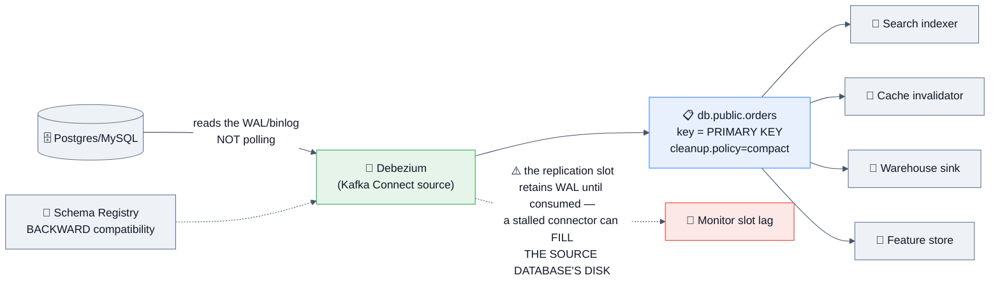

**The details that separate a good answer:**
- **Why CDC beats dual writes:** the database's log is the single source of truth, so there's no window where the DB and Kafka disagree.
- **Key by primary key + compaction** → the topic becomes a replayable snapshot of current state, so a new consumer can bootstrap by reading from the beginning.
- **The replication-slot danger** ⭐ — *"A stalled Debezium connector makes the source database retain WAL indefinitely, which can fill the **production database's** disk. That's a Kafka problem taking down your database, and it's the #1 CDC incident. I'd alert on slot lag and set a bound if the database supports one."*
- **Schema evolution:** a DDL change flows through; BACKWARD compatibility plus a schema-history topic handles it — but **consumers must be deployed before producers emit the new shape**.
- **Snapshot + streaming handoff:** the initial snapshot of a large table must not lock it; Debezium's incremental snapshotting is the modern answer.
- **`REPLICA IDENTITY` / binlog row format:** without full row images, UPDATE/DELETE events lack old values. **Naming this shows real CDC experience.**

## 7.5 🔴 Design a notification system on Kafka ★★★★☆

```
Events → ingest (idempotency key per event) → preference/policy engine
       → per-channel topics (push / email / SMS)  🔑 SEPARATE TOPICS = BULKHEADS
       → channel workers → provider APIs
       → retry with backoff → DLQ after N attempts
```
| Decision | Reasoning |
|----------|-----------|
| **Per-channel topics** | If the SMS provider is down and its consumers back up, push and email must keep flowing. **One topic with a channel field would couple them.** |
| **Key** | `userId` — so a user's notifications stay ordered relative to each other and one user's burst is confined to one partition. |
| **Idempotency** | The same business event delivered twice must not notify twice → dedup on event ID at ingest. |
| 🆕 **Share groups** | *"Notification delivery is order-independent task distribution — the canonical use case for a share group. Per-message ack, redelivery of just the failed one, and consumer scaling decoupled from partition count. This is exactly what KIP-932 was built for."* **Strong 2026 answer.** |
| **Provider rate limits** | Token-bucket per provider; a provider 429 is a retriable error, not a DLQ candidate. |
| **Quiet hours / frequency capping** | Product requirements that live in the policy engine — mention them; they're where the real complexity is. |

## 7.6 🔴 Design log/metrics ingestion at 5 TB/day ★★★★☆

```
Sizing first (always):
  5 TB/day ÷ 86,400 ≈ 58 MB/s average, peak 3× ≈ 175 MB/s   → modest for Kafka
  Storage: 5 TB × 3 (RF) × 7 days = 105 TB of broker disk 😬
  → ⭐ TIERED STORAGE is the answer: keep 12 h local, months in object storage,
     at a fraction of the cost AND with faster broker rebalancing

Design:
  • Agents (Fluent Bit / Vector) → Kafka, keyed by service or host
  • compression = zstd  → often 5–10× on log text; this is the single biggest cost lever
  • acks=1 is DEFENSIBLE here 🔑 — losing a few log lines is acceptable, and
    the throughput/latency gain is real. SAY that you're making a deliberate trade.
  • Consumers: one group → Elasticsearch/OpenSearch, another → the data lake,
    another → real-time alerting. THIS is why Kafka rather than a queue:
    three independent consumers of the same stream.
  • Retention: 24–48 h hot in Kafka; the lake is the long-term store
  • Backpressure: agents buffer locally and drop with a metric when Kafka is unavailable —
    log ingestion must NEVER take down the application it's observing
```
**The framing:** *"This is the one workload where I'd argue for weaker durability. Log lines are individually worthless and collectively valuable, so `acks=1` and aggressive compression are correct engineering, not corner-cutting — as long as I say it's a deliberate choice."*

## 7.7 🔴 Design a global multi-region event platform ★★★☆☆

| Concern | Decision |
|---------|----------|
| **Topology** | Regional clusters + **MirrorMaker 2** replication. **Not** a stretch cluster across regions — inter-region latency lands directly in your `acks=all` path. |
| **Naming** | MM2 prefixes topics with the source cluster (`us-east.orders`), which **prevents infinite replication loops** in active-active. Say this; it's the classic active-active bug. |
| **Consumer failover** | MM2's **offset translation** lets a consumer group resume in the failover region approximately where it left off — approximately, because offsets differ between clusters. |
| **Ordering** | **There is no global ordering across regions.** If you need it, you need a single home region for that key — which means cross-region write latency. State the trade honestly. |
| **Data residency** | Partition by region as a hard rule; events for EU users never leave the EU cluster, including in mirrored topics. |
| **DR** | Async replication → **RPO > 0**. Quantify it. And **test the failover**, or it's a hypothesis. |
| **Cost** | Cross-region transfer is expensive; mirror **only the topics that need it**, not everything. |

## 7.8 🟡 Design a job/task queue on Kafka 🆕 ★★★★☆

**This design changed in 2026 — that's why it's worth asking.**
```
🪦 BEFORE 4.2 — the awkward answer:
  • Partition count = your parallelism ceiling → over-partition to get concurrency
  • One slow record blocks its whole partition (head-of-line blocking)
  • No per-message ack: you commit an offset, not a record
  • Retries need separate retry topics with delays
  → Many teams simply used SQS/RabbitMQ alongside Kafka for this

✅ WITH SHARE GROUPS (KIP-932, GA in 4.2):
  • Many consumers read the SAME partition concurrently
  • Per-record ACCEPT / RELEASE / REJECT / 🆕 RENEW
  • Automatic redelivery of un-acked records
  • Delivery-count tracking → native DLQ routing
  • Consumer scaling DECOUPLED from partition count
  ⚠️ THE TRADE: you give up per-partition ordering — by design

WHEN TO USE WHICH:
  Share group    → order-independent task distribution:
                   emails, image resizing, webhook delivery, report generation
  Consumer group → anything where per-entity ordering is part of correctness:
                   order state transitions, account balance updates, CDC application
```
**The senior close:** *"Share groups are a genuine capability addition, not a free upgrade. I'd still ask whether Kafka is the right home for a pure task queue at all — if there's no replay requirement and no second consumer of the stream, SQS is less to operate. But if the events are already in Kafka for other reasons, a share group means one fewer system."*

## 7.9 Kafka design-round question bank

| Category | Questions |
|----------|-----------|
| **Core** | Order processing pipeline · Payment event flow · User activity tracking · Audit log |
| **Data** | CDC pipeline · Real-time analytics · Data lake ingestion · Feature store for ML |
| **Ops** | Log/metrics ingestion · Multi-region replication · Multi-tenant platform · Migration off a legacy broker |
| **Product** | Notification system · Feed generation · Inventory events · Fraud detection stream |
| **Hard** | Exactly-once to an external store · 10 M-message backlog recovery · Global ordering requirement · Zero-downtime cluster migration |
| 🆕 **2026** | Task queue with share groups · Cost optimization / cross-AZ · Diskless/S3-backed evaluation · LLM inference request queue |

---

# 8. 🏭 Real Production Usage at Scale

## 8.1 Who runs Kafka, and how

| Company | Scale & architecture | The lesson to quote |
|---------|---------------------|---------------------|
| **LinkedIn** | Kafka's birthplace. Runs one of the largest deployments in the world — **trillions of messages per day** across many clusters. Built **Cruise Control** (automated partition rebalancing and self-healing) and **Burrow** (lag monitoring) because operating at that scale demanded them. | *"LinkedIn built Kafka to solve the N×M integration problem — the origin story is the design rationale. And they open-sourced the operational tooling because at scale, balancing and lag monitoring are the actual work."* |
| **Uber** | One of the largest Kafka fleets; **trillions of messages/day**. Built **uReplicator** (a more reliable MirrorMaker) and **Chaperone** (end-to-end auditing that counts messages at each stage to detect loss). Kafka underpins their real-time pricing, dispatch, and analytics. | *"Uber built an end-to-end audit system because at their volume, 'did we lose anything?' is not answerable by intuition. Auditing the pipeline is itself a design requirement."* |
| **Netflix** | Kafka in the **Keystone** pipeline — trillions of events/day for real-time monitoring, analytics, and their event bus, feeding into Flink and their data platform. Run on AWS across AZs with heavy automation. | *"Netflix treats the pipeline as a product with its own SLOs — consumer lag and delivery guarantees are contracts with internal customers."* |
| **Pinterest** | Very large Kafka deployment; published extensively on **cost optimization**, autoscaling, and lag-driven scaling. | *"Pinterest's public work on Kafka cost is the best free reading on the economics — most of the bill is cross-AZ traffic and storage."* |
| **Shopify** | Kafka behind flash sales and order events; published on scaling consumers and handling extreme spikes. | Bursty commerce workloads with a hard peak. |
| **Cloudflare** | Uses Kafka heavily for pipeline and log processing; published on their **generic pipeline abstraction** and the discipline of schema enforcement across many teams. | *"Cloudflare's lesson is governance: they built shared abstractions so hundreds of teams didn't each reinvent producer/consumer semantics."* |
| **Robinhood / fintech** | Kafka for market data and order flow, with heavy emphasis on correctness and replay. | Correctness-critical streaming. |
| **Goldman Sachs / JPMorgan / Bloomberg** | Kafka for market data distribution and event sourcing, with strict audit and ordering requirements. | Regulated, ordering-sensitive workloads. |
| **Walmart / Flipkart / Swiggy / Zomato** | Order events, inventory, delivery tracking, and real-time analytics at Indian-scale peaks (festival sales are 50× spikes). | *"The interesting problem is the 50× seasonal spike, which is a capacity and backpressure design question, not a steady-state one."* |
| **Confluent** | The company founded by Kafka's creators; ships Confluent Platform/Cloud, Schema Registry, ksqlDB, and most of the connectors. | Know the distinction between Apache Kafka and Confluent's additions. |

## 8.2 The tooling ecosystem worth naming

| Tool | What it does |
|------|--------------|
| **Cruise Control** (LinkedIn) | Automated partition rebalancing, anomaly detection, and self-healing. **The answer to "how do you keep a large cluster balanced?"** |
| **Burrow** / **Kafka Lag Exporter** | Consumer-lag monitoring with a status model rather than raw numbers |
| **Debezium** | The CDC standard — database WAL/binlog → Kafka |
| **Schema Registry** (Confluent) / **Apicurio** | Versioned schemas and compatibility enforcement |
| **MirrorMaker 2** / **uReplicator** / **Cluster Linking** | Cross-cluster replication |
| **AKHQ / Kafdrop / Conduktor / Redpanda Console** | Browsing topics, consumer groups, and messages |
| **kcat (kafkacat)** | The Swiss-army CLI for producing/consuming/inspecting |
| **Strimzi** | The leading **Kubernetes operator** for Kafka |
| **ksqlDB / Flink SQL** | SQL over streams |
| **Testcontainers** / **EmbeddedKafka** | Integration testing against a real broker |

## 8.3 Managed & alternative platforms

| Platform | Differentiator | Interview-relevant caveat |
|----------|----------------|---------------------------|
| **AWS MSK** | Managed Apache Kafka; MSK Serverless option | Real Kafka, so no API surprises; **you still own partition/topic design and cost** |
| **Confluent Cloud** | The fullest feature set: registry, connectors, ksqlDB, Cluster Linking, tiered storage | Priciest; deepest ecosystem |
| **Redpanda** | **C++ rewrite, no JVM, Kafka-API-compatible**, thread-per-core; simpler ops (single binary, Raft built in) | Not Apache Kafka — a compatible reimplementation. Excellent tail latency; smaller ecosystem |
| **WarpStream** | **S3-backed, zero-disk**, Kafka-compatible; agents are stateless | Built to eliminate **cross-AZ replication cost** — often the largest line item. Higher latency by design |
| **AutoMQ** | Kafka codebase re-architected on object storage | Same cost thesis as WarpStream, closer to upstream Kafka |
| **Aiven** (incl. **Inkless**) | Managed Kafka; **Inkless is their diskless fork implementing the KIP-1150 direction** | The only running diskless implementation as of 2026 |
| **Apache Pulsar** | Separate serving (brokers) and storage (BookKeeper) tiers; native multi-tenancy, tiered storage, and queue+stream in one | More moving parts to operate; smaller ecosystem than Kafka |

> [!TIP]
> **A strong answer to "would you use Kafka or an alternative?"**: *"Apache Kafka if I want the ecosystem — Connect, Debezium, Streams, and every vendor integration — and my team already knows it. **Redpanda** if operational simplicity and tail latency matter more than ecosystem breadth. **WarpStream or AutoMQ** if I'm in the cloud at scale and my bill is dominated by cross-AZ replication, which it usually is. The interesting thing in 2026 is that Apache Kafka has **accepted KIP-1150** to move in that same object-storage direction, so the architectural argument has been won even though the implementation isn't in mainline yet."*

---

# 9. 🐛 Common Bugs & Production Incidents

## 9.1 The incident catalogue

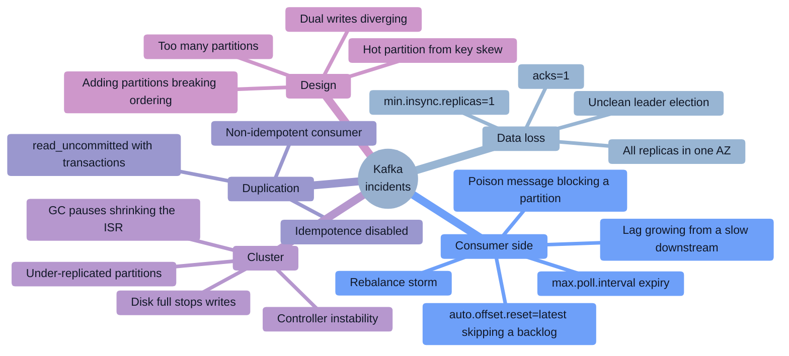

## 9.2 Incident deep-dives

### 🔴 Incident 1: "The consumer group stopped processing entirely" — the rebalance storm
**Symptom:** Lag climbing steadily; consumers logging "Attempt to heartbeat failed since group is rebalancing" in a loop; zero throughput despite healthy CPU.
**Root cause:** A downstream API slowed from 50 ms to 2 s. With `max.poll.records=500`, one poll cycle took over 5 minutes and exceeded `max.poll.interval.ms`. The coordinator evicted the consumer → rebalance → the partitions moved to another consumer that was *also* slow → **the group rebalanced forever and processed nothing.**
**Fix now:** **Lower `max.poll.records`** (to 50, or 10) so each cycle finishes well inside the interval. Restart the group.
**Permanent fix:** `max.poll.records` sized against worst-case per-record latency, not average; move slow work off the poll thread; `CooperativeStickyAssignor` or **the KIP-848 protocol on 4.x**; **static membership (`group.instance.id`)** so deploys don't rebalance; and an alert on rebalance rate, not just lag.
**Why this is the canonical Kafka incident:** the symptom (lag) points at capacity, the cause is a timeout, and the intuitive fix (add consumers) makes it worse.

### 🔴 Incident 2: "We lost 40,000 messages during a broker failure"
**Symptom:** After a broker crash, records that producers had successfully acknowledged were missing.
**Root cause:** `acks=1`. The leader acknowledged and died before followers replicated. Compounding factor: `min.insync.replicas` was left at the default of 1, so even `acks=all` would have degraded silently.
**Fix:** **`acks=all` + `replication.factor=3` + `min.insync.replicas=2`**, and `unclean.leader.election.enable=false`. Verify `broker.rack` so replicas actually span AZs.
**The lesson to state:** *"Replication factor is necessary but not sufficient. RF, `min.insync.replicas`, and `acks` are **one decision made in three places**, and getting any of them wrong makes the other two decorative."*

### 🔴 Incident 3: "One bad message stopped the pipeline for 6 hours"
**Symptom:** A single partition's lag grows while others are fine. The consumer logs the same deserialization error every few seconds.
**Root cause:** A malformed record. The consumer threw, didn't commit, re-polled the same record, and **retried forever** — blocking that partition and everything behind it.
**Fix now:** Identify the offset, and either fix the consumer to skip it or `seek()` past it (**recording exactly what was skipped**).
**Permanent fix:** **A DLQ from day one.** Distinguish retriable from non-retriable exceptions (`ErrorHandlingDeserializer` in Spring, or try/catch around deserialization), bound the retries, and alert on DLQ depth. **A poison message should cost you one record, not one partition.**

### 🔴 Incident 4: "The new consumer group processed nothing"
**Symptom:** A new service deployed to consume a topic with 3 months of history reads only new messages.
**Root cause:** **`auto.offset.reset=latest` (the default).** A new group with no committed offset starts at the end, silently skipping the entire backlog.
**Fix:** `earliest` when bootstrapping matters. **The general lesson:** a new consumer group's starting position is a design decision, not a default to inherit — and this bites people constantly.

### 🔴 Incident 5: "Producers started failing with NotEnoughReplicas"
**Symptom:** `NotEnoughReplicasException`; producer error rate spikes; consumers are fine.
**Root cause:** Two brokers were restarted too close together during a rolling upgrade. The ISR dropped below `min.insync.replicas=2`, so the broker **correctly refused writes** rather than risking data loss.
**Fix now:** Wait for the ISR to recover; check `UnderMinIsrPartitionCount`.
**Permanent fix:** **Rolling restarts must wait for `UnderReplicatedPartitions` to reach 0 between brokers** — that's the gate, not a fixed sleep. **The framing that scores:** *"This wasn't a failure — the system did exactly what we configured it to do. It refused to accept data it couldn't make durable. The bug was the restart procedure, not Kafka."*

### 🔴 Incident 6: "Disk filled and the cluster stopped accepting writes"
**Symptom:** Brokers log I/O errors; produce requests fail; partitions go offline.
**Root cause:** A topic created without a retention override inherited an unintended default (or `retention.ms=-1`), and a new high-volume producer filled the disk.
**Fix now:** Reduce retention on the offending topic (deletion happens at **segment** granularity, so it isn't instant), or add storage. ⚠️ **Never delete log files by hand.**
**Permanent fix:** Disk alerts at 70%; retention policy enforced at topic creation; **tiered storage** so retention isn't bounded by broker disk; and a topic-creation path with guardrails.

### 🔴 Incident 7: "Duplicate charges after a deploy"
**Symptom:** Customers charged twice; the count correlates with a rolling deployment.
**Root cause:** Rolling restarts caused rebalances; consumers were evicted mid-batch after processing but before committing; the new owners **reprocessed** — at-least-once working exactly as designed. **The consumer was not idempotent.**
**Fix:** An idempotency key on the payment operation with a unique constraint, written **in the same transaction as the charge** (§4.3 Q30). Plus static membership to avoid unnecessary rebalances during deploys.
**The lesson:** *"Duplicates aren't a Kafka bug — they're the contract. The bug is a consumer that assumes exactly-once delivery it was never promised."*

### 🔴 Incident 8: "Latency tripled after we added partitions"
**Symptom:** End-to-end latency worsened after increasing partitions from 12 to 200 to "improve throughput."
**Root cause:** Producer batches became smaller and thinner across many more partitions (worse batching → worse compression → more requests), replication fetch overhead grew, and each consumer now managed far more partitions.
**Fix:** Right-size partitions to the actual required consumer parallelism, and check that `linger.ms`/`batch.size` still fill batches.
**The lesson:** *"Partitions are not a throughput dial you turn up. There's an optimum, and past it you pay in latency, file handles, replication overhead, and rebalance time — plus, on the way, you rehashed every key and broke per-key ordering across the change."*

### 🔴 Incident 9: "The Debezium connector stalled and took down the production database"
**Symptom:** The source Postgres ran out of disk. The application, not Kafka, went down.
**Root cause:** The CDC connector stopped consuming; the **replication slot** retained WAL indefinitely; `pg_wal` filled the database's disk.
**Fix now:** Restart or remove the connector/slot (⚠️ dropping the slot means a re-snapshot).
**Permanent fix:** Alert on **replication slot lag** on the source database, bound WAL retention where the database supports it, and treat connector health as a **database** alert, not just a pipeline one. **This is the highest-blast-radius CDC incident and a great thing to raise unprompted.**

### 🔴 Incident 10: "Transactions worked in test but consumers saw aborted data"
**Symptom:** A transactional producer aborts on failure, yet downstream consumers process the aborted records anyway.
**Root cause:** The consumer's **`isolation.level` was left at the default `read_uncommitted`.**
**Fix:** Set `read_committed` on every consumer of a transactional topic.
**The related failure:** a long-running open transaction stalls the **LSO**, so `read_committed` consumers stop advancing entirely — which looks like a consumer bug but is a producer problem. Bound it with `transaction.timeout.ms`.

## 9.3 Error messages worth recognizing

| Error | Meaning | Action |
|-------|---------|--------|
| `NotEnoughReplicasException` | ISR < `min.insync.replicas` | Broker(s) down or lagging; **the system is protecting you** |
| `NotLeaderOrFollowerException` | Stale metadata after a leader change | Transient; the client refreshes metadata and retries |
| `TimeoutException` (producer) | `delivery.timeout.ms` exceeded | Broker overload, network, or an unreachable partition leader |
| `RecordTooLargeException` | Exceeds `max.request.size` / `message.max.bytes` | Raise limits together, or use the **claim-check** pattern |
| `CommitFailedException` | The consumer was kicked out before the commit landed | **`max.poll.interval.ms` exceeded** — lower `max.poll.records` |
| `ProducerFencedException` | Another producer with the same `transactional.id` has a newer epoch | **Fatal — close and exit.** Do not retry |
| `OutOfOrderSequenceException` | Idempotent-producer sequence gap (often after a broker issue) | Fatal for that producer; recreate it |
| `InvalidProducerEpochException` | Zombie fencing | Fatal |
| `UnknownTopicOrPartitionException` | Topic missing, or metadata not yet propagated | Check auto-create settings and ACLs |
| `GroupAuthorizationException` / `TopicAuthorizationException` | Missing ACLs | Expected when authorization is configured correctly |
| `OffsetOutOfRangeException` | The committed offset aged out of retention | `auto.offset.reset` decides what happens next |
| `InconsistentGroupProtocolException` | Members using incompatible assignors/protocols | Common **mid-migration to KIP-848** — align clients |
| `CLUSTER_AUTHORIZATION_FAILED` on transactions | Missing `IdempotentWrite`/transaction ACLs | Grant them |

## 9.4 The debugging toolkit

```bash
# 🔧 First five commands on any Kafka problem
kafka-consumer-groups.sh --bootstrap-server $B --describe --group $G   # lag PER PARTITION
kafka-topics.sh --bootstrap-server $B --describe --topic $T            # ISR, leaders, config
kafka-topics.sh --bootstrap-server $B --describe --under-replicated-partitions
kafka-topics.sh --bootstrap-server $B --describe --unavailable-partitions
kafka-metadata-quorum.sh --bootstrap-server $B describe --status       # 🆕 KRaft health

# 🔧 Inspect actual data
kafka-console-consumer.sh --bootstrap-server $B --topic $T \
  --partition 3 --offset 1000 --max-messages 10 \
  --property print.key=true --property print.timestamp=true --property print.headers=true

kafka-dump-log.sh --files /data/kafka/orders-0/00000000000000000000.log --print-data-log
kafka-get-offsets.sh --bootstrap-server $B --topic $T --time -1        # log end offsets
kafka-get-offsets.sh --bootstrap-server $B --topic $T --time -2        # earliest offsets

# 🔧 Cluster & balance
kafka-log-dirs.sh --bootstrap-server $B --describe --broker-list 1,2,3 # disk per partition
kafka-broker-api-versions.sh --bootstrap-server $B                     # client/broker compat

# 🔧 Reproduce & measure
kafka-producer-perf-test.sh --topic perf --num-records 1000000 --record-size 1000 \
  --throughput -1 --producer-props bootstrap.servers=$B acks=all compression.type=lz4
kafka-consumer-perf-test.sh --bootstrap-server $B --topic perf --messages 1000000
```

```properties
# 🔧 Client-side settings that make debugging possible
# Producer/consumer: enable client metrics and interceptors for tracing
interceptor.classes=io.opentelemetry.instrumentation.kafkaclients.TracingProducerInterceptor
client.id=billing-consumer-pod-3        # ✅ shows up in broker logs, quotas, and metrics
# Always propagate a correlation id in record HEADERS — traces don't cross Kafka by themselves
```

---
# 10. 🔐 Security

## 10.1 The security model

```mermaid
%%{init: {'theme':'base','themeVariables':{'background':'#ffffff','mainBkg':'#eef2f7','primaryColor':'#eef2f7','primaryTextColor':'#111827','primaryBorderColor':'#64748b','secondaryColor':'#e8f0fe','tertiaryColor':'#f1f5f9','lineColor':'#475569','textColor':'#111827','clusterBkg':'#f8fafc','clusterBorder':'#94a3b8','edgeLabelBackground':'#ffffff','titleColor':'#111827','actorBkg':'#eef2f7','actorTextColor':'#111827','actorBorder':'#64748b','actorLineColor':'#475569','signalColor':'#111827','signalTextColor':'#111827','noteBkgColor':'#fff4e5','noteTextColor':'#111827','noteBorderColor':'#d97706','labelBoxBkgColor':'#eef2f7','labelBoxBorderColor':'#64748b','labelTextColor':'#111827','loopTextColor':'#111827','altBackground':'#f8fafc'}}}%%
flowchart TB
    ATT["🕵️ Threats"]
    ATT -->|"1. Sniffing the wire"| L1["🔒 ENCRYPTION IN TRANSIT<br/>TLS on client↔broker,<br/>broker↔broker, and controller↔broker"]
    ATT -->|"2. Impersonation"| L2["🔑 AUTHENTICATION<br/>SASL/SCRAM · SASL/GSSAPI (Kerberos) ·<br/>mTLS · SASL/OAUTHBEARER"]
    ATT -->|"3. Reading/writing<br/>the wrong topic"| L3["🚦 AUTHORIZATION<br/>ACLs per resource:<br/>Topic · Group · Cluster ·<br/>TransactionalId · DelegationToken"]
    ATT -->|"4. Noisy tenant<br/>starving others"| L4["📊 QUOTAS<br/>produce/fetch byte rate +<br/>request percentage per user/client"]
    ATT -->|"5. Stolen disk<br/>or backup"| L5["💾 ENCRYPTION AT REST<br/>volume-level (no native<br/>message encryption in Kafka)"]
    ATT -->|"6. Sensitive data<br/>in the log"| L6["🕶️ FIELD-LEVEL<br/>encrypt/tokenize BEFORE producing;<br/>Kafka stores opaque bytes"]

    style ATT fill:#fce8e6,stroke:#ea4335,color:#111827
    style L1 fill:#e6f4ea,stroke:#34a853,color:#111827
    style L2 fill:#e6f4ea,stroke:#34a853,color:#111827
    style L3 fill:#e8f0fe,stroke:#4285f4,color:#111827
    style L4 fill:#e8f0fe,stroke:#4285f4,color:#111827
    style L5 fill:#fff4e5,stroke:#f4b400,color:#111827
    style L6 fill:#fff4e5,stroke:#f4b400,color:#111827
```

## 10.2 Authentication

| Mechanism | When to use | Notes |
|-----------|-------------|-------|
| **SASL/SCRAM-SHA-512** ⭐ | The common default | Credentials stored in Kafka's own metadata (🆕 KRaft) — no external dependency |
| **SASL/GSSAPI (Kerberos)** | Enterprise environments with existing Kerberos | Operationally heavy but integrates with corporate identity |
| **mTLS** | Service-to-service in a mesh/zero-trust setup | The client certificate *is* the identity; certificate rotation is the operational cost |
| **SASL/OAUTHBEARER** | Modern token-based identity (OIDC) | Increasingly the cloud-native choice |
| `PLAINTEXT` | **Never in production** | No auth, no encryption |

```properties
# Broker listener configuration
listeners=SASL_SSL://:9093,CONTROLLER://:9094
security.inter.broker.protocol=SASL_SSL
sasl.enabled.mechanisms=SCRAM-SHA-512
ssl.keystore.location=/etc/kafka/kafka.keystore.jks
ssl.truststore.location=/etc/kafka/kafka.truststore.jks
ssl.client.auth=required                     # mTLS if you want cert-based identity too

# Authorization
authorizer.class.name=org.apache.kafka.metadata.authorizer.StandardAuthorizer  # 🆕 KRaft
super.users=User:admin
allow.everyone.if.no.acl.found=false         # ✅ deny by default — the critical line
```

## 10.3 Authorization — ACLs

```bash
# Producer: needs WRITE on the topic (+ IdempotentWrite on the cluster for idempotence)
kafka-acls.sh --bootstrap-server $B --add --allow-principal User:orders-svc \
  --operation Write --operation Describe --topic orders

# Consumer: needs READ on the topic AND READ on the consumer GROUP ⚠️ (commonly forgotten)
kafka-acls.sh --bootstrap-server $B --add --allow-principal User:billing-svc \
  --operation Read --operation Describe --topic orders
kafka-acls.sh --bootstrap-server $B --add --allow-principal User:billing-svc \
  --operation Read --group billing

# Transactional producer additionally needs Write/Describe on the TransactionalId
kafka-acls.sh --bootstrap-server $B --add --allow-principal User:enricher \
  --operation Write --operation Describe --transactional-id order-enricher

# Prefixed ACLs — the multi-tenancy building block
kafka-acls.sh --bootstrap-server $B --add --allow-principal User:team-a \
  --operation All --topic 'team-a.' --resource-pattern-type prefixed
```

> [!WARNING]
> **The two ACL mistakes that cause real outages:** (1) **forgetting the `Group` READ ACL** — a consumer with topic access but no group access fails with `GroupAuthorizationException` and people spend an hour looking at the topic; (2) leaving **`allow.everyone.if.no.acl.found=true`**, which makes ACLs decorative for any resource you forgot to cover. **Deny by default, always.**

## 10.4 Quotas — the multi-tenancy control

```bash
kafka-configs.sh --bootstrap-server $B --alter --add-config \
  'producer_byte_rate=10485760,consumer_byte_rate=20971520,request_percentage=200' \
  --entity-type users --entity-name team-a
```
| Quota | Protects against |
|-------|------------------|
| `producer_byte_rate` / `consumer_byte_rate` | A tenant saturating network or disk bandwidth |
| `request_percentage` | A tenant saturating broker **request-handler threads** — the subtler and often more damaging one |
| `controller_mutation_rate` | Runaway topic/partition creation |

**How throttling works:** Kafka doesn't reject over-quota requests; it **delays the response**, which naturally slows the client. **Naming that mechanism is a nice detail** — clients see latency, not errors.

## 10.5 Encryption at rest and field-level protection

- **Kafka has no native message encryption.** Data at rest is protected by **volume/disk encryption** (LUKS, EBS encryption, cloud CMEK).
- **For genuinely sensitive fields**, encrypt or tokenize **before producing** — Kafka then stores opaque bytes. ⚠️ **Consequences to name:** you lose the ability to filter/aggregate on those fields in stream processing, key-based partitioning on an encrypted field is meaningless, and **key rotation across retained data is genuinely hard**.
- **Compaction + tombstones and GDPR erasure:** deleting a person's data from a log is awkward. **Crypto-shredding** is the clean answer — encrypt per-subject with a per-subject key and delete the key.
- **PII in logs/traces** is the most common accidental leak — redact at the client library.

## 10.6 Security checklist

- [ ] TLS on **all** listeners: client↔broker, broker↔broker, controller↔broker
- [ ] SASL/SCRAM, Kerberos, mTLS, or OAUTHBEARER — never `PLAINTEXT`
- [ ] **`allow.everyone.if.no.acl.found=false`**
- [ ] ACLs per principal on **Topic, Group, TransactionalId, and Cluster**
- [ ] Prefixed ACLs for multi-tenant topic namespaces
- [ ] Quotas per user/client, including `request_percentage`
- [ ] `auto.create.topics.enable=false` — no accidental topics from a typo
- [ ] `delete.topic.enable` controlled; destructive admin ops restricted to `super.users`
- [ ] Volume encryption + encrypted backups
- [ ] Sensitive fields encrypted/tokenized **before** producing
- [ ] Credentials in a secrets manager with rotation; never in config files in git
- [ ] Audit logging of admin operations
- [ ] ⚠️ **Understand that TLS disables the zero-copy path** — budget for the throughput cost

---

# 11. ⚡ Performance

## 11.1 Why Kafka is fast — the four mechanisms

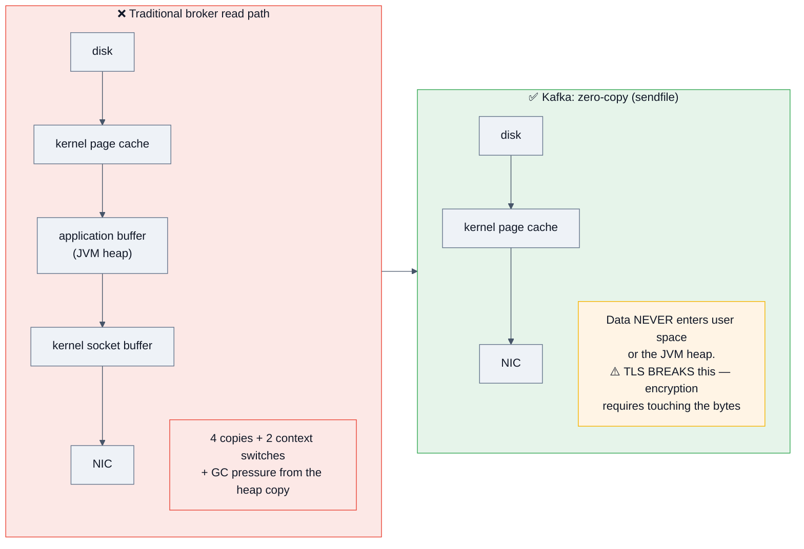

**In order of importance:**
1. **Sequential I/O** — append-only means no random seeks. Sequential disk throughput is orders of magnitude better than random, and can rival random RAM access.
2. **OS page cache, not an application cache** — Kafka keeps a **small JVM heap** (typically 6 GB) and lets the OS cache the log. **No GC pressure from cached data, and the cache survives a broker restart.**
3. **Zero-copy (`sendfile`)** — page cache → NIC with no user-space copy.
4. **Batching + compression at the producer** — the broker stores and forwards the compressed batch untouched.

> [!TIP]
> **The follow-up that catches people:** *"Does TLS affect this?"* → **Yes, significantly.** Encryption requires the bytes to pass through user space, so **zero-copy is disabled**. That's a real, measurable throughput cost, and it's the honest answer to "what does security cost us?"

## 11.2 Tuning: producer, consumer, broker

```properties
# ── PRODUCER: throughput-oriented ──────────────────
linger.ms=20-100                # ⏳ the single biggest throughput dial
batch.size=131072               # 128 KB
compression.type=lz4            # or zstd for a better ratio
buffer.memory=134217728         # 128 MB
acks=all
enable.idempotence=true
max.in.flight.requests.per.connection=5

# ── PRODUCER: latency-oriented ─────────────────────
linger.ms=0
batch.size=16384
compression.type=none           # or lz4 — compression costs a little latency
acks=1                          # ⚠️ ONLY if the durability trade is deliberate

# ── CONSUMER ───────────────────────────────────────
fetch.min.bytes=65536           # ⏳ wait for a decent batch (throughput) vs 1 (latency)
fetch.max.wait.ms=100
max.partition.fetch.bytes=1048576
max.poll.records=500            # 🔑 tune against WORST-CASE per-record processing time
enable.auto.commit=false

# ── BROKER ─────────────────────────────────────────
num.network.threads=8           # ~= cores
num.io.threads=16               # ~= 2× cores (disk-bound work)
num.replica.fetchers=4          # raise if replication lags on a high-throughput cluster
socket.send.buffer.bytes=1048576
socket.receive.buffer.bytes=1048576
log.flush.interval.messages=Long.MAX   # ✅ let the OS flush — Kafka relies on replication,
                                       #    NOT fsync, for durability. Forcing fsync per
                                       #    message destroys throughput for little gain.
compression.type=producer       # ✅ pass through — do NOT recompress
num.recovery.threads.per.data.dir=4
```

```bash
# ── OS-level tuning that actually matters ──────────
vm.swappiness=1                 # ✅ never swap a broker
vm.dirty_ratio=60 / vm.dirty_background_ratio=5
net.core.wmem_max / rmem_max    # raise for high-throughput networks
ulimit -n 100000                # ✅ file handles: many partitions × segments × connections
# JVM: SMALL heap (~6 GB) + G1GC. The page cache does the caching, not the heap.
```

> [!WARNING]
> **The JVM heap counter-intuition, and a great thing to volunteer:** *"Kafka brokers want a **small** heap — around 6 GB even on a machine with 128 GB of RAM. All the remaining memory should be left to the **OS page cache**, which is what actually serves reads. Giving Kafka a 64 GB heap makes it slower, because you've stolen memory from the page cache and given yourself long GC pauses — and a long GC pause causes ISR shrink and session timeouts, so it becomes a durability and stability problem, not just a latency one."*

## 11.3 Where the bottleneck usually is

| Symptom | Likely cause | Confirm with |
|---------|--------------|--------------|
| Low producer throughput | **`linger.ms=0` with small batches**, or synchronous `send().get()` | Check batch size metrics; look for `.get()` in the send path |
| Consumer can't keep up | **Downstream dependency**, not Kafka | Time the processing vs the poll |
| High broker CPU | **Recompression** (`compression.type` mismatch), TLS, or too many small requests | Broker CPU profile; check topic vs producer compression settings |
| High broker latency | Disk saturation, under-replicated partitions, GC pauses | `RequestHandlerAvgIdlePercent`, disk I/O wait, GC logs |
| Replication lag | Too few `num.replica.fetchers`, network saturation, or a slow follower disk | `UnderReplicatedPartitions`, follower fetch metrics |
| Latency spikes every N seconds | GC pauses, or segment rolls | GC logs; `log.segment.bytes` |
| One partition slow | **Hot key / data skew** | **Lag per partition** |
| Throughput drops after adding partitions | Thinner batches, more overhead | Producer batch-size metrics before/after |

## 11.4 Benchmarking properly

```bash
kafka-producer-perf-test.sh --topic bench --num-records 5000000 --record-size 1024 \
  --throughput -1 --producer-props bootstrap.servers=$B acks=all \
  linger.ms=20 batch.size=131072 compression.type=lz4

kafka-consumer-perf-test.sh --bootstrap-server $B --topic bench \
  --messages 5000000 --threads 4
```
**Rules to state:**
1. **Benchmark your record size and key distribution** — 100-byte records and 10 KB records behave completely differently, and skewed keys behave nothing like uniform ones.
2. **Report p99, not just throughput.** A benchmark showing 1 M msg/s at a p99 of 3 seconds is not a success.
3. **Run long enough to cross a segment roll and a GC cycle.**
4. **Include replication** — a single-broker benchmark tells you almost nothing about a production cluster with `acks=all`.
5. **Test with TLS if you'll run TLS**, because zero-copy loss is a real delta.
6. **Change one variable at a time**, and re-run the baseline last to detect drift.

## 11.5 The performance checklist

- [ ] `linger.ms` and `batch.size` tuned (not left at the latency-optimized defaults)
- [ ] Compression enabled (`lz4` or `zstd`) and broker set to `compression.type=producer`
- [ ] No synchronous `send().get()` in the hot path
- [ ] `max.poll.records` sized against **worst-case** processing time
- [ ] Consumers scaled to (but not beyond) the partition count
- [ ] Partition count right-sized — not inflated "for throughput"
- [ ] **Small JVM heap (~6 GB)**, the rest left to the page cache
- [ ] `ulimit -n` raised; swap effectively disabled
- [ ] Downstream batching (bulk writes) instead of per-record I/O
- [ ] Tiered storage considered for retention-heavy topics
- [ ] Rack-aware **follower fetching** to cut cross-AZ traffic (and cost)
- [ ] Benchmarked with **replication and TLS** matching production

---

# 12. ✅ Best Practices

## 12.1 Topic & event design

| ✅ Do | Why |
|-------|-----|
| **Name topics consistently:** `domain.entity.event-type` (e.g. `orders.order.placed`) | Discoverability, ACL prefixing, and ownership all key off naming |
| **One topic per domain event**, not one giant `events` topic | Independent retention, ACLs, partition counts, and consumer isolation |
| **Choose the key deliberately** — it *is* your ordering and distribution decision | The most consequential design choice in Kafka |
| **Model events as facts** (`order.placed`), not commands (`process-order`) | Facts are consumable by anyone; commands recreate point-to-point coupling |
| **Include event ID, timestamp, version, and correlation ID** in every event | Dedup, ordering defence, schema evolution, and tracing |
| **Event-carried state transfer** — put enough data in the event | Otherwise consumers call back to the producer and you've rebuilt the N×M problem |
| **Set retention explicitly at creation** | Inherited defaults are how disks fill |
| **Over-provision partitions modestly** | You can add but not remove, and adding rehashes keys |
| **Use a schema registry with enforced compatibility from day one** | Retrofitting schemas onto 200 topics is brutal |

## 12.2 Producer & consumer practice

| ✅ Do | ❌ Don't |
|-------|---------|
| `acks=all` + `min.insync.replicas=2` + RF=3 | `acks=1` without a deliberate, stated reason |
| `enable.idempotence=true` (default 3.0+) | Disable it to "go faster" |
| Handle the send callback's exception | Fire and forget without error handling |
| Async `send()` with callbacks | `send().get()` in a loop |
| `close()`/`flush()` on shutdown | Losing buffered records on exit |
| **Manual offset commits after processing** | `enable.auto.commit=true` for anything that matters |
| **Idempotent consumers, always** | Assuming exactly-once delivery you weren't promised |
| **A DLQ from day one** | Retrying a poison message forever |
| Distinguish retriable from permanent errors | Retrying a validation failure three times |
| `max.poll.records` tuned to worst-case latency | Raising `max.poll.interval.ms` to paper over slowness |
| **Static membership for rolling deploys** | Accepting a rebalance per pod restart |
| Correlation IDs in headers | Losing the trace at the Kafka boundary |
| Graceful shutdown (`consumer.close()`) | Letting the group wait out the session timeout |

## 12.3 Operations

- **The durability triple is one decision:** `replication.factor=3`, `min.insync.replicas=2`, `acks=all`. Set them together or not at all.
- **`unclean.leader.election.enable=false`** unless you've explicitly chosen availability over correctness for that topic.
- **`auto.create.topics.enable=false`** — a typo shouldn't create a topic with default settings.
- **Rack awareness (`broker.rack`)** so replicas span AZs. Replication without failure-domain spread is theatre.
- **Rolling restarts gate on `UnderReplicatedPartitions == 0`**, not on a timer.
- **Alert on:** lag **trend** per consumer group, `UnderMinIsrPartitionCount` (page), `OfflinePartitionsCount` (page), `ActiveControllerCount != 1`, disk > 70%, DLQ depth, and rebalance rate.
- **Lag SLOs per consumer group, with a named owner.** "The pipeline is slow" needs an owner.
- **Cruise Control** (or equivalent) for balance; **tiered storage** for retention economics.
- **Test the DR failover** on a schedule. An untested MirrorMaker setup is a hypothesis.
- **Capacity headroom for losing an entire AZ** — which means running below 50% of peak capacity in a 3-AZ deployment.

## 12.4 Development workflow

- **Local Kafka = the production major version** (Docker Compose, or Testcontainers in tests).
- **Integration-test against a real broker** (Testcontainers/EmbeddedKafka) — mocks hide rebalance, offset, and serialization behaviour, which is exactly where the bugs are.
- **Test the failure paths in CI:** a poison message, a consumer restart mid-batch, a duplicate delivery. **If you've never tested reprocessing, you don't know your consumer is idempotent.**
- **A shared client library** with the right defaults baked in — the highest-leverage thing a platform team can ship.
- **Schema compatibility checks in CI**, so a breaking change fails the build rather than the pipeline.
- **Review checklist for any Kafka PR:** What's the key? Is the consumer idempotent? Where's the DLQ? What are the `acks`? What happens on a rebalance mid-batch?

---

# 13. 🚫 Anti-patterns

| ❌ Anti-pattern | Why it's bad | ✅ Instead |
|-----------------|--------------|-----------|
| **Using Kafka as a request/response transport** | Kafka has no correlation or response routing; you'll build a fragile RPC on top of a log | gRPC/HTTP for synchronous calls |
| **Dual writes (DB + Kafka separately)** | A crash between them diverges the two **permanently** | **Transactional outbox** or CDC |
| **`acks=1` by default** | Silent data loss on leader failure | `acks=all` + `min.insync.replicas=2` |
| **`min.insync.replicas=1` with RF=3** | `acks=all` degrades to one replica **without any error** | `min.insync.replicas=2` |
| **`min.insync.replicas=3` with RF=3** | **Any** single broker restart stops writes | Keep it at RF−1 |
| **Enabling unclean leader election casually** | Trades silent data loss for availability | Keep it `false` unless the data is genuinely lossy |
| **All replicas in one AZ** | Redundancy that fails together | `broker.rack` across AZs |
| **Non-idempotent consumers** | At-least-once **guarantees** you'll see duplicates | Idempotency keys, upserts, or conditional updates |
| **No DLQ** | One poison message blocks a partition indefinitely | Bounded retries → DLQ → alert |
| **Retrying non-retriable errors** | Wastes time and delays the inevitable | Classify exceptions; fail fast on validation errors |
| **`enable.auto.commit=true` with slow processing** | Unpredictable loss *or* duplication | Manual commit after processing |
| **Raising `max.poll.interval.ms` to fix rebalances** | Papers over the real problem and slows failure detection | **Lower `max.poll.records`**; move slow work off the poll thread |
| **Over-partitioning "for throughput"** | Worse latency, more file handles, slower rebalance and replication | Right-size to required consumer parallelism |
| **Adding partitions to a keyed topic casually** | **Rehashes keys → breaks per-key ordering across the change** | Size up front; if you must, plan the ordering impact |
| **Random UUID keys on an ordered topic** | Destroys ordering and any partition locality | Key by the entity whose order matters |
| **One giant `events` topic for everything** | Slow consumers block fast ones; no per-event retention, ACLs, or scaling | A topic per domain event |
| **Unbounded retention with no reason** | The disk bill grows forever; nobody knows why | Explicit retention per topic; tiered storage for long windows |
| **Large messages (multi-MB) in Kafka** | Hurts batching, replication, GC, and rebalance time | **Claim-check**: blob in object storage, reference in Kafka |
| **No schema registry** | 200 incompatible event shapes within two years | Registry + enforced compatibility in CI |
| **Consumers calling back to the producer's API for details** | Rebuilds the N×M coupling Kafka removed | **Event-carried state transfer** |
| **Reading with `read_uncommitted` from a transactional topic** | You process **aborted** records | `isolation.level=read_committed` |
| **`send().get()` in a loop** | Turns async batching into synchronous round trips — the #1 throughput bug | Async with callbacks, or batch then flush |
| **A giant JVM heap on brokers** | Steals the page cache and causes GC pauses that shrink the ISR | ~6 GB heap; leave RAM to the OS |
| **Topics with no owner** | Nobody knows the retention, the schema, or who to page | Ownership recorded at creation |
| **Skipping the ZK→KRaft migration path** | You **cannot** upgrade a ZooKeeper cluster directly to 4.x | Migrate on 3.x first, verify, then upgrade |
| **Assuming exactly-once reaches your database** | Kafka transactions don't cover external sinks | At-least-once + an idempotent sink |
| **Adopting Kafka for 50 messages/second** | Enormous operational cost for no benefit | A database queue or SQS |

---
# 14. 📊 Comparison Tables

## 14.1 Kafka vs RabbitMQ vs SQS vs Pulsar ★★★★★

| Dimension | **Kafka** | **RabbitMQ** | **AWS SQS** | **Apache Pulsar** |
|-----------|-----------|--------------|-------------|-------------------|
| Model | **Distributed log** | Broker with exchanges & queues | Managed queue | Log + queue, **separated compute/storage** |
| Message retained after consume | ✅ **Yes (retention-based)** | ❌ Deleted on ack | ❌ Deleted on ack | ✅ Yes |
| **Replay** | ✅ **Rewind to any offset** | ❌ | ❌ (SQS) | ✅ |
| Multiple independent consumers | ✅ **Consumer groups** | ⚠️ Via fan-out exchanges (copies) | ❌ (SNS+SQS for fan-out) | ✅ Subscriptions |
| Ordering | **Per partition** | Per queue | FIFO queues only (lower throughput) | Per partition |
| Throughput | **Very high** (millions/sec) | Moderate (tens of thousands/sec) | High (managed) | Very high |
| Routing complexity | Simple (topic + key) | ✅ **Rich** (direct/topic/fanout/headers) | Simple | Moderate |
| Per-message ack | 🆕 **Yes, via share groups (4.2)** | ✅ Native | ✅ Native | ✅ Native |
| Priority queues | ❌ | ✅ | ❌ | ⚠️ Limited |
| Delayed/scheduled delivery | ❌ (needs a pattern) | ✅ (plugin) | ✅ | ✅ |
| Ops burden | ⭐⭐⭐⭐ | ⭐⭐⭐ | ⭐ (none) | ⭐⭐⭐⭐⭐ |
| Multi-tenancy | Via ACLs + quotas | Virtual hosts | Per-queue | ✅ **Native tenants/namespaces** |
| Geo-replication | MirrorMaker 2 | Federation/shovel | Cross-region via SNS | ✅ **Built-in** |
| **Pick it when** | **Replay, multiple consumers, high throughput, an event backbone** | **Complex routing, per-message workflow semantics, priorities** | **You want a queue and zero ops** | Native multi-tenancy + tiered storage + both models |

**The answer:** *"Kafka when you need a **durable, replayable log with multiple independent consumers** — that's the capability nothing else on this list gives you as cleanly. RabbitMQ when the value is in **routing and per-message semantics**. SQS when you want a queue and no operational burden at all. And note that **Kafka 4.2's share groups close much of the queue-semantics gap** — the choice is less binary than it was two years ago."*

## 14.2 Kafka vs Kafka-compatible alternatives ★★★★☆ 🆕

| | **Apache Kafka 4.x** | **Redpanda** | **WarpStream** | **AutoMQ** |
|---|---|---|---|---|
| Implementation | Java/Scala, JVM | **C++, no JVM**, thread-per-core | Go, **stateless agents** | Kafka codebase on object storage |
| Storage | Local disk (+ tiered storage) | Local disk (+ tiered) | **S3 only — zero disk** | **S3-backed** |
| Consensus | **KRaft (built in)** | Raft (built in) | S3 as the source of truth | S3 + metadata |
| Kafka API | Native | ✅ Compatible | ✅ Compatible | ✅ Compatible |
| Cross-AZ replication cost | ⚠️ **Often the biggest line item** | Same | ✅ **Eliminated** (S3 is the replication) | ✅ Eliminated |
| Latency | Low | **Lowest tail latency** | Higher (S3 round trips) | Moderate |
| Ops complexity | Moderate (much better post-KRaft) | **Low — single binary** | Very low (stateless) | Low |
| Ecosystem | ✅ **The whole ecosystem** | Compatible with most | Compatible | Compatible |
| **Pick it when** | You want the ecosystem and the standard | Simplicity + tail latency | Cloud cost dominates | Cloud cost + closer-to-Kafka internals |

> [!TIP]
> **The 2026 framing:** *"The cost story is the real story. In a cloud deployment, **cross-AZ replication traffic is frequently the largest line item** on a Kafka bill, and the S3-backed systems exist to eliminate it. Apache Kafka accepted **KIP-1150 (Diskless Topics)** in March 2026 to move in the same direction — so the architectural argument is settled; it's the implementation timeline that isn't. Today I'd choose Apache Kafka for the ecosystem, and seriously evaluate WarpStream/AutoMQ if the bill is dominated by replication traffic."*

## 14.3 Consumer group vs share group 🆕 ★★★★☆

| | **Consumer group** | **Share group (KIP-932, GA 4.2)** |
|---|---|---|
| Partition assignment | **Exclusive** — one consumer per partition | **Shared** — many consumers per partition |
| Parallelism ceiling | **Partition count** | **Decoupled from partitions** |
| Position tracking | One offset per partition | **Per-record delivery state** |
| Acknowledgement | Commit an offset (implicitly acks everything before it) | **Per record:** `ACCEPT` / `RELEASE` / `REJECT` / 🆕 `RENEW` |
| Redelivery | Reprocess from the last commit (the whole batch) | **Just the un-acked record** |
| Head-of-line blocking | ✅ One slow record blocks the partition | ❌ Other records proceed |
| **Ordering** | ✅ **Per partition** | ❌ **None — by design** |
| Failure handling | Manual retry topics / DLQ | Delivery-count tracking → native DLQ routing |
| **Use for** | Event streams where **per-entity order is part of correctness** | **Order-independent task distribution** |

## 14.4 Kafka Streams vs Flink vs Spark Structured Streaming ★★★★☆

| | **Kafka Streams** | **Apache Flink** | **Spark Structured Streaming** |
|---|---|---|---|
| Deployment | **A library in your app — no cluster** | A cluster (JobManager/TaskManagers) | A cluster |
| Model | True streaming, record-at-a-time | **True streaming** | **Micro-batch** (continuous mode exists but is less used) |
| Sources/sinks | **Kafka only** (mostly) | ✅ **Many** (Kafka, Kinesis, files, JDBC, CDC…) | Many |
| State management | RocksDB + changelog topics | ✅ **Rich, with savepoints** for versioned upgrades | Checkpoints |
| Event-time & windowing | Good | ✅ **Best in class** | Good |
| Exactly-once | ✅ `exactly_once_v2` | ✅ | ✅ |
| Latency | Low (ms) | **Lowest (ms)** | Higher (batch interval) |
| Ops burden | ⭐ **Lowest — it's just your app** | ⭐⭐⭐⭐ | ⭐⭐⭐⭐ |
| SQL | ksqlDB | ✅ **Flink SQL (excellent)** | Spark SQL |
| **Pick it when** | **Kafka in, Kafka out; operational simplicity** | **Complex event-time logic, large state, many sources** | **You're already a Spark shop** |

## 14.5 Delivery semantics ★★★★★

| | **At-most-once** | **At-least-once** ⭐ | **Exactly-once (EOS)** |
|---|---|---|---|
| Producer | `acks=0/1`, no retries | `acks=all` + idempotence | Idempotent + transactional |
| Consumer | Commit **before** processing | Commit **after** processing | `sendOffsetsToTransaction` + `read_committed` |
| Duplicates | ❌ None | ✅ **Possible** | ❌ None (within Kafka) |
| Loss | ✅ **Possible** | ❌ None | ❌ None |
| Throughput cost | None | Low | **Noticeable** |
| Complexity | Lowest | Low | High |
| Scope | — | — | ⚠️ **Kafka-to-Kafka only** |
| **Use for** | Metrics, logs, telemetry | **The default for almost everything** | Kafka-to-Kafka transformations where correctness is paramount |

## 14.6 Retention strategies ★★★★☆

| | `delete` (time/size) | `compact` | `compact,delete` |
|---|---|---|---|
| Keeps | Everything within the window | **The latest value per key** | Latest per key, within a window |
| Deletion trigger | Age or total size | A newer value for the same key | Both |
| Deleting a key | Ages out | **A tombstone (null value)** | Both |
| Replay reconstructs | A time window of events | ✅ **Current state of every key** | Recent state |
| **Use for** | Event streams, logs, metrics | `__consumer_offsets`, Streams changelogs, CDC state topics, config topics | State topics with a bounded history |

## 14.7 Kafka version feature map 🆕 ★★★★☆

| Version | Released | Headline features |
|---------|----------|-------------------|
| 0.11 | 2017 | **Idempotent producer + transactions**, new record batch format, headers |
| 2.4 | 2019 | Incremental cooperative rebalancing; follower fetching (rack-aware reads) |
| 2.8 | 2021 | **KRaft early access (KIP-500)** |
| **3.0** | 2021 | **`acks=all` and `enable.idempotence=true` become DEFAULTS** |
| 3.3 | 2022 | **KRaft production-ready** for new clusters |
| 3.6 | 2023 | **Tiered storage (KIP-405)** early access |
| 3.7 / 3.8 | 2024 | ZooKeeper deprecated; migration tooling; KIP-848 preview |
| **4.0** | **Mar 2025** | 🪦 **ZooKeeper REMOVED — KRaft only** · **KIP-848 consumer protocol GA** · KIP-932 share groups **early access** · Java 11 (clients) / **Java 17 (brokers)** |
| **4.1** | Sep 2025 | Queues **preview** · KIP-1071 Streams rebalance protocol early access |
| **4.2** | **Feb 2026** | 🆕 **Queues / share groups GA** (`RENEW` ack, adaptive batching, lag metrics) · Streams rebalance protocol GA (limited) · **DLQ in Streams exception handlers** · anchored wall-clock punctuation |
| **4.2.1** | May 2026 | Bugfix release — **current** |
| 🔮 **KIP-1150** | Accepted Mar 2026 | **Diskless topics — DIRECTIONAL ONLY.** Not in mainline; implementation KIPs 1163/1164/1165 under discussion; Aiven Inkless is the only running implementation |

## 14.8 Ordering guarantees — what you actually get ★★★★★

| Scenario | Ordering guarantee |
|----------|-------------------|
| Single partition, single producer, idempotence on | ✅ **Strict, total order** |
| Same key, any number of partitions | ✅ **Ordered per key** (same key → same partition) |
| Multiple partitions | ❌ **No order across partitions** |
| `max.in.flight > 1` + retries + **idempotence off** | ❌ **Can reorder** |
| `max.in.flight ≤ 5` + retries + **idempotence on** | ✅ Order preserved (sequence numbers) |
| Consumer processing records concurrently | ❌ **You broke it yourself** — Kafka delivered in order |
| **Share group** 🆕 | ❌ **None — by design** |
| After adding partitions to a keyed topic | ⚠️ **Broken across the change** — keys rehash |

---

# 15. 📄 Cheat Sheet (One-Page Revision)

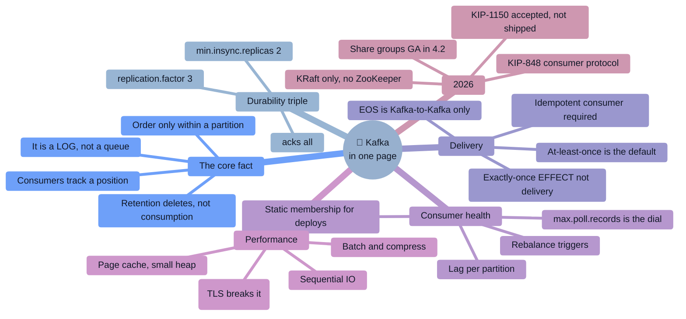

## The 30 facts to have on instant recall

| # | Fact |
|---|------|
| 1 | Kafka is a **distributed, partitioned, replicated append-only log** |
| 2 | **Consuming does not delete.** Retention (time/size) or compaction does |
| 3 | **Ordering is per partition only.** Same key → same partition → ordered |
| 4 | **Offsets are per partition**, monotonic, never reused |
| 5 | Within a consumer group, **each partition goes to exactly one consumer**; extras idle |
| 6 | Different consumer groups are **fully independent** — each gets everything |
| 7 | **The durability triple: RF=3, `min.insync.replicas=2`, `acks=all`** |
| 8 | **`acks=all` means all *in-sync* replicas** — worthless without `min.insync.replicas` |
| 9 | **ISR membership is time-based** (`replica.lag.time.max.ms`), not count-based |
| 10 | **Consumers read only up to the high watermark** (min LEO across the ISR) |
| 11 | **Four ways to lose data with RF=3:** `acks=1`, `min.insync=1`, unclean election, one AZ |
| 12 | **Default semantic is at-least-once** → **consumers must be idempotent** |
| 13 | **Exactly-once is Kafka-to-Kafka only.** External sinks need idempotency |
| 14 | `sendOffsetsToTransaction` puts the **offset commit inside the transaction** |
| 15 | **`isolation.level=read_committed`** or transactions are pointless |
| 16 | `enable.idempotence=true` and `acks=all` became **defaults in 3.0** |
| 17 | Idempotent producer = **PID + per-partition sequence numbers** |
| 18 | `transactional.id` + **epoch fencing** kills zombie producers |
| 19 | **Rebalance triggers:** join, leave, timeout, partition added, subscription change |
| 20 | **The fix for rebalance storms is lowering `max.poll.records`**, not raising the interval |
| 21 | **`group.instance.id` = static membership** → no rebalance on a quick restart |
| 22 | **Adding partitions rehashes keys** and breaks per-key ordering |
| 23 | **You cannot decrease partitions** |
| 24 | `auto.offset.reset=latest` (default) makes a **new group skip the entire backlog** |
| 25 | **Why Kafka is fast:** sequential I/O → page cache → zero-copy → batching+compression |
| 26 | **Brokers want a SMALL heap (~6 GB)** — the page cache does the work |
| 27 | **TLS disables zero-copy** — a real throughput cost |
| 28 | 🆕 **ZooKeeper removed in 4.0.** KRaft only. Migrate on 3.x first |
| 29 | 🆕 **Share groups (queues) GA in 4.2** — per-record ack, no ordering |
| 30 | 🆕 **KIP-1150 diskless: accepted, directional, NOT in mainline** |

## Emergency commands

```bash
kafka-consumer-groups.sh --bootstrap-server $B --describe --group $G   # ← START HERE (lag/partition)
kafka-topics.sh --bootstrap-server $B --describe --topic $T            # ISR, leaders, config
kafka-topics.sh --bootstrap-server $B --describe --under-replicated-partitions
kafka-topics.sh --bootstrap-server $B --describe --unavailable-partitions
kafka-metadata-quorum.sh --bootstrap-server $B describe --status       # KRaft health
kafka-log-dirs.sh --bootstrap-server $B --describe --broker-list 1,2,3 # disk per partition
kafka-configs.sh --bootstrap-server $B --describe --entity-type topics --entity-name $T
kafka-leader-election.sh --bootstrap-server $B --election-type PREFERRED --all-topic-partitions
kafka-consumer-groups.sh --bootstrap-server $B --group $G --reset-offsets \
    --to-datetime 2026-08-20T00:00:00.000 --topic $T --execute   # ⚠️ group must be INACTIVE
```

## The config cheat sheet

```properties
# ── DURABILITY (one decision, three places) ─────────
replication.factor=3
min.insync.replicas=2          # topic-level
acks=all                       # producer
unclean.leader.election.enable=false

# ── PRODUCER ────────────────────────────────────────
enable.idempotence=true · linger.ms=20 · batch.size=65536
compression.type=lz4 · delivery.timeout.ms=120000

# ── CONSUMER ────────────────────────────────────────
enable.auto.commit=false · auto.offset.reset=earliest
max.poll.records=500           # ← THE dial for rebalance problems
isolation.level=read_committed # if producers are transactional
group.instance.id=<stable-id>  # static membership

# ── BROKER ──────────────────────────────────────────
auto.create.topics.enable=false · compression.type=producer
broker.rack=<az> · num.io.threads=2×cores
JVM heap ≈ 6 GB (leave RAM for the page cache)
```

---

# 16. 🎴 Flash Cards

> Cover the right column. Answer aloud. Anything you stumble on goes back in the deck.

### Core model

| ❓ Question | ✅ Answer |
|------------|----------|
| What is Kafka, in one sentence? | A distributed, partitioned, replicated **append-only commit log**. |
| When are messages deleted? | By **retention** (time/size) or **compaction** — **never by consumption**. |
| What is a partition? | An ordered, immutable, append-only sequence — the unit of parallelism, ordering, and storage. |
| Is an offset unique across a topic? | **No — per partition.** A record is `(topic, partition, offset)`. |
| Where is ordering guaranteed? | **Within a partition only.** |
| How do you get per-entity ordering? | **Key by that entity** — same key hashes to the same partition. |
| 6 partitions, 8 consumers in one group? | 6 consume, **2 idle**. |
| Two consumer groups on one topic? | **Both get every record** — fully independent positions. |
| What does the partitioner do with a null key? | Sticky batching (roughly round-robin) — **no ordering guarantee**. |
| Can you reduce partitions? | **No.** Only increase — and that rehashes keys. |

### Durability & replication

| ❓ | ✅ |
|---|---|
| The production durability triple? | **RF=3, `min.insync.replicas=2`, `acks=all`.** |
| What does `acks=all` actually wait for? | All replicas **currently in the ISR** — not all replicas. |
| Why is `min.insync.replicas` essential? | Without it, a shrunken ISR silently degrades `acks=all` to `acks=1`. |
| What is the ISR? | Replicas caught up within **`replica.lag.time.max.ms`** — **time**-based. |
| What is the high watermark? | The **minimum LEO across the ISR**; consumers read only up to it. |
| Four ways to lose data with RF=3? | `acks=1` · `min.insync=1` · unclean leader election · all replicas in one AZ. |
| What is unclean leader election? | Promoting an **out-of-sync** replica — availability over data. Default `false`. |
| `min.insync.replicas=3` with RF=3? | **Any single broker restart stops writes.** Keep it at RF−1. |
| What happens if the ISR drops below `min.insync`? | Producers get **`NotEnoughReplicasException`** — the system is protecting you. |

### Delivery & correctness

| ❓ | ✅ |
|---|---|
| The three delivery semantics? | At-most-once, **at-least-once**, exactly-once. |
| Which is the default in practice? | **At-least-once** (`acks=all` + commit after processing). |
| How do you get at-most-once? | Commit **before** processing. |
| What does the idempotent producer do? | **PID + per-partition sequence numbers** → the broker drops duplicate **retries**. |
| Since which version are `acks=all` and idempotence defaults? | **3.0.** |
| What does `transactional.id` give you? | A stable identity + **epoch fencing** of zombie producers. |
| The key line in a transactional loop? | **`sendOffsetsToTransaction`** — offsets committed inside the transaction. |
| What must the consumer set for transactions to matter? | **`isolation.level=read_committed`.** |
| Exactly-once between which two points? | **Read-process-write within Kafka.** Not to an external system. |
| What's the LSO problem? | An open transaction stalls `read_committed` consumers on that partition. |
| How do you make a consumer idempotent? | Upsert on a natural key · dedup table keyed by a business key · conditional update. |
| Why prefer a business key over `(topic, partition, offset)`? | Offsets don't survive re-keying, replay from a new topic, or cluster migration. |

### Consumers & rebalancing

| ❓ | ✅ |
|---|---|
| What is consumer lag? | Log end offset − committed offset, **per partition**. |
| Alert on absolute lag or trend? | **Trend.** 1 M lag on a 500k/s topic is two seconds. |
| Five rebalance triggers? | Join · leave · timeout · partition added · subscription change. |
| The rebalance death spiral? | Slow processing → `max.poll.interval.ms` expiry → eviction → reassign to another slow consumer → repeat. |
| The fix? | **Lower `max.poll.records`** — not raise the interval. |
| What is static membership? | `group.instance.id` — a quick restart rejoins with its assignment, **no rebalance**. |
| What did KIP-848 change? | Assignment moved to the **broker**; incremental, no stop-the-world join dance. **GA in 4.0.** |
| `auto.offset.reset` default and its trap? | **`latest`** — a new group **skips the entire backlog**. |
| Why does `close()` matter? | It sends LeaveGroup → immediate rebalance instead of waiting out the session timeout. |

### Internals & performance

| ❓ | ✅ |
|---|---|
| Why is Kafka fast? (in order) | Sequential I/O → OS page cache → zero-copy → batching+compression. |
| What is zero-copy? | `sendfile`: page cache → NIC, never entering user space or the JVM heap. |
| What breaks zero-copy? | **TLS** — encryption requires touching the bytes. |
| How big should the broker heap be? | **Small (~6 GB).** Leave the rest to the page cache. |
| Where is compression applied? | **At the producer, per batch**; the broker stores and forwards it compressed. |
| What if broker and producer `compression.type` differ? | The broker **recompresses** — losing zero-copy and burning CPU. Use `producer`. |
| What is a segment? | The physical file a partition log is split into; **retention deletes whole segments**. |
| Biggest producer throughput dial? | **`linger.ms`** (with `batch.size`). |
| The #1 producer throughput bug? | **`send().get()` in a loop** — synchronous round trips. |
| What is log compaction for? | Keeping the **latest value per key** — `__consumer_offsets`, Streams changelogs, CDC state. |
| What is a tombstone? | A **null-valued** record marking a key deleted in a compacted topic. |

### 2026 / ecosystem

| ❓ | ✅ |
|---|---|
| Does Kafka need ZooKeeper? | 🆕 **No — removed in 4.0 (March 2025). KRaft only.** |
| What is KRaft, in one line? | Metadata as **a Kafka log replicated by Raft** among controllers. |
| Why is KRaft failover faster? | Followers already have the metadata log — nothing to load. |
| Can you upgrade ZooKeeper Kafka straight to 4.0? | **No.** Migrate to KRaft on a 3.x version first. |
| Java requirements in 4.x? | **Java 11** for clients/Streams, **Java 17** for brokers/Connect/tools. |
| What are share groups? | 🆕 **Queue semantics** — per-record ack/redelivery, parallelism decoupled from partitions. **GA in 4.2.** |
| What do share groups give up? | **Ordering.** |
| What is the `RENEW` ack? | 🆕 4.2 — extend the processing window for a long-running record. |
| Status of KIP-1150 (diskless)? | **Accepted March 2026 — directional only. NOT in mainline.** Aiven Inkless is the only implementation. |
| What is tiered storage for? | Cheap long retention **and faster rebalancing** (new brokers only replicate the local tier). |
| What's the biggest cloud Kafka cost? | Usually **cross-AZ replication traffic** — hence WarpStream/AutoMQ and KIP-1150. |
| Kafka Streams vs Flink in one line? | **A library in your app** vs **a cluster with richer event-time semantics and savepoints**. |
| KStream vs KTable? | An **event stream** vs the **latest value per key** (a changelog). |
| What is the transactional outbox for? | You **cannot** atomically write to a DB and Kafka — the outbox makes the event part of the DB transaction. |
| Best way to get DB changes into Kafka? | **CDC (Debezium)** reading the WAL/binlog — never dual writes. |
| The #1 CDC incident? | A stalled connector makes the **source database's** replication slot fill its disk. |

---

# 17. ☑️ Interview Revision Checklist

## Fundamentals
- [ ] Kafka as a **log**, not a queue — and why that framing explains everything
- [ ] Topic / partition / offset / broker / cluster, precisely
- [ ] Consumer groups: exclusive assignment, idle consumers, independent groups
- [ ] **Ordering: per partition only; key → partition; adding partitions breaks it**
- [ ] Retention vs compaction; tombstones; `delete.retention.ms`
- [ ] Kafka vs RabbitMQ vs SQS vs Pulsar — with a real reason for each
- [ ] When **not** to use Kafka

## Producer & consumer
- [ ] The producer pipeline: serialize → partition → accumulate → compress → send
- [ ] `acks` semantics and **the `acks=all` + `min.insync.replicas` trap**
- [ ] `linger.ms` / `batch.size` / compression trade-offs
- [ ] Idempotent producer: PID, sequence numbers, `max.in.flight` interaction
- [ ] `delivery.timeout.ms` vs `retries` vs `request.timeout.ms`
- [ ] Offset commits: auto vs manual, before vs after processing
- [ ] `auto.offset.reset` and the new-group backlog trap
- [ ] `max.poll.records` / `max.poll.interval.ms` / `session.timeout.ms`
- [ ] Assignors, including `CooperativeStickyAssignor`
- [ ] **Static membership (`group.instance.id`)**

## Cluster & replication
- [ ] **KRaft vs ZooKeeper** — what changed, why, and the migration constraint
- [ ] Controller quorum, metadata-as-a-log, failover mechanics
- [ ] Replication: leader/follower **fetch**, ISR, high watermark, LEO
- [ ] Leader election, preferred leader, **unclean leader election**
- [ ] Rack awareness and failure domains
- [ ] **The four ways to lose data with RF=3**
- [ ] Segments, indexes, and the on-disk layout
- [ ] Zero-copy, page cache, sequential I/O — **and that TLS breaks zero-copy**

## Correctness
- [ ] Three delivery semantics and how to implement each
- [ ] **Transactions:** epoch fencing, `sendOffsetsToTransaction`, markers, LSO
- [ ] **`isolation.level=read_committed`**
- [ ] **Exactly-once scope** — Kafka-to-Kafka only
- [ ] **Idempotent consumer patterns (all three)**
- [ ] **Transactional outbox** and why dual writes are broken
- [ ] Poison messages, retry tiers, DLQ design

## Operations
- [ ] **Consumer lag** — per partition, trend not absolute
- [ ] The key broker metrics and what pages vs what warns
- [ ] Rebalance storms: cause, diagnosis, and the correct fix
- [ ] Hot partitions: why sharding doesn't help and what does
- [ ] Partition sizing: the formula and the costs of too many
- [ ] Zero-downtime rolling upgrades (gate on under-replicated = 0)
- [ ] Replay and offset resets
- [ ] Retention/storage math; **tiered storage**
- [ ] MirrorMaker 2, offset translation, active-active loop prevention
- [ ] Quotas, ACLs (**including the Group ACL**), TLS, SASL
- [ ] 🆕 Cost: cross-AZ traffic, compression, retention audit, follower fetching

## Ecosystem
- [ ] **Kafka Connect** and Debezium/CDC — including the replication-slot hazard
- [ ] **Schema Registry**, compatibility modes, **and who upgrades first**
- [ ] **Kafka Streams:** KStream/KTable, state stores, changelogs, co-partitioning, windowing
- [ ] Streams vs Flink vs Spark
- [ ] 🆕 **Share groups / KIP-932** — what they add and what they give up
- [ ] 🆕 **KIP-848** — what changed about rebalancing
- [ ] 🆕 **KIP-1150 status** — accepted, directional, not shipped
- [ ] Redpanda / WarpStream / AutoMQ / Pulsar — and when each wins

## Judgment & communication
- [ ] Can say when **not** to use Kafka
- [ ] Can explain that **exactly-once doesn't reach your database**
- [ ] Can defend at-least-once + idempotency over EOS
- [ ] Can quantify: partitions, storage, throughput, cost
- [ ] Has one rehearsed war story with numbers
- [ ] Knows the 4.x changes and can state KIP-1150's status precisely

---

# 18. 🗺️ Learning Roadmap

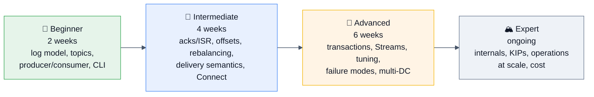

### 🌱 Beginner (2 weeks)
**Learn:** the log abstraction, topics/partitions/offsets, producers and consumers, consumer groups, the CLI tools, and **why ordering is per partition**.
**Build:** run Kafka locally (Docker Compose, **KRaft mode** — don't learn ZooKeeper-era setup). Write a producer and consumer. **Then deliberately break things:** kill a consumer mid-batch, watch the rebalance, produce with and without a key and observe the partition distribution.
**Practice:** Confluent's free Apache Kafka 101 course; the official quickstart.
**Milestone:** you can explain why Kafka isn't a queue, and predict which partition a key lands in.

### 🌿 Intermediate (4 weeks)
**Learn:** `acks`/ISR/`min.insync.replicas`, offset management, the three delivery semantics, rebalancing and its triggers, retention vs compaction, Kafka Connect, the Schema Registry, and Spring Kafka if you're on the JVM.
**Build:** a pipeline with a DLQ and retries. **Set `min.insync.replicas=2` on a 3-broker cluster, kill two brokers, and watch producers correctly refuse writes.** Run Debezium against a local Postgres.
**Read:** the official docs' **Design** section (short and excellent) and Confluent's core-concepts material.
**Milestone:** you can diagnose a rebalance storm and design an at-least-once pipeline with a DLQ.

### 🌳 Advanced (6 weeks)
**Learn:** transactions and exactly-once internals, Kafka Streams (state stores, changelogs, co-partitioning, windowing), broker and client tuning, tiered storage, MirrorMaker 2, security (TLS/SASL/ACLs/quotas), and 🆕 **KIP-848 and share groups**.
**Build:** a transactional read-process-write app. A Streams topology with a windowed aggregation, then kill an instance and watch state restore from the changelog. **Deliberately create a hot partition and measure it.** Run a rolling upgrade.
**Read:** *Kafka: The Definitive Guide* (2nd ed.); the KIPs for 848, 932, 405, and 1150 — **reading a KIP is the single best way to sound current**.
**Milestone:** you can run the on-call playbook, and explain exactly-once's scope and cost without hand-waving.

### 🏔️ Expert (ongoing)
**Learn:** the replication protocol in depth (leader epochs, log truncation), the transaction coordinator, KRaft internals, the storage layer, and the economics of running Kafka in the cloud.
**Do:** read the source (`core/src/main/scala/kafka/`); follow the **KIP mailing list** and the release notes each cycle; operate a cluster through a real incident; benchmark with one variable at a time.
**Read:** *Designing Data-Intensive Applications* ch. 11 (stream processing) — the best conceptual treatment; Jay Kreps' **"The Log: What every software engineer should know"**; Confluent's engineering blog; the Uber/Netflix/LinkedIn/Pinterest Kafka posts.
**Milestone:** you can explain *why* Kafka made a design choice, and put a dollar figure on an architecture.

### 🎯 The two-week interview sprint

| Day | Focus |
|-----|-------|
| 1–2 | §1–2.3: the log model, topics/partitions/offsets, ordering, producer pipeline, consumer groups. **Say the "it's a log, not a queue" story aloud until fluent.** |
| 3 | §2.2–2.4: **`acks`, ISR, `min.insync.replicas`, high watermark.** Memorize the four ways to lose data. |
| 4 | §2.3 + §3.2: offsets, commits, **rebalancing and the death spiral**. |
| 5 | §2.6 + §3.1: delivery semantics and **transactions/EOS**. Practise the "exactly-once between which two points?" answer. |
| 6 | §2.5 + §11: storage internals, zero-copy, page cache, tuning. |
| 7 | §2.7–2.8 + §3.4: Schema Registry, Connect/CDC, Kafka Streams. |
| 8 | §3.3 + §14.7: 🆕 **KRaft, KIP-848, share groups, KIP-1150 status.** The "what's new?" answer. |
| 9 | §6: write a durable producer, an at-least-once consumer, and a transactional loop **from memory**. |
| 10 | §7: two full design questions, out loud, timed. |
| 11 | §9: incidents. **Prepare your war story with numbers.** |
| 12 | §10 + §3.6–3.8: security, monitoring, capacity, cost. |
| 13 | §15–16: cheat sheet and flash cards. Find the gaps. |
| 14 | Mock interview. Re-drill only what you stumbled on. |

---

# 19. 📚 Sources & Further Reading

## Official documentation (always the primary source)
- [Apache Kafka Documentation](https://kafka.apache.org/documentation/) — especially the **Design**, **Implementation**, and **Operations** sections
- [Apache Kafka 4.0.0 Release Announcement](https://kafka.apache.org/blog/2025/03/18/apache-kafka-4.0.0-release-announcement/) — the ZooKeeper removal
- [Apache Kafka 4.1.0](https://kafka.apache.org/blog/2025/09/04/apache-kafka-4.1.0-release-announcement/) · [4.2.0](https://kafka.apache.org/blog/2026/02/17/apache-kafka-4.2.0-release-announcement/) · [4.2.1](https://kafka.apache.org/blog/2026/05/30/apache-kafka-4.2.1-release-announcement/) · [All release announcements](https://kafka.apache.org/blog/releases/)
- **KIPs worth reading directly** — [KIP-500 (KRaft)](https://cwiki.apache.org/confluence/display/KAFKA/KIP-500), **KIP-848** (new consumer protocol), **KIP-932** (queues/share groups), KIP-405 (tiered storage), **KIP-1150** (diskless topics), KIP-1071 (Streams rebalance)
- [Confluent Documentation](https://docs.confluent.io/) and [Developer courses](https://developer.confluent.io/) — free, and genuinely good

## Books
- **Gwen Shapira, Todd Palino, Rajini Sivaram, Krit Petty — *Kafka: The Definitive Guide* (2nd ed.)** — **the book.** Written by committers.
- **Martin Kleppmann — *Designing Data-Intensive Applications*** — ch. 11 on stream processing is the best conceptual treatment anywhere
- **Ben Stopford — *Designing Event-Driven Systems*** (free from Confluent) — architecture patterns
- **Bill Bejeck — *Kafka Streams in Action* (2nd ed.)** — for the Streams side

## Key articles
- **[Jay Kreps — "The Log: What every software engineer should know about real-time data's unifying abstraction"](https://engineering.linkedin.com/distributed-systems/log-what-every-software-engineer-should-know-about-real-time-datas-unifying)** — **the foundational essay.** Read it once properly.
- [Confluent — Apache Kafka 4.0 release blog](https://www.confluent.io/blog/latest-apache-kafka-release/) · [2 Minute Streaming — Kafka 4.0: Hello Queues, Goodbye ZooKeeper](https://blog.2minutestreaming.com/p/apache-kafka-4-0-release)
- [Aiven — KIP-1150 accepted, and the road ahead](https://aiven.io/blog/kip-1150-accepted-and-the-road-ahead) · [AutoMQ — KIP-1150 explained](https://www.automq.com/blog/kip-1150-explained-diskless-topics-kafka-future) · [Instaclustr — Kafka "Diskless": proposals, status & insights](https://www.instaclustr.com/support/documentation/announcements/apache-kafka-and-kafka-connect/kafka-diskless-proposals-status-insights/)
- Confluent — "Exactly-Once Semantics Are Possible: Here's How Kafka Does It" and the transactions design docs
- [SoftwareMill — Apache Kafka 4.0.0 released](https://softwaremill.com/apache-kafka-4-0-0-released-kraft-queues-better-rebalance-performance/)

## Engineering blogs
LinkedIn Engineering (Kafka, **Cruise Control**, Burrow) · Uber Engineering (uReplicator, **Chaperone** auditing) · Netflix Tech Blog (Keystone) · Pinterest Engineering (**Kafka cost optimization**) · Cloudflare (pipeline abstractions) · Confluent Engineering · Shopify · Slack · Robinhood

## Interview practice
- **Question banks:** [MentorCruise Kafka questions (2026)](https://mentorcruise.com/questions/kafka/) · [Second Talent — 30 advanced Kafka questions](https://www.secondtalent.com/interview-guide/kafka/) · [DataVidhya — 50 Kafka questions for data engineers](https://datavidhya.com/blog/kafka-data-engineering-interview-questions/) · [Articuler](https://www.articuler.ai/resources/guides/kafka-interview-questions/) · GeeksforGeeks · InterviewBit · Scaler Topics
- **System design:** [System Design Primer](https://github.com/donnemartin/system-design-primer) · ByteByteGo · Hello Interview · Design Gurus
- **Experience reports:** Glassdoor · AmbitionBox · Blind/TeamBlind · CareerCup · r/apachekafka · r/dataengineering · r/ExperiencedDevs

## Tools to have used (and be able to name)
`kafka-topics.sh` · **`kafka-consumer-groups.sh`** · `kafka-configs.sh` · `kafka-reassign-partitions.sh` · `kafka-dump-log.sh` · `kafka-metadata-quorum.sh` · **kcat** · **Cruise Control** · **Burrow** / Kafka Lag Exporter · **Debezium** · **Schema Registry** · **MirrorMaker 2** · **Strimzi** (Kubernetes operator) · AKHQ / Kafdrop / Conduktor / Redpanda Console · **Testcontainers** · ksqlDB / Flink SQL · `kafka-producer-perf-test.sh`

---

> [!TIP]
> ## 🎯 Final advice — the six sentences that carry a Kafka interview
>
> 1. **"Kafka is a distributed commit log, not a queue — consumers track an offset rather than removing messages, and everything else follows from that."**
> 2. **"Ordering is guaranteed only within a partition, so the message key is the single most consequential design decision — it determines ordering, distribution, and whether I get a hot partition in six months."**
> 3. **"Replication factor 3, `min.insync.replicas=2`, and `acks=all` are one decision made in three places — get any of them wrong and the other two are decorative."**
> 4. **"Exactly-once in Kafka means read-process-write *within* Kafka. The moment my sink is a database or an API, I need an idempotent consumer — so I default to at-least-once plus idempotency, which is what most 'exactly-once' systems actually are."** 🔑
> 5. **"When lag grows, the first question is whether it's all partitions or one, because a skewed lag is a hot key and a uniform lag is usually a downstream problem — and scaling consumers would make the second one worse."**
> 6. **"In 4.x there's no ZooKeeper, rebalancing is broker-coordinated via KIP-848, and share groups gave Kafka real queue semantics in 4.2 — at the cost of ordering."** 🆕
>
> Know the mechanism, quantify the trade-off, and always say what breaks. That's the whole game.

---

*Synthesized August 2026 against Apache Kafka 4.2.1 (May 2026), 4.2.0 (Feb 2026), 4.1.0 (Sept 2025), and 4.0.0 (March 2025), plus the accepted-but-unimplemented KIP-1150. Kafka is moving quickly right now — verify anything version-sensitive against the release notes for the version you actually run, and check a KIP's implementation status before claiming a feature exists.*

