# 🟩 Node.js — The Complete Interview Preparation Guide

> **Target audience:** Candidates preparing for SDE-1 → Staff/Principal interviews at Google, Meta, Amazon, Microsoft, Apple, Netflix, Uber, Airbnb, Stripe, Databricks, Snowflake, OpenAI, Anthropic, NVIDIA, Palantir, Bloomberg, Goldman Sachs, JPMorgan, Walmart Global Tech, Salesforce, Atlassian, DoorDash, Coinbase, Shopify, Pinterest, Tesla, Adobe, Oracle, Qualcomm, Cisco, Cloudflare, Rippling — plus Indian product & service companies (TCS, Infosys, Wipro, Cognizant, Accenture, Capgemini, LTIMindtree, HCL).
>
> **Version baseline (August 2026):** **Node.js 24 is Active LTS** (entered LTS October 2025); **Node 22 is in Maintenance LTS**; **Node 26 is Current** and becomes LTS in October 2026. Assume Node 22/24 in interviews. Node 24+ content is flagged `🆕 Node 24`, Node 26 as `🆕 Node 26`.
>
> **What's changed since the "old" Node interview:** native TypeScript type-stripping by default, `require(esm)` interop, a stable-ish `--permission` model, a built-in test runner that runs in parallel, `fetch`/undici built in, `node:sqlite`, and `AsyncLocalStorage` + `diagnostics_channel` as the observability substrate. Interviewers now dig into **event-loop internals, memory diagnostics, and system design even at mid-level.**
>
> **Last synthesized:** August 2026.

---

## 📑 Table of Contents

| # | Section | What it covers |
|---|---------|----------------|
| 0 | [How to Use This Guide](#0-how-to-use-this-guide) | Study strategy per company tier |
| 1 | [Beginner Concepts](#1--beginner-concepts) | What/why/problems solved/analogies/misconceptions |
| 2 | [Intermediate Concepts](#2--intermediate-concepts) | Architecture, libuv, event loop, modules, streams, HTTP, npm |
| 3 | [Advanced Concepts](#3--advanced-concepts) | Concurrency, clustering, memory, distributed systems, caching, observability, tuning |
| 4 | [Interview Questions by Level](#4--interview-questions-by-level) | Beginner → Staff → FAANG → Startup → Product → Service |
| 5 | [Frequently Asked Questions (Ranked)](#5--frequently-asked-questions-ranked-by-frequency) | Frequency-ranked master list |
| 6 | [Coding Questions](#6--coding-questions) | Easy/Medium/Hard with full solutions |
| 7 | [System Design Questions](#7--system-design-questions-nodejs-centric) | Node-centric design rounds |
| 8 | [Real Production Usage](#8--real-production-usage-at-scale) | Netflix, Uber, PayPal, LinkedIn, Stripe, Walmart… |
| 9 | [Common Bugs & Production Incidents](#9--common-bugs--production-incidents) | Real failures + debugging playbooks |
| 10 | [Security](#10--security) | OWASP-aligned: injection, SSRF, path traversal, supply chain |
| 11 | [Performance](#11--performance) | Profiling, benchmarks, memory, CPU, latency, throughput |
| 12 | [Best Practices](#12--best-practices) | Production-ready recommendations |
| 13 | [Anti-patterns](#13--anti-patterns) | What NOT to do and why |
| 14 | [Comparison Tables](#14--comparison-tables) | Every "X vs Y" you'll be asked |
| 15 | [Cheat Sheet](#15--cheat-sheet-one-page-revision) | One-page revision |
| 16 | [Flash Cards](#16--flash-cards) | Q → A rapid recall |
| 17 | [Interview Revision Checklist](#17--interview-revision-checklist) | Tick-box coverage |
| 18 | [Learning Roadmap](#18--learning-roadmap) | Beginner → Expert |
| 19 | [Sources & Further Reading](#19--sources--further-reading) | Where this was synthesized from |

---

## 0. How to Use This Guide

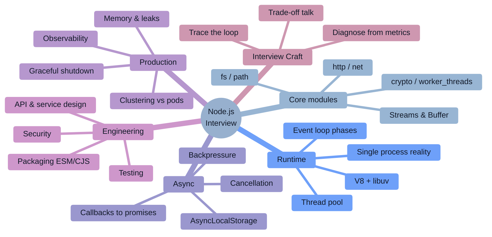

### Study strategy by company tier

| Tier | Companies | What they actually test | Time split |
|------|-----------|--------------------------|-----------|
| **FAANG / Big Tech** | Google, Meta, Amazon, Microsoft, Apple | DSA first. Node depth appears only in the "specialty"/domain round and in system design. Amazon weights Leadership Principles heavily. | 55% DSA, 25% system design, 20% Node internals |
| **Streaming / high-scale product** | Netflix, Uber, Airbnb, DoorDash, Pinterest | Node as a **BFF/edge layer**: event-loop blocking, timeouts, circuit breakers, streaming, observability. Real incident stories expected. | 30% DSA, 35% Node internals + prod, 35% design |
| **Payments / fintech** | Stripe, Coinbase, PayPal, Razorpay, Goldman, JPMorgan | Correctness: idempotency, exactly-once illusions, retries, money precision, audit logging, security. Bug-fix rounds are common. | 25% DSA, 35% correctness/async, 40% design + security |
| **AI labs / infra** | OpenAI, Anthropic, Vercel, Cloudflare | Streaming (SSE / `ReadableStream`), SDK design, backpressure, edge runtimes vs Node, TypeScript ergonomics. | 35% DSA, 35% streaming/async, 30% API design |
| **Indian product** | Walmart Global Tech, Flipkart, Swiggy, Zomato, PhonePe, Zepto, Meesho | Node internals (event loop phases, streams, cluster), Express/Nest, MongoDB/SQL, **machine coding**: build a REST service with auth + pagination + tests in 90 min. | 25% DSA, 35% Node internals, 40% machine coding/LLD |
| **Service companies** | TCS, Infosys, Wipro, Accenture, Cognizant, Capgemini, LTIMindtree | Rapid-fire theory: what is Node, single-threaded?, event loop, callback hell, middleware, `module.exports`, REST verbs, npm vs npx, error handling. | 70% theory Q&A, 20% simple coding, 10% SQL/framework |
| **Startups** | Seed → Series C | Ship a working endpoint with validation, auth, error handling, and a test — then explain what you'd cut. | 50% build-something, 30% debugging, 20% architecture chat |

### The 2026 shift you must internalize

> [!IMPORTANT]
> **"Node is single-threaded and non-blocking" is no longer an answer — it's the setup for the real question.** In 2026 interviewers immediately follow with: *"Then why did p99 latency triple while CPU stayed at 40%?"*, *"Where exactly does `fs.readFile` run?"*, *"Show me the retainer chain for that leak."* Every canonical question below is paired with the **depth follow-up** that decides the hire.

> [!TIP]
> **The single highest-leverage sentence in a Node interview:** *"Let me walk through which event-loop phase that runs in, and what it does to everything else in flight."* That framing turns every answer — performance, bugs, design — into a systems answer.

---

# 1. 🌱 Beginner Concepts

## 1.1 What is Node.js?

**Node.js is not a language and not a framework.** It is a **runtime**: a way to execute JavaScript outside a browser, built by gluing together three things.

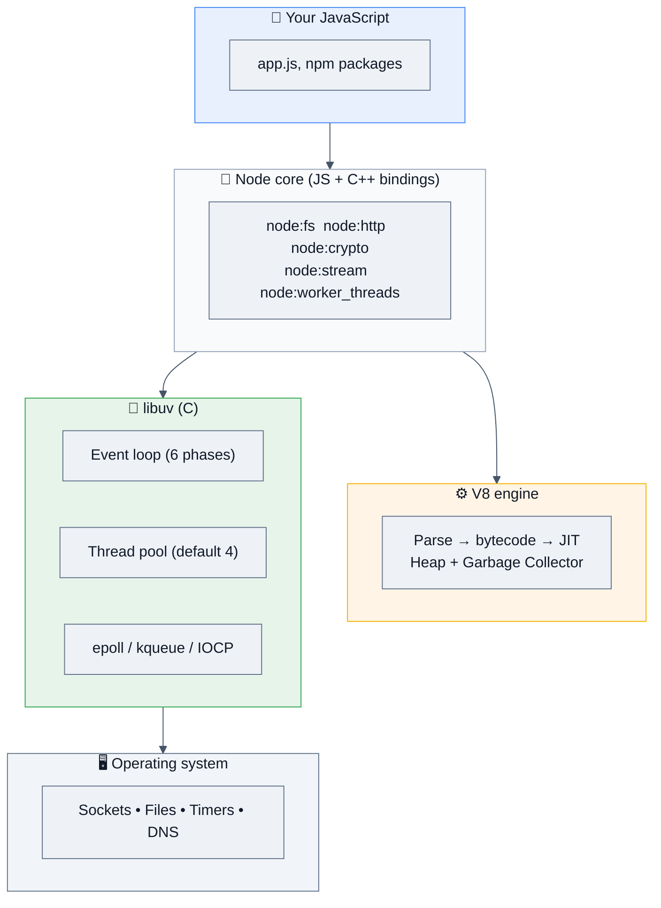

| Layer | What it provides |
|---|---|
| **V8** | Executes JavaScript, manages the heap, runs GC. Same engine as Chrome. |
| **libuv** | The **event loop**, non-blocking I/O abstraction over epoll/kqueue/IOCP, and a **thread pool** for operations the OS can't do asynchronously. |
| **Node bindings / core modules** | `fs`, `http`, `net`, `crypto`, `stream`, `buffer`, `worker_threads` — JavaScript APIs over C/C++. |
| **npm ecosystem** | ~3M packages; the largest package registry in existence, and the largest attack surface (see §10). |

**Canonical minimal server:**

```js
import { createServer } from 'node:http';

const server = createServer((req, res) => {
  res.writeHead(200, { 'content-type': 'application/json' });
  res.end(JSON.stringify({ ok: true, path: req.url }));
});

server.listen(3000, () => console.log('listening on :3000'));
```

`🆕 Node 24` — a modern service now needs almost nothing external:

```bash
node --run dev                 # run package.json scripts without npm
node --env-file=.env app.js    # built-in dotenv
node --watch app.js            # built-in nodemon
node --test --experimental-test-coverage   # built-in test runner + coverage
node app.ts                    # native TypeScript type-stripping (no build step)
node --permission --allow-fs-read=./data app.js   # permission model
```

## 1.2 Why does Node.js exist? (History that gets asked)

| Year | Event | Why it matters |
|------|-------|----------------|
| **2009** | Ryan Dahl presents Node.js at JSConf EU. Motivation: Apache's thread-per-connection model wasted memory, and every language's I/O APIs were blocking by default. | The **C10K problem** is the origin story. Say it. |
| **2010** | npm released | Package management became Node's superpower — and later its liability. |
| **2011–14** | Explosive adoption: LinkedIn, PayPal, Walmart move mobile backends to Node | The famous PayPal result: the Node rewrite of an account page was built roughly twice as fast with fewer people and served requests significantly faster than the Java version. |
| **2014–15** | **io.js fork** over governance → merged back; **Node.js Foundation** formed | Explains the version jump (0.12 → 4.0) and why governance questions appear in staff interviews. |
| **2018** | N-API stabilized; `worker_threads` introduced (Node 10/11) | Native addons stopped breaking every release; CPU work got a real answer. |
| **2019** | OpenJS Foundation (Node + jQuery merge) | — |
| **2020–22** | ESM support matures; **`fetch` built in via undici (Node 18)**; Node 18 LTS | The end of `node-fetch` and `axios`-by-default. |
| **2023–24** | Built-in test runner, watch mode, `--env-file`, permission model (experimental), `node:sqlite` | Node absorbs the tooling layer. |
| **2025** | **Node 24 → LTS (Oct 2025)**: `--permission` (no longer `--experimental-`), parallel test runner with auto-awaited subtests, refined ESM/CJS interop, native TS type-stripping on by default | The current interview baseline. |
| **2026** | **Node 26 (Current)**: crypto module split into distinct backends, streams performance overhaul (ring buffers, fewer allocations), richer test-runner logging/reporting | "Do you keep up?" signal. |

## 1.3 Problems Node.js solves

| Problem | Node's answer | Trade-off you MUST name |
|---|---|---|
| Thread-per-connection wastes ~1 MB+ stack per idle connection | **One thread, an event loop, and non-blocking I/O** — tens of thousands of concurrent sockets in one process | Any synchronous CPU work blocks *every* connection simultaneously |
| Two languages (browser + server) slowed teams | One language end to end; shared validation, types, and utilities | Node is a poor fit for CPU-heavy workloads (video encode, ML training, big joins) |
| Chatty mobile clients needed request aggregation | **BFF pattern** — one Node call fans out to many services and shapes one response | Adds a network hop and a service to operate |
| Real-time apps (chat, dashboards, collaboration) | Long-lived connections are cheap: WebSocket/SSE at scale | Sticky sessions and connection state complicate horizontal scaling |
| Startup cost of JVM/containers for small services | ~30–100 ms cold start, small memory footprint | Not as fast as isolates (Cloudflare Workers ~5 ms) |
| Streaming large payloads without buffering | **Streams with backpressure** built into the core | Streams are the most-misused API in the ecosystem |

## 1.4 Real-world analogies (interviewers remember these)

| Concept | Analogy |
|---|---|
| **Event loop** | A single waiter in a busy restaurant. He takes an order (request), hands it to the kitchen (OS/thread pool), and immediately serves the next table instead of standing at the pass. He's only slow if *he* starts chopping vegetables himself — that's synchronous CPU work. |
| **Thread pool (libuv)** | The kitchen staff — **exactly 4 cooks by default**. Network I/O doesn't use them (the OS handles sockets), but file reads, DNS lookups (`getaddrinfo`), `zlib`, and `crypto` do. Four slow `pbkdf2` calls and every file read in the process queues behind them. |
| **Blocking the event loop** | The waiter sitting down to do the accounts in the middle of dinner service. Every table waits — not just his own. |
| **Streams & backpressure** | A conveyor belt with a stop button. If the packing station (slow consumer) can't keep up, it signals the belt to pause instead of letting boxes pile on the floor (memory). |
| **`process.nextTick`** | A note the waiter writes to himself: "before I do *anything* else, finish this." Write too many and dinner never gets served. |
| **Cluster** | Cloning the waiter. Same restaurant (port), N waiters (processes), each with a private notepad (**separate heap — no shared memory**). |
| **Worker threads** | Hiring a specialist chef for one heavy dish so the waiter stays on the floor. |
| **Graceful shutdown** | Locking the front door, finishing the diners already seated, then turning off the lights — instead of switching the power off mid-meal. |

## 1.5 Blocking vs non-blocking — the foundational distinction

```js
// ❌ BLOCKING — the entire process stops here. Every other request waits.
import { readFileSync } from 'node:fs';
const data = readFileSync('/big.json', 'utf8');
console.log(data.length);

// ✅ NON-BLOCKING (callback) — libuv does the work on a pool thread
import { readFile } from 'node:fs';
readFile('/big.json', 'utf8', (err, data) => { if (err) throw err; console.log(data.length); });

// ✅ NON-BLOCKING (promises) — the modern default
import { readFile } from 'node:fs/promises';
const data2 = await readFile('/big.json', 'utf8');
```

> [!WARNING]
> **The "*Sync" rule interviewers check for:** synchronous APIs (`readFileSync`, `execSync`, `pbkdf2Sync`, `crypto.randomBytes` without a callback on large sizes, `JSON.parse` of multi-MB strings) are acceptable **only at startup** — reading config, loading certs, building a cache before `listen()`. Never inside a request handler. A candidate who says this unprompted has actually run Node in production.

## 1.6 The module systems (the #1 daily confusion)

```js
// CommonJS (CJS) — the historical default
const fs = require('node:fs');
module.exports = { handler };

// ES Modules (ESM) — the standard, and the default in new projects
import fs from 'node:fs';
export { handler };
```

**How Node decides which one a file is:**

```mermaid
%%{init: {'theme':'base','themeVariables':{'background':'#ffffff','mainBkg':'#eef2f7','primaryColor':'#eef2f7','primaryTextColor':'#111827','primaryBorderColor':'#64748b','secondaryColor':'#e8f0fe','tertiaryColor':'#f1f5f9','lineColor':'#475569','textColor':'#111827','clusterBkg':'#f8fafc','clusterBorder':'#94a3b8','edgeLabelBackground':'#ffffff','titleColor':'#111827','actorBkg':'#eef2f7','actorTextColor':'#111827','actorBorder':'#64748b','actorLineColor':'#475569','signalColor':'#111827','signalTextColor':'#111827','noteBkgColor':'#fff4e5','noteTextColor':'#111827','noteBorderColor':'#d97706','labelBoxBkgColor':'#eef2f7','labelBoxBorderColor':'#64748b','labelTextColor':'#111827','loopTextColor':'#111827','altBackground':'#f8fafc'}}}%%
flowchart TD
    F["📄 file"] --> EXT{"Extension?"}
    EXT -->|".mjs"| ESM["✅ ES Module"]
    EXT -->|".cjs"| CJS["✅ CommonJS"]
    EXT -->|".js"| PKG{"nearest package.json<br/>has \"type\": \"module\"?"}
    PKG -->|Yes| ESM
    PKG -->|No / absent| CJS
    EXT -->|".ts"| TS["Type-stripped, then<br/>same rules apply"]
    style ESM fill:#e6f4ea,stroke:#34a853,color:#111827
    style CJS fill:#e8f0fe,stroke:#4285f4,color:#111827
    style TS fill:#fff4e5,stroke:#f4b400,color:#111827
```

| | CommonJS | ESM |
|---|---|---|
| Loading | synchronous, runtime | asynchronous, statically analysed |
| Bindings | **value copy** of `module.exports` | **live bindings** |
| Top-level `await` | ❌ | ✅ |
| `__dirname` / `__filename` | ✅ | ❌ → `import.meta.dirname` / `import.meta.filename` (Node 20.11+) |
| `require()` an ESM package | historically ❌ → **now allowed for most ESM graphs** (`require(esm)`, Node 22.12+/23+) | n/a |
| `import` a CJS package | ✅ (default export = `module.exports`; named exports detected heuristically) | — |
| Conditional/dynamic load | `require(expr)` anywhere | `await import(expr)` |

> [!TIP]
> **The dual-package answer:** publish ESM as the primary build, ship a CJS fallback, and declare both through an `exports` map. Never let the same module get loaded twice under both formats — the "dual package hazard" produces two copies of your singletons (two connection pools, two caches, `instanceof` failures).
> ```json
> { "type": "module",
>   "exports": { ".": { "types": "./dist/index.d.ts",
>                       "import": "./dist/index.mjs",
>                       "require": "./dist/index.cjs" } } }
> ```

## 1.7 Your first ten Node idioms

```js
// 1. Always use the node: prefix — unambiguous, immune to npm typosquats
import { readFile } from 'node:fs/promises';

// 2. Promise-based core APIs
import { setTimeout as sleep } from 'node:timers/promises';
await sleep(100);

// 3. Environment with a schema, not raw process.env
const PORT = Number(process.env.PORT ?? 3000);

// 4. Built-in fetch (undici) — no axios needed
const res = await fetch(url, { signal: AbortSignal.timeout(5000) });
if (!res.ok) throw new Error(`HTTP ${res.status}`);

// 5. Streams the safe way: pipeline handles errors AND cleanup
import { pipeline } from 'node:stream/promises';
await pipeline(createReadStream(src), createGzip(), createWriteStream(dst));

// 6. Path joining that can't be traversed out of
import path from 'node:path';
const full = path.resolve(BASE_DIR, userInput);
if (!full.startsWith(BASE_DIR + path.sep)) throw new Error('bad path');

// 7. Buffers are binary, not strings
Buffer.from('hello', 'utf8').toString('base64');

// 8. Structured errors with a cause chain
throw new Error('checkout failed', { cause: dbError });

// 9. Never let a rejection float
process.on('unhandledRejection', err => { log.error({ err }); process.exit(1); });

// 10. Graceful shutdown from day one
process.on('SIGTERM', () => server.close(() => process.exit(0)));
```

## 1.8 Common beginner misconceptions ❌ → ✅

| ❌ Misconception | ✅ Reality |
|---|---|
| "Node is single-threaded" | **Your JavaScript** runs on one thread. The process has many: the libuv thread pool (4 by default), V8's GC and compiler threads, and any `worker_threads` you spawn. Say "single-threaded *event loop*, multi-threaded *process*." |
| "Node is non-blocking, so it can't block" | Node's *I/O* is non-blocking. Your *code* is fully blocking. A 500 ms `JSON.parse` stalls every concurrent request. |
| "`async` makes code run in parallel" | `async` only wraps the return value in a Promise. Parallelism comes from starting operations before awaiting (`Promise.all`) — or from real threads. |
| "Node is bad for CPU work, so never use it for CPU work" | Use `worker_threads`, a native addon, or WASM. The rule is "never on the event loop," not "never in Node." |
| "`cluster` gives you multithreading" | It forks **processes**, each with its own V8 heap. No shared memory (unless you add `SharedArrayBuffer` via workers). Memory cost multiplies. |
| "`setTimeout(fn, 0)` runs immediately" | It schedules a timers-phase callback for the *next* loop iteration, after the current stack and all microtasks. Minimum is effectively 1 ms. |
| "Streams are just for files" | They're the backpressure primitive for HTTP bodies, sockets, compression, crypto, DB cursors — anything larger than memory or slower than the producer. |
| "`process.exit()` is how you stop" | It kills the process **immediately**, truncating pending writes and logs. Use `server.close()` + let the loop drain, with `process.exit` only as a timeout fallback. |
| "Errors in callbacks are caught by try/catch" | Only if they throw synchronously. Async errors arrive via the error-first callback, a rejected promise, or an `'error'` event — none of which a surrounding `try/catch` sees. |
| "`npm install` and `npm ci` are the same" | `ci` deletes `node_modules`, installs **exactly** the lockfile, and fails if `package.json` and the lockfile disagree. It's the only correct command in CI/production. |
| "Node's `fetch` needs a polyfill" | Built in since Node 18, powered by **undici**. `node-fetch`/`axios` are optional now — mention undici's `Agent`/pooling for high throughput. |
| "`require` is slower than `import`, so ESM is faster at runtime" | Both resolve once and cache. The real differences are static analysability, live bindings, top-level await, and tooling — not raw speed. |

---

# 2. ⚙️ Intermediate Concepts

## 2.1 The event loop — libuv's six phases

**This is the single most-asked Node.js topic.** Learn to narrate it phase by phase.

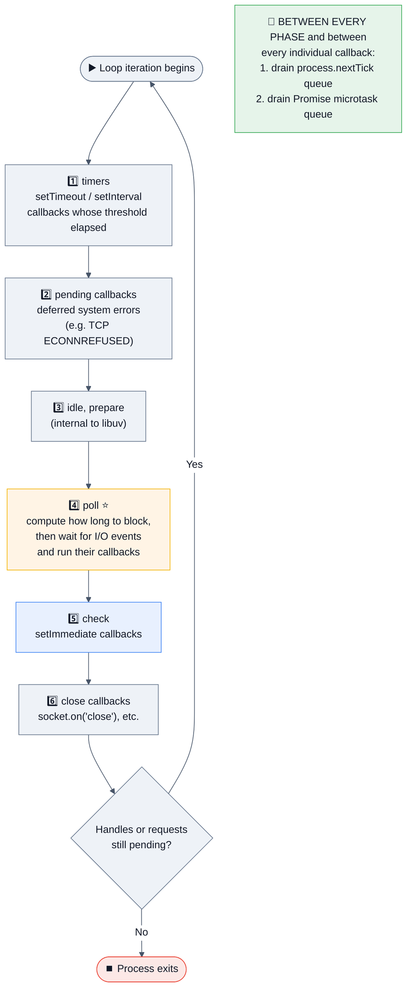

### What each phase actually does

| Phase | Runs | Interview note |
|---|---|---|
| **timers** | `setTimeout`/`setInterval` callbacks whose time has elapsed | The delay is a **minimum**, not a guarantee — the callback waits for the loop to reach this phase |
| **pending callbacks** | Certain system operations deferred from the previous iteration (e.g. a TCP error) | Rarely asked directly; mention it to show you know the real list |
| **idle, prepare** | libuv internals | Just name it |
| **poll** ⭐ | Retrieves new I/O events and executes their callbacks. **Blocks here** when there is nothing else to do — this is where an idle server waits | The heart of the loop. Poll timeout is bounded by the nearest timer and by whether `setImmediate` callbacks are queued |
| **check** | `setImmediate` callbacks | Guaranteed to run **after** poll, i.e. right after I/O |
| **close** | `'close'` events for handles destroyed abruptly | Cleanup |

### The two priority queues that sit *outside* the phases

```js
process.nextTick(fn);        // drained FIRST, before promise microtasks
Promise.resolve().then(fn);  // drained second
```

Both are emptied **completely** between every phase *and* after every individual callback within a phase.

### The classic ordering questions

```js
// ── Question 1: top-level ──────────────────────────────
setTimeout(() => console.log('timeout'), 0);
setImmediate(() => console.log('immediate'));
// ⚠️ NON-DETERMINISTIC at the top level.
// It depends on how long process startup took: if >1ms elapsed before the loop
// started, the timer is already due and 'timeout' wins; otherwise 'immediate' does.

// ── Question 2: inside an I/O callback ─────────────────
import { readFile } from 'node:fs';
readFile(__filename, () => {
  setTimeout(() => console.log('timeout'), 0);
  setImmediate(() => console.log('immediate'));
});
// ✅ DETERMINISTIC: 'immediate' ALWAYS first.
// We are in the poll phase; check comes next in the same iteration,
// while timers only come around on the next iteration.

// ── Question 3: full ordering ──────────────────────────
console.log('1 sync');
setTimeout(() => console.log('2 timeout'), 0);
setImmediate(() => console.log('3 immediate'));
process.nextTick(() => console.log('4 nextTick'));
Promise.resolve().then(() => console.log('5 promise'));
queueMicrotask(() => console.log('6 microtask'));
(async () => { console.log('7 async body sync'); await null; console.log('8 after await'); })();
console.log('9 sync end');

// 1 sync → 7 async body sync → 9 sync end
// → 4 nextTick
// → 5 promise → 6 microtask → 8 after await
// → 2 timeout (timers) → 3 immediate (check)
```

> [!WARNING]
> **`process.nextTick` starvation.** A recursive `nextTick` never lets the loop advance — I/O, timers, and `setImmediate` are frozen forever, while the process appears "busy." `setImmediate` recursion is safe: it yields one loop iteration each time. Node's own guidance is to prefer `setImmediate` in application code; `nextTick` exists mainly so core APIs can guarantee "emit an error *after* the caller has attached a listener."

```js
// 💥 hangs the process
function loop() { process.nextTick(loop); }
// ✅ yields between iterations
function safeLoop() { setImmediate(safeLoop); }
```

## 2.2 The thread pool — where "non-blocking" is actually blocking

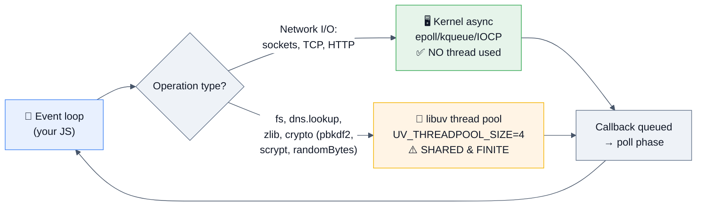

> [!IMPORTANT]
> **The distinction that impresses interviewers:** *"Network I/O never touches the thread pool — the kernel notifies us via epoll. Only `fs`, `dns.lookup`, `zlib`, and some `crypto` operations use libuv's 4 threads. So four concurrent `pbkdf2` hashes can stall every file read in the process, and DNS resolution can queue behind them — which is why I'd either raise `UV_THREADPOOL_SIZE`, move hashing to `worker_threads`, or use `dns.resolve` (which uses the network, not the pool)."*

```bash
UV_THREADPOOL_SIZE=16 node app.js   # max 1024; must be set BEFORE the pool is first used
```

## 2.3 Timers, and how they really behave

| API | Phase | Semantics |
|---|---|---|
| `setTimeout(fn, ms)` | timers | Fires **at or after** `ms`; `0` is coerced to `1` |
| `setInterval(fn, ms)` | timers | **Drifts**; if `fn` takes longer than `ms`, callbacks queue up |
| `setImmediate(fn)` | check | Runs after the current poll phase — "at the end of this iteration" |
| `process.nextTick(fn)` | between everything | Highest priority; starvation risk |
| `queueMicrotask(fn)` | between everything | Promise-queue priority |

```js
// ❌ setInterval drifts and stacks if the work is slow
setInterval(async () => { await slowJob(); }, 1000);

// ✅ self-scheduling timeout: no overlap, no drift accumulation
async function every(ms, job, signal) {
  while (!signal?.aborted) {
    const started = Date.now();
    try { await job(); } catch (err) { log.error({ err }, 'job failed'); }
    await sleep(Math.max(0, ms - (Date.now() - started)));
  }
}

// ✅ don't let a background timer keep the process alive
const t = setInterval(tick, 60_000);
t.unref();
```

## 2.4 Streams — the most under-prepared core topic

### The four types

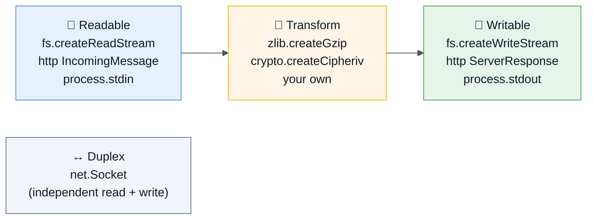

### Backpressure — the concept the whole topic exists for

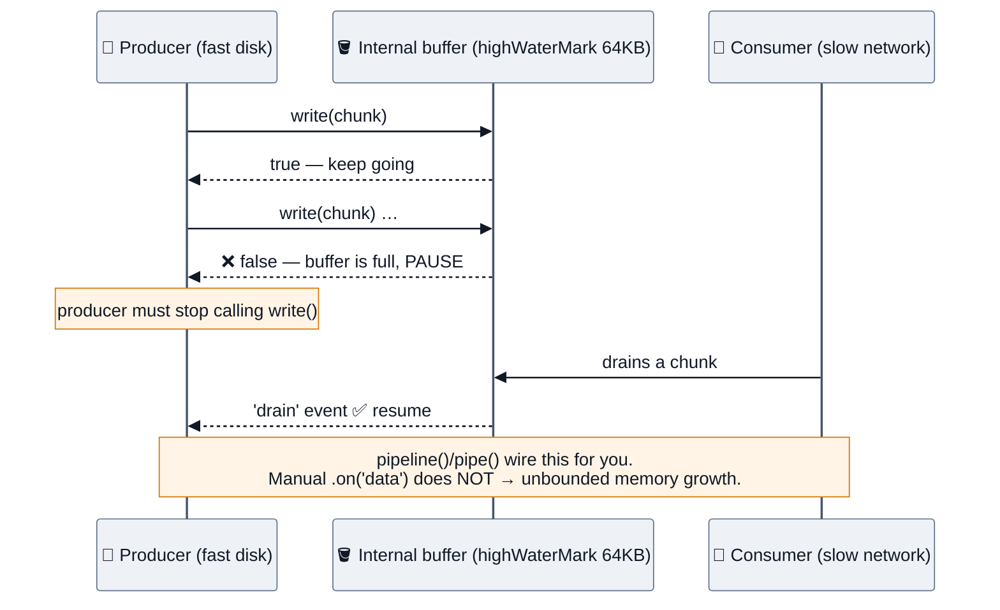

```js
// ❌ no backpressure — buffers the whole file in memory, OOMs on big inputs
readable.on('data', chunk => writable.write(chunk));

// ⚠️ pipe() honours backpressure but does NOT forward errors or clean up
readable.pipe(gzip).pipe(writable);

// ✅ pipeline(): backpressure + error propagation + destroys every stream on failure
import { pipeline } from 'node:stream/promises';
await pipeline(
  createReadStream('in.txt'),
  createGzip(),
  createWriteStream('out.gz')
);

// ✅ async iteration: readable streams are async iterables
for await (const chunk of readable) { await handle(chunk); }   // natural backpressure
```

### Object mode, highWaterMark, and a custom Transform

```js
import { Transform, pipeline } from 'node:stream';

const toUpper = new Transform({
  objectMode: false,
  highWaterMark: 64 * 1024,               // bytes (or #objects in objectMode, default 16)
  transform(chunk, encoding, callback) {
    try { callback(null, chunk.toString().toUpperCase()); }
    catch (err) { callback(err); }        // ✅ propagate, don't throw
  },
  flush(callback) { callback(null, '\n--EOF--'); }
});
```

| Term | Meaning |
|---|---|
| `highWaterMark` | Buffer threshold before `write()` returns `false`. Default 64 KB (byte streams) / 16 objects (object mode) |
| `objectMode` | Chunks are arbitrary JS values instead of `Buffer`/string |
| Flowing vs paused | `.on('data')` or `.pipe()` = flowing; `.read()` / `for await` = paused/pull |
| `destroy(err)` | Tears down and emits `'error'`; `pipeline` does this for you |

`🆕 Node 26` reworked stream internals with ring buffers and fewer allocations — a good "what's new" mention, but the API and the backpressure contract are unchanged.

**Web Streams interop** (for edge portability and `fetch` bodies):

```js
import { Readable } from 'node:stream';
const webStream = Readable.toWeb(nodeReadable);
const nodeStream = Readable.fromWeb(response.body);
```

## 2.5 Buffers and binary data

```js
Buffer.alloc(8);                       // ✅ zero-filled
Buffer.allocUnsafe(8);                 // ⚠️ faster, but may contain old memory — never send it raw
Buffer.from('héllo', 'utf8');          // 6 bytes for 5 characters
buf.toString('base64url');
Buffer.concat([a, b]);
buf.byteLength;                        // bytes ≠ string .length
```

> [!WARNING]
> **`Buffer.allocUnsafe` is a real CVE class** — uninitialized memory can leak secrets from previously freed allocations if you send it without fully overwriting it. Use `Buffer.alloc` unless you immediately fill every byte, and never use the deprecated `new Buffer(number)`.

**Chunk boundaries are the classic bug:** a multi-byte UTF-8 character can be split across two chunks. Use `StringDecoder` or decode only after concatenating.

```js
import { StringDecoder } from 'node:string_decoder';
const decoder = new StringDecoder('utf8');
readable.on('data', c => process.stdout.write(decoder.write(c)));   // ✅ handles split characters
```

## 2.6 EventEmitter and the error contract

```js
import { EventEmitter, once } from 'node:events';

class Job extends EventEmitter {}
const job = new Job();

job.on('progress', pct => log.info({ pct }));
job.once('done', result => log.info({ result }));
job.on('error', err => log.error({ err }));      // ⚠️ MANDATORY

await once(job, 'done');                          // promisified single event
```

> [!IMPORTANT]
> **An `'error'` event with no listener throws and crashes the process.** This is Node's most surprising rule for newcomers and a very common interview question. Every emitter you keep around — sockets, streams, child processes, DB clients — needs an `'error'` handler.

**Other things asked here:** emitters are **synchronous** (listeners run in call order, in the same tick); `setMaxListeners` and what `MaxListenersExceededWarning` really means (a leak signal — you're adding listeners in a loop or per request); `removeListener`/`off` and using `AbortSignal` for cleanup:

```js
const ac = new AbortController();
job.on('progress', onProgress, { signal: ac.signal });
ac.abort();     // removes the listener
```

## 2.7 Error handling — the four channels

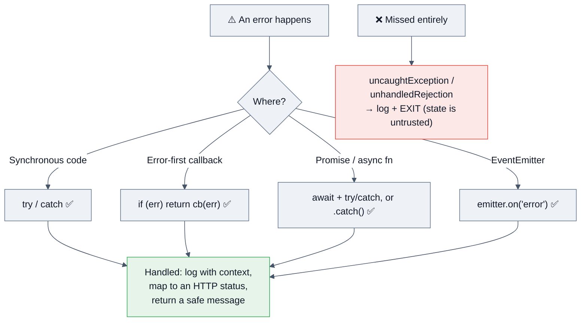

```js
// Operational vs programmer errors — the distinction interviewers want
class AppError extends Error {
  constructor(message, { status = 500, code, cause, expose = false } = {}) {
    super(message, { cause });
    this.name = new.target.name;
    this.status = status; this.code = code; this.expose = expose;
    Error.captureStackTrace?.(this, new.target);
  }
}
class NotFound extends AppError {
  constructor(what) { super(`${what} not found`, { status: 404, code: 'NOT_FOUND', expose: true }); }
}
```

| Kind | Examples | Response |
|---|---|---|
| **Operational** (expected) | 404, validation failure, timeout, downstream 503, `ECONNRESET` | Handle: retry, degrade, return a status. **Don't crash.** |
| **Programmer** (bug) | `TypeError`, bad assertion, unhandled state | Log with full context, fail the request, and consider restarting the process — its state is untrusted. |

```js
// The correct top-level handlers
process.on('unhandledRejection', (reason) => {
  log.fatal({ reason }, 'unhandled rejection');
  throw reason;                       // convert to uncaughtException path
});
process.on('uncaughtException', (err) => {
  log.fatal({ err }, 'uncaught exception — shutting down');
  server.close(() => process.exit(1));
  setTimeout(() => process.exit(1), 10_000).unref();   // hard deadline
});
```

> [!NOTE]
> **Since Node 15, an unhandled promise rejection terminates the process by default.** That's the right default: a process in an unknown state should not serve traffic. The correct answer is "crash fast, restart fast, and make sure the orchestrator's readiness probe stops routing traffic first" — not "swallow it with a global handler."

## 2.8 The HTTP layer

```js
import { createServer } from 'node:http';

const server = createServer((req, res) => {
  // req is a Readable stream; res is a Writable stream
  req.on('error', err => log.error({ err }));
  res.setHeader('content-type', 'application/json');
  res.end(JSON.stringify({ ok: true }));
});

// ⏱️ Timeouts — the settings most services forget
server.headersTimeout   = 65_000;   // time allowed to receive the full headers
server.requestTimeout   = 300_000;  // total time for a request
server.keepAliveTimeout = 61_000;   // MUST exceed the upstream LB idle timeout
server.timeout          = 0;        // socket inactivity (0 = disabled)
```

> [!WARNING]
> **The 502-under-load classic:** if `keepAliveTimeout` is *shorter* than your load balancer's idle timeout (AWS ALB defaults to 60 s), Node closes a pooled connection exactly as the LB reuses it → sporadic 502s. Fix: `keepAliveTimeout = 61000` and `headersTimeout` slightly higher. Knowing this is a strong production signal.

**Outbound HTTP — undici and pooling:**

```js
import { Agent, request, setGlobalDispatcher } from 'undici';

setGlobalDispatcher(new Agent({
  connections: 128,                 // pool size per origin
  keepAliveTimeout: 10_000,
  keepAliveMaxTimeout: 60_000,
  headersTimeout: 5_000,
  bodyTimeout: 10_000
}));

const res = await fetch('https://api.example.com/v1/orders', {
  signal: AbortSignal.timeout(3000)
});
```

| Client | When to use |
|---|---|
| **`fetch` (undici)** | Default in Node 18+. Web-standard API, good ergonomics. |
| **`undici` directly** | Highest throughput, fine-grained pooling, interceptors, mocking (`MockAgent`). |
| `axios` | Legacy familiarity, interceptors; extra dependency and slower. |
| `node:http` | Streaming edge cases, proxies, full control. |
| `node-fetch` | Effectively obsolete — say so. |

## 2.9 File system, paths, and the OS

```js
import { readFile, writeFile, mkdir, rm, stat } from 'node:fs/promises';
import { createReadStream } from 'node:fs';
import path from 'node:path';

await mkdir(dir, { recursive: true });
const stats = await stat(file);
// stream anything large — never readFile a multi-GB file
createReadStream(file, { highWaterMark: 256 * 1024 });
```

**Path rules that show up in security questions:** always `path.resolve` + prefix check (§10.4); never string-concatenate paths; `path.posix` vs `path.win32` for cross-platform tools; `path.normalize` does not make a path safe by itself.

**Process & OS basics:** `process.argv`, `process.env`, `process.cwd()`, `process.pid`, `process.memoryUsage()`, `process.hrtime.bigint()` for monotonic timing, `os.cpus().length` (⚠️ reports host CPUs, **not** the container's CFS quota — see §3.2), `os.freemem()`.

## 2.10 npm, packaging, and dependency hygiene

| Command | What it does |
|---|---|
| `npm install` | Resolves ranges, may update the lockfile |
| **`npm ci`** | Deletes `node_modules`, installs the lockfile **exactly**, fails on drift — **the only correct command in CI/prod** |
| `npm ls <pkg>` | Shows why a transitive package is present |
| `npm audit` / `npm audit signatures` | Known vulns / provenance verification |
| `npm outdated` | Range drift |
| `npx` | Executes a package binary without a global install |
| `overrides` (package.json) | Force a patched transitive version |

| Version range | Allows |
|---|---|
| `1.2.3` | exactly that version |
| `~1.2.3` | patches: `1.2.x` |
| `^1.2.3` | minor + patch: `1.x.x` (⚠️ for `0.x`, only patches) |
| `*` / `latest` | anything — **never in production** |

**`package.json` fields interviewers ask about:** `type`, `main`/`module`/`exports`, `engines`, `files`, `scripts`, `sideEffects`, `overrides`, and `devDependencies` vs `dependencies` vs `peerDependencies` (peer = "the host app must provide this one copy" — the fix for duplicated frameworks/singletons).

## 2.11 AsyncLocalStorage — request context without prop-drilling

```js
import { AsyncLocalStorage } from 'node:async_hooks';
import { randomUUID } from 'node:crypto';

const als = new AsyncLocalStorage();

app.use((req, res, next) => {
  const store = { requestId: req.headers['x-request-id'] ?? randomUUID(), userId: req.user?.id };
  als.run(store, next);                    // context flows through every await from here
});

// Anywhere deep in the call stack — no parameter threading
export const log = pino({ mixin: () => ({ ...als.getStore() }) });
```

**Why it matters:** it's the mechanism that lets a log line 12 frames deep know which request it belongs to, and it's what **OpenTelemetry, Sentry, and most modern frameworks use internally** to propagate the active span across `await` boundaries. Stable since Node 16.4, with overhead on real HTTP workloads measured **under ~4%** (and effectively zero when no store is set).

**Pitfalls to mention:** context is lost across a `worker_threads` boundary, across some pooled/queued callbacks that were captured before `run()`, and if you cache a promise created in one request and await it in another.

## 2.12 `diagnostics_channel` — zero-overhead instrumentation

```js
import diagnostics_channel from 'node:diagnostics_channel';

// Subscribe to Node's built-in channels: no monkey-patching required
diagnostics_channel.subscribe('http.server.request.start', ({ request }) => {
  metrics.increment('http.in', { route: request.url });
});
diagnostics_channel.subscribe('undici:request:create', ({ request }) => {
  metrics.increment('http.out', { origin: request.origin });
});

// Publish your own
const ch = diagnostics_channel.channel('app:cache');
if (ch.hasSubscribers) ch.publish({ key, hit: true });
```

**Why it's a great answer:** `http` and `undici` publish their own channels, so you can observe inbound and outbound HTTP **without wrapping a single function** — and when nothing is subscribed, the cost is a boolean check.

---

# 3. 🚀 Advanced Concepts

*Everything a senior/staff Node engineer is expected to reason about unprompted.*

## 3.1 Scaling a single-threaded runtime

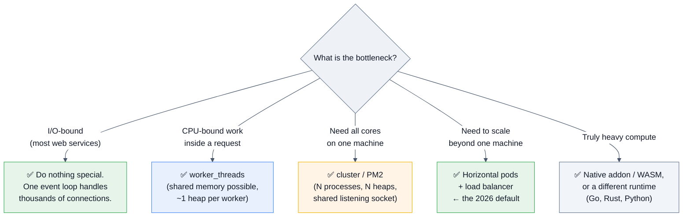

### `cluster` vs `worker_threads` vs containers

| | `cluster` (child processes) | `worker_threads` | Horizontal pods |
|---|---|---|---|
| Isolation | process | thread (own V8 isolate + heap) | container |
| Memory | **N × full heap** | ~N × smaller heap, `SharedArrayBuffer` possible | N × full, but independently schedulable |
| Crash blast radius | one worker | can take down the process | one pod |
| Shared state | ❌ IPC only | ✅ `SharedArrayBuffer`/`MessageChannel` | ❌ external store |
| Spawn cost | ~30–50 ms | ~1–5 ms | seconds |
| Best for | maximizing one VM | CPU work inside a request | **production at scale** |

```js
// cluster — for single-VM deployments
import cluster from 'node:cluster';
import os from 'node:os';

if (cluster.isPrimary) {
  const n = Number(process.env.WEB_CONCURRENCY) || os.availableParallelism();  // ✅ not os.cpus()
  for (let i = 0; i < n; i++) cluster.fork();
  cluster.on('exit', (worker, code, signal) => {
    log.warn({ pid: worker.process.pid, code, signal }, 'worker died — respawning');
    if (!worker.exitedAfterDisconnect) cluster.fork();     // avoid respawn during graceful shutdown
  });
} else {
  startServer();
}
```

> [!IMPORTANT]
> **The 2026 consensus answer:** *"For most enterprise services I run **one Node process per container** and let the orchestrator scale pods. Cluster duplicates the heap inside one memory limit, complicates graceful shutdown and metrics, and gives you a worse deployment story than Kubernetes already provides. I'd use cluster only on a single VM or bare-metal box."* Then add the nuance: cluster still buys you in-place rolling restarts on a VM, and `SO_REUSEPORT`-style kernel distribution avoids the primary becoming a bottleneck.

```js
// worker_threads — CPU work off the event loop
import { Worker, isMainThread, parentPort, workerData } from 'node:worker_threads';

// pool.js — a real pool, not one worker per task (spawning per task is a classic mistake)
class WorkerPool {
  #workers = []; #queue = []; #idle = [];
  constructor(file, size = os.availableParallelism()) {
    for (let i = 0; i < size; i++) this.#spawn(file);
  }
  #spawn(file) {
    const w = new Worker(file);
    w.on('message', ({ id, result, error }) => {
      const job = w.currentJob; w.currentJob = null;
      error ? job.reject(new Error(error)) : job.resolve(result);
      this.#idle.push(w); this.#drain();
    });
    w.on('error', err => { log.error({ err }, 'worker crashed'); this.#spawn(file); });
    this.#workers.push(w); this.#idle.push(w);
  }
  run(payload) {
    return new Promise((resolve, reject) => { this.#queue.push({ payload, resolve, reject }); this.#drain(); });
  }
  #drain() {
    while (this.#idle.length && this.#queue.length) {
      const w = this.#idle.pop(), job = this.#queue.shift();
      w.currentJob = job; w.postMessage(job.payload);
    }
  }
}
```

**Data transfer costs:** `postMessage` **structured-clones** by default (a copy — expensive for big payloads). Use **transferables** for zero-copy handoff, or `SharedArrayBuffer` + `Atomics` for genuinely shared state.

```js
worker.postMessage({ buf }, [buf]);       // buf becomes detached in the sender — zero copy
const sab = new SharedArrayBuffer(1024);  // real shared memory; needs Atomics for coordination
```

## 3.2 Memory: limits, leaks, and diagnosis

### The container-limit trap

```mermaid
%%{init: {'theme':'base','themeVariables':{'background':'#ffffff','mainBkg':'#eef2f7','primaryColor':'#eef2f7','primaryTextColor':'#111827','primaryBorderColor':'#64748b','secondaryColor':'#e8f0fe','tertiaryColor':'#f1f5f9','lineColor':'#475569','textColor':'#111827','clusterBkg':'#f8fafc','clusterBorder':'#94a3b8','edgeLabelBackground':'#ffffff','titleColor':'#111827','actorBkg':'#eef2f7','actorTextColor':'#111827','actorBorder':'#64748b','actorLineColor':'#475569','signalColor':'#111827','signalTextColor':'#111827','noteBkgColor':'#fff4e5','noteTextColor':'#111827','noteBorderColor':'#d97706','labelBoxBkgColor':'#eef2f7','labelBoxBorderColor':'#64748b','labelTextColor':'#111827','loopTextColor':'#111827','altBackground':'#f8fafc'}}}%%
flowchart LR
    C["📦 Container limit<br/>512 MB"] --> R["RSS = V8 heap<br/>+ Buffers (off-heap)<br/>+ native + code + stacks"]
    R --> V["V8 default old-space<br/>can exceed the container<br/>on 64-bit hosts"]
    V --> K["💥 OOMKilled by the kernel<br/>BEFORE V8 ever runs a<br/>full emergency GC"]
    FIX["✅ Fix: --max-old-space-size ≈ 70–75%<br/>of the container limit, so V8 GCs<br/>hard instead of getting killed"]
    K --> FIX
    style K fill:#fce8e6,stroke:#ea4335,color:#111827
    style FIX fill:#e6f4ea,stroke:#34a853,color:#111827
```

```bash
node --max-old-space-size=768 app.js     # for a 1 GiB container
```

Also: **`os.cpus().length` reports the host's cores, not your CFS quota.** In a 1-vCPU container on a 64-core node it returns 64 → cluster forks 64 processes → instant OOM and CPU thrash. Use `os.availableParallelism()` (Node 19.4+) and/or read the cgroup quota, or set `WEB_CONCURRENCY` explicitly. Likewise `UV_THREADPOOL_SIZE` should be sized to the quota, not the host.

### The leak archetypes

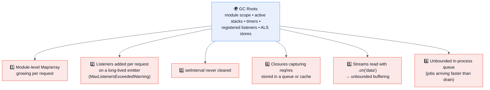

> [!NOTE]
> **Why Node leaks are brutal:** the process is long-lived with a single heap. A reference leaked *once per request* accumulates across every request the process has ever served. GC frees the **unreachable**, not the unused — one forgotten reference pins an entire object graph.

### Diagnosis playbook

```mermaid
%%{init: {'theme':'base','themeVariables':{'background':'#ffffff','mainBkg':'#eef2f7','primaryColor':'#eef2f7','primaryTextColor':'#111827','primaryBorderColor':'#64748b','secondaryColor':'#e8f0fe','tertiaryColor':'#f1f5f9','lineColor':'#475569','textColor':'#111827','clusterBkg':'#f8fafc','clusterBorder':'#94a3b8','edgeLabelBackground':'#ffffff','titleColor':'#111827','actorBkg':'#eef2f7','actorTextColor':'#111827','actorBorder':'#64748b','actorLineColor':'#475569','signalColor':'#111827','signalTextColor':'#111827','noteBkgColor':'#fff4e5','noteTextColor':'#111827','noteBorderColor':'#d97706','labelBoxBkgColor':'#eef2f7','labelBoxBorderColor':'#64748b','labelTextColor':'#111827','loopTextColor':'#111827','altBackground':'#f8fafc'}}}%%
flowchart LR
    S1["📈 Confirm:<br/>heapUsed rising ACROSS<br/>GC cycles (not just RSS)"] --> S2["📸 3 heap snapshots<br/>baseline → load → post-GC<br/>under identical traffic"]
    S2 --> S3["🔍 Diff: 'objects allocated<br/>between snapshots' that survived"]
    S3 --> S4["🧭 Follow the RETAINER chain<br/>up to a GC root"]
    S4 --> S5["🛠️ Fix: bound the cache •<br/>remove listeners • clear timers •<br/>pipeline() • WeakMap"]
    S5 --> S6["✅ Verify: same load,<br/>flat heap after GC"]
    style S1 fill:#e8f0fe,stroke:#4285f4,color:#111827
    style S4 fill:#fff4e5,stroke:#f4b400,color:#111827
    style S6 fill:#e6f4ea,stroke:#34a853,color:#111827
```

```bash
node --inspect app.js                        # chrome://inspect → Memory tab
node --heapsnapshot-signal=SIGUSR2 app.js    # kill -USR2 <pid> — snapshot without a restart
node --heap-prof app.js                      # allocation sampling profile
node --expose-gc -e "global.gc()"            # force GC to prove reachability
npx clinic doctor -- node app.js             # classifies the problem first
```

```js
// Ship these guardrails
import v8 from 'node:v8';
setInterval(() => {
  const m = process.memoryUsage();
  metrics.gauge('node.heap_used', m.heapUsed);
  metrics.gauge('node.rss', m.rss);
  metrics.gauge('node.external', m.external);         // Buffers live here — off-heap!
  metrics.gauge('node.array_buffers', m.arrayBuffers);
  metrics.gauge('node.heap_limit', v8.getHeapStatistics().heap_size_limit);
}, 15_000).unref();
```

| `memoryUsage()` field | What it is |
|---|---|
| `rss` | Total resident memory — what the kernel OOM-killer looks at |
| `heapTotal` / `heapUsed` | V8's JS heap |
| `external` | C++ objects bound to JS (includes `Buffer` backing stores) |
| `arrayBuffers` | `ArrayBuffer`/`Buffer` allocations specifically |

**Buffer leaks don't show in `heapUsed`** — a classic misdiagnosis. If RSS climbs while heap stays flat, look at `external`/`arrayBuffers`: unbounded buffering of request bodies, an unbounded `zlib` queue, or a native addon.

## 3.3 Event-loop lag: the single best health metric

```js
import { monitorEventLoopDelay, performance } from 'node:perf_hooks';

const h = monitorEventLoopDelay({ resolution: 10 });
h.enable();
setInterval(() => {
  metrics.gauge('eventloop.p50_ms', h.percentile(50) / 1e6);
  metrics.gauge('eventloop.p99_ms', h.percentile(99) / 1e6);
  metrics.gauge('eventloop.max_ms', h.max / 1e6);
  h.reset();
}, 10_000).unref();
```

| p99 lag | Meaning |
|---|---|
| < 10 ms | Healthy |
| 10–50 ms | Under load; watch it |
| 50–200 ms | Something synchronous is running per request |
| > 200 ms | Users are seeing it; health checks will start failing |

> [!TIP]
> **Use lag for load shedding, not just alerting:** when p99 lag exceeds a threshold, return `503` with `Retry-After` on non-critical routes and let the LB route elsewhere. Shedding early is what stops a slow degradation becoming a cascading outage.

## 3.4 Trade-offs a staff engineer must be able to argue

| Decision | Option A | Option B | How to decide |
|---|---|---|---|
| Process model | `cluster` | one process per pod | Pods, unless you're on a single VM. Cluster splits one memory limit N ways. |
| CPU work | `worker_threads` | separate service in Go/Rust | Workers if it's occasional and shares data; a separate service if it's the product (transcoding, ML). |
| Framework | Express | Fastify / Nest / Hono | Fastify for throughput + schema validation + typed replies; Nest for large teams needing structure; Hono for edge portability; Express only for legacy familiarity. |
| Data access | ORM (Prisma/TypeORM) | query builder (Kysely) / raw SQL | ORMs cost you control over the exact query — the N+1 and unindexed-scan risk is real. Use one, but always be able to read and tune the generated SQL. |
| Validation | TypeScript types | runtime schema (zod/valibot/TypeBox) | **Both.** Types vanish at runtime; every untrusted boundary needs a runtime schema. |
| Transport | REST | gRPC / GraphQL / tRPC | REST for public + cacheable; gRPC for internal high-throughput; GraphQL when many clients need different shapes (watch N+1 and query-cost DoS). |
| Background work | in-process timer/queue | external queue (BullMQ/SQS/Kafka) | In-process work dies with the pod and doesn't retry. Anything that must not be lost goes to a durable queue. |
| Sessions | in-memory | Redis / stateless JWT | In-memory breaks the moment you have two pods. |
| Logs | `console.log` | structured logger (pino) | Structured JSON with a trace id, always. `console.log` is synchronous to a TTY/file and can block. |
| Caching | in-process LRU | Redis | In-process is fastest but N pods = N caches with N× stampede risk; Redis is shared but adds a hop and a failure mode. Often both, with single-flight. |

## 3.5 Distributed-systems implications

| Concern | Node-specific answer |
|---|---|
| **Idempotency** | Client sends `Idempotency-Key` (`crypto.randomUUID()`); server stores key → response in Redis/DB with a TTL and replays it on retry. This is exactly Stripe's model. |
| **Exactly-once** | Doesn't exist over a network. Aim for **at-least-once delivery + idempotent handlers**. |
| **Retries** | Exponential backoff with **full jitter**, capped attempts, a retry budget, and only on idempotent methods + 5xx/429/network errors. Honour `Retry-After`. |
| **Thundering herd** | Jitter + circuit breaker + single-flight caching. Without jitter, every client retries in lockstep and finishes the job the outage started. |
| **Timeouts** | Every outbound call gets one, and the **budget must decrease down the call chain** (if you have 3 s, give the downstream 2 s) — otherwise timeouts never fire in the right place. |
| **Circuit breaking** | Fail fast when a dependency is down; serve cached/degraded responses. See the implementation in §6. |
| **Backpressure** | Streams give it for free; queues need explicit bounds. An unbounded in-process queue converts a downstream slowdown into an OOM. |
| **Load shedding** | Reject early (503 + `Retry-After`) based on event-loop lag or queue depth. Better than timing out after doing all the work. |
| **Graceful shutdown** | See §3.7 — mandatory for zero-downtime deploys. |
| **Consistency** | Node BFFs often read from replicas: be explicit about read-your-writes (route to primary after a write, or use a session token). |
| **Clock** | `Date.now()` is wall-clock and can jump; use `process.hrtime.bigint()`/`performance.now()` for durations. |
| **Tracing** | Propagate `traceparent` (W3C) through every hop; `AsyncLocalStorage` carries the active span across awaits. |

```js
// Deadline propagation — a genuinely senior pattern
function withDeadline(signal, ms) {
  return AbortSignal.any([signal, AbortSignal.timeout(ms)].filter(Boolean));
}
async function handler(req, res) {
  const budget = Number(req.headers['x-deadline-ms'] ?? 3000);
  const signal = withDeadline(req.signal, budget);
  const [user, orders] = await Promise.all([
    fetchUser(id,   { signal: withDeadline(signal, budget * 0.5) }),
    fetchOrders(id, { signal: withDeadline(signal, budget * 0.5) })
  ]);
  res.json({ user, orders });
}
```

## 3.6 Caching layers a Node engineer owns


**Cache stampede protection is the question behind the question:**

```js
// Single-flight: N concurrent misses for the same key → ONE downstream call
const inflight = new Map();
async function cached(key, ttlMs, loader) {
  const hit = lru.get(key);
  if (hit && hit.expires > Date.now()) return hit.value;
  if (inflight.has(key)) return inflight.get(key);            // 🔒 dedupe
  const p = loader()
    .then(value => { lru.set(key, { value, expires: Date.now() + ttlMs }); return value; })
    .finally(() => inflight.delete(key));
  inflight.set(key, p);
  return p;
}
```
Add **jittered TTLs** (`ttl * (0.9 + Math.random() * 0.2)`) so a thousand keys written together don't all expire in the same second, and consider **stale-while-revalidate**: serve the stale value immediately and refresh in the background.

## 3.7 Graceful shutdown & Kubernetes lifecycle

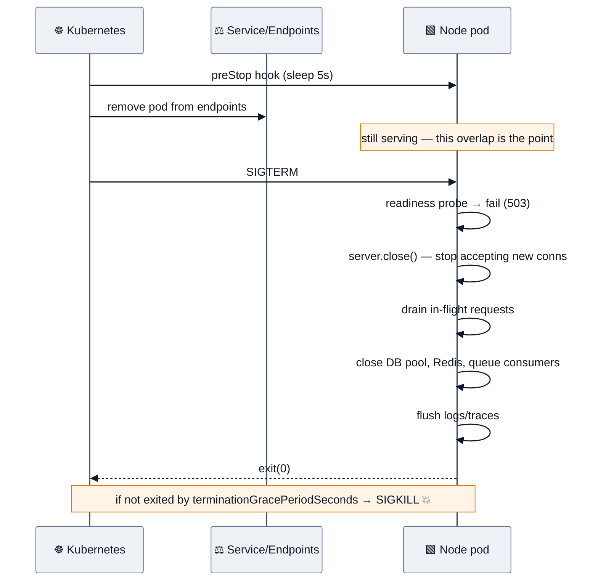

```js
let shuttingDown = false;

app.get('/readyz', (_, res) => shuttingDown ? res.sendStatus(503) : res.sendStatus(200));
app.get('/healthz', (_, res) => res.sendStatus(200));     // liveness ≠ readiness

async function shutdown(signal) {
  if (shuttingDown) return;
  shuttingDown = true;
  log.info({ signal }, 'shutting down');

  const hard = setTimeout(() => { log.fatal('forced exit'); process.exit(1); }, 25_000).unref();

  await new Promise(resolve => server.close(resolve));      // stop accepting; drain in-flight
  server.closeIdleConnections?.();                          // Node 18.2+: drop idle keep-alives
  await queue.close();
  await db.end();
  await redis.quit();
  await otelSdk.shutdown();                                 // flush traces
  clearTimeout(hard);
  process.exit(0);
}
process.on('SIGTERM', () => shutdown('SIGTERM'));
process.on('SIGINT',  () => shutdown('SIGINT'));
```

> [!WARNING]
> **The two mistakes that break zero-downtime deploys:** (1) exiting immediately on SIGTERM — in-flight requests get `ECONNRESET`; (2) failing readiness at the *same instant* you stop accepting — the LB hasn't noticed yet and still routes traffic. The `preStop` sleep exists to create that overlap window. Also: **`terminationGracePeriodSeconds` must exceed your drain timeout**, or Kubernetes SIGKILLs you mid-drain.
>
> And run Node as **PID 1 correctly**: with `npm start` as the entrypoint, npm may not forward SIGTERM to Node at all. Use `CMD ["node", "server.js"]` (exec form) or an init like `tini`.

## 3.8 Observability

| Signal | Implementation |
|---|---|
| **Logs** | `pino` (JSON, async, fast) with `trace_id`/`request_id` from `AsyncLocalStorage`; redact PII/secrets; log levels by env; **never `console.log` in hot paths** (synchronous to fd) |
| **Metrics** | `prom-client`: RED (Rate/Errors/Duration) per route + event-loop lag + heap + GC + pool saturation + queue depth |
| **Traces** | `@opentelemetry/sdk-node` with auto-instrumentation for http/undici/pg/redis; propagate W3C `traceparent`; sample 1–10% + always-on for errors |
| **Profiles** | Continuous profiling (Pyroscope/Datadog) or on-demand `--cpu-prof` from a drained pod |
| **Events** | `diagnostics_channel` for zero-cost hooks into http/undici internals |

```js
// The metrics that actually catch incidents
const httpDuration = new Histogram({
  name: 'http_request_duration_seconds',
  labelNames: ['method', 'route', 'status'],       // ⚠️ route TEMPLATE, never the raw URL (cardinality!)
  buckets: [0.005, 0.01, 0.05, 0.1, 0.3, 1, 3, 10]
});
new Gauge({ name: 'nodejs_eventloop_lag_p99_seconds', collect() { this.set(h.percentile(99) / 1e9); } });
new Gauge({ name: 'db_pool_waiting', collect() { this.set(pool.waitingCount); } });
```

> [!TIP]
> **Cardinality is the #1 observability cost bug.** Labelling by raw URL, user id, or request id explodes your time-series count and your bill. Use route templates (`/users/:id`), bucket the rest, and put high-cardinality data in traces/logs, not metrics.

## 3.9 Performance tuning: levers ranked by impact

| Rank | Lever | Typical win | Verify with |
|---|---|---|---|
| 1 | **Remove sync work from the request path** (sync fs/crypto/big `JSON.parse`) | p99 collapses | event-loop lag + `--cpu-prof` |
| 2 | **Fix the database** (indexes, N+1, pool size, prepared statements) | usually the real bottleneck | slow-query log, `EXPLAIN`, pool-waiting gauge |
| 3 | **Cache with single-flight** | order-of-magnitude on hot keys | hit rate, downstream RPS |
| 4 | **Connection pooling + keep-alive** (undici Agent, DB pool) | removes TLS/TCP handshakes | connection-reuse rate |
| 5 | **Stream instead of buffer** | memory flat, TTFB down | RSS, `external` |
| 6 | **Parallelize independent awaits** (`Promise.all`) | latency = max, not sum | trace waterfall |
| 7 | **Move CPU to workers/native/WASM** | event loop freed | lag + CPU profile |
| 8 | **Payload size** (compress at the edge, trim fields, pagination) | bandwidth + parse time | response sizes |
| 9 | **Framework/serialization** (Fastify + JSON schema serializer) | 10–30% on JSON-heavy APIs | load test |
| 10 | Micro-optimizations (object shapes, avoid `delete`) | few % | benchmark |

```js
// ❌ latency = sum of both
const user = await getUser(id);
const orders = await getOrders(id);
// ✅ latency = max of both
const [user2, orders2] = await Promise.all([getUser(id), getOrders(id)]);
// ✅ when N is large, bound the concurrency — don't DDoS your own database
const results = await mapLimit(ids, 10, getUser);
```

## 3.10 Cost optimization

| Cost | Node lever |
|---|---|
| **Compute** | Right-size pods (measure RSS at p99, don't over-provision); one process per pod; scale on event-loop lag or RPS, not CPU alone (Node can be latency-bad at 40% CPU) |
| **Egress** | Compress at the edge/LB, not in Node; paginate; trim response fields; use HTTP/2 |
| **Database** | Cache + connection pooling (each connection costs the DB memory); read replicas for reports; kill N+1s |
| **Observability** | Sample traces, cap metric cardinality, drop debug logs in prod, aggregate before shipping |
| **Serverless** | Small deploy bundles and lazy imports for cold starts; avoid heavy top-level work; consider provisioned concurrency only for latency-critical paths |
| **npm/CI** | Cache `node_modules`/store; `npm ci` with a warm cache; prune devDependencies in the runtime image; multi-stage + distroless images (smaller pulls, faster scale-out) |

## 3.11 Failure recovery patterns

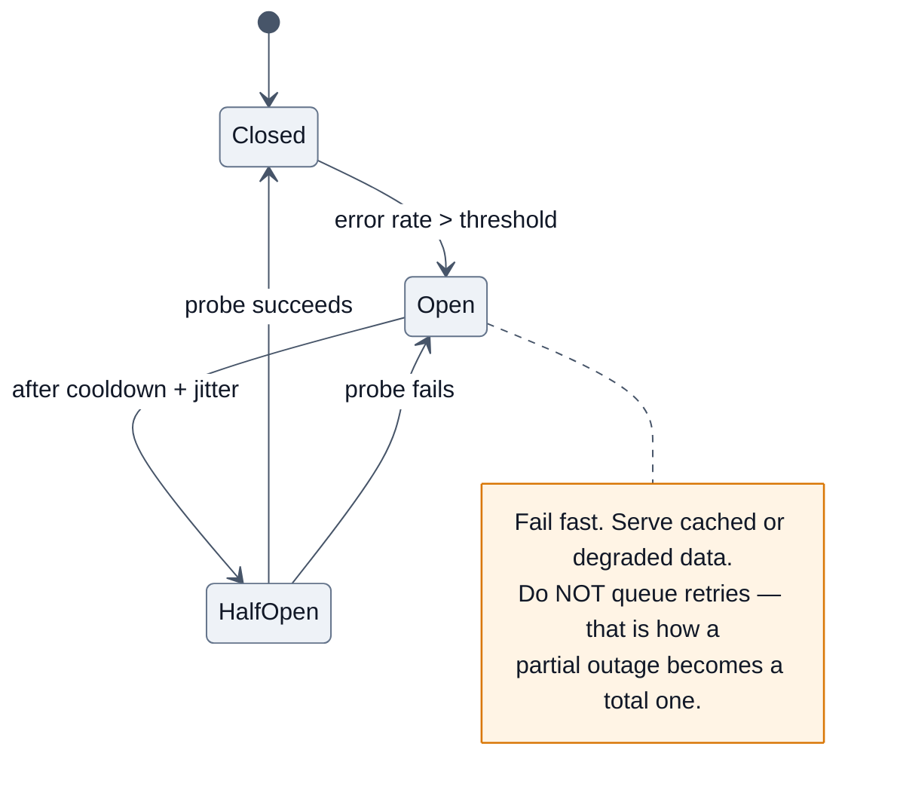

**The resilience stack, in the order you should mention it:** timeouts on every call → bounded retries with jitter (idempotent only) → circuit breaker → bulkheads (separate pools per dependency so one slow service can't consume all your concurrency) → load shedding on lag → graceful degradation (cached/partial responses) → dead-letter queue for poison messages → runbooks and alerts on SLO burn, not raw error counts.

---

# 4. 🎤 Interview Questions by Level

**Rating legend:** ★★★★★ Must know (asked in >50% of loops) · ★★★★☆ Very common · ★★★☆☆ Situational/differentiator

---

## 4.1 Beginner (0–2 yrs · SDE-1 · service companies)

### Q1. What is Node.js and why would you use it? ★★★★★

**Why interviewers ask it:** it's the fastest way to see whether you understand Node as a *runtime* or just as "backend JavaScript."

**Expected answer:** Node is a runtime that executes JavaScript outside the browser, built on **V8** (execution) and **libuv** (event loop + non-blocking I/O + thread pool). It uses a single-threaded event loop with non-blocking I/O instead of thread-per-request, which makes it excellent for **I/O-bound, high-concurrency** workloads (APIs, BFFs, real-time, streaming) and poor for CPU-bound work.

**Follow-ups:** *"When would you NOT choose Node?"* → CPU-heavy work (video encoding, ML, big in-memory joins), or where a strongly-typed compiled runtime and true multithreading matter. *"What's the alternative model?"* → thread-per-request (Java/Tomcat), goroutines (Go), async runtimes (Python asyncio, Rust tokio).

**Common mistakes:** "Node is a framework"; "Node is fast because JavaScript is fast" (it's fast because of the I/O model, not the language).

---

### Q2. Is Node.js single-threaded? ★★★★★

**Expected answer:** **Your JavaScript runs on a single thread — the event loop.** The *process* is multi-threaded: libuv's thread pool (4 by default) handles `fs`, `dns.lookup`, `zlib`, and some `crypto`; V8 has GC and compiler threads; and you can spawn `worker_threads`. Network I/O uses neither — the kernel notifies via epoll/kqueue/IOCP.

**Follow-ups:** *"So how does it handle 10,000 concurrent connections?"* → they're mostly idle sockets waiting on I/O; the loop only does work when data arrives. *"What breaks this model?"* → any synchronous CPU work in a handler.

---

### Q3. Explain the event loop. ★★★★★
Name the six libuv phases in order (**timers → pending callbacks → idle/prepare → poll → check → close**), explain that `poll` is where an idle process blocks, and that `process.nextTick` and the promise microtask queue drain **between every phase and every callback**. See §2.1.

**Follow-ups:** `setTimeout(0)` vs `setImmediate` at the top level (non-deterministic) vs inside I/O (`setImmediate` always first) · `nextTick` starvation.

---

### Q4. Blocking vs non-blocking; sync vs async APIs. ★★★★★
`readFileSync` stops the whole process; `readFile`/`fs/promises` hands work to libuv and returns immediately. **Sync APIs are for startup only.** Give the concrete consequence: one 200 ms sync call means every one of the 500 concurrent requests in flight waits 200 ms.

---

### Q5. What is `npm`? `npm` vs `npx` vs `npm ci`? ★★★★☆
`npm` = registry + CLI + `package.json`. `npx` runs a package binary without installing globally. **`npm ci`** wipes `node_modules` and installs the lockfile exactly — the only correct command in CI/production. Follow-up: `dependencies` vs `devDependencies` vs `peerDependencies`; what `^1.2.3` allows.

---

### Q6. `module.exports` vs `exports`; `require` vs `import`. ★★★★★
`exports` is just a reference to `module.exports`; reassigning `exports = {...}` breaks the link, while `exports.foo = …` works. `require` is synchronous CJS with value-copy semantics; `import` is ESM — static, hoisted, live bindings, top-level `await`. See §1.6.

---

### Q7. What is middleware in Express? ★★★★★
A function `(req, res, next)` in an ordered chain that can read/modify the request, short-circuit with a response, or pass control via `next()`. Error middleware has **four** parameters `(err, req, res, next)` — a very common gotcha. Order matters: body parsing before routes, error handler last.

```js
app.use(express.json({ limit: '100kb' }));      // ✅ always bound the body size
app.use((req, _res, next) => { req.id = randomUUID(); next(); });
app.use('/api', routes);
app.use((err, _req, res, _next) => {            // 4 args = error handler
  const status = err.status ?? 500;
  log.error({ err, status });
  res.status(status).json({ error: err.expose ? err.message : 'Internal Server Error' });
});
```

---

### Q8. Callback hell and how promises fix it. ★★★★☆
Nested callbacks → unreadable, error-prone, **inversion of control**. Promises give composition; `async/await` gives linear reading and `try/catch`. Mention `util.promisify` for legacy callback APIs, and that most core modules now ship promise variants (`node:fs/promises`, `node:timers/promises`, `node:stream/promises`, `node:dns/promises`).

---

### Q9. What is `package.json`? Which fields matter? ★★★★☆
`name`, `version`, `type`, `main`/`exports`, `scripts`, `dependencies`, `engines`, `files`. Follow-up: what does `"type": "module"` change?

---

### Q10. How do you read a request body / send JSON? ★★★☆☆
`express.json()` or manual stream accumulation with a size cap. The **manual version is a classic coding ask** — and the size cap is the graded detail (see §6 E5).

---

### Q11–20 Rapid-fire (service-company round)

| Q | Rating | One-line answer |
|---|---|---|
| REST verbs & idempotency | ★★★★☆ | GET/PUT/DELETE idempotent; POST is not; PATCH usually isn't |
| Status codes you use daily | ★★★★☆ | 200/201/204, 400/401/403/404/409/422/429, 500/502/503/504 |
| `process.env` and config | ★★★★☆ | Never commit secrets; validate at boot; `--env-file` in Node 20+ |
| What is `__dirname` in ESM? | ★★★☆☆ | Doesn't exist → `import.meta.dirname` |
| Synchronous vs asynchronous error handling | ★★★★☆ | `try/catch` only catches sync throws and awaited rejections |
| What is a Buffer? | ★★★★☆ | Fixed-length raw binary outside the V8 heap |
| What is `EventEmitter`? | ★★★★☆ | Pub/sub within a process; unhandled `'error'` crashes it |
| `nodemon` vs `node --watch` | ★★★☆☆ | Built-in watch mode since Node 18/19 — no dependency needed |
| CORS in Express | ★★★★☆ | `cors` middleware; browser-enforced; not authorization |
| How do you connect to a database? | ★★★★☆ | A **pool**, created once at boot, closed on shutdown — never per request |

---

## 4.2 Intermediate (2–5 yrs · SDE-2)

### Q1. Walk me through the event loop phases and predict this output. ★★★★★
The core §2.1 material. **The differentiator:** explaining *why* the top-level `setTimeout`/`setImmediate` race is non-deterministic (process startup time vs the 1 ms timer threshold) and why it becomes deterministic inside an I/O callback (poll → check in the same iteration).

---

### Q2. `process.nextTick` vs `setImmediate` vs `setTimeout(0)` vs `queueMicrotask`. ★★★★★

| API | When | Priority |
|---|---|---|
| `process.nextTick` | between every phase/callback | **highest** — starves the loop if recursive |
| `queueMicrotask` / promises | after nextTick queue | high |
| `setTimeout(fn, 0)` | timers phase, next iteration | normal (min ~1 ms) |
| `setImmediate` | check phase, same iteration after poll | normal, but **deterministic after I/O** |

**Follow-up:** *"Why does Node core use `nextTick` at all?"* → to emit an error or event *after* the caller has had a chance to attach a listener, without deferring a whole loop iteration.

---

### Q3. Explain streams and backpressure. Why `pipeline` over `pipe`? ★★★★★
Four stream types, `highWaterMark`, flowing vs paused, and the `write() → false → 'drain'` contract. **`pipe` honours backpressure but does not forward errors or destroy the streams on failure** — a failed `pipe` chain leaks file descriptors and sockets. `pipeline` (especially `stream/promises`) does both. See §2.4.

**Follow-ups:** *"You need to process a 10 GB CSV. How?"* → `createReadStream` → a line-splitting Transform → batched inserts, with concurrency limits and backpressure — never `readFile`. *"What breaks if you `.on('data')` manually?"* → unbounded buffering → RSS growth → OOM.

---

### Q4. How do you handle errors in Node? ★★★★★
The four channels (§2.7), operational vs programmer errors, custom `Error` subclasses with `cause`, why `'error'` events must have listeners, and why an unhandled rejection crashing the process is the *right* default.

---

### Q5. `cluster` vs `worker_threads` vs `child_process` — when do you use each? ★★★★★

| | Purpose |
|---|---|
| `cluster` | Multiple **processes** sharing one listening port to use all cores on a machine |
| `worker_threads` | CPU-bound JS off the event loop, with optional shared memory |
| `child_process` (`spawn`/`fork`/`exec`) | Run another program (`ffmpeg`) or an isolated Node script; `fork` adds an IPC channel |

**Follow-up they always ask:** *"Would you use cluster in Kubernetes?"* → usually no; one process per pod, scale pods. Explain the memory-limit split and the shutdown/metrics complexity.

**Also:** `exec` buffers output and takes a shell (**command-injection risk**); `spawn`/`execFile` stream and take an argv array — prefer them.

---

### Q6. Explain the libuv thread pool. What uses it? ★★★★★
`fs`, `dns.lookup`, `zlib`, and some `crypto` (pbkdf2, scrypt, randomBytes) — **not network I/O**. Default size 4, tunable via `UV_THREADPOOL_SIZE` (max 1024) before first use. Give the failure mode: four concurrent `pbkdf2` calls stall every file read and DNS lookup in the process.

---

### Q7. How would you find and fix a memory leak in a Node service? ★★★★★
The §3.2 playbook: confirm growth across GC cycles → three heap snapshots under identical load → diff → **retainer chain** → fix → verify flat. Name concrete suspects: module-level caches, per-request listeners on a long-lived emitter, uncleared intervals, closures holding `req`/`res`, `.on('data')` without backpressure. Mention that **Buffer leaks show in `external`/`arrayBuffers`, not `heapUsed`**.

---

### Q8. What is `AsyncLocalStorage` and why does it exist? ★★★★☆
Request-scoped context that survives `await` boundaries without threading parameters — the mechanism behind request-id logging and OpenTelemetry span propagation. Stable since 16.4, low single-digit percent overhead. Pitfalls: lost across worker threads and across promises created in another request's context.

---

### Q9. How do you secure an Express API? ★★★★★
See §10: helmet headers, body-size limits, rate limiting, schema validation on every input, parameterized queries, `HttpOnly; Secure; SameSite` cookies (not `localStorage`) for sessions, JWT verification with a pinned algorithm, path-traversal and SSRF guards, `npm ci` + audit + `--ignore-scripts`, secrets from a manager not the repo, and structured logging with redaction.

---

### Q10. Explain JWT vs session cookies. ★★★★☆

| | Session (server-side) | JWT (stateless) |
|---|---|---|
| Storage | store (Redis) + opaque cookie | signed token, self-contained |
| Revocation | ✅ immediate | ❌ hard — needs a denylist or very short TTL |
| Scale | needs a shared store | no store lookup |
| Size | tiny cookie | larger, sent on every request |
| Risk | store availability | **can't be un-issued**; `alg: none` / algorithm confusion; leaking claims |

**The mature answer:** short-lived access token (5–15 min) + rotating refresh token stored in an `HttpOnly` cookie with reuse detection. Say why: it gets you stateless verification *and* practical revocation.

---

### Q11. `Promise.all` vs `allSettled` vs `race` vs `any`; sequential vs parallel awaits. ★★★★★
Know all four, plus: `Promise.all` **does not cancel** the other operations on rejection — they keep running and can become unhandled rejections. In a service, prefer `allSettled` for partial-success aggregation and a **bounded pool** for large N.

---

### Q12. How do you test a Node service? ★★★★☆
Unit (pure logic) → integration (real DB via Testcontainers, HTTP via `supertest`/`fetch`) → contract → a few E2E. **Node's built-in runner** (`node --test`) now runs files in parallel and auto-awaits subtests; `vitest`/`jest` remain common. Mock the network with `undici`'s `MockAgent` or `nock` — never hit real third parties in CI. Use fake timers for retry/backoff logic and a fixed seed for anything random.

---

### Q13. Rapid-fire intermediate

| Q | Rating | Core |
|---|---|---|
| `spawn` vs `exec` vs `execFile` vs `fork` | ★★★★☆ | stream vs buffered+shell vs no-shell vs Node+IPC |
| What does `server.close()` actually do? | ★★★★☆ | Stops accepting **new** connections; existing ones drain (keep-alives may linger → `closeIdleConnections`) |
| Why is `console.log` risky in production? | ★★★☆☆ | Synchronous to fd for files/TTY; blocks; unstructured |
| Circular dependencies in CJS vs ESM | ★★★☆☆ | CJS gives a partially-filled `exports`; ESM gives a TDZ error unless it's a hoisted function |
| `Buffer.alloc` vs `allocUnsafe` | ★★★★☆ | Zero-filled vs possibly leaking old memory |
| Streams: `objectMode` | ★★★☆☆ | Chunks are JS values; default `highWaterMark` is 16 objects |
| What is `undici`? | ★★★★☆ | Node's HTTP/1.1 client, powers global `fetch`; pooling, interceptors, `MockAgent` |
| How do you schedule background jobs? | ★★★★☆ | Durable queue (BullMQ/SQS) — not `setInterval`, which dies with the pod and doesn't retry |
| Rate limiting a Node API | ★★★★☆ | Token bucket in Redis (atomic Lua), per user and per IP; return `429` + `Retry-After` |
| `dns.lookup` vs `dns.resolve` | ★★★☆☆ | `lookup` uses `getaddrinfo` on the **thread pool**; `resolve` queries DNS over the network — matters under load |

---

## 4.3 Senior (5–8 yrs)

### Q1. p99 latency tripled but CPU is only at 40%. Diagnose. ★★★★★

**Why:** this is *the* senior Node question — it separates people who've operated Node from people who've written it.

**Expected answer (as a funnel):**
1. **Check event-loop lag first.** If p99 lag is high while CPU is moderate, something synchronous or a burst of microtasks is blocking the loop between I/O.
2. **Correlate with a deploy or a traffic shape change** (bigger payloads? a new endpoint? a cache-hit-rate drop?).
3. **Look at downstream:** DB pool `waitingCount` climbing means requests are queueing for connections, not CPU. A slow dependency without a timeout holds sockets and concurrency.
4. **CPU profile** (`--cpu-prof` on one drained pod). A wide flat frame = one slow function: `JSON.parse` of a large body, sync crypto, a `sort` over a big array, a template render, or a catastrophic regex.
5. **Check GC**: `--trace-gc` or GC metrics — long major GCs cause exactly this signature (latency spikes at moderate CPU).
6. **Fix and verify** with the same load: lag p99 back under 10 ms, latency histogram restored.

**Follow-ups:** *"CPU is at 40% — why not just add pods?"* → if the bottleneck is a lock-step downstream or a blocking call, more pods multiply the downstream load without fixing the latency. *"What if lag is fine but latency is bad?"* → the time is spent waiting on I/O: look at traces, not profiles.

---

### Q2. Design the graceful-shutdown and health-check strategy for a Node service on Kubernetes. ★★★★★
The full §3.7 answer: `preStop` sleep → SIGTERM → readiness fails → `server.close()` → drain → close pools/consumers → flush telemetry → exit, with a hard timeout **shorter than** `terminationGracePeriodSeconds`. Distinguish liveness (am I alive?) from readiness (should I get traffic?) — and never make liveness check a downstream dependency, or a database blip will restart your whole fleet.

---

### Q3. Your service OOMKills every ~6 hours. Walk me through it. ★★★★★
§3.2 playbook, plus the container-limit vs `--max-old-space-size` mismatch and the RSS-vs-heap distinction (Buffers are `external`). Name what you'd add so it never surprises you again: heap/RSS gauges, an alert on the *slope*, and a snapshot-on-signal capability in prod.

---

### Q4. How do you make a Node service resilient to a flaky downstream? ★★★★☆
Timeouts (with a shrinking budget down the chain) → bounded retries with full jitter on idempotent calls only → circuit breaker → bulkhead (separate connection pools per dependency) → cached/degraded fallback → load shedding on lag → alert on SLO burn. **Crucially:** explain why naive retries make an outage worse and why a circuit breaker must fail *fast* rather than queue.

---

### Q5. Design the observability for a fleet of 40 Node services. ★★★★☆
OTel SDK in a shared internal package so instrumentation is uniform and upgradeable; W3C trace propagation across every hop including queues; `AsyncLocalStorage`-backed request-id in every log line; RED metrics per route + Node runtime metrics (lag, heap, GC, pool saturation); sampling policy (head-based 1–10% + tail-based always-on for errors/slow); cardinality budget; dashboards and alerts defined as code; runbooks linked from each alert. Mention `diagnostics_channel` for zero-cost hooks.

---

### Q6. ESM migration for a large CJS codebase. ★★★★☆
Incremental: set `"type": "module"` per package in a monorepo, not repo-wide at once; convert leaves first; replace `__dirname`/`require.resolve`/`require.cache` idioms; fix `require(esm)` vs dynamic `import()` boundaries; keep a dual build with an `exports` map for published packages and **watch for the dual-package hazard** (duplicate singletons); update Jest/ts-node config or move to Vitest/native runner. Gate with CI so no new CJS lands.

---

### Q7. How would you handle 50k concurrent WebSocket connections? ★★★★☆
Per-connection memory budget (measure it — a few KB to tens of KB each), horizontal pods behind an L4/L7 LB with sticky routing or a shared pub/sub (Redis adapter / NATS) for cross-pod fan-out, heartbeat/ping-pong with idle eviction, backpressure on slow consumers (drop or disconnect rather than buffering unboundedly), authentication at handshake, and a plan for reconnect storms after a deploy (jittered reconnect + gradual rollout). Mention that **sticky sessions make rolling deploys harder** and that presence data should be ephemeral.

---

### Q8. Rapid-fire senior

| Q | Rating | Core |
|---|---|---|
| How do you size a DB connection pool? | ★★★★☆ | Not "bigger is better" — the DB has a hard max; pool ≈ (cores × k) tuned by measuring `waitingCount` and DB CPU; total across all pods must stay under the server limit |
| Where do you put idempotency keys? | ★★★★☆ | Redis/DB with a TTL, storing the *response*; replay on duplicate |
| Explain N+1 and how you'd catch it | ★★★★☆ | One query per row from an ORM/GraphQL resolver; catch with query-count assertions in tests + slow-query logs; fix with joins or DataLoader batching |
| How do you do zero-downtime DB migrations? | ★★★★☆ | Expand → migrate → contract; backward-compatible schema; never drop a column in the same deploy that stops writing it |
| Multi-stage Docker for Node | ★★★★☆ | Build deps → prune to prod deps → distroless/alpine runtime, non-root user, exec-form CMD, `NODE_ENV=production` |
| When is serverless the wrong answer for Node? | ★★★☆☆ | Long-lived connections (WebSocket), heavy cold-start sensitivity, per-request DB connections, sustained high throughput (cost) |
| Explain `AbortSignal` propagation through a request | ★★★★☆ | `req.signal` → pass into every downstream call → cancel work when the client disconnects |

---

## 4.4 Staff / Principal (8+ yrs)

### Q1. Design the Node platform for 40 teams and 200 services. ★★★★★
**Answer as governance:** a golden-path service template (logging, tracing, health, shutdown, config, error taxonomy, CI, Dockerfile) that teams get for free; a shared internal SDK versioned with a deprecation policy; paved-road frameworks (pick one HTTP framework, one validation library, one ORM) with an escape hatch that requires a written justification; a runtime-version upgrade train (Node LTS-only, upgrade within N weeks of a release); an SLO framework with error budgets; production readiness reviews; and dependency policy (allowlist, provenance, automated bumps). Measure adoption, not compliance.

### Q2. Node vs Go vs Java for a new high-throughput service — argue it. ★★★★☆
Structure: **workload shape first** (I/O-bound with lots of downstream fan-out → Node's model is genuinely good; CPU-bound or strict tail-latency at high RPS → Go/Java win because of true multithreading and predictable GC). Then **org factors** (existing expertise, shared code with frontend, hiring, ops tooling). Then **cost** (Node pods are cheap for I/O-bound work; Go uses less memory per unit of throughput). Give a decision, and give the conditions under which you'd change it.

### Q3. Your Node fleet's p99 is dominated by GC pauses. What do you do? ★★★☆☆
Reduce allocation rate (that's the real lever): avoid per-request large object graphs, stream instead of buffering, reuse buffers, avoid megamorphic hot paths, cut intermediate arrays. Then tune: `--max-semi-space-size` to trade young-gen GC frequency against pause length, right-size the heap, and consider splitting a big monolith process into smaller-heap pods. Always measure with `--trace-gc`/GC metrics before and after — and be honest that V8 tuning flags are a last resort with version-dependent effects.

### Q4. How do you roll out a Node major-version upgrade across the org? ★★★★☆
Compatibility matrix of native addons and pinned deps; run the test suites on the new version in CI as a non-blocking job first; canary a low-risk service; watch for the usual breakages (OpenSSL/crypto changes, `punycode`/deprecations, ICU, native module ABI); publish a migration guide and codemods; set a deadline tied to the security-support EOL of the old line; automate the reminder. **Frame it as risk management with a deadline, not a request.**

### Q5. Post-incident: a dependency upgrade shipped a malicious postinstall script to CI. Run the review. ★★★★★
Blameless timeline; blast radius (which secrets were in the CI env, which tokens must be rotated); contributing factors (no lockfile pinning, scripts enabled, broad CI permissions, no egress restriction, no provenance verification); immediate actions (rotate everything, audit published artifacts, check for exfiltration in egress logs); systemic fixes (`--ignore-scripts` by default, hermetic builds, short-lived scoped tokens, egress allowlist, provenance/attestation checks, lockfile-diff review in PRs). Staff answers change the *class* of incident, not the one package.

### Q6. What do you standardize vs leave to teams? ★★★☆☆
Standardize: Node version policy, logging/tracing/metrics SDK, error taxonomy, health/shutdown behaviour, auth middleware, CI/CD, base image, security policy. Leave free: internal file layout, choice of test style, local caching strategy. Justify by **cost of inconsistency vs cost of coordination**.

---

## 4.5 FAANG-specific patterns

| Company | What their Node rounds look like | Prepare |
|---|---|---|
| **Amazon** | DSA + system design + **Leadership Principles in every round**. Node depth appears mainly in the domain round for backend/SDE roles; expect "tell me about a time you dove deep into a production issue" with metrics. | STAR stories with numbers; ownership/dive-deep; API design; DynamoDB access patterns |
| **Netflix** | Senior-only, pragmatic, ambiguous. Node is their historical BFF/edge tier — expect real questions about aggregating dozens of downstream calls, timeouts, fallbacks, and observability. | Resilience patterns, streaming, "here's a real problem we had" discussions |
| **Meta** | JS depth is real (they hire for it), but backend roles lean on general system design + DSA. Node appears in tooling and edge services. | DSA + FE/BE system design; vanilla JS fluency |
| **Google** | DSA-heavy; Node shows up in "specialty" rounds and for Cloud/Firebase-adjacent roles. Web fundamentals for frontend-leaning roles. | LeetCode; distributed systems fundamentals |
| **Microsoft** | Balanced DSA + design + practical debugging; TypeScript-friendly (they built it). VS Code and Azure SDK teams are heavy Node users. | TS generics, SDK/API design, extension architecture |
| **Uber / DoorDash / Airbnb** | Node as an API gateway/BFF. Expect event-loop, timeout, and circuit-breaker questions plus a design round (dispatch, feed, search). | Production Node + service design |
| **Stripe / Coinbase** | Correctness-first: idempotency, retries, money handling, webhooks (signature verification, replay protection, ordering), plus a bug-fix round in a real repo. | Webhook design, idempotency, API versioning |
| **Cloudflare / Vercel** | Node vs edge runtimes: what's available in an isolate, why `fs` isn't, streaming responses, cold starts. | Web-standard APIs, `ReadableStream`, Workers model |

**Universal advice:** narrate your reasoning, state assumptions, quantify (RPS, payload size, latency budget), and always close a design answer with *"here's what I'd measure to know if this is working."*

---

## 4.6 Startups

Expect: build a working endpoint end-to-end in 45–60 minutes (validation → DB → error handling → a test), debug a broken repo, "how would you add auth to this?", "our API got slow, what do you check?", and a candid trade-off conversation.

**What impresses:** pragmatism, knowing when *not* to add a dependency, comfort across the stack, and clear articulation of what you'd cut to ship. **What sinks candidates:** over-engineering a CRUD service with hexagonal architecture, a DI container, CQRS, and Kafka.

---

## 4.7 Product companies (Walmart, Flipkart, Swiggy, PhonePe, Razorpay, Atlassian, Shopify)

The distinctive round is **machine coding / LLD**: 60–120 minutes to build something real.

| Common prompts | What's graded |
|---|---|
| REST API with auth, pagination, filtering, validation, tests | Layering, error handling, input validation, status codes, pagination correctness (cursor > offset) |
| Rate limiter middleware (token bucket, Redis-backed) | Atomicity, per-key limits, headers (`X-RateLimit-*`, `Retry-After`) |
| File upload + processing pipeline | Streaming, size limits, temp-file cleanup, virus/type checks, backpressure |
| URL shortener / paste service | ID generation, collisions, DB schema, caching, analytics writes off the hot path |
| Webhook receiver | Signature verification, replay protection, idempotency, fast ACK + async processing |
| Job queue with retries & DLQ | Visibility timeout, exponential backoff, poison-message handling |
| In-memory cache with TTL + LRU | Eviction correctness, single-flight, memory bounds |

Plus **Node internals** (event loop, streams, cluster, memory), **DB** (indexes, transactions, N+1), and **system design** at the LLD level.

> [!TIP]
> **Machine-coding scoring is decided in the last 10 minutes.** A working happy path + input validation + a real error handler + one meaningful test + a short README of trade-offs beats a half-built "perfect" architecture. Write the README even if you run out of time for tests.

---

## 4.8 Service companies (TCS, Infosys, Wipro, Cognizant, Accenture, Capgemini, HCL, LTIMindtree)

Format: rapid-fire theory, 20–40 questions in 30 minutes, often after an MCQ screen. Breadth and confidence win; depth is rarely probed.

**The list they actually use:** what is Node · is it single-threaded · event loop · blocking vs non-blocking · callback hell · promises vs async/await · `module.exports` vs `exports` · `require` vs `import` · npm vs npx · `package.json` fields · middleware · Express routing · error-handling middleware · `req`/`res` objects · REST verbs & status codes · CORS · JWT basics · `process.env` · streams (types + one use) · Buffer · `fs` sync vs async · `EventEmitter` · `setTimeout` vs `setImmediate` vs `nextTick` · `cluster` basics · MongoDB/Mongoose or SQL basics · connection pooling · CRUD API structure · unit testing basics · `nodemon`/`pm2` · debugging with `console.log` vs `--inspect` · what is `npm audit`.

Then 2–3 small coding tasks: build a GET/POST endpoint, read and parse a file, filter an array of objects, promisify a callback, handle an async error, write a simple middleware.

> [!NOTE]
> **Service-company strategy:** two sentences plus one concrete example from your own project, then stop. Mention real usage ("we used streams for a 2 GB export") whenever true — practical exposure is weighted heavily.

---

# 5. 📊 Frequently Asked Questions (Ranked by Frequency)

*Synthesized and deduplicated across Glassdoor/AmbitionBox reports, Blind, r/node and r/developersIndia threads, GeeksforGeeks/InterviewBit/Scaler question banks, 2026 Node interview roundups, and company-specific write-ups. "Frequency" = share of Node-touching loops where the question (or a direct variant) appears.*

## 🔥 Very High (expect in almost every Node interview)

| # | Question | Rating | The one-line answer that satisfies |
|---|---|---|---|
| 1 | Explain the event loop (phases + microtasks) | ★★★★★ | timers → pending → poll → check → close, with nextTick/promises drained between everything |
| 2 | Is Node single-threaded? | ★★★★★ | Single-threaded **event loop**, multi-threaded **process** (libuv pool, V8, workers) |
| 3 | Blocking vs non-blocking; when are `*Sync` APIs OK? | ★★★★★ | Only at startup — never in a request path |
| 4 | `setTimeout` vs `setImmediate` vs `process.nextTick` | ★★★★★ | Timers phase / check phase / between everything at highest priority |
| 5 | Streams: types, backpressure, `pipeline` vs `pipe` | ★★★★★ | `pipe` doesn't forward errors or clean up; `pipeline` does both |
| 6 | Error handling: the four channels + unhandled rejection | ★★★★★ | try/catch, error-first callback, promise catch, `'error'` event; crash on unknown state |
| 7 | `cluster` vs `worker_threads` vs `child_process` | ★★★★★ | Processes for cores, threads for CPU-in-request, child processes for other programs |
| 8 | How do you find a memory leak? | ★★★★★ | Growth across GC cycles → 3 snapshots → **retainer chain** → fix → verify flat |
| 9 | `require`/CJS vs `import`/ESM | ★★★★★ | Sync value-copy vs static live bindings; `type: module`; `exports` map |
| 10 | Express middleware & error middleware | ★★★★★ | `(req,res,next)`; error handler takes **four** args and goes last |
| 11 | Promise combinators + sequential vs parallel awaits | ★★★★★ | `all/allSettled/race/any`; `all` doesn't cancel the rest |
| 12 | The libuv thread pool: what uses it | ★★★★★ | fs, dns.lookup, zlib, some crypto — **not** network I/O; default 4 |
| 13 | How do you scale a Node app? | ★★★★★ | Horizontal pods first; cluster on a single VM; workers for CPU |
| 14 | Graceful shutdown | ★★★★★ | Fail readiness → `server.close()` → drain → close pools → exit, with a hard timeout |
| 15 | REST design: verbs, status codes, idempotency, pagination | ★★★★★ | Cursor pagination; PUT/DELETE idempotent; 409 vs 422 |

## 🔴 High

| # | Question | Rating | Core |
|---|---|---|---|
| 16 | `EventEmitter` and the `'error'` event rule | ★★★★☆ | Unhandled `'error'` throws and kills the process |
| 17 | Buffers, encodings, `alloc` vs `allocUnsafe` | ★★★★☆ | Off-heap binary; `allocUnsafe` can leak old memory |
| 18 | JWT vs sessions; where to store tokens | ★★★★☆ | `HttpOnly` cookie; short access + rotating refresh |
| 19 | Rate limiting implementation | ★★★★☆ | Token bucket in Redis with an atomic Lua script |
| 20 | Caching strategy + stampede protection | ★★★★☆ | LRU + Redis + single-flight + jittered TTL |
| 21 | Connection pooling (DB & HTTP) | ★★★★☆ | Create once at boot; size against the server's max; watch `waitingCount` |
| 22 | Retries, backoff, jitter, circuit breaker | ★★★★☆ | Idempotent only; full jitter; fail fast when open |
| 23 | Timeouts everywhere + `AbortSignal` | ★★★★☆ | `AbortSignal.timeout`/`any`; shrink the budget down the chain |
| 24 | `npm` vs `npm ci`; lockfiles; semver ranges | ★★★★☆ | `ci` is exact and reproducible — the only prod-correct command |
| 25 | Environment config & secrets | ★★★★☆ | Validate at boot with a schema; secrets from a manager, never the repo |
| 26 | Logging: structured, levels, correlation ids | ★★★★☆ | pino + `AsyncLocalStorage` request id; redact PII |
| 27 | Testing strategy for a service | ★★★★☆ | Unit → integration (Testcontainers) → few E2E; mock the network |
| 28 | `AsyncLocalStorage` | ★★★★☆ | Context across awaits; powers OTel/Sentry |
| 29 | Docker for Node (multi-stage, non-root, signals) | ★★★★☆ | Exec-form CMD so SIGTERM reaches Node |
| 30 | N+1 queries and how to fix them | ★★★★☆ | Joins or DataLoader batching; assert query counts in tests |
| 31 | File uploads / large payloads | ★★★★☆ | Stream to storage, cap size, validate type, clean up temp files |
| 32 | WebSockets vs SSE vs polling | ★★★★☆ | Bidirectional vs server-push-over-HTTP vs fallback |
| 33 | Background jobs & queues | ★★★★☆ | Durable queue with retries, backoff, DLQ — not `setInterval` |
| 34 | Health checks: liveness vs readiness | ★★★★☆ | Liveness must not depend on downstreams |
| 35 | Event-loop lag as a metric | ★★★★☆ | `monitorEventLoopDelay`; alert on p99; shed load |

## 🟡 Medium

| # | Question | Rating | Core |
|---|---|---|---|
| 36 | `worker_threads` data transfer (clone vs transfer vs SAB) | ★★★☆☆ | Structured clone copies; transferables are zero-copy |
| 37 | `diagnostics_channel` | ★★★☆☆ | Zero-overhead hooks published by http/undici |
| 38 | OpenTelemetry setup & propagation | ★★★☆☆ | Auto-instrumentation + W3C `traceparent` + sampling |
| 39 | `undici` vs `axios` vs `node-fetch` | ★★★☆☆ | undici is built in and fastest; node-fetch is obsolete |
| 40 | Native TypeScript in Node (type stripping) | ★★★☆☆ | Runs `.ts` without a build step; no type checking at runtime, enums/namespaces need a flag |
| 41 | Node permission model (`--permission`) | ★★★☆☆ | Restrict fs/env/child-process/worker access; defense in depth |
| 42 | Built-in test runner (`node --test`) | ★★★☆☆ | Parallel by default in Node 24, auto-awaits subtests, coverage flag |
| 43 | `node:sqlite`, `--env-file`, `--watch`, `node --run` | ★★★☆☆ | Node absorbing the tooling layer |
| 44 | Prototype pollution / deep-merge safety in Node | ★★★☆☆ | Server-side pollution can reach RCE |
| 45 | SSRF prevention | ★★★☆☆ | Host allowlist + post-DNS IP validation + no redirects + timeouts |
| 46 | Path traversal prevention | ★★★☆☆ | `path.resolve` + prefix check + symlink awareness |
| 47 | Command injection (`exec` vs `execFile`) | ★★★☆☆ | Never pass user input through a shell |
| 48 | ReDoS | ★★★☆☆ | Nested quantifiers; cap input length; RE2 |
| 49 | Zero-downtime DB migrations | ★★★☆☆ | Expand → migrate → contract |
| 50 | Webhook design | ★★★☆☆ | HMAC signature, timestamp window, idempotency, fast ACK |
| 51 | Serverless Node trade-offs | ★★★☆☆ | Cold starts, per-invocation connections, no long-lived sockets |
| 52 | Monorepo tooling (pnpm/turbo/nx) | ★★★☆☆ | Workspace linking, task graph caching |
| 53 | GC tuning (`--max-semi-space-size`) | ★★★☆☆ | Last resort; reduce allocation rate first |
| 54 | Node vs Deno vs Bun | ★★★☆☆ | Ecosystem vs security-by-default vs speed |
| 55 | `os.cpus()` vs `availableParallelism()` in containers | ★★★☆☆ | Host cores vs CFS quota — a real outage cause |

## ⚪ Rare (but decisive — these mark the top decile)

| # | Question | Rating |
|---|---|---|
| 56 | Explain libuv's poll-phase timeout calculation | ★★★☆☆ |
| 57 | How does `async/await` map onto microtasks in V8? | ★★★☆☆ |
| 58 | N-API/Node-API: why it exists and when you'd write a native addon | ★★★☆☆ |
| 59 | V8 hidden classes, ICs, and deoptimization in server code | ★★★☆☆ |
| 60 | `SharedArrayBuffer` + `Atomics` across worker threads | ★★★☆☆ |
| 61 | How would you implement backpressure over a WebSocket? | ★★★☆☆ |
| 62 | Snapshotting/startup-time optimization (`--snapshot-blob`) | ★★★☆☆ |
| 63 | Single-executable applications and distribution | ★★★☆☆ |
| 64 | Running untrusted code: `vm` module limitations vs real isolation | ★★★☆☆ |
| 65 | HTTP/2 and HTTP/3 support in Node; when it matters | ★★★☆☆ |
| 66 | TLS session resumption, OCSP stapling, and handshake cost | ★★★☆☆ |
| 67 | How Node's `Buffer` pool works (`Buffer.poolSize`) | ★★★☆☆ |
| 68 | Deadline propagation and cancellation across a service mesh | ★★★☆☆ |
| 69 | What breaks when you run Node as PID 1 | ★★★☆☆ |
| 70 | Post-quantum/crypto backend changes in recent Node lines | ★★★☆☆ |

---

# 6. 💻 Coding Questions

> [!NOTE]
> **Three different rounds exist. Know which one you're in.**
> 1. **DSA round** (Google, Amazon, Microsoft, Uber, Bloomberg) — LeetCode-style; Node is irrelevant except for JS pitfalls (default `sort`, `Map` vs object, ~10k recursion depth).
> 2. **Node utility round** (product companies, Netflix, Stripe) — implement `promisify`, a rate limiter, a retry wrapper, a worker pool, a stream transform, in 15–30 minutes.
> 3. **Machine coding / take-home** (Indian product companies, startups) — build a real service in 60–120 minutes.
>
> **This section is weighted toward rounds 2 and 3**, which candidates under-prepare.

## 6.1 🟢 Easy

### E1. Promisify a callback API ★★★★★

```js
function promisify(fn) {
  return function (...args) {
    return new Promise((resolve, reject) => {
      fn.call(this, ...args, (err, ...results) => {      // ✅ preserve `this`
        if (err) return reject(err);
        resolve(results.length > 1 ? results : results[0]);  // multi-value callbacks
      });
    });
  };
}
// Built-in equivalent:
import { promisify } from 'node:util';
const readFileAsync = promisify(fs.readFile);
```
**Graded details:** `this` preservation, error-first convention, multi-argument callbacks, and knowing `util.promisify.custom` exists for APIs that don't follow the convention.
**Follow-up:** *"Write `callbackify`."* · *"Why do most core modules now ship `/promises` variants instead?"*

---

### E2. Read a large file line by line ★★★★★

```js
import { createReadStream } from 'node:fs';
import { createInterface } from 'node:readline';

const rl = createInterface({
  input: createReadStream('huge.log', { encoding: 'utf8' }),
  crlfDelay: Infinity                       // ✅ treat \r\n as one line break
});
let count = 0;
for await (const line of rl) {              // ✅ backpressure honoured
  if (line.includes('ERROR')) count++;
}
```
**Why it's asked:** the wrong answer (`readFile` then `split('\n')`) OOMs on a 5 GB file and blocks the loop while parsing.
**Follow-ups:** *"Now do it with a Transform stream"* (E6) · *"Handle a chunk boundary splitting a multi-byte character"* → `StringDecoder`.

---

### E3. A minimal HTTP server without a framework ★★★★☆

```js
import { createServer } from 'node:http';

const routes = new Map([['GET /health', (_, res) => res.end('ok')]]);

createServer(async (req, res) => {
  try {
    const url = new URL(req.url, `http://${req.headers.host}`);
    const handler = routes.get(`${req.method} ${url.pathname}`);
    if (!handler) { res.writeHead(404); return res.end('Not Found'); }
    await handler(req, res);
  } catch (err) {
    log.error({ err });
    if (!res.headersSent) res.writeHead(500);          // ✅ check before writing
    res.end('Internal Server Error');
  }
}).listen(3000);
```
**Graded:** the `headersSent` check, the try/catch around an async handler (Express 4 does **not** catch async errors for you — a very common follow-up), and setting timeouts.

---

### E4. Concurrency-limited map ★★★★★

```js
async function mapLimit(items, limit, fn) {
  const out = new Array(items.length);
  let i = 0;
  const workers = Array.from({ length: Math.min(limit, items.length) }, async () => {
    while (i < items.length) {
      const idx = i++;                      // ✅ atomic enough: single-threaded run-to-completion
      out[idx] = await fn(items[idx], idx);
    }
  });
  await Promise.all(workers);
  return out;
}
```
**Say this:** *"`Promise.all(ids.map(fetch))` over 5,000 ids is a self-inflicted load test on my own database. A worker pool caps in-flight work while keeping the pipeline full."*
**Follow-ups:** collect errors instead of failing fast · add a per-item timeout · make it an async generator that yields as results arrive.

---

### E5. Parse a JSON body safely, without a framework ★★★★☆

```js
async function readJson(req, { limit = 100 * 1024 } = {}) {
  const chunks = [];
  let size = 0;
  for await (const chunk of req) {
    size += chunk.length;
    if (size > limit) {                     // 🛡️ the graded detail
      req.destroy();
      const e = new Error('Payload too large'); e.status = 413; throw e;
    }
    chunks.push(chunk);
  }
  if (!size) return undefined;
  try { return JSON.parse(Buffer.concat(chunks).toString('utf8')); }
  catch { const e = new Error('Invalid JSON'); e.status = 400; throw e; }
}
```
**Without the size cap this is a trivial DoS.** Also mention: validate the parsed object with a schema before using it, and check `content-type`.

---

### E6. A custom Transform stream ★★★★☆

```js
import { Transform } from 'node:stream';

class LineSplitter extends Transform {
  #buffer = '';
  constructor() { super({ readableObjectMode: true }); }
  _transform(chunk, _enc, cb) {
    this.#buffer += chunk.toString('utf8');
    const lines = this.#buffer.split('\n');
    this.#buffer = lines.pop();             // ✅ keep the incomplete trailing line
    for (const line of lines) this.push(line);
    cb();
  }
  _flush(cb) { if (this.#buffer) this.push(this.#buffer); cb(); }   // ✅ don't drop the last line
}
```
**Graded:** the retained partial line, `_flush`, calling `cb(err)` instead of throwing, and `readableObjectMode` (input is bytes, output is strings).

---

### E7. Exponential backoff with jitter ★★★★★

```js
const sleep = (ms, signal) => new Promise((res, rej) => {
  const t = setTimeout(res, ms);
  signal?.addEventListener('abort', () => { clearTimeout(t); rej(signal.reason); }, { once: true });
});

async function retry(fn, {
  retries = 3, baseMs = 200, maxMs = 20_000, signal,
  retryable = e => e.status >= 500 || e.status === 429 || ['ECONNRESET','ETIMEDOUT','EAI_AGAIN'].includes(e.code)
} = {}) {
  for (let attempt = 0; ; attempt++) {
    signal?.throwIfAborted();
    try { return await fn(attempt); }
    catch (err) {
      if (attempt >= retries || !retryable(err)) throw err;
      const cap = Math.min(maxMs, baseMs * 2 ** attempt);
      await sleep(Math.random() * cap, signal);        // full jitter
    }
  }
}
```
**Say why jitter matters:** without it every client that failed at the same instant retries at the same instant — the thundering herd finishes off a service that was recovering. Also: honour `Retry-After`, never retry non-idempotent writes without an idempotency key, and cap **total** elapsed time, not just attempts.

---

### E8. Graceful shutdown ★★★★★
See §3.7 — memorize the order: **fail readiness → stop accepting → drain → close resources → flush telemetry → exit, with a hard timeout**. This is asked as a coding question surprisingly often.

---

## 6.2 🟡 Medium

### M1. Rate limiter — token bucket, in-memory and Redis ★★★★★

```js
class TokenBucket {
  constructor({ capacity, refillPerSec }) {
    this.capacity = capacity; this.tokens = capacity;
    this.rate = refillPerSec; this.last = Date.now();
  }
  #refill() {
    const now = Date.now();
    this.tokens = Math.min(this.capacity, this.tokens + ((now - this.last) / 1000) * this.rate);
    this.last = now;
  }
  tryRemove(n = 1) { this.#refill(); if (this.tokens >= n) { this.tokens -= n; return true; } return false; }
  msUntil(n = 1) { this.#refill(); return this.tokens >= n ? 0 : ((n - this.tokens) / this.rate) * 1000; }
}

// Express middleware
const buckets = new Map();                              // ⚠️ per-pod only!
export function rateLimit({ capacity = 60, refillPerSec = 1 } = {}) {
  return (req, res, next) => {
    const key = req.user?.id ?? req.ip;
    let b = buckets.get(key);
    if (!b) buckets.set(key, b = new TokenBucket({ capacity, refillPerSec }));
    if (b.tryRemove()) return next();
    res.setHeader('Retry-After', Math.ceil(b.msUntil() / 1000));
    res.status(429).json({ error: 'Too Many Requests' });
  };
}
```

**The follow-up that always comes: *"Now make it work across 20 pods."*** In-memory limiters multiply the effective limit by the pod count. Use Redis with an **atomic** script (`INCR` + `EXPIRE` as two commands is racy):

```lua
-- sliding-window counter, executed atomically by Redis
local current = redis.call('INCR', KEYS[1])
if current == 1 then redis.call('PEXPIRE', KEYS[1], ARGV[1]) end
return current
```

| Algorithm | Bursts | Memory | Boundary issue |
|---|---|---|---|
| Fixed window | ❌ 2× at the boundary | O(1) | yes |
| Sliding window log | ✅ exact | O(requests) | no |
| Sliding window counter | ✅ approximate | O(1) | mostly fixed |
| **Token bucket** | ✅ controlled bursts | O(1) | no |
| Leaky bucket | ❌ smooths output | O(queue) | no |

---

### M2. LRU cache with TTL and single-flight ★★★★★

```js
class TtlLru {
  #map = new Map();                 // insertion-ordered ⇒ LRU for free
  #inflight = new Map();
  constructor({ max = 1000, ttlMs = 30_000, jitter = 0.1 } = {}) {
    Object.assign(this, { max, ttlMs, jitter });
  }
  #expiry() { return Date.now() + this.ttlMs * (1 - this.jitter + Math.random() * 2 * this.jitter); }

  get(key) {
    const e = this.#map.get(key);
    if (!e) return undefined;
    if (e.expires <= Date.now()) { this.#map.delete(key); return undefined; }
    this.#map.delete(key); this.#map.set(key, e);          // touch → most recent
    return e.value;
  }
  set(key, value) {
    if (this.#map.has(key)) this.#map.delete(key);
    else if (this.#map.size >= this.max) this.#map.delete(this.#map.keys().next().value);  // evict LRU
    this.#map.set(key, { value, expires: this.#expiry() });
  }
  async fetch(key, loader) {                               // 🔒 single-flight
    const hit = this.get(key);
    if (hit !== undefined) return hit;
    if (this.#inflight.has(key)) return this.#inflight.get(key);
    const p = loader(key)
      .then(v => { this.set(key, v); return v; })
      .finally(() => this.#inflight.delete(key));
    this.#inflight.set(key, p);
    return p;
  }
}
```
**Graded:** O(1) via `Map` insertion order, lazy TTL expiry on read, **single-flight dedupe**, and **TTL jitter** so a thousand keys don't expire in the same second. Follow-up: *"Why not cache the rejected promise?"* → a transient failure would be served to everyone until TTL; `finally` removes it either way.

---

### M3. Circuit breaker ★★★★★

```js
class CircuitBreaker {
  #state = 'closed'; #failures = 0; #successes = 0; #openedAt = 0; #probes = 0;
  constructor(fn, { threshold = 5, cooldownMs = 10_000, halfOpenMax = 1, successesToClose = 2 } = {}) {
    Object.assign(this, { fn, threshold, cooldownMs, halfOpenMax, successesToClose });
  }
  get state() { return this.#state; }
  async call(...args) {
    if (this.#state === 'open') {
      if (Date.now() - this.#openedAt < this.cooldownMs) throw new Error('circuit open');
      this.#state = 'half-open'; this.#probes = 0; this.#successes = 0;
    }
    if (this.#state === 'half-open' && this.#probes >= this.halfOpenMax) throw new Error('circuit open');
    if (this.#state === 'half-open') this.#probes++;
    try {
      const out = await this.fn(...args);
      if (this.#state === 'half-open' && ++this.#successes >= this.successesToClose) this.#reset();
      if (this.#state === 'closed') this.#failures = 0;
      return out;
    } catch (err) {
      if (++this.#failures >= this.threshold || this.#state === 'half-open') {
        this.#state = 'open'; this.#openedAt = Date.now() + Math.random() * 1000;  // jittered cooldown
      }
      throw err;
    }
  }
  #reset() { this.#state = 'closed'; this.#failures = 0; }
}
```
**Discuss:** a *rate* threshold beats a raw count (5 failures out of 5 vs out of 5,000); a rolling window; per-dependency breakers (bulkheads); emitting state transitions as metrics so an open circuit is visible on a dashboard.

---

### M4. Worker-thread pool for CPU work ★★★★★
Full implementation in §3.1. **The graded points:** reuse workers (don't spawn per task), queue when all are busy, replace a crashed worker, use transferables for large payloads, and prove the win with the event-loop-lag metric before and after.

```js
// worker.js
import { parentPort } from 'node:worker_threads';
parentPort.on('message', ({ id, payload }) => {
  try { parentPort.postMessage({ id, result: expensiveHash(payload) }); }
  catch (err) { parentPort.postMessage({ id, error: err.message }); }
});
```

---

### M5. Idempotency middleware ★★★★☆

```js
export function idempotency(store, { ttlMs = 24 * 3600_000 } = {}) {
  return async (req, res, next) => {
    const key = req.header('Idempotency-Key');
    if (!key || req.method === 'GET') return next();

    const fingerprint = hash(req.method + req.originalUrl + JSON.stringify(req.body));
    const existing = await store.get(key);

    if (existing) {
      if (existing.fingerprint !== fingerprint) return res.status(422).json({ error: 'Key reused with a different payload' });
      if (existing.status === 'in_progress') return res.status(409).json({ error: 'Request in progress' });
      return res.status(existing.code).set(existing.headers).send(existing.body);   // ✅ replay
    }

    const claimed = await store.setIfAbsent(key, { fingerprint, status: 'in_progress' }, ttlMs);  // atomic
    if (!claimed) return res.status(409).json({ error: 'Request in progress' });

    const send = res.send.bind(res);
    res.send = (body) => {
      store.set(key, { fingerprint, status: 'done', code: res.statusCode, headers: {}, body }, ttlMs)
           .catch(err => log.error({ err }, 'idempotency store write failed'));
      return send(body);
    };
    next();
  };
}
```
**Graded:** atomic claim (`SET NX`), the in-progress state (two concurrent retries), fingerprint mismatch detection, TTL, and — the senior nuance — **the store write and the business write are not in one transaction**, so the handler itself must also be idempotent at the database level (a unique constraint on the key).

---

### M6. Batch loader (DataLoader-style) to kill N+1 ★★★★☆

```js
function createLoader(batchFn, { maxBatch = 100 } = {}) {
  let queue = [];
  let scheduled = false;
  const dispatch = async () => {
    const batch = queue; queue = []; scheduled = false;
    for (let i = 0; i < batch.length; i += maxBatch) {
      const slice = batch.slice(i, i + maxBatch);
      try {
        const rows = await batchFn(slice.map(x => x.key));   // ONE query for N keys
        slice.forEach((x, idx) => x.resolve(rows[idx]));     // ⚠️ order MUST match input keys
      } catch (err) { slice.forEach(x => x.reject(err)); }
    }
  };
  return key => new Promise((resolve, reject) => {
    queue.push({ key, resolve, reject });
    if (!scheduled) { scheduled = true; process.nextTick(dispatch); }   // coalesce within a tick
  });
}
// 100 resolvers calling loader(id) in the same tick → 1 SELECT ... WHERE id IN (...)
```
**Graded:** coalescing on `nextTick`/microtask, **result order must map back to the requested keys** (a `SELECT ... IN` returns arbitrary order — index it by id), per-request loader instances (a global one caches across users → a data-leak bug), and max batch size.

---

### M7. Stream a large CSV → transform → batched DB inserts ★★★★★

```js
import { pipeline } from 'node:stream/promises';
import { Transform, Writable } from 'node:stream';

const parseCsv = new Transform({
  readableObjectMode: true,
  transform(chunk, _e, cb) { /* split lines, map to objects, this.push(obj) */ cb(); }
});

function batchedWriter(db, { size = 500, concurrency = 4 }) {
  let batch = [];
  let inflight = 0;
  return new Writable({
    objectMode: true,
    highWaterMark: size * 2,
    async write(row, _e, cb) {
      batch.push(row);
      if (batch.length < size) return cb();
      const rows = batch; batch = [];
      while (inflight >= concurrency) await once(this, 'slot');    // ✅ bound DB concurrency
      inflight++;
      db.insertMany(rows)
        .then(() => { inflight--; this.emit('slot'); })
        .catch(err => this.destroy(err));
      cb();                                                        // backpressure via highWaterMark
    },
    async final(cb) {
      try { if (batch.length) await db.insertMany(batch); cb(); } catch (err) { cb(err); }
    }
  });
}

await pipeline(createReadStream('data.csv'), parseCsv, batchedWriter(db, {}));
```
**Graded:** never buffer the file, batch the inserts (one-per-row is the naive killer), bound DB concurrency, flush the partial final batch in `_final`, and use `pipeline` so a DB error destroys the read stream and closes the file descriptor.

---

### M8. Deadline/timeout wrapper with cancellation ★★★★☆

```js
async function withTimeout(promise, ms, { signal, message = 'operation timed out' } = {}) {
  const ac = new AbortController();
  const composite = AbortSignal.any([ac.signal, ...(signal ? [signal] : []), AbortSignal.timeout(ms)]);
  return new Promise((resolve, reject) => {
    composite.addEventListener('abort', () => reject(new Error(message, { cause: composite.reason })), { once: true });
    promise.then(resolve, reject).finally(() => ac.abort());
  });
}
```
**The nuance interviewers probe:** wrapping in a timeout does **not** stop the underlying work — the DB query still runs, the socket is still open. Real cancellation requires the operation to accept the signal (`fetch`, `pg` with a cancel request, `AbortSignal` in `fs/promises`). Say this out loud.

---

### M9. Webhook receiver ★★★★☆

```js
import { createHmac, timingSafeEqual } from 'node:crypto';

app.post('/webhooks/stripe',
  express.raw({ type: 'application/json', limit: '1mb' }),   // ✅ RAW body — JSON parsing breaks the signature
  async (req, res) => {
    const sig = req.header('x-signature') ?? '';
    const ts  = Number(req.header('x-timestamp') ?? 0);
    if (Math.abs(Date.now() / 1000 - ts) > 300) return res.sendStatus(400);  // 🛡️ replay window

    const expected = createHmac('sha256', SECRET).update(`${ts}.`).update(req.body).digest();
    const given = Buffer.from(sig, 'hex');
    if (given.length !== expected.length || !timingSafeEqual(given, expected)) return res.sendStatus(401);

    await queue.add('webhook', { id: req.header('x-event-id'), body: req.body.toString() });
    res.sendStatus(202);                    // ✅ ACK FAST, process asynchronously
  });
```
**Graded:** raw body for signature verification, `timingSafeEqual` (not `===`), a timestamp window against replay, idempotency by event id, fast 2xx acknowledgement (providers retry on slow responses), and processing off the request path.

---

### M10. Semaphore / mutex for a critical section ★★★☆☆

```js
class Semaphore {
  #permits; #queue = [];
  constructor(permits) { this.#permits = permits; }
  async acquire() {
    if (this.#permits > 0) { this.#permits--; return; }
    await new Promise(res => this.#queue.push(res));
  }
  release() {
    const next = this.#queue.shift();
    if (next) next(); else this.#permits++;
  }
  async run(fn) { await this.acquire(); try { return await fn(); } finally { this.release(); } }
}
```
**The trick question:** *"Do you need a mutex in Node?"* → **Not for synchronous code** — run-to-completion means no preemption. You need one for **async critical sections** (read-modify-write spanning an `await`) and across processes (then it must be a distributed lock in Redis with a TTL and fencing token, not this).

---

## 6.3 🔴 Hard

### H1. A minimal Express-like framework ★★★★☆

```js
import { createServer } from 'node:http';

class App {
  #stack = [];
  use(path, fn) {
    if (typeof path === 'function') { fn = path; path = '/'; }
    this.#stack.push({ path, fn });
    return this;
  }
  #compose(req, res) {
    let index = -1;
    const dispatch = async (i) => {
      if (i <= index) throw new Error('next() called multiple times');   // ✅ guard
      index = i;
      const layer = this.#stack[i];
      if (!layer) return;
      if (!req.url.startsWith(layer.path)) return dispatch(i + 1);
      return layer.fn(req, res, () => dispatch(i + 1));
    };
    return dispatch(0);
  }
  listen(port, cb) {
    return createServer(async (req, res) => {
      try { await this.#compose(req, res); if (!res.writableEnded) { res.statusCode = 404; res.end('Not Found'); } }
      catch (err) { log.error({ err }); if (!res.headersSent) res.statusCode = err.status ?? 500; res.end('Error'); }
    }).listen(port, cb);
  }
}
```
**Graded:** the onion/middleware composition, `next()` double-call detection, async error propagation (the thing Express 4 famously *doesn't* do), and not writing after `headersSent`.
**Follow-ups:** add route params (radix tree or regex), add error-only middleware (4-arity detection), explain why Koa's async middleware model composes better than Express's callback model.

---

### H2. An async job queue with retries, DLQ and visibility timeout ★★★★★

```js
class JobQueue {
  #pending = []; #active = new Map(); #timers = new Set();
  constructor({ concurrency = 4, maxAttempts = 3, visibilityMs = 30_000, onDead } = {}) {
    Object.assign(this, { concurrency, maxAttempts, visibilityMs, onDead });
    this.running = 0; this.closed = false;
  }
  add(job, { attempts = 0, delayMs = 0 } = {}) {
    if (this.closed) throw new Error('queue closed');
    if (delayMs) {
      const t = setTimeout(() => { this.#timers.delete(t); this.#pending.push({ job, attempts }); this.#drain(); }, delayMs);
      t.unref(); this.#timers.add(t);
    } else { this.#pending.push({ job, attempts }); this.#drain(); }
  }
  #drain() {
    while (this.running < this.concurrency && this.#pending.length) {
      const item = this.#pending.shift();
      this.running++;
      const timeout = new Promise((_, rej) => setTimeout(() => rej(new Error('visibility timeout')), this.visibilityMs).unref());
      Promise.race([item.job(), timeout])
        .catch(err => {
          const attempts = item.attempts + 1;
          if (attempts >= this.maxAttempts) return this.onDead?.(item.job, err);   // ☠️ dead-letter
          const backoff = Math.random() * Math.min(30_000, 500 * 2 ** attempts);   // jitter
          this.add(item.job, { attempts, delayMs: backoff });
        })
        .finally(() => { this.running--; this.#drain(); });
    }
  }
  async close() { this.closed = true; for (const t of this.#timers) clearTimeout(t);
                  while (this.running) await new Promise(r => setTimeout(r, 50)); }
}
```
**The follow-up that decides the level: *"What's wrong with this in production?"*** → **It's in-process.** Jobs die with the pod, aren't visible to other pods, and can't survive a deploy. For anything that must not be lost, use a durable queue (BullMQ/Redis, SQS, Kafka) with at-least-once delivery, idempotent handlers, a real visibility timeout, and a DLQ you actually alert on. Being able to say *"here's the in-memory version, and here's why I wouldn't ship it"* is the answer.

---

### H3. Streaming NDJSON / SSE responses with backpressure ★★★★☆

```js
// Server: stream results as they arrive, never buffer the whole set
app.get('/export', async (req, res) => {
  res.writeHead(200, {
    'content-type': 'application/x-ndjson',
    'cache-control': 'no-cache',
    'x-accel-buffering': 'no'                      // don't let nginx buffer it
  });
  const cursor = db.collection('orders').find(query).stream();
  req.on('close', () => cursor.destroy());         // ✅ client gone → stop the query

  for await (const doc of cursor) {
    if (!res.write(JSON.stringify(doc) + '\n')) {
      await once(res, 'drain');                    // ✅ BACKPRESSURE — the whole point
    }
  }
  res.end();
});

// SSE variant
res.writeHead(200, { 'content-type': 'text/event-stream', connection: 'keep-alive' });
const heartbeat = setInterval(() => res.write(': ping\n\n'), 15_000).unref();  // keep proxies alive
req.on('close', () => clearInterval(heartbeat));
res.write(`event: token\ndata: ${JSON.stringify(chunk)}\n\n`);
```
**Graded:** honouring `write()`'s return value, cleaning up on client disconnect, heartbeats through proxies, and disabling intermediary buffering. This is exactly the LLM-streaming pattern asked at AI-adjacent companies.

---

### H4. Diagnose and fix a blocked event loop (live exercise) ★★★★★

```js
// Given code — find every blocking call
app.post('/report', async (req, res) => {
  const raw = fs.readFileSync(req.body.path, 'utf8');              // ❌ sync fs
  const rows = JSON.parse(raw);                                     // ❌ multi-MB parse, blocking
  const hash = crypto.pbkdf2Sync(req.body.pw, salt, 100000, 64, 'sha512');  // ❌ sync crypto
  const sorted = rows.sort((a, b) => a.total - b.total);            // ❌ O(n log n) on 1M rows
  const html = rows.map(renderRow).join('');                        // ❌ huge string build
  res.send(html);
});
```
**The fixed version — and the reasoning:**
```js
app.post('/report', async (req, res) => {
  const rows = await pool.run({ type: 'parseAndSort', path: safePath(req.body.path) }); // worker thread
  const hash = await promisify(crypto.pbkdf2)(req.body.pw, salt, 100000, 64, 'sha512'); // thread pool
  res.writeHead(200, { 'content-type': 'text/html' });
  for (const row of rows) {                                          // stream, don't build one string
    if (!res.write(renderRow(row))) await once(res, 'drain');
  }
  res.end();
});
```
**Also mention:** cap the input size, cache the parsed report, and add an event-loop-lag alert so the next regression is caught before users notice.

---

### H5. A connection pool with health checks ★★★★☆

```js
class Pool {
  #idle = []; #size = 0; #waiters = [];
  constructor({ create, destroy, validate, max = 10, acquireTimeoutMs = 5000, idleMs = 30_000 }) {
    Object.assign(this, { create, destroy, validate, max, acquireTimeoutMs, idleMs });
  }
  async acquire() {
    while (this.#idle.length) {
      const { conn, since } = this.#idle.pop();
      if (Date.now() - since > this.idleMs || !(await this.validate(conn))) { this.#size--; this.destroy(conn); continue; }
      return conn;                                       // ✅ validate before handing out a stale socket
    }
    if (this.#size < this.max) { this.#size++; try { return await this.create(); } catch (e) { this.#size--; throw e; } }
    return new Promise((resolve, reject) => {
      const t = setTimeout(() => {
        this.#waiters.splice(this.#waiters.findIndex(w => w.resolve === resolve), 1);
        reject(new Error('pool acquire timeout'));       // ✅ never wait forever
      }, this.acquireTimeoutMs);
      this.#waiters.push({ resolve: c => { clearTimeout(t); resolve(c); }, reject });
    });
  }
  release(conn) {
    const w = this.#waiters.shift();
    if (w) return w.resolve(conn);
    this.#idle.push({ conn, since: Date.now() });
  }
  get waitingCount() { return this.#waiters.length; }     // 📊 export this as a metric
  async drain() { for (const { conn } of this.#idle) await this.destroy(conn); this.#idle = []; }
}
```
**Graded:** acquire timeout (a pool without one turns a slow DB into a hung service), stale-connection validation, `waitingCount` as a metric, and correct drain-on-shutdown.

---

### H6. Distributed lock in Redis (and why the naive one is wrong) ★★★☆☆

```js
import { randomUUID } from 'node:crypto';

async function withLock(redis, key, ttlMs, fn) {
  const token = randomUUID();
  const ok = await redis.set(key, token, { NX: true, PX: ttlMs });     // ✅ atomic acquire
  if (!ok) throw new Error('lock busy');
  const renew = setInterval(() => redis.pExpire(key, ttlMs), ttlMs / 3).unref();  // lease extension
  try { return await fn(); }
  finally {
    clearInterval(renew);
    // ✅ release ONLY if we still own it — compare-and-delete must be atomic
    await redis.eval(
      `if redis.call('GET', KEYS[1]) == ARGV[1] then return redis.call('DEL', KEYS[1]) else return 0 end`,
      { keys: [key], arguments: [token] });
  }
}
```
**The bugs in the naive version:** `SETNX` then `EXPIRE` (not atomic → a crash between them leaks the lock forever); `DEL` without checking the token (you delete *someone else's* lock after your TTL expired). **And the honest caveat:** a single-instance Redis lock is not safe under failover; mutual exclusion across a partition needs fencing tokens (a monotonically increasing number the resource checks) — cite the Redlock debate and say correctness-critical work should use a database transaction or a consensus store instead.

---

### H7. DSA in Node interviews — the patterns that appear

| Pattern | Canonical problems | Node-flavoured note |
|---|---|---|
| Hash map | two sum, group anagrams, subarray sum | `Map` over `{}` for mixed/numeric keys and `__proto__` safety |
| Sliding window | longest substring, min window, rate counting | Directly maps to sliding-window rate limiters |
| Heap | top-K, merge K sorted, median stream | **No built-in heap** — practice writing one; used in scheduler questions |
| Two pointers | interval merge, sorted-array problems | Interval merge shows up as "coalesce overlapping bookings" |
| BFS/DFS | dependency resolution, topological sort | Real use: module graph, job DAGs, migration ordering |
| Trie | autocomplete, prefix routing | Real use: HTTP route matching (radix tree) |
| LRU / LFU | design LRU cache | Asked as a *system* question in Node loops (§6 M2) |
| Rate/queue simulation | task scheduler, CPU scheduling | Maps directly to job-queue design |
| String parsing | log parsing, tokenizer | Combine with streams for the "10 GB log" variant |

> [!TIP]
> **State complexity before you code and validate edge cases after** — empty input, single element, duplicates, very large N, and unicode. In Node rounds, also mention the *operational* edge cases: what happens with a 10 GB input, a slow consumer, or a client that disconnects mid-request. That framing is what makes a DSA answer sound senior in a backend loop.

---

# 7. 🏗️ System Design Questions (Node.js-centric)

> [!IMPORTANT]
> **In a Node design round, the interviewer is checking whether you know where Node fits and where it doesn't.** Expect them to probe: "what happens to the event loop under this load?", "where's your timeout?", "what happens when this pod is killed mid-request?", "how many DB connections is that across the fleet?"

### The framework (say it out loud)

```mermaid
%%{init: {'theme':'base','themeVariables':{'background':'#ffffff','mainBkg':'#eef2f7','primaryColor':'#eef2f7','primaryTextColor':'#111827','primaryBorderColor':'#64748b','secondaryColor':'#e8f0fe','tertiaryColor':'#f1f5f9','lineColor':'#475569','textColor':'#111827','clusterBkg':'#f8fafc','clusterBorder':'#94a3b8','edgeLabelBackground':'#ffffff','titleColor':'#111827','actorBkg':'#eef2f7','actorTextColor':'#111827','actorBorder':'#64748b','actorLineColor':'#475569','signalColor':'#111827','signalTextColor':'#111827','noteBkgColor':'#fff4e5','noteTextColor':'#111827','noteBorderColor':'#d97706','labelBoxBkgColor':'#eef2f7','labelBoxBorderColor':'#64748b','labelTextColor':'#111827','loopTextColor':'#111827','altBackground':'#f8fafc'}}}%%
flowchart LR
    R["1️⃣ Requirements<br/>functional + NFR<br/>(RPS, payload, latency SLO,<br/>consistency, retention)"] --> E["2️⃣ Estimates<br/>QPS • storage •<br/>bandwidth • connections"]
    E --> A["3️⃣ API contract<br/>+ data model"]
    A --> H["4️⃣ High-level design<br/>services • storage • queues • cache"]
    H --> D["5️⃣ Deep dive<br/>the part they care about"]
    D --> F["6️⃣ Failure modes<br/>timeouts • retries • partial failure •<br/>pod death • hot keys"]
    F --> O["7️⃣ Ops<br/>metrics • alerts • rollout • cost"]
    style R fill:#e8f0fe,stroke:#4285f4,color:#111827
    style F fill:#fff4e5,stroke:#f4b400,color:#111827
    style O fill:#e6f4ea,stroke:#34a853,color:#111827
```

## 7.1 Beginner-level designs

### D1. Design a URL shortener ★★★★★
**Node-relevant decisions:** ID generation (base62 counter via a Redis `INCR` range allocated per pod, vs random + collision retry, vs hash-of-URL for dedupe) · redirect path must be **pure cache** (Redis/CDN, 301 vs 302 — 302 keeps analytics possible) · analytics writes go to a queue, never inline on the redirect · rate limit creation · a bloom filter or unique index for custom aliases.
**Failure modes to name:** hot key (a viral link) → local LRU in front of Redis; Redis down → serve from local cache and degrade; counter allocation duplicated after a restart → allocate ranges, not single ids.

### D2. Design a REST API for a to-do/orders service ★★★★☆
Resource modelling, cursor pagination (`?after=<opaque>&limit=50` — explain why offset breaks with inserts), filtering/sorting allowlists, validation at the boundary, optimistic concurrency with `If-Match`/`version`, error envelope with a stable `code`, versioning (`/v1` + additive changes only), idempotency for POST, and a bulk endpoint with partial-success semantics (`207`-style per-item results).

### D3. Design a file-upload service ★★★★☆
**The senior answer is "don't proxy the bytes through Node":** issue a **pre-signed S3/GCS URL** and let the client upload directly; Node only authorizes, records metadata, and receives a completion callback. If you must proxy: stream with `pipeline`, hard size limit, content-type sniffing (not trusting the header), virus scan asynchronously, temp-file cleanup on error, and multipart for large files with resumability.

## 7.2 Intermediate

### D4. Design a real-time chat / notification system ★★★★★

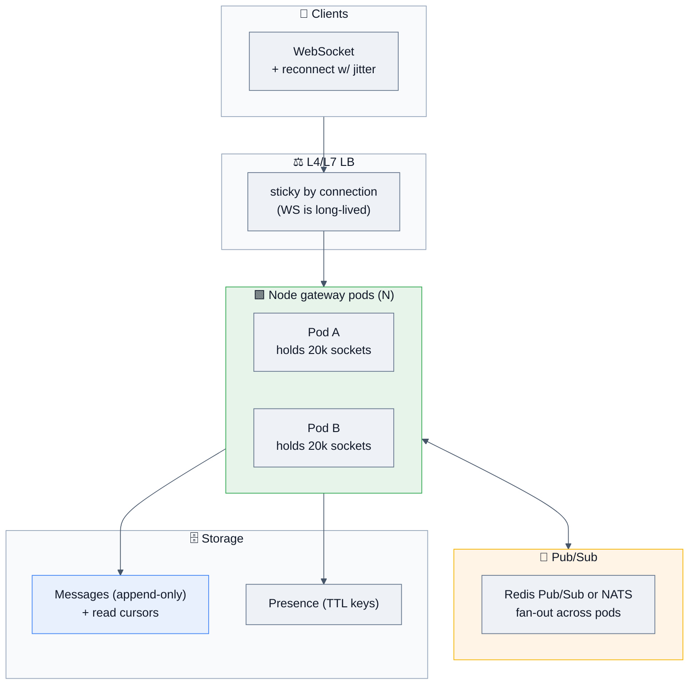

**Node-specific depth:** per-socket memory budget × connections vs the pod memory limit · **backpressure on slow consumers** (`ws` exposes `bufferedAmount` — drop or disconnect rather than buffering unboundedly, which is a real OOM path) · heartbeat ping/pong with idle eviction · auth at handshake, not per message · message ordering per room (single writer or sequence numbers) · at-least-once delivery + client-side dedupe by message id · **reconnect storms after a deploy** (jittered backoff + gradual rollout + `terminationGracePeriodSeconds` long enough to drain) · offline delivery via push notifications.

### D5. Design a BFF / API gateway ★★★★★
Fan-out to N services with `Promise.all` + **per-call timeouts that fit inside the client's budget** · partial responses (`allSettled` → return what you have, mark the rest as degraded) · response shaping to kill client waterfalls · per-dependency circuit breakers and bulkheads · caching with single-flight · auth/token exchange at the edge · schema validation both ways · trace propagation · **why Node is a good fit here** (I/O-bound fan-out, JSON shaping, shared types with the frontend) and **where it stops being one** (heavy transforms → stream or move off-thread).

### D6. Design a job/worker system ★★★★☆
Producer API → durable queue (BullMQ/Redis, SQS, or Kafka for ordered high-volume) → Node workers with bounded concurrency. Cover: at-least-once + idempotent handlers, visibility timeout vs job duration, exponential backoff with a max attempt count, a **DLQ you actually alert on**, priority queues, scheduled/delayed jobs, poison-message isolation, graceful shutdown (stop pulling, finish in-flight, ack or requeue), and observability (queue depth, oldest-message age, processing latency, failure rate). **Queue depth and oldest-message age are the two metrics that catch every incident.**

## 7.3 Advanced

### D7. Design a rate limiter as a shared service ★★★★☆
Per-user / per-IP / per-API-key / per-endpoint dimensions · algorithm choice (token bucket for controlled bursts) · Redis with atomic Lua, or a local-with-sync hybrid (each pod gets a share of the budget, syncing periodically — lower latency, approximate limits) · headers (`X-RateLimit-Limit/Remaining/Reset`, `Retry-After`) · what happens when Redis is down (fail open with a local fallback? fail closed? **state the trade-off explicitly** — fail open risks abuse, fail closed risks an outage) · hot-key sharding · cost of a network round trip on every request.

### D8. Design a streaming data pipeline in Node ★★★★☆
Ingest (HTTP/Kafka) → validate → enrich → aggregate → sink. Cover backpressure end to end, exactly-once *effects* via idempotent sinks + offset commits after write, windowing and late data, checkpointing, replay from an offset, schema evolution, and **when to admit Node isn't the right tool** (heavy stateful aggregation at high volume → Flink/Spark; Node is great for ingest/transform edges).

### D9. Design a multi-tenant SaaS backend ★★★★☆
Tenant isolation (row-level with a mandatory `tenant_id` filter enforced in a data-access layer, schema-per-tenant, or DB-per-tenant — cost vs isolation), noisy-neighbour protection (per-tenant rate limits and query budgets), per-tenant config/feature flags, connection-pool math (DB-per-tenant × pods explodes connection counts — use a proxy like PgBouncer), audit logging, and data export/deletion for compliance.

### D10. Design an LLM-streaming API service ★★★★☆
SSE or chunked NDJSON to the client (§6 H3) · upstream provider streaming with `AbortSignal` propagation so a client disconnect stops the (expensive) generation · token accounting and per-user quotas · retry only before the first token is emitted (you can't retry a half-streamed response) · timeouts that account for long generations (a 30 s default will kill valid requests) · buffering disabled at every proxy · prompt/response logging with PII redaction · **backpressure**: if the client can't consume, stop pulling from upstream.

## 7.4 Production scenarios (staff rounds)

| Prompt | Signals expected |
|---|---|
| "Traffic 10×'d overnight. Walk me through the first hour." | Check saturation signals in order (event-loop lag, DB pool waiting, downstream errors, memory) → scale out what's stateless → shed load on non-critical routes → raise cache TTLs → increase pool sizes only if the DB can take it → **communicate**, then post-incident capacity work |
| "One downstream is slow; the whole gateway is failing." | Missing timeouts → sockets held → concurrency exhausted → cascading failure. Fix: per-call timeouts, bulkheads, circuit breaker, degrade gracefully. This is *the* classic Node BFF outage. |
| "Migrate a 500k-LOC CJS monolith to ESM + TypeScript." | Incremental per-package, dual builds, `exports` maps, dual-package hazard, CI ratchets, no big-bang |
| "Your DB is at connection limit with 60 pods." | pods × pool ≤ DB max; introduce a pooler (PgBouncer), lower per-pod pool, add read replicas, cache aggressively, and measure `waitingCount` rather than guessing |
| "Design zero-downtime deploys." | Readiness gating + preStop + graceful shutdown + rolling/canary + backward-compatible DB migrations (expand→migrate→contract) + automated rollback on SLO burn |
| "Cut our Node infra bill by 30%." | Right-size pods from measured p99 RSS, kill over-provisioned replicas, cache to reduce DB tier, compress at the edge, sample telemetry, trim images, consider a runtime change only for the genuinely CPU-bound service |

---

# 8. 🏢 Real Production Usage at Scale

| Company | How Node.js is used | The detail worth quoting |
|---|---|---|
| **Netflix** | Node powers the web UI layer and API aggregation for a huge device fleet | Netflix's move to a Node-based UI layer is one of the most-cited case studies: they reported startup//load-time improvements and a large productivity win from sharing JavaScript between client and server. Their edge work also popularized per-request timeouts and fallbacks at scale. |
| **PayPal** | Rewrote account pages from Java to Node | The canonical "why Node" data point: PayPal reported the Node app was built by fewer developers in less time, contained fewer lines of code, and served requests with lower response times than the Java version. Interviewers love this as an argument-with-evidence example. |
| **LinkedIn** | Mobile backend moved from Ruby to Node | Reported an order-of-magnitude reduction in server count and significant throughput gains for their I/O-bound mobile API — the classic "Node fits I/O-bound aggregation" story. |
| **Uber** | Node in the API gateway/dispatch-adjacent tier; open-sourced Fusion.js | Uber's early large-scale Node deployments produced much of the industry's shared knowledge about event-loop blocking, timeouts, and rapid deploys. |
| **Walmart** | Black Friday traffic served through Node on the mobile/front tier | Their famous result: handling extremely high peak traffic while keeping CPU utilization low — and their public post-mortem of a Node memory leak during peak is one of the best real leak write-ups available. |
| **eBay / Groupon / Airbnb** | Node service tiers and isomorphic rendering | Airbnb's Hypernova (React SSR service in Node) is the reference implementation for "render React outside your main app." |
| **Stripe** | Node SDK, webhooks, developer tooling | Their API is the reference model for **idempotency keys**, versioned APIs, and webhook signature verification — patterns you should cite when designing. |
| **Slack / Atlassian / Shopify** | Node BFFs, real-time gateways, build tooling | Long-lived WebSocket fleets and the operational patterns around them (presence, fan-out, reconnect storms). |
| **Microsoft** | VS Code (Electron/Node), Azure SDK for JS, TypeScript | VS Code's extension host is a masterclass in isolating untrusted plugin code in separate Node processes. |
| **OpenAI / Anthropic / Vercel** | Streaming SDKs and edge/serverless Node runtimes | SSE token streaming with cancellation is the production pattern behind §6 H3. |
| **Cloudflare** | Workers run V8 **isolates**, not Node — with growing Node-API compatibility | Great talking point: ~5 ms cold starts, no filesystem, Web-standard APIs. Knowing what *isn't* available in an isolate (fs, net, long-lived sockets, `process`) shows real depth. |
| **NASA / Trello / Medium** | Data consolidation, real-time boards, publishing platform | NASA's spacesuit-data consolidation onto a Node API is the standard "unusual domain" example. |

> [!TIP]
> **Use these as evidence, not trivia.** "PayPal reported building the Node version faster, with fewer lines of code, and serving requests faster than the Java version" is a much stronger argument than "Node is productive."

---

# 9. 🐞 Common Bugs & Production Incidents

## 9.1 The bug taxonomy

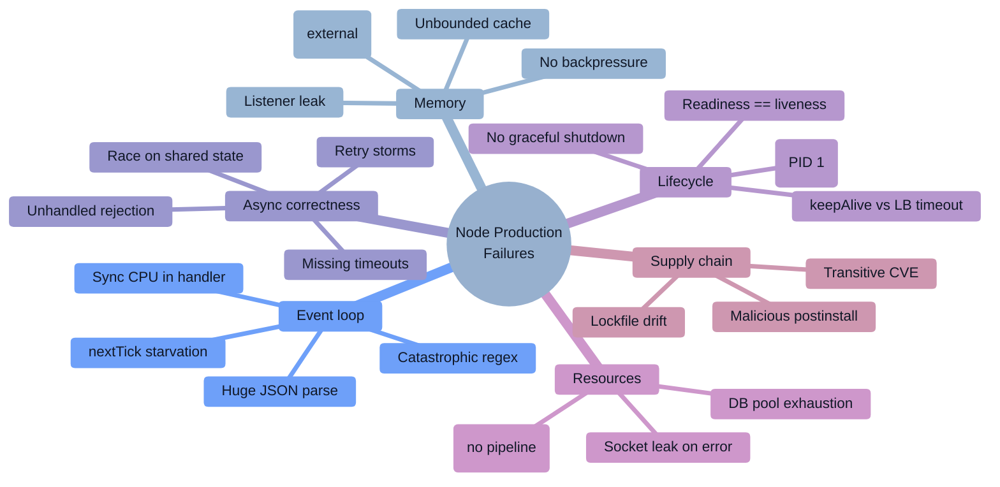

## 9.2 Twelve real bugs, with the debugging approach

### B1. Sync work in a handler → p99 explodes at moderate CPU ★★★★★
**Symptom:** all requests slow together; p50 fine early, then everything degrades; CPU ~40%.
**Debug:** event-loop lag p99 spikes; `--cpu-prof` shows one wide frame.
**Culprits:** `readFileSync`, `pbkdf2Sync`/`bcrypt` sync, `JSON.parse` of MBs, `sort` over a huge array, template rendering, `zlib` sync.
**Fix:** async APIs, `worker_threads`, streaming, caching, input size caps.

### B2. Unbounded module-level cache → OOMKill every N hours ★★★★★
**Symptom:** sawtooth RSS trending up; restart "fixes" it.
**Debug:** heap snapshots → retainer chain ends at a module-scope `Map`.
**Fix:** LRU with max size + TTL; measure hit rate to confirm the cache is even earning its memory.

### B3. Listener leak on a long-lived emitter ★★★★★
**Symptom:** `MaxListenersExceededWarning: Possible EventEmitter memory leak detected`.
**Cause:** `emitter.on(...)` inside a request handler or a loop, never removed.
**Fix:** register once at boot, or attach with `{ signal }` and abort on request end. **Never** silence it with `setMaxListeners(Infinity)` — that's deleting the smoke detector.

### B4. No backpressure → RSS climbs while heap stays flat ★★★★☆
**Cause:** `readable.on('data', c => writable.write(c))` or accumulating chunks in an array.
**Debug:** `external`/`arrayBuffers` growing while `heapUsed` is flat — the classic Buffer-leak signature.
**Fix:** `pipeline()` / `for await`.

### B5. Missing timeout → one slow dependency takes down the gateway ★★★★★
**Symptom:** a downstream degrades; your service's concurrency fills with waiting requests; health checks fail; you cascade.
**Debug:** traces show long spans on one dependency; sockets in `ESTABLISHED` piling up.
**Fix:** timeouts on every call, shrinking budgets down the chain, circuit breaker, bulkhead pools per dependency. **Then load-test the failure**, don't assume.

### B6. Retry storm turns a blip into an outage ★★★★☆
**Cause:** retries without jitter, retries on non-idempotent calls, retries at multiple layers multiplying (3 × 3 × 3 = 27 requests per user action).
**Fix:** jitter, a retry budget, retry at **one** layer only, and `Retry-After` compliance.

### B7. `keepAliveTimeout` shorter than the LB idle timeout → random 502s ★★★★☆
**Symptom:** a small, steady percentage of 502/504s with no server-side errors logged.
**Fix:** `server.keepAliveTimeout = 61_000; server.headersTimeout = 65_000;` (above the ALB's 60 s default). See §2.8.

### B8. SIGTERM never reaches Node (PID 1 / npm start) ★★★★☆
**Symptom:** every deploy drops in-flight requests; pods take the full grace period then get SIGKILLed.
**Cause:** `CMD npm start` — npm may not forward signals; or shell-form `CMD` wraps Node in `/bin/sh`.
**Fix:** exec-form `CMD ["node", "server.js"]`, or `tini` as an init. Verify with `kill -TERM 1` in the container.

### B9. Connection-pool exhaustion at scale ★★★★☆
**Symptom:** latency cliff at a specific RPS; DB CPU is fine; `pool.waitingCount` climbing.
**Cause:** pods × pool size exceeds the DB's `max_connections`, or connections leaked by a path that never calls `release()`.
**Fix:** always release in `finally`, acquire timeouts, right-size the pool, add PgBouncer, and export `waitingCount` as a metric with an alert.

### B10. Catastrophic regex (ReDoS) pins a pod at 100% CPU ★★★★☆
```js
/^(\s*\w+\s*)+$/.test(longAttackerControlledString);   // exponential backtracking
```
**Fix:** avoid nested quantifiers and ambiguous alternation, anchor patterns, cap input length, use `RegExp.escape` for user-supplied literals, or RE2. Cloudflare's 2019 global outage was exactly this class of bug.

### B11. Unhandled rejection crash-loop ★★★★☆
**Symptom:** pods restart repeatedly when a dependency degrades.
**Cause:** Node 15+ exits on unhandled rejections; a background task with no `.catch`.
**Fix:** lint with `no-floating-promises`, wrap background work in a supervisor, add a circuit breaker so a downstream blip doesn't create a restart storm — and make sure `CrashLoopBackOff` alerts.

### B12. Malicious `postinstall` in a transitive dependency ★★★★☆
**Symptom:** unexpected outbound network calls at build time; secrets rotated in a panic.
**Debug:** lockfile diff on the offending PR; CI egress logs; `npm ls <pkg>` to find who pulled it in.
**Fix (systemic):** `npm ci` with a committed lockfile, `--ignore-scripts` by default, provenance/attestation checks, short-lived scoped CI tokens, hermetic builds with an egress allowlist, and lockfile-diff review in code review. See §10.6.

## 9.3 The debugging playbook

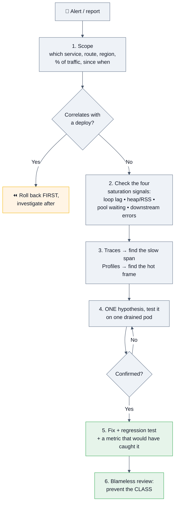

**Tools worth naming:**

| Need | Command / tool |
|---|---|
| Classify the problem | `npx clinic doctor -- node app.js` |
| CPU flame graph | `node --cpu-prof`, `npx clinic flame`, `0x` |
| Heap snapshot in prod | `node --heapsnapshot-signal=SIGUSR2` then `kill -USR2 <pid>` |
| Allocation profile | `node --heap-prof` |
| Live debugging | `node --inspect=0.0.0.0:9229` on a **drained** pod, port-forwarded |
| GC behaviour | `--trace-gc`, `--trace-gc-verbose` |
| Loop lag | `perf_hooks.monitorEventLoopDelay` |
| Async context loss | `--trace-warnings`, `AsyncLocalStorage` instrumentation |
| Outbound HTTP | `undici` diagnostics channel, `NODE_DEBUG=http` |
| Load generation | `autocannon`, `k6` |
| Dependency forensics | `npm ls <pkg>`, lockfile diff, `npm audit signatures` |

> [!TIP]
> **Answer "how would you debug X" as a funnel, never as a tool list:** scope → correlate with change → check saturation signals → traces/profiles → one hypothesis → verify → prevent the class. Interviewers are grading method.

---

# 10. 🔐 Security

## 10.1 Attack surface map

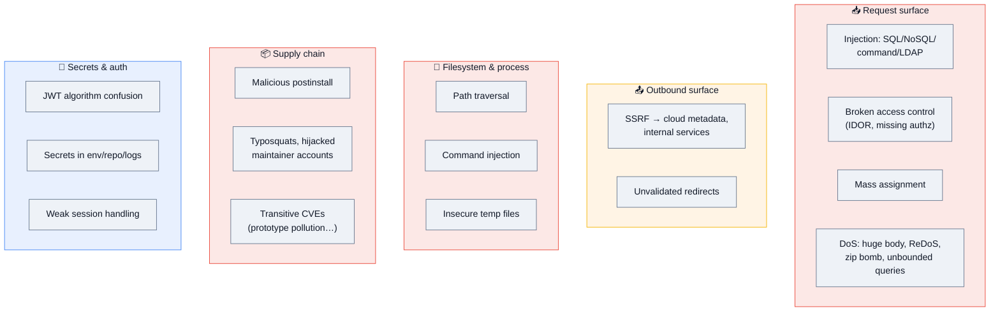

> [!IMPORTANT]
> **Broken access control is the #1 risk in current OWASP guidance and in audited Node APIs** — not exotic memory bugs. The most valuable security answer in a Node interview is: *"Authorization is checked on every request, server-side, against the resource being accessed — not just on the route."*

## 10.2 Broken access control & IDOR

```js
// ❌ Authenticated ≠ authorized. Any logged-in user can read any order.
app.get('/orders/:id', auth, async (req, res) => res.json(await db.order(req.params.id)));

// ✅ Scope every query by the caller's tenant/user
app.get('/orders/:id', auth, async (req, res) => {
  const order = await db.order({ id: req.params.id, tenantId: req.user.tenantId });
  if (!order) return res.sendStatus(404);       // 404, not 403 — don't leak existence
  res.json(order);
});
```
**Also:** enforce tenant scoping in the **data-access layer**, not in each handler (one forgotten handler = a breach); never trust a client-supplied `role`/`userId`; check object-level permissions, not just endpoint permissions; use UUIDs over sequential ids to reduce enumeration; log authorization failures.

**Mass assignment:**
```js
await db.users.update(req.params.id, req.body);           // ❌ user sends {"role":"admin"}
const { name, email } = schema.parse(req.body);           // ✅ allowlist via schema
await db.users.update(req.params.id, { name, email });
```

## 10.3 Injection

```js
// SQL — parameterize, always
db.query('SELECT * FROM users WHERE email = $1', [email]);          // ✅
db.query(`SELECT * FROM users WHERE email = '${email}'`);           // ❌

// NoSQL — an object where you expected a string is an injection
// POST {"email": {"$ne": null}, "password": {"$ne": null}} logs in as the first user
if (typeof req.body.email !== 'string') throw new BadRequest();     // ✅ or a schema
await User.findOne({ email: String(req.body.email) });

// Command — never a shell with user input
exec(`convert ${req.query.file} out.png`);                          // ❌ ; rm -rf /
execFile('convert', [safeFile, 'out.png']);                         // ✅ argv array, no shell
```

## 10.4 Path traversal

```js
import path from 'node:path';
import { realpath } from 'node:fs/promises';

const BASE = path.resolve('/srv/uploads');

async function safeResolve(userPath) {
  const candidate = path.resolve(BASE, userPath);              // resolves ../ sequences
  if (candidate !== BASE && !candidate.startsWith(BASE + path.sep)) throw new Error('bad path');
  const real = await realpath(candidate);                      // 🛡️ symlink-aware
  if (real !== BASE && !real.startsWith(BASE + path.sep)) throw new Error('symlink escape');
  return real;
}
```
**Graded details:** the `+ path.sep` (otherwise `/srv/uploads-evil` passes a naive `startsWith`), symlink resolution, null-byte and encoded-traversal handling, and defense in depth — container isolation, a non-root user, and read-only mounts so a bypass still hits a wall.

## 10.5 SSRF — the webhook/integration killer

```js
import dns from 'node:dns/promises';
import net from 'node:net';

const ALLOWED_HOSTS = new Set(['api.partner.com']);
const BLOCKED = [/^127\./, /^10\./, /^192\.168\./, /^172\.(1[6-9]|2\d|3[01])\./,
                 /^169\.254\./, /^0\./, /^::1$/, /^fc00:/, /^fe80:/];

async function safeFetch(rawUrl, opts = {}) {
  const url = new URL(rawUrl);
  if (!['http:', 'https:'].includes(url.protocol)) throw new Error('bad scheme');
  if (!ALLOWED_HOSTS.has(url.hostname)) throw new Error('host not allowed');

  const { address } = await dns.lookup(url.hostname);          // resolve, then validate the IP
  if (BLOCKED.some(re => re.test(address))) throw new Error('private address');

  return fetch(url, { ...opts, redirect: 'error',              // 🛡️ redirects can point inward
                      signal: AbortSignal.timeout(5000) });
}
```
**The details that earn the point:** validating the **resolved IP**, not just the hostname; blocking `169.254.169.254` (cloud metadata — the Capital One breach vector); disallowing redirects (or re-validating each hop); **DNS rebinding** (the name resolves to a safe IP for your check and a private IP for the actual connection — mitigate by pinning the validated IP for the connection, or by using an egress proxy/network policy). **The strongest control is network-level egress restriction**, and saying so shows you think in layers.

## 10.6 Supply chain — the highest-probability Node incident in 2026

The npm registry is the most actively attacked JavaScript surface. Documented events include the **September 2025 compromise of very widely-used packages such as `chalk` and `debug`**, the self-propagating **"Shai-Hulud" worm** that used stolen publish tokens to replicate across hundreds of packages, and a **March 2026 hijack of `axios`** (100M+ weekly downloads) that shipped a remote-access trojan into developer machines and CI pipelines. Industry reporting counted **hundreds of thousands of new malicious packages in 2025 alone**.

| Layer | Control |
|---|---|
| Install | **`npm ci`** with a committed lockfile; **`--ignore-scripts`** by default (postinstall is the primary payload vector); pin exact versions for critical deps |
| Selection | Minimize dependency count; prefer zero-dep or vendored code for trivial utilities; check maintainer count, release cadence, and sudden ownership changes |
| Verification | Provenance/attestations (`npm audit signatures`), Sigstore, Socket/Snyk/Dependabot gating on high/critical |
| Build isolation | Hermetic CI with **no long-lived secrets in the default environment**, an **egress allowlist**, short-lived scoped publish tokens with 2FA |
| Runtime | Node's `--permission` model as defense in depth; distroless image; non-root user; read-only filesystem |
| Review | **Lockfile diffs are code** — review them; alert on new transitive dependencies |

```bash
npm ci --ignore-scripts
npm audit signatures
node --permission --allow-fs-read=./config --allow-fs-write=/tmp app.js
```

## 10.7 Prototype pollution (server-side → RCE)

```js
merge({}, JSON.parse('{"__proto__":{"isAdmin":true}}'));
({}).isAdmin;   // true 💥 every object in the process is now "admin"
```
On the server this can escalate to **remote code execution** when polluted properties reach a template engine or `child_process` options (`shell`, `env`, `NODE_OPTIONS`). Defenses: reject `__proto__`/`constructor`/`prototype` keys, use `Object.create(null)` or `Map` for user-keyed data, validate with a schema *before* merging, `Object.freeze(Object.prototype)` at startup, and `node --disable-proto=throw`.

## 10.8 Authentication, secrets, and crypto

```js
// Passwords: a slow, memory-hard KDF — never a plain hash
import { scrypt, randomBytes, timingSafeEqual } from 'node:crypto';
// argon2id (via a library) is the current recommendation; scrypt is the built-in fallback.
// ⚠️ Use the ASYNC form — the sync one blocks the event loop under load.

// Constant-time comparison for any secret
timingSafeEqual(Buffer.from(a), Buffer.from(b));

// JWT: pin the algorithm, verify issuer/audience/expiry
jwt.verify(token, publicKey, { algorithms: ['RS256'], issuer: ISS, audience: AUD });
// ❌ jwt.verify(token, key)  → accepts whatever alg the TOKEN claims → alg-confusion / 'none'
```

| Do | Don't |
|---|---|
| Secrets from a manager (Vault/KMS/cloud secret store), injected at runtime | Secrets in the repo, the image, or a committed `.env` |
| Short-lived access tokens + rotating refresh with reuse detection | Long-lived JWTs with no revocation path |
| `HttpOnly; Secure; SameSite` cookies for browser sessions | Tokens in `localStorage` |
| Redact secrets/PII in logs (pino `redact`) | Logging full request bodies or headers |
| `crypto.randomUUID()` / `randomBytes` for tokens | `Math.random()` for anything security-relevant |

## 10.9 DoS and resource limits

```js
app.use(express.json({ limit: '100kb' }));        // body size
app.use(rateLimit({ windowMs: 60_000, max: 100 })); // per IP/user
server.headersTimeout = 65_000;                     // slowloris
server.requestTimeout = 300_000;
// Also: cap pagination `limit`, cap query depth/cost for GraphQL,
// cap decompressed size for uploads (zip bombs), cap regex input length,
// and shed load when event-loop lag exceeds a threshold.
```

## 10.10 Security checklist ✅

- [ ] Authorization enforced server-side, per resource, in the data-access layer
- [ ] Every input validated with a runtime schema (zod/valibot/TypeBox/JSON Schema)
- [ ] Parameterized queries; typed guards against NoSQL operator injection
- [ ] `execFile`/`spawn` with argv arrays — never a shell with user input
- [ ] Path traversal: `path.resolve` + `+ path.sep` prefix check + `realpath`
- [ ] SSRF: host allowlist + resolved-IP validation + no redirects + egress policy
- [ ] Prototype-pollution guards on every merge/deserialize path
- [ ] `npm ci` + committed lockfile + `--ignore-scripts` + provenance checks + audit gating
- [ ] Secrets from a manager; nothing sensitive in env dumps, logs, or error responses
- [ ] JWT with a pinned algorithm and verified `iss`/`aud`/`exp`; sessions in `HttpOnly` cookies
- [ ] `helmet` headers (HSTS, `nosniff`, `frame-ancestors`), CORS with an explicit origin allowlist
- [ ] Rate limiting + body-size limits + timeouts + pagination caps
- [ ] Non-root user, distroless/minimal image, read-only FS, dropped capabilities
- [ ] Node on a supported LTS line, patched on a schedule (V8/OpenSSL CVEs are frequent)
- [ ] Error responses never leak stack traces or internal identifiers in production

---

# 11. ⚡ Performance

## 11.1 The metrics that matter

| Metric | What it tells you | Healthy | Primary lever |
|---|---|---|---|
| **Event-loop lag p99** | Is the loop blocked? | < 10 ms | Remove sync work |
| **Latency p50/p95/p99** | User experience | per SLO | Depends on where the time goes |
| **Throughput (RPS)** | Capacity | — | Concurrency + downstream limits |
| **Error rate by class** | 4xx vs 5xx vs timeouts | < SLO burn | Different fixes per class |
| **Heap used / RSS / external** | Memory health | flat under steady load | Leak hunting, bounded caches |
| **GC pause time & frequency** | Allocation pressure | pauses < 50 ms | Reduce allocation rate |
| **DB pool `waitingCount`** | Are requests queueing for connections? | ~0 | Pool size, query speed, caching |
| **Queue depth / oldest-message age** | Are workers keeping up? | bounded | Scale consumers, fix slow jobs |
| **Active handles / sockets** | Leak detection | stable | `pipeline`, proper teardown |

> [!IMPORTANT]
> **Latency without saturation signals is undiagnosable.** The four numbers to put on every Node dashboard: **event-loop lag p99, heap/RSS, DB pool waiting, downstream error rate.** Most incidents are visible in one of them within 30 seconds.

## 11.2 Profiling

```bash
# Classify first — clinic tells you WHICH kind of problem you have
npx clinic doctor -- node app.js
npx clinic flame  -- node app.js        # CPU flame graph
npx clinic bubbleprof -- node app.js    # async delay attribution

# Built-in
node --cpu-prof --cpu-prof-dir=./prof app.js    # .cpuprofile → open in Chrome DevTools
node --heap-prof app.js                          # allocation sampling
node --prof app.js && node --prof-process isolate-*.log
node --trace-gc app.js                           # GC behaviour
node --inspect=0.0.0.0:9229 app.js               # live: profiler + heap snapshots

# Load generation (always benchmark against a realistic client)
npx autocannon -c 100 -d 30 -p 10 http://localhost:3000/api
k6 run script.js
```

**Reading a Node flame graph:** wide-and-flat = one slow synchronous function (your fix is obvious); wide-and-deep = a slow call tree; a large `GC` band = allocation pressure; lots of time in `JSON.parse`/`stringify` = payload size or missing streaming; time in framework internals = middleware overhead (a real cost in Express with 20 layers).

**Benchmark honestly:**
```js
import { Bench } from 'tinybench';
const bench = new Bench({ time: 2000 });
bench.add('JSON.stringify', () => JSON.stringify(obj))
     .add('fast-json-stringify', () => serialize(obj));
await bench.run();
console.table(bench.table());
// Warm up, run many iterations, report median + p95, consume the result
// so it isn't optimized away, and benchmark on hardware like production.
```

## 11.3 CPU

| Symptom | Cause | Fix |
|---|---|---|
| One wide frame in the profile | Sync CPU in a handler | Workers, streaming, caching, algorithmic fix |
| High CPU across many small frames | Framework/middleware overhead, excessive logging | Fewer middlewares, Fastify + schema serializer, sampled logs |
| `JSON.parse`/`stringify` dominating | Large payloads | Paginate, project fewer fields, `fast-json-stringify` (schema-based, several× faster), stream NDJSON |
| Crypto dominating | Sync KDF, TLS handshakes | Async crypto, session resumption, terminate TLS at the LB |
| Regex dominating | ReDoS or a hot naive pattern | Simplify, anchor, cap input, precompile, RE2 |
| GC dominating | Allocation rate | Reuse buffers, avoid intermediate arrays, stream |

## 11.4 Memory

Covered in §3.2. The performance-specific additions:

```js
// Reduce allocation rate in hot paths
const buf = Buffer.allocUnsafe(SIZE);      // reuse a scratch buffer (fill before use!)
for (const row of rows) writeInto(buf, row);

// Prefer streaming over building giant strings/arrays
// ❌ rows.map(render).join('')  → one huge string, one huge GC pressure spike
// ✅ for (const row of rows) if (!res.write(render(row))) await once(res, 'drain');
```

**Tuning flags (last resort, measure first):** `--max-old-space-size` (fit the container), `--max-semi-space-size` (bigger young gen = fewer, longer minor GCs — sometimes a win for high-allocation servers).

## 11.5 Latency & throughput levers

| Lever | Why it works |
|---|---|
| **Keep-alive + connection pooling** (undici `Agent`, DB pool) | Removes TCP+TLS handshakes, which dominate short requests |
| **Parallelize independent I/O** (`Promise.all`) | Latency = max, not sum |
| **Cache with single-flight + jittered TTL** | Cuts downstream load and tail latency; prevents stampedes |
| **Right-size the DB pool** | Too small = queueing; too large = DB thrash and connection-limit errors |
| **Index and fix N+1s** | The database is the bottleneck far more often than Node is |
| **Stream responses** | TTFB down, memory flat |
| **Compress at the edge** | gzip/brotli in Node burns CPU that the LB can do for free |
| **Fastify + JSON-schema serialization** | Typically 10–30% on JSON-heavy APIs vs Express + `JSON.stringify` |
| **HTTP/2 to downstreams** | Multiplexing removes head-of-line blocking per connection |
| **`UV_THREADPOOL_SIZE`** tuned to the workload | Only if you're fs/crypto/zlib heavy — measure |
| **Load shedding on lag** | Preserves p99 for the requests you do accept |

```js
// The two-line change that fixes a surprising number of "Node is slow" reports
import { Agent, setGlobalDispatcher } from 'undici';
setGlobalDispatcher(new Agent({ connections: 128, keepAliveTimeout: 10_000 }));
```

## 11.6 Startup & cold start

Lazy-import heavy modules (`await import()` inside the handler that needs them) · avoid top-level work (no sync file reads of big configs, no eager DB warmup you don't need) · smaller dependency graph = faster module resolution · bundle for serverless (esbuild/ncc) to collapse thousands of file reads into one · consider **startup snapshots** (`--build-snapshot` / `--snapshot-blob`) and **single-executable applications** for CLI distribution · in Kubernetes, use a **startup probe** so a slow boot doesn't trip liveness.

---

# 12. ✅ Best Practices

### Runtime & code
- Run a **supported LTS** line; upgrade within weeks of a release, not years.
- `import` from `node:`-prefixed core modules — unambiguous and typosquat-proof.
- TypeScript with `strict: true`, **plus** runtime schema validation at every untrusted boundary.
- Async everywhere in request paths; `*Sync` only at startup.
- Custom `Error` subclasses with `status`, `code`, `cause`, and an `expose` flag.
- Never `process.exit()` in application code — let the loop drain.

### Async
- **Every** outbound call gets a timeout and an `AbortSignal`; propagate `req.signal`.
- `Promise.all` for independent work; a bounded pool for large N.
- Never `await` in a loop over independent items without a reason (and comment the reason when there is one).
- Enable `@typescript-eslint/no-floating-promises`.

### HTTP & API
- Body-size limits, rate limits, pagination caps, and request timeouts on every service.
- `keepAliveTimeout` > the LB idle timeout.
- Cursor pagination, not offset.
- Idempotency keys for all non-idempotent public endpoints.
- Versioned, additive-only API changes; a stable error envelope.

### Data
- One connection pool per process, created at boot, closed on shutdown; **pods × pool ≤ DB max**.
- Parameterized queries; transactions with explicit isolation levels where it matters.
- Migrations: expand → migrate → contract, always backward-compatible for one deploy.
- Read replicas for analytics; be explicit about read-your-writes.

### Operations
- Graceful shutdown wired on day one; liveness ≠ readiness; exec-form `CMD`.
- Structured JSON logs with a trace id; redact secrets; no `console.log` in hot paths.
- OTel traces + RED metrics + Node runtime metrics; alert on **SLO burn**, not raw counts.
- `--max-old-space-size` ≈ 70–75% of the container memory limit.
- One process per container; scale pods, not `cluster`, in an orchestrator.
- Canary deploys with automated rollback.

### Security
- The §10.10 checklist, enforced in CI where possible.

### Testing
- Unit for logic, integration with real dependencies via Testcontainers, a handful of E2E.
- Mock the network (`MockAgent`/`nock`), never third parties in CI.
- Fake timers for retry/backoff; fixed seeds for randomness.
- Assert **query counts** in integration tests to catch N+1 regressions.
- Load-test the failure modes (slow downstream, dead cache), not just the happy path.

---

# 13. 🚫 Anti-patterns

| Anti-pattern | Why it hurts | Do instead |
|---|---|---|
| `readFileSync`/`execSync`/sync crypto in a handler | Blocks every concurrent request | Async APIs, workers |
| `readable.on('data', ...)` without backpressure | Unbounded buffering → OOM | `pipeline()` / `for await` |
| `.pipe()` chains in production | Errors aren't forwarded; streams and FDs leak | `pipeline()` from `stream/promises` |
| No timeout on an outbound call | One slow dependency exhausts your concurrency | `AbortSignal.timeout` on every call |
| Retries without jitter / at multiple layers | Retry storms turn a blip into an outage | Jitter, retry budget, one retry layer |
| `Promise.all` over thousands of items | Self-DDoS on your own DB/downstream | Bounded concurrency |
| `await` inside a loop over independent items | Latency = sum instead of max | `Promise.all` / pool |
| `.forEach(async …)` | The loop doesn't wait; rejections float | `for...of` + `await`, or `Promise.all(map())` |
| Empty `catch {}` / catch that only logs | Silently swallows real failures | Handle, rethrow, or map to a status — with context |
| Global mutable state for request data | Cross-request contamination and data leaks | `AsyncLocalStorage` or explicit parameters |
| Unbounded module-level cache or queue | Slow-burn OOM | LRU + TTL + max size |
| `setInterval` for background jobs | Dies with the pod; no retries; drifts; stacks | Durable queue with retries and a DLQ |
| Listeners added per request on a long-lived emitter | Leak; `MaxListenersExceededWarning` | Register once, or attach with `{ signal }` |
| `setMaxListeners(Infinity)` to silence the warning | Deletes the smoke detector | Fix the leak |
| `process.exit()` on SIGTERM | Drops in-flight requests every deploy | Graceful shutdown sequence |
| Liveness probe that checks the database | A DB blip restarts your whole fleet | Liveness = "am I alive"; readiness = "should I get traffic" |
| `CMD npm start` in Docker | SIGTERM may never reach Node | Exec-form `CMD ["node","server.js"]` or `tini` |
| `cluster` inside Kubernetes | Splits one memory limit N ways; complicates shutdown and metrics | One process per pod |
| Storing sessions in process memory | Breaks with two pods | Redis or stateless tokens |
| Connection created per request | Handshake cost + connection-limit exhaustion | A pool created at boot |
| ORM used without ever reading the SQL | N+1s and unindexed scans ship silently | Log slow queries; assert query counts |
| `JSON.parse` on an unbounded request body | Trivial DoS | Size limits + schema validation |
| String-concatenated SQL / `exec` with user input | Injection | Parameters / `execFile` |
| `path.join(BASE, userInput)` without a prefix check | Path traversal | `resolve` + `+ path.sep` check + `realpath` |
| Tokens in `localStorage`; secrets in the repo | One XSS or one leak = full compromise | `HttpOnly` cookies; a secrets manager |
| `console.log` as production logging | Synchronous to fd, unstructured, no correlation | pino with trace ids |
| Metrics labelled by raw URL or user id | Cardinality explosion, huge bill | Route templates; high-cardinality data in traces |
| `npm install` in CI/production | Non-reproducible builds | `npm ci` |
| Ignoring `npm audit` / auto-merging dependency bumps unreviewed | Supply-chain compromise | Gate on severity; review lockfile diffs |
| Micro-optimizing JS before fixing the database | Optimizes 2% of the latency | Profile first; the DB is usually the bottleneck |
| Adding pods to fix a blocked event loop | Multiplies downstream load without fixing latency | Find the blocking call |

---

# 14. 📊 Comparison Tables

## 14.1 Node vs other backend runtimes

| | **Node.js** | Go | Java (Spring) | Python (FastAPI) | Rust (Axum) | .NET |
|---|---|---|---|---|---|---|
| Concurrency model | event loop + workers | goroutines (M:N) | threads + virtual threads | asyncio (GIL) | async tasks | async/await + thread pool |
| True parallelism | via workers/processes | ✅ native | ✅ native | ⚠️ GIL-limited | ✅ native | ✅ native |
| Memory per unit throughput | medium | **low** | high | medium | **lowest** | medium |
| Startup | ~30–100 ms | ~5 ms | 100s of ms–seconds | ~100 ms | ~5 ms | ~100 ms |
| CPU-bound work | ❌ weak | ✅ | ✅ | ⚠️ | ✅ **best** | ✅ |
| I/O fan-out / BFF | ✅ **excellent** | ✅ | ✅ | ✅ | ✅ | ✅ |
| Shares code with frontend | ✅ **unique** | ❌ | ❌ | ❌ | ❌ | ❌ |
| Ecosystem size | **largest (npm)** | large | very large | large | growing | large |
| Tail latency predictability | ⚠️ GC + single loop | ✅ | ⚠️ GC | ⚠️ | ✅ **best** | ✅ |
| Best for | APIs, BFFs, real-time, tooling, streaming edges | network services, CLIs | enterprise, complex domains | data/ML-adjacent APIs | systems, hot paths | enterprise on MS stack |

> [!TIP]
> **How to answer "Node vs Go":** *"Workload shape first — if it's I/O-bound fan-out with lots of JSON shaping, Node's model is genuinely well suited and I get shared types with the frontend. If it's CPU-bound or needs predictable tail latency at very high RPS, Go or Rust wins on true parallelism and memory. Then org factors: existing expertise, ops tooling, hiring. I'd pick X here because Y, and I'd revisit if Z."* Give a decision, not a survey.

## 14.2 JavaScript runtimes

| | **Node.js** | Deno | Bun | Cloudflare Workers |
|---|---|---|---|---|
| Engine | V8 | V8 | **JavaScriptCore** | V8 **isolates** |
| Permissions | opt-in `--permission` | **deny by default** | full | sandboxed by design |
| TypeScript | native type-stripping | ✅ built-in | ✅ built-in | ✅ via build |
| Package manager | npm/pnpm/yarn | npm compat + URLs | `bun install` (very fast) | npm compat |
| Cold start | ~30–100 ms | similar | faster | **~5 ms** |
| `fs`/`net` | ✅ | ✅ (permissioned) | ✅ | ❌ (Web APIs only) |
| Long-lived connections | ✅ | ✅ | ✅ | ⚠️ limited (Durable Objects) |
| Ecosystem maturity | **highest** | good | good | Web-standard subset |
| Best for | production services | secure scripts/tools | dev speed, all-in-one | edge latency & scale |

## 14.3 Node HTTP frameworks

| | Express | Fastify | NestJS | Koa | Hono |
|---|---|---|---|---|---|
| Throughput | baseline | **~2–3× Express** | ~Fastify (uses it) | ~Express | very high, edge-tuned |
| Async error handling | ❌ (v4 doesn't catch async throws) | ✅ | ✅ | ✅ | ✅ |
| Schema validation/serialization | plugin | **built-in JSON Schema** | class-validator/pipes | plugin | plugin |
| Structure/DI | none | plugins | **opinionated (DI, modules)** | none | none |
| TypeScript ergonomics | okay | good | **excellent** | okay | excellent |
| Learning curve | lowest | low | **high** | low | low |
| Best for | legacy, tiny services | new services, performance | large teams needing structure | middleware purists | edge/multi-runtime |

## 14.4 Concurrency options

| | Event loop (async I/O) | `worker_threads` | `cluster` | `child_process` | Horizontal pods |
|---|---|---|---|---|---|
| Parallelism | ❌ (concurrency only) | ✅ | ✅ | ✅ | ✅ |
| Shared memory | n/a | ✅ `SharedArrayBuffer` | ❌ | ❌ | ❌ |
| Startup cost | free | ~1–5 ms | ~30–50 ms | ~30–50 ms | seconds |
| Memory | one heap | one heap per worker (smaller) | one **full** heap per process | full process | full pod |
| Crash isolation | none | partial | ✅ per worker | ✅ | ✅ best |
| Use for | I/O work (the default) | CPU inside a request | all cores on one VM | running other programs | **production scaling** |

## 14.5 Async patterns

| | Callback | Promise | async/await | EventEmitter | Streams | Async iterator |
|---|---|---|---|---|---|---|
| Values | 1 | 1 | 1 | many | many | many |
| Backpressure | ❌ | ❌ | ❌ | ❌ | ✅ **built in** | ✅ pull-based |
| Cancellation | manual | via `AbortSignal` on the op | same | `off()` | `destroy()` | `return()` |
| Error handling | error-first arg | `.catch` | `try/catch` | `'error'` event | `pipeline` propagates | `try/catch` |
| Use for | legacy APIs | one-shot ops | **most code** | in-process pub/sub | large/continuous data | streaming consumption |

## 14.6 Data & messaging

| | PostgreSQL | MongoDB | Redis | Kafka | SQS/RabbitMQ |
|---|---|---|---|---|---|
| Node driver | `pg` / Prisma / Kysely | official driver / Mongoose | `ioredis` / `node-redis` | `kafkajs` | SDK / `amqplib` |
| Use for | relational truth, transactions | flexible documents | cache, locks, rate limits, pub/sub | event log, high-volume streams | task queues |
| Watch out for | pool sizing vs `max_connections` | operator injection; unbounded queries | it's not durable by default; single-threaded per shard | consumer-group rebalances; ordering per partition | visibility timeout vs job duration |
| Node-specific gotcha | always release in `finally` | `$ne`-style injection from JSON bodies | pipeline/multi for round-trip reduction | commit offsets **after** processing | ack after success, DLQ on repeat failure |

## 14.7 Tooling

| | npm | pnpm | yarn |
|---|---|---|---|
| Disk usage | high | **lowest (content-addressed store)** | medium |
| Strictness | flat, hoisted (phantom deps possible) | **strict, no phantom deps** | configurable |
| Monorepo | workspaces | workspaces (excellent) | workspaces + PnP |
| Speed | good | **fastest** | good |

| | Jest | Vitest | `node --test` |
|---|---|---|---|
| Setup | config-heavy | minimal (Vite) | **zero — built in** |
| ESM | historically painful | native | native |
| Speed | good | fastest | good (parallel by default in Node 24) |
| Ecosystem | largest | growing | core-only |
| Best for | legacy repos | new TS projects | dependency-free services & libraries |

---

# 15. 📄 Cheat Sheet (One-Page Revision)

```mermaid
%%{init: {'theme':'base','themeVariables':{'background':'#ffffff','mainBkg':'#eef2f7','primaryColor':'#eef2f7','primaryTextColor':'#111827','primaryBorderColor':'#64748b','secondaryColor':'#e8f0fe','tertiaryColor':'#f1f5f9','lineColor':'#475569','textColor':'#111827','clusterBkg':'#f8fafc','clusterBorder':'#94a3b8','edgeLabelBackground':'#ffffff','titleColor':'#111827','actorBkg':'#eef2f7','actorTextColor':'#111827','actorBorder':'#64748b','actorLineColor':'#475569','signalColor':'#111827','signalTextColor':'#111827','noteBkgColor':'#fff4e5','noteTextColor':'#111827','noteBorderColor':'#d97706','labelBoxBkgColor':'#eef2f7','labelBoxBorderColor':'#64748b','labelTextColor':'#111827','loopTextColor':'#111827','altBackground':'#f8fafc'}}}%%
mindmap
  root((Node Cheat<br/>Sheet))
    Loop
      timers pending poll check close
      nextTick then promises
      setImmediate after I/O
    Threads
      pool=4 fs dns zlib crypto
      network uses kernel not pool
      workers for CPU
    Streams
      pipeline not pipe
      write false wait drain
      highWaterMark 64KB
    Errors
      4 channels
      error event kills process
      crash on unknown state
    Memory
      heap vs external vs rss
      3 snapshots retainer chain
      maxOldSpace 75% of limit
    Ops
      readiness then close then drain
      keepAlive 61s
      exec-form CMD
    Metrics
      loop lag p99
      pool waiting
      queue depth
```

### Event loop
```
timers → pending → idle/prepare → poll → check → close
nextTick queue, then promise microtasks: drained BETWEEN every phase AND every callback
setTimeout(0) vs setImmediate at top level → NON-deterministic
inside an I/O callback → setImmediate ALWAYS first
recursive nextTick → starves the loop | recursive setImmediate → safe
```

### Thread pool
```
USES pool: fs, dns.lookup, zlib, crypto (pbkdf2/scrypt/randomBytes)
NOT pool:  net/http sockets (epoll/kqueue/IOCP)
UV_THREADPOOL_SIZE default 4, max 1024, set before first use
```

### Streams
```
Readable • Writable • Duplex • Transform
write() === false → stop, wait for 'drain'
pipeline() = backpressure + error propagation + destroy   ← always use this
pipe()     = backpressure only                            ← leaks on error
highWaterMark: 64KB bytes | 16 objects
for await (const chunk of readable) → pull-based backpressure
```

### Timers & priority
```
process.nextTick  > promises/queueMicrotask > timers(setTimeout) ~ check(setImmediate)
setInterval drifts and stacks → prefer a self-scheduling setTimeout
.unref() so a background timer doesn't hold the process open
```

### Error handling
```
sync            → try/catch
callback        → if (err) return cb(err)
promise/async   → try/catch around await, or .catch
EventEmitter    → emitter.on('error')   ← unhandled 'error' CRASHES
unhandledRejection → process exits (Node 15+). Correct. Crash fast, restart fast.
Operational (retry/degrade) vs Programmer (log + exit)
```

### Memory
```
memoryUsage(): rss | heapTotal | heapUsed | external | arrayBuffers
Buffers live in `external` → RSS grows while heapUsed is flat = buffering leak
--max-old-space-size ≈ 70–75% of the container limit
Leak hunt: growth across GC → 3 snapshots → RETAINER chain → fix → verify flat
Suspects: module-level cache, per-request listeners, uncleared intervals,
          closures over req/res, .on('data') without backpressure
```

### Scaling
```
I/O-bound        → do nothing, one loop handles thousands of sockets
CPU in a request → worker_threads (pool them, don't spawn per task)
All cores, 1 VM  → cluster
Production       → one process per pod, scale pods
os.availableParallelism()  ← NOT os.cpus() (host cores, not the CFS quota)
```

### Graceful shutdown
```
SIGTERM → readiness=503 → server.close() → drain in-flight →
close DB/Redis/queue → flush traces → exit(0)   [hard timeout < terminationGracePeriodSeconds]
preStop sleep 5s so the LB deregisters BEFORE you stop accepting
CMD ["node","server.js"]  ← exec form, or SIGTERM never arrives
server.keepAliveTimeout = 61_000  ← must exceed the LB idle timeout (ALB 60s)
```

### Resilience
```
timeout on EVERY call (AbortSignal.timeout/any) + shrinking budget down the chain
retry: idempotent only, capped, FULL JITTER, honour Retry-After, one layer only
circuit breaker → fail fast; bulkheads → per-dependency pools
load shed on event-loop lag; degrade with cached/partial responses
idempotency key on every non-idempotent public endpoint
```

### Security one-liners
```
authorization per RESOURCE, server-side, in the data layer  ← #1 risk
parameterize SQL; typeof-check to stop NoSQL operator injection
execFile/spawn with argv — never a shell
path.resolve + startsWith(BASE + path.sep) + realpath
SSRF: host allowlist + resolved-IP check + redirect:'error' + egress policy
npm ci + lockfile + --ignore-scripts + provenance
JWT: pin algorithms, verify iss/aud/exp | sessions in HttpOnly cookies
```

### Diagnostic commands
```
node --cpu-prof | --heap-prof | --trace-gc | --inspect
node --heapsnapshot-signal=SIGUSR2      (kill -USR2 <pid>)
npx clinic doctor|flame|bubbleprof -- node app.js
npx autocannon -c 100 -d 30 <url>
perf_hooks.monitorEventLoopDelay({resolution:10})
```

### Modern Node flags worth knowing
```
node --run <script>          --env-file=.env        --watch
node --test --experimental-test-coverage
node app.ts                  (native type stripping)
node --permission --allow-fs-read=... --allow-net
node --max-old-space-size=768
```

---

# 16. 🎴 Flash Cards

<details><summary><b>Runtime & event loop (click to expand)</b></summary>

| Q | A |
|---|---|
| What is Node.js in one sentence? | A JavaScript runtime built on V8 and libuv that uses a single-threaded event loop with non-blocking I/O. |
| Name the six event-loop phases in order | timers → pending callbacks → idle/prepare → poll → check → close. |
| Where does an idle Node process wait? | In the **poll** phase. |
| When do `nextTick` and promise callbacks run? | Between every phase **and** after every individual callback; `nextTick` first. |
| `setTimeout(0)` vs `setImmediate` at the top level? | Non-deterministic — depends on startup time vs the 1 ms timer threshold. |
| …and inside an I/O callback? | `setImmediate` always wins (poll → check in the same iteration). |
| Which operations use the libuv thread pool? | `fs`, `dns.lookup`, `zlib`, some `crypto`. **Not** network sockets. |
| Default thread pool size and how to change it? | 4; `UV_THREADPOOL_SIZE` (max 1024) before first use. |
| Is Node single-threaded? | The JS event loop is; the process is not (pool + V8 threads + workers). |
| What starves the event loop? | Recursive `process.nextTick`, an infinite microtask producer, or any long synchronous function. |
| Why is `os.cpus().length` dangerous in a container? | It reports host cores, not the CFS quota → over-forking and OOM. Use `os.availableParallelism()`. |
</details>

<details><summary><b>Streams, errors, modules</b></summary>

| Q | A |
|---|---|
| Four stream types? | Readable, Writable, Duplex, Transform. |
| What is backpressure? | `write()` returning `false` means the buffer is full — stop writing until `'drain'`. |
| `pipe` vs `pipeline`? | Both honour backpressure; only `pipeline` forwards errors and destroys the streams (no FD leaks). |
| Default `highWaterMark`? | 64 KB for byte streams, 16 objects in object mode. |
| What happens on an `'error'` event with no listener? | It throws and crashes the process. |
| Four error channels? | try/catch (sync), error-first callback, promise rejection, `'error'` event. |
| Operational vs programmer error? | Expected failure you handle (timeout, 404) vs a bug — log and restart. |
| What does Node do on an unhandled rejection? | Terminates the process (Node 15+). |
| CJS vs ESM in one line? | Sync runtime `require` with value copies vs static async `import` with live bindings. |
| How does Node decide a `.js` file's type? | `"type": "module"` in the nearest `package.json`; `.mjs`/`.cjs` override. |
| What is the dual-package hazard? | The same module loaded as both CJS and ESM → duplicate singletons, broken `instanceof`. |
| ESM equivalent of `__dirname`? | `import.meta.dirname` (Node 20.11+). |
</details>

<details><summary><b>Memory, performance, ops</b></summary>

| Q | A |
|---|---|
| What does GC collect? | Unreachable objects — not "unused" ones. |
| Where do Buffers show up in `memoryUsage()`? | `external` / `arrayBuffers`, **not** `heapUsed`. |
| First step in a leak investigation? | Confirm heap growth **across GC cycles**, then diff three snapshots and follow the retainer chain. |
| Name four leak archetypes | Unbounded module-level cache, per-request listeners, uncleared intervals, streams without backpressure. |
| What should `--max-old-space-size` be? | Roughly 70–75% of the container memory limit. |
| Best single health metric for Node? | Event-loop lag p99. |
| p99 latency is bad but CPU is 40% — first check? | Event-loop lag, then DB pool `waitingCount`, then downstream errors. |
| Graceful shutdown order? | Fail readiness → `server.close()` → drain → close pools/consumers → flush telemetry → exit, with a hard timeout. |
| Why `keepAliveTimeout = 61000`? | It must exceed the load balancer's idle timeout (ALB default 60 s) or you get random 502s. |
| Why does `CMD npm start` break deploys? | npm may not forward SIGTERM, so graceful shutdown never runs. |
| `cluster` in Kubernetes — yes or no? | Usually no: one process per pod, scale pods. |
| Two metrics that catch every queue incident? | Queue depth and oldest-message age. |
</details>

<details><summary><b>Security & design</b></summary>

| Q | A |
|---|---|
| #1 risk class in Node APIs today? | Broken access control (IDOR / missing object-level authorization). |
| How do you stop NoSQL injection? | Reject non-string values where you expect strings; validate with a schema before querying. |
| Safe path handling? | `path.resolve(BASE, input)` + `startsWith(BASE + path.sep)` + `realpath` for symlinks. |
| Three SSRF controls? | Host allowlist, validate the **resolved IP** against private ranges, disallow redirects (plus network egress policy). |
| Two npm supply-chain controls that matter most? | `npm ci` with a committed lockfile, and `--ignore-scripts` (postinstall is the payload vector). |
| Where do you store a browser session token? | An `HttpOnly; Secure; SameSite` cookie — never `localStorage`. |
| One-line JWT mistake? | `jwt.verify(token, key)` without pinning `algorithms` → algorithm confusion / `alg: none`. |
| What makes a retry safe? | Idempotency (key or method), a cap, full jitter, and only on 5xx/429/network errors. |
| Why does `Promise.all` need care in a service? | It doesn't cancel siblings on rejection, and unbounded fan-out DDoSes your own dependencies. |
| What's wrong with an in-process job queue? | Jobs die with the pod, don't retry, and aren't visible fleet-wide — use a durable queue. |
| Pods × pool size vs the database? | Must stay under `max_connections`; otherwise add PgBouncer or shrink the pool. |
</details>

---

# 17. ✅ Interview Revision Checklist

### Runtime fundamentals
- [ ] What Node is (V8 + libuv + core modules) and what it isn't
- [ ] The six event-loop phases, in order, with what runs in each
- [ ] `nextTick` vs microtasks vs `setTimeout` vs `setImmediate` — full ordering
- [ ] Which operations use the libuv thread pool and which don't
- [ ] Blocking vs non-blocking; when `*Sync` is acceptable
- [ ] `os.availableParallelism()` vs `os.cpus()` in containers

### Core modules
- [ ] Streams: four types, backpressure, `pipeline` vs `pipe`, `objectMode`, a custom Transform
- [ ] Buffers: `alloc` vs `allocUnsafe`, encodings, chunk-boundary/`StringDecoder`
- [ ] EventEmitter: sync dispatch, the `'error'` rule, listener leaks, `{ signal }` cleanup
- [ ] `http`: server timeouts, `keepAliveTimeout` vs LB, streaming responses
- [ ] `fs`/`path`: streaming large files, safe path resolution
- [ ] `crypto`: async KDFs, `timingSafeEqual`, `randomUUID`
- [ ] `worker_threads`, `cluster`, `child_process` — and when to use each
- [ ] `AsyncLocalStorage`, `diagnostics_channel`, `perf_hooks`

### Async & correctness
- [ ] Promise combinators and their edge cases; `all` doesn't cancel
- [ ] Sequential vs parallel vs bounded concurrency
- [ ] `AbortSignal` — `timeout`, `any`, propagation from `req.signal`
- [ ] Retry with jitter, circuit breaker, bulkhead, load shedding
- [ ] Idempotency keys and at-least-once + idempotent handlers

### Modules & packaging
- [ ] CJS vs ESM, `type`, `exports` map, dual-package hazard, `require(esm)`
- [ ] `npm ci`, lockfiles, semver ranges, `overrides`, peer dependencies
- [ ] Native TypeScript type-stripping and its limits

### Production
- [ ] Graceful shutdown + liveness/readiness + Kubernetes lifecycle
- [ ] Memory: heap vs RSS vs external, `--max-old-space-size`, leak playbook
- [ ] Observability: structured logs + traces + RED metrics + loop lag
- [ ] Profiling: `--cpu-prof`, clinic, heap snapshots, autocannon
- [ ] Docker: multi-stage, non-root, exec-form CMD, distroless
- [ ] Connection pools: sizing, acquire timeout, `waitingCount`

### Security
- [ ] The §10.10 checklist end to end
- [ ] One supply-chain story you can discuss with specifics

### Engineering
- [ ] The §6 implementations: rate limiter, LRU+TTL+single-flight, circuit breaker, worker pool, retry, idempotency middleware, batch loader, streaming CSV, job queue
- [ ] Testing strategy: unit/integration/E2E, Testcontainers, MockAgent, fake timers, query-count assertions
- [ ] One production incident **you personally debugged**, with metrics and the systemic fix

### Behavioral (fails more candidates than Node does)
- [ ] 6–8 STAR stories: an outage you owned, a disagreement you resolved, an ambiguous project, a decision you reversed, a performance win with numbers, mentoring
- [ ] Amazon: map each story to a Leadership Principle
- [ ] Questions to ask them: on-call load, deploy frequency, how tech debt gets prioritized, what the first 90 days look like

---

# 18. 🗺️ Learning Roadmap

```mermaid
%%{init: {'theme':'base','themeVariables':{'background':'#ffffff','mainBkg':'#eef2f7','primaryColor':'#eef2f7','primaryTextColor':'#111827','primaryBorderColor':'#64748b','secondaryColor':'#e8f0fe','tertiaryColor':'#f1f5f9','lineColor':'#475569','textColor':'#111827','clusterBkg':'#f8fafc','clusterBorder':'#94a3b8','edgeLabelBackground':'#ffffff','titleColor':'#111827','actorBkg':'#eef2f7','actorTextColor':'#111827','actorBorder':'#64748b','actorLineColor':'#475569','signalColor':'#111827','signalTextColor':'#111827','noteBkgColor':'#fff4e5','noteTextColor':'#111827','noteBorderColor':'#d97706','labelBoxBkgColor':'#eef2f7','labelBoxBorderColor':'#64748b','labelTextColor':'#111827','loopTextColor':'#111827','altBackground':'#f8fafc'}}}%%
flowchart LR
    B["🌱 Beginner<br/>3–5 weeks<br/>JS async • core modules<br/>Express CRUD • npm"] --> I["⚙️ Intermediate<br/>6–10 weeks<br/>event loop • streams<br/>errors • DB • auth • tests"]
    I --> A["🚀 Advanced<br/>10–14 weeks<br/>memory • profiling • workers<br/>resilience • security • observability"]
    A --> E["🏆 Expert<br/>ongoing<br/>platform work • libuv/V8 internals<br/>system design • mentoring"]
    style B fill:#e6f4ea,stroke:#34a853,color:#111827
    style I fill:#e8f0fe,stroke:#4285f4,color:#111827
    style A fill:#fff4e5,stroke:#f4b400,color:#111827
    style E fill:#fce8e6,stroke:#ea4335,color:#111827
```

### 🌱 Beginner (weeks 1–5)
**Prerequisite:** solid JavaScript — closures, `this`, promises, `async/await`. If those are shaky, fix them first; Node interviews assume them.
**Learn:** the runtime model, blocking vs non-blocking, core modules (`fs`, `path`, `http`, `os`, `events`), npm and `package.json`, CJS vs ESM, Express basics (routing, middleware, error middleware), `.env` config, REST verbs and status codes, connecting to a database.
**Build:** a CRUD REST API with a real database, input validation, proper status codes, and a `/healthz` endpoint.
**Read:** the official Node.js docs (Guides section — the event loop guide is essential) · MDN async JavaScript.
**Milestone:** you can explain why `readFileSync` in a handler is a production bug.

### ⚙️ Intermediate (weeks 6–15)
**Learn:** the event loop phases in depth, `nextTick`/`setImmediate` ordering, streams and backpressure, Buffers, EventEmitter, the four error channels, `AbortSignal`, authentication (sessions vs JWT), caching with Redis, connection pooling, queues, Docker, testing (unit + integration with Testcontainers), structured logging, TypeScript on the backend.
**Build:** a service with auth, rate limiting, Redis caching, a background job queue, structured logs, Docker, and an integration test suite. Then a **streaming endpoint** that exports 5 GB of data without the memory ever exceeding 200 MB.
**Practice:** all §6 Easy and Medium implementations from memory; 40 LeetCode mediums.
**Read:** *Node.js Design Patterns* (Casciaro & Mammino) — the definitive book · the libuv design overview · the Node streams guide.
**Milestone:** you can trace any `setTimeout`/`setImmediate`/`nextTick`/promise ordering question and explain `pipeline` vs `pipe` with the failure mode.

### 🚀 Advanced (weeks 16–30)
**Learn:** memory profiling and heap snapshots, CPU profiling and flame graphs, `worker_threads` and pooling, cluster vs pods, graceful shutdown and the Kubernetes lifecycle, OpenTelemetry and `AsyncLocalStorage`, resilience patterns (timeouts, retries, breakers, bulkheads, shedding), security (the whole of §10), performance tuning, ESM/TypeScript packaging, native addons (awareness level).
**Build:** deliberately introduce a memory leak and a blocked event loop into your service, then find and fix both using only profiles and metrics. Load-test with `autocannon`/k6 and publish a before/after. Wire full OTel tracing across two services. Ship graceful shutdown and prove zero-downtime deploys.
**Practice:** all §6 Hard problems; 4 Node system designs out loud, timed.
**Read:** the libuv book/design docs · V8 blog posts on GC and optimization · OWASP Node.js and SSRF cheat sheets · Google SRE Book (chapters on SLOs, overload, cascading failures).
**Milestone:** you can take a vague "the service is slow" report and drive it to a root cause with a repeatable method — and name the metric that would have caught it earlier.

### 🏆 Expert (ongoing)
**Do:** contribute to Node core or a major ecosystem package; own a platform capability (the shared service template, the observability SDK, the Node upgrade train); run design and post-incident reviews; write publicly about a non-obvious debugging story; follow the Node release/working-group discussions and the TC39 proposals that affect the server.
**Signals you're there:** you argue trade-offs with data, you know when Node is the wrong answer and say so, and other teams route hard production problems to you.

### ⏱️ Time-boxed interview prep plans

| You have… | Do this |
|---|---|
| **1 week** | §15 cheat sheet daily · §16 flash cards · §5 Very High list · write from memory: rate limiter, LRU+TTL, retry-with-jitter, graceful shutdown, worker pool · 15 event-loop ordering questions · 2 behavioral stories per competency |
| **1 month** | Week 1: runtime + event loop + §4.1–4.2 · Week 2: streams, errors, memory, all §6 Medium · Week 3: §6 Hard + one Node system design daily + security · Week 4: mock interviews, §9 incident stories, behavioral polish |
| **3 months** | Follow Intermediate → Advanced, plus 150 LeetCode (50/70/30), 8 machine-coding builds, 10 system designs, one real profiling/leak-hunt exercise on your own service, and 6 mocks with real people |

---

# 19. 📚 Sources & Further Reading

**This guide was synthesized from, and should be checked against, the following.** Official docs take precedence when anything conflicts — Node's API surface and defaults change every release.

### Official documentation & specs
- **Node.js API docs & Guides** — nodejs.org/docs · especially "The Node.js Event Loop, Timers, and process.nextTick()", "Backpressuring in Streams", "Don't Block the Event Loop", and the Diagnostics guides
- **Node.js release schedule & changelogs** — the authority on LTS status, deprecations, and version-gated features
- **libuv documentation & design overview** — docs.libuv.org · the actual loop implementation
- **V8 blog** — v8.dev/blog · GC (Orinoco), the compiler pipeline, memory
- **ECMA-262 / TC39 proposals** — for the language features Node ships
- **undici docs** — the HTTP client behind `fetch`
- **OpenTelemetry JS docs** — instrumentation and propagation
- **OWASP** — Top 10, Node.js Security Cheat Sheet, SSRF Prevention in Node.js, NodeGoat

### Interview-specific resources
- **GeeksforGeeks**, **InterviewBit**, **Scaler Topics**, **Coding Ninjas**, **TechPrep**, **igmGuru**, **Second Talent**, **LeadWithSkills** — Node question banks (2026 editions)
- **DEV Community / Medium** — "Node.js developer interview questions in 2026: what's actually being asked"
- **LeetCode**, **NeetCode**, **HackerRank**, **CodeSignal**, **Educative** ("Grokking" series), **AlgoExpert** — DSA and design
- **Tech Interview Handbook**, **Coding Interview University**, **Awesome Interview Questions**, **goldbergyoni/nodebestpractices** (the single best Node practices repo), **awesome-nodejs**, **lirantal/awesome-nodejs-security** — GitHub
- **Glassdoor / AmbitionBox / Levels.fyi / Prepfully / Interview Query / Exponent / Blind / Fishbowl** — reported company experiences
- **Reddit** — r/node, r/ExperiencedDevs, r/cscareerquestions, r/developersIndia, r/devops
- **YouTube** — Hussein Nasser (backend/networking depth), Akshay Saini (Namaste Node.js), Traversy Media, Fireship, ByteByteGo, Jack Herrington, freeCodeCamp

### System design
- **ByteByteGo**, **Hello Interview**, **Design Gurus**, **System Design Primer**, **High Scalability**
- **Martin Kleppmann — *Designing Data-Intensive Applications*** (the single highest-value book for backend design rounds)
- **Alex Xu — *System Design Interview* vols. 1–2**
- **Google SRE Book & SRE Workbook** (free online) — SLOs, overload, cascading failures, incident response

### Books
- Mario Casciaro & Luciano Mammino — ***Node.js Design Patterns*** — the definitive Node book
- Liran Tal — ***Node.js Secure Coding*** series (path traversal, command injection)
- Ilya Grigorik — ***High Performance Browser Networking*** (free online)
- Kyle Simpson — ***You Don't Know JS Yet*** — for the JavaScript underneath
- Sam Newman — ***Building Microservices*** — for the service-design rounds

### Engineering blogs & case studies worth mining
Netflix Tech Blog (Node UI layer, resilience) · PayPal Engineering (the Java→Node case study) · LinkedIn Engineering (mobile backend migration) · Uber Engineering · Walmart Labs (Node at Black Friday scale, and their memory-leak post-mortem) · Airbnb (Hypernova) · Stripe (idempotency, API versioning, webhooks) · Cloudflare (Workers/isolates, the 2019 regex outage post-mortem) · Slack, Shopify, Atlassian, Vercel engineering blogs · NearForm and Platformatic (deep Node performance write-ups)

### Tooling references
clinic.js · autocannon · k6 · pino · Fastify docs · Prisma/Kysely docs · BullMQ docs · Testcontainers · Socket.dev / Snyk / Sonatype supply-chain reports

### Staying current
Node.js release announcements and the OpenJS Foundation blog · the Node.js Technical Steering Committee meeting notes · `#nodejs` release RSS · State of JS survey · Node Weekly newsletter

---

<div align="center">

### 🎯 Final word

**Node.js interviews are not testing whether you can build a REST endpoint. They are testing whether you understand a runtime you cannot see — one thread, one loop, and everything sharing it.**

For every answer, add one layer the question didn't ask for: which phase it runs in, what it does to the event loop, what breaks at 10× traffic, what metric would catch it, and what you'd trade away. That single habit is the difference between "writes Node" and "runs Node in production."

**Good luck. 🚀**

</div>
