# 🐘 PostgreSQL — The Complete Interview Preparation Guide

> **Target audience:** Candidates preparing for SDE-1 → Staff/Principal interviews at Google, Meta, Amazon, Microsoft, Apple, Netflix, Uber, Airbnb, Stripe, Databricks, Snowflake, OpenAI, Anthropic, NVIDIA, Palantir, Bloomberg, Goldman Sachs, JPMorgan, Walmart Global Tech, Salesforce, Atlassian, DoorDash, Coinbase, Shopify, Pinterest, Tesla, Adobe, Oracle, Qualcomm, Cisco, Cloudflare, Rippling — plus Indian product & service companies (TCS, Infosys, Wipro, Cognizant, Accenture, Capgemini, LTIMindtree, HCL).
>
> **Version baseline (August 2026):**
> - **PostgreSQL 18** is the current production-recommended major line (released **25 September 2025**). Headline features: the **asynchronous I/O (AIO) subsystem** (`io_method`, `pg_aios` view), **`uuidv7()`**, **virtual generated columns as the default**, **skip-scan for B-tree indexes**, **`pg_upgrade` with retained planner statistics**, and **OAuth 2.0 authentication**.
> - **PostgreSQL 19** is in beta (Beta 1: **4 June 2026**, Beta 2: **16 July 2026**), GA expected **Sept/Oct 2026**. Notables: `pg_plan_advice`, native online **`REPACK`**, **parallel autovacuum**, **sequence replication in logical replication**, `GROUP BY ALL`, SQL/PGQ.
> - **PostgreSQL 13 went EOL in November 2025.** Supported majors as of August 2026: **14, 15, 16, 17, 18** (14 reaches EOL November 2026).
>
> **You must know both the old and the new.** Interviewers ask PG 12/13-era questions because that's what their production runs, and PG 18 questions to see whether you keep up. Everything version-sensitive is tagged `🆕 v18` / `🔮 v19`.
>
> **The single biggest thing candidates get wrong:** they treat Postgres as "MySQL with better SQL." It isn't. **Postgres's entire personality — its strengths and its production failure modes — falls out of one design decision: MVCC implemented by writing a whole new row version on every UPDATE, leaving the old one behind for VACUUM to clean up.** Bloat, write amplification, index-update cost, long-running-transaction hazards, transaction ID wraparound, replication-slot disk explosions, `HOT` updates, `fillfactor` — all of it is one story. Tell that story and you pass.
>
> **Last synthesized:** August 2026.

---

## 📑 Table of Contents

| # | Section | What it covers |
|---|---------|----------------|
| 0 | [How to Use This Guide](#0-how-to-use-this-guide) | Study strategy per company tier |
| 1 | [Beginner Concepts](#1--beginner-concepts) | What/why/problems solved/analogies/misconceptions |
| 2 | [Intermediate Concepts](#2--intermediate-concepts) | Process model, MVCC, WAL, planner, indexes, transactions, isolation |
| 3 | [Advanced Concepts](#3--advanced-concepts) | VACUUM tuning, bloat, TOAST, HOT, partitioning, replication, locking, pooling, HA |
| 4 | [Interview Questions by Level](#4--interview-questions-by-level) | Beginner → Staff → FAANG → Startup → Product → Service |
| 5 | [Frequently Asked Questions (Ranked)](#5--frequently-asked-questions-ranked-by-frequency) | Frequency-ranked master list |
| 6 | [Coding Questions](#6--coding-questions-sql) | Easy/Medium/Hard SQL with full solutions |
| 7 | [System Design Questions](#7--system-design-questions-postgres-centric) | Postgres-centric design rounds |
| 8 | [Real Production Usage](#8--real-production-usage-at-scale) | Uber, Notion, Figma, Instagram, Stripe, Cloudflare, GitLab |
| 9 | [Common Bugs & Production Incidents](#9--common-bugs--production-incidents) | Real failures + debugging playbooks |
| 10 | [Security](#10--security) | Attack vectors, RLS, auth, encryption, hardening |
| 11 | [Performance](#11--performance) | Profiling, EXPLAIN, benchmarks, memory, CPU, latency |
| 12 | [Best Practices](#12--best-practices) | Production-ready recommendations |
| 13 | [Anti-patterns](#13--anti-patterns) | What NOT to do and why |
| 14 | [Comparison Tables](#14--comparison-tables) | Every "X vs Y" you'll be asked |
| 15 | [Cheat Sheet](#15--cheat-sheet-one-page-revision) | One-page revision |
| 16 | [Flash Cards](#16--flash-cards) | Q → A rapid recall |
| 17 | [Interview Revision Checklist](#17--interview-revision-checklist) | Tick-box coverage |
| 18 | [Learning Roadmap](#18--learning-roadmap) | Beginner → Expert |
| 19 | [Sources & Further Reading](#19--sources--further-reading) | Where this was synthesized from |

---

## 0. How to Use This Guide

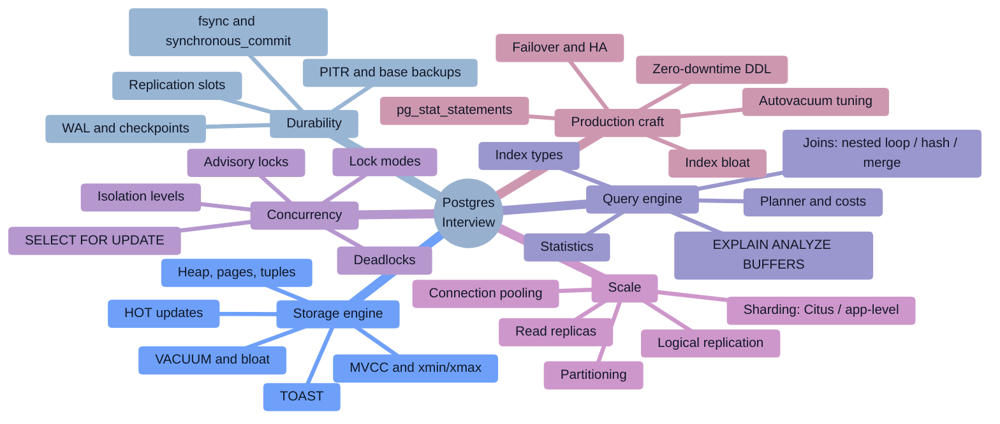

### Study strategy by company tier

| Tier | Companies | What they actually test | Time split |
|------|-----------|--------------------------|-----------|
| **FAANG / Big Tech** | Google, Meta, Amazon, Microsoft, Apple | DSA first. Postgres appears in the design round and the "you listed it on your resume" deep-dive: indexing decisions, isolation semantics, why a query is slow. Rarely syntax trivia. | 55% DSA, 25% system design, 20% DB depth |
| **High-scale product** | Netflix, Uber, Airbnb, DoorDash, Pinterest, Shopify, Instacart | Operational Postgres: replication lag, connection pooling, partitioning strategy, online schema change, vacuum/bloat, sharding when you outgrow one box. | 25% DSA, 40% production Postgres, 35% design |
| **Payments / fintech** | Stripe, Coinbase, Goldman, JPMorgan, Bloomberg, Razorpay | **Correctness above all.** Isolation levels and anomalies, `SERIALIZABLE` vs `SELECT … FOR UPDATE`, idempotency keys, exactly-once semantics, money types (`NUMERIC` never `FLOAT`), audit trails, constraints as the last line of defence. | 25% DSA, 45% transactional correctness, 30% design |
| **Data / analytics** | Databricks, Snowflake, Palantir, Datadog | Query plans, join algorithms, partition pruning, columnar vs row storage, why OLTP Postgres is bad at OLAP, CDC/logical decoding into a warehouse. | 20% DSA, 40% SQL + plans, 40% data architecture |
| **Indian product** | Walmart Global Tech, Flipkart, Swiggy, Zomato, PhonePe, Meesho, Zepto, Groww | **The heaviest Postgres weighting anywhere.** Indexes, joins, normalization, ACID, MVCC, `EXPLAIN`, window functions, plus a live SQL round on a whiteboard/CoderPad. | 25% DSA, 40% SQL + Postgres internals, 35% LLD/design |
| **Startups** | Seed → Series C | "Design the schema, write the queries, tell me what breaks at 100× traffic." Practical: migrations, ORM pitfalls (N+1), connection limits, when to add a cache. | 40% schema + SQL, 30% debugging, 30% architecture chat |
| **Service companies** | TCS, Infosys, Wipro, Accenture, Cognizant, Capgemini, LTIMindtree, HCL | Rapid-fire theory: ACID, normal forms, `DELETE` vs `TRUNCATE` vs `DROP`, joins, primary vs unique key, `HAVING` vs `WHERE`, index types, stored procedures/triggers, 2nd-highest-salary. | 70% theory Q&A, 25% simple SQL, 5% design |

### The 2026 shift you must internalize

> [!IMPORTANT]
> **"Postgres is an open-source relational database that's ACID compliant" is the setup, not the answer.** In 2026 the interviewer immediately follows with: *"Then why did your table grow to 400 GB when it only holds 20 GB of rows?"*, *"Your read replica is 40 minutes behind — what's the first thing you check?"*, *"You added an index and writes got 30% slower — explain."*, *"Two transactions both read a balance and both wrote — why did neither fail under READ COMMITTED?"* Every canonical question below is paired with the **depth follow-up** that decides the hire.

> [!TIP]
> **The single highest-leverage sentence in a Postgres interview:** *"Postgres never updates a row in place — an UPDATE writes a new tuple version and marks the old one dead, so every UPDATE is really an INSERT plus a deferred cleanup. Let me trace what that means for indexes, WAL, replication, and disk."* That one framing unlocks bloat, VACUUM, write amplification, HOT, `fillfactor`, long-transaction hazards, and wraparound — which is roughly 40% of a senior Postgres interview.

### How to read the star ratings

| Rating | Meaning |
|--------|---------|
| ★★★★★ | **Must know.** Asked in a majority of Postgres-touching interviews. Not knowing it is disqualifying. |
| ★★★★☆ | Very common at mid/senior level. Expected from anyone claiming Postgres experience. |
| ★★★☆☆ | Differentiator. Senior/Staff signal; separates "used Postgres" from "operated Postgres." |

---

# 1. 🌱 Beginner Concepts

## 1.1 What is PostgreSQL?

**PostgreSQL is an open-source, ACID-compliant, object-relational database management system (ORDBMS)** that speaks SQL, runs as a multi-process server, and stores data in a row-oriented heap protected by a write-ahead log.

Strip away the marketing and it is five things:

1. **A relational store** — data in tables of typed rows, with constraints the database itself enforces.
2. **A transactional engine** — ACID guarantees implemented with **MVCC** (multi-version concurrency control), so readers never block writers and writers never block readers.
3. **A cost-based query planner** — you declare *what* you want; Postgres decides *how* to get it, using table statistics.
4. **A durability machine** — the **WAL** (write-ahead log) makes crash recovery, replication, and point-in-time recovery all the same mechanism.
5. **An extensible platform** — custom types, operators, index access methods, procedural languages, and extensions (`PostGIS`, `pgvector`, `TimescaleDB`, `Citus`) that behave like first-class parts of the engine.

```mermaid
%%{init: {'theme':'base','themeVariables':{'background':'#ffffff','mainBkg':'#eef2f7','primaryColor':'#eef2f7','primaryTextColor':'#111827','primaryBorderColor':'#64748b','secondaryColor':'#e8f0fe','tertiaryColor':'#f1f5f9','lineColor':'#475569','textColor':'#111827','clusterBkg':'#f8fafc','clusterBorder':'#94a3b8','edgeLabelBackground':'#ffffff','titleColor':'#111827','actorBkg':'#eef2f7','actorTextColor':'#111827','actorBorder':'#64748b','actorLineColor':'#475569','signalColor':'#111827','signalTextColor':'#111827','noteBkgColor':'#fff4e5','noteTextColor':'#111827','noteBorderColor':'#d97706','labelBoxBkgColor':'#eef2f7','labelBoxBorderColor':'#64748b','labelTextColor':'#111827','loopTextColor':'#111827','altBackground':'#f8fafc'}}}%%
flowchart LR
    APP["📱 Application<br/>(psycopg / JDBC / pg)"] -->|"SQL over<br/>port 5432"| PM["🚪 Postmaster<br/>(listener)"]
    PM -->|"forks one process<br/>per connection"| BE["⚙️ Backend process<br/>(your session)"]
    BE --> PARSE["1️⃣ Parse → parse tree"]
    PARSE --> REW["2️⃣ Rewrite<br/>(views, rules, RLS)"]
    REW --> PLAN["3️⃣ Plan/Optimize<br/>(cost-based)"]
    PLAN --> EXEC["4️⃣ Execute"]
    EXEC --> BUF["🧠 Shared buffers<br/>(in-memory pages)"]
    BUF --> DISK["💾 Heap + index files"]
    EXEC --> WAL["📝 WAL buffers → WAL files"]
    WAL --> DISK

    style APP fill:#e8f0fe,stroke:#4285f4,color:#111827
    style PM fill:#eef2f7,stroke:#64748b,color:#111827
    style BE fill:#eef2f7,stroke:#64748b,color:#111827
    style WAL fill:#fff4e5,stroke:#f4b400,color:#111827
    style BUF fill:#e6f4ea,stroke:#34a853,color:#111827
    style DISK fill:#eef2f7,stroke:#64748b,color:#111827
```

### The one-liner to open with

> *"Postgres is a process-per-connection, MVCC-based relational database where durability comes from a write-ahead log and query execution is decided by a cost-based planner. Its defining trade-off is that it stores multiple physical versions of every row, which buys lock-free reads and costs you background cleanup."*

## 1.2 Why does it exist? A 40-year history that actually matters in interviews

| Era | What happened | Why it matters today |
|-----|---------------|----------------------|
| 1973–1985 | **Ingres** at UC Berkeley (Michael Stonebraker) — one of the first relational DBs. | Establishes the academic lineage; QUEL, not SQL. |
| 1986–1994 | **POSTGRES** ("post-Ingres") adds *types, rules, inheritance, extensibility*. | This is the "object-relational" DNA: user-defined types and index methods are not bolted on, they're foundational. |
| 1994–1996 | SQL support added (Postgres95) → renamed **PostgreSQL**. | The odd name. Correct pronunciation: *post-gres-Q-L*; "Postgres" is officially acceptable. |
| 2005 | Two-phase commit, roles, table partitioning via inheritance. | Enterprise features arrive. |
| 2010 | **Streaming replication** + hot standby (9.0). | Postgres becomes viable for HA without third-party tools. |
| 2014 | **JSONB** (9.4) + logical decoding. | Postgres eats a chunk of the NoSQL market; CDC becomes possible. |
| 2017 | **Declarative partitioning** (10) + native logical replication. | Modern partitioning story starts here. |
| 2019–2021 | Parallel query maturity, JIT, partition-wise joins, incremental sort. | Postgres gets respectable at analytics-ish workloads. |
| 2023–2024 | 16: logical replication from standbys, parallel `FULL`/`RIGHT` hash joins. 17: incremental backups, better VACUUM memory management (TID store), `MERGE` improvements. | Interviewers at operationally-mature companies ask about these. |
| **2025** | **18**: **asynchronous I/O**, `uuidv7()`, virtual generated columns, B-tree **skip scan**, `pg_upgrade` keeps statistics, OAuth. | The current "do you keep up?" checkpoint. |
| **2026** | **19 (beta)**: `pg_plan_advice`, native `REPACK`, **parallel autovacuum**, sequences in logical replication, `GROUP BY ALL`. | The "what are you excited about?" answer. |

**The problems Postgres was built to solve:**

- 🎯 **Correctness under concurrency** — many users mutating shared data without corrupting it or blocking each other.
- 🎯 **Durability under failure** — a committed transaction survives a power cut, mid-write.
- 🎯 **Declarative querying** — humans describe results; the machine finds the plan.
- 🎯 **Data integrity in the database** — constraints, foreign keys, types, and checks live with the data, not in five different application codebases that each forget one rule.
- 🎯 **Extensibility without forking** — add a type (geospatial, vector, time-series) without changing the core.

## 1.3 Real-world analogies (use these; interviewers remember them)

| Concept | Analogy |
|---------|---------|
| **MVCC** | A **wiki with full revision history**. When you edit a page, the old revision doesn't vanish — it stays, timestamped. Anyone who started reading before your edit keeps seeing the old revision. A janitor (VACUUM) later purges revisions nobody can possibly still be reading. |
| **WAL** | A **restaurant's order pad**. Before the kitchen cooks anything, the waiter writes the order on a numbered pad. If the kitchen catches fire, you replay the pad and reconstruct every order. The pad is written sequentially (fast); the kitchen is random-access (slow). |
| **Index** | A **book's index**. Finding "MVCC" by flipping every page = sequential scan. Looking it up in the back and jumping to page 214 = index scan. If the book is 3 pages long, the index is slower than just reading it — which is exactly why the planner ignores indexes on tiny tables. |
| **Query planner** | A **GPS**. You say "get me to the airport"; it estimates traffic (statistics) on each route (plan) and picks the cheapest. Stale traffic data (stale `ANALYZE`) → confidently terrible route. |
| **Shared buffers** | The **desk** vs the **filing cabinet**. Pages you're using sit on the desk (RAM); everything else is in the cabinet (disk). A too-small desk means constant walking. |
| **Transaction isolation** | **Camera shutter speed.** `READ COMMITTED` re-focuses before every shot (each statement sees a fresh snapshot). `REPEATABLE READ` locks focus for the whole roll of film. `SERIALIZABLE` additionally refuses to develop the roll if it detects you photographed an impossible scene. |
| **VACUUM** | **Garbage collection with a twist**: it doesn't return space to the OS by default, it just marks it reusable — like emptying boxes in a warehouse but keeping the warehouse the same size. |
| **TOAST** | **Checked luggage.** Small values ride in the cabin (the row). Anything over ~2 KB gets compressed and checked into a separate hold (the TOAST table), with a claim ticket left in the row. |
| **Replication slot** | A **"hold my mail" request at the post office**. It guarantees your mail (WAL) is kept until you collect it — and if you never come back, the post office fills up and the whole building shuts down. This is a top-3 real-world Postgres outage. |

## 1.4 The vocabulary you must be fluent in

| Term | Precise meaning |
|------|-----------------|
| **Cluster** | A single Postgres *instance* — one data directory, one postmaster, one port, **many databases**. ⚠️ Nothing to do with clustering/HA. This trips up almost everyone. |
| **Database** | A namespace within a cluster. Cross-database queries require FDW/dblink — you cannot `JOIN` across databases natively. |
| **Schema** | A namespace within a database (`public` by default). Tables live in schemas. `search_path` decides which schemas are searched unqualified. |
| **Relation** | Internal word for anything table-shaped: tables, indexes, views, sequences, matviews. |
| **Tuple** | A physical row *version*. One logical row can have many tuples alive at once. |
| **Page / Block** | The unit of I/O: **8 KB** by default. Everything — heap, index, TOAST — is pages. |
| **Heap** | The unordered file where table rows live. "Heap" = no inherent order, unlike a clustered index. |
| **CTID** | Physical address of a tuple: `(page_number, item_offset)`. **Not stable** — changes on UPDATE. |
| **XID** | 32-bit transaction ID. Finite → the wraparound problem. |
| **OID** | Object identifier used in system catalogs. |
| **Catalog** | The system tables (`pg_class`, `pg_attribute`, `pg_index`, …) that describe the database to itself. |
| **WAL / xlog** | Write-ahead log. Files of 16 MB by default in `pg_wal/`. |
| **LSN** | Log Sequence Number — a position in the WAL stream, e.g. `0/16B3748`. Replication lag is measured in LSN bytes. |
| **Checkpoint** | Flushing all dirty shared buffers to disk and recording a WAL position from which recovery may start. |
| **Backend** | The OS process serving one client connection. |
| **Autovacuum** | The background daemon that launches VACUUM/ANALYZE workers automatically. |
| **Bloat** | Space occupied by dead tuples and unused free space — the tax of MVCC. |

## 1.5 ACID, precisely (and how Postgres implements each letter)

| Letter | Guarantee | Postgres implementation |
|--------|-----------|-------------------------|
| **A**tomicity | All-or-nothing | The transaction's XID is recorded in the **commit log (`pg_xact`)**. Commit = flipping one status bit. Abort costs nothing — the dead tuples are just never visible. |
| **C**onsistency | Constraints hold before and after | Types, `NOT NULL`, `CHECK`, `UNIQUE`, `FOREIGN KEY`, `EXCLUDE` constraints, triggers. |
| **I**solation | Concurrent transactions don't corrupt each other | **MVCC snapshots** + **SSI** (Serializable Snapshot Isolation) at the strictest level. |
| **D**urability | Committed = survives crash | **WAL flushed with `fsync` before commit returns** (unless you relax `synchronous_commit`). |

> [!TIP]
> **Interview gold:** *"Atomicity in Postgres is almost free. Because MVCC never overwrites data, a rollback doesn't have to undo anything — the new tuples simply never become visible. That's the opposite of Oracle/MySQL-InnoDB, which maintain an UNDO log and pay at rollback and at read time instead. Postgres pays later, in VACUUM."* This single comparison signals real understanding.

## 1.6 Common misconceptions ❌ → ✅

| ❌ Misconception | ✅ Reality |
|------------------|-----------|
| "Postgres is slower than MySQL." | Workload-dependent and mostly folklore in 2026. Postgres historically lagged on simple read-heavy PK lookups and connection scaling; it leads on complex queries, concurrency correctness, index variety, and extensibility. |
| "MVCC means no locks." | MVCC removes **read–write** blocking. **Write–write conflicts still block**: two transactions updating the same row serialize on a row lock. And DDL takes heavy table-level locks. |
| "VACUUM frees disk space." | Plain `VACUUM` marks space **reusable inside the file**; it rarely shrinks the file. `VACUUM FULL` shrinks it but takes an `ACCESS EXCLUSIVE` lock and rewrites the whole table. `pg_repack` (or `REPACK` 🔮 v19) does it online. |
| "Indexes always make things faster." | Every index makes **writes slower** (more pages to update, more WAL) and costs disk. On small tables or low-selectivity predicates, a sequential scan wins. Unused indexes are pure tax. |
| "`SELECT COUNT(*)` is instant." | In Postgres it's **O(n)** — MVCC means visibility is per-tuple, so it must scan (heap or index). No stored row counter exists. Index-only scans help; approximations (`pg_class.reltuples`) help more. |
| "A primary key is the same as a clustered index." | Postgres has **no clustered indexes**. The heap is unordered; the PK is a separate B-tree pointing into it. `CLUSTER` is a one-shot physical reorder, not maintained. This is the #1 difference from SQL Server/MySQL-InnoDB. |
| "`TEXT` is slower than `VARCHAR(50)`." | Identical storage and performance. `VARCHAR(n)` only adds a length **constraint** (and a painful migration when 50 isn't enough). Use `TEXT` + a `CHECK` if you need a limit. |
| "NULL = NULL." | `NULL = NULL` is `NULL`, not true. Use `IS NULL` / `IS NOT DISTINCT FROM`. A `UNIQUE` index historically allows many NULLs (🆕 v15 `UNIQUE NULLS NOT DISTINCT` changes that). |
| "Postgres can't do JSON / it's not for documents." | `JSONB` with GIN indexes is a first-class document store, and often beats MongoDB for mixed relational+document workloads. |
| "Read replicas give you more write capacity." | They give **read** capacity only. All writes still funnel to one primary. Scaling writes needs partitioning + sharding (Citus, app-level) or a different topology. |
| "Connection pooling is just an optimization." | At >few-hundred connections it's a **correctness/availability requirement**. Postgres forks an OS process per connection (~5–10 MB each) and context-switching + lock contention collapse throughput. PgBouncer is not optional at scale. |
| "`TRUNCATE` can't be rolled back." | In Postgres, **`TRUNCATE` is transactional and can be rolled back** (unlike Oracle/MySQL). Classic service-company trick question. |
| "Autovacuum handles everything." | Default settings are tuned for a laptop from 2005. On a busy 500 GB table, defaults mean vacuum triggers after ~100 million dead rows. Tuning is mandatory. |
| "Postgres doesn't scale." | Instagram, Notion, Figma, Cloudflare, GitLab, and Robinhood all run enormous Postgres fleets. It scales — with partitioning, pooling, replicas, and eventually sharding. What it doesn't do is scale *automatically*. |

## 1.7 Data types — the ones interviews care about

```sql
-- ✅ The types a senior engineer defends in review
CREATE TABLE payments (
    id            bigint GENERATED ALWAYS AS IDENTITY PRIMARY KEY, -- ✅ not SERIAL
    public_id     uuid NOT NULL DEFAULT uuidv7(),   -- 🆕 v18: time-ordered UUID
    amount_cents  bigint      NOT NULL CHECK (amount_cents > 0),
    amount        numeric(19,4) NOT NULL,           -- ✅ money = NUMERIC, never float
    currency      char(3)     NOT NULL,
    status        text        NOT NULL CHECK (status IN ('pending','settled','failed')),
    metadata      jsonb       NOT NULL DEFAULT '{}'::jsonb,
    tags          text[]      NOT NULL DEFAULT '{}',
    created_at    timestamptz NOT NULL DEFAULT now(),  -- ✅ ALWAYS timestamptz
    valid_period  tstzrange
);
```

| Type family | Use | Interview trap |
|-------------|-----|----------------|
| `smallint` / `integer` / `bigint` | Whole numbers (2/4/8 bytes) | **The `int4` PK overflow outage.** 2.1 billion is closer than you think. Use `bigint` for anything that could grow. |
| `numeric(p,s)` | **Money, anything requiring exactness** | `float8` gives `0.1 + 0.2 <> 0.3`. Never store currency in floating point. `numeric` is slower (software arithmetic) — that's the accepted trade. |
| `real` / `double precision` | Scientific/approximate | IEEE 754. Fine for sensor data, fatal for ledgers. |
| `text` / `varchar` / `char` | Strings | `char(n)` is blank-padded and almost always wrong. `text` is the default answer. |
| `timestamptz` vs `timestamp` | Time | **`timestamptz` always.** It stores UTC and converts on I/O using `TimeZone`. `timestamp` (without tz) stores a wall-clock string with no meaning across zones. Note: `timestamptz` does *not* store the original zone. |
| `date`, `time`, `interval` | Time parts | `interval` arithmetic is a common SQL-round question. |
| `boolean` | 3-valued: true/false/**NULL** | |
| `uuid` | 16-byte identifier | **v4 UUIDs randomize B-tree inserts** → page splits, cache misses, WAL churn. 🆕 v18 `uuidv7()` is time-ordered and fixes it. |
| `jsonb` vs `json` | Documents | `json` = text, preserves whitespace/key order/duplicates, no indexing. **`jsonb` = parsed binary, dedups keys, supports GIN.** Answer is essentially always `jsonb`. |
| `array` | `text[]`, `int[]` | Great for tags; can be GIN-indexed. Bad when you need FK integrity or per-element updates → use a child table. |
| `enum` | Fixed sets | Cheap and readable, but **adding a value used to require a lock**; removing one still requires a type rewrite. Many teams prefer `text` + `CHECK` or a lookup table. |
| `range` / `multirange` | `int4range`, `tstzrange` | Combined with `EXCLUDE` constraints, this is the **elegant answer to "prevent double-booking a room"** — a favourite senior question. |
| `inet` / `cidr` / `macaddr` | Network | Real types with real operators — don't store IPs as text. |
| `bytea` | Binary blobs | Fine for small blobs; large files belong in S3 with a pointer in the DB. |
| `tsvector` / `tsquery` | Full-text search | Built-in FTS with GIN — often good enough to postpone Elasticsearch for years. |
| `vector` (pgvector) | Embeddings | The 2024–2026 boom. HNSW/IVFFlat indexes. Increasingly asked in AI-company interviews. |
| `geometry` (PostGIS) | Geospatial | GiST/SP-GiST indexes. The reason Postgres owns the geospatial market. |

> [!WARNING]
> **`SERIAL` vs `GENERATED ALWAYS AS IDENTITY`.** `SERIAL` is legacy syntax that creates a sequence with awkward ownership semantics and lets callers override the value. The SQL-standard `GENERATED ALWAYS AS IDENTITY` (PG 10+) is the modern answer. Saying so unprompted is a small but real senior signal.

## 1.8 Your first ten commands (psql fluency counts)

```sql
\l                -- list databases
\c mydb           -- connect
\dt               -- list tables
\d+ users         -- describe table: columns, indexes, constraints, storage
\di               -- list indexes
\df               -- list functions
\dn               -- list schemas
\du               -- list roles
\x                -- expanded output (essential for wide rows)
\timing           -- show query duration
\e                -- edit the last query in $EDITOR
\watch 1          -- re-run the last query every second (live monitoring!)
```

```sql
-- The five system queries you should know cold
SELECT * FROM pg_stat_activity WHERE state <> 'idle' ORDER BY query_start; -- who's running what
SELECT * FROM pg_stat_statements ORDER BY total_exec_time DESC LIMIT 20;   -- slowest queries overall
SELECT * FROM pg_stat_user_tables WHERE n_dead_tup > 100000;               -- bloat candidates
SELECT * FROM pg_locks l JOIN pg_stat_activity a USING (pid) WHERE NOT granted; -- who's blocked
SELECT pg_size_pretty(pg_total_relation_size('orders'));                   -- table + indexes + TOAST
```

---
# 2. 🧩 Intermediate Concepts

## 2.1 Process & memory architecture

Postgres is **multi-process, not multi-threaded** (unlike MySQL, SQL Server, and Oracle-on-Linux). One OS process per connection. This single fact explains connection pooling, `max_connections`, `work_mem` accounting, and why `fork()` cost matters.

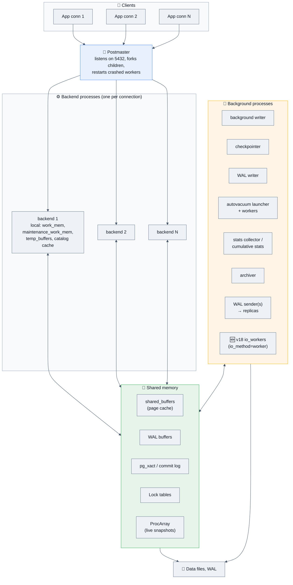

### Memory areas you must be able to name

| Area | Scope | Default | What it does | Tuning rule of thumb |
|------|-------|---------|--------------|----------------------|
| `shared_buffers` | Shared | 128 MB | Postgres's own page cache | **25% of RAM** (up to ~64 GB). Postgres also relies on the OS page cache — this is the classic "why not 80%?" question. |
| `work_mem` | **Per operation, per backend** | 4 MB | Sorts, hash joins, hash aggregates | ⚠️ **Multiplied by concurrent operations, not connections.** One query with 3 sorts × 200 connections × 64 MB = 38 GB. The #1 OOM cause. |
| `maintenance_work_mem` | Per maintenance op | 64 MB | VACUUM, CREATE INDEX, ALTER TABLE | 1–2 GB is fine; dramatically speeds index builds and vacuum. |
| `effective_cache_size` | Planner hint only | 4 GB | Tells the planner how much cache (Postgres + OS) exists | Set to ~50–75% of RAM. **Allocates nothing** — it only changes plan costs (higher → favours index scans). |
| `wal_buffers` | Shared | ~16 MB | WAL staging | Rarely tuned. |
| `temp_buffers` | Per backend | 8 MB | Temp table pages | |
| `max_connections` | — | 100 | Hard cap on backends | Keep low (100–300) and put **PgBouncer** in front. |

> [!WARNING]
> **The `work_mem` OOM interview question.** *"Your DB OOM-killed at 3 a.m. `work_mem` is 256 MB and `max_connections` is 500. What happened?"* Answer: `work_mem` is granted **per sort/hash node**, so a single query with a hash join plus two sorts can allocate 768 MB, and 500 such backends can theoretically demand ~375 GB. The fix: lower the global `work_mem`, raise it per-session (`SET LOCAL work_mem`) only for known-heavy analytical queries, and cap concurrency with a pooler. 🆕 In PG 17+, hash aggregates also spill to disk more gracefully, but the accounting model is unchanged.

## 2.2 Physical storage: pages, tuples, and the row header

Everything is an **8 KB page**. A heap page looks like this:

```mermaid
%%{init: {'theme':'base','themeVariables':{'background':'#ffffff','mainBkg':'#eef2f7','primaryColor':'#eef2f7','primaryTextColor':'#111827','primaryBorderColor':'#64748b','secondaryColor':'#e8f0fe','tertiaryColor':'#f1f5f9','lineColor':'#475569','textColor':'#111827','clusterBkg':'#f8fafc','clusterBorder':'#94a3b8','edgeLabelBackground':'#ffffff','titleColor':'#111827','actorBkg':'#eef2f7','actorTextColor':'#111827','actorBorder':'#64748b','actorLineColor':'#475569','signalColor':'#111827','signalTextColor':'#111827','noteBkgColor':'#fff4e5','noteTextColor':'#111827','noteBorderColor':'#d97706','labelBoxBkgColor':'#eef2f7','labelBoxBorderColor':'#64748b','labelTextColor':'#111827','loopTextColor':'#111827','altBackground':'#f8fafc'}}}%%
flowchart TB
    subgraph PAGE["📄 8 KB heap page"]
        H["PageHeader (24 B)<br/>LSN, checksum, free-space pointers"]
        LP["ItemId array (line pointers)<br/>lp1 → lp2 → lp3 …<br/>grows downward ↓"]
        FREE["🕳️ Free space<br/>(governed by fillfactor)"]
        T3["Tuple 3 ⬆"]
        T2["Tuple 2 ⬆"]
        T1["Tuple 1 — grows upward"]
        SP["Special space<br/>(indexes use this; heap leaves it empty)"]
    end
    H --> LP --> FREE --> T3 --> T2 --> T1 --> SP

    style H fill:#e8f0fe,stroke:#4285f4,color:#111827
    style LP fill:#e8f0fe,stroke:#4285f4,color:#111827
    style FREE fill:#fff4e5,stroke:#f4b400,color:#111827
    style T1 fill:#e6f4ea,stroke:#34a853,color:#111827
    style T2 fill:#e6f4ea,stroke:#34a853,color:#111827
    style T3 fill:#e6f4ea,stroke:#34a853,color:#111827
```

**Key consequences to state in an interview:**

- A row **cannot span pages**. Anything approaching 8 KB gets **TOASTed** (compressed and/or moved out of line). Hard limit: ~1600 columns; practical row limit before TOAST kicks in ≈ **2 KB** (`TOAST_TUPLE_THRESHOLD`).
- **Line pointers give indirection.** An index entry points at `(page, line_pointer)`, not at the raw bytes — which is what makes **HOT updates** and intra-page vacuuming possible.
- Every tuple carries a **23-byte header** plus alignment padding. Column *order* affects row size: putting `bool, bigint, bool` costs more than `bigint, bool, bool` because of 8-byte alignment. On a billion-row table this is real money — a nice Staff-level detail.

### The tuple header — the heart of MVCC

| Field | Meaning |
|-------|---------|
| `xmin` | XID of the transaction that **inserted** this version |
| `xmax` | XID of the transaction that **deleted/updated** it (0 if live) |
| `cmin` / `cmax` | Command IDs — visibility *within* a transaction |
| `ctid` | Pointer to the **next version** of this row (used by UPDATE chains) |
| `t_infomask` | Hint bits: committed/aborted, frozen, HOT, key-updated, etc. |

```sql
-- See it yourself (system columns are always available)
SELECT ctid, xmin, xmax, * FROM accounts LIMIT 5;
-- Age of the oldest unfrozen XID in a table -> wraparound risk
SELECT relname, age(relfrozenxid) FROM pg_class WHERE relkind='r' ORDER BY 2 DESC LIMIT 10;
```

## 2.3 MVCC — the central mechanism 🔑

**Rule: Postgres never modifies a row in place.**

| Operation | What physically happens |
|-----------|-------------------------|
| `INSERT` | Write a new tuple with `xmin = my_xid`, `xmax = 0`. |
| `UPDATE` | Set `xmax = my_xid` on the old tuple, **write a brand-new tuple** with `xmin = my_xid`, and update **every index** (unless it's a HOT update). |
| `DELETE` | Set `xmax = my_xid` on the tuple. Nothing is erased. |
| `COMMIT` | Flip the transaction's status in `pg_xact`. That's it — no data movement. |
| `ROLLBACK` | Also just a status flip. The tuples written are simply never visible. |

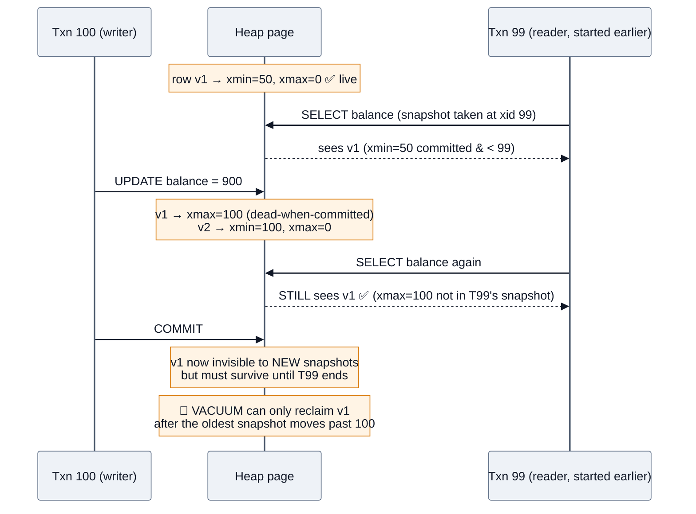

### The visibility rule (say this and you sound like you've read the source)

> A tuple is visible to my snapshot iff: **`xmin` committed and is not "in progress" relative to my snapshot**, AND (**`xmax` is 0/invalid** OR **`xmax`'s transaction aborted** OR **`xmax` is not yet visible to my snapshot**).

A snapshot is `(xmin_horizon, xmax_horizon, [list of in-progress XIDs])`, captured from the shared **ProcArray**.

### 💡 The four consequences that generate interview questions

| Consequence | Question it generates |
|-------------|-----------------------|
| **Bloat** — dead tuples accumulate | "Table is 400 GB, `SELECT count(*)` says 20 GB of data. Why?" |
| **Write amplification** — an UPDATE rewrites the row *and all its indexes* | "Why did Uber move off Postgres?" |
| **Long transactions pin the horizon** — VACUUM can't clean anything newer than the oldest running snapshot | "An analyst left a `BEGIN;` open in psql overnight. What broke?" |
| **XIDs are 32-bit** — they wrap after ~4 billion | "What is transaction ID wraparound and what happens at 2 billion?" |

> [!IMPORTANT]
> **The killer answer for "long-running transaction" questions:** *"A transaction that stays open — even one that's completely idle in `idle in transaction` — holds back the global xmin horizon. VACUUM refuses to remove any tuple that could still be visible to it. So one forgotten psql session bloats every hot table in the cluster, indexes included, and in the worst case pushes the cluster toward wraparound. That's why we set `idle_in_transaction_session_timeout` and alert on `pg_stat_activity` where `xact_start` is older than a few minutes."*

## 2.4 HOT updates and `fillfactor` — the mitigation

**Heap-Only Tuple (HOT) update:** if an UPDATE (a) changes **no indexed column** and (b) the new version fits on **the same page**, Postgres writes the new tuple on that page and chains it from the old line pointer — **no index update at all.**

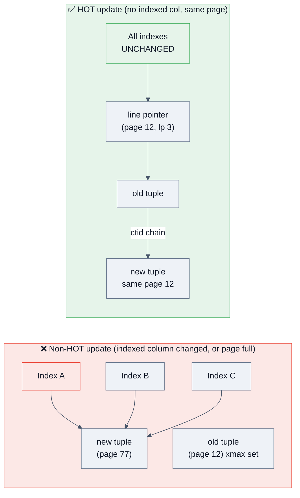

**`fillfactor`** reserves free space in each page so future updates can stay HOT:

```sql
-- Hot, frequently-updated table: leave 15-30% headroom
ALTER TABLE sessions SET (fillfactor = 80);
VACUUM FULL sessions;  -- or pg_repack, to apply it to existing pages

-- Check your HOT ratio (higher = healthier)
SELECT relname,
       n_tup_upd,
       n_tup_hot_upd,
       round(100.0 * n_tup_hot_upd / NULLIF(n_tup_upd,0), 1) AS hot_pct
FROM pg_stat_user_tables
WHERE n_tup_upd > 0
ORDER BY n_tup_upd DESC;
```

> [!TIP]
> **Staff-level insight:** *"An index on a frequently-updated column is doubly expensive — it costs the index maintenance itself, and it disqualifies every update from being HOT, which then costs maintenance on **all** the other indexes too. So before adding an index on `last_seen_at`, I check the update rate."* 🆕 PG 16 added `n_tup_newpage_upd` so you can see updates that failed HOT specifically because the page was full — the signal that `fillfactor` needs lowering.

## 2.5 VACUUM, autovacuum, and freezing

### What VACUUM actually does (four jobs, not one)

1. 🧹 **Remove dead tuples** and their index entries → mark space reusable via the **Free Space Map (FSM)**.
2. 👁️ **Update the Visibility Map (VM)** — marks pages where all tuples are visible to everyone. **This is what makes index-only scans possible.**
3. ❄️ **Freeze old tuples** — rewrite `xmin` as "frozen" so the tuple is visible regardless of XID comparison. Prevents wraparound.
4. 📊 **Update statistics** (only `VACUUM ANALYZE` / autoanalyze).

| Variant | Lock | Shrinks file? | Online? |
|---------|------|---------------|---------|
| `VACUUM` | `SHARE UPDATE EXCLUSIVE` (blocks DDL & other vacuums, not DML) | Only if trailing pages are entirely empty | ✅ |
| `VACUUM FULL` | **`ACCESS EXCLUSIVE`** — blocks everything, rewrites the table | ✅ Fully | ❌ **Never on a live prod table** |
| `VACUUM FREEZE` | Like VACUUM | No | ✅ (but heavy I/O) |
| `ANALYZE` | `SHARE UPDATE EXCLUSIVE` | n/a | ✅ |
| `pg_repack` / 🔮 v19 `REPACK` | Brief locks only | ✅ | ✅ — **the correct production answer** |

### Autovacuum triggering — memorize this formula

```
Vacuum when:  dead_tuples > autovacuum_vacuum_threshold
                            + autovacuum_vacuum_scale_factor × reltuples
Defaults:     50 + 0.20 × rows        →  20% of the table must be dead first
Analyze when: 50 + 0.10 × rows        →  10% changed
🆕 v13+:      autovacuum_vacuum_insert_threshold (1000) + insert_scale_factor (0.2)
              — so append-only tables finally get vacuumed for freezing/VM
```

> [!WARNING]
> **On a 100 M-row table, 20% = 20 million dead tuples before autovacuum even starts.** That is the default and it is wrong for any large busy table. Per-table override:

```sql
ALTER TABLE orders SET (
    autovacuum_vacuum_scale_factor  = 0.01,   -- 1% instead of 20%
    autovacuum_vacuum_threshold     = 1000,
    autovacuum_analyze_scale_factor = 0.005,
    autovacuum_vacuum_cost_delay    = 2       -- ms; lower = more aggressive
);
```

### Global knobs that matter

| Setting | Default | Production guidance |
|---------|---------|---------------------|
| `autovacuum_max_workers` | 3 | 4–8 on large fleets. ⚠️ The **cost budget is shared across all workers** — more workers each go slower unless you also raise the limit. |
| `autovacuum_vacuum_cost_limit` | 200 (`-1` → `vacuum_cost_limit`) | 1000–4000 on SSDs. This is the single biggest "vacuum can't keep up" fix. |
| `autovacuum_vacuum_cost_delay` | 2 ms (PG 12+) | Lower → faster vacuum, more I/O. |
| `autovacuum_naptime` | 60 s | Fine. |
| `maintenance_work_mem` | 64 MB | **1 GB.** Fewer index passes per vacuum. 🆕 PG 17's TID store made vacuum memory use far more efficient. |
| `autovacuum_freeze_max_age` | 200 M | Below this, autovacuum is triggered for **freezing** and **cannot be skipped**. |
| `vacuum_freeze_min_age` | 50 M | |
| 🔮 v19 | **parallel autovacuum** | Index vacuum phases parallelized automatically. |

### Transaction ID wraparound — the doomsday scenario

XIDs are **32-bit** → ~4.2 billion values, treated as a circle where 2 billion are "in the past" and 2 billion "in the future."

```mermaid
%%{init: {'theme':'base','themeVariables':{'background':'#ffffff','mainBkg':'#eef2f7','primaryColor':'#eef2f7','primaryTextColor':'#111827','primaryBorderColor':'#64748b','secondaryColor':'#e8f0fe','tertiaryColor':'#f1f5f9','lineColor':'#475569','textColor':'#111827','clusterBkg':'#f8fafc','clusterBorder':'#94a3b8','edgeLabelBackground':'#ffffff','titleColor':'#111827','actorBkg':'#eef2f7','actorTextColor':'#111827','actorBorder':'#64748b','actorLineColor':'#475569','signalColor':'#111827','signalTextColor':'#111827','noteBkgColor':'#fff4e5','noteTextColor':'#111827','noteBorderColor':'#d97706','labelBoxBkgColor':'#eef2f7','labelBoxBorderColor':'#64748b','labelTextColor':'#111827','loopTextColor':'#111827','altBackground':'#f8fafc'}}}%%
flowchart LR
    A["age(relfrozenxid)<br/>= 0 → 200 M<br/>😀 Healthy"] --> B["200 M<br/>⚠️ autovacuum_freeze_max_age<br/>Anti-wraparound autovacuum<br/>launches — cannot be skipped"]
    B --> C["~10 M remaining<br/>🟠 WARNING in logs:<br/>'must be vacuumed within N txns'"]
    C --> D["~1 M remaining<br/>🔴 Postgres REFUSES new writes<br/>Database is read-only"]
    D --> E["💀 Single-user mode<br/>VACUUM FREEZE, hours of downtime"]

    style A fill:#e6f4ea,stroke:#34a853,color:#111827
    style B fill:#fff4e5,stroke:#f4b400,color:#111827
    style C fill:#fff4e5,stroke:#f4b400,color:#111827
    style D fill:#fce8e6,stroke:#ea4335,color:#111827
    style E fill:#fce8e6,stroke:#ea4335,color:#111827
```

```sql
-- 🚨 The wraparound monitoring query. Alert at >50%, page at >80%.
SELECT c.relname,
       age(c.relfrozenxid) AS xid_age,
       round(100 * age(c.relfrozenxid) / 2.0e9, 1) AS pct_to_wraparound,
       pg_size_pretty(pg_total_relation_size(c.oid)) AS size
FROM pg_class c
JOIN pg_namespace n ON n.oid = c.relnamespace
WHERE c.relkind IN ('r','m','t') AND n.nspname NOT IN ('pg_catalog','information_schema')
ORDER BY age(c.relfrozenxid) DESC
LIMIT 20;
```

**The three things that block freezing (and cause wraparound):**
1. Long-running transactions / `idle in transaction` sessions.
2. **Abandoned replication slots** (`pg_replication_slots` with `active = false`).
3. Orphaned **prepared transactions** (`pg_prepared_xacts`) — two-phase commit left dangling.

> [!NOTE]
> 🔮 **64-bit XIDs** have been proposed for years and are still not in core as of PG 19 beta. If asked "how would you fix wraparound forever?", the honest senior answer is: *"64-bit XIDs are the long-term fix and the patch series is still under review; today we manage it operationally with monitoring, aggressive freeze settings, and killing the three blockers."*

## 2.6 WAL, checkpoints, and durability

**Write-Ahead Logging rule:** *the log record describing a change must reach durable storage before the data page does.*

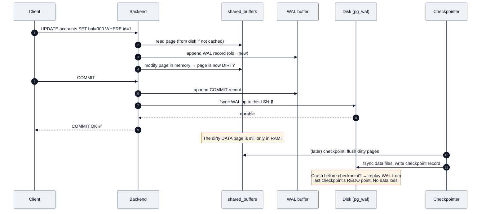

**Why this is fast:** WAL writes are **sequential** (append-only), data-file writes are **random**. Sequential I/O is orders of magnitude cheaper, and you batch the random writes later.

### Durability knobs — the trade-off table interviewers love

| Setting | Values | Meaning | Risk |
|---------|--------|---------|------|
| `fsync` | `on` / `off` | Master switch for flushing to disk | ❌ `off` = **guaranteed corruption on crash.** Only for throwaway loads. |
| `synchronous_commit` | `on` (default) | fsync WAL before returning COMMIT | None. |
| | `off` | Return COMMIT immediately; flush within `wal_writer_delay` | **Lose up to ~3× `wal_writer_delay` of committed transactions on crash — but never corruption.** Huge throughput win. |
| | `local` | fsync locally, don't wait for standbys | Standby may lag. |
| | `remote_write` / `on` / `remote_apply` | Increasing sync-replication strictness | Higher latency, stronger guarantee. |
| `full_page_writes` | `on` | Write the whole page to WAL the first time it's touched after a checkpoint | Protects against **torn pages**. Turning it off is safe only on filesystems/hardware with atomic 8 KB writes (ZFS, some NVMe). |
| `wal_compression` | `off`/`pglz`/`lz4`/`zstd` | Compress full-page images | Big WAL reduction; small CPU cost. **`lz4` is the modern default choice.** |
| `wal_level` | `minimal`/`replica`/`logical` | How much goes into WAL | `replica` for streaming replication (default), `logical` for CDC/logical replication. |

> [!TIP]
> **The nuance that separates senior from mid:** *"`synchronous_commit = off` is not the same as `fsync = off`. Turning off `fsync` risks **corruption**; turning off `synchronous_commit` risks only **losing the last few hundred milliseconds of commits**, with the database still perfectly consistent. For a high-volume analytics-ingest table where losing 200 ms of events is acceptable, `SET LOCAL synchronous_commit = off` per-transaction is a legitimate and large optimization. I'd never do it for payments."*

### Checkpoints

```ini
checkpoint_timeout = 15min           # default 5min; longer = fewer full-page writes
max_wal_size = 8GB                   # default 1GB; triggers checkpoint when exceeded
checkpoint_completion_target = 0.9   # spread the flush over 90% of the interval (default since PG 14)
```

**The classic symptom:** periodic latency spikes exactly every N minutes = a **checkpoint I/O storm**. Fix: raise `max_wal_size` and `checkpoint_timeout`, confirm `checkpoint_completion_target` is 0.9, and check `pg_stat_bgwriter` for `checkpoints_req` (requested = triggered by WAL volume = bad) vs `checkpoints_timed` (scheduled = good). **You want the ratio heavily toward timed.**

## 2.7 Indexes — the six types and when each wins

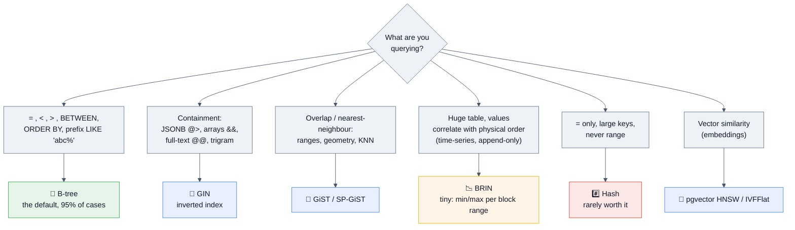

| Type | Structure | Best for | Size | Gotchas |
|------|-----------|----------|------|---------|
| **B-tree** | Balanced tree, sorted leaves | `=`, `<`, `>`, `BETWEEN`, `IN`, `ORDER BY`, `LIKE 'prefix%'`, `MIN`/`MAX`, uniqueness | Medium | Only index type supporting `UNIQUE` & PK. 🆕 v18: **skip scan** lets a multicolumn index be used even when the *leading* column isn't in the predicate. |
| **Hash** | Hash table | `=` only, on very large values | Smaller than B-tree for big keys | WAL-logged & crash-safe since PG 10. Still: no ranges, no uniqueness, no multi-column. **B-tree is nearly always the better default.** |
| **GIN** | Inverted (value → list of rows) | `jsonb @>`, `array &&`, full-text `@@`, `pg_trgm` `LIKE '%mid%'` | Large | **Slow to update** — mitigated by the `fastupdate` pending list, tuned via `gin_pending_list_limit`. |
| **GiST** | Generalized search tree, lossy | Ranges, geometry (PostGIS), KNN (`ORDER BY point <-> point`), exclusion constraints | Medium | Lossy → planner adds a recheck. Supports `EXCLUDE` constraints (GIN doesn't, for ranges). |
| **SP-GiST** | Space-partitioned (quadtree/radix) | Non-balanced data: IP prefixes, phone numbers, point data | Small | Niche. |
| **BRIN** | Min/max summary per block range | **Massive** append-only tables where value ≈ physical order (timestamps, sequential IDs) | **Tiny** (often <1% of a B-tree) | Useless if data is unordered. `pages_per_range` is the tuning knob. 🆕 PG 14+ has `bloom` and `minmax_multi` opclasses for less-perfectly-ordered data. |
| **Bloom** (extension) | Bloom filter signature | Many low-selectivity columns queried in arbitrary combinations | Small | Probabilistic; always rechecks. |
| **pgvector HNSW / IVFFlat** | ANN graph / inverted lists | Embedding similarity search | Large (HNSW) | HNSW: better recall/latency, slow build. IVFFlat: fast build, needs data before building. |

### Index features that win interviews

```sql
-- 1️⃣ PARTIAL INDEX — index only the rows you query. Often 100× smaller.
CREATE INDEX idx_orders_pending ON orders (created_at)
    WHERE status = 'pending';        -- 0.1% of rows → tiny, hot in cache

-- 2️⃣ COVERING INDEX (INCLUDE, PG 11+) — enables index-only scans
CREATE INDEX idx_users_email_cover ON users (email) INCLUDE (name, created_at);
-- INCLUDE columns live only in leaf pages: not searchable, but returnable.

-- 3️⃣ EXPRESSION INDEX — must match the query expression EXACTLY
CREATE INDEX idx_users_lower_email ON users (lower(email));
SELECT * FROM users WHERE lower(email) = 'a@b.com';  -- ✅ uses it
SELECT * FROM users WHERE email = 'a@b.com';         -- ❌ does not

-- 4️⃣ MULTICOLUMN — column order is everything
CREATE INDEX idx_ev ON events (tenant_id, created_at DESC, event_type);
-- Usable for: (tenant_id), (tenant_id, created_at), (tenant_id, created_at, event_type)
-- 🆕 v18 skip scan can now also help (created_at) alone when tenant_id has few distinct values.

-- 5️⃣ CONCURRENT BUILD — never lock a production table
CREATE INDEX CONCURRENTLY idx_x ON big_table (col);   -- ⚠️ cannot run inside a transaction
-- If it fails you get an INVALID index — find and drop it:
SELECT indexrelid::regclass FROM pg_index WHERE NOT indisvalid;

-- 6️⃣ UNIQUE with a filter — "one active subscription per user"
CREATE UNIQUE INDEX uq_active_sub ON subscriptions (user_id) WHERE status = 'active';

-- 7️⃣ EXCLUSION CONSTRAINT — the elegant "no double booking" answer
CREATE EXTENSION IF NOT EXISTS btree_gist;
ALTER TABLE bookings ADD CONSTRAINT no_overlap
    EXCLUDE USING gist (room_id WITH =, during WITH &&);
```

> [!TIP]
> **The multicolumn ordering rule to recite:** *"Equality columns first, then the range/sort column, then anything only needed for the output. `WHERE tenant_id = ? AND created_at > ? ORDER BY created_at DESC` wants `(tenant_id, created_at DESC)` — the reverse order forces a sort or a full scan."* Some teams call this **ESR: Equality, Sort, Range**.

### When Postgres refuses to use your index (the debugging checklist)

| Cause | Example | Fix |
|-------|---------|-----|
| Function on the column | `WHERE date(created_at) = '2026-01-01'` | Rewrite as a range, or add an expression index |
| Type mismatch / implicit cast | `WHERE varchar_col = 123` | Cast correctly, or fix the column type |
| Leading wildcard | `LIKE '%foo'` | `pg_trgm` GIN index |
| Low selectivity | Predicate matches 40% of rows | Seq scan genuinely is faster — this is correct behaviour |
| Small table | <1000 rows | Correct behaviour |
| Stale statistics | Just bulk-loaded 10 M rows | `ANALYZE table;` |
| `OR` across columns | `WHERE a = 1 OR b = 2` | Two indexes + `UNION ALL`, or a bitmap-friendly rewrite |
| `!=` / `NOT IN` | Rarely selective | Rethink the query |
| Collation/locale mismatch for `LIKE` | non-C collation | `text_pattern_ops` opclass |
| Index bloat making it huge | | `REINDEX CONCURRENTLY` (PG 12+) |

## 2.8 The query lifecycle & the planner

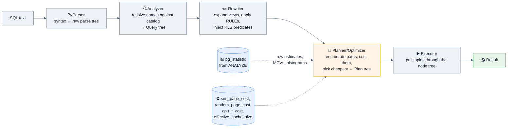

### Cost parameters (the numbers to quote)

| Parameter | Default | Meaning |
|-----------|---------|---------|
| `seq_page_cost` | 1.0 | Reference unit: one sequential page read |
| `random_page_cost` | **4.0** | A random page read. ⚠️ **On SSD/NVMe set this to 1.1–1.5.** The 4.0 default assumes spinning rust and is the #1 reason Postgres under-uses indexes on modern hardware. |
| `cpu_tuple_cost` | 0.01 | Processing one row |
| `cpu_index_tuple_cost` | 0.005 | Processing one index entry |
| `cpu_operator_cost` | 0.0025 | One operator/function call |
| `effective_cache_size` | 4 GB | Assumed total cache; higher favours index scans |
| `parallel_setup_cost` | 1000 | Overhead of starting parallel workers |
| `jit_above_cost` | 100000 | When to JIT-compile the plan |

### Statistics — where estimates come from

`ANALYZE` samples rows (default `default_statistics_target = 100` → ~30,000 rows) and stores per-column:
- **`null_frac`** — fraction NULL
- **`n_distinct`** — distinct values (negative = a ratio of table size)
- **`most_common_vals` / `most_common_freqs`** — the MCV list
- **histogram_bounds** — equi-depth histogram for the rest
- **correlation** — how well physical order matches logical order (drives index-scan cost)

```sql
SELECT attname, n_distinct, null_frac, correlation,
       most_common_vals, most_common_freqs
FROM pg_stats WHERE tablename = 'orders';

-- Raise resolution on a skewed, heavily-filtered column
ALTER TABLE orders ALTER COLUMN status SET STATISTICS 1000;
ANALYZE orders;
```

**Extended statistics (PG 10+)** — the fix for **correlated columns**, a top Staff-level answer:

```sql
-- Planner assumes independence: P(city='Mumbai' AND state='MH') = P(a)×P(b)
-- Reality: they're 100% correlated → estimate is off by orders of magnitude
CREATE STATISTICS stt_city_state (dependencies, ndistinct, mcv)
    ON city, state FROM addresses;
ANALYZE addresses;
```

### Join algorithms — know all three cold

| Algorithm | How | Cost | Chosen when |
|-----------|-----|------|-------------|
| **Nested Loop** | For each outer row, probe the inner relation (ideally via index) | O(N × M), or O(N × log M) with an index | Outer side is small; inner has a good index. **Great for OLTP.** ⚠️ Catastrophic if the row estimate was wrong and "small" is actually 5 million. |
| **Hash Join** | Build a hash table from the smaller side, probe with the larger | O(N + M), needs `work_mem` | Large, unsorted inputs, **equality joins only**. Spills to disk in batches if it doesn't fit. |
| **Merge Join** | Sort both sides (or read pre-sorted from indexes), then walk in lockstep | O(N log N + M log M) | Both inputs already sorted; supports inequality-ish merges; good for very large joins where a hash won't fit. |

```sql
-- Force a plan for diagnosis ONLY (never in production code)
SET enable_nestloop = off;  -- also enable_hashjoin, enable_mergejoin,
                            -- enable_seqscan, enable_indexscan, enable_bitmapscan
```

### Scan node types

| Node | Meaning |
|------|---------|
| **Seq Scan** | Read every page. Not automatically bad — often optimal for >5–10% of a table. |
| **Index Scan** | Walk the index, then fetch each heap row (random I/O). Good for few rows. |
| **Index Only Scan** | Answer entirely from the index — **requires the Visibility Map to say the page is all-visible**. If `Heap Fetches` is high in `EXPLAIN ANALYZE`, VACUUM hasn't run. |
| **Bitmap Heap Scan** | Build a bitmap of matching pages from the index, then read the heap **in physical order**. The middle ground: better than random I/O, cheaper than a full scan. Can combine multiple indexes (`BitmapAnd`/`BitmapOr`). |
| **Tid Scan** | Direct `ctid` lookup. |
| **Gather / Gather Merge** | Parallel workers feeding the leader. |
| **Memoize** (PG 14+) | Caches inner-side results of a nested loop — huge for repeated lookups. |

## 2.9 Transactions & isolation levels 🔑

### The anomalies (name them precisely)

| Anomaly | Definition | Example |
|---------|-----------|---------|
| **Dirty read** | Reading uncommitted data | T2 sees T1's write before T1 commits |
| **Non-repeatable read** | Re-reading a row gives a different value | T1 reads balance=100, T2 updates to 50 & commits, T1 re-reads → 50 |
| **Phantom read** | Re-running a range query returns new rows | T1 counts orders>100 → 5, T2 inserts one, T1 re-counts → 6 |
| **Lost update** | Two read-modify-writes; one is silently overwritten | Both read 100, both write 110; result should be 120 |
| **Write skew** | Each transaction reads a set, both write disjoint rows, invariant broken | Two doctors both check "≥1 doctor on call" and both go off-call ✅ individually, ❌ together |

### The four levels — and what Postgres actually does

| Level | Dirty read | Non-repeatable | Phantom | Lost update | Write skew | Postgres note |
|-------|-----------|----------------|---------|-------------|------------|---------------|
| `READ UNCOMMITTED` | ❌ never | ✅ possible | ✅ | ✅ | ✅ | **Behaves exactly like READ COMMITTED — Postgres has no dirty reads at all**, because MVCC has nothing uncommitted to read. Great trick question. |
| **`READ COMMITTED`** (default) | ❌ | ✅ possible | ✅ possible | ✅ possible | ✅ possible | **A new snapshot is taken at the start of every statement.** |
| `REPEATABLE READ` | ❌ | ❌ | ❌ **prevented** | ❌ (errors) | ✅ possible | One snapshot for the whole transaction. Postgres's RR is stronger than the SQL standard requires — it also blocks phantoms (it's snapshot isolation). Concurrent conflicting updates raise `40001 could not serialize access`. |
| `SERIALIZABLE` | ❌ | ❌ | ❌ | ❌ | ❌ **prevented** | Implemented as **SSI** — tracks read/write dependencies via predicate locks (SIREAD) and aborts a transaction that would create a dangerous cycle. |

```mermaid
%%{init: {'theme':'base','themeVariables':{'background':'#ffffff','mainBkg':'#eef2f7','primaryColor':'#eef2f7','primaryTextColor':'#111827','primaryBorderColor':'#64748b','secondaryColor':'#e8f0fe','tertiaryColor':'#f1f5f9','lineColor':'#475569','textColor':'#111827','clusterBkg':'#f8fafc','clusterBorder':'#94a3b8','edgeLabelBackground':'#ffffff','titleColor':'#111827','actorBkg':'#eef2f7','actorTextColor':'#111827','actorBorder':'#64748b','actorLineColor':'#475569','signalColor':'#111827','signalTextColor':'#111827','noteBkgColor':'#fff4e5','noteTextColor':'#111827','noteBorderColor':'#d97706','labelBoxBkgColor':'#eef2f7','labelBoxBorderColor':'#64748b','labelTextColor':'#111827','loopTextColor':'#111827','altBackground':'#f8fafc'}}}%%
sequenceDiagram
    participant A as Txn A
    participant DB as Postgres
    participant B as Txn B
    Note over A,B: 💥 LOST UPDATE under READ COMMITTED
    A->>DB: BEGIN; SELECT bal FROM acct WHERE id=1;  -- 100
    B->>DB: BEGIN; SELECT bal FROM acct WHERE id=1;  -- 100
    A->>DB: UPDATE acct SET bal = 100 + 10 WHERE id=1;
    B->>DB: UPDATE acct SET bal = 100 + 10 WHERE id=1;
    Note over B: blocks on A's row lock
    A->>DB: COMMIT;  -- bal = 110
    Note over B: unblocks, RE-READS the row (READ COMMITTED only),<br/>but the value 100 was already captured in the app ❌
    B->>DB: COMMIT;  -- bal = 110, should be 120 💀
```

### The three correct fixes (know all three and when to use each)

```sql
-- ✅ FIX 1: Atomic in-database update (best when possible — no read-modify-write at all)
UPDATE acct SET bal = bal + 10 WHERE id = 1;

-- ✅ FIX 2: Pessimistic lock — serialize the readers
BEGIN;
SELECT bal FROM acct WHERE id = 1 FOR UPDATE;   -- blocks other FOR UPDATE readers
UPDATE acct SET bal = $computed WHERE id = 1;
COMMIT;

-- ✅ FIX 3: Optimistic concurrency — version column, no locks held
UPDATE acct SET bal = $new, version = version + 1
WHERE id = 1 AND version = $version_i_read;
-- 0 rows affected → someone else won → retry

-- ✅ FIX 4: Let the DB detect it
BEGIN ISOLATION LEVEL REPEATABLE READ;  -- or SERIALIZABLE
-- ...  → may raise 40001; the APPLICATION MUST RETRY
```

> [!IMPORTANT]
> **The non-negotiable rule for `SERIALIZABLE` / `REPEATABLE READ`:** *"Any transaction at these levels can fail with `serialization_failure` (SQLSTATE **40001**) at any time, including at COMMIT. The application is required to catch 40001 (and `40P01` deadlock) and retry the whole transaction with backoff. Without a retry loop, raising the isolation level makes your system less reliable, not more."* Candidates who say "just use SERIALIZABLE" without mentioning retries lose the point.

### `FOR UPDATE` variants

| Clause | Behaviour |
|--------|-----------|
| `FOR UPDATE` | Exclusive row lock; blocks other `FOR UPDATE`/`FOR SHARE`/updates |
| `FOR NO KEY UPDATE` | Weaker — allows concurrent FK-checking reads. What a plain UPDATE of non-key columns takes. |
| `FOR SHARE` | Shared row lock; blocks writers, allows other sharers |
| `FOR KEY SHARE` | Weakest; what FK checks take |
| `… NOWAIT` | Error immediately instead of waiting |
| `… SKIP LOCKED` | **Skip rows already locked** — the canonical way to build a **job queue in Postgres** |

```sql
-- 🏆 The "queue in Postgres" pattern — asked constantly at product companies
WITH next_job AS (
    SELECT id FROM jobs
    WHERE status = 'pending' AND run_after <= now()
    ORDER BY priority DESC, id
    FOR UPDATE SKIP LOCKED
    LIMIT 1
)
UPDATE jobs j SET status = 'running', started_at = now(), worker_id = $1
FROM next_job n WHERE j.id = n.id
RETURNING j.*;
```

## 2.10 Locking

### Table-level lock modes (8 of them) — conflict matrix

| Lock mode | Taken by | Conflicts with |
|-----------|----------|----------------|
| `ACCESS SHARE` | `SELECT` | Only `ACCESS EXCLUSIVE` |
| `ROW SHARE` | `SELECT FOR UPDATE/SHARE` | `EXCLUSIVE`, `ACCESS EXCLUSIVE` |
| `ROW EXCLUSIVE` | `INSERT`, `UPDATE`, `DELETE`, `MERGE` | `SHARE` and above |
| `SHARE UPDATE EXCLUSIVE` | `VACUUM`, `ANALYZE`, `CREATE INDEX CONCURRENTLY`, many `ALTER TABLE` variants | Itself and above |
| `SHARE` | `CREATE INDEX` (non-concurrent) | `ROW EXCLUSIVE` and above (blocks writes, allows reads) |
| `SHARE ROW EXCLUSIVE` | `CREATE TRIGGER`, some `ALTER TABLE` | Most things |
| `EXCLUSIVE` | `REFRESH MATERIALIZED VIEW CONCURRENTLY` | Everything except `ACCESS SHARE` |
| **`ACCESS EXCLUSIVE`** | `DROP`, `TRUNCATE`, `REINDEX`, `VACUUM FULL`, `CLUSTER`, most `ALTER TABLE` | **Everything, including plain SELECT** |

> [!WARNING]
> **The lock-queue outage — a top-5 real incident and a favourite interview scenario.** Postgres locks are granted **in FIFO order**. If a long `SELECT` is running and you issue an `ALTER TABLE` (needs `ACCESS EXCLUSIVE`), the ALTER waits — **and every subsequent SELECT queues behind the ALTER**, even though those SELECTs would never have conflicted with the original one. Your read-only endpoint goes down in seconds.
> **Mitigation, always, for production DDL:**
> ```sql
> SET lock_timeout = '3s';         -- fail fast rather than build a queue
> SET statement_timeout = '30s';
> ALTER TABLE orders ADD COLUMN note text;   -- retry in a loop if it times out
> ```

### Deadlocks

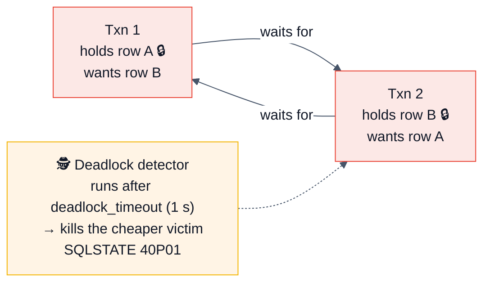

**Prevention:** always acquire locks in a **consistent, deterministic order** (e.g. `ORDER BY id` before locking a batch), keep transactions short, and don't do network calls inside a transaction.

```sql
-- ✅ Deterministic lock ordering kills most deadlocks
SELECT * FROM accounts WHERE id = ANY($1) ORDER BY id FOR UPDATE;
```

### Advisory locks — application-level mutexes

```sql
SELECT pg_advisory_lock(hashtext('nightly-report'));      -- session-scoped
SELECT pg_try_advisory_xact_lock(12345);                  -- txn-scoped, non-blocking
-- Use for: leader election, cron-job singleton, distributed mutex without Redis
```

## 2.11 The SQL you must be able to write from memory

```sql
-- WINDOW FUNCTIONS — the single most-tested SQL topic at product companies
SELECT
    department,
    employee,
    salary,
    ROW_NUMBER()   OVER w AS rn,          -- 1,2,3,4 — no ties
    RANK()         OVER w AS rnk,         -- 1,2,2,4 — gaps after ties
    DENSE_RANK()   OVER w AS drnk,        -- 1,2,2,3 — no gaps
    NTILE(4)       OVER w AS quartile,
    LAG(salary)    OVER w AS prev_salary,
    LEAD(salary)   OVER w AS next_salary,
    SUM(salary)    OVER (PARTITION BY department) AS dept_total,
    AVG(salary)    OVER (PARTITION BY department
                         ORDER BY hired_at
                         ROWS BETWEEN 2 PRECEDING AND CURRENT ROW) AS moving_avg,
    salary - FIRST_VALUE(salary) OVER w AS gap_to_top
FROM employees
WINDOW w AS (PARTITION BY department ORDER BY salary DESC);

-- CTEs, including RECURSIVE (org charts, graph traversal, date series)
WITH RECURSIVE subordinates AS (
    SELECT id, name, manager_id, 1 AS depth, ARRAY[id] AS path
    FROM employees WHERE id = $1
  UNION ALL
    SELECT e.id, e.name, e.manager_id, s.depth + 1, s.path || e.id
    FROM employees e
    JOIN subordinates s ON e.manager_id = s.id
    WHERE NOT e.id = ANY(s.path)          -- ✅ cycle guard
      AND s.depth < 20                    -- ✅ depth guard
)
SELECT * FROM subordinates;

-- UPSERT
INSERT INTO counters (key, n) VALUES ('hits', 1)
ON CONFLICT (key) DO UPDATE SET n = counters.n + EXCLUDED.n
RETURNING n;
INSERT INTO t (...) VALUES (...) ON CONFLICT DO NOTHING;   -- idempotent insert

-- LATERAL — "top N per group", the classic hard question
SELECT c.id, c.name, o.*
FROM customers c
CROSS JOIN LATERAL (
    SELECT * FROM orders o
    WHERE o.customer_id = c.id
    ORDER BY o.created_at DESC
    LIMIT 3
) o;

-- DISTINCT ON — a Postgres-only shortcut for "latest row per group"
SELECT DISTINCT ON (customer_id) customer_id, id, created_at, total
FROM orders
ORDER BY customer_id, created_at DESC;   -- ⚠️ ORDER BY must start with the DISTINCT ON cols

-- GROUPING SETS / ROLLUP / CUBE
SELECT region, product, SUM(revenue)
FROM sales GROUP BY ROLLUP (region, product);

-- FILTER — cleaner than CASE inside aggregates
SELECT count(*) FILTER (WHERE status = 'paid')   AS paid,
       count(*) FILTER (WHERE status = 'failed') AS failed
FROM orders;

-- MERGE (PG 15+, RETURNING added in 17)
MERGE INTO target t USING source s ON t.id = s.id
WHEN MATCHED AND s.deleted THEN DELETE
WHEN MATCHED THEN UPDATE SET val = s.val
WHEN NOT MATCHED THEN INSERT (id, val) VALUES (s.id, s.val);

-- JSONB essentials
SELECT data->'user'->>'name'            AS name,      -- -> json, ->> text
       data #>> '{address,city}'        AS city,      -- path
       jsonb_path_query(data, '$.items[*].sku')       -- SQL/JSON path (PG 12+)
FROM events
WHERE data @> '{"type":"purchase"}'::jsonb;           -- ✅ containment → GIN indexable
CREATE INDEX idx_events_data ON events USING gin (data jsonb_path_ops);
```

**Logical execution order** (write this on the whiteboard when asked "why can't I use a column alias in WHERE?"):

```
FROM → JOIN → WHERE → GROUP BY → HAVING → SELECT → DISTINCT → ORDER BY → LIMIT/OFFSET
                                                      ↑
                                 aliases are created here — that's why WHERE can't see them,
                                 but ORDER BY (which runs later) can.
```

---
# 3. 🚀 Advanced Concepts

## 3.1 TOAST — The Oversized-Attribute Storage Technique

A row must fit in an 8 KB page. When it doesn't, TOAST kicks in at ~2 KB (`TOAST_TUPLE_THRESHOLD`):

1. **Compress** variable-length columns (default `pglz`; 🆕 PG 14+ supports `lz4` via `default_toast_compression`).
2. If still too big, **move the value out of line** into a side table `pg_toast.pg_toast_<oid>`, splitting it into ~2 KB chunks, leaving an 18-byte pointer in the row.

| Storage strategy | Compress? | Out of line? | Default for |
|------------------|-----------|--------------|-------------|
| `PLAIN` | ❌ | ❌ | Fixed-length types (`int`, `timestamp`) |
| `EXTENDED` | ✅ | ✅ | `text`, `jsonb`, `bytea` |
| `EXTERNAL` | ❌ | ✅ | Set manually when you want fast substring/`->` access without decompression |
| `MAIN` | ✅ | Last resort | |

```sql
ALTER TABLE docs ALTER COLUMN body SET STORAGE EXTERNAL;   -- faster substring access
ALTER TABLE docs ALTER COLUMN body SET COMPRESSION lz4;    -- PG 14+
SELECT pg_size_pretty(pg_relation_size(reltoastrelid)) FROM pg_class WHERE relname='docs';
```

> [!TIP]
> **Interview-worthy consequences:**
> - **A `SELECT` that doesn't touch a TOASTed column doesn't pay for it** — that's why `SELECT *` on a table with big `jsonb` is dramatically slower than selecting the three columns you need.
> - **TOAST tables bloat too**, have their own vacuum needs, and are frequently the invisible reason `pg_total_relation_size` >> `pg_relation_size`.
> - Updating **any** column of a row with a TOASTed value does **not** rewrite the TOAST chunks if that column is unchanged — the pointer is copied. Good to know for wide-row update cost questions.
> - **The 1 GB limit** on any single field value is a TOAST consequence.

## 3.2 Partitioning

Declarative partitioning (PG 10+, mature by 12–13) splits one logical table into physical children.

| Strategy | Syntax | Use case |
|----------|--------|----------|
| **RANGE** | `PARTITION BY RANGE (created_at)` | **Time-series — by far the most common.** Monthly/daily partitions. |
| **LIST** | `PARTITION BY LIST (region)` | Discrete categories, tenants, regions |
| **HASH** | `PARTITION BY HASH (user_id)` | Even distribution when there's no natural range |

```sql
CREATE TABLE events (
    id          bigint GENERATED ALWAYS AS IDENTITY,
    tenant_id   bigint      NOT NULL,
    created_at  timestamptz NOT NULL,
    payload     jsonb       NOT NULL,
    PRIMARY KEY (id, created_at)      -- ⚠️ partition key MUST be in the PK / unique constraints
) PARTITION BY RANGE (created_at);

CREATE TABLE events_2026_08 PARTITION OF events
    FOR VALUES FROM ('2026-08-01') TO ('2026-09-01');
CREATE TABLE events_default PARTITION OF events DEFAULT;   -- catch-all (use with care)

-- Detaching an old partition is INSTANT — the killer feature vs DELETE
ALTER TABLE events DETACH PARTITION events_2025_08 CONCURRENTLY;  -- PG 14+
DROP TABLE events_2025_08;
```

### Why partition — the honest list

| ✅ Real benefit | ❌ Not a benefit |
|-----------------|------------------|
| **Cheap bulk deletion** — `DETACH`+`DROP` is O(1) vs a `DELETE` that generates millions of dead tuples | "It makes all queries faster" — only queries that **prune** get faster |
| **Partition pruning** — the planner skips irrelevant partitions entirely | Queries without the partition key get **slower** (they scan every partition) |
| **Smaller indexes per partition** — better cache locality, faster `CREATE INDEX` | |
| **Parallel maintenance** — vacuum/analyze per partition | Vacuum work is the same in total |
| **Tiered storage** — put old partitions on cheaper tablespaces | |

> [!WARNING]
> **The partition-count trap.** Every partition is a relation with its own catalog entries, locks, and relcache slot. Planning time grows with partition count, and each query takes a lock on every partition it can't prune. **Practical guidance: keep it in the hundreds, not tens of thousands.** Runtime pruning (PG 11+) helps for parameterized queries, and `enable_partition_pruning` must be on.

```sql
-- Verify pruning is happening — the single check to run
EXPLAIN (ANALYZE, BUFFERS)
SELECT count(*) FROM events WHERE created_at >= '2026-08-01';
-- Look for:  "Partitions removed: 47"  or only the expected children appearing
```

**Other partitioning features to name-drop:** partition-wise join and partition-wise aggregate (`enable_partitionwise_join`, `enable_partitionwise_aggregate` — off by default, big win for co-partitioned tables), `ATTACH PARTITION` with a matching `CHECK` constraint to avoid a full validation scan, and `pg_partman` for automated partition lifecycle management.

## 3.3 Replication

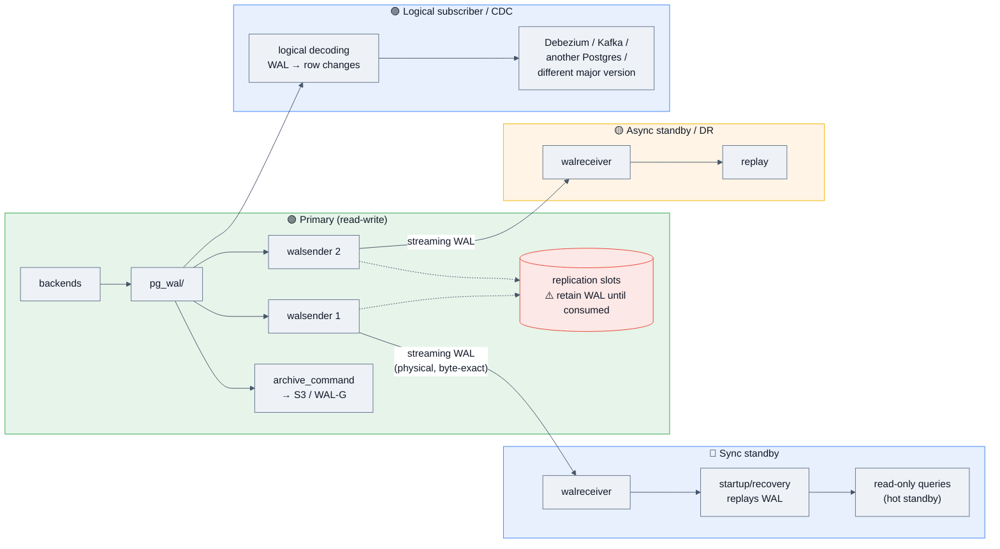

### Physical (streaming) vs logical replication

| | **Physical / streaming** | **Logical** |
|---|---|---|
| Unit | WAL bytes — exact block images | Decoded row changes (INSERT/UPDATE/DELETE) |
| Granularity | **Entire cluster**, all-or-nothing | Per-table / per-publication |
| Target | Byte-identical replica | Any target: different schema, different major version, Kafka, a warehouse |
| Cross-version | ❌ Same major version only | ✅ Works across major versions — **the modern zero-downtime upgrade path** |
| Standby writable | ❌ Read-only | ✅ Fully writable |
| DDL replicated | ✅ (it's block-level) | ❌ **DDL is NOT replicated** — a top-3 gotcha |
| Sequences | ✅ | ❌ (🔮 **v19 adds sequence replication**) |
| `wal_level` | `replica` | `logical` |
| Overhead | Low | Higher (decoding CPU) |
| Use for | HA/failover, read replicas, DR | CDC, upgrades, selective sync, data mesh |

```sql
-- Logical replication setup
-- On publisher:
ALTER SYSTEM SET wal_level = 'logical';   -- requires restart
CREATE PUBLICATION my_pub FOR TABLE orders, customers;
-- Or FOR ALL TABLES; or (PG 15+) with a row filter and column list:
CREATE PUBLICATION eu_pub FOR TABLE orders (id, total, created_at) WHERE (region = 'EU');

-- On subscriber:
CREATE SUBSCRIPTION my_sub
  CONNECTION 'host=primary dbname=app user=repl'
  PUBLICATION my_pub;

-- ⚠️ Tables need a REPLICA IDENTITY for UPDATE/DELETE to replicate.
-- Default = primary key. No PK? You must do one of:
ALTER TABLE t REPLICA IDENTITY USING INDEX some_unique_idx;
ALTER TABLE t REPLICA IDENTITY FULL;   -- logs the whole old row — expensive, but works
```

### Synchronous replication

```ini
synchronous_standby_names = 'ANY 1 (standby1, standby2)'   # quorum commit
# or 'FIRST 2 (s1, s2, s3)' for priority-based
```

| `synchronous_commit` on primary | Waits until standby has… | Data-loss window |
|---|---|---|
| `off` | nothing (not even local flush) | local, ~200 ms |
| `local` | flushed locally | standby may lag |
| `remote_write` | received & written to OS (not fsynced) | loses only on standby OS crash |
| `on` | **flushed to standby disk** | ✅ zero on primary loss |
| `remote_apply` | **applied & visible on standby** | zero, and read-your-writes on the replica |

> [!WARNING]
> **The sync-replication availability trap.** With one synchronous standby and `synchronous_commit = on`, if that standby dies, **every commit on the primary hangs forever**. You have traded availability for durability — a textbook CAP trade. Production answer: use quorum (`ANY 1 (s1, s2)`) so any one standby can ack, plus monitoring that can drop a dead standby out of `synchronous_standby_names`.

### Replication lag — how to measure and diagnose

```sql
-- On the primary: lag per standby, in bytes and time
SELECT application_name, client_addr, state, sync_state,
       pg_wal_lsn_diff(pg_current_wal_lsn(), sent_lsn)   AS pending_bytes,
       pg_wal_lsn_diff(sent_lsn, flush_lsn)              AS network_bytes,
       pg_wal_lsn_diff(flush_lsn, replay_lsn)            AS apply_bytes,
       write_lag, flush_lag, replay_lag
FROM pg_stat_replication;

-- On the standby: how stale am I?
SELECT now() - pg_last_xact_replay_timestamp() AS replication_delay;

-- 🚨 Replication slots — the disk-filling killer
SELECT slot_name, active, wal_status, safe_wal_size,
       pg_size_pretty(pg_wal_lsn_diff(pg_current_wal_lsn(), restart_lsn)) AS retained
FROM pg_replication_slots ORDER BY 5 DESC;
```

**The four causes of replication lag, in the order you check them:**
1. **Single-threaded replay on the standby** — WAL apply is one process; a huge `UPDATE` or `CREATE INDEX` on the primary serializes on the replica. (Parallel apply exists for *logical* replication of large transactions in PG 14+/16, not for physical replay.)
2. **Query conflicts on a hot standby** — a long read query on the standby blocks replay (see below).
3. **Network saturation** — check `sent_lsn` vs `write_lsn`.
4. **Standby I/O saturation** — undersized replica hardware.

### Hot standby query conflicts

The standby must replay changes; a long-running query on the standby may still need rows that the replay wants to remove. Postgres resolves this by **cancelling the query** (`ERROR: canceling statement due to conflict with recovery`).

| Setting | Effect | Cost |
|---------|--------|------|
| `max_standby_streaming_delay = 30s` | Delay replay up to 30 s to let queries finish | Lag grows |
| `hot_standby_feedback = on` | Standby tells the primary its oldest xmin, so the primary won't vacuum those rows | ⚠️ **Bloat on the primary** — a long analytics query on the replica now blocks vacuum on the primary. The classic "I turned on hot_standby_feedback and my primary bloated" incident. |
| `vacuum_defer_cleanup_age` | Legacy knob (removed in PG 16) | |

## 3.4 High availability, failover, and backups

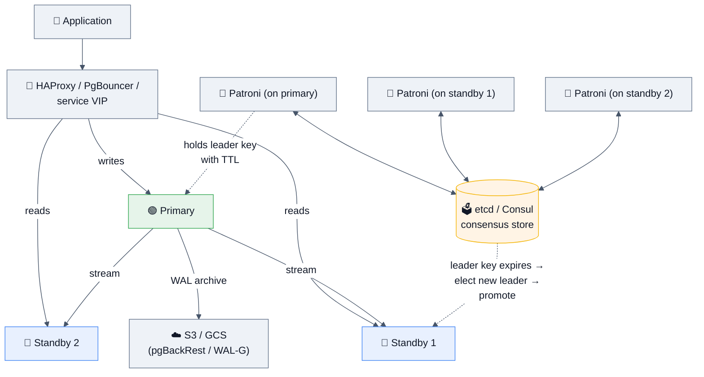

| Tool | Role |
|------|------|
| **Patroni** | The de-facto HA template: leader election via etcd/Consul/ZooKeeper/Kubernetes, automatic failover, REST API. What most self-managed fleets run. |
| **repmgr** | Simpler replication manager; less consensus rigour. |
| **pg_auto_failover** | Microsoft's monitor-based alternative. |
| **PgBouncer / pgcat / Odyssey / PgKeeper** | Connection pooling & routing. Figma built **PgKeeper**; Yandex built **Odyssey** (multi-threaded). |
| **pgBackRest / WAL-G / Barman** | Backups + PITR. **pgBackRest is the current community favourite.** |
| **CloudNativePG / Zalando operator / StackGres** | Kubernetes operators. |
| **Citus** | Distributed Postgres (sharding) — now an open-source Microsoft extension. |

### Backup strategies

| Method | What it produces | Restore granularity | Notes |
|--------|------------------|---------------------|-------|
| `pg_dump` / `pg_dumpall` | **Logical** SQL or custom-format archive | Whole DB / selected tables | Portable across versions & platforms. ⚠️ **Slow to restore at scale** (replays SQL, rebuilds indexes). Consistent via a snapshot; `-j` parallelizes. |
| `pg_basebackup` | **Physical** copy of the data directory | Whole cluster | Fast; the starting point for a standby or PITR. |
| **PITR** = base backup + WAL archive | Any point in time | Second-level | ✅ **The real production answer.** `recovery_target_time`. |
| 🆕 **Incremental backup** (PG 17+) | `pg_basebackup --incremental`, reassembled by `pg_combinebackup` | Whole cluster | Needs `summarize_wal = on`. |
| Filesystem/volume snapshots (EBS, ZFS) | Block-level | Whole volume | Must be **atomic across all volumes**, or use `pg_backup_start()`/`pg_backup_stop()`. |

> [!IMPORTANT]
> **The answer that impresses:** *"A backup you haven't restored isn't a backup. We run an automated weekly restore into a scratch environment, verify row counts and a checksum query, and record the actual RTO. Our RPO is bounded by WAL archive frequency (`archive_timeout = 60s`), and our RTO by base-backup age — which is why we take a base backup nightly rather than weekly."* Stating **RPO and RTO explicitly** is the senior marker.

## 3.5 Connection pooling — the mandatory scaling layer

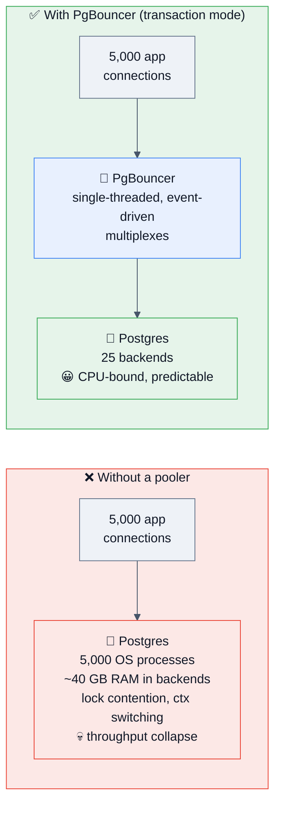

### PgBouncer pooling modes — know the trade-offs exactly

| Mode | Server conn returned when | Multiplexing | ❌ What breaks |
|------|---------------------------|--------------|----------------|
| `session` | Client disconnects | Minimal | Nothing — but barely helps |
| **`transaction`** ⭐ | **Transaction ends** | Excellent (100:1+) | Session state: `SET`, `LISTEN/NOTIFY`, session-level advisory locks, `WITH HOLD` cursors, temp tables, **and server-side prepared statements** (PgBouncer 1.21+ supports protocol-level prepared statements — big 2023+ improvement) |
| `statement` | **Each statement** | Maximum | **Multi-statement transactions are impossible.** Only for sharding proxies. |

```ini
[databases]
app = host=10.0.0.5 port=5432 dbname=app

[pgbouncer]
pool_mode = transaction
max_client_conn = 10000       # what clients see
default_pool_size = 25        # actual Postgres backends per (db,user)
reserve_pool_size = 5
server_idle_timeout = 600
max_prepared_statements = 200 # 1.21+: enables prepared statements in txn mode
```

**Sizing formula** (from the PgBouncer/pgtune folklore, and it holds up):

```
pool_size ≈ (core_count × 2) + effective_spindle_count
→ On a 16-core NVMe box, ~25–40 total backends is the sweet spot.
More connections than that reduces throughput. Postgres is not Node.js;
concurrency past the core count buys you nothing but context switches.
```

> [!TIP]
> **The killer stat to quote:** *"Adding connections past roughly 2× cores makes Postgres **slower**, not faster — you get lock contention on the ProcArray and buffer mapping tables plus context-switch overhead. The correct scaling move is a pooler that multiplexes thousands of clients onto a couple dozen backends. I've seen a 4-core box with a 500-connection app pool go from unusable to fine by putting PgBouncer in transaction mode in front with a pool size of 25."*

> [!WARNING]
> **PgBouncer is single-threaded.** One process saturates one core at very high throughput. Solutions: `so_reuseport` with multiple PgBouncer processes (1.19+), or a multithreaded pooler (**Odyssey**, **pgcat**). Also: PgBouncer itself becomes a SPOF — run it on the app hosts as a sidecar, or behind a VIP with a pair of instances.

## 3.6 Sharding and horizontal scale

When one primary is no longer enough for **writes**, the options are:

| Approach | How | Who does it | Trade-off |
|----------|-----|-------------|-----------|
| **Vertical scale first** | Bigger box | Everyone, first | Simplest; ceiling is ~high (128+ cores, TBs of RAM) and often enough for years |
| **Read replicas** | Route reads away | Everyone | Zero help for writes; introduces replica-lag consistency bugs |
| **Functional/vertical sharding** | Split by table group into separate clusters | Notion, Figma (first step) | Loses cross-domain joins & transactions |
| **Declarative partitioning** | One server, many child tables | Everyone with time-series | Doesn't distribute across machines |
| **Citus** | Extension: coordinator + workers, distributed tables & co-location | Microsoft, Heap, CloudBees | SQL mostly transparent; cross-shard transactions & joins have caveats |
| **App-level sharding** | Application picks the physical DB by shard key | **Notion (480 logical shards on 32 hosts), Instagram, Figma's DBProxy** | Maximum control; you own routing, resharding, and cross-shard queries |
| **Distributed-SQL alternatives** | YugabyteDB, CockroachDB, AWS Aurora Limitless, Neon | | Postgres-compatible, not Postgres |

> [!TIP]
> **How to answer "when would you shard?"** *"Sharding is the last resort, not the first. In order: (1) fix queries and indexes, (2) tune vacuum and add a pooler, (3) scale the box up, (4) offload reads to replicas, (5) partition big tables, (6) move a domain to its own cluster, (7) only then shard by a key. Each earlier step is 10× cheaper operationally. Notion sharded only when VACUUM began stalling and transaction-ID wraparound became a real risk — that's the kind of concrete trigger I'd want, not a hunch."*

**Choosing a shard key** — the thing interviewers actually probe:
- It must appear in **almost every query** (otherwise you scatter-gather).
- It should distribute **evenly** (beware celebrity tenants → hot shards).
- It should keep **transactionally-related data co-located** (Notion co-locates blocks by workspace, so a workspace's data is one shard → single-shard transactions).
- Prefer **logical shards ≫ physical shards** (Notion: 480 logical on 32 physical). Resharding then means *moving logical shards*, not rehashing every row — the single best design decision in that whole architecture.

## 3.7 Performance tuning: reading `EXPLAIN`

```sql
EXPLAIN (ANALYZE, BUFFERS, VERBOSE, SETTINGS, WAL, FORMAT TEXT)
SELECT ...;
-- 🆕 PG 16+: (GENERIC_PLAN) to explain a parameterized query without executing
-- 🆕 PG 18: EXPLAIN ANALYZE shows per-node buffer + I/O timing by default with BUFFERS
```

| Option | Why you want it |
|--------|-----------------|
| `ANALYZE` | **Actually runs the query** and shows real rows/time. ⚠️ Wrap DML in `BEGIN; … ROLLBACK;` |
| `BUFFERS` | **The most under-used option.** Shows `shared hit` (cache) vs `read` (disk) vs `dirtied`/`written`. This is how you prove a query is I/O-bound. |
| `VERBOSE` | Output column lists, schema-qualified names |
| `SETTINGS` | Non-default planner settings in effect — catches "it's fast on my machine" |
| `WAL` | WAL bytes generated (for DML) |

### The diagnostic reading order

```
1. Find the node where  (estimated rows) vs (actual rows)  diverges by >10×
   → that's your bad estimate; everything above it is built on a lie.
   Cause: stale stats, correlated columns, a function the planner can't estimate.

2. Check `loops`. "actual time=0.05..0.09 rows=1 loops=48000" means 48,000 executions.
   Per-node times in EXPLAIN are PER LOOP — multiply.

3. Look for Nested Loop with a large outer side → usually the smoking gun.

4. Check BUFFERS: high `read`, low `hit` = cold cache / too-small shared_buffers.

5. Look for "Sort Method: external merge Disk: 250MB" → work_mem too small.

6. Look for "Rows Removed by Filter: 4,000,000" → missing or wrong index.

7. Index Only Scan with "Heap Fetches: 3,000,000" → visibility map stale → VACUUM.

8. Compare Planning Time vs Execution Time. Planning ≫ execution
   → too many partitions, or too many indexes/joins.
```

```text
-- 🩺 A real "before" plan and what it tells you
Nested Loop  (cost=0.43..8945.12 rows=1 width=64)
             (actual time=0.031..4821.554 rows=48231 loops=1)   ← 1 vs 48231 = 48,000× off 🚨
  ->  Seq Scan on orders o  (actual time=0.011..85.2 rows=48231 loops=1)
        Filter: (status = 'pending')
        Rows Removed by Filter: 4812002                          ← missing partial index 🚨
  ->  Index Scan using customers_pkey on customers c
        (actual time=0.089..0.098 rows=1 loops=48231)            ← 48,231 index probes 🚨
Planning Time: 0.412 ms
Execution Time: 4835.221 ms

-- Diagnosis: the planner thought 1 order was pending, so a nested loop looked free.
-- Fixes: (1) CREATE INDEX ... ON orders(customer_id) WHERE status='pending';
--        (2) ANALYZE orders;  (3) consider extended statistics.
-- After: Hash Join, 48 ms.
```

**Tools:** `explain.depesz.com`, `explain.dalibo.com` (visual), `pev2`, **pganalyze**, and 🔮 **PG 19's `pg_plan_advice`** for capturing and steering plans.

## 3.8 Observability

```sql
CREATE EXTENSION pg_stat_statements;   -- ⚠️ requires shared_preload_libraries
```

| View / extension | Answers |
|------------------|---------|
| **`pg_stat_statements`** ⭐ | *Which queries consume the most total time?* Normalizes parameters. **The single most valuable extension in Postgres.** |
| `pg_stat_activity` | *What is running right now? Who's blocked? Who's idle in transaction?* |
| `pg_stat_user_tables` | seq/idx scans, live/dead tuples, last (auto)vacuum/analyze |
| `pg_stat_user_indexes` | `idx_scan = 0` → **unused index, drop it** |
| `pg_statio_user_tables` | Heap/index cache hit ratios |
| `pg_stat_database` | Commits, rollbacks, deadlocks, temp files, conflicts |
| `pg_stat_bgwriter` / `pg_stat_checkpointer` (PG 17+) | Checkpoint health: timed vs requested |
| `pg_stat_replication` / `pg_replication_slots` | Lag, slot retention |
| `pg_locks` | Lock waits and blockers |
| 🆕 `pg_stat_io` (PG 16+) | **Per-backend-type, per-context I/O** — reads, writes, extends, evictions. Finally lets you say "autovacuum is doing 60% of our reads." |
| 🆕 `pg_aios` (PG 18) | In-flight async I/O handles |
| `auto_explain` | Auto-logs plans of slow queries — **the answer to "the query is slow only in production"** |
| `pg_wait_sampling`, `pgsentinel` | Wait-event sampling (poor man's ASH) |
| `pgBadger` | Log analysis reports |

```sql
-- 🔝 Top queries by total time — run this first on any slow database
SELECT substr(query, 1, 80) AS query,
       calls,
       round(total_exec_time::numeric, 1)             AS total_ms,
       round(mean_exec_time::numeric, 2)              AS mean_ms,
       round(stddev_exec_time::numeric, 2)            AS stddev_ms,
       rows,
       round(100.0 * shared_blks_hit /
             NULLIF(shared_blks_hit + shared_blks_read, 0), 1) AS cache_hit_pct
FROM pg_stat_statements
ORDER BY total_exec_time DESC
LIMIT 20;

-- 🧊 Cache hit ratio — should be >99% for OLTP
SELECT sum(heap_blks_hit) * 100.0 / NULLIF(sum(heap_blks_hit + heap_blks_read), 0)
FROM pg_statio_user_tables;

-- 🗑️ Unused indexes (drop candidates) — free disk + faster writes
SELECT s.schemaname, s.relname, s.indexrelname,
       pg_size_pretty(pg_relation_size(s.indexrelid)) AS size, s.idx_scan
FROM pg_stat_user_indexes s
JOIN pg_index i ON i.indexrelid = s.indexrelid
WHERE s.idx_scan = 0 AND NOT i.indisunique AND NOT i.indisprimary
ORDER BY pg_relation_size(s.indexrelid) DESC;

-- 🔗 Who is blocking whom (PG 9.6+)
SELECT a.pid, a.usename, a.state, now() - a.query_start AS duration,
       pg_blocking_pids(a.pid) AS blocked_by, substr(a.query, 1, 60) AS query
FROM pg_stat_activity a
WHERE cardinality(pg_blocking_pids(a.pid)) > 0;

-- ⏳ Idle-in-transaction offenders (bloat & wraparound cause #1)
SELECT pid, usename, state, now() - xact_start AS txn_age, substr(query,1,60)
FROM pg_stat_activity
WHERE state = 'idle in transaction' AND now() - xact_start > interval '5 minutes';
```

## 3.9 CAP, consistency, and where Postgres sits

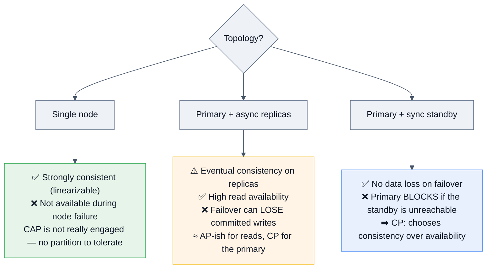

**The precise statement:** *"A single-node Postgres is CP — it gives you strict serializability and simply becomes unavailable when the node dies. Adding async replicas creates a genuine consistency boundary: reads on a replica are eventually consistent, and an async failover has a non-zero RPO. Synchronous replication moves you back to CP at the cost of write availability. Postgres gives you the dial; there's no free lunch."*

**The consistency bug you must be able to name:** **read-your-own-writes across a replica.** User POSTs a comment (primary), the app immediately GETs the list (replica, 200 ms behind), comment is missing. Fixes:
1. Route reads **after a write** to the primary for N seconds (sticky by session).
2. Use `remote_apply` synchronous commit (costly).
3. Track the write's **LSN** in the session/cookie and have the replica wait for it (`pg_wal_replay_wait()` 🆕 PG 18, or check `pg_last_wal_replay_lsn()`).
4. Return the created object from the write itself (design your way out).

## 3.10 Extensions worth knowing by name

| Extension | What it gives you | Where it comes up |
|-----------|-------------------|-------------------|
| `pg_stat_statements` | Query performance stats | Every perf conversation |
| `pg_trgm` | Trigram similarity → indexed `LIKE '%x%'` and fuzzy search | "How do you do autocomplete?" |
| `pgcrypto` | Hashing, `gen_random_uuid()`, symmetric encryption | Security round |
| `PostGIS` | Full geospatial stack | Uber/DoorDash/Lyft-style design |
| **`pgvector`** | Vector similarity search (HNSW/IVFFlat) | **AI companies, RAG design, 2024–2026** |
| `TimescaleDB` | Hypertables, continuous aggregates, compression | Time-series/metrics design |
| `Citus` | Distributed tables, sharding | Scale-out design |
| `postgres_fdw` / `file_fdw` | Query remote Postgres / CSVs as tables | Federation, migration |
| `pg_partman` | Automated partition lifecycle | Ops maturity |
| `pg_repack` | Online bloat removal | The answer to `VACUUM FULL` |
| `hypopg` | **Hypothetical indexes** — test an index without building it | Serious perf-tuning signal |
| `pg_hint_plan` | Oracle-style planner hints | Postgres has no native hints — say this |
| `auto_explain` | Log slow-query plans | Production debugging |
| `pgaudit` | Detailed audit logging | Compliance/security round |
| `pg_cron` | In-database scheduled jobs | Ops |
| `wal2json` / `pgoutput` / `decoderbufs` | Logical decoding output plugins | CDC/Debezium |

> [!NOTE]
> **"Does Postgres support query hints?"** — the correct answer is: *"Not natively, and that's a deliberate project stance: hints ossify plans and hide the real problem, which is usually bad statistics. The supported levers are `ANALYZE`, extended statistics, `SET STATISTICS`, cost parameters, and per-session `enable_*` toggles for diagnosis. If you truly need hints, `pg_hint_plan` exists, and PG 19 adds `pg_plan_advice` in core — which is the project finally acknowledging the operational need."*

---
# 4. 🎤 Interview Questions by Level

> **Format for every question:** ⭐ rating → 🎯 *why they ask* → ✅ *expected answer* → 🔁 *follow-ups* → ❌ *common mistakes*.

---

## 4.1 🌱 Beginner

### Q1. What is PostgreSQL and how does it differ from MySQL? ★★★★★
🎯 **Why:** Baseline check; also reveals whether you think in trade-offs or slogans.
✅ **Answer:** Postgres is an open-source **object-relational** DBMS: ACID, MVCC, cost-based planner, WAL durability, and deep extensibility. Versus MySQL: Postgres is process-per-connection (MySQL is threaded), has **no clustered index** (InnoDB clusters on the PK), uses **MVCC with dead tuples + VACUUM** (InnoDB uses undo logs), and has far richer types (`jsonb`, arrays, ranges, geo, vectors), index types (GIN/GiST/BRIN/SP-GiST), and features (CTEs, window functions historically first, partial/expression indexes, transactional DDL). MySQL traditionally wins on simple read-heavy PK-lookup throughput and connection scaling.
🔁 **Follow-ups:** "Which would you pick for a new payments system, and why?" / "Name one thing MySQL genuinely does better." (Answer: clustered PK gives cheaper secondary-index updates and better range-scan locality; connection scaling is easier.)
❌ **Mistakes:** "Postgres is better, MySQL is a toy." Zero credit. Name a real MySQL advantage — it proves you're not a fanboy.

### Q2. Explain ACID. ★★★★★
🎯 **Why:** Universal filter. The differentiator is whether you can say **how Postgres implements each letter**.
✅ **Answer:** See §1.5 — Atomicity via commit-log status bits (rollback is free under MVCC), Consistency via constraints, Isolation via MVCC snapshots + SSI, Durability via WAL `fsync` before COMMIT returns.
🔁 **Follow-ups:** "Which letter does `synchronous_commit = off` weaken?" (D — you may lose the last few hundred ms, but never corrupt.) / "Is Consistency in ACID the same as the C in CAP?" (**No** — ACID-C means constraints hold; CAP-C means all nodes see the same data. Naming this distinction is an instant senior signal.)
❌ **Mistakes:** Reciting the four words with no mechanism.

### Q3. `DELETE` vs `TRUNCATE` vs `DROP`. ★★★★★
| | `DELETE` | `TRUNCATE` | `DROP` |
|---|---|---|---|
| Type | DML | DDL | DDL |
| Removes | Selected rows | All rows | Table + data + indexes + constraints |
| `WHERE` | ✅ | ❌ | ❌ |
| Triggers | ✅ Row triggers fire | ❌ Only statement-level `TRUNCATE` triggers | ❌ |
| Speed | Slow (row by row, WAL per row) | **Very fast** (drops & recreates the file) | Instant |
| Space | Creates dead tuples → **needs VACUUM** | Reclaims immediately | Gone |
| Rollback | ✅ | ✅ **Yes in Postgres** (transactional DDL!) | ✅ Yes in Postgres |
| Lock | Row locks | `ACCESS EXCLUSIVE` | `ACCESS EXCLUSIVE` |
| Sequences | Untouched | `RESTART IDENTITY` optional | Dropped |
🎯 **Why:** Tests whether you know Postgres's **transactional DDL** — a genuine differentiator vs Oracle/MySQL.
❌ **Mistakes:** "TRUNCATE can't be rolled back" — true in Oracle/MySQL, **false in Postgres**.

### Q4. Primary key vs unique key vs foreign key. ★★★★★
✅ **Answer:** PK = unique + `NOT NULL`, one per table, the row's identity. Unique = uniqueness only, **multiple allowed, and NULLs are permitted and treated as distinct** (so many NULLs pass a unique constraint — unless 🆕 PG 15's `UNIQUE NULLS NOT DISTINCT`). FK = referential integrity to another table's PK/unique key; supports `ON DELETE CASCADE / SET NULL / RESTRICT / NO ACTION`.
🔁 **Follow-ups:** "Does a foreign key create an index?" → **No on the referencing side** (only on the referenced side, which already has one). *"Missing FK indexes are a classic cause of slow `DELETE`s on the parent, because every delete does a full scan of the child to check the constraint."* That sentence alone is worth the question. / "Natural vs surrogate key?" / "`NO ACTION` vs `RESTRICT`?" (`NO ACTION` is deferrable to end-of-transaction; `RESTRICT` checks immediately.)

### Q5. What is normalization? Explain 1NF–3NF/BCNF. ★★★★☆
✅ **Answer:** **1NF** atomic values, no repeating groups. **2NF** 1NF + no partial dependency on part of a composite key. **3NF** 2NF + no transitive dependency (non-key → non-key). **BCNF** every determinant is a candidate key.
🔁 **Follow-ups:** "When do you denormalize?" → *"When read amplification from joins dominates and the write path can maintain the redundancy safely — e.g. a counter cache, a materialized view, or a duplicated `tenant_id` on child tables to make sharding and partition pruning possible. Denormalization is a deliberate trade of write complexity for read latency, and it needs a correctness plan (triggers, transactional updates, or async rebuild with reconciliation)."*
❌ **Mistakes:** Reciting the forms without one concrete denormalization example.

### Q6. Explain the join types. ★★★★★
✅ INNER (matching only), LEFT/RIGHT OUTER (all of one side + matches), FULL OUTER (all of both), CROSS (Cartesian product), **SELF** (table to itself — org charts), **`LATERAL`** (right side can reference the left side's columns — enables per-row subqueries and "top N per group"), **SEMI/ANTI** joins (the plan-level names for `EXISTS`/`NOT EXISTS`).
🔁 **Follow-ups:** "How many rows does `A LEFT JOIN B` return if B has 3 matches for one A row?" (3 — outer joins don't deduplicate; a top-5 source of bugs.) / "`NOT IN` vs `NOT EXISTS`?" → **`NOT IN` with a NULL in the subquery returns zero rows**, silently. Always prefer `NOT EXISTS` (also usually a better plan).
❌ **Mistakes:** Confusing `WHERE` and `ON` for outer joins — a predicate on the right table in `WHERE` silently converts a LEFT JOIN into an INNER JOIN.

### Q7. `WHERE` vs `HAVING`. ★★★★☆
✅ `WHERE` filters **rows before grouping** and can use indexes; `HAVING` filters **groups after aggregation** and can reference aggregates. Push everything you can into `WHERE` — filtering 10 million rows down to 100 before grouping is dramatically cheaper.

### Q8. `UNION` vs `UNION ALL`. ★★★★☆
✅ `UNION` **deduplicates** (requires a sort or hash — expensive); `UNION ALL` just concatenates. **Default to `UNION ALL` unless you genuinely need dedup.**

### Q9. What is an index? What's the downside? ★★★★★
✅ A separate sorted/derived structure that turns an O(n) scan into an O(log n) lookup. **Costs:** extra disk, slower `INSERT`/`UPDATE`/`DELETE` (every index must be maintained), more WAL, more to keep in cache, and — Postgres-specific — **an index on an updated column kills HOT updates**, which then forces updates to *every other index* too.
🔁 **Follow-ups:** "How do you find unused indexes?" (`pg_stat_user_indexes.idx_scan = 0`) / "How do you add one without downtime?" (`CREATE INDEX CONCURRENTLY`)

### Q10. `CHAR` vs `VARCHAR` vs `TEXT`. ★★★☆☆
✅ In Postgres, `varchar(n)` and `text` have **identical storage and performance**; `varchar(n)` just adds a length check. `char(n)` is blank-padded and generally a mistake. Use `text`, add a `CHECK` if you need a bound. (Changing `varchar(50)` → `varchar(100)` is a metadata-only change since PG 9.2, but *shrinking* it rewrites the table.)

### Q11. `NULL` semantics. ★★★★☆
✅ NULL is "unknown," not "empty." `NULL = NULL` → NULL (not true). Use `IS NULL`, `IS NOT DISTINCT FROM`, `COALESCE`, `NULLIF`. Aggregates **skip NULLs** (`count(col)` ≠ `count(*)`). `NULL` in `NOT IN` poisons the whole predicate. In `ORDER BY`, NULLs sort last for ASC by default — controllable with `NULLS FIRST/LAST`. B-tree indexes **do** store NULLs (so `IS NULL` can use an index).

### Q12. What are views and materialized views? ★★★★☆
✅ A **view** is a stored query — no data, always fresh, may be updatable if simple. A **materialized view** stores the result physically — fast reads, but **stale until refreshed**. `REFRESH MATERIALIZED VIEW` takes an `ACCESS EXCLUSIVE` lock; `REFRESH … CONCURRENTLY` doesn't block reads but **requires a unique index** and is slower.
🔁 **Follow-ups:** "How do you keep a matview fresh?" (`pg_cron`, an app scheduler, or trigger-based incremental maintenance; Postgres has **no native incremental matview refresh** — TimescaleDB's continuous aggregates and `pg_ivm` fill that gap.)

### Q13. Stored procedures vs functions vs triggers. ★★★☆☆
✅ **Function** (`CREATE FUNCTION`) returns a value, runs inside the caller's transaction, can't `COMMIT`. **Procedure** (PG 11+, `CREATE PROCEDURE`, called with `CALL`) **can manage transactions** — the reason it was added. **Trigger**: a function invoked automatically `BEFORE`/`AFTER`/`INSTEAD OF` a DML event, `FOR EACH ROW` or `FOR EACH STATEMENT`.
🔁 **Follow-ups:** "Function volatility?" → `IMMUTABLE` (same input → same output, always; indexable), `STABLE` (constant within one statement), `VOLATILE` (default; may change anytime, e.g. `random()`, `now()` is actually STABLE). **Marking a function `IMMUTABLE` when it isn't causes silently wrong results from index scans** — a great senior gotcha. / "Downside of triggers?" → invisible control flow, hard to debug, they fire on bulk loads, and they multiply write cost.

### Q14. What is a transaction? Show the syntax. ★★★★★
```sql
BEGIN;
  UPDATE accounts SET bal = bal - 100 WHERE id = 1;
  SAVEPOINT after_debit;
  UPDATE accounts SET bal = bal + 100 WHERE id = 2;
  -- ROLLBACK TO after_debit;   -- partial rollback
COMMIT;
```
🔁 **Follow-ups:** "What's a savepoint cost?" → each `SAVEPOINT` creates a **subtransaction with its own XID**; thousands of them cause the notorious **`SubtransSLRU` contention** and can severely degrade a busy cluster. (ORMs that wrap every statement in a savepoint — hello, some Django/Rails patterns — have caused real outages.)

### Q15. How do you find the second-highest salary? ★★★★★
The single most-asked SQL question in service-company interviews. Four ways — know at least three:
```sql
-- 1. OFFSET (simple, but wrong with ties)
SELECT DISTINCT salary FROM employees ORDER BY salary DESC OFFSET 1 LIMIT 1;

-- 2. Subquery (classic)
SELECT max(salary) FROM employees WHERE salary < (SELECT max(salary) FROM employees);

-- 3. DENSE_RANK (correct with ties, and generalizes to Nth)
SELECT salary FROM (
    SELECT salary, DENSE_RANK() OVER (ORDER BY salary DESC) AS r
    FROM employees
) t WHERE r = 2;

-- 4. Per-department Nth highest (the real follow-up)
SELECT department, salary FROM (
    SELECT department, salary,
           DENSE_RANK() OVER (PARTITION BY department ORDER BY salary DESC) AS r
    FROM employees
) t WHERE r = 2;
```
❌ **Mistakes:** Using `ROW_NUMBER` when the question implies distinct salary levels, and forgetting the empty/NULL case (returns no row, not NULL — say so).

---

## 4.2 🌿 Intermediate

### Q16. Explain MVCC. ★★★★★ *(the single most important Postgres question)*
🎯 **Why:** It is the organizing principle. Everything else hangs off it.
✅ **Answer:** See §2.3. Hit these beats: no in-place updates → `xmin`/`xmax` on every tuple → snapshots from the ProcArray → readers never block writers → **dead tuples** are the cost → VACUUM is the collector → the oldest open snapshot pins the horizon.
🔁 **Follow-ups:** "Why does this make Postgres's rollback cheap and Oracle's expensive?" / "What's the downside vs InnoDB's undo log?" (Bloat, and the table grows with churn; InnoDB keeps the main table compact but pays at read time to reconstruct old versions from undo.) / "Show me `xmin` and `xmax`." (`SELECT xmin, xmax, ctid, * FROM t;`)
❌ **Mistakes:** Saying "MVCC means no locking." Write–write still blocks.

### Q17. What is VACUUM and why do I need it? ★★★★★
✅ Four jobs (§2.5): reclaim dead tuples, maintain the visibility map (enabling index-only scans), freeze XIDs (prevent wraparound), update stats. Autovacuum does it automatically; defaults are too lax for large tables.
🔁 **Follow-ups:** "`VACUUM` vs `VACUUM FULL`?" / "Autovacuum isn't keeping up — what do you tune?" (`autovacuum_vacuum_cost_limit` ↑, `cost_delay` ↓, `scale_factor` ↓ per table, `maintenance_work_mem` ↑, `autovacuum_max_workers` ↑) / "Why might VACUUM run and remove **nothing**?" → **there's an older snapshot open** (long transaction, `hot_standby_feedback`, or an abandoned replication slot).
❌ **Mistakes:** "VACUUM FULL is the fix." In production that's an outage.

### Q18. What is bloat and how do you fix it? ★★★★★
✅ Dead tuples + free space that VACUUM has marked reusable but not returned to the OS. **Detect:** `pg_stat_user_tables.n_dead_tup`, `pgstattuple` extension, `pg_class.relpages` vs estimated rows, or the community bloat queries. **Fix, in order:** (1) fix the *cause* — long transactions, under-tuned autovacuum, mass `UPDATE`/`DELETE` patterns; (2) `pg_repack` or 🔮 `REPACK` to compact online; (3) `REINDEX CONCURRENTLY` for index bloat; (4) `VACUUM FULL` only in a maintenance window.
🔁 **Follow-ups:** "Can indexes bloat independently?" → **Yes, and they usually bloat worse.** B-tree pages that empty out aren't merged back; `REINDEX CONCURRENTLY` (PG 12+) is the online fix.

### Q19. Walk me through the isolation levels. ★★★★★
✅ §2.9. Key Postgres specifics: `READ UNCOMMITTED` behaves as `READ COMMITTED`; the default is `READ COMMITTED` with a **fresh snapshot per statement**; `REPEATABLE READ` is snapshot isolation and blocks phantoms (stronger than the standard requires) but permits **write skew**; `SERIALIZABLE` uses **SSI** with predicate locks to eliminate write skew.
🔁 **Follow-ups:** "Give me a concrete write-skew example." (The on-call doctors problem, or "two users both book the last seat by checking a count.") / "What's the cost of SERIALIZABLE?" (Predicate-lock memory `max_pred_locks_per_transaction`, lock escalation causing **false positives**, and mandatory 40001 retry logic. It doesn't work meaningfully on hot standbys.)
❌ **Mistakes:** Not knowing the app must retry on 40001.

### Q20. Explain `EXPLAIN ANALYZE`. What do you look for? ★★★★★
✅ §3.7. Walk the diagnostic order out loud: estimate-vs-actual divergence → loops → node type → BUFFERS → sort spill → rows removed by filter → heap fetches.
🔁 **Follow-ups:** "Difference between `EXPLAIN` and `EXPLAIN ANALYZE`?" (The latter actually executes — dangerous for DML without a rollback.) / "`cost=0.43..8945.12` — what are the two numbers?" (**Startup cost** to get the first row, **total cost** for all rows. A `LIMIT` cares about startup cost — which is why a plan can look expensive but be right.)

### Q21. Which index type for which query? ★★★★★
✅ Reproduce the §2.7 decision tree. Then the killer detail: **partial and expression indexes**, `INCLUDE` covering indexes, and multicolumn ordering (equality → sort → range).
🔁 **Follow-ups:** "You need `LIKE '%search%'` to be fast." → `pg_trgm` + GIN. / "Index a 5 TB append-only events table on `created_at`." → **BRIN** (kilobytes instead of hundreds of GB), assuming physical order correlates. / "Your table has 15 indexes. Thoughts?" → *"That's a write-performance problem and probably 5 unused ones; I'd check `idx_scan`, look for redundant prefixes (an index on `(a)` is redundant if `(a,b)` exists), and drop aggressively."*

### Q22. My query is slow. Walk me through debugging it. ★★★★★
🎯 **Why:** The most common real-world scenario question. They want a **process**, not a trick.
✅ **The script to deliver:**
1. **Scope it** — one query or everything? Sudden or gradual? Check `pg_stat_statements` for the top offenders by `total_exec_time`, not just `mean`.
2. **Reproduce** with `EXPLAIN (ANALYZE, BUFFERS)` using **real parameter values**.
3. **Find the bad estimate** — the node where estimated and actual diverge.
4. **Classify the cause:** missing index / wrong index / stale stats / bad row estimate from correlated columns / function preventing index use / `work_mem` spill / cold cache / lock wait / bloat.
5. **Check the environment:** is it slow *only* in prod? → data volume, plan differences from parameter sniffing on prepared statements (`plan_cache_mode`), different settings (`EXPLAIN (SETTINGS)`), replica vs primary.
6. **Fix the cheapest thing first** — `ANALYZE` before adding an index; try `hypopg` to test the index hypothetically.
7. **Verify and monitor** — re-measure, and confirm you didn't slow down writes.
🔁 **Follow-ups:** "It's fast when you run it, slow from the app." → prepared statements + **generic plans** (after 5 executions Postgres may switch to a generic plan; `SET plan_cache_mode = force_custom_plan`), connection-level `search_path`/settings differences, or the app fetching all rows while you fetched the first page.

### Q23. What is `pg_stat_statements` and how do you use it? ★★★★☆
✅ An extension that aggregates normalized query statistics. Sort by `total_exec_time` (finds the 1,000,000-call 2 ms query that's really your problem), watch `stddev_exec_time` (unstable plans), and `shared_blks_hit/read` for cache efficiency. Requires `shared_preload_libraries` and a restart.

### Q24. Explain WAL and checkpoints. ★★★★★
✅ §2.6 — write-ahead rule, sequential vs random, commit = fsync WAL, checkpoint = flush dirty pages + record a REDO point, recovery = replay from that point.
🔁 **Follow-ups:** "Why is WAL faster than writing pages directly?" / "What are full-page writes for?" (**Torn pages** — an 8 KB Postgres page is 2 filesystem blocks; a crash mid-write leaves half old, half new. The first write after a checkpoint logs the whole page so replay can reconstruct it.) / "What happens if `pg_wal` fills up?" (**PANIC and shutdown.** Causes: an inactive replication slot, a failing `archive_command`, or a huge transaction. This is a top-3 real outage.)

### Q25. Explain replication in Postgres. ★★★★★
✅ §3.3 — physical vs logical, sync vs async, the replication-slot mechanic, replica lag measurement.
🔁 **Follow-ups:** "How do you do a **major-version upgrade with near-zero downtime**?" → *"Logical replication: build the new-version cluster as a subscriber, let it catch up, then a short cutover — stop writes, wait for lag to hit zero, **fix the sequences** (not replicated before v19), repoint the app. Alternative: `pg_upgrade --link` for a fast in-place upgrade with a few minutes of downtime — and 🆕 PG 18's `pg_upgrade` now carries planner statistics over, which removes the ugly post-upgrade `ANALYZE` window where every query was slow."*

### Q26. `JSONB` vs `JSON` vs a normalized schema. ★★★★☆
✅ `json` = raw text (preserves formatting, duplicate keys, order; no indexing). `jsonb` = decomposed binary (dedups keys, reorders, supports GIN + operators + `jsonb_path_query`). Use `jsonb`. **Use a normalized schema** when the fields are known, queried, constrained, or joined — you get types, FKs, and better estimates. Use `jsonb` for genuinely variable payloads (webhook bodies, user-defined attributes, event metadata).
🔁 **Follow-ups:** "How do you index it?" → `USING gin (data)` for all operators, or `gin (data jsonb_path_ops)` (smaller/faster but only supports `@>`), or a **B-tree on an expression** for one hot key: `CREATE INDEX ON events ((data->>'user_id'))`. / "Downside of jsonb?" → **no constraints, no FK, terrible planner estimates (default 0.1% selectivity guesses), TOAST overhead on updates (the whole document is rewritten), and no partial updates.**

### Q27. How do you paginate large result sets? ★★★★☆
✅ **`OFFSET` is O(offset)** — page 10,000 scans and discards 200,000 rows. Use **keyset (cursor) pagination**:
```sql
-- ❌ Slow and inconsistent under concurrent inserts
SELECT * FROM posts ORDER BY created_at DESC LIMIT 20 OFFSET 200000;

-- ✅ Keyset: O(log n), stable, index-friendly
SELECT * FROM posts
WHERE (created_at, id) < ($last_created_at, $last_id)   -- row-value comparison
ORDER BY created_at DESC, id DESC
LIMIT 20;
CREATE INDEX ON posts (created_at DESC, id DESC);
```
🔁 **Follow-ups:** "How do you show a total count?" → *"You often shouldn't. Options: an approximate count from `reltuples`, a cached/periodically-computed count, or `count(*) OVER ()` for small result sets. Exact counts on huge tables are inherently expensive under MVCC."* / "How do you support jumping to page 500?" → keyset can't; either accept OFFSET for deep pages, or precompute page boundaries.

### Q28. `EXISTS` vs `IN` vs `JOIN` for subqueries. ★★★☆☆
✅ Modern Postgres planners often produce identical plans for `IN` and `EXISTS` (both become semi-joins). The real rules: **`NOT IN` is dangerous with NULLs** (returns nothing); `EXISTS` short-circuits on the first match; `JOIN` can **duplicate rows** if the right side has multiple matches (use `DISTINCT` or switch to `EXISTS`).

### Q29. CTEs — are they optimization fences? ★★★★☆
🎯 **Why:** Tests version awareness. This changed in PG 12.
✅ **Before PG 12, every CTE was materialized** — an unconditional optimization fence. **Since PG 12, CTEs are inlined by default** when referenced once and side-effect free. You can force either with `MATERIALIZED` / `NOT MATERIALIZED`.
```sql
WITH t AS MATERIALIZED (SELECT ...)      -- force the fence (e.g. an expensive CTE used 3×)
WITH t AS NOT MATERIALIZED (SELECT ...)  -- force inlining
```
❌ **Mistakes:** Confidently asserting the pre-12 behaviour on a PG 16 cluster.

### Q30. How do you do an upsert and make it concurrency-safe? ★★★★☆
✅ `INSERT … ON CONFLICT (cols) DO UPDATE SET … EXCLUDED.…` — atomic, no race. Requires a unique index/constraint on the conflict target.
🔁 **Follow-ups:** "Does `ON CONFLICT DO NOTHING` still consume a sequence value?" → **Yes.** Sequences are non-transactional; failed inserts leave gaps. That's by design (sequences guarantee uniqueness, not gaplessness) and is a great "did you actually build this" question. / "Can `ON CONFLICT` deadlock?" (Yes, with multi-row inserts in different orders — sort your batch.)

### Q31. What are `SERIAL` gaps and why do sequences skip? ★★★☆☆
✅ Sequences are **non-transactional by design** — `nextval()` is not rolled back, so aborted transactions, `ON CONFLICT DO NOTHING`, and caching (`CACHE n` per session) all create gaps. If you need gapless numbering (invoice numbers), you need a separate counter table with a row lock, and you accept the serialization cost.

### Q32. `timestamptz` vs `timestamp` — which and why? ★★★★☆
✅ **`timestamptz` always.** It stores an absolute point in time (UTC internally) and converts on input/output using the session `TimeZone`. `timestamp` stores a wall-clock reading with no zone — two users in different zones will disagree on what it means. **Note the subtlety:** `timestamptz` does *not* remember the original zone; if you need "the user's local zone," store it in a separate column.

---

## 4.3 🌳 Senior

### Q33. Your primary's disk is filling up rapidly. Diagnose. ★★★★★
✅ **The checklist, in order:**
1. `SELECT pg_size_pretty(sum(pg_total_relation_size(oid))) FROM pg_class;` vs actual disk — is it data or WAL?
2. **`pg_wal/` growth →** check `pg_replication_slots` for `active = false` with a huge `restart_lsn` gap (**#1 cause**), then a failing `archive_command` (check `pg_stat_archiver.last_failed_time`), then a giant in-flight transaction.
3. **Table growth →** bloat: `n_dead_tup`, then find the blocker (long transaction / `hot_standby_feedback` / slot).
4. **TOAST/temp files →** `log_temp_files = 0` to catch `work_mem` spills; `pg_ls_tmpdir()`.
5. Unlogged growth from an unbounded log/audit table with no retention policy.
**Immediate mitigations:** drop the abandoned slot (`pg_drop_replication_slot`) — ⚠️ this permanently breaks that replica; kill the long transaction; add disk. **Then** fix the cause.
🔁 **Follow-ups:** "You drop the slot — what's the consequence?" (The standby can never catch up and must be rebuilt from a base backup.) / "How do you prevent it?" → `max_slot_wal_keep_size` (PG 13+) invalidates slots rather than killing the primary, plus alerting on inactive slots.

### Q34. Design a zero-downtime schema migration. ★★★★★
🎯 **Why:** The most practically important senior skill; nearly every high-scale company asks a version of this.
✅ **Rules to state:**

| Operation | Lock | Safe? | Safe alternative |
|-----------|------|-------|------------------|
| `ADD COLUMN` (nullable, no default) | `ACCESS EXCLUSIVE`, **instant** | ✅ | — |
| `ADD COLUMN … DEFAULT x` | Instant **since PG 11** (stored in catalog) | ✅ | Pre-11: add, then backfill in batches |
| `ADD COLUMN … NOT NULL DEFAULT x` | Instant since PG 11 | ✅ | |
| `DROP COLUMN` | Instant (marks it dropped; space reclaimed on rewrite) | ✅ | |
| `ALTER COLUMN TYPE` | **Full table rewrite** 💀 | ❌ | Add new column → dual-write → backfill in batches → swap → drop old. (Some widening casts like `varchar(50)`→`varchar(100)` or `int`→`bigint`… ⚠️ `int`→`bigint` **does** rewrite.) |
| `SET NOT NULL` | Full scan under `ACCESS EXCLUSIVE` | ⚠️ | **PG 12+:** add a `CHECK (col IS NOT NULL) NOT VALID`, `VALIDATE CONSTRAINT` (light lock), *then* `SET NOT NULL` — Postgres uses the validated check and skips the scan. |
| `ADD FOREIGN KEY` | Locks both tables, validates all rows | ⚠️ | `ADD CONSTRAINT … NOT VALID;` then `VALIDATE CONSTRAINT` (only `SHARE UPDATE EXCLUSIVE`) |
| `ADD CHECK` | Full scan | ⚠️ | Same `NOT VALID` → `VALIDATE` trick |
| `CREATE INDEX` | `SHARE` — blocks writes | ❌ | **`CREATE INDEX CONCURRENTLY`** |
| `DROP INDEX` | `ACCESS EXCLUSIVE` | ⚠️ | `DROP INDEX CONCURRENTLY` |
| `RENAME` anything | Instant but breaks running code | ⚠️ | **Expand/contract**: add new → dual-write → migrate readers → drop old |

**Always:**
```sql
SET lock_timeout = '3s';      -- 🔑 prevents the lock-queue pileup
SET statement_timeout = '60s';
-- and retry in a loop with backoff
```
🔁 **Follow-ups:** "How do you backfill 500 million rows?" → *"Batched updates with a bounded key range, `LIMIT` per batch, a sleep between batches to let autovacuum keep up, commit each batch (never one giant transaction — it bloats everything and holds the xmin horizon), and monitor replication lag as the throttle signal."* / Name-drop **`pgroll`**, **`reshape`**, `strong_migrations` (Rails), and Django's `atomic = False` migrations.

### Q35. Explain HOT updates and `fillfactor`. ★★★★☆
✅ §2.4. The senior framing: an index on a hot-updated column has a **second-order cost** — it disqualifies HOT and thereby forces updates to all other indexes.

### Q36. Transaction ID wraparound — what, why, and how do you prevent it? ★★★★★
✅ §2.5. Hit: 32-bit XIDs, the 2-billion visibility circle, freezing, `autovacuum_freeze_max_age`, the read-only shutdown at ~1 M remaining, single-user-mode recovery, and **the three blockers** (long transactions, inactive replication slots, orphaned prepared transactions).
🔁 **Follow-ups:** "How do you monitor it?" (the `age(relfrozenxid)` query) / "You're at 1.9 billion right now. What do you do?" → *"Immediately: find and kill the oldest transaction/slot/prepared xact, then run a manual `VACUUM FREEZE` on the highest-age tables with `vacuum_cost_delay = 0` and a large `maintenance_work_mem`, prioritizing by age. Don't restart hoping it clears — it won't."*

### Q37. How do you scale reads? What breaks? ★★★★☆
✅ Read replicas + a routing layer. **What breaks:** read-your-writes, monotonic reads (a user hitting two replicas can go backwards in time), query cancellation from recovery conflicts, and `hot_standby_feedback` bloating the primary. **Mitigations:** sticky-to-primary window after a write, LSN-based waiting, session affinity to one replica, and routing only genuinely tolerant queries (reports, search, feeds) to replicas.

### Q38. Design a job queue in Postgres. Would you? ★★★★★
✅ **Yes, up to meaningful scale** — `FOR UPDATE SKIP LOCKED` (§2.9) makes Postgres a genuinely good queue, and "one less system to operate" is worth a lot.
**Design:** a `jobs` table with `(status, run_after, priority)`, a partial index `WHERE status='pending'`, `SKIP LOCKED` dequeue, a `visibility_timeout`/heartbeat for crash recovery, `attempts` + exponential backoff, a dead-letter status, and **partitioning or aggressive deletion + autovacuum tuning** because a queue table is the most bloat-prone object you will ever build.
**When to move off:** >~10k jobs/sec, fan-out/pub-sub semantics, multi-day retention, or cross-datacenter needs → Kafka/SQS/Temporal.
🔁 **Follow-ups:** "Why does a queue table bloat so badly?" → every job is inserted, updated 2–3 times, then deleted; the table is 100% churn. Set `autovacuum_vacuum_scale_factor = 0.01` and `fillfactor = 70`. / "What about `LISTEN/NOTIFY`?" → great for waking workers instantly instead of polling, **but it doesn't survive disconnects, has an 8 KB payload limit, and doesn't work through PgBouncer in transaction mode.**

### Q39. `SELECT COUNT(*)` on a 500-million-row table takes 40 seconds. Options? ★★★★☆
✅ **Why it's slow:** MVCC visibility is per-tuple, so there's no stored count; it must scan.
**Options, in order of cost:**
1. **Approximate:** `SELECT reltuples::bigint FROM pg_class WHERE relname='t';` — free, accurate to the last ANALYZE.
2. Better approximation: `EXPLAIN`'s row estimate, or the `pg_class` figure scaled by `relpages`.
3. **Index-only scan** on a small NOT NULL indexed column — helps if the visibility map is fresh, still O(n) but far less I/O.
4. **Maintained counter** — a summary table updated by trigger or by the application. ⚠️ A single counter row becomes a **write hotspot**; shard it into N rows and sum.
5. **Filtered counts:** a partial index matching the filter, or a materialized rollup.
6. Accept it and cache the result for 60 seconds — usually the right product answer.

### Q40. How do you handle a table that's 90% dead tuples in production, right now? ★★★★☆
✅ **Never `VACUUM FULL` on a live table.** Sequence: (1) find and eliminate the blocker preventing vacuum (open transaction / slot / feedback); (2) run a manual `VACUUM (VERBOSE, ANALYZE)` — it may now actually reclaim; (3) if the *file* must shrink, use **`pg_repack`** (builds a copy + triggers, brief `ACCESS EXCLUSIVE` only at swap) or 🔮 PG 19's native `REPACK`; (4) `REINDEX CONCURRENTLY` the indexes; (5) permanently fix autovacuum settings on that table and set `fillfactor`.

### Q41. Explain `random_page_cost` and why the default is wrong for you. ★★★☆☆
✅ Default 4.0 encodes "a random disk seek costs 4× a sequential page read" — true for 7200 RPM spinning disks, false for SSD/NVMe where it's closer to 1.1–1.5. Leaving it at 4.0 makes the planner systematically **under-value index scans** and choose sequential scans. Together with a realistic `effective_cache_size`, this is often the single highest-ROI config change on a modern box.

### Q42. What is a replication slot and what is its danger? ★★★★★
✅ A server-side bookmark guaranteeing the primary retains WAL until the consumer confirms. **Physical slots** protect standbys; **logical slots** protect CDC consumers. **The danger:** an inactive slot retains WAL **forever**, filling `pg_wal` and PANICking the primary. It also **holds back the xmin horizon** (logical slots and `hot_standby_feedback`), blocking VACUUM cluster-wide.
**Guardrails:** `max_slot_wal_keep_size` (PG 13+), alerting on `pg_replication_slots WHERE NOT active`, and `idle_replication_slot_timeout` 🆕 (PG 18).

### Q43. When would you *not* use Postgres? ★★★★☆
🎯 **Why:** Tests judgment, not loyalty.
✅ **Legitimate answers:** (1) **Huge-scale analytics** — Postgres is row-oriented; ClickHouse/BigQuery/Snowflake are 10–100× faster for wide scans (though DuckDB/`pg_duckdb`/Citus columnar narrow the gap). (2) **Write throughput beyond one node** without wanting to own sharding → Cassandra/DynamoDB/CockroachDB/Yugabyte. (3) **Massive-scale caching / sub-ms** → Redis. (4) **Very high-cardinality time series at extreme ingest** → Prometheus/InfluxDB/Timescale. (5) **Full-text at Google-scale** with complex relevance → Elasticsearch. (6) **Blob storage** → S3. (7) Graph workloads with deep traversals → Neo4j (though recursive CTEs get you far).
❌ **Mistakes:** "Postgres can do everything." That reads as inexperience.

### Q44. Two services need to update the same row. How do you avoid lost updates and deadlocks? ★★★★★
✅ §2.9's four fixes plus: **consistent lock ordering**, short transactions, no network I/O inside a transaction, `SELECT … FOR UPDATE NOWAIT` to fail fast, and idempotency keys so a retry is safe.

### Q45. How does full-text search work in Postgres, and when do you outgrow it? ★★★☆☆
✅ `to_tsvector(config, text)` → normalized lexemes (stemming, stop words); `to_tsquery`/`plainto_tsquery`/`websearch_to_tsquery` for queries; `@@` to match; **GIN index on a generated `tsvector` column** (🆕 PG 12+ generated columns make this clean); `ts_rank`/`ts_rank_cd` for relevance; `ts_headline` for snippets.
**Outgrow it when:** you need multi-language analyzers, fuzzy/typo tolerance at scale, faceting, complex relevance tuning, or >tens of millions of docs with high query volume → Elasticsearch/OpenSearch. **In between:** `pg_trgm` for fuzzy, `pgvector` for semantic search, and hybrid BM25-ish extensions (`pg_search`/ParadeDB).

---

## 4.4 🏔️ Staff / Principal

### Q46. Postgres has been chosen for a new platform. Design the data tier for 10 years of growth. ★★★★★
✅ **Structure the answer as a staged plan, not a big-bang architecture:**
- **Foundations (day 1, cheap to do, expensive to retrofit):** `bigint` identity PKs (or `uuidv7`), `timestamptz` everywhere, a `tenant_id` on every multi-tenant table **even if you don't shard yet** (it's the future shard key and partition key), a migration tool with expand/contract discipline, `pg_stat_statements` on from the start, and PgBouncer in front from day 1.
- **0–1 year:** one primary + one standby, PITR to object storage, sane autovacuum defaults per hot table, slow-query alerting.
- **1–3 years:** read replicas with explicit routing rules; declarative partitioning on the two or three tables that are >100 GB and time-shaped; retention policies as `DETACH`+`DROP`.
- **3–5 years:** functional split — move the highest-churn domain (events, audit, sessions) to its own cluster or a purpose-built store; CDC via logical replication into a warehouse so analysts stop querying the OLTP primary.
- **5+ years:** shard the one table family that genuinely needs it, using **logical shards ≫ physical shards** so resharding is a move, not a rehash.
- **Throughout:** an SLO on p99 query latency, an error budget, quarterly restore drills, and a rule that every new index is justified by a `pg_stat_statements` entry.
🔁 **Follow-ups:** "What do you refuse to do?" → *"No cross-shard distributed transactions; no synchronous replication across regions; no ORM-generated schema without review; no unbounded tables without a retention policy."*

### Q47. Explain SSI (Serializable Snapshot Isolation) at the mechanism level. ★★★☆☆
✅ Postgres's SERIALIZABLE is **optimistic**: transactions run under snapshot isolation while the engine tracks **rw-dependencies** (T1 reads a version, T2 writes a newer one) using **SIREAD predicate locks** at tuple/page/relation granularity. Cahill's theorem: every non-serializable execution under SI contains a transaction with **both an incoming and an outgoing rw-conflict** ("dangerous structure"). When Postgres detects that pattern, it aborts one transaction with 40001.
**Consequences:** no blocking (it's optimistic), but **false positives** rise when predicate locks escalate from tuple → page → relation, controlled by `max_pred_locks_per_transaction` / `_per_relation` / `_per_page`. Read-only transactions can be exempted via `SET TRANSACTION READ ONLY DEFERRABLE` (waits for a safe snapshot, then never aborts).

### Q48. Why did Uber move from Postgres to MySQL? Do you agree? ★★★★☆
🎯 **Why:** A canonical Staff-level "can you reason about a famous trade-off" question.
✅ **Their stated reasons (2016):**
1. **Write amplification** — an UPDATE writes a new tuple and must update **every** index; InnoDB only updates indexes whose columns changed, because secondary indexes point at the PK, not at a physical location.
2. That amplification **leaks into replication**: physical WAL streaming ships all those physical writes, so replication bandwidth was enormous across datacenters.
3. **Physical replication is version-locked** and made upgrades painful.
4. A **replica-corruption bug** in 9.2 that propagated to standbys.
5. Postgres's **process-per-connection** model made their connection counts expensive.
✅ **The balanced answer:** *"Every point was factually true for Postgres 9.2 at Uber's scale and topology. But several are much weaker in 2026: logical replication (PG 10+) solves the version-lock and shipping-physical-writes problems for many use cases; HOT updates and `fillfactor` mitigate write amplification when you design for it; PgBouncer solves connections. Also, the trade-off is symmetric — InnoDB's design costs you an extra PK lookup on every secondary-index read, and Uber traded away Postgres's richer indexing and correctness features. It's a real trade-off, not a defect, and the honest lesson is that at extreme scale you optimize for **your** access pattern, not for a general ranking."*
❌ **Mistakes:** Repeating the blog post as gospel, or dismissing it as FUD. Both read as shallow.

### Q49. Design a multi-tenant schema. Shared table, schema-per-tenant, or database-per-tenant? ★★★★★
| Approach | Isolation | Scale ceiling | Ops burden | Best for |
|----------|-----------|---------------|------------|----------|
| **Shared tables + `tenant_id`** ⭐ | Logical only (enforce with **RLS**) | Thousands–millions of tenants | Low; one schema to migrate | SaaS, the default answer |
| **Schema per tenant** | Better | ~hundreds–low thousands (catalog bloat, migration fan-out, connection pooling pain) | Medium–high | Mid-size B2B with customization |
| **Database/cluster per tenant** | Strongest (compliance, noisy-neighbour, per-tenant restore) | Tens–hundreds | High | Enterprise, regulated, per-tenant SLAs |
✅ **The senior answer:** *"Default to shared tables with `tenant_id` as the leading column of every index, enforced by RLS so a missing `WHERE` can't leak data, and keep the option to promote a large tenant to its own cluster. That gives you 95% of the isolation at 10% of the operational cost, and `tenant_id` doubles as the future shard key. I'd add `pg_stat_statements` per-tenant analysis to catch noisy neighbours, and consider `LIST` partitioning by tenant for the top 1% of tenants."*
🔁 **Follow-ups:** "How does RLS interact with connection pooling?" → RLS uses session settings/roles; in PgBouncer **transaction mode** you must set the tenant context **inside the transaction** (`SET LOCAL app.tenant_id`), never with a plain `SET`.

### Q50. How would you implement CDC out of Postgres? ★★★★☆
✅ **Logical decoding**: set `wal_level = logical`, create a replication slot with an output plugin (`pgoutput` native, or `wal2json`), and stream with **Debezium → Kafka** or a direct consumer.
**The hard parts to name:**
- **Slot disk risk** — a stalled consumer fills `pg_wal`. Guard with `max_slot_wal_keep_size` and alerting.
- **`REPLICA IDENTITY`** — without a PK, UPDATE/DELETE events carry no old values; `REPLICA IDENTITY FULL` fixes it at real cost.
- **DDL is not decoded** — schema evolution needs a separate channel (Debezium's schema history topic).
- **Initial snapshot + streaming handoff** — Debezium's incremental snapshotting (DBLog algorithm) avoids a giant lock.
- **Ordering & exactly-once** — per-slot ordering is guaranteed; end-to-end exactly-once requires idempotent consumers keyed on LSN.
- **Toast columns** — unchanged TOASTed values appear as a placeholder unless `REPLICA IDENTITY FULL`.
🔁 **Alternative:** the **transactional outbox** pattern — write the event to an `outbox` table in the same transaction as the business change, then tail it via CDC or a poller. This is usually the better answer for reliable event publishing.

### Q51. Your p99 latency doubled overnight with no deploy. Investigate. ★★★★★
✅ **The systematic sweep:**
1. **Plan flip** — `pg_stat_statements` `mean_exec_time` per query; a table crossed a size threshold or stats went stale → the planner switched from index scan to seq scan. Check `last_analyze`.
2. **Autovacuum** — did a big anti-wraparound vacuum start? `pg_stat_progress_vacuum`.
3. **Checkpoint storm** — `checkpoints_req` spiking.
4. **Bloat** — a batch job created 50 M dead tuples.
5. **Lock contention** — `pg_blocking_pids`, a long DDL, or a lock queue.
6. **Cache eviction** — a new report query is churning `shared_buffers`; check `pg_statio` hit ratios and `pg_stat_io` 🆕.
7. **Infrastructure** — EBS burst credits exhausted, noisy neighbour, failed disk in RAID, replica promoted onto smaller hardware.
8. **Connection saturation** — pool exhaustion → queueing that shows up as latency, not errors.
9. **Data-shape change** — a single tenant 100×'d, so a previously-selective index is now unselective.
✅ **The meta-answer they want:** *"I'd start from `pg_stat_statements` deltas rather than guessing, because it tells me whether it's one query or everything — and those are completely different investigations."*

### Q52. Design idempotent, exactly-once payment processing on Postgres. ★★★★★
✅ **The pattern:**
```sql
CREATE TABLE payment_attempts (
    idempotency_key text PRIMARY KEY,          -- client-supplied
    request_hash    text NOT NULL,             -- detect key reuse with a different body
    status          text NOT NULL,             -- in_progress | succeeded | failed
    response        jsonb,
    created_at      timestamptz NOT NULL DEFAULT now()
);

BEGIN;
INSERT INTO payment_attempts (idempotency_key, request_hash, status)
VALUES ($1, $2, 'in_progress')
ON CONFLICT (idempotency_key) DO NOTHING;
-- 0 rows inserted → this is a retry:
--   • status='succeeded' → return the stored response (no side effect)
--   • status='in_progress' → 409 Conflict, tell the client to retry later
--   • request_hash differs → 422, the key was reused for a different request
...perform the debit/credit, write the ledger entries...
UPDATE payment_attempts SET status='succeeded', response=$3 WHERE idempotency_key=$1;
COMMIT;
```
**Plus:** double-entry ledger rows (never mutate a balance in place — append entries and derive the balance, or maintain it with a checked invariant), `NUMERIC` for money, a `CHECK (amount <> 0)`, and an **outbox** row written in the same transaction for downstream notification. **Never call the external payment provider inside the transaction** — hold the transaction only for state changes; use the outbox + a worker for the network call, with the provider's own idempotency key.
🔁 **Follow-ups:** "Exactly-once across a network is impossible — reconcile that." → *"Right: we get **effectively-once** by making the operation idempotent at the boundary and at-least-once in delivery. The idempotency key plus the provider's key is what converts at-least-once delivery into exactly-once effect."*

### Q53. Postgres is at 100% CPU. Everything is slow. First five minutes. ★★★★★
✅
1. `SELECT count(*), state FROM pg_stat_activity GROUP BY state;` — connection storm? `active` count ≫ cores?
2. `SELECT pid, now()-query_start AS dur, query FROM pg_stat_activity WHERE state='active' ORDER BY 2 DESC LIMIT 10;` — one runaway query or a thundering herd of the same query?
3. **Stop the bleeding:** `pg_cancel_backend(pid)` (graceful) → `pg_terminate_backend(pid)` (hard). Cancel the worst offenders. If it's an app retry storm, shed load at the pooler/app.
4. `pg_blocking_pids` — is it lock contention masquerading as CPU?
5. Check whether an autovacuum/anti-wraparound vacuum or a `CREATE INDEX` is running.
6. Check `pg_stat_statements` **delta** over the last few minutes for what changed.
7. Only after stabilizing: root cause — a missing index after a data-shape change, a plan flip, a deploy that removed a `LIMIT`, or JIT compilation overhead (`jit = off` has fixed real incidents where thousands of short queries each paid LLVM compile time).
✅ **The framing that wins:** *"Mitigate first, diagnose second, and capture state before you kill things — `pg_stat_activity` and the plans are gone once you terminate."*

### Q54. Compare Postgres to a distributed SQL database. When do you switch? ★★★☆☆
| | **Postgres (single primary)** | **CockroachDB / Yugabyte / Spanner** |
|---|---|---|
| Writes | One node | Multi-node, Raft consensus per range |
| Consistency | Strict serializability on the primary | Serializable, with cross-region latency |
| Latency | Sub-ms local commits | Consensus round trips (ms), worse cross-region |
| Ops | Well-understood, huge ecosystem | Newer, fewer experts, expensive |
| SQL surface | 100% | 80–95% Postgres-compatible; extensions mostly unavailable |
✅ **Switch when:** you truly need multi-region writes with automatic failover and can't shard by tenant/region; or when write volume exceeds one large box **and** app-level sharding is genuinely worse for your team. **Don't switch** because a single query is slow.

### Q55. How do you build vector search into Postgres, and what are the limits? ★★★☆☆
✅ `pgvector`: a `vector(1536)` column, `<->` (L2) / `<=>` (cosine) / `<#>` (inner product) operators, and **HNSW** (better recall/latency, slow build, more memory) or **IVFFlat** (fast build, needs representative data first, `lists` tuning) indexes. 🆕 `halfvec` and binary quantization cut memory substantially.
**The winning framing:** *"The reason to use pgvector isn't that it beats a dedicated vector DB on raw ANN benchmarks — it usually doesn't at billion-scale. It's that **you can filter by tenant, join to your metadata, and keep the embedding transactionally consistent with the source row**, in one system. Hybrid queries (`WHERE tenant_id = $1 AND status='active' ORDER BY embedding <=> $2 LIMIT 10`) are exactly where dedicated vector stores get awkward — and where Postgres's planner + partial indexes shine. I'd move to a dedicated store when the index no longer fits in RAM or recall requirements demand specialized quantization."*

---

## 4.5 🏢 FAANG-specific

> At Google/Meta/Amazon/Apple/Microsoft/Netflix, Postgres is rarely the *subject* — it's the substrate for a design question, or a depth probe on your resume claims.

### Q56. (Amazon, design) Design a URL shortener. Where does Postgres fit? ★★★★☆
✅ Key Postgres decisions to volunteer: the mapping table with the short code as PK (`text` or `bigint` base62-encoded), **counter-based vs hash-based code generation** (a Postgres sequence gives you collision-free codes for free — a nice touch), read-heavy → aggressive caching + read replicas, analytics writes going to a **separate partitioned table** or a stream so the hot path stays clean, and partitioning/sharding by code hash once the mapping table exceeds one box.

### Q57. (Meta/Netflix, design) Design a news feed. What's the DB's role? ★★★★☆
✅ Fan-out-on-write vs fan-out-on-read; Postgres holds the source of truth (posts, follows) while the feed itself lives in a cache/timeline store. Talk about the **celebrity problem** (fan-out to 100 M followers is not a Postgres job), **`LATERAL` for "top N per author"**, keyset pagination, and CDC out of Postgres to drive the fan-out.

### Q58. (Google/Microsoft, depth) You said you optimized a query 100×. Walk me through it. ★★★★★
✅ **Have one real story rehearsed with numbers.** Structure: baseline metric → hypothesis → what `EXPLAIN (ANALYZE, BUFFERS)` showed → the specific change → the measured result → **what it cost** (write amplification, disk, maintenance) → how you verified no regression. The "what it cost" beat is what distinguishes senior candidates; almost nobody mentions it.

### Q59. (Amazon LP-flavoured) Tell me about a time a database change caused an incident. ★★★★★
✅ STAR + the Postgres specifics. Strong material: a `CREATE INDEX` without `CONCURRENTLY`; an `ALTER TABLE` that queued behind a long SELECT and took down reads; a missing FK index that made cascading deletes O(n²); an ORM N+1 that survived staging because the dataset was small. Land on the **systemic fix** (a migration linter, `lock_timeout` in the migration harness, a staging dataset with production-like volume), not just "I was more careful."

### Q60. (Netflix/Stripe) How do you guarantee data consistency between Postgres and a downstream cache/service? ★★★★★
✅ Name the failure mode first: **dual writes are not atomic** — if you write to Postgres and then to Kafka/Redis, a crash between them leaves them diverged forever. **Solutions:** (1) **transactional outbox** + CDC (the standard answer); (2) **cache-aside with TTL** and accept staleness; (3) write-through only with idempotent, replayable writes; (4) periodic reconciliation as a safety net regardless. Mention **cache invalidation ordering** (invalidate *after* commit, not before — and even then use a short TTL because a concurrent reader can repopulate stale data between your delete and the commit becoming visible).

---

## 4.6 🚀 Startup

### Q61. We have 3 engineers and no DBA. What do you set up on day one? ★★★★☆
✅ Managed Postgres (RDS/Aurora/Cloud SQL/Neon/Supabase) — *"don't run your own Postgres until you have someone whose job it is."* Then: automated backups **with a tested restore**, PgBouncer (or the provider's pooler), `pg_stat_statements`, slow-query logging (`log_min_duration_statement = 1000`), a migration tool with a review gate, `statement_timeout` and `idle_in_transaction_session_timeout` set globally, and alerts on disk %, connections, replication lag, and `age(relfrozenxid)`.

### Q62. Can we use Postgres for everything — queue, cache, search, analytics, vectors? ★★★★☆
✅ **Yes, longer than people think — and that's usually the right call at a startup.** Queue via `SKIP LOCKED`, cache via `UNLOGGED` tables, search via `tsvector`/`pg_trgm`, analytics via a read replica or matviews, vectors via `pgvector`, cron via `pg_cron`, time-series via partitioning or TimescaleDB. **The trade:** one system to operate, back up, and reason about, versus specialized tools that are each better in isolation. *"I'd add a new datastore only when a specific, measured Postgres limit is hit — not preemptively."* Name the exit criteria for each.

### Q63. How do you keep costs down? ★★★☆☆
✅ Right-size the instance from actual `pg_stat` data; drop unused indexes (disk + IOPS + backup size); enable `wal_compression = lz4`; set retention/partition-drop policies on log-like tables; move cold partitions to cheaper storage or archive them to S3 (`parquet_fdw`/`pg_parquet`); use a replica for analytics instead of over-provisioning the primary; and consider `gp3`/tuned IOPS rather than a bigger instance class just for I/O.

---

## 4.7 🏭 Product Companies (Flipkart, Swiggy, Zomato, PhonePe, Walmart, Shopify, Atlassian)

### Q64. Design the schema for an e-commerce order system. ★★★★★
✅ Volunteer: `orders` / `order_items` / `payments` / `shipments`; **price snapshotted onto `order_items`** (never join to the live product price — historical orders must not change); `NUMERIC` money; status as a constrained `text` or enum with an explicit state machine; an `order_events` audit table; partitioning `orders` by `created_at` for retention; idempotency keys on the checkout endpoint; `SELECT … FOR UPDATE` on inventory rows, or better, a decrement with a `CHECK (qty >= 0)` so the DB enforces "no overselling."
🔁 **Follow-up:** "How do you prevent overselling under flash-sale load?" → *"`UPDATE inventory SET qty = qty - 1 WHERE sku = $1 AND qty > 0 RETURNING qty;` — atomic, no read-modify-write, and 0 rows means sold out. Under extreme contention that single row is a serialization bottleneck, so shard the counter into N rows per SKU and pick one at random, or move the reservation to Redis with Postgres as the durable settlement."*

### Q65. How do you model a "friends"/"follows" relationship and query it efficiently? ★★★★☆
✅ An edge table `(follower_id, followee_id)` with a composite PK **and a second index in the reverse order** — you need both directions. Mutual-friends via `INTERSECT` or a self-join. Deep traversal via a recursive CTE with a depth cap and a cycle guard. At scale, the graph moves out of Postgres or gets denormalized into adjacency lists.

### Q66. Machine-coding round: build a REST API with Postgres in 90 minutes. ★★★★★
✅ What they score: sensible schema with constraints and indexes; **transactions around multi-statement writes**; parameterized queries (no string concatenation); connection pooling configured (not a new connection per request); pagination; error handling that maps constraint violations (`23505` unique, `23503` FK) to proper HTTP codes; and a migration file. **Bonus points:** `ON CONFLICT` for idempotency, `RETURNING` to avoid a second round trip, and a `lock_timeout`.

---

## 4.8 🏢 Service Companies (TCS, Infosys, Wipro, Accenture, Cognizant, Capgemini, LTIMindtree, HCL)

> **Format:** rapid-fire theory, 1–2 minute answers, often from a fixed question bank. Precision and confidence matter more than depth.

| # | Question | One-line answer |
|---|----------|-----------------|
| 1 | What is PostgreSQL? | Open-source object-relational DBMS: ACID, MVCC, extensible. |
| 2 | ACID? | Atomicity, Consistency, Isolation, Durability. |
| 3 | `DELETE` vs `TRUNCATE` vs `DROP`? | §4.1 Q3 table. |
| 4 | Primary vs unique key? | PK: one, NOT NULL. Unique: many, NULLs allowed. |
| 5 | Types of joins? | Inner, left, right, full, cross, self, lateral. |
| 6 | `WHERE` vs `HAVING`? | Rows before grouping vs groups after. |
| 7 | `UNION` vs `UNION ALL`? | Dedup vs concatenate. |
| 8 | Normalization forms? | 1NF/2NF/3NF/BCNF. |
| 9 | Index types in Postgres? | B-tree, Hash, GIN, GiST, SP-GiST, BRIN. |
| 10 | Clustered index in Postgres? | **Doesn't exist** — the heap is unordered; `CLUSTER` is a one-time reorder. |
| 11 | View vs materialized view? | Stored query vs stored result. |
| 12 | What is a trigger? | Function fired automatically on DML; BEFORE/AFTER, ROW/STATEMENT. |
| 13 | Function vs procedure? | Procedures (PG 11+) can control transactions; functions can't. |
| 14 | What is MVCC? | Multiple row versions; readers don't block writers. |
| 15 | What is VACUUM? | Reclaims dead tuples, freezes XIDs, updates the visibility map. |
| 16 | Default port? | **5432.** |
| 17 | Default isolation level? | **READ COMMITTED.** |
| 18 | Default page size? | **8 KB.** |
| 19 | Config file names? | `postgresql.conf`, `pg_hba.conf`, `pg_ident.conf`. |
| 20 | Backup command? | `pg_dump` (one DB), `pg_dumpall` (cluster), `pg_basebackup` (physical). |
| 21 | Restore command? | `psql < file.sql` or `pg_restore` for custom/directory format. |
| 22 | What is a schema? | A namespace inside a database. |
| 23 | `pg_hba.conf`? | Host-based authentication: who can connect, from where, with which method. **Rules are matched top-down, first match wins.** |
| 24 | What is a sequence? | An object generating unique numbers; non-transactional, so gaps happen. |
| 25 | `SERIAL` vs `IDENTITY`? | `SERIAL` is legacy; `GENERATED ALWAYS AS IDENTITY` is SQL-standard and preferred. |
| 26 | `CHAR` vs `VARCHAR` vs `TEXT`? | Same performance for varchar/text; `char` blank-pads. |
| 27 | How to find the 2nd-highest salary? | §4.1 Q15. |
| 28 | Find duplicates? | `SELECT col, count(*) FROM t GROUP BY col HAVING count(*) > 1;` |
| 29 | Delete duplicates keeping one? | `DELETE FROM t a USING t b WHERE a.ctid > b.ctid AND a.col = b.col;` |
| 30 | Copy a table structure? | `CREATE TABLE new (LIKE old INCLUDING ALL);` |
| 31 | What is `COALESCE`? | Returns the first non-NULL argument. |
| 32 | `CASE` expression? | Inline conditional in SQL. |
| 33 | `LIMIT`/`OFFSET`? | Row limiting; OFFSET is O(offset) — prefer keyset pagination. |
| 34 | `EXPLAIN`? | Shows the execution plan; `ANALYZE` actually runs it. |
| 35 | What is a deadlock? | Circular lock wait; Postgres detects it after `deadlock_timeout` and kills a victim (40P01). |
| 36 | ACID vs BASE? | Strong consistency vs Basically Available, Soft state, Eventual consistency. |
| 37 | OLTP vs OLAP? | Many small transactions vs few large analytical scans. |
| 38 | What is a CTE? | `WITH` clause — a named temporary result set; `RECURSIVE` for hierarchies. |
| 39 | Window function? | Computes across a row set without collapsing rows (`OVER (PARTITION BY … ORDER BY …)`). |
| 40 | How to grant permissions? | `GRANT SELECT ON t TO role;` — and `REVOKE` to remove. |

---
# 5. 📊 Frequently Asked Questions (Ranked by Frequency)

> Synthesized and deduplicated across Glassdoor/AmbitionBox/Blind/CareerCup reports, GeeksforGeeks/InterviewBit/Scaler question banks, LeetCode & DataLemur discussion threads, r/ExperiencedDevs and r/cscareerquestions threads, and published company interview guides. **Frequency** = how often it appears; **Depth** = how deep they push.

## 🔥 Very High Frequency (expect these in almost every Postgres interview)

| # | Question | Depth expected | Where it's covered |
|---|----------|----------------|--------------------|
| 1 | Explain indexes — types, when to use, downsides | Mid → Deep | §2.7, §4.2 Q21 |
| 2 | Explain MVCC | Deep | §2.3, §4.2 Q16 |
| 3 | What is ACID? | Shallow → Mid | §1.5, §4.1 Q2 |
| 4 | Explain the join types / write a join query | Shallow → Mid | §4.1 Q6, §6 |
| 5 | How do you optimize a slow query? | Deep | §3.7, §4.2 Q22 |
| 6 | `EXPLAIN` / `EXPLAIN ANALYZE` — read this plan | Deep | §3.7 |
| 7 | Transaction isolation levels & anomalies | Deep | §2.9, §4.2 Q19 |
| 8 | Second-highest salary / Nth per group | Shallow | §4.1 Q15, §6 |
| 9 | Window functions (`ROW_NUMBER`/`RANK`/`DENSE_RANK`) | Mid | §2.11, §6 |
| 10 | `DELETE` vs `TRUNCATE` vs `DROP` | Shallow | §4.1 Q3 |
| 11 | Normalization & when to denormalize | Mid | §4.1 Q5 |
| 12 | VACUUM — what and why | Mid → Deep | §2.5, §4.2 Q17 |
| 13 | Primary vs unique vs foreign key | Shallow | §4.1 Q4 |
| 14 | Postgres vs MySQL | Mid | §14 |
| 15 | Group by + aggregate query on the whiteboard | Shallow | §6 |

## 🌡️ High Frequency

| # | Question | Depth | Covered |
|---|----------|-------|---------|
| 16 | Partitioning: when, how, what breaks | Deep | §3.2 |
| 17 | Replication: physical vs logical, sync vs async | Deep | §3.3 |
| 18 | Connection pooling & `max_connections` | Mid → Deep | §3.5 |
| 19 | Table & index bloat — detect and fix | Deep | §4.2 Q18 |
| 20 | `JSONB` — when, how to index, downsides | Mid | §4.2 Q26 |
| 21 | CTEs, including `RECURSIVE` | Mid | §2.11, §6 |
| 22 | Deadlocks — cause, detection, prevention | Mid → Deep | §2.10 |
| 23 | `SELECT … FOR UPDATE` and lost updates | Deep | §2.9, §4.3 Q44 |
| 24 | Zero-downtime schema migration | Deep | §4.3 Q34 |
| 25 | Pagination at scale (keyset vs OFFSET) | Mid | §4.2 Q27 |
| 26 | Backups & PITR; RPO/RTO | Mid → Deep | §3.4 |
| 27 | `COUNT(*)` performance | Mid | §4.3 Q39 |
| 28 | WAL & checkpoints | Deep | §2.6 |
| 29 | Views vs materialized views | Shallow → Mid | §4.1 Q12 |
| 30 | `UPSERT` / `ON CONFLICT` | Shallow | §4.2 Q30 |
| 31 | Sharding — when and how | Deep | §3.6 |
| 32 | SQL injection & how to prevent it | Mid | §10 |
| 33 | Triggers & stored procedures | Mid | §4.1 Q13 |
| 34 | `NULL` behaviour and `NOT IN` traps | Mid | §4.1 Q11 |
| 35 | Composite index column ordering | Deep | §2.7 |

## 🌤️ Medium Frequency

| # | Question | Covered |
|---|----------|---------|
| 36 | Transaction ID wraparound | §2.5, §4.3 Q36 |
| 37 | HOT updates & `fillfactor` | §2.4 |
| 38 | TOAST | §3.1 |
| 39 | Full-text search | §4.3 Q45 |
| 40 | Row-Level Security | §10 |
| 41 | Extensions you've used | §3.10 |
| 42 | `pg_stat_statements` & observability | §3.8 |
| 43 | Job queue with `SKIP LOCKED` | §4.3 Q38 |
| 44 | Planner statistics & extended statistics | §2.8 |
| 45 | Major version upgrade strategy | §4.2 Q25 |
| 46 | `LATERAL` joins / top-N per group | §2.11, §6 |
| 47 | Advisory locks | §2.10 |
| 48 | `work_mem` and OOM | §2.1 |
| 49 | Multi-tenant schema design | §4.4 Q49 |
| 50 | CDC / logical decoding / Debezium | §4.4 Q50 |
| 51 | `timestamptz` vs `timestamp` | §4.2 Q32 |
| 52 | Read-your-writes across replicas | §3.9 |
| 53 | `random_page_cost` tuning | §4.3 Q41 |
| 54 | `GENERATED` / computed columns | §1.7 |
| 55 | `pgvector` / embeddings | §4.4 Q55 |

## ❄️ Rare (but high-signal when they land)

| # | Question | Covered |
|---|----------|---------|
| 56 | SSI internals / dangerous structures | §4.4 Q47 |
| 57 | Buffer replacement (clock-sweep) & `usage_count` | §11 |
| 58 | SLRU contention from subtransactions | §4.1 Q14 |
| 59 | 🆕 PG 18 async I/O (`io_method`) | §11 |
| 60 | Custom operator classes / access methods | §3.10 |
| 61 | Two-phase commit (`PREPARE TRANSACTION`) | §9 |
| 62 | `pg_hba.conf` auth methods (scram-sha-256, cert, OAuth 🆕) | §10 |
| 63 | Foreign data wrappers & federation | §3.10 |
| 64 | JIT compilation and when to turn it off | §11 |
| 65 | Collation changes breaking indexes (glibc 2.28!) | §9 |

---

# 6. 💻 Coding Questions (SQL)

> Sourced and deduplicated from LeetCode Database, DataLemur, StrataScratch, HackerRank SQL, InterviewBit, and GeeksforGeeks. **Every solution below is Postgres dialect.**

## 🟢 Easy

### E1. Second-highest salary ★★★★★
**Problem:** Return the second-highest distinct salary, or `NULL` if it doesn't exist.
**Intuition:** "Second highest" = rank 2 among *distinct* values.
```sql
-- Brute force: sort and skip
SELECT DISTINCT salary FROM employees ORDER BY salary DESC OFFSET 1 LIMIT 1;

-- ✅ Robust (returns NULL rather than no row — what LeetCode wants)
SELECT (SELECT DISTINCT salary FROM employees ORDER BY salary DESC OFFSET 1 LIMIT 1)
       AS second_highest;
```
**Complexity:** O(n log n) for the sort; O(n) with an index on `salary DESC` (index scan, stop after 2).
**Edge cases:** fewer than 2 distinct salaries → NULL; ties (use `DISTINCT` or `DENSE_RANK`, not `ROW_NUMBER`); NULL salaries are skipped by `DISTINCT … ORDER BY … DESC` placement — be explicit.
**Follow-up:** Nth highest → parameterize `OFFSET N-1`, or `DENSE_RANK() = N`. Per department → add `PARTITION BY`.

### E2. Find and delete duplicate rows ★★★★★
```sql
-- Find
SELECT email, count(*) FROM users GROUP BY email HAVING count(*) > 1;

-- Delete, keeping the lowest id
DELETE FROM users a USING users b
WHERE a.email = b.email AND a.id > b.id;

-- Postgres-specific: keep the physically-first copy when there's no id
DELETE FROM users a USING users b
WHERE a.email = b.email AND a.ctid > b.ctid;

-- Window-function version (works for any "keep the newest" rule)
DELETE FROM users
WHERE id IN (
    SELECT id FROM (
        SELECT id, ROW_NUMBER() OVER (PARTITION BY email ORDER BY created_at DESC) rn
        FROM users
    ) t WHERE rn > 1
);
```
**Edge cases:** NULL emails (`GROUP BY` treats all NULLs as one group; `a.email = b.email` never matches NULLs → the `USING` version silently skips them — use `IS NOT DISTINCT FROM` if NULLs must be deduped). **Follow-up:** "Now prevent it happening again" → `CREATE UNIQUE INDEX CONCURRENTLY`, then `ALTER TABLE … ADD CONSTRAINT … UNIQUE USING INDEX`.

### E3. Employees earning more than their manager ★★★★☆
```sql
SELECT e.name AS employee
FROM employees e
JOIN employees m ON e.manager_id = m.id      -- self join
WHERE e.salary > m.salary;
```
**Edge cases:** employees with no manager (`manager_id IS NULL`) are correctly excluded by the inner join — say so.

### E4. Customers who never ordered ★★★★★
```sql
-- ✅ Best: anti-join, NULL-safe
SELECT c.name FROM customers c
WHERE NOT EXISTS (SELECT 1 FROM orders o WHERE o.customer_id = c.id);

-- Also fine
SELECT c.name FROM customers c
LEFT JOIN orders o ON o.customer_id = c.id
WHERE o.id IS NULL;

-- ❌ Dangerous: returns ZERO rows if any customer_id is NULL
SELECT name FROM customers WHERE id NOT IN (SELECT customer_id FROM orders);
```
**This is the single best question for demonstrating the `NOT IN` NULL trap.** Say it unprompted.

### E5. Duplicate-free department-wise counts / basic aggregation ★★★★☆
```sql
SELECT d.name AS department,
       count(e.id)                                    AS headcount,
       round(avg(e.salary), 2)                        AS avg_salary,
       count(*) FILTER (WHERE e.salary > 100000)      AS high_earners
FROM departments d
LEFT JOIN employees e ON e.department_id = d.id
GROUP BY d.id, d.name
ORDER BY headcount DESC;
```
**Traps:** `count(*)` vs `count(e.id)` — with a `LEFT JOIN`, `count(*)` returns 1 for an empty department, `count(e.id)` returns 0. **This is asked constantly.** Also: every non-aggregated `SELECT` column must be in `GROUP BY` (Postgres allows grouping by the PK and selecting functionally-dependent columns — a nice detail).

### E6. Rising temperature (compare with the previous day) ★★★★☆
```sql
-- ✅ Window function
SELECT id FROM (
    SELECT id, temperature, recorded_on,
           LAG(temperature)  OVER (ORDER BY recorded_on) AS prev_temp,
           LAG(recorded_on)  OVER (ORDER BY recorded_on) AS prev_day
    FROM weather
) t
WHERE temperature > prev_temp AND recorded_on = prev_day + 1;

-- Self-join alternative
SELECT w1.id FROM weather w1
JOIN weather w2 ON w1.recorded_on = w2.recorded_on + 1
WHERE w1.temperature > w2.temperature;
```
**Trap:** missing days. `LAG` gives the *previous row*, not the previous *day* — you must check the date gap. Nearly everyone forgets this.

### E7. Swap values / conditional update ★★★☆☆
```sql
UPDATE salary SET sex = CASE WHEN sex = 'm' THEN 'f' ELSE 'm' END;
-- Postgres shorthand for two-value flips:
UPDATE salary SET sex = (ARRAY['m','f'])[(sex = 'm')::int + 1];
```

### E8. Date/time bucketing ★★★★☆
```sql
SELECT date_trunc('day', created_at)   AS day,        -- 'hour','week','month','quarter'
       count(*)                        AS orders,
       sum(total)                      AS revenue
FROM orders
WHERE created_at >= now() - interval '30 days'
GROUP BY 1
ORDER BY 1;

-- ✅ Fill gaps with generate_series (the follow-up they always ask)
SELECT d::date AS day, coalesce(count(o.id), 0) AS orders
FROM generate_series(now() - interval '29 days', now(), interval '1 day') d
LEFT JOIN orders o ON o.created_at >= d AND o.created_at < d + interval '1 day'
GROUP BY 1 ORDER BY 1;
```
**Index note:** `WHERE date_trunc('day', created_at) = '2026-08-01'` **cannot use** a plain index on `created_at`. Rewrite as a half-open range — this is the #1 real-world index-defeating pattern.

## 🟡 Medium

### M1. Top N per group ★★★★★ *(the single most-asked medium SQL question)*
**Problem:** Return the 3 highest-paid employees per department.
```sql
-- ✅ Approach 1: window function (the expected answer)
SELECT department_id, name, salary
FROM (
    SELECT department_id, name, salary,
           DENSE_RANK() OVER (PARTITION BY department_id ORDER BY salary DESC) AS rnk
    FROM employees
) t
WHERE rnk <= 3;

-- ✅ Approach 2: LATERAL — dramatically faster when departments are few
--    and employees are many WITH an index on (department_id, salary DESC)
SELECT d.id, e.name, e.salary
FROM departments d
CROSS JOIN LATERAL (
    SELECT name, salary FROM employees e
    WHERE e.department_id = d.id
    ORDER BY salary DESC LIMIT 3
) e;

-- ✅ Approach 3: DISTINCT ON — only for top-1
SELECT DISTINCT ON (department_id) department_id, name, salary
FROM employees ORDER BY department_id, salary DESC;
```
**Complexity:** the window version sorts the **whole** table: O(n log n). The `LATERAL` version does `d` index-range scans of 3 rows each: **O(d · log n)** — a huge win when `d ≪ n`. **Saying this out loud is the differentiator.**
**Edge cases:** ties (`RANK`/`DENSE_RANK` return >3 rows; `ROW_NUMBER` returns exactly 3 arbitrarily — clarify with the interviewer); departments with fewer than 3 employees; NULL salaries.

### M2. Running total & moving average ★★★★★
```sql
SELECT
    order_date,
    amount,
    SUM(amount) OVER (ORDER BY order_date
                      ROWS BETWEEN UNBOUNDED PRECEDING AND CURRENT ROW) AS running_total,
    AVG(amount) OVER (ORDER BY order_date
                      ROWS BETWEEN 6 PRECEDING AND CURRENT ROW)         AS ma_7,
    amount - LAG(amount) OVER (ORDER BY order_date)                     AS delta,
    round(100.0 * (amount - LAG(amount) OVER (ORDER BY order_date))
          / NULLIF(LAG(amount) OVER (ORDER BY order_date), 0), 2)       AS pct_change
FROM daily_sales
ORDER BY order_date;
```
> [!WARNING]
> **`ROWS` vs `RANGE` — the trap that catches senior candidates.** The default frame is `RANGE BETWEEN UNBOUNDED PRECEDING AND CURRENT ROW`, which includes **all peer rows with the same ORDER BY value**. If two sales share a date, `RANGE` includes both in each one's running total; `ROWS` does not. For a true row-by-row running total, **always write `ROWS` explicitly.**

### M3. Gaps and islands (consecutive streaks) ★★★★☆
**Problem:** Find each user's longest streak of consecutive daily logins.
**Intuition:** For consecutive dates, `date - row_number()` is **constant within a streak** — the classic trick.
```sql
WITH numbered AS (
    SELECT user_id, login_date,
           login_date - (ROW_NUMBER() OVER (PARTITION BY user_id ORDER BY login_date))::int
               AS grp                       -- constant inside a streak
    FROM (SELECT DISTINCT user_id, login_date FROM logins) d
),
streaks AS (
    SELECT user_id, grp,
           min(login_date) AS streak_start,
           max(login_date) AS streak_end,
           count(*)        AS streak_len
    FROM numbered GROUP BY user_id, grp
)
SELECT DISTINCT ON (user_id) user_id, streak_start, streak_end, streak_len
FROM streaks ORDER BY user_id, streak_len DESC, streak_start;
```
**Edge cases:** duplicate logins on the same day (the inner `DISTINCT` handles it — forgetting it is the standard bug); a single-day streak; gaps of exactly one day.

### M4. Cohort retention / N-day retention ★★★★☆
```sql
WITH cohorts AS (
    SELECT user_id, date_trunc('week', min(created_at)) AS cohort_week
    FROM events GROUP BY user_id
),
activity AS (
    SELECT DISTINCT e.user_id, c.cohort_week,
           (date_trunc('week', e.created_at) - c.cohort_week) / 7 AS week_offset
    FROM events e JOIN cohorts c USING (user_id)
)
SELECT cohort_week,
       count(*) FILTER (WHERE week_offset = 0) AS w0,
       count(*) FILTER (WHERE week_offset = 1) AS w1,
       count(*) FILTER (WHERE week_offset = 2) AS w2,
       round(100.0 * count(*) FILTER (WHERE week_offset = 1)
                   / NULLIF(count(*) FILTER (WHERE week_offset = 0), 0), 1) AS w1_pct
FROM activity GROUP BY cohort_week ORDER BY cohort_week;
```

### M5. Median without a built-in ★★★★☆
```sql
-- ✅ Postgres has an ordered-set aggregate — use it and say why
SELECT percentile_cont(0.5) WITHIN GROUP (ORDER BY salary) AS median_interpolated,
       percentile_disc(0.5) WITHIN GROUP (ORDER BY salary) AS median_actual_value,
       percentile_cont(ARRAY[0.5,0.9,0.99]) WITHIN GROUP (ORDER BY latency_ms) AS p50_p90_p99
FROM employees;

-- Manual version (what they ask if they want to see you think)
WITH r AS (
    SELECT salary,
           ROW_NUMBER() OVER (ORDER BY salary) AS rn,
           count(*)     OVER ()                AS n
    FROM employees
)
SELECT avg(salary) FROM r WHERE rn IN ((n+1)/2, (n+2)/2);   -- handles odd & even
```
**Follow-up:** "`percentile_cont` vs `percentile_disc`?" → continuous interpolates between the two middle values; discrete returns an actual value from the set. For latency SLOs you usually want `percentile_disc` or `percentile_cont` depending on whether the number must be a real observation.

### M6. Pivot / conditional aggregation ★★★★☆
```sql
SELECT product,
       sum(amount) FILTER (WHERE quarter = 'Q1') AS q1,
       sum(amount) FILTER (WHERE quarter = 'Q2') AS q2,
       sum(amount) FILTER (WHERE quarter = 'Q3') AS q3,
       sum(amount) FILTER (WHERE quarter = 'Q4') AS q4
FROM sales GROUP BY product;
-- (`crosstab()` from the tablefunc extension does dynamic pivots — mention it.)
```

### M7. Recursive CTE — org chart / category tree / bill of materials ★★★★☆
```sql
WITH RECURSIVE tree AS (
    SELECT id, name, parent_id, 0 AS depth,
           name::text AS path, ARRAY[id] AS visited
    FROM categories WHERE parent_id IS NULL
  UNION ALL
    SELECT c.id, c.name, c.parent_id, t.depth + 1,
           t.path || ' > ' || c.name, t.visited || c.id
    FROM categories c
    JOIN tree t ON c.parent_id = t.id
    WHERE NOT c.id = ANY(t.visited)          -- ✅ cycle protection
      AND t.depth < 50                       -- ✅ runaway protection
)
SELECT repeat('  ', depth) || name AS indented, path, depth FROM tree ORDER BY path;
```
**Complexity:** O(V + E) with an index on `parent_id`. **Edge cases:** cycles (infinite loop without the guard — Postgres 14+ also has `CYCLE id SET is_cycle USING cyclepath` syntax), orphaned nodes, multiple roots.

### M8. Deduplicate while keeping the latest, using `DISTINCT ON` ★★★★☆
```sql
-- "Latest status per order" — the most common real-world query shape
SELECT DISTINCT ON (order_id)
       order_id, status, changed_at
FROM order_status_history
ORDER BY order_id, changed_at DESC;
-- Index that makes this fast:
CREATE INDEX ON order_status_history (order_id, changed_at DESC);
```
**Say this:** *"`DISTINCT ON` is Postgres-specific and usually beats the `ROW_NUMBER() = 1` pattern because it can stop at the first row of each group when a matching index exists."*

### M9. Self-join for pairs / mutual relationships ★★★☆☆
```sql
-- All unique pairs of users in the same city (no duplicates, no self-pairs)
SELECT a.name, b.name, a.city
FROM users a JOIN users b ON a.city = b.city AND a.id < b.id;   -- ✅ a.id < b.id
```

### M10. Anti-join with a time window (fraud/anomaly patterns) ★★★☆☆
```sql
-- Users who logged in from 2+ countries within one hour
SELECT DISTINCT l1.user_id
FROM logins l1
JOIN logins l2
  ON l1.user_id = l2.user_id
 AND l1.country <> l2.country
 AND l2.created_at BETWEEN l1.created_at AND l1.created_at + interval '1 hour';
```

## 🔴 Hard

### H1. Sessionization — group events into sessions with a 30-minute gap ★★★★☆
**Intuition:** Mark a new session whenever the gap from the previous event exceeds the threshold, then take a running sum of those markers.
```sql
WITH marked AS (
    SELECT user_id, event_time,
           CASE WHEN event_time - LAG(event_time) OVER w > interval '30 minutes'
                  OR LAG(event_time) OVER w IS NULL
                THEN 1 ELSE 0 END AS is_new_session
    FROM events
    WINDOW w AS (PARTITION BY user_id ORDER BY event_time)
),
sessions AS (
    SELECT user_id, event_time,
           SUM(is_new_session) OVER (PARTITION BY user_id ORDER BY event_time
                                     ROWS UNBOUNDED PRECEDING) AS session_no
    FROM marked
)
SELECT user_id, session_no,
       min(event_time) AS started_at,
       max(event_time) AS ended_at,
       max(event_time) - min(event_time) AS duration,
       count(*) AS event_count
FROM sessions
GROUP BY user_id, session_no
ORDER BY user_id, session_no;
```
**Complexity:** one sort per partition, O(n log n). **Optimization:** an index on `(user_id, event_time)` lets Postgres skip the sort entirely (`Incremental Sort`/pre-sorted input). **Edge cases:** single-event sessions; clock skew producing out-of-order events; events exactly 30 minutes apart (`>` vs `>=` — clarify).

### H2. Reconstruct account balances from a double-entry ledger ★★★★☆
```sql
-- Balance as of any point in time, plus a running balance per account
SELECT account_id,
       entry_time,
       amount,
       SUM(amount) OVER (PARTITION BY account_id ORDER BY entry_time, id
                         ROWS UNBOUNDED PRECEDING) AS running_balance
FROM ledger_entries
WHERE entry_time <= $1
ORDER BY account_id, entry_time, id;

-- ✅ At scale: don't replay all history. Snapshot + delta.
SELECT s.balance + coalesce(sum(l.amount), 0) AS balance
FROM balance_snapshots s
LEFT JOIN ledger_entries l
       ON l.account_id = s.account_id AND l.entry_time > s.as_of
WHERE s.account_id = $1
  AND s.as_of = (SELECT max(as_of) FROM balance_snapshots
                 WHERE account_id = $1 AND as_of <= $2)
GROUP BY s.balance;
```
**The insight interviewers want:** *"Event sourcing gives you a perfect audit trail but O(n) reads. The standard fix is periodic snapshots so a read is `snapshot + a bounded number of deltas`. The invariant `sum(amount) = 0` per transaction is enforceable with a deferred constraint or a trigger."*

### H3. Find overlapping intervals / detect double-booking ★★★★★
```sql
-- Detect existing overlaps
SELECT a.id, b.id, a.room_id
FROM bookings a JOIN bookings b
  ON a.room_id = b.room_id AND a.id < b.id
 AND a.during && b.during;             -- range overlap operator

-- ✅ PREVENT them at the schema level — the answer that wins the question
CREATE EXTENSION IF NOT EXISTS btree_gist;
ALTER TABLE bookings
  ADD CONSTRAINT no_double_booking
  EXCLUDE USING gist (room_id WITH =, during WITH &&);
```
**Why this is a great answer:** *"Detecting overlaps in a query is a race condition — two concurrent inserts both pass the check. An `EXCLUDE` constraint makes the database enforce it, so it's correct under any concurrency without an explicit lock."* Compare with the alternatives: `SERIALIZABLE` (works, needs retries) or `LOCK TABLE`/advisory lock on the room (works, serializes everything).

### H4. Merge overlapping intervals into consolidated ranges ★★★☆☆
```sql
WITH ordered AS (
    SELECT room_id, starts_at, ends_at,
           max(ends_at) OVER (PARTITION BY room_id ORDER BY starts_at
                              ROWS BETWEEN UNBOUNDED PRECEDING AND 1 PRECEDING)
               AS prev_max_end
    FROM bookings
),
grouped AS (
    SELECT *,
           SUM(CASE WHEN prev_max_end IS NULL OR starts_at > prev_max_end THEN 1 ELSE 0 END)
               OVER (PARTITION BY room_id ORDER BY starts_at ROWS UNBOUNDED PRECEDING) AS grp
    FROM ordered
)
SELECT room_id, min(starts_at) AS starts_at, max(ends_at) AS ends_at
FROM grouped GROUP BY room_id, grp ORDER BY room_id, 2;
```
**Note:** the `max() OVER (… 1 PRECEDING)` is essential — using `LAG(ends_at)` alone is a classic wrong answer that fails when an earlier interval fully contains a later one.

### H5. Hierarchical aggregation — roll up costs through a tree ★★★☆☆
```sql
WITH RECURSIVE up AS (
    SELECT id, parent_id, id AS leaf_id, cost FROM nodes WHERE is_leaf
  UNION ALL
    SELECT n.id, n.parent_id, u.leaf_id, u.cost
    FROM up u JOIN nodes n ON n.id = u.parent_id
)
SELECT id, sum(cost) AS subtree_cost, count(DISTINCT leaf_id) AS leaves
FROM up GROUP BY id;
```

### H6. Deduplicate a 500-million-row table in production without downtime ★★★★☆
**This is an engineering question wearing a SQL costume.**
```
❌ Wrong answer: one giant DELETE. It creates hundreds of millions of dead tuples,
   holds a transaction open for hours (blocking VACUUM cluster-wide), bloats every
   index, generates enormous WAL, and blows up replication lag.

✅ Right answer:
1. Quantify first: how many dupes, and by what key?
2. Batch it: delete in chunks of 10–50k, bounded by a key range, one transaction per
   batch, with a short sleep between batches. Monitor replication lag and use it as
   the throttle.
3. Prefer CREATE-NEW-TABLE + swap if >30% of rows are being removed:
   CREATE TABLE t_new (LIKE t INCLUDING ALL);
   INSERT INTO t_new SELECT DISTINCT ON (key) * FROM t ORDER BY key, id;
   -- then a brief lock to swap names, or use pg_repack-style trigger capture
4. Add the UNIQUE index CONCURRENTLY afterwards so it can't recur.
5. VACUUM (or pg_repack) to reclaim space, and REINDEX CONCURRENTLY.
```
**Follow-up:** "How do you handle rows written during the migration?" → dual-write, or a trigger on the old table capturing changes into the new one (this is exactly how `pg_repack` and `gh-ost` work).

### H7. Write a query that must use an index-only scan, and prove it ★★★☆☆
```sql
CREATE INDEX idx_cover ON orders (customer_id, created_at) INCLUDE (total);
VACUUM ANALYZE orders;   -- ✅ REQUIRED: the visibility map must be current

EXPLAIN (ANALYZE, BUFFERS)
SELECT customer_id, created_at, total
FROM orders
WHERE customer_id = 42 AND created_at > '2026-01-01';
-- Target output:
--   Index Only Scan using idx_cover on orders
--     Heap Fetches: 0            ← ✅ the proof
```
**The teaching point:** *"An index-only scan isn't guaranteed by having a covering index — Postgres still has to check visibility, and it can skip the heap only for pages the visibility map marks all-visible. `Heap Fetches: 3000000` means VACUUM hasn't run recently. This is the most direct link between VACUUM and query performance."*

### H8. Implement rate limiting in Postgres ★★★☆☆
```sql
-- Sliding-window counter, atomic, no read-modify-write race
INSERT INTO rate_limits (key, window_start, hits)
VALUES ($1, date_trunc('minute', now()), 1)
ON CONFLICT (key, window_start)
DO UPDATE SET hits = rate_limits.hits + 1
RETURNING hits;
-- Caller rejects if hits > limit.
```
**The honest follow-up:** *"This works, but a rate limiter is a high-write, low-value, extremely bloat-prone workload — exactly what Redis is better at. In Postgres I'd need aggressive autovacuum and partition-drop cleanup on that table. I'd use it only if I didn't already run Redis."* Knowing when your own solution is the wrong tool is a strong signal.

---
# 7. 🏗️ System Design Questions (Postgres-centric)

## 7.1 The framework to use in every DB design round

```mermaid
%%{init: {'theme':'base','themeVariables':{'background':'#ffffff','mainBkg':'#eef2f7','primaryColor':'#eef2f7','primaryTextColor':'#111827','primaryBorderColor':'#64748b','secondaryColor':'#e8f0fe','tertiaryColor':'#f1f5f9','lineColor':'#475569','textColor':'#111827','clusterBkg':'#f8fafc','clusterBorder':'#94a3b8','edgeLabelBackground':'#ffffff','titleColor':'#111827','actorBkg':'#eef2f7','actorTextColor':'#111827','actorBorder':'#64748b','actorLineColor':'#475569','signalColor':'#111827','signalTextColor':'#111827','noteBkgColor':'#fff4e5','noteTextColor':'#111827','noteBorderColor':'#d97706','labelBoxBkgColor':'#eef2f7','labelBoxBorderColor':'#64748b','labelTextColor':'#111827','loopTextColor':'#111827','altBackground':'#f8fafc'}}}%%
flowchart LR
    R["1️⃣ Requirements<br/>reads/writes per sec,<br/>data size, retention,<br/>consistency needs, SLOs"]
    --> A["2️⃣ Access patterns<br/>list the top 5 queries<br/>BEFORE designing tables"]
    --> S["3️⃣ Schema<br/>entities, keys, constraints,<br/>types, cardinality"]
    --> I["4️⃣ Indexes<br/>one per access pattern,<br/>justify each"]
    --> C["5️⃣ Capacity<br/>row size × rows,<br/>index size, IOPS, growth"]
    --> SC["6️⃣ Scale plan<br/>pooling → replicas →<br/>partitioning → sharding"]
    --> O["7️⃣ Operations<br/>backups, migrations,<br/>monitoring, failure modes"]

    style R fill:#e8f0fe,stroke:#4285f4,color:#111827
    style A fill:#fff4e5,stroke:#f4b400,color:#111827
    style S fill:#eef2f7,stroke:#64748b,color:#111827
    style I fill:#eef2f7,stroke:#64748b,color:#111827
    style C fill:#eef2f7,stroke:#64748b,color:#111827
    style SC fill:#e6f4ea,stroke:#34a853,color:#111827
    style O fill:#e6f4ea,stroke:#34a853,color:#111827
```

> [!TIP]
> **Step 2 is where candidates separate.** Almost everyone jumps to tables. *"Before I draw the schema, let me list the queries this system must serve and their frequency — the schema and the indexes both fall out of that"* is the sentence that changes the tone of the interview.

## 7.2 🟢 Beginner design: URL shortener

**Requirements:** 100 M URLs, 10k reads/sec, 100 writes/sec, redirect p99 < 50 ms.

```sql
CREATE TABLE links (
    code        text PRIMARY KEY,             -- base62 of the sequence value
    target_url  text        NOT NULL,
    user_id     bigint      REFERENCES users(id),
    created_at  timestamptz NOT NULL DEFAULT now(),
    expires_at  timestamptz
);
CREATE TABLE clicks (
    link_code   text        NOT NULL,
    clicked_at  timestamptz NOT NULL DEFAULT now(),
    referrer    text, country char(2), user_agent_hash bigint
) PARTITION BY RANGE (clicked_at);            -- ✅ analytics kept off the hot path
```

**Design points to volunteer:**
- **Code generation:** a Postgres `sequence` + base62 encoding gives collision-free codes with no retry loop — much better than random-and-check. Add a per-shard offset if you ever shard.
- **The read path barely touches Postgres:** it's a single PK lookup, and it should be cached (Redis/CDN) with the DB as the source of truth. 10k reads/sec against a cached 100 M-row table is trivial.
- **Never write click analytics synchronously** on the redirect path — buffer to a queue/stream, or write to a partitioned table with `synchronous_commit = off` for that transaction.
- **Capacity:** 100 M × ~150 bytes ≈ 15 GB + PK index ≈ 5 GB. Fits comfortably in one box. **Say the number.**
- **Scale plan:** cache → read replicas → partition `clicks` by month with a 90-day retention drop → shard `links` by `hash(code)` only if you exceed one box (you won't).

## 7.3 🟡 Intermediate design: multi-tenant SaaS analytics dashboard

**Requirements:** 10k tenants, 5 B events, dashboards querying last 90 days, tenant isolation required for SOC 2.

```sql
CREATE TABLE events (
    tenant_id   bigint      NOT NULL,
    event_id    bigint      GENERATED ALWAYS AS IDENTITY,
    occurred_at timestamptz NOT NULL,
    event_type  text        NOT NULL,
    user_id     bigint,
    props       jsonb       NOT NULL DEFAULT '{}',
    PRIMARY KEY (tenant_id, occurred_at, event_id)
) PARTITION BY RANGE (occurred_at);

CREATE INDEX ON events (tenant_id, event_type, occurred_at DESC);
CREATE INDEX ON events USING gin (props jsonb_path_ops);

-- Isolation the database enforces, not the ORM
ALTER TABLE events ENABLE ROW LEVEL SECURITY;
CREATE POLICY tenant_isolation ON events
    USING (tenant_id = current_setting('app.tenant_id')::bigint);

-- Pre-aggregate the dashboard queries
CREATE MATERIALIZED VIEW daily_rollup AS
SELECT tenant_id, date_trunc('day', occurred_at) AS day, event_type, count(*) AS n
FROM events GROUP BY 1,2,3;
CREATE UNIQUE INDEX ON daily_rollup (tenant_id, day, event_type);  -- for CONCURRENTLY
```

**Discussion beats:**
- **`tenant_id` leads every index.** It's the highest-selectivity predicate, the RLS key, the partition-pruning candidate for big tenants, and the future shard key.
- **Two-level partitioning** — RANGE by time, and for the top 1% of tenants, sub-partition by `LIST (tenant_id)` to keep hot tenants isolated.
- **Retention** is `DETACH` + `DROP`, never `DELETE`.
- **Dashboards read the rollup, not the raw events.** Refresh `CONCURRENTLY` on a schedule (`pg_cron`) — or use TimescaleDB continuous aggregates for genuine incremental refresh.
- **RLS + PgBouncer:** set the tenant with `SET LOCAL app.tenant_id` **inside the transaction**, because transaction-mode pooling reuses connections across tenants. Getting this wrong is a data-leak bug, and saying so is a big credibility marker.
- **Capacity:** 5 B × ~200 B ≈ 1 TB raw + indexes. One partition per day for 90 days ≈ 90 partitions. Manageable.

## 7.4 🔴 Advanced design: financial ledger with strict correctness

**Requirements:** double-entry accounting, no lost money ever, 5k transactions/sec, full audit trail, regulator-grade reporting.

```sql
CREATE TABLE ledger_transactions (
    id              bigint GENERATED ALWAYS AS IDENTITY PRIMARY KEY,
    idempotency_key text UNIQUE NOT NULL,
    created_at      timestamptz NOT NULL DEFAULT now(),
    description     text
);
CREATE TABLE ledger_entries (
    id             bigint GENERATED ALWAYS AS IDENTITY PRIMARY KEY,
    transaction_id bigint  NOT NULL REFERENCES ledger_transactions(id),
    account_id     bigint  NOT NULL REFERENCES accounts(id),
    amount         numeric(19,4) NOT NULL CHECK (amount <> 0),   -- +credit / -debit
    currency       char(3) NOT NULL,
    created_at     timestamptz NOT NULL DEFAULT now()
);
CREATE INDEX ON ledger_entries (account_id, created_at DESC);
CREATE INDEX ON ledger_entries (transaction_id);

-- ⛓️ The invariant, enforced by the database, checked at COMMIT
CREATE CONSTRAINT TRIGGER balanced_transaction
AFTER INSERT ON ledger_entries
DEFERRABLE INITIALLY DEFERRED
FOR EACH ROW EXECUTE FUNCTION assert_transaction_balances();
-- function asserts: SUM(amount) = 0 per (transaction_id, currency)
```

**The senior talking points:**

| Concern | Decision & rationale |
|---------|---------------------|
| **Immutability** | Entries are **append-only**. Corrections are reversing entries, never `UPDATE`/`DELETE`. Revoke `UPDATE`/`DELETE` at the role level so it's structurally impossible. |
| **Balances** | Derived from entries; maintained as periodic **snapshots + deltas** (§6 H2) so reads stay O(1)-ish. Never a mutable `balance` column as the source of truth. |
| **Money type** | `numeric(19,4)`. Never float. Store the currency alongside; never mix currencies in one sum. |
| **Concurrency** | Idempotency key as a unique constraint → a duplicate request is a `23505`, not a double charge. Account-level contention handled by `FOR UPDATE` with **deterministic ordering by `account_id`** to avoid deadlocks in transfers. |
| **Isolation** | `READ COMMITTED` + explicit locking is usually enough and scales better than `SERIALIZABLE`; use `SERIALIZABLE` where the invariant spans rows you don't lock (write skew) — with a retry loop. |
| **Durability** | `synchronous_commit = on` (never relaxed here), synchronous replication with quorum, PITR with a tested restore. |
| **Audit** | The ledger *is* the audit trail; add `pgaudit` for access logging and a separate immutable archive. |
| **Partitioning** | By `created_at` (monthly). Old partitions become read-only and move to cheap storage; regulators get years of retained data without bloating the hot path. |
| **Scale** | 5k tps of ~2–4 entries each ≈ 20k row-inserts/sec — reachable on one well-tuned box with batched commits and a pooler. Beyond that, shard by `account_id` and accept that cross-shard transfers need a **saga or two-phase commit** — and say which you'd choose (saga with compensating entries, because 2PC's blocking coordinator failure mode is worse than eventual settlement here). |

> [!IMPORTANT]
> **The line that lands this question:** *"For a ledger I want the database to make illegal states unrepresentable: `CHECK` constraints on amounts, a deferred constraint trigger enforcing that each transaction sums to zero, a unique idempotency key, and revoked UPDATE/DELETE privileges. Application bugs are inevitable; the schema is the thing that has to hold."*

## 7.5 🔴 Advanced design: chat / messaging at scale

**Requirements:** 50 M users, 1 B messages/day, ordered delivery per conversation, history search.

**Key decisions:**
- **Partition `messages` by `conversation_id` hash, then by time.** Conversation is the natural access unit and gives single-shard reads.
- **Ordering:** a per-conversation monotonic `seq bigint` (`UPDATE conversations SET last_seq = last_seq + 1 RETURNING last_seq` inside the message transaction) — **not** a global sequence and **not** wall-clock time, which is not monotonic under clock skew. This is the detail interviewers probe.
- **Read path:** keyset pagination on `(conversation_id, seq DESC)`.
- **Fan-out:** unread counters and delivery receipts do **not** belong in the hot message table — they're high-churn and would bloat it. Separate table, or Redis.
- **Search:** a `tsvector` GIN index works to a point; at 1 B messages/day it's Elasticsearch, fed by CDC.
- **Retention:** partition drop.
- **Honest scoping:** *"1 B messages/day is ~12k writes/sec sustained and hundreds of TB per year. That's beyond one Postgres. I'd shard by conversation across N clusters with a routing service, keep each shard small enough to vacuum and back up in a reasonable window, and design the shard map so resharding is a logical-shard move."*

## 7.6 🔴 Production design: migrate a 5 TB database to a new major version with < 1 minute downtime

```mermaid
%%{init: {'theme':'base','themeVariables':{'background':'#ffffff','mainBkg':'#eef2f7','primaryColor':'#eef2f7','primaryTextColor':'#111827','primaryBorderColor':'#64748b','secondaryColor':'#e8f0fe','tertiaryColor':'#f1f5f9','lineColor':'#475569','textColor':'#111827','clusterBkg':'#f8fafc','clusterBorder':'#94a3b8','edgeLabelBackground':'#ffffff','titleColor':'#111827','actorBkg':'#eef2f7','actorTextColor':'#111827','actorBorder':'#64748b','actorLineColor':'#475569','signalColor':'#111827','signalTextColor':'#111827','noteBkgColor':'#fff4e5','noteTextColor':'#111827','noteBorderColor':'#d97706','labelBoxBkgColor':'#eef2f7','labelBoxBorderColor':'#64748b','labelTextColor':'#111827','loopTextColor':'#111827','altBackground':'#f8fafc'}}}%%
sequenceDiagram
    autonumber
    participant OLD as 🟢 PG 15 primary
    participant NEW as 🆕 PG 18 subscriber
    participant APP as 📱 App / PgBouncer

    Note over OLD: wal_level=logical, every table has a PK/REPLICA IDENTITY
    OLD->>NEW: CREATE PUBLICATION / CREATE SUBSCRIPTION
    NEW->>NEW: initial data copy (hours-days for 5 TB)
    OLD-->>NEW: stream changes; monitor lag → 0
    Note over NEW: build indexes, run ANALYZE,<br/>validate row counts + checksums,<br/>test the app against it read-only
    APP->>APP: 🔒 pause writes (PgBouncer PAUSE)
    OLD-->>NEW: final catch-up, lag = 0
    NEW->>NEW: ⚠️ advance ALL sequences (not replicated pre-v19!)
    APP->>NEW: repoint connections, RESUME
    Note over NEW: 🎉 downtime = seconds
    Note over OLD: keep as rollback target;<br/>optionally reverse-replicate
```

**The details that get you hired:**
1. **Sequences are not replicated** before PG 19 — you must advance every sequence past its current value. Forgetting this causes PK collisions minutes after cutover. **This is the #1 real failure of this procedure.**
2. **DDL is not replicated** — freeze schema changes during the migration window.
3. **Large objects and unlogged tables** are not replicated.
4. Tables without a PK need `REPLICA IDENTITY FULL` or an index.
5. Build indexes on the subscriber **after** the initial copy, not before — an order-of-magnitude faster.
6. Have a **rollback plan**: reverse logical replication back to the old cluster so you can fail back.
7. Watch the **replication slot** on the old primary the entire time — if the subscriber stalls, `pg_wal` fills.
8. **Alternative:** `pg_upgrade --link` gives minutes of downtime with much less complexity — 🆕 PG 18 also carries planner statistics across, eliminating the post-upgrade period where everything is slow because there are no stats.

## 7.7 Design-round question bank

| Level | Question | The Postgres-specific thing they're listening for |
|-------|----------|---------------------------------------------------|
| Beginner | Design a blog / TODO app schema | Constraints, FKs, indexes on the actual query patterns, `timestamptz` |
| Beginner | Design a library/booking system | `EXCLUDE` constraint for no double-booking |
| Intermediate | Design an inventory system with no overselling | Atomic decrement with `CHECK (qty >= 0)`, not read-modify-write |
| Intermediate | Design a notification system | Outbox pattern, `SKIP LOCKED` queue, retry/backoff, dead-letter |
| Intermediate | Design a leaderboard | Why Postgres is the *wrong* primary store (Redis sorted sets), but fine as the durable record |
| Intermediate | Design an audit log | Append-only, partitioning, retention, `pgaudit`, revoked UPDATE/DELETE |
| Advanced | Design a rate limiter | Atomic upsert; also knowing Redis is the better fit |
| Advanced | Design a feature-flag service | Tiny data, extreme read volume → cache everything, Postgres is the config store; `LISTEN/NOTIFY` for invalidation |
| Advanced | Design a search system | `tsvector` + GIN, when it breaks, CDC to Elasticsearch |
| Advanced | Design RAG / semantic search | `pgvector`, HNSW, hybrid filtering, why one system beats two |
| Advanced | Design a time-series metrics store | Partitioning vs TimescaleDB vs Prometheus; BRIN indexes; compression |
| Production | Design the migration off a single primary | Pooling → replicas → partitioning → functional split → sharding, with a trigger for each step |
| Production | Design DR across regions | Async replication + PITR to object storage; RPO/RTO numbers; the sync-replication latency wall |
| Production | Design the on-call runbook for this database | Disk, connections, replication lag, wraparound age, long transactions, deadlocks, bloat |

---

# 8. 🏭 Real Production Usage at Scale

## 8.1 Who runs Postgres, and how

| Company | Scale & architecture | The lesson to quote |
|---------|---------------------|---------------------|
| **Instagram (Meta)** | Ran on Postgres from the start; hundreds of shards across thousands of logical shards, custom sharded ID generation (timestamp + shard ID + sequence — a pre-UUIDv7 design), heavy use of partial indexes | *"Sharded IDs that encode the shard let you route without a lookup table."* |
| **Uber** | Migrated core storage Postgres → MySQL (2016), later built **Schemaless** on MySQL | The write-amplification / physical-replication argument (§4.4 Q48) |
| **Notion** | Monolith → **480 logical shards on 32 physical Postgres hosts**, sharded by workspace, PgBouncer per shard; sharded when VACUUM stalled and **transaction ID wraparound became a risk** | *"Logical shards ≫ physical shards makes resharding a move, not a rehash."* And: **the trigger to shard was an operational limit (vacuum/wraparound), not a throughput number.** |
| **Figma** | Scaled Postgres **~100× over 4 years**; vertical partitioning by table group first, then horizontal sharding via **DBProxy** (a query-parsing, shard-routing proxy); built **PgKeeper**, their own connection-pooling/bouncer layer | *"They bought years with vertical partitioning before doing the hard thing."* DBProxy hides sharding from app code by parsing, routing, and rewriting queries. |
| **GitLab** | Public Postgres fleet with published runbooks, `pgbouncer`, Patroni, extensive partitioning of huge tables, load-balancing reads to replicas | Their **public incident reports and database runbooks are the best free production Postgres reading available.** |
| **Cloudflare** | Postgres clusters behind PgBouncer/Stolon for control-plane and analytics metadata; published incident write-ups on connection saturation and PgBouncer behaviour | Pooler tuning is a first-class reliability concern |
| **Stripe / fintech** | Postgres (and other stores) for ledgers; the industry-standard patterns are double-entry, idempotency keys, and immutable records | §7.4 |
| **Robinhood, Coinbase, Monzo** | Postgres for transactional cores with heavy correctness engineering | |
| **Heap Analytics** | Citus-sharded Postgres for event analytics at trillions of events | Citus in anger |
| **Netflix / Airbnb / Airflow-ecosystem** | Postgres as metadata store for platforms (Airflow, Conductor, feature stores) rather than the primary data plane | *"Postgres is often the control plane, not the data plane, at very large companies."* |
| **OpenAI / Anthropic / AI infra** | Postgres + **pgvector** for retrieval, plus Postgres as the metadata/control store for training and inference pipelines | The 2024–2026 growth area |
| **Databricks / Snowflake** | Postgres-compatible interfaces and Postgres in the control plane; Databricks acquired **Neon** (serverless Postgres) in 2025 | Postgres compatibility has become table stakes |

## 8.2 The three most instructive public case studies

### 🔵 Notion — "Herding elephants: lessons learned from sharding Postgres"
- **The trigger:** the monolith's VACUUM began stalling; TXID wraparound became a genuine risk. **Not** raw QPS.
- **The key:** shard by **workspace**, because Notion's data (blocks, comments, permissions) is naturally workspace-scoped → **single-shard transactions** for almost everything.
- **The design:** 480 logical shards over 32 physical databases (15 logical per physical). Growth = move logical shards to new hosts, no rehashing.
- **The migration:** double-write to old and new, backfill, verify, then flip reads. Audit scripts compared old and new continuously.
- **The interview takeaway:** *"Pick the shard key so your transactions stay single-shard, and decouple logical from physical shard count."*

### 🟣 Figma — "How Figma's Databases Team Lived to Tell the Scale"
- **Sequence:** vertical partitioning (split tables by domain into separate clusters) bought years; then horizontal sharding of the biggest tables.
- **DBProxy:** a proxy that parses SQL, plans across shards, and rewrites queries — so application code stayed mostly shard-unaware.
- **Colos (colocations):** related tables share a shard key so joins and transactions stay local.
- **The interview takeaway:** *"Do the cheap scaling work first. Vertical partitioning is far less risky than sharding and often enough."*

### 🟠 Uber — "Why Uber Engineering Switched from Postgres to MySQL"
- See §4.4 Q48. The value in an interview is **the balanced critique**, not the summary.

## 8.3 Managed Postgres — know the landscape

| Service | Differentiator | Interview-relevant caveat |
|---------|----------------|---------------------------|
| **AWS RDS Postgres** | Plain Postgres, managed | You don't get superuser; some extensions unavailable; `rds_superuser` role |
| **AWS Aurora Postgres** | Custom distributed storage layer; 6-way replication across 3 AZs; replicas share storage → near-zero lag; fast clones | **Not the same engine internals** — no `pg_repack`-style assumptions about the storage layer; the WAL/checkpoint model differs; and it's expensive at high I/O |
| **Google Cloud SQL / AlloyDB** | AlloyDB adds a columnar engine + separated storage | AlloyDB is Postgres-compatible, not stock Postgres |
| **Azure Database for PostgreSQL** | Flexible Server; Citus via "Cosmos DB for PostgreSQL" | |
| **Neon** | **Serverless, storage/compute separation, branching** (a git-like DB branch per PR); acquired by Databricks 2025 | Cold starts; the branching model is the headline feature |
| **Supabase** | Postgres + auth + REST/GraphQL + realtime, built on RLS | RLS is central to its security model — a good thing to have opinions about |
| **Crunchy Bridge / EDB / Timescale Cloud** | Specialist managed offerings | |
| **CloudNativePG** | The leading Kubernetes operator | Popular for self-managed-on-K8s |

> [!TIP]
> **A strong answer to "RDS or Aurora?"**: *"RDS if I want stock Postgres semantics, full extension freedom, and predictable cost. Aurora if I need many low-lag read replicas, fast failover, and fast clones for testing — and I'm willing to pay for I/O and accept a storage layer I can't reason about the same way. For a small team, either beats self-hosting; the deciding factor is usually replica lag requirements and cost shape."*

---

# 9. 🐛 Common Bugs & Production Incidents

## 9.1 The incident catalogue

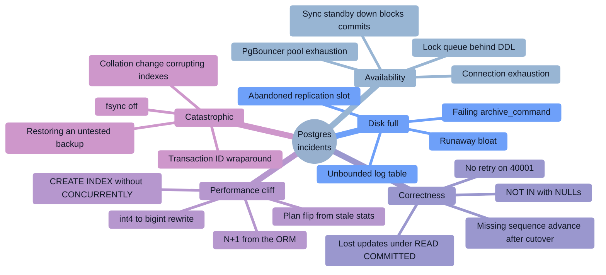

## 9.2 Incident deep-dives

### 🔴 Incident 1: "The database stopped accepting writes" — TXID wraparound
**Symptom:** `ERROR: database is not accepting commands to avoid wraparound data loss in database "app"`.
**Root cause:** a monitoring tool held a transaction open for 11 days; autovacuum ran constantly but could freeze nothing.
**Detection that would have caught it:** alerting on `age(datfrozenxid) > 1e9` and on `pg_stat_activity` transactions older than 1 hour.
**Recovery:** kill the blocker → manual `VACUUM (FREEZE, VERBOSE)` on the highest-age tables with `vacuum_cost_delay=0`, prioritized by `age(relfrozenxid)`. In the worst case, single-user mode (`postgres --single`) with hours of downtime.
**Permanent fix:** `idle_in_transaction_session_timeout = '5min'`, `statement_timeout`, slot monitoring, lower `autovacuum_freeze_max_age` on hot tables.

### 🔴 Incident 2: "Everything is down and the disk is full" — abandoned replication slot
**Symptom:** `PANIC: could not write to file "pg_wal/xlogtemp...": No space left on device`, then the primary shuts down.
**Root cause:** a Debezium connector was decommissioned but its logical replication slot was never dropped. Postgres dutifully retained **every WAL file since that day**.
**Fix now:** `SELECT pg_drop_replication_slot('old_slot');` then restart. If the disk is 100% full you may need to move/delete an archived WAL segment first — **never delete files from `pg_wal` by hand unless you truly understand what you're doing**; use `pg_archivecleanup`.
**Permanent fix:** `max_slot_wal_keep_size = '100GB'` (PG 13+) so the slot is invalidated instead of the cluster dying; alert on inactive slots; 🆕 PG 18's `idle_replication_slot_timeout`.

### 🔴 Incident 3: "A one-line ALTER took the site down" — the lock queue
**Symptom:** All reads start timing out seconds after a deploy runs `ALTER TABLE users ADD COLUMN …`.
**Root cause:** an analytics `SELECT` had been running for 20 minutes holding `ACCESS SHARE`. The ALTER queued for `ACCESS EXCLUSIVE`. **Every subsequent query queued behind the ALTER.**
**Fix now:** cancel the ALTER (`pg_cancel_backend`), the queue drains instantly.
**Permanent fix:** `SET lock_timeout = '3s'` in every migration, retry with backoff, and run migrations in a window; also kill long analytics queries on the primary (or move them to a replica).

### 🔴 Incident 4: "Latency 10×'d with no deploy" — plan flip
**Symptom:** One endpoint's p99 goes from 20 ms to 4 s. No code change.
**Root cause:** a bulk import doubled a table's size; stats were stale, so the planner's row estimate was 50× low, and a hash join flipped to a nested loop (or vice versa).
**Diagnosis:** `pg_stat_statements` shows the same query, same call count, 200× the mean time; `EXPLAIN (ANALYZE, BUFFERS)` shows the estimate/actual divergence; `pg_stat_user_tables.last_analyze` is days old.
**Fix:** `ANALYZE`; then `ALTER TABLE … ALTER COLUMN … SET STATISTICS 1000` on the skewed column, or extended statistics for correlated columns; tune autovacuum's analyze scale factor.

### 🔴 Incident 5: "Duplicate charges" — no idempotency, plus a client retry
**Symptom:** Customers double-charged when the API gateway retried a timed-out request.
**Root cause:** the payment endpoint was not idempotent; the first request had actually succeeded but its response was lost.
**Fix:** §4.4 Q52's idempotency-key pattern. **The general lesson:** *any* endpoint reachable by a retrying client must be idempotent, and a unique constraint is the cheapest way to enforce it.

### 🔴 Incident 6: "Connection storm" — pool exhaustion cascade
**Symptom:** `FATAL: sorry, too many clients already`, then a full outage; the DB CPU is *low*.
**Root cause:** a downstream slowdown made queries take longer → app threads held connections longer → the pool emptied → health checks failed → the orchestrator restarted pods → each new pod opened a fresh pool → **the retry storm finished the job.**
**Fix now:** shed load at the edge, raise `superuser_reserved_connections` usage to get in and diagnose, kill idle-in-transaction sessions.
**Permanent fix:** PgBouncer with a bounded `default_pool_size`, client-side timeouts **shorter** than the server's, circuit breakers, exponential backoff **with jitter**, and health checks that don't hit the database.

### 🔴 Incident 7: "Index scans returning wrong results" — glibc collation change
**Symptom:** After an OS upgrade (glibc 2.28, i.e. RHEL 8 / Debian 10 / Ubuntu 18.10+), `WHERE name = 'x'` misses rows that exist, and unique constraints allow duplicates.
**Root cause:** glibc changed the sort order of many locales. **Every B-tree index on a text column is now sorted according to rules the running library no longer agrees with**, so binary searches take wrong turns.
**Fix:** `REINDEX` all text indexes (or `REINDEX DATABASE`) immediately after any glibc/ICU change.
**Prevention:** use `ICU` collations with a pinned version (PG 15+ makes ICU a first-class option and tracks collation versions — `pg_collation.collversion`, with a warning on mismatch), or `C`/`C.UTF-8` collation where linguistic ordering doesn't matter (also **faster**).
> This is an *excellent* thing to know — it's obscure, catastrophic, and has bitten many real teams.

### 🔴 Incident 8: "The migration ran for 6 hours and locked everything" — `int` → `bigint`
**Symptom:** A PK approaching 2.1 billion; `ALTER TABLE … ALTER COLUMN id TYPE bigint` rewrites the entire table under `ACCESS EXCLUSIVE`.
**The correct procedure:**
```sql
-- 1. Add the new column (instant)
ALTER TABLE events ADD COLUMN id_new bigint;
-- 2. Backfill in batches, throttled by replication lag
-- 3. Add a trigger (or use generated column) to keep it in sync for new rows
-- 4. Build the unique index CONCURRENTLY on id_new
-- 5. Brief lock: swap the PK constraint, rename columns
-- 6. Drop the old column and the trigger
```
**Prevention:** use `bigint` from day one. The disk cost of 4 extra bytes per row is trivial next to this migration.

### 🔴 Incident 9: "ORM N+1 melted the database"
**Symptom:** One page load issues 3,000 queries. Each is 0.4 ms — invisible in slow-query logs, devastating in aggregate.
**Detection:** `pg_stat_statements` sorted by **`calls`** and by `total_exec_time` (not `mean_exec_time` — this is exactly why).
**Fix:** eager loading (`JOIN` / `IN` batching / Rails `includes` / Django `select_related`/`prefetch_related` / SQLAlchemy `joinedload`), a `DataLoader` for GraphQL, or a single query with `LATERAL`.

### 🔴 Incident 10: "We restored the backup and it was empty/old"
**Root cause:** the backup job had been failing silently for 3 months; nobody had ever tested a restore.
**Fix:** automated restore verification on a schedule, with an assertion on row counts and a recency check on the newest row. **Say this in interviews — it's the most common real backup failure and almost nobody mentions it.**

## 9.3 Error codes worth memorizing

| SQLSTATE | Name | What you do |
|----------|------|-------------|
| `23505` | `unique_violation` | Map to 409 Conflict; the basis of idempotency |
| `23503` | `foreign_key_violation` | 422; usually an ordering bug |
| `23502` | `not_null_violation` | 400 |
| `23514` | `check_violation` | 400 |
| **`40001`** | `serialization_failure` | **Retry the transaction** with backoff |
| **`40P01`** | `deadlock_detected` | **Retry**; then fix the lock ordering |
| `55P03` | `lock_not_available` | `NOWAIT` fired; retry or back off |
| `57014` | `query_canceled` | `statement_timeout` or user cancel |
| `53300` | `too_many_connections` | Pooler/capacity problem |
| `53100` | `disk_full` | Page immediately |
| `25P02` | `in_failed_sql_transaction` | You're issuing statements after an error without a rollback — a classic app bug |
| `08006` | `connection_failure` | Reconnect with backoff |
| `42P01` / `42703` | undefined table / column | Migration ordering bug |

## 9.4 The debugging toolkit

```sql
-- 🔧 Enable rich logging (postgresql.conf)
log_min_duration_statement = 1000     -- log anything over 1s
log_lock_waits = on                   -- log waits longer than deadlock_timeout
log_temp_files = 0                    -- log ALL temp file usage (work_mem spills)
log_autovacuum_min_duration = 0       -- log every autovacuum
log_checkpoints = on
log_connections = on
log_line_prefix = '%m [%p] %q%u@%d app=%a '   -- timestamp, pid, user, db, app name

-- 🔧 auto_explain: the answer to "it's only slow in production"
shared_preload_libraries = 'pg_stat_statements,auto_explain'
auto_explain.log_min_duration = '3s'
auto_explain.log_analyze = on
auto_explain.log_buffers = on
auto_explain.log_nested_statements = on
auto_explain.sample_rate = 0.01       -- ⚠️ sample in production; log_analyze is not free
```

```sql
-- 🔧 Live triage one-liners
SELECT pg_cancel_backend(pid);      -- polite: cancel the query
SELECT pg_terminate_backend(pid);   -- forceful: kill the connection
SELECT * FROM pg_stat_progress_vacuum;        -- how far along is that vacuum?
SELECT * FROM pg_stat_progress_create_index;  -- and that index build?
SELECT * FROM pg_stat_progress_copy;          -- and that bulk load? (PG 14+)
SELECT * FROM pg_stat_progress_analyze;
```

---
# 10. 🔐 Security

## 10.1 The attack-surface map

```mermaid
%%{init: {'theme':'base','themeVariables':{'background':'#ffffff','mainBkg':'#eef2f7','primaryColor':'#eef2f7','primaryTextColor':'#111827','primaryBorderColor':'#64748b','secondaryColor':'#e8f0fe','tertiaryColor':'#f1f5f9','lineColor':'#475569','textColor':'#111827','clusterBkg':'#f8fafc','clusterBorder':'#94a3b8','edgeLabelBackground':'#ffffff','titleColor':'#111827','actorBkg':'#eef2f7','actorTextColor':'#111827','actorBorder':'#64748b','actorLineColor':'#475569','signalColor':'#111827','signalTextColor':'#111827','noteBkgColor':'#fff4e5','noteTextColor':'#111827','noteBorderColor':'#d97706','labelBoxBkgColor':'#eef2f7','labelBoxBorderColor':'#64748b','labelTextColor':'#111827','loopTextColor':'#111827','altBackground':'#f8fafc'}}}%%
flowchart TB
    ATT["🕵️ Attacker"]
    ATT -->|"1. SQL injection"| APP["📱 Application"]
    ATT -->|"2. Network sniffing /<br/>MITM"| NET["🌐 Connection"]
    ATT -->|"3. Credential stuffing /<br/>weak auth"| AUTH["🔑 pg_hba.conf"]
    ATT -->|"4. Privilege escalation<br/>(SECURITY DEFINER,<br/>search_path hijack)"| PRIV["👤 Roles & grants"]
    ATT -->|"5. Stolen backup /<br/>disk image"| DISK["💾 Data at rest"]
    ATT -->|"6. Tenant data leak<br/>(missing WHERE)"| RLS["🚧 Row-level security"]
    ATT -->|"7. DoS: expensive queries,<br/>connection exhaustion"| DOS["⚡ Resource limits"]

    APP --> DEF1["✅ Parameterized queries<br/>ALWAYS"]
    NET --> DEF2["✅ TLS: sslmode=verify-full"]
    AUTH --> DEF3["✅ scram-sha-256, no trust,<br/>IP allowlists, 🆕 v18 OAuth"]
    PRIV --> DEF4["✅ Least privilege, no superuser app role,<br/>SET search_path on SECURITY DEFINER"]
    DISK --> DEF5["✅ Encrypted volumes + encrypted backups,<br/>pgcrypto for column-level"]
    RLS --> DEF6["✅ ENABLE ROW LEVEL SECURITY + FORCE"]
    DOS --> DEF7["✅ statement_timeout, connection limits,<br/>pooler, rate limiting"]

    style ATT fill:#fce8e6,stroke:#ea4335,color:#111827
    style DEF1 fill:#e6f4ea,stroke:#34a853,color:#111827
    style DEF2 fill:#e6f4ea,stroke:#34a853,color:#111827
    style DEF3 fill:#e6f4ea,stroke:#34a853,color:#111827
    style DEF4 fill:#e6f4ea,stroke:#34a853,color:#111827
    style DEF5 fill:#e6f4ea,stroke:#34a853,color:#111827
    style DEF6 fill:#e6f4ea,stroke:#34a853,color:#111827
    style DEF7 fill:#e6f4ea,stroke:#34a853,color:#111827
```

## 10.2 SQL injection — the answer they expect, and the one that impresses

```python
# ❌ INJECTABLE — string concatenation/interpolation, always
cur.execute("SELECT * FROM users WHERE email = '" + email + "'")
cur.execute(f"SELECT * FROM users WHERE email = '{email}'")

# ✅ Parameterized — the driver sends the value SEPARATELY from the SQL text.
#    The server never parses it as SQL. This is not escaping; it is a different channel.
cur.execute("SELECT * FROM users WHERE email = %s", (email,))
```

```sql
-- ✅ In PL/pgSQL, when you must build dynamic SQL:
EXECUTE format('SELECT * FROM %I WHERE %I = $1', table_name, col_name) USING val;
--                            ^^ %I quotes IDENTIFIERS, %L quotes LITERALS
-- ❌ never:  EXECUTE 'SELECT * FROM ' || table_name || ' WHERE x = ''' || val || '''';
```

**What impresses:**
- *"Parameterization doesn't work for **identifiers** — table names, column names, `ORDER BY` columns, or `ASC`/`DESC`. Those must be validated against an allowlist. A surprising number of injections live in `ORDER BY ${sortColumn}`."*
- *"ORMs prevent injection for normal usage but every ORM has a raw-SQL escape hatch, and that's where the bugs are. `.raw()`, `.extra()`, `text()` — that's where I'd look first in a review."*
- *"Defence in depth: least-privilege roles mean that even a successful injection on the read path can't `DROP TABLE`."*

## 10.3 Authentication & `pg_hba.conf`

```
# TYPE  DATABASE  USER      ADDRESS         METHOD
local   all       postgres                  peer
hostssl app       app_user  10.0.0.0/8      scram-sha-256   # ✅
hostssl all       all       0.0.0.0/0       reject          # ✅ explicit deny
# ❌ NEVER: host all all 0.0.0.0/0 trust     ← no password at all
# ❌ AVOID: md5 (weak; scram-sha-256 since PG 10 is the standard)
```

**Rules are matched top-down; the first matching line wins** — an important detail (a permissive rule above a restrictive one silently wins). `hostssl` forces TLS; `hostnossl` is the opposite. Methods worth naming: `scram-sha-256` (default), `cert` (mutual TLS), `ldap`, `gss`/`sspi` (Kerberos), `peer`/`ident` (local OS user), and 🆕 **`oauth` (PG 18)** for token-based auth against an external IdP — a genuinely new answer in 2026.

```bash
# TLS from the client — sslmode matters enormously
psql "host=db.example.com sslmode=verify-full sslrootcert=ca.pem dbname=app"
# require       → encrypted, but NO certificate verification (MITM possible!)
# verify-ca     → verifies the CA
# verify-full   → ✅ verifies CA *and* hostname. The only correct production setting.
```

## 10.4 Roles, privileges, and least privilege

```sql
-- ✅ Role hierarchy: roles are groups AND users (there is no separate CREATE USER concept —
--    CREATE USER is just CREATE ROLE ... LOGIN)
CREATE ROLE app_read;
CREATE ROLE app_write;
GRANT USAGE ON SCHEMA app TO app_read;
GRANT SELECT ON ALL TABLES IN SCHEMA app TO app_read;
GRANT app_read TO app_write;
GRANT INSERT, UPDATE, DELETE ON ALL TABLES IN SCHEMA app TO app_write;

-- ⚠️ ALL TABLES only covers tables that exist NOW. For future ones:
ALTER DEFAULT PRIVILEGES IN SCHEMA app GRANT SELECT ON TABLES TO app_read;

CREATE ROLE svc_api LOGIN PASSWORD '…' IN ROLE app_write CONNECTION LIMIT 50;

-- 🔒 The PG 15 change everyone should know:
--    Before PG 15, PUBLIC had CREATE on the public schema — any user could create
--    objects there. PG 15+ revokes that by default. Mention it; it's a real hardening win.
REVOKE CREATE ON SCHEMA public FROM PUBLIC;   -- for older versions
REVOKE ALL ON DATABASE app FROM PUBLIC;
```

> [!WARNING]
> **`SECURITY DEFINER` functions are the classic privilege-escalation vector.** Such a function runs with the *owner's* privileges. If the owner is a superuser and the function doesn't pin its `search_path`, an attacker can create a malicious function in a schema earlier in the caller's `search_path` and hijack an unqualified call inside it.
> ```sql
> CREATE FUNCTION admin_op() RETURNS void
> LANGUAGE plpgsql SECURITY DEFINER
> SET search_path = pg_catalog, pg_temp    -- ✅ MANDATORY on every SECURITY DEFINER function
> AS $$ ... $$;
> ```

## 10.5 Row-Level Security (RLS)

```sql
ALTER TABLE documents ENABLE ROW LEVEL SECURITY;
ALTER TABLE documents FORCE ROW LEVEL SECURITY;   -- ✅ applies to the TABLE OWNER too

CREATE POLICY tenant_isolation ON documents
    USING       (tenant_id = current_setting('app.tenant_id')::bigint)  -- rows visible
    WITH CHECK  (tenant_id = current_setting('app.tenant_id')::bigint); -- rows insertable

-- Per-operation policies
CREATE POLICY read_own  ON documents FOR SELECT USING (owner_id = current_user_id());
CREATE POLICY write_own ON documents FOR UPDATE USING (owner_id = current_user_id())
                                     WITH CHECK (owner_id = current_user_id());
```

| Gotcha | Detail |
|--------|--------|
| **Table owners and superusers bypass RLS** | Unless you use `FORCE ROW LEVEL SECURITY`. The #1 RLS mistake. |
| **`BYPASSRLS` role attribute** | Grants a global bypass — audit who has it. |
| **Connection pooling** | In transaction mode, `SET app.tenant_id` leaks across tenants. Use **`SET LOCAL` inside the transaction**, always. |
| **Performance** | Policies are injected as `WHERE` predicates and **do affect plans**. A policy calling a `VOLATILE` function per row is a disaster; make policy functions `STABLE` and ensure `tenant_id` is indexed. |
| **Leaky operators** | A `SELECT` with a user-supplied function in the `WHERE` clause can, in principle, observe rows before the policy filters them. Postgres marks operators as leakproof or not; policies restrict non-leakproof operators. This is deep-cut knowledge worth one sentence. |
| **`USING` vs `WITH CHECK`** | `USING` filters what you can *see* (SELECT/UPDATE/DELETE); `WITH CHECK` validates what you can *write* (INSERT/UPDATE). Omitting `WITH CHECK` lets a tenant insert rows for another tenant. |

## 10.6 Encryption

| Layer | Mechanism | Notes |
|-------|-----------|-------|
| **In transit** | TLS (`ssl = on`, `sslmode=verify-full`) | Mandatory. |
| **At rest (disk)** | Filesystem/volume encryption (LUKS, EBS encryption, GCP CMEK) | **Postgres has no native TDE in core** — a common interview question. EDB and some forks add it. Cloud providers give you volume-level encryption. |
| **At rest (backups)** | Encrypt backups independently | pgBackRest/WAL-G support this; a stolen backup is a full database breach. |
| **Column-level** | `pgcrypto`: `pgp_sym_encrypt`, `digest`, `crypt`+`gen_salt` for passwords | ⚠️ **Encrypted columns can't be indexed usefully** for range queries; equality works only with deterministic encryption, which leaks equality. Key management is the hard part — the key must not live in the same database. |
| **Hashing passwords** | `crypt(pw, gen_salt('bf', 12))` — or better, **do it in the app with argon2/bcrypt** so the plaintext never reaches the DB or its logs | The stronger answer is "hash in the app." |

## 10.7 Denial of service & resource protection

```sql
-- Global guardrails
statement_timeout = '30s'                       -- kill runaway queries
idle_in_transaction_session_timeout = '60s'     -- 🔑 kills the bloat/wraparound cause
lock_timeout = '5s'
idle_session_timeout = '10min'                  -- PG 14+
tcp_keepalives_idle = 60                        -- detect dead clients

-- Per-role/per-database limits
ALTER ROLE reporting SET statement_timeout = '5min';
ALTER ROLE reporting CONNECTION LIMIT 5;
ALTER DATABASE app CONNECTION LIMIT 200;
```

## 10.8 Auditing & compliance

- **`pgaudit`** — session and object-level audit logging (who read what), the standard for SOC 2 / PCI / HIPAA conversations.
- **`log_statement = 'ddl'`** at minimum; `'mod'` or `'all'` if volume permits. ⚠️ `log_statement = 'all'` **logs parameter values, including secrets** — a real leak vector.
- **Temporal/audit tables** — triggers writing before/after images, or `temporal_tables`/`pgMemento` extensions.
- **Data masking** for non-prod: `anon` (PostgreSQL Anonymizer) extension, or generate synthetic data. *"We never restore a production backup into staging without masking"* is a good line.
- **Secrets:** never in `postgresql.conf`, never in code, never in `~/.pgpass` on shared hosts — use a secrets manager with rotation, and IAM auth on managed services where available.

## 10.9 Security checklist

- [ ] All queries parameterized; identifier interpolation allowlisted
- [ ] `sslmode=verify-full` from every client
- [ ] `scram-sha-256`; no `trust`, no `md5`; `pg_hba.conf` reviewed line by line
- [ ] App role is **not** superuser and **does not own** its tables (so it can't `DROP` them)
- [ ] `REVOKE ALL ON DATABASE … FROM PUBLIC`; `public` schema locked down
- [ ] `ALTER DEFAULT PRIVILEGES` set so new tables inherit the right grants
- [ ] Every `SECURITY DEFINER` function pins `search_path`
- [ ] RLS enabled **and forced** on multi-tenant tables; `SET LOCAL` under pooling
- [ ] `statement_timeout`, `idle_in_transaction_session_timeout`, `lock_timeout` set
- [ ] Volume + backup encryption; backups tested **and** access-controlled
- [ ] `pgaudit` or `log_statement='ddl'`; logs shipped off-host and retained
- [ ] Extensions audited (an extension runs as superuser at install time)
- [ ] Patch cadence: minor versions applied within the quarter; CVEs tracked

---

# 11. ⚡ Performance

## 11.1 The performance hierarchy — fix in this order

```mermaid
%%{init: {'theme':'base','themeVariables':{'background':'#ffffff','mainBkg':'#eef2f7','primaryColor':'#eef2f7','primaryTextColor':'#111827','primaryBorderColor':'#64748b','secondaryColor':'#e8f0fe','tertiaryColor':'#f1f5f9','lineColor':'#475569','textColor':'#111827','clusterBkg':'#f8fafc','clusterBorder':'#94a3b8','edgeLabelBackground':'#ffffff','titleColor':'#111827','actorBkg':'#eef2f7','actorTextColor':'#111827','actorBorder':'#64748b','actorLineColor':'#475569','signalColor':'#111827','signalTextColor':'#111827','noteBkgColor':'#fff4e5','noteTextColor':'#111827','noteBorderColor':'#d97706','labelBoxBkgColor':'#eef2f7','labelBoxBorderColor':'#64748b','labelTextColor':'#111827','loopTextColor':'#111827','altBackground':'#f8fafc'}}}%%
flowchart TD
    L1["1️⃣ Don't run the query at all<br/>caching, batching, eliminating N+1<br/>💰 1000× wins live here"]
    L2["2️⃣ Fix the query & schema<br/>right index, right join order,<br/>keyset pagination, no SELECT *<br/>💰 10–1000×"]
    L3["3️⃣ Fix statistics & the plan<br/>ANALYZE, extended stats,<br/>SET STATISTICS<br/>💰 10–100×"]
    L4["4️⃣ Fix maintenance<br/>vacuum, bloat, reindex,<br/>visibility map<br/>💰 2–20×"]
    L5["5️⃣ Tune configuration<br/>shared_buffers, work_mem,<br/>random_page_cost, checkpoints<br/>💰 1.2–3×"]
    L6["6️⃣ Add hardware<br/>more RAM, faster NVMe, more cores<br/>💰 1.5–3×, costs money forever"]
    L1 --> L2 --> L3 --> L4 --> L5 --> L6

    style L1 fill:#e6f4ea,stroke:#34a853,color:#111827
    style L2 fill:#e6f4ea,stroke:#34a853,color:#111827
    style L3 fill:#e8f0fe,stroke:#4285f4,color:#111827
    style L4 fill:#e8f0fe,stroke:#4285f4,color:#111827
    style L5 fill:#fff4e5,stroke:#f4b400,color:#111827
    style L6 fill:#fce8e6,stroke:#ea4335,color:#111827
```

> [!TIP]
> **Say this in the interview:** *"Most 'Postgres is slow' problems are application problems. I start at the top of that list, because config tuning gives you 30% and fixing an N+1 gives you 100×. Also: measure before and after — 'I added an index and it felt faster' isn't an engineering claim."*

## 11.2 A tuning baseline (16-core, 64 GB RAM, NVMe, OLTP)

```ini
# ── Memory ──────────────────────────────────────────────
shared_buffers = 16GB                 # ~25% of RAM
effective_cache_size = 48GB           # ~75% — a PLANNER HINT, allocates nothing
work_mem = 32MB                       # per sort/hash node — be conservative
maintenance_work_mem = 2GB            # vacuum, index builds
autovacuum_work_mem = 1GB

# ── Planner (the highest-ROI lines on modern hardware) ──
random_page_cost = 1.1                # ✅ NVMe/SSD. Default 4.0 assumes spinning disks
seq_page_cost = 1.0
effective_io_concurrency = 200        # SSD; 1-2 for spinning disks
default_statistics_target = 100       # raise per-column instead of globally

# ── WAL & checkpoints ───────────────────────────────────
wal_compression = lz4                 # PG 15+; big WAL reduction
max_wal_size = 16GB
min_wal_size = 2GB
checkpoint_timeout = 15min
checkpoint_completion_target = 0.9
wal_buffers = 64MB

# ── Parallelism ─────────────────────────────────────────
max_worker_processes = 16
max_parallel_workers = 16
max_parallel_workers_per_gather = 4
max_parallel_maintenance_workers = 4  # parallel CREATE INDEX

# ── Autovacuum (assume the defaults are wrong) ──────────
autovacuum_max_workers = 6
autovacuum_vacuum_cost_limit = 3000
autovacuum_vacuum_cost_delay = 2ms
autovacuum_naptime = 15s

# ── Connections ─────────────────────────────────────────
max_connections = 200                 # keep low; PgBouncer does the multiplexing

# ── 🆕 PG 18: asynchronous I/O ──────────────────────────
io_method = worker                    # 'worker' (portable) | 'io_uring' (Linux 5.1+) | 'sync'
io_workers = 3                        # 🔮 v19 auto-scales via io_min/max_workers
io_combine_limit = 128kB

# ── Observability ───────────────────────────────────────
shared_preload_libraries = 'pg_stat_statements,auto_explain'
track_io_timing = on                  # ✅ makes EXPLAIN (BUFFERS) show real I/O time
track_functions = pl
log_min_duration_statement = 1000
log_lock_waits = on
log_temp_files = 0
log_checkpoints = on

# ── Safety ──────────────────────────────────────────────
statement_timeout = 60s
idle_in_transaction_session_timeout = 5min
lock_timeout = 5s
```

> [!WARNING]
> **Don't recite a config file in an interview.** Name **three** settings and *why*: `random_page_cost` (the default assumes spinning disks), `work_mem` (per-node, not per-connection — the OOM trap), and `autovacuum_vacuum_scale_factor` per hot table (20% of a huge table is far too lax). Depth beats breadth.

## 11.3 🆕 PostgreSQL 18's asynchronous I/O — the "do you keep up?" answer

Before PG 18, a backend issued one read and blocked until it returned; concurrency came only from `posix_fadvise` prefetching for bitmap scans. **PG 18 adds a real AIO subsystem**: backends queue multiple I/O requests and continue working.

| Setting | Meaning |
|---------|---------|
| `io_method = sync` | Old behaviour |
| `io_method = worker` (default) | Dedicated I/O worker processes perform the reads — portable across platforms |
| `io_method = io_uring` | Linux `io_uring` — lowest overhead, requires a modern kernel and build support |
| `io_combine_limit` / `io_max_combine_limit` | How many adjacent blocks get merged into one larger read |
| `pg_aios` view | In-flight I/O handles |

**Who benefits:** sequential scans, bitmap heap scans, and **VACUUM** — benchmarks have shown up to ~3× improvement on read-heavy scan workloads, especially on cloud storage where per-request latency is high and queue depth is everything. 🔮 **PG 19** builds on it with auto-scaling I/O workers (`io_min_workers`/`io_max_workers`).

**The one-liner:** *"AIO mostly helps workloads bound by storage latency rather than IOPS — cloud block storage is exactly that shape, so it's a bigger win on EBS than on a local NVMe."*

## 11.4 Benchmarking properly

```bash
# pgbench — built in
pgbench -i -s 500 app                 # initialize, scale 500 (~7.5 GB)
pgbench -c 50 -j 8 -T 300 -P 10 app   # 50 clients, 8 threads, 5 min, progress every 10s
pgbench -c 50 -j 8 -T 300 -f custom.sql -M prepared app   # your own workload

# Percentile-aware & realistic alternatives
# - pgbench --latency-limit for throughput under an SLO
# - HammerDB (TPC-C/TPC-H style)
# - sysbench, or a replay of production traffic (pgreplay, pg_stat_statements-driven)
```

**Benchmarking rules to state:**
1. **Benchmark your workload**, not TPC-B. `pgbench`'s default is a write-heavy toy.
2. **Warm the cache** or measure cold and warm separately — the difference is 100×.
3. **Report p50/p95/p99, not the mean.** A mean hides the tail that users feel.
4. **Run long enough to cross a checkpoint** — otherwise you're measuring the calm before the flush.
5. **Change one variable at a time**, and re-run the baseline last to catch drift.
6. **Match production data volume and distribution** — a uniform-random dataset behaves nothing like a Zipfian one.

## 11.5 Where the time actually goes

| Symptom | Likely cause | Confirm with |
|---------|--------------|--------------|
| High CPU, low I/O | Bad plans, seq scans in RAM, JIT overhead, too many connections, expensive functions | `pg_stat_statements`, `EXPLAIN`, `perf top` |
| High I/O read | Cold cache, `shared_buffers` too small, table >> RAM, bloat | `pg_statio_*`, `EXPLAIN (BUFFERS)`, `pg_stat_io` 🆕 |
| High I/O write | Checkpoint storms, WAL volume, HOT-update failure, index count | `pg_stat_bgwriter`, `EXPLAIN (WAL)` |
| Spiky latency every N minutes | Checkpoints | `log_checkpoints`, `checkpoints_req` |
| Latency grows over hours, resets on restart | Bloat, memory leak in an extension, connection leak | `n_dead_tup`, `pg_stat_activity` count |
| Queries wait but CPU is idle | Locks | `pg_locks`, `pg_blocking_pids`, `log_lock_waits` |
| Temp files in logs | `work_mem` too small for that query | `log_temp_files`, `EXPLAIN` "Sort Method: external merge" |
| Slow only on the replica | Recovery conflicts, weaker hardware, different settings | `pg_stat_database_conflicts` |

## 11.6 Memory, CPU, and the buffer cache

- **Buffer replacement is a clock-sweep algorithm** with a `usage_count` per buffer (capped at 5). A page must survive several sweeps to stay. **Sequential scans of large tables use a small ring buffer** (~256 KB) precisely so they don't evict your entire working set — a great detail to know when asked "won't one big report query destroy my cache?"
- **`pg_prewarm`** can load a table/index into `shared_buffers` after a restart — useful for reducing post-failover latency.
- **Huge pages** (`huge_pages = try`) reduce TLB misses on large `shared_buffers`; a real few-percent win on big instances.
- **JIT** (`jit = on` by default since PG 12) compiles expressions for expensive queries. ⚠️ **On OLTP workloads with many short queries whose *estimated* cost crosses `jit_above_cost`, JIT compilation time can dominate.** Turning `jit = off` has fixed real production regressions. Know both sides.
- **Parallel query** kicks in for large scans; each worker gets its **own `work_mem`** — another multiplier in the OOM math.

## 11.7 Bulk loading — the 10× checklist

```sql
-- ✅ COPY beats INSERT by 10-50×
COPY orders FROM '/data/orders.csv' WITH (FORMAT csv, HEADER);
-- from an app: use the binary/text COPY protocol (psycopg copy, pgx CopyFrom)

-- ✅ For the biggest loads:
ALTER TABLE orders SET UNLOGGED;      -- skip WAL entirely (⚠️ lost on crash, not replicated)
DROP INDEX ...;                       -- build indexes AFTER loading
SET maintenance_work_mem = '4GB';
SET max_parallel_maintenance_workers = 4;
-- load ...
CREATE INDEX ...;                     -- parallel, one pass, no incremental maintenance
ALTER TABLE orders SET LOGGED;        -- ⚠️ this rewrites the table and WAL-logs it
ANALYZE orders;                       -- ✅ ALWAYS. Skipping this is why "it was fast in test"

-- ✅ Multi-row INSERT if you can't use COPY (still ~5× faster than row-by-row)
INSERT INTO t (a,b) VALUES ($1,$2),($3,$4),($5,$6), ... ;
```

## 11.8 The performance checklist

- [ ] `pg_stat_statements` installed; top-20-by-total-time reviewed weekly
- [ ] No `SELECT *` on tables with TOASTed columns
- [ ] Every hot query has a matching index; every index has a matching query
- [ ] `random_page_cost` matches the storage
- [ ] `work_mem` sized against **peak concurrent sort/hash nodes**, not connections
- [ ] Autovacuum tuned per hot table; `n_dead_tup` monitored
- [ ] `track_io_timing = on` so `EXPLAIN (BUFFERS)` is meaningful
- [ ] Cache hit ratio > 99% for OLTP
- [ ] Keyset pagination on any list endpoint that can go deep
- [ ] Connection pooling with a bounded pool ≈ 2× cores
- [ ] Bulk paths use `COPY`, and `ANALYZE` runs after
- [ ] Checkpoints are mostly `timed`, not `req`
- [ ] Long-running / analytics queries are on a replica, not the primary

---

# 12. ✅ Best Practices

## 12.1 Schema design

| ✅ Do | Why |
|-------|-----|
| `bigint GENERATED ALWAYS AS IDENTITY` for PKs (or `uuidv7()` 🆕) | `int4` overflow is a real outage; `SERIAL` is legacy syntax |
| `timestamptz`, never `timestamp` | Unambiguous across time zones |
| `numeric` for money | Floating point loses cents |
| `text` + `CHECK`, not `varchar(n)` | Same performance, cheaper to change |
| `NOT NULL` by default; make nullability a deliberate decision | NULLs propagate through every query and every estimate |
| Foreign keys on, in production | The database is the last line of defence; the app has bugs |
| **Index every FK column on the child side** | Otherwise parent deletes/updates do full child scans |
| Constraints (`CHECK`, `UNIQUE`, `EXCLUDE`) as the source of truth | Makes illegal states unrepresentable |
| A `tenant_id` on every multi-tenant table | Future shard key, partition key, and RLS key |
| `created_at`/`updated_at` on everything | Debugging, CDC, retention, and audit all need them |
| Order columns by alignment (8-byte first) on huge tables | Real disk savings at billions of rows |
| Name things consistently: `snake_case`, plural tables, `fk_`/`idx_`/`uq_` prefixes | Postgres folds unquoted identifiers to lowercase — `"CamelCase"` forces quoting forever |

## 12.2 Query & application practice

| ✅ Do | ❌ Don't |
|-------|---------|
| Parameterized queries, always | String-concatenated SQL |
| `SELECT` only the columns you need | `SELECT *` (breaks index-only scans, drags TOAST) |
| Keyset pagination for deep lists | `OFFSET 100000` |
| `EXISTS` for existence checks | `COUNT(*) > 0` |
| `NOT EXISTS` for anti-joins | `NOT IN` with a nullable subquery |
| Batch writes (`COPY`, multi-row `INSERT`, `unnest`) | Row-by-row loops |
| Short transactions; open them late, close them early | Transactions spanning user think-time or HTTP calls |
| Set `statement_timeout` per workload class | Unbounded queries |
| Retry `40001` and `40P01` with jittered backoff | Assume transactions never fail |
| `ON CONFLICT` for idempotency | Check-then-insert (a race) |
| `RETURNING` to avoid a second round trip | `INSERT` then `SELECT` |
| Explicit column lists in `INSERT` | Positional inserts that break on schema change |
| Connection pooling with sane limits | A new connection per request |

## 12.3 Operations

- **Every migration:** `lock_timeout` + `statement_timeout` + `CONCURRENTLY` + expand/contract + a retry loop. Review migrations as carefully as production code — they *are* production code, run once, at the worst possible moment.
- **Backups:** PITR to object storage, automated, **with a scheduled restore test**. Know your RPO and RTO as numbers.
- **Monitoring, the non-negotiable list:** disk %, connection count vs limit, replication lag, **`age(relfrozenxid)`**, inactive replication slots, longest transaction, deadlocks/sec, cache hit ratio, p99 query time, autovacuum activity, checkpoint req-vs-timed.
- **Upgrades:** minor versions promptly (they're bug/security fixes, no dump/restore needed); major versions annually-ish via `pg_upgrade` or logical replication. Postgres majors are supported for **5 years**.
- **Capacity:** alert at 70% disk, not 90% — you need room to `pg_repack` and to survive a WAL spike.
- **Runbooks** for: disk full, wraparound warning, failover, replica rebuild, pool exhaustion, and "the migration is stuck." Rehearse the failover.
- **Chaos:** kill the primary in staging on purpose, quarterly. An untested failover is a hypothesis.

## 12.4 Development workflow

- **Local Postgres = production major version.** Docker Compose it; version-skew bugs are miserable.
- **Migrations in version control**, forward-only, reviewed, with a tested rollback plan (usually "roll forward with a fix" rather than a down-migration).
- **Seed/staging data at production-like volume and distribution** — most performance bugs are invisible on 1,000 rows.
- **A migration linter** in CI: `squawk`, `strong_migrations` (Rails), `django-migration-linter`, or `eugene`. It catches the `ALTER TABLE` that would lock production.
- **`EXPLAIN` in code review** for any new query touching a table >1 M rows.
- **Test against real constraints** — turning FKs off in tests hides bugs that only appear in production.

---

# 13. 🚫 Anti-patterns

| ❌ Anti-pattern | Why it's bad | ✅ Instead |
|-----------------|--------------|-----------|
| **`SELECT *` everywhere** | Prevents index-only scans, drags TOASTed columns off disk, breaks when the schema changes | Name your columns |
| **`OFFSET` pagination on deep pages** | O(offset); page 5000 scans 100k rows to discard them; also unstable under concurrent inserts | Keyset pagination |
| **EAV (entity-attribute-value) tables** | Destroys types, constraints, and planner estimates; every query becomes a self-join pile | Real columns, or `jsonb` for genuinely dynamic parts |
| **UUIDv4 primary keys on write-heavy tables** | Random insertion order → B-tree page splits, cache misses, WAL churn, ~2× index size vs bigint | `bigint` identity, or 🆕 `uuidv7()` |
| **Storing money as `float`** | `0.1 + 0.2 ≠ 0.3`; regulators do not accept "floating point rounding" | `numeric` |
| **`timestamp` without time zone** | Ambiguous; DST bugs; cross-region chaos | `timestamptz` |
| **No indexes on FK columns (child side)** | Parent `DELETE`/`UPDATE` triggers full scans of every child table | Index every FK |
| **Over-indexing (15 indexes "just in case")** | Every write pays; HOT updates disabled; disk and cache wasted; backups larger | Index from `pg_stat_statements`; drop `idx_scan = 0` |
| **`VACUUM FULL` in production** | `ACCESS EXCLUSIVE` for the duration — a full outage | `pg_repack` / 🔮 `REPACK` |
| **`CREATE INDEX` without `CONCURRENTLY`** | Blocks all writes for the build | `CONCURRENTLY`, and check for invalid indexes afterwards |
| **Long-running / idle-in-transaction sessions** | Blocks VACUUM cluster-wide → bloat → wraparound | `idle_in_transaction_session_timeout` |
| **Doing HTTP calls inside a transaction** | Holds locks and the xmin horizon for the duration of someone else's outage | Commit first, then call; use the outbox pattern |
| **One giant `DELETE`/`UPDATE`** | Millions of dead tuples, huge WAL, replication lag spike, long lock | Batch it, with a throttle on replica lag |
| **Read-modify-write without locking or versioning** | Lost updates | Atomic `SET x = x + 1`, `FOR UPDATE`, or optimistic versioning |
| **Using `SERIALIZABLE` without retry logic** | Random 40001 errors surface as user-facing 500s | Retry loop with backoff |
| **Business logic in triggers** | Invisible control flow; fires on bulk loads; nearly untestable; surprises every new engineer | Application logic; triggers only for invariants and audit |
| **Storing large files in `bytea`** | Bloats the DB, backups, and replication for data that has a better home | S3 + a URL/key column |
| **A `status` column with no constraint** | Typos become permanent data | `CHECK (status IN (…))` or an enum, plus an explicit state machine |
| **Connecting to Postgres directly from serverless functions** | Connection explosion — 1000 concurrent lambdas = 1000 backends | A pooler (PgBouncer / RDS Proxy / Neon's pooler) |
| **`max_connections = 5000`** | Postgres is not designed for it; throughput collapses | Low `max_connections` + a pooler |
| **Trusting the ORM's generated SQL** | N+1s, missing indexes, `SELECT *`, accidental full scans, implicit casts | Log and `EXPLAIN` what it actually sends |
| **`ON DELETE CASCADE` on huge tables** | An innocent-looking delete cascades to millions of rows under one lock | Explicit, batched deletion |
| **No retention policy on log/event/audit tables** | The table that eats the cluster | Partition + drop |
| **Testing without production-like data volume** | Every performance bug ships | Seed realistically |
| **Using the primary for analytics** | Long queries bloat the primary (or get cancelled on a replica) and evict the OLTP working set | A replica, a rollup, or a warehouse |
| **`REFRESH MATERIALIZED VIEW` without `CONCURRENTLY`** | `ACCESS EXCLUSIVE` — the dashboard goes blank for everyone | `CONCURRENTLY` (needs a unique index) |
| **Ignoring `pg_stat_statements` because "the mean is fine"** | The 2 ms query called 5 M times is your top consumer | Sort by `total_exec_time` |
| **Schema-per-tenant at thousands of tenants** | Catalog bloat, brutal migrations, connection/pooling pain | Shared tables + `tenant_id` + RLS |
| **`text` columns holding JSON** | No validation, no indexing, no operators | `jsonb` |
| **Disabling `fsync` "for speed"** | Guaranteed corruption on crash | `synchronous_commit = off` if you must trade something |

---
# 14. 📊 Comparison Tables

## 14.1 PostgreSQL vs MySQL ★★★★★

| Dimension | **PostgreSQL** | **MySQL (InnoDB)** |
|-----------|----------------|--------------------|
| Process model | Process per connection | Thread per connection (cheaper connections) |
| MVCC | New tuple versions in the heap; **VACUUM** cleans up | **Undo log**; old versions reconstructed on read |
| Rollback cost | Nearly free | Must apply undo |
| Table storage | **Heap** — unordered; PK is a separate B-tree | **Clustered on the PK**; rows live in PK order |
| Secondary indexes | Point to the physical tuple (`ctid`) | Point to the **PK**, so a lookup is two searches |
| Update cost | Rewrites the row + **all** indexes (unless HOT) | Updates only indexes whose columns changed |
| Range scans on PK | Random heap access | Sequential — clustered index wins |
| Replication | WAL-based physical, plus logical | Row/statement/mixed binlog — logical by nature |
| DDL | **Transactional** — `CREATE TABLE` inside a transaction rolls back | Non-transactional (8.0 has atomic DDL, still not rollback-able in a user txn) |
| Data types | Very rich: arrays, ranges, `jsonb`, geo, network, vectors, custom types | Fewer; JSON is supported but weaker indexing |
| Index types | B-tree, Hash, **GIN, GiST, SP-GiST, BRIN**, + extensions | B-tree, Hash (memory), R-tree (spatial), FULLTEXT |
| Partial/expression indexes | ✅ | ❌ (8.0 has functional indexes via generated columns) |
| CTEs / window functions | Long-standing, complete | Since 8.0 |
| Full-text search | Built-in `tsvector`/GIN | `FULLTEXT` indexes, less capable |
| Extensibility | **The core differentiator** — PostGIS, pgvector, Citus, TimescaleDB | Plugin API, far narrower |
| Default isolation | `READ COMMITTED` | `REPEATABLE READ` |
| Strictness | Strict by default | Historically lenient (`sql_mode` fixed much of this) |
| Connection scaling | Needs a pooler | Handles more connections natively |
| Simple read throughput | Good | Often better |
| Complex query performance | **Better planner, better at complex joins/aggregates** | Weaker optimizer historically |
| Licensing | PostgreSQL License (permissive) | GPL / Oracle commercial (→ MariaDB fork) |

**When to pick MySQL:** you need very high connection counts without a pooler, your workload is dominated by simple PK reads and PK-range scans, or your org's operational expertise is there. **When to pick Postgres:** complex queries, data-integrity requirements, JSON+relational mixed workloads, geospatial, vectors, or any need for extensibility. **In 2026, Postgres is the default choice for new systems** — say that, then qualify it.

## 14.2 PostgreSQL vs MongoDB

| | **PostgreSQL** | **MongoDB** |
|---|---|---|
| Model | Relational + `jsonb` documents | Documents (BSON) |
| Schema | Enforced (with a flexible `jsonb` escape hatch) | Schema-on-read (validators optional) |
| Transactions | ACID, multi-row, always | Multi-document transactions since 4.0, with real performance caveats |
| Joins | First-class | `$lookup`, limited and slower |
| Horizontal scale | Manual (Citus/app sharding) | **Built-in sharding — its main advantage** |
| Indexing | Richer (partial, expression, GIN, BRIN…) | Good, less varied |
| Query language | SQL | MQL / aggregation pipeline |
| When it wins | Anything with relationships, integrity, or analytics | Rapidly-changing schemas, very high write scale-out, document-shaped data |

**The interview answer:** *"`jsonb` + GIN means Postgres does documents well enough that 'we need a document DB' usually isn't true for a startup. MongoDB's genuine advantage is built-in horizontal sharding. If I'm choosing today, I'd start on Postgres and only move if the sharding story becomes the bottleneck."*

## 14.3 PostgreSQL vs SQL Server vs Oracle

| | **Postgres** | **SQL Server** | **Oracle** |
|---|---|---|---|
| Cost | Free, permissive | Per-core licensing | Very expensive |
| MVCC | Always on | Optional (`READ_COMMITTED_SNAPSHOT`); default uses locking | Undo-based |
| Clustered index | ❌ (heap) | ✅ | ✅ (IOT optional) |
| Procedural language | PL/pgSQL (+ Python, Perl, JS…) | T-SQL | PL/SQL |
| Hints | ❌ (by design; `pg_hint_plan`, 🔮 `pg_plan_advice`) | ✅ | ✅ |
| Partitioning | Declarative | ✅ | ✅ (most mature) |
| Ecosystem | Extensions | Tight MS stack integration | Enterprise everything |
| Migration target | Postgres is **the** default destination for Oracle/SQL Server exits (cost) | | |

## 14.4 Index type selection

| Need | Index | Notes |
|------|-------|-------|
| `=`, `<`, `>`, `BETWEEN`, `ORDER BY`, `LIKE 'x%'` | **B-tree** | The default; only type supporting UNIQUE |
| `jsonb @>`, arrays, full-text, `LIKE '%x%'` (with `pg_trgm`) | **GIN** | Large, slow to update, extremely fast to search |
| Ranges, geometry, KNN, `EXCLUDE` constraints | **GiST** | Lossy, rechecks |
| IP prefixes, radix-structured data | **SP-GiST** | Niche |
| Huge append-only tables ordered by the indexed column | **BRIN** | Kilobytes vs gigabytes |
| Equality-only on very large values | **Hash** | Usually still lose to B-tree |
| Embedding similarity | **HNSW / IVFFlat** (pgvector) | HNSW = better recall, slower build |
| Many low-selectivity columns, arbitrary combinations | **Bloom** | Probabilistic |

## 14.5 Isolation levels at a glance

| | Dirty read | Non-repeatable | Phantom | Lost update | Write skew | Cost |
|---|---|---|---|---|---|---|
| Read Uncommitted | ❌* | ✅ | ✅ | ✅ | ✅ | *= Postgres treats it as Read Committed |
| **Read Committed** (default) | ❌ | ✅ | ✅ | ✅ | ✅ | Lowest |
| Repeatable Read | ❌ | ❌ | ❌ | ❌ (errors) | ✅ | Medium; needs 40001 retries |
| Serializable | ❌ | ❌ | ❌ | ❌ | ❌ | Highest; predicate locks + retries |

## 14.6 Replication & scaling options

| Option | Scales reads | Scales writes | Complexity | Consistency |
|--------|--------------|---------------|------------|-------------|
| Vertical scale | ✅ | ✅ | ⭐ | Strong |
| Read replicas (async) | ✅✅ | ❌ | ⭐⭐ | Eventual on replicas |
| Read replicas (sync) | ✅✅ | ❌ | ⭐⭐⭐ | Strong, higher write latency |
| Declarative partitioning | ➖ (better locality) | ➖ | ⭐⭐ | Strong |
| Functional/vertical split | ✅ | ✅ | ⭐⭐⭐ | Strong per cluster; no cross-cluster txns |
| Citus | ✅✅ | ✅✅ | ⭐⭐⭐⭐ | Strong per shard |
| App-level sharding | ✅✅ | ✅✅ | ⭐⭐⭐⭐⭐ | Strong per shard |
| Distributed SQL (Cockroach/Yugabyte) | ✅✅ | ✅✅ | ⭐⭐⭐⭐ | Serializable, higher latency |

## 14.7 Postgres vs specialized stores — when to reach for the other thing

| Workload | Postgres option | Specialist | Switch when |
|----------|-----------------|------------|-------------|
| Caching | `UNLOGGED` tables, matviews | **Redis / Memcached** | You need sub-ms, or the write volume is pure churn |
| Queue | `SKIP LOCKED` | **Kafka / SQS / RabbitMQ / Temporal** | >~10k jobs/s, fan-out, or long retention |
| Search | `tsvector` + GIN, `pg_trgm` | **Elasticsearch / OpenSearch** | Multi-language analysis, faceting, relevance tuning, huge corpora |
| Analytics | Replica + matviews, Citus columnar, `pg_duckdb` | **ClickHouse / BigQuery / Snowflake / DuckDB** | Wide scans over billions of rows dominate |
| Time series | Partitioning, BRIN, TimescaleDB | **Prometheus / InfluxDB / Timescale** | Extreme ingest + downsampling needs |
| Vectors | **pgvector** | Pinecone / Weaviate / Milvus / Qdrant | The index no longer fits in RAM, or you need exotic quantization |
| Graph | Recursive CTEs, Apache AGE | **Neo4j** | Deep variable-length traversals are the core workload |
| Blobs | `bytea`, large objects | **S3 / GCS** | Basically always, for real files |
| Geospatial | **PostGIS** (best in class) | — | Rarely — PostGIS usually *is* the specialist |

## 14.8 Version feature map (what to say when asked "what's new?")

| Version | Released | Headline features |
|---------|----------|-------------------|
| 10 | 2017 | Declarative partitioning, native logical replication, `IDENTITY`, scram-sha-256 |
| 11 | 2018 | Partition improvements, JIT, `INCLUDE` covering indexes, procedures, fast `ADD COLUMN … DEFAULT` |
| 12 | 2019 | Generated columns, `REINDEX CONCURRENTLY`, CTE inlining, SQL/JSON path, partition perf |
| 13 | 2020 | B-tree deduplication, incremental sort, parallel `VACUUM` of indexes, `max_slot_wal_keep_size` |
| 14 | 2021 | `Memoize`, multirange types, pipeline-mode libpq, `DETACH PARTITION CONCURRENTLY`, `idle_session_timeout` |
| 15 | 2022 | **`MERGE`**, ICU collations, `UNIQUE NULLS NOT DISTINCT`, publication row filters/column lists, `public` schema hardening, lz4/zstd WAL compression |
| 16 | 2023 | Logical replication **from standbys**, parallel FULL/RIGHT hash joins, **`pg_stat_io`**, SQL/JSON constructors |
| 17 | 2024 | **Incremental backup**, VACUUM TID-store (much less memory), `MERGE … RETURNING`, better `COPY` perf, `pg_stat_checkpointer` |
| **18** | **Sep 2025** | **Async I/O (`io_method`, `pg_aios`)**, **`uuidv7()`**, virtual generated columns by default, **B-tree skip scan**, `pg_upgrade` retains statistics, **OAuth 2.0 auth**, `idle_replication_slot_timeout` |
| **19** | Beta (GA ~Sep/Oct 2026) | **`pg_plan_advice`**, native online **`REPACK`**, **parallel autovacuum**, **sequences in logical replication**, `GROUP BY ALL`, SQL/PGQ, auto-scaling I/O workers |

---

# 15. 📄 Cheat Sheet (One-Page Revision)

```mermaid
%%{init: {'theme':'base','themeVariables':{'background':'#ffffff','mainBkg':'#eef2f7','primaryColor':'#eef2f7','primaryTextColor':'#111827','primaryBorderColor':'#64748b','secondaryColor':'#e8f0fe','tertiaryColor':'#f1f5f9','lineColor':'#475569','textColor':'#111827','clusterBkg':'#f8fafc','clusterBorder':'#94a3b8','edgeLabelBackground':'#ffffff','titleColor':'#111827','actorBkg':'#eef2f7','actorTextColor':'#111827','actorBorder':'#64748b','actorLineColor':'#475569','signalColor':'#111827','signalTextColor':'#111827','noteBkgColor':'#fff4e5','noteTextColor':'#111827','noteBorderColor':'#d97706','labelBoxBkgColor':'#eef2f7','labelBoxBorderColor':'#64748b','labelTextColor':'#111827','loopTextColor':'#111827','altBackground':'#f8fafc'}}}%%
mindmap
  root((🐘 Postgres<br/>in one page))
    MVCC
      No in-place update
      xmin / xmax / ctid
      Dead tuples → VACUUM
      Long txn pins the horizon
      32-bit XID → wraparound
    Durability
      WAL before data
      COMMIT = fsync WAL
      Checkpoint = flush pages
      full_page_writes = torn pages
      PITR = base backup + WAL
    Planner
      Cost-based, no hints
      Stats from ANALYZE
      random_page_cost 4.0 is wrong on SSD
      Nested loop / Hash / Merge
      EXPLAIN ANALYZE BUFFERS
    Indexes
      B-tree default
      GIN for jsonb/FTS/trgm
      GiST for ranges/geo
      BRIN for huge ordered
      Partial / expression / INCLUDE
      CONCURRENTLY always
    Concurrency
      READ COMMITTED default
      RR blocks phantoms
      SERIALIZABLE = SSI, retry 40001
      FOR UPDATE SKIP LOCKED
      Lock queue is FIFO
    Scale
      Pooler → replicas → partition → shard
      logical shards ≫ physical
      tenant_id everywhere
```

## The 25 facts to have on instant recall

| # | Fact |
|---|------|
| 1 | Default port **5432**; page size **8 KB**; default isolation **READ COMMITTED** |
| 2 | **UPDATE = new tuple + all indexes updated** (unless HOT) |
| 3 | `xmin`/`xmax` are the visibility fields; `ctid` is the physical address |
| 4 | VACUUM: reclaim dead tuples, update the **visibility map**, **freeze** XIDs, update stats |
| 5 | Autovacuum default threshold = **20% dead** — far too lax for big tables |
| 6 | Wraparound: 32-bit XIDs; warnings then **read-only at ~1 M remaining** |
| 7 | Three things block VACUUM: long transactions, **inactive replication slots**, `hot_standby_feedback` |
| 8 | `VACUUM FULL` takes `ACCESS EXCLUSIVE` — use **`pg_repack`** |
| 9 | WAL is sequential; data files are random; commit = fsync WAL only |
| 10 | `synchronous_commit=off` risks losing recent commits; `fsync=off` risks **corruption** |
| 11 | **No clustered index.** The heap is unordered |
| 12 | `work_mem` is **per sort/hash node**, not per connection |
| 13 | `effective_cache_size` allocates nothing — it's a planner hint |
| 14 | `random_page_cost = 4.0` assumes spinning disks; use **1.1** on NVMe |
| 15 | `COUNT(*)` is O(n) — MVCC means no stored count |
| 16 | `NOT IN` + NULL = **zero rows**. Use `NOT EXISTS` |
| 17 | `TRUNCATE` **is transactional** in Postgres |
| 18 | `text` and `varchar(n)` have identical performance |
| 19 | `timestamptz` always |
| 20 | `jsonb` (binary, indexable) over `json` (text) |
| 21 | Locks are **FIFO** — an `ALTER TABLE` behind a long SELECT blocks everything after it |
| 22 | `CREATE INDEX CONCURRENTLY`; can't run in a transaction; can leave an INVALID index |
| 23 | Composite index order: **equality → sort → range** |
| 24 | `FOR UPDATE SKIP LOCKED` = the Postgres job queue |
| 25 | `SERIALIZABLE`/`REPEATABLE READ` require an application **retry loop on 40001** |

## Emergency commands

```sql
-- What's happening right now
SELECT pid, usename, state, now()-query_start AS dur, wait_event_type, wait_event,
       left(query,80) FROM pg_stat_activity WHERE state<>'idle' ORDER BY 4 DESC;

SELECT pg_cancel_backend(pid);       -- cancel query
SELECT pg_terminate_backend(pid);    -- kill connection

-- Who's blocking whom
SELECT pid, pg_blocking_pids(pid), left(query,60) FROM pg_stat_activity
WHERE cardinality(pg_blocking_pids(pid)) > 0;

-- Sizes
SELECT relname, pg_size_pretty(pg_total_relation_size(oid)) FROM pg_class
ORDER BY pg_total_relation_size(oid) DESC LIMIT 20;
SELECT pg_size_pretty(pg_database_size(current_database()));

-- Bloat & vacuum health
SELECT relname, n_live_tup, n_dead_tup, last_autovacuum, last_autoanalyze
FROM pg_stat_user_tables ORDER BY n_dead_tup DESC LIMIT 20;

-- Wraparound risk
SELECT relname, age(relfrozenxid) FROM pg_class WHERE relkind='r'
ORDER BY 2 DESC LIMIT 10;

-- Replication
SELECT * FROM pg_stat_replication;
SELECT slot_name, active, wal_status FROM pg_replication_slots;
SELECT now() - pg_last_xact_replay_timestamp();          -- on the standby

-- Top queries
SELECT left(query,60), calls, round(total_exec_time) ms, round(mean_exec_time,2) avg
FROM pg_stat_statements ORDER BY total_exec_time DESC LIMIT 15;

-- Config
SHOW ALL;  SELECT name, setting, unit, source FROM pg_settings WHERE source <> 'default';
SELECT pg_reload_conf();     -- apply changes that don't need a restart
```

## psql survival kit

```
\?          help on backslash commands       \h SELECT   SQL syntax help
\l  \c db   list/connect databases           \dt \di \dv \dm  tables/indexes/views/matviews
\d+ table   full description                 \df \dn \du      functions/schemas/roles
\x          expanded display                 \timing          show durations
\e          edit last query                  \watch 2         re-run every 2s
\copy t FROM 'f.csv' CSV HEADER              -- client-side COPY (no server file access needed)
\i file.sql run a script                     \o out.txt       send output to a file
\set ON_ERROR_STOP on                        -- ✅ essential in migration scripts
```

---

# 16. 🎴 Flash Cards

> Cover the right column. Answer aloud. Anything you stumble on goes back in the deck.

### Core mechanics

| ❓ Question | ✅ Answer |
|------------|----------|
| What happens physically on `UPDATE`? | Old tuple gets `xmax` set; a **new tuple** is written; **all indexes** are updated (unless HOT). |
| What are `xmin` and `xmax`? | The inserting and deleting transaction IDs in the tuple header — the basis of visibility. |
| What is a dead tuple? | A row version no longer visible to any snapshot, awaiting VACUUM. |
| Four jobs of VACUUM? | Reclaim dead tuples, update the visibility map, freeze XIDs, update statistics. |
| Why is my VACUUM removing nothing? | An older snapshot exists: a long transaction, `hot_standby_feedback`, or a replication slot. |
| What is the visibility map for? | Marking all-visible pages → enables **index-only scans** and lets VACUUM skip pages. |
| What is a HOT update? | An update that changes no indexed column and fits on the same page → no index maintenance. |
| What does `fillfactor` do? | Reserves free space per page so future updates can stay HOT. |
| What is TOAST? | Compression + out-of-line storage for values that don't fit an 8 KB page. |
| Default page size? | 8 KB. |
| What is transaction ID wraparound? | 32-bit XIDs exhausting; without freezing, old rows would appear to be in the future. Postgres goes read-only to prevent data loss. |
| What is bloat? | Space held by dead tuples/free space that VACUUM marks reusable but doesn't return to the OS. |

### Durability & replication

| ❓ | ✅ |
|---|---|
| The write-ahead rule? | The log record must be durable **before** the data page is written. |
| What does COMMIT actually flush? | The WAL up to that LSN — **not** the data pages. |
| What is a checkpoint? | Flushing dirty shared buffers and recording a REDO point for recovery. |
| What are full-page writes for? | Torn-page protection: the first write of a page after a checkpoint logs the whole page. |
| `fsync=off` vs `synchronous_commit=off`? | Corruption risk vs losing the last few hundred ms. Very different. |
| Physical vs logical replication? | WAL bytes, whole cluster, same major version — vs decoded row changes, per table, cross-version. |
| What is a replication slot's danger? | It retains WAL forever if the consumer is gone → disk full → primary PANIC. |
| What is `max_slot_wal_keep_size`? | The cap (PG 13+) that invalidates a slot instead of killing the cluster. |
| Sync replication risk? | If the only sync standby dies, **commits hang**. Use quorum. |
| What is PITR? | Base backup + archived WAL → restore to any point in time. |
| What does `hot_standby_feedback=on` cost? | Bloat on the primary — the standby's oldest snapshot blocks vacuum there. |
| Zero-downtime major upgrade? | Logical replication to a new-version cluster, then a seconds-long cutover — **and advance the sequences**. |

### Planner & indexes

| ❓ | ✅ |
|---|---|
| Three join algorithms? | Nested loop, hash join, merge join. |
| When is a nested loop dangerous? | When the row estimate was wrong and the "small" outer side is actually huge. |
| Six built-in index types? | B-tree, Hash, GIN, GiST, SP-GiST, BRIN. |
| Index for `jsonb @>`? | GIN (`jsonb_path_ops` for a smaller, faster containment-only index). |
| Index for `LIKE '%mid%'`? | GIN or GiST with `pg_trgm`. |
| Index for a 5 TB append-only time table? | BRIN. |
| Composite index column order rule? | Equality columns → sort column → range column. |
| What does `INCLUDE` do? | Adds non-key payload columns to leaf pages → enables index-only scans without widening the key. |
| Why did my index-only scan do heap fetches? | The visibility map is stale — VACUUM hasn't run. |
| Six reasons an index isn't used? | Function on the column, type mismatch, leading wildcard, low selectivity, tiny table, stale stats. |
| What does `random_page_cost` mean and what should it be? | Cost of a random page read; **1.1** on SSD/NVMe, not the 4.0 default. |
| What does `effective_cache_size` do? | Nothing at runtime — it changes plan costs to favour index scans. |
| Does Postgres support query hints? | Not in core (by design). `pg_hint_plan`; 🔮 `pg_plan_advice` in PG 19. |
| What does `EXPLAIN`'s `cost=0.43..8945` mean? | Startup cost .. total cost, in arbitrary units where 1.0 = one sequential page read. |

### Transactions & locking

| ❓ | ✅ |
|---|---|
| Default isolation level? | READ COMMITTED — a **new snapshot per statement**. |
| Does Postgres support READ UNCOMMITTED? | Syntactically yes; it behaves as READ COMMITTED (dirty reads are impossible under MVCC). |
| Does REPEATABLE READ prevent phantoms in Postgres? | **Yes** — it's snapshot isolation, stronger than the standard requires. |
| What does REPEATABLE READ *not* prevent? | **Write skew.** |
| How is SERIALIZABLE implemented? | SSI: predicate (SIREAD) locks tracking rw-dependencies; aborts on a dangerous structure. |
| What must the app do at RR/SERIALIZABLE? | **Retry on SQLSTATE 40001** with backoff. |
| Deadlock SQLSTATE and detection? | `40P01`, detected after `deadlock_timeout` (1 s), the cheaper transaction is killed. |
| Best deadlock prevention? | Acquire locks in a consistent order (e.g. `ORDER BY id … FOR UPDATE`). |
| What is `SKIP LOCKED` for? | Job queues — grab the first unlocked row instead of waiting. |
| Which lock does `ALTER TABLE` usually take? | `ACCESS EXCLUSIVE` — it blocks even `SELECT`. |
| Why can one ALTER take down all reads? | Lock requests queue **FIFO**; everything behind it waits too. Set `lock_timeout`. |
| Three ways to prevent lost updates? | Atomic `SET x = x + 1`; `SELECT … FOR UPDATE`; optimistic version column. |

### SQL & practice

| ❓ | ✅ |
|---|---|
| Logical order of a SELECT? | FROM → JOIN → WHERE → GROUP BY → HAVING → SELECT → DISTINCT → ORDER BY → LIMIT |
| `ROW_NUMBER` vs `RANK` vs `DENSE_RANK`? | 1,2,3,4 / 1,2,2,4 / 1,2,2,3 |
| Default window frame, and why it matters? | `RANGE UNBOUNDED PRECEDING … CURRENT ROW` includes **peers** — use `ROWS` for a true running total. |
| Top-N per group, two ways? | `DENSE_RANK() ≤ N` in a subquery, or `CROSS JOIN LATERAL (… ORDER BY … LIMIT N)`. |
| `DISTINCT ON` requires what? | `ORDER BY` starting with the `DISTINCT ON` columns. |
| Are CTEs optimization fences? | Before PG 12 yes; since PG 12 they're inlined unless you write `MATERIALIZED`. |
| Idempotent insert? | `INSERT … ON CONFLICT (key) DO NOTHING/DO UPDATE`. |
| Why do sequences have gaps? | They're non-transactional — rollbacks and caching don't return values. |
| `count(*)` vs `count(col)` with a LEFT JOIN? | `count(*)` counts the NULL-extended row (1); `count(col)` counts non-NULLs (0). |
| Deep pagination? | Keyset: `WHERE (sort_col, id) < (last_sort, last_id)`. |
| Fastest bulk load? | `COPY`, indexes built afterwards, `maintenance_work_mem` raised, then `ANALYZE`. |

### Operations

| ❓ | ✅ |
|---|---|
| Pool size rule of thumb? | ~`(2 × cores) + spindles` — a couple dozen backends, not hundreds. |
| PgBouncer transaction mode breaks what? | Session state: `SET`, `LISTEN/NOTIFY`, session advisory locks, temp tables, WITH HOLD cursors. |
| Safe way to add a NOT NULL constraint? | `CHECK (col IS NOT NULL) NOT VALID` → `VALIDATE CONSTRAINT` → `SET NOT NULL` (PG 12+). |
| Safe way to add a foreign key? | `ADD CONSTRAINT … NOT VALID` then `VALIDATE CONSTRAINT`. |
| The two settings every migration needs? | `lock_timeout` and `statement_timeout`, with a retry loop. |
| First query on any slow database? | `pg_stat_statements` ordered by `total_exec_time`. |
| Top five alerts for a Postgres on-call rotation? | Disk %, replication lag, `age(relfrozenxid)`, connections vs limit, longest transaction. |
| What breaks after a glibc upgrade? | Text collation order → **B-tree indexes on text silently return wrong results**. `REINDEX`. |
| 🆕 Three PG 18 features? | Async I/O, `uuidv7()`, B-tree skip scan (also: OAuth, statistics-preserving `pg_upgrade`). |
| 🔮 Three PG 19 features? | `pg_plan_advice`, native `REPACK`, parallel autovacuum (also: sequence logical replication). |

---

# 17. ☑️ Interview Revision Checklist

## Fundamentals
- [ ] ACID with Postgres-specific implementations for each letter
- [ ] ACID-C vs CAP-C — can articulate the difference
- [ ] Normalization 1NF–BCNF **and** a concrete denormalization example
- [ ] All join types including `LATERAL`, semi-join, anti-join
- [ ] `NULL` semantics, `NOT IN` trap, three-valued logic
- [ ] Keys: primary, unique, foreign, composite, natural vs surrogate
- [ ] Data types: `numeric` for money, `timestamptz`, `text`, `jsonb`, arrays, ranges, `uuid`
- [ ] `DELETE`/`TRUNCATE`/`DROP` including **transactional DDL**

## Architecture & internals
- [ ] Process model: postmaster, backends, background workers
- [ ] Memory: `shared_buffers`, `work_mem` (**per node!**), `maintenance_work_mem`, `effective_cache_size`
- [ ] Page/tuple layout, line pointers, tuple header
- [ ] **MVCC**: `xmin`/`xmax`/`ctid`, snapshots, visibility rule
- [ ] **VACUUM**: four jobs, autovacuum formula, tuning, `VACUUM FULL` vs `pg_repack`
- [ ] **Freezing & wraparound**: thresholds, the three blockers, recovery
- [ ] **HOT updates** and `fillfactor`
- [ ] **TOAST**: thresholds, strategies, consequences
- [ ] **WAL**: write-ahead rule, LSN, checkpoints, full-page writes, `synchronous_commit`
- [ ] Query lifecycle: parse → rewrite → plan → execute

## Query performance
- [ ] All six index types + when each wins
- [ ] Partial, expression, covering (`INCLUDE`), unique-partial, `EXCLUDE`
- [ ] Composite index column ordering (equality → sort → range)
- [ ] `CREATE INDEX CONCURRENTLY` + invalid-index cleanup
- [ ] Six+ reasons an index isn't used
- [ ] `EXPLAIN (ANALYZE, BUFFERS)` — full diagnostic reading order
- [ ] Scan nodes: seq, index, index-only, bitmap, memoize
- [ ] Join algorithms and when the planner picks each
- [ ] Statistics: `pg_stats`, `SET STATISTICS`, **extended statistics** for correlated columns
- [ ] Cost parameters, especially `random_page_cost` on SSD
- [ ] Keyset vs OFFSET pagination
- [ ] `COUNT(*)` alternatives
- [ ] Bulk loading: `COPY`, index-after, `ANALYZE`

## Concurrency
- [ ] Five anomalies, precisely defined
- [ ] Four isolation levels + Postgres's specific behaviour at each
- [ ] SSI at the mechanism level
- [ ] **40001 retry requirement**
- [ ] Eight table lock modes; the FIFO lock-queue outage
- [ ] Row locks: `FOR UPDATE` / `NO KEY UPDATE` / `SHARE` / `KEY SHARE`, `NOWAIT`, `SKIP LOCKED`
- [ ] Deadlocks: cause, detection, prevention by lock ordering
- [ ] Advisory locks
- [ ] Lost update: all three fixes

## Scale & operations
- [ ] Connection pooling: modes, sizing formula, what transaction mode breaks
- [ ] Partitioning: strategies, pruning, `DETACH`, the partition-count trap
- [ ] Replication: physical vs logical, sync modes, lag diagnosis, slot dangers
- [ ] `REPLICA IDENTITY` and what logical replication does **not** carry (DDL, sequences pre-19)
- [ ] HA: Patroni, failover, split-brain, quorum
- [ ] Backups: `pg_dump` vs `pg_basebackup` vs PITR vs incremental; **RPO/RTO stated as numbers**
- [ ] Zero-downtime DDL: the full safe/unsafe table + `NOT VALID` tricks
- [ ] Sharding: when, shard-key choice, logical ≫ physical shards
- [ ] Observability: `pg_stat_statements`, `pg_stat_activity`, `pg_stat_io`, `auto_explain`
- [ ] The on-call alert list

## Security
- [ ] Parameterized queries + the identifier-injection gap
- [ ] `pg_hba.conf`, `scram-sha-256`, `sslmode=verify-full`
- [ ] Roles, least privilege, `ALTER DEFAULT PRIVILEGES`
- [ ] `SECURITY DEFINER` + `search_path` pinning
- [ ] RLS: `FORCE`, `USING` vs `WITH CHECK`, pooling interaction
- [ ] Encryption at rest/in transit; **no native TDE in core**
- [ ] `statement_timeout` / `idle_in_transaction_session_timeout`

## Judgement & communication
- [ ] Can name a real Postgres weakness without prompting
- [ ] Can say when **not** to use Postgres
- [ ] Has one rehearsed war story with numbers
- [ ] Can discuss Uber's migration from both sides
- [ ] Can sketch a scaling roadmap with a concrete trigger for each step
- [ ] Knows PG 18's headline features and PG 19's direction

---

# 18. 🗺️ Learning Roadmap

```mermaid
%%{init: {'theme':'base','themeVariables':{'background':'#ffffff','mainBkg':'#eef2f7','primaryColor':'#eef2f7','primaryTextColor':'#111827','primaryBorderColor':'#64748b','secondaryColor':'#e8f0fe','tertiaryColor':'#f1f5f9','lineColor':'#475569','textColor':'#111827','clusterBkg':'#f8fafc','clusterBorder':'#94a3b8','edgeLabelBackground':'#ffffff','titleColor':'#111827','actorBkg':'#eef2f7','actorTextColor':'#111827','actorBorder':'#64748b','actorLineColor':'#475569','signalColor':'#111827','signalTextColor':'#111827','noteBkgColor':'#fff4e5','noteTextColor':'#111827','noteBorderColor':'#d97706','labelBoxBkgColor':'#eef2f7','labelBoxBorderColor':'#64748b','labelTextColor':'#111827','loopTextColor':'#111827','altBackground':'#f8fafc'}}}%%
flowchart LR
    B["🌱 Beginner<br/>2–3 weeks<br/>SQL, schema, types,<br/>joins, transactions"]
    --> I["🌿 Intermediate<br/>4–6 weeks<br/>indexes, EXPLAIN, MVCC,<br/>isolation, window fns"]
    --> A["🌳 Advanced<br/>6–8 weeks<br/>VACUUM tuning, partitioning,<br/>replication, pooling, locks"]
    --> E["🏔️ Expert<br/>ongoing<br/>internals, sharding, HA,<br/>incident command, source code"]

    style B fill:#e6f4ea,stroke:#34a853,color:#111827
    style I fill:#e8f0fe,stroke:#4285f4,color:#111827
    style A fill:#fff4e5,stroke:#f4b400,color:#111827
    style E fill:#eef2f7,stroke:#64748b,color:#111827
```

### 🌱 Beginner (2–3 weeks)
**Learn:** DDL/DML, all join types, `GROUP BY`/`HAVING`, subqueries, normalization, data types, constraints, transactions, `psql`.
**Build:** a blog or expense-tracker schema with real FKs and constraints; write 20 queries against it.
**Practice:** LeetCode Database easy set; SQLBolt; Mode Analytics SQL Tutorial.
**Milestone:** you can design a normalized 6-table schema and answer any "join these and aggregate" question without hesitation.

### 🌿 Intermediate (4–6 weeks)
**Learn:** index types and selection, `EXPLAIN (ANALYZE, BUFFERS)`, MVCC, isolation levels, window functions, CTEs (incl. recursive), `jsonb`, upserts, `pg_stat_statements`, keyset pagination.
**Build:** load 10 M rows; deliberately write a slow query; make it 100× faster; **write down what changed and why**.
**Practice:** LeetCode Database medium/hard; DataLemur; StrataScratch.
**Read:** the PostgreSQL docs chapters on Indexes, Performance Tips, and Concurrency Control (they are unusually good — say you've read them).
**Milestone:** you can read any plan out loud and name the bottleneck.

### 🌳 Advanced (6–8 weeks)
**Learn:** VACUUM/autovacuum tuning, bloat detection and `pg_repack`, TOAST, HOT/`fillfactor`, partitioning, streaming + logical replication, PgBouncer, lock modes and the lock queue, zero-downtime DDL, backups/PITR, extended statistics.
**Build:** set up streaming replication locally; break it (fill the disk with an orphan slot); recover. Run a logical-replication major-version upgrade. Do a PITR restore to a specific timestamp.
**Read:** *Designing Data-Intensive Applications* (Kleppmann) ch. 5–9; *PostgreSQL 14 Internals* (Rogov) — the single best internals book, free online; the Notion and Figma sharding posts.
**Milestone:** you can run the on-call playbook for a Postgres cluster.

### 🏔️ Expert (ongoing)
**Learn:** SSI internals, buffer manager and clock sweep, SLRU contention, the planner's path enumeration, custom access methods, sharding architectures, Citus, distributed transaction patterns.
**Do:** read `src/backend/access/heap/heapam.c` and `src/backend/optimizer/` in the source; follow `pgsql-hackers`; run `pgbench` experiments that change one setting at a time and write up the results; contribute a doc patch.
**Read:** *The Internals of PostgreSQL* (Suzuki, free online); *PostgreSQL 14 Internals* (Rogov); the release notes for every major version.
**Follow:** Planet PostgreSQL, pganalyze's "5mins of Postgres", Postgres Weekly, Craig Kerstiens/Crunchy Data blog, Depesz, Bruce Momjian, Laurenz Albe (Cybertec), Andres Freund's posts on I/O.
**Milestone:** you can explain *why* Postgres made a design choice, not just what it does.

### 🎯 The two-week interview sprint

| Day | Focus |
|-----|-------|
| 1–2 | §1–2: MVCC, VACUUM, WAL, architecture. Say the MVCC story out loud until it's fluent. |
| 3–4 | §2.7–2.8: indexes and the planner. Read 10 real plans. |
| 5 | §2.9–2.10: isolation and locking. Draw the anomaly diagrams from memory. |
| 6–7 | §6: 20 SQL problems — window functions, top-N per group, gaps-and-islands, sessionization. |
| 8 | §3.2–3.3: partitioning and replication. |
| 9 | §3.5–3.6 + §12–13: pooling, sharding, best practices, anti-patterns. |
| 10 | §7: two full design questions, out loud, on a whiteboard, timed. |
| 11 | §9: incidents. Prepare **your** war story with numbers. |
| 12 | §10–11: security and performance. |
| 13 | §15–16: cheat sheet and flash cards. Find the gaps. |
| 14 | Mock interview. Re-drill only what you stumbled on. |

---

# 19. 📚 Sources & Further Reading

## Official documentation (always the primary source)
- [PostgreSQL Documentation](https://www.postgresql.org/docs/) — especially **Internals**, **Indexes**, **Performance Tips**, **Concurrency Control**, **Server Configuration**
- [PostgreSQL 18.0 Release Notes](https://www.postgresql.org/docs/release/18.0/) · [PG 18 chapter](https://www.postgresql.org/docs/18/release-18.html) · [PG 18 announcement](https://postgresql.org/about/news/postgresql-18-released-3142/)
- [PostgreSQL 19 Beta 1](https://www.postgresql.org/about/news/postgresql-19-beta-1-released-3313/) · [Beta 2](https://www.postgresql.org/about/news/postgresql-19-beta-2-released-3350/) · [PG 19 release notes (dev)](https://www.postgresql.org/docs/19/release-19.html)
- [PostgreSQL Wiki](https://wiki.postgresql.org/) — bloat queries, Don't Do This, Slow Query Questions
- [PgBouncer features](https://www.pgbouncer.org/features.html) · [pgvector](https://github.com/pgvector/pgvector) · [Patroni](https://patroni.readthedocs.io/) · [pgBackRest](https://pgbackrest.org/)

## Books
- **Egor Rogov — *PostgreSQL 14 Internals*** (free PDF from Postgres Professional) — the best internals book available
- **Hironobu Suzuki — *The Internals of PostgreSQL*** (free online)
- **Martin Kleppmann — *Designing Data-Intensive Applications*** — ch. 5–9 for replication, partitioning, transactions, consensus
- **Markus Winand — *SQL Performance Explained*** / [use-the-index-luke.com](https://use-the-index-luke.com/) (including his [critique of Uber's post](https://use-the-index-luke.com/blog/2016-07-29/on-ubers-choice-of-databases))
- **Gregory Smith — *PostgreSQL High Performance***

## Engineering blogs & case studies
- [Notion — Herding elephants: lessons learned from sharding Postgres](https://www.notion.com/blog/sharding-postgres-at-notion)
- [Figma — How Figma's Databases Team Lived to Tell the Scale](https://www.figma.com/blog/how-figmas-databases-team-lived-to-tell-the-scale/) · [PgKeeper](https://figma.com/blog/pgkeeper-building-the-bouncer-we-needed-for-postgres/)
- [Uber — Why Uber Engineering Switched from Postgres to MySQL](https://www.uber.com/us/en/blog/postgres-to-mysql-migration/) · [InfoQ coverage](https://www.infoq.com/news/2016/08/Uber-Engineering-Postgres-MySQL)
- [pganalyze — How Figma and Notion scaled Postgres](https://pganalyze.com/blog/5mins-postgres-partitioning-tables-between-servers-horizontal-sharding) · [Figma's DBProxy](https://pganalyze.com/blog/5mins-postgres-figma-dbproxy-sharding-postgres)
- GitLab Database Runbooks & public incident reports · Cloudflare blog · Heroku Dev Center — [PgBouncer configuration](https://devcenter.heroku.com/articles/best-practices-pgbouncer-configuration)
- [ScaleGrid — PostgreSQL Connection Pooling: PgBouncer](https://scalegrid.io/blog/postgresql-connection-pooling-part-2-pgbouncer/)
- [Bytebase — What's new in Postgres 18](https://www.bytebase.com/blog/what-is-new-in-postgres-18/) · [Postgres 19 features](https://www.bytebase.com/blog/postgres-19-features-im-excited-about/)
- [Xata — Going down the rabbit hole of Postgres 18 features](https://xata.io/blog/going-down-the-rabbit-hole-of-postgres-18-features)

## Ongoing reading
- **Planet PostgreSQL** (aggregator) · **Postgres Weekly** (newsletter) · **pganalyze "5mins of Postgres"** (weekly video/post)
- **Depesz** (explain.depesz.com + blog) · **Cybertec** (Laurenz Albe) · **Crunchy Data** (Craig Kerstiens) · **Bruce Momjian** · **Andres Freund** (I/O, AIO)
- `pgsql-hackers` mailing list · [PostgreSQL 19 Open Items](https://wiki.postgresql.org/wiki/Open_Items) · [pgPedia](https://pgpedia.info/)

## Interview practice
- **SQL:** [LeetCode Database](https://leetcode.com/problemset/database/) · [DataLemur](https://datalemur.com/) · [StrataScratch](https://www.stratascratch.com/) · HackerRank SQL · [SQLBolt](https://sqlbolt.com/) · [Mode SQL Tutorial](https://mode.com/sql-tutorial/) · [pgexercises.com](https://pgexercises.com/)
- **Question banks:** [GeeksforGeeks PostgreSQL Interview Questions](https://www.geeksforgeeks.org/postgresql/postgresql-interview-questions/) · [InterviewBit](https://www.interviewbit.com/) · Scaler Topics · [Adaface](https://www.adaface.com/blog/postgresql-interview-questions/) · [MentorCruise](https://mentorcruise.com/questions/postgresql/) · [Mindmajix](https://mindmajix.com/postgresql-interview-questions)
- **System design:** [System Design Primer](https://github.com/donnemartin/system-design-primer) · ByteByteGo · Hello Interview · Design Gurus · High Scalability
- **Experience reports:** Glassdoor · AmbitionBox · Blind/TeamBlind · CareerCup · Prepfully · Levels.fyi · r/ExperiencedDevs · r/cscareerquestions · r/PostgreSQL

## Tools to have used (and be able to name)
`psql` · `pgbench` · `pg_dump`/`pg_restore` · `pg_basebackup` · `pg_upgrade` · **pgBackRest**/WAL-G · **PgBouncer**/pgcat/Odyssey · **Patroni** · **pg_repack** · **pg_stat_statements** · `auto_explain` · **explain.depesz.com**/explain.dalibo.com/pev2 · **pganalyze**/pgwatch2/pgBadger · **hypopg** · **pg_partman** · **pgvector** · **PostGIS** · **Citus** · **TimescaleDB** · squawk/strong_migrations (migration linters) · CloudNativePG

---

> [!TIP]
> ## 🎯 Final advice — the five sentences that carry a Postgres interview
>
> 1. **"Postgres never updates a row in place — every UPDATE writes a new tuple version, which is why bloat, VACUUM, write amplification, and wraparound are all the same story."**
> 2. **"Before I add an index, I check what it costs: slower writes, more WAL, and possibly disabling HOT updates on that table."**
> 3. **"I'd start from `pg_stat_statements` and `EXPLAIN (ANALYZE, BUFFERS)` rather than guessing — the first thing I need to know is whether it's one query or everything."**
> 4. **"That's a correctness question, so I'd let the database enforce it: a unique constraint, an `EXCLUDE` constraint, or an atomic update — not a check-then-act in application code."**
> 5. **"Sharding is step seven. Before that: fix the queries, tune vacuum, add a pooler, scale up, add replicas, partition. Each one is ten times cheaper."**
>
> Know the mechanism, quantify the trade-off, and say what it costs. That's the whole game.

---

*Synthesized August 2026 against PostgreSQL 18 (current stable) and PostgreSQL 19 beta. Version-specific behaviour changes — verify anything version-sensitive against the release notes for the major version you actually run.*

