# ⚛️ React — The Complete Interview Preparation Guide

> **Target audience:** Candidates preparing for SDE-1 → Staff/Principal interviews at Google, Meta, Amazon, Microsoft, Apple, Netflix, Uber, Airbnb, Stripe, Databricks, Snowflake, OpenAI, Anthropic, NVIDIA, Palantir, Bloomberg, Goldman Sachs, JPMorgan, Walmart Global Tech, Salesforce, Atlassian, DoorDash, Coinbase, Shopify, Pinterest, Tesla, Adobe, Oracle, Qualcomm, Cisco, Cloudflare, Rippling — plus Indian product & service companies (TCS, Infosys, Wipro, Cognizant, Accenture, Capgemini, LTIMindtree, HCL).
>
> **Version baseline (August 2026):** **React 19** is the current major (19.0 shipped 5 Dec 2024; **19.2 is the current minor**, with 19.2.7 the latest patch as of June 2026). **There is no React 20** — anything you read calling 19.2's features "React 20" is wrong, and saying so is a small credibility win. The **React Compiler reached 1.0 in October 2025** and works with React 17+; it is **optional and shipped separately** from React 19.
>
> **What changed the interview:** Actions + `useActionState`/`useOptimistic`/`useFormStatus`, the `use` hook, ref-as-prop (no more `forwardRef`), Server Components, `<Activity>` and `useEffectEvent` (19.2), and a compiler that auto-memoizes — which means **"when do you use `useMemo`?" is now a trap question**.
>
> **Security note:** React Server Components had real, high-severity CVEs in Dec 2025 and May 2026. If you use RSC, "we're on a patched version" is part of a competent answer (see §10).
>
> **Last synthesized:** August 2026.

---

## 📑 Table of Contents

| # | Section | What it covers |
|---|---------|----------------|
| 0 | [How to Use This Guide](#0-how-to-use-this-guide) | Study strategy per company tier |
| 1 | [Beginner Concepts](#1--beginner-concepts) | What/why/problems solved/analogies/misconceptions |
| 2 | [Intermediate Concepts](#2--intermediate-concepts) | Fiber, reconciliation, hooks internals, state, effects, context, refs |
| 3 | [Advanced Concepts](#3--advanced-concepts) | Concurrent rendering, the Compiler, RSC, performance, memory, architecture |
| 4 | [Interview Questions by Level](#4--interview-questions-by-level) | Beginner → Staff → FAANG → Startup → Product → Service |
| 5 | [Frequently Asked Questions (Ranked)](#5--frequently-asked-questions-ranked-by-frequency) | Frequency-ranked master list |
| 6 | [Coding Questions](#6--coding-questions) | Easy/Medium/Hard with full solutions |
| 7 | [System Design Questions](#7--system-design-questions-react-centric) | Frontend design rounds |
| 8 | [Real Production Usage](#8--real-production-usage-at-scale) | Meta, Netflix, Airbnb, Shopify, Vercel… |
| 9 | [Common Bugs & Production Incidents](#9--common-bugs--production-incidents) | Real failures + debugging playbooks |
| 10 | [Security](#10--security) | XSS, RSC CVEs, secrets, dependency risk |
| 11 | [Performance](#11--performance) | INP, profiling, re-renders, bundles, memory |
| 12 | [Best Practices](#12--best-practices) | Production-ready recommendations |
| 13 | [Anti-patterns](#13--anti-patterns) | What NOT to do and why |
| 14 | [Comparison Tables](#14--comparison-tables) | Every "X vs Y" you'll be asked |
| 15 | [Cheat Sheet](#15--cheat-sheet-one-page-revision) | One-page revision |
| 16 | [Flash Cards](#16--flash-cards) | Q → A rapid recall |
| 17 | [Interview Revision Checklist](#17--interview-revision-checklist) | Tick-box coverage |
| 18 | [Learning Roadmap](#18--learning-roadmap) | Beginner → Expert |
| 19 | [Sources & Further Reading](#19--sources--further-reading) | Where this was synthesized from |

---

## 0. How to Use This Guide

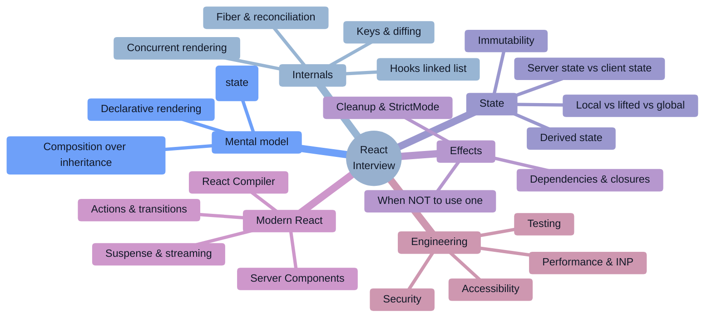

### Study strategy by company tier

| Tier | Companies | What they actually test | Time split |
|------|-----------|--------------------------|-----------|
| **FAANG frontend / UI specialist** | Meta, Google (Web), Netflix, Airbnb, Pinterest | **Build a component from scratch, no libraries** (autocomplete, tabs, infinite scroll) + a frontend system design round + React internals depth. Meta invented React and probes reconciliation and rendering behaviour hard. | 35% component build, 25% React internals, 25% FE design, 15% DSA |
| **FAANG general SWE** | Amazon, Microsoft, Apple | DSA first; React only if you claim it. Then: hooks correctness, state modelling, a11y basics. | 60% DSA, 20% React, 20% design |
| **High-bar product** | Stripe, Shopify, Databricks, Vercel, Linear-style | Practical React: a bug-fix round in a real repo, performance debugging, API/component design, TypeScript fluency. | 30% build/debug, 25% perf, 25% design, 20% DSA |
| **Indian product** | Walmart Global Tech, Flipkart, Swiggy, Zomato, PhonePe, Meesho, Zepto | **The heaviest React weighting.** Core internals (virtual DOM, reconciliation, keys, hooks rules, closures), polyfills, then a 90-minute machine-coding build. | 25% core React, 25% JS internals, 40% machine coding, 10% DSA |
| **Startups** | Seed → Series C | Ship a working feature end to end: form → API → optimistic UI → error/loading/empty states, then explain trade-offs. | 50% build-something, 30% debugging, 20% architecture chat |
| **Service companies** | TCS, Infosys, Wipro, Accenture, Cognizant, Capgemini, LTIMindtree | Rapid-fire theory: what is JSX, virtual DOM, props vs state, lifecycle, hooks list, `useEffect` basics, controlled components, Redux basics, routing. | 70% theory Q&A, 20% simple coding, 10% Redux/router |

### The 2026 shift you must internalize

> [!IMPORTANT]
> **"Explain the virtual DOM" is now a junior question — and a trap when asked to a senior.** In 2026 the interviewer is checking whether you recite the definition or *critique* it: the virtual DOM was never "fast," it's a **programming model** that makes declarative UI affordable, and React's actual performance story is Fiber, scheduling, and bailouts. Similarly, **"when do you use `useMemo`?"** now has a compiler-aware answer, and **"how do you fetch data?"** has an Actions/Suspense/server-state answer. Every canonical question below is paired with the **depth follow-up** that decides the hire.

> [!TIP]
> **The single highest-leverage sentence in a React interview:** *"Let me separate what React does at render time from what it does at commit time, and where this state actually lives."* Rendering, committing, and state ownership explain nearly every React bug, performance problem, and design decision.

---

# 1. 🌱 Beginner Concepts

## 1.1 What is React?

**React is a library for building user interfaces from composable components, where the UI is a pure function of state.** It is *not* a framework: it has no router, no data fetching, no form library, no build tool. Those come from the ecosystem (React Router, TanStack Query, Next.js, Vite).

The core idea in one line:

```
UI = f(state)
```

You never write "find the DOM node and change its text." You describe **what the UI should look like for a given state**, and React figures out the minimal set of DOM operations to get there.


**Canonical minimal component:**

```jsx
function Counter() {
  const [count, setCount] = useState(0);
  return (
    <button onClick={() => setCount(c => c + 1)}>
      Clicked {count} times
    </button>
  );
}
```

**What JSX actually compiles to** — a fact interviewers use to check depth:

```jsx
<Button variant="primary">Save</Button>
// ↓ (modern JSX transform, React 17+)
import { jsx as _jsx } from 'react/jsx-runtime';
_jsx(Button, { variant: 'primary', children: 'Save' });
// → returns a PLAIN OBJECT, not DOM:
// { $$typeof: Symbol(react.element), type: Button, key: null, props: { variant, children } }
```

> [!NOTE]
> **JSX is not HTML and not required.** It's syntax sugar for function calls that produce **element objects** — cheap descriptions of what you want. Creating them is not rendering. This distinction ("elements are descriptions, components are functions, instances are Fibers") is the foundation of every internals question.

## 1.2 Why does React exist? (History that gets asked)

| Year | Event | Why it matters in interviews |
|------|-------|------------------------------|
| **2011–13** | Built at Facebook for the ads/news-feed UI; open-sourced **2013**. Motivation: keeping many interdependent views in sync with mutating data was error-prone. | The origin problem is **consistency**, not speed. Say that. |
| **2015** | React Native; Redux appears; the Flux/unidirectional-data-flow model wins | Explains why "one-way data flow" is a core value. |
| **2016** | **Fiber** rewrite begins (shipped in React 16, 2017) | Made rendering interruptible — the foundation for everything concurrent. |
| **2017** | React 16: Fiber, error boundaries, portals, fragments | Error boundaries are still class-only. |
| **2019** | **Hooks** (16.8) | The single biggest API change ever; killed most class components and HOC/render-prop patterns. |
| **2020–22** | React 18: **concurrent rendering**, automatic batching, `useTransition`, `useDeferredValue`, `Suspense` for SSR streaming, `StrictMode` double-invoke in dev | Concurrency is opt-in via features, not a mode you switch on. |
| **Dec 2024** | **React 19**: Actions, `useActionState`, `useFormStatus`, `useOptimistic`, the `use` hook, **ref as a prop** (no `forwardRef`), document metadata, resource preloading, `<Context>` as provider, better hydration errors | The current baseline for "do you keep up?" |
| **Oct 2025** | **React Compiler 1.0** — automatic memoization, works with React 17+ | Changes the correct answer to every memoization question. |
| **2025–26** | **React 19.2**: `<Activity>`, `useEffectEvent`, React Performance Tracks in DevTools, partial pre-rendering, Suspense batching. Latest patch 19.2.7 (June 2026). **No React 20.** | The newest signal — and a chance to correct a common misconception. |

## 1.3 Problems React solves

| Problem | React's answer | Trade-off you MUST name |
|---|---|---|
| Manually syncing DOM with data (jQuery-era spaghetti) | Declarative rendering: describe the target UI, React diffs and patches | You give up fine-grained control; you must learn *when* React re-renders |
| Reusing UI logic across pages | **Components** — composition, not inheritance | Component boundaries become an architecture decision |
| Sharing stateful logic (not just markup) | **Custom hooks** (previously HOCs and render props) | Hook rules are strict; misuse causes subtle bugs |
| Unpredictable data flow in large apps | **Unidirectional data flow**: props down, events up | Prop drilling; you need context or a store past a few levels |
| Blocking the main thread on big updates | **Concurrent rendering**: interruptible work, `useTransition`, `useDeferredValue` | Rendering can be discarded/re-run — your render must be pure |
| Shipping too much JavaScript | **Server Components** + code splitting + streaming SSR | New mental model, framework coupling, and a new security surface |
| Manual memoization noise (`useMemo` everywhere) | **React Compiler** (1.0) auto-memoizes | It memoizes; it does **not** schedule — `useTransition` is still yours |
| Web + mobile from one team | React Native, react-three-fiber, custom renderers | The reconciler is renderer-agnostic; that's the actual architectural win |

## 1.4 Real-world analogies (interviewers remember these)

| Concept | Analogy |
|---|---|
| **Declarative UI** | A thermostat, not a furnace switch. You say "22°C" (state); the system works out what to turn on. You don't script the heating sequence. |
| **Virtual DOM / reconciliation** | An architect's revised blueprint. You submit a new full blueprint; the builder **diffs** it against the old one and only changes the walls that moved. The blueprint is cheap; touching the building is expensive. |
| **Keys** | Name tags on students in a photo line-up. Without them, if someone joins the front, the photographer assumes everyone shifted identity. With stable name tags, React knows Alice is still Alice — **which is why index keys corrupt state in reorderable lists**. |
| **Fiber** | A to-do list the renderer can put down and pick up. Old React was a single recursive call you couldn't interrupt; Fiber turned it into a linked list of small units of work that can be paused, resumed, or abandoned. |
| **`useState`** | A numbered locker per component instance. React hands out lockers **in call order** — which is exactly why you can't call hooks conditionally. |
| **`useEffect`** | A "after the paint is done, go sync with the outside world" note. It is **not** "run this when the component renders" — it's for synchronizing with systems outside React. |
| **Closure in an effect** | A photograph of the variables at the moment the effect was created. If you don't retake the photo (deps), you keep looking at an old picture — the **stale closure**. |
| **Server Components** | A chef who plates the dish in the kitchen and sends out the finished plate, instead of shipping you the raw ingredients and a recipe (JS bundle) to cook yourself. |
| **`useTransition`** | Telling React "this update is important, that one can wait." It doesn't make work faster — it changes **what gets to interrupt what**. |

## 1.5 Props vs state (and the derived-state trap)

| | Props | State |
|---|---|---|
| Owner | the parent | the component itself |
| Mutable by the component | ❌ read-only | ✅ via the setter |
| Triggers re-render on change | ✅ (parent re-rendered) | ✅ |
| Analogy | function arguments | a local variable that survives renders |

```jsx
// ❌ Derived state — a top-5 React bug: two sources of truth that drift apart
function Profile({ user }) {
  const [name, setName] = useState(user.name);   // stale if `user` changes later
  // ...
}

// ✅ Derive during render — no state, no sync bug, no effect
function Profile({ user }) {
  const displayName = user.name.trim() || 'Anonymous';
}

// ✅ If you truly need to reset state when an identity changes, use a key
<Profile key={user.id} user={user} />           // ⭐ remounts, state resets naturally
```

> [!WARNING]
> **"Don't copy props into state"** is one of the highest-yield rules in a React interview. If the parent later changes the prop, your copy is stale. The three correct answers are: **derive it during render**, **lift the state up**, or **reset with a `key`**.

## 1.6 The hooks you must know cold

```jsx
const [state, setState] = useState(initial);              // local state
useEffect(() => { /* sync */ return () => {/* cleanup */}; }, [deps]);   // external sync
const memo = useMemo(() => expensive(a, b), [a, b]);      // cache a value
const cb   = useCallback(() => doThing(id), [id]);        // cache a function identity
const ref  = useRef(initialValue);                        // mutable box, no re-render
const value = useContext(ThemeContext);                   // read context
const [state2, dispatch] = useReducer(reducer, init);     // complex state transitions
const id = useId();                                       // SSR-safe unique id for a11y
const [isPending, startTransition] = useTransition();     // mark updates non-urgent
const deferred = useDeferredValue(value);                 // lag a value behind
// React 19
const data = use(promiseOrContext);                       // read a promise/context (conditional OK!)
const [state3, action, pending] = useActionState(fn, init);
const { pending } = useFormStatus();
const [optimistic, addOptimistic] = useOptimistic(state, reducer);
// React 19.2
const onEvent = useEffectEvent(fn);                       // latest props/state, not a dependency
```

### The Rules of Hooks — and *why* they exist

1. **Only call hooks at the top level** — never inside conditions, loops, or nested functions.
2. **Only call hooks from React function components or custom hooks.**

**Why:** React stores hook state in an **ordered linked list** per component instance and matches calls to slots **by call order**, not by name. A conditional hook shifts every subsequent slot and your `useState` starts reading someone else's value.

```jsx
// ❌ this silently corrupts state on the render where `isOpen` flips
if (isOpen) { const [x] = useState(0); }
// ✅ hook first, condition inside
const [x] = useState(0);
if (isOpen) { /* use x */ }
```

> [!NOTE]
> **The React 19 exception worth naming:** the new **`use` hook can be called conditionally** and inside loops — it's deliberately not bound by the ordering rule, because it reads a resource rather than allocating a slot. Mentioning this is a strong "keeps up" signal.

## 1.7 Your first ten React idioms

```jsx
// 1. Functional updates — the only safe way when the new value depends on the old
setCount(c => c + 1);

// 2. Immutable updates — never mutate state
setItems(prev => [...prev, item]);
setUser(prev => ({ ...prev, name }));

// 3. Stable keys from domain ids, never the array index (for reorderable lists)
{items.map(item => <Row key={item.id} {...item} />)}

// 4. Conditional rendering — beware `&&` with numbers
{count > 0 && <Badge n={count} />}        // ✅
{count && <Badge n={count} />}            // ❌ renders a literal "0" when count is 0

// 5. Controlled input
<input value={q} onChange={e => setQ(e.target.value)} />

// 6. Cleanup in effects — always
useEffect(() => { const id = setInterval(tick, 1000); return () => clearInterval(id); }, []);

// 7. Lift state up to the closest common ancestor; pass callbacks down
// 8. Composition over configuration: pass JSX as children instead of 20 boolean props
<Card header={<Title />} footer={<Actions />}>{body}</Card>

// 9. Derive, don't store
const total = items.reduce((s, i) => s + i.price, 0);   // not useState + useEffect

// 10. Fragments to avoid wrapper divs
<>{a}{b}</>
```

## 1.8 Common beginner misconceptions ❌ → ✅

| ❌ Misconception | ✅ Reality |
|---|---|
| "The virtual DOM makes React fast" | The virtual DOM makes React **predictable**. Hand-written imperative DOM updates are *faster*; the VDOM buys you a declarative model at an acceptable cost. React's real performance work is Fiber, bailouts, and scheduling. |
| "React is a framework" | It's a UI library. Routing, data fetching, forms, and build tooling are all ecosystem choices (or a meta-framework like Next.js/Remix). |
| "Re-render means DOM update" | A re-render means React **called your function** and diffed the result. If nothing changed, **zero DOM operations** happen. Re-renders are usually cheap; the DOM commit is the expensive part. |
| "`useState` updates immediately" | Setters are **asynchronous and batched**. Reading the variable right after `setX(1)` still gives the old value in that render. |
| "`useEffect` runs when the component renders" | It runs **after the commit** (after paint, for the passive effect), and only when its dependencies changed. It's for **synchronizing with external systems** — not for computing derived data. |
| "`useEffect` is how you fetch data" | It's *a* way, and the worst one for most apps: race conditions, waterfalls, no caching, double-fetch in StrictMode. Use a server-state library (TanStack Query/SWR), a framework loader, or RSC. |
| "`useMemo`/`useCallback` make things faster" | They add work (allocation + comparison) to save work. Without a measured problem they're usually net-negative — and with the **React Compiler**, mostly unnecessary. |
| "StrictMode double-render is a bug" | It's a **dev-only** intentional double-invoke to surface impure renders and missing effect cleanups. It doesn't happen in production. |
| "Index keys are fine" | Fine only for static, append-only, never-reordered lists. Otherwise React reuses the wrong component instance and **state attaches to the wrong row**. |
| "Context is a state manager" | Context is **dependency injection**, not state management. Every consumer re-renders when the value changes — a naive global context is a performance footgun. |
| "You need Redux" | In 2026 most apps need a **server-state cache** (TanStack Query) plus a small client store (Zustand/Jotai) or just local state. Redux Toolkit is for genuinely complex shared client state. |
| "Server Components are just SSR" | SSR renders your client components to HTML then **hydrates** them. RSC components run **only on the server**, ship **zero JS** for themselves, and can touch the database directly — a different thing entirely. |
| "React 20 is out" | It is not. React 19.2 is current; some blog posts mislabel 19.2's features as "React 20." |

---

# 2. ⚙️ Intermediate Concepts

## 2.1 The render pipeline: render phase vs commit phase

**Nearly every React bug and performance question resolves to "which phase is this happening in?"**

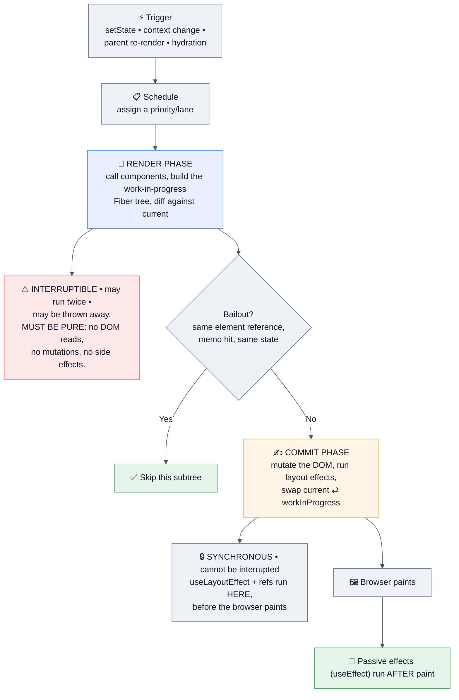

| | Render phase | Commit phase |
|---|---|---|
| Interruptible | ✅ (concurrent) | ❌ synchronous |
| May run twice | ✅ (StrictMode, concurrent retries) | ❌ |
| Safe to do side effects | **❌ never** | ✅ |
| Refs populated | ❌ (still `null` on the first render) | ✅ |
| `useLayoutEffect` | — | ✅ runs here, blocks paint |
| `useEffect` | — | after paint |

> [!IMPORTANT]
> **Why "your render must be pure" is not a style rule.** Concurrent React may start rendering, abandon it for a higher-priority update, and start again. If your component wrote to a module variable, mutated a prop, or called an API during render, that work happened twice — or happened for a tree that was never committed. This is also *why* StrictMode double-invokes in dev: to surface exactly those bugs early.

## 2.2 Fiber and reconciliation

**Fiber** is React's internal unit of work — a plain object per component instance holding its type, props, state, hooks, effect flags, and pointers (`child`, `sibling`, `return`). The tree of Fibers is a **linked list**, which is what makes rendering pausable: React can stop between units and resume later, because the "call stack" is data instead of the actual JS stack.

React keeps **two trees** (double buffering): `current` (what's on screen) and `workInProgress` (being built). On commit, it swaps the pointer — an atomic "the new UI is now live."

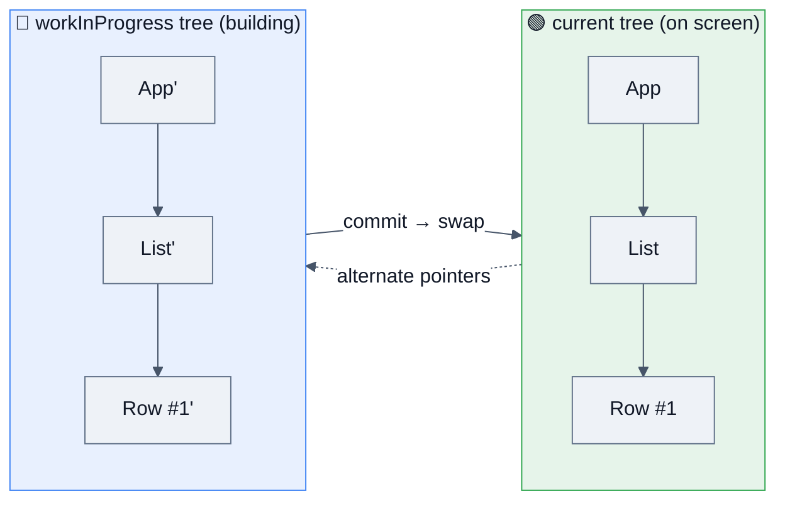

### The reconciliation heuristics (know these three)

1. **Different element type → destroy and rebuild.** `<div>` → `<span>`, or `ComponentA` → `ComponentB`, unmounts the whole subtree and **loses all its state**.
2. **Same type → keep the instance, update props**, and recurse into children.
3. **Lists are matched by `key`** within their parent. Without keys React falls back to index position.

```jsx
// The classic demonstration — this LOSES the input's text on every toggle
{isLoggedIn ? <div><Input /></div> : <span><Input /></span>}
// ✅ same type, state preserved
<div>{isLoggedIn ? <Input /> : <Input />}</div>

// Conditional component identity also remounts:
const Wrapper = isFancy ? FancyBox : PlainBox;   // ⚠️ switching remounts children
```

> [!WARNING]
> **The single most-asked internals question: "why do keys matter?"**
> Keys let React match old and new children **by identity rather than position**. With `key={index}`, prepending an item makes React think every row's props changed and that the last row is new — so component **state, DOM focus, and uncontrolled input values attach to the wrong rows**. Use a stable domain id. Index keys are acceptable only for lists that are static, never reordered, never filtered, and append-only.

**Also worth naming:** React's diff is a **heuristic O(n)** algorithm, not an optimal tree diff (which is O(n³)). It trades theoretical optimality for speed by assuming (a) different types produce different trees and (b) keys identify stable children — assumptions that hold for real UIs.

## 2.3 How hooks actually work

Each Fiber holds `memoizedState`: a **linked list of hook records**, appended in call order on the first render and walked in the same order on every subsequent render.

```js
// A ~20-line mental model of useState
let currentFiber, hookIndex;

function useState(initial) {
  const hooks = currentFiber.memoizedState;
  const hook = hooks[hookIndex] ?? (hooks[hookIndex] = {
    state: typeof initial === 'function' ? initial() : initial,
    queue: []
  });
  const i = hookIndex++;                                  // ⭐ position, not name
  const setState = (action) => {
    hook.queue.push(action);
    scheduleUpdate(currentFiber);                         // re-render, don't mutate now
  };
  // apply queued updates in order
  hook.state = hook.queue.reduce((s, a) => (typeof a === 'function' ? a(s) : a), hook.state);
  hook.queue = [];
  return [hook.state, setState];
}
```

This explains, in one model, **all** of these interview answers:
- Why hooks can't be conditional (indexes shift).
- Why `useState(expensiveInit())` runs the initializer every render but `useState(() => expensiveInit())` doesn't (**lazy initialization**).
- Why the setter identity is stable across renders (it's stored on the hook).
- Why calling `setState` with the same value **bails out** (React compares with `Object.is`).
- Why functional updates are required when batching several updates in one tick.

```jsx
// Batching + functional updates
setCount(count + 1);
setCount(count + 1);      // ❌ both read the same stale `count` → +1 total
setCount(c => c + 1);
setCount(c => c + 1);     // ✅ queued transformations → +2
```

> [!NOTE]
> **Automatic batching (React 18+)** applies everywhere — event handlers, promises, `setTimeout`, native handlers — not just React event handlers as in React 17. `flushSync(() => setX(1))` opts out when you genuinely need a synchronous DOM update (rare: measuring, scroll restoration).

## 2.4 `useEffect` — and when *not* to use it

**An Effect synchronizes your component with an external system.** If there's no external system, you probably don't need one.

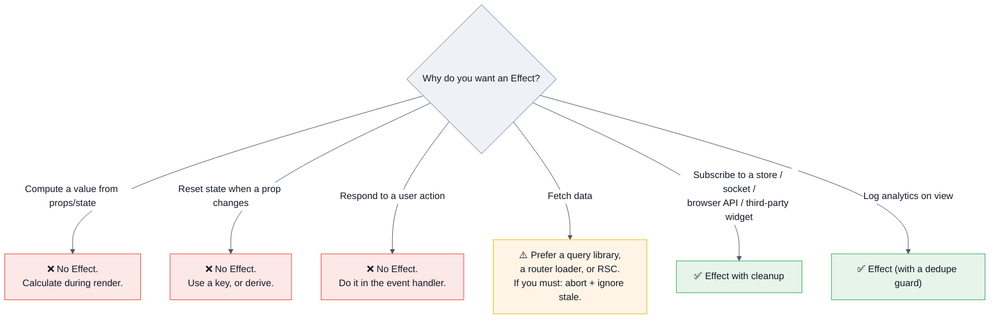

```jsx
// ❌ Effect used as a computation → an extra render, and a frame of stale UI
const [full, setFull] = useState('');
useEffect(() => { setFull(`${first} ${last}`); }, [first, last]);

// ✅ Derive during render
const full = `${first} ${last}`;
```

### The dependency array and the stale-closure problem

```jsx
// ❌ Stale closure: the interval callback captured `count` from the first render forever
useEffect(() => {
  const id = setInterval(() => setCount(count + 1), 1000);
  return () => clearInterval(id);
}, []);                                   // lying about deps

// ✅ Functional update — no dependency needed
useEffect(() => {
  const id = setInterval(() => setCount(c => c + 1), 1000);
  return () => clearInterval(id);
}, []);

// ✅ React 19.2 — read the LATEST value without making it a dependency
const onTick = useEffectEvent(() => { report(count, theme); });
useEffect(() => {
  const id = setInterval(onTick, 1000);   // effect doesn't re-run when count/theme change
  return () => clearInterval(id);
}, []);
```

> [!IMPORTANT]
> **Never lie to the dependency array.** The lint rule is right far more often than you are. If an effect re-runs too much, the fix is one of: a functional update, `useEffectEvent` (19.2), moving the function inside the effect, moving it outside the component, or realizing you didn't need an effect at all.

### Data fetching in an effect — the race condition

```jsx
useEffect(() => {
  const ac = new AbortController();
  let ignore = false;                          // ⭐ belt AND braces
  (async () => {
    try {
      const res = await fetch(`/api/users/${id}`, { signal: ac.signal });
      const data = await res.json();
      if (!ignore) setUser(data);              // ⭐ drop stale responses
    } catch (e) { if (e.name !== 'AbortError' && !ignore) setError(e); }
  })();
  return () => { ignore = true; ac.abort(); };  // ⭐ cleanup on id change AND unmount
}, [id]);
```
**Graded details:** the cleanup flag (a slow response for `id=1` must not overwrite `id=2`'s data), `AbortController`, and the honest statement that **a query library does this plus caching, dedupe, retries, and refetching** — which is why you'd use one.

### StrictMode double-invocation

In development, React 18+ **mounts, unmounts, and remounts** each component once, and double-invokes render and effect bodies. It's a bug detector: if your effect breaks when run twice, it's missing cleanup or it's doing something that isn't idempotent. **It does not happen in production.**

## 2.5 `useLayoutEffect`, `useRef`, and DOM access

| | `useEffect` | `useLayoutEffect` |
|---|---|---|
| Runs | after paint | after DOM mutation, **before paint** |
| Blocks paint | ❌ | ✅ |
| SSR | skipped (warns if used) | warns — guard it |
| Use for | subscriptions, fetching, analytics, most things | **measuring** the DOM and synchronously repositioning to avoid a visible flicker (tooltips, popovers, scroll restoration) |

```jsx
const ref = useRef(null);                  // mutable box; changing .current does NOT re-render
useLayoutEffect(() => {
  const { height } = ref.current.getBoundingClientRect();   // ✅ measure before paint
  setTooltipTop(triggerTop - height);
}, [content]);
```

**`useRef` has two jobs, and interviewers check both:** (1) hold a DOM node, (2) hold any mutable value that must persist across renders **without** causing a re-render (timer ids, previous values, "has mounted" flags, latest-callback boxes).

`🆕 React 19` — **`ref` is a normal prop for function components; `forwardRef` is no longer needed.** Ref callbacks can now return a cleanup function.

```jsx
function Input({ ref, ...props }) { return <input ref={ref} {...props} />; }   // React 19
<div ref={(node) => { observer.observe(node); return () => observer.unobserve(node); }} />
```

## 2.6 Context — dependency injection, not state management

```jsx
const ThemeContext = createContext('light');
// React 19: <Context> works directly as the provider
<ThemeContext value={theme}>{children}</ThemeContext>
const theme = useContext(ThemeContext);      // or use(ThemeContext) — conditional-safe
```

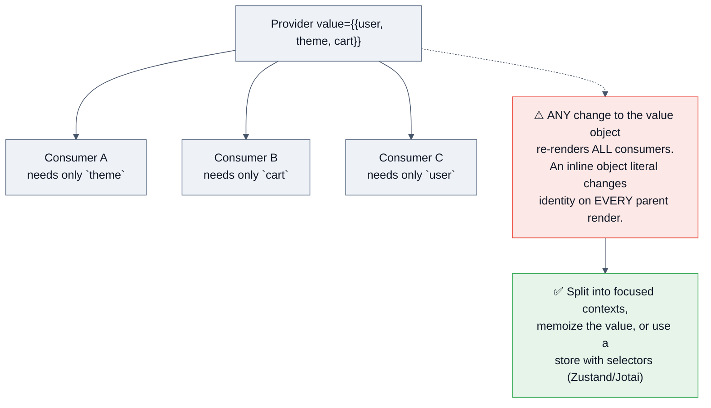

```jsx
// ❌ new object identity every render → every consumer re-renders
<AppContext value={{ user, theme }}>

// ✅ memoized, and split by change frequency
const authValue = useMemo(() => ({ user, login, logout }), [user]);
<AuthContext value={authValue}>
  <ThemeContext value={theme}>{children}</ThemeContext>
</AuthContext>
```

> [!TIP]
> **The senior framing:** *"Context solves prop drilling, not re-render performance. It has no selector mechanism — every consumer re-renders on any value change. For rarely-changing values (theme, locale, current user) it's perfect. For frequently-changing shared state I'd use a store with selectors so only the components reading the changed slice re-render."*

## 2.7 State management: the 2026 mental model

The community has converged on one distinction that makes every library choice obvious:

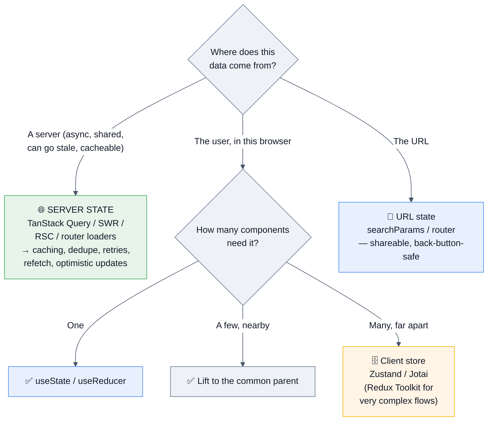

> [!IMPORTANT]
> **Say this sentence and most state-management questions collapse:** *"Most 'state management problems' are actually server-cache problems. Server state and client state are different problems that need different tools — a query library for anything that came from an API, and small local or store-based state for UI. Zustand plus TanStack Query is the pairing I'd default to in 2026; Redux Toolkit when the client state itself is genuinely complex."*

**Also mention URL state.** Filters, tabs, pagination, and search queries usually belong in the URL: shareable, bookmarkable, survives refresh, and the back button works.

## 2.8 Modern data flow: Actions, `use`, Suspense

`🆕 React 19` **Actions** turn "async function + pending + error + optimistic" into first-class primitives.

```jsx
function UpdateName() {
  const [state, submitAction, isPending] = useActionState(
    async (prevState, formData) => {
      const error = await updateName(formData.get('name'));
      if (error) return { error };
      redirect('/profile');
      return { error: null };
    },
    { error: null }
  );

  return (
    <form action={submitAction}>            {/* ⭐ form action, not onSubmit */}
      <input name="name" />
      <button disabled={isPending}>{isPending ? 'Saving…' : 'Save'}</button>
      {state.error && <p role="alert">{state.error}</p>}
    </form>
  );
}

// Pending state anywhere inside the form, without prop drilling
function SubmitButton() { const { pending } = useFormStatus(); return <button disabled={pending}>Save</button>; }

// Optimistic UI, with automatic revert on failure
const [optimisticLikes, addOptimisticLike] = useOptimistic(likes, (s, n) => s + n);
```

**The `use` hook** reads a promise or context and can be called **conditionally**:

```jsx
function Comments({ commentsPromise }) {
  const comments = use(commentsPromise);      // suspends until it resolves
  return comments.map(c => <p key={c.id}>{c.text}</p>);
}
<Suspense fallback={<Skeleton />}><Comments commentsPromise={p} /></Suspense>
```

> [!WARNING]
> **Don't create the promise inside the component that `use`s it** — a re-render would create a new promise and suspend forever. The promise must come from a cache, a framework loader, or a parent Server Component.

**Suspense** lets a component "pause" while data or code loads, showing the nearest fallback. Combined with `React.lazy` it gives code splitting; combined with streaming SSR it gives progressive HTML. `🆕 19.2` batches sibling Suspense reveals to reduce layout thrash, and adds partial pre-rendering (`prerender` + `resume`) for shells.

## 2.9 Error boundaries

```jsx
class ErrorBoundary extends React.Component {
  state = { error: null };
  static getDerivedStateFromError(error) { return { error }; }        // render phase → set fallback
  componentDidCatch(error, info) { report(error, info.componentStack); } // commit phase → log
  render() {
    return this.state.error
      ? this.props.fallback(this.state.error, () => this.setState({ error: null }))
      : this.props.children;
  }
}
```

| Caught | NOT caught |
|---|---|
| Errors during render | Event handler errors (use `try/catch`) |
| Errors in lifecycle methods | Async code / `setTimeout` / promise rejections |
| Errors in constructors of the subtree | Errors in the boundary itself |
| | SSR errors (handle separately) |

**Still class-only** — there is no hook equivalent; use `react-error-boundary` if you want a functional API. `🆕 React 19` adds root-level `onCaughtError` / `onUncaughtError` / `onRecoverableError` options for centralized reporting.

> [!TIP]
> **Placement is the real question.** One boundary at the root turns any bug into a white screen. Put boundaries **per route and per independent widget**, so a broken recommendations panel doesn't take down checkout. Pair each with a retry affordance and a `key` reset.

---

# 3. 🚀 Advanced Concepts

*Everything a senior/staff React engineer is expected to reason about unprompted.*

## 3.1 Concurrent rendering and the scheduler

React 18+ can **interrupt, pause, resume, and abandon** a render. Updates are assigned **lanes** (priorities); a high-priority update (a keystroke) can preempt an in-progress low-priority render (filtering 10,000 rows).

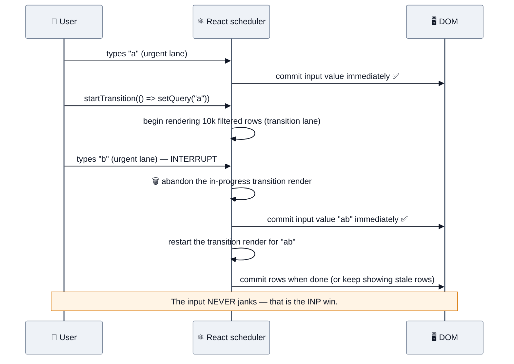

| Tool | What it does | Use when |
|---|---|---|
| `useTransition` | Marks updates inside `startTransition` as non-urgent; gives `isPending` | You own the state setter — tab switches, filtering, navigation |
| `useDeferredValue` | Renders with a lagging copy of a value; the old UI stays until the new render is ready | You receive a value as a prop and can't wrap the setter |
| `<Suspense>` | Declarative loading boundary | Async data or lazily-loaded code |
| `<Activity>` `🆕 19.2` | Hide/show a subtree while **preserving its state** (and deprioritizing its rendering) | Tabs, back-navigation, prerendering a likely-next screen |
| `flushSync` | Forces a synchronous commit | Measuring immediately after an update (rare; hurts performance) |

```jsx
// useTransition: keep the keystroke instant, let the list catch up
const [isPending, startTransition] = useTransition();
function onChange(e) {
  setInput(e.target.value);                       // urgent — paints immediately
  startTransition(() => setQuery(e.target.value)); // non-urgent — interruptible
}

// useDeferredValue: same effect when you only have the value
const deferredQuery = useDeferredValue(query);
const results = useMemo(() => filter(items, deferredQuery), [items, deferredQuery]);
const isStale = query !== deferredQuery;          // dim the list while catching up
```

> [!IMPORTANT]
> **The 2026 framing that separates seniors:** *"The React Compiler memoizes, but it does not schedule. `useTransition` and `useDeferredValue` remain explicit, intentional INP tools — they don't make the work faster, they let React mark it as interruptible so the main thread can paint the keystroke first."* That distinction is exactly what interviewers are probing when they ask "does the compiler make `useTransition` obsolete?" (It does not.)

## 3.2 The React Compiler

**React Compiler 1.0 (October 2025)** is a build-time tool that automatically memoizes components and values by understanding your code's data flow — replacing most hand-written `useMemo`, `useCallback`, and `React.memo`. It works with **React 17+** and is **opt-in and separate** from React 19.

```jsx
// You write this…
function ProductList({ products, filter }) {
  const visible = products.filter(p => p.category === filter);
  const onSelect = (id) => analytics.track('select', id);
  return visible.map(p => <Product key={p.id} product={p} onSelect={onSelect} />);
}
// …the compiler emits memoized equivalents of `visible` and `onSelect`,
// and skips re-rendering <Product> when its inputs are unchanged.
```

| What it does | What it does **not** do |
|---|---|
| Auto-memoize values, callbacks, and component output | Schedule work (`useTransition` is still yours) |
| Reduce re-renders across a whole codebase uniformly | Fix an O(n²) algorithm or a slow API |
| Enforce the Rules of React (it **bails out** on code it can't prove safe) | Help components that mutate props/state or have impure renders |
| Remove memoization boilerplate | Replace virtualization for huge lists |

**Adoption answer:** enable it incrementally (per-directory or with the `"use memo"` directive depending on setup), run `eslint-plugin-react-compiler` first to find rule violations, measure with the Profiler before/after, and keep manual memoization only where you've proven the compiler bailed out.

> [!WARNING]
> **The compiler is only as good as your purity.** It bails out of components that mutate values during render, read/write module-level variables, or otherwise break the Rules of React — silently leaving them unoptimized. "We turned it on and saw no improvement" is usually a purity problem, and the lint plugin will tell you where.

## 3.3 Server Components, SSR, and the rendering spectrum

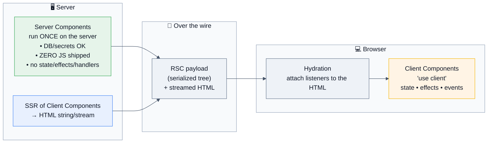

| | CSR | SSR | SSG | ISR | **RSC** |
|---|---|---|---|---|---|
| Where components run | browser | server → hydrate on client | build time | build + revalidate | **server only** (plus client components) |
| JS shipped for that component | full | full (must hydrate) | full | full | **zero** |
| Can access DB/secrets directly | ❌ | ❌ | ✅ at build | ✅ | ✅ |
| Interactivity | ✅ | ✅ | ✅ | ✅ | ❌ (compose with client components) |
| Best for | dashboards behind auth | content + personalization | docs, marketing | catalogs | data-heavy trees, big dependencies |

**The RSC rules to state precisely:**
- Server Components: **no** `useState`/`useEffect`/event handlers/browser APIs; **can** be `async` and `await` data directly.
- `'use client'` marks a **boundary**: that module and everything it imports goes to the client.
- You can pass Server Components **as `children`** into Client Components — that's how you keep an interactive shell around server-rendered content without pulling it client-side.
- Props crossing the boundary must be **serializable** (no functions, no class instances) — except Server Actions, which are references.

```jsx
// app/page.jsx — a Server Component
export default async function Page() {
  const products = await db.products.findMany();     // ✅ direct DB access, zero client JS
  return <ProductGrid>{products.map(p => <ProductCard key={p.id} p={p} />)}</ProductGrid>;
}
// ProductGrid.jsx
'use client';
export default function ProductGrid({ children }) {  // ⭐ server children inside a client shell
  const [layout, setLayout] = useState('grid');
  return <div className={layout}>{children}</div>;
}
```

**Hydration** is the cost people forget: the server sends HTML, then the client downloads the JS, rebuilds the tree, and attaches listeners. Until that finishes, the page **looks** ready but isn't interactive — a major INP contributor. Mitigations: ship less client JS (RSC), selective/progressive hydration, streaming with Suspense, and islands.

> [!WARNING]
> **Hydration mismatches** (`Date.now()`, `Math.random()`, `window`/`localStorage`, locale-dependent formatting, browser-extension DOM injection) cause React to discard the server HTML and re-render on the client — destroying the SSR benefit and sometimes flashing wrong content. React 19 improved the error messages to show a diff. Fix with `useEffect`-deferred rendering, `suppressHydrationWarning` for genuinely dynamic bits, or `useSyncExternalStore` with a server snapshot.

## 3.4 Trade-offs a staff engineer must be able to argue

| Decision | Option A | Option B | How to decide |
|---|---|---|---|
| Rendering | CSR SPA | SSR/RSC (Next.js/Remix) | SEO, first paint on low-end devices, and content-heaviness push you to the server; auth-walled highly-interactive tools are fine as CSR. Hybrid per-route is the 2026 default. |
| Memoization | manual `useMemo`/`memo` | **React Compiler** | Compiler by default once purity is clean; manual only where profiling shows a bailout. |
| Server state | `useEffect` + fetch | TanStack Query / RSC / loaders | Never hand-roll caching, dedupe, retries, and refetch. |
| Client state | Context | Zustand/Jotai | Context for rarely-changing values; a store with selectors when the value changes often or the tree is wide. |
| Forms | controlled state | uncontrolled + Actions / react-hook-form | Controlled per keystroke re-renders the form; uncontrolled + `FormData` + Actions is now idiomatic and faster. |
| Styling | CSS Modules / Tailwind | runtime CSS-in-JS | Runtime CSS-in-JS costs main-thread work and complicates RSC. Prefer compile-time or utility CSS. |
| Lists | render all | virtualize | > ~200 rows, or any row with heavy content. |
| Types | PropTypes/JS | TypeScript | TS is table stakes at product companies; pair with runtime validation at API boundaries. |
| Testing | shallow/unit-heavy | RTL behaviour tests + a few E2E | Test what the user does; implementation-detail tests break on every refactor. |
| Framework | plain React + Vite | Next.js / Remix | Meta-framework when you need SSR/routing/data conventions; plain Vite for internal tools and embedded widgets. |

## 3.5 Edge cases interviewers use to separate levels

```jsx
// 1. Index keys corrupt state on reorder
{items.map((it, i) => <Row key={i} {...it} />)}      // prepend → wrong row keeps focus/state

// 2. Conditional element type unmounts the subtree
{a ? <div><Video/></div> : <span><Video/></span>}    // video restarts

// 3. Object/array literals as props defeat memo
<Child style={{ color: 'red' }} items={[]} />        // new identity every render

// 4. Component defined inside a component
function Parent() { function Child() {...} return <Child/>; }   // ❌ remounts every render, state lost

// 5. `&&` with a number renders "0"
{items.length && <List/>}                            // renders 0; use `> 0`

// 6. Stale closure in a callback stored in a ref/timer
// 7. setState in render → infinite loop (React throws "Too many re-renders")
// 8. Mutating state then setting it
items.push(x); setItems(items);                      // same reference → bailout, no re-render

// 9. useEffect with an object/array dependency
useEffect(fn, [{ a: 1 }]);                           // new identity every render → runs always

// 10. Async setState after unmount
// (React 18+ no longer warns, but the work is wasted — still abort/ignore)

// 11. Portals bubble events through the REACT tree, not the DOM tree
// 12. Context default value is used only when there is NO provider above
```

## 3.6 Performance model: why components re-render

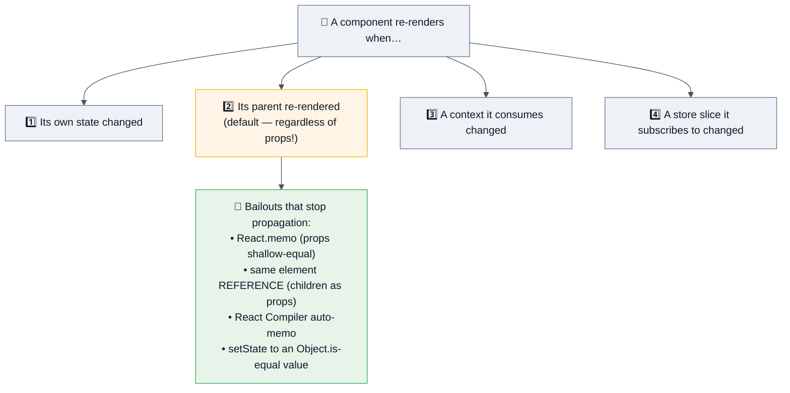

**The composition trick most candidates don't know** — no `memo` required:

```jsx
// ❌ <ExpensiveTree/> re-renders on every keystroke
function Page() {
  const [q, setQ] = useState('');
  return <><input value={q} onChange={e=>setQ(e.target.value)} /><ExpensiveTree /></>;
}

// ✅ pass it as children: the element object is created by an OUTER component
// that doesn't re-render, so its reference is stable → React bails out
function Page({ children }) {
  const [q, setQ] = useState('');
  return <><input value={q} onChange={e=>setQ(e.target.value)} />{children}</>;
}
<Page><ExpensiveTree /></Page>
```

**`React.memo` caveats interviewers probe:** it does a **shallow** props comparison, so inline objects/arrays/functions defeat it (the compiler fixes most of this); a custom comparator that's expensive can cost more than the render; and `memo` does **not** stop re-renders caused by context or by the component's own state.

## 3.7 Memory and leaks in React apps

| Leak | Cause | Fix |
|---|---|---|
| Detached DOM | Listeners/observers not cleaned up in an effect | Always return a cleanup; use one `AbortController` per effect |
| Timers | `setInterval` without `clearInterval` | Cleanup function |
| Subscriptions | Store/socket subscribe without unsubscribe | Cleanup; or `useSyncExternalStore` |
| Growing caches | Module-level `Map` keyed per user/route | Bound with an LRU + TTL; `WeakMap` for object keys |
| Closures over big data | A callback in a long-lived store capturing a huge prop | Store ids, not objects; null out large locals |
| Query cache | Unbounded query keys (e.g. keyed by timestamp) | Stable keys + `gcTime`/`cacheTime` |

```jsx
// One controller kills every listener in the effect
useEffect(() => {
  const ac = new AbortController();
  window.addEventListener('resize', onResize, { signal: ac.signal });
  el.addEventListener('scroll', onScroll, { signal: ac.signal });
  return () => ac.abort();
}, []);
```

**Diagnosis:** Chrome DevTools → Memory → three heap snapshots (baseline → interact/navigate → after GC) → filter **"Detached"** → follow the **retainer chain** to the GC root. In React apps the retainer is usually a listener, a store subscription, or a cache.

## 3.8 Accessibility (a real scoring dimension at Meta/Google/Shopify)

| Requirement | React implementation |
|---|---|
| Semantic HTML first | `<button>`, `<nav>`, `<main>` — ARIA only when semantics can't express it |
| Keyboard operability | Every interactive element focusable; visible focus ring; ↑↓/Enter/Esc for composite widgets |
| Focus management | `useRef` + `focus()` on route change, modal open/close, and after deletions; restore focus on close |
| Labels & ids | `useId()` for SSR-safe unique ids linking `<label htmlFor>` |
| Live regions | `aria-live="polite"` for async results; `role="alert"` for errors |
| Modals | Focus trap, `Esc` to close, `inert`/`aria-hidden` on the background, scroll lock without layout shift |
| Lists/comboboxes | The ARIA combobox pattern: `role`, `aria-expanded`, `aria-activedescendant` |
| Testing | `jest-axe`/`axe-core` in CI; test by role and accessible name in RTL |

> [!TIP]
> **Virtualization breaks accessibility unless you handle it.** Screen readers need `aria-setsize` and `aria-posinset` when only 20 of 10,000 rows are in the DOM. Mentioning this unprompted in an infinite-scroll design round is a genuine differentiator.

## 3.9 Distributed-systems concerns in a React app

| Concern | React-side answer |
|---|---|
| **Optimistic UI + rollback** | `useOptimistic` (or the query library's `onMutate`/`onError` rollback); the server is the source of truth |
| **Idempotency** | Generate a key client-side (`crypto.randomUUID()`) and send it with the mutation so a retry can't double-charge |
| **Race conditions** | Sequence guards + `AbortController`, or a query library that cancels/dedupes for you |
| **Retries** | Exponential backoff with jitter, only on 5xx/429/network; never on 4xx |
| **Offline** | Service worker + a mutation queue + conflict resolution (LWW or CRDT) |
| **Stale data** | `staleTime`/`gcTime` policy per query; `stale-while-revalidate` UX (show old data, refresh quietly) |
| **Version skew** | An old cached bundle calling a new API — version your API and handle a `ChunkLoadError` with a one-time hard reload |
| **Clock skew** | Never order events by client time; use server timestamps |
| **Multi-tab consistency** | `BroadcastChannel` or storage events to sync auth/logout across tabs |

## 3.10 Cost optimization

| Cost | React lever |
|---|---|
| **CDN egress** | Route-level code splitting, tree-shaking, modern-only bundles, image formats (AVIF/WebP), content-hashed immutable assets |
| **SSR compute** | Cache HTML at the edge, ISR/SSG where possible, RSC to avoid shipping and re-executing logic, keep cold starts small |
| **Third-party scripts** | Each tag costs money **and** INP — quarterly audit, facade pattern, load on interaction |
| **Observability** | Sample RUM/traces, cap metric cardinality, drop debug logs in prod |
| **Engineering time** | A design system + codemods + a paved-path template beats per-team reinvention |

## 3.11 Failure recovery in the UI

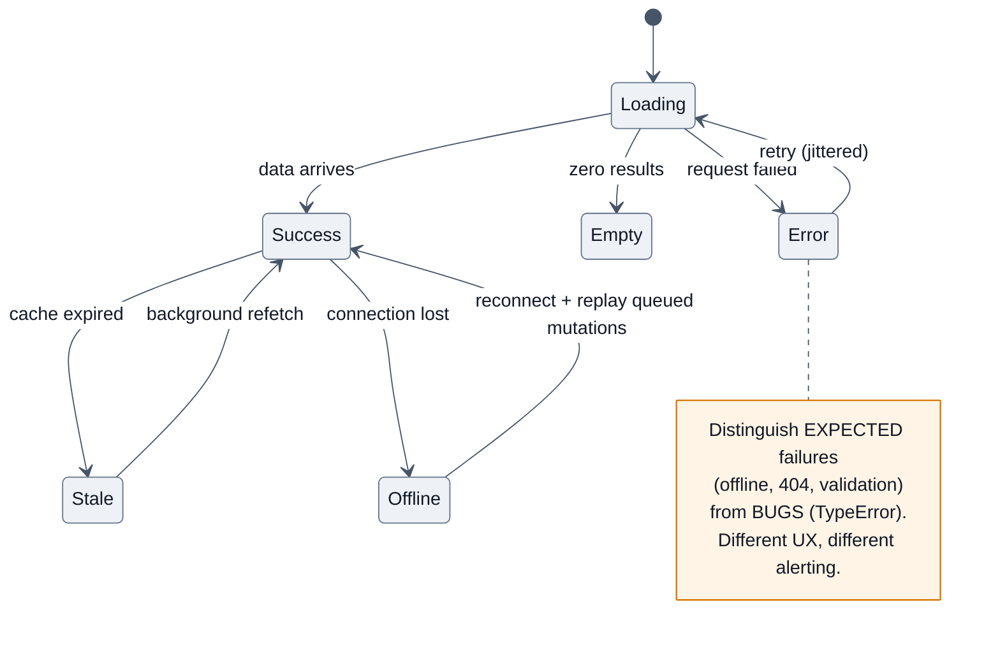

**The UI resilience checklist:** error boundaries per route **and** per widget · every async view models loading/empty/error/success explicitly · skeletons sized to final content (no CLS) · a retry button that actually retries · offline banner + queued mutations · feature flags with a kill switch · `ChunkLoadError` → one-time reload with a loop guard · never let one failed widget blank the page.

---

# 4. 🎤 Interview Questions by Level

**Rating legend:** ★★★★★ Must know (asked in >50% of loops) · ★★★★☆ Very common · ★★★☆☆ Situational/differentiator

---

## 4.1 Beginner (0–2 yrs · SDE-1 · service companies)

### Q1. What is React and why use it? ★★★★★

**Why interviewers ask it:** it's the fastest way to see whether you understand the *model* or just the syntax.

**Expected answer:** A library for building UIs from composable components where **UI is a pure function of state**. You declare what the UI should look like; React reconciles the difference and applies minimal DOM updates. Benefits: predictable data flow, reusable components, a huge ecosystem, and one model for web + native. It is **not** a framework — routing, data fetching, and forms come from elsewhere.

**Follow-ups:** *"What problem was it originally built to solve?"* → keeping many interdependent views consistent with mutating data, not raw speed. *"What does React NOT give you?"* → router, data layer, forms, build tooling, opinions.

---

### Q2. What is JSX? ★★★★★
Syntax sugar that compiles to `jsx()`/`createElement()` calls returning **plain element objects**. Not HTML: `className`, `htmlFor`, camelCase events, `{}` for expressions, must return a single root (or a Fragment). **Follow-up:** *"Is JSX required?"* → no, it's optional sugar. *"What does it compile to?"* → show the object.

---

### Q3. Virtual DOM and reconciliation ★★★★★
A lightweight in-memory tree of element objects. On update React builds a new tree and **diffs** it against the previous one, then commits only the necessary DOM mutations. **The senior addition (say it even as a junior):** the virtual DOM isn't faster than hand-tuned imperative DOM code — it makes a **declarative** model affordable.

**Follow-ups:** the three diffing heuristics; why keys matter; what "O(n) heuristic instead of O(n³) optimal" means.

---

### Q4. Props vs state ★★★★★
Props are read-only inputs from the parent; state is component-owned and mutable via its setter. **Follow-up:** *"Can you modify props?"* → no; lift the state up or pass a callback. *"Should you copy props into state?"* → no — derive during render, lift, or reset with a `key`.

---

### Q5. What are hooks and what are the rules? ★★★★★
Functions that let function components use state and other React features. **Rules:** top level only, and only from components or custom hooks. **Why:** hook state is stored in a per-Fiber linked list matched **by call order**. *(React 19's `use` is the deliberate exception.)*

---

### Q6. `useState` and `useEffect` basics ★★★★★
`useState` returns `[value, setter]`; the setter is async and batched; pass a function for lazy init and for updates that depend on the previous value. `useEffect(fn, deps)` runs after commit when deps change, and its returned function cleans up.

**Follow-ups:** the three dependency forms — no array (every render), `[]` (mount only), `[a, b]` (when those change). *"What's a cleanup function for?"* → intervals, subscriptions, listeners, aborting requests.

---

### Q7. Why do lists need keys? ★★★★★
So React can match children by identity rather than position. **Index keys break** on reorder/insert/delete: state, focus, and uncontrolled inputs attach to the wrong item. Use a stable domain id.

---

### Q8. Controlled vs uncontrolled components ★★★★★
Controlled: React state is the source of truth (`value` + `onChange`) — validation, formatting, and conditional UI are easy, but you re-render per keystroke. Uncontrolled: the DOM holds the value, read via a `ref` or `FormData` — less code, better performance, and now idiomatic with React 19 form Actions.

---

### Q9. Conditional rendering and lists ★★★★☆
Ternary, `&&`, early return, `.map`. **The trap:** `{count && <X/>}` renders a literal `0`. Use `{count > 0 && …}`.

---

### Q10. What is prop drilling and how do you avoid it? ★★★★☆
Passing props through layers that don't use them. Fixes: **composition** (pass JSX as `children` — the underused answer), Context for rarely-changing values, or a store for frequently-changing shared state.

---

### Q11–20 Rapid-fire (service-company round)

| Q | Rating | One-line answer |
|---|---|---|
| Class vs function components | ★★★★☆ | Functions + hooks are the standard; classes only for error boundaries and legacy |
| Component lifecycle in hooks | ★★★★☆ | mount = `useEffect(fn, [])`; update = deps; unmount = the cleanup function |
| `useMemo` vs `useCallback` | ★★★★☆ | Cache a **value** vs cache a **function identity**; `useCallback(f, d)` ≡ `useMemo(() => f, d)` |
| What is `useRef` for? | ★★★★☆ | DOM nodes, and mutable values that persist without re-rendering |
| What is a Fragment? | ★★★☆☆ | Group children without a wrapper DOM node (`<>…</>`) |
| Default props / prop types | ★★☆☆☆ | Default parameters; PropTypes is legacy — TypeScript now |
| How do you style components? | ★★★☆☆ | CSS Modules, Tailwind, CSS-in-JS (runtime cost), plain CSS |
| How do you do routing? | ★★★★☆ | React Router (or a framework router); routes, params, nested layouts, lazy routes |
| What is Redux, in one line? | ★★★★☆ | A predictable global store (actions → reducer → new state); Redux Toolkit is the modern API |
| How do you fetch data? | ★★★★★ | A query library / framework loader / RSC — `useEffect` + fetch only as a last resort, and then with abort + stale-guard |

---

## 4.2 Intermediate (2–5 yrs · SDE-2)

### Q1. Explain the render phase vs the commit phase. ★★★★★
The §2.1 answer. **The differentiator:** naming that the render phase is interruptible, may run twice, and **must be pure** — and that this is *why* StrictMode double-invokes, *why* refs are null during render, and *why* `useLayoutEffect` exists (it runs in the commit phase, before paint).

---

### Q2. What is Fiber and why was it built? ★★★★★
A per-instance unit of work forming a linked-list tree, with double buffering (`current` / `workInProgress`). It replaced a synchronous recursive reconciler so rendering could be **paused, resumed, prioritized, and abandoned** — the prerequisite for concurrent features.

**Follow-ups:** *"What are lanes?"* → priority buckets for updates. *"What does 'React can throw away a render' mean for my code?"* → your components must be pure and side-effect-free during render.

---

### Q3. Why exactly do index keys cause bugs? ★★★★★
Walk through prepending to a list: with `key={index}`, React matches new item 0 to old item 0, so it *updates props in place* instead of inserting — component **state, focus, and uncontrolled input values stay with the position, not the data**. Demonstrate with a list of `<input>`s.

---

### Q4. When should you NOT use `useEffect`? ★★★★★
The §2.4 decision tree: computing derived values (calculate during render), resetting state on prop change (use a `key`), responding to a user action (do it in the handler), and — mostly — data fetching (use a query library/loader/RSC). **This question is a 2026 favourite** because effect overuse is the most common React code smell.

---

### Q5. Explain the stale closure problem. ★★★★★
A callback created in one render captures that render's variables. If it outlives the render (timer, subscription, event listener, a function stored in a ref) it keeps reading old values. **Fixes:** functional updates, correct dependencies, `useEffectEvent` (19.2), or a ref holding the latest callback. **This is consistently reported as a top-two senior question** because it tests JS closures and React internals simultaneously.

---

### Q6. `useMemo`, `useCallback`, `React.memo` — when and why? ★★★★★
**The 2026 answer:** *"By default, I don't. The React Compiler auto-memoizes since 1.0, and manual memoization has a real cost — allocation, comparison, and complexity. I reach for it when the Profiler shows an expensive computation re-running, when a stable identity is required for a dependency array or a memoized child, or when the compiler bailed out."* Then explain the shallow-comparison caveat and how inline objects defeat `memo`.

---

### Q7. What's new in React 19 (and 19.2)? ★★★★★
**19:** Actions + `useActionState`/`useFormStatus`/`useOptimistic`, the `use` hook, **ref as a prop** (no `forwardRef`), `<Context>` as provider, document metadata hoisting, resource preloading, ref cleanup functions, better hydration diffs, root error-handling options.
**19.2:** `<Activity>` (hide a subtree while **preserving state**), `useEffectEvent`, React Performance Tracks in DevTools, partial pre-rendering, Suspense reveal batching.
**Bonus credit:** the React Compiler hit **1.0 in Oct 2025**, works with React 17+, and is **separate** from React 19. And there is **no React 20**.

---

### Q8. Context: what is it good for and what's the cost? ★★★★★
Dependency injection to avoid prop drilling. **The cost:** no selectors — every consumer re-renders when the value changes, and an inline object literal changes identity every render. Fixes: memoize the value, split contexts by change frequency, or use a store with selectors.

---

### Q9. How do you handle forms? ★★★★☆
Controlled for per-keystroke validation; uncontrolled + `FormData` for performance and simplicity; `react-hook-form` for large forms (uncontrolled under the hood, minimal re-renders); **React 19 Actions** for submission with built-in pending/error/optimistic state. Cover validation (schema at the boundary), accessibility (labels, `aria-describedby` for errors, focus the first error), and never trusting client-side validation.

---

### Q10. How do you optimize a slow React page? ★★★★★
**The funnel:** measure with the **Profiler** first (what renders, how long, and *why*) → fix the biggest cause: unnecessary re-renders (memo/composition/store selectors), expensive computation (memoize or move to a worker), too many DOM nodes (virtualize), too much JS (code split), or a slow network waterfall (parallel fetch/prefetch). Then use `useTransition`/`useDeferredValue` for interaction responsiveness, and verify with **field INP**, not a local Lighthouse run.

---

### Q11. Custom hooks — what makes a good one? ★★★★☆
Extract **stateful logic**, not markup. It's a plain function starting with `use` that calls hooks. Good ones have a clear single purpose, stable return identity where needed, cleanup, and no hidden global state. **Follow-up:** *"Do two components using the same hook share state?"* → **No** — each call gets its own state. That's the classic check.

---

### Q12. Testing React ★★★★☆
React Testing Library: query by **role/label/text**, not implementation details; `userEvent` over `fireEvent`; MSW for network; `waitFor`/`findBy` for async; `jest-axe` for a11y. Test behaviour ("submitting shows an error") not internals ("state.x is true"). A few Playwright E2E tests for critical journeys.

---

### Q13. Rapid-fire intermediate

| Q | Rating | Core |
|---|---|---|
| `useLayoutEffect` vs `useEffect` | ★★★★☆ | Before paint (blocking, for measurement) vs after paint |
| What does StrictMode do? | ★★★★☆ | Dev-only double-invoke to surface impure renders and missing cleanup |
| Error boundaries — what do they catch? | ★★★★☆ | Render/lifecycle errors; **not** events, async, or SSR |
| Portals | ★★★☆☆ | Render into another DOM node; events still bubble through the **React** tree |
| `useReducer` vs `useState` | ★★★★☆ | Reducer for multi-field transitions, related updates, and testable logic |
| `useId` | ★★★☆☆ | SSR-safe unique ids for label/aria wiring |
| `useSyncExternalStore` | ★★★☆☆ | Subscribe to an external store safely under concurrent rendering (tearing-free) |
| Lazy loading & Suspense | ★★★★☆ | `React.lazy` + `<Suspense>`; split at route boundaries first |
| Automatic batching | ★★★★☆ | React 18 batches everywhere, not just React events |
| Why is my component rendering twice? | ★★★★☆ | StrictMode in dev — not a bug, not in production |

---

## 4.3 Senior (5–8 yrs)

### Q1. The app janks when the user types in a search box over 10,000 rows. Fix it. ★★★★★

**Expected answer (as a funnel):**
1. **Measure** — Profiler: is it one slow component, thousands of cheap ones, or a long task? Check field **INP** (threshold: **≤200 ms at p75**) to confirm real users see it.
2. **Keep the input urgent** — `setInput` immediately; wrap the expensive `setQuery` in `startTransition` (or `useDeferredValue` if you only receive the value). This doesn't speed anything up; it lets React paint the keystroke first.
3. **Reduce the work** — memoize the filter, index the data (Map/trie), or move filtering to a Web Worker.
4. **Reduce the DOM** — virtualize the list; only ~20 rows in the DOM.
5. **Stop the cascade** — memoized rows / store selectors so unrelated components don't re-render.
6. **Verify** — INP p75 in RUM, and a Profiler recording showing the render is now interruptible.

**Follow-up:** *"Does the React Compiler fix this?"* → **No.** It memoizes; it doesn't schedule. Concurrency is still explicit.

---

### Q2. Explain Server Components and when you'd use them. ★★★★★
The §3.3 answer: RSC run only on the server, ship zero JS for themselves, can touch the DB/secrets directly, and cannot use state/effects/handlers. `'use client'` is a **boundary**, and Server Components can be passed as `children` into client components. **When:** data-heavy trees, pages dominated by content, or components with big dependencies (markdown, syntax highlighting, date libraries). **When not:** highly interactive UIs, or teams that can't take the framework coupling. **Add the 2026 caveat:** RSC has had real high-severity CVEs (Dec 2025, May 2026) — patching discipline is part of the answer.

---

### Q3. Design the state architecture for a large app. ★★★★★
§2.7: **server state ≠ client state**. Query library for anything from an API (caching, dedupe, retries, refetch, optimistic updates); URL for filters/tabs/pagination; local state by default; a store with selectors only for genuinely shared, frequently-changing client state. Then: normalization for relational data, invalidation strategy, optimistic updates with rollback, and how you'd prevent the store becoming a dumping ground (ownership rules, lint boundaries).

---

### Q4. A page memory-leaks after navigating between routes 20 times. Diagnose. ★★★★☆
Three heap snapshots → filter **Detached** nodes → follow the **retainer chain**. React-specific suspects: effects without cleanup, listeners/observers not disconnected, store subscriptions, timers, a module-level cache keyed per route, closures capturing large props in a long-lived store, and an unbounded query cache. Fix, then verify the heap is flat after GC under the same navigation loop.

---

### Q5. How would you adopt the React Compiler across a large codebase? ★★★★☆
Run `eslint-plugin-react-compiler` first and fix Rules-of-React violations (that's the real work) → enable incrementally per directory → measure with the Profiler and field INP before/after → **remove manual memoization only after** confirming the compiler didn't bail out → keep a list of intentional exceptions → note that it works on React 17+, so you don't need a React 19 migration first. Define kill criteria and how you'd roll back.

---

### Q6. When would you argue *against* Next.js/RSC? ★★★★☆
Framework and hosting coupling; a new mental model for a large team; harder debugging across the server/client boundary; ecosystem gaps for client-only libraries; server infrastructure and cost where you previously shipped static files; and a **new security surface** (the RSC/Next CVEs of 2025–26). Counterweight honestly: less client JS, no client-side data waterfalls, better LCP on low-end devices. **Decide, then say how you'd pilot and unwind.**

---

### Q7. How do you keep a 200-component design system consistent and fast? ★★★★☆
Tokens (CSS variables) over runtime CSS-in-JS; tree-shakeable ESM exports and deep imports (no giant barrel file); SSR-safe (no `window` at import time); a11y tested in CI with axe; visual regression tests; semver + changesets + codemods for breaking changes; a bundle-size budget on the library itself; documented composition patterns so consumers don't fork components.

---

### Q8. Rapid-fire senior

| Q | Rating | Core |
|---|---|---|
| How do you prevent a re-render cascade without `memo`? | ★★★★☆ | Pass expensive subtrees as `children` — the element reference stays stable |
| Tearing under concurrent rendering | ★★★☆☆ | Two parts of the tree read different values of an external store mid-render → `useSyncExternalStore` |
| How do you handle version skew after a deploy? | ★★★★☆ | Keep old chunks on the CDN, `no-cache` HTML, catch `ChunkLoadError` → one hard reload with a loop guard |
| Hydration mismatch — causes and fixes | ★★★★☆ | Non-deterministic render, browser-only APIs, locale/time; defer to an effect or `suppressHydrationWarning` |
| Testing a component with a query library | ★★★☆☆ | Fresh `QueryClient` per test, MSW for the network, no arbitrary sleeps |
| Bundle grew 40% — find it | ★★★★☆ | CI size budget + analyzer diff; usual culprits: a barrel import, a full-library import, a duplicated dep version |
| How do you make an infinite list accessible? | ★★★★☆ | `aria-setsize`/`aria-posinset`, a "load more" fallback, focus management |

---

## 4.4 Staff / Principal (8+ yrs)

### Q1. 200 engineers, 12 teams, one React app. How do you keep it fast and consistent? ★★★★★
**Answer as governance:** performance budgets enforced in CI (bundle size per route, INP/LCP from lab **and** field) → a RUM dashboard sliced by route/team/device class → every route has a named owner and an SLO → a merge gate with a time-boxed override → make the paved path fast (design system, app shell, codemods, a template that's hard to make slow) → quarterly third-party script audit with a kill list → publish a leaderboard. Measure **adoption**, not compliance.

### Q2. Argue for or against migrating the fleet to RSC. ★★★★☆
Frame as evidence + risk: pilot one high-traffic content-heavy route, measure LCP/INP/bundle **and developer velocity**, define kill criteria upfront, cost the infra change, and account for retraining 200 engineers and the RSC security surface. A staff answer is willing to conclude "not yet, but here's the trigger condition."

### Q3. Design the frontend platform's rendering strategy for a global product. ★★★★☆
A per-route matrix: marketing → SSG at the edge; listings → ISR/edge-cached SSR with SWR; dashboard → CSR with a cached shell; checkout → SSR for correctness with zero third-party scripts. Cover cache keys (locale, currency, auth state), personalization without breaking CDN caching, streaming, and the cost model.

### Q4. Post-incident: a bad deploy blanked the checkout page for 22 minutes. Run the review. ★★★★★
Blameless timeline (detect → mitigate → resolve); why detection was slow (no client-side error-rate alert — only server metrics); why mitigation was slow (CDN cached the HTML; the service worker served the broken bundle); contributing factors (one root error boundary → white screen; no canary); **systemic fixes** (per-route/per-widget boundaries, canary + automated rollback on client error-rate SLO burn, `no-cache` on HTML, an SW kill switch, a synthetic checkout journey). Fix the **class**, not the bug.

### Q5. What do you standardize vs leave to teams? ★★★☆☆
Standardize: language (TS), lint/format, design system, data-fetching layer, error/telemetry SDK, auth, build tooling, release process, React version policy. Leave free: local state choices, folder layout inside a package, test structure. Justify with **cost of inconsistency vs cost of coordination**.

---

## 4.5 FAANG-specific patterns

| Company | What their React rounds look like | Prepare |
|---|---|---|
| **Meta** | The most React-specific bar (they build it): a **UI build round in vanilla-ish React, no libraries** (autocomplete, tabs, infinite scroll, image carousel), a JS utility round, and FE system design (news feed). Deep reconciliation/rendering questions. | Build components from scratch; know keys, reconciliation, and re-render causes cold |
| **Google** | DSA + a **Web Fundamentals** round (rendering path, Core Web Vitals, caching, a11y). React specifics are lighter. | CWV, browser rendering, a11y semantics, LeetCode |
| **Amazon** | DSA + **Leadership Principles in every round**. React depth is light; behavioral weight is heavy. | STAR stories with metrics; a11y; ownership examples |
| **Netflix** | Senior-only, pragmatic, ambiguous: performance on low-end TVs and memory-constrained devices, A/B testing, resilience. | Deep performance + resilience; be ready to disagree respectfully |
| **Apple** | Team-dependent, often quiet and deep: Safari/WebKit quirks, memory discipline, privacy, no-framework fluency. | Vanilla JS/DOM, media APIs, JSC vs V8 differences |
| **Microsoft** | Balanced DSA + design + practical debugging; TypeScript-friendly. | TS generics with React, component API design |
| **Airbnb / Pinterest / Shopify** | Component API design, design systems, image-heavy performance, a11y, SSR. | Design-system thinking, CWV, i18n |
| **Stripe / Vercel / Linear-style** | A bug-fix round in a real repo, DX polish, TypeScript depth, performance nuance. | Debugging under time pressure; read unfamiliar code fast |

**Universal advice:** think aloud, restate the problem, ask about constraints (device class, data size, a11y, i18n), state complexity, write **runnable** code, handle loading/empty/error states unprompted, and close with "here's what I'd do with more time."

---

## 4.6 Startups

Expect: build a feature end to end in 45–60 minutes (form → API → optimistic UI → error/loading/empty), debug a broken repo, "our page is slow — what do you check?", and a trade-off conversation.

**What impresses:** pragmatism, handling the unhappy paths without being asked, knowing when *not* to add a library, and clear articulation of what you'd cut. **What sinks candidates:** over-engineering a 200-line app with a state machine, a DI container, and micro-frontends.

---

## 4.7 Product companies (Walmart, Flipkart, Swiggy, PhonePe, Razorpay, Atlassian, Shopify)

**The heaviest React weighting.** The distinctive round is **machine coding**: 60–120 minutes to build something working with clean structure.

| Common prompts | What's graded |
|---|---|
| Autocomplete/typeahead with debounce + caching + keyboard nav + ARIA | Debounce, **stale-response race handling**, a11y, cleanup |
| Infinite scroll feed (`IntersectionObserver`) | Cleanup, loading/error/end states, no duplicate fetches |
| Nested comments / file tree | Recursion, keys, controlled expansion state, performance |
| Multi-step form wizard with validation | State modelling, per-step validation, back/forward, unsaved-changes guard |
| Kanban with drag & drop | Immutable updates, optimistic reorder, undo |
| Star rating / carousel / modal / tabs / accordion | Keyboard + ARIA correctness, controlled vs uncontrolled API design |
| Custom hooks: `useDebounce`, `useFetch`, `useLocalStorage`, `useIntersectionObserver` | Cleanup, SSR safety, stable identities |
| Shopping cart with reducer | Reducer design, derived totals, persistence |

Plus **core internals**: reconciliation, keys, hooks rules, closures, `useEffect` correctness, re-render causes, and the JS underneath (`this`, closures, promises, event loop).

> [!TIP]
> **Machine coding is decided in the last 10 minutes.** A working happy path + visible loading/error/empty states + keyboard accessibility + a short README of trade-offs beats a half-finished "perfect" architecture. In typeahead rounds, **handling the stale-response race is the single detail that separates offers from rejections.**

---

## 4.8 Service companies (TCS, Infosys, Wipro, Cognizant, Accenture, Capgemini, HCL, LTIMindtree)

Format: rapid-fire theory, 20–40 questions in 30 minutes, often after an MCQ screen. Breadth and confidence win.

**The list they actually use:** what is React · JSX · virtual DOM · reconciliation/diffing · props vs state · functional vs class components · component lifecycle · `useState` · `useEffect` and its dependency array · `useRef` · `useMemo`/`useCallback` · `useContext` · custom hooks · rules of hooks · keys in lists · controlled vs uncontrolled · event handling and synthetic events · conditional rendering · lifting state up · prop drilling · Fragments · Higher-Order Components · render props · React Router basics (routes, params, `useNavigate`) · Redux basics (store, action, reducer, `useSelector`/`useDispatch`) · Redux Toolkit · forms · `PropTypes` · error boundaries · `React.lazy`/`Suspense` · CRA vs Vite · `key` warning · why "each child in a list should have a unique key".

Then 2–3 tiny tasks: a counter, a todo list with add/delete/toggle, a form with validation, fetch and render a list with loading/error, a custom `useToggle` hook.

> [!NOTE]
> **Service-company strategy:** two sentences plus one concrete example from a project you built, then stop. Say "in my project I used X for Y" whenever it's true — practical exposure is weighted heavily, and long answers just invite follow-ups.

---

# 5. 📊 Frequently Asked Questions (Ranked by Frequency)

*Synthesized and deduplicated across GreatFrontEnd's ex-interviewer question sets, the Frontend Interview Handbook, Devinterview/InterviewBit/GeeksforGeeks banks, 2026 React interview roundups, Glassdoor and AmbitionBox reports, Blind, r/reactjs and r/developersIndia, and the official React docs. "Frequency" = share of React-touching loops where the question (or a direct variant) appears.*

## 🔥 Very High (expect in almost every React interview)

| # | Question | Rating | The one-line answer that satisfies |
|---|---|---|---|
| 1 | Virtual DOM & reconciliation | ★★★★★ | Element tree + heuristic diff; it buys **predictability**, not raw speed |
| 2 | Why do keys matter? Why not the index? | ★★★★★ | Identity-based matching; index keys attach state/focus to positions |
| 3 | `useState` + `useEffect` fundamentals | ★★★★★ | Batched async setter; effects sync with external systems after commit |
| 4 | Rules of hooks and **why** | ★★★★★ | Hook state is a per-Fiber linked list matched by call order |
| 5 | Props vs state; don't copy props into state | ★★★★★ | Derive, lift, or reset with a `key` |
| 6 | The `useEffect` dependency array & stale closures | ★★★★★ | A callback captures its render's variables; never lie to the deps |
| 7 | When should you NOT use an Effect? | ★★★★★ | Derived values, resets, event responses, and most data fetching |
| 8 | Why did my component re-render? | ★★★★★ | Own state, parent render, context, or a store slice |
| 9 | `useMemo` / `useCallback` / `React.memo` | ★★★★★ | Profile first; the Compiler auto-memoizes since 1.0 |
| 10 | Controlled vs uncontrolled components | ★★★★★ | React state vs DOM as source of truth |
| 11 | Custom hooks (write one live) | ★★★★★ | Extract stateful logic; each call gets its own state |
| 12 | What's new in React 19 / 19.2? | ★★★★★ | Actions, `use`, ref-as-prop; then `<Activity>` + `useEffectEvent` |
| 13 | Context: use and cost | ★★★★★ | DI, not state management; no selectors → all consumers re-render |
| 14 | How do you fetch data? | ★★★★★ | Query library / loader / RSC; effects only with abort + stale-guard |
| 15 | Optimize a slow React page | ★★★★★ | Profile → re-renders → computation → DOM count → bundle → INP |

## 🔴 High

| # | Question | Rating | Core |
|---|---|---|---|
| 16 | Render phase vs commit phase | ★★★★☆ | Interruptible + pure vs synchronous + side-effects |
| 17 | Fiber: what and why | ★★★★☆ | Linked-list units of work; pausable rendering; double buffering |
| 18 | State management: what would you choose? | ★★★★☆ | Server state vs client state; TanStack Query + Zustand as the default pair |
| 19 | Lifting state up / composition to avoid drilling | ★★★★☆ | Pass JSX as `children` |
| 20 | `useReducer` vs `useState` | ★★★★☆ | Multi-field transitions and testable logic |
| 21 | Error boundaries: what they catch | ★★★★☆ | Render/lifecycle only; class-only; place per route and per widget |
| 22 | `useRef` — both use cases | ★★★★☆ | DOM node + mutable value without re-render |
| 23 | `useLayoutEffect` vs `useEffect` | ★★★★☆ | Before paint (measure) vs after paint |
| 24 | Code splitting with `lazy` + `Suspense` | ★★★★☆ | Route boundaries first; measure with an analyzer |
| 25 | StrictMode double-render | ★★★★☆ | Dev-only bug detector, not production behaviour |
| 26 | Batching (and React 18's change) | ★★★★☆ | Automatic everywhere now; `flushSync` to opt out |
| 27 | `useTransition` / `useDeferredValue` | ★★★★☆ | Prioritization, not speed — the INP tools |
| 28 | Server Components vs SSR | ★★★★☆ | Server-only, zero JS shipped vs render-then-hydrate |
| 29 | Forms: controlled, uncontrolled, Actions | ★★★★☆ | React 19 Actions give pending/error/optimistic for free |
| 30 | Testing with RTL | ★★★★☆ | Query by role/text; behaviour not internals; MSW |
| 31 | React Router basics + data APIs | ★★★★☆ | Nested routes, params, loaders, lazy routes |
| 32 | HOCs and render props (and why hooks replaced them) | ★★★★☆ | Wrapper hell, prop collisions, unclear data flow |
| 33 | Portals | ★★★☆☆ | Render elsewhere in the DOM; events bubble via the React tree |
| 34 | Virtualization for long lists | ★★★★☆ | Windowing + overscan; watch a11y attributes |
| 35 | Debounce/throttle in React | ★★★★☆ | Stable identity via `useMemo`/ref; **cancel on unmount** |

## 🟡 Medium

| # | Question | Rating | Core |
|---|---|---|---|
| 36 | React Compiler: what it does and doesn't | ★★★☆☆ | Auto-memoizes; doesn't schedule; bails out on impure code |
| 37 | `use` hook | ★★★☆☆ | Reads promises/context; callable conditionally |
| 38 | `useOptimistic` and rollback | ★★★☆☆ | Optimistic UI with automatic revert on failure |
| 39 | `useEffectEvent` (19.2) | ★★★☆☆ | Latest props/state inside an effect without a dependency |
| 40 | `<Activity>` (19.2) | ★★★☆☆ | Hide a subtree while preserving its state |
| 41 | `useSyncExternalStore` and tearing | ★★★☆☆ | Concurrent-safe external store subscriptions |
| 42 | Hydration mismatches | ★★★☆☆ | Non-deterministic render or browser-only APIs |
| 43 | Streaming SSR + Suspense | ★★★☆☆ | Progressive HTML; faster TTFB and perceived load |
| 44 | Accessibility in React | ★★★☆☆ | Semantics, focus management, `useId`, live regions, axe in CI |
| 45 | i18n and RTL | ★★★☆☆ | `Intl`, message extraction, pluralization, logical CSS properties |
| 46 | TypeScript with React | ★★★☆☆ | Typing props/children/generics, discriminated unions for state |
| 47 | Design-system component API design | ★★★☆☆ | Composition, controlled+uncontrolled support, polymorphic `as` |
| 48 | Micro-frontends with React | ★★★☆☆ | Module Federation; duplicated runtimes; shared singletons |
| 49 | React Native: what transfers, what doesn't | ★★★☆☆ | Same reconciler, different renderer and perf constraints |
| 50 | Concurrent rendering pitfalls | ★★★☆☆ | Renders can be discarded; purity is mandatory |
| 51 | Suspense for data (rules) | ★★★☆☆ | Don't create the promise inside the component that `use`s it |
| 52 | XSS in React (`dangerouslySetInnerHTML`) | ★★★☆☆ | JSX escapes by default; that API and `javascript:` URLs don't |
| 53 | Bundle analysis & tree shaking | ★★★☆☆ | Barrel files and full-library imports kill it |
| 54 | Memory leaks in React apps | ★★★☆☆ | Missing cleanup → detached DOM; retainer chain |
| 55 | Monorepo/component versioning | ★★★☆☆ | Changesets, codemods, semver, peer deps for React |

## ⚪ Rare (but decisive — these mark the top decile)

| # | Question | Rating |
|---|---|---|
| 56 | Explain lanes and how priority is assigned | ★★★☆☆ |
| 57 | How does React implement the hooks linked list? (write it) | ★★★☆☆ |
| 58 | Double buffering: `current` vs `workInProgress` | ★★★☆☆ |
| 59 | What is a bailout, and every way to trigger one | ★★★☆☆ |
| 60 | How does `Suspense` actually suspend? (throwing a promise → the modern `use` contract) | ★★★☆☆ |
| 61 | Write a minimal reconciler / custom renderer | ★★★☆☆ |
| 62 | RSC payload format and the client/server boundary serialization rules | ★★★☆☆ |
| 63 | Partial pre-rendering (`prerender` + `resume`) | ★★★☆☆ |
| 64 | The RSC security advisories of Dec 2025 / May 2026 and their impact | ★★★☆☆ |
| 65 | Why `key` on a component is a legitimate state-reset API | ★★★☆☆ |
| 66 | How would you detect tearing in production? | ★★★☆☆ |
| 67 | React Performance Tracks in DevTools (19.2) | ★★★☆☆ |
| 68 | Selective/progressive hydration strategies | ★★★☆☆ |
| 69 | Building for low-memory devices (TV/embedded React) | ★★★☆☆ |
| 70 | How you'd migrate 1,000 components off a deprecated pattern | ★★★☆☆ |

---

# 6. 💻 Coding Questions

> [!NOTE]
> **Three rounds exist. Know which one you're in.**
> 1. **DSA round** — React is irrelevant; it's LeetCode.
> 2. **Hook/utility round** (15–30 min) — write `useDebounce`, `useFetch`, `usePrevious`, `useLocalStorage`, `useIntersectionObserver`.
> 3. **UI build / machine coding** (45–120 min) — autocomplete, infinite scroll, nested comments, a form wizard, **no component libraries**.
>
> This section is weighted toward rounds 2 and 3, which candidates under-prepare.

## 6.1 🟢 Easy

### E1. `useToggle`, `usePrevious`, `useIsMounted` ★★★★☆

```jsx
function useToggle(initial = false) {
  const [on, setOn] = useState(initial);
  const toggle = useCallback(() => setOn(o => !o), []);   // ⭐ functional update, stable identity
  return [on, toggle, setOn];
}

function usePrevious(value) {
  const ref = useRef(undefined);
  useEffect(() => { ref.current = value; }, [value]);      // ⭐ updates AFTER render
  return ref.current;                                      // so we return the previous one
}

function useIsMounted() {
  const ref = useRef(false);
  useEffect(() => { ref.current = true; return () => { ref.current = false; }; }, []);
  return useCallback(() => ref.current, []);
}
```
**Graded:** functional updates, stable callback identity, and understanding *why* `usePrevious` works (the effect runs after the render that returned the old value).

---

### E2. `useDebounce` and `useDebouncedCallback` ★★★★★

```jsx
// Debounce a VALUE
function useDebounce(value, delay = 300) {
  const [debounced, setDebounced] = useState(value);
  useEffect(() => {
    const id = setTimeout(() => setDebounced(value), delay);
    return () => clearTimeout(id);                          // ⭐ cancels on every change AND unmount
  }, [value, delay]);
  return debounced;
}

// Debounce a CALLBACK, without stale closures
function useDebouncedCallback(fn, delay = 300) {
  const fnRef = useRef(fn);
  useEffect(() => { fnRef.current = fn; }, [fn]);           // ⭐ always call the latest fn
  const timer = useRef(null);
  const debounced = useCallback((...args) => {
    clearTimeout(timer.current);
    timer.current = setTimeout(() => fnRef.current(...args), delay);
  }, [delay]);
  useEffect(() => () => clearTimeout(timer.current), []);   // ⭐ cleanup on unmount
  return debounced;
}
```
**The two details that decide the score:** the latest-callback ref (otherwise you fire a stale closure) and the unmount cleanup (otherwise you `setState` on an unmounted component and leak the timer).
**Follow-ups:** *"Write `useThrottle`."* · *"When would you use `useDeferredValue` instead?"* → when React can just deprioritize the render rather than delaying the work.

---

### E3. `useLocalStorage` (SSR-safe) ★★★★☆

```jsx
function useLocalStorage(key, initialValue) {
  const [value, setValue] = useState(() => {
    if (typeof window === 'undefined') return initialValue;   // ⭐ SSR guard
    try { const raw = window.localStorage.getItem(key); return raw ? JSON.parse(raw) : initialValue; }
    catch { return initialValue; }                            // ⭐ quota/private-mode/corrupt JSON
  });

  useEffect(() => {
    try { window.localStorage.setItem(key, JSON.stringify(value)); }
    catch (e) { console.warn('localStorage write failed', e); }
  }, [key, value]);

  useEffect(() => {                                           // ⭐ cross-tab sync
    const onStorage = (e) => { if (e.key === key && e.newValue) setValue(JSON.parse(e.newValue)); };
    window.addEventListener('storage', onStorage);
    return () => window.removeEventListener('storage', onStorage);
  }, [key]);

  return [value, setValue];
}
```
**Graded:** lazy initializer (not reading storage on every render), SSR guard, try/catch, and cross-tab sync via the `storage` event.

---

### E4. `useIntersectionObserver` ★★★★☆

```jsx
function useIntersectionObserver({ threshold = 0, rootMargin = '0px' } = {}) {
  const [entry, setEntry] = useState(null);
  const [node, setNode] = useState(null);                   // ⭐ callback ref, not useRef

  useEffect(() => {
    if (!node || typeof IntersectionObserver === 'undefined') return;
    const observer = new IntersectionObserver(([e]) => setEntry(e), { threshold, rootMargin });
    observer.observe(node);
    return () => observer.disconnect();                     // ⭐ always disconnect
  }, [node, threshold, rootMargin]);

  return [setNode, entry?.isIntersecting ?? false, entry];
}
```
**Why a callback ref instead of `useRef`:** mutating `ref.current` doesn't trigger the effect, so with `useRef` the observer never attaches on the first mount for conditionally-rendered nodes. This is a genuine differentiator.

---

### E5. Controlled form with validation ★★★★☆

```jsx
function SignupForm({ onSubmit }) {
  const [values, setValues] = useState({ email: '', password: '' });
  const [touched, setTouched] = useState({});
  const [submitting, setSubmitting] = useState(false);
  const errors = validate(values);                          // ⭐ DERIVED, not state
  const isValid = Object.keys(errors).length === 0;

  const handleChange = (e) => {
    const { name, value } = e.target;
    setValues(v => ({ ...v, [name]: value }));              // ⭐ immutable + functional
  };

  async function handleSubmit(e) {
    e.preventDefault();
    setTouched({ email: true, password: true });
    if (!isValid) { document.querySelector('[aria-invalid="true"]')?.focus(); return; }  // ⭐ a11y
    setSubmitting(true);
    try { await onSubmit(values); } finally { setSubmitting(false); }
  }

  return (
    <form onSubmit={handleSubmit} noValidate>
      <label htmlFor="email">Email</label>
      <input id="email" name="email" value={values.email} onChange={handleChange}
             onBlur={() => setTouched(t => ({ ...t, email: true }))}
             aria-invalid={!!(touched.email && errors.email)}
             aria-describedby={errors.email ? 'email-err' : undefined} />
      {touched.email && errors.email && <p id="email-err" role="alert">{errors.email}</p>}
      <button disabled={submitting}>{submitting ? 'Signing up…' : 'Sign up'}</button>
    </form>
  );
}
```
**Graded:** errors **derived** rather than stored, immutable updates, touched-state UX, `aria-invalid`/`aria-describedby`, focusing the first error, and a disabled/pending submit.

---

### E6. Render a list correctly ★★★★★

```jsx
// ❌ index keys + inline object props + component defined inside
// ✅ stable keys, hoisted component, no inline literals
const Row = memo(function Row({ item, onSelect }) {
  return <li><button onClick={() => onSelect(item.id)}>{item.name}</button></li>;
});

function List({ items, onSelect }) {
  return <ul>{items.map(item => <Row key={item.id} item={item} onSelect={onSelect} />)}</ul>;
}
```
**Follow-up they always ask:** *"What breaks with `key={index}`?"* → walk through prepending an item with a focused input in each row.

---

### E7. `useFetch` with abort and stale-guard ★★★★★

```jsx
function useFetch(url, options) {
  const [state, setState] = useState({ status: 'idle', data: null, error: null });

  useEffect(() => {
    if (!url) return;
    const ac = new AbortController();
    let ignore = false;
    setState(s => ({ ...s, status: 'loading' }));
    (async () => {
      try {
        const res = await fetch(url, { ...options, signal: ac.signal });
        if (!res.ok) throw new Error(`HTTP ${res.status}`);
        const data = await res.json();
        if (!ignore) setState({ status: 'success', data, error: null });   // ⭐ drop stale
      } catch (err) {
        if (!ignore && err.name !== 'AbortError') setState({ status: 'error', data: null, error: err });
      }
    })();
    return () => { ignore = true; ac.abort(); };
  }, [url]);                                                // ⚠️ `options` object identity — see below

  return state;
}
```
**Say this unprompted:** *"`options` as a dependency would re-run on every render because of object identity, so I'd either serialize it, accept it via a ref, or — realistically — use TanStack Query, which gives me caching, dedupe, retries, and refetch-on-focus for free. I'd only hand-roll this in a tiny app or an interview."*

---

### E8. Modal with a portal, focus trap, and Esc ★★★★☆

```jsx
function Modal({ isOpen, onClose, title, children }) {
  const ref = useRef(null);
  const prevFocus = useRef(null);

  useEffect(() => {
    if (!isOpen) return;
    prevFocus.current = document.activeElement;             // ⭐ remember, then restore
    ref.current?.focus();
    const onKey = (e) => { if (e.key === 'Escape') onClose(); };
    document.addEventListener('keydown', onKey);
    document.body.style.overflow = 'hidden';                // scroll lock
    return () => {
      document.removeEventListener('keydown', onKey);
      document.body.style.overflow = '';
      prevFocus.current?.focus();                           // ⭐ restore focus
    };
  }, [isOpen, onClose]);

  if (!isOpen) return null;
  return createPortal(
    <div className="overlay" onClick={onClose}>
      <div role="dialog" aria-modal="true" aria-label={title} tabIndex={-1} ref={ref}
           onClick={e => e.stopPropagation()}>
        {children}
      </div>
    </div>,
    document.body
  );
}
```
**Graded:** portal, `role="dialog"` + `aria-modal`, focus in **and** focus restore, `Esc`, scroll lock, and click-outside without swallowing inner clicks. (Mention `<dialog>` and `inert` as the modern platform answers.)

---

## 6.2 🟡 Medium

### M1. Autocomplete / typeahead ★★★★★ — *the most-asked React machine-coding problem*

```jsx
function Autocomplete({ fetchSuggestions, onSelect, minChars = 2, delay = 250 }) {
  const [query, setQuery] = useState('');
  const [items, setItems] = useState([]);
  const [status, setStatus] = useState('idle');
  const [open, setOpen] = useState(false);
  const [active, setActive] = useState(-1);
  const cache = useRef(new Map());
  const seq = useRef(0);                                   // ⭐ stale-response guard
  const listId = useId();

  const debouncedQuery = useDebounce(query, delay);

  useEffect(() => {
    const q = debouncedQuery.trim();
    if (q.length < minChars) { setItems([]); setStatus('idle'); return; }
    if (cache.current.has(q)) { setItems(cache.current.get(q)); setStatus('success'); return; }

    const ac = new AbortController();
    const mySeq = ++seq.current;
    setStatus('loading');
    fetchSuggestions(q, { signal: ac.signal })
      .then(data => {
        if (mySeq !== seq.current) return;                 // ⭐ a newer query already landed — DROP
        cache.current.set(q, data);
        setItems(data); setStatus('success'); setActive(-1);
      })
      .catch(err => { if (err.name !== 'AbortError' && mySeq === seq.current) setStatus('error'); });

    return () => ac.abort();
  }, [debouncedQuery, minChars, fetchSuggestions]);

  function onKeyDown(e) {
    if (!open || !items.length) return;
    if (e.key === 'ArrowDown') { e.preventDefault(); setActive(i => (i + 1) % items.length); }
    else if (e.key === 'ArrowUp') { e.preventDefault(); setActive(i => (i - 1 + items.length) % items.length); }
    else if (e.key === 'Enter' && active >= 0) { e.preventDefault(); choose(items[active]); }
    else if (e.key === 'Escape') { setOpen(false); setActive(-1); }
  }
  function choose(item) { setQuery(item.label); setOpen(false); setActive(-1); onSelect(item); }

  return (
    <div>
      <input
        role="combobox" aria-expanded={open} aria-controls={listId} aria-autocomplete="list"
        aria-activedescendant={active >= 0 ? `${listId}-${active}` : undefined}
        value={query}
        onChange={e => { setQuery(e.target.value); setOpen(true); }}
        onKeyDown={onKeyDown} onBlur={() => setTimeout(() => setOpen(false), 120)}
      />
      {open && (
        <ul id={listId} role="listbox">
          {status === 'loading' && <li aria-live="polite">Loading…</li>}
          {status === 'error' && <li role="alert">Something went wrong</li>}
          {status === 'success' && items.length === 0 && <li>No results</li>}
          {items.map((item, i) => (
            <li key={item.id} id={`${listId}-${i}`} role="option" aria-selected={i === active}
                onMouseDown={() => choose(item)}
                className={i === active ? 'active' : ''}>
              {item.label}
            </li>
          ))}
        </ul>
      )}
    </div>
  );
}
```
**Every graded detail is here:** debounce, **stale-response sequence guard**, abort, cache, min chars, loading/empty/error states, full keyboard model, the ARIA combobox pattern, and `onMouseDown` instead of `onClick` (so the blur doesn't close the list before selection fires).

---

### M2. Infinite scroll feed ★★★★★

```jsx
function Feed({ fetchPage }) {
  const [pages, setPages] = useState([]);
  const [cursor, setCursor] = useState(null);
  const [status, setStatus] = useState('idle');
  const [done, setDone] = useState(false);
  const loadingRef = useRef(false);                        // ⭐ prevents duplicate fetches
  const [sentinelRef, isVisible] = useIntersectionObserver({ rootMargin: '400px' });

  const loadMore = useCallback(async () => {
    if (loadingRef.current || done) return;
    loadingRef.current = true; setStatus('loading');
    try {
      const { items, nextCursor } = await fetchPage(cursor);
      setPages(p => [...p, items]);
      setCursor(nextCursor);
      if (!nextCursor) setDone(true);
      setStatus('success');
    } catch { setStatus('error'); }
    finally { loadingRef.current = false; }
  }, [cursor, done, fetchPage]);

  useEffect(() => { if (isVisible) loadMore(); }, [isVisible, loadMore]);

  const items = useMemo(() => pages.flat(), [pages]);
  const seen = useRef(new Set());
  const unique = items.filter(i => !seen.current.has(i.id) && seen.current.add(i.id));  // dedupe

  return (
    <>
      <ul>{unique.map(i => <Post key={i.id} {...i} />)}</ul>
      {!done && <div ref={sentinelRef} aria-hidden="true" />}
      {status === 'loading' && <Spinner />}
      {status === 'error' && <button onClick={loadMore}>Retry</button>}
      {done && <p>You're all caught up</p>}
      {/* ✅ a11y fallback so keyboard users aren't trapped in an endless list */}
      {!done && <button onClick={loadMore}>Load more</button>}
    </>
  );
}
```
**Graded:** `IntersectionObserver` (not a scroll listener), the in-flight guard, **cursor** pagination (not offset), deduplication, error + retry, an end state, prefetch via `rootMargin`, and the keyboard-accessible "Load more" fallback.

---

### M3. Nested comments / recursive tree ★★★★☆

```jsx
const Comment = memo(function Comment({ node, depth = 0, onReply }) {
  const [collapsed, setCollapsed] = useState(false);
  return (
    <li style={{ marginInlineStart: depth * 16 }}>
      <button aria-expanded={!collapsed} onClick={() => setCollapsed(c => !c)}>
        {collapsed ? '▶' : '▼'} {node.author}
      </button>
      <p>{node.text}</p>
      <button onClick={() => onReply(node.id)}>Reply</button>
      {!collapsed && node.children?.length > 0 && (
        <ul>{node.children.map(c => <Comment key={c.id} node={c} depth={depth + 1} onReply={onReply} />)}</ul>
      )}
    </li>
  );
});
```
**Follow-ups:** *"The API returns a flat list with `parentId` — build the tree."* (one pass into a `Map`, then link children — O(n)). *"10,000 comments?"* → virtualize the flattened visible tree; recursion in the DOM is the real cost. *"Where does the collapse state live?"* → local per node is fine; lift to a `Set` of ids if you need "collapse all" or persistence.

---

### M4. `useAsync` / a mini query hook with cache + dedupe ★★★★☆

```jsx
const cache = new Map();          // key → { data, expires }
const inflight = new Map();       // key → Promise

function useQuery(key, fetcher, { staleTime = 30_000 } = {}) {
  const [state, setState] = useState(() => {
    const hit = cache.get(key);
    return hit && hit.expires > Date.now()
      ? { status: 'success', data: hit.data, error: null }
      : { status: 'loading', data: hit?.data ?? null, error: null };   // ⭐ show stale while revalidating
  });

  useEffect(() => {
    let ignore = false;
    const hit = cache.get(key);
    if (hit && hit.expires > Date.now()) { setState({ status: 'success', data: hit.data, error: null }); return; }

    const promise = inflight.get(key) ?? fetcher(key).finally(() => inflight.delete(key));
    inflight.set(key, promise);                                        // ⭐ single-flight dedupe

    promise.then(
      data => { cache.set(key, { data, expires: Date.now() + staleTime });
                if (!ignore) setState({ status: 'success', data, error: null }); },
      error => { if (!ignore) setState(s => ({ ...s, status: 'error', error })); }
    );
    return () => { ignore = true; };
  }, [key, staleTime]);

  return state;
}
```
**The point of the exercise:** demonstrate that you understand **why** a query library exists — cache, stale-while-revalidate, single-flight dedupe, and stale-response guards. Finish with *"in production I'd use TanStack Query, which also gives me retries, refetch-on-focus, pagination helpers, and devtools."*

---

### M5. Optimistic updates with rollback ★★★★★

```jsx
// React 19 way
function LikeButton({ postId, likes }) {
  const [optimisticLikes, addOptimistic] = useOptimistic(likes, (state, delta) => state + delta);
  async function action() {
    addOptimistic(1);                          // ⭐ instant UI
    await likePost(postId);                    // if this throws, React reverts automatically
  }
  return <form action={action}><button>👍 {optimisticLikes}</button></form>;
}

// Manual way (any React version) — the one to write if asked
function useOptimisticList(items, mutate) {
  const [optimistic, setOptimistic] = useState(items);
  useEffect(() => setOptimistic(items), [items]);          // resync when the server truth changes

  async function add(item) {
    const temp = { ...item, id: `temp-${crypto.randomUUID()}`, pending: true };
    setOptimistic(prev => [...prev, temp]);                // 1. optimistic
    try {
      const saved = await mutate(item);                     // 2. server
      setOptimistic(prev => prev.map(i => (i.id === temp.id ? saved : i)));   // 3. reconcile
    } catch (err) {
      setOptimistic(prev => prev.filter(i => i.id !== temp.id));              // 4. ROLLBACK
      toast.error('Could not save — please retry');
    }
  }
  return [optimistic, add];
}
```
**Graded:** a temporary id, the rollback path, reconciling with the server's canonical record, user-visible failure feedback, and — the senior addition — **an idempotency key** so a retry can't create a duplicate.

---

### M6. Multi-step form wizard ★★★★☆

```jsx
const initial = { step: 0, data: {}, errors: {} };
function reducer(state, action) {
  switch (action.type) {
    case 'next': {
      const errors = validateStep(state.step, state.data);
      if (Object.keys(errors).length) return { ...state, errors };
      return { ...state, step: state.step + 1, errors: {} };
    }
    case 'back':   return { ...state, step: Math.max(0, state.step - 1), errors: {} };
    case 'change': return { ...state, data: { ...state.data, ...action.patch } };
    case 'reset':  return initial;
    default: throw new Error(`unknown action ${action.type}`);
  }
}
```
**Graded:** `useReducer` for multi-field transitions, per-step validation, back preserving data, an unsaved-changes guard (`beforeunload` + router blocker), focus moved to the new step's heading for screen readers, and step state reflected in the URL so refresh/back works.

---

### M7. Virtualized list from scratch ★★★★☆

```jsx
function VirtualList({ items, itemHeight = 40, height = 600, overscan = 5, renderItem }) {
  const [scrollTop, setScrollTop] = useState(0);
  const start = Math.max(0, Math.floor(scrollTop / itemHeight) - overscan);
  const visibleCount = Math.ceil(height / itemHeight) + overscan * 2;
  const end = Math.min(items.length, start + visibleCount);
  const slice = items.slice(start, end);

  return (
    <div style={{ height, overflow: 'auto' }}
         onScroll={e => setScrollTop(e.currentTarget.scrollTop)}
         role="listbox" aria-label="Items">
      <div style={{ height: items.length * itemHeight, position: 'relative' }}>
        <div style={{ transform: `translateY(${start * itemHeight}px)` }}>   {/* ⭐ compositor-only */}
          {slice.map((item, i) => (
            <div key={item.id} style={{ height: itemHeight }}
                 role="option" aria-setsize={items.length} aria-posinset={start + i + 1}>
              {renderItem(item)}
            </div>
          ))}
        </div>
      </div>
    </div>
  );
}
```
**Graded:** the spacer preserving scroll height, `transform` instead of `top` (no layout), overscan, and the **a11y attributes** that virtualization otherwise destroys.
**Follow-ups:** variable heights (measure + prefix sums, or estimate + correct), sticky headers, and why you'd usually use TanStack Virtual in production.

---

### M8. `useSyncExternalStore` for an external store ★★★☆☆

```jsx
function createStore(initial) {
  let state = initial;
  const listeners = new Set();
  return {
    getState: () => state,
    setState: (fn) => { state = fn(state); listeners.forEach(l => l()); },
    subscribe: (l) => { listeners.add(l); return () => listeners.delete(l); }
  };
}

function useStore(store, selector = s => s) {
  return useSyncExternalStore(
    store.subscribe,
    () => selector(store.getState()),       // client snapshot
    () => selector(store.getState())        // ⭐ server snapshot — required for SSR
  );
}
```
**Why it exists:** under concurrent rendering, a naive `useEffect`-based subscription can let two parts of the tree read **different** values of the same store mid-render — **tearing**. `useSyncExternalStore` forces a consistent snapshot. Add: the selector must return a **stable** value or you'll loop (memoize derived objects).

---

## 6.3 🔴 Hard

### H1. Build a mini React (elements, reconciliation, hooks) ★★★★★

```js
// 1. Elements are plain objects
function createElement(type, props, ...children) {
  return { type, props: { ...props, children: children.flat() } };
}

// 2. Render with a naive reconciler keyed by position/key
let hooks, hookIndex, rootRender;

function render(element, container) {
  rootRender = () => {
    hooks = container.__hooks ??= [];
    hookIndex = 0;
    container.innerHTML = '';
    container.appendChild(instantiate(element));
  };
  rootRender();
}

function instantiate(el) {
  if (typeof el === 'string' || typeof el === 'number') return document.createTextNode(String(el));
  if (typeof el.type === 'function') return instantiate(el.type(el.props));   // component call
  const dom = document.createElement(el.type);
  for (const [k, v] of Object.entries(el.props)) {
    if (k === 'children') v.forEach(c => dom.appendChild(instantiate(c)));
    else if (k.startsWith('on')) dom.addEventListener(k.slice(2).toLowerCase(), v);
    else dom.setAttribute(k, v);
  }
  return dom;
}

// 3. useState via an ORDERED hook array — the whole point of the exercise
function useState(initial) {
  const i = hookIndex++;
  hooks[i] ??= typeof initial === 'function' ? initial() : initial;
  const setState = (action) => {
    hooks[i] = typeof action === 'function' ? action(hooks[i]) : action;
    queueMicrotask(rootRender);                    // schedule, don't render synchronously
  };
  return [hooks[i], setState];
}
```
**What separates a pass from a distinction:** explaining that hooks are matched **by index**, that `setState` **schedules** rather than renders immediately, that elements are descriptions and components are functions, and then articulating what's missing versus real React (keyed diffing instead of `innerHTML = ''`, Fiber's interruptible linked list, effects, priorities, event delegation).

---

### H2. Debug a re-render storm (live exercise) ★★★★★

```jsx
// Given — find every performance bug
function Dashboard({ userId }) {
  const [filter, setFilter] = useState('');
  const [data, setData] = useState([]);

  const config = { pageSize: 20, sort: 'desc' };            // ❌ 1: new object every render
  const handleSelect = (id) => console.log(id);             // ❌ 2: new function every render

  useEffect(() => { fetchData(userId, config).then(setData); }, [userId, config]);  // ❌ 3: infinite loop

  const filtered = data.filter(d => d.name.includes(filter));  // ❌ 4: O(n) on every keystroke

  return (
    <Ctx value={{ user, theme, filtered }}>                  {/* ❌ 5: inline context value */}
      {filtered.map((d, i) => <Row key={i} d={d} onSelect={handleSelect} config={config} />)}
                                                             {/* ❌ 6: index keys */}
    </Ctx>
  );
}
```
**The fixed version and the reasoning:**
```jsx
const CONFIG = { pageSize: 20, sort: 'desc' };               // ✅ hoisted — stable identity
function Dashboard({ userId }) {
  const [filter, setFilter] = useState('');
  const deferredFilter = useDeferredValue(filter);           // ✅ keep typing responsive
  const { data = [] } = useQuery(['data', userId], () => fetchData(userId, CONFIG));  // ✅ no effect loop

  const handleSelect = useCallback((id) => select(id), []);  // ✅ (or let the Compiler do it)
  const filtered = useMemo(
    () => data.filter(d => d.name.includes(deferredFilter)), [data, deferredFilter]);
  const ctxValue = useMemo(() => ({ user, theme }), [user, theme]);   // ✅ split + memoized

  return (
    <Ctx value={ctxValue}>
      {filtered.map(d => <Row key={d.id} d={d} onSelect={handleSelect} />)}
    </Ctx>
  );
}
```
**Close with:** *"With the React Compiler enabled, items 1, 2, and the `useMemo`/`useCallback` largely disappear — but the effect-loop dependency, the index keys, the context split, and `useDeferredValue` are all still my job."*

---

### H3. Data table with sort, filter, pagination, selection ★★★★☆

**The architecture answer, before any code:**
- **URL** owns sort/filter/page (shareable, back-button-safe).
- **Server** owns the data; the client owns only UI state (selection, column widths).
- Selection is a `Set` of ids, not a boolean on each row (so it survives pagination).
- Derived values (`sorted`, `paged`) are computed during render and memoized on the inputs.
- Rows are `memo`'d with stable callbacks; the header's sort handler is stable.
- Virtualize past ~200 rows.
- a11y: `role="grid"`, `aria-sort` on headers, keyboard navigation, an accessible name per checkbox.

```jsx
const [params, setParams] = useSearchParams();
const sort = params.get('sort') ?? 'name';
const page = Number(params.get('page') ?? 1);
const { data, isLoading } = useQuery(['rows', { sort, page, q }], fetchRows, { keepPreviousData: true });
// ⭐ keepPreviousData: no layout collapse between pages — a real UX detail interviewers notice
```

---

### H4. A design-system component with a flexible API ★★★★☆

```jsx
// Supports controlled AND uncontrolled use — the pattern every design system needs
function useControllableState({ value, defaultValue, onChange }) {
  const [uncontrolled, setUncontrolled] = useState(defaultValue);
  const isControlled = value !== undefined;
  const state = isControlled ? value : uncontrolled;
  const setState = useCallback((next) => {
    const resolved = typeof next === 'function' ? next(state) : next;
    if (!isControlled) setUncontrolled(resolved);
    onChange?.(resolved);
  }, [isControlled, onChange, state]);
  return [state, setState];
}

// Compound components: shared state via context, flexible markup via composition
const TabsContext = createContext(null);
function Tabs({ value, defaultValue, onChange, children }) {
  const [active, setActive] = useControllableState({ value, defaultValue, onChange });
  const ctx = useMemo(() => ({ active, setActive }), [active, setActive]);
  return <TabsContext value={ctx}>{children}</TabsContext>;
}
Tabs.List  = function List({ children }) { return <div role="tablist">{children}</div>; };
Tabs.Tab   = function Tab({ id, children }) {
  const { active, setActive } = useContext(TabsContext);
  return <button role="tab" aria-selected={active === id} tabIndex={active === id ? 0 : -1}
                 onClick={() => setActive(id)}>{children}</button>;
};
Tabs.Panel = function Panel({ id, children }) {
  const { active } = useContext(TabsContext);
  return active === id ? <div role="tabpanel">{children}</div> : null;
};
```
**Graded:** controlled/uncontrolled duality, compound composition instead of a 15-prop config object, ARIA roles with roving `tabIndex`, and a memoized context value. **Follow-up:** *"Add arrow-key navigation between tabs"* (the ARIA tabs pattern).

---

### H5. Frontend caching + offline mutation queue ★★★☆☆

```jsx
function useOfflineQueue(mutate) {
  const [queue, setQueue] = useState(() => JSON.parse(localStorage.getItem('q') ?? '[]'));
  useEffect(() => { localStorage.setItem('q', JSON.stringify(queue)); }, [queue]);

  const flush = useCallback(async () => {
    for (const job of queue) {
      try {
        await mutate({ ...job.payload, idempotencyKey: job.id });   // ⭐ safe to retry
        setQueue(q => q.filter(j => j.id !== job.id));
      } catch (err) {
        if (err.status >= 400 && err.status < 500) setQueue(q => q.filter(j => j.id !== job.id)); // poison
        break;                                                       // stop on transient failure
      }
    }
  }, [queue, mutate]);

  useEffect(() => {
    window.addEventListener('online', flush);
    return () => window.removeEventListener('online', flush);
  }, [flush]);

  const enqueue = (payload) => setQueue(q => [...q, { id: crypto.randomUUID(), payload }]);
  return { enqueue, pending: queue.length };
}
```
**Discuss:** idempotency keys, poison-message handling (drop 4xx, retry 5xx), ordering guarantees, conflict resolution (LWW vs CRDT), and that Background Sync in a service worker is the more robust platform answer.

---

### H6. DSA patterns that appear in React rounds

| Pattern | React-flavoured framing |
|---|---|
| Tree traversal / recursion | Nested comments, file explorer, menu trees |
| Flat list → tree (one pass + Map) | API returns `parentId`; build the tree in O(n) |
| Sliding window | Debounce/throttle semantics, virtualization windows |
| LRU + Map | Client-side query cache with eviction |
| Set / dedupe | Infinite-scroll duplicate suppression, selection state |
| Two pointers | Merging paginated results, diffing sorted lists |
| Debounce/throttle | Written from scratch in almost every FE loop |
| Topological sort | Form field dependencies, plugin ordering |
| Trie | Client-side autocomplete over a fixed dataset |

> [!TIP]
> **State complexity before you code, then validate edge cases** — empty list, one item, 10,000 items, unicode, slow network, and a client that navigates away mid-request. In a React round, add the **UX** edge cases unprompted: loading, empty, error, offline, and keyboard-only. That framing is what makes a routine answer sound senior.

---

# 7. 🏗️ System Design Questions (React-centric)

> [!IMPORTANT]
> **Frontend system design ≠ backend system design.** The API is assumed to exist. You're graded on: requirements clarification → component architecture → **data model & API contract** → rendering/state strategy → **performance (Core Web Vitals)** → accessibility → error/offline handling → observability → trade-offs. Spend the first 5 minutes on requirements; candidates who jump to boxes fail.

### The framework (say it out loud)

```mermaid
%%{init: {'theme':'base','themeVariables':{'background':'#ffffff','mainBkg':'#eef2f7','primaryColor':'#eef2f7','primaryTextColor':'#111827','primaryBorderColor':'#64748b','secondaryColor':'#e8f0fe','tertiaryColor':'#f1f5f9','lineColor':'#475569','textColor':'#111827','clusterBkg':'#f8fafc','clusterBorder':'#94a3b8','edgeLabelBackground':'#ffffff','titleColor':'#111827','actorBkg':'#eef2f7','actorTextColor':'#111827','actorBorder':'#64748b','actorLineColor':'#475569','signalColor':'#111827','signalTextColor':'#111827','noteBkgColor':'#fff4e5','noteTextColor':'#111827','noteBorderColor':'#d97706','labelBoxBkgColor':'#eef2f7','labelBoxBorderColor':'#64748b','labelTextColor':'#111827','loopTextColor':'#111827','altBackground':'#f8fafc'}}}%%
flowchart LR
    R["1️⃣ Requirements<br/>users, devices, scale, offline,<br/>i18n, a11y, SEO, latency SLO"] --> A["2️⃣ Component architecture<br/>tree + ownership boundaries"]
    A --> D["3️⃣ Data<br/>API contract, pagination,<br/>normalization, cache policy"]
    D --> S["4️⃣ Strategy<br/>rendering • state • caching"]
    S --> P["5️⃣ Performance<br/>LCP • INP • CLS • bundle"]
    P --> X["6️⃣ Cross-cutting<br/>a11y • i18n • security •<br/>errors • offline • telemetry"]
    X --> T["7️⃣ Trade-offs<br/>+ what you'd measure next"]
    style R fill:#e8f0fe,stroke:#4285f4,color:#111827
    style P fill:#fff4e5,stroke:#f4b400,color:#111827
    style T fill:#e6f4ea,stroke:#34a853,color:#111827
```

## 7.1 Beginner-level designs

### D1. Design an autocomplete component ★★★★★
See §6 M1 for the implementation. **The design conversation:** client-side trie (instant, but ships data and goes stale) vs server search (fresh, network-bound) · debounce tuning as a latency/cost trade-off · cache policy and invalidation · request coalescing across mounted instances · virtualization past ~100 results · the ARIA combobox pattern · analytics on selection position · what happens offline.

### D2. Design a comment system ★★★★☆
Data model (flat rows with `parentId`, materialized path, or nested sets) → tree building on the client in O(n) → pagination of top-level threads plus lazy-loaded replies → optimistic posting with rollback and an idempotency key → edit/delete with permissions → moderation states → real-time updates (polling vs SSE vs WebSocket) → deep-linking to a comment → virtualization for very long threads → XSS safety on user-generated content (sanitize; never `dangerouslySetInnerHTML` raw input).

### D3. Design a modal/dialog and toast system ★★★☆☆
A single provider owning a stack of overlays; imperative promise-based API (`await confirm()`); portals; focus trap + restore; `Esc`; scroll lock without layout shift; z-index registry; SSR safety; toast queue with dedupe, auto-dismiss, pause-on-hover, and `aria-live`; and a "reduce motion" path.

## 7.2 Intermediate

### D4. Design a news feed (Meta's classic) ★★★★★

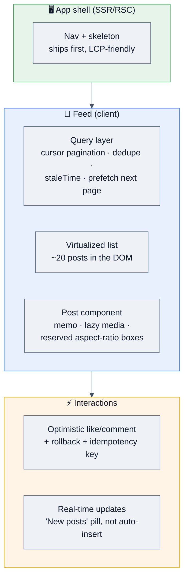

**Depth to cover:** cursor (not offset) pagination · virtualization + image lazy-loading with explicit dimensions (CLS) · optimistic interactions with rollback · **never auto-insert new posts at the top** (it shifts what the user is reading — show a "New posts" pill instead) · scroll restoration on back-navigation · media autoplay policy and `prefers-reduced-motion` · impression tracking with `IntersectionObserver` batched to one beacon · a11y (each post an `article`, "Load more" fallback, `aria-setsize`) · offline (cache the last N posts) · INP budget for the like button.

### D5. Design a real-time collaborative editor / dashboard ★★★★☆
Transport (WebSocket vs SSE) · local-first state with an op queue · **CRDT (Yjs/Automerge) vs OT** trade-off · presence/cursors throttled to ~10 Hz and kept ephemeral · reconnect with jittered backoff and op replay from a version vector · conflict semantics the user can understand · batching incoming messages to **one flush per animation frame** (never `setState` per message) · a Web Worker for parsing/aggregation · canvas/WebGL past ~1k visual elements · backpressure (drop stale frames, last-write-wins per key).

### D6. Design an e-commerce product listing + checkout ★★★★☆
**LCP-first:** SSR/SSG the above-the-fold grid, preload the hero image with `fetchpriority=high`, responsive `srcset`, explicit dimensions. **Filters in the URL** so results are shareable and the back button works. Cursor pagination or "load more." Cart state: server-owned with an optimistic client mirror (it must survive device switches). Checkout: SSR for correctness, **zero third-party scripts**, idempotency keys on payment intents, per-step validation, and an error taxonomy the user can act on. Discuss cache keys (locale, currency, auth) and why a personalized response cached without `Vary` is a data leak.

## 7.3 Advanced

### D7. Design a design system for 12 teams ★★★★☆
Tokens as CSS variables (theming without runtime cost) · tree-shakeable ESM with deep imports, **no giant barrel file** · SSR-safe (no `window` at import time) · React as a **peer dependency** (one copy, or hooks break) · controlled+uncontrolled component APIs (§6 H4) · a11y baked in and tested with axe in CI · visual regression tests · semver + changesets + **codemods shipped with every breaking change** · a bundle-size budget on the library itself · docs as the product (Storybook) · a deprecation policy, because old versions live in caches for months.

### D8. Design the client-side observability/RUM setup ★★★★☆
Collect CWV (`web-vitals`), errors (`onerror`, `unhandledrejection`, error boundaries), long tasks, route timings, and custom spans. **Constraints:** the SDK must not hurt the page it measures — small, non-blocking, `sendBeacon`/`fetch(keepalive)` on `visibilitychange` (not `unload`), stable per-session sampling, PII scrubbing before send, offline buffering with a cap, graceful degradation if the endpoint is down, and a kill switch. Upload source maps to the error tracker; **never serve them publicly**. Dashboards sliced by route, device class, and geography.

### D9. Design a micro-frontend architecture ★★★☆☆
Composition options (build-time packages, runtime Module Federation, server-side/edge includes) · shared singletons (React, router, design system) with strict version ranges — **two Reacts breaks hooks** · a typed contract between shell and remotes (events/props, never shared mutable globals) · independent deploys with a manifest + integrity hashes · failure isolation so a remote that fails to load degrades instead of white-screening · error attribution to the owning team. **Be honest:** a well-modularized monorepo first; micro-frontends only when the org chart demands independent deploys.

### D10. Design an RSC-based content app ★★★★☆
Route-level strategy matrix (SSG/ISR/streaming SSR/CSR) · what lives on the server vs behind `'use client'` · passing Server Components as `children` into client shells · Suspense boundaries chosen so the shell streams first · data fetching colocated in server components (no client waterfalls) · caching and revalidation semantics · **security**: never leak secrets across the boundary, validate every Server Action input as an untrusted endpoint, and stay on patched React/framework versions given the 2025–26 RSC advisories.

## 7.4 Production scenarios (staff rounds)

| Prompt | Signals expected |
|---|---|
| "Our bundle is 3.2 MB. Get it under 500 KB." | Measure first (analyzer + coverage) → route-split → replace heavy deps → drop legacy polyfills via browserslist → dynamic-import rare features → CI budget → **quantify the LCP/INP win**, not just bytes |
| "p99 API latency is fine but users say it's slow." | Server metrics ≠ user experience. Look at the client waterfall: hydration cost, long tasks, third parties, render-blocking resources. Get field RUM by device class. |
| "A third party causes 30% of our INP." | Facade pattern (load on interaction), `async` + low priority, worker offload, renegotiate with the vendor, and a hard rule: no synchronous third-party JS in the critical path |
| "Make it work on a 2 GB Android on 3G." | Ship less JS (parse+compile dominates on weak CPUs) → SSR the shell → smaller images → fewer long tasks → **test on a real throttled device**, not a slider |
| "Design a safe rollout for a checkout rewrite." | Dark launch → shadow traffic → 1/5/25/50% canary by user id → guardrail metrics (conversion, error rate, INP) with automated rollback → feature-flag kill switch → keep both paths working |
| "200 engineers, one app — keep it fast." | Governance: budgets in CI, RUM by team, route ownership + SLOs, a paved path that's hard to make slow, quarterly third-party audits |

---

# 8. 🏢 Real Production Usage at Scale

| Company | How React is used | The detail worth quoting |
|---|---|---|
| **Meta** | Created React; runs the largest React codebase in existence (Facebook, Instagram, WhatsApp Web, Ads Manager) plus React Native and Hermes | React's roadmap is driven by Meta's constraints: enormous component counts, low-end devices globally, and slow networks. **React Server Components and the "ship less JS" thesis come directly from that.** Hermes exists because JSC's startup/memory cost was too high on Android. |
| **Netflix** | React on web and on memory-constrained TV devices | Their landmark result: moving the sign-up page from a client-heavy React SPA to server-side rendering with minimal client JS cut time-to-interactive by roughly half. Their TV UIs are extreme low-memory React engineering. |
| **Airbnb** | Pioneered universal/isomorphic React SSR; built **Hypernova** (a React SSR service) | The canonical reference for "render React outside your main app," and a source of much of the industry's SSR/hydration playbook. |
| **Shopify** | Hydrogen (React storefronts), Polaris design system, React Native admin app | A strong example of a design system + performance budgets enforced across many teams and third-party developers. |
| **Vercel / Next.js** | The dominant React meta-framework; drives App Router, RSC, and PPR adoption | Most of the RSC vocabulary interviewers use (SSG/ISR/SSR/streaming/PPR) was popularized here. Also the source of the May 2026 security releases you should know about. |
| **Discord, Dropbox, Atlassian, Notion, Linear** | Large, highly-interactive React apps | Where virtualization, optimistic UI, offline queues, and store-with-selectors patterns are load-bearing rather than nice-to-have. |
| **Microsoft** | Fluent UI, VS Code web surfaces, Teams | Large-scale TypeScript + React design-system practice. |
| **Uber / DoorDash / Pinterest / Coinbase** | React web + React Native | Performance on mid-tier devices, A/B testing infrastructure, and design-system governance. |
| **React Native ecosystem** | Same reconciler, a different renderer | The architectural point worth making: React is a **reconciler + renderer** split, which is why `react-three-fiber`, `react-pdf`, and Ink (CLI) exist. |

> [!TIP]
> **Use these as evidence, not trivia.** *"Netflix roughly halved time-to-interactive on their sign-up page by moving off a client-rendered React SPA"* is a far stronger argument for SSR than "SSR is faster." Likewise, *"RSC exists because Meta needs to serve low-end devices globally"* explains the feature better than any API description.

---

# 9. 🐞 Common Bugs & Production Incidents

## 9.1 The bug taxonomy

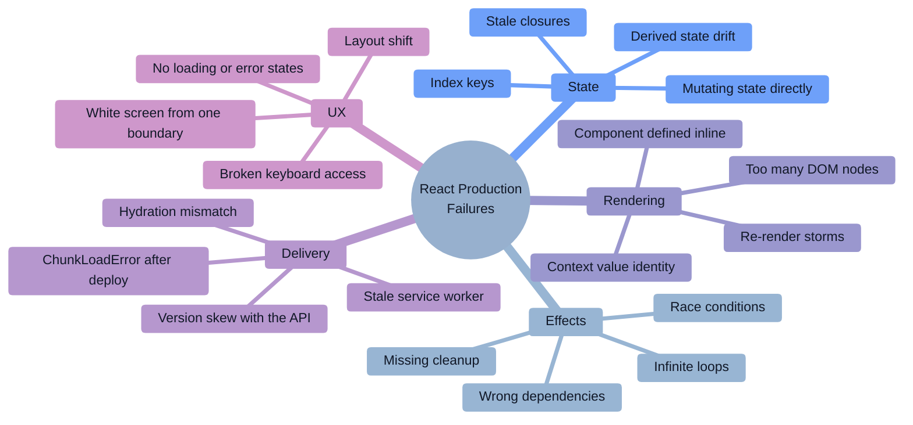

## 9.2 Twelve real bugs, with the debugging approach

### B1. `Cannot read properties of undefined` ★★★★★
The most common React production error. **Debug:** source-mapped stack in Sentry → the exact property → then ask *why*: an API shape change, an optional field, an array access past the end, or a render that beat the data. **Fix:** validate at the boundary (zod), sensible defaults, TypeScript with `strictNullChecks`. **Anti-fix:** sprinkling `?.` everywhere — that turns a loud crash into a silent wrong value.

### B2. Stale closure in a timer/subscription ★★★★★
A callback keeps reading the first render's variables. **Symptom:** a counter stuck at 1, a websocket handler using an old filter. **Fix:** functional updates, correct deps, `useEffectEvent` (19.2), or a latest-value ref.

### B3. Infinite re-render loop ★★★★★
`useEffect` whose dependency is a new object/array/function every render, or `setState` called during render. **Symptom:** "Too many re-renders," or the CPU pinned. **Debug:** the Profiler shows the same component rendering continuously; DevTools "why did this render" points at the offending prop. **Fix:** hoist stable values, memoize, or restructure so the effect isn't needed.

### B4. Index keys corrupt row state ★★★★★
**Symptom:** deleting the second item leaves the third item's text in the second row; focus jumps; checkboxes tick the wrong rows. **Fix:** stable domain ids. Add a test that deletes a middle item and asserts the remaining rows.

### B5. Race condition in a search/detail view ★★★★★
A slow response for the old query overwrites the new one. **Debug:** log a sequence number per request; you'll see out-of-order arrivals. **Fix:** an `ignore` flag + `AbortController` in the effect cleanup, or let a query library handle it.

### B6. Memory leak after repeated navigation ★★★★☆
**Symptom:** the tab slows and eventually crashes after 20 route changes. **Debug:** three heap snapshots → filter **Detached** → follow the **retainer chain**. **Usual retainers:** an effect without cleanup, an observer never disconnected, a store subscription, a timer, or a module-level cache.

### B7. `ChunkLoadError` / white screen after a deploy ★★★★★
Cached HTML references hashed chunks that no longer exist on the CDN. **Fix:** `Cache-Control: no-cache` on HTML, long-immutable caching on hashed assets, **keep the previous N deploys' chunks**, and a global handler that hard-reloads **once** on a chunk-load error (with a loop guard so it can't reload forever).

### B8. Hydration mismatch ★★★★☆
**Symptom:** a flash of wrong content, a console error, or lost interactivity. **Causes:** `Date.now()`/`Math.random()`, `window`/`localStorage` during render, locale/timezone formatting, or a browser extension mutating the DOM. **Fix:** defer browser-only rendering to an effect, `suppressHydrationWarning` for genuinely dynamic bits, or `useSyncExternalStore` with a server snapshot. React 19 shows a diff, which makes this far easier to locate.

### B9. Re-render storm from a context value ★★★★☆
An inline object in a provider re-renders every consumer on every parent render. **Debug:** Profiler → "why did this render?" → "Context changed." **Fix:** memoize the value, split contexts by change frequency, or move to a store with selectors.

### B10. One error boundary → the entire app is a white screen ★★★★★
**Fix:** boundaries **per route and per widget**, each with a retry affordance and a `key` reset. Add a client-side error-rate alert — most teams discover this class of outage from users, not dashboards.

### B11. `useEffect` fetching in a loop / double-fetch in dev ★★★★☆
Double-fetch in development is **StrictMode**, not a bug. A genuine loop is usually an unstable dependency, or `setState` inside the effect updating a value the effect depends on. **Fix:** dependency hygiene — and prefer a query library, which dedupes by key.

### B12. Layout shift from images and async content ★★★★☆
**Symptom:** CLS above 0.1; the user taps the wrong thing as content loads. **Fix:** explicit `width`/`height` or `aspect-ratio` on media, skeletons sized to the final content, reserved space for ads/banners, and `font-display: swap` with `size-adjust` to avoid text reflow.

## 9.3 The debugging playbook

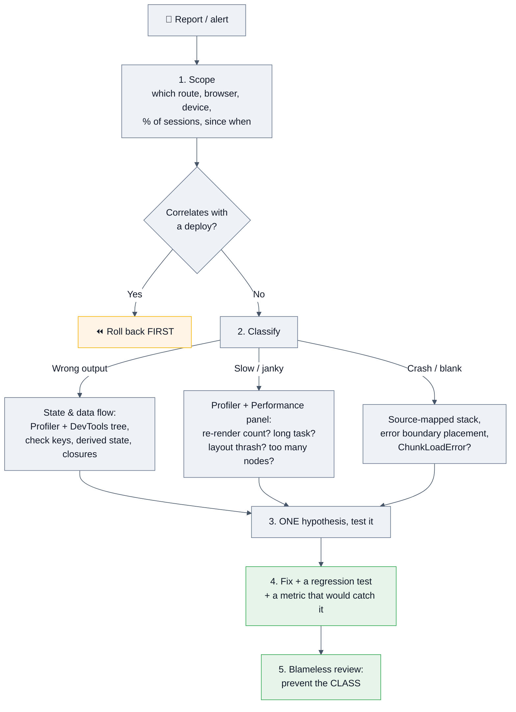

**Tools worth naming:**

| Need | Tool |
|---|---|
| What rendered, how long, and **why** | React DevTools **Profiler** + "Record why each component rendered" |
| Component tree, props, hooks, context | React DevTools Components panel |
| Long tasks, layout thrash, paint | Chrome Performance panel; **React Performance Tracks** (19.2) |
| Field performance | `web-vitals` + RUM (INP/LCP/CLS at p75, by device class) |
| Memory | Memory panel, 3-snapshot diff, "Detached" filter, retainer chain |
| Bundle | Bundle analyzer + the Coverage tab (unused JS) |
| Errors | Sentry with uploaded (not public) source maps and release tagging |
| Network | Network panel with throttling; MSW to simulate failures in tests |
| a11y | axe DevTools, `jest-axe` in CI, keyboard-only walkthrough |

> [!TIP]
> **Answer "how would you debug X" as a funnel, never as a tool list:** scope → correlate with change → classify (wrong output / slow / crash) → instrument → one hypothesis → verify → prevent the class. Interviewers grade the method, not the tool names.

---

# 10. 🔐 Security

> [!IMPORTANT]
> **React's default posture is good but narrow:** JSX **escapes interpolated values**, which kills the most common XSS vector. Everything else — URLs, raw HTML, secrets, dependencies, and the entire server surface introduced by RSC — is your responsibility.

## 10.1 Attack surface map

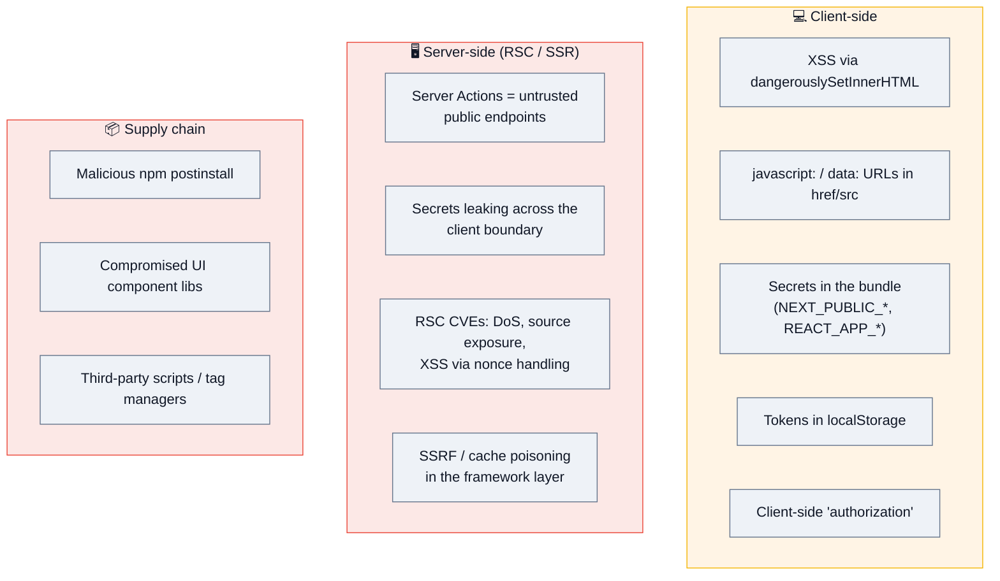

## 10.2 XSS in React

```jsx
// ✅ SAFE — JSX escapes interpolated values
<div>{userInput}</div>                                    // "<script>" renders as text

// ❌ The one API that opts out of escaping
<div dangerouslySetInnerHTML={{ __html: userHtml }} />     // named "dangerously" on purpose

// ✅ If you must render rich HTML, sanitize first
import DOMPurify from 'dompurify';
<div dangerouslySetInnerHTML={{ __html: DOMPurify.sanitize(userHtml) }} />

// ❌ URL-based XSS — React does NOT sanitize URLs
<a href={userUrl}>link</a>                                 // "javascript:alert(1)" executes on click
// ✅ scheme allowlist
const safeUrl = (u) => { try { const p = new URL(u, location.origin);
  return ['http:', 'https:', 'mailto:'].includes(p.protocol) ? p.href : '#'; } catch { return '#'; } };

// ❌ Spreading untrusted props can inject event handlers or dangerous attributes
<div {...untrustedProps} />
```

**Also:** `ref.current.innerHTML = …` bypasses React entirely · third-party markdown/rich-text renderers need sanitization configured · a strict **CSP with a per-request nonce and `strict-dynamic`** is your defence-in-depth when a sanitizer is bypassed (mXSS is real).

## 10.3 Server Components & Server Actions — the 2026 surface

RSC moved a large amount of code onto the server, and with it a real security surface. **Public advisories in 2025–26 you should be able to reference:**

| When | What | Action |
|---|---|---|
| **Dec 2025** | A critical vulnerability in React Server Components, followed by advisories covering **denial of service and source-code exposure** in RSC | Upgrade to the patched React lines |
| **May 2026** | **Twelve vulnerabilities disclosed together — one in React Server Components and eleven in Next.js**, spanning middleware/proxy bypass, XSS, SSRF, cache poisoning, and DoS. Notably an XSS vector affecting App Router apps that use **CSP nonces** | Patch React server packages (19.0.6 / 19.1.7 / 19.2.6 lines) and Next.js (15.5.16 / 16.2.5 lines) |

> [!WARNING]
> **The interview-worthy takeaway is not the CVE numbers — it's the posture.** *"Adopting RSC means adopting a server security surface: I'd treat every **Server Action as a public, unauthenticated endpoint** (authenticate, authorize, and schema-validate every input), keep React and the framework on patched versions with automated dependency alerts, and make sure our threat model covers SSRF and cache poisoning at the framework layer."*

```js
// ❌ A Server Action is NOT protected because it's "only called from that button"
'use server';
export async function deletePost(id) { await db.posts.delete(id); }   // anyone can POST to it

// ✅ Treat it as an endpoint
'use server';
export async function deletePost(formData) {
  const session = await auth();                                  // 1. authenticate
  if (!session) throw new Error('Unauthorized');
  const { id } = deleteSchema.parse({ id: formData.get('id') }); // 2. validate
  const post = await db.posts.findFirst({ where: { id, authorId: session.userId } });
  if (!post) throw new Error('Not found');                       // 3. authorize per RESOURCE
  await db.posts.delete({ where: { id } });
}
```

**The boundary rules that prevent leaks:** never import server-only modules into a `'use client'` file (use a `server-only` guard package); props crossing the boundary are **serialized and visible to the client** — never pass a full user record with a password hash "because you only render the name"; and remember that anything in a client component's props ends up in the RSC payload in the page source.

## 10.4 Secrets and configuration

```bash
# ❌ These are PUBLIC — they are inlined into the JavaScript bundle
NEXT_PUBLIC_STRIPE_SECRET=sk_live_...
REACT_APP_DB_PASSWORD=...
VITE_API_KEY=...
```
Anything prefixed for client exposure ships to the browser. Server-only secrets must have **no** public prefix and must be read only in server code. Audit with a bundle search for known secret patterns in CI, and rotate anything that ever shipped.

## 10.5 Auth, tokens, and authorization

| Storage | XSS-readable | Verdict |
|---|---|---|
| `localStorage` / `sessionStorage` | ✅ yes | ❌ **never for tokens** |
| JS-readable cookie | ✅ yes | ❌ |
| **`HttpOnly; Secure; SameSite` cookie** | ❌ no | ✅ **the answer** |
| In-memory (a variable/store) | only while running | ✅ acceptable for a short-lived access token + silent refresh |

**And the rule that fails candidates when they miss it:** *"Hiding a button is not authorization."* Every permission check must be enforced server-side on the resource; client-side checks are UX only. Route guards can be bypassed in DevTools in seconds.

## 10.6 Supply chain and third parties

A typical React app pulls in hundreds of transitive packages. The npm registry saw large-scale attacks through 2025–26 (widely-used packages compromised, a self-propagating publish-token worm, and a hijack of a 100M+-weekly-download HTTP client shipping a RAT into CI). **Controls:** `npm ci` with a committed lockfile · `--ignore-scripts` by default · provenance/attestation checks · Dependabot/Socket gating on severity · **lockfile diffs reviewed like code** · SRI on any CDN `<script>` · a quarterly third-party script audit (they cost money *and* INP) · a CSP that limits where data can be exfiltrated to.

## 10.7 Security checklist ✅

- [ ] No `dangerouslySetInnerHTML` with untrusted input; sanitize (DOMPurify) when rich HTML is required
- [ ] URL scheme allowlist for every user-supplied `href`/`src`; no spreading untrusted props
- [ ] Strict CSP with a per-request nonce + `strict-dynamic`; Trusted Types where supported
- [ ] Tokens in `HttpOnly; Secure; SameSite` cookies — never `localStorage`
- [ ] **Authorization enforced server-side, per resource**; client checks are UX only
- [ ] Every Server Action authenticates, authorizes, and schema-validates its input
- [ ] No secrets behind client-exposed env prefixes; CI scans the bundle for secret patterns
- [ ] React + framework on **patched** versions (RSC advisories in Dec 2025 and May 2026)
- [ ] `rel="noopener noreferrer"` on `target="_blank"`; validate `postMessage` origins
- [ ] Source maps uploaded to the error tracker, **not** served publicly
- [ ] `npm ci`, lockfile committed, `--ignore-scripts`, audit gating, reviewed lockfile diffs
- [ ] SRI + quarterly audit for third-party scripts; CSP limits exfiltration destinations
- [ ] Untrusted input validated at the boundary (zod) on **both** client and server

---

# 11. ⚡ Performance

## 11.1 The metrics that matter

| Metric | Good (p75, **field**) | Main React lever |
|---|---|---|
| **LCP** | ≤ 2.5 s | Ship less JS; SSR/RSC the shell; preload the hero image |
| **INP** ⬅️ *where the debt is in 2026* | **≤ 200 ms** | Fewer/cheaper re-renders; `useTransition`/`useDeferredValue`; break long tasks |
| **CLS** | ≤ 0.1 | Explicit media dimensions, skeletons sized to content, font `size-adjust` |
| **TTFB** | ≤ 800 ms | Edge caching, streaming SSR |
| Hydration time | as low as possible | Less client JS, selective/progressive hydration, islands, RSC |
| Bundle per route | budgeted in CI | Route splitting, tree shaking, dep replacement |

> [!IMPORTANT]
> **LCP and CLS are largely solved for most teams; INP is where the remaining debt lives.** That's the 2026 framing. And **lab ≠ field** — a perfect Lighthouse score on a fast laptop says nothing about a p75 user on a mid-tier Android. Always answer with *"I'd look at field RUM segmented by device class and route."*

## 11.2 Profiling: what to run and what to look for

```bash
# React DevTools Profiler — record an interaction
#   → flame chart: which components rendered, how long, and WHY
#   → enable "Record why each component rendered" in settings
# React Performance Tracks (19.2) in the Chrome Performance panel
#   → React's own scheduling/render/commit lanes alongside browser work
# Chrome Performance panel → long tasks (>50 ms), layout thrash (purple), paint
# Coverage tab → how much shipped JS is unused
# Bundle analyzer → what's actually in each chunk
# web-vitals + RUM → the numbers that count
```

**Reading a React profile:**
- **Many components, each ~0.1 ms** → a re-render cascade. Fix with composition, `memo`, store selectors, or the Compiler.
- **One component, 80 ms** → an expensive computation or a huge subtree. Memoize, virtualize, or move work to a worker.
- **A wide "commit" bar** → too many DOM mutations. Reduce node count; virtualize.
- **Long tasks between renders** → non-React work (parsing, third-party scripts, big `JSON.parse`).

## 11.3 The optimization playbook, in order

1. **Measure.** Profiler for renders, Performance panel for long tasks, RUM for reality. *Never optimize on intuition.*
2. **Ship less JavaScript.** Route-level code splitting, tree shaking, replace heavy dependencies, drop legacy polyfills. On low-end devices, **parse + compile time dominates**.
3. **Cut unnecessary re-renders.** Composition (`children` as a prop) → store selectors → `memo` → and let the **React Compiler** do the routine work.
4. **Fix expensive computation.** Memoize, index data in a `Map`, or move it to a Web Worker.
5. **Reduce DOM nodes.** Virtualize long lists; `content-visibility: auto` for off-screen sections.
6. **Prioritize interactions.** `useTransition` / `useDeferredValue` so the keystroke paints first; break long tasks with `scheduler.yield()` where applicable.
7. **Fix the network waterfall.** Parallel fetching (no client-side waterfalls — a key RSC/loader argument), prefetch on intent, `preconnect`/`preload` for critical resources.
8. **Kill layout shift.** Explicit dimensions everywhere; reserve space for async content.
9. **Audit third parties.** They cost money and INP; facade or defer them.
10. **Verify in the field.** INP/LCP p75 in RUM, not a local score.

```jsx
// #3 in practice — the composition trick, no memo needed
function Page({ children }) {                 // ExpensiveTree's element is created OUTSIDE
  const [q, setQ] = useState('');             // so its reference is stable → React bails out
  return <><input value={q} onChange={e => setQ(e.target.value)} />{children}</>;
}
<Page><ExpensiveTree /></Page>

// #6 in practice
const [isPending, startTransition] = useTransition();
setInput(v);                                   // urgent — paints now
startTransition(() => setQuery(v));            // interruptible
```

## 11.4 Memory

Same discipline as §3.7: clean up every effect, disconnect observers, clear timers, bound caches, and prefer ids over objects in long-lived stores. Diagnose with three heap snapshots and the **retainer chain**, filtering for **Detached** DOM nodes. In React specifically, the retainer is almost always a listener, a store subscription, a timer, or an unbounded query cache.

## 11.5 Rendering strategy as a performance decision

| Strategy | LCP | INP | Bundle | Best for |
|---|---|---|---|---|
| CSR SPA | ❌ worst on slow devices | depends | largest | auth-walled tools |
| SSR + hydration | ✅ good | ⚠️ hydration cost | same as CSR | content + personalization |
| SSG / ISR | ✅ best | ✅ | same as CSR | docs, marketing, catalogs |
| Streaming SSR + Suspense | ✅ | ✅ better (progressive) | same | large content apps |
| **RSC** | ✅ best | ✅ best | **smallest** | data-heavy trees, heavy deps |

---

# 12. ✅ Best Practices

### Components
- Small, single-purpose, named for **intent**; colocate by feature, not by file type.
- Composition over configuration: pass JSX as `children` instead of 15 boolean props.
- Support both **controlled and uncontrolled** usage in reusable components.
- Never define a component inside another component.
- Keep components pure: no side effects, no mutation, no module-variable writes during render.

### State
- **Server state ≠ client state.** Query library for API data; local state by default; a store with selectors for shared, frequently-changing client state; the **URL** for filters/tabs/pagination.
- Derive, don't store. No `useState` + `useEffect` to compute a value.
- Never copy props into state — derive, lift, or reset with a `key`.
- Immutable updates and functional setters (`setX(x => …)`).
- Colocate state as low in the tree as possible; lift only on proven need.

### Effects
- Ask "is there an external system?" before writing one.
- Never lie to the dependency array; use functional updates, `useEffectEvent`, or restructure.
- Always clean up: timers, listeners, observers, subscriptions, in-flight requests.
- One effect per concern, not one giant effect.

### Performance
- Profile before optimizing; enable the **React Compiler** and let it handle routine memoization.
- Virtualize past ~200 rows; code-split at route boundaries.
- Use `useTransition`/`useDeferredValue` for interaction responsiveness.
- Enforce a bundle-size and CWV budget in CI.

### Quality
- TypeScript with `strict: true`, plus **runtime validation** at API boundaries (types erase).
- Error boundaries per route **and** per widget, each with a retry path.
- Every async view models loading / empty / error / success explicitly.
- Accessibility is a requirement, not a phase: semantics, keyboard, focus management, axe in CI.
- Test behaviour with RTL (query by role/text), MSW for the network, a few Playwright E2E journeys.
- Upload source maps to the error tracker; never serve them publicly.

---

# 13. 🚫 Anti-patterns

| Anti-pattern | Why it hurts | Do instead |
|---|---|---|
| `key={index}` on reorderable lists | State, focus, and inputs attach to positions, not data | Stable domain ids |
| Copying props into state | Two sources of truth that drift | Derive, lift, or `key` to reset |
| `useState` + `useEffect` to compute a value | Extra render, stale frame, more code | Calculate during render |
| `useEffect` for data fetching in a real app | Races, waterfalls, no cache, double-fetch in dev | Query library / loader / RSC |
| Lying to the dependency array | Stale closures — silently wrong values | Functional updates, `useEffectEvent`, restructure |
| Missing effect cleanup | Detached DOM, leaked timers/listeners, memory growth | Always return a cleanup |
| Defining a component inside a component | New type every render → remount, state lost | Hoist it out |
| Mutating state then setting it | Same reference → React bails out, no re-render | Immutable updates |
| Inline object/array/function props on memoized children | New identity every render defeats `memo` | Hoist, memoize, or let the Compiler handle it |
| Inline context value object | Every consumer re-renders on every parent render | `useMemo` the value; split contexts |
| Using Context as a state manager for hot data | No selectors → whole-subtree re-renders | Store with selectors (Zustand/Jotai) |
| `useMemo`/`useCallback` everywhere by default | Allocation + comparison cost, more complexity, often slower | Profile; enable the Compiler |
| One root error boundary | Any bug becomes a white screen | Boundaries per route and per widget |
| No loading/empty/error states | Users see blank screens and can't recover | Model all four states |
| `{count && <X/>}` | Renders a literal `0` | `{count > 0 && <X/>}` |
| Rendering 5,000 rows | Huge commit, jank, memory | Virtualize |
| Prop drilling 6 levels | Refactor friction, needless re-renders | Composition, context, or a store |
| Giant `useEffect` with everything | Unreadable, re-runs unexpectedly | One effect per concern |
| Barrel `index.ts` re-exporting everything | Kills tree shaking, slows builds | Deep imports; side-effect-free exports |
| Runtime CSS-in-JS in hot paths | Main-thread work per render; complicates RSC | CSS variables, CSS Modules, or utility CSS |
| Tokens in `localStorage` | One XSS = full account takeover | `HttpOnly` cookies |
| `dangerouslySetInnerHTML` with user input | XSS | `textContent`/JSX, or sanitize |
| Client-side route guards as "security" | Bypassed in DevTools in seconds | Server-side authorization per resource |
| Server Actions without auth/validation | They're public endpoints | Authenticate, authorize, validate |
| Secrets behind `NEXT_PUBLIC_`/`REACT_APP_` | Shipped in the bundle | Server-only env, no public prefix |
| Chasing a Lighthouse score | Optimizes for a synthetic device | Optimize field p75 (INP/LCP) |
| Optimizing before profiling | Wasted effort on the wrong 2% | Profiler + RUM first |
| `any` sprinkled through TypeScript | Types become decorative | `unknown` + narrowing; ratchet strictness in CI |
| Testing implementation details (state, internals) | Breaks on every refactor | Query by role/text; test behaviour |

---

# 14. 📊 Comparison Tables

## 14.1 React vs other UI libraries

| | **React** | Vue 3 | Angular | Svelte 5 | Solid |
|---|---|---|---|---|---|
| Model | VDOM + reconciliation | VDOM + fine-grained reactivity | change detection (zones/signals) | **compiler, no VDOM** | **fine-grained signals, no VDOM** |
| Re-render granularity | component subtree | component + reactive deps | component | surgical DOM updates | surgical DOM updates |
| Learning curve | medium (JS-heavy) | gentlest | steepest (opinionated, DI, RxJS) | gentle | medium |
| Ecosystem / jobs | **largest by far** | large | large (enterprise) | growing | small |
| Mobile | React Native | NativeScript/Ionic | Ionic | — | — |
| Server rendering | Next.js/Remix, **RSC** | Nuxt | Angular Universal | SvelteKit | SolidStart |
| Bundle (baseline) | medium | medium | largest | **smallest** | very small |
| Best argument | ecosystem, hiring, React Native, RSC | DX and approachability | enterprise conventions out of the box | performance + less code | raw performance |

> [!TIP]
> **How to answer "why React over X?"** *"Technically, Svelte and Solid have a better update model — no VDOM, surgical updates. React's advantages are ecosystem depth, hiring, React Native, and now RSC's ability to cut client JS entirely. For a product team shipping on a deadline, ecosystem and hiring usually dominate the update-model difference. I'd pick Solid/Svelte for a performance-critical embedded widget and React for a product."* Give a decision, not a survey.

## 14.2 State management

| | `useState` | `useReducer` | Context | Zustand | Jotai | Redux Toolkit | **TanStack Query** |
|---|---|---|---|---|---|---|---|
| Scope | component | component | subtree | app | app (atomic) | app | **server cache** |
| Selectors (partial subscribe) | n/a | n/a | ❌ | ✅ | ✅ | ✅ | per query |
| Boilerplate | none | low | low | **very low** | very low | medium | low |
| DevTools | basic | basic | ❌ | ✅ | ✅ | **excellent** | ✅ |
| Async built in | ❌ | ❌ | ❌ | manual | manual | thunks/RTK Query | **✅ the point** |
| Caching / dedupe / retry / refetch | ❌ | ❌ | ❌ | ❌ | ❌ | RTK Query | **✅** |
| Right for | local UI state | multi-field transitions | theme, locale, auth user | shared client state | fine-grained atoms | complex flows, big teams | **anything from an API** |

**The 2026 default pairing: Zustand (client) + TanStack Query (server).** Redux Toolkit when the client state itself is genuinely complex or the org already standardized on it.

## 14.3 Rendering strategies

| | CSR | SSR | SSG | ISR | Streaming SSR | **RSC** |
|---|---|---|---|---|---|---|
| TTFB | fast (shell) | slower | **fastest** | fast | fast | fast |
| LCP on low-end devices | ❌ worst | ✅ | ✅ best | ✅ | ✅ | ✅ best |
| JS shipped | full | full | full | full | full | **least** |
| SEO | needs prerender | ✅ | ✅ | ✅ | ✅ | ✅ |
| Personalization | ✅ | ✅ | ❌ | partial | ✅ | ✅ |
| Complexity | low | medium | low | medium | high | **highest** |
| Best for | dashboards | content + personalization | docs, marketing | catalogs | large content apps | data-heavy trees |

## 14.4 Hooks quick comparison

| | `useMemo` | `useCallback` | `React.memo` | `useRef` |
|---|---|---|---|---|
| Caches | a value | a function identity | a component's render output | a mutable box |
| Triggers re-render on change | ❌ | ❌ | ❌ | ❌ |
| Compares | deps (`Object.is`) | deps | props (shallow) | n/a |
| Mostly replaced by the Compiler | ✅ | ✅ | ✅ | ❌ (still yours) |

| | `useEffect` | `useLayoutEffect` | `useInsertionEffect` |
|---|---|---|---|
| Timing | after paint | after DOM mutation, before paint | before DOM mutation |
| Blocks paint | ❌ | ✅ | ✅ |
| Use for | subscriptions, fetching, analytics | measuring + repositioning | CSS-in-JS style injection (library authors) |

| | `useTransition` | `useDeferredValue` |
|---|---|---|
| You control | the setter | only the value |
| Gives you | `isPending` | a lagging copy (compare to detect staleness) |
| Use when | you own the state update | the value arrives as a prop |

## 14.5 Meta-frameworks

| | Next.js (App Router) | Remix / React Router 7 | Vite + React Router | Astro (React islands) |
|---|---|---|---|---|
| RSC support | ✅ (the reference impl) | partial/evolving | ❌ | islands model |
| Data fetching | server components + Actions | loaders/actions (web standards) | your choice | per-island |
| Routing | file-based | file-based | code-based | file-based |
| Hosting | best on Vercel; self-host possible | portable | any static host | any static host |
| Learning curve | high (RSC model) | medium | low | low |
| Best for | large content + commerce apps | web-standards-first apps | SPAs, internal tools | content sites with sprinkles of React |

## 14.6 Testing

| | Jest | Vitest | React Testing Library | Playwright | Storybook |
|---|---|---|---|---|---|
| Layer | unit/integration runner | unit/integration runner | DOM query + assertion layer | E2E | component workshop + visual tests |
| Speed | good | **fastest (Vite)** | n/a | fast, parallel | n/a |
| ESM/TS | historically painful | native | n/a | native | native |
| Best for | legacy repos | new projects | **all component tests** | critical journeys, cross-browser | design systems, visual regression |

---

# 15. 📄 Cheat Sheet (One-Page Revision)

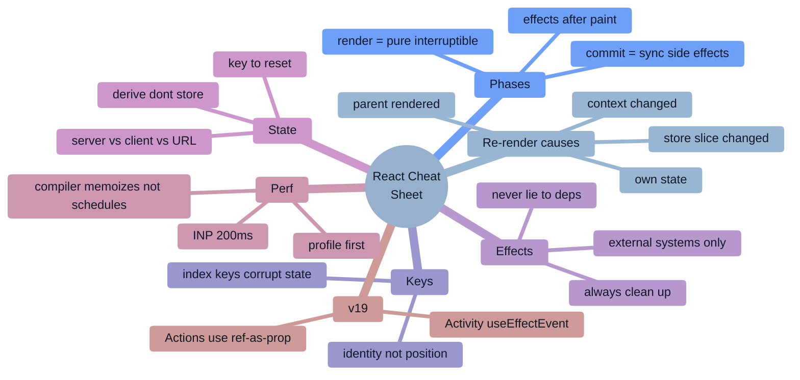

### The model
```
UI = f(state)          elements are DESCRIPTIONS, components are FUNCTIONS, instances are FIBERS
render phase  → pure, interruptible, may run twice, refs are null, NO side effects
commit phase  → synchronous, DOM mutated, refs set, useLayoutEffect runs (before paint)
after paint   → useEffect runs
```

### Why a component re-renders
```
1 its own state changed        2 its parent re-rendered (default!)
3 a context it reads changed   4 a store slice it subscribes to changed
bailouts: React.memo · same element REFERENCE (children as props) ·
          React Compiler · setState to an Object.is-equal value
```

### Reconciliation
```
different type      → unmount + remount (STATE LOST)
same type           → keep instance, update props, recurse
lists               → matched by KEY within the parent
key={index}         → breaks on insert/reorder/delete
<X key={id}/>       → a legitimate API to RESET state
```

### Hooks rules & why
```
top level only, components/custom hooks only
because hook state is a per-Fiber LINKED LIST matched BY CALL ORDER
exception: React 19 `use` may be called conditionally
lazy init: useState(() => expensive())
setter identity is stable; setState bails out on Object.is equality
```

### Effects
```
ask: is there an EXTERNAL system?  if not, you probably don't need an effect
❌ derived values (compute in render) · resets (use key) · event responses (use the handler)
⚠️ data fetching → query library / loader / RSC
✅ subscriptions, sockets, browser APIs, third-party widgets, analytics
ALWAYS return cleanup · never lie to deps · functional updates or useEffectEvent for freshness
StrictMode double-invoke = DEV ONLY bug detector
```

### State placement
```
from a server?  → TanStack Query / SWR / loader / RSC   (cache, dedupe, retry, refetch)
in the URL?     → searchParams (shareable, back-button-safe): filters, tabs, pagination
one component?  → useState        few nearby? → lift up
many + hot?     → Zustand/Jotai with SELECTORS   (Context has no selectors!)
```

### React 19 / 19.2
```
19  : Actions · useActionState · useFormStatus · useOptimistic · use() ·
      ref AS A PROP (no forwardRef) · <Context> as provider · metadata · preloading
19.2: <Activity> (hide but PRESERVE state) · useEffectEvent · Performance Tracks ·
      partial pre-rendering · Suspense reveal batching
Compiler 1.0 (Oct 2025): auto-memoization, works on React 17+, SEPARATE from React 19
NO React 20 exists.
```

### Performance
```
1 measure (Profiler + field RUM)      2 ship less JS
3 cut re-renders (composition first)  4 memoize expensive computation
5 virtualize long lists               6 useTransition/useDeferredValue for INP
7 fix the network waterfall           8 kill layout shift
LCP ≤2.5s · INP ≤200ms · CLS ≤0.1  (p75, FIELD data)
Compiler MEMOIZES; it does NOT SCHEDULE.
```

### Security
```
JSX escapes values ✅ | dangerouslySetInnerHTML ❌ | href={userUrl} ❌ (javascript:)
tokens → HttpOnly cookies, never localStorage
hiding a button ≠ authorization — enforce server-side per resource
Server Actions = PUBLIC endpoints: authenticate + authorize + validate
NEXT_PUBLIC_/REACT_APP_/VITE_ = shipped to the browser
RSC had real CVEs (Dec 2025, May 2026) → stay patched
```

### Debug funnel
```
scope → correlate with a deploy → classify (wrong output / slow / crash)
→ instrument (Profiler, Performance panel, heap snapshots) → ONE hypothesis
→ verify → add a regression test AND a metric that would have caught it
```

---

# 16. 🎴 Flash Cards

<details><summary><b>Core model (click to expand)</b></summary>

| Q | A |
|---|---|
| React in one line? | A library for building UIs from components where **UI is a pure function of state**. |
| What does JSX compile to? | `jsx()`/`createElement()` calls returning **plain element objects** — descriptions, not DOM. |
| Is the virtual DOM fast? | It's not *faster* than hand-tuned imperative DOM. It makes a **declarative** model affordable and predictable. |
| Element vs component vs instance? | Element = a plain object description; component = a function; instance = a Fiber holding state. |
| What is Fiber? | A per-instance unit of work in a linked-list tree, enabling pausable/resumable/abandonable rendering, with double buffering (`current` / `workInProgress`). |
| Render phase vs commit phase? | Pure and interruptible (may run twice, refs null) vs synchronous DOM mutation (refs set, `useLayoutEffect` runs). |
| The three reconciliation heuristics? | Different type → rebuild; same type → update in place; lists matched by `key`. |
| Why do index keys break? | React matches by position, so state, focus, and uncontrolled inputs stay with the position rather than the data. |
| Name all four reasons a component re-renders. | Own state, parent re-rendered, a consumed context changed, a subscribed store slice changed. |
| How do you reset a component's state declaratively? | Change its `key` — React unmounts and remounts it. |
| What is a bailout? | React skipping a subtree: `memo` hit, identical element reference, or `setState` to an `Object.is`-equal value. |
</details>

<details><summary><b>Hooks & effects</b></summary>

| Q | A |
|---|---|
| Why can't hooks be conditional? | Hook state is a per-Fiber linked list matched **by call order**; a skipped call shifts every subsequent slot. |
| The React 19 exception to that rule? | The `use` hook — it can be called conditionally and in loops. |
| What does `useState`'s lazy initializer do? | `useState(() => f())` runs `f` only on the first render; `useState(f())` runs it every render. |
| When should you NOT use `useEffect`? | Derived values, resetting state on a prop change, responding to a user action, and most data fetching. |
| What is a stale closure? | A callback captured a render's variables and outlived it — so it reads old values. Fix with functional updates, correct deps, `useEffectEvent`, or a latest-value ref. |
| `useEffect` vs `useLayoutEffect`? | After paint vs before paint (blocking) — the latter for measuring and repositioning. |
| Why does my effect run twice in dev? | StrictMode's intentional double-invoke to surface missing cleanup and impurity. It doesn't happen in production. |
| `useMemo` vs `useCallback`? | Cache a value vs cache a function identity; `useCallback(f, d)` ≡ `useMemo(() => f, d)`. |
| Do two components using the same custom hook share state? | **No** — each call gets its own state. |
| What does `useRef` do besides DOM access? | Holds any mutable value across renders **without** triggering a re-render. |
| What problem does `useSyncExternalStore` solve? | Tearing — two parts of the tree reading different values of an external store mid-render. |
| `useTransition` vs `useDeferredValue`? | You own the setter (get `isPending`) vs you only have the value (get a lagging copy). |
</details>

<details><summary><b>Modern React & performance</b></summary>

| Q | A |
|---|---|
| What's the headline of React 19? | Actions (`useActionState`/`useFormStatus`/`useOptimistic`), the `use` hook, and **ref as a prop** (no `forwardRef`). |
| Two things new in 19.2? | `<Activity>` (hide a subtree while preserving state) and `useEffectEvent`. |
| When did the React Compiler hit 1.0, and what React does it need? | October 2025; it works with **React 17+** and is separate from React 19. |
| Does the Compiler remove the need for `useTransition`? | **No.** It memoizes; it does not schedule. |
| Why might the Compiler produce no improvement? | It bails out of components that break the Rules of React (impure renders, mutation) — run the lint plugin. |
| RSC vs SSR in one line? | RSC components run **only** on the server and ship **zero JS**; SSR renders client components to HTML that must then hydrate. |
| What can't a Server Component do? | State, effects, event handlers, browser APIs. It **can** be `async` and read the database directly. |
| What is hydration and why is it costly? | Downloading JS, rebuilding the tree, and attaching listeners — the page looks ready but isn't interactive, hurting INP. |
| Core Web Vitals thresholds? | LCP ≤2.5 s, INP ≤200 ms, CLS ≤0.1 at p75 in **field** data. |
| First step to fix a janky list? | Measure with the Profiler; then prioritize the keystroke with `useTransition`/`useDeferredValue`, reduce the work, and virtualize. |
| How do you stop a re-render cascade without `memo`? | Pass the expensive subtree as `children` — its element reference stays stable. |
| Is there a React 20? | No. React 19.2 is current; some posts mislabel 19.2's features as "React 20." |
</details>

<details><summary><b>Security & production</b></summary>

| Q | A |
|---|---|
| Does React prevent XSS? | JSX escapes interpolated **values**. It does not sanitize `dangerouslySetInnerHTML`, URLs (`javascript:`), or spread props. |
| Where do you store an auth token? | An `HttpOnly; Secure; SameSite` cookie — never `localStorage`. |
| Is a client-side route guard security? | No. It's UX. Authorization must be enforced server-side, per resource. |
| How should you treat a Server Action? | As a **public, unauthenticated endpoint**: authenticate, authorize, and schema-validate every input. |
| What's the risk with `NEXT_PUBLIC_`/`REACT_APP_` variables? | They're inlined into the client bundle — anything there is public. |
| Why does RSC change your security posture? | It adds a server surface: React Server Components had high-severity advisories in Dec 2025 and May 2026 (DoS, source exposure, XSS via nonce handling), so patching discipline matters. |
| What causes `ChunkLoadError` after a deploy? | Cached HTML pointing at hashed chunks that no longer exist. Fix with `no-cache` HTML, retained old chunks, and a one-time hard reload with a loop guard. |
| Where should error boundaries go? | Per route **and** per widget — one root boundary turns any bug into a white screen. |
| What's the most common React production error? | `Cannot read properties of undefined` — usually an API shape change or a render that beat the data. |
| How do you find a React memory leak? | Three heap snapshots → filter **Detached** → follow the **retainer chain** (usually a listener, subscription, timer, or cache). |
| What should never be served publicly? | Source maps — upload them to the error tracker instead. |
</details>

---

# 17. ✅ Interview Revision Checklist

### Core model
- [ ] `UI = f(state)`; elements vs components vs Fibers; what JSX compiles to
- [ ] Render phase vs commit phase; why render must be pure
- [ ] Fiber, double buffering, lanes, bailouts
- [ ] Reconciliation heuristics; keys; `key` as a state-reset API
- [ ] All four re-render causes and every bailout mechanism

### Hooks
- [ ] The rules and **why** (linked list by call order); the `use` exception
- [ ] `useState` (lazy init, functional updates, batching), `useReducer`
- [ ] `useEffect`: when **not** to use one, deps, cleanup, stale closures, StrictMode
- [ ] `useLayoutEffect`, `useRef` (both jobs), `useId`, `useSyncExternalStore`
- [ ] `useMemo`/`useCallback`/`memo` — and the Compiler-aware answer
- [ ] `useTransition`, `useDeferredValue`
- [ ] Writing custom hooks (§6 E1–E4) from memory

### Modern React
- [ ] React 19: Actions, `useActionState`, `useFormStatus`, `useOptimistic`, `use`, ref-as-prop, `<Context>`
- [ ] React 19.2: `<Activity>`, `useEffectEvent`, Performance Tracks, partial pre-rendering
- [ ] React Compiler: what it does, what it doesn't, how you'd adopt it
- [ ] Server Components, `'use client'` boundaries, serialization rules, Server Actions
- [ ] Suspense, streaming SSR, hydration and its failure modes

### State & data
- [ ] Server state vs client state vs URL state
- [ ] Context's cost and the alternatives (stores with selectors)
- [ ] Query-library semantics: cache, dedupe, stale-while-revalidate, retries, optimistic updates + rollback
- [ ] Derived state, lifting state, immutable updates
- [ ] Race conditions and abort handling

### Engineering
- [ ] Performance funnel + CWV thresholds + profiling tools
- [ ] Virtualization, code splitting, bundle budgets
- [ ] Accessibility: semantics, keyboard, focus management, ARIA patterns, axe in CI
- [ ] Testing: RTL by role/text, MSW, a few E2E; what *not* to test
- [ ] Security checklist (§10.7) end to end
- [ ] Error boundaries, loading/empty/error/offline states
- [ ] The §6 builds: autocomplete, infinite scroll, nested comments, wizard, virtual list, optimistic updates, mini-React
- [ ] One production incident **you personally debugged**, with metrics and the systemic fix

### Behavioral
- [ ] 6–8 STAR stories: an outage you owned, a disagreement resolved, an ambiguous project, a decision reversed, a performance win with numbers, mentoring
- [ ] Amazon: map each story to a Leadership Principle
- [ ] Questions to ask them: on-call load, deploy frequency, tech-debt prioritization, the first 90 days

---

# 18. 🗺️ Learning Roadmap

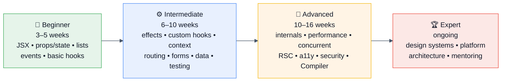

### 🌱 Beginner (weeks 1–5)
**Prerequisite:** solid JavaScript — closures, `this`, array methods, destructuring, promises, modules. **React interviews fail on JavaScript far more often than on React.** If closures are shaky, fix that first.
**Learn:** JSX, components, props, state, events, lists + keys, conditional rendering, controlled forms, `useState`, `useEffect` basics, lifting state up, composition.
**Build:** a todo app (add/edit/delete/filter/persist) and a data-fetching app with loading/error/empty states.
**Read:** **react.dev — the whole "Learn React" section** (it's the best React resource that exists; the "You Might Not Need an Effect" page is essential).
**Milestone:** you can explain why index keys are dangerous, with an example.

### ⚙️ Intermediate (weeks 6–15)
**Learn:** the effect decision tree, dependency arrays and stale closures, cleanup, custom hooks, `useReducer`, `useRef`, `useMemo`/`useCallback`/`memo`, Context and its cost, React Router, forms at scale, server state with TanStack Query, error boundaries, TypeScript with React, testing with RTL.
**Build:** an app with auth, routing, a data layer with caching and optimistic updates, an autocomplete, an infinite-scroll list, a multi-step form, and an integration test suite. Then **rebuild one screen twice** — once with Context, once with a store + selectors — and profile both.
**Practice:** every §6 Easy and Medium implementation from memory.
**Read:** react.dev "Escape Hatches"; Kent C. Dodds and Dan Abramov's writing on state and effects; the TanStack Query docs.
**Milestone:** you can look at a component and predict exactly what will re-render and why.

### 🚀 Advanced (weeks 16–30)
**Learn:** Fiber and reconciliation internals, concurrent rendering, `useTransition`/`useDeferredValue`, Suspense and streaming SSR, Server Components and Actions, the React Compiler, profiling and Core Web Vitals, virtualization, accessibility patterns, security (§10), design-system API design, and one meta-framework in depth.
**Build:** deliberately create a re-render storm and a memory leak, then fix both using only the Profiler and heap snapshots. Build a virtualized table with sort/filter/selection. Write a **mini React** (§6 H1). Ship an app with RSC and measure the bundle difference. Add RUM and watch your own INP.
**Practice:** all §6 Hard problems; 4 frontend system designs out loud, timed.
**Read:** the React RFCs and the React 19/19.2 release posts; "React as a UI Runtime" (Dan Abramov); web.dev on Core Web Vitals and INP; the WAI-ARIA Authoring Practices patterns.
**Milestone:** you can take "the app feels slow" and drive it to a root cause with a repeatable method — and name the metric that would have caught it earlier.

### 🏆 Expert (ongoing)
**Do:** own a design system or a frontend platform capability; run design and post-incident reviews; drive a major migration (Compiler, RSC, a version bump) with data and a rollback plan; contribute to React or a major ecosystem library; mentor; write publicly about a non-obvious debugging story.
**Signals you're there:** you argue trade-offs with evidence, you know when React (or RSC) is the wrong answer and say so, and other teams route hard frontend problems to you.

### ⏱️ Time-boxed interview prep plans

| You have… | Do this |
|---|---|
| **1 week** | §15 cheat sheet daily · §16 flash cards · §5 Very High list · build from memory: autocomplete with the stale-response guard, `useDebounce`, infinite scroll, a controlled form · rehearse "why does this re-render?" and "when NOT to use an Effect" · 2 behavioral stories per competency |
| **1 month** | Week 1: core model + hooks + §4.1–4.2 · Week 2: effects, state architecture, all §6 Medium · Week 3: §6 Hard + performance + one FE system design daily · Week 4: mock interviews, §9 incident stories, React 19/Compiler/RSC talking points, behavioral polish |
| **3 months** | Follow Intermediate → Advanced, plus 120 LeetCode (40/60/20), 8 UI builds, 8 system designs, one real profiling/leak-hunt exercise on your own app, and 6 mocks with real people |

---

# 19. 📚 Sources & Further Reading

**This guide was synthesized from, and should be checked against, the following.** Official docs take precedence — React 19/19.2 and the Compiler changed enough that older blog posts are actively misleading.

### Official documentation
- **react.dev** — the single best React resource. Especially: *Thinking in React*, *You Might Not Need an Effect*, *Synchronizing with Effects*, *Removing Effect Dependencies*, *Preserving and Resetting State*, and the reference pages for every hook
- **The React blog** — the React 19 and 19.2 release posts, React Compiler announcements, and the **security advisories** (the December 2025 RSC vulnerability posts and the May 2026 React/Next.js security release)
- **react.dev/versions** — the authoritative version list (confirm there is no React 20)
- **React Compiler docs + `eslint-plugin-react-compiler`**
- **Next.js docs** (App Router, RSC, Server Actions, caching) and the **Vercel changelog** for security releases
- **TanStack Query, Zustand, React Router, React Testing Library, Playwright** — their own docs
- **web.dev** — Core Web Vitals, INP optimization, rendering on the web
- **WAI-ARIA Authoring Practices Guide** — the canonical combobox, tabs, dialog, and listbox patterns
- **OWASP** — Top 10 and the XSS Prevention Cheat Sheet

### Interview-specific resources
- **GreatFrontEnd** — "100+ React interview questions straight from ex-interviewers"; the Front End Interview Playbook
- **Frontend Interview Handbook** (frontendinterviewhandbook.com) — UI build questions and quizzes
- **BigFrontEnd.dev (BFE)** — React and JS implementation problems
- **Devinterview-io/react-interview-questions**, **sudheerj/reactjs-interview-questions**, **Tech Interview Handbook**, **awesome-react** — GitHub
- **InterviewBit, GeeksforGeeks, Scaler Topics, Coding Ninjas, Simplilearn, InterviewKickstart, StackInterview** — 2026 React question banks
- **Glassdoor / AmbitionBox / Levels.fyi / Prepfully / Interview Query / Exponent / Blind / Fishbowl** — reported company experiences
- **Reddit** — r/reactjs, r/Frontend, r/ExperiencedDevs, r/developersIndia
- **YouTube** — Jack Herrington, Theo (t3.gg), Fireship, Web Dev Simplified, Kent C. Dodds, Akshay Saini (Namaste React), freeCodeCamp

### Frontend system design
- **GreatFrontEnd system design**, **frontendatlas / systemdesignhandbook** (frontend-specific), **Hello Interview**, **ByteByteGo** (for the backend half)
- **Alex Xu — *System Design Interview*** vols. 1–2 (for the API/backend context)
- **Addy Osmani — *Learning JavaScript Design Patterns*** (2nd ed.) and his performance writing

### Deep reading on React itself
- **Dan Abramov — "React as a UI Runtime"** and *Overreacted* (the best conceptual writing about React's model)
- **Mark Erikson (Redux maintainer) — "A (Mostly) Complete Guide to React Rendering Behavior"** — the definitive re-render article
- **Kent C. Dodds** — state colocation, testing, "Application State Management with React"
- **The React RFCs repository** — where features are designed in the open
- **Josh Comeau, Nadia Makarevich ("Advanced React"), TkDodo's blog (TanStack Query)** — practical depth

### Engineering blogs & case studies
Meta Engineering (React, RSC, Hermes) · Netflix Tech Blog (SSR/TTI, low-memory devices) · Airbnb Engineering (Hypernova, isomorphic React) · Shopify Engineering (Hydrogen, Polaris) · Vercel (RSC, PPR, security releases) · Pinterest, Discord, Atlassian, Linear engineering blogs

### Staying current
The React blog and RFCs · React Conf talks · react.dev changelog · TC39 proposals (for the JS underneath) · web.dev newsletter · This Week In React (newsletter) · Socket.dev / Snyk supply-chain reports

---

<div align="center">

### 🎯 Final word

**React interviews are not testing whether you can wire up `useState`. They are testing whether you can predict what React will do — what re-renders, what remounts, what runs twice, and what the user actually experiences on a mid-tier phone.**

For every answer, add one layer the question didn't ask for: which phase this happens in, what re-renders because of it, what breaks at 10,000 items, what a keyboard-only user experiences, what an attacker would try, and which metric would catch it. That single habit is the difference between "writes React" and "owns a React codebase in production."

**Good luck. 🚀**

</div>
