# 🔴 Redis — The Complete Interview Preparation Guide

> **Target audience:** Candidates preparing for SDE-1 → Staff/Principal interviews at Google, Meta, Amazon, Microsoft, Apple, Netflix, Uber, Airbnb, Stripe, Databricks, Snowflake, OpenAI, Anthropic, NVIDIA, Palantir, Bloomberg, Goldman Sachs, JPMorgan, Walmart Global Tech, Salesforce, Atlassian, DoorDash, Coinbase, Shopify, Pinterest, Tesla, Adobe, Oracle, Qualcomm, Cisco, Cloudflare, Rippling — plus Indian product & service companies (TCS, Infosys, Wipro, Cognizant, Accenture, Capgemini, LTIMindtree, HCL).
>
> **Version & ecosystem baseline (August 2026) — read this first, it changed a lot:**
> - **Redis Open Source 8.8** (May 2026) is the current line. It added the **Array** data type, plus large Search/JSON/HyperLogLog/`MGET`/`HGETALL` performance gains. **8.6** shipped March 2026 (stable 8.6.2, 24 March 2026).
> - **Redis 8.4** (2026) added **`FT.HYBRID`** hybrid search, **atomic cluster slot migration** (`CLUSTER MIGRATION`) for zero-downtime resharding, **native compare-and-set** on strings, **`MSETEX`** (multi-key set-with-TTL), and SIMD-accelerated bit/vector ops.
> - **Redis 8.0** (GA 2 May 2025) was the big one: **`vector set`** — the first new core data type in years, written by **Salvatore Sanfilippo (antirez)**, who returned to the project — plus the **Redis Query Engine**, and the former "Redis Stack" modules (**JSON, Search, TimeSeries, Bloom/Cuckoo/Count-Min/Top-K/t-digest**) folded into core. 30+ optimizations, some commands up to **87% faster**, ~2× throughput.
> - 📜 **The license saga you WILL be asked about:** BSD-3 → **RSALv2/SSPLv1 (March 2024)** → community fork **Valkey** under the Linux Foundation → Redis added **AGPLv3 (May 2025)** and renamed "Redis Community Edition" to **"Redis Open Source."**
> - 🍴 **Valkey 9** went GA **21 October 2025**: multiple logical DBs in cluster mode, atomic slot migration, official JSON/Bloom/vector modules, >1 B requests/sec on a 2,000-node cluster in project benchmarks. **Valkey 8.1** (March 2025) benchmarked ~8% more ops/sec, ~22% lower p99, ~20% less memory than Redis OSS at the time. **AWS made Valkey the default for new ElastiCache and MemoryDB clusters** (~20% cheaper on ElastiCache, ~30% on MemoryDB); Google offers Memorystore for Valkey; Fedora, Debian, Ubuntu, and Arch ship Valkey as their default in-memory cache.
>
> **What this means for you:** an interviewer who says "Redis" in 2026 may be running Valkey. **Know both, know why the fork happened, and have an opinion you can defend.** Everything version-sensitive below is tagged `🆕 8.x` / `🍴 Valkey`.
>
> **The single biggest thing candidates get wrong:** they describe Redis as "a cache." Redis is a **single-threaded, in-memory data-structure server**. Every distinctive property — atomicity without locks, O(1) reasoning, the blast radius of one `KEYS *`, why a slow Lua script freezes the whole node, why pipelining wins so much — falls out of *one design decision: commands execute one at a time on a single thread over an event loop*. Tell that story and you pass.
>
> **Last synthesized:** August 2026.

---

## 📑 Table of Contents

| # | Section | What it covers |
|---|---------|----------------|
| 0 | [How to Use This Guide](#0-how-to-use-this-guide) | Study strategy per company tier |
| 1 | [Beginner Concepts](#1--beginner-concepts) | What/why/data types/analogies/misconceptions |
| 2 | [Intermediate Concepts](#2--intermediate-concepts) | Event loop, encodings, persistence, expiry, eviction, transactions, pipelining, pub/sub, streams, Lua |
| 3 | [Advanced Concepts](#3--advanced-concepts) | Replication, Sentinel, Cluster, CAP, locks, cache patterns, hot keys, memory, latency, observability |
| 4 | [Interview Questions by Level](#4--interview-questions-by-level) | Beginner → Staff → FAANG → Startup → Product → Service |
| 5 | [Frequently Asked Questions (Ranked)](#5--frequently-asked-questions-ranked-by-frequency) | Frequency-ranked master list |
| 6 | [Coding Questions](#6--coding-questions) | Easy/Medium/Hard with full solutions |
| 7 | [System Design Questions](#7--system-design-questions-redis-centric) | Redis-centric design rounds |
| 8 | [Real Production Usage](#8--real-production-usage-at-scale) | Twitter, GitHub, Stack Overflow, Uber, Pinterest, Instagram, Discord |
| 9 | [Common Bugs & Production Incidents](#9--common-bugs--production-incidents) | Real failures + debugging playbooks |
| 10 | [Security](#10--security) | Attack vectors, ACLs, TLS, the unauthenticated-Redis problem |
| 11 | [Performance](#11--performance) | Profiling, benchmarks, memory, CPU, latency, throughput |
| 12 | [Best Practices](#12--best-practices) | Production-ready recommendations |
| 13 | [Anti-patterns](#13--anti-patterns) | What NOT to do and why |
| 14 | [Comparison Tables](#14--comparison-tables) | Every "X vs Y" you'll be asked |
| 15 | [Cheat Sheet](#15--cheat-sheet-one-page-revision) | One-page revision |
| 16 | [Flash Cards](#16--flash-cards) | Q → A rapid recall |
| 17 | [Interview Revision Checklist](#17--interview-revision-checklist) | Tick-box coverage |
| 18 | [Learning Roadmap](#18--learning-roadmap) | Beginner → Expert |
| 19 | [Sources & Further Reading](#19--sources--further-reading) | Where this was synthesized from |

---

## 0. How to Use This Guide

```mermaid
%%{init: {'theme':'base','themeVariables':{'background':'#ffffff','mainBkg':'#eef2f7','primaryColor':'#eef2f7','primaryTextColor':'#111827','primaryBorderColor':'#64748b','secondaryColor':'#e8f0fe','tertiaryColor':'#f1f5f9','lineColor':'#475569','textColor':'#111827','clusterBkg':'#f8fafc','clusterBorder':'#94a3b8','edgeLabelBackground':'#ffffff','titleColor':'#111827','actorBkg':'#eef2f7','actorTextColor':'#111827','actorBorder':'#64748b','actorLineColor':'#475569','signalColor':'#111827','signalTextColor':'#111827','noteBkgColor':'#fff4e5','noteTextColor':'#111827','noteBorderColor':'#d97706','labelBoxBkgColor':'#eef2f7','labelBoxBorderColor':'#64748b','labelTextColor':'#111827','loopTextColor':'#111827','altBackground':'#f8fafc'}}}%%
mindmap
  root((Redis<br/>Interview))
    Core model
      Single-threaded event loop
      In-memory, RAM is the budget
      Atomicity for free
      O(1) vs O(N) commands
    Data structures
      String, List, Hash, Set, ZSet
      Stream, Bitmap, HyperLogLog
      Geo, Vector set, Array
      Encodings: listpack, intset, skiplist
    Durability
      RDB snapshots
      AOF + fsync policy
      Hybrid RDB+AOF
      fork and copy-on-write
    Memory
      maxmemory + eviction policies
      Expiration: lazy + active
      Fragmentation
      Big keys and hot keys
    Distribution
      Replication (async!)
      Sentinel
      Cluster and 16384 slots
      WAIT and consistency limits
    Patterns
      Cache-aside, write-through
      Distributed locks and Redlock
      Rate limiting
      Leaderboards, queues, sessions
    Ecosystem 2026
      Redis 8.x, vector sets
      Valkey fork
      Licensing
      Alternatives: Dragonfly, KeyDB, Memcached
```

### Study strategy by company tier

| Tier | Companies | What they actually test | Time split |
|------|-----------|--------------------------|-----------|
| **FAANG / Big Tech** | Google, Meta, Amazon, Microsoft, Apple | DSA first. Redis shows up in the **system design round** as "add a cache" — then they probe: invalidation, stampedes, consistency, hot keys, failure modes. Rarely command trivia. | 55% DSA, 30% system design, 15% Redis depth |
| **High-scale product** | Netflix, Uber, Airbnb, DoorDash, Pinterest, Shopify, Twitch | Operational Redis: cluster resharding, replication lag, memory ceilings, eviction under pressure, hot-key mitigation, and **what happens when Redis dies**. | 25% DSA, 40% production Redis, 35% design |
| **Payments / fintech** | Stripe, Coinbase, Goldman, JPMorgan, Bloomberg, Razorpay | **Correctness.** Distributed locks and *why Redlock is contested*, idempotency, exactly-once vs at-least-once, why Redis is not your source of truth, atomic Lua, `WAIT`'s real guarantee. | 25% DSA, 45% correctness, 30% design |
| **Data / AI infra** | Databricks, Snowflake, OpenAI, Anthropic, NVIDIA | **Vector sets / RediSearch for RAG**, semantic caching, feature stores, streams for pipelines, memory economics of embeddings. Growth area for 2026. | 20% DSA, 40% design, 40% Redis-as-AI-infra |
| **Indian product** | Walmart Global Tech, Flipkart, Swiggy, Zomato, PhonePe, Meesho, Zepto, Groww | **The heaviest Redis weighting anywhere.** All data types with commands, persistence, eviction policies, cluster vs sentinel, cache-aside, distributed lock, rate limiter — often on a whiteboard, plus an LLD round. | 25% DSA, 40% Redis internals + commands, 35% LLD/design |
| **Startups** | Seed → Series C | "Add caching to this endpoint. Now make it correct." Practical: TTLs, invalidation, connection pooling, when Redis is overkill, managed vs self-hosted. | 40% practical build, 30% debugging, 30% architecture chat |
| **Service companies** | TCS, Infosys, Wipro, Accenture, Cognizant, Capgemini, LTIMindtree, HCL | Rapid-fire theory: what is Redis, data types, RDB vs AOF, is it single-threaded, default port, eviction policies, `SET`/`GET`/`EXPIRE`, Redis vs Memcached, Spring `@Cacheable`. | 70% theory Q&A, 25% simple usage, 5% design |

### The 2026 shift you must internalize

> [!IMPORTANT]
> **"Redis is an in-memory key-value store used for caching" is the setup, not the answer.** In 2026 the interviewer immediately follows with: *"Your cache node just died — what does your application do in the next 30 seconds?"*, *"Two requests both miss the cache on the same hot key at the same instant — what happens to your database?"*, *"You set a lock with `SETNX` and no expiry — what's the bug?"*, *"Your `INFO` shows `used_memory` at 90% of `maxmemory` and `evicted_keys` climbing — walk me through it."* Every canonical question below is paired with the **depth follow-up** that decides the hire.

> [!TIP]
> **The single highest-leverage sentence in a Redis interview:** *"Redis is a single-threaded data-structure server, so every command is atomic by construction and every command is also a chance to block the entire node. That one fact drives my whole approach: prefer O(1) or bounded-O(N) commands, keep values small, never run `KEYS` or an unbounded Lua script in production, and treat Redis as a fast, lossy, best-effort tier in front of a durable store."* That framing unlocks atomicity, latency, blast radius, and architecture in one breath.

### How to read the star ratings

| Rating | Meaning |
|--------|---------|
| ★★★★★ | **Must know.** Asked in a majority of Redis-touching interviews. Not knowing it is disqualifying. |
| ★★★★☆ | Very common at mid/senior level. Expected from anyone claiming Redis experience. |
| ★★★☆☆ | Differentiator. Senior/Staff signal; separates "used Redis" from "operated Redis." |

---

# 1. 🌱 Beginner Concepts

## 1.1 What is Redis?

**Redis (REmote DIctionary Server) is an in-memory, single-threaded data-structure server.** It is not "a cache" — caching is the most common *use*, not the definition.

Strip it down and Redis is five things:

1. **A key-value store where the values are rich data structures** — strings, lists, hashes, sets, sorted sets, streams, bitmaps, HyperLogLogs, geospatial indexes, vector sets, arrays. This is the differentiator from Memcached.
2. **Entirely in RAM**, with optional persistence to disk. RAM is the design constraint and the cost driver.
3. **Single-threaded command execution** over an event loop (with I/O and some background work offloaded to helper threads). Commands run **one at a time, to completion**.
4. **A network server** speaking the simple, human-readable **RESP** protocol over TCP (default port **6379**).
5. **Sub-millisecond** — typical p99 under 1 ms for O(1) commands, ~100k–1M+ ops/sec per node depending on hardware, pipelining, and command mix.

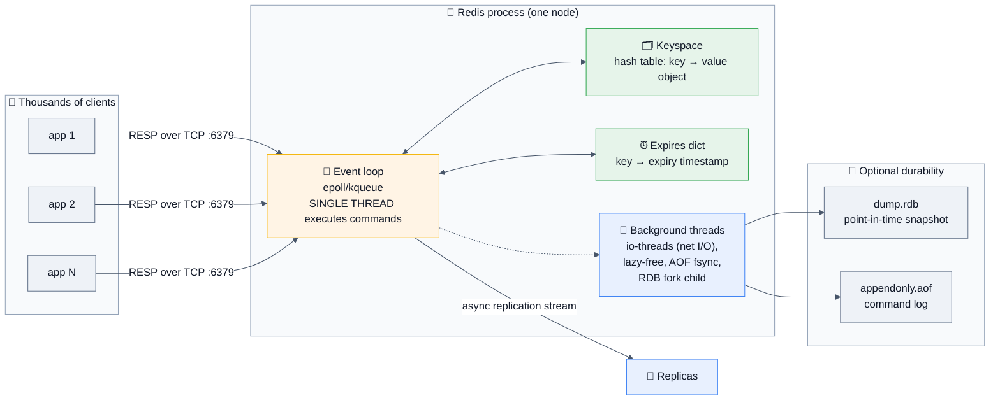

### The one-liner to open with

> *"Redis is an in-memory data-structure server that executes commands on a single thread, which makes every command atomic for free and makes latency extremely predictable — as long as you never issue an O(N) command over a large collection, because that blocks everything."*

## 1.2 Why does it exist? History that actually matters

| Year | Event | Why it matters in an interview |
|------|-------|-------------------------------|
| **2009** | **Salvatore Sanfilippo (antirez)** builds Redis for LLOOGG, a real-time analytics product, because MySQL couldn't keep up with the write rate. | Redis was born to solve a *speed* problem, not a *storage* problem. |
| 2010–2012 | VMware then Pivotal sponsor development. Replication, persistence, Lua scripting, Sentinel. | |
| 2013 | Redis Cluster work begins; **Redis Labs** (later Redis Ltd.) founded. | |
| 2015 | **Redis 3.0** — Redis Cluster GA (16384 hash slots). | The sharding model every interview asks about. |
| 2017 | **Redis 4.0** — modules API, `PSYNC2` partial resync, lazy freeing (`UNLINK`). | |
| 2018 | **Redis 5.0** — **Streams** (`XADD`/`XREADGROUP`), a proper log data type. | Kafka-lite in Redis; a common design-round answer. |
| 2020 | **Redis 6.0** — **ACLs**, **TLS**, **RESP3**, client-side caching (tracking), threaded I/O. **antirez steps down as maintainer.** | ACL and TLS are the security-round answers. |
| 2022 | **Redis 7.0** — **Functions** (a better `EVAL`), sharded pub/sub, multi-part AOF, ACL v2. | |
| **Mar 2024** | 🔥 **License change: BSD-3 → RSALv2 + SSPLv1.** Within days AWS, Google, Oracle, Ericsson, and Snap fork Redis 7.2.4 as **Valkey**, donated to the **Linux Foundation** under BSD-3. | **The most-asked "industry awareness" question of 2025–2026.** |
| **May 2025** | **Redis 8.0 GA** — **vector sets** (antirez returns and writes it), **Redis Query Engine**, Stack modules (JSON/Search/TimeSeries/Bloom) merged into core, 30+ perf improvements. **AGPLv3 added** as a third license option; "Community Edition" → **"Redis Open Source."** | The "is Redis open source again?" question. |
| **Oct 2025** | **Valkey 9 GA** — multiple logical DBs in cluster mode, atomic slot migration, official JSON/Bloom/vector modules, >1B req/s on a 2,000-node benchmark. | |
| **2026** | **Redis 8.4**: `FT.HYBRID`, `CLUSTER MIGRATION` atomic slot migration, compare-and-set, `MSETEX`, SIMD ops. **Redis 8.6** (March). **Redis 8.8** (May): **Array** data type, big Search/JSON/HLL/`MGET`/`HGETALL` gains. | The "what's new?" answer. |

**The problems Redis was built to solve:**

- 🎯 **Latency** — a database round trip is milliseconds; a Redis round trip is microseconds plus network.
- 🎯 **Read amplification** — the same expensive query answered 10,000 times/second should be computed once.
- 🎯 **Shared ephemeral state** — sessions, rate-limit counters, locks, feature flags, and job queues need a fast place to live that all your stateless app servers can see.
- 🎯 **Data structures over the network** — a leaderboard, a set intersection, a sliding window, or a de-dup filter, implemented once, correctly, atomically, and available to every service.

## 1.3 Real-world analogies (use these; interviewers remember them)

| Concept | Analogy |
|---------|---------|
| **Redis itself** | A **whiteboard in a shared office**. Instantly readable by everyone, instantly writable, and *wiped if the building loses power* unless somebody photographs it (persistence). You don't keep the company's accounts on a whiteboard. |
| **Single-threaded execution** | A **single bank teller who is extremely fast**. There's never a dispute about who goes first — but if one customer asks the teller to count a million coins (`KEYS *`, a big `SORT`, a slow Lua script), **every other person in the queue waits.** |
| **Cache-aside** | A **desk drawer** vs the **filing room**. Check the drawer; if it's empty, walk to the filing room, copy the document, put a copy in the drawer, and remember to throw it away eventually (TTL). |
| **Cache stampede** | Everyone's drawer copy **expires at the same instant** → the whole office stampedes to the filing room simultaneously and knocks the door down. |
| **TTL / expiration** | **Milk with a use-by date.** Redis doesn't check every carton constantly; it checks when you reach for one (lazy expiry) and spot-checks a random handful periodically (active expiry). |
| **Eviction policy** | A **full closet**. When you buy a new shirt and there's no room, `allkeys-lru` throws out the one you haven't worn longest; `volatile-ttl` throws out the one expiring soonest; `noeviction` refuses to let you buy the shirt at all. |
| **RDB vs AOF** | **Photograph vs. diary.** RDB is a photo of the room every hour — fast to take, fast to restore, and you lose everything since the last photo. AOF is writing down every action as it happens — safer, bigger, slower to replay. |
| **Replication (async)** | A **secretary copying your notes a moment after you write them**. If you get hit by a bus mid-sentence, the copy is missing the last line. **This is why Redis failover can lose writes.** |
| **Cluster hash slots** | **16,384 numbered pigeonholes** distributed among staff. The key's name decides its pigeonhole (CRC16 mod 16384), so anyone can compute where a key lives without asking. Rebalancing = handing pigeonholes to a new colleague. |
| **Pipelining** | Instead of **one letter per postal round trip**, you post 100 letters in one envelope. Same work at the destination, 100× fewer round trips. |
| **Hot key** | One pigeonhole that **everyone in the building visits every second** — the person guarding it is overwhelmed no matter how many other staff you hire. |
| **Bloom filter** | A **bouncer with a fuzzy memory**: "definitely not on the list" is reliable; "probably on the list" needs checking. Never a false negative, sometimes a false positive. |

## 1.4 The data types — the core of every Redis interview

```mermaid
%%{init: {'theme':'base','themeVariables':{'background':'#ffffff','mainBkg':'#eef2f7','primaryColor':'#eef2f7','primaryTextColor':'#111827','primaryBorderColor':'#64748b','secondaryColor':'#e8f0fe','tertiaryColor':'#f1f5f9','lineColor':'#475569','textColor':'#111827','clusterBkg':'#f8fafc','clusterBorder':'#94a3b8','edgeLabelBackground':'#ffffff','titleColor':'#111827','actorBkg':'#eef2f7','actorTextColor':'#111827','actorBorder':'#64748b','actorLineColor':'#475569','signalColor':'#111827','signalTextColor':'#111827','noteBkgColor':'#fff4e5','noteTextColor':'#111827','noteBorderColor':'#d97706','labelBoxBkgColor':'#eef2f7','labelBoxBorderColor':'#64748b','labelTextColor':'#111827','loopTextColor':'#111827','altBackground':'#f8fafc'}}}%%
flowchart TD
    Q{"What shape is<br/>your data?"}
    Q --> A["Single blob / counter /<br/>serialized object"] --> STR["📄 String<br/>SET GET INCR APPEND<br/>SETRANGE GETRANGE"]
    Q --> B["Ordered sequence,<br/>push/pop at ends"] --> LST["📜 List<br/>LPUSH RPOP LRANGE<br/>BLPOP LMOVE"]
    Q --> C["Object with fields"] --> HSH["🗃️ Hash<br/>HSET HGET HGETALL<br/>HINCRBY HRANDFIELD"]
    Q --> D["Unique membership,<br/>set algebra"] --> SET["🎯 Set<br/>SADD SISMEMBER<br/>SINTER SUNION SPOP"]
    Q --> E["Ranked / scored,<br/>range queries"] --> ZST["🏆 Sorted Set<br/>ZADD ZRANGE ZRANK<br/>ZRANGEBYSCORE ZPOPMIN"]
    Q --> F["Append-only log,<br/>consumer groups"] --> STM["🌊 Stream<br/>XADD XREADGROUP<br/>XACK XAUTOCLAIM"]
    Q --> G["Per-user flags at<br/>huge scale"] --> BIT["🔢 Bitmap<br/>SETBIT BITCOUNT BITOP"]
    Q --> H["Approximate<br/>cardinality"] --> HLL["📊 HyperLogLog<br/>PFADD PFCOUNT PFMERGE"]
    Q --> I["Location / radius"] --> GEO["🌍 Geospatial<br/>GEOADD GEOSEARCH"]
    Q --> J["Embeddings /<br/>semantic search"] --> VEC["🧠 Vector set 🆕 8.0<br/>VADD VSIM VREM"]
    Q --> K["Indexed collection"] --> ARR["🧱 Array 🆕 8.8"]

    style STR fill:#e6f4ea,stroke:#34a853,color:#111827
    style LST fill:#e6f4ea,stroke:#34a853,color:#111827
    style HSH fill:#e6f4ea,stroke:#34a853,color:#111827
    style SET fill:#e6f4ea,stroke:#34a853,color:#111827
    style ZST fill:#e6f4ea,stroke:#34a853,color:#111827
    style STM fill:#e8f0fe,stroke:#4285f4,color:#111827
    style BIT fill:#e8f0fe,stroke:#4285f4,color:#111827
    style HLL fill:#e8f0fe,stroke:#4285f4,color:#111827
    style GEO fill:#e8f0fe,stroke:#4285f4,color:#111827
    style VEC fill:#fff4e5,stroke:#f4b400,color:#111827
    style ARR fill:#fff4e5,stroke:#f4b400,color:#111827
```

### 1.4.1 String — the workhorse

```redis
SET user:1001:name "Asha" EX 3600 NX     # NX = only if absent; EX = TTL seconds
GET user:1001:name
SETEX session:abc 1800 "{...}"           # equivalent to SET ... EX
MSET a 1 b 2 c 3                         # multi-set, one round trip
MGET a b c
MSETEX 60 a 1 b 2                        # 🆕 8.4: multi-set WITH a TTL
INCR page:views                          # atomic counter — no read-modify-write
INCRBY page:views 10
INCRBYFLOAT price 9.99
APPEND log:line " more text"
STRLEN key
SETRANGE / GETRANGE key 0 9              # treat the string as a byte array
GETDEL key                               # atomic get-and-delete (6.2+)
GETEX key EX 60                          # atomic get-and-set-TTL (6.2+)
SET key val IFEQ old_val                 # 🆕 8.4: native compare-and-set
```

- **Max size: 512 MB** per string (a favourite trivia question).
- Holds **anything**: text, JSON, protobuf, JPEGs, counters, bitmaps.
- `INCR` is the canonical example of "atomic because single-threaded" — no `WATCH`, no lock, no CAS needed.

### 1.4.2 List — a linked list (quicklist)

```redis
LPUSH queue:jobs "job1"          # push left
RPUSH queue:jobs "job2"          # push right
LPOP  queue:jobs                 # pop left    → FIFO with RPUSH+LPOP
RPOP  queue:jobs                 # pop right   → LIFO with RPUSH+RPOP
LPOP  queue:jobs 5               # ✅ pop multiple (6.2+)
BLPOP queue:jobs 30              # ⏳ BLOCKING pop, 30s timeout — a real work queue
BRPOPLPUSH src dst 0             # legacy reliable queue
LMOVE src dst LEFT RIGHT         # ✅ 6.2+ replacement, clearer semantics
BLMOVE src dst LEFT RIGHT 0      # ✅ blocking + reliable
LRANGE queue:jobs 0 -1           # ⚠️ O(N) — never on a huge list
LLEN / LTRIM key 0 999           # LTRIM = capped list (keep last 1000)
```

- **Use for:** simple job queues, capped activity logs (`LPUSH` + `LTRIM`), recent-items lists.
- **The reliable-queue pattern:** `BLMOVE work processing LEFT RIGHT 0` moves the item atomically to a processing list so a crashed worker's job isn't lost — then `LREM` it on success. This is the answer to *"how do you avoid losing a job if the worker dies?"*

### 1.4.3 Hash — an object

```redis
HSET user:1001 name "Asha" age 30 city "Pune"
HGET user:1001 name
HMGET user:1001 name age
HGETALL user:1001                # ⚠️ O(N) — fine for 20 fields, bad for 100k
HINCRBY user:1001 login_count 1
HDEL user:1001 city
HRANDFIELD user:1001 2 WITHVALUES
HSCAN user:1001 0 COUNT 100      # ✅ cursor-based, safe on big hashes
HEXPIRE user:1001 60 FIELDS 1 name   # 🆕 7.4: per-FIELD TTL — big deal
```

- **Memory-efficient**: a small hash is stored as a **listpack** (a flat, compact array), not a real hash table.
- **The classic optimization:** storing 1 M objects as 1 M hashes of 5 fields uses far less memory than 5 M separate string keys — one key overhead instead of five.
- 🆕 **Field-level TTL** (`HEXPIRE`, Redis 7.4+) removed a long-standing limitation and is a great "what's new?" answer.

### 1.4.4 Set — unique membership

```redis
SADD tags:post:1 "redis" "database" "cache"
SISMEMBER tags:post:1 "redis"    # O(1)
SMISMEMBER tags:post:1 a b c     # ✅ 6.2+, batch membership
SCARD tags:post:1
SMEMBERS tags:post:1             # ⚠️ O(N)
SRANDMEMBER key 3                # random sample
SPOP key 1                       # random pop (raffles, work distribution)
SINTER  set1 set2                # ⚠️ O(N*M) — mutual friends, tag intersection
SINTERCARD 2 set1 set2 LIMIT 10  # ✅ 7.0+: just the count, with an early exit
SUNIONSTORE dest s1 s2
SDIFF s1 s2
SSCAN key 0 COUNT 100
```

- **Use for:** unique visitors, tags, follower sets, "has this user seen X?", deduplication.

### 1.4.5 Sorted Set (ZSet) — the most powerful structure

```redis
ZADD leaderboard 5000 "alice" 4200 "bob"
ZADD leaderboard GT 5100 "alice"       # ✅ only update if greater (6.2+)
ZINCRBY leaderboard 100 "alice"
ZSCORE  leaderboard "alice"
ZRANK   leaderboard "alice"            # 0-based, ascending
ZREVRANK leaderboard "alice"           # descending → actual "rank #1"
ZRANGE  leaderboard 0 9 REV WITHSCORES # ✅ top 10 (7.0 unified syntax)
ZRANGEBYSCORE leaderboard 1000 2000
ZRANGEBYLEX   key "[a" "(c"            # lexicographic, when all scores are equal
ZCOUNT  leaderboard 1000 2000
ZREMRANGEBYSCORE window 0 1719999999   # ✅ sliding-window rate limiter
ZPOPMIN / ZPOPMAX / BZPOPMIN           # priority queue / delayed queue
ZRANDMEMBER key 3 WITHSCORES
ZDIFF / ZINTER / ZUNION ... WITHSCORES
```

- **Implementation: a skip list + a hash table.** The hash gives O(1) member→score; the skip list gives O(log N) ordered operations. **Saying "skip list plus hash map" is a strong signal.**
- **Use for:** leaderboards, priority queues, delayed jobs (score = run-at timestamp), sliding-window rate limiters, secondary indexes, time-series-ish range queries.

### 1.4.6 Stream — an append-only log with consumer groups

```redis
XADD events * user_id 1001 action "click"        # * = auto-generated ID (ms-seq)
XADD events MAXLEN ~ 1000000 * ...               # ✅ capped, ~ = approximate (cheap)
XLEN events
XRANGE events - + COUNT 10
XREAD COUNT 10 BLOCK 0 STREAMS events $          # tail the stream

XGROUP CREATE events workers $ MKSTREAM
XREADGROUP GROUP workers worker-1 COUNT 10 BLOCK 2000 STREAMS events >
XACK events workers 1719-0                       # acknowledge
XPENDING events workers                          # what's unacked?
XAUTOCLAIM events workers worker-2 60000 0       # ✅ 6.2+: steal stale messages
```

- **The Kafka comparison is guaranteed to come up.** Streams give you: persistence, consumer groups, at-least-once delivery, per-consumer pending lists, and message IDs. They do **not** give you: Kafka's disk-based retention of terabytes, partition-level parallelism, or the ecosystem. **Streams are for "durable-ish queue at Redis scale," not "event backbone for the company."**

### 1.4.7 The specialist types

```redis
# 🔢 Bitmap — 1 bit per user. 10 M users of daily-active = 1.25 MB.
SETBIT dau:2026-08-11 1001 1
BITCOUNT dau:2026-08-11
BITOP AND dest dau:2026-08-10 dau:2026-08-11   # 2-day retention
BITPOS key 1
BITFIELD counter INCRBY u8 0 1                 # packed sub-integer counters

# 📊 HyperLogLog — count unique items in ~12 KB, ±0.81% standard error
PFADD visitors:2026-08-11 user1 user2 user3
PFCOUNT visitors:2026-08-11
PFMERGE visitors:week visitors:2026-08-05 visitors:2026-08-06

# 🌍 Geospatial (a sorted set under the hood, geohash-encoded scores)
GEOADD drivers 72.8777 19.0760 "driver:42"
GEOSEARCH drivers FROMLONLAT 72.87 19.07 BYRADIUS 5 km ASC COUNT 10 WITHDIST

# 🧠 Vector set 🆕 8.0 — semantic search / RAG in core Redis
VADD docs VALUES 4 0.1 0.2 0.3 0.4 "doc:1"
VSIM docs VALUES 4 0.1 0.2 0.3 0.4 COUNT 10 WITHSCORES

# 🔎 Query Engine / JSON 🆕 8.0 (formerly Redis Stack modules, now core)
JSON.SET product:1 $ '{"name":"Shoe","price":99,"tags":["sale"]}'
JSON.GET product:1 $.price
FT.CREATE idx ON JSON PREFIX 1 product: SCHEMA $.name AS name TEXT $.price AS price NUMERIC
FT.SEARCH idx "@price:[50 150] shoe"
FT.HYBRID ...        # 🆕 8.4: combine vector similarity + full-text/filters

# 🎲 Probabilistic (core since 8.0)
BF.ADD seen "user:1001"        BF.EXISTS seen "user:1001"     # Bloom filter
CF.ADD / CF.DEL                                                # Cuckoo (supports delete)
CMS.INCRBY traffic "ip1" 1                                     # Count-Min Sketch
TOPK.ADD trending "post:99"                                    # heavy hitters
TDIGEST.ADD latencies 12.4     TDIGEST.QUANTILE latencies 0.99 # percentiles
```

## 1.5 Common misconceptions ❌ → ✅

| ❌ Misconception | ✅ Reality |
|------------------|-----------|
| "Redis is just a cache." | Caching is the most common use. Redis is a data-structure server used for queues, locks, rate limiting, sessions, leaderboards, pub/sub, streams, geospatial, dedup, and vector search. |
| "Redis is single-threaded, so it's slow." | Backwards. Single-threading **removes** lock contention and context switching; a single Redis core does 100k+ ops/sec. The real limits are **network round trips** (fix with pipelining) and **O(N) commands**. |
| "Redis is fully single-threaded." | Command *execution* is. Since 6.0, **I/O threads** (`io-threads`) can parallelize socket reads/writes; `UNLINK`/lazy-free, AOF fsync, and RDB snapshotting happen off the main thread or in a forked child. |
| "Redis is not durable / always loses data." | It has RDB, AOF, and both together. With `appendfsync everysec` you lose at most ~1 second; with `always` you lose nothing but pay heavily. **The real durability gap is asynchronous replication + failover**, not persistence. |
| "`SETNX` gives you a safe distributed lock." | `SETNX` **without an expiry deadlocks forever** if the holder crashes. Use `SET key token NX PX ttl` and delete via a Lua compare-and-delete. And even then — see §3.6 on Redlock's contested safety. |
| "`EXPIRE` deletes the key exactly on time." | Expiration is **lazy** (on access) plus **active** (random sampling ~10×/sec). A key can linger in memory past its TTL. It will never be *served* after expiry, but it does still occupy RAM. |
| "Replication makes Redis durable." | Replication is **asynchronous by default**. A primary can acknowledge a write and die before any replica receives it. `WAIT` improves this but **is not a consensus protocol** — it doesn't make Redis linearizable. |
| "Redis Cluster gives you strong consistency." | Explicitly not. The Redis docs say Cluster is **not** strongly consistent: writes acked by a primary can be lost during a failover. |
| "`KEYS *` is fine, it's fast." | 💀 `KEYS` is **O(N) over the entire keyspace and blocks the single thread.** On a 50 M-key instance it's a multi-second full outage. Use `SCAN`. This is *the* classic production incident. |
| "`FLUSHALL` in prod is recoverable." | It isn't, unless you have a recent RDB and stop the process before it overwrites it. |
| "Redis can hold more data than RAM." | No. The whole dataset must fit in RAM (plus overhead and fork headroom). Redis Enterprise/others offer flash tiering; open-source Redis does not. |
| "A bigger Redis instance solves a hot key." | No. A hot key lives on **one** shard, on **one** thread. Sharding doesn't help; you need local caching, key splitting, or read replicas. |
| "Redis and Valkey are totally different now." | As of 2026 they remain highly compatible for core commands and protocols, and have diverged on modules, licensing, and some newer features. Migration is usually straightforward; know both. |
| "Pub/Sub is a message queue." | Pub/Sub is **fire-and-forget with no persistence**. A subscriber that's offline misses everything. For a queue you want **Streams** or a List. |
| "`MULTI`/`EXEC` is a transaction with rollback." | It's atomic batching with **no rollback**. A command that fails at runtime doesn't undo the others. There's no `ROLLBACK` in Redis. |

## 1.6 Your first fifteen commands (redis-cli fluency counts)

```bash
redis-cli                                # connect
redis-cli -h host -p 6379 -a pass --tls  # remote + auth + TLS
redis-cli --scan --pattern 'user:*'      # ✅ SCAN-based, safe
redis-cli --bigkeys                      # ✅ find the memory hogs
redis-cli --hotkeys                      # requires an LFU maxmemory-policy
redis-cli --memkeys                      # sample memory usage per key
redis-cli --latency / --latency-history  # ✅ measure round-trip latency
redis-cli --stat                         # live ops/sec, memory, clients
redis-cli --intrinsic-latency 100        # is the SERVER or the network slow?
redis-cli monitor                        # ⚠️ every command — huge perf hit, debug only
```

```redis
INFO                       # everything; INFO memory / replication / stats / clients
DBSIZE                     # number of keys
TYPE key                   # what data type is this?
TTL key / PTTL key         # -1 = no expiry, -2 = key doesn't exist  ← memorize this
OBJECT ENCODING key        # listpack? intset? skiplist? — the memory-tuning lever
MEMORY USAGE key           # bytes for one key
SLOWLOG GET 10             # ✅ the first thing to check on a slow Redis
CLIENT LIST                # who's connected
CONFIG GET maxmemory*      # runtime config
LATENCY DOCTOR             # built-in advice — nice thing to name-drop
```

> [!TIP]
> **A small detail that reads as real experience:** `TTL` returns **-1** for a key with no expiry and **-2** if the key doesn't exist. Candidates who know this have actually debugged a cache.

---
# 2. 🧩 Intermediate Concepts

## 2.1 The single-threaded event loop — the mental model everything hangs off

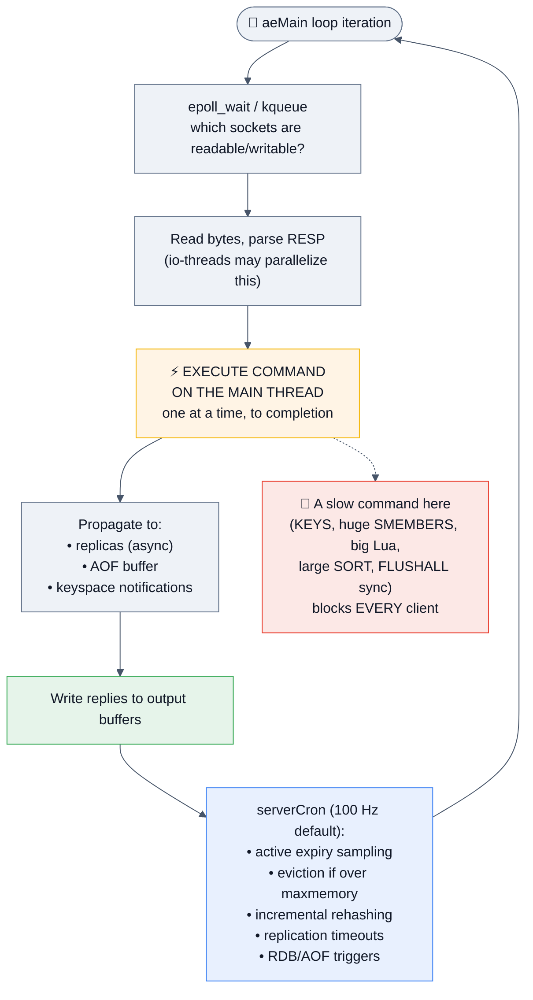

### The four consequences to recite

| Consequence | What it buys / costs |
|-------------|----------------------|
| **Every command is atomic, for free** | No locks, no CAS, no race between `GET` and `SET` inside `INCR`. This is why `INCR`, `SETNX`, `ZADD GT`, and `LMOVE` are safe primitives. |
| **Latency is predictable — until it isn't** | p99 is sub-millisecond as long as every command is O(1) or bounded. One O(N) command over 10 M elements is a **cluster-wide latency event**. |
| **One core is the ceiling for command execution** | You scale by adding **more shards** (more processes), not more threads. This is why Redis Cluster exists and why a **hot key can't be scaled away**. |
| **Blocking anything blocks everything** | `DEBUG SLEEP`, a synchronous `FLUSHALL`, `SAVE`, a runaway Lua script, or `DEL` on a 5 GB key all stall the loop. Hence `UNLINK`, `FLUSHALL ASYNC`, `lazyfree-*`, and `busy-reply-threshold`. |

### Threading, precisely (2026 answer)

```ini
io-threads 4              # parallelize socket read/parse and write (6.0+; reads since 6.0/7.0 defaults vary)
io-threads-do-reads yes   # (config differs by version — 8.x enables more by default)
lazyfree-lazy-eviction yes
lazyfree-lazy-expire yes
lazyfree-lazy-server-del yes
replica-lazy-flush yes
```

> [!TIP]
> **The precise thing to say:** *"Redis executes commands on one thread, but it is not a single-threaded process. Since 6.0 there are I/O threads for socket read/write and RESP parsing, a background thread pool for lazy freeing of large objects and AOF fsync, and RDB persistence happens in a forked child. What stays serialized — deliberately — is the command execution itself, because that's what gives you atomicity without locks."*

## 2.2 Memory model and encodings — where the "how do you halve memory?" answer lives

Redis picks a **compact encoding** for small collections and switches to the "real" structure when a threshold is crossed. `OBJECT ENCODING key` shows which.

| Type | Compact encoding | Switches to | Thresholds (configurable) |
|------|------------------|-------------|---------------------------|
| String | `int` (shared integers 0–9999), `embstr` (≤44 bytes, one allocation) | `raw` | 44 bytes |
| List | `listpack` | `quicklist` (linked list of listpacks) | `list-max-listpack-size 128` |
| Hash | `listpack` | `hashtable` | `hash-max-listpack-entries 128`, `hash-max-listpack-value 64` |
| Set | `intset` (all integers) / `listpack` | `hashtable` | `set-max-intset-entries 512`, `set-max-listpack-entries 128` |
| Sorted Set | `listpack` | `skiplist` + hashtable | `zset-max-listpack-entries 128`, `zset-max-listpack-value 64` |

> [!IMPORTANT]
> **The classic memory-optimization interview answer:** *"Instead of 10 million string keys like `user:1001:name`, I'd bucket them into hashes — `HSET users:10 1001 'Asha'` — so ~1000 fields per hash stay under the listpack threshold. You pay one key's overhead per bucket instead of per value, and a listpack is a flat contiguous array with almost no per-entry overhead. Instagram documented roughly a 5× memory reduction with exactly this technique. The trade-off is that listpack operations are O(N) over a small N, so you tune the bucket size, and you lose per-key TTLs — though 7.4's `HEXPIRE` gives per-field TTLs back."*

### Where the memory actually goes

```redis
INFO memory
# used_memory              → what Redis's allocator has handed out
# used_memory_rss          → what the OS thinks the process uses
# mem_fragmentation_ratio  → rss / used_memory
#      ~1.0–1.5 healthy | >1.5 fragmentation | <1.0 SWAPPING 💀 (page immediately)
# used_memory_peak         → the high-water mark (drives your provisioning)
# maxmemory / maxmemory_policy
# mem_allocator            → jemalloc usually

MEMORY DOCTOR         # built-in diagnosis
MEMORY STATS          # detailed breakdown incl. per-db overhead, client buffers
MEMORY USAGE key SAMPLES 0
```

**Overhead facts worth knowing:** every key carries a `robj` header, a dict entry, and (if it has a TTL) an entry in the expires dict — roughly **~50–100 bytes of overhead per key** before the value. That's why "1 billion tiny keys" is a memory disaster and bucketing wins.

**Fragmentation:** `activedefrag yes` (jemalloc only) lets Redis actively defragment while running. If `mem_fragmentation_ratio < 1`, the OS is **swapping Redis to disk** — the worst possible state for an in-memory database, and an instant page.

## 2.3 Persistence: RDB vs AOF

```mermaid
%%{init: {'theme':'base','themeVariables':{'background':'#ffffff','mainBkg':'#eef2f7','primaryColor':'#eef2f7','primaryTextColor':'#111827','primaryBorderColor':'#64748b','secondaryColor':'#e8f0fe','tertiaryColor':'#f1f5f9','lineColor':'#475569','textColor':'#111827','clusterBkg':'#f8fafc','clusterBorder':'#94a3b8','edgeLabelBackground':'#ffffff','titleColor':'#111827','actorBkg':'#eef2f7','actorTextColor':'#111827','actorBorder':'#64748b','actorLineColor':'#475569','signalColor':'#111827','signalTextColor':'#111827','noteBkgColor':'#fff4e5','noteTextColor':'#111827','noteBorderColor':'#d97706','labelBoxBkgColor':'#eef2f7','labelBoxBorderColor':'#64748b','labelTextColor':'#111827','loopTextColor':'#111827','altBackground':'#f8fafc'}}}%%
flowchart TB
    subgraph RDBFLOW["📸 RDB — point-in-time snapshot"]
        R1["BGSAVE triggered<br/>(save rules, manual, or replica sync)"]
        R2["fork() → child process<br/>⚠️ copy-on-write memory"]
        R3["Child serializes the whole<br/>dataset to a temp file"]
        R4["Atomic rename → dump.rdb"]
        R1 --> R2 --> R3 --> R4
    end
    subgraph AOFFLOW["📝 AOF — command log"]
        A1["Write command to AOF buffer<br/>(after execution)"]
        A2["Flush to OS page cache"]
        A3["fsync per appendfsync policy:<br/>always | everysec | no"]
        A4["Background rewrite when it grows<br/>(multi-part AOF since 7.0:<br/>base RDB + incremental files)"]
        A1 --> A2 --> A3 --> A4
    end

    RDBFLOW --> BEST["✅ Production default:<br/>BOTH enabled.<br/>AOF for the ~1s RPO,<br/>RDB for fast restore & backups.<br/>aof-use-rdb-preamble yes"]
    AOFFLOW --> BEST

    style RDBFLOW fill:#e8f0fe,stroke:#4285f4,color:#111827
    style AOFFLOW fill:#fff4e5,stroke:#f4b400,color:#111827
    style BEST fill:#e6f4ea,stroke:#34a853,color:#111827
```

| | **RDB** | **AOF** |
|---|---|---|
| What it stores | Binary snapshot of the whole dataset | Every write command, in RESP |
| Durability (RPO) | Minutes (whatever your `save` rules say) | `always` ≈ 0 · `everysec` ≈ 1 s · `no` ≈ OS-dependent |
| File size | **Compact** | Larger (mitigated by rewrites) |
| Restart/load speed | **Fast** | Slower (replays commands) |
| CPU/memory cost | `fork()` + COW spike; can double RSS worst case | Continuous small writes; periodic rewrite forks |
| Effect on latency | The **fork** can cause a multi-hundred-ms stall on large datasets | `appendfsync always` adds per-write latency |
| Best for | Backups, DR, fast restarts, replica bootstrap | Minimizing data loss |
| Corruption recovery | `redis-check-rdb` | `redis-check-aof --fix` (truncates a partial tail) |

```ini
# Production default that answers the question well
save 900 1
save 300 10
save 60 10000
appendonly yes
appendfsync everysec          # ✅ the pragmatic 99% answer
aof-use-rdb-preamble yes      # AOF starts with an RDB blob → fast load + safe tail
auto-aof-rewrite-percentage 100
auto-aof-rewrite-min-size 64mb
stop-writes-on-bgsave-error yes   # ⚠️ if the disk fills, Redis REFUSES WRITES. Know this.
rdb-save-incremental-fsync yes
```

> [!WARNING]
> **The `fork()` question — a top Staff-level probe.** `BGSAVE` and AOF rewrite call `fork()`. The child shares the parent's pages **copy-on-write**; every page the parent writes must be copied. On a **write-heavy 50 GB instance, RSS can approach 2×** during the snapshot, and the fork itself (copying page tables) can stall the main thread for **hundreds of milliseconds**. Mitigations to name:
> - Keep instances small — **prefer many 10–25 GB shards over one 200 GB monster.**
> - Snapshot on a **replica**, not the primary.
> - Set `vm.overcommit_memory = 1` (Redis warns about this at boot for exactly this reason).
> - **Disable transparent huge pages** (`never`) — THP makes COW copy 2 MB pages instead of 4 KB, dramatically worsening the spike. This is a canonical Redis-on-Linux tuning item.

> [!TIP]
> **The best answer to "RDB or AOF?"** — *"Both, and then the real question: what's my RPO? If Redis is a pure cache, I might disable persistence entirely and rely on a cold-start warm-up, because the fork cost buys me nothing. If it holds sessions or a queue, AOF `everysec` plus RDB for backups. And regardless — persistence protects against a process restart, not against a host loss or a failover. Durability across nodes is a replication question, and Redis replication is asynchronous, so I'd never treat Redis as the system of record for anything I can't reconstruct."*

## 2.4 Expiration — lazy plus active

Redis stores TTLs in a separate `expires` dictionary. Keys are removed by **two mechanisms**:

1. **Lazy (passive):** on every access, if the key is expired, delete it and return nil. Zero CPU cost when nobody looks — but the memory stays occupied.
2. **Active:** ~10 times per second (`hz 10`), `activeExpireCycle` samples 20 random keys from the expires dict; if >25% were expired, it repeats immediately. This probabilistic loop keeps the expired fraction statistically low without ever scanning the whole keyspace.

```redis
EXPIRE key 60           # seconds
PEXPIRE key 60000       # ms
EXPIREAT key <unix-ts>
EXPIRE key 60 NX        # ✅ 7.0+: only if no TTL exists (also XX, GT, LT)
PERSIST key             # remove the TTL
TTL key                 # -1 no TTL, -2 no key
```

**Interview details that matter:**
- **Replicas do not expire keys themselves.** The primary sends an explicit `DEL`/`UNLINK` when a key expires. A replica may still hold an expired key in memory, but it will **not serve it** — reads on the replica check logical expiry. This prevents primary/replica divergence.
- **Writes reset behaviour varies:** `SET` **clears** an existing TTL (unless you use `KEEPTTL`); `INCR`, `LPUSH`, `HSET`, `SETRANGE`, etc. **preserve** it. This asymmetry causes real bugs — `SET key val` on a session key silently makes it immortal.
- A large batch of keys expiring simultaneously creates a **CPU spike and a cache stampede**. Jitter your TTLs.

## 2.5 Eviction — what happens when memory runs out

```ini
maxmemory 8gb
maxmemory-policy allkeys-lru
maxmemory-samples 5        # LRU/LFU are APPROXIMATE — sampled, not exact
```

| Policy | Behaviour | Use when |
|--------|-----------|----------|
| **`noeviction`** (default) | **Writes fail** with an OOM error; reads still work | Redis is a **datastore**, not a cache — you want to know, not silently lose data |
| **`allkeys-lru`** ⭐ | Evict the approximately least-recently-used key, TTL or not | **Pure cache — the most common correct answer** |
| **`allkeys-lfu`** | Evict the least-**frequently**-used (with decay) | Cache with a stable hot set; better than LRU when a scan would otherwise flush your hot keys |
| `allkeys-random` | Evict a random key | Uniform access patterns; cheapest |
| `volatile-lru` | LRU **among keys with a TTL only** | Mixed workload: cache entries have TTLs, persistent data doesn't |
| `volatile-lfu` | LFU among keys with a TTL | Same, frequency-based |
| `volatile-ttl` | Evict the key with the **shortest remaining TTL** first | Ordered expiry semantics |
| `volatile-random` | Random among TTL'd keys | |

> [!WARNING]
> **The trap everyone falls into:** with a `volatile-*` policy and **no keys carrying a TTL**, Redis has nothing eligible to evict, so it behaves like `noeviction` and **starts failing writes** while memory sits full. If you choose `volatile-*`, you must guarantee that evictable data has TTLs.

**LRU is approximate.** Redis doesn't maintain a true LRU list (too much memory); it samples `maxmemory-samples` keys and evicts the best candidate from that sample, using a pool of good candidates across calls. Raising samples to 10 gets closer to true LRU at more CPU. **LFU** uses an 8-bit logarithmic counter with time-based decay (`lfu-log-factor`, `lfu-decay-time`) — good to name.

```redis
INFO stats
# evicted_keys        → is eviction happening at all?
# expired_keys
# keyspace_hits / keyspace_misses  → hit ratio = hits / (hits + misses)
```

## 2.6 Transactions: `MULTI`/`EXEC`, `WATCH`, and why Lua usually wins

```redis
MULTI
  INCR counter
  LPUSH log "incremented"
EXEC            # both queued commands run, atomically, with nothing interleaved
DISCARD         # abandon the queued block
```

**Optimistic locking with `WATCH` (check-and-set):**

```redis
WATCH balance:1001
  # read it, compute in the application
GET balance:1001            # → 500
MULTI
  SET balance:1001 400
EXEC            # → nil if balance:1001 was modified by ANYONE since WATCH → retry
UNWATCH
```

| ❗ Property | Reality |
|------------|---------|
| Atomicity | ✅ Yes — commands between `MULTI` and `EXEC` execute with no other client interleaved |
| Isolation | ✅ Yes (single thread) |
| **Rollback** | ❌ **No.** If one command errors at runtime (e.g. `INCR` on a list), the others still apply. Redis's stance: those are programming errors and should be caught in development. |
| Syntax errors | Commands that fail to queue abort the whole `EXEC` (since 2.6.5) |
| In Cluster | All keys must hash to the **same slot** — use hash tags |

> [!TIP]
> **The senior answer:** *"`MULTI`/`EXEC` batches commands atomically but can't branch — you can't read a value and decide what to write inside the transaction. `WATCH` gives you optimistic concurrency but requires an application-side retry loop and a round trip. For anything conditional I'd use a **Lua script or a Redis Function**, because the whole script runs atomically on the server in one round trip, with real control flow. The cost is that a long script blocks the entire server, so scripts must be short, deterministic, and bounded."*

## 2.7 Lua scripting and Functions

```lua
-- Atomic compare-and-delete: THE correct way to release a distributed lock
-- KEYS[1] = lock key, ARGV[1] = my unique token
if redis.call("GET", KEYS[1]) == ARGV[1] then
    return redis.call("DEL", KEYS[1])
else
    return 0
end
```

```redis
EVAL "<script>" 1 lock:order:42 "token-abc"
SCRIPT LOAD "<script>"          # → sha1
EVALSHA <sha1> 1 lock:order:42 "token-abc"   # ✅ send the hash, not the script
```

**🆕 Redis Functions (7.0+) — the modern replacement for ad-hoc `EVAL`:**

```lua
#!lua name=mylib
redis.register_function('rate_limit', function(keys, args)
  local current = redis.call('INCR', keys[1])
  if current == 1 then redis.call('EXPIRE', keys[1], args[1]) end
  if current > tonumber(args[2]) then return 0 end
  return 1
end)
```
```redis
FUNCTION LOAD "#!lua name=mylib ..."   # persisted in RDB, replicated, survives restart
FCALL rate_limit 1 rl:user:1001 60 100
```

| | `EVAL`/`EVALSHA` | **Functions** (7.0+) |
|---|---|---|
| Persistence | Script cache is **lost on restart** — clients must handle `NOSCRIPT` and reload | ✅ Stored in RDB/AOF, replicated, survives restart |
| Organization | One anonymous script per call | Named libraries with multiple functions |
| Ops | Ad hoc, scattered across app code | Deployed and versioned like server-side code |

**Rules for scripts (say these):**
1. **Declare all keys in `KEYS`** — required for Cluster to route correctly; accessing an undeclared key is undefined behaviour.
2. **Be deterministic** — historically scripts were replicated verbatim; modern Redis replicates *effects*, but non-determinism still causes headaches. Use `redis.call('TIME')` carefully.
3. **Keep them short.** A script that runs 500 ms is a 500 ms outage for every other client. `busy-reply-threshold` (formerly `lua-time-limit`) controls when Redis starts replying `BUSY`; then only `SCRIPT KILL` (if no write has happened) or `SHUTDOWN NOSAVE` can save you.
4. **No unbounded loops** over collections whose size you don't control.

## 2.8 Pipelining — the single biggest client-side win

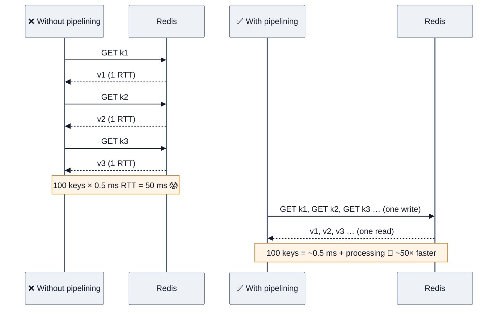

**Pipelining vs `MULTI` vs Lua — the distinction interviewers test:**

| | Round trips | Atomic? | Can branch? |
|---|---|---|---|
| **Pipelining** | 1 | ❌ No — other clients' commands may interleave | ❌ |
| **`MULTI`/`EXEC`** | 1 (if pipelined) | ✅ Yes | ❌ |
| **Lua / Function** | 1 | ✅ Yes | ✅ Yes |
| `MGET`/`MSET`/`HMGET` | 1 | ✅ (single command) | ❌ |

> [!TIP]
> **Say this:** *"Most 'Redis is slow' reports are actually 'the network is slow, called 500 times.' If an endpoint does 200 sequential `GET`s at 0.4 ms RTT, that's 80 ms of pure waiting and 0.2 ms of Redis work. Pipelining, `MGET`, or one Lua call collapses it. I'd cap pipeline batches at a few thousand commands so the reply buffer doesn't blow up client memory."*

## 2.9 Pub/Sub vs Streams vs Lists — choosing a messaging primitive

```redis
# 📢 Pub/Sub — fire-and-forget, at-most-once
SUBSCRIBE news
PSUBSCRIBE news.*
PUBLISH news "hello"
SPUBLISH / SSUBSCRIBE     # ✅ 7.0+ sharded pub/sub — scales in Cluster mode
```

| | **Pub/Sub** | **List (as a queue)** | **Stream** |
|---|---|---|---|
| Persistence | ❌ None | ✅ Until popped | ✅ Retained (capped by `MAXLEN`/`MINID`) |
| Offline consumer | **Misses everything** | Gets it later | Gets it later |
| Delivery | At-most-once | At-least-once (with `LMOVE`) | At-least-once, with explicit `XACK` |
| Consumer groups | ❌ (all subscribers get all messages) | ❌ (competing consumers, manual) | ✅ Native, with pending-entry lists |
| Replay / history | ❌ | ❌ | ✅ `XRANGE` any time window |
| Fan-out | ✅ Native broadcast | ❌ | ✅ Multiple groups each get everything |
| Blocking read | ✅ | ✅ `BLPOP`/`BLMOVE` | ✅ `XREAD BLOCK` |
| Backpressure | ⚠️ Slow subscriber → output buffer grows → **client killed** | Queue grows in memory | `MAXLEN` caps it |
| **Use for** | Live notifications, cache invalidation broadcast, chat presence | Simple work queues | Event sourcing, durable job queues, reliable fan-out |

> [!WARNING]
> **The Pub/Sub failure mode to name:** a subscriber that reads slowly makes Redis buffer messages in its **client output buffer**. When `client-output-buffer-limit pubsub` is exceeded (default: 32 MB hard / 8 MB for 60 s soft), **Redis disconnects the client** and those messages are gone forever. Pub/Sub has no backpressure and no acknowledgement — it is genuinely fire-and-forget.

**In Redis Cluster**, plain `PUBLISH` is broadcast to **every node** (expensive at scale). **`SPUBLISH`/`SSUBSCRIBE` (7.0+) shard the channel by slot** so the message only goes where it needs to. That's a strong "I've operated this" detail.

## 2.10 Client-side essentials

```ini
# Connection handling
timeout 0                       # 0 = never close idle connections
tcp-keepalive 300
maxclients 10000
```

- **Always use a connection pool.** Opening a TCP connection per operation is the most common naive-client mistake. Typical pool size: **a few dozen per app instance**, not hundreds — Redis is fast, so connections idle.
- **Client libraries to name:** `redis-py` / `Lettuce` & `Jedis` (Java) / `go-redis` / `node-redis` & `ioredis` / `StackExchange.Redis` (.NET) / `redis-rs`. Know that **Lettuce is Netty-based and thread-safe with a shared connection**, while **Jedis needs a pool** — a common Spring Boot interview detail.
- **RESP3** (Redis 6+, `HELLO 3`) adds typed replies (maps, sets, doubles), push messages, and enables **client-side caching (tracking)** — where Redis notifies your client to invalidate its local copy. That's the answer to *"how do you avoid the network round trip entirely?"*
- **Timeouts:** always set both a connect timeout and a command timeout on the client, shorter than your upstream request timeout. A Redis blip should degrade to a cache miss, not a hung thread pool.

---
# 3. 🚀 Advanced Concepts

## 3.1 Replication — and why it can lose your writes

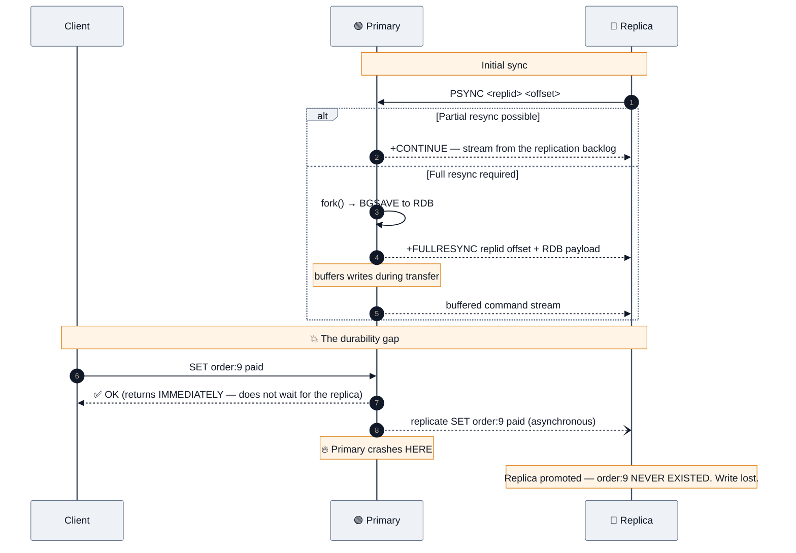

### The commands and settings

```redis
REPLICAOF host port          # make this node a replica (SLAVEOF is the deprecated alias)
REPLICAOF NO ONE             # promote to primary
INFO replication             # role, connected_slaves, master_repl_offset, slave_repl_offset
WAIT 2 1000                  # block until N replicas ack, or 1000 ms elapse
```

```ini
repl-backlog-size 64mb          # bigger backlog → more partial (cheap) resyncs
repl-backlog-ttl 3600
repl-diskless-sync yes          # ✅ stream the RDB straight over the socket, no disk write
repl-diskless-load on-empty-db
replica-read-only yes           # ✅ default; keep it
min-replicas-to-write 1         # ⚠️ refuse writes if fewer than N replicas are healthy
min-replicas-max-lag 10
```

> [!IMPORTANT]
> **`WAIT` is the most misunderstood command in Redis.** `WAIT numreplicas timeout` blocks until that many replicas have **acknowledged receipt** of all prior writes. What it does **not** do:
> - It does **not** make the write durable on disk (ack ≠ fsync).
> - It does **not** roll back if the timeout expires — it just returns a smaller number, and **the write already happened on the primary**.
> - It is **not consensus.** Redis has no leader election tied to write acknowledgement, so a failover can still promote a replica that lacked the write.
> **`WAIT` reduces the window of loss; it does not close it.** Saying this precisely is a strong Staff-level signal. (`WAITAOF numlocal numreplicas timeout`, added in 7.0, additionally waits for fsync — a better answer when durability is the concern.)

**Replication lag diagnosis:**
```redis
INFO replication
# On primary: master_repl_offset  vs  each slaveN:offset  → the byte gap
# On replica: master_link_status:up | down, master_last_io_seconds_ago
```
Causes, in order: a big `BGSAVE`/full resync in progress, network saturation, a slow-loading replica, a long-blocking command on the replica, or the replica being under-provisioned.

## 3.2 Redis Sentinel — HA without sharding

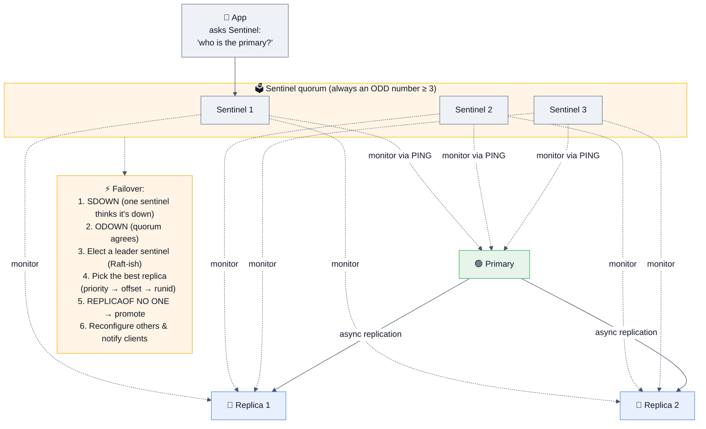

```ini
# sentinel.conf
sentinel monitor mymaster 10.0.0.10 6379 2     # 2 = quorum to declare ODOWN
sentinel down-after-milliseconds mymaster 5000
sentinel failover-timeout mymaster 60000
sentinel parallel-syncs mymaster 1             # replicas re-synced at a time after failover
```

**Key facts:**
- **SDOWN** = *subjectively* down (one Sentinel's opinion). **ODOWN** = *objectively* down (quorum agrees). Only ODOWN triggers failover.
- **Quorum vs majority:** `quorum` decides when to *declare* failure; a **majority of Sentinels** must still be reachable to *authorize* the failover. This is why you always run an odd number ≥ 3, ideally across failure domains.
- **The client must be Sentinel-aware** — it asks Sentinel for the current primary address and subscribes to `+switch-master`. A client hardcoded to an IP will keep writing to a demoted primary.
- **Sentinel gives HA, not sharding.** One primary handles all writes; the dataset must fit on one node.
- **Split-brain risk:** a partitioned old primary keeps accepting writes from clients on its side until it's reconfigured. `min-replicas-to-write 1` limits this by making an isolated primary refuse writes.

## 3.3 Redis Cluster — sharding

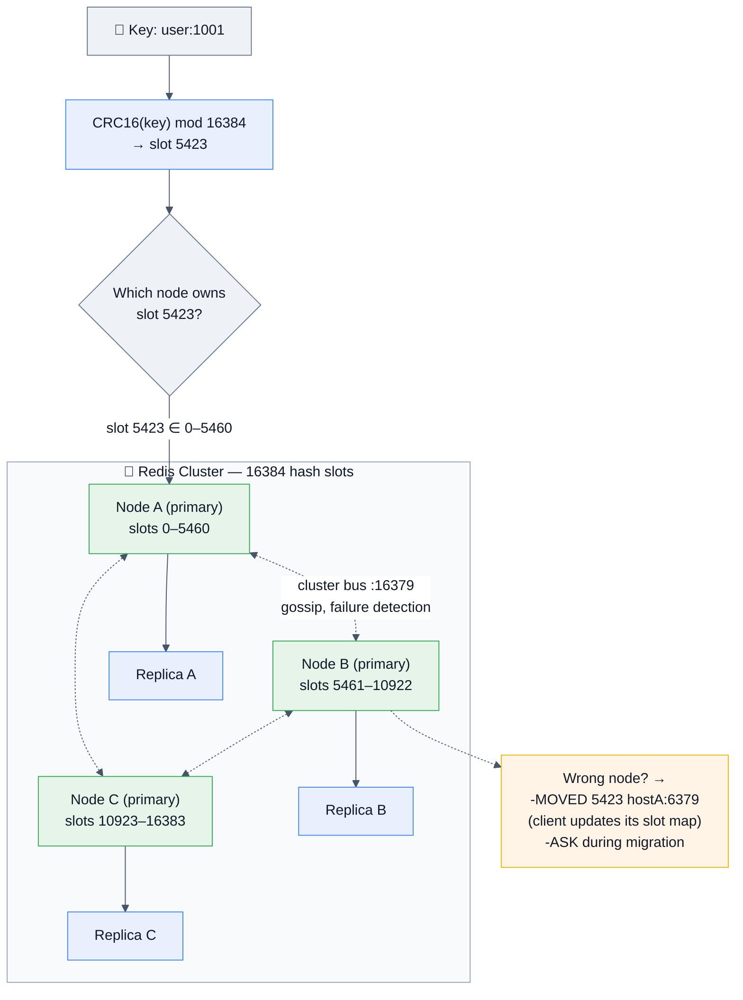

### The facts to have memorized

| Fact | Detail |
|------|--------|
| **16384 hash slots** | `CRC16(key) mod 16384`. Why 16384 and not 65536? antirez's answer: the cluster gossip messages carry a slot bitmap, and 16k keeps that header ~2 KB instead of 8 KB, which matters for a design targeting ≤1000 nodes. **Great trivia to know.** |
| **Client-side routing** | A smart client caches the slot→node map and goes straight to the right node. `-MOVED` means "permanently relocated, update your map"; `-ASK` means "this one key is mid-migration, ask there just this once (with `ASKING`)." |
| **Minimum viable cluster** | **3 primaries** (so a majority can survive one loss); 6 nodes with replicas for real HA. |
| **Failover** | Primaries gossip on the **cluster bus (port + 10000)**. Majority of primaries mark a node failed → its replica promotes. `cluster-node-timeout` governs the detection window. |
| **Multi-key commands** | Only work if **all keys are in the same slot**. Otherwise: `CROSSSLOT Keys in request don't hash to the same slot`. |
| **Hash tags** | `{user:1001}:profile` and `{user:1001}:sessions` — only the substring inside `{}` is hashed, so both land in the same slot. **The answer to every "how do I do multi-key ops in Cluster?" question.** ⚠️ Over-using one tag creates a hot slot. |
| **Databases** | Cluster mode supports **only DB 0** (`SELECT` is disabled). 🍴 **Valkey 9 added multiple logical DBs in cluster mode** — a genuine divergence worth naming. |
| **Resharding** | Historically a slot-by-slot key migration (`CLUSTER SETSLOT`, `MIGRATE`) that was slow and error-prone. 🆕 **Redis 8.4's `CLUSTER MIGRATION` and Valkey 9's atomic slot migration** make this a first-class, zero-downtime operation. |
| **Consistency** | Redis Cluster is **explicitly not strongly consistent.** Acked writes can be lost on failover (async replication) or during a partition. |

### Cluster vs Sentinel vs standalone — the decision table

| | **Standalone** | **Sentinel** | **Cluster** |
|---|---|---|---|
| HA / auto-failover | ❌ | ✅ | ✅ |
| Sharding (scale writes/memory) | ❌ | ❌ | ✅ |
| Dataset must fit one node | ✅ | ✅ | ❌ |
| Multi-key ops | ✅ Anywhere | ✅ Anywhere | ⚠️ Same slot only |
| Multiple DBs (`SELECT`) | ✅ 16 | ✅ | ❌ (DB 0 only) |
| Client complexity | Trivial | Sentinel-aware | Cluster-aware |
| Ops complexity | ⭐ | ⭐⭐⭐ | ⭐⭐⭐⭐ |
| **When** | Dev, small caches | Data fits one node, need failover | >1 node of RAM or throughput |

> [!TIP]
> **The answer that shows judgement:** *"I'd default to a single primary with replicas plus Sentinel (or a managed equivalent) for as long as the working set fits comfortably in one node's RAM — Cluster adds real constraints: no cross-slot transactions or Lua, no multiple DBs, hash tags leaking into your key design, and much more complex client behaviour. I'd move to Cluster when memory or write throughput genuinely exceeds one node, and I'd size shards small — 10–25 GB — so forks, failovers, and resharding stay fast."*

## 3.4 Consistency, CAP, and what Redis actually guarantees

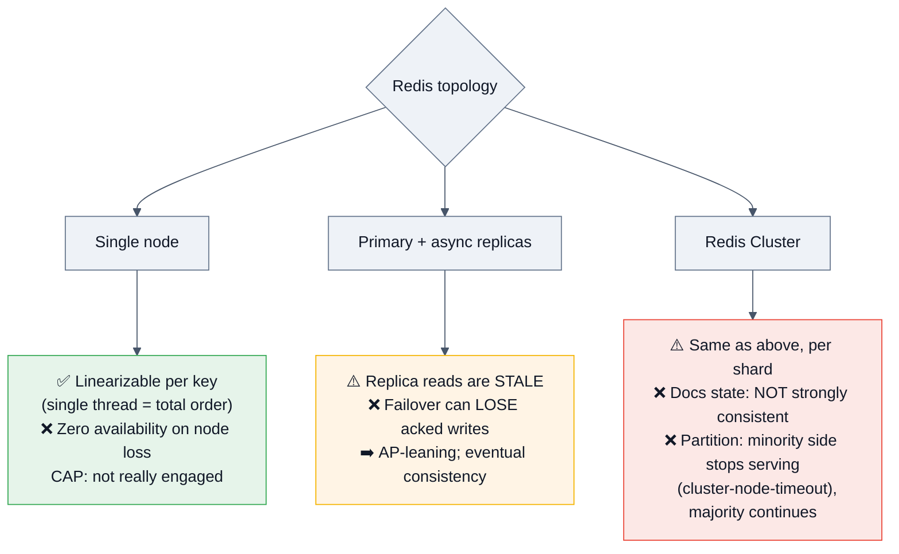

**The precise statement to give:** *"A single Redis node is linearizable per key because one thread imposes a total order. The moment you add asynchronous replication, you have a real consistency boundary: replica reads are stale, and a failover can lose writes the primary already acknowledged. Redis Cluster is explicitly documented as not strongly consistent. So my rule is: Redis is the fast path, never the arbiter of truth. Anything where losing a write is unacceptable gets written to a durable store first, and Redis is derived from it."*

**Two dials that reduce (never eliminate) the loss window:**
- `min-replicas-to-write` / `min-replicas-max-lag` — the primary refuses writes when it can't see healthy replicas, converting silent data loss into visible errors.
- `WAIT` / `WAITAOF` — block until N replicas ack (or fsync). Costly and still not consensus.

## 3.5 Caching patterns

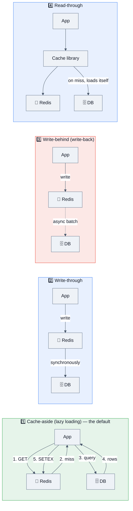

| Pattern | Pros | Cons |
|---------|------|------|
| **Cache-aside** ⭐ | Simple; only requested data is cached; cache failure is survivable | Every miss costs a DB hit; the app owns invalidation; stampede risk |
| **Write-through** | Cache always fresh | Every write pays double latency; caches data nobody reads |
| **Write-behind** | Fastest writes; batches DB load | **Data loss if Redis dies before the flush** — only for tolerable data (counters, analytics) |
| **Read-through** | App code is clean | Needs a cache layer/library that owns loading |
| **Refresh-ahead** | Hot keys never expire cold | Wasted refreshes for keys that go cold |

### The three cache pathologies — name all three

| Problem | What happens | Fix |
|---------|--------------|-----|
| 🌩️ **Cache stampede / dogpile** | A hot key expires; 10,000 concurrent requests all miss and hit the DB simultaneously | **(a)** A short-lived lock so one request rebuilds while others serve stale or wait; **(b)** **probabilistic early expiration** (XFetch) — refresh with probability rising as the TTL nears; **(c)** background refresh-ahead; **(d)** serve-stale-while-revalidate |
| 🕳️ **Cache penetration** | Requests for keys that **don't exist anywhere** (often malicious) bypass the cache every time and hammer the DB | **Cache the negative result** with a short TTL, and/or put a **Bloom filter** in front (`BF.EXISTS`) to reject impossible keys instantly |
| 🏔️ **Cache avalanche** | A huge set of keys expires at the same instant (or Redis restarts empty) → the DB is hit with the full load at once | **Jitter every TTL** (`ttl + random(0, ttl*0.1)`); stagger warm-up; circuit-breaker + rate limit on the DB path; keep a small always-warm tier |

```python
# ✅ Cache-aside with jitter, negative caching, and stampede protection
import random, json

def get_product(pid):
    key = f"product:{pid}"
    val = r.get(key)
    if val is not None:
        return None if val == b"__MISS__" else json.loads(val)

    lock_key = f"lock:{key}"
    # only ONE request rebuilds; the rest briefly wait and re-read
    if r.set(lock_key, "1", nx=True, ex=5):
        try:
            row = db.query_product(pid)
            if row is None:
                r.set(key, "__MISS__", ex=60)          # 🕳️ negative caching
                return None
            ttl = 3600 + random.randint(0, 360)        # 🏔️ jitter
            r.set(key, json.dumps(row), ex=ttl)
            return row
        finally:
            r.delete(lock_key)
    else:
        time.sleep(0.05)
        return get_product(pid)                        # bounded retry in real code
```

### Invalidation — the hard part

> [!WARNING]
> **The ordering bug interviewers love.** In cache-aside, on an update you must **write the DB first, then delete the cache key** — never "delete then write," and never "write the cache" instead of deleting it. Even "DB then delete" has a narrow race (a concurrent reader can repopulate a stale value between the DB write and the delete), which is why the practical answers are: **short TTLs as a safety net**, **delete-again after a small delay** (delayed double delete), or **CDC-driven invalidation** from the database's change log — the most robust option.

## 3.6 Distributed locks — and the Redlock controversy

```redis
# ✅ The minimum correct single-instance lock
SET lock:order:42 <random-token> NX PX 30000
# ... do work ...
# release with an ATOMIC compare-and-delete (never a plain DEL):
EVAL "if redis.call('GET',KEYS[1])==ARGV[1] then return redis.call('DEL',KEYS[1]) else return 0 end" 1 lock:order:42 <random-token>
```

**Why each piece exists:**
- `NX` → only acquire if free (mutual exclusion).
- `PX 30000` → **auto-expiry, so a crashed holder doesn't deadlock the system forever.** Omitting this is the #1 bug.
- **A random token** → so you only delete *your own* lock. Without it: your lock expires, someone else acquires it, and your `DEL` **releases their lock**.
- **Lua for release** → `GET` then `DEL` from the client is a race; the check and the delete must be atomic.

### Redlock — and the argument you should be able to narrate

**Redlock** extends this to N independent Redis nodes (typically 5): acquire on a majority within a small time budget, subtract elapsed time from the validity, and release everywhere on failure.

| 🔴 **Kleppmann's critique** (2016) | 🟢 **antirez's response** |
|-----------------------------------|--------------------------|
| Redlock has **no fencing token** — no monotonically increasing number that the protected resource can use to reject a stale writer | The order of lock IDs is independent of the order operations actually execute; mutual exclusion is what the lock provides, and a random token suffices for that purpose |
| It relies on **timing assumptions**: bounded network delay, bounded process pauses (GC!), bounded clock drift — all of which real systems violate | Conceded the clock point: Redis/Redlock should use the **monotonic clock API** to remove the clock-jump attack |
| A GC pause longer than the TTL means two clients both believe they hold the lock | Redlock targets efficiency locks and practical use, not formal correctness under arbitrary asynchrony |

> [!IMPORTANT]
> **The answer that lands this question:** *"It depends on what the lock is for. For an **efficiency lock** — don't send the same email twice, don't recompute the same report — Redlock or even a single-instance lock is fine, because the failure mode is duplicated work, not corruption. For a **correctness lock**, where two concurrent holders would corrupt data or double-spend money, I wouldn't rely on Redis. I'd use a consensus system — ZooKeeper, etcd, or Consul — that issues a **monotonic fencing token**, and I'd have the protected resource reject any operation carrying a stale token. Better still, I'd design the lock away: make the operation idempotent, or push the mutual exclusion into the database with a unique constraint or a conditional update. A lock you can't fence is a hope, not a guarantee."*
>
> That paragraph — efficiency vs correctness, fencing tokens, "design the lock away" — is one of the highest-value things in this entire guide.

**Also mention:** the **lock-extension/watchdog** pattern (Redisson's default: a background thread renews the lock while work continues) and its own hazard — a watchdog that keeps renewing during a network partition extends the illusion.

## 3.7 Rate limiting — four algorithms, know at least three

```redis
# 1️⃣ FIXED WINDOW — simplest, but allows 2× burst at the boundary
INCR rl:user:1001:1723385400
EXPIRE rl:user:1001:1723385400 60 NX
# if value > limit → reject

# 2️⃣ SLIDING WINDOW LOG — exact, but O(N) memory per user
ZREMRANGEBYSCORE rl:user:1001 0 <now_ms - 60000>
ZADD rl:user:1001 <now_ms> <unique_id>
ZCARD rl:user:1001
EXPIRE rl:user:1001 60

# 3️⃣ SLIDING WINDOW COUNTER — weighted blend of the current and previous window.
#    ~exact enough, O(1) memory. What most production limiters actually use.

# 4️⃣ TOKEN BUCKET — allows controlled bursts; the nicest UX
#    Store {tokens, last_refill_ms} in a hash; refill lazily in Lua on each call.
```

```lua
-- 🏆 Token bucket in Lua — atomic, one round trip. A great whiteboard answer.
-- KEYS[1]=bucket  ARGV[1]=capacity ARGV[2]=refill_per_sec ARGV[3]=now_ms ARGV[4]=cost
local b     = redis.call('HMGET', KEYS[1], 'tokens', 'ts')
local cap   = tonumber(ARGV[1])
local rate  = tonumber(ARGV[2])
local now   = tonumber(ARGV[3])
local cost  = tonumber(ARGV[4])
local tokens = tonumber(b[1]) or cap
local ts     = tonumber(b[2]) or now
tokens = math.min(cap, tokens + (now - ts) / 1000 * rate)   -- lazy refill
local allowed = 0
if tokens >= cost then tokens = tokens - cost; allowed = 1 end
redis.call('HSET', KEYS[1], 'tokens', tokens, 'ts', now)
redis.call('PEXPIRE', KEYS[1], math.ceil(cap / rate * 1000) * 2)
return {allowed, math.floor(tokens)}
```

| Algorithm | Memory | Accuracy | Bursts |
|-----------|--------|----------|--------|
| Fixed window | O(1) | ⚠️ 2× burst at boundaries | Uncontrolled at edges |
| Sliding log | O(N) per key | ✅ Exact | None |
| Sliding counter | O(1) | ✅ Very good | Smooth |
| **Token bucket** ⭐ | O(1) | ✅ Good | ✅ **Configurable, intentional** |
| Leaky bucket | O(1) | ✅ | Smooths output rate |

## 3.8 Hot keys and big keys — the two operational killers

### 🔥 Hot keys
One key receiving a disproportionate share of traffic. **Sharding does not help** — the key lives on one slot, on one node, on one thread.

| Mitigation | How |
|------------|-----|
| **Local (L1) cache in the app** | Keep the value in-process for 1–5 s. Removes 99% of the traffic. **The single best answer.** |
| **Client-side caching with tracking** | RESP3 invalidation push — Redis tells your client when to invalidate |
| **Key splitting / replication of the value** | Write to `hot:key:{0..N}` and have each client read a random one; write to all on update |
| **Read replicas** | Route reads for that key to replicas (accepting staleness) |
| **Request coalescing** | One in-flight fetch per key per process (singleflight) |

```bash
redis-cli --hotkeys              # requires maxmemory-policy allkeys-lfu / volatile-lfu
redis-cli --stat
OBJECT FREQ key                  # LFU counter (LFU policy only)
```

### 🐘 Big keys
A single key holding a huge value — a 500 MB list, a 5 M-field hash, a 100 MB string.

**Why they're lethal:**
- Any O(N) command on them (`HGETALL`, `LRANGE 0 -1`, `SMEMBERS`) blocks the server for **seconds**.
- `DEL` on a big key blocks — use **`UNLINK`** (frees in a background thread).
- They make one shard's memory wildly uneven and make cluster **migration** of that slot slow.
- They inflate the network output buffer, potentially killing the client.

```bash
redis-cli --bigkeys        # samples the keyspace for the largest of each type
redis-cli --memkeys
MEMORY USAGE key
```
**Fix:** split into buckets (`user:1001:posts:page:1`), cap collections (`LTRIM`, `XADD MAXLEN ~`), use `SCAN`-family cursors (`HSCAN`, `SSCAN`, `ZSCAN`) instead of the bulk getters, and `UNLINK` instead of `DEL`.

## 3.9 Observability

```redis
INFO everything          # or: server clients memory persistence stats replication cpu keyspace commandstats latencystats
INFO commandstats        # ✅ per-command calls, usec, usec_per_call → find the expensive command
INFO latencystats        # ✅ 7.0+: per-command latency percentiles
SLOWLOG GET 25           # ✅ commands slower than slowlog-log-slower-than (default 10000 µs)
SLOWLOG RESET
LATENCY LATEST           # latency spikes by event (fork, expire-cycle, aof-write…)
LATENCY HISTORY fork
LATENCY DOCTOR           # human-readable diagnosis
MEMORY DOCTOR
CLIENT LIST              # per-client: idle time, output buffer size, last command
CLIENT NO-EVICT / CLIENT UNPAUSE
COMMAND DOCS / COMMAND COUNT
```

```ini
slowlog-log-slower-than 10000     # µs; lower it to 5000 while investigating
slowlog-max-len 256
latency-monitor-threshold 100     # ms; enables the LATENCY subsystem
```

**The metrics to alert on:**

| Metric | Why | Alert at |
|--------|-----|----------|
| `used_memory / maxmemory` | Eviction and OOM risk | > 80% |
| `evicted_keys` rate | Are you silently losing cache entries? | Any sustained non-zero (if unexpected) |
| `keyspace_hits/(hits+misses)` | Cache effectiveness | < 90% for a mature cache |
| `mem_fragmentation_ratio` | Fragmentation or **swapping** | > 1.5, or **< 1.0 = page now** |
| `blocked_clients` | Blocking commands piling up | Sudden growth |
| `rejected_connections` | `maxclients` exceeded | Any |
| `master_link_status` / lag offset | Replication health | down, or lag > threshold |
| `instantaneous_ops_per_sec` | Traffic shape | Anomaly detection |
| `latency_percentiles_usec` (7.0+) | Real p99 | p99 > 1 ms for O(1) commands |
| `rdb_last_bgsave_status` / `aof_last_write_status` | **`stop-writes-on-bgsave-error` means a failed save blocks writes** | `err` |
| `connected_clients` vs `maxclients` | Pool leaks | > 80% |

**Tooling:** `redis_exporter` → Prometheus → Grafana; `redis-cli --latency-history`; **RedisInsight** (official GUI); `redis-stat`; managed dashboards on ElastiCache/Memorystore.

## 3.10 Extensions, modules, and the 2026 ecosystem

| Capability | 2026 status |
|------------|-------------|
| **JSON** (`JSON.SET`, JSONPath) | ✅ In core Redis 8.0+ (was RedisJSON) |
| **Search & Query** (`FT.CREATE`, `FT.SEARCH`, `FT.AGGREGATE`, 🆕 `FT.HYBRID`) | ✅ In core 8.0+ (Redis Query Engine) |
| **Vector similarity** | ✅ `vector set` type (8.0) + vector fields in the Query Engine; HNSW & FLAT indexes |
| **Time series** (`TS.ADD`, `TS.RANGE`, downsampling rules) | ✅ In core 8.0+ |
| **Probabilistic** (Bloom, Cuckoo, Count-Min, Top-K, t-digest) | ✅ In core 8.0+ |
| **RedisGears** | Deprecated/superseded by Functions for most uses |
| 🍴 **Valkey modules** | Valkey 9 ships official JSON, Bloom, and vector-search modules |
| **Alternatives** | **Dragonfly** (multi-threaded, Redis-API-compatible, vertical scaling), **KeyDB** (multi-threaded Redis fork), **Garnet** (Microsoft), **Memcached** (still the simplest pure cache) |

> [!TIP]
> **A modern, high-signal answer to "what have you used Redis for recently?"** — *"Semantic caching for an LLM application: embed the user query, `VSIM` against a vector set of previous query embeddings, and if the cosine similarity is above a threshold, return the cached completion instead of calling the model. It cuts both cost and p99 dramatically. The tuning problem is the similarity threshold — too loose and you serve a subtly wrong answer, so we log near-threshold hits and evaluate them offline."*

---
# 4. 🎤 Interview Questions by Level

> **Format for every question:** ⭐ rating → 🎯 *why they ask* → ✅ *expected answer* → 🔁 *follow-ups* → ❌ *common mistakes*.

---

## 4.1 🌱 Beginner

### Q1. What is Redis and what is it used for? ★★★★★
🎯 **Why:** Baseline. The differentiator is whether you say "cache" and stop, or describe a data-structure server.
✅ **Answer:** An in-memory, single-threaded data-structure server. Values aren't opaque blobs — they're strings, lists, hashes, sets, sorted sets, streams, bitmaps, HyperLogLogs, geospatial indexes, and (8.0+) vector sets. Used for caching, sessions, rate limiting, distributed locks, leaderboards, job queues, pub/sub, real-time analytics, and increasingly vector/semantic search.
🔁 **Follow-ups:** "Why is it fast?" → In-memory + single-threaded (no lock contention or context switching) + an efficient event loop + a simple protocol + O(1) data structures. **In that order** — "because it's in memory" alone is a partial answer.
❌ **Mistakes:** Calling it a database *replacement*, or describing it purely as a cache.

### Q2. Is Redis single-threaded? ★★★★★
🎯 **Why:** The most-asked Redis question in existence, and a great depth probe.
✅ **Answer:** **Command execution is single-threaded** — that's deliberate, because it gives atomicity with no locking and very predictable latency. **The process is not** single-threaded: since 6.0 there are I/O threads for socket read/write and protocol parsing (`io-threads`), background threads for lazy-freeing large objects (`UNLINK`) and AOF fsync, and RDB snapshots run in a **forked child process**.
🔁 **Follow-ups:** "Then how does it handle 10,000 concurrent clients?" → I/O multiplexing (`epoll`/`kqueue`) — one thread watching many sockets, doing microseconds of work per command. / "Doesn't that waste a 32-core machine?" → **Yes, deliberately.** You run multiple Redis processes/shards per host, or use Redis Cluster. Multi-threaded forks like **Dragonfly** and **KeyDB** exist precisely to attack that trade-off.
❌ **Mistakes:** "It's single-threaded so it can only do a few thousand ops/sec." One thread does 100k+.

### Q3. Name the data types and one use case each. ★★★★★
✅ See §1.4. Deliver it as a table: **String** (cache/counter), **List** (queue, recent items), **Hash** (object), **Set** (unique membership, tags), **Sorted Set** (leaderboard, priority queue, rate limiter), **Stream** (event log with consumer groups), **Bitmap** (daily-active flags), **HyperLogLog** (unique-visitor estimate in 12 KB), **Geo** (nearby drivers), **Vector set** 🆕 (semantic search), **Array** 🆕 8.8.
🔁 **Follow-ups:** "Which would you use for a leaderboard, and why not a list?" → Sorted set: O(log N) insert with automatic ordering, O(log N) rank lookup, O(log N + M) range queries. A list would need a full re-sort on every score change.

### Q4. RDB vs AOF. ★★★★★
✅ §2.3's table. Then the decision: **both in production**, `appendfsync everysec`, `aof-use-rdb-preamble yes`.
🔁 **Follow-ups:** "Which loses less data?" (AOF.) / "Which restarts faster?" (RDB.) / "Would you ever disable both?" → **Yes — for a pure cache**, where persistence costs fork pauses and buys you nothing you can't rebuild. Say this; it shows you think about purpose, not defaults.
❌ **Mistakes:** Saying "AOF is always better." It's larger, slower to load, and its fsync cost is real.

### Q5. Default port and basic commands. ★★★★☆
✅ **6379** (Sentinel: 26379; Cluster bus: port + 10000 = 16379). Basic set: `SET`/`GET`/`DEL`/`EXISTS`/`EXPIRE`/`TTL`/`TYPE`/`KEYS` (⚠️ never in prod)/`SCAN`/`INCR`/`FLUSHDB`/`FLUSHALL`/`DBSIZE`/`INFO`.
🔁 **Follow-up:** "Why 6379?" → antirez's joke: it's the phone-keypad spelling of **MERZ**, an Italian TV personality reference. Harmless trivia that shows genuine familiarity.

### Q6. Redis vs Memcached. ★★★★★
| | **Redis** | **Memcached** |
|---|---|---|
| Data types | Rich (10+) | Strings only |
| Threading | Single-threaded execution | **Multi-threaded** |
| Persistence | RDB + AOF | ❌ None |
| Replication / HA | ✅ Replicas, Sentinel, Cluster | ❌ (client-side sharding only) |
| Transactions / scripting | ✅ MULTI, Lua, Functions | ❌ |
| Pub/Sub, Streams | ✅ | ❌ |
| Eviction | 8 policies | LRU only |
| Max value | 512 MB | 1 MB default |
| Memory efficiency for tiny values | Slightly more overhead | **Slab allocator, very efficient** |
| **Pick it when** | You need anything beyond `get`/`set`, or persistence, or HA | Pure, huge, simple caching where multi-threading on one big box matters |
✅ **The answer:** *"For almost any new system, Redis — the extra capability is free and you'll use it. Memcached still wins in one narrow case: an enormous, purely-string cache where you want a single multi-threaded process to use all cores, and you genuinely need nothing else."*

### Q7. How does `EXPIRE` work? ★★★★★
✅ §2.4 — lazy expiry on access, plus an active sampling cycle ~10×/sec. `TTL` returns **-1** (no expiry) / **-2** (no key).
🔁 **Follow-ups:** "Does `SET` on an existing key keep the TTL?" → **No, `SET` clears it** unless you pass `KEEPTTL`. But `INCR`, `HSET`, `LPUSH` **preserve** it. This asymmetry is a real bug source. / "Do replicas expire keys?" → **No** — the primary sends an explicit `DEL`; replicas won't *serve* an expired key but keep it until told.

### Q8. What are eviction policies? ★★★★★
✅ §2.5's table, all eight, plus: **LRU/LFU are approximate** (sampled, `maxmemory-samples`), and the `volatile-*`-with-no-TTLs trap.
🔁 **Follow-ups:** "Default?" → `noeviction`. **"Which for a pure cache?"** → `allkeys-lru`, or `allkeys-lfu` if you have a stable hot set and want to survive a scan. / "What happens under `noeviction` when memory is full?" → Writes get an OOM error; reads still work.

### Q9. How do you delete keys matching a pattern? ★★★★★
```bash
# ❌ NEVER — O(N) over the entire keyspace, blocks the single thread
redis-cli KEYS "session:*" | xargs redis-cli DEL

# ✅ SCAN — cursor-based, O(1) per call, non-blocking
redis-cli --scan --pattern "session:*" | xargs -L 1000 redis-cli UNLINK
```
✅ **Say all of this:** `SCAN` is cursor-based with a `COUNT` hint; it guarantees every key present for the whole iteration is returned at least once, **may return duplicates**, and **may miss keys added mid-scan** — so it's eventually-consistent iteration, and your code must tolerate that. Use `UNLINK` (background free) rather than `DEL`. There are typed variants: `HSCAN`, `SSCAN`, `ZSCAN`.
🔁 **Follow-up:** "Better design?" → *"Don't scan at all. Track membership in a set, or use a key prefix per tenant/version so you can invalidate by bumping a version number instead of deleting."*

### Q10. What is `MULTI`/`EXEC`? Does Redis support rollback? ★★★★☆
✅ §2.6. **Atomic batching, no rollback.** `WATCH` gives optimistic locking. Errors at execution time don't undo the other commands.
🔁 **Follow-up:** "Why no rollback?" → antirez's rationale: commands only fail from programming errors (wrong type, bad syntax) that should be caught in development, and supporting rollback would add complexity and cost to every transaction for a case that shouldn't happen.

### Q11. How do you use Redis as a cache with Spring Boot? ★★★★☆ *(India-heavy)*
```java
@Cacheable(value = "products", key = "#id", unless = "#result == null")
public Product getProduct(Long id) { return repo.findById(id).orElse(null); }

@CachePut(value = "products", key = "#p.id")
public Product update(Product p) { return repo.save(p); }

@CacheEvict(value = "products", key = "#id")
public void delete(Long id) { repo.deleteById(id); }
```
```yaml
spring.cache.type: redis
spring.data.redis.host: localhost
spring.cache.redis.time-to-live: 600000     # ms
spring.cache.redis.cache-null-values: false
```
🔁 **Follow-ups:** "Jedis or Lettuce?" → **Lettuce** is the Spring Boot default: Netty-based, thread-safe, one shared connection handles concurrency. **Jedis** needs a connection pool because its connections aren't thread-safe. / "How do you serialize?" → Configure a `RedisTemplate` with `GenericJackson2JsonRedisSerializer` — the default JDK serialization is slow, unreadable, and version-brittle. / "What about `@Cacheable` and self-invocation?" → It's proxy-based, so an internal method call bypasses the cache.

### Q12. What's the maximum size of a Redis key/value? ★★★☆☆
✅ **512 MB** for a string value (and key names are strings, so the same limit technically applies — but a key name over ~1 KB is already a design smell). Lists/sets/hashes/zsets hold up to 2^32-1 elements. **The practical limit is far lower** — anything over a few hundred KB is a big-key problem.

### Q13. How do you check if Redis is healthy? ★★★★☆
✅ `PING` → `PONG`; `INFO server/memory/replication/stats`; `redis-cli --latency`; `SLOWLOG GET`; `DBSIZE`; `CLIENT LIST`. Then the metrics from §3.9. **The good answer names a metric, not just a command.**

### Q14. What is pub/sub? ★★★★☆
✅ `SUBSCRIBE`/`PUBLISH`, fire-and-forget, **at-most-once**, no persistence, offline subscribers miss everything. `PSUBSCRIBE` for patterns; `SSUBSCRIBE`/`SPUBLISH` (7.0+) for sharded pub/sub in Cluster.
🔁 **Follow-up:** "Use it as a job queue?" → **No** — no persistence, no ack, no replay. Use a List or a Stream.

### Q15. What is a cache hit ratio and what's good? ★★★★☆
✅ `keyspace_hits / (keyspace_hits + keyspace_misses)` from `INFO stats`. **>90% is a reasonable target for a mature cache; >95% is good.** But context matters: a low ratio on a cache of rarely-repeated queries means the cache is pointless, not broken. **Say that nuance** — the metric is only meaningful against the access pattern.

---

## 4.2 🌿 Intermediate

### Q16. Walk me through what happens when a client sends `GET key`. ★★★★★
🎯 **Why:** Tests whether you have a real mental model or memorized commands.
✅ Client serializes to RESP → TCP → Redis's event loop sees the socket readable (`epoll`) → an I/O thread may read and parse → **the main thread looks up the key in the keyspace dict** → checks the expires dict; if expired, deletes it lazily and returns nil → updates LRU/LFU metadata → writes the reply into the client's output buffer → the loop flushes it. Between the start and end of that command, **no other command runs**.

### Q17. Cache-aside — implement it and tell me what breaks. ★★★★★
✅ §3.5, including the code. Then **name all three pathologies unprompted**: stampede, penetration, avalanche — with a fix for each.
🔁 **Follow-ups:** "Update ordering?" → **DB first, then delete the cache key** (not update it), plus a short TTL as a safety net, because there's still a narrow race. / "Why delete rather than update the cache?" → Two concurrent updates can write the cache out of order; deleting is idempotent and lets the next reader fetch the truth. Also, you avoid caching values nobody will read.
❌ **Mistakes:** Writing the cache before the DB. Not mentioning TTLs at all.

### Q18. Design a distributed lock in Redis. ★★★★★
✅ §3.6. `SET key <token> NX PX ttl` + Lua compare-and-delete. Explain **why each flag exists**.
🔁 **Follow-ups:** "What if the work takes longer than the TTL?" → Two holders. Options: a **watchdog** that renews while working (Redisson does this), or make the work idempotent, or fence it. / "Is Redlock safe?" → The Kleppmann/antirez narrative + **efficiency vs correctness locks + fencing tokens**. / "What would you use instead for correctness?" → etcd/ZooKeeper with a monotonic fencing token, or push the mutual exclusion into the database (unique constraint / conditional update).
❌ **Mistakes:** `SETNX` without expiry (deadlock); `DEL` without checking the token (releasing someone else's lock); claiming Redlock is provably safe.

### Q19. How does Redis Cluster work? ★★★★★
✅ §3.3 — 16384 slots, `CRC16 mod 16384`, client-side slot map, `MOVED`/`ASK`, gossip on the cluster bus, minimum 3 primaries, replicas for failover.
🔁 **Follow-ups:** "How do you do a multi-key operation?" → **Hash tags** `{user:1001}`. / "Why 16384?" → Gossip header size vs the ≤1000-node design target. / "Is it consistent?" → **No, explicitly not.** / "How do you reshard?" → Historically slot-by-slot `MIGRATE`; 🆕 **Redis 8.4 `CLUSTER MIGRATION`** and Valkey 9 make it atomic and zero-downtime.

### Q20. Sentinel vs Cluster — when do you use each? ★★★★★
✅ §3.3's decision table. The key framing: **Sentinel = availability; Cluster = availability + capacity.** Sentinel is much simpler and should be your default until the dataset or write throughput genuinely exceeds one node.

### Q21. Your Redis memory is at 95%. What do you do? ★★★★★
✅ **The triage order:**
1. `INFO memory` — is it real data, fragmentation (`mem_fragmentation_ratio`), or client output buffers (`mem_clients_normal`)?
2. `redis-cli --bigkeys` and `--memkeys` — is one key or key family responsible?
3. `INFO keyspace` + `SCAN` samples — **are there keys without TTLs that should have them?** (The single most common cause.)
4. Check `evicted_keys` and the policy — is `noeviction` set on what is actually a cache?
5. **Immediate relief:** raise `maxmemory` if headroom exists; set/lower TTLs on the offending prefix; `UNLINK` obsolete key families; enable `activedefrag` if fragmentation > 1.5.
6. **Structural fixes:** bucket small keys into hashes (listpack encoding); shorten key names; compress values (or store them more compactly than JSON); cap collections with `LTRIM`/`MAXLEN`; shard.
🔁 **Follow-up:** "Fragmentation ratio is 0.8 — what does that mean?" → **The OS has swapped Redis out to disk.** Catastrophic for latency; disable swap or add RAM, immediately.

### Q22. Explain pipelining vs `MULTI` vs Lua. ★★★★★
✅ §2.8's table. Round trips, atomicity, and the ability to branch — those three axes.
🔁 **Follow-up:** "When is pipelining wrong?" → When you need the result of command 1 to decide command 2 (use Lua), or when the batch is so big the reply buffer bloats client memory (cap it in the low thousands).

### Q23. How do you implement a rate limiter? ★★★★★
✅ §3.7 — name at least three algorithms, then implement the token bucket (or sliding-window counter) in Lua and explain **why Lua**: the read-modify-write must be atomic, and one round trip matters at rate-limiter volumes.
🔁 **Follow-ups:** "Fixed window's flaw?" → **2× burst at the boundary** (100 requests at 0:59 and 100 at 1:00). / "How do you rate-limit across 50 app servers?" → That's exactly why it's in Redis — shared state. / "What if Redis is down?" → **Fail open or fail closed?** A rate limiter usually fails *open* (serve traffic, lose protection) while an auth check fails *closed*. Stating that trade-off explicitly is a senior signal.

### Q24. Design a leaderboard for 10 million players. ★★★★★
```redis
ZADD leaderboard:global GT 15200 "player:1001"    # GT = only raise the score
ZREVRANK leaderboard:global "player:1001"          # my rank, O(log N)
ZRANGE leaderboard:global 0 99 REV WITHSCORES      # top 100, O(log N + 100)
ZRANGE leaderboard:global 5000 5019 REV WITHSCORES # any page
```
✅ **Memory:** ~10 M members in a skiplist zset ≈ hundreds of MB — fine for one node. **Sharding:** by region/season/tier as separate zsets; `ZUNIONSTORE` for combined views (⚠️ O(N) — precompute on a schedule, not per request).
🔁 **Follow-ups:** "How do you show a player's neighbours?" → `ZREVRANK` then `ZRANGE rank-5 rank+5 REV`. / "Ties?" → Sorted sets break ties lexicographically by member. If you need "earliest achiever wins," encode the timestamp into the score: `score = points * 1e10 + (MAX_TS - ts)`. **This composite-score trick is a great answer.** / "100 M players across 20 regions?" → Shard by region; a true global rank across shards needs approximation (bucketed counts) — exact global ranking of 100 M live scores is a genuinely hard problem, and saying so is better than bluffing.

### Q25. How do you build a job queue in Redis? ★★★★★
✅ **Three options, with trade-offs:**
| Approach | Delivery | Notes |
|----------|----------|-------|
| `LPUSH` + `BRPOP` | At-most-once ⚠️ | Simplest. **A worker crash loses the job.** |
| `LPUSH` + `BLMOVE` to a processing list | At-least-once ✅ | Reliable-queue pattern; a reaper re-queues stale items |
| **Streams + consumer groups** ⭐ | At-least-once ✅ | `XREADGROUP` / `XACK` / `XPENDING` / `XAUTOCLAIM`; native groups, replay, and per-consumer pending lists |
| Sorted set with score = run-at timestamp | Delayed/scheduled jobs | `ZRANGEBYSCORE 0 now` + atomic pop in Lua |
🔁 **Follow-ups:** "Retries and dead letters?" → An attempt counter in the message, exponential backoff via a delayed zset, and a `dead-letter` stream after N attempts. / "When do you move to Kafka/SQS?" → When you need multi-day retention, throughput beyond one shard, partitioned ordering guarantees, or the operational maturity of a real broker. **Redis Streams are excellent up to a point and shouldn't become your company's event bus.**

### Q26. What happens when Redis goes down? ★★★★★
🎯 **Why:** The single best question for separating people who've run Redis from people who've used it.
✅ **The answer has three parts:**
1. **Blast radius:** if it's a cache, every request becomes a DB request — and **your DB probably cannot take 100% of your traffic**. That's the real outage. If it holds sessions, everyone is logged out. If it holds rate-limit state, you're unprotected.
2. **What the app must do:** short client timeouts (Redis should fail in ~50 ms, not hang), a **circuit breaker** so you stop hammering a dead Redis, graceful degradation to the DB **with a concurrency limit or a semaphore**, and serving stale data from a local cache where acceptable.
3. **Recovery:** a cold Redis is an **empty** Redis — the thundering herd on restart can take the DB down a second time. Warm it deliberately (replay a snapshot, prime the top-N keys, or ramp traffic).
🔁 **Follow-up:** "How do you test this?" → Chaos: kill the Redis node in staging under load, and verify the DB survives. *"If we've never tested it, we don't know."*

### Q27. What's the difference between `DEL` and `UNLINK`? ★★★★☆
✅ `DEL` frees the memory **synchronously on the main thread** — on a 5 GB key that's a multi-second stall. `UNLINK` removes the key from the keyspace immediately and hands the actual deallocation to a **background thread**. **Use `UNLINK` by default in production.** Related: `FLUSHALL ASYNC`, and the `lazyfree-lazy-*` settings that make eviction/expiry/server-side deletes lazy automatically.

### Q28. How does `SCAN` guarantee correctness? ★★★★☆
✅ A cursor with **reverse-binary iteration** over the hash table buckets, which is what makes it safe across **rehashing** (the table growing or shrinking mid-iteration). Guarantees: **every element present for the entire iteration is returned at least once**. Non-guarantees: **duplicates are possible**, and elements added or removed during the scan may or may not appear. `COUNT` is a hint, not a page size. `MATCH` filters **after** fetching, so a restrictive pattern can return empty batches for many iterations — that surprises people.

### Q29. Explain Redis persistence during a restart. What loads? ★★★★☆
✅ If AOF is enabled, **AOF wins** (it's more complete) and is replayed; otherwise the RDB is loaded. With `aof-use-rdb-preamble yes`, the AOF file *begins* with an RDB snapshot and then has the incremental commands — you get RDB's fast load with AOF's durability. Since 7.0, AOF is **multi-part**: a manifest plus a base file plus incremental files, which made rewrites far safer.
🔁 **Follow-up:** "The AOF is truncated after a crash — now what?" → `redis-check-aof --fix` truncates the partial tail; `aof-load-truncated yes` (the default) does it automatically at startup with a warning.

### Q30. How do you store an object — one hash, or a JSON string? ★★★★☆
✅ **Hash** when you read/write individual fields (`HGET`, `HINCRBY`), want field-level TTLs (7.4+), or benefit from listpack compactness. **JSON string** when you always read the whole object and want one round trip and simple serialization. 🆕 **`JSON.*` (core in 8.0)** when you need JSONPath queries, partial updates on nested documents, and indexing via the Query Engine.
🔁 **Follow-up:** "Serialization format?" → JSON is readable and debuggable; **MessagePack or protobuf cuts size 30–60%**, which matters at scale for both memory and network. Compression (LZ4/zstd) on large values is worth it above ~1 KB.

### Q31. Keyspace notifications — what are they and when do you use them? ★★★☆☆
```ini
notify-keyspace-events "Ex"        # E=keyevent, x=expired  (also K, g, $, l, s, h, z, A…)
```
```redis
PSUBSCRIBE __keyevent@0__:expired
```
✅ Redis publishes events when keys change or expire. **Used for:** delayed-action patterns ("do X when this key expires"), cache-invalidation fan-out, and change tracking.
⚠️ **The caveats to name** (this is what makes the answer good): notifications go over **pub/sub, so they're fire-and-forget** — a disconnected subscriber misses them permanently. The `expired` event fires when the key is **actually removed** (lazily or by the active cycle), which may be noticeably **later than the TTL**. And they add overhead. **Never build a system that requires every event to arrive.**

### Q32. What is RESP and why does it matter? ★★★☆☆
✅ REdis Serialization Protocol — a simple, human-readable, prefix-length text protocol (`+OK\r\n`, `$5\r\nhello\r\n`, `*2\r\n...`). Cheap to parse, which is part of why Redis is fast. **RESP3** (6.0+, opt in with `HELLO 3`) adds real types — maps, sets, doubles, big numbers, verbatim strings — plus **out-of-band push messages**, which is what enables **client-side caching (tracking)** and better pub/sub integration.

---

## 4.3 🌳 Senior

### Q33. Redis latency spiked to 200 ms. Diagnose it. ★★★★★
🎯 **Why:** The definitive senior Redis question.
✅ **The systematic sweep:**
1. **`SLOWLOG GET 25`** — is one command slow? Look for `KEYS`, `HGETALL`/`SMEMBERS`/`LRANGE 0 -1` on a big key, `SORT`, `ZUNIONSTORE`, a Lua script, or a synchronous `FLUSHALL`.
2. **`INFO commandstats` / `latencystats`** — which command family owns the time?
3. **`LATENCY LATEST` / `LATENCY DOCTOR`** — Redis names the event: `fork`, `expire-cycle`, `aof-write`, `command`.
4. **Is it a fork?** `rdb_last_bgsave_time_sec`, `latest_fork_usec`. A fork on a large, write-heavy instance stalls the loop. → Snapshot on a replica, shrink the instance, **disable transparent huge pages**, set `vm.overcommit_memory=1`.
5. **Is it memory?** `mem_fragmentation_ratio < 1` → **swapping**. Or eviction churn at the `maxmemory` boundary burning CPU.
6. **Is it the network or the client?** `redis-cli --intrinsic-latency 100` measures the *server's* own scheduling latency; `--latency` measures round trip. If intrinsic is fine but round trip isn't, it's network/NIC/noisy neighbour — or the client is single-connection and queueing.
7. **Is it a big key?** `--bigkeys`. **Is it a hot key?** `--hotkeys`.
8. **Is it AOF?** `appendfsync always` puts an fsync in the write path; a slow/contended disk shows up directly as command latency.
9. **Is it the client?** Output-buffer limits, a pub/sub subscriber falling behind, connection storms, or missing pipelining.
✅ **The framing that wins:** *"I'd start with `SLOWLOG` and `LATENCY DOCTOR` because they usually name the culprit in ten seconds, and only then reach for system-level tools."*

### Q34. A single key is receiving 500k requests/sec. What do you do? ★★★★★
✅ §3.8 — and lead with the insight: **sharding cannot fix a hot key**, because one key maps to one slot on one node executing on one thread. Then the ladder: **in-process L1 cache with a 1-second TTL** (removes ~99% of traffic), client-side caching with RESP3 invalidation, key replication across N suffixed copies with random reads, read replicas, request coalescing (singleflight).
🔁 **Follow-up:** "The value changes every second and must be fresh." → Then a 1-second local TTL is exactly right and consistency is bounded by 1 second — **quantify the staleness and check it's acceptable, rather than assuming fresh means instantaneous.**

### Q35. How do you migrate 200 GB of Redis data with no downtime? ★★★★☆
✅ **Options, in order of preference:**
1. **Replication-based cutover:** make the new cluster a replica of the old (`REPLICAOF`, or a tool like `redis-shake`/`RIOT`/`MigrateRedis`), let it catch up, then a brief write pause → promote → repoint clients. Minutes of read-only, seconds of write pause.
2. **Dual-write from the application** for a period, backfill the old data with `SCAN` + `DUMP`/`RESTORE`, verify, then flip reads.
3. **RDB ship-and-load** if a maintenance window exists — simplest and safest.
4. **If it's a pure cache: just cut over cold** and let it refill — **but only if you've verified the DB survives the miss storm.** Warm the top-N keys first.
🔁 **Follow-ups:** "Cross-major-version or Redis→Valkey?" → Generally compatible; verify module usage and any RDB version differences; a replication-based migration handles it. / "How do you verify?" → `DBSIZE` comparison, sampled key-by-key `MEMORY USAGE`/value checksums, and a shadow-read period comparing both.

### Q36. Explain what actually happens during a Redis Cluster failover. ★★★★☆
✅ The cluster bus gossip detects an unreachable primary → a node marks it `PFAIL` → when a **majority of primaries** agree it becomes `FAIL` → the failed primary's replicas wait a rank-based delay (the replica with the **largest replication offset** goes first) → a replica requests votes → **a majority of primaries** must vote → the winner takes over its slots and broadcasts a new config epoch → clients receive `MOVED` and update their slot maps.
🔁 **Follow-ups:** "What if there's no replica?" → With `cluster-require-full-coverage yes` (default), the **whole cluster stops serving** because part of the keyspace is unavailable; with `no`, the rest keeps serving and only that slot range errors. **Knowing this setting is a strong operational signal.** / "Split brain?" → The minority side stops accepting writes after `cluster-node-timeout`, which bounds but does not eliminate lost writes.

### Q37. Should Redis be your source of truth? ★★★★★
✅ **Almost never.** Reasons: asynchronous replication can lose acked writes on failover; persistence protects against a restart but not host loss; the whole dataset must fit in RAM (expensive per GB); and there are no cross-key transactions with rollback, no schema, and no constraints.
**The legitimate exceptions:** genuinely ephemeral data (sessions where re-login is acceptable, rate-limit counters, transient locks), data that is cheaply reconstructible, and Redis Enterprise/AOF-`always` setups where the team has explicitly accepted the risk profile.
🔁 **Follow-up:** "But we store shopping carts only in Redis." → *"Then quantify the risk: what does an unexpected failover cost in lost carts? If the answer is 'a few carts, occasionally,' that's a legitimate business decision. If it's 'revenue and a support incident,' write them to a durable store and use Redis as the read cache."* **The senior move is to make it an explicit trade-off, not an implicit one.**

### Q38. What are the memory overheads and how do you halve your Redis memory? ★★★★☆
✅ §2.2. The moves, in order of impact:
1. **Bucket small keys into hashes** so they stay listpack-encoded (Instagram's ~5× win).
2. **Shorten key names** — at 100 M keys, trimming 20 bytes per key is 2 GB.
3. **Serialize compactly** — MessagePack/protobuf over JSON; compress values >1 KB.
4. **Set TTLs on everything that can have one** — the biggest real-world win is usually deleting data you forgot about.
5. **Use the right type** — HyperLogLog instead of a set for cardinality (12 KB vs GB); bitmaps for per-user flags; `intset` for integer sets.
6. **Cap collections** — `LTRIM`, `XADD MAXLEN ~`, `ZREMRANGEBYRANK`.
7. **`activedefrag yes`** if fragmentation is high.
8. Tune the listpack thresholds — but measure, because raising them trades CPU for memory.

### Q39. How do you handle a cache stampede on a very hot key? ★★★★★
✅ §3.5. Give **at least three** mechanisms and pick one: a rebuild lock, **probabilistic early expiration (XFetch)**, background refresh-ahead, and stale-while-revalidate.
```python
# 🎲 Probabilistic early expiration — elegant, lock-free, no thundering herd
# Store the value plus the time it took to compute (delta) and its absolute expiry.
if now - delta * beta * math.log(random.random()) >= expiry:
    recompute_and_store()      # a few unlucky requests refresh early, spreading the load
return value
```
**Why this beats a lock:** no coordination, no lock expiry to tune, no risk of a lock holder dying mid-rebuild. The probability of refreshing rises smoothly as expiry approaches, so exactly one or two requests typically do the work.

### Q40. Explain the `fork()` problem and copy-on-write. ★★★★☆
✅ §2.3's warning box: fork for `BGSAVE`/AOF-rewrite, COW page copying, RSS approaching 2× on write-heavy instances, page-table copying stalling the main thread, **THP making it much worse**, `vm.overcommit_memory=1`, and the mitigation of many small shards + snapshotting on a replica.
🔁 **Follow-up:** "How do you know a fork caused your latency spike?" → `latest_fork_usec` in `INFO`, and `LATENCY HISTORY fork`.

### Q41. How do you secure a Redis deployment? ★★★★★
✅ §10. Lead with **the reason it matters**: Redis historically shipped with no authentication and bound to all interfaces, and unauthenticated internet-exposed Redis is one of the most-exploited misconfigurations in existence (crypto-miner deployment via `CONFIG SET dir` + `SAVE` writing an SSH key or cron file). Then: `bind` to private interfaces, `protected-mode yes`, `requirepass`/**ACLs (6.0+)** with per-user command and key patterns, **TLS (6.0+)**, `rename-command` or ACL-deny for `FLUSHALL`/`CONFIG`/`KEYS`/`DEBUG`, network isolation (security groups/VPC), and no `--appendonly` directory writable to anything sensitive.

### Q42. When would you NOT use Redis? ★★★★☆
🎯 **Why:** Tests judgement, not enthusiasm.
✅ (1) **When the data doesn't fit in RAM economically** — RAM is ~10–50× the cost per GB of SSD. (2) **When you need durability guarantees** — use a real database. (3) **When you need complex queries, joins, or transactions with rollback.** (4) **When the working set has no reuse** — a cache with a 5% hit rate is pure overhead and one more failure domain. (5) **When a local in-process cache would do** — a network hop for data that fits in your app's heap is wasted. (6) **When you need a real event backbone** — Kafka. (7) **For huge full-text corpora** — Elasticsearch, though the Query Engine goes further than people expect.
❌ **Mistakes:** "Redis can do everything." Also: adding Redis before proving the database is actually the bottleneck.

### Q43. Explain the Redis/Valkey license situation and what you'd do about it. ★★★★☆
🎯 **Why:** 2025–2026's standard "do you follow the industry?" question.
✅ **The narrative:** BSD-3 until March 2024 → Redis Ltd. moved to **RSALv2/SSPLv1** (targeting cloud providers reselling Redis as a service) → within days AWS, Google, Oracle, Ericsson, and Snap forked 7.2.4 as **Valkey** under the **Linux Foundation**, BSD-3 → May 2025, Redis added **AGPLv3** as a third option and renamed CE to **Redis Open Source**, and antirez returned, shipping vector sets in 8.0.
✅ **The practical position:** *"For most companies neither license is a problem — SSPL and AGPL only bite if you're **offering the software itself as a service**. What actually decides it in 2026 is ecosystem gravity: AWS made Valkey the default for new ElastiCache/MemoryDB clusters at roughly 20–30% lower cost, and the major Linux distros ship Valkey. So on AWS I'd default to Valkey for cost and defaults; if I needed Redis 8's Query Engine, vector sets, or `FT.HYBRID`, I'd take Redis Open Source under AGPL after a legal check. The compatibility risk is low today but growing — Valkey 9 added multi-DB in cluster mode, Redis added vector sets — so I'd avoid depending on version-specific extras unless I'd committed to one."*
❌ **Mistakes:** Not knowing the fork happened. In 2026 that reads as not paying attention.

### Q44. How do you monitor Redis in production? What alerts? ★★★★☆
✅ §3.9's metric table. **The structure that impresses:** group them as **saturation** (memory, connections, CPU), **errors** (rejected connections, failed bgsave, `master_link_status`), **traffic** (ops/sec, hit ratio), and **latency** (p99 from `latencystats`, slowlog rate) — i.e. USE/RED, applied to Redis.

### Q45. Redis Streams vs Kafka. ★★★★☆
| | **Redis Streams** | **Kafka** |
|---|---|---|
| Storage | RAM (capped by `MAXLEN`) | Disk, retention of TB for days/weeks |
| Throughput | Very high per shard, limited by one thread | Massive, partition-parallel |
| Ordering | Per stream | Per partition |
| Consumer groups | ✅ | ✅ |
| Replay | ✅ within retention | ✅ long retention, offset-based |
| Delivery | At-least-once with `XACK` | At-least-once; exactly-once with transactions |
| Ecosystem | Small | Connect, Streams, Schema Registry, huge |
| Ops burden | ⭐ (you already run Redis) | ⭐⭐⭐⭐ |
| **Use when** | Low-latency job queues, moderate volume, you already run Redis, retention in minutes/hours | Company event backbone, long retention, high fan-out, replay-from-the-beginning |
✅ **The line:** *"Streams are a great queue and a poor event log. The retention model is the deciding factor: Streams live in RAM, so retention costs you memory, and that alone rules out 'keep everything for 7 days.'"*

---

## 4.4 🏔️ Staff / Principal

### Q46. Design the caching strategy for a system serving 1 M requests/sec. ★★★★★
✅ **A layered answer — this structure is the point:**

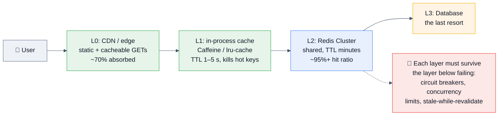

**Then the details:** sizing (1 M req/s ÷ ~80k ops/s per shard with headroom ≈ 15–20 shards, plus replicas); key design with hash tags for co-located reads; **TTL jitter everywhere**; invalidation via CDC rather than app-side deletes; hot-key detection in the metrics pipeline; and an explicit **degradation plan** — what the system serves when Redis is gone.
🔁 **Follow-up:** "What's your consistency model?" → *"Bounded staleness. L1 gives up to 5 seconds, L2 up to the TTL, CDN up to its max-age. I'd write those numbers into the API contract, because 'cached' without a staleness bound is not a design."*

### Q47. Design a real-time analytics counter system: 100k events/sec, per-minute/hour/day rollups. ★★★★☆
✅ **Structure:**
- Ingest with **pipelined `INCR`** on `metric:{id}:2026-08-11T14:23` — one round trip per batch, not per event; `EXPIRE` on first write.
- **Pre-aggregate in the app** (per-process counters flushed every 100 ms) so Redis sees 1k ops/sec, not 100k. **This is the key insight** — the biggest scaling lever is usually not doing the work.
- Roll up minute→hour→day with a scheduled job, or use `TS.*` (core in 8.0) with **downsampling/compaction rules** so Redis maintains the rollups itself.
- **Unique counts:** HyperLogLog (`PFADD`/`PFCOUNT`/`PFMERGE`) — 12 KB per counter regardless of cardinality, ±0.81% error. Say the error rate and confirm it's acceptable.
- **Per-user flags:** bitmaps (`SETBIT` + `BITCOUNT` + `BITOP` for retention windows).
- **Top-N:** `TOPK.*` (Top-K sketch) or a sorted set trimmed with `ZREMRANGEBYRANK`.
- **Durability:** these are derived metrics; stream the raw events to durable storage in parallel so Redis loss costs you a rebuild, not the data.

### Q48. Two services must not process the same order twice. Design it. ★★★★★
✅ **Lead with:** *"I'd try to avoid a distributed lock entirely."* Then the ladder:
1. **Idempotency key + a unique constraint in the durable store** — the strongest and simplest. The database rejects the duplicate; no lock needed.
2. **Atomic claim in Redis:** `SET order:42:claim <worker-id> NX EX 300` — whoever wins processes it. **Fast, and adequate when double-processing is merely wasteful.**
3. **Conditional state transition:** `UPDATE orders SET status='processing' WHERE id=42 AND status='pending'` — 0 rows means someone else won. Correct, durable, no extra system.
4. **Only if you truly need a lock across systems:** etcd/ZooKeeper with a **fencing token**, enforced at the resource.
✅ **The closing line:** *"The question I'd ask first is whether double-processing is expensive or catastrophic. If it's expensive, Redis is fine. If it's catastrophic — double-charging a customer — then no lock is sufficient on its own; the operation has to be idempotent at the point of effect."*

### Q49. Your Redis Cluster has an unbalanced shard: one node at 90% memory, others at 40%. ★★★★☆
✅ **Diagnose in order:**
1. **A hash-tag hotspot** — everything using `{tenant:big-customer}` lands in one slot. Most common cause.
2. **A big key** — one 40 GB collection on that shard. (`--bigkeys` per node.)
3. **Uneven slot assignment** after a manual reshard.
4. **A key family with no TTL** that only that shard happens to hold.
✅ **Fixes:** rebalance slots (🆕 atomic slot migration in 8.4/Valkey 9 makes this safe); **redesign the key scheme** so the tag has higher cardinality (`{tenant:X:shard:N}`); split the big key; give the outlier tenant its own logical namespace or cluster.
🔁 **Follow-up:** "You can't change the key scheme — it's in 40 services." → *"Then dual-write to the new scheme behind a flag, migrate readers service by service, and drop the old — the same expand/contract discipline as a schema migration. Or isolate that tenant onto a dedicated cluster, which is often faster to ship."*

### Q50. Design a distributed session store for 50 M concurrent users. ★★★★☆
✅ **Sizing first** (always): 50 M sessions × ~2 KB ≈ **100 GB**, plus overhead and fork headroom → ~150–200 GB → **8–16 shards of ~15–25 GB**. Saying the arithmetic out loud is the point.
**Design:** key `sess:{sessionId}`, a **hash** (so you can update `last_seen` without rewriting the whole blob, and use `HEXPIRE` for field-level expiry), a sliding TTL refreshed on access (`EXPIRE` or `GETEX`), `allkeys-lru` as a safety valve, and **AOF `everysec`** — losing a second of session writes means a few users re-login.
**Hard parts to raise unprompted:** session data must be small (never store a user's whole profile — store an ID and look it up); **logout must be immediate**, so a token deny-list is needed if you also use JWTs; and multi-region means either sticky routing per region or accepting cross-region replication lag. **Signed cookies/JWTs remove the store entirely** — mention that as the alternative and explain why you'd still want server-side state (revocation).

### Q51. Redis is at 100% CPU. First five minutes. ★★★★★
✅
1. **`INFO commandstats`** + **`SLOWLOG GET 25`** — one expensive command, or just volume?
2. **`redis-cli --stat`** — ops/sec: is this a traffic spike or the same traffic getting slower?
3. **`CLIENT LIST`** — a connection storm? A client in a tight loop? A `MONITOR` someone forgot to close (it can consume enormous CPU — check for it explicitly)?
4. **Eviction churn** — memory pinned at `maxmemory` means every write triggers eviction sampling. `evicted_keys` rate will show it.
5. **Expiry storm** — a million keys expiring at once burns the active-expire cycle.
6. **A Lua script or `FUNCTION`** looping. `SCRIPT KILL` if it hasn't written; otherwise `SHUTDOWN NOSAVE` is the only exit — and that loses unsaved data, so know it before you need it.
7. **Mitigate:** `CLIENT KILL` the offender, rate-limit at the app, add replicas for read offload, and if it's structural, shard.
✅ **The framing:** *"Capture `INFO`, `SLOWLOG`, and `CLIENT LIST` before you kill anything — that state is gone once you act."*

### Q52. Build a semantic cache for an LLM application. ★★★☆☆ *(rising fast in 2026)*
✅ Embed the incoming prompt → `VSIM` against a vector set of prior prompt embeddings (or a Query Engine vector index) → if the top match's similarity exceeds a threshold, return the stored completion; otherwise call the model and `VADD` the new pair.
**The engineering that matters:** choosing the threshold (too loose = confidently wrong answers), **scoping the cache by tenant/user/model/system-prompt version** so you never leak across boundaries, TTL + versioning so a prompt-template change invalidates everything, and logging near-threshold hits for offline evaluation. **Memory math:** 1 M embeddings × 1536 dims × 4 bytes ≈ **6 GB** before index overhead — quantization (`halfvec`-style, or binary) is how you make it affordable.
🔁 **Follow-up:** "Why Redis over a dedicated vector DB?" → *"Because the cache also needs a TTL, a rate limiter, the session, and the conversation history — and they're all already here, in one round trip, with one system to operate. At billion-vector scale with strict recall targets I'd reach for a specialist."*

### Q53. Design the Redis tier for a multi-region application. ★★★☆☆
✅ **The honest opening:** *"Open-source Redis has no active-active replication. Cross-region options are: (a) one primary region with cross-region replicas for read-only local access and DR; (b) fully independent per-region Redis with no cross-region state — the usual answer for caches; (c) Redis Enterprise's Active-Active (CRDT-based) or a commercial equivalent, if you truly need multi-master."*
**For a cache, (b) is almost always right** — cache misses are cheap, and cross-region cache coherency is expensive and subtly wrong. For sessions, pin a user to a region and replicate asynchronously for failover, accepting that a region failover may cost some sessions.
🔁 **Follow-up:** "What about CRDTs?" → Redis Enterprise Active-Active uses conflict-free replicated data types so concurrent writes in two regions converge deterministically (last-write-wins for strings, adds-win for sets, counters that sum). **The catch: not all commands have CRDT semantics, and "converged" is not "what the user expected"** — you have to design for the merge rule.

### Q54. Compare Redis, Valkey, Dragonfly, and KeyDB. ★★★☆☆
| | **Redis OSS 8.x** | **Valkey 9** | **Dragonfly** | **KeyDB** |
|---|---|---|---|---|
| Origin | Original | LF fork of 7.2.4 (2024) | Clean-room rewrite | Multi-threaded Redis fork |
| License | AGPLv3 / RSALv2 / SSPL | **BSD-3** | BSL | BSD (Snap-acquired) |
| Threading | Single-threaded execution | Single-threaded (+ improved I/O) | **Fully multi-threaded, shared-nothing** | Multi-threaded |
| Headline | Vector sets, Query Engine, JSON/TS/Bloom in core | Perf/memory gains, atomic slot migration, multi-DB in cluster, official modules | Vertical scaling — one big node instead of a cluster | Multi-master, multi-threaded |
| Cloud default | Redis Cloud | **AWS ElastiCache/MemoryDB default**, Google Memorystore, OCI | Self-host / Dragonfly Cloud | Less active |
✅ **The judgement:** *"On AWS, Valkey is the pragmatic default — it's the cheaper default and it's BSD. Redis OSS if I want the Query Engine or vector sets. Dragonfly is genuinely interesting when the answer to 'scale Redis' would otherwise be 'operate a 20-node cluster' — one 64-core box can replace it — but it's a different codebase with a different license, so I'd pilot before betting on it."*

### Q55. What would make you replace Redis in an existing system? ★★★☆☆
✅ Concrete triggers, not vibes: (1) **memory cost dominates** and the access pattern would tolerate SSD → a flash-backed store or a redesign; (2) **hot keys are unfixable** at the application layer; (3) **you need durability guarantees** Redis can't give → move that data to the database and keep Redis derived; (4) **cluster ops burden** exceeds the value → managed service, or Dragonfly to collapse the shard count; (5) **the cache hit ratio is low** → the cache isn't earning its complexity; delete it. **That last one — removing a cache — is the answer almost nobody gives, and it's often correct.**

---

## 4.5 🏢 FAANG-specific

> At Google/Meta/Amazon/Apple/Microsoft/Netflix, Redis is rarely the subject — it's a component in a design round, or a depth probe on your resume.

### Q56. (Amazon, design) Design a rate limiter for an API gateway. ★★★★★
✅ Algorithms (§3.7), the Lua implementation, per-user/per-IP/per-endpoint key design, **distributed correctness** (why the counter must live in shared state), the **fail-open vs fail-closed** decision, response headers (`X-RateLimit-Remaining`, `Retry-After`), and the hot-key problem when one abusive client dominates. **Extra credit:** local token buckets per gateway node with periodic Redis reconciliation — trading exactness for latency and blast radius, which is what real gateways do.

### Q57. (Meta/Netflix, design) Design a news feed. Where does Redis fit? ★★★★☆
✅ Redis holds the **materialized timelines** (a list or sorted set of post IDs per user) built by fan-out-on-write, while the posts themselves live in a durable store. Talk about: fan-out-on-write vs on-read, the **celebrity problem** (don't fan out to 100 M followers — merge those at read time), capping timelines with `LTRIM` (nobody scrolls past 1000), the hydration step (`MGET` the post bodies), and what happens when Redis is cold.

### Q58. (Google/Microsoft, depth) You said you used Redis at scale. Tell me about a problem you hit. ★★★★★
✅ **Have one real story rehearsed with numbers.** Strong material: a `KEYS` in a cron job that stalled production; a hot key that no amount of sharding fixed; an eviction policy of `noeviction` on what was actually a cache, causing write failures at 3 a.m.; a `SETNX` lock with no TTL that deadlocked after a deploy; a fork pause on a 60 GB instance. **Structure:** symptom → what you measured → the diagnosis → the fix → **what it cost** → the systemic prevention.

### Q59. (Amazon LP-flavoured) Tell me about a time caching caused a bug. ★★★★★
✅ STAR + Redis specifics. Best material: a stale cache after a write because the code updated the cache instead of deleting it; a cache key missing a tenant or locale dimension so users saw each other's data (**this is the highest-impact and most common real caching bug — name it**); an unbounded key that OOM'd the instance. Land on the systemic fix: a shared cache-key builder that requires all dimensions, a lint rule, or CDC-based invalidation.

### Q60. (Netflix/Stripe) How do you keep a cache and a database consistent? ★★★★★
✅ Name the impossibility first: **dual writes are not atomic** — you cannot update the DB and Redis in one transaction, so some divergence is inevitable. Then the ladder: (1) **short TTLs** as a self-healing floor; (2) **write DB → delete cache**, with delayed double-delete for the narrow race; (3) **CDC-driven invalidation** from the DB's change log (Debezium → Kafka → Redis) — the most robust, and it removes invalidation from application code entirely; (4) **versioned keys** (`product:42:v7`) so invalidation is a version bump and stale entries expire harmlessly; (5) reconciliation jobs as a backstop. **Close with:** *"and I'd write down the acceptable staleness window, because 'consistent' isn't a design goal until it has a number."*

---

## 4.6 🚀 Startup

### Q61. We have no cache today. Where do you start? ★★★★☆
✅ *"I'd start by proving we need one."* Profile the endpoints, find the queries that are both slow and repeated, and check the read/write ratio. Then: managed Redis (ElastiCache/Memorystore/Upstash/Redis Cloud), cache-aside on the top 3 endpoints, TTLs with jitter from day one, `allkeys-lru`, `maxmemory` set explicitly, metrics on hit ratio and memory, and **a tested degradation path**. *"The most common startup caching mistake is caching everything and inventing an invalidation problem you didn't need."*

### Q62. Can we use Redis for everything — queue, cache, sessions, search, pub/sub, locks? ★★★★☆
✅ **Yes, further than people expect — and at a startup that's usually correct.** Queue via Streams, cache via cache-aside, sessions via hashes with TTL, search via the Query Engine, pub/sub natively, locks via `SET NX PX`, rate limiting via Lua, analytics via HLL/bitmaps, even vector search via vector sets. **One system to run, back up, and monitor.**
**The discipline:** name the exit criterion for each. *"Streams become Kafka when we need multi-day retention. The Query Engine becomes Elasticsearch when we need real relevance tuning. The lock becomes etcd if it ever guards money."*

### Q63. Managed Redis or self-hosted? ★★★★☆
✅ **Managed, until you have someone whose job is Redis.** ElastiCache/MemoryDB (note: **Valkey is now the default and cheaper**), Memorystore, Azure Cache, Redis Cloud, Upstash (serverless, per-request pricing — good for spiky/edge workloads), DragonflyDB Cloud. **What you give up:** some `CONFIG` access, certain commands, module choice, and version timing. **What you gain:** failover, backups, patching, and monitoring you don't have to build. *"Self-hosting Redis is easy right up until your first failover at 3 a.m."*

---

## 4.7 🏭 Product Companies (Flipkart, Swiggy, Zomato, PhonePe, Walmart, Shopify, Atlassian)

### Q64. Design flash-sale inventory: 10k units, 1 M concurrent buyers. ★★★★★
✅ **Redis is the right tool here** — the database cannot take 1 M concurrent conditional updates.
```lua
-- Atomic decrement with a floor; returns remaining or -1 if sold out
local n = tonumber(redis.call('GET', KEYS[1]) or '0')
if n <= 0 then return -1 end
return redis.call('DECR', KEYS[1])
```
**Full design:** pre-load the counter into Redis; the atomic decrement is the source of truth *for the reservation*; a successful decrement writes a durable reservation record (queue → durable store); a reservation TTL releases unpaid holds back to the counter; **the counter is a single hot key**, so shard it into N counters (`stock:{sku}:{0..9}`) with clients picking randomly and falling through on empty; and a reconciliation job compares Redis against the durable ledger.
🔁 **Follow-ups:** "What if Redis dies mid-sale?" → *"You oversell or undersell. Mitigations: AOF `always` for this key, a replica with `WAIT`, and — most importantly — the durable reservation log lets you reconcile and cancel afterwards. There's no way to make this both instantaneous and perfectly durable; the business decides which side to err on."* **That's the answer they want.**

### Q65. Design "nearby restaurants/drivers" (Swiggy/Zomato/Uber-style). ★★★★☆
```redis
GEOADD drivers:mumbai 72.8777 19.0760 "driver:42"
GEOSEARCH drivers:mumbai FROMLONLAT 72.87 19.07 BYRADIUS 3 km ASC COUNT 20 WITHCOORD WITHDIST
```
✅ Geo is a sorted set with **geohash-encoded scores**, so it's O(log N + M). Design points: **one key per city/region** (a single global key is a hot key and a huge collection), TTL/refresh on driver positions (they move every few seconds — this is a very high write rate, so batch with pipelining), and the durable trip data living elsewhere. **The honest caveat:** at Uber's scale this becomes a purpose-built geospatial service (H3 hexes), but Redis Geo is genuinely the right answer up to city-scale volumes.

### Q66. Machine-coding round: build an API with caching and rate limiting in 90 minutes. ★★★★★
✅ **What they score:** a connection pool (not a connection per request), **TTLs with jitter**, cache-aside implemented correctly (DB → delete, not update), atomic rate limiting in Lua rather than `GET`-then-`SET`, graceful degradation when Redis is unreachable (try/except → serve from the DB, don't 500), sensible key naming with a version prefix, and a timeout on every Redis call. **Bonus:** negative caching, a `SCAN`-based admin endpoint (never `KEYS`), and a metrics counter for hits/misses.

---

## 4.8 🏢 Service Companies (TCS, Infosys, Wipro, Accenture, Cognizant, Capgemini, LTIMindtree, HCL)

> **Format:** rapid-fire theory, 1–2 minute answers, often from a fixed bank. Precision and confidence beat depth.

| # | Question | One-line answer |
|---|----------|-----------------|
| 1 | What is Redis? | Open-source, in-memory, single-threaded data-structure server used for caching and more. |
| 2 | Is Redis single-threaded? | Command execution yes; I/O threads, lazy-free, and RDB forks exist. |
| 3 | Default port? | **6379** (Sentinel 26379, cluster bus 16379). |
| 4 | Data types? | String, List, Hash, Set, Sorted Set, Stream, Bitmap, HyperLogLog, Geo, Vector set, Array. |
| 5 | RDB vs AOF? | Snapshot vs command log; RDB fast restore, AOF less data loss; use both. |
| 6 | Eviction policies? | noeviction, allkeys-lru/lfu/random, volatile-lru/lfu/random/ttl. |
| 7 | Default eviction policy? | **noeviction.** |
| 8 | Redis vs Memcached? | Rich types, persistence, replication, scripting vs multi-threaded simple strings. |
| 9 | Max string size? | **512 MB.** |
| 10 | How to set expiry? | `EXPIRE key sec`, `SET key val EX sec`, `SETEX`, `PEXPIRE`, `EXPIREAT`. |
| 11 | `TTL` return values? | -1 no expiry, -2 key doesn't exist. |
| 12 | `KEYS` vs `SCAN`? | `KEYS` is O(N) and blocking — **never in production**; `SCAN` is cursor-based. |
| 13 | `DEL` vs `UNLINK`? | Synchronous free vs background free. |
| 14 | What is pipelining? | Sending many commands in one round trip. |
| 15 | `MULTI`/`EXEC`? | Atomic batch; **no rollback**. |
| 16 | What is `WATCH`? | Optimistic locking — `EXEC` fails if the watched key changed. |
| 17 | Pub/Sub? | Fire-and-forget messaging; offline subscribers miss messages. |
| 18 | What is Sentinel? | Monitoring + automatic failover + service discovery for a primary/replica setup. |
| 19 | What is Redis Cluster? | Sharding across nodes using **16384 hash slots**. |
| 20 | How many hash slots? | **16384.** |
| 21 | How is the slot computed? | `CRC16(key) mod 16384`. |
| 22 | What is a hash tag? | `{...}` in the key — only that part is hashed, forcing keys into the same slot. |
| 23 | Is replication sync or async? | **Asynchronous** by default. |
| 24 | How to make a replica? | `REPLICAOF host port`; `REPLICAOF NO ONE` to promote. |
| 25 | What is Lua used for? | Atomic multi-step server-side logic in one round trip. |
| 26 | `INCR` vs `GET`+`SET`? | `INCR` is atomic; `GET`+`SET` has a race. |
| 27 | How to implement a lock? | `SET key token NX PX ttl`, release with a Lua compare-and-delete. |
| 28 | Cache-aside? | Check cache → miss → read DB → populate cache with a TTL. |
| 29 | Cache stampede? | Many concurrent misses on the same expired hot key hitting the DB. |
| 30 | How to check memory? | `INFO memory`, `MEMORY USAGE key`, `redis-cli --bigkeys`. |
| 31 | What is `SLOWLOG`? | A log of commands exceeding `slowlog-log-slower-than` µs. |
| 32 | How to persist config? | `CONFIG SET` at runtime + `CONFIG REWRITE`, or edit `redis.conf`. |
| 33 | How many databases? | 16 by default (`SELECT 0..15`); **Cluster mode supports only DB 0**. |
| 34 | What is `FLUSHALL`? | Deletes every key in every DB — use `ASYNC`; disable it in production. |
| 35 | Redis in Spring Boot? | `spring-boot-starter-data-redis`, `@Cacheable`/`@CacheEvict`, `RedisTemplate`, Lettuce by default. |
| 36 | Jedis vs Lettuce? | Jedis needs a pool (not thread-safe); Lettuce is Netty-based and thread-safe. |
| 37 | How to secure Redis? | `bind`, `protected-mode`, `requirepass`/ACLs, TLS, rename/deny dangerous commands. |
| 38 | What are ACLs? | Per-user permissions on commands and key patterns (Redis 6+). |
| 39 | What is `HyperLogLog`? | Probabilistic unique-count in ~12 KB with ~0.81% error. |
| 40 | Redis vs database? | Redis is fast, in-memory, and lossy on failover; the database is the source of truth. |

---
# 5. 📊 Frequently Asked Questions (Ranked by Frequency)

> Synthesized and deduplicated across Glassdoor/AmbitionBox/Blind/CareerCup reports, GeeksforGeeks/InterviewBit/Scaler/Guru99/Adaface question banks, LeetCode & system-design discussion threads, r/ExperiencedDevs and r/redis threads, and published company interview guides.

## 🔥 Very High Frequency (expect these in almost every Redis interview)

| # | Question | Depth expected | Covered in |
|---|----------|----------------|------------|
| 1 | What is Redis / why is it fast? | Shallow → Mid | §1.1, §4.1 Q1 |
| 2 | **Is Redis single-threaded?** | Mid → Deep | §2.1, §4.1 Q2 |
| 3 | Name the data types + a use case each | Mid | §1.4, §4.1 Q3 |
| 4 | **RDB vs AOF** | Mid → Deep | §2.3, §4.1 Q4 |
| 5 | **Eviction policies** (and the default) | Mid | §2.5, §4.1 Q8 |
| 6 | **Cache-aside** — implement and critique it | Deep | §3.5, §4.2 Q17 |
| 7 | Redis vs Memcached | Mid | §4.1 Q6, §14 |
| 8 | How does `EXPIRE`/TTL work? | Mid | §2.4, §4.1 Q7 |
| 9 | **Distributed lock with Redis** | Deep | §3.6, §4.2 Q18 |
| 10 | **Redis Cluster / 16384 hash slots** | Deep | §3.3, §4.2 Q19 |
| 11 | Sentinel — what and when | Mid → Deep | §3.2, §4.2 Q20 |
| 12 | `KEYS` vs `SCAN` | Mid | §4.1 Q9 |
| 13 | **Rate limiting with Redis** | Deep | §3.7, §4.2 Q23 |
| 14 | Leaderboard with sorted sets | Mid | §4.2 Q24 |
| 15 | `MULTI`/`EXEC` and "is there rollback?" | Mid | §2.6, §4.1 Q10 |

## 🌡️ High Frequency

| # | Question | Depth | Covered |
|---|----------|-------|---------|
| 16 | Cache stampede / penetration / avalanche | Deep | §3.5, §4.3 Q39 |
| 17 | Pipelining vs MULTI vs Lua | Mid → Deep | §2.8, §4.2 Q22 |
| 18 | Replication — sync or async? What can be lost? | Deep | §3.1 |
| 19 | Job queue in Redis (List vs Stream) | Deep | §4.2 Q25 |
| 20 | **What happens when Redis goes down?** | Deep | §4.2 Q26 |
| 21 | Memory optimization / halving memory | Deep | §2.2, §4.3 Q38 |
| 22 | Hot keys and big keys | Deep | §3.8, §4.3 Q34 |
| 23 | Pub/Sub vs Streams vs Lists | Mid | §2.9 |
| 24 | Lua scripting — why and what are the rules | Mid → Deep | §2.7 |
| 25 | Securing Redis / ACLs / TLS | Mid | §10, §4.3 Q41 |
| 26 | Cache–DB consistency & invalidation ordering | Deep | §3.5, §4.5 Q60 |
| 27 | Latency debugging (`SLOWLOG`, `LATENCY`) | Deep | §3.9, §4.3 Q33 |
| 28 | Redis Streams vs Kafka | Mid → Deep | §4.3 Q45 |
| 29 | Spring Boot + Redis (`@Cacheable`, Jedis vs Lettuce) | Mid | §4.1 Q11 |
| 30 | `DEL` vs `UNLINK` | Shallow | §4.2 Q27 |
| 31 | **Redis vs Valkey / the license fork** | Mid | §4.3 Q43, §14 |
| 32 | Session storage design | Mid | §4.4 Q50 |
| 33 | When NOT to use Redis | Mid | §4.3 Q42 |
| 34 | Monitoring & alerting | Mid → Deep | §3.9, §4.3 Q44 |
| 35 | Hash tags & cross-slot operations | Deep | §3.3 |

## 🌤️ Medium Frequency

| # | Question | Covered |
|---|----------|---------|
| 36 | The `fork()`/copy-on-write problem | §2.3, §4.3 Q40 |
| 37 | Encodings (listpack/intset/skiplist) | §2.2 |
| 38 | `WAIT` and what it really guarantees | §3.1 |
| 39 | HyperLogLog — how and why 12 KB | §1.4.7 |
| 40 | Bitmaps for DAU/retention | §1.4.7 |
| 41 | Geospatial commands | §4.7 Q65 |
| 42 | Keyspace notifications | §4.2 Q31 |
| 43 | RESP / RESP3 / client-side caching | §4.2 Q32, §2.10 |
| 44 | Cluster failover mechanics | §4.3 Q36 |
| 45 | Migration with zero downtime | §4.3 Q35 |
| 46 | Redis Functions vs `EVAL` | §2.7 |
| 47 | Connection pooling & `maxclients` | §2.10 |
| 48 | Fail-open vs fail-closed on Redis outage | §4.2 Q23, §4.2 Q26 |
| 49 | 🆕 Vector sets / semantic caching / RAG | §3.10, §4.4 Q52 |
| 50 | Sharded pub/sub (`SPUBLISH`) | §2.9 |
| 51 | Redis as a source of truth — yes or no? | §4.3 Q37 |
| 52 | Multi-region Redis | §4.4 Q53 |
| 53 | `stop-writes-on-bgsave-error` | §2.3, §9 |
| 54 | Probabilistic types (Bloom, Top-K, t-digest) | §1.4.7 |
| 55 | 🆕 Redis 8.x features (Query Engine, `FT.HYBRID`, Array) | §14.8 |

## ❄️ Rare (but high-signal when they land)

| # | Question | Covered |
|---|----------|---------|
| 56 | Why 16384 slots and not 65536? | §3.3 |
| 57 | `SCAN`'s reverse-binary cursor and rehashing | §4.2 Q28 |
| 58 | Transparent huge pages and Redis | §2.3, §11 |
| 59 | LFU's 8-bit logarithmic counter + decay | §2.5 |
| 60 | Client output buffer limits killing subscribers | §2.9, §9 |
| 61 | `cluster-require-full-coverage` | §4.3 Q36 |
| 62 | CRDTs / Active-Active | §4.4 Q53 |
| 63 | Dragonfly / KeyDB / Garnet | §4.4 Q54, §14 |
| 64 | `HEXPIRE` field-level TTLs (7.4+) | §1.4.3 |
| 65 | The RESP3 tracking-based client-side cache | §2.10, §3.8 |

---

# 6. 💻 Coding Questions

> Two flavours appear in real interviews: **(A) "implement X using Redis"** — the dominant form — and **(B) classic DSA problems about the data structures Redis uses** (LRU, LFU, skip lists). Both are here.

## 🟢 Easy

### E1. Atomic counter with expiry ★★★★★
**Problem:** Count how many times each user hits an endpoint in the current minute. Must be correct with 50 app servers.
**Intuition:** The read-modify-write must happen inside Redis, not in the app.
```python
# ❌ Race condition across servers
n = r.get(key) or 0
r.set(key, int(n) + 1)

# ✅ Atomic — but there's still a subtle bug
n = r.incr(key)
r.expire(key, 60)          # ⚠️ resets the window on EVERY call → the window never closes

# ✅ Correct
n = r.incr(key)
if n == 1:
    r.expire(key, 60)      # only the first increment starts the clock
# ✅ Better — one round trip, no race between INCR and EXPIRE:
r.expire(key, 60, nx=True) # 7.0+: set TTL only if none exists
```
**Complexity:** O(1). **Edge cases:** the process crashing between `INCR` and `EXPIRE` leaves an immortal key — the Lua version (§3.7) removes that window entirely. Clock skew across servers when the key embeds a timestamp.
**Follow-up:** "Now make it a sliding window." → §3.7.

### E2. Cache a database read ★★★★★
```python
def get_user(uid):
    key = f"user:v2:{uid}"                 # ✅ version in the key = free bulk invalidation
    cached = r.get(key)
    if cached is not None:
        return json.loads(cached)
    user = db.get_user(uid)
    if user is None:
        r.setex(key, 60, "null")           # 🕳️ negative caching
        return None
    r.setex(key, 3600 + random.randint(0, 300), json.dumps(user))   # 🏔️ jitter
    return user
```
**What they're checking:** the TTL exists, it's jittered, negative results are cached, the key is namespaced and versioned, and there's a plan for invalidation on update (`r.delete(key)` **after** the DB write).

### E3. Check membership at scale ★★★★☆
**Problem:** "Has this user already seen this article?" for 100 M users × 10 k articles.
```redis
SADD seen:article:42 1001            # exact — SCARD gives the true count
SISMEMBER seen:article:42 1001       # O(1)
```
**Memory reality check:** 100 M user IDs in a set ≈ several GB *per article*. Not viable at 10 k articles.
```redis
SETBIT seen:article:42 1001 1        # ✅ 1 bit per user → 100M bits = 12.5 MB per article
GETBIT seen:article:42 1001
BF.ADD seen:user:1001 "article:42"   # ✅ or a Bloom filter per user (tiny, ~1% false positives)
```
**The teaching point:** *"Choosing between a set, a bitmap, and a Bloom filter is a memory-vs-exactness decision. Bitmaps need dense integer IDs; Bloom filters accept false positives but not false negatives — so 'have you seen this?' answered 'maybe' just means you occasionally skip showing something, which is usually acceptable."*

### E4. Top-N with a sorted set ★★★★★
```redis
ZINCRBY trending 1 "post:99"
ZRANGE trending 0 9 REV WITHSCORES       # top 10
ZREMRANGEBYRANK trending 0 -1001          # ✅ keep only the top 1000, bounded memory
```
**Edge cases:** unbounded growth without the trim (a classic memory leak); ties; needing per-hour buckets (`trending:2026081114`) with `ZUNIONSTORE` over the last 24 — precompute it, since that union is O(N).

### E5. Session get/set with sliding expiry ★★★★☆
```redis
HSET sess:abc123 user_id 1001 role admin last_seen 1723385400
EXPIRE sess:abc123 1800
GETEX sess:abc123 EX 1800        # for string sessions: read + refresh TTL in ONE command
HGETALL sess:abc123              # then EXPIRE to slide the window
```
**Follow-up:** "How do you log a user out everywhere?" → Delete all their session keys — which means you need `user:1001:sessions` as a set of session IDs, maintained alongside. **Nobody thinks of the reverse index until asked.**

### E6. Distinct visitors per day ★★★★☆
```redis
PFADD dau:2026-08-11 user:1001 user:1002
PFCOUNT dau:2026-08-11                          # ~0.81% error, 12 KB flat
PFMERGE mau:2026-08 dau:2026-08-01 dau:2026-08-02 ...
PFCOUNT mau:2026-08                             # ✅ unions are exact-ish and cheap
```
**Why HLL wins here:** an exact set of 50 M user IDs is ~GBs; HLL is 12 KB. **State the error rate** — if the interviewer needs exact counts, HLL is the wrong answer and you should say so.

## 🟡 Medium

### M1. Implement a distributed lock ★★★★★
```python
import uuid, time

RELEASE = """
if redis.call('GET', KEYS[1]) == ARGV[1] then
    return redis.call('DEL', KEYS[1])
else
    return 0
end
"""
EXTEND = """
if redis.call('GET', KEYS[1]) == ARGV[1] then
    return redis.call('PEXPIRE', KEYS[1], ARGV[2])
else
    return 0
end
"""

class RedisLock:
    def __init__(self, r, key, ttl_ms=30000):
        self.r, self.key, self.ttl = r, key, ttl_ms
        self.token = str(uuid.uuid4())
        self._release = r.register_script(RELEASE)
        self._extend  = r.register_script(EXTEND)

    def acquire(self, wait_ms=5000, retry_ms=50):
        deadline = time.monotonic() + wait_ms / 1000
        while time.monotonic() < deadline:
            if self.r.set(self.key, self.token, nx=True, px=self.ttl):
                return True
            time.sleep(retry_ms / 1000 * (0.5 + random.random()))   # jittered backoff
        return False

    def extend(self):  return bool(self._extend(keys=[self.key], args=[self.token, self.ttl]))
    def release(self): return bool(self._release(keys=[self.key], args=[self.token]))
```
**Complexity:** O(1) per attempt. **Edge cases to raise unprompted:** work outliving the TTL (→ watchdog `extend`, or make the work idempotent); the process pausing (GC) past expiry — **no client-side fix exists, only fencing**; a failover losing the lock key entirely; releasing a lock you no longer hold (handled by the token).
**Follow-ups:** "Redlock?" → §3.6's narrative. "Prove it's safe." → *"I can't, and that's the honest answer — for correctness-critical locks you need fencing tokens from a consensus system."*

### M2. Sliding-window rate limiter (exact) ★★★★★
```lua
-- KEYS[1]=key  ARGV[1]=now_ms  ARGV[2]=window_ms  ARGV[3]=limit  ARGV[4]=member
redis.call('ZREMRANGEBYSCORE', KEYS[1], 0, tonumber(ARGV[1]) - tonumber(ARGV[2]))
local count = redis.call('ZCARD', KEYS[1])
if count < tonumber(ARGV[3]) then
    redis.call('ZADD', KEYS[1], ARGV[1], ARGV[4])
    redis.call('PEXPIRE', KEYS[1], ARGV[2])
    return {1, tonumber(ARGV[3]) - count - 1}
end
return {0, 0}
```
**Complexity:** O(log N + M) where M is the number of expired entries trimmed. **Memory:** O(limit) per key — for a 10,000/min limit that's 10,000 members per user, which is why the **sliding-window counter** or **token bucket** (O(1)) is what you actually ship at scale. **Say that trade-off.**
**Edge cases:** clock skew between app servers (pass `now` from Redis's `TIME` instead, or accept the skew); the unique member (use a UUID or a counter, not the timestamp — two requests in the same millisecond would collide and undercount).

### M3. Reliable work queue with Streams ★★★★★
```python
# Producer
r.xadd("jobs", {"type": "email", "to": "a@b.com"}, maxlen=1_000_000, approximate=True)

# Consumer group setup (idempotent)
try: r.xgroup_create("jobs", "workers", id="0", mkstream=True)
except redis.ResponseError: pass          # BUSYGROUP = already exists

# Worker loop
while True:
    msgs = r.xreadgroup("workers", worker_id, {"jobs": ">"}, count=10, block=5000)
    for _, entries in msgs or []:
        for msg_id, fields in entries:
            try:
                handle(fields)
                r.xack("jobs", "workers", msg_id)          # ✅ only ack on success
            except Exception:
                log.exception("job failed %s", msg_id)      # leave it pending → retried

    # Reaper: steal messages idle > 60s from dead workers
    r.xautoclaim("jobs", "workers", worker_id, min_idle_time=60000, start_id="0", count=10)
```
**Why this is the good answer:** at-least-once delivery, a pending-entries list so a crashed worker's messages are recoverable, `XAUTOCLAIM` for automatic recovery, and `MAXLEN ~` for bounded memory.
**Edge cases:** a poison message retried forever (track the delivery count from `XPENDING` and route to a dead-letter stream after N); `MAXLEN` trimming unacked messages (use `MINID` or generous limits); consumer-group offsets after a failover.

### M4. Cache with stampede protection ★★★★★
See §3.5 (lock-based) and §4.3 Q39 (probabilistic). **Implement one, mention the other, and state which you'd ship and why.** The probabilistic version has no lock to expire and no coordination — usually the better production choice.

### M5. Autocomplete / typeahead ★★★★☆
```redis
# Approach A: sorted set with lexicographic ranges (all scores = 0)
ZADD ac:names 0 "asha" 0 "ashish" 0 "ashok" 0 "bharat"
ZRANGEBYLEX ac:names "[ash" "[ash\xff"        # → asha, ashish, ashok

# Approach B: one sorted set per prefix, scored by popularity (fast, more memory)
ZADD ac:p:ash 500 "ashish" 300 "asha"
ZRANGE ac:p:ash 0 9 REV

# Approach C 🆕: the Query Engine with a prefix/fuzzy search
FT.SEARCH idx "ash*"
```
**Trade-offs:** A is memory-efficient but can't rank by popularity without extra work; B is O(1) per lookup but stores each term under every prefix (memory ∝ term length); C is the most capable and is now core in Redis 8.
**Edge cases:** case/accent normalization at write time, prefix explosion for long strings (cap prefix length at ~10), and multi-word queries.

### M6. Two-phase inventory reservation ★★★★☆
```lua
-- Reserve: decrement stock and record the reservation atomically
-- KEYS[1]=stock  KEYS[2]=reservation  ARGV[1]=qty ARGV[2]=user ARGV[3]=ttl_s
local stock = tonumber(redis.call('GET', KEYS[1]) or '0')
local qty   = tonumber(ARGV[1])
if stock < qty then return {0, stock} end
redis.call('DECRBY', KEYS[1], qty)
redis.call('SETEX', KEYS[2], tonumber(ARGV[3]), ARGV[2] .. ':' .. ARGV[1])
return {1, stock - qty}
```
**Plus:** a keyspace-notification or scheduled sweeper that returns expired reservations to stock (⚠️ notifications are lossy — a sweeper over a zset of expiries is more reliable), and a durable record written outside Redis.

### M7. Fan-out a post to followers' timelines ★★★★☆
```python
pipe = r.pipeline(transaction=False)
for follower_id in followers:                 # ⚠️ chunk this — 10k at a time
    pipe.lpush(f"timeline:{follower_id}", post_id)
    pipe.ltrim(f"timeline:{follower_id}", 0, 999)     # cap at 1000
pipe.execute()
```
**The design conversation:** fan-out-on-write is O(followers) per post — fine for the median user, catastrophic for a celebrity. **Hybrid:** fan out for users below a follower threshold; for celebrities, merge their posts in at read time. In Cluster, each follower's timeline is a different slot, so a `transaction=False` pipeline is required (you cannot `MULTI` across slots).

### M8. Implement `LRU Cache` (LeetCode 146) — the DSA cousin ★★★★★
**Problem:** O(1) `get` and `put` with a capacity limit.
**Intuition:** hash map for O(1) lookup + doubly-linked list for O(1) recency reordering. **This is conceptually what a true LRU would need — and exactly why Redis doesn't do it**, opting for sampled approximation to save the per-key pointers.
```python
class LRUCache:
    def __init__(self, capacity):
        self.cap = capacity
        self.cache = OrderedDict()          # dict + linked list, built in

    def get(self, key):
        if key not in self.cache: return -1
        self.cache.move_to_end(key)         # O(1)
        return self.cache[key]

    def put(self, key, value):
        if key in self.cache: self.cache.move_to_end(key)
        self.cache[key] = value
        if len(self.cache) > self.cap:
            self.cache.popitem(last=False)  # evict least recently used
```
**Complexity:** O(1) both. **Follow-up:** "Now LFU" (LeetCode 460) → a frequency→ordered-set map plus a min-frequency pointer. **The Redis tie-in:** *"Redis approximates both because exact LRU costs 2 pointers per key — at 100 M keys that's gigabytes of pure bookkeeping. `maxmemory-samples` is the accuracy dial."* **Making that connection is what separates a good answer from a great one.**

## 🔴 Hard

### H1. Design a delayed-job scheduler with second-level precision ★★★★☆
```lua
-- Atomically claim all jobs due now (bounded batch), moving them to a processing set
-- KEYS[1]=schedule (zset)  KEYS[2]=processing (zset)
-- ARGV[1]=now_ms  ARGV[2]=batch  ARGV[3]=visibility_ms
local due = redis.call('ZRANGEBYSCORE', KEYS[1], 0, ARGV[1], 'LIMIT', 0, ARGV[2])
if #due == 0 then return {} end
for i = 1, #due do
    redis.call('ZREM', KEYS[1], due[i])
    redis.call('ZADD', KEYS[2], tonumber(ARGV[1]) + tonumber(ARGV[3]), due[i])
end
return due
```
**Design:** `ZADD schedule <run_at_ms> <job_id>`; workers poll every ~200 ms with the script above; a reaper moves items whose visibility timeout has passed back to `schedule`; job payloads live in a hash keyed by `job_id`.
**Edge cases:** a thundering herd of pollers (**jitter the poll interval, or use `BZPOPMIN` where semantics allow**); a hot zset if all jobs are in one key (shard by `job_id % N`); clock skew across workers (derive `now` from Redis `TIME`); a job scheduled for the past (fires immediately — usually correct, but say it).
**Follow-up:** "Why not keyspace notifications on expiring keys?" → *"Because notifications are pub/sub — fire-and-forget. A disconnected worker permanently loses those jobs. A zset is pull-based and recoverable, which is what a scheduler needs."*

### H2. Build a sliding-window counter that's O(1) in memory ★★★★☆
**Intuition:** blend the previous window's count into the current one, weighted by how far into the current window you are — the standard production compromise between fixed-window (bursty) and sliding-log (expensive).
```lua
-- KEYS[1]=prefix  ARGV[1]=now_ms ARGV[2]=window_ms ARGV[3]=limit
local win     = math.floor(tonumber(ARGV[1]) / tonumber(ARGV[2]))
local elapsed = (tonumber(ARGV[1]) % tonumber(ARGV[2])) / tonumber(ARGV[2])
local cur_key  = KEYS[1] .. ':' .. win
local prev_key = KEYS[1] .. ':' .. (win - 1)
local prev = tonumber(redis.call('GET', prev_key) or '0')
local cur  = tonumber(redis.call('GET', cur_key)  or '0')
local estimate = prev * (1 - elapsed) + cur
if estimate >= tonumber(ARGV[3]) then return {0, math.floor(estimate)} end
redis.call('INCR', cur_key)
redis.call('PEXPIRE', cur_key, tonumber(ARGV[2]) * 2)
return {1, math.floor(estimate) + 1}
```
**Accuracy:** the estimate assumes the previous window's requests were uniformly distributed. Error is small in practice and bounded; **quantify it rather than claiming it's exact.** **Memory:** two integer keys per subject, regardless of the limit.

### H3. Design a Redis-backed feature-flag service with instant propagation ★★★☆☆
**Requirements:** 10k app instances, flag change visible everywhere in <1 s, must survive Redis being down.
```python
# Each app instance keeps a LOCAL copy — Redis is never in the request path
flags = {}                                   # in-process, read at O(1) with zero network

def bootstrap():
    flags.update(json.loads(r.get("flags:v1") or "{}"))

def watch():                                 # background thread
    pubsub = r.pubsub()
    pubsub.subscribe("flags:changed")
    for _ in pubsub.listen():
        bootstrap()                          # re-fetch the whole (small) blob

def poll():                                  # ✅ the safety net pub/sub cannot provide
    while True:
        time.sleep(30); bootstrap()
```
**The insight interviewers want:** *"Pub/Sub gives you the sub-second propagation, but it's fire-and-forget, so an instance that was disconnected during the publish would be stale forever. The periodic poll bounds staleness at 30 seconds even if every notification is lost. And because the flags are read from local memory, Redis being down means flags stop *changing* — not that the app stops working. Belt and braces, and the braces are the part people forget."*

### H4. Migrate a 500 GB Redis Cluster from Redis to Valkey with zero downtime ★★★☆☆
```
1. Compatibility audit: modules in use (JSON/Search/TimeSeries?), commands added after 7.2.4,
   client library cluster support, and anything version-specific (vector sets are Redis-only).
2. Stand up the Valkey cluster with the same slot topology.
3. Replicate: make Valkey nodes replicas of the corresponding Redis primaries
   (protocol-compatible), or use redis-shake / RIOT for a live sync.
4. Verify: DBSIZE per shard, sampled key checksums, a shadow-read window where the app
   reads from both and compares (log mismatches, serve the old).
5. Cut over per shard, not all at once — smallest/least critical shard first.
6. Keep the old cluster warm for the rollback window; then decommission.
7. Cost check: confirm the ElastiCache price delta actually materialized.
```
**Follow-up:** "What could go wrong?" → *"Module dependency discovered late (the expensive one); client library assumptions about `INFO` fields; a slot map mismatch causing `MOVED` storms; and the rollback path being untested. I'd rehearse the whole thing on a staging clone of production data first — a migration you haven't rehearsed is a plan, not a procedure."*

### H5. Implement exactly-once semantics over an at-least-once queue ★★★★☆
```lua
-- Idempotent processing: claim the message ID before doing the work
-- KEYS[1]=processed set  ARGV[1]=msg_id  ARGV[2]=ttl_s
if redis.call('SADD', KEYS[1], ARGV[1]) == 0 then
    return 0                       -- already processed → skip
end
redis.call('EXPIRE', KEYS[1], ARGV[2])
return 1
```
**The honest framing to deliver:** *"Exactly-once delivery is impossible over an unreliable network — you can only get exactly-once **effect**. That means the consumer must be idempotent, and the dedup marker and the side effect must be atomic. If the side effect is inside Redis, one Lua script does both. If the side effect is external — charging a card, sending an email — then the dedup record must live with the side effect, i.e. a unique constraint in the payments database, not a Redis set. A Redis set that expires after 24 hours is a **best-effort** deduper, and I'd say so explicitly rather than calling it exactly-once."*
**Edge cases:** the marker set growing without bound (TTL it, or use a Bloom filter/Cuckoo filter and accept rare false-positive skips); a crash between `SADD` and the work (the message is marked done but never processed — so mark **after** success for at-least-once, or use a claim-with-timeout state machine for the middle ground).

### H6. Diagnose: p99 is 2 ms but p999 is 400 ms. ★★★★☆
**The reasoning to narrate:**
```
p99 fine + p999 terrible = a periodic or rare blocking event, not a systemic slowness.

Suspects, in order:
1. fork() for BGSAVE / AOF rewrite     → INFO latest_fork_usec, LATENCY HISTORY fork
2. The active expire cycle hitting a batch of simultaneous expirations → jitter TTLs
3. A rare O(N) command (one big HGETALL among millions of small ones) → SLOWLOG
4. AOF fsync stalls on a contended disk  → appendfsync everysec vs always, disk metrics
5. Eviction bursts when memory touches maxmemory → evicted_keys spikes
6. Transparent huge pages worsening COW  → verify THP is 'never'
7. Client-side: GC pauses in the app, or connection-pool exhaustion under burst
8. Network: retransmits, a noisy neighbour, or a NIC queue

Distinguish server from client: `redis-cli --intrinsic-latency 100` measures the server's own
scheduling latency. If that's clean and `--latency` is spiky, the problem is not Redis.
```
**Why this is a great question:** the fix is usually **not** in Redis config — it's TTL jitter, instance sizing, or the client. Candidates who only recite config settings miss it.

---
# 7. 🏗️ System Design Questions (Redis-centric)

## 7.1 The framework to use whenever Redis appears in a design round

```mermaid
%%{init: {'theme':'base','themeVariables':{'background':'#ffffff','mainBkg':'#eef2f7','primaryColor':'#eef2f7','primaryTextColor':'#111827','primaryBorderColor':'#64748b','secondaryColor':'#e8f0fe','tertiaryColor':'#f1f5f9','lineColor':'#475569','textColor':'#111827','clusterBkg':'#f8fafc','clusterBorder':'#94a3b8','edgeLabelBackground':'#ffffff','titleColor':'#111827','actorBkg':'#eef2f7','actorTextColor':'#111827','actorBorder':'#64748b','actorLineColor':'#475569','signalColor':'#111827','signalTextColor':'#111827','noteBkgColor':'#fff4e5','noteTextColor':'#111827','noteBorderColor':'#d97706','labelBoxBkgColor':'#eef2f7','labelBoxBorderColor':'#64748b','labelTextColor':'#111827','loopTextColor':'#111827','altBackground':'#f8fafc'}}}%%
flowchart LR
    R["1️⃣ What is Redis FOR here?<br/>cache / queue / lock / counter /<br/>index / source of truth?"]
    --> D["2️⃣ Data model<br/>which type, what key scheme,<br/>what TTL"]
    --> C["3️⃣ Capacity<br/>keys × bytes = GB.<br/>ops/sec ÷ 80k = shards.<br/>SAY THE NUMBERS"]
    --> CO["4️⃣ Consistency contract<br/>how stale can this be?<br/>what happens on failover?"]
    --> F["5️⃣ Failure plan<br/>Redis is down — now what?<br/>fail open or closed?"]
    --> O["6️⃣ Operations<br/>eviction policy, persistence,<br/>monitoring, hot keys"]

    style R fill:#e8f0fe,stroke:#4285f4,color:#111827
    style D fill:#eef2f7,stroke:#64748b,color:#111827
    style C fill:#fff4e5,stroke:#f4b400,color:#111827
    style CO fill:#fff4e5,stroke:#f4b400,color:#111827
    style F fill:#fce8e6,stroke:#ea4335,color:#111827
    style O fill:#e6f4ea,stroke:#34a853,color:#111827
```

> [!TIP]
> **Steps 4 and 5 are where candidates separate.** Almost everyone can say "add Redis for caching." Very few volunteer *"this is bounded-staleness up to 60 seconds, and if Redis is unavailable we serve from the DB behind a semaphore of 50 concurrent queries so we degrade instead of collapsing."* That sentence is the hire signal.

### Capacity arithmetic you should be able to do out loud

```
Memory:     keys × (key_name_bytes + value_bytes + ~60B overhead) × 1.2 fragmentation
            + headroom for fork COW (up to ~2× on write-heavy with RDB)
Throughput: ~80k–150k ops/sec per shard for O(1) commands (conservative planning number)
Shards:     total_ops ÷ per_shard_ops, then round UP and add a shard for headroom
Shard size: aim 10–25 GB per shard — keeps fork, failover, and slot migration fast
Network:    ops/sec × avg_value_bytes → don't exceed ~50% of NIC capacity
```

## 7.2 🟢 Beginner design: add caching to a product catalogue API

**Requirements:** 50k req/s reads, 100 writes/s, 2 M products, p99 < 50 ms.

```
Key:      product:v3:{id}                    → JSON string (or Hash if partial reads)
TTL:      3600s + jitter(0–300s)
Policy:   allkeys-lru, maxmemory 8gb, noeviction would be WRONG here
Memory:   2M × ~2KB = 4 GB + overhead → one 8 GB node is plenty; add a replica for HA
Invalidate: on write → DB first, then DEL product:v3:{id}
Warm:     lazily (cache-aside); optionally pre-warm the top 10k SKUs after a deploy
Degrade:  Redis timeout 50ms → fall through to DB with a concurrency semaphore
```
**The follow-up they'll ask:** *"Your DB does 3k qps max and you serve 50k rps. Redis dies. What happens?"* → **"Without protection, the DB dies within seconds and the outage lasts far longer than the Redis blip.** So: a semaphore capping concurrent DB queries, a circuit breaker that sheds load with a 503 + `Retry-After` once the queue backs up, and a stale-serving local cache so most requests still get *something*. The goal is a degraded service, not a cascading failure."

## 7.3 🟡 Intermediate design: a distributed rate limiter for a public API

**Requirements:** 100k req/s across 200 gateway nodes, per-API-key limits, tiered plans, accurate enough to bill against.

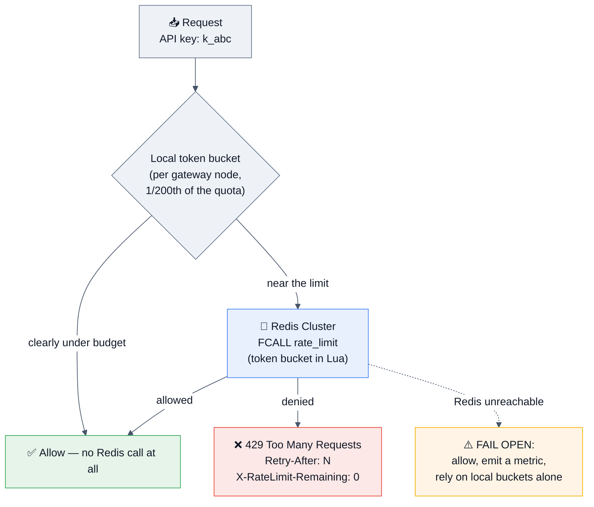

**Design decisions to volunteer:**
- **Two-tier limiting.** A local bucket absorbs the common case so Redis sees a fraction of the traffic. **This is what real gateways do**, and it's the difference between a textbook answer and a production one.
- **Token bucket in a Lua Function** — atomic, one round trip, and bursts are a feature for API UX.
- **Key design:** `rl:{api_key}:{window}` — the hash tag keeps a key's state on one slot. ⚠️ A single abusive key becomes a **hot key**; the local tier is also the hot-key mitigation.
- **Fail open**, with an alert — a rate limiter that takes down your API when Redis blips is worse than the abuse it prevents. (For an *auth* check the answer inverts: fail closed.)
- **Billing accuracy:** if the counts are billable, Redis is not the ledger — emit usage events to a durable stream and reconcile. **Redis enforces; the warehouse bills.**
- **Headers:** `X-RateLimit-Limit/Remaining/Reset` and `Retry-After` — cheap credibility.

## 7.4 🔴 Advanced design: real-time leaderboard for a game with 100 M players

**Requirements:** live global + regional + friends leaderboards, "my rank" for any player, 500k score updates/sec at peak.

| Concern | Decision |
|---------|----------|
| **Structure** | Sorted set per board. `ZADD board GT score member` so scores only rise. |
| **Memory** | 100 M members × ~70–100 B in a skiplist zset ≈ **7–10 GB per board**. Fits, but shard by region anyway. |
| **Write rate** | 500k/s ≫ one shard. **Pre-aggregate in the app** (only publish a player's best score every N seconds) — this typically cuts Redis writes by 10–100×. Then shard by region. |
| **"My rank" globally** | `ZREVRANK` is O(log N) on **one** shard. Across 20 regional shards there is no cheap exact global rank. **Approximate it**: maintain a coarse histogram of score buckets per shard, sum the buckets above the player's score, and refine within their own shard. **Say that exact global ranking of 100 M live scores is genuinely hard** — that honesty scores better than a hand-wave. |
| **Top-N global** | Merge the top-N from each shard (N × 20 candidates → sort) — cheap and exact for the head. |
| **Friends board** | `ZINTERSTORE` of the friends set with the board, or (better) fetch ≤500 friends' scores with a pipelined `ZSCORE`/`ZMSCORE` and sort in the app. Precomputing a zset per user is a memory disaster at 100 M users. |
| **Seasons** | `board:s42:global` — a new key per season; drop the old key to reset. Archive the final standings to durable storage before dropping. |
| **Durability** | Scores also written to the durable game DB; Redis is the serving layer and is rebuildable. |
| **Ties** | Composite score: `points * 1e10 + (MAX_TS - first_achieved_ts)` so earlier achievers rank higher. ⚠️ Watch float precision — Redis zset scores are IEEE 754 doubles, exact only to 2^53. **Naming that limit is a strong detail.** |

## 7.5 🔴 Advanced design: a chat application's presence and message delivery

**Requirements:** 10 M concurrent users, online/offline presence, typing indicators, message fan-out, unread counts.

```
Presence:   SETEX presence:{user} 30 "online"  refreshed by a heartbeat every 10s
            → absence of the key = offline, with no cleanup job needed. Elegant.
            For "who in this room is online": a per-room set + per-user TTL key, checked with
            a pipelined EXISTS (not a giant set with manual removal, which drifts).
Typing:     SETEX typing:{room}:{user} 5 "1"  — expiry IS the semantics
Delivery:   Pub/Sub (or sharded SPUBLISH in Cluster) per room for live fan-out to
            connected WebSocket servers. ⚠️ Fire-and-forget: it does NOT store messages.
Messages:   Durable store (Cassandra/DynamoDB/Postgres) is the source of truth.
            Redis Stream per room ONLY as a short recent-history buffer (XADD MAXLEN ~ 1000).
Unread:     HINCRBY unread:{user} {room} 1  — a hash so one key holds all of a user's counts
Sockets:    Each WS server subscribes only to the rooms its connected users are in
            → SSUBSCRIBE in Cluster so the message doesn't broadcast to every node
```
**The trap and the answer:** *"The tempting design is to deliver messages over Pub/Sub. But Pub/Sub is at-most-once with no persistence, so a user whose socket reconnects mid-publish loses messages silently. The correct split is: durable store for the message, Pub/Sub only as a **notification that new data exists**, and the client fetches from the durable store (or the Stream buffer) by last-seen ID. Then a missed notification costs a small delay, not a lost message."*

## 7.6 🔴 Production design: introduce Redis to a system that has never had a cache

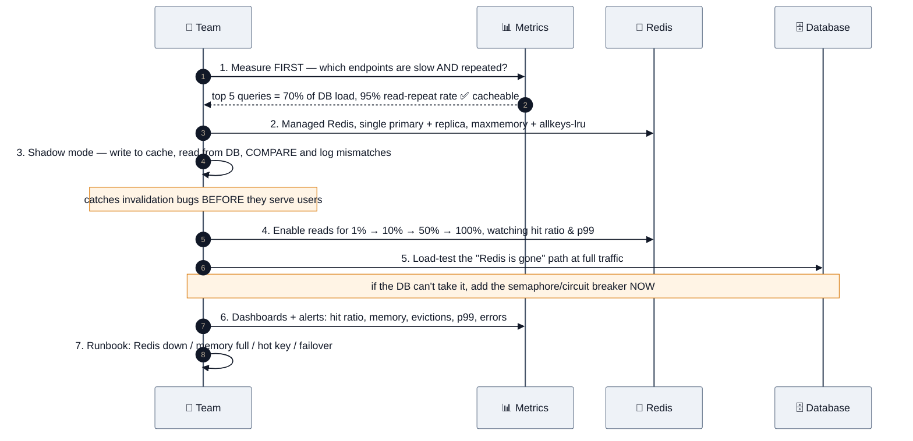

**The point of this answer:** *"Adding a cache adds a failure domain and a consistency problem. The measurement step and the shadow-mode step are what stop it from being a net negative. And step 5 is non-negotiable — most cache-related outages are actually database outages caused by the cache disappearing."*

## 7.7 Design-round question bank

| Level | Question | The Redis-specific thing they're listening for |
|-------|----------|-----------------------------------------------|
| Beginner | Add caching to a REST API | Cache-aside + TTL + jitter + invalidation on write |
| Beginner | Design a URL shortener | Redis as the read cache in front of the mapping store; not the source of truth |
| Beginner | Session management | Hash + sliding TTL + logout/revocation + the reverse index |
| Intermediate | **Rate limiter** | Algorithms, Lua atomicity, fail-open, hot keys, two-tier |
| Intermediate | **Leaderboard** | Sorted sets, ZREVRANK, composite scores for ties, sharding |
| Intermediate | Notification/job queue | Streams + consumer groups + `XAUTOCLAIM` + dead letters |
| Intermediate | Autocomplete | `ZRANGEBYLEX` vs prefix zsets vs the Query Engine |
| Intermediate | Shopping cart | Hash per cart, TTL, and **why it also needs durable storage** |
| Advanced | **Distributed lock / no double-processing** | `SET NX PX`, Lua release, Redlock critique, fencing, "design the lock away" |
| Advanced | Real-time analytics | HLL, bitmaps, Top-K, pre-aggregation, TS.* downsampling |
| Advanced | Chat / presence | TTL-as-presence, Pub/Sub as notification not delivery, sharded pub/sub |
| Advanced | Flash sale / inventory | Atomic decrement, counter sharding, reservation TTL, reconciliation |
| Advanced | Feed / timeline | Fan-out-on-write, `LTRIM` caps, the celebrity problem, hydration |
| Advanced | **Semantic cache for an LLM** | Vector sets, threshold tuning, tenant scoping, memory math |
| Production | Multi-region Redis | No active-active in OSS; independent regional caches; CRDT caveats |
| Production | Migrate/scale a Redis Cluster | Slot migration, replication cutover, verification, rollback |
| Production | Design the on-call runbook | Memory, evictions, hot keys, failover, latency, connection storms |

---

# 8. 🏭 Real Production Usage at Scale

## 8.1 Who runs Redis, and for what

| Company | How they use it | The lesson to quote |
|---------|-----------------|---------------------|
| **Twitter/X** | Historically one of the largest Redis deployments — **home timelines** materialized in Redis, fan-out-on-write, capped at ~800 entries per user. Later built **Nighthawk** (a sharded Redis-backed KV service) and **Pelikan** (their own cache framework). | *"Cap the timeline. Nobody scrolls past a few hundred items, and an uncapped list is an unbounded memory leak."* |
| **GitHub** | Redis for job queues (Resque, which GitHub authored), session storage, and caching. Published incident write-ups involving Redis failover behaviour. | Resque is the canonical "queue on Redis lists" design. |
| **Stack Overflow** | Famous for extreme efficiency: a small number of very large Redis instances serving billions of ops/day for caching, with `StackExchange.Redis` (which they wrote) as the client. | *"You can go astonishingly far on a couple of well-tuned boxes."* Their architecture posts are a great counterweight to premature distribution. |
| **Instagram** | The **hash-bucketing memory optimization** — storing IDs in bucketed hashes rather than individual keys, reported as roughly a **5× memory reduction**. | §2.2 / §4.3 Q38. **The single most-cited Redis memory story.** |
| **Uber** | Redis for geospatial/dispatch-adjacent caching, rate limiting, and as a caching tier; they've written about the operational pain of large Redis fleets and about building on top of it. | Hot keys and fleet operations at scale. |
| **Pinterest** | Redis for the follower graph and feed-related storage at large scale; wrote about sharding and the memory economics. | Graph-ish data in Redis works — until memory cost dominates. |
| **Snapchat / Snap** | Heavy Redis usage; **acquired KeyDB** (the multi-threaded fork) and is a Valkey founding supporter. | The multi-threading motivation is real at their scale. |
| **Shopify, Airbnb, Slack, Stripe** | Caching, rate limiting, idempotency keys, background job queues (Sidekiq — Redis-backed — is ubiquitous in Ruby shops). | **Sidekiq is worth naming**: it's Redis-list-based job processing used by thousands of companies. |
| **Discord** | Redis and Redis-like stores for presence and session state alongside Cassandra/ScyllaDB for durable messages. | The "Redis for ephemeral, durable store for messages" split. |
| **Netflix** | **EVCache** — a Memcached-based tiered caching system — plus Redis/Dynomite historically. Netflix's writing on cache warming and multi-region caching is excellent. | *"At Netflix's scale, the interesting problems are cache warming and regional failover, not command latency."* |
| **AWS / Google / Azure** | ElastiCache, MemoryDB (durable Redis-compatible with a multi-AZ transaction log), Memorystore, Azure Cache. **AWS made Valkey the default** for new ElastiCache/MemoryDB clusters. | **MemoryDB is the interesting one**: it adds a durable, multi-AZ log so it *can* be a primary database — the exception to "never use Redis as the source of truth." |
| **OpenAI / Anthropic / AI infra** | Redis for rate limiting, request queues, session/conversation state, and increasingly **semantic caching and vector retrieval**. | The 2025–2026 growth area. |

## 8.2 The three most instructive patterns to cite

### 🔵 Instagram — hash bucketing
Storing 300 M photo-ID → user-ID mappings as individual string keys was prohibitively expensive. Bucketing them into hashes of ~1000 fields (which stay in the compact listpack encoding) cut memory roughly **5×**. **Why it works:** per-key overhead (object header, dict entry, expires entry) is paid once per bucket instead of once per value, and a listpack is a flat contiguous blob with almost no per-entry cost. **The trade-off:** operations inside a bucket are O(N) over a small N, and you lose per-key TTLs (until 7.4's `HEXPIRE`).

### 🟣 Twitter — capped, materialized timelines
Fan-out-on-write into a per-user Redis list, **capped at a few hundred entries**, with the tweets themselves stored elsewhere and hydrated at read time. **The two lessons:** (1) cap everything — an uncapped per-user collection multiplied by 300 M users is not a cache, it's an outage; (2) **store IDs, not objects** — the timeline holds pointers, and hydration is a pipelined `MGET`.

### 🟠 Stack Overflow — do less, on fewer machines
A famously small server footprint serving enormous traffic, with Redis as a shared L2 behind aggressive in-process L1 caches. **The lesson for design rounds:** the biggest performance win is usually **not making the call at all**. An L1 cache with a 1–5 second TTL removes the vast majority of Redis traffic and is the standard hot-key fix.

## 8.3 Managed Redis — know the landscape

| Service | Differentiator | Interview-relevant caveat |
|---------|----------------|---------------------------|
| **AWS ElastiCache** (Redis OSS / **Valkey**) | The default managed option; cluster mode enabled/disabled | **Valkey is the default and ~20% cheaper**; no `CONFIG SET` for some params; certain commands restricted |
| **AWS MemoryDB** | **Durable**, multi-AZ transactional log — designed to be a primary database | ~30% cheaper on Valkey; higher write latency than ElastiCache because writes are logged across AZs. **The one "Redis as source of truth" answer that's defensible.** |
| **Google Memorystore** (Redis / **Valkey**) | Managed, VPC-native | |
| **Azure Cache for Redis** | Tiers up to Enterprise (Redis Ltd. software, Active-Active) | Enterprise tier unlocks modules + CRDT geo-replication |
| **Redis Cloud** | From Redis Ltd.; Active-Active CRDT, flash tiering, full module suite | The only fully-featured Redis 8 + Query Engine + vector managed option |
| **Upstash** | **Serverless, per-request pricing**, REST API, edge-friendly | Great for spiky/serverless workloads; per-request cost model changes the design calculus |
| **DragonflyDB Cloud** | Multi-threaded, vertical scaling | Replaces a cluster with one large node |

> [!TIP]
> **A strong answer to "ElastiCache or MemoryDB?"**: *"ElastiCache when Redis is a cache and losing it costs a rebuild — which is most of the time, and it's cheaper and faster. MemoryDB when I need Redis's data structures **and** durability, because it writes to a multi-AZ transaction log before acking; that's the one configuration where I'd be comfortable calling Redis the source of truth. The price is write latency, so I wouldn't use it for a plain cache."*

---

# 9. 🐛 Common Bugs & Production Incidents

## 9.1 The incident catalogue

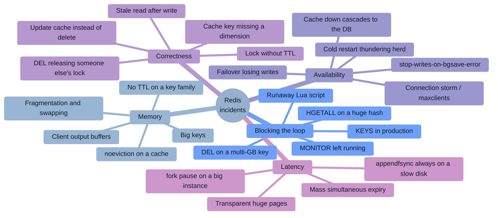

## 9.2 Incident deep-dives

### 🔴 Incident 1: "A cron job took the whole site down for 40 seconds" — `KEYS`
**Symptom:** Every Redis call times out for ~40 s, every night at 02:00. CPU pinned at 100% on one core.
**Root cause:** A cleanup script ran `KEYS "session:*"` against an instance with 60 M keys. `KEYS` is O(N) over the entire keyspace **on the single thread**, so nothing else ran until it finished.
**Fix now:** kill the client (`CLIENT KILL`), and there's no way to abort `KEYS` mid-flight — you wait.
**Permanent fix:** `SCAN` with a `COUNT` hint and `UNLINK` (§4.1 Q9), **disable `KEYS` entirely** via ACL (`-keys`) or `rename-command KEYS ""`, and redesign so cleanup uses TTLs rather than scanning at all.
**Why this is the canonical Redis incident:** it's a one-line change with a total-outage blast radius, and it looks harmless in code review.

### 🔴 Incident 2: "The cache went down and took the database with it"
**Symptom:** A brief Redis failover (30 s) turns into a 45-minute full outage. The database is at 100% CPU with thousands of queued connections long after Redis recovered.
**Root cause:** Every cache miss fell through to the DB with no concurrency limit. 50k rps hit a database sized for 3k. Connection pools exhausted, timeouts cascaded, health checks failed, instances were restarted, and each restart opened fresh connections — a **retry storm**.
**Fix:** a **semaphore/bulkhead** capping concurrent DB queries per instance; a **circuit breaker** that fails fast once the DB is saturated; **request coalescing** (singleflight) so 10k concurrent misses on one key become one query; serving stale data from a local cache; and **load shedding with 503 + `Retry-After`** rather than queueing forever.
**The lesson to state in interviews:** *"Most 'Redis outages' are actually database outages triggered by Redis. The cache's failure mode is the thing you have to design, not the cache."*

### 🔴 Incident 3: "We lost 4,000 orders during a failover"
**Symptom:** After a Sentinel failover, order state that the app had written to Redis was gone.
**Root cause:** **Replication is asynchronous.** The primary acked writes and died before the replica received them; the promoted replica never had them. Compounded by the app treating Redis as the source of truth for in-flight order state.
**Fix:** write the durable record to the database first and use Redis as the derived/serving layer; where Redis state matters, `min-replicas-to-write 1` converts silent loss into visible write errors, and `WAIT`/`WAITAOF` narrows (never closes) the window. For genuine durability with Redis semantics, **AWS MemoryDB** or an equivalent durable-log design.
**Interview value:** this incident *is* the answer to "can Redis be your source of truth?"

### 🔴 Incident 4: "The lock didn't lock" — `SETNX` with no expiry, then the wrong `DEL`
**Two bugs, both extremely common:**
```python
# 💀 Bug 1: no expiry → the holder crashes → the lock is held FOREVER
if r.setnx("lock:x", 1):
    do_work()
    r.delete("lock:x")

# 💀 Bug 2: with a TTL but a blind DEL → you delete SOMEONE ELSE'S lock
r.set("lock:x", 1, nx=True, ex=30)
do_work()          # takes 35s...
r.delete("lock:x") # ...deletes the lock that worker B acquired at t=30 😱
```
**Fix:** §3.6 — a unique token plus a Lua compare-and-delete, plus a watchdog or idempotent work. **And the deeper fix:** if double-execution would be catastrophic, don't rely on a Redis lock at all.

### 🔴 Incident 5: "Users saw each other's data" — a missing cache-key dimension
**Symptom:** Customers intermittently see another tenant's dashboard.
**Root cause:** The cache key was `dashboard:{dashboard_id}` but the rendered content depended on the **viewer's tenant and permissions**. The first viewer's render was served to everyone.
**Fix:** every dimension that affects the output must be in the key — tenant, user role, locale, currency, feature-flag variant, API version. Enforce it with a **shared key-builder function** that requires those arguments, so you cannot construct a key without them.
**Why it matters:** this is the **highest-severity common caching bug** — it's a data-leak class incident, not a performance bug. Naming it unprompted in a security or design round is a big signal.

### 🔴 Incident 6: "Memory hit maxmemory and writes started failing"
**Symptom:** `OOM command not allowed when used memory > 'maxmemory'` in the application logs. Reads fine, writes rejected.
**Root cause:** `maxmemory-policy` was left at the default **`noeviction`** on an instance being used as a cache, and a key family had no TTL.
**Fix now:** `CONFIG SET maxmemory-policy allkeys-lru`, then find and TTL/`UNLINK` the offending prefix.
**Permanent fix:** explicit `maxmemory` and policy in config management (never defaults), an alert at 80% memory, a lint/review rule that **every `SET` has a TTL unless justified**, and `--bigkeys` in a periodic report.
**The related trap:** with a `volatile-*` policy and no TTLs anywhere, Redis has nothing to evict and behaves exactly like `noeviction`.

### 🔴 Incident 7: "Latency spikes every 15 minutes"
**Symptom:** Clean p99, but p999 spikes to 500 ms on a regular cadence.
**Root cause:** `BGSAVE` forking a 40 GB write-heavy instance. Copy-on-write page copying plus a large page-table copy stalled the event loop — **made dramatically worse by transparent huge pages being enabled** (2 MB copies instead of 4 KB).
**Fix:** `echo never > /sys/kernel/mm/transparent_hugepage/enabled`, `vm.overcommit_memory = 1`, snapshot on a **replica** instead of the primary, and **split into smaller shards (10–25 GB)**.
**Diagnostic:** `INFO` → `latest_fork_usec`; `LATENCY HISTORY fork`.

### 🔴 Incident 8: "The pub/sub subscribers silently stopped receiving"
**Symptom:** A notification service quietly stops delivering; no errors in Redis.
**Root cause:** A slow subscriber's **client output buffer** exceeded `client-output-buffer-limit pubsub` (default 32 MB hard / 8 MB sustained for 60 s) and **Redis disconnected it**. Those messages are gone permanently — Pub/Sub has no replay.
**Fix:** monitor `CLIENT LIST` output-buffer sizes and `client-output-buffer-limit` disconnects; make subscribers fast (hand off to an internal queue immediately, never do work in the message handler); and **for anything that must not be lost, use Streams, not Pub/Sub.**

### 🔴 Incident 9: "Everything got slow after a deploy" — the N+1 over the network
**Symptom:** An endpoint's p99 goes from 20 ms to 800 ms. Redis itself looks perfectly healthy: low CPU, sub-ms `commandstats`.
**Root cause:** A refactor replaced one `MGET` with a loop of 500 individual `GET`s. 500 × 1.2 ms RTT = 600 ms of pure network waiting, with Redis doing 0.5 ms of actual work.
**Fix:** pipelining, `MGET`/`HMGET`, or a single Lua call. **Detection:** `INFO commandstats` shows a huge `calls` count with a tiny `usec_per_call` — **that shape is the fingerprint of a network N+1.**

### 🔴 Incident 10: "The Redis was on the public internet"
**Symptom:** Crypto-mining processes on the host; unexplained keys; data wiped.
**Root cause:** Redis bound to `0.0.0.0` with no `requirepass`, reachable from the internet. The standard attack: `CONFIG SET dir /root/.ssh` + `CONFIG SET dbfilename authorized_keys` + `SAVE` writes an attacker's SSH key, or the same trick against cron.
**Fix:** §10. `bind` to a private interface, `protected-mode yes` (on by default since 3.2 — this is why), a strong password or ACLs, TLS, security-group isolation, and disabling `CONFIG`/`FLUSHALL`/`DEBUG` for application users.
**Interview value:** *"Redis's default posture historically assumed a trusted network. Anyone who has operated it knows this attack, and it's why `protected-mode` exists."*

## 9.3 Error messages worth recognizing

| Error | Meaning | Action |
|-------|---------|--------|
| `OOM command not allowed when used memory > 'maxmemory'` | `noeviction` (or nothing evictable) with memory full | Fix the policy / TTLs / capacity |
| `MISCONF Redis is configured to save RDB snapshots... but is currently not able to persist` | `stop-writes-on-bgsave-error yes` and a **failed save** (usually a full disk) | Fix the disk; **this blocks all writes** |
| `READONLY You can't write against a read only replica` | You're writing to a replica — usually a **stale client after a failover** | Refresh the topology; check Sentinel/cluster awareness |
| `MOVED 5423 10.0.0.2:6379` | Cluster: this slot lives elsewhere | The client should update its slot map (a smart client does) |
| `ASK 5423 10.0.0.3:6379` | Slot is **mid-migration**; redirect this one request with `ASKING` | Transient — normal during resharding |
| `CROSSSLOT Keys in request don't hash to the same slot` | Multi-key op across slots in Cluster | Use hash tags, or split the operation |
| `CLUSTERDOWN Hash slot not served` | A slot has no owner (a primary died with no replica) | `cluster-require-full-coverage`; restore/failover |
| `BUSY Redis is busy running a script` | A Lua script has exceeded `busy-reply-threshold` | `SCRIPT KILL` (only if it hasn't written), else `SHUTDOWN NOSAVE` |
| `NOSCRIPT No matching script` | `EVALSHA` after a restart or `SCRIPT FLUSH` | The client must fall back to `EVAL`/reload — or use **Functions**, which persist |
| `ERR max number of clients reached` | `maxclients` exceeded | Connection leak or missing pooling |
| `LOADING Redis is loading the dataset in memory` | Starting up / replica doing a full sync | Wait; expected during a restart |
| `NOAUTH Authentication required` / `WRONGPASS` | Missing or wrong credentials | ACL/password config |
| `NOPERM this user has no permissions` | ACL denial | Expected when you've locked down commands correctly |
| `WRONGTYPE Operation against a key holding the wrong kind of value` | Key-namespace collision — two features using the same key | Namespace your keys |

## 9.4 The debugging toolkit

```bash
# 🔧 First five commands on any Redis problem
redis-cli INFO                       # everything: memory, clients, persistence, stats, replication
redis-cli SLOWLOG GET 25             # what was slow?
redis-cli --latency                  # round-trip latency, live
redis-cli --intrinsic-latency 100    # is it the SERVER or the network?
redis-cli CLIENT LIST                # who's connected, idle time, output buffers

# 🔧 Memory investigation
redis-cli --bigkeys                  # largest key per type (sampled, SCAN-based, safe)
redis-cli --memkeys                  # memory per key (sampled)
redis-cli MEMORY DOCTOR
redis-cli MEMORY STATS
redis-cli INFO memory | grep -E 'used_memory|fragmentation|peak'

# 🔧 Traffic shape
redis-cli --stat                     # live ops/sec, memory, clients, keyspace
redis-cli INFO commandstats          # per-command calls + usec_per_call  ← the N+1 fingerprint
redis-cli INFO latencystats          # per-command percentiles (7.0+)
redis-cli --hotkeys                  # needs an LFU policy

# 🔧 Last resort — expensive, debug only, never leave it running
redis-cli MONITOR | head -100        # every command; MONITOR itself costs real CPU
```

```ini
# 🔧 Config that makes future debugging possible
slowlog-log-slower-than 5000      # µs — lower it while investigating
slowlog-max-len 512
latency-monitor-threshold 100     # ms — enables the LATENCY subsystem
logfile /var/log/redis/redis.log
loglevel notice
```

---
# 10. 🔐 Security

## 10.1 The attack-surface map

```mermaid
%%{init: {'theme':'base','themeVariables':{'background':'#ffffff','mainBkg':'#eef2f7','primaryColor':'#eef2f7','primaryTextColor':'#111827','primaryBorderColor':'#64748b','secondaryColor':'#e8f0fe','tertiaryColor':'#f1f5f9','lineColor':'#475569','textColor':'#111827','clusterBkg':'#f8fafc','clusterBorder':'#94a3b8','edgeLabelBackground':'#ffffff','titleColor':'#111827','actorBkg':'#eef2f7','actorTextColor':'#111827','actorBorder':'#64748b','actorLineColor':'#475569','signalColor':'#111827','signalTextColor':'#111827','noteBkgColor':'#fff4e5','noteTextColor':'#111827','noteBorderColor':'#d97706','labelBoxBkgColor':'#eef2f7','labelBoxBorderColor':'#64748b','labelTextColor':'#111827','loopTextColor':'#111827','altBackground':'#f8fafc'}}}%%
flowchart TB
    ATT["🕵️ Attacker"]
    ATT -->|"1. Unauthenticated<br/>internet-exposed Redis"| EXP["🌐 Network exposure"]
    ATT -->|"2. CONFIG SET dir + SAVE<br/>→ write SSH key / cron"| RCE["💀 Remote code execution"]
    ATT -->|"3. Command injection via<br/>unsanitized key names / Lua"| INJ["🧪 Injection"]
    ATT -->|"4. FLUSHALL / DEBUG /<br/>SHUTDOWN by a compromised app"| DEST["🔥 Destructive commands"]
    ATT -->|"5. Sniffing plaintext<br/>traffic"| MITM["📡 No TLS"]
    ATT -->|"6. Reading sensitive<br/>cached data"| DATA["🗄️ Data at rest / in RDB"]
    ATT -->|"7. Resource exhaustion:<br/>huge keys, connection flood"| DOS["⚡ DoS"]

    EXP --> D1["✅ bind 127.0.0.1 / private IP<br/>protected-mode yes<br/>VPC + security groups"]
    RCE --> D2["✅ ACL deny CONFIG, DEBUG, MODULE<br/>run as a non-root, unprivileged user"]
    INJ --> D3["✅ Never build keys/Lua from raw<br/>user input; declare KEYS properly"]
    DEST --> D4["✅ ACL: -flushall -flushdb -keys<br/>-shutdown -debug; rename-command"]
    MITM --> D5["✅ TLS (6.0+), client certs"]
    DATA --> D6["✅ Don't cache secrets;<br/>encrypt the RDB/AOF volume"]
    DOS --> D7["✅ maxmemory, maxclients,<br/>output-buffer limits, per-user ACL limits"]

    style ATT fill:#fce8e6,stroke:#ea4335,color:#111827
    style RCE fill:#fce8e6,stroke:#ea4335,color:#111827
    style D1 fill:#e6f4ea,stroke:#34a853,color:#111827
    style D2 fill:#e6f4ea,stroke:#34a853,color:#111827
    style D3 fill:#e6f4ea,stroke:#34a853,color:#111827
    style D4 fill:#e6f4ea,stroke:#34a853,color:#111827
    style D5 fill:#e6f4ea,stroke:#34a853,color:#111827
    style D6 fill:#e6f4ea,stroke:#34a853,color:#111827
    style D7 fill:#e6f4ea,stroke:#34a853,color:#111827
```

## 10.2 The one attack you must be able to describe

> [!WARNING]
> **The unauthenticated-Redis RCE.** Redis historically shipped with **no password and bound to all interfaces**, and `CONFIG SET` lets a client change the persistence directory and filename at runtime. So an attacker who can reach port 6379 does:
> ```
> FLUSHALL
> SET x "\n\nssh-rsa AAAA... attacker@host\n\n"
> CONFIG SET dir /root/.ssh/
> CONFIG SET dbfilename authorized_keys
> SAVE
> ```
> Redis dutifully writes its RDB — containing that string — to `/root/.ssh/authorized_keys`. SSH ignores the binary noise around it and accepts the key. **Game over.** The same trick works against `/var/spool/cron/`.
>
> **This is why `protected-mode` was added in Redis 3.2**: if no password and no `bind` are configured, Redis refuses connections from non-loopback addresses. Being able to narrate this attack and its mitigations is one of the highest-signal security answers in a Redis interview.

## 10.3 Network and authentication

```ini
# ── Network ─────────────────────────────────────
bind 10.0.1.15 127.0.0.1        # ✅ never 0.0.0.0 on a reachable network
protected-mode yes              # ✅ default since 3.2 — leave it on
port 6379                       # or 0 to disable non-TLS entirely
tcp-backlog 511

# ── Auth (legacy single password) ───────────────
requirepass <long-random-secret>
masterauth  <same>              # replicas authenticating to the primary
masteruser  replicator          # ✅ 6.0+: ACL user for replication
```

**Use ACLs (Redis 6.0+), not `requirepass`, for anything real:**

```redis
# Per-user permissions on commands AND key patterns AND pub/sub channels
ACL SETUSER app_reader on >s3cr3t ~cache:* &notifications:* +@read +get +mget -@dangerous
ACL SETUSER app_writer on >s3cr3t2 ~app:* +@read +@write -@dangerous -flushall -flushdb -keys -config
ACL SETUSER metrics    on >s3cr3t3 allkeys +info +ping +client|list
ACL SETUSER default    off                      # ✅ disable the default user entirely
ACL LIST
ACL WHOAMI
ACL GETUSER app_writer
ACL LOG                                          # ✅ denied-command audit trail
```

| ACL concept | Syntax | Note |
|-------------|--------|------|
| Enable/disable user | `on` / `off` | Turn `default` **off** in production |
| Password | `>password` / `#<sha256>` | Or `nopass` (never in prod) |
| Key patterns | `~cache:*`, `%R~read:*`, `%W~write:*` | 🆕 7.0 adds read/write-specific key permissions |
| Pub/Sub channels | `&channel:*` | 7.0+ requires explicit channel grants |
| Command categories | `+@read`, `+@write`, `-@dangerous`, `-@admin` | `@dangerous` covers `FLUSHALL`, `KEYS`, `CONFIG`, `DEBUG`, `SHUTDOWN` |
| Individual commands | `+get`, `-del`, `+client\|list` | Subcommand-level granularity |
| Selectors | `(%R~logs:* +get)` | 7.0+: multiple permission sets per user |

**Also disable or rename destructive commands** (belt and braces, especially pre-6.0):
```ini
rename-command FLUSHALL ""
rename-command FLUSHDB  ""
rename-command CONFIG   "CONFIG_a8f3d92b"
rename-command DEBUG    ""
rename-command KEYS     ""
```

## 10.4 TLS

```ini
tls-port 6380
port 0                          # ✅ disable plaintext entirely
tls-cert-file  /etc/redis/redis.crt
tls-key-file   /etc/redis/redis.key
tls-ca-cert-file /etc/redis/ca.crt
tls-auth-clients yes            # ✅ mutual TLS — clients must present a cert
tls-replication yes             # ✅ encrypt the replication stream too
tls-cluster yes                 # ✅ and the cluster bus
tls-protocols "TLSv1.2 TLSv1.3"
```
```bash
redis-cli --tls --cert client.crt --key client.key --cacert ca.crt -h redis.internal -p 6380
```
**Cost:** TLS adds real CPU overhead (encryption on a single-threaded server). Benchmark it; it's typically a 10–30% throughput hit depending on value sizes and whether I/O threads are enabled. **Mentioning the cost, not just the config, is the senior answer.**

## 10.5 Data-level concerns

| Concern | Guidance |
|---------|----------|
| **Don't cache secrets** | Never put raw passwords, full card numbers, or unencrypted PII in Redis. Cache an ID and re-fetch. `MONITOR`, `SLOWLOG`, and the RDB file all expose values. |
| **`SLOWLOG` leaks arguments** | Slow-log entries contain command arguments — including values. Restrict `SLOWLOG` via ACL and treat logs as sensitive. |
| **RDB/AOF at rest** | They're plaintext dumps of your data. **Encrypt the volume**, restrict file permissions (`chmod 600`), and secure your backups the same way you secure the database. |
| **No native encryption at rest** | Open-source Redis has **no built-in TDE**. Volume encryption or application-level encryption of values are the options — and encrypted values can't be searched or partially updated. |
| **Multi-tenancy** | Redis has no row-level security. Isolation is by **key prefix + ACL key patterns** (`~tenant:42:*`), or separate instances/databases for strong isolation. **In Cluster mode there's only DB 0**, so prefixes + ACLs are the mechanism. |
| **Injection** | There's no SQL, but you can still break things: user input in a key name can collide across namespaces or blow up memory; user input concatenated into a Lua script is genuine code injection. **Always pass values via `ARGV`, never string-build the script.** |
| **Serialization gadgets** | Storing Java/Python serialized objects and deserializing them from cache is a **deserialization RCE** if an attacker can write to Redis. Use JSON/protobuf, not native serialization. **This is an excellent, rarely-mentioned point.** |

## 10.6 Resource limits (DoS protection)

```ini
maxmemory 8gb
maxmemory-policy allkeys-lru
maxclients 10000
timeout 300                                     # close idle client connections
client-output-buffer-limit normal 0 0 0
client-output-buffer-limit replica 256mb 64mb 60
client-output-buffer-limit pubsub 32mb 8mb 60   # ⚠️ slow subscribers get disconnected
busy-reply-threshold 5000                       # ms before a script gets BUSY replies
proto-max-bulk-len 512mb
```
Plus per-user ACL restrictions to prevent an application from issuing `KEYS`, giant `LRANGE`s, or unbounded Lua.

## 10.7 Security checklist

- [ ] `bind` to private interfaces only; **never `0.0.0.0`** on a routable network
- [ ] `protected-mode yes`
- [ ] Network isolation: VPC/security group/firewall — Redis reachable only from app subnets
- [ ] **ACLs** with least privilege; `default` user **disabled**
- [ ] Strong, rotated credentials from a secrets manager (never in the repo or the config file in git)
- [ ] **TLS** enabled, plaintext port disabled, replication and cluster bus encrypted
- [ ] `FLUSHALL`, `FLUSHDB`, `CONFIG`, `DEBUG`, `KEYS`, `SHUTDOWN`, `MODULE` denied to app users
- [ ] Redis runs as a **non-root** user; the data dir isn't writable by anything else
- [ ] `maxmemory`, `maxclients`, and output-buffer limits set explicitly
- [ ] No secrets or unencrypted PII cached; values are JSON/protobuf, **not native serialized objects**
- [ ] RDB/AOF volumes and backups encrypted, permissions restricted
- [ ] `ACL LOG` monitored; unusual `CONFIG`/`FLUSH` attempts alerted
- [ ] Patch cadence tracked (Redis/Valkey CVEs, especially in Lua and the protocol parser)
- [ ] Managed service? Confirm encryption in transit/at rest and auth are actually **enabled**, not just available

---

# 11. ⚡ Performance

## 11.1 The performance hierarchy — fix in this order

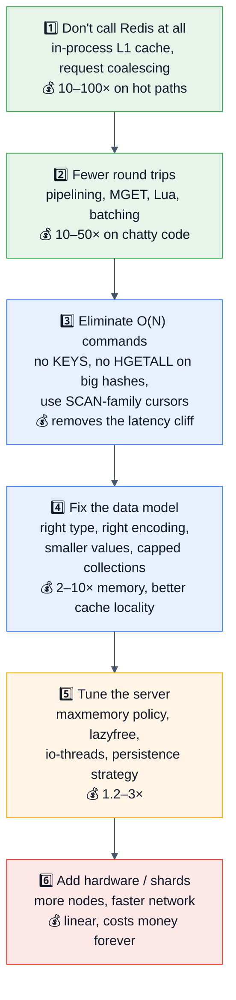

> [!TIP]
> **Say this in the interview:** *"Redis is almost never the bottleneck — the round trips to it are. Before I touch a config file I'd check `INFO commandstats` for a huge `calls` count with a tiny `usec_per_call`, because that shape means the application is chatty, not that Redis is slow."*

## 11.2 Command complexity — the table to internalize

| O(1) — always safe | O(log N) | O(N) — **think before using** | O(N) over the **whole keyspace** — 💀 never in prod |
|---|---|---|---|
| `GET` `SET` `INCR` `SETNX` `EXPIRE` `TTL` `EXISTS` `TYPE` | `ZADD` `ZSCORE` `ZRANK` `ZINCRBY` `ZREM` | `LRANGE` `HGETALL` `SMEMBERS` `ZRANGE` (large ranges) | **`KEYS`** |
| `HGET` `HSET` `HDEL` `HEXISTS` | `ZRANGEBYSCORE` (+M results) | `SORT` `SINTER` `SUNION` `ZUNIONSTORE` | **`FLUSHALL`/`FLUSHDB`** (sync) |
| `SADD` `SREM` `SISMEMBER` `SCARD` | `ZPOPMIN`/`ZPOPMAX` | `DEL` on a large collection (use **`UNLINK`**) | `DEBUG SLEEP` |
| `LPUSH` `RPUSH` `LPOP` `RPOP` `LLEN` | | `LINSERT` `LREM` `LSET` | Unbounded Lua |
| `XADD` `XLEN` | `XRANGE` (+M) | `SETRANGE`/`GETRANGE` on huge strings | `RANDOMKEY` in a loop |
| `PFADD` `SETBIT` `GETBIT` | | `BITCOUNT` (whole key), `PFMERGE` | |

**The rule:** *"O(N) is fine when you control N. `LRANGE list 0 9` is O(10). `LRANGE list 0 -1` on a 5 M-element list is a 5-second outage. The danger isn't the complexity class — it's an unbounded N."*

## 11.3 A tuning baseline (16 GB instance, cache workload)

```ini
# ── Memory ───────────────────────────────────────
maxmemory 12gb                  # ✅ ~75% of RAM; leave room for COW, buffers, and the OS
maxmemory-policy allkeys-lru
maxmemory-samples 5             # 10 = closer to true LRU, more CPU
activedefrag yes                # jemalloc only; helps when fragmentation > 1.5
lazyfree-lazy-eviction yes
lazyfree-lazy-expire yes
lazyfree-lazy-server-del yes
replica-lazy-flush yes

# ── Encodings (memory vs CPU) ────────────────────
hash-max-listpack-entries 128
hash-max-listpack-value 64
list-max-listpack-size 128
set-max-intset-entries 512
set-max-listpack-entries 128
zset-max-listpack-entries 128
zset-max-listpack-value 64

# ── Persistence (a pure cache may disable BOTH) ──
save ""                         # ✅ pure cache: no RDB → no fork pauses
appendonly no
# For a data-bearing instance instead:
# save 900 1 / 300 10 / 60 10000
# appendonly yes ; appendfsync everysec ; aof-use-rdb-preamble yes

# ── Networking / threading ───────────────────────
io-threads 4                    # ~half the cores; ONLY helps at high throughput
tcp-keepalive 300
timeout 0
maxclients 10000
tcp-backlog 511

# ── Latency & safety ─────────────────────────────
slowlog-log-slower-than 10000
latency-monitor-threshold 100
busy-reply-threshold 5000
client-output-buffer-limit pubsub 32mb 8mb 60
```

```bash
# ── OS-level tuning that actually matters ────────
echo never > /sys/kernel/mm/transparent_hugepage/enabled   # ✅ THP wrecks fork/COW latency
sysctl -w vm.overcommit_memory=1                           # ✅ so BGSAVE's fork can succeed
sysctl -w net.core.somaxconn=1024                          # match tcp-backlog
sysctl -w vm.swappiness=0                                  # ✅ NEVER swap an in-memory DB
```

> [!WARNING]
> **Don't recite a config file in an interview.** Name **three** settings and *why*: `maxmemory` + the right policy (the OOM/eviction story), **THP disabled** (the fork-latency story), and `lazyfree`/`UNLINK` (the big-key story). Depth beats breadth every time.

## 11.4 Benchmarking properly

```bash
# redis-benchmark — built in
redis-benchmark -h host -p 6379 -n 1000000 -c 50 -t get,set -q
redis-benchmark -n 100000 -c 50 -P 16 -t get -q        # -P = pipeline depth ← huge difference
redis-benchmark -n 100000 -r 1000000 -d 512 -t set     # random keys, 512-byte values
redis-benchmark -n 10000 -c 20 eval "return 1" 0       # benchmark a custom script

# Better for realistic workloads
memtier_benchmark --ratio=1:10 --data-size-range=64-4096 --key-pattern=G:G --pipeline=8
```

**Rules to state:**
1. **Benchmark your key sizes, value sizes, and command mix** — `redis-benchmark`'s defaults (3-byte values, uniform keys) massively overstate real throughput.
2. **Report with and without pipelining** — the `-P` flag changes results by 5–10×, and quoting a pipelined number as if it were per-request throughput is misleading.
3. **Benchmark from a separate host** — running the client on the Redis box measures neither.
4. **Report p99/p999, not just ops/sec.** The tail is where Redis problems live.
5. **Run long enough to cross a `BGSAVE`** and to reach the `maxmemory` boundary — otherwise you're measuring the easy path.
6. **Use a realistic key distribution** (Zipfian, `--key-pattern=G:G`) — uniform-random access has completely different cache behaviour from real traffic.

## 11.5 Where the time actually goes

| Symptom | Likely cause | Confirm with |
|---------|--------------|--------------|
| High latency, low Redis CPU | **Client-side chattiness** (N+1), network RTT, client GC, pool exhaustion | `INFO commandstats` (high calls, low usec), `--intrinsic-latency` |
| High CPU, normal ops/sec | An O(N) command, a Lua script, TLS overhead, eviction churn, `MONITOR` running | `SLOWLOG`, `INFO commandstats`, `CLIENT LIST` |
| Periodic p999 spikes | **`fork()`** for BGSAVE/AOF-rewrite; mass expiry; AOF fsync | `latest_fork_usec`, `LATENCY HISTORY`, `expired_keys` spikes |
| Latency correlated with memory | Eviction at the `maxmemory` boundary; **swapping** (`fragmentation < 1`) | `INFO memory`, `evicted_keys` |
| One shard slow, others fine | Hot key, big key, or an uneven hash-tag distribution | `--hotkeys`, `--bigkeys` per node |
| Throughput plateaus below expectation | Single-core saturation; NIC limit; no pipelining | `redis-cli --stat`, host CPU per core, `INFO stats` `total_net_output_bytes` |
| Clients disconnected randomly | Output-buffer limits (pub/sub or replica), `maxclients`, `timeout` | `INFO clients`, `CLIENT LIST`, logs |

## 11.6 Throughput and latency reference numbers

| Operation | Typical figure |
|-----------|----------------|
| Simple `GET`/`SET`, one core, no pipelining | **~80k–150k ops/sec** |
| Same, with pipelining (`-P 16`) | **500k–1M+ ops/sec** |
| p50 / p99 latency for O(1) commands, LAN | **~0.1 ms / < 1 ms** |
| Round trip dominated by network | 0.2–1 ms same-AZ; 1–5 ms cross-AZ; **tens of ms cross-region** |
| Memory overhead per key | **~50–100 bytes** before the value |
| HyperLogLog size | **12 KB**, ~0.81% standard error |
| Bitmap for 100 M users | **12.5 MB** |
| Practical shard size | **10–25 GB** (fork, failover, and migration stay fast) |
| Max string value | **512 MB** (practical limit: far, far lower) |

> [!TIP]
> **Quote these in design rounds.** "One shard does roughly 100k ops/sec, so 1 M requests/sec needs about 12–15 shards with headroom" is a concrete, checkable statement — and it's the kind of arithmetic that separates a design answer from a description.

## 11.7 The performance checklist

- [ ] An L1 in-process cache in front of hot keys
- [ ] Pipelining / `MGET` / Lua instead of loops of single commands
- [ ] No `KEYS`, no unbounded `LRANGE`/`HGETALL`/`SMEMBERS` — cursors only
- [ ] `UNLINK` instead of `DEL`; `lazyfree-*` enabled
- [ ] Collections capped (`LTRIM`, `XADD MAXLEN ~`, `ZREMRANGEBYRANK`)
- [ ] Values compact (protobuf/MessagePack; compress > ~1 KB)
- [ ] Small keys bucketed into hashes to stay listpack-encoded
- [ ] `maxmemory` + the correct policy set explicitly
- [ ] TTLs on everything that can have one, **with jitter**
- [ ] Transparent huge pages **disabled**; `vm.overcommit_memory=1`; swap off
- [ ] Persistence strategy matched to purpose (pure cache → consider none)
- [ ] Connection pooling with sane sizes; timeouts on every call
- [ ] Shards sized 10–25 GB
- [ ] `SLOWLOG` and `latencystats` monitored, not just ops/sec

---

# 12. ✅ Best Practices

## 12.1 Key design

| ✅ Do | Why |
|-------|-----|
| **Namespace with colons:** `app:entity:id:field` | Readable, greppable, scannable by prefix, and prevents collisions between features |
| **Version your key schema:** `user:v3:1001` | A schema change becomes a version bump — no mass invalidation needed; old keys expire on their own |
| **Include every dimension that affects the value** | Tenant, user role, locale, currency, API version. **Omitting one is a data-leak bug** (§9.2 Incident 5) |
| **Keep key names short at scale** | 20 bytes × 100 M keys = 2 GB of pure key names |
| **Use hash tags deliberately in Cluster:** `{tenant:42}:orders` | Co-locates related keys — but watch for hot slots |
| Build keys through **one shared function** | Makes required dimensions unforgettable and the scheme greppable |
| **Set a TTL on everything you can** | The default should be "expires"; permanence should require justification |
| **Jitter every TTL** | `ttl + random(0, ttl * 0.1)` prevents synchronized expiry avalanches |

## 12.2 Data modelling

- **Pick the type for the access pattern, not the data shape.** Need ranked reads? Sorted set. Need partial object updates? Hash. Need "have I seen this?" at huge scale? Bitmap or Bloom filter, not a set.
- **Cap every collection.** Any structure that only grows is a memory leak with a delay fuse.
- **Store IDs, not objects, in collections** — a timeline holds post IDs; a pipelined `MGET` hydrates them. Keeps the collection small and the objects independently cacheable.
- **Keep values small.** Under ~10 KB is comfortable; over ~100 KB, ask whether Redis is the right home.
- **Prefer compact serialization** (protobuf/MessagePack) and compress above ~1 KB.
- **Model for the encoding** — keep hashes/zsets under the listpack thresholds where it makes sense.

## 12.3 Application practice

| ✅ Do | ❌ Don't |
|-------|---------|
| Connection pooling, sized in the dozens | A connection per request |
| A command timeout on **every** call (~50–200 ms) | Unbounded waits that hang your thread pool |
| Pipelining / `MGET` / Lua for batches | A loop of single commands |
| Atomic primitives (`INCR`, `SET NX`, `ZADD GT`, `LMOVE`) | Read-modify-write from the application |
| Lua/Functions for conditional multi-step logic | `WATCH` retry loops where a script would do |
| `EVALSHA` with a `NOSCRIPT` fallback — or **Functions** | Sending the whole script every call |
| Graceful degradation on Redis failure | Letting a Redis error become a 500 |
| A circuit breaker + concurrency limit on the fallback path | An unbounded stampede onto the database |
| `SCAN` with `COUNT`, `UNLINK` for deletes | `KEYS`, `DEL` on big keys |
| Idempotent operations wherever retries are possible | Assuming exactly-once delivery |
| Cache **negative** results too | Letting missing keys hammer the DB |

## 12.4 Operations

- **Explicit config, always.** `maxmemory`, `maxmemory-policy`, persistence, and timeouts should be in configuration management — defaults have caused real outages.
- **Shard size 10–25 GB.** Everything (fork, failover, slot migration, restart) is proportional to instance size.
- **Snapshot on a replica**, not the primary, when persistence is required on a large instance.
- **Alerting (the on-call list):** memory %, `evicted_keys`, hit ratio, `mem_fragmentation_ratio`, `master_link_status`/lag, `rejected_connections`, p99 from `latencystats`, `rdb_last_bgsave_status`, slowlog rate.
- **Runbooks** for: memory full, hot key, `KEYS` incident, failover, connection storm, and "Redis is down — is the DB surviving?"
- **Test the failure.** Kill Redis in staging under production-like load. *"If we've never tested it, we don't know."*
- **Cold-start plan.** A restarted Redis is empty; know how you'll warm it and whether the DB survives the interim.
- **Upgrade cadence:** minor versions promptly (security fixes in the protocol parser and Lua are real); major versions deliberately, with a compatibility audit.

## 12.5 Development workflow

- **Local Redis = the production major version** (and the same flavour — Redis vs Valkey).
- **Never share a Redis database between environments.** Use separate instances; `SELECT 1` for staging is not isolation (and doesn't exist in Cluster).
- **Test with Cluster mode locally** if you run Cluster — cross-slot errors only appear there.
- **Test the cache-miss path and the Redis-down path** in CI, not just the happy path.
- **Fake/embedded Redis in unit tests is a trap** for anything using Lua, TTL semantics, or cluster behaviour — use a real container (Testcontainers).
- **Review checklist for any Redis PR:** Does the key have a TTL? Is the TTL jittered? Does the key include every dimension? Is the command O(1) or bounded? What happens if Redis is down?

---

# 13. 🚫 Anti-patterns

| ❌ Anti-pattern | Why it's bad | ✅ Instead |
|-----------------|--------------|-----------|
| **`KEYS` in production** | O(N) over the whole keyspace on the single thread — a total outage | `SCAN`, or a design that doesn't need scanning |
| **Keys with no TTL** | Memory grows until eviction or OOM; you cache things nobody will ever read again | TTL by default; permanence requires justification |
| **`noeviction` on a cache** | Writes start failing at `maxmemory` instead of degrading | `allkeys-lru` / `allkeys-lfu` |
| **`volatile-*` policy with no TTLs anywhere** | Nothing is evictable → behaves exactly like `noeviction` | Ensure evictable data has TTLs, or use `allkeys-*` |
| **Synchronized TTLs** | Mass simultaneous expiry → CPU spike + cache avalanche | Jitter every TTL |
| **`SETNX` without an expiry** | A crashed lock holder deadlocks the system forever | `SET key token NX PX ttl` |
| **Releasing a lock with a plain `DEL`** | You delete whoever holds it now, not necessarily yourself | Lua compare-and-delete with a unique token |
| **Treating Redis as the source of truth** | Async replication loses acked writes on failover | Durable store is truth; Redis is derived (or MemoryDB) |
| **Updating the cache instead of deleting it** | Concurrent updates can write the cache out of order → permanent staleness | DB write → `DEL` the key |
| **Writing the cache before the DB** | A DB failure leaves the cache holding a value that never existed | DB first, always |
| **A cache key missing a dimension** | Users see each other's data — a **security incident**, not a bug | A shared key-builder requiring all dimensions |
| **Big keys** (multi-GB collections) | Any O(N) command blocks for seconds; `DEL` stalls; slot migration crawls | Split into buckets; cap collections |
| **A loop of `GET`s instead of `MGET`/pipeline** | N × RTT of pure waiting | Pipeline, `MGET`, or Lua |
| **Long-running Lua scripts** | A 500 ms script is a 500 ms outage for everyone | Short, bounded, deterministic scripts |
| **`MONITOR` left running** | Enormous CPU cost and it leaks every value into a log | Use it for seconds, on purpose, then stop |
| **`FLUSHALL` available to the app user** | One bug or one compromise wipes everything | ACL-deny it; rename it |
| **Redis on the public internet with no auth** | Trivial RCE (§10.2) | bind + protected-mode + ACL + TLS + firewall |
| **Pub/Sub as a job queue** | No persistence, no acks — offline consumers lose everything silently | Streams with consumer groups, or a List |
| **Storing large blobs/files** | Blows out memory, network, and replication for data with a better home | S3 + a key in Redis |
| **One giant instance (200 GB+)** | Fork pauses, slow failover, slow restart, huge blast radius | Shard into 10–25 GB nodes |
| **Ignoring the Redis-down path** | The cache's failure becomes a database outage | Circuit breaker, semaphore, load shedding, stale serving |
| **No local L1 cache in front of hot keys** | A hot key saturates one thread and sharding can't help | 1–5 s in-process cache |
| **Caching everything reflexively** | Low hit ratio = pure overhead + a new failure domain + an invalidation problem | Measure first; cache what's slow **and** repeated |
| **Using `SELECT` for multi-tenancy** | Not isolation, and unsupported in Cluster mode | Key prefixes + ACL key patterns, or separate instances |
| **Native-object serialization in cache values** | Deserialization RCE if an attacker can write | JSON/protobuf |
| **Cross-region synchronous Redis calls** | Tens of ms per call destroys the point of a cache | Regional caches; never call Redis across regions |
| **Relying on keyspace notifications for correctness** | They're fire-and-forget; a disconnect loses them permanently | Pull-based (zset/stream) with notifications as an optimization |
| **Assuming `EXPIRE` frees memory instantly** | Lazy + sampled expiry means memory lags the TTL | Size for the peak, not the logical set |

---
# 14. 📊 Comparison Tables

## 14.1 Redis vs Memcached ★★★★★

| Dimension | **Redis** | **Memcached** |
|-----------|-----------|---------------|
| Data types | 10+ rich structures | Strings only |
| Threading | Single-threaded execution (+ I/O threads) | **Fully multi-threaded** |
| Persistence | RDB + AOF | ❌ None |
| Replication / HA | ✅ Replicas, Sentinel, Cluster | ❌ Client-side sharding only |
| Transactions / scripting | ✅ MULTI, Lua, Functions | ❌ |
| Pub/Sub & Streams | ✅ | ❌ |
| Eviction | 8 policies (LRU, LFU, TTL, random) | LRU only |
| Max value | 512 MB | 1 MB (default) |
| Memory efficiency, tiny values | Slightly higher overhead | **Slab allocator — very efficient** |
| Multi-get performance | `MGET` + pipelining | Excellent, multi-threaded |
| Ops complexity | Higher (more to configure) | Very low |
| **Pick it when** | You need anything beyond `get`/`set`, persistence, or HA | Enormous, purely-string cache where one multi-threaded process using all cores is the goal |

**The answer:** *"Redis for almost any new system — the extra capability costs nothing and you'll use it. Memcached still wins in one narrow case: a huge, simple, string-only cache where you want a single process to saturate a 32-core box. Netflix's EVCache is the famous production example."*

## 14.2 Redis vs Valkey vs Dragonfly vs KeyDB ★★★★☆

| | **Redis OSS 8.x** | **Valkey 9** | **Dragonfly** | **KeyDB** |
|---|---|---|---|---|
| Origin | Original (2009) | LF fork of Redis 7.2.4, Mar 2024 | Clean-room rewrite | Multi-threaded Redis fork (Snap) |
| License | **AGPLv3** / RSALv2 / SSPLv1 | **BSD-3-Clause** | BSL | BSD |
| Governance | Redis Ltd. | **Linux Foundation** (AWS, Google, Oracle, Ericsson, Snap) | DragonflyDB Inc. | Snap |
| Threading | Single-threaded execution | Single-threaded (+ improved I/O) | **Fully multi-threaded, shared-nothing** | Multi-threaded |
| Protocol compat | — | ✅ High | ✅ Redis API-compatible | ✅ |
| Headline features | **Vector sets, Query Engine, JSON/TS/Bloom in core, `FT.HYBRID`, Array type** | Perf/memory gains, **atomic slot migration**, multi-DB in cluster mode, official JSON/Bloom/vector modules | Vertical scaling — one big node replaces a cluster; snapshotting without fork spikes | Multi-master, multi-threading |
| Benchmarks cited | 8.0: up to 87% faster commands, ~2× throughput vs 7.x | 8.1: ~8% more ops/s, ~22% lower p99, ~20% less memory than Redis OSS; **9: >1B req/s on 2,000 nodes** | Large single-node throughput claims | — |
| Cloud posture | Redis Cloud; Azure Enterprise tiers | **AWS ElastiCache/MemoryDB default (~20–30% cheaper)**, Google Memorystore, OCI Cache | Dragonfly Cloud / self-host | Limited |
| Distro default | — | **Fedora, Debian, Ubuntu, Arch** | — | — |

**The 2026 judgement to deliver:** *"On AWS, Valkey is the pragmatic default — it's the default, it's cheaper, and it's BSD. Redis Open Source if I specifically want the Query Engine, vector sets, or `FT.HYBRID`. Dragonfly is genuinely interesting when the alternative is operating a 20-node cluster, because one large multi-threaded node can replace it — but it's a different codebase under a different license, so I'd pilot before committing. The compatibility gap between Redis and Valkey is small today and growing, so I'd avoid depending on flavour-specific features unless I've picked a side."*

## 14.3 Redis vs a relational database vs a document store

| | **Redis** | **PostgreSQL/MySQL** | **MongoDB** |
|---|---|---|---|
| Storage | RAM | Disk (with a page cache) | Disk |
| Latency | **µs–ms** | ms | ms |
| Durability | Configurable, weak on failover | **Strong (ACID + WAL)** | Configurable write concerns |
| Query | Key access + type-specific ops (+ Query Engine) | **Full SQL, joins, aggregates** | Documents, aggregation pipeline |
| Transactions | Atomic batch, **no rollback** | **Full ACID with rollback** | Multi-document (with caveats) |
| Schema | None | Enforced | Flexible |
| Scale-out | Cluster (16384 slots) | Manual sharding / extensions | Built-in sharding |
| Cost per GB | **Highest** (RAM) | Low | Low |
| **Role** | Speed layer / ephemeral state | **Source of truth** | Document source of truth |

## 14.4 Persistence options

| | `save ""` + `appendonly no` | RDB only | AOF only | **RDB + AOF** ⭐ |
|---|---|---|---|---|
| Data loss on crash | **Everything** | Minutes | ~1 s (`everysec`) | ~1 s |
| Restart speed | Instant (empty) | **Fast** | Slow | Fast (RDB preamble) |
| Fork/latency cost | **None** | Periodic spikes | Rewrite spikes | Both |
| Disk usage | None | Low | Higher | Moderate |
| **Use for** | **Pure cache** | Backups/DR where minutes of loss are fine | Rare (usually pair it) | **Data-bearing instances** |

## 14.5 Topology options

| | **Standalone** | **Primary + replicas** | **Sentinel** | **Cluster** |
|---|---|---|---|---|
| Read scaling | ❌ | ✅ | ✅ | ✅ |
| Write scaling | ❌ | ❌ | ❌ | ✅ |
| Auto-failover | ❌ | ❌ (manual) | ✅ | ✅ |
| Dataset > one node | ❌ | ❌ | ❌ | ✅ |
| Multi-key ops | ✅ | ✅ | ✅ | ⚠️ Same slot only |
| Multiple DBs | ✅ 16 | ✅ | ✅ | ❌ (DB 0 only; 🍴 Valkey 9 adds them) |
| Client complexity | ⭐ | ⭐⭐ | ⭐⭐⭐ | ⭐⭐⭐⭐ |
| **Use when** | Dev / tiny cache | Read-heavy, manual DR acceptable | **Data fits one node, need HA** | Memory or writes exceed one node |

## 14.6 Messaging primitives

| | **Pub/Sub** | **List** | **Stream** | **Kafka** |
|---|---|---|---|---|
| Persistence | ❌ | ✅ until popped | ✅ capped | ✅ disk, long retention |
| Delivery | At-most-once | At-least-once (with `LMOVE`) | At-least-once + `XACK` | At-least-once / exactly-once |
| Consumer groups | ❌ | ❌ | ✅ | ✅ |
| Replay | ❌ | ❌ | ✅ within retention | ✅ from any offset |
| Ordering | Per channel | FIFO | Per stream | Per partition |
| Backpressure | ❌ (buffer → disconnect) | Queue grows | `MAXLEN` cap | Broker-managed |
| Retention cost | n/a | RAM | **RAM** | Disk (cheap) |
| Ops burden | ⭐ | ⭐ | ⭐⭐ | ⭐⭐⭐⭐ |
| **Use for** | Live notifications, invalidation broadcast | Simple queues | Durable-ish job queues, short event history | The company event backbone |

## 14.7 Rate-limiting algorithms

| | Fixed window | Sliding log | Sliding counter | **Token bucket** | Leaky bucket |
|---|---|---|---|---|---|
| Memory per subject | O(1) | **O(limit)** | O(1) | O(1) | O(1) |
| Accuracy | ⚠️ 2× boundary burst | ✅ Exact | ✅ Very good | ✅ Good | ✅ Good |
| Bursts | Uncontrolled at edges | None | Smooth | ✅ **Intentional & tunable** | Smoothed output |
| Redis structures | `INCR` + `EXPIRE` | Sorted set | 2 counters | Hash + Lua | Hash + Lua |
| **Use for** | Rough limits, simplest | Strict, low-volume | High-volume APIs | **Public APIs (best UX)** | Traffic shaping |

## 14.8 Version feature map (what to say when asked "what's new?")

| Version | Released | Headline features |
|---------|----------|-------------------|
| 3.0 | 2015 | **Redis Cluster** (16384 slots) |
| 4.0 | 2017 | Modules API, `PSYNC2`, **`UNLINK`/lazy free**, mixed RDB+AOF |
| 5.0 | 2018 | **Streams**, sorted-set `ZPOPMIN`/`BZPOPMIN` |
| 6.0 | 2020 | **ACLs**, **TLS**, **RESP3**, client-side caching (tracking), threaded I/O |
| 6.2 | 2021 | `GETDEL`, `GETEX`, `LMOVE`/`BLMOVE`, `ZRANGESTORE`, `XAUTOCLAIM`, `SMISMEMBER`, `COPY` |
| 7.0 | 2022 | **Functions**, **sharded pub/sub (`SSUBSCRIBE`)**, ACL v2 selectors, multi-part AOF, `latencystats`, `EXPIRE NX/XX/GT/LT` |
| 7.2 | 2023 | Perf improvements, `WAITAOF`; **the last BSD-licensed version → the Valkey fork point** |
| 7.4 | 2024 | **`HEXPIRE` — per-hash-field TTLs**; license moved to RSALv2/SSPLv1 |
| **8.0** | **May 2025** | **Vector sets**, **Redis Query Engine**, JSON/Search/TimeSeries/Bloom **into core**, 30+ optimizations (up to 87% faster commands, ~2× throughput), **AGPLv3 added**, renamed **Redis Open Source** |
| **8.2** | 2026 | Cluster, string, and stream improvements |
| **8.4** | 2026 | **`FT.HYBRID`** hybrid search, **`CLUSTER MIGRATION`** atomic slot migration, **compare-and-set (`SET … IFEQ`)**, **`MSETEX`**, SIMD-optimized bit/vector ops, stream idle-entry claiming |
| **8.6** | Mar 2026 | Bug/security fixes (stable 8.6.2, 24 Mar 2026) |
| **8.8** | **May 2026** | **Array data type**, big Search/JSON/HyperLogLog/`MGET`/`MSET`/`HGETALL` performance gains |
| 🍴 **Valkey 8.1** | Mar 2025 | ~8% more ops/s, ~22% lower p99, ~20% less memory vs Redis OSS |
| 🍴 **Valkey 9** | **Oct 2025** | **Multiple logical DBs in cluster mode**, atomic slot migration, official JSON/Bloom/vector modules, >1B req/s on 2,000 nodes |

---

# 15. 📄 Cheat Sheet (One-Page Revision)

```mermaid
%%{init: {'theme':'base','themeVariables':{'background':'#ffffff','mainBkg':'#eef2f7','primaryColor':'#eef2f7','primaryTextColor':'#111827','primaryBorderColor':'#64748b','secondaryColor':'#e8f0fe','tertiaryColor':'#f1f5f9','lineColor':'#475569','textColor':'#111827','clusterBkg':'#f8fafc','clusterBorder':'#94a3b8','edgeLabelBackground':'#ffffff','titleColor':'#111827','actorBkg':'#eef2f7','actorTextColor':'#111827','actorBorder':'#64748b','actorLineColor':'#475569','signalColor':'#111827','signalTextColor':'#111827','noteBkgColor':'#fff4e5','noteTextColor':'#111827','noteBorderColor':'#d97706','labelBoxBkgColor':'#eef2f7','labelBoxBorderColor':'#64748b','labelTextColor':'#111827','loopTextColor':'#111827','altBackground':'#f8fafc'}}}%%
mindmap
  root((🔴 Redis<br/>in one page))
    The core fact
      Single-threaded execution
      Atomicity is free
      O(N) blocks EVERYONE
      Scale by shards, not threads
    Types
      String Hash List Set ZSet
      Stream Bitmap HLL Geo
      Vector set, Array
      Encodings: listpack/intset/skiplist
    Memory
      maxmemory + policy
      allkeys-lru for a cache
      TTL lazy + active sampling
      ~50-100B overhead per key
    Durability
      RDB snapshot, AOF log, both
      fork + COW = latency spikes
      Async replication CAN LOSE WRITES
      Redis is not the source of truth
    Distribution
      Sentinel = HA
      Cluster = HA + sharding
      16384 slots, CRC16 mod
      Hash tags for multi-key
    Patterns
      Cache-aside + TTL + jitter
      Stampede / penetration / avalanche
      SET NX PX + Lua release
      Token bucket rate limiter
    Failure thinking
      What if Redis dies?
      Fail open or fail closed?
      Can the DB take 100%?
      Cold start thundering herd
```

## The 25 facts to have on instant recall

| # | Fact |
|---|------|
| 1 | Default port **6379** (Sentinel 26379, cluster bus 16379) |
| 2 | **Command execution is single-threaded** — I/O threads and forks exist, execution is serialized |
| 3 | That's why every command is **atomic without locks** |
| 4 | And why **`KEYS` is a total outage** on a large keyspace |
| 5 | Max string value **512 MB**; practical limit far lower |
| 6 | **`TTL` returns -1** (no expiry) / **-2** (no key) |
| 7 | Expiry is **lazy (on access) + active (random sampling ~10×/s)** |
| 8 | `SET` **clears** the TTL (unless `KEEPTTL`); `INCR`/`HSET`/`LPUSH` **preserve** it |
| 9 | Default eviction policy is **`noeviction`** — wrong for a cache |
| 10 | **`allkeys-lru`** for a pure cache; LRU/LFU are **approximate** (sampled) |
| 11 | `volatile-*` with no TTLs behaves like `noeviction` |
| 12 | **RDB** = snapshot (fast restore); **AOF** = command log (less loss); use **both** |
| 13 | `appendfsync everysec` ≈ **1 second** of potential loss |
| 14 | **`fork()` for BGSAVE causes COW memory spikes and latency stalls** — disable THP |
| 15 | **Replication is asynchronous** — a failover can lose acked writes |
| 16 | `WAIT` reduces but **does not eliminate** the loss window; it is not consensus |
| 17 | Redis Cluster = **16384 slots**, `CRC16(key) mod 16384`, min **3 primaries** |
| 18 | Cluster is **explicitly not strongly consistent** |
| 19 | **Hash tags `{...}`** force keys into the same slot for multi-key ops |
| 20 | Cluster mode supports **only DB 0** (🍴 Valkey 9 added multi-DB) |
| 21 | **`MULTI`/`EXEC` has no rollback** |
| 22 | Lock = **`SET key token NX PX ttl`** + **Lua compare-and-delete** |
| 23 | **Pub/Sub is fire-and-forget** — use Streams for anything that must arrive |
| 24 | **`UNLINK` not `DEL`**; `SCAN` not `KEYS` |
| 25 | **Redis 8.0** (May 2025) = vector sets + Query Engine + AGPLv3; **Valkey** = the BSD fork, now the AWS default |

## Emergency commands

```redis
INFO                          # everything
INFO memory | replication | stats | clients | commandstats | latencystats
SLOWLOG GET 25                # what was slow
LATENCY LATEST / DOCTOR       # named latency events
MEMORY DOCTOR / MEMORY STATS
CLIENT LIST                   # who's connected, idle, buffer sizes
CLIENT KILL ID <id>           # stop the offender
SCRIPT KILL                   # a runaway Lua script (only if it hasn't written)
CONFIG GET maxmemory*         # runtime config
CONFIG SET maxmemory-policy allkeys-lru
CONFIG REWRITE                # persist runtime changes to redis.conf
DBSIZE / TYPE key / OBJECT ENCODING key / MEMORY USAGE key
TTL key / PERSIST key
CLUSTER INFO / CLUSTER NODES / CLUSTER SLOTS
```

```bash
redis-cli --bigkeys           # find memory hogs
redis-cli --hotkeys           # needs an LFU policy
redis-cli --latency           # round-trip latency
redis-cli --intrinsic-latency 100   # server-side scheduling latency
redis-cli --stat              # live dashboard
redis-cli --scan --pattern 'x:*' | xargs -L 1000 redis-cli UNLINK
```

## Command quick reference

```redis
# String        SET GET MSET MGET INCR INCRBY APPEND SETEX SETNX GETDEL GETEX STRLEN
# Expiry        EXPIRE PEXPIRE EXPIREAT TTL PTTL PERSIST  (+ NX XX GT LT since 7.0)
# Hash          HSET HGET HMGET HGETALL HDEL HINCRBY HEXISTS HSCAN HRANDFIELD HEXPIRE
# List          LPUSH RPUSH LPOP RPOP LRANGE LLEN LTRIM LMOVE BLPOP BLMOVE LREM LINSERT
# Set           SADD SREM SISMEMBER SMISMEMBER SCARD SMEMBERS SPOP SRANDMEMBER
#               SINTER SUNION SDIFF SINTERCARD SSCAN
# Sorted Set    ZADD(NX XX GT LT) ZINCRBY ZSCORE ZMSCORE ZRANK ZREVRANK ZCARD ZCOUNT
#               ZRANGE(REV BYSCORE BYLEX) ZREMRANGEBYSCORE ZREMRANGEBYRANK
#               ZPOPMIN ZPOPMAX BZPOPMIN ZUNIONSTORE ZINTERSTORE ZSCAN
# Stream        XADD XLEN XRANGE XREAD XGROUP XREADGROUP XACK XPENDING XAUTOCLAIM XTRIM
# Bitmap        SETBIT GETBIT BITCOUNT BITOP BITPOS BITFIELD
# HLL           PFADD PFCOUNT PFMERGE
# Geo           GEOADD GEOSEARCH GEODIST GEOPOS
# Vector 🆕     VADD VSIM VREM VDIM
# Server        INFO CONFIG DBSIZE FLUSHDB FLUSHALL CLIENT SLOWLOG LATENCY MEMORY ACL
# Scripting     EVAL EVALSHA SCRIPT LOAD FUNCTION LOAD FCALL
# Txn           MULTI EXEC DISCARD WATCH UNWATCH
# Cluster       CLUSTER INFO/NODES/SLOTS/SHARDS/KEYSLOT/MIGRATION
# Replication   REPLICAOF WAIT WAITAOF PSYNC
# Iteration     SCAN HSCAN SSCAN ZSCAN   (never KEYS)
```

---

# 16. 🎴 Flash Cards

> Cover the right column. Answer aloud. Anything you stumble on goes back in the deck.

### Core model

| ❓ Question | ✅ Answer |
|------------|----------|
| Is Redis single-threaded? | **Command execution** is. I/O threads, lazy-free threads, and forked RDB children exist. |
| Why does single-threading make commands atomic? | Only one command runs at a time to completion — no interleaving, so no locks are needed. |
| Why is `KEYS` catastrophic? | O(N) over the whole keyspace **on the execution thread** — everything else waits. |
| How does Redis serve 10k clients on one thread? | I/O multiplexing (`epoll`/`kqueue`) + microseconds of work per command. |
| How do you use a 32-core machine? | Multiple Redis processes/shards, or a multi-threaded fork (Dragonfly/KeyDB). |
| What blocks the event loop? | `KEYS`, `FLUSHALL` (sync), `DEL` on a big key, big `HGETALL`/`SMEMBERS`/`LRANGE`, long Lua, `SORT`, `MONITOR`'s overhead. |
| Default port? | **6379.** |
| Max string value? | **512 MB.** |
| Overhead per key? | Roughly **50–100 bytes** before the value. |

### Data types

| ❓ | ✅ |
|---|---|
| Type for a leaderboard? | Sorted set — skip list + hash map, O(log N) rank and range. |
| Type for "unique visitors today," 100 M users? | HyperLogLog (12 KB, ~0.81% error) — or a bitmap if you need exact + per-user lookup. |
| Type for a reliable job queue? | Stream with consumer groups (`XREADGROUP`/`XACK`/`XAUTOCLAIM`). |
| Type for an object with partial updates? | Hash (and 7.4+ gives per-field TTLs with `HEXPIRE`). |
| What is a sorted set internally? | **Skip list + hash table.** |
| What is `listpack`? | A compact, flat encoding for small collections — swapped for the real structure past a threshold. |
| How do you halve Redis memory? | Bucket small keys into hashes (listpack), shorten keys, compact serialization, TTLs, HLL/bitmaps, cap collections. |
| Which command shows the encoding? | `OBJECT ENCODING key`. |

### Expiry & eviction

| ❓ | ✅ |
|---|---|
| How does expiration work? | Lazy on access + an active random-sampling cycle ~10×/sec. |
| `TTL` return values? | **-1** no expiry, **-2** no key. |
| Does `SET` keep the TTL? | **No** — unless `KEEPTTL`. `INCR`/`HSET`/`LPUSH` do keep it. |
| Do replicas expire keys? | No — the primary sends a `DEL`. Replicas won't *serve* expired keys. |
| Default eviction policy? | **`noeviction`.** |
| Policy for a pure cache? | `allkeys-lru` (or `allkeys-lfu` for a stable hot set). |
| Is Redis LRU exact? | **No — sampled approximation**, tuned by `maxmemory-samples`. |
| The `volatile-*` trap? | With no TTLs anywhere, nothing is evictable → it acts like `noeviction`. |

### Persistence & replication

| ❓ | ✅ |
|---|---|
| RDB vs AOF in one line each? | Snapshot: compact, fast restore, minutes of loss. Log: bigger, slower load, ~1 s of loss. |
| Which loads on restart if both exist? | **AOF** (more complete), sped up by the RDB preamble. |
| What is the `fork()` problem? | `BGSAVE`/AOF-rewrite forks; COW copying can push RSS toward 2× and stall the loop. |
| Two OS settings that matter for fork? | **THP = never**, `vm.overcommit_memory = 1`. |
| Is replication synchronous? | **No — asynchronous.** A failover can lose acknowledged writes. |
| What does `WAIT` guarantee? | That N replicas **received** the writes — not fsync, not consensus, and it doesn't undo anything on timeout. |
| `min-replicas-to-write`? | The primary refuses writes when too few healthy replicas exist — turns silent loss into visible errors. |
| What blocks writes when a save fails? | **`stop-writes-on-bgsave-error yes`** — usually triggered by a full disk. |

### Cluster & HA

| ❓ | ✅ |
|---|---|
| How many hash slots? | **16384.** |
| How is a key's slot computed? | `CRC16(key) mod 16384`. |
| Why 16384, not 65536? | Gossip messages carry a slot bitmap; 16k keeps the header small for the ≤1000-node target. |
| What is a hash tag? | `{...}` — only the substring inside braces is hashed, forcing keys into one slot. |
| `MOVED` vs `ASK`? | Permanent relocation (update your map) vs a single in-flight migrating key (use `ASKING`). |
| Minimum cluster size? | **3 primaries** (6 nodes with replicas for HA). |
| Sentinel: SDOWN vs ODOWN? | One sentinel's opinion vs quorum agreement (only ODOWN triggers failover). |
| Cluster + multiple DBs? | Only DB 0 (🍴 Valkey 9 added multi-DB in cluster mode). |
| `cluster-require-full-coverage`? | `yes` (default) = the whole cluster stops if any slot is unserved; `no` = the rest keeps serving. |
| Is Redis Cluster strongly consistent? | **No — explicitly documented as not.** |

### Patterns & correctness

| ❓ | ✅ |
|---|---|
| Correct distributed lock? | `SET key <token> NX PX ttl`, released by a **Lua compare-and-delete**. |
| Two classic lock bugs? | No TTL (deadlock on crash); blind `DEL` (releasing someone else's lock). |
| Is Redlock safe? | Contested. Fine for **efficiency** locks; for **correctness** use a consensus store with **fencing tokens**. |
| The three cache pathologies? | **Stampede** (hot key expires), **penetration** (nonexistent keys), **avalanche** (mass simultaneous expiry). |
| Fix for a stampede? | A rebuild lock, **probabilistic early expiration**, refresh-ahead, or stale-while-revalidate. |
| Fix for penetration? | Cache the negative result + a Bloom filter. |
| Fix for avalanche? | **Jitter every TTL**, staggered warm-up, circuit breaker on the DB path. |
| Cache invalidation ordering? | **Write the DB first, then DELETE the key** (don't update it), with a short TTL as a backstop. |
| Best hot-key mitigation? | An **in-process L1 cache** with a 1–5 s TTL. |
| Why can't sharding fix a hot key? | One key → one slot → one node → one thread. |
| Pipelining vs MULTI vs Lua? | 1 RTT / 1 RTT + atomic / 1 RTT + atomic + **branching**. |
| `DEL` vs `UNLINK`? | Synchronous free (blocks) vs background free. |

### Operations & 2026 ecosystem

| ❓ | ✅ |
|---|---|
| First command on a slow Redis? | `SLOWLOG GET` — then `INFO commandstats` and `LATENCY DOCTOR`. |
| Fingerprint of a client-side N+1? | Huge `calls` with tiny `usec_per_call` in `INFO commandstats`. |
| `mem_fragmentation_ratio < 1` means? | **Redis is being swapped to disk.** Page immediately. |
| Ideal shard size? | **10–25 GB** — keeps fork, failover, and slot migration fast. |
| Ops/sec per shard for planning? | ~**80k–150k** for O(1) commands without pipelining. |
| Why did Valkey exist? | Redis moved from BSD to RSALv2/SSPL in **March 2024**; AWS/Google/Oracle/Ericsson/Snap forked 7.2.4 under the **Linux Foundation**. |
| What did Redis 8.0 change? | **Vector sets**, the **Query Engine**, JSON/Search/TS/Bloom in core, big perf gains, and **AGPLv3** added (May 2025). |
| What's in Redis 8.4 / 8.8? | 8.4: `FT.HYBRID`, atomic `CLUSTER MIGRATION`, compare-and-set, `MSETEX`, SIMD. 8.8: the **Array** type + Search/JSON/HLL performance. |
| Which is the AWS default now? | **Valkey** for new ElastiCache/MemoryDB clusters (~20–30% cheaper). |
| When is Redis a legitimate source of truth? | Ephemeral/rebuildable data — or **AWS MemoryDB**, which adds a durable multi-AZ log. |

---

# 17. ☑️ Interview Revision Checklist

## Fundamentals
- [ ] What Redis is (data-structure server, not "a cache") and why it's fast — in the right order
- [ ] **Single-threaded execution** + what *is* threaded, and the four consequences
- [ ] All data types with a use case and the key commands for each
- [ ] Encodings (listpack/intset/skiplist) and `OBJECT ENCODING`
- [ ] Memory overhead per key; how to halve memory
- [ ] Redis vs Memcached — with a real Memcached advantage

## Expiry, eviction, memory
- [ ] Lazy + active expiration; `TTL` -1/-2; which commands preserve a TTL
- [ ] All eight eviction policies; the default; the `volatile-*` trap
- [ ] LRU/LFU are approximate; `maxmemory-samples`
- [ ] Fragmentation ratio, `activedefrag`, and what `< 1.0` means
- [ ] `--bigkeys` / `--hotkeys` / `MEMORY USAGE`

## Persistence & durability
- [ ] RDB vs AOF vs both; `appendfsync` options and their RPOs
- [ ] `aof-use-rdb-preamble`; multi-part AOF (7.0+)
- [ ] **`fork()` + copy-on-write**, THP, `vm.overcommit_memory`
- [ ] `stop-writes-on-bgsave-error` and the disk-full failure mode
- [ ] When to disable persistence entirely

## Distribution
- [ ] Replication is **async**; what a failover can lose
- [ ] `WAIT` / `WAITAOF` — what they do and don't guarantee
- [ ] `min-replicas-to-write` / `min-replicas-max-lag`
- [ ] Sentinel: SDOWN/ODOWN, quorum vs majority, client awareness
- [ ] Cluster: 16384 slots, CRC16, `MOVED`/`ASK`, hash tags, gossip, failover
- [ ] `cluster-require-full-coverage`; DB 0 only
- [ ] Cluster vs Sentinel vs standalone — the decision criteria
- [ ] CAP positioning and the honest consistency statement

## Patterns
- [ ] Cache-aside, write-through, write-behind, read-through, refresh-ahead
- [ ] **Stampede / penetration / avalanche** — all three with fixes
- [ ] Invalidation ordering, and why you delete rather than update
- [ ] **Distributed lock**: `SET NX PX` + Lua release, watchdog, the two classic bugs
- [ ] **Redlock**: Kleppmann vs antirez, fencing tokens, efficiency vs correctness locks
- [ ] Rate limiting: four algorithms + a Lua implementation
- [ ] Job queues: List vs reliable-list vs Streams; delayed jobs via zset
- [ ] Leaderboards, composite scores for ties, the score-precision limit
- [ ] Sessions, presence-via-TTL, feature flags with local copies

## Performance & operations
- [ ] Command complexity table; "bounded N" as the real rule
- [ ] Pipelining vs MULTI vs Lua
- [ ] `SCAN` semantics and guarantees; `UNLINK` vs `DEL`
- [ ] Hot keys and big keys — detection and mitigation
- [ ] `SLOWLOG`, `LATENCY`, `INFO commandstats`/`latencystats`, `--intrinsic-latency`
- [ ] The on-call alert list
- [ ] Benchmarking rules (`-P`, realistic sizes, separate host, p99)
- [ ] Capacity arithmetic: GB from keys×bytes, shards from ops/sec

## Security
- [ ] The unauthenticated-Redis RCE and why `protected-mode` exists
- [ ] ACLs (users, key patterns, channels, categories, selectors)
- [ ] TLS config and its CPU cost
- [ ] Disabling/renaming `FLUSHALL`/`CONFIG`/`KEYS`/`DEBUG`
- [ ] No native encryption at rest; RDB/AOF are plaintext
- [ ] Deserialization risk of native-serialized cache values

## Judgement & communication
- [ ] Can answer **"what happens when Redis goes down?"** in three parts
- [ ] Can say when **not** to use Redis
- [ ] Can explain why Redis usually shouldn't be the source of truth — and the exceptions
- [ ] Knows the **Valkey fork** story and has a defensible position
- [ ] Knows Redis 8.x headline features (vector sets, Query Engine, `FT.HYBRID`, Array)
- [ ] Has one rehearsed war story with numbers
- [ ] States staleness bounds as numbers, not adjectives

---

# 18. 🗺️ Learning Roadmap

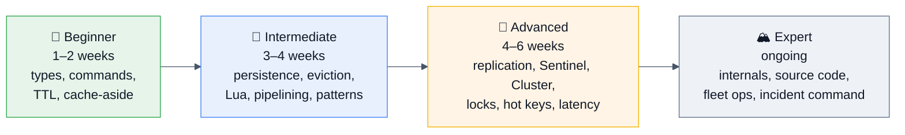

### 🌱 Beginner (1–2 weeks)
**Learn:** install and run Redis locally, `redis-cli` fluency, all core types with their commands, TTL/expiry, `INFO`/`DBSIZE`/`TYPE`, cache-aside, connecting from your language of choice with a pool.
**Build:** add caching to one endpoint of an existing app — with a jittered TTL and correct invalidation on write.
**Practice:** [try.redis.io](https://try.redis.io/), the Redis University **RU101** course, GeeksforGeeks/InterviewBit command drills.
**Milestone:** you can pick the right data type for a problem without looking it up.

### 🌿 Intermediate (3–4 weeks)
**Learn:** RDB vs AOF, eviction policies, memory encodings and `OBJECT ENCODING`, `MULTI`/`WATCH`, Lua and Functions, pipelining, Pub/Sub vs Streams, `SCAN` semantics, `SLOWLOG`, connection pooling, and the three cache pathologies.
**Build:** a rate limiter (token bucket, in Lua), a leaderboard, and a job queue on Streams with `XAUTOCLAIM`. Then **fill an instance to `maxmemory` and watch eviction happen.**
**Read:** the official docs on [data types](https://redis.io/docs/latest/develop/data-types/) and [Redis persistence](https://redis.io/docs/latest/operate/oss_and_stack/management/persistence/) — they're short and genuinely good.
**Milestone:** you can implement any of the classic Redis patterns from scratch and explain its failure modes.

### 🌳 Advanced (4–6 weeks)
**Learn:** replication internals (`PSYNC`, partial resync, the backlog), Sentinel failover, Cluster slots/`MOVED`/`ASK`/gossip, distributed-lock theory and the Redlock debate, hot/big keys, the fork/COW problem, latency debugging, ACLs and TLS, and the Valkey/Redis ecosystem split.
**Build:** stand up a 3-primary/3-replica Cluster locally with Docker; **kill a primary and watch the failover**; deliberately create a hot key and a big key and observe the latency; run a `KEYS` on a million-key instance and measure the stall.
**Read:** **[Martin Kleppmann — "How to do distributed locking"](https://martin.kleppmann.com/2016/02/08/how-to-do-distributed-locking.html)** and antirez's reply; *Designing Data-Intensive Applications* ch. 5, 8, 9; the Redis Cluster specification.
**Milestone:** you can run the on-call playbook for a Redis fleet and debug a p999 spike.

### 🏔️ Expert (ongoing)
**Learn:** the event loop (`ae.c`), the dict implementation and incremental rehashing, `t_zset.c`'s skip list, `expire.c`'s active cycle, the eviction pool in `evict.c`, RESP3 and client tracking, module/Function internals, and Cluster's failover voting.
**Do:** read the Redis source (it is famously readable — antirez wrote it to be); benchmark with `memtier_benchmark` changing one variable at a time; contribute a doc fix; follow the Redis and Valkey release notes each cycle.
**Read:** *Redis in Action* (Josiah Carlson), *Redis Design and Implementation* (Huang Jianhong), the Redis and Valkey release notes, antirez's blog archives.
**Milestone:** you can explain *why* Redis made a design choice, not just what it does.

### 🎯 The one-week interview sprint

| Day | Focus |
|-----|-------|
| 1 | §1–2.2: what Redis is, the single-threaded model, all data types, encodings. Say the single-thread story aloud until fluent. |
| 2 | §2.3–2.5: persistence, expiry, eviction. Memorize the policy table and the `fork` story. |
| 3 | §2.6–2.10 + §3.5: transactions, Lua, pipelining, Pub/Sub vs Streams, **caching patterns and the three pathologies**. |
| 4 | §3.1–3.4: replication, Sentinel, Cluster, consistency. Draw the 16384-slot diagram from memory. |
| 5 | §3.6–3.8 + §6: **distributed locks (with the Redlock narrative)**, rate limiting, hot/big keys. Write the lock and the token bucket from scratch. |
| 6 | §7: two full design questions, out loud, timed — do the capacity arithmetic aloud. §9: incidents; prepare **your** war story. |
| 7 | §15–16: cheat sheet + flash cards; §14.2 and §4.3 Q43 for the Valkey/licensing answer. Mock interview; re-drill only the gaps. |

---

# 19. 📚 Sources & Further Reading

## Official documentation (always the primary source)
- [Redis Documentation](https://redis.io/docs/latest/) — data types, persistence, replication, cluster spec, ACL, Lua/Functions
- [Redis 8 GA announcement](https://redis.io/blog/redis-8-ga/) · [Redis Open Source 8.0 release notes](https://redis.io/docs/latest/operate/oss_and_stack/stack-with-enterprise/release-notes/redisce/redisos-8.0-release-notes/)
- [Redis 8.4 — what's new](https://redis.io/docs/latest/develop/whats-new/8-4/) · [Redis 8.6 release notes](https://redis.io/docs/latest/operate/oss_and_stack/stack-with-enterprise/release-notes/redisce/redisos-8.6-release-notes/) · [Redis 8.8 — what's new](https://redis.io/docs/latest/develop/whats-new/8-8/) · [8.8 release notes](https://redis.io/docs/latest/operate/oss_and_stack/stack-with-enterprise/release-notes/redisce/redisos-8.8-release-notes/)
- [Redis is now available under the AGPLv3 license](https://redis.io/blog/agplv3/) · [What is Valkey? A comparison with Redis](https://redis.io/blog/what-is-valkey/)
- [Valkey project](https://valkey.io/) · [Linux Foundation forks Redis as Valkey — The New Stack](https://thenewstack.io/linux-foundation-forks-the-open-source-redis-as-valkey/)
- [Redis release notes on GitHub](https://github.com/redis/redis/blob/8.8/00-RELEASENOTES) · [Redis on Wikipedia](https://en.wikipedia.org/wiki/Redis) (a good, sourced version timeline)

## Books
- **Josiah Carlson — *Redis in Action*** (free online from Redis) — still the best pattern-oriented book
- **Huang Jianhong — *Redis Design and Implementation*** — internals: dict, skiplist, event loop, encodings
- **Martin Kleppmann — *Designing Data-Intensive Applications*** — ch. 5 (replication), 8 (distributed system trouble), 9 (consistency & consensus). **Essential for the lock/consistency questions.**
- **Salvatore Sanfilippo's blog archives** — design rationale straight from the author

## Key articles & debates
- **[Martin Kleppmann — "How to do distributed locking"](https://martin.kleppmann.com/2016/02/08/how-to-do-distributed-locking.html)** — the Redlock critique. **Read this one properly.**
- antirez — "Is Redlock safe?" (his reply) · the Redis [distributed locks documentation](https://redis.io/docs/latest/develop/use-cases/patterns/distributed-locks/)
- [Dragonfly — Redis 8 lands: new features and more license drama](https://www.dragonflydb.io/blog/redis-8-lands-new-features-and-more-license-drama)
- [The Register — Redis "returns" to open source with AGPL](https://www.theregister.com/software/2025/05/01/redis_returns_to_open_source_with_agpl_license/)
- Instagram Engineering — "Storing hundreds of millions of simple key-value pairs in Redis" (the hash-bucketing story)
- Twitter Engineering — timeline architecture and the Nighthawk/Pelikan posts
- Stack Overflow Engineering — architecture and Redis-usage posts
- AWS — ElastiCache/MemoryDB for Valkey announcements and pricing comparisons

## Ongoing reading
- Redis blog & Valkey blog · Redis Weekly / DB Weekly newsletters · the `redis` and `valkey` GitHub release feeds
- **Redis University** (free courses: RU101 Introduction, RU102 Developing with Redis, RU201 RediSearch, RU202 Streams)
- **RedisInsight** — the official GUI, worth using to *see* your data structures
- r/redis · Redis Discord · Stack Overflow `[redis]` tag

## Interview practice
- **Question banks:** [GeeksforGeeks — Top 25 Redis Interview Questions](https://www.geeksforgeeks.org/system-design/top-25-redis-interview-questions/) · [Guru99](https://www.guru99.com/redis-interview-questions.html) · [MentorCruise (2026 edition)](https://mentorcruise.com/questions/redis/) · [Hirist](https://www.hirist.tech/blog/top-20-redis-interview-questions-and-answers/) · InterviewBit · Scaler Topics · [LabEx](https://labex.io/tutorials/redis-redis-interview-questions-and-answers-593700)
- **System design:** [System Design Primer](https://github.com/donnemartin/system-design-primer) · ByteByteGo · Hello Interview · Design Gurus · High Scalability · Gaurav Sen / CodeKarle (YouTube)
- **Coding:** LeetCode 146 (LRU Cache), 460 (LFU Cache), 355 (Design Twitter), 1206 (Skiplist) — the DSA cousins of Redis internals
- **Experience reports:** Glassdoor · AmbitionBox · Blind/TeamBlind · CareerCup · Prepfully · r/ExperiencedDevs · r/cscareerquestions

## Tools to have used (and be able to name)
`redis-cli` (`--bigkeys`, `--hotkeys`, `--latency`, `--intrinsic-latency`, `--stat`, `--scan`) · `redis-benchmark` · `memtier_benchmark` · **RedisInsight** · `redis_exporter` + Prometheus + Grafana · `redis-check-rdb` / `redis-check-aof` · **Sentinel** · **Redis Cluster** (`redis-cli --cluster create/check/reshard`) · **Sidekiq / Resque / Celery / BullMQ** (Redis-backed queues) · **Redisson** (Java locks) · `redis-shake` / RIOT (migration) · Testcontainers

---

> [!TIP]
> ## 🎯 Final advice — the five sentences that carry a Redis interview
>
> 1. **"Redis executes commands on a single thread, which is why every command is atomic for free — and why one O(N) command over a large collection is a cluster-wide latency event."**
> 2. **"Redis is the fast path, not the source of truth: replication is asynchronous, so a failover can lose writes the primary already acknowledged."**
> 3. **"Before I tune anything, I'd check whether the application is chatty — a huge call count with a microsecond `usec_per_call` means the problem is round trips, not Redis."**
> 4. **"Every cached value needs a TTL, that TTL needs jitter, and the key needs every dimension that affects the value — tenant, role, locale — or you have a data-leak bug, not a caching bug."**
> 5. **"The most important question about a cache is what happens when it disappears. If the database can't absorb 100% of traffic, the cache's failure mode is your real availability risk — so: circuit breaker, concurrency limit, stale serving, and load shedding."**
>
> Know the mechanism, quantify the trade-off, and always design the failure path. That's the whole game.

---

*Synthesized August 2026 against Redis Open Source 8.8 (May 2026), Redis 8.4/8.6, and Valkey 9 (October 2025). The Redis/Valkey ecosystem is moving quickly — verify anything version- or license-sensitive against the current release notes for the distribution you actually run.*

