# 🏛️ System Design — The Complete Interview Preparation Guide

> **Target audience:** Candidates preparing for SDE-2 → Staff/Principal system design rounds at Google, Meta, Amazon, Microsoft, Apple, Netflix, Uber, Airbnb, Stripe, Databricks, Snowflake, OpenAI, Anthropic, NVIDIA, Palantir, Bloomberg, Goldman Sachs, JPMorgan, Walmart Global Tech, Salesforce, Atlassian, DoorDash, Coinbase, Shopify, Pinterest, Tesla, Adobe, Oracle, Qualcomm, Cisco, Cloudflare, Rippling — plus Indian product & service companies (TCS, Infosys, Wipro, Cognizant, Accenture, Capgemini, LTIMindtree, HCL).
>
> **What changed by August 2026 — read this first, the bar genuinely moved:**
>
> 1. 🤖 **GenAI system design is now its own interview category.** Many loops include an LLM/RAG/agent component, and **LLM-infrastructure prompts have escaped ML-engineer loops into general SWE loops**. "Design a system where an LLM answers a user query" is a mainstream 2026 question. You're expected to reason about retrieval, embeddings, vector stores, batch vs online inference, GPU scheduling, and token cost — not as a specialty, but as ordinary architecture.
> 2. 💰 **Cost-aware architecture is table stakes.** Three years ago you could sketch a load balancer, a database, and a cache, say "we'll scale horizontally," and pass. Now interviewers expect a dollar figure or at least a cost *shape* — egress, storage tiers, GPU-hours, read/write amplification.
> 3. 📉 **The pass bar rose because the pass pool grew.** A "Strong Hire" from two years ago may rate a plain "Hire" today. Interviewers now separate candidates on **cost, failure modes, and operational judgment** — things that used to be bonus points.
> 4. 🧪 **New round formats.** Several companies (Meta among them) now run a distinct **AI-assisted coding round** separate from DSA, and some run a dedicated **"design an AI product's backend"** slot.
> 5. 🌍 **Multi-region, event-driven, and reliability patterns** are assumed knowledge at senior+, not differentiators.
>
> **The single biggest thing candidates get wrong:** they treat the round as a **knowledge quiz** and try to name as many technologies as possible. It is not. It is a **simulation of you leading a design discussion**, and the grading is on: did you scope the problem, did you make decisions and justify them with numbers, did you find your own bottlenecks, and did you say what breaks. **The most common reason mid-level candidates fail is failing to deliver a complete working system** — they spend 25 minutes on requirements and never draw the thing.
>
> **Last synthesized:** August 2026.

---

## 📑 Table of Contents

| # | Section | What it covers |
|---|---------|----------------|
| 0 | [How to Use This Guide](#0-how-to-use-this-guide) | Study strategy per company tier & level |
| 1 | [Beginner Concepts](#1--beginner-concepts) | What system design is, the vocabulary, the numbers, the framework |
| 2 | [Intermediate Concepts](#2--intermediate-concepts) | Every building block: LB, cache, DB, queue, CDN, gateway, storage, protocols |
| 3 | [Advanced Concepts](#3--advanced-concepts) | CAP/PACELC, consistency, consensus, idempotency, saga, backpressure, multi-region, cost, GenAI |
| 4 | [Interview Questions by Level](#4--interview-questions-by-level) | Beginner → Staff → FAANG → Startup → Product → Service |
| 5 | [Frequently Asked Questions (Ranked)](#5--frequently-asked-questions-ranked-by-frequency) | Frequency-ranked master list |
| 6 | [Coding Questions](#6--coding-questions-the-algorithms--lld-behind-system-design) | Consistent hashing, rate limiters, Bloom filters, ID generation, LLD |
| 7 | [System Design Questions](#7--system-design-questions-worked-solutions) | **The core section** — full worked designs |
| 8 | [Real Production Usage](#8--real-production-architectures) | How Google, Netflix, Uber, Meta, Amazon, Stripe actually build |
| 9 | [Common Bugs & Production Incidents](#9--common-failures--famous-outages) | Famous outages and the lessons |
| 10 | [Security](#10--security) | Auth, threat model, defence in depth, privacy |
| 11 | [Performance](#11--performance) | Latency budgets, tail latency, profiling, throughput |
| 12 | [Best Practices](#12--best-practices) | What good design actually looks like |
| 13 | [Anti-patterns](#13--anti-patterns) | Design and interview anti-patterns |
| 14 | [Comparison Tables](#14--comparison-tables) | Every "X vs Y" you'll be asked |
| 15 | [Cheat Sheet](#15--cheat-sheet-one-page-revision) | One-page revision |
| 16 | [Flash Cards](#16--flash-cards) | Q → A rapid recall |
| 17 | [Interview Revision Checklist](#17--interview-revision-checklist) | Tick-box coverage |
| 18 | [Learning Roadmap](#18--learning-roadmap) | Beginner → Expert |
| 19 | [Sources & Further Reading](#19--sources--further-reading) | Where this was synthesized from |

---

## 0. How to Use This Guide

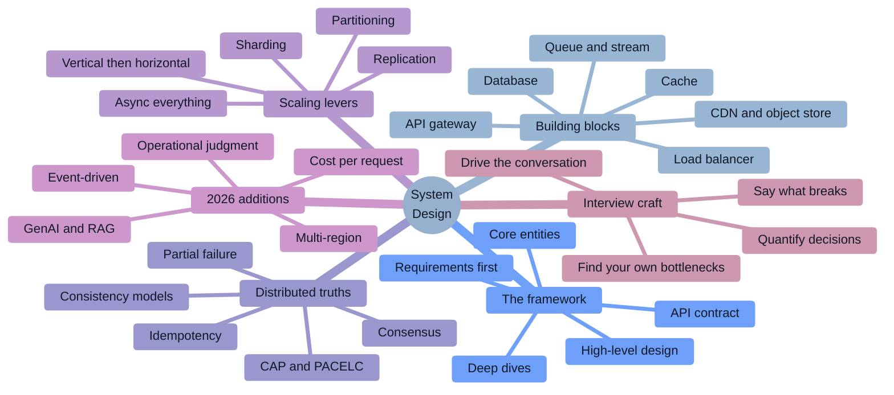

### Study strategy by company tier

| Tier | Companies | What they actually test | Time split |
|------|-----------|--------------------------|-----------|
| **Google** | Google, DeepMind | Depth over breadth. Expect to be pushed into **one** component until you hit the limit of your knowledge. Data modelling, consistency, and "what happens at 100×". Often abstract ("design a system to count things"). | 30% scoping, 40% one deep dive, 30% trade-offs |
| **Meta** | Meta, Instagram, WhatsApp | **Speed and product sense.** 35–40 min, expects you to move fast, make decisions, and handle a curveball ("now make it real-time"). Two design rounds is common at E5+. Plus a new **AI-enabled coding round**. | 20% scoping, 50% design, 30% follow-ups |
| **Amazon** | Amazon, AWS | Design + **Leadership Principles woven in**. Expect "what would you do differently", ownership, and cost. AWS-flavoured components are welcome. Often includes an **LLD/OOD** round separately. | 25% scoping, 40% design, 35% trade-offs + LP |
| **Microsoft / Apple** | | Practical and grounded. Often close to a real product in the team's domain. Less puzzle, more engineering judgment. | 30% requirements, 45% design, 25% ops |
| **Netflix / Stripe / Databricks / Snowflake** | | **Senior-only bar.** Real architecture conversations: failure modes, backpressure, idempotency, data correctness, cost. Stripe leans hard on **money correctness**. | 20% scoping, 40% design, 40% failure & correctness |
| **OpenAI / Anthropic / NVIDIA / AI infra** | | **GenAI system design**: RAG, inference serving, GPU scheduling, evals, token cost, safety. Plus classic distributed systems. | 25% scoping, 40% design, 35% ML/infra specifics |
| **Uber / DoorDash / Airbnb / Pinterest / Shopify** | | Domain-flavoured, high-scale product design: matching, geospatial, feeds, payments, search. Very practical. | 25% scoping, 45% design, 30% scale/ops |
| **Indian product** | Walmart Global Tech, Flipkart, Swiggy, Zomato, PhonePe, Meesho, Zepto, Groww | **Two separate rounds: HLD and LLD.** HLD is classic system design; **LLD is class-diagram OOD** (design a parking lot / BookMyShow / Splitwise) with SOLID and design patterns. **Do not skip LLD prep.** | 50% HLD, 50% LLD |
| **Startups** | Seed → Series C | "Design what we're actually building, with 4 engineers and no SRE." Pragmatism, cost, time-to-ship, and knowing what to *not* build. | 30% scoping, 40% pragmatic design, 30% trade-offs |
| **Service companies** | TCS, Infosys, Wipro, Accenture, Cognizant, Capgemini, LTIMindtree, HCL | Mostly **theory + architecture patterns**: monolith vs microservices, SOLID, design patterns, REST, caching, load balancing, CAP, 12-factor. Less open-ended design. | 60% theory, 25% simple design, 15% patterns |

### Levelling — what "good" means at each band

| Level | What separates you |
|-------|--------------------|
| **SDE-1 / L3** | Usually no design round, or a very scoped one. Know the components and can draw a sane 3-tier system. |
| **SDE-2 / L4 / E4** | **Deliver a complete, working design.** Requirements → API → components → data model → one scaling discussion. Correctness of the happy path matters most. |
| **Senior / L5 / E5** | **Depth + trade-offs.** You choose between options and justify with numbers. You find your own bottlenecks. You know what breaks and say so unprompted. |
| **Staff / L6 / E6** | **Ambiguity and judgment.** You scope the problem yourself, question the requirement, name what you'd *not* build, discuss migration from the existing system, cost, org impact, and a phased rollout. You can defend a boring choice. |
| **Principal / L7+** | **Strategy.** Multi-system, multi-year, multi-team. Failure domains, blast radius, platform vs product, buy-vs-build, and the second-order consequences of a design on the organization. |

### The 2026 shift you must internalize

> [!IMPORTANT]
> **"I'd add a load balancer, a cache, and shard the database" is the setup, not the answer.** In 2026 the interviewer immediately follows with: *"What does that cost per month?"*, *"What happens when the cache is empty at 9 a.m. Monday?"*, *"You said eventually consistent — how stale, exactly, and who notices?"*, *"Your queue backs up to 10 M messages. What is the system doing right now?"*, *"Would you actually build this, or buy it?"* Every worked design below carries the **failure, cost, and staleness** discussion, because that's where the points now are.

> [!TIP]
> **The single highest-leverage habit in a system design round:** **quantify every decision.** Not *"we'll cache it"* but *"the top 10k items get 80% of reads, so a 2 GB cache with a 5-minute TTL removes about 40k of our 50k reads per second and costs one node; the trade is up to 5 minutes of staleness on price, which the product team confirmed is acceptable."* Same decision — completely different signal.

### How to read the star ratings

| Rating | Meaning |
|--------|---------|
| ★★★★★ | **Must know.** Appears in a majority of design rounds. Not knowing it is disqualifying. |
| ★★★★☆ | Very common at senior level. Expected of anyone claiming to have built distributed systems. |
| ★★★☆☆ | Differentiator. Staff signal; separates "can design" from "has operated." |

---

# 1. 🌱 Beginner Concepts

## 1.1 What is system design — and what the interview is actually measuring

**System design is the practice of deciding how the parts of a software system are arranged so that it meets its functional goals under real-world constraints** — traffic, data volume, latency budgets, failure rates, cost, team size, and time.

The interview is a **45-minute simulation** of that practice. What's being graded is not whether you know that Kafka exists. It's:

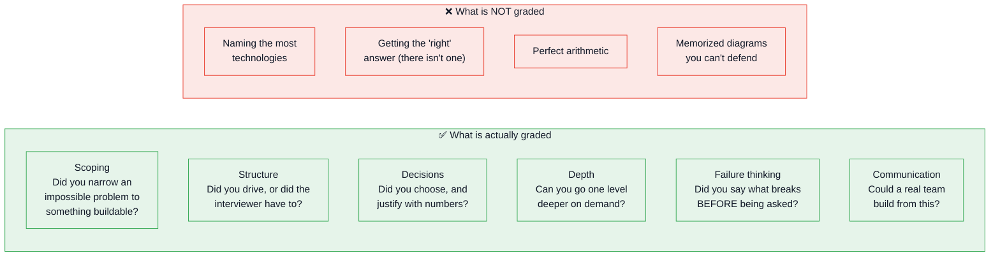

### The one-liner to open the round with

> *"Before I design anything, let me pin down what we're building and for whom — I'd rather build one thing correctly than sketch five things vaguely. Can I confirm the three core features and the scale we're targeting?"*

## 1.2 Why does the discipline exist? The problems it solves

| Problem | Why it forces design |
|---------|---------------------|
| 🎯 **One machine isn't enough** | Vertical scaling has a hard ceiling and a superlinear price curve. Past that, you must distribute — and distribution introduces partial failure, coordination, and consistency problems that don't exist on one box. |
| 🎯 **Failure is continuous, not exceptional** | At 10,000 machines, something is always broken. Systems must be designed so that a component failing is a routine, absorbed event — not an outage. |
| 🎯 **Latency is physics** | Light in fibre travels ~200,000 km/s. A round trip from Mumbai to Virginia is ~200 ms **at the speed of light** — no engineering makes it faster. That single fact drives CDNs, edge compute, regional replicas, and async design. |
| 🎯 **Reads and writes scale differently** | Most systems are 100:1 or 1000:1 read-heavy. Caches and replicas solve reads cheaply; writes need sharding, batching, or a different data model. |
| 🎯 **Humans and teams are part of the system** | Conway's Law: your architecture will mirror your org chart whether you plan it or not. Microservices exist as much for team autonomy as for technical scaling. |
| 🎯 **Money is a constraint** | An architecture that works but costs 10× the revenue it enables is a failed design. **This is the 2026 addition to the list.** |

## 1.3 Real-world analogies (use these; interviewers remember them)

| Concept | Analogy |
|---------|---------|
| **Load balancer** | The **host at a restaurant** who seats you at the least-busy server's section. If a waiter goes home sick (health check fails), the host stops seating their tables. |
| **Horizontal vs vertical scaling** | Hiring **more cooks** (horizontal) vs hiring **one superhuman cook** (vertical). The superhuman cook is simpler to coordinate — and there's a limit to how superhuman you can hire. |
| **Cache** | The **specials board** at the front of the restaurant. Most people order from it, so the kitchen doesn't get asked the same question 500 times. It goes stale — that's the trade. |
| **CDN** | **Regional warehouses.** Amazon doesn't ship your toothpaste from Seattle; it ships from the depot 20 km away. Same goods, 200 ms closer. |
| **Message queue** | The **order spike at the counter.** Orders pile up on the spike; the kitchen works through them at its own pace. If the kitchen stops, orders don't get lost — the spike just gets taller (until it falls over: that's backpressure). |
| **Sharding** | **Splitting the phone book by surname** across ten volumes. You need to know which volume before you look — that's the routing problem, and it's why the shard key matters more than anything else. |
| **Replication** | **Photocopies of the ledger.** Everyone can read a copy. Only the original can be written to (single-leader), and the copies lag slightly behind — that's replication lag, and it's where "I posted it but I can't see it" bugs come from. |
| **CAP theorem** | Two clerks in **different buildings with the phone line cut.** They can each keep serving customers and disagree later (AP), or refuse to serve until the line is back (CP). There is no third option **while the line is cut**. |
| **Consensus (Raft/Paxos)** | A **committee that must agree on the minutes** before anything is official. Slow, but nobody can later claim a different version of events. |
| **Idempotency key** | A **receipt number** on a repeated order. "I already have receipt #4471 — here's the same result, I'm not making it twice." |
| **Rate limiter** | A **bouncer with a clicker.** Regardless of how eager the crowd is, only N people per minute get in. |
| **Circuit breaker** | An **electrical breaker.** Once a downstream keeps failing, stop sending it current — otherwise you burn the house down retrying. |
| **Bulkhead** | **Watertight compartments in a ship.** One flooded compartment doesn't sink the vessel. In software: separate thread pools/connection pools per dependency. |
| **Backpressure** | The **kitchen telling the front of house to stop taking orders.** Without it, the queue grows until memory runs out and *everything* fails, instead of some requests being politely refused. |

## 1.4 The vocabulary you must be fluent in

| Term | Precise meaning |
|------|-----------------|
| **Latency** | Time for one operation. Always quote a **percentile**: p50, p95, **p99**, p999. |
| **Throughput** | Operations per unit time (QPS/RPS/TPS). |
| **Bandwidth** | Data per unit time (Gbps). Distinct from throughput. |
| **Availability** | Fraction of time the system is usable. **99.9% = 43 min/month down; 99.99% = 4.3 min; 99.999% = 26 s.** Memorize these. |
| **Durability** | Probability data survives once written. "11 nines" (S3) means an object loss is astronomically unlikely — **not** that it's always *available*. |
| **Reliability** | The system does the right thing, including under failure. |
| **SLI / SLO / SLA** | **Indicator** (the measurement), **Objective** (your internal target), **Agreement** (the contract with money attached). SLO < SLA, always. |
| **Error budget** | `1 - SLO`. If your SLO is 99.9%, you have 43 minutes/month to spend on risk. **The concept that turns reliability into a decision instead of an argument.** |
| **Consistency** | ⚠️ Overloaded. In **ACID** it means constraints hold. In **CAP** it means all nodes see the same data. **Say which one you mean.** |
| **Partition tolerance** | The system keeps operating despite dropped/delayed messages between nodes. Not optional in a real network. |
| **Replication lag** | How far behind a replica is. The source of most "read-your-writes" bugs. |
| **Shard / partition** | A horizontal slice of data on its own node. |
| **Hot partition / hot key** | A shard or key receiving disproportionate traffic. **The #1 sharding failure mode.** |
| **Fan-out** | One event producing many downstream operations (a post → 1 M timeline writes). |
| **Backpressure** | A signal upstream to slow down, rather than silently queueing forever. |
| **Idempotency** | Doing the operation twice has the same effect as once. |
| **At-most-once / at-least-once / exactly-once** | Delivery semantics. **Exactly-once delivery is impossible across a network; exactly-once *effect* via idempotency is achievable.** |
| **Head-of-line blocking** | One slow item stalling everything behind it. |
| **Thundering herd** | Many clients hitting the same resource simultaneously (cache expiry, service restart, retry storm). |
| **Blast radius** | How much breaks when one thing breaks. |
| **Cell / bulkhead architecture** | Isolating users into independent stacks so a failure affects a fraction. |
| **Failover / failback** | Switching to standby; switching back. |
| **RTO / RPO** | Recovery **Time** Objective (how long until we're back) / Recovery **Point** Objective (how much data we can lose). **Always state both as numbers.** |
| **Write amplification** | One logical write causing many physical writes. |
| **CQRS** | Command Query Responsibility Segregation — separate write and read models. |
| **Event sourcing** | Store the sequence of events, derive current state. |
| **Saga** | A long-running transaction as a sequence of local transactions with compensating actions. |
| **Quorum** | `R + W > N` — read and write sets that must overlap to guarantee freshness. |

## 1.5 The numbers you must know cold 🔢

> [!IMPORTANT]
> **You will be asked to estimate.** Nobody expects exact figures, but "I don't know" is a fail and being off by 1000× is a fail. Learn the orders of magnitude.

### Latency numbers every programmer should know (rounded, modern hardware)

| Operation | Time | Intuition |
|-----------|------|-----------|
| L1 cache reference | **~1 ns** | |
| Branch mispredict | ~3 ns | |
| L2 cache reference | ~4 ns | |
| Mutex lock/unlock | ~17 ns | |
| Main memory reference | **~100 ns** | **100× slower than L1** |
| Compress 1 KB (Snappy) | ~2 µs | |
| Send 1 KB over 1 Gbps network | ~10 µs | |
| **SSD random read** | **~16–150 µs** | |
| Read 1 MB sequentially from memory | ~50 µs | |
| Round trip within a datacenter | **~500 µs (0.5 ms)** | |
| Read 1 MB sequentially from SSD | ~200 µs–1 ms | |
| **Disk (HDD) seek** | **~2–10 ms** | ~20,000× slower than memory |
| Read 1 MB sequentially from HDD | ~20 ms | |
| **Round trip CA ↔ Netherlands** | **~150 ms** | **Physics. You cannot optimize this away.** |

**The three ratios to internalize:** memory is ~100× slower than L1; SSD is ~1000× slower than memory; **a cross-continent round trip is ~1,000,000× slower than a memory reference.**

### Capacity & scale reference

| Quantity | Figure |
|----------|--------|
| Seconds in a day | **86,400 ≈ 10⁵** |
| Seconds in a month | ~2.6 M |
| **1 M writes/day** | **≈ 12 writes/sec** ← the conversion you'll use constantly |
| **1 B writes/day** | **≈ 12,000 writes/sec** |
| Peak-to-average ratio | Assume **2–5×** average (say which you're using) |
| Single modern server | ~10k–100k simple RPS; 32–128 cores; 128 GB–2 TB RAM |
| Single SQL DB node | ~5k–20k writes/sec (workload-dependent); comfortable to a few TB |
| Redis node | ~80k–150k ops/sec (no pipelining) |
| Kafka broker | ~100k–1 M msg/sec depending on size/batching |
| NIC | 10–100 Gbps |
| **Char / int / UUID** | 1 B / 4 B / **16 B** |
| Typical tweet-sized record with metadata | ~200–1000 B |
| Typical photo | 1–5 MB · Typical video minute | ~10–50 MB |
| S3-class storage | ~$0.023/GB/month · **egress ~$0.05–0.09/GB** ← egress is the cost killer |

### Availability table (memorize)

| Availability | Downtime/year | Downtime/month | Downtime/week |
|--------------|---------------|----------------|---------------|
| 99% ("two nines") | 3.65 days | 7.2 hours | 1.7 hours |
| 99.9% ("three nines") | 8.77 hours | **43.8 min** | 10.1 min |
| 99.99% ("four nines") | 52.6 min | **4.4 min** | 1.0 min |
| 99.999% ("five nines") | 5.26 min | **26 s** | 6 s |

> [!WARNING]
> **The compounding trap.** If your service depends on 5 components each at 99.9%, your ceiling is `0.999⁵ ≈ 99.5%` — **not** 99.9%. Serial dependencies multiply. **This is why redundancy and graceful degradation exist, and saying it unprompted is a strong signal.**

### Back-of-envelope worked example — narrate it exactly like this

```
"Design Twitter" — sizing in 90 seconds:

Users:        500 M total, 200 M daily active
Writes:       200 M DAU × 2 tweets/day = 400 M tweets/day
              400 M ÷ 86,400 ≈ 4,600 writes/sec average
              Peak at 3× ≈ 14,000 writes/sec        ← manageable
Reads:        200 M DAU × 50 timeline views/day = 10 B reads/day
              10 B ÷ 86,400 ≈ 115,000 reads/sec average
              Peak ≈ 350,000 reads/sec              ← THE hard number
Read:Write    ≈ 25:1  →  read-optimized architecture, heavy caching, fan-out on write

Storage:      400 M tweets/day × 500 B = 200 GB/day = 73 TB/year (text only)
              Media: assume 10% have a 2 MB image = 40 M × 2 MB = 80 TB/day 😬
              → media dominates by ~400×. Object storage + CDN, not the database.

Bandwidth:    350k reads/sec × 5 KB timeline payload ≈ 1.75 GB/sec egress
              → at $0.05/GB that's ~$7.5k/hour if it all came from origin
              → hence the CDN. THIS is the cost-aware reasoning 2026 wants.

Cache:        Top 20% of tweets get ~80% of reads. Cache one day of hot tweets:
              20% × 400 M × 500 B ≈ 40 GB → a handful of Redis nodes. Cheap. Do it.
```

**The point of that block:** every number leads to an architectural decision. Numbers without conclusions are noise; conclusions without numbers are hand-waving.

## 1.6 The delivery framework ⏱️ — the structure that prevents failure

> [!IMPORTANT]
> **The most common reason mid-level candidates fail is running out of time before delivering a working system.** A framework isn't bureaucracy — it's the thing that stops you from spending 25 minutes on requirements and 5 minutes waving at a database.

```mermaid
%%{init: {'theme':'base','themeVariables':{'background':'#ffffff','mainBkg':'#eef2f7','primaryColor':'#eef2f7','primaryTextColor':'#111827','primaryBorderColor':'#64748b','secondaryColor':'#e8f0fe','tertiaryColor':'#f1f5f9','lineColor':'#475569','textColor':'#111827','clusterBkg':'#f8fafc','clusterBorder':'#94a3b8','edgeLabelBackground':'#ffffff','titleColor':'#111827','actorBkg':'#eef2f7','actorTextColor':'#111827','actorBorder':'#64748b','actorLineColor':'#475569','signalColor':'#111827','signalTextColor':'#111827','noteBkgColor':'#fff4e5','noteTextColor':'#111827','noteBorderColor':'#d97706','labelBoxBkgColor':'#eef2f7','labelBoxBorderColor':'#64748b','labelTextColor':'#111827','loopTextColor':'#111827','altBackground':'#f8fafc'}}}%%
flowchart TB
    S1["1️⃣ REQUIREMENTS — ~5 min<br/>Functional: 'Users should be able to…' — pick the TOP 3<br/>Non-functional: QUANTIFIED — 'p99 &lt; 200 ms', '99.9%', 'reads may be 30 s stale'"]
    S2["2️⃣ CORE ENTITIES — ~2 min<br/>The nouns: User, Tweet, Follow, Timeline<br/>Just names for now; fields come later"]
    S3["3️⃣ API / INTERFACE — ~5 min<br/>The contract. REST by default, plural nouns.<br/>⚠️ Never put userId in the body — derive it from the auth token"]
    S4["4️⃣ (OPTIONAL) DATA FLOW — ~5 min<br/>Only for data-processing systems:<br/>the pipeline stages end to end"]
    S5["5️⃣ HIGH-LEVEL DESIGN — ~10–15 min<br/>Draw it. Satisfy ONE API endpoint at a time.<br/>Boxes, arrows, and where data lives"]
    S6["6️⃣ DEEP DIVES — ~10 min<br/>Return to the non-functional requirements.<br/>Scale it, break it, fix it. Name the bottleneck YOURSELF"]

    S1 --> S2 --> S3 --> S4 --> S5 --> S6
    S6 -.->|"iterate as time allows"| S5

    style S1 fill:#e8f0fe,stroke:#4285f4,color:#111827
    style S2 fill:#eef2f7,stroke:#64748b,color:#111827
    style S3 fill:#eef2f7,stroke:#64748b,color:#111827
    style S4 fill:#f1f5f9,stroke:#94a3b8,color:#111827
    style S5 fill:#e6f4ea,stroke:#34a853,color:#111827
    style S6 fill:#fff4e5,stroke:#f4b400,color:#111827
```

### Step 1 — Requirements (~5 min) 🔑

```
FUNCTIONAL — "Users should be able to…"
  ✅ Pick the top 3. Write them down. Ask: "Is this the right set to focus on?"
  ❌ Don't list 15 features. You cannot design 15 features in 40 minutes,
     and trying to is how you fail.

NON-FUNCTIONAL — QUANTIFY EVERYTHING
  ✅ "p99 read latency < 200 ms"
  ✅ "99.9% availability — 43 minutes/month is acceptable"
  ✅ "Timeline may be up to 30 seconds stale; payments must be strongly consistent"
  ✅ "1 M DAU, growing 3× in 18 months"
  ❌ "It should be fast and scalable and highly available"  ← says nothing

OUT OF SCOPE — say it out loud
  "I'm going to skip auth, analytics, and the admin panel unless you want them —
   they're real but not where the interesting design is."
```

**The five clarifying questions that are always worth asking:**
1. **Scale** — how many users, how much data, what's the read:write ratio?
2. **Latency** — what's the p99 budget, and for which operation?
3. **Consistency** — can this be stale? By how much? Who notices?
4. **Existing constraints** — greenfield, or integrating with something?
5. **Priority** — if I only get one of these right, which one?

### Step 2 — Core entities (~2 min)
Just the nouns: `User`, `Post`, `Follow`, `Comment`. Naming them early gives your API and data model a shared vocabulary. **Don't design the schema yet.**

### Step 3 — API (~5 min)
```http
POST   /v1/tweets                 {text, mediaIds[]}      → 201 {tweetId}
GET    /v1/feed?cursor=&limit=20                          → 200 {items[], nextCursor}
POST   /v1/users/{id}/follow                              → 204
```
- **REST by default.** Mention gRPC for internal service-to-service and GraphQL for client-driven aggregation — but don't switch without a reason.
- **Never accept `userId` in the body** — derive it from the auth token, or you've designed an authorization bug. **Interviewers notice this.**
- **Cursor pagination, not offset** — offset breaks under concurrent inserts and gets slower with depth.
- Include the **idempotency key** on any mutating endpoint that a client might retry.

### Step 4 — Data flow (optional, ~5 min)
Only for pipeline-shaped systems (analytics, ML, ingestion): `ingest → validate → enrich → aggregate → store → serve`.

### Step 5 — High-level design (~10–15 min) 🔑
**Draw it.** Satisfy one endpoint at a time, end to end. Keep it simple first — you can always add. Every box should be something you can explain and defend.

### Step 6 — Deep dives (~10 min) 🔑
Return to your **non-functional requirements** and prove you met each one. **Volunteer the bottleneck before you're asked** — *"the obvious problem here is that celebrity fan-out is O(followers), so let me fix that"* is the single highest-scoring move in the round.

## 1.7 Common misconceptions ❌ → ✅

| ❌ Misconception | ✅ Reality |
|------------------|-----------|
| "There's a correct answer I need to recall." | There isn't. There are defensible designs and indefensible ones. Two strong candidates give different answers and both pass. |
| "More components = more impressive." | Every box is operational cost, a failure mode, and a thing you must justify. **Unnecessary complexity is a negative signal**, especially at Staff level. |
| "I should start drawing immediately." | Designing before scoping is how you build the wrong system confidently. Five minutes of requirements saves the round. |
| "Microservices are the modern/correct choice." | Microservices trade simplicity for team autonomy and independent scaling. **For most systems and most teams, a well-structured monolith is the right answer** and saying so is a senior signal. |
| "NoSQL scales, SQL doesn't." | Postgres and MySQL run enormous systems. The real axes are data model, access pattern, consistency needs, and operational familiarity. |
| "Eventual consistency means data is wrong." | It means readers may see stale data for a bounded window. **Quantify the window** and it becomes an engineering decision, not a risk. |
| "CAP means pick 2 of 3." | Partition tolerance isn't optional on a real network. **CAP says: when a partition occurs, choose C or A.** The rest of the time you have both. |
| "Add a cache" is a complete answer. | Caching creates invalidation, staleness, stampedes, and a new failure domain. If you can't say what happens when it's empty or gone, you haven't designed it. |
| "Estimation needs to be precise." | Orders of magnitude. `86,400 ≈ 10⁵` is fine. **Being wrong by 1000× is the only failure.** |
| "I should avoid saying 'it depends'." | Say it — then **immediately give the deciding factor**. *"It depends on whether reads must be fresh; if they can be 30 s stale I'd use replicas, otherwise I'd route to the leader."* That's the answer, not a dodge. |
| "The interviewer wants me to talk the whole time." | They want a **conversation**. Check in: *"Does that trade-off make sense, or would you rather I go deeper on X?"* |
| "Exactly-once delivery is achievable." | Not across an unreliable network. **At-least-once + idempotency = exactly-once effect.** Say it that way. |
| "I need to know AWS service names." | Describe the *capability* ("an object store", "a managed queue"). Naming products is fine; needing them is not. |

---
# 2. 🧩 Intermediate Concepts — The Building Blocks

## 2.1 The reference architecture

Almost every design you draw is a specialization of this. Learn it so well you can sketch it in 60 seconds, then **delete the boxes you don't need**.

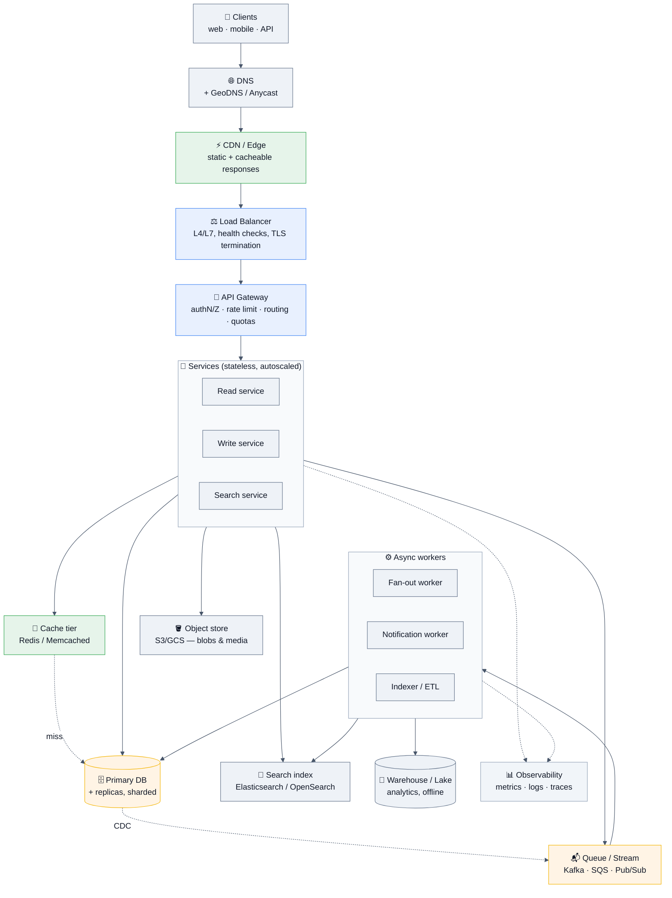

> [!TIP]
> **The narration that shows maturity:** *"That's the full menu. For this problem I'd start with the load balancer, two stateless services, one database, and object storage — and I'd add the cache, queue, and search index only when I show you the specific bottleneck each one solves."* **Building up beats starting complicated.**

## 2.2 DNS, load balancing, and traffic routing

### Load balancing layers

| | **L4 (transport)** | **L7 (application)** |
|---|---|---|
| Sees | IP + port, TCP/UDP | HTTP: path, headers, cookies, method |
| Routing | Connection-level | **Content-based** (`/api/*` → service A) |
| TLS | Passthrough | **Terminates TLS** |
| Speed | Faster, lower overhead | Slightly more overhead, far more capable |
| Examples | AWS NLB, IPVS, Maglev | AWS ALB, Nginx, Envoy, HAProxy, Traefik |

### Algorithms

| Algorithm | How | Use when |
|-----------|-----|----------|
| **Round robin** | Next server in turn | Homogeneous servers, uniform requests |
| **Weighted round robin** | Proportional to capacity | Mixed instance sizes; canary rollouts |
| **Least connections** ⭐ | Fewest active connections | **Variable request durations — usually the best default** |
| **Least response time** | Fastest recent responses | Latency-sensitive |
| **IP hash / consistent hash** | Hash a key → server | Session affinity, cache locality |
| **Power of two choices** | Pick 2 at random, choose the less loaded | **Near-optimal balance with almost no coordination — a great thing to name** |

### Concepts to volunteer
- **Health checks** — *active* (LB probes `/healthz`) vs *passive* (observe real traffic errors). ⚠️ **A health check that hits the database turns a slow database into "all servers unhealthy" and a total outage.** Make liveness shallow and readiness meaningful.
- **Sticky sessions** — solve a symptom; the cure is **stateless services with state in Redis/DB**, so any node can serve any request.
- **Global routing:** **GeoDNS** (resolve to the nearest region) vs **Anycast** (same IP announced from many locations; BGP routes to the nearest — what Cloudflare and Google use). Anycast fails over faster because it doesn't wait for DNS TTLs.
- **Connection draining** on deploy so in-flight requests finish.
- **The LB is a SPOF** unless it's redundant — say this. Usually solved with an active-passive pair + floating IP, or a managed LB that's already redundant.

## 2.3 Caching — the highest-leverage component

```mermaid
%%{init: {'theme':'base','themeVariables':{'background':'#ffffff','mainBkg':'#eef2f7','primaryColor':'#eef2f7','primaryTextColor':'#111827','primaryBorderColor':'#64748b','secondaryColor':'#e8f0fe','tertiaryColor':'#f1f5f9','lineColor':'#475569','textColor':'#111827','clusterBkg':'#f8fafc','clusterBorder':'#94a3b8','edgeLabelBackground':'#ffffff','titleColor':'#111827','actorBkg':'#eef2f7','actorTextColor':'#111827','actorBorder':'#64748b','actorLineColor':'#475569','signalColor':'#111827','signalTextColor':'#111827','noteBkgColor':'#fff4e5','noteTextColor':'#111827','noteBorderColor':'#d97706','labelBoxBkgColor':'#eef2f7','labelBoxBorderColor':'#64748b','labelTextColor':'#111827','loopTextColor':'#111827','altBackground':'#f8fafc'}}}%%
flowchart LR
    C["📱 Client"] --> B["1️⃣ Browser cache<br/>Cache-Control, ETag<br/>0 network"]
    B --> CDN["2️⃣ CDN / edge<br/>~10–50 ms<br/>absorbs 70–95% of static"]
    CDN --> LOCAL["3️⃣ In-process cache<br/>Caffeine / LRU<br/>~0.001 ms — kills hot keys"]
    LOCAL --> DIST["4️⃣ Distributed cache<br/>Redis — ~0.5 ms<br/>shared across instances"]
    DIST --> DBC["5️⃣ DB buffer pool<br/>~0.1 ms in RAM"]
    DBC --> DISK["6️⃣ Disk<br/>~0.2–10 ms"]

    style B fill:#e6f4ea,stroke:#34a853,color:#111827
    style CDN fill:#e6f4ea,stroke:#34a853,color:#111827
    style LOCAL fill:#e6f4ea,stroke:#34a853,color:#111827
    style DIST fill:#e8f0fe,stroke:#4285f4,color:#111827
    style DBC fill:#fff4e5,stroke:#f4b400,color:#111827
    style DISK fill:#fce8e6,stroke:#ea4335,color:#111827
```

### Patterns

| Pattern | Flow | Trade-off |
|---------|------|-----------|
| **Cache-aside (lazy)** ⭐ | App checks cache → miss → reads DB → populates cache | **The default.** Only requested data is cached; cache failure is survivable; app owns invalidation |
| **Read-through** | Cache library loads from the DB on a miss | Cleaner app code; needs a cache layer that owns loading |
| **Write-through** | Write to cache and DB synchronously | Cache always fresh; every write pays double latency; caches data nobody reads |
| **Write-behind** | Write to cache; flush to DB asynchronously | Fastest writes; **data loss if the cache dies before flushing** — only for tolerable data |
| **Refresh-ahead** | Proactively refresh before expiry | Hot keys never go cold; wasted work for keys that do |

### The three pathologies — name all three unprompted

| Problem | Mechanism | Fix |
|---------|-----------|-----|
| 🌩️ **Stampede / dogpile** | A hot key expires; 10,000 concurrent requests all miss and hit the DB at once | A rebuild lock (one request refreshes), **probabilistic early expiration**, refresh-ahead, or stale-while-revalidate |
| 🕳️ **Penetration** | Requests for keys that exist nowhere (often malicious) bypass the cache every time | **Cache the negative result** with a short TTL + a **Bloom filter** to reject impossible keys |
| 🏔️ **Avalanche** | A large key set expires simultaneously, or the cache restarts empty | **Jitter every TTL**, staggered warm-up, circuit breaker on the DB path |

### Invalidation
> [!WARNING]
> **The ordering rule:** on an update, **write the database first, then DELETE the cache key** — never "delete then write," and never *update* the cache (concurrent updates can land out of order and stick). Even DB-then-delete has a narrow race, which is why you also want **short TTLs** as a self-healing floor. **CDC-driven invalidation** (from the DB's change log) is the most robust option and removes invalidation from application code entirely.

**Eviction:** LRU (default), LFU (better against scans), FIFO, TTL-based, random. **Say that real caches use *approximate* LRU** — exact LRU costs per-key pointers that aren't worth the memory.

## 2.4 Databases — choosing and scaling

### The selection tree

```mermaid
%%{init: {'theme':'base','themeVariables':{'background':'#ffffff','mainBkg':'#eef2f7','primaryColor':'#eef2f7','primaryTextColor':'#111827','primaryBorderColor':'#64748b','secondaryColor':'#e8f0fe','tertiaryColor':'#f1f5f9','lineColor':'#475569','textColor':'#111827','clusterBkg':'#f8fafc','clusterBorder':'#94a3b8','edgeLabelBackground':'#ffffff','titleColor':'#111827','actorBkg':'#eef2f7','actorTextColor':'#111827','actorBorder':'#64748b','actorLineColor':'#475569','signalColor':'#111827','signalTextColor':'#111827','noteBkgColor':'#fff4e5','noteTextColor':'#111827','noteBorderColor':'#d97706','labelBoxBkgColor':'#eef2f7','labelBoxBorderColor':'#64748b','labelTextColor':'#111827','loopTextColor':'#111827','altBackground':'#f8fafc'}}}%%
flowchart TD
    Q{"What's the<br/>access pattern?"}
    Q --> R["Relationships, joins,<br/>transactions, constraints"] --> SQL["🐘 Relational<br/>Postgres · MySQL<br/>✅ THE DEFAULT"]
    Q --> K["Key lookup at<br/>massive write scale"] --> KV["🔑 Wide-column / KV<br/>DynamoDB · Cassandra · Scylla"]
    Q --> D["Flexible documents,<br/>evolving schema"] --> DOC["📄 Document<br/>MongoDB · DocumentDB"]
    Q --> T["Time-ordered metrics,<br/>huge append volume"] --> TS["📈 Time-series<br/>Timescale · InfluxDB · Prometheus"]
    Q --> A["Wide scans,<br/>aggregations over billions"] --> OLAP["📊 Columnar / OLAP<br/>ClickHouse · BigQuery · Snowflake"]
    Q --> G["Deep traversals,<br/>graph algorithms"] --> GR["🕸️ Graph<br/>Neo4j · Neptune"]
    Q --> S["Full-text relevance,<br/>facets"] --> SE["🔎 Search<br/>Elasticsearch · OpenSearch"]
    Q --> V["Embedding similarity"] --> VEC["🧠 Vector<br/>pgvector · Pinecone · Milvus"]
    Q --> B["Big immutable blobs"] --> OBJ2["🪣 Object store<br/>S3 · GCS"]

    style SQL fill:#e6f4ea,stroke:#34a853,color:#111827
    style KV fill:#e8f0fe,stroke:#4285f4,color:#111827
    style DOC fill:#e8f0fe,stroke:#4285f4,color:#111827
    style TS fill:#e8f0fe,stroke:#4285f4,color:#111827
    style OLAP fill:#fff4e5,stroke:#f4b400,color:#111827
    style GR fill:#eef2f7,stroke:#64748b,color:#111827
    style SE fill:#eef2f7,stroke:#64748b,color:#111827
    style VEC fill:#fff4e5,stroke:#f4b400,color:#111827
    style OBJ2 fill:#eef2f7,stroke:#64748b,color:#111827
```

> [!TIP]
> **The answer that reads as senior:** *"I'd start with Postgres. It handles relational data, JSON documents, full-text search, geospatial, and vectors, and one team can operate it. I'd introduce a specialized store only when I can point at a specific limit we've hit — not preemptively. Every additional datastore is a new failure mode, a new backup story, and a new on-call rotation."*

### Scaling ladder — **do these in order, and say so**

```
1. Fix the queries & indexes        ← almost always where the win is; free
2. Add caching                       ← removes reads
3. Vertical scaling                  ← boring, effective, buys years
4. Read replicas                     ← scales READS only; introduces lag
5. Partitioning within one DB        ← smaller indexes, cheap retention (DROP not DELETE)
6. Functional/vertical split         ← move a domain to its own database
7. Horizontal sharding               ← the last resort; you now own routing & resharding
```

### Replication

| Topology | How | Trade-off |
|----------|-----|-----------|
| **Single-leader** ⭐ | One writer, N read replicas | Simple, no write conflicts. **Async by default → replication lag → read-your-writes bugs.** Failover may lose acked writes |
| **Multi-leader** | Multiple writable nodes, usually per-region | Local write latency; **conflict resolution required** (LWW, CRDTs, app-level merge) |
| **Leaderless (Dynamo-style)** | Any node accepts writes; quorums `R+W>N` | High availability, tunable consistency; needs read-repair, hinted handoff, vector clocks |

**Read-your-own-writes** — the bug you should name unprompted: user POSTs a comment (leader), immediately GETs the list (replica, 200 ms behind), comment missing. **Fixes:** route reads to the leader for N seconds after a write; pin the session to one replica; track the write's log position and wait for it; or return the created object from the write itself (design your way out).

### Sharding

| Strategy | How | Watch out for |
|----------|-----|---------------|
| **Range** | Shard by key ranges (A–F, G–M) | **Hot ranges** — sequential IDs or timestamps put all new writes on one shard |
| **Hash** | `hash(key) % N` | Even distribution, **but changing N reshuffles everything** |
| **Consistent hashing** ⭐ | Hash ring with virtual nodes | Adding/removing a node moves only ~`1/N` of keys. **The standard answer** |
| **Directory / lookup** | An explicit shard-map service | Maximum flexibility, easy resharding; the map is a SPOF and an extra hop |
| **Geographic** | Shard by region | Data residency + low local latency; cross-region queries are painful |

**The shard-key rules to recite:**
1. It must appear in **almost every query**, or you scatter-gather across all shards.
2. It must distribute **evenly** — beware celebrity/whale tenants.
3. It should keep **transactionally-related data together** so most transactions are single-shard.
4. **Use many logical shards mapped onto fewer physical ones** (e.g. 480 logical on 32 hosts) so resharding is a *move*, not a rehash. **This is the single best sharding design decision and it's what Notion did.**

**What sharding costs you:** cross-shard joins, cross-shard transactions, global secondary indexes, global uniqueness, `COUNT(*)`, and simple operations becoming distributed problems. **Say this — sharding enthusiasm without cost awareness is a mid-level signal.**

## 2.5 Queues, streams, and async processing

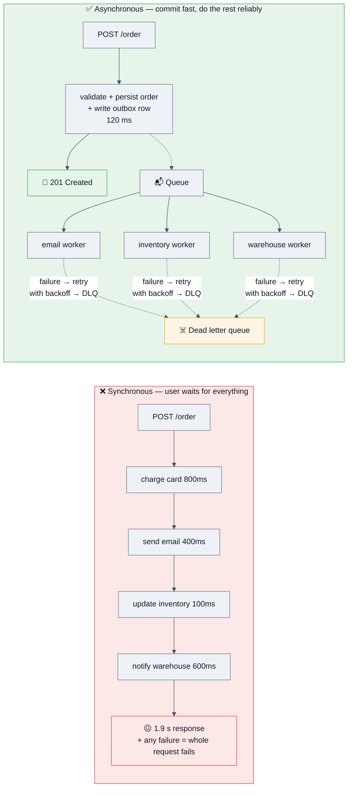

### Queue vs stream — know the difference precisely

| | **Message queue** (SQS, RabbitMQ) | **Event stream / log** (Kafka, Kinesis, Pulsar) |
|---|---|---|
| Model | Consume-and-delete | **Append-only log with retained offsets** |
| Consumers | Compete for messages | Independent consumer groups each read everything |
| Replay | ❌ Gone once acked | ✅ **Rewind to any offset within retention** |
| Ordering | Usually per-queue/FIFO-queue | **Per partition** |
| Retention | Until consumed | Days/weeks, size- or time-based |
| Throughput | High | **Very high**, partition-parallel |
| Use for | Task distribution, work queues | Event sourcing, CDC, analytics pipelines, multi-consumer fan-out |

### Delivery semantics — the answer that must be precise

> **"Exactly-once *delivery* is impossible over an unreliable network. What you build is at-least-once delivery plus an idempotent consumer, which gives exactly-once *effect*."**

| Semantic | Mechanism | Cost |
|----------|-----------|------|
| At-most-once | Fire and forget | Messages can be lost |
| **At-least-once** ⭐ | Ack after processing; redeliver on timeout | **Duplicates — consumer must be idempotent** |
| Exactly-once *effect* | At-least-once + dedup key/idempotency store, or transactional processing | Extra state, bounded dedup window |

### The patterns that matter

- **Transactional outbox** ⭐ — write the business change **and** the event row in **one database transaction**, then a relay (poller or CDC) publishes it. **This is the correct answer to "how do you avoid dual-write inconsistency?"** — you cannot atomically write to a DB and a queue.
- **Dead-letter queue** — after N failed attempts, park it for humans. A queue without a DLQ retries a poison message forever.
- **Retry with exponential backoff + jitter** — ⚠️ **without jitter, all clients retry in sync and you've built a self-DDoS.**
- **Backpressure** — bounded queues, rejecting work, or slowing producers. **Unbounded queues just relocate the failure to OOM.**
- **Idempotency keys** on every consumer.
- **Consumer lag** as your primary health metric — not queue depth alone.

## 2.6 CDN, object storage, and media

- **CDN** caches at the edge (hundreds of PoPs). Absorbs 70–95% of static traffic, cuts latency to ~10–50 ms, and **dramatically cuts origin egress cost** — often the biggest single cost lever in a media system.
- **Cache keys and headers:** `Cache-Control: max-age`, `s-maxage`, `stale-while-revalidate`, `ETag`/`If-None-Match`, `Vary`. **Cache-busting by putting a content hash in the filename** (`app.a3f9c.js`) lets you set `max-age=1y` safely.
- **Push vs pull CDN:** pull (origin-fetch on first miss) is the default; push suits large, predictable assets.
- **Object storage (S3/GCS)** for blobs: cheap, ~11 nines durability, effectively infinite. **Never store media in your primary database.**
- **Presigned URLs** — the client uploads **directly to object storage**, bypassing your servers entirely. **Volunteer this in any upload design**; routing 5 MB files through your API tier is a classic mid-level mistake.
- **Storage tiers** — hot / infrequent / archive (Glacier). A retention policy that tiers old data is a real cost answer.
- **Multipart upload + resumable uploads** for large files; **chunking + content-hash dedup** for a Dropbox-style system.

## 2.7 API design & communication protocols

| Style | Best for | Trade-offs |
|-------|----------|------------|
| **REST** ⭐ | Public APIs, CRUD, cacheable resources | Simple, ubiquitous, HTTP caching works. Over/under-fetching; chatty for graphs |
| **GraphQL** | Client-driven aggregation, many client shapes | One round trip for complex needs. Hard to cache, N+1 risk, complex-query DoS — **needs depth/complexity limits** |
| **gRPC** ⭐ | Internal service-to-service | Protobuf (small, fast), HTTP/2 multiplexing, streaming, codegen. Not browser-native without a proxy |
| **WebSocket** | Full-duplex real-time (chat, collaboration, games) | Stateful connections → connection-state management, sticky routing, scaling the fleet |
| **SSE (Server-Sent Events)** | Server→client push only (notifications, live feeds, **LLM token streaming**) | Simpler than WS, auto-reconnect, plain HTTP. **The right answer for streaming LLM output** |
| **Long polling** | Fallback where WS/SSE unavailable | Simple; wasteful at scale |
| **Webhooks** | Server→server events (payments, integrations) | Must be **signed, idempotent, and retried**; receivers must be idempotent |
| **MQTT** | IoT, constrained devices | Tiny footprint, QoS levels |

**API essentials to mention:** versioning (`/v1/`, or headers), **cursor pagination** (never offset for deep pages), idempotency keys on mutations, consistent error envelopes with machine-readable codes, rate-limit headers (`X-RateLimit-*`, `Retry-After`), and pushing auth to the gateway.

## 2.8 API gateway, service mesh, and service discovery

- **API gateway** — one front door: TLS, authN/Z, rate limiting, quotas, routing, request/response transformation, and observability. **Prevents every service reimplementing auth.** Risk: it becomes a monolith and a SPOF — keep business logic *out* of it.
- **BFF (Backend for Frontend)** — a gateway per client type (web/mobile/partner), so each gets exactly the payload shape it needs.
- **Service mesh** (Envoy/Istio/Linkerd) — sidecar proxies handling mTLS, retries, timeouts, circuit breaking, traffic splitting, and telemetry **without application code changes**. Cost: real operational complexity. *"I'd add a mesh when I have dozens of services and cross-cutting policy pain, not before."*
- **Service discovery** — client-side (Consul/Eureka + a smart client) vs server-side (a load balancer or DNS-based, as in Kubernetes Services).

## 2.9 Search & indexing

- **Inverted index:** term → posting list of documents. This is the core of Elasticsearch/Lucene and worth being able to describe.
- **Pipeline:** tokenize → normalize/lowercase → remove stop words → stem/lemmatize → index.
- **Ranking:** TF-IDF → **BM25** (the standard lexical baseline) → learning-to-rank → **hybrid retrieval (BM25 + vector similarity)**, which is the 2026 default for anything semantic.
- **How the index gets built:** dual-write is fragile; the robust pattern is **CDC from the database → a stream → an indexer**, which also gives you replay and rebuild.
- **Autocomplete:** tries/prefix indexes, or a prefix-keyed store with popularity scores; cache aggressively — it's the highest-QPS endpoint you'll have.
- **Trade-off to state:** search indexes are **eventually consistent by nature**. Quantify the indexing lag (typically seconds) and confirm the product tolerates it.

## 2.10 Consistent hashing — draw this from memory

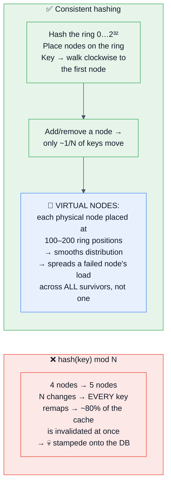

**Where it's used:** Cassandra/DynamoDB partitioning, Memcached client sharding, CDN request routing, and any sharded cache. **The virtual-node detail is what separates a memorized answer from an understood one** — without vnodes, removing one node dumps its entire load onto its single successor, which then falls over.

**Alternatives worth naming:** **rendezvous (HRW) hashing** — for each key, compute `hash(key, node)` for every node and pick the max; simpler than a ring, also minimally disruptive. **Jump consistent hash** — very fast, but nodes must be numbered contiguously.

---
# 3. 🚀 Advanced Concepts

## 3.1 CAP, PACELC, and what they actually say

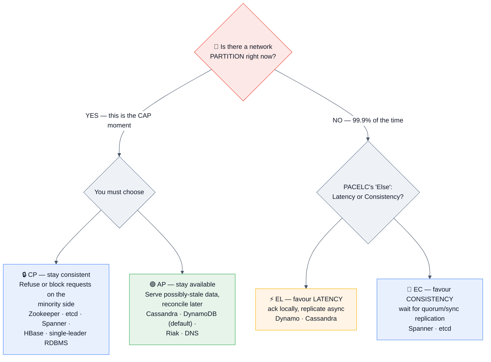

> [!IMPORTANT]
> **State CAP precisely or don't state it.** *"CAP is not 'pick two of three.' Partition tolerance isn't a choice — networks partition. CAP says that **during a partition** you must choose between consistency and availability. **PACELC** is the more useful framing because it adds the other 99.9% of the time: **else**, you trade **latency** against **consistency**. Most real systems are PA/EL (Cassandra) or PC/EC (Spanner), and the interesting engineering is in *how much* they trade, not which corner they sit in."*

**The nuance that impresses:** modern systems are **tunable per-operation**, not globally. DynamoDB does eventually-consistent reads by default and strongly-consistent reads on request; Cassandra lets you pick `ONE`/`QUORUM`/`ALL` per query. **So the right answer is usually "different consistency for different operations in the same system"** — a payment write is CP, a view counter is AP.

## 3.2 Consistency models — the ladder

| Model | Guarantee | Cost | Example |
|-------|-----------|------|---------|
| **Linearizable (strong)** | Every read sees the most recent committed write; the system behaves as if there's one copy | Consensus round trips; unavailable during partitions | etcd, Spanner, a single-leader RDBMS read from the leader |
| **Sequential** | All nodes see operations in the same order (not necessarily real-time order) | | |
| **Causal** ⭐ | Causally-related operations are seen in order; concurrent ones may differ | Much cheaper than linearizable | **The sweet spot for social/collaborative apps** — a reply never appears before its parent |
| **Read-your-writes** | You always see your own writes | Session pinning or write-position tracking | The fix for "I posted it and it vanished" |
| **Monotonic reads** | You never see time go backwards | Session affinity | Prevents replica-hopping weirdness |
| **Eventual** | Given no new writes, replicas converge | Cheapest, most available | DNS, S3 listings historically, Cassandra defaults |

> [!TIP]
> **The senior move:** *"Rather than declaring the whole system 'eventually consistent,' I'd assign a consistency requirement per operation. The balance transfer is linearizable. The follower count can be 30 seconds stale. The feed can be 5 minutes stale. Naming the staleness budget per operation is what makes the design implementable."*

**Quorums:** with `N` replicas, `W` write acks and `R` read responses, **`R + W > N` guarantees the read set overlaps the write set** → you see the latest write. Common: `N=3, W=2, R=2`. `W=N` gives fast reads, slow writes; `W=1, R=1` is fastest and weakest.

## 3.3 Consensus & coordination

| Algorithm/System | What it gives you | Where it's used |
|------------------|-------------------|-----------------|
| **Raft** ⭐ | Leader election + replicated log; designed for understandability | etcd, Consul, CockroachDB, TiKV, Kafka KRaft |
| **Paxos / Multi-Paxos** | The original; harder to reason about | Chubby, Spanner |
| **ZAB** | Zookeeper's atomic broadcast | Zookeeper |
| **Two-phase commit (2PC)** | Atomic commit across resources | ⚠️ **Blocking**: if the coordinator dies after prepare, participants hold locks indefinitely. Avoid across services |
| **Three-phase commit** | Non-blocking 2PC | Doesn't survive network partitions correctly; rarely used |

**What you use consensus *for*:** leader election, distributed locks with fencing, configuration/metadata storage, membership, and cluster coordination. **What you should never use it for:** high-throughput application data — consensus costs a round trip per operation.

**Key theory to name:** **FLP impossibility** (no deterministic consensus algorithm can guarantee termination in an asynchronous network with even one faulty process — which is why real systems use timeouts and are *practically* rather than *theoretically* live), and **Byzantine fault tolerance** (needed when nodes may lie — blockchain; not needed inside your datacenter).

## 3.4 Idempotency, exactly-once, and distributed transactions

### The idempotency pattern — memorize this

```
1. Client generates an idempotency key (UUID) per logical operation and RESENDS
   the SAME key on retry.
2. Server: INSERT (key, request_hash, status='in_progress') with a UNIQUE constraint.
   • Insert succeeded → this is the first attempt → do the work.
   • Conflict + status='succeeded' → return the STORED response. No side effect.
   • Conflict + status='in_progress' → 409, tell the client to retry shortly.
   • Conflict + different request_hash → 422, the key was reused for a different body.
3. On success, store the response body against the key with a TTL (24–72 h).
```
**Why the unique constraint and not a check-then-insert:** the check-then-insert is a race; the constraint is atomic. **This detail is the whole answer.**

### Distributed transactions — the honest hierarchy

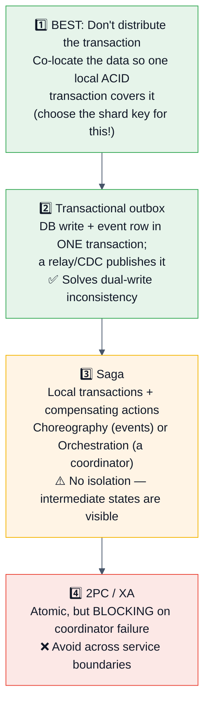

**Saga in one breath:** *"Order created → reserve inventory → charge payment → schedule shipment. If the payment fails, run compensating transactions backwards: release the inventory, cancel the order. **Choreography** (each service emits events others react to) is decoupled but the flow is invisible and hard to debug; **orchestration** (a central workflow engine like Temporal or Step Functions drives it) is easier to observe and version, which is why most teams end up there. **The thing sagas don't give you is isolation** — a customer can see 'order placed' while the payment is still pending, so the UI has to model those intermediate states honestly."*

## 3.5 Reliability patterns — the resilience toolkit

| Pattern | What it prevents |
|---------|------------------|
| **Timeouts** ⭐ | A hung dependency consuming your threads forever. **Every network call needs one.** The most-forgotten line of code in the industry |
| **Retries + exponential backoff + jitter** ⭐ | Transient failures. ⚠️ **Jitter is mandatory** — synchronized retries are a self-inflicted DDoS |
| **Retry budgets** | Retries amplifying an outage. Cap retries as a % of traffic, not per-request |
| **Circuit breaker** ⭐ | Hammering a dead dependency. Closed → Open (fail fast) → Half-open (probe) |
| **Bulkhead** | One slow dependency exhausting a shared thread/connection pool and taking down unrelated features |
| **Rate limiting / throttling** | Overload and abuse; protects you *and* your dependencies |
| **Load shedding** ⭐ | Total collapse under overload — **drop the lowest-value work early and return 503 + `Retry-After` rather than queueing everything and dying** |
| **Graceful degradation** | All-or-nothing failure. Serve stale, serve partial, hide the feature — but stay up |
| **Backpressure** | Unbounded queues turning a slowdown into an OOM |
| **Idempotency** | Retries causing duplicate side effects |
| **Health checks + readiness** | Traffic going to a node that isn't ready |
| **Cell / shuffle sharding** | Correlated failure — isolating customers into cells so one bad tenant or bug affects a fraction |
| **Chaos engineering** | Untested assumptions. *"An untested failover is a hypothesis."* |

> [!WARNING]
> **The retry-storm cascade — describe this in any reliability discussion.** A downstream slows → callers time out and retry → downstream load **triples** → it slows further → more timeouts → thread pools exhaust → health checks fail → the orchestrator restarts instances → each restart opens fresh connections and replays retries → **total collapse, long after the original blip ended.** The fixes are: retry budgets, jitter, circuit breakers, load shedding, and **client timeouts shorter than server timeouts** so work isn't done for a caller who has already given up.

## 3.6 Observability

**The three pillars, and what each is actually for:**

| Pillar | Answers | Tools |
|--------|---------|-------|
| **Metrics** | "Is something wrong, and how bad?" Cheap, aggregated, alertable | Prometheus, Datadog, CloudWatch |
| **Logs** | "What exactly happened for this request?" Expensive at volume; sample and structure them | ELK/OpenSearch, Loki, Splunk |
| **Traces** ⭐ | "**Where** in a 12-service call chain did the time go?" | OpenTelemetry, Jaeger, Zipkin, Honeycomb |

**Frameworks to name:**
- **RED** (per service): **R**ate, **E**rrors, **D**uration.
- **USE** (per resource): **U**tilization, **S**aturation, **E**rrors.
- **Four Golden Signals** (Google SRE): latency, traffic, errors, **saturation**.

**Non-negotiables:** a **correlation/trace ID** propagated through every hop and log line; **structured (JSON) logs**; **alert on symptoms (SLO burn rate), not causes** — "p99 latency exceeds SLO" pages a human, "CPU is 80%" does not; and **dashboards that answer a question**, not dashboards that display everything.

**SLO thinking (state this at senior+):** *"I'd define an SLI — the fraction of requests served under 200 ms — set an SLO of 99.5%, and derive an error budget. If we're burning the budget fast, we stop shipping features and fix reliability; if we're not spending it, we're being too conservative and should ship faster. That turns 'is it reliable enough?' from an argument into a number."*

## 3.7 Multi-region & geo-distribution

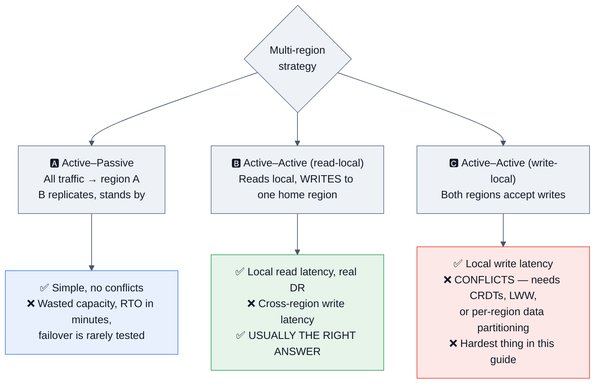

**The framing that scores:** *"Before choosing, I'd ask what multi-region is **for**: disaster recovery, latency, or data residency? They lead to different designs. For DR I need a tested failover and a stated RTO/RPO — an untested standby is theatre. For latency I want read-local, write-home, because true active-active writes mean conflict resolution, and unless the data model is naturally partitionable by region (users, tenants) or genuinely commutative (counters, sets → CRDTs), that complexity rarely pays. For residency, I partition by region as a hard rule and never replicate across the boundary."*

**Also mention:** cross-region replication lag (typically 10s of ms to seconds), **cross-region data transfer cost** (it's expensive and shows up on the bill), and the failover checklist — DNS/Anycast switching, database promotion, cache warm-up, and **the fact that both regions must be able to run at 100% load, which means running at ≤50% normally**.

## 3.8 Cost-aware architecture 💰 *(the 2026 addition)*

> [!IMPORTANT]
> **Interviewers now ask "what does this cost?" — have a method, not a number.**

| Cost driver | Rule of thumb | The lever |
|-------------|---------------|-----------|
| **Egress bandwidth** | ~$0.05–0.09/GB out of a cloud; **inter-region and internet egress dominate media systems** | **CDN** (cuts origin egress 70–95%), compression, smaller payloads, correct cache headers |
| **Compute** | Steady-state ≫ spiky cost; reserved/savings plans cut 30–60% | Right-size, autoscale, spot/preemptible for batch, serverless for spiky |
| **Storage** | ~$0.023/GB/mo hot object storage; block storage is several times more | **Tiering + retention policies**; store blobs in object storage, not the DB |
| **Database** | Usually the largest single line item; IOPS and replicas multiply it | Caching, read replicas only where needed, right-sizing, partition-drop retention |
| **Cross-AZ traffic** | Charged per GB in most clouds — **a surprising, invisible cost** | AZ-aware routing, co-locate chatty services |
| **GPU inference** 🆕 | Dominates any LLM feature; measured in $/1M tokens or $/GPU-hour | Batching, quantization, distillation, **semantic caching**, routing easy queries to smaller models |
| **Observability** | Log volume can rival compute cost | Sampling, structured logs, metric cardinality control |

**The cost sentence to have ready:** *"Roughly: this is X requests/second × Y KB egress = Z TB/month, which at cloud egress rates is about $N — so the CDN isn't an optimization, it's the difference between viable and not. The database is the next line item, and caching is what keeps us on one tier smaller."* **You don't need to be right. You need to show you think in these units.**

## 3.9 GenAI / LLM system design 🤖 *(now a mainstream round)*

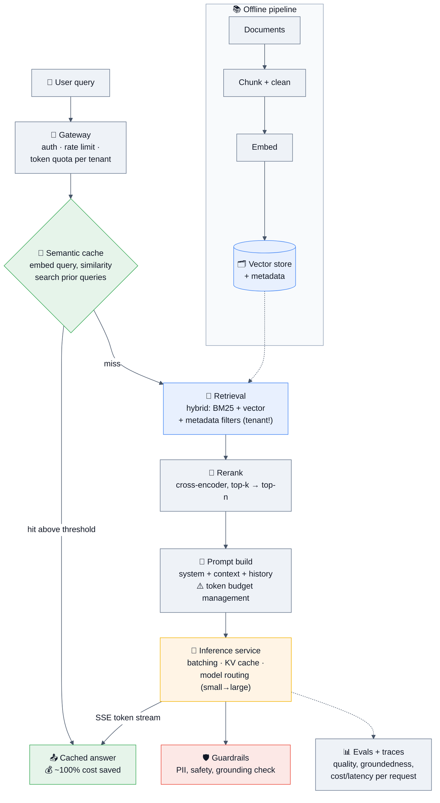

### The concepts you're expected to reason about

| Concept | What to say |
|---------|-------------|
| **RAG** | Retrieve relevant context, put it in the prompt, generate grounded output. **The quality problem is retrieval, not generation** — most bad RAG is a retrieval failure |
| **Chunking** | Size and overlap matter enormously; chunk on semantic boundaries, keep metadata (source, tenant, timestamp) with each chunk |
| **Hybrid retrieval** ⭐ | **BM25 + vector similarity, then rerank.** Pure vector search misses exact keyword/ID matches; pure lexical misses paraphrase. Hybrid is the 2026 default |
| **Vector store** | HNSW (better recall/latency, slow build, memory-hungry) vs IVF (fast build). **Memory math:** 1 M × 1536 dims × 4 B ≈ **6 GB** before index overhead → quantization matters |
| **Metadata filtering** ⭐ | **Tenant/permission filters must be applied at retrieval, not after** — otherwise you leak documents across customers. **This is the security answer in a RAG design and it wins points** |
| **Semantic cache** | Embed the query; if a prior query is above a similarity threshold, return its answer. Huge cost/latency win. **Risk: too-loose a threshold serves confidently wrong answers** — scope by tenant/model/prompt-version and log near-threshold hits |
| **Inference serving** | **Continuous batching**, KV-cache reuse, prefix caching, quantization (INT8/FP8), speculative decoding. Throughput and latency pull in opposite directions — batching helps one and hurts the other |
| **Model routing** | Send easy queries to a small/cheap model, escalate hard ones. Often the single biggest cost lever |
| **Streaming** | **SSE** for token-by-token output — it transforms perceived latency; TTFT (time to first token) is the metric users feel |
| **Evals** | Offline golden sets + online A/B + LLM-as-judge with human spot-checks. **"How do you know it got better?" is the question that separates real answers from demos** |
| **Guardrails** | Input filtering, output safety checks, **prompt-injection defence** (especially for agents with tools), groundedness/citation checks |
| **Agents** | Tool use, planning loops, **step limits and budget caps** (an unbounded agent loop is a runaway bill), human-in-the-loop for consequential actions, and **idempotency on every tool that mutates** |
| **Cost & capacity** | Think in **tokens**: `requests × (input + output tokens) × $/token`. GPU capacity planning is about concurrency and sequence length, not just QPS |

> [!TIP]
> **The GenAI design answer that lands:** *"I'd treat the LLM as an unreliable, expensive, high-latency dependency and design around it like any other: a strict timeout, a fallback path, a cache in front, a cheaper model as a degradation tier, a token budget per tenant, and an eval suite so I can tell whether a prompt change made things better or worse. The novel parts are retrieval quality and evaluation; the rest is ordinary distributed systems."*

## 3.10 Data-intensive patterns

- **Lambda architecture** — a batch layer for accuracy plus a speed layer for freshness, merged at query time. **Downside: two codebases computing the same thing.**
- **Kappa architecture** — one streaming path; reprocess by replaying the log. Simpler; needs a durable, replayable log (Kafka).
- **CQRS** — separate write and read models, so each is optimized independently. Adds a sync path and staleness.
- **Event sourcing** — persist the event sequence, derive state. Perfect audit trail; O(n) reads unless you snapshot; **schema evolution of old events is the hard part.**
- **Medallion / bronze-silver-gold** — raw → cleaned → aggregated layers in a lake/warehouse.
- **CDC (Change Data Capture)** — tail the database's log (Debezium) into a stream. **The right way to feed caches, search indexes, and warehouses without dual writes.**
- **Materialized views / precomputation** — trade storage and staleness for read latency. **Most "make it fast" answers are really "precompute it."**

---
# 4. 🎤 Interview Questions by Level

> **This section covers the *conceptual* questions** asked inside and around design rounds. **The full "design X" problems are in §7.**
> **Format:** ⭐ rating → 🎯 *why they ask* → ✅ *expected answer* → 🔁 *follow-ups* → ❌ *common mistakes*.

---

## 4.1 🌱 Beginner

### Q1. What is the difference between horizontal and vertical scaling? ★★★★★
✅ **Vertical** = a bigger machine (more CPU/RAM). Simple, no code changes, no distribution problems — but has a hard ceiling and a superlinear price curve, and the machine is a single point of failure. **Horizontal** = more machines. Effectively unlimited and gives redundancy — but requires statelessness, load balancing, and introduces consistency and coordination problems.
🔁 **Follow-ups:** "Which first?" → **"Vertical, almost always.** It's cheaper in engineering time and buys years. A modern box has 128 cores and 2 TB of RAM — most systems never outgrow it. I'd scale horizontally when I need redundancy, or when I've actually hit the ceiling." / "What must be true to scale horizontally?" → **Stateless services** (session/state in a shared store), and a way to route requests.
❌ **Mistakes:** Saying horizontal is "modern" and vertical is "outdated." That's a mid-level tell.

### Q2. What is a load balancer and how does it decide? ★★★★★
✅ §2.2 — L4 vs L7, the algorithms, health checks, TLS termination.
🔁 **Follow-ups:** "Isn't the LB a single point of failure?" → **Yes** — solved with a redundant pair + floating IP/Anycast, or a managed LB that's internally redundant. / "How does it know a server is dead?" → Active health checks (`/healthz`) plus passive observation. **⚠️ Make the health check shallow** — if it queries the database, a slow database marks *every* server unhealthy and you've turned a degradation into a total outage.

### Q3. What is caching and where would you put a cache? ★★★★★
✅ §2.3 — the layers (browser → CDN → in-process → distributed → DB buffer pool), cache-aside as the default, and TTLs.
🔁 **Follow-ups:** "What do you cache?" → Data that is **read often, changes rarely, and is expensive to compute.** / "What are the risks?" → Staleness, invalidation complexity, stampedes, and **a new failure domain**. / **"What happens when the cache is empty?"** → The whole load hits the origin — so you need a concurrency limit and warm-up. **Volunteer this; it's the question behind the question.**

### Q4. SQL vs NoSQL — how do you choose? ★★★★★
✅ Reframe it: *"'NoSQL' isn't one thing — it's key-value, document, wide-column, graph, and time-series, which are as different from each other as they are from SQL."* Then choose on: **data model & access patterns**, **transaction/consistency needs**, **scale shape** (read-heavy vs write-heavy), and **team familiarity**.
🔁 **Follow-ups:** "Default?" → **"Relational, usually Postgres.** It does relational, JSON, full-text, geospatial, and vectors, and one team can operate it. I'd add a specialized store when I can point at the specific limit we hit." / "When is NoSQL clearly right?" → Enormous write volume with simple key access (DynamoDB/Cassandra); genuinely schemaless documents; time-series at high ingest; graph traversals.
❌ **Mistakes:** "NoSQL scales, SQL doesn't." Instagram, Notion, Figma, and GitHub run enormous relational systems.

### Q5. What is a CDN and when do you need one? ★★★★☆
✅ §2.6. Emphasize the **two** benefits: latency (content served from ~10–50 ms away) **and cost** (origin egress drops 70–95%). **The cost point is what 2026 interviewers want to hear.**
🔁 **Follow-ups:** "What can't be CDN'd?" → Personalized and rapidly-changing content — though `stale-while-revalidate` and edge compute blur this. / "How do you invalidate?" → **Content-hashed filenames** (`app.a3f9c.js` with `max-age=1y`) beats explicit purging; purge APIs exist but are slower and rate-limited.

### Q6. Explain latency vs throughput. ★★★★★
✅ **Latency** = time for one operation (always quote percentiles). **Throughput** = operations per second. They're independent: a system can have high throughput *and* high latency (batching), or low latency and low throughput.
🔁 **Follow-ups:** "Why p99 and not average?" → **Averages hide the tail.** With 100 requests/page, a p99 of 1 s means **most page loads contain at least one slow request** — the average is irrelevant to the user's experience. / "How do you improve p99 specifically?" → Reduce variance: hedged requests, timeouts + retries to a second replica, removing GC pauses, avoiding head-of-line blocking, and isolating noisy neighbours.

### Q7. What is a message queue and why use one? ★★★★★
✅ §2.5. Benefits: **decoupling** (producer doesn't know the consumer), **buffering** (absorbing spikes), **retries/reliability**, and **fast user-visible responses** by doing slow work asynchronously.
🔁 **Follow-ups:** "What breaks?" → Ordering becomes hard, you inherit duplicates (so consumers must be idempotent), debugging spans systems, and **queues can grow unboundedly** — which is why you need backpressure and a DLQ. / "Queue vs stream?" → §2.5's table.

### Q8. What is a microservice, and should you use them? ★★★★★
✅ Independently deployable services owning their own data, communicating over the network. **Benefits:** team autonomy, independent scaling and deployment, technology choice, and fault isolation. **Costs:** network calls instead of function calls (latency + partial failure), distributed transactions, distributed debugging, operational overhead per service, and data consistency across service boundaries.
🔁 **Follow-up:** "Would you start with them?" → **"No. I'd start with a well-modularized monolith** and split out a service when there's a concrete reason — an independent scaling profile, a team boundary, or a different reliability requirement. **Microservices solve organizational problems more than technical ones**, and a distributed monolith — services that must deploy together — is worse than either." **This answer scores at every level.**

### Q9. What is a single point of failure and how do you find them? ★★★★☆
✅ Any component whose failure takes down the system. **Find them by walking the diagram and asking "what if this box dies?"** for every box — including the load balancer, the DNS provider, the config service, the CI pipeline, and the certificate that expires.
🔁 **Follow-up:** "You have redundancy — are you safe?" → Not necessarily: **correlated failure** (same AZ, same bad deploy, same expired cert, same dependency) defeats redundancy. Real isolation means separate failure domains.

### Q10. What are the main HTTP status codes you'd design around? ★★★☆☆
✅ `200/201/204`, `301/302/304`, `400` (bad request), `401` (unauthenticated) vs `403` (unauthorized) — **know the difference**, `404`, `409` (conflict — **idempotency's friend**), `422`, `429` (rate limited, with `Retry-After`), `500`, `502/503/504` (and that **503 + `Retry-After` is the correct load-shedding response**).

### Q11. What is stateless vs stateful, and why does it matter? ★★★★★
✅ A stateless service keeps no client-specific data between requests, so **any instance can serve any request** — which is what makes horizontal scaling, autoscaling, rolling deploys, and instance replacement trivial. State lives in a database, cache, or object store.
🔁 **Follow-up:** "What about sessions?" → Store them in Redis/a DB, or use signed tokens (JWT). **Sticky sessions are a workaround, not a design** — they break autoscaling and make deploys lossy.

### Q12. What is database indexing and what does it cost? ★★★★☆
✅ A separate sorted/derived structure turning an O(n) scan into an O(log n) lookup. **Costs:** disk, slower writes (every index is maintained on insert/update/delete), more WAL/replication traffic, and more to keep in cache.
🔁 **Follow-up:** "Composite index column order?" → **Equality columns first, then the sort/range column.** `WHERE tenant_id = ? AND created_at > ? ORDER BY created_at` wants `(tenant_id, created_at)`.

### Q13. What does "eventually consistent" actually mean? ★★★★★
✅ Given no new writes, all replicas will converge to the same value. **It does not mean "wrong"** — it means readers may see stale data for a bounded window.
🔁 **Follow-up:** **"How stale?"** → *"That's exactly the right question, and it's the one I'd take to the product team. If the answer is 'a follower count can be 30 seconds stale, a balance cannot be stale at all,' then I have two different designs in the same system."* **This is the single best answer in the whole consistency space.**

---

## 4.2 🌿 Intermediate

### Q14. Explain CAP theorem. ★★★★★
✅ §3.1 — state it precisely (**during a partition**, choose C or A), then immediately upgrade to **PACELC** (else: latency vs consistency). Then the nuance: **real systems tune it per-operation**, not globally.
🔁 **Follow-ups:** "Is MongoDB CP or AP?" → *"Configurable — with majority write concern and primary reads it behaves CP; with secondary reads and w:1 it's closer to AP. The label depends on how you run it, which is why I'd rather talk about the guarantee I need per operation."* **That answer is better than any letter.** / "Is a single-node database CA?" → Vacuously — there's no partition to tolerate. It's just unavailable when the node dies.
❌ **Mistakes:** "Pick two of three."

### Q15. How do you scale a database? ★★★★★
✅ **The ladder in order** (§2.4): fix queries/indexes → cache → vertical → read replicas → partitioning → functional split → shard. **State that each earlier step is ~10× cheaper operationally.**
🔁 **Follow-ups:** "Replicas gave you read scale — what broke?" → **Replication lag and read-your-writes.** / "How do you pick a shard key?" → The four rules in §2.4. / "How do you reshard live?" → Dual-write to old and new, backfill, verify with shadow reads, cut over per shard, keep rollback. **Logical shards ≫ physical shards makes this a move, not a rehash.**

### Q16. What is consistent hashing and why does it exist? ★★★★★
✅ §2.10 — including **why `hash % N` is catastrophic** (changing N remaps ~everything → mass cache invalidation → DB stampede) and **virtual nodes** (smooth distribution + spreading a failed node's load across all survivors rather than one).
🔁 **Follow-ups:** "How many vnodes?" → 100–200 per physical node is typical; more = smoother distribution, more metadata. / "Alternatives?" → Rendezvous (HRW) hashing, jump consistent hash.

### Q17. How do you handle a hot key / hot partition? ★★★★★
🎯 **Why:** It's the failure mode that sharding *cannot* fix, so it tests whether you understand sharding's limits.
✅ **Lead with the insight:** *"Sharding doesn't help — a hot key lives on one shard, on one node. Adding shards changes nothing."* Then the ladder: **(1) an in-process L1 cache with a 1–5 s TTL** (removes ~99% of traffic — the single best fix), (2) request coalescing/singleflight, (3) key splitting (`key:0..N` with random reads, write to all), (4) read replicas for that key, (5) client-side caching with server invalidation, (6) if it's a *write* hotspot, shard the counter and sum on read.
🔁 **Follow-up:** "How do you detect one?" → Per-key metrics sampling, `--hotkeys`-style tooling, or logging top keys at the proxy layer.

### Q18. Design an idempotent API. ★★★★★
✅ §3.4 — the client-generated key, the **unique constraint** (not check-then-insert), the stored response, the status states, and the TTL.
🔁 **Follow-ups:** "Which endpoints need it?" → **Any mutating endpoint a client can retry** — which, with network timeouts, is all of them. `GET`/`PUT`/`DELETE` are naturally idempotent; `POST` is not. / "What if the key is reused with a different body?" → 422 — compare a hash of the request. / "Where does the key live?" → Ideally in the **same database as the side effect**, in the same transaction. A Redis-only dedup store is best-effort.

### Q19. How do you design for high availability? ★★★★★
✅ **Redundancy at every layer** (no single instance of anything), **across failure domains** (multi-AZ), **health checks + automatic failover**, **graceful degradation** so partial failure isn't total failure, and **stateless services** so replacement is trivial.
🔁 **Follow-ups:** "Five nines?" → *"26 seconds of downtime a month. That's beyond human response time, so it requires automated failover, multi-region, and rigorous change management — and it costs several times more than four nines. I'd push back and ask whether the business actually needs it, because most products don't."* **Pushing back is a senior signal.** / "The compounding trap?" → 5 serial dependencies at 99.9% each → ~99.5% ceiling.

### Q20. What's the difference between a queue and a pub/sub system? ★★★★☆
✅ **Queue:** competing consumers, each message processed **once** by one consumer. **Pub/Sub:** broadcast, every subscriber gets every message. **Kafka does both** via consumer groups — within a group it's a queue, across groups it's pub/sub. **That framing is the good answer.**

### Q21. How would you handle a thundering herd? ★★★★☆
✅ Name the three sources: **cache expiry** (a hot key expires → everyone rebuilds), **service restart** (empty cache, cold connections), and **retry storms** (synchronized clients). Fixes: **jittered TTLs**, a rebuild lock or probabilistic early expiration, **request coalescing**, staggered/ramped restarts, **exponential backoff with jitter**, and load shedding.

### Q22. How do you keep a cache and a database consistent? ★★★★★
✅ Name the impossibility first: **you cannot atomically write to two systems**, so some divergence is inevitable. Then the ladder: (1) **short TTLs** as a self-healing floor; (2) **write DB → delete cache** (not update); (3) **CDC-driven invalidation** from the DB's change log — most robust, removes invalidation from app code; (4) **versioned keys** so invalidation is a version bump; (5) reconciliation as a backstop.
🔁 **Follow-up:** "Why delete instead of update?" → Concurrent updates can write the cache out of order and stick permanently. Deleting is idempotent and lets the next reader fetch the truth.

### Q23. Explain rate limiting and which algorithm you'd pick. ★★★★★
✅ **Fixed window** (simple, ⚠️ 2× burst at boundaries), **sliding log** (exact, O(N) memory), **sliding window counter** (O(1), very good approximation), **token bucket** ⭐ (O(1), **allows intentional bursts — best UX for public APIs**), **leaky bucket** (smooths output).
🔁 **Follow-ups:** "Distributed?" → Shared state in Redis, updated atomically (Lua), **plus a local tier per gateway node so the shared store only sees a fraction of traffic** — that's what real gateways do. / **"What if the rate limiter is down?"** → **Fail open or fail closed?** A rate limiter usually fails **open** (serve traffic, lose protection); an auth check fails **closed**. **Naming that decision explicitly is the senior signal.**

### Q24. Explain the transactional outbox pattern. ★★★★☆
✅ §3.4. The problem it solves: you cannot atomically write to the database and publish to Kafka; a crash between them diverges them permanently. The solution: write the business row **and** an `outbox` row in **one local transaction**, then a relay (poller or CDC) publishes and marks it sent. **At-least-once publishing + idempotent consumers = correct.**

### Q25. How do you do a zero-downtime deployment / migration? ★★★★★
✅ **Deployments:** blue-green (two environments, flip traffic — instant rollback, 2× cost), **canary** (1% → 10% → 50% → 100% with automated metric gates — the usual answer), rolling (in-place, batch by batch). **Feature flags** decouple deploy from release, which is the real unlock.
✅ **Schema migrations — the expand/contract discipline:**
```
1. EXPAND    add the new column/table (nullable, backwards-compatible)
2. DUAL WRITE deploy code writing BOTH old and new
3. BACKFILL   migrate historical data in throttled batches
4. VERIFY     shadow-read and compare; log mismatches
5. SWITCH     deploy code reading the new path
6. CONTRACT   stop writing the old, then drop it — days or weeks later
```
🔁 **Follow-up:** "How do you roll back at step 5?" → You can, because step 2 kept both written. **The reason expand/contract exists is that every step is independently reversible.**

### Q26. What is a circuit breaker and when does it hurt? ★★★★☆
✅ States: **Closed** (normal) → **Open** (fail fast without calling) → **Half-open** (let a probe through; success closes it). Prevents you from hammering a dying dependency and from tying up your own threads.
🔁 **Follow-up:** "When is it harmful?" → **A too-sensitive breaker turns a transient blip into a self-inflicted outage**, and a breaker on a critical path with no fallback just converts slow into broken. Pair it with a **fallback** (cached/stale/default response) or you've only changed the error message.

### Q27. Explain database replication lag and its consequences. ★★★★★
✅ §2.4 — async replication means replicas trail the leader. **Consequences:** read-your-writes violations, monotonic-read violations (hopping between replicas can go backwards in time), and **failover data loss** (a promoted replica never received the last writes).
🔁 **Follow-up:** "Fixes?" → Read from the leader for N seconds after a write; session affinity; track the write position and wait; or design the API to return the created object. **For the failover-loss problem:** synchronous/quorum replication, at the cost of write latency and availability.

### Q28. How do you design an API for pagination? ★★★★☆
✅ **Cursor/keyset pagination**, not offset. `WHERE (created_at, id) < (?, ?) ORDER BY created_at DESC, id DESC LIMIT 20`.
🔁 **Follow-ups:** "Why not offset?" → O(offset) — page 5000 scans and discards 100k rows — **and it's unstable under concurrent inserts** (items shift between pages). / "How do you show a total count?" → Often you shouldn't; use an approximation or a cached count. Exact counts over large datasets are expensive.

### Q29. Monolith vs microservices vs modular monolith. ★★★★★
✅ §4.1 Q8, plus the middle option: a **modular monolith** — strict module boundaries, separate schemas per module, no cross-module database access — which gives you most of the design discipline with none of the network. **And it's a clean migration path**: extract a module into a service when there's a reason.
🔁 **Follow-up:** "When do you split?" → Different scaling profile, different reliability requirement, a genuine team boundary (Conway's Law), or a different technology need. **Not "because it's modern."**

### Q30. What is backpressure and why does it matter? ★★★★☆
✅ A signal that flows *upstream* telling producers to slow down. **Without it, a slow consumer causes unbounded queue growth → memory exhaustion → total failure.** With it, the system degrades predictably: bounded queues, rejected work, `429`/`503` responses, and TCP-level flow control.
🔁 **Follow-up:** "Where do you implement it?" → Bounded queues everywhere, semaphores/concurrency limits per dependency, `429` at the API edge, and consumer-lag-based autoscaling. **"An unbounded queue just moves the failure from 'reject some requests' to 'lose everything.'"**

---

## 4.3 🌳 Senior

### Q31. Walk me through what happens when a user types a URL and hits enter. ★★★★☆
🎯 **Why:** A breadth check that reveals depth gaps instantly.
✅ Browser cache → OS resolver → DNS (recursive resolver → root → TLD → authoritative; possibly **GeoDNS/Anycast**) → TCP handshake (or **QUIC/HTTP-3, 0-RTT**) → **TLS handshake** (SNI, cert validation, ALPN) → the request hits a **CDN edge** (hit → served; miss → origin) → **load balancer** → **API gateway** (authN/Z, rate limit) → **service** → cache → database → response → compression → the browser parses HTML, builds the DOM/CSSOM, fetches subresources, and renders.
🔁 **Follow-ups:** Any hop can become a 10-minute deep dive — **have one you're strong on ready** ("I can go deep on the TLS handshake or on how the CDN decides to revalidate — which is more useful?").

### Q32. Your p99 latency is 2 s but p50 is 50 ms. Investigate. ★★★★★
✅ **The reasoning to narrate:** *"A wide p50/p99 gap means variance, not systemic slowness — so I'm looking for something that affects a small fraction of requests."*
```
Suspects, in order:
1. A slow dependency in the tail — one downstream's p99 becomes your p99
2. Cache misses — p50 is a hit, p99 is a miss going to the database
3. Lock contention / queueing — check saturation, not just utilization
4. GC pauses or JIT warm-up (JVM/Go/Node)
5. A hot partition — a subset of users hits one overloaded shard
6. Noisy neighbours / CPU steal on shared infrastructure
7. Head-of-line blocking — one large request stalling a connection
8. Cold starts (serverless, new instances after autoscale)
9. Data skew — 1% of users have 1000× more data (the "power user" tail)
10. Retries — a failed first attempt doubling the observed latency
```
✅ **The tool answer:** *"I'd start with distributed traces filtered to the slow tail rather than averages — the trace shows me which span owns the time, and that's a five-minute answer instead of a five-hour guess."*
🔁 **Follow-up:** "How do you fix tail latency structurally?" → **Hedged requests** (send a second request after p95 elapses, take the first response — Google's tail-at-scale technique), tighter timeouts with fast retries to a different replica, isolating heavy tenants, and removing shared bottlenecks.

### Q33. Design for a 10× traffic increase. What breaks first? ★★★★★
✅ **The method:** *"I'd walk the request path and find the first resource that saturates."* Usually in this order: **the database's write path** (a single leader is a hard ceiling), then **connection limits** (process-per-connection databases die at a few hundred), then **cache capacity** (working set no longer fits → hit ratio collapses → the DB gets 10× the misses — **a nonlinear cliff worth naming**), then **network/egress cost**, then stateless compute (easiest to fix).
🔁 **Follow-up:** "What breaks *non-linearly*?" → **The cache hit ratio.** Going from a 95% to an 85% hit rate **triples** database load, not increases it by 10%. Also: queue depth, GC pressure, and anything with a coordination cost.

### Q34. How do you migrate a system with no downtime and no data loss? ★★★★★
✅ The **expand/contract + dual-write + shadow-read** sequence (§4.2 Q25), applied to systems rather than schemas:
```
1. Stand up the new system alongside the old
2. DUAL WRITE to both (the old remains the source of truth)
3. BACKFILL historical data, throttled, monitoring the source system's load
4. SHADOW READ from both, compare results, LOG MISMATCHES — this is the step people skip
   and it's the one that finds the bugs
5. Flip reads to the new system behind a flag: 1% → 10% → 50% → 100%
6. Make the new system the source of truth; keep dual-writing for the rollback window
7. Decommission the old system LAST
```
🔁 **Follow-ups:** "What if the two disagree in step 4?" → *"That's the point of step 4 — it's cheaper to find it there than in production. I'd triage: is it a real bug, a timing artefact, or an acceptable semantic difference?"* / "How long do you keep dual-write?" → Until you've survived a full business cycle (a month-end, a peak day) on the new system.

### Q35. What's your approach to a system you've never seen that's on fire? ★★★★☆
✅ **Mitigate first, diagnose second.**
```
1. Stop the bleeding: is there a recent deploy/config change? ROLL BACK FIRST, ask later.
2. Scope it: what fraction of users/requests/regions? Check the SLO dashboard.
3. Follow the errors: which service is the origin vs which are collateral damage?
   Traces beat guessing.
4. Check the four golden signals for the suspect service.
5. Mitigate: shed load, disable the expensive feature via flag, scale out,
   fail over — restore service before understanding it.
6. Preserve evidence BEFORE you restart things (logs, heap dumps, current state).
7. Blameless postmortem: contributing factors, not "root cause"; action items with owners.
```
✅ **The line that lands:** *"The goal in the first ten minutes is a working system, not an explanation. Understanding is a day-two activity."*

### Q36. When would you NOT use a microservices architecture? ★★★★☆
✅ Small team (<15–20 engineers — you'll spend more on infrastructure than features); an unclear or unstable domain (you'll draw the boundaries wrong and pay to move them); tightly-coupled data requiring cross-entity transactions; latency-critical paths (network hops add up); and no operational maturity (no CI/CD, no observability, no on-call → microservices are unmanageable).
🔁 **Follow-up:** "What's a distributed monolith?" → **Services that must be deployed together** because they share a database or have circular synchronous dependencies. **You've paid every cost of microservices and received none of the benefits** — the worst of both.

### Q37. How do you design a system to be debuggable? ★★★★☆
✅ **Correlation/trace IDs** propagated everywhere; **structured logs** with consistent fields; **distributed tracing** as the default, not an add-on; **meaningful error messages that include context** (which key, which tenant, which upstream); **runbooks linked from alerts**; **feature flags for isolating behaviour**; **audit logs for state changes**; and **the ability to reproduce production state** in a test environment.
✅ **The Staff-level framing:** *"Debuggability is a design requirement, not an afterthought. If I can't answer 'why did this specific request fail?' in under five minutes, the design isn't finished."*

### Q38. Explain how you'd handle the celebrity problem in fan-out. ★★★★★
✅ **The problem:** fan-out-on-write is O(followers). A post from an account with 100 M followers means 100 M timeline writes — minutes of work, a massive write spike, and unacceptable latency.
✅ **The hybrid answer:** *"Fan out on write for normal users — cheap, and it makes reads a single lookup. For accounts above a follower threshold (say 100k), **don't fan out**; store their posts once, and **merge them in at read time** with the precomputed timeline. Reads for users who follow a celebrity become 'read my timeline + read the ~5 celebrities I follow, merge by time.' That's a bounded cost. The threshold is a tuning knob, and I'd measure the distribution before picking it."*
🔁 **Follow-ups:** "How do you merge efficiently?" → Both sides sorted by time; a k-way merge over a small k. / "What about the write spike anyway?" → Rate-limit and spread the fan-out over a queue rather than doing it synchronously; prioritize active users first (**fan out to online users immediately, offline users lazily**).

### Q39. Design a system that must never lose data. ★★★★★
✅ **Layered durability:** write to a **durable log first** (WAL/Kafka with `acks=all` and `min.insync.replicas ≥ 2`), replicate **synchronously across AZs** before acking, ack only after the durability guarantee is met, and treat everything downstream as derived and rebuildable.
✅ **Plus the operational half:** **backups with tested restores** (a backup you've never restored is not a backup), point-in-time recovery, **stated RPO and RTO as numbers**, immutable/append-only storage where possible, checksums and reconciliation jobs, and **protection against the most common cause of data loss: a bug or an operator, not a disk.** (Soft deletes, delayed hard deletion, and change review.)
🔁 **Follow-up:** "What's the cost?" → Write latency (cross-AZ sync replication is milliseconds), reduced availability (if you can't reach a quorum you must refuse writes), and storage cost. **"Durability and availability trade against each other during a partition — that's CAP applied to writes."**

### Q40. How do you decide build vs buy? ★★★★☆
✅ **Buy** when it's not your core differentiator, the market solution is mature, and the total cost of ownership (engineering time, on-call, upgrades, security patches) exceeds the license. **Build** when it *is* your differentiator, when your requirements are genuinely unusual, or when the vendor's failure mode is unacceptable (lock-in, data residency, cost curve at scale).
✅ **The senior framing:** *"The cost of 'buy' is visible on an invoice; the cost of 'build' is invisible and permanent. I'd default to buying infrastructure and building product. And I'd ask what happens at 10× scale — some vendor pricing models become the reason companies migrate."*

### Q41. What is a cell-based architecture and why would you use it? ★★★☆☆
✅ Partition the entire stack into independent **cells**, each serving a subset of users with its own compute, cache, and database. A failure — a bad deploy, a poison request, a hot tenant — is contained within one cell. **Shuffle sharding** goes further: assign each customer a *random pair* of cells so that any two customers rarely share the same combination, which makes it very unlikely that one bad actor takes down another specific customer.
**Why it matters:** it converts "the blast radius is everyone" into "the blast radius is 1/N of customers," and it's how AWS and other large providers achieve isolation at scale. **Naming shuffle sharding specifically is a strong Staff signal.**

### Q42. How would you design for compliance (GDPR/data residency)? ★★★☆☆
✅ **Data residency:** partition by region as a hard architectural rule — the shard key includes the region and **data never crosses the boundary**, including backups, logs, and analytics. **Right to erasure:** you need to know **every** place a user's data lives, which means a data inventory, and it argues strongly for **crypto-shredding** (encrypt per-user with a per-user key; delete the key and the data is unreadable everywhere, including in immutable backups). **Also:** consent tracking, audit logs, data minimization (don't collect it and you can't leak it), and PII redaction in logs and traces.

---

## 4.4 🏔️ Staff / Principal

### Q43. You're given an ambiguous mandate: "make the platform faster." Where do you start? ★★★★★
🎯 **Why:** Staff rounds test whether you can *find* the problem, not just solve a given one.
✅ **The structure:**
1. **Define "faster" and for whom** — p99 API latency? Page load? Time-to-first-byte? Batch job completion? These have nothing in common.
2. **Measure before touching anything** — establish a baseline with real user monitoring, not synthetic tests.
3. **Find where the time goes** — traces across the whole request path, including the client and the network, not just the server.
4. **Rank by user impact × effort**, and share the ranking so the org agrees on the target.
5. **Fix the biggest thing, measure, repeat** — resist the urge to do ten things at once, because you'll never know which worked.
6. **Institutionalize** — a latency SLO, a regression gate in CI, and a dashboard the team actually looks at, so it doesn't decay back.
✅ **The Staff line:** *"The most common failure here is optimizing what's easy to measure rather than what users feel. I'd start by finding out which slow thing is actually costing us conversions or retention — that reframes the whole project and gets me the budget to do it properly."*

### Q44. Design the architecture for a company, not a feature: 200 engineers, 5 years. ★★★★☆
✅ **Structure the answer around boundaries and evolution, not boxes:**
- **Domain boundaries** first (DDD-ish): what are the bounded contexts, and which team owns each? **Conway's Law says the architecture will match the org chart, so design them together.**
- **Platform vs product:** a platform team owning CI/CD, observability, service scaffolding, and the data pipeline; product teams owning features. **The golden-path principle: make the right thing the easy thing.**
- **Contracts:** versioned APIs, schema registry for events, backwards-compatibility rules. **This is what lets 200 people ship independently.**
- **Data:** one source of truth per entity, CDC to derive everything else, a warehouse for analytics so nobody queries production.
- **Evolution:** start with a modular monolith + a few services; extract on evidence. Explicitly plan for **strangler-fig migration** rather than rewrites.
- **What I'd refuse:** shared databases across teams, synchronous call chains more than 2–3 deep, and bespoke infrastructure per team.

### Q45. Your design costs $2 M/year. Cut it in half without breaking the SLO. ★★★★☆
✅ **The method, in order of leverage:**
1. **Find the top 3 line items** — it's almost always egress, database, and compute in some order. *"You cannot optimize what you haven't itemized."*
2. **Egress:** CDN coverage, compression, payload size (are we sending fields nobody reads?), and cross-AZ traffic.
3. **Storage:** retention policies and tiering — most companies pay to store data nobody has queried in a year.
4. **Compute:** right-sizing (most fleets are provisioned for a peak that never comes), autoscaling, spot/preemptible for batch, and reserved capacity for the steady state.
5. **Database:** caching to shed read load, then a tier smaller; drop unused indexes and replicas.
6. **Architectural:** is anything precomputed that could be lazy, or lazy that should be precomputed? Are we doing work for users who never look at it?
7. **The honest part:** *"I'd also present what we'd give up. Some savings cost latency or resilience, and that should be an explicit decision, not a silent one."*

### Q46. How do you evaluate a design that someone else proposes? ★★★☆☆
✅ **The review checklist:** Does it satisfy the stated requirements — and are those the *right* requirements? What are the failure modes, and what's the blast radius of each? What's the cost shape at 1× and 10×? What does it make hard *later* (the reversibility question)? Is the complexity justified by a real constraint? Who operates it, and can they? What's the migration path from what exists?
✅ **The Staff framing:** *"I'd separate 'this is different from how I'd do it' from 'this is wrong.' Most designs are defensible; my job in review is to find the load-bearing assumptions and test those, not to relitigate style."*

### Q47. Explain a time you chose the boring technology. ★★★★☆
🎯 **Why:** Staff engineers are trusted with technology *restraint*, not enthusiasm.
✅ Have a real story. The structure: the tempting exciting option → the constraint that made it wrong (team familiarity, operational burden, maturity, hiring, debuggability at 3 a.m.) → the boring choice → **the measured outcome** → and honestly, what the boring choice cost you.
✅ **The principle to name:** *"Innovation tokens — you get a small number of places to be novel, and they should be spent where the novelty is your competitive advantage, not on your queueing infrastructure."*

### Q48. Design a system where correctness matters more than availability. ★★★★★
✅ **Lead with the inversion:** *"Most design instincts optimize for availability. Here I'd deliberately make the system refuse to serve rather than serve wrongly."*
**Concretely:** synchronous quorum writes; **fail closed** on any dependency uncertainty; strong consistency for the critical path (single-leader or consensus); **the database enforces invariants** (constraints, not application checks) so a bug can't corrupt state; double-entry accounting where every transaction sums to zero; **immutable append-only records with corrections as new entries**, never updates; idempotency keys everywhere; reconciliation jobs comparing independent sources; and **a manual review queue for anything ambiguous** rather than an automated guess.
🔁 **Follow-up:** "What's the availability cost?" → *"Real. During a partition we stop accepting writes on the minority side. I'd make that explicit to the business with a number: we'd rather be down for 4 minutes than wrong for 4 seconds — and for a payments ledger that's the correct trade."*

### Q49. How do you handle a design disagreement with a senior colleague? ★★★★☆
✅ **Find the disagreement's actual location:** usually people agree on the facts and disagree on which risk matters more. Name both positions fairly. **Propose a cheap experiment or a reversible first step** rather than arguing to consensus. Write it down (an ADR — Architecture Decision Record — with context, options, decision, and consequences). **Disagree and commit** when a decision is made. And **set a review trigger**: *"if we see X, we revisit."*
✅ **What they're listening for:** that you can be wrong gracefully and that you don't need to win.

### Q50. What are the second-order consequences of your design? ★★★☆☆
✅ **A Staff-only question. The categories:**
- **Organizational:** who now has to be on call for this? Does it create a team dependency or a bottleneck?
- **Evolutionary:** what does this make *hard* in two years? Which decisions are one-way doors?
- **Operational:** what new runbook, alert, and failure mode did I just create?
- **Cost:** does the cost curve grow linearly with users, or superlinearly?
- **Data:** did I just create a second source of truth that will drift?
- **Behavioural:** will engineers route around this because it's inconvenient?
✅ *"The best designs are the ones that are still good after the third thing you didn't anticipate."*

---

## 4.5 🏢 FAANG-specific patterns

### Q51. (Google) "Design a system to count unique events at scale." ★★★★☆
✅ Google-style questions are often deliberately abstract. **Clarify first:** exact or approximate? What window? What cardinality? Query latency? Then: exact requires storing every ID (expensive at billions) → **HyperLogLog** gives ±0.81% error in ~12 KB per counter with cheap unions, which is almost always the right trade. Then discuss sharded aggregation, time-bucketed rollups, and late-arriving events.
🔁 **The follow-up they always ask:** "Now make it exact." → Bitmaps if IDs are dense integers; otherwise a distributed set with sharded counting and a merge step — and **state the cost honestly**.

### Q52. (Meta) "Design X. You have 35 minutes." ★★★★★
✅ Meta rounds are **fast**. Adaptations: compress requirements to 3–4 minutes, draw earlier, make decisions crisply and move on, and **expect a curveball at minute 25** ("now it's real-time", "now it's global", "now the write rate is 100×"). **Don't gold-plate the first half — you need budget for the curveball.**

### Q53. (Amazon) Design + Leadership Principles woven together. ★★★★★
✅ Expect design questions to be interleaved with **Ownership, Dive Deep, Bias for Action, Frugality, and Are Right A Lot**. Practically: mention **cost** unprompted (Frugality), describe **what you'd measure and how you'd know it worked** (Dive Deep), state **what you'd ship in week one vs quarter one** (Bias for Action), and **own a past mistake honestly** when asked.
🔁 Amazon also frequently runs a **separate LLD/OOD round** — see §6.4.

### Q54. (Netflix/Stripe/Databricks) The senior-only architecture conversation. ★★★★☆
✅ These are less "design a famous product" and more "let's talk about a real hard problem." Expect: **failure modes, backpressure, idempotency, data correctness, cost, and migration.** There's often no clean answer — they want to see how you reason under genuine ambiguity. **Asking "what have you tried?" and treating it as a collaborative design session is appropriate here** in a way it isn't at other companies.

### Q55. (OpenAI/Anthropic/AI infra) "Design the backend for an LLM product." ★★★★☆
✅ §3.9's architecture, plus: **streaming (SSE) for TTFT**, per-tenant token quotas, semantic caching, model routing for cost, retrieval quality as the real product problem, **evals as a first-class system** ("how do you know a prompt change helped?"), guardrails and prompt-injection defence, and **GPU capacity planning in terms of concurrency and sequence length rather than QPS**.

---

## 4.6 🚀 Startup

### Q56. Design this with 4 engineers and 6 months. ★★★★★
✅ **The whole answer is what you *don't* build.** Managed services over self-hosted (a managed database, a managed queue, a managed auth provider); a **modular monolith**, not microservices; one database until it hurts; boring, well-documented technology the team already knows; feature flags so you can ship continuously; and **only enough observability to debug production** (structured logs + error tracking + a few SLO dashboards).
✅ **The line:** *"At this stage, the biggest risk isn't scale — it's building the wrong thing. So I'd optimize for iteration speed and for keeping the architecture reversible, and I'd write down the specific signals that would tell us to invest in scaling."*

### Q57. When do you actually need to re-architect? ★★★★☆
✅ **Concrete triggers, not vibes:** a component is at >70% of a hard ceiling with no cheap headroom; the change-failure rate or lead time is degrading measurably; on-call load is unsustainable; cost per user is rising with scale rather than falling; or team coordination overhead is blocking delivery. **"We'd like it to be cleaner" is not a trigger.**

### Q58. How do you handle 100× growth if it happens suddenly? ★★★★☆
✅ **Have a pre-written plan, in order:** (1) turn on aggressive caching and CDN; (2) scale up (vertical is instant, sharding is not); (3) shed non-essential load — disable expensive features via flags; (4) add read replicas; (5) queue anything that doesn't need to be synchronous; (6) rate-limit aggressively and communicate honestly. **"Then, once we're stable, do the real work."**
✅ *"The mistake is trying to do the correct long-term architecture during the incident."*

---

## 4.7 🏭 Product Companies (Flipkart, Swiggy, Zomato, PhonePe, Walmart, Shopify, Atlassian)

> These loops typically run **two separate rounds: HLD and LLD.** §7 covers HLD; §6.4 covers LLD.

### Q59. Design a flash-sale system: 10k units, 1 M concurrent buyers. ★★★★★
✅ **The crux:** the database cannot take 1 M concurrent conditional updates. **Design:** pre-load the inventory counter into an in-memory store; the **atomic decrement** is the reservation; a successful decrement enqueues a durable order record; a reservation TTL releases unpaid holds; **the counter is a hot key, so shard it into N sub-counters** with clients picking one at random and falling through; a **waiting room / queue** upstream to admit users at a controlled rate; and a **reconciliation job** comparing the counter to the durable ledger.
🔁 **Follow-up:** "What if the in-memory store dies mid-sale?" → *"You oversell or undersell. Mitigations: durable persistence on that key, a synchronous replica, and — crucially — the durable reservation log so you can reconcile and cancel afterwards. There's no design that's both instantaneous and perfectly durable; the business decides which way to err."* **That honesty is the answer.**

### Q60. Design food-delivery order tracking (Swiggy/Zomato/DoorDash-style). ★★★★☆
✅ Location ingestion at high write rate (driver pings every few seconds — **batch and downsample, don't write every ping to the primary DB**); geospatial indexing (geohash/H3/quadtree) for matching; **WebSocket or SSE** for pushing updates to the customer; an **order state machine** with an explicit, auditable set of transitions; and separation of the **hot path** (assignment, tracking) from the **durable record** (the order).
🔁 **Follow-up:** "How do you match orders to drivers?" → A geospatial query for candidates within a radius, then a scoring function (distance, rating, current load, direction of travel), then an **assignment with a timeout** so a non-responding driver doesn't strand the order. Mention that global optimality is a batch problem (Hungarian algorithm / auction) and most systems use a good-enough greedy assignment.

### Q61. Design a payment system (PhonePe/Razorpay/Stripe-style). ★★★★★
✅ **Correctness first:** idempotency keys on every mutating call, a **double-entry ledger** (append-only, every transaction sums to zero), `NUMERIC`/integer minor units for money (**never floating point**), an explicit state machine, and the **saga** for multi-step flows with compensating transactions.
✅ **Plus:** webhook handling that is **signed, retried, and idempotent on the receiving side**; reconciliation against the payment provider's records (**assume you *will* diverge and design the process that finds it**); PCI scope minimization via tokenization; and audit logs.

---

## 4.8 🏢 Service Companies (TCS, Infosys, Wipro, Accenture, Cognizant, Capgemini, LTIMindtree, HCL)

> **Format:** mostly theory and architecture patterns, 2–5 minute answers, often from a fixed bank.

| # | Question | One-line answer |
|---|----------|-----------------|
| 1 | What is system design? | Deciding how components are arranged to meet requirements under constraints. |
| 2 | HLD vs LLD? | HLD = components, interactions, data flow. LLD = classes, methods, schemas, algorithms. |
| 3 | Horizontal vs vertical scaling? | More machines vs a bigger machine. |
| 4 | What is a load balancer? | Distributes traffic across servers; L4 (transport) or L7 (application). |
| 5 | Load-balancing algorithms? | Round robin, weighted, least connections, least response time, IP/consistent hash. |
| 6 | What is caching? | Storing computed/fetched data closer to the consumer to cut latency and load. |
| 7 | Cache eviction policies? | LRU, LFU, FIFO, TTL, random. |
| 8 | What is a CDN? | Geographically distributed edge caches for static/cacheable content. |
| 9 | CAP theorem? | During a network partition, choose consistency or availability. |
| 10 | ACID vs BASE? | Atomicity/Consistency/Isolation/Durability vs Basically Available, Soft state, Eventual consistency. |
| 11 | SQL vs NoSQL? | Relational + strong consistency + joins vs flexible models + horizontal scale. |
| 12 | Types of NoSQL? | Key-value, document, wide-column, graph, time-series. |
| 13 | Sharding vs partitioning? | Sharding = across machines; partitioning = splitting data (can be within one machine). |
| 14 | Replication types? | Single-leader, multi-leader, leaderless; sync vs async. |
| 15 | What is a message queue? | Asynchronous, decoupled communication with buffering and retries. |
| 16 | Kafka vs RabbitMQ? | Distributed log with replay vs traditional broker with routing. |
| 17 | Monolith vs microservices? | Single deployable vs independently deployable services; trade simplicity for autonomy. |
| 18 | What is an API gateway? | Single entry point: auth, rate limiting, routing, observability. |
| 19 | REST vs SOAP vs GraphQL vs gRPC? | Resource HTTP vs XML/WS-* vs client-specified queries vs binary RPC over HTTP/2. |
| 20 | What is idempotency? | Repeating the operation has the same effect as doing it once. |
| 21 | Statelessness — why? | Any instance can serve any request → easy scaling, deploys, and failover. |
| 22 | What is a proxy vs reverse proxy? | Forward proxy fronts clients; reverse proxy fronts servers. |
| 23 | What is rate limiting? | Capping request rate per client to protect the system. |
| 24 | Rate-limiting algorithms? | Fixed window, sliding log, sliding counter, token bucket, leaky bucket. |
| 25 | What is a circuit breaker? | Stop calling a failing dependency; fail fast; probe to recover. |
| 26 | What is a single point of failure? | A component whose failure takes down the system. |
| 27 | High availability vs fault tolerance? | Minimize downtime vs continue operating correctly through failure. |
| 28 | What is a heartbeat? | Periodic liveness signal used for failure detection. |
| 29 | Consistent hashing? | Hash ring + virtual nodes so adding/removing a node moves only ~1/N of keys. |
| 30 | What is a Bloom filter? | Probabilistic set membership; **no false negatives**, some false positives. |
| 31 | What is latency vs throughput? | Time per operation vs operations per second. |
| 32 | What is availability measured in? | Nines: 99.9% = 43 min/month down. |
| 33 | SLA vs SLO vs SLI? | Contract vs internal target vs the measurement. |
| 34 | What is CQRS? | Separating the write model from the read model. |
| 35 | What is event sourcing? | Store events; derive current state from them. |
| 36 | What is a saga? | Distributed transaction as local transactions + compensating actions. |
| 37 | What is 2PC? | Two-phase commit — atomic across resources, but blocks if the coordinator dies. |
| 38 | What is a WebSocket? | Persistent full-duplex connection over a single TCP connection. |
| 39 | Blue-green vs canary? | Two full environments with a flip vs gradual traffic shift with metric gates. |
| 40 | 12-factor app principles? | Config in env, stateless processes, backing services as attached resources, disposability, dev/prod parity, logs as streams. |

---
# 5. 📊 Frequently Asked Questions (Ranked by Frequency)

> Synthesized and deduplicated from Glassdoor/AmbitionBox/Blind/CareerCup reports, Exponent/Hello Interview/Design Gurus question banks, the System Design Primer, r/ExperiencedDevs and r/cscareerquestions threads, and published 2026 interview-trend reports.

## 🔥 Very High Frequency (expect these in almost every design round)

| # | Question / topic | Depth expected | Covered in |
|---|------------------|----------------|------------|
| 1 | **Design a URL shortener** | Full design | §7.2 |
| 2 | **Design a social feed / Twitter** | Full design | §7.4 |
| 3 | **Design a chat / messaging system** | Full design | §7.5 |
| 4 | **Design a rate limiter** | Full design | §7.3 |
| 5 | How do you scale a database? | Deep | §2.4, §4.2 Q15 |
| 6 | Explain CAP (and PACELC) | Deep | §3.1, §4.2 Q14 |
| 7 | Caching: where, which pattern, what breaks | Deep | §2.3, §4.1 Q3 |
| 8 | SQL vs NoSQL — how do you choose | Mid → Deep | §2.4, §4.1 Q4 |
| 9 | Horizontal vs vertical scaling | Shallow → Mid | §4.1 Q1 |
| 10 | Load balancing: layers + algorithms | Mid | §2.2, §4.1 Q2 |
| 11 | Back-of-envelope estimation | Mid | §1.5 |
| 12 | Consistent hashing | Deep | §2.10, §4.2 Q16 |
| 13 | Eventual vs strong consistency ("how stale?") | Deep | §3.2, §4.1 Q13 |
| 14 | Monolith vs microservices | Mid → Deep | §4.1 Q8, §4.2 Q29 |
| 15 | Message queues: why, and what breaks | Mid → Deep | §2.5, §4.1 Q7 |

## 🌡️ High Frequency

| # | Question / topic | Depth | Covered |
|---|------------------|-------|---------|
| 16 | **Design a video-streaming service (YouTube/Netflix)** | Full design | §7.6 |
| 17 | **Design a ride-hailing service (Uber)** | Full design | §7.7 |
| 18 | **Design a file-storage service (Dropbox/Drive)** | Full design | §7.8 |
| 19 | **Design a notification system** | Full design | §7.9 |
| 20 | **Design a web crawler / search** | Full design | §7.10 |
| 21 | Idempotency & exactly-once | Deep | §3.4, §4.2 Q18 |
| 22 | Hot keys / hot partitions | Deep | §4.2 Q17 |
| 23 | Cache–DB consistency & invalidation | Deep | §2.3, §4.2 Q22 |
| 24 | Zero-downtime deploys & migrations | Deep | §4.2 Q25, §4.3 Q34 |
| 25 | Replication lag & read-your-writes | Deep | §2.4, §4.2 Q27 |
| 26 | Sharding strategy & shard-key choice | Deep | §2.4 |
| 27 | Circuit breakers, retries, timeouts | Deep | §3.5, §4.2 Q26 |
| 28 | The celebrity/fan-out problem | Deep | §4.3 Q38 |
| 29 | Availability nines & the compounding trap | Mid | §1.5, §4.2 Q19 |
| 30 | Pagination design | Mid | §4.2 Q28 |
| 31 | "What breaks at 10×?" | Deep | §4.3 Q33 |
| 32 | **GenAI/RAG system design** 🆕 | Deep | §3.9, §7.11 |
| 33 | Cost estimation / cost-aware design 🆕 | Mid → Deep | §3.8, §4.4 Q45 |
| 34 | Observability & SLOs | Mid → Deep | §3.6 |
| 35 | Distributed transactions & saga | Deep | §3.4 |

## 🌤️ Medium Frequency

| # | Question / topic | Covered |
|---|------------------|---------|
| 36 | Design a leaderboard / ranking system | §7.12 |
| 37 | Design a payment system | §4.7 Q61, §7.13 |
| 38 | Design an e-commerce / inventory system | §4.7 Q59 |
| 39 | Design a booking system (Ticketmaster/hotels) | §7.14 |
| 40 | Design a distributed cache | §7.15 |
| 41 | Design a job scheduler / cron service | §7.16 |
| 42 | Design an ad-click aggregator | §7.17 |
| 43 | Design a collaborative editor (Google Docs) | §7.18 |
| 44 | Multi-region architecture | §3.7 |
| 45 | Backpressure & load shedding | §3.5, §4.2 Q30 |
| 46 | Transactional outbox / CDC | §3.4, §3.10 |
| 47 | "What happens when you type a URL?" | §4.3 Q31 |
| 48 | Tail-latency debugging (p50 vs p99) | §4.3 Q32 |
| 49 | Build vs buy | §4.3 Q40 |
| 50 | Cell-based architecture / shuffle sharding | §4.3 Q41 |
| 51 | Consensus (Raft/Paxos) and where it's used | §3.3 |
| 52 | Bloom filters, HyperLogLog, sketches | §6.2 |
| 53 | Unique ID generation at scale (Snowflake) | §6.2 |
| 54 | Geospatial indexing (geohash/quadtree/H3) | §6.2, §7.7 |
| 55 | GDPR / data residency / compliance | §4.3 Q42 |

## ❄️ Rare (but high-signal when they land)

| # | Question / topic | Covered |
|---|------------------|---------|
| 56 | Design a distributed lock service | §6.2, §7.15 |
| 57 | Design a metrics/monitoring system | §7.17 |
| 58 | CRDTs and conflict resolution | §3.7, §7.18 |
| 59 | Operational Transformation vs CRDT | §7.18 |
| 60 | Vector clocks / Lamport timestamps | §14.6 |
| 61 | Hedged requests & tail-at-scale techniques | §4.3 Q32, §11 |
| 62 | Erasure coding vs replication | §14.5 |
| 63 | LSM-tree vs B-tree storage engines | §14.5 |
| 64 | Consistent-hashing alternatives (rendezvous, jump) | §2.10 |
| 65 | Second-order/organizational consequences | §4.4 Q50 |

---

# 6. 💻 Coding Questions (The Algorithms & LLD Behind System Design)

> Design rounds don't usually ask you to *write* code — but these implementations get asked in **infrastructure, platform, and LLD rounds**, and being able to sketch them proves your design answers aren't memorized.

## 🟢 Easy

### E1. LRU Cache ★★★★★ *(LeetCode 146 — the single most-asked design-adjacent coding problem)*
**Problem:** O(1) `get` and `put` with a capacity limit.
**Intuition:** hash map for O(1) lookup + **doubly-linked list** for O(1) recency reordering. You need both — a list alone can't find; a map alone can't order.
```python
class Node:
    __slots__ = ('k','v','prev','next')
    def __init__(self, k=0, v=0): self.k, self.v, self.prev, self.next = k, v, None, None

class LRUCache:
    def __init__(self, capacity: int):
        self.cap, self.map = capacity, {}
        self.head, self.tail = Node(), Node()          # sentinels avoid null checks
        self.head.next, self.tail.prev = self.tail, self.head

    def _remove(self, n):  n.prev.next, n.next.prev = n.next, n.prev
    def _add_front(self, n):
        n.next, n.prev = self.head.next, self.head
        self.head.next.prev = n; self.head.next = n

    def get(self, key: int) -> int:
        if key not in self.map: return -1
        n = self.map[key]; self._remove(n); self._add_front(n)
        return n.v

    def put(self, key: int, value: int) -> None:
        if key in self.map:
            n = self.map[key]; n.v = value; self._remove(n); self._add_front(n); return
        if len(self.map) >= self.cap:
            lru = self.tail.prev; self._remove(lru); del self.map[lru.k]
        n = Node(key, value); self.map[key] = n; self._add_front(n)
```
**Complexity:** O(1) both, O(capacity) space.
**Edge cases:** capacity 0; updating an existing key (must not evict); thread safety (**say it: this is not thread-safe — production needs a lock or striped locks**).
**Follow-ups:** *"Now LFU"* (LeetCode 460 — a frequency→ordered-map plus a min-frequency pointer). *"Now make it distributed"* → **that's a system design question**: consistent hashing across nodes, and note that **real caches like Redis use *approximate* LRU via sampling**, because exact LRU costs two pointers per key — gigabytes of pure bookkeeping at 100 M keys.

### E2. Rate limiter — token bucket ★★★★★
```python
import time, threading

class TokenBucket:
    def __init__(self, capacity: float, refill_per_sec: float):
        self.cap, self.rate = capacity, refill_per_sec
        self.tokens, self.ts = capacity, time.monotonic()   # ⚠️ monotonic, not wall clock
        self.lock = threading.Lock()

    def allow(self, cost: float = 1.0) -> bool:
        with self.lock:
            now = time.monotonic()
            self.tokens = min(self.cap, self.tokens + (now - self.ts) * self.rate)  # lazy refill
            self.ts = now
            if self.tokens >= cost:
                self.tokens -= cost
                return True
            return False
```
**Complexity:** O(1) time and space. **The key idea: lazy refill** — don't run a timer, compute how many tokens *would have* accrued since the last call.
**Edge cases:** clock skew (**use a monotonic clock**); the first call (start full or empty? — a design decision); concurrent access.
**Follow-up:** *"Distributed across 200 servers"* → the state must be shared and updated **atomically** (a Redis Lua script), plus a **local tier** so the shared store only sees a fraction of the traffic — and then **fail open or closed?**

### E3. Consistent hashing ring ★★★★★
```python
import bisect, hashlib

class ConsistentHashRing:
    def __init__(self, nodes=None, vnodes: int = 150):
        self.vnodes, self.ring, self.sorted_keys = vnodes, {}, []
        for n in (nodes or []): self.add_node(n)

    def _hash(self, key: str) -> int:
        return int(hashlib.md5(key.encode()).hexdigest(), 16)

    def add_node(self, node: str):
        for i in range(self.vnodes):                    # 🔑 virtual nodes
            h = self._hash(f"{node}#{i}")
            self.ring[h] = node
            bisect.insort(self.sorted_keys, h)

    def remove_node(self, node: str):
        for i in range(self.vnodes):
            h = self._hash(f"{node}#{i}")
            del self.ring[h]
            self.sorted_keys.remove(h)

    def get_node(self, key: str):
        if not self.ring: return None
        h = self._hash(key)
        idx = bisect.bisect_right(self.sorted_keys, h) % len(self.sorted_keys)  # wrap around
        return self.ring[self.sorted_keys[idx]]
```
**Complexity:** `get_node` O(log(V·N)); add/remove O(V·log(V·N)).
**The two points that earn the marks:** (1) **virtual nodes** smooth the distribution *and* spread a failed node's load across all survivors rather than dumping it on one successor; (2) the **wrap-around** with `% len`.
**Follow-ups:** "How would you replicate?" → Walk clockwise to the next N *distinct* physical nodes (this is exactly what Cassandra/Dynamo do). "Weighted nodes?" → Give bigger nodes more vnodes.

### E4. Bloom filter ★★★★☆
```python
import hashlib, math

class BloomFilter:
    def __init__(self, n_items: int, fp_rate: float = 0.01):
        self.m = int(-(n_items * math.log(fp_rate)) / (math.log(2) ** 2))   # optimal bits
        self.k = max(1, int((self.m / n_items) * math.log(2)))              # optimal hashes
        self.bits = bytearray((self.m + 7) // 8)

    def _hashes(self, item: str):
        h1 = int(hashlib.md5(item.encode()).hexdigest(), 16)
        h2 = int(hashlib.sha1(item.encode()).hexdigest(), 16)
        for i in range(self.k):                       # double hashing: cheap k hashes
            yield (h1 + i * h2) % self.m

    def add(self, item: str):
        for pos in self._hashes(item):
            self.bits[pos // 8] |= (1 << (pos % 8))

    def __contains__(self, item: str) -> bool:
        return all(self.bits[p // 8] & (1 << (p % 8)) for p in self._hashes(item))
```
**The property to state precisely:** **no false negatives, possible false positives.** "Definitely not present" is reliable; "probably present" needs checking.
**Sizing:** ~**10 bits per element for a 1% false-positive rate** — that's the number to quote. 1 billion items ≈ 1.2 GB, versus hundreds of GB for the actual keys.
**Where it's used in system design:** cache-penetration defence, "have I crawled this URL?", LSM-tree SSTable lookups (avoiding disk reads), and dedup at scale.
**Follow-up:** *"How do you delete?"* → **You can't** — use a **counting Bloom filter** or a **Cuckoo filter** (which supports deletion). Or rebuild periodically.

## 🟡 Medium

### M1. Distributed unique ID generator (Snowflake) ★★★★★
**Problem:** 64-bit IDs, unique across machines, roughly time-sortable, no coordination per ID.
```
 1 bit  | 41 bits              | 10 bits      | 12 bits
 unused | timestamp ms (~69 y) | machine id   | sequence
        | since a custom epoch | (1024 nodes) | (4096/ms/node)
→ 4,096,000 IDs per second per node, monotonic, sortable by time
```
```python
class Snowflake:
    EPOCH = 1704067200000            # custom epoch (2024-01-01), buys 69 more years
    def __init__(self, machine_id: int):
        assert 0 <= machine_id < 1024
        self.machine_id, self.seq, self.last_ts = machine_id, 0, -1

    def next_id(self) -> int:
        ts = int(time.time() * 1000)
        if ts < self.last_ts:                      # ⚠️ CLOCK WENT BACKWARDS (NTP)
            raise RuntimeError("clock moved backwards; refusing to generate")
        if ts == self.last_ts:
            self.seq = (self.seq + 1) & 0xFFF
            if self.seq == 0:                      # sequence exhausted this ms
                while ts <= self.last_ts: ts = int(time.time() * 1000)
        else:
            self.seq = 0
        self.last_ts = ts
        return ((ts - self.EPOCH) << 22) | (self.machine_id << 12) | self.seq
```
**Edge cases that earn the marks:** **clock skew / NTP moving backwards** (refuse, or wait it out — never silently emit duplicates); sequence exhaustion within a millisecond; machine-ID assignment (Zookeeper/etcd, or from the pod ordinal in a StatefulSet).
**Alternatives to compare:** **UUIDv4** (no coordination, but random → terrible B-tree insert locality); **UUIDv7** (time-ordered UUID — fixes v4's locality problem and is the modern default when 128 bits is fine); **database auto-increment** (a coordination bottleneck); **ticket server** (a SPOF, but simple); **ULID** (sortable, base32, 128-bit).
**Follow-up:** *"Do the IDs leak information?"* → **Yes** — timestamp and machine ID are recoverable, and sequential IDs let a competitor measure your growth rate. If that matters, use an opaque external ID mapped to the internal one.

### M2. Sliding-window rate limiter ★★★★☆
```python
# Sliding window COUNTER — O(1) memory, very good accuracy.
# Blends the previous window's count by how far into the current window we are.
def allow(redis, key, now_ms, window_ms, limit):
    cur_w   = now_ms // window_ms
    elapsed = (now_ms % window_ms) / window_ms
    cur  = int(redis.get(f"{key}:{cur_w}")   or 0)
    prev = int(redis.get(f"{key}:{cur_w-1}") or 0)
    estimate = prev * (1 - elapsed) + cur      # weighted blend
    if estimate >= limit:
        return False
    p = redis.pipeline(); p.incr(f"{key}:{cur_w}"); p.expire(f"{key}:{cur_w}", 2*window_ms//1000); p.execute()
    return True
```
**Why not the exact sliding log?** The log (a sorted set of timestamps) is exact but costs **O(limit) memory per subject** — a 10,000/min limit means 10,000 entries per user. The counter is O(1) and accurate enough. **State the trade-off; that's the answer.**
**Accuracy caveat to name:** the estimate assumes the previous window's requests were uniformly distributed.

### M3. Geospatial index — geohash & quadtree ★★★★☆
**Problem:** "find all drivers within 3 km."
```python
# Geohash: interleave latitude/longitude bits → a string where a shared PREFIX
# means geographic proximity. Turns a 2-D range query into a 1-D prefix scan.
BASE32 = "0123456789bcdefghjkmnpqrstuvwxyz"

def geohash(lat, lon, precision=9):
    lat_r, lon_r, bits, bit, ch, out, even = [-90.0, 90.0], [-180.0, 180.0], [16,8,4,2,1], 0, 0, [], True
    while len(out) < precision:
        if even:                                   # alternate lon, lat
            mid = sum(lon_r) / 2
            if lon > mid: ch |= bits[bit]; lon_r[0] = mid
            else: lon_r[1] = mid
        else:
            mid = sum(lat_r) / 2
            if lat > mid: ch |= bits[bit]; lat_r[0] = mid
            else: lat_r[1] = mid
        even = not even
        if bit < 4: bit += 1
        else: out.append(BASE32[ch]); bit, ch = 0, 0
    return "".join(out)
```
| Precision | Cell size |
|-----------|-----------|
| 4 | ~39 km |
| 5 | ~4.9 km |
| 6 | ~1.2 km |
| 7 | ~153 m |
| 8 | ~38 m |
**The edge case that must be mentioned:** **two points can be metres apart but share no geohash prefix** if they straddle a cell boundary. **Always query the cell plus its 8 neighbours**, then filter by true distance.
**Alternatives:** **quadtree** (adaptive — subdivides only where density is high, which suits cities), **S2** (Google, spherical cells, better on a sphere than geohash), **H3** (Uber's hexagonal grid — **hexagons have uniform neighbour distance, unlike squares**, which is why Uber built it).

### M4. Design a thread-safe bounded blocking queue ★★★☆☆
```python
import threading
from collections import deque

class BoundedBlockingQueue:
    def __init__(self, capacity: int):
        self.q, self.cap = deque(), capacity
        self.lock = threading.Lock()
        self.not_full  = threading.Condition(self.lock)
        self.not_empty = threading.Condition(self.lock)

    def put(self, item):
        with self.not_full:
            while len(self.q) >= self.cap:      # ⚠️ WHILE, not IF — spurious wakeups
                self.not_full.wait()
            self.q.append(item)
            self.not_empty.notify()

    def get(self):
        with self.not_empty:
            while not self.q:
                self.not_empty.wait()
            item = self.q.popleft()
            self.not_full.notify()
            return item
```
**Why it matters for system design:** this *is* backpressure in miniature — a **bounded** queue makes the producer wait instead of consuming unbounded memory. **The `while` instead of `if` is the classic interview detail.**

### M5. Design a key-value store with TTL and expiry ★★★☆☆
**Design points:** a hash map for values + a separate expiry map; **lazy expiry on read** plus a **periodic sampling sweep** (checking every key on a timer is O(n) and wasteful — sample 20 random keys, and if >25% were expired, repeat); a min-heap or timing wheel if you need precise expiry; and eviction (approximate LRU by sampling) when memory-bounded.
**The insight to state:** *"Exact expiry-on-time requires a timer per key, which doesn't scale. Real systems accept that an expired key may occupy memory briefly, as long as it's never **served** — that's the trade Redis makes."*

## 🔴 Hard

### H1. Design a distributed lock with fencing ★★★★☆
```python
# Acquisition returns a MONOTONICALLY INCREASING fencing token.
# The protected RESOURCE — not the lock service — enforces it.
def acquire(etcd, key, ttl_s):
    lease = etcd.lease(ttl_s)
    ok, _ = etcd.transaction(
        compare=[etcd.transactions.version(key) == 0],       # only if unheld
        success=[etcd.transactions.put(key, client_id, lease=lease)],
        failure=[])
    if not ok: return None
    revision = etcd.get(key, metadata=True)[1].mod_revision  # 🔑 monotonic fencing token
    return lease, revision

# Every write to the protected resource carries the token:
def write_with_fence(storage, data, token):
    # storage rejects the write if token < last_seen_token
    return storage.conditional_write(data, fence=token)
```
**The concept that earns the question:** *"A lock without fencing is a hope. If the lock holder is paused — a GC pause, a VM migration, a network partition — its lease can expire and another client can acquire the lock while the first one still believes it holds it. No client-side code can prevent that, because the paused process cannot know it was paused. The only real fix is that **the resource being protected rejects operations carrying a stale token**. That's why Kleppmann's critique of Redlock centres on fencing tokens, and why for correctness-critical locks you want a consensus store that gives you a monotonic revision number."*
**Follow-up:** *"When is a non-fenced lock fine?"* → **Efficiency locks** — where a double execution is wasteful but harmless (don't send the email twice, don't recompute the report twice).

### H2. Design a consistent, distributed counter ★★★★☆
**Problem:** count page views across 100 servers. Exact-ish, high write rate, low read latency.
```
❌ Naive:  UPDATE counters SET n = n + 1 WHERE id = ?    → one row = one hot lock. Dies at scale.

✅ Approach 1 — SHARDED COUNTER
   Write:  UPDATE counters SET n = n+1 WHERE id = ? AND shard = random(0..N-1)
   Read:   SELECT SUM(n) FROM counters WHERE id = ?
   → N× the write throughput; reads cost N reads (cache the sum with a short TTL)

✅ Approach 2 — LOCAL AGGREGATION + PERIODIC FLUSH  ⭐ the best answer at high volume
   Each server counts in memory, flushes a delta every 1–10 s.
   → Redis/DB sees 100 writes/sec instead of 100,000. Cost: bounded staleness + loss on crash.

✅ Approach 3 — STREAM AGGREGATION
   Emit an event per view → Kafka → a stream processor windows and aggregates → serving store.
   → Exact, replayable, and the counts feed analytics too. Cost: pipeline complexity + latency.

✅ Approach 4 — CRDT (G-Counter)
   Each node keeps its own counter; the value is the sum; merges take the max per node.
   → Conflict-free across regions. Cost: state grows with the node count.

⚡ Approximate:  HyperLogLog for UNIQUE counts (~12 KB, ±0.81%) — completely different problem
                from total counts, and interviewers check that you know the difference.
```
**The framing that scores:** *"The first question is whether the count must be exact and immediately consistent. 'Views' almost never does — so local aggregation with a flush is right and it's 1000× cheaper. 'Money' does, and then I'd use a proper ledger, not a counter."*

### H3. Design a scheduler for 100 M delayed jobs ★★★★☆
**Requirements:** schedule a job for any future time, second-level precision, at-least-once execution, survive restarts.
```
Storage:   a sorted structure keyed by run_at — a sorted set, or a DB table partitioned
           by time bucket with an index on (run_at, status)
Claim:     workers poll for "due" jobs and atomically move them to an in-flight state
           with a visibility timeout — one atomic operation, or SELECT ... FOR UPDATE SKIP LOCKED
Reaper:    a sweeper returns in-flight jobs whose visibility timeout expired (crashed worker)
Scale:     shard by hash(job_id); each shard has its own pollers → no global hot spot
Precision: poll every ~200 ms with JITTER across workers (unjittered polling = a thundering herd
           against the same shard every tick)
Far future: a two-tier design — cold storage for jobs > 24 h out, promoted into the hot
           tier by an hourly sweeper. Keeps the hot index small.
Idempotency: jobs may run twice (at-least-once) → the handler must be idempotent, keyed on job_id
```
**Edge cases:** clock skew across workers (**derive "now" from a single source**); a job scheduled in the past (fires immediately — usually correct, but say it); 10 M jobs all scheduled for midnight (**a thundering herd — spread execution with jitter, or admit at a controlled rate**); and poison jobs (attempt counter → dead-letter).

### H4. Design a system to detect duplicate events at 1 M events/sec ★★★★☆
```
Constraint:  can't store every ID forever — 1 M/s × 86,400 = 86 B IDs/day

Tiered approach:
1. In-memory recent window (last 5 min) — a hash set per shard, partitioned by hash(event_id)
   → catches the overwhelming majority (most duplicates are immediate retries)
2. Bloom filter for the last 24 h — ~10 bits/element; 86 B events ≈ 108 GB, so shard it,
   or use a ROTATING set of hourly Bloom filters (drop the oldest) to bound memory
3. Durable store (RocksDB/Cassandra) keyed by event_id with a TTL for the long tail
4. Partition by hash(event_id) so the SAME id always lands on the SAME node
   → no cross-node coordination needed at all. This is the key design move.

Trade-off to state honestly: a Bloom filter's false positives mean you'd DROP a small
fraction of legitimate events. If that's unacceptable, treat a Bloom hit as "check the
durable store" rather than "definitely duplicate" — the filter becomes an optimization
that avoids most disk reads, not the decision-maker.
```

## 6.4 🏛️ Low-Level Design (LLD/OOD) — a separate round at Amazon and most Indian product companies

> **Do not skip this.** Many loops run HLD and LLD as **two distinct rounds**, and candidates who prepared only for HLD get blindsided.

### What's being graded
1. **Clarifying requirements** (same as HLD — scope it first).
2. **Class design:** entities, responsibilities, relationships. Draw a **class diagram**.
3. **SOLID principles**, applied — not recited.
4. **Design patterns** used where they *fit*, not sprinkled for show.
5. **Extensibility:** "now add feature X" without rewriting.
6. **Working code** for the core methods if asked.

### The canonical LLD problems

| Problem | The patterns it's really testing |
|---------|----------------------------------|
| **Parking lot** ★★★★★ | Strategy (pricing/allocation), Factory (spot types), inheritance hierarchy |
| **Elevator system** ★★★★★ | State machine, Strategy (scheduling), Observer |
| **BookMyShow / ticket booking** ★★★★★ | Concurrency (seat locking!), State, Repository |
| **Splitwise** ★★★★☆ | Strategy (split types: equal/exact/percentage), graph settlement |
| **Vending machine** ★★★★☆ | **State pattern** (the textbook example) |
| **Chess / tic-tac-toe** ★★★★☆ | Strategy (piece movement), Factory, rule validation |
| **Rate limiter (OO)** ★★★★☆ | Strategy (algorithms), Decorator |
| **Logging framework** ★★★☆☆ | Chain of Responsibility, Singleton, Strategy (appenders) |
| **Notification service** ★★★☆☆ | Observer, Strategy (channels), Factory |
| **Cache with pluggable eviction** ★★★☆☆ | Strategy, Generics |
| **Food delivery / cab booking** ★★★☆☆ | Full domain modelling + State |
| **Snake & ladder, deck of cards** ★★★☆☆ | Basic modelling — usually a warm-up |

### SOLID, stated the way an interviewer wants to hear it

| Principle | One line | Smell it fixes |
|-----------|----------|----------------|
| **S**ingle Responsibility | A class has one reason to change | God classes |
| **O**pen/Closed | Open for extension, closed for modification | Editing a `switch` every time you add a type |
| **L**iskov Substitution | A subtype must be usable wherever the base type is | `Square extends Rectangle` breaking `setWidth` |
| **I**nterface Segregation | Many small interfaces beat one fat one | Implementing methods that throw `UnsupportedOperation` |
| **D**ependency Inversion | Depend on abstractions, not concretions | `new MySQLRepo()` hard-coded inside a service |

### The patterns worth knowing cold

| Category | Patterns | Where they show up |
|----------|----------|--------------------|
| **Creational** | Factory, Abstract Factory, Builder, Singleton, Prototype | Object creation that varies by type/config |
| **Structural** | Adapter, Decorator, Facade, Proxy, Composite | Wrapping, layering, and simplifying interfaces |
| **Behavioural** | **Strategy** ⭐, **Observer** ⭐, **State** ⭐, Command, Chain of Responsibility, Template Method, Iterator | **Strategy, Observer, and State cover ~70% of LLD rounds** |

> [!TIP]
> **The LLD line that scores:** *"I'll use Strategy here so a new pricing rule is a new class rather than an edit to an existing one — that's Open/Closed in practice. I'm deliberately **not** adding a Factory yet, because we only have two types and the indirection would cost more clarity than it buys."* **Knowing when *not* to apply a pattern is the senior signal.**

> [!WARNING]
> **The concurrency question is where LLD rounds are won and lost.** For BookMyShow: *"Two users select the same seat simultaneously. I'd hold a short-lived seat lock with a TTL — either a row-level `SELECT ... FOR UPDATE`, or a conditional update `UPDATE seats SET status='held', held_by=? WHERE id=? AND status='available'` where zero affected rows means someone else won. **The conditional update is better because it's atomic without holding a transaction open across user think-time.** The TTL releases abandoned holds automatically."* **Volunteer this — most candidates design the classes and never mention the race.**

---
# 7. 🏗️ System Design Questions (Worked Solutions)

> Each design follows the §1.6 framework. **Read them for the *reasoning*, not to memorize the diagram** — an interviewer can tell instantly, and a memorized answer collapses on the first follow-up.

## 7.1 The universal opening (use this every time)

```
"Let me make sure I'm solving the right problem.

 FUNCTIONAL — I'll focus on three things: [X], [Y], [Z]. Is that the right set?
 NON-FUNCTIONAL — I'll assume [N] DAU, a [R:W] read/write ratio, p99 under [T] ms,
   [A]% availability, and that [Z] can be up to [S] seconds stale. Correct me on any of these.
 OUT OF SCOPE — I'll skip auth, analytics, and the admin surface unless you want them.

 I'll do rough numbers, sketch the API, draw the high-level design, then go deep
 on whichever part you find most interesting."
```

## 7.2 🟢 Design a URL Shortener (bit.ly) ★★★★★

**The classic warm-up. It looks trivial; the depth is in ID generation, read scale, and cost.**

### Requirements
```
FUNCTIONAL:  1. Shorten a long URL → a short code
             2. Redirect a short code → the original URL
             3. (Optional) custom aliases, expiry, click analytics
NON-FUNCTIONAL: read-heavy ~100:1 · p99 redirect < 50 ms · 99.99% availability
                (a dead shortener breaks every link ever shared) · codes never reused
```

### Estimation
```
Writes:   100 M new URLs/day → 100 M ÷ 86,400 ≈ 1,200 writes/sec  (peak ~3,500)
Reads:    100:1 → 120,000 reads/sec (peak ~350,000)               ← the design driver
Storage:  100 M/day × 500 B × 5 years ≈ 90 TB  (or ~180 GB/yr if you keep it lean)
Codes:    62^7 ≈ 3.5 trillion with 7 base62 chars → plenty. 62^6 ≈ 57 B → also fine for years.
Cache:    20% of URLs get 80% of traffic; one day of hot URLs ≈ 20 GB → easily cached
```

### API
```http
POST /v1/urls          {longUrl, customAlias?, expiresAt?}   → 201 {shortUrl}
GET  /{code}                                                 → 302 Location: <longUrl>
GET  /v1/urls/{code}/stats                                   → 200 {clicks, referrers…}
```

### Design
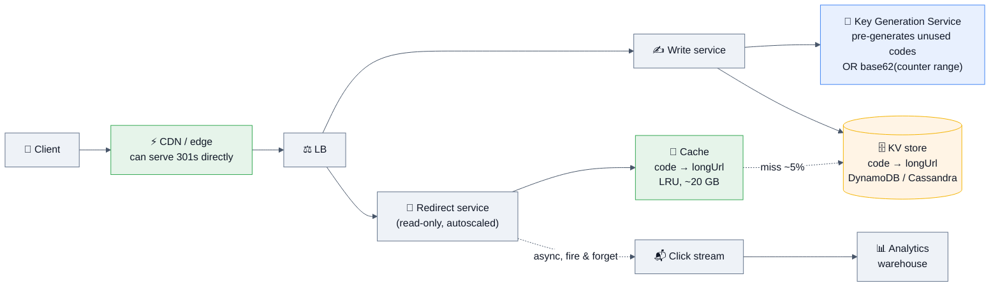

### The decisions that matter

| Decision | Options | Choose & why |
|----------|---------|--------------|
| **Code generation** | (a) Hash the URL (MD5 → base62, take 7 chars) — **collisions require a check-and-retry loop**. (b) **Counter → base62** — collision-free by construction, but sequential codes are guessable and leak your growth rate. (c) **Pre-generated key service** — a service hands out batches of unused codes to writers | **(c) or (b) with per-node ranges.** *"I'd avoid hashing because the collision check makes every write a read-then-write. A counter with each node pre-allocating a range of 10,000 needs no coordination per write and stays collision-free. To avoid guessability I'd scramble the counter (e.g. Feistel/multiply by a coprime) so codes look random but remain unique."* **That last detail is the differentiator.** |
| **Database** | RDBMS vs KV store | **KV store** — the access pattern is a pure primary-key lookup with no joins, at very high read volume. Postgres would work fine too and is a defensible answer for lower scale. |
| **Redirect code** | 301 (permanent) vs **302** (found) | **302** — a 301 is cached by browsers forever, which kills your analytics and prevents you from ever changing or expiring the target. Use 301 only if you truly want the browser to bypass you. |
| **Analytics** | Sync vs async | **Never write analytics on the redirect path.** Fire an event to a stream; the redirect must not wait for it. |
| **Custom aliases** | | A conditional insert (unique constraint) — 0 rows affected means taken. Reserve a namespace so custom aliases can't collide with generated ones. |

### Deep dives you should volunteer
- **"The read path barely touches the database."** At a 95%+ cache hit rate, 350k reads/sec becomes ~17k database reads/sec. **Say the arithmetic.**
- **Cache the negative result too** — otherwise scanning for valid codes hammers the DB (cache penetration).
- **The CDN can serve redirects directly** for hot links with a short TTL, absorbing most traffic before it reaches you.
- **Availability:** *"A URL shortener is infrastructure — a dead one breaks links in printed material. I'd run multi-region active-active for reads, since the data is immutable after creation, which makes replication trivially safe."* **Immutability making replication easy is a nice observation.**
- **Cost:** mostly cache + egress; the compute is trivial. This is a cheap system, and saying so is a good instinct.

---

## 7.3 🟢 Design a Rate Limiter ★★★★★

### Requirements
```
FUNCTIONAL:  limit requests per (user | API key | IP) per endpoint; tiered plans;
             return remaining quota; 429 + Retry-After when exceeded
NON-FUNCTIONAL: adds < 5 ms to p99 · works across 200 gateway nodes ·
                must not become a SPOF · accurate enough to enforce a paid plan
```

### Design
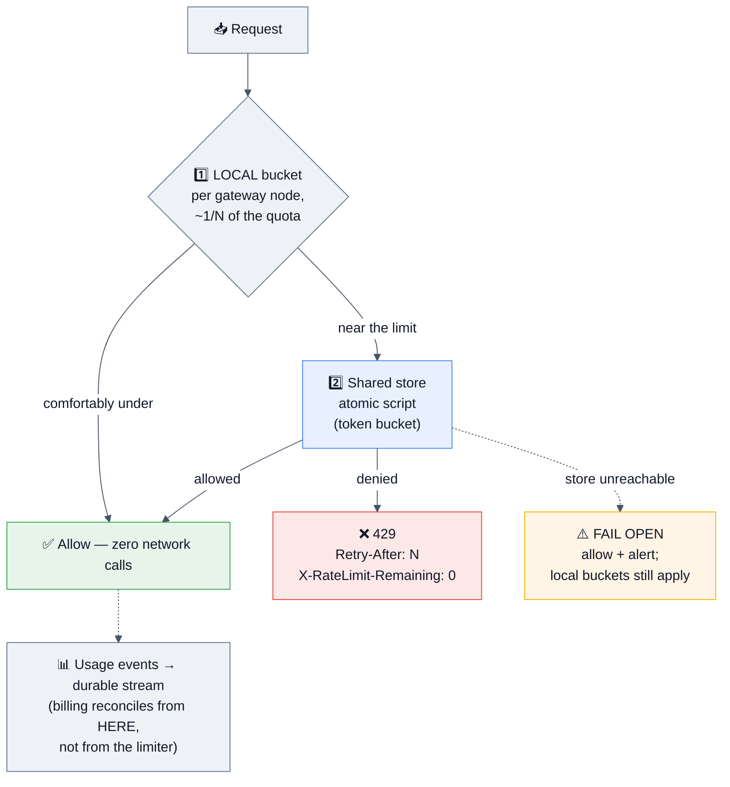

### The five things that make this answer senior
1. **Two-tier limiting.** A local bucket absorbs the common case so the shared store sees a fraction of traffic. **This is what real gateways do**, and it's also the hot-key mitigation.
2. **Atomicity.** The check-and-decrement must be one atomic operation (a Lua script / conditional update), not `GET` then `SET` — otherwise concurrent requests both pass.
3. **Fail open vs fail closed — state it explicitly.** A rate limiter usually fails **open** (serve traffic, lose protection); an auth check fails **closed**. *"Taking down the API to protect it from abuse is a worse outcome than the abuse."*
4. **Algorithm choice with a reason:** token bucket for public APIs (**bursts are a feature, not a bug** — users batch legitimately), sliding-window counter when smoothness matters, fixed window only when simplicity dominates.
5. **Billing accuracy:** if quotas are billable, **the limiter is not the ledger.** Emit usage events to a durable stream and reconcile — the limiter is optimized for latency, not for being an accounting system.

**Follow-up you'll get:** *"One customer sends 90% of the traffic."* → That's a **hot key**. The local tier handles most of it; beyond that, shard the customer's counter across N sub-keys, or give a whale customer a dedicated limiter instance.

---

## 7.4 🟡 Design Twitter / a Social Feed ★★★★★

**The most-asked full design. The whole question is really "how do you handle fan-out?"**

### Requirements & estimation
```
FUNCTIONAL:  1. Post a tweet   2. Follow users   3. View a home timeline (reverse chron)
NON-FUNCTIONAL: 200 M DAU · timeline p99 < 200 ms · read:write ≈ 25:1 ·
                timeline may be a few seconds stale · high availability

Writes:  400 M tweets/day ≈ 4,600/sec  (peak ~14,000/sec)
Reads:   10 B timeline views/day ≈ 115,000/sec  (peak ~350,000/sec)   ← the driver
Storage: 200 GB/day text; media dominates by ~400× → object storage + CDN
```

### API
```http
POST /v1/tweets                              {text, mediaIds[]}  → 201 {tweetId}
GET  /v1/feed?cursor=<opaque>&limit=20                           → 200 {tweets[], nextCursor}
POST /v1/users/{id}/follow                                       → 204
```

### The core decision: fan-out on write vs read

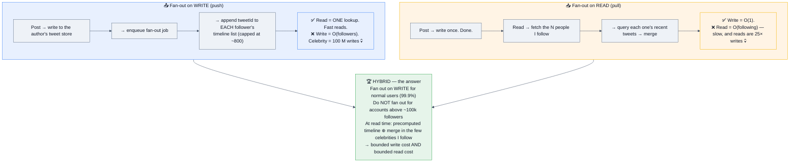

### Architecture
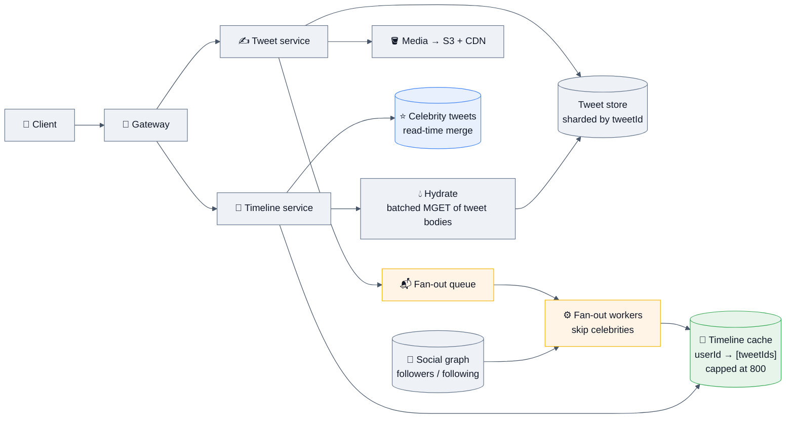

### Deep dives to volunteer
- **Cap the timeline at ~800 entries.** Nobody scrolls further; an uncapped per-user list × 200 M users is an unbounded memory leak. **Store tweet IDs, not tweet bodies** — hydrate with a batched fetch. This keeps the timeline tiny and lets each tweet be cached once rather than 500 times.
- **Don't fan out to inactive users.** ~50% of accounts haven't logged in this month — computing their timeline is pure waste. **Fan out to active users eagerly; compute lazily for the rest on login.** This alone can halve the fan-out cost.
- **The write spike:** a celebrity posting shouldn't block. Fan-out is queued and rate-limited; the user gets a 201 as soon as the tweet is durably stored.
- **Ranking:** reverse-chronological is the easy version. A ranked feed adds a scoring service (engagement prediction) over a candidate set — **say you'd keep retrieval and ranking as separate stages**, which is how real feeds work.
- **Consistency:** *"A timeline that's 5 seconds stale is invisible to users. I'd take that trade everywhere except the author's own view of their tweet — they must see it immediately, so I'd merge their own recent posts in at read time."* **That read-your-writes detail is a strong touch.**

---

## 7.5 🟡 Design a Chat / Messaging System (WhatsApp/Slack) ★★★★★

### Requirements
```
FUNCTIONAL:  1. 1:1 and group messaging   2. Online presence   3. Delivery/read receipts
             (+ history, media, push notifications when offline)
NON-FUNCTIONAL: 50 M concurrent connections · message delivery p99 < 500 ms ·
                ORDERED per conversation · no message loss · history retained
```

### Architecture
```mermaid
%%{init: {'theme':'base','themeVariables':{'background':'#ffffff','mainBkg':'#eef2f7','primaryColor':'#eef2f7','primaryTextColor':'#111827','primaryBorderColor':'#64748b','secondaryColor':'#e8f0fe','tertiaryColor':'#f1f5f9','lineColor':'#475569','textColor':'#111827','clusterBkg':'#f8fafc','clusterBorder':'#94a3b8','edgeLabelBackground':'#ffffff','titleColor':'#111827','actorBkg':'#eef2f7','actorTextColor':'#111827','actorBorder':'#64748b','actorLineColor':'#475569','signalColor':'#111827','signalTextColor':'#111827','noteBkgColor':'#fff4e5','noteTextColor':'#111827','noteBorderColor':'#d97706','labelBoxBkgColor':'#eef2f7','labelBoxBorderColor':'#64748b','labelTextColor':'#111827','loopTextColor':'#111827','altBackground':'#f8fafc'}}}%%
sequenceDiagram
    autonumber
    participant A as 📱 Alice
    participant WS1 as 🔌 WS Server 1
    participant SVC as 💬 Chat service
    participant DB as 🗄️ Message store
    participant REG as 🗺️ Session registry<br/>(user → WS server)
    participant PS as 📢 Pub/Sub bus
    participant WS2 as 🔌 WS Server 7
    participant B as 📱 Bob

    A->>WS1: send {convId, clientMsgId, text}
    WS1->>SVC: persist
    SVC->>SVC: allocate per-conversation seq number 🔑
    SVC->>DB: write (convId, seq, msg) — DURABLE FIRST
    SVC-->>WS1: ack (server msgId + seq)
    WS1-->>A: ✅ "sent" (single tick)
    SVC->>REG: where is Bob?
    REG-->>SVC: WS Server 7 (or offline)
    SVC->>PS: publish to Bob's channel
    PS->>WS2: deliver
    WS2->>B: push message
    B-->>WS2: delivery receipt
    WS2->>SVC: mark delivered → notify Alice (double tick)
    Note over SVC,B: 🔴 If Bob is OFFLINE → push notification (APNs/FCM);<br/>Bob fetches missed messages by last-seen SEQ on reconnect
```

### The decisions that matter

| Concern | Decision |
|---------|----------|
| **Transport** | **WebSocket** for bidirectional real-time. Fallback to long polling. ⚠️ **Connections are stateful** — you need a session registry mapping user → WS server, and the fleet must handle reconnect storms after a deploy (**stagger restarts, or you get 50 M simultaneous reconnects**). |
| **Ordering** ⭐ | **A per-conversation monotonic sequence number** allocated server-side — **not wall-clock time** (clocks skew and are non-monotonic) and **not a global sequence** (a coordination bottleneck). Clients sort by seq and can detect gaps. **This is the detail interviewers probe.** |
| **Durability** | **Persist before acking.** The "sent" tick means *durably stored*, not *delivered*. Delivery and read receipts are separate states. |
| **Delivery** | **Do NOT deliver via fire-and-forget pub/sub alone.** Pub/Sub is the *notification*; the durable store is the truth. A client that reconnects fetches everything after its last-seen seq — so a lost notification costs a delay, not a message. **Volunteer this; it's the trap.** |
| **Storage** | Wide-column (Cassandra/DynamoDB) partitioned by `convId`, clustered by `seq` descending → "last 50 messages" is one efficient partition read. Media in object storage. |
| **Group chat** | Fan out to N members. For small groups, write to each member's inbox. For **very large groups/channels (Slack-style, 100k members)**, **don't fan out** — members read from the channel's log by offset (the celebrity problem again, in a different costume). |
| **Presence** | A TTL'd key refreshed by a heartbeat every ~10 s; **absence of the key = offline**, which needs no cleanup job. Presence is high-churn and best kept out of the durable store. |
| **E2E encryption** | If required (WhatsApp/Signal), the server stores **ciphertext only** — which means **no server-side search, no server-side moderation, and key management/multi-device becomes the hard problem.** Naming those consequences is what scores. |

---

## 7.6 🟡 Design a Video Streaming Service (YouTube/Netflix) ★★★★★

### Requirements & the crucial reframe
```
FUNCTIONAL:  1. Upload a video  2. Stream/watch  3. Search & recommend
NON-FUNCTIONAL: start playback < 2 s · adaptive quality · 99.99% availability ·
                global audience · COST is a first-class constraint

⚡ THE REFRAME: this is not a database problem, it's a BANDWIDTH AND ENCODING problem.
   1 M concurrent viewers × 5 Mbps = 5 Tbps of egress.
   At cloud egress rates that is millions of dollars per month from origin.
   → The CDN is not an optimization. It IS the system.
```

### Architecture
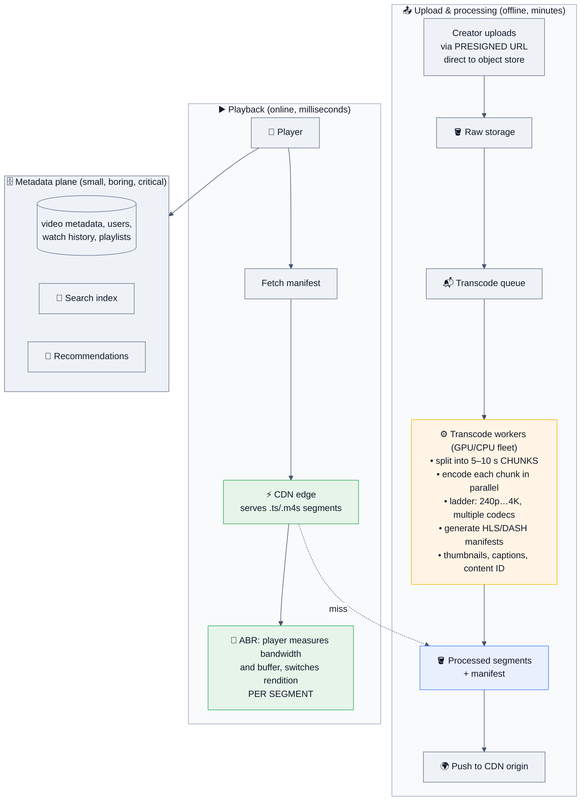

### Deep dives that score
- **Chunked, parallel transcoding.** A 2-hour film encoded serially takes hours; split into 5–10 second chunks and encode them across a fleet in parallel, then stitch. **This is the single most important upload-path insight.**
- **Adaptive bitrate (HLS/DASH):** the manifest lists renditions; the **player** picks per segment based on measured bandwidth and buffer level. Server-side you just serve files. **Start with a low rendition for fast startup, then ramp** — that's how you hit "playback in under 2 seconds."
- **CDN economics:** *"Netflix built **Open Connect** — putting their own appliances inside ISPs — precisely because commercial CDN egress at their scale was untenable. That's the extreme end of the cost argument."*
- **Storage tiering:** the long tail of videos is watched almost never. Keep hot content on fast storage and at the edge; tier cold content to archive. **A small fraction of videos generates the vast majority of views** — design around that skew.
- **Live streaming is a different system:** low-latency protocols (LL-HLS/WebRTC), no time to transcode the whole thing, and you can't pre-warm the CDN. **Say that live and VOD are different problems** if asked.

---

## 7.7 🔴 Design a Ride-Hailing Service (Uber/Lyft) ★★★★★

### Requirements & estimation
```
FUNCTIONAL:  1. Drivers publish location  2. Rider requests a ride → match a nearby driver
             3. Live trip tracking
NON-FUNCTIONAL: matching < 5 s · location updates every 4 s · 99.99% for the matching path ·
                geographic locality (a Mumbai ride never needs Chicago data)

Location writes: 1 M active drivers ÷ 4 s = 250,000 writes/sec  ← the hardest number
Ride requests:   ~5,000/sec peak
```

### Architecture
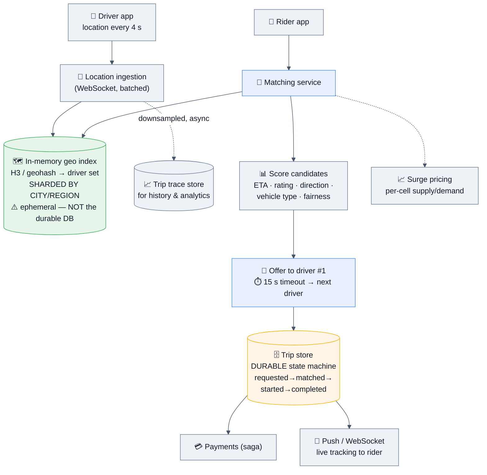

### The decisions that matter
- **250k location writes/sec must never touch the primary database.** Keep the live index **in memory, sharded by city**, and downsample to durable storage asynchronously. **This is the single biggest insight in this design** — most candidates try to write every ping to a database.
- **Geographic sharding is natural and near-perfect here** — rides don't cross cities, so each region is an independent failure domain and scales independently. **Say that the shard key falls out of the domain**, which is the ideal case.
- **Geospatial index:** geohash (query the cell **+ 8 neighbours**), quadtree (adapts to density — good for cities), or **H3 hexagons** (uniform neighbour distance — **why Uber built it**).
- **Matching is an assignment problem.** Greedy nearest-driver is the baseline; batching requests over a few seconds and solving a global assignment yields better outcomes but adds latency. **Name the trade-off** — this is exactly what Uber does with batched matching.
- **The offer timeout:** a driver who doesn't respond in ~15 s must not strand the rider. Explicit timeouts and a fallback chain.
- **The trip is a durable state machine** with idempotent transitions — a retried "start trip" must not create two trips.
- **Payments via saga** with compensating actions, never 2PC.

---

## 7.8 🔴 Design a File Storage Service (Dropbox/Google Drive) ★★★★☆

### Requirements
```
FUNCTIONAL:  1. Upload/download files  2. Sync across devices  3. Share
NON-FUNCTIONAL: files up to 50 GB · resumable uploads · efficient sync (don't resend
                a 1 GB file for a 1-byte change) · strong durability · conflict handling
```

### The core insight: chunking + content-addressed dedup
```mermaid
%%{init: {'theme':'base','themeVariables':{'background':'#ffffff','mainBkg':'#eef2f7','primaryColor':'#eef2f7','primaryTextColor':'#111827','primaryBorderColor':'#64748b','secondaryColor':'#e8f0fe','tertiaryColor':'#f1f5f9','lineColor':'#475569','textColor':'#111827','clusterBkg':'#f8fafc','clusterBorder':'#94a3b8','edgeLabelBackground':'#ffffff','titleColor':'#111827','actorBkg':'#eef2f7','actorTextColor':'#111827','actorBorder':'#64748b','actorLineColor':'#475569','signalColor':'#111827','signalTextColor':'#111827','noteBkgColor':'#fff4e5','noteTextColor':'#111827','noteBorderColor':'#d97706','labelBoxBkgColor':'#eef2f7','labelBoxBorderColor':'#64748b','labelTextColor':'#111827','loopTextColor':'#111827','altBackground':'#f8fafc'}}}%%
flowchart LR
    F["📄 File 1 GB"] --> CH["✂️ Split into ~4 MB chunks<br/>(content-defined chunking, so an insert<br/>doesn't shift every subsequent boundary)"]
    CH --> H["🔐 Hash each chunk<br/>SHA-256 → chunkId"]
    H --> Q{"Chunk already<br/>in storage?"}
    Q -->|"yes (dedup)"| SKIP["⏭️ Skip upload<br/>just reference it"]
    Q -->|"no"| UP["⬆️ Upload chunk<br/>(presigned, direct to object store)"]
    UP --> OBJ["🪣 Chunk store<br/>content-addressed, immutable"]
    SKIP --> META
    OBJ --> META[("🗄️ Metadata DB<br/>file → ordered [chunkIds]<br/>+ version, owner, ACL")]
    META --> SYNC["🔄 Sync service<br/>notify other devices<br/>of the metadata delta"]

    style CH fill:#e8f0fe,stroke:#4285f4,color:#111827
    style Q fill:#fff4e5,stroke:#f4b400,color:#111827
    style SKIP fill:#e6f4ea,stroke:#34a853,color:#111827
    style OBJ fill:#eef2f7,stroke:#64748b,color:#111827
    style META fill:#e6f4ea,stroke:#34a853,color:#111827
```

**Why this design wins:** a 1-byte change re-uploads **one 4 MB chunk**, not 1 GB. A file uploaded by 1000 users is stored **once**. A failed upload resumes at the chunk boundary. And the metadata DB — small, relational, transactional — is completely separate from the blob store, which is large, immutable, and cheap.

### Deep dives
- **Metadata vs blob separation** is the architectural spine: metadata is small and needs transactions; blobs are huge and need cheap durable storage. **Never put files in the database.**
- **Content-defined chunking (rolling hash / Rabin fingerprint)** rather than fixed offsets, so inserting a byte at the start doesn't change every downstream chunk boundary. **This detail is a genuine differentiator.**
- **Sync:** clients hold a cursor; the server sends the metadata delta since that cursor. Long-poll or WebSocket for push. Compare local and remote versions to compute the minimal transfer.
- **Conflicts:** last-write-wins loses data. **Dropbox's answer — create a "conflicted copy" — is the honest one**: don't silently pick a winner for user files. (For structured collaborative data, CRDTs/OT — see §7.18.)
- **Sharing/ACLs:** permissions on the metadata; downloads via **short-lived presigned URLs** so the object store enforces expiry without your servers proxying bytes.
- **Cost:** dedup + compression + cold tiering is the entire cost story. **Client-side encryption breaks dedup across users** — name that trade-off if security comes up.

---

## 7.9 🟡 Design a Notification System ★★★★☆

### Requirements
```
FUNCTIONAL:  send push / email / SMS / in-app; multiple event types; PER-USER, PER-CHANNEL,
             PER-EVENT-TYPE preferences; templating & localization
NON-FUNCTIONAL: 10 M notifications/day · at-least-once with dedup · respect quiet hours ·
                third-party providers WILL fail and rate-limit you
```

```mermaid
%%{init: {'theme':'base','themeVariables':{'background':'#ffffff','mainBkg':'#eef2f7','primaryColor':'#eef2f7','primaryTextColor':'#111827','primaryBorderColor':'#64748b','secondaryColor':'#e8f0fe','tertiaryColor':'#f1f5f9','lineColor':'#475569','textColor':'#111827','clusterBkg':'#f8fafc','clusterBorder':'#94a3b8','edgeLabelBackground':'#ffffff','titleColor':'#111827','actorBkg':'#eef2f7','actorTextColor':'#111827','actorBorder':'#64748b','actorLineColor':'#475569','signalColor':'#111827','signalTextColor':'#111827','noteBkgColor':'#fff4e5','noteTextColor':'#111827','noteBorderColor':'#d97706','labelBoxBkgColor':'#eef2f7','labelBoxBorderColor':'#64748b','labelTextColor':'#111827','loopTextColor':'#111827','altBackground':'#f8fafc'}}}%%
flowchart LR
    SRC["📢 Event sources<br/>order shipped, price drop,<br/>abandoned cart…"] --> ING["📥 Ingest API<br/>(idempotency key per event)"]
    ING --> Q1["📬 Event queue"]
    Q1 --> PREF["⚙️ Preference & policy engine<br/>• is this user opted in for THIS type/channel?<br/>• quiet hours / timezone<br/>• frequency capping & bundling<br/>• dedup within a window"]
    PREF -->|"suppressed"| DROP["🚫 Drop + log the reason<br/>(auditability matters)"]
    PREF --> TPL["📝 Template + localize"]
    TPL --> Q2["📬 Per-channel queues<br/>(isolated = BULKHEAD)"]
    Q2 --> W1["📱 Push worker → APNs/FCM"]
    Q2 --> W2["✉️ Email worker → SES/SendGrid"]
    Q2 --> W3["💬 SMS worker → Twilio"]
    W1 & W2 & W3 --> RETRY{"failure?"}
    RETRY -->|"transient"| BACK["🔁 backoff + jitter"]
    RETRY -->|"permanent / N attempts"| DLQ["☠️ DLQ + alert"]
    W1 & W2 & W3 --> TRACK[("📊 Delivery tracking<br/>sent/delivered/opened/bounced")]

    style PREF fill:#e6f4ea,stroke:#34a853,color:#111827
    style Q2 fill:#e8f0fe,stroke:#4285f4,color:#111827
    style DLQ fill:#fce8e6,stroke:#ea4335,color:#111827
    style TRACK fill:#eef2f7,stroke:#64748b,color:#111827
    style DROP fill:#fff4e5,stroke:#f4b400,color:#111827
```

**The points that separate a good answer:**
- **Per-channel queues are bulkheads** — if the SMS provider is down and its queue backs up, email and push must keep flowing.
- **Frequency capping and bundling** ("3 people liked your post" instead of three notifications) is a **product** requirement that lands in the architecture. Volunteering it shows product sense.
- **Idempotency at ingest** — the same business event delivered twice must not notify twice.
- **Provider rate limits and fallback** — APNs/FCM/Twilio all throttle. Token-bucket per provider, plus a secondary provider for critical channels.
- **The preference engine is the actual complexity**, not the sending. Say so.
- **Compliance:** unsubscribe handling is legally required for email (CAN-SPAM/GDPR) and must be honoured immediately and globally.

---

## 7.10 🔴 Design a Web Crawler / Search Engine ★★★★☆

```
FUNCTIONAL:  crawl the web, index pages, serve ranked search results
NON-FUNCTIONAL: 1 B pages/month ≈ 400 pages/sec sustained · POLITENESS (respect robots.txt
                and per-domain rate limits) · freshness · dedup · resilient to traps
```

```mermaid
%%{init: {'theme':'base','themeVariables':{'background':'#ffffff','mainBkg':'#eef2f7','primaryColor':'#eef2f7','primaryTextColor':'#111827','primaryBorderColor':'#64748b','secondaryColor':'#e8f0fe','tertiaryColor':'#f1f5f9','lineColor':'#475569','textColor':'#111827','clusterBkg':'#f8fafc','clusterBorder':'#94a3b8','edgeLabelBackground':'#ffffff','titleColor':'#111827','actorBkg':'#eef2f7','actorTextColor':'#111827','actorBorder':'#64748b','actorLineColor':'#475569','signalColor':'#111827','signalTextColor':'#111827','noteBkgColor':'#fff4e5','noteTextColor':'#111827','noteBorderColor':'#d97706','labelBoxBkgColor':'#eef2f7','labelBoxBorderColor':'#64748b','labelTextColor':'#111827','loopTextColor':'#111827','altBackground':'#f8fafc'}}}%%
flowchart LR
    SEED["🌱 Seed URLs"] --> FR["📋 URL Frontier<br/>🔑 politeness queues:<br/>one queue PER DOMAIN,<br/>+ priority queues by importance"]
    FR --> FET["🕷️ Fetcher fleet<br/>robots.txt cache · DNS cache ·<br/>per-domain delay · timeouts"]
    FET --> PARSE["📄 Parse<br/>extract text + links"]
    PARSE --> DEDUP{"🔍 Seen this content?<br/>SimHash / MinHash<br/>near-duplicate detection"}
    DEDUP -->|"duplicate"| DROP2["🚫 Drop"]
    DEDUP -->|"new"| STORE["🪣 Document store"]
    PARSE --> URLF{"🔍 Seen this URL?<br/>Bloom filter over<br/>normalized URLs"}
    URLF -->|"new"| FR
    STORE --> IDX["📚 Indexer<br/>tokenize → inverted index<br/>term → posting list"]
    IDX --> SRCH[("🔎 Search index<br/>sharded by term or by doc")]
    SRCH --> QRY["❓ Query service<br/>retrieve → BM25 →<br/>rerank → snippet"]

    style FR fill:#e6f4ea,stroke:#34a853,color:#111827
    style DEDUP fill:#fff4e5,stroke:#f4b400,color:#111827
    style URLF fill:#fff4e5,stroke:#f4b400,color:#111827
    style IDX fill:#e8f0fe,stroke:#4285f4,color:#111827
    style SRCH fill:#e8f0fe,stroke:#4285f4,color:#111827
    style QRY fill:#e6f4ea,stroke:#34a853,color:#111827
```

**The parts interviewers actually probe:**
- **The URL frontier is the heart of the design** — it must enforce **politeness (one queue per domain with a delay)** while maintaining **priority** (crawl important/fresh pages more often). The standard structure is two-level: front queues for priority, back queues for per-host politeness.
- **Dedup at two levels:** URL-level (normalize, then a Bloom filter over billions of URLs — ~1.2 GB for 1 B URLs) and **content-level (SimHash for near-duplicates** — the same article on 50 mirrors).
- **Traps:** infinite calendars, session IDs in URLs, deep dynamic paths, crawler tarpits → depth limits, URL-pattern heuristics, per-domain page budgets.
- **Freshness:** re-crawl scheduling based on observed change rate — a news site hourly, a static page monthly.
- **Ranking:** the retrieval stage (BM25 over the inverted index) and the ranking stage (link graph/PageRank + features + learning-to-rank) are **separate**, and in 2026 you'd add **semantic/vector retrieval in a hybrid**.

---

## 7.11 🔴 Design a RAG / LLM-powered Q&A System 🆕 ★★★★☆

**This is the 2026 question. §3.9 has the architecture; here's how to *deliver* it.**

```
FUNCTIONAL:  1. Ingest tenant documents  2. Answer questions grounded in them, with citations
             3. Multi-turn conversation
NON-FUNCTIONAL: TTFT (time to first token) < 1 s · strict tenant isolation ·
                cost per query tracked & capped · answers must be attributable
```

### Delivery order
1. **Two pipelines, drawn separately:** the **offline** ingestion path (chunk → embed → index) and the **online** query path (retrieve → rerank → generate). **Candidates who draw one blob lose the thread.**
2. **Retrieval is the product.** *"Most bad RAG output is a retrieval failure, not a generation failure — so I'd invest in hybrid retrieval (BM25 + vector) and a reranker before I touched the prompt."*
3. **Tenant isolation at the retrieval layer.** Metadata filters must be applied **inside** the vector search, not after — post-filtering leaks documents and also breaks your top-k. **This is the security answer and it wins points.**
4. **Semantic caching** in front, scoped by tenant + model + prompt version, with the threshold as a tunable and near-threshold hits logged for review.
5. **Cost:** `requests × (input + output tokens) × $/token`. Levers: model routing (small model first), caching, context trimming, and reranking to send fewer tokens.
6. **Evals:** *"I'd build a golden set of question/answer/expected-source triples, run it on every prompt or model change, measure retrieval recall separately from answer quality, and add online feedback signals. Without this you cannot tell whether a change helped."*
7. **Failure modes:** the model is a **slow, expensive, unreliable dependency** — timeout, fallback to a cheaper model or to plain search results, and never let it be a hard dependency for the whole page.
8. **Guardrails:** prompt-injection defence (especially if the model has tools), PII handling, groundedness checks, and citation verification.

---

## 7.12 🟡 Design a Leaderboard ★★★★☆

```
FUNCTIONAL:  submit score · top N · my rank · rank neighbours · daily/weekly/all-time
NON-FUNCTIONAL: 100 M players · 500k score updates/sec peak · rank read p99 < 100 ms
```
| Concern | Decision |
|---------|----------|
| **Structure** | A **sorted set** (skip list + hash map): O(log N) insert/rank, O(log N + M) range. |
| **Write volume** | 500k/sec exceeds one node → **pre-aggregate in the app** (publish a player's best score every few seconds, not every event) and **shard by region/tier**. This typically cuts writes 10–100×. |
| **Global "my rank"** | Cheap within a shard, **genuinely hard across shards.** Approximate with per-shard score histograms: count players above your score in every shard, refine exactly within your own. **Say that exact global ranking of 100 M live scores is hard** — the honesty beats a hand-wave. |
| **Top-N global** | Merge each shard's top-N — exact and cheap for the head. |
| **Ties** | Composite score: `points × 1e10 + (MAX_TS − first_achieved_ts)` so earlier achievers win. ⚠️ Sorted-set scores are IEEE-754 doubles — **exact only to 2^53**, so watch precision. |
| **Seasons** | A new key per season; archive the final standings before dropping the old key. |
| **Durability** | The authoritative scores live in the durable DB; the leaderboard is a rebuildable serving layer. |

---

## 7.13 🔴 Design a Payment System ★★★★★

```
FUNCTIONAL:  charge a customer · refund · payouts · handle provider webhooks
NON-FUNCTIONAL: NEVER double-charge · never lose a transaction · full audit trail ·
                strong consistency · reconcile with the provider daily
```
```mermaid
%%{init: {'theme':'base','themeVariables':{'background':'#ffffff','mainBkg':'#eef2f7','primaryColor':'#eef2f7','primaryTextColor':'#111827','primaryBorderColor':'#64748b','secondaryColor':'#e8f0fe','tertiaryColor':'#f1f5f9','lineColor':'#475569','textColor':'#111827','clusterBkg':'#f8fafc','clusterBorder':'#94a3b8','edgeLabelBackground':'#ffffff','titleColor':'#111827','actorBkg':'#eef2f7','actorTextColor':'#111827','actorBorder':'#64748b','actorLineColor':'#475569','signalColor':'#111827','signalTextColor':'#111827','noteBkgColor':'#fff4e5','noteTextColor':'#111827','noteBorderColor':'#d97706','labelBoxBkgColor':'#eef2f7','labelBoxBorderColor':'#64748b','labelTextColor':'#111827','loopTextColor':'#111827','altBackground':'#f8fafc'}}}%%
sequenceDiagram
    autonumber
    participant C as Client
    participant P as 💳 Payment service
    participant DB as 🗄️ Ledger (ACID)
    participant PSP as 🏦 Provider (Stripe/PSP)

    C->>P: POST /charge (Idempotency-Key: k)
    P->>DB: INSERT attempt(k, hash, 'in_progress') — UNIQUE(k)
    alt key already exists & succeeded
        DB-->>P: conflict
        P-->>C: ✅ return the STORED response — no side effect
    else first attempt
        DB-->>P: inserted
        P->>DB: write ledger entries (sum = 0), status 'pending'
        Note over P,PSP: ⚠️ the external call is OUTSIDE the DB transaction
        P->>PSP: charge (with the PSP's own idempotency key)
        PSP-->>P: succeeded / failed / TIMEOUT ⏱️
        alt timeout — the dangerous case
            Note over P: DO NOT assume failure.<br/>Mark 'unknown', reconcile via the PSP's<br/>webhook or a status poll. NEVER blind-retry a charge.
        end
        P->>DB: finalize ledger + attempt status
        P-->>C: 201 result
    end
```
**The non-negotiables to state:** idempotency keys with a **unique constraint**; a **double-entry, append-only ledger** where every transaction sums to zero and corrections are reversing entries (**never updates**); money as integer minor units or exact decimal, **never floating point**; **the external call must never happen inside the database transaction**; webhooks must be **signature-verified, idempotent, and retried**; and a **daily reconciliation job** against the provider — *"assume you will diverge, and design the process that finds it."*

---

## 7.14 🟡 Design a Ticket Booking System (Ticketmaster/BookMyShow) ★★★★☆

**The whole question is the seat-reservation race.**
```
The core problem: 100,000 people, 10,000 seats, everyone clicking the same seat.

✅ Design:
1. SEAT HOLD, not instant booking: a conditional update grabs the seat with a TTL.
      UPDATE seats SET status='held', held_by=?, hold_expires=now()+'10 min'
      WHERE seat_id=? AND status='available'
   → 0 rows affected means someone else won. ATOMIC, no lock held across user think-time.
2. A sweeper (or a TTL) releases expired holds back to 'available'.
3. Payment converts hold → booked, in a transaction.
4. WAITING ROOM upstream: admit users at a controlled rate so the seat-map service
   isn't hit by 100k concurrent users. This is what Ticketmaster actually does.
5. The seat map is read-heavy and can be a few seconds stale — cache it, and accept that
   a user may click a seat that's just been taken. The conditional update is the truth.

❌ What NOT to do: SELECT available seats → user picks → INSERT booking.
   That's a check-then-act race, and at this scale it WILL double-book.
```
**Follow-ups:** "Best available seats"? → Precompute contiguous-block candidates. "Fairness"? → The waiting room with a randomized queue position beats pure first-come, which rewards bots.

---

## 7.15 🟡 Design a Distributed Cache ★★★★☆

```
FUNCTIONAL:  get/put with TTL, eviction, cluster membership
NON-FUNCTIONAL: p99 < 1 ms · scale to 100 nodes · survive node loss
```
| Concern | Decision |
|---------|----------|
| **Partitioning** | **Consistent hashing with virtual nodes** (§2.10) so adding/removing a node moves ~1/N of keys, not everything |
| **Client routing** | A smart client caches the slot→node map and goes straight to the owner — no proxy hop. Handle redirect responses to refresh the map |
| **Replication** | Each key on the next R distinct physical nodes clockwise; read from any, write to the primary (or quorum) |
| **Eviction** | **Approximate LRU/LFU via sampling** — exact LRU costs two pointers per key, which is gigabytes of bookkeeping at 100 M keys |
| **Membership/failure** | Gossip protocol + heartbeats; a majority must agree before marking a node failed |
| **Consistency** | **Explicitly weak.** A cache that tries to be strongly consistent has become a database |
| **Hot keys** | The one problem partitioning **cannot** solve → client-side L1 cache, key splitting, or replication of the hot value |

---

## 7.16 🟡 Design a Job Scheduler / Cron Service ★★★★☆

See **§6 H3** for the algorithm. The architecture points: a durable schedule store sorted by `run_at`; workers **atomically claim** due jobs with a visibility timeout (`SELECT ... FOR UPDATE SKIP LOCKED` or an equivalent conditional move); a **reaper** returns jobs from crashed workers; **shard by job hash** so there's no global bottleneck; **jitter the poll interval** across workers; a **two-tier hot/cold split** so the hot index only holds the next 24 hours; **at-least-once execution means handlers must be idempotent**; and retries with backoff into a dead-letter state.
**The follow-up:** *"10 M jobs all scheduled for midnight."* → A thundering herd. Admit at a controlled rate, spread execution with jitter, and make sure the downstream can absorb it — **or the scheduler becomes a DDoS against your own services.**

---

## 7.17 🟡 Design an Ad-Click Aggregator / Metrics Pipeline ★★★★☆

```
FUNCTIONAL:  ingest click events, serve aggregated counts by minute/hour/day and by dimension
NON-FUNCTIONAL: 1 M events/sec · query latency < 1 s · no double counting ·
                late events tolerated up to 1 hour
```
```
Ingest      → lightweight collector (validate + enrich only) → Kafka partitioned by adId
Pre-aggregate → the collector batches locally and flushes every second
                (1 M events/sec becomes far fewer downstream writes — THE key lever)
Process     → stream processor (Flink/Spark Streaming) with WINDOWING
              • event time, not processing time
              • WATERMARKS to handle late events
              • checkpointing for exactly-once state
Store       → OLAP/columnar store (ClickHouse/Druid) for fast dimensional roll-ups
Serve       → pre-computed minute/hour/day rollups; the query hits the coarsest
              granularity that answers the question
Correctness → dedup by eventId (a Bloom filter or a windowed key store);
              a nightly batch recompute reconciles the streaming counts
              → this is LAMBDA architecture, and it's justified here because
                advertisers get billed from these numbers
```
**The framing:** *"Because this is billable, I'd accept the cost of running both a streaming path for freshness and a batch path for correctness, and reconcile. For a non-billable dashboard I'd run streaming only and skip the complexity."* **Justifying lambda architecture with a business reason, rather than defaulting to it, is the senior move.**

---

## 7.18 🔴 Design a Collaborative Editor (Google Docs) ★★★★☆

```
The core problem: two users edit the same character position simultaneously.
Naive last-write-wins loses data and produces divergent documents.
```
| Approach | How it works | Trade-off |
|----------|--------------|-----------|
| **Operational Transformation (OT)** | Operations are *transformed* against concurrent ones so all replicas converge (insert at position 5 becomes position 6 if someone inserted before it) | **What Google Docs uses.** Requires a central server to order operations; the transformation functions are notoriously hard to get right |
| **CRDTs** ⭐ | Data types designed so concurrent operations commute — every character gets a unique, ordered identifier | **Peer-to-peer capable, no central ordering needed.** Cost: metadata grows (tombstones for deleted characters), needs periodic compaction |
**Architecture:** WebSocket per client; a document server (or per-document actor) owning the ordering; the operation log persisted for recovery and history; periodic **snapshots** so a document doesn't require replaying a million operations; **presence and cursors** as ephemeral pub/sub state (never persisted); and offline edits reconciled on reconnect.
**Say this:** *"The interesting scaling property is that a document is a natural shard — one document's traffic goes to one owner process, so this scales horizontally by document count trivially. What doesn't scale is a single document with 10,000 simultaneous editors, and I'd handle that as a product decision (view-only above N editors) rather than an engineering one."*

---

## 7.19 The design-round question bank

| Category | Questions |
|----------|-----------|
| **Classic (must be able to do cold)** | URL shortener · Twitter feed · Chat · Rate limiter · Web crawler · Dropbox · YouTube · Uber · Instagram · Notification service |
| **Product-flavoured** | Ticketmaster · Airbnb search · DoorDash · Yelp/nearby · E-commerce checkout · Payment system · Shopping cart · Flash sale |
| **Infrastructure** | Distributed cache · Message queue · Job scheduler · Distributed lock service · Key-value store · Object store · Load balancer · Metrics/monitoring system · CI/CD system |
| **Data** | Ad-click aggregator · Real-time analytics · Data warehouse ingestion · CDC pipeline · Recommendation system · A/B testing platform |
| **Real-time** | Collaborative editor · Multiplayer game backend · Live streaming · Stock ticker · Presence system |
| **2026 / AI** 🆕 | RAG Q&A system · LLM inference serving · Semantic search · AI agent platform · Feature store · ML training pipeline · Content moderation with ML |

---
# 8. 🏭 Real Production Architectures

> **Why this section matters:** citing a real system with a specific detail is the fastest way to signal that you read beyond interview prep. **But only cite what you can defend** — a name-drop you can't unpack is worse than none.

## 8.1 The systems worth knowing

| Company | The architecture & the specific detail | The lesson to quote |
|---------|---------------------------------------|---------------------|
| **Google — Spanner** | Globally distributed, **externally consistent** SQL. Achieves it with **TrueTime** — GPS + atomic clocks giving a bounded uncertainty interval — and commit-wait: the transaction waits out the uncertainty before acking. | *"Spanner shows that strong consistency across regions is possible, but they had to buy atomic clocks to do it. The cost of consistency is latency, and TrueTime just makes that cost explicit and bounded."* |
| **Google — Bigtable / GFS / MapReduce** | The lineage behind HBase, HDFS, and Hadoop. Sorted, sparse, distributed maps; a single master with chunk servers. | The papers that founded the field — worth having read the abstracts. |
| **Amazon — Dynamo** | Leaderless, **consistent hashing with virtual nodes**, quorums (`R+W>N`), vector clocks, hinted handoff, read repair, Merkle-tree anti-entropy. | *"Dynamo is where consistent hashing, quorums, and eventual consistency entered mainstream engineering. DynamoDB is the managed descendant, though it added strong-consistency options."* |
| **Amazon — cell-based architecture & shuffle sharding** | Services partitioned into independent cells; customers assigned random *pairs* of cells so two customers rarely share the same combination. | *"Shuffle sharding turns 'one bad tenant takes down everyone' into 'one bad tenant affects a tiny, non-overlapping fraction.' It's the cheapest blast-radius reduction I know."* |
| **Netflix — Open Connect** | Netflix built and installed **their own CDN appliances inside ISPs** rather than paying commercial CDN egress. | *"At sufficient scale, egress cost stops being a line item and becomes an architecture."* |
| **Netflix — Chaos Monkey / Simian Army** | Deliberately kills production instances during business hours. | *"An untested failover is a hypothesis. Netflix institutionalized testing it."* |
| **Netflix — EVCache** | A tiered, multi-region Memcached-based caching layer with cross-region replication and careful warm-up. | Cache warming and regional failover are the hard parts at scale, not command latency. |
| **Meta — TAO** | A read-optimized, eventually-consistent **graph cache** over sharded MySQL for the social graph. Handles the read:write skew (billions of reads, comparatively few writes). | *"Facebook's social graph runs on MySQL underneath a purpose-built caching layer. The 'boring' database plus a smart cache beat exotic stores."* |
| **Meta — memcache at scale** | The paper on "Scaling Memcache at Facebook" covers leases (stampede prevention), gutter pools, and regional invalidation. | The **lease** mechanism is a formal answer to the cache-stampede problem. |
| **Uber — H3** | Hexagonal hierarchical geospatial index, built because **hexagons have uniform neighbour distance** (unlike squares, where diagonal neighbours are further away). | *"They built a new geo-index because the geometry of squares was wrong for a dispatch problem."* |
| **Uber — Schemaless** | An append-only sharded datastore built on MySQL after moving off Postgres. | Domain-fit beats general-purpose at extreme scale. |
| **Twitter/X — timelines** | Fan-out-on-write into per-user Redis lists **capped at ~800 entries**, with the tweets themselves stored elsewhere and hydrated at read time. | *"Cap everything, and store IDs rather than objects."* |
| **Stripe** | Idempotency keys as a public API primitive, double-entry ledgers, and extensive reconciliation. | *"Stripe made idempotency a documented part of the API contract — that's a design decision, not an implementation detail."* |
| **Notion** | Sharded Postgres: **480 logical shards over 32 physical hosts**, sharded by workspace so nearly all transactions are single-shard. The trigger to shard was an **operational limit (vacuum stalling, transaction-ID wraparound)**, not raw QPS. | *"Logical shards ≫ physical shards makes resharding a move, not a rehash — and the trigger to shard should be a concrete operational limit, not a hunch."* |
| **Figma** | Scaled Postgres ~100× over 4 years: **vertical partitioning first** (splitting table groups into separate clusters), then horizontal sharding behind **DBProxy**, a query-parsing shard router. | *"Do the cheap scaling work first. Vertical partitioning bought them years at a fraction of the risk."* |
| **Shopify — pods** | Customers partitioned into isolated "pods," each a full stack. Flash sales in one pod can't affect another. | Cell architecture applied to commerce. |
| **Cloudflare** | Anycast everywhere, edge compute (Workers), and a strong culture of **public, detailed incident postmortems**. | Their postmortems are among the best free system-design education available. |
| **Discord** | Moved trillions of messages to **ScyllaDB**, with a Rust "data service" in front to coalesce concurrent requests for the same row — turning a hot-partition problem into a single query. | *"Request coalescing at the data layer is an underrated hot-key fix."* |
| **Slack** | Per-workspace sharding; a job queue that famously outgrew Redis and was rebuilt on Kafka as a durable buffer in front of it. | *"When a queue's retention needs exceed memory, that's the signal to move from Redis to a log."* |
| **LinkedIn — Kafka** | Kafka was built at LinkedIn to unify the fragmented pipeline of point-to-point data integrations. | *"Kafka's origin story is the log as a universal integration primitive."* |
| **OpenAI / Anthropic-era AI infra** 🆕 | Inference serving with continuous batching, KV-cache reuse, prefix caching, model routing, and semantic caching; retrieval quality as the core product problem. | The 2025–2026 growth area — see §3.9. |

## 8.2 The papers & posts worth having read (even just the abstracts)

| Paper / post | The one idea |
|--------------|--------------|
| **Dynamo** (Amazon, 2007) | Consistent hashing + quorums + eventual consistency in production |
| **Bigtable** (Google, 2006) | A sparse, sorted, distributed map; the LSM lineage |
| **MapReduce** (Google, 2004) | Move the computation to the data |
| **GFS** (Google, 2003) | Commodity hardware + replication beats reliable hardware |
| **Spanner** (Google, 2012) | TrueTime; bounded clock uncertainty enables external consistency |
| **Raft** (Ongaro & Ousterhout, 2014) | Consensus you can actually understand and implement |
| **The Tail at Scale** (Dean & Barroso, 2013) | **Why p99 matters and how hedged requests fix it** — the most quotable paper in this list |
| **Scaling Memcache at Facebook** (2013) | Leases, stampedes, and cache invalidation at scale |
| **Kafka** (LinkedIn, 2011) | The distributed commit log as an integration backbone |
| **CAP Twelve Years Later** (Brewer, 2012) | CAP is a partition-time choice, not a permanent label |
| **Harvest & Yield** (Fox & Brewer) | Degrade *partially* instead of failing totally — the formal basis for graceful degradation |
| **Amazon Builders' Library** | Timeouts, retries, jitter, load shedding, and cell architecture, written by people who operate it |

> [!TIP]
> **How to cite in an interview:** *"This is essentially the Dynamo model — consistent hashing with virtual nodes and tunable quorums — which fits because our access pattern is key-based and we can tolerate eventual consistency on this path."* **One sentence, tied to the decision.** Not a lecture.

---

# 9. 🔥 Common Failures & Famous Outages

## 9.1 The failure catalogue

```mermaid
%%{init: {'theme':'base','themeVariables':{'background':'#ffffff','mainBkg':'#eef2f7','primaryColor':'#eef2f7','primaryTextColor':'#111827','primaryBorderColor':'#64748b','secondaryColor':'#e8f0fe','tertiaryColor':'#f1f5f9','lineColor':'#475569','textColor':'#111827','clusterBkg':'#f8fafc','clusterBorder':'#94a3b8','edgeLabelBackground':'#ffffff','titleColor':'#111827','actorBkg':'#eef2f7','actorTextColor':'#111827','actorBorder':'#64748b','actorLineColor':'#475569','signalColor':'#111827','signalTextColor':'#111827','noteBkgColor':'#fff4e5','noteTextColor':'#111827','noteBorderColor':'#d97706','labelBoxBkgColor':'#eef2f7','labelBoxBorderColor':'#64748b','labelTextColor':'#111827','loopTextColor':'#111827','altBackground':'#f8fafc'}}}%%
mindmap
  root((How systems<br/>actually fail))
    Cascading failure
      Retry storms
      Thread pool exhaustion
      Cache stampede after restart
      Health checks failing under load
    Config and human error
      Bad deploy to all regions at once
      A typo in a config push
      Expired TLS certificate
      DNS misconfiguration
    Capacity
      Unbounded queue growth
      Disk full
      Connection limits
      Hot partition
    Dependency
      A third party goes down
      A dependency of a dependency
      Circular service dependency
      Cold start after a restart
    Data
      Silent corruption
      Schema migration gone wrong
      Backup never tested
      Clock skew
    Correlated failure
      Same AZ
      Same bad build
      Same expired secret
      Same shared library
```

## 9.2 The failure modes you must be able to describe

### 🔴 1. The retry storm / cascading failure — **the #1 pattern in real outages**
**Mechanism:** a downstream slows → callers time out and retry → downstream load **triples** → it slows further → thread pools exhaust → health checks fail → the orchestrator restarts instances → each fresh instance opens new connections and replays retries → **total collapse, continuing long after the original trigger cleared.**
**Defences:** retry **budgets** (cap retries as a percentage of traffic, not per-request), **exponential backoff with jitter**, **circuit breakers**, **load shedding** (503 + `Retry-After` beats queueing), **client timeouts shorter than server timeouts** so you never do work for a caller who has left, and **bulkheads** so one dependency can't drain a shared pool.
**The line:** *"Retries are the most dangerous reliability feature, because they're the one that turns a partial degradation into a total outage."*

### 🔴 2. The thundering herd on cold start
**Mechanism:** a cache tier restarts empty, or a service scales up. Every request becomes an origin request. **The database, sized for a 5% miss rate, gets 100%.**
**Defences:** staggered/ramped restarts, cache warm-up before taking traffic, **request coalescing** (one in-flight fetch per key), a concurrency semaphore on the origin path, and **verifying that the origin can survive 100% miss rate — or explicitly designing that it can't and shedding load instead.**
**Interview framing:** *"The most common 'cache outage' isn't the cache failing — it's the database failing because the cache stopped protecting it."*

### 🔴 3. The health check that amplifies
**Mechanism:** a deep health check queries the database. The database gets slow → **every** instance fails its health check → the load balancer removes **all** of them → 100% outage from a partial degradation.
**Defence:** **liveness** checks should be shallow (is the process responsive?); **readiness** can be deeper but should **fail a fraction, not all** — and load balancers should have a "minimum healthy hosts" floor that refuses to remove everything.

### 🔴 4. The unbounded queue
**Mechanism:** consumers slow down; the queue grows; memory or disk fills; the broker or process dies; **you lose everything in flight** rather than gracefully rejecting some work.
**Defence:** bounded queues, backpressure, **alerting on consumer lag rather than queue depth alone**, autoscaling consumers on lag, and a DLQ for poison messages.

### 🔴 5. Correlated failure defeating redundancy
**Mechanism:** three replicas — all in one AZ. Or all running the same bad build. Or all using the same expired certificate. Or all depending on the same config service.
**Defence:** spread across **failure domains**, stagger deploys (canary), stagger certificate expiry, and **draw the dependency graph and look for shared roots.** *"Redundancy only helps if the copies fail independently."*

### 🔴 6. The config change that took down everything
**Mechanism:** configuration is deployed faster and with less review than code, and often globally at once. A bad routing rule, feature flag, or ACL propagates in seconds.
**Defence:** **treat config as code** — review, version, and canary it. Global config pushes should be staged by region with automated rollback on metric regression.

### 🔴 7. The expired certificate / expired secret
**Mechanism:** everything works for 364 days. Nobody notices the renewal job broke.
**Defence:** automated rotation, alerting **at 30/14/7 days**, and staggered expiry so a single failure doesn't take out everything at once.

### 🔴 8. The migration that couldn't be rolled back
**Mechanism:** a schema change deployed with the code that needs it; the new code has a bug; rolling back the code leaves the schema incompatible.
**Defence:** **expand/contract** (§4.2 Q25) — every step independently reversible, and never deploy a destructive schema change in the same release as the code that depends on it.

### 🔴 9. The dependency you forgot you had
**Mechanism:** a "non-critical" analytics call is on the synchronous request path with no timeout. The analytics vendor goes down. Your checkout goes down.
**Defence:** **audit the critical path**; every external call has a timeout and a fallback; non-critical work is asynchronous or fire-and-forget. *"If it can't take you down, it shouldn't be able to take you down."*

### 🔴 10. Clock skew
**Mechanism:** logic that depends on wall-clock ordering across machines — a distributed lock's expiry, last-write-wins conflict resolution, or a "latest" comparison — produces wrong results when NTP corrects a clock backwards.
**Defence:** monotonic clocks for durations, logical clocks (Lamport/vector) for ordering, server-assigned sequence numbers, and bounded-uncertainty designs (Spanner's TrueTime) if you truly need cross-region ordering.

## 9.3 Famous outages and their one-line lessons

| Outage | What happened | The lesson |
|--------|---------------|------------|
| **AWS S3, 2017 (us-east-1)** | An engineer running a debugging playbook typo'd a command and removed more capacity than intended; the subsystem's restart took hours because it hadn't been fully restarted in years. | **Restart your systems regularly, or you don't know how long recovery takes.** Also: tooling should make destructive commands hard. |
| **Facebook, Oct 2021** | A BGP withdrawal removed Facebook's DNS servers from the internet — **and their internal tooling and physical access systems depended on the same network**, so engineers couldn't get in to fix it. | **Your recovery path must not depend on the thing that's broken.** Out-of-band access is a design requirement. |
| **Cloudflare, 2019** | A single regex in a WAF rule caused catastrophic backtracking, spiking CPU globally. | **Global config pushes need staged rollout.** A rule is code. |
| **GitLab, 2017** | An engineer deleted the wrong directory during an incident; **five of five backup/replication methods turned out not to work.** | **A backup you have never restored is not a backup.** They published the whole thing live — the gold standard for transparency. |
| **Knight Capital, 2012** | A deploy left old code active on one of eight servers; a repurposed feature flag activated dormant logic. **$440 M lost in 45 minutes.** | **Partial deploys and repurposed flags are lethal.** Also: have a kill switch you can actually reach. |
| **Slack, Jan 2021** | A traffic spike after the holidays plus autoscaling that couldn't keep up; the provisioning path itself was degraded. | **Your scaling machinery must work when you're already overloaded.** |
| **Roblox, 2021 (73 hours)** | A subtle Consul performance issue under a new feature; contention cascaded and the control plane couldn't recover. | **Long outages come from the control plane, not the data plane.** And streaming-write contention in a consensus store is a real risk. |
| **Fastly, 2021** | A customer config change triggered a latent bug, taking down a large fraction of the internet's edge for ~an hour. | Latent bugs activate on config, not deploys. **Blast radius of a shared edge is enormous.** |

> [!TIP]
> **How to use these in an interview:** don't recite them. Use one as a *reason*: *"I'd keep the recovery tooling on a separate network path — the Facebook 2021 outage was so long precisely because the fix required the network that was down."* **One sentence, tied to your design.**

## 9.4 The postmortem discipline (worth mentioning at senior+)

- **Blameless** — hindsight bias makes bad decisions look obvious. The question is "why did this seem reasonable at the time?"
- **Contributing factors, not "the root cause"** — complex systems fail from a combination; a single root cause is usually a simplification that prevents learning.
- **Timeline with detection, diagnosis, and mitigation times** — separating **time to detect** from **time to mitigate** tells you whether to invest in monitoring or in tooling.
- **Action items with owners and dates**, or the postmortem is a diary entry.
- **The question that finds the real gap:** *"What would have made this a 5-minute incident instead of a 5-hour one?"*

---

# 10. 🔐 Security

## 10.1 The threat model — design security in layers

```mermaid
%%{init: {'theme':'base','themeVariables':{'background':'#ffffff','mainBkg':'#eef2f7','primaryColor':'#eef2f7','primaryTextColor':'#111827','primaryBorderColor':'#64748b','secondaryColor':'#e8f0fe','tertiaryColor':'#f1f5f9','lineColor':'#475569','textColor':'#111827','clusterBkg':'#f8fafc','clusterBorder':'#94a3b8','edgeLabelBackground':'#ffffff','titleColor':'#111827','actorBkg':'#eef2f7','actorTextColor':'#111827','actorBorder':'#64748b','actorLineColor':'#475569','signalColor':'#111827','signalTextColor':'#111827','noteBkgColor':'#fff4e5','noteTextColor':'#111827','noteBorderColor':'#d97706','labelBoxBkgColor':'#eef2f7','labelBoxBorderColor':'#64748b','labelTextColor':'#111827','loopTextColor':'#111827','altBackground':'#f8fafc'}}}%%
flowchart TB
    ATT["🕵️ Threats"]
    ATT -->|"DDoS, bot traffic"| L1["🌐 Edge<br/>CDN + WAF + DDoS scrubbing<br/>+ rate limiting + bot detection"]
    ATT -->|"stolen credentials,<br/>session hijack"| L2["🔑 Identity<br/>MFA · OAuth2/OIDC · short-lived tokens<br/>· refresh rotation · device binding"]
    ATT -->|"privilege escalation,<br/>IDOR"| L3["🚦 Authorization<br/>authZ on EVERY request at the<br/>RESOURCE level, not just the route"]
    ATT -->|"injection, XSS,<br/>SSRF, deserialization"| L4["🧪 Application<br/>parameterized queries · output encoding ·<br/>allowlists · no native deserialization"]
    ATT -->|"lateral movement"| L5["🕸️ Network<br/>segmentation · mTLS · zero trust ·<br/>least-privilege service identities"]
    ATT -->|"data exfiltration"| L6["🗄️ Data<br/>encryption at rest & in transit ·<br/>field-level for PII · tokenization"]
    ATT -->|"supply chain"| L7["📦 Build<br/>dependency scanning · SBOM ·<br/>signed artifacts · pinned versions"]
    ATT -->|"insider / mistake"| L8["📋 Audit<br/>immutable logs · least privilege ·<br/>break-glass with review"]

    style L1 fill:#e6f4ea,stroke:#34a853,color:#111827
    style L2 fill:#e6f4ea,stroke:#34a853,color:#111827
    style L3 fill:#e8f0fe,stroke:#4285f4,color:#111827
    style L4 fill:#e8f0fe,stroke:#4285f4,color:#111827
    style L5 fill:#fff4e5,stroke:#f4b400,color:#111827
    style L6 fill:#fff4e5,stroke:#f4b400,color:#111827
    style L7 fill:#eef2f7,stroke:#64748b,color:#111827
    style L8 fill:#eef2f7,stroke:#64748b,color:#111827
    style ATT fill:#fce8e6,stroke:#ea4335,color:#111827
```

## 10.2 Authentication & authorization — the distinction that gets tested

| | **Authentication (authN)** | **Authorization (authZ)** |
|---|---|---|
| Question | *Who are you?* | *What are you allowed to do?* |
| HTTP | **401** Unauthorized | **403** Forbidden |
| Mechanisms | Password + MFA, OAuth2/OIDC, SAML, passkeys/WebAuthn, mTLS | RBAC, ABAC, ReBAC (Zanzibar-style), policy engines (OPA) |

**Session tokens vs JWTs — the trade-off to state:**

| | **Opaque session token** | **JWT (stateless)** |
|---|---|---|
| Validation | A lookup in a session store | **Signature check only — no I/O** |
| Revocation | ✅ **Instant** — delete the session | ❌ **Valid until expiry** — the fundamental weakness |
| Scale | Needs a shared, fast session store | Scales trivially |
| Size | Tiny | Larger; sent on every request |
| **Practical answer** | | **Short-lived access JWT (5–15 min) + a long-lived refresh token that IS revocable and rotated.** You get statelessness on the hot path and revocation within one token lifetime. For instant revocation, add a deny-list keyed by token ID — which reintroduces state, but only for revoked tokens. |

> [!WARNING]
> **The authorization bugs that appear in design reviews:**
> - **IDOR / broken object-level authorization** — `GET /orders/12345` returns someone else's order because the code checked "is logged in?" but not "does this order belong to you?" **The most common real-world API vulnerability.** Authorization must be enforced **at the resource**, not just at the route.
> - **Trusting client-supplied identity** — accepting `userId` in a request body instead of deriving it from the token. **Mention this when you write your API; it's a free credibility point.**
> - **Missing authorization on the "internal" path** — a service reachable inside the VPC with no authentication, because "it's internal." **Zero trust exists because the perimeter always eventually leaks.**

## 10.3 The attack classes to name

| Attack | Defence |
|--------|---------|
| **SQL/NoSQL injection** | **Parameterized queries always.** ⚠️ Parameterization doesn't cover *identifiers* (table/column/`ORDER BY`) — allowlist those |
| **XSS** | Context-aware output encoding, CSP headers, `HttpOnly` cookies |
| **CSRF** | SameSite cookies, anti-CSRF tokens, checking Origin/Referer |
| **SSRF** | Allowlist outbound destinations; **block link-local (169.254.169.254 — cloud metadata!)** and private ranges; this is how cloud credentials get stolen |
| **Deserialization RCE** | Never deserialize untrusted data with native serializers; use JSON/protobuf |
| **DDoS** | CDN + scrubbing, rate limiting, **Anycast to absorb and disperse**, and a load-shedding plan |
| **Credential stuffing** | MFA, rate limiting per account **and per IP**, breached-password checks, device fingerprinting |
| **Supply chain** | Pinned dependencies, lockfiles, SBOM, signed artifacts, scanning; **build reproducibility** |
| **Prompt injection** 🆕 | Treat model output as untrusted input; **never give an LLM a tool it can't be allowed to misuse**; human-in-the-loop for consequential actions; separate the trusted instruction channel from retrieved content |

## 10.4 Data protection & privacy

- **Encryption in transit:** TLS 1.2+ everywhere, including **internal service-to-service (mTLS)**. "It's internal" is not a security model.
- **Encryption at rest:** volume/disk encryption is table stakes; **field-level encryption** for the sensitive columns; a KMS with key rotation and separated key custody.
- **Tokenization** for PCI — replace card numbers with tokens so most of your systems fall out of PCI scope entirely. **Naming scope reduction is the sophisticated answer.**
- **Crypto-shredding for GDPR erasure** — encrypt per-user with a per-user key; deleting the key makes the data unreadable **everywhere, including in immutable backups.** This is the only clean answer to "how do you delete a user from a backup you can't modify?"
- **Data minimization** — the data you never collected cannot leak. The strongest privacy control there is.
- **PII in logs and traces** is the most common accidental leak. Redact at the emitting library, not in the log pipeline.
- **Secrets management** — a vault with rotation, never in code, config files, or environment variables baked into images.

## 10.5 Security checklist for a design round

- [ ] TLS everywhere, including internal (mTLS)
- [ ] AuthN at the edge/gateway; **authZ enforced at the resource on every request**
- [ ] Never trust client-supplied identity — derive it from the token
- [ ] Short-lived access tokens + revocable, rotated refresh tokens
- [ ] Rate limiting per user **and** per IP; WAF and DDoS protection at the edge
- [ ] Parameterized queries; allowlist any dynamic identifiers
- [ ] Encryption at rest; field-level for PII; a KMS with rotation
- [ ] Secrets in a vault, rotated, never in the repo
- [ ] Least-privilege service identities; network segmentation
- [ ] Audit logs — immutable, off-host, and covering privileged actions
- [ ] Dependency scanning, pinned versions, signed artifacts
- [ ] PII redaction in logs and traces
- [ ] A documented incident-response and breach-notification path
- [ ] For AI features: prompt-injection defence and tool-permission scoping

---

# 11. ⚡ Performance

## 11.1 The latency budget — the technique that structures the whole discussion

```
Target: p99 API response < 200 ms. Allocate it, don't hope for it:

  Client → edge (network)          30 ms   ← physics; only a CDN/region helps
  Edge/CDN processing               5 ms
  Load balancer + gateway          10 ms   ← authN, rate limit
  Application logic                40 ms
  Database / cache calls           80 ms   ← the biggest slice; where you optimize
  Serialization + response         15 ms
  Buffer for variance              20 ms   ← DON'T allocate 100% of the budget
                                  ------
                                  200 ms

Now: if the DB call alone is p99 120 ms, the budget is blown BEFORE anything else.
That's the number to attack — and the budget told you where to look.
```
> [!TIP]
> **Doing this out loud is one of the highest-value moves in a design round.** It converts "make it fast" into a specific, checkable engineering target, and it immediately shows where the design must change.

## 11.2 Why p99 matters more than the average

> **The fan-out amplification:** if one page makes 100 backend calls and each has a p99 of 10 ms, then **roughly 63% of page loads contain at least one call that hits the slow tail** (`1 − 0.99¹⁰⁰`). **Your p99 becomes the user's median.** This is the core argument of *The Tail at Scale*, and quoting it is a strong signal.

**Techniques for tail latency specifically:**
- **Hedged requests** — after the p95 elapses, send a duplicate to another replica and take whichever returns first. Costs a few percent extra load, cuts the tail dramatically.
- **Tied requests** — send to two replicas with a cancellation message so only one does the work.
- **Micro-partitioning + load-aware routing** so a slow node gets less work.
- **Removing shared bottlenecks:** GC tuning, connection-pool sizing, avoiding head-of-line blocking (HTTP/2 or HTTP/3 multiplexing).
- **Isolating heavy tenants** so a whale's queries don't sit in front of everyone else's.

## 11.3 The performance hierarchy — fix in this order

```mermaid
%%{init: {'theme':'base','themeVariables':{'background':'#ffffff','mainBkg':'#eef2f7','primaryColor':'#eef2f7','primaryTextColor':'#111827','primaryBorderColor':'#64748b','secondaryColor':'#e8f0fe','tertiaryColor':'#f1f5f9','lineColor':'#475569','textColor':'#111827','clusterBkg':'#f8fafc','clusterBorder':'#94a3b8','edgeLabelBackground':'#ffffff','titleColor':'#111827','actorBkg':'#eef2f7','actorTextColor':'#111827','actorBorder':'#64748b','actorLineColor':'#475569','signalColor':'#111827','signalTextColor':'#111827','noteBkgColor':'#fff4e5','noteTextColor':'#111827','noteBorderColor':'#d97706','labelBoxBkgColor':'#eef2f7','labelBoxBorderColor':'#64748b','labelTextColor':'#111827','loopTextColor':'#111827','altBackground':'#f8fafc'}}}%%
flowchart TD
    L1["1️⃣ Don't do the work<br/>caching, precomputation, CDN,<br/>removing needless calls<br/>💰 10–1000×"]
    L2["2️⃣ Do it fewer times<br/>batching, pipelining, fixing N+1,<br/>request coalescing<br/>💰 10–100×"]
    L3["3️⃣ Do it asynchronously<br/>queues, background jobs,<br/>respond before finishing<br/>💰 perceived latency collapse"]
    L4["4️⃣ Do it faster<br/>indexes, algorithms, data structures,<br/>query rewriting<br/>💰 2–100×"]
    L5["5️⃣ Do it in parallel<br/>concurrency, fan-out/fan-in,<br/>partitioning<br/>💰 up to N×"]
    L6["6️⃣ Buy faster hardware<br/>💰 1.5–3×, forever, on the invoice"]
    L1 --> L2 --> L3 --> L4 --> L5 --> L6

    style L1 fill:#e6f4ea,stroke:#34a853,color:#111827
    style L2 fill:#e6f4ea,stroke:#34a853,color:#111827
    style L3 fill:#e8f0fe,stroke:#4285f4,color:#111827
    style L4 fill:#e8f0fe,stroke:#4285f4,color:#111827
    style L5 fill:#fff4e5,stroke:#f4b400,color:#111827
    style L6 fill:#fce8e6,stroke:#ea4335,color:#111827
```

## 11.4 Where the time usually goes

| Symptom | Likely cause | How to confirm |
|---------|--------------|----------------|
| High latency, low CPU everywhere | **Network round trips** — an N+1 pattern, chatty service calls | Traces showing many short spans; a high call count with tiny per-call duration |
| p50 fine, p99 terrible | Cache misses, GC pauses, a hot partition, a slow dependency's tail, cold starts | Traces **filtered to the slow tail**, not averages |
| Latency grows with load, then cliffs | **Queueing** — you're past the knee of the utilization curve | Saturation metrics (queue depth, thread-pool wait), not just utilization |
| Everything slow after a deploy | A new query without an index; a plan flip; a config change; a bad cache key | Compare pre/post per-endpoint latency; check the diff |
| Slow only for some users | **Data skew** — power users with 1000× more data | Latency segmented by tenant/user size |
| Periodic spikes | Cron jobs, GC, checkpoints, cache expiry waves, batch imports | Correlate the latency graph with a schedule |
| Slow first request, fast after | Cold start, JIT warm-up, empty cache, cold connection pool | Compare first vs subsequent requests |

> [!WARNING]
> **Utilization is not saturation.** A queue at 80% CPU can have wildly different latency depending on arrival variance. **Queueing theory's practical lesson: as utilization approaches 100%, latency approaches infinity — non-linearly.** Planning to run at 90% utilization is planning for a latency cliff. **Target 50–70% for latency-sensitive services**, and say why.

## 11.5 The performance checklist

- [ ] A **latency budget** allocated per hop, with headroom
- [ ] p50/p95/p99/p999 measured — **never just the average**
- [ ] Distributed tracing in place before you need it
- [ ] Caching at the right layers, with a stated staleness budget
- [ ] N+1 patterns eliminated (batch, pipeline, join, or dataloader)
- [ ] Anything not needed for the response moved off the request path
- [ ] Payloads minimized; compression on; pagination everywhere
- [ ] Database queries indexed and measured against production-like data volume
- [ ] Connection pools sized deliberately (and bounded)
- [ ] Timeouts everywhere, shorter than the caller's timeout
- [ ] Load tested at 2–3× expected peak, **including the cache-cold case**
- [ ] Target utilization ≤70% for latency-sensitive paths
- [ ] Tail-latency techniques considered (hedging, isolation, load-aware routing)

---

# 12. ✅ Best Practices

## 12.1 Design principles that hold up

| Principle | What it means in practice |
|-----------|---------------------------|
| **Start simple; add complexity only under evidence** | Every component must earn its place with a specific problem it solves. *"I'd add the queue when I can show you the latency it removes."* |
| **Make it work, make it right, make it fast — in that order** | Premature distribution is as harmful as premature optimization |
| **Design for failure, not for the happy path** | Assume every network call fails, every dependency is down, and every machine dies mid-operation |
| **Prefer boring technology** | You get a small number of "innovation tokens." Spend them where novelty is your advantage, not on your queue |
| **Push complexity to the edges** | Keep the core simple and stable; put variability in adapters and clients |
| **Make the right thing the easy thing** | Golden paths, shared libraries, and templates beat documentation nobody reads |
| **Everything fails, so make failure boring** | Automated, tested, frequent recovery beats heroic recovery |
| **Reversibility is a feature** | Prefer decisions you can undo. For one-way doors, slow down and be deliberate |
| **Quantify or it's an opinion** | Latency budgets, error budgets, cost per request, staleness bounds |
| **The best code is no code; the best service is no service** | Deleting a system is a legitimate and often optimal design outcome |

## 12.2 Practices by area

**Data**
- One source of truth per entity; everything else is derived and rebuildable.
- Use **CDC** rather than dual writes to fan data out to caches, indexes, and warehouses.
- Every table that grows forever needs a **retention policy** decided at design time.
- Choose the shard key so that most transactions stay **single-shard**.
- Design the schema for the queries you'll run, then verify with production-like volume.

**Services**
- Stateless by default; state in a datastore.
- **Every network call: timeout, retry-with-jitter, circuit breaker, fallback.**
- Idempotent mutating endpoints — always.
- Versioned APIs and backwards-compatible changes; expand/contract for everything.
- Bounded queues and explicit backpressure.
- Keep synchronous call chains shallow (2–3 deep max).

**Operations**
- **Deploy small and often**; canary with automated metric gates and rollback.
- Feature flags to decouple deploy from release.
- Observability (metrics, structured logs, traces with correlation IDs) built in, not added later.
- **Alert on symptoms/SLO burn, not causes.** Every alert links a runbook.
- Practise recovery: game days, chaos experiments, and **tested restores**.
- Capacity headroom of at least 30–50% for latency-sensitive services.

**Cost**
- Know your top three cost drivers and their unit economics (cost per request, per user, per GB).
- Retention and tiering policies from day one.
- Right-size on measured usage, not on the peak you imagined.
- Track cost as a metric with an owner, the same as latency.

## 12.3 The interview-specific best practices

| ✅ Do | Why |
|-------|-----|
| **Ask clarifying questions first, then state your assumptions out loud** | Shows scoping ability; prevents designing the wrong system |
| **Narrate your reasoning continuously** | They're grading the reasoning, and silence is unreadable |
| **Draw as you go; keep the diagram legible** | It's a whiteboard conversation, not a lecture |
| **Quantify every decision** | Turns opinions into engineering |
| **Volunteer the bottleneck before you're asked** | The single highest-scoring move in the round |
| **State trade-offs explicitly: "X buys us A, costs us B; I'd take it because C"** | This *is* seniority |
| **Check in periodically** — *"does this direction work, or would you rather I go deeper on X?"* | Makes it collaborative and course-corrects early |
| **Manage the clock** — glance at time and make sure you deliver a complete design | Running out of time is the most common failure |
| **Say "I don't know" and then reason from principles** | Far better than confident nonsense; interviewers respect it |
| **Have one deep area you can go 3 levels into** | The depth probe will come; be ready to welcome it |

---

# 13. 🚫 Anti-patterns

## 13.1 Design anti-patterns

| ❌ Anti-pattern | Why it's bad | ✅ Instead |
|-----------------|--------------|-----------|
| **Distributed monolith** | Services that must deploy together — all the cost of microservices, none of the benefit | Modular monolith, or genuinely independent services with their own data |
| **Shared database across services** | Couples schemas, prevents independent deploys, makes every change a cross-team negotiation | Each service owns its data; integrate via APIs or events |
| **Synchronous call chains 5 deep** | Latency adds up; **availability multiplies down** (5 × 99.9% ≈ 99.5%); one slow hop stalls everything | Async where possible; keep chains ≤2–3; use caching and aggregation |
| **Dual writes** | Writing to a DB and a queue/cache non-atomically diverges permanently on any crash | **Transactional outbox** or CDC |
| **No timeouts** | A hung dependency consumes every thread; the whole service dies from someone else's problem | Timeouts on every call, shorter than the caller's |
| **Retries without backoff/jitter/budget** | Turns a blip into a self-inflicted DDoS | Exponential backoff + jitter + a retry budget |
| **Unbounded queues** | Relocates failure from "reject some" to "lose everything (OOM)" | Bounded queues + backpressure + load shedding |
| **Cache without a plan for being empty** | The cache's failure becomes the database's outage | Concurrency limits, warm-up, coalescing, stale-serving |
| **Premature sharding** | You inherit routing, resharding, cross-shard queries, and lost transactions — often before you needed to | Optimize, cache, scale up, replicate, partition — **then** shard |
| **Premature microservices** | Network calls, distributed debugging, and ops burden before you have the team or the problem | Modular monolith; extract on evidence |
| **Sticky sessions as a scaling strategy** | Breaks autoscaling, makes deploys lossy, creates hot instances | Stateless services with shared session state |
| **Storing blobs in the database** | Bloats storage, backups, and replication for data with a better home | Object storage + a URL/key |
| **Offset pagination on large datasets** | O(offset) and unstable under concurrent writes | Cursor/keyset pagination |
| **Client-supplied identity** | Straightforward authorization bypass | Derive identity from the auth token |
| **One global config push** | A typo takes down every region simultaneously | Config as code, staged rollout, automated rollback |
| **Health checks that hit the database** | Turns a slow database into "all instances unhealthy" — a full outage | Shallow liveness; readiness that can't remove everything |
| **Redundancy within one failure domain** | Three replicas in one AZ fail together | Spread across AZs/regions; audit for shared roots |
| **"We'll add monitoring later"** | You'll debug the first outage blind | Observability is part of the design |
| **Backups that have never been restored** | GitLab 2017 | Automated, scheduled restore tests with assertions |
| **Building what you could buy** | Permanent maintenance cost for a non-differentiating component | Buy infrastructure; build product |
| **Ignoring cost until the invoice** | Architectures that work but can't be afforded | Cost per request as a design metric |
| **Exactly-once delivery as an assumption** | Impossible across a network; you'll build on a false premise | At-least-once + idempotency = exactly-once effect |
| **LLM as a hard synchronous dependency** 🆕 | Slow, expensive, and non-deterministic on your critical path | Timeout, cache, fallback tier, and a degraded path that still works |

## 13.2 Interview anti-patterns — these fail rounds

| ❌ Anti-pattern | Why it costs you |
|-----------------|------------------|
| **Designing before scoping** | You build the wrong system confidently. Five minutes of requirements saves the round |
| **Never drawing the system** | **The #1 reason mid-level candidates fail is not delivering a working design.** Manage the clock |
| **Buzzword bingo** | Naming Kafka, Kubernetes, and Cassandra without justification invites a depth probe you'll fail |
| **Adding every component you know** | Complexity without justification is a *negative* signal at senior+ |
| **Silence while thinking** | The interviewer can't grade what they can't hear. Narrate |
| **Refusing to commit** | "It depends" without a deciding factor reads as indecision. Say what it depends on, then choose |
| **Ignoring the interviewer's hints** | When they ask "what about X?", that's not curiosity — that's a rescue attempt |
| **Defending a bad idea** | Being wrong is fine; being unable to update is disqualifying |
| **Only the happy path** | No failure discussion caps you at mid-level regardless of how elegant the design is |
| **No numbers** | Unquantified design is opinion, and opinion doesn't scale |
| **Memorized answers** | They collapse on the first follow-up, and interviewers can tell instantly |
| **Running out of time on requirements** | 25 minutes of scoping and 5 minutes of hand-waving is a no-hire |
| **Not asking about scale** | Designing for 1000 users and for 100 M are different systems |
| **Forgetting the client** | Mobile networks, offline behaviour, and payload size are part of the system |

---
# 14. 📊 Comparison Tables

## 14.1 SQL vs NoSQL (by family) ★★★★★

| | **Relational** | **Key-Value** | **Document** | **Wide-Column** | **Graph** | **Time-Series** | **Columnar/OLAP** |
|---|---|---|---|---|---|---|---|
| Examples | Postgres, MySQL | Redis, DynamoDB | MongoDB | Cassandra, HBase, Scylla | Neo4j, Neptune | Timescale, Influx | ClickHouse, BigQuery, Snowflake |
| Data model | Tables + relations | key → blob | JSON documents | Row key + column families | Nodes + edges | Timestamped points | Columns |
| Query | **SQL, joins, aggregates** | Get/put by key | Document queries, aggregation pipeline | Key + range on clustering cols | Traversals, path finding | Time ranges + downsampling | Massive scans + aggregation |
| Transactions | **Full ACID** | Limited/single-key | Multi-doc (with caveats) | Single-partition | Varies | Limited | Usually none |
| Scale-out | Manual/extension | **Native** | Native sharding | **Native, linear** | Hard | Native | Native |
| Consistency | Strong | Tunable | Tunable | **Tunable per query** | Strong-ish | Eventual-ish | N/A |
| **Best for** | **The default** — relationships, integrity, mixed workloads | Cache, session, counters | Evolving schemas, nested data | Huge write volume, key access | Deep relationship queries | Metrics, IoT, events | Analytics over billions of rows |
| Watch out | Write scale-out needs work | No queries beyond the key | Weak joins; easy to model badly | **Query patterns must be known upfront** | Scale ceiling | Not general purpose | Not for OLTP |

## 14.2 Communication protocols ★★★★★

| | **REST** | **GraphQL** | **gRPC** | **WebSocket** | **SSE** | **Webhooks** |
|---|---|---|---|---|---|---|
| Direction | Request/response | Request/response | Req/resp + streaming | **Bidirectional** | **Server→client** | Server→server |
| Format | JSON | JSON | **Protobuf (binary)** | Any | Text | JSON |
| Browser | ✅ Native | ✅ | ⚠️ Needs a proxy | ✅ | ✅ | N/A |
| HTTP caching | ✅ **Works** | ❌ Hard | ❌ | ❌ | ❌ | N/A |
| Over/under-fetching | ⚠️ Common | ✅ Solved | ✅ Typed | N/A | N/A | N/A |
| Best for | **Public APIs, CRUD** | Many client shapes, aggregation | **Internal service-to-service** | Chat, collaboration, games | **Notifications, LLM token streaming** | Third-party integrations |
| Watch out | Chatty for graphs | Query-complexity DoS; N+1 | Not browser-native | Stateful connections at scale | One-directional only | Must be signed, retried, idempotent |

## 14.3 Message queue vs event stream ★★★★★

| | **Queue** (SQS, RabbitMQ) | **Log/Stream** (Kafka, Kinesis, Pulsar) |
|---|---|---|
| Model | Consume and delete | Append-only log, consumers track offsets |
| Consumers | Compete for messages | Independent groups each read everything |
| Replay | ❌ | ✅ **Rewind to any offset** |
| Ordering | Per queue (FIFO queues) | **Per partition** |
| Retention | Until consumed | Time/size-based (days–weeks) |
| Throughput | High | **Very high, partition-parallel** |
| Ops burden | ⭐⭐ | ⭐⭐⭐⭐ |
| Best for | Task distribution, work queues | Event sourcing, CDC, analytics, multi-consumer fan-out |

## 14.4 Consistency & replication models ★★★★★

| Model | Guarantee | Availability | Latency | Example |
|-------|-----------|-------------|---------|---------|
| **Linearizable** | Reads see the latest committed write | Lowest (unavailable under partition) | Highest | etcd, Spanner, RDBMS leader reads |
| **Sequential** | Same order everywhere | Medium | Medium | |
| **Causal** | Causally-related ops ordered | High | Low | Collaborative apps, social feeds |
| **Read-your-writes** | You see your own writes | High | Low | Session-pinned reads |
| **Eventual** | Replicas converge eventually | **Highest** | **Lowest** | DNS, Cassandra defaults, CDN |

| Replication | Write latency | Consistency | Conflict risk | Use when |
|-------------|---------------|-------------|---------------|----------|
| **Single-leader async** ⭐ | Fast | Replicas stale | None | The default |
| Single-leader sync | Slow (cross-AZ RTT) | Strong | None | Can't lose acked writes |
| Multi-leader | Fast locally | Weak | **High — needs resolution** | Multi-region writes, offline clients |
| Leaderless (quorum) | Tunable | Tunable (`R+W>N`) | Medium (read repair) | High availability, Dynamo-style |

## 14.5 Storage engines & durability ★★★☆☆

| | **B-tree** | **LSM-tree** |
|---|---|---|
| Used by | Postgres, MySQL InnoDB | Cassandra, RocksDB, LevelDB, Scylla, HBase |
| Writes | In-place update; random I/O | **Sequential appends to a memtable → SSTables** |
| Write throughput | Good | **Excellent** |
| Reads | Predictable, one lookup | May check several SSTables (**Bloom filters mitigate**) |
| Space | Fragmentation | **Compression-friendly**, but compaction overhead |
| Write amplification | Lower | Higher (compaction) — though sequential |
| **Pick when** | Read-heavy, range scans, transactions | **Write-heavy ingest** |

| | **Replication** | **Erasure coding** |
|---|---|---|
| Storage overhead | 3× for 3 copies | **~1.4× for similar durability** |
| Read latency | Fast (read any copy) | Slower (reconstruct from fragments) |
| Rebuild cost | Copy one replica | Read many fragments |
| **Used for** | Hot data | **Cold/archival object storage (S3-class)** |

## 14.6 Distributed-systems concepts ★★★☆☆

| Concept | What it solves | Cost |
|---------|----------------|------|
| **Consistent hashing** | Rebalancing without mass remapping | Ring metadata; needs virtual nodes |
| **Quorum (R+W>N)** | Tunable consistency without a leader | Latency; still not linearizable without care |
| **Vector clocks** | Detecting causality and concurrent updates | State grows with node count; needs merge logic |
| **Lamport timestamps** | A total order for events | Loses concurrency information |
| **CRDTs** | Conflict-free merge without coordination | Metadata growth; only some data types work |
| **Consensus (Raft)** | Agreement on a single value/log | A round trip per decision; needs a majority |
| **Gossip** | Scalable membership/failure detection | Eventually consistent view |
| **Merkle trees** | Efficiently finding replica differences | Tree maintenance |
| **Bloom filter** | Cheap "definitely not present" | False positives; no deletion |
| **HyperLogLog** | Cardinality in ~12 KB | ~0.81% error; only counts |

## 14.7 Deployment & rollout strategies ★★★★☆

| | **Rolling** | **Blue-Green** | **Canary** ⭐ | **Feature flag** |
|---|---|---|---|---|
| How | Replace instances in batches | Two full environments, flip traffic | Shift 1%→10%→50%→100% with gates | Deploy dark, enable per cohort |
| Rollback | Roll back batches (slow) | **Instant flip** | Stop and revert the shift | **Instant toggle** |
| Infra cost | Low | **2×** | Low | Low |
| Risk detection | Medium | Low before the flip | **Highest — real traffic, small blast radius** | Highest |
| Best for | Routine deploys | Big-bang releases needing instant rollback | **The default at scale** | Decoupling deploy from release |

## 14.8 Cloud building blocks (know the capability, not just the brand)

| Capability | AWS | GCP | Azure |
|------------|-----|-----|-------|
| Object storage | S3 | Cloud Storage | Blob Storage |
| Managed relational | RDS / Aurora | Cloud SQL / AlloyDB | Azure Database |
| Managed NoSQL | DynamoDB | Firestore / Bigtable | Cosmos DB |
| Cache | ElastiCache / MemoryDB | Memorystore | Azure Cache |
| Queue | SQS | Pub/Sub | Service Bus |
| Stream | Kinesis / MSK | Pub/Sub / Dataflow | Event Hubs |
| Serverless compute | Lambda | Cloud Functions / Run | Functions |
| CDN | CloudFront | Cloud CDN | Front Door |
| Search | OpenSearch | Vertex Search | Cognitive Search |
| Warehouse | Redshift | **BigQuery** | Synapse |
| Orchestration | ECS / EKS | GKE | AKS |

> [!TIP]
> **Describe the capability first, then name the product:** *"I'd put an object store in front — S3 or the equivalent."* This works regardless of which cloud your interviewer uses, and it shows you're reasoning about architecture rather than reciting a service catalogue.

## 14.9 Rate-limiting algorithms ★★★★☆

| | Fixed window | Sliding log | Sliding counter | **Token bucket** ⭐ | Leaky bucket |
|---|---|---|---|---|---|
| Memory | O(1) | **O(limit)** | O(1) | O(1) | O(1) |
| Accuracy | ⚠️ 2× boundary burst | ✅ Exact | ✅ Very good | ✅ Good | ✅ Good |
| Bursts | Uncontrolled at edges | None | Smooth | ✅ **Intentional, tunable** | Smoothed output |
| Best for | Rough limits | Strict, low volume | High-volume APIs | **Public APIs** | Traffic shaping |

## 14.10 Scaling a database — options compared ★★★★★

| Option | Scales reads | Scales writes | Complexity | Consistency impact |
|--------|--------------|---------------|------------|--------------------|
| Query/index optimization | ✅✅ | ✅ | ⭐ | None |
| Caching | ✅✅ | ➖ | ⭐⭐ | Staleness |
| Vertical scaling | ✅ | ✅ | ⭐ | None |
| Read replicas | ✅✅ | ❌ | ⭐⭐ | **Replication lag** |
| Partitioning (one node) | ➖ | ➖ | ⭐⭐ | None |
| Functional split | ✅ | ✅ | ⭐⭐⭐ | No cross-domain transactions |
| **Sharding** | ✅✅ | ✅✅ | ⭐⭐⭐⭐⭐ | No cross-shard transactions/joins |
| Distributed SQL (Spanner/Cockroach) | ✅✅ | ✅✅ | ⭐⭐⭐ | Strong, at higher latency |

---

# 15. 📄 Cheat Sheet (One-Page Revision)

```mermaid
%%{init: {'theme':'base','themeVariables':{'background':'#ffffff','mainBkg':'#eef2f7','primaryColor':'#eef2f7','primaryTextColor':'#111827','primaryBorderColor':'#64748b','secondaryColor':'#e8f0fe','tertiaryColor':'#f1f5f9','lineColor':'#475569','textColor':'#111827','clusterBkg':'#f8fafc','clusterBorder':'#94a3b8','edgeLabelBackground':'#ffffff','titleColor':'#111827','actorBkg':'#eef2f7','actorTextColor':'#111827','actorBorder':'#64748b','actorLineColor':'#475569','signalColor':'#111827','signalTextColor':'#111827','noteBkgColor':'#fff4e5','noteTextColor':'#111827','noteBorderColor':'#d97706','labelBoxBkgColor':'#eef2f7','labelBoxBorderColor':'#64748b','labelTextColor':'#111827','loopTextColor':'#111827','altBackground':'#f8fafc'}}}%%
mindmap
  root((🏛️ System Design<br/>in one page))
    Framework
      Requirements 5 min
      Core entities 2 min
      API 5 min
      High level 10-15 min
      Deep dives 10 min
    Numbers
      86400 sec per day
      1M/day = 12/sec
      99.9% = 43 min/month
      DC round trip 0.5 ms
      Cross-continent 150 ms
      Egress $0.05-0.09/GB
    Scaling ladder
      Optimize queries
      Cache
      Vertical
      Read replicas
      Partition
      Functional split
      Shard last
    Must-say concepts
      CAP is a partition-time choice
      Quantify the staleness
      At-least-once plus idempotency
      Bounded queues and backpressure
      What breaks when this dies
    2026 additions
      Cost per request
      GenAI and RAG
      Failure modes over features
      Operational judgment
```

## The 30 facts to have on instant recall

| # | Fact |
|---|------|
| 1 | **86,400 sec/day ≈ 10⁵.** 1 M/day ≈ **12/sec**; 1 B/day ≈ **12,000/sec** |
| 2 | Peak ≈ **2–5×** average — say which multiplier you're using |
| 3 | **99.9% = 43 min/month; 99.99% = 4.4 min; 99.999% = 26 s** |
| 4 | **Serial dependencies multiply:** 5 × 99.9% ≈ 99.5% |
| 5 | Memory ~100 ns · SSD ~100 µs · **datacenter RTT ~0.5 ms** · **cross-continent ~150 ms** |
| 6 | A single server: ~10k–100k simple RPS; a SQL node: ~5k–20k writes/sec |
| 7 | **UUID 16 B · int 4 B** · typical record 200 B–1 KB · photo 1–5 MB |
| 8 | **Egress ~$0.05–0.09/GB** — the dominant cost in media systems |
| 9 | **CAP:** *during a partition*, choose C or A. **PACELC** adds: else, latency vs consistency |
| 10 | **Quorum: `R + W > N`** guarantees overlap |
| 11 | **Consistent hashing + virtual nodes** — only ~1/N of keys move |
| 12 | `hash % N` remaps ~everything when N changes → mass cache invalidation |
| 13 | **Exactly-once delivery is impossible; at-least-once + idempotency = exactly-once effect** |
| 14 | **Idempotency = a client key + a unique constraint + a stored response** |
| 15 | **Transactional outbox** solves dual writes; you cannot atomically write to a DB and a queue |
| 16 | **Saga** = local transactions + compensations. **2PC blocks** if the coordinator dies |
| 17 | **Fan-out on write** = fast reads, celebrity problem. **Hybrid** is the answer |
| 18 | **Cap every collection** (timelines ~800). Store **IDs**, hydrate separately |
| 19 | **Sharding cannot fix a hot key** — one key, one shard, one node |
| 20 | Cache pathologies: **stampede · penetration · avalanche** |
| 21 | **Jitter every TTL and every retry** |
| 22 | Invalidation order: **write DB → delete the cache key** (never update it) |
| 23 | **p99 matters:** 100 calls at p99 10 ms → ~63% of pages hit the tail |
| 24 | **Utilization ≠ saturation.** Target ≤70% for latency-sensitive services |
| 25 | **Timeouts on every call**, shorter than the caller's |
| 26 | **Retry storms** are the #1 cascading-failure mechanism |
| 27 | **Bounded queues + backpressure**, or you turn a slowdown into an OOM |
| 28 | **Expand/contract** for every schema and API change |
| 29 | **RPO/RTO as numbers.** A backup you haven't restored isn't a backup |
| 30 | 🆕 **Cost per request** and **GenAI architecture** are now expected at senior+ |

## The delivery script (tape this to your monitor)

```
0–5   REQUIREMENTS   3 functional ("users should be able to…")
                     Non-functional QUANTIFIED (scale, p99, availability, staleness)
                     State what's out of scope
5–7   ENTITIES       The nouns
7–12  API            REST endpoints; identity from the token; cursor pagination;
                     idempotency key on mutations
12–27 HIGH LEVEL     Draw it. One endpoint at a time. Simple first.
                     Do the estimation HERE, where it drives a decision.
27–40 DEEP DIVES     Return to each non-functional requirement and prove you met it.
                     NAME THE BOTTLENECK YOURSELF. Then: what breaks, and what it costs.
40–45 WRAP           Summarize the design, the key trade-offs, and what you'd
                     do next with more time.
```

## Emergency phrases that buy you time and score points

| Situation | Say this |
|-----------|----------|
| You need thinking time | *"Let me think about the access patterns for a second before I choose the datastore."* |
| You don't know something | *"I haven't used X in production. Here's how I'd reason about it, and here's what I'd want to verify."* |
| You're asked a leading question | *"That's a good catch — let me reconsider. If [X], then my design breaks because [Y], so I'd change [Z]."* |
| You want to check direction | *"I've got a working design for the read path. Would you rather I harden this or move on to writes?"* |
| You realize you're wrong | *"Actually, I want to revise that — [reason]. The better approach is [X]."* (**Revising well is a positive signal.**) |
| Asked something out of scope | *"That's a whole subsystem. I'd treat it as a dependency with this interface — happy to design it if you want to spend the time there."* |

---

# 16. 🎴 Flash Cards

> Cover the right column. Answer aloud. Anything you stumble on goes back in the deck.

### Framework & fundamentals

| ❓ Question | ✅ Answer |
|------------|----------|
| The six steps of the delivery framework? | Requirements (5) → Core entities (2) → API (5) → [Data flow] → High-level design (10–15) → Deep dives (10) |
| The #1 reason mid-level candidates fail? | **Not delivering a complete working system** — running out of time |
| What makes a non-functional requirement useful? | **A number.** "p99 < 200 ms", "99.9%", "may be 30 s stale" |
| Horizontal vs vertical scaling — which first? | **Vertical.** Simpler, cheaper in engineering time, and a modern box goes very far |
| What must be true to scale horizontally? | **Statelessness** — any instance can serve any request |
| 1 M requests/day in requests/sec? | **≈ 12/sec** (86,400 sec/day) |
| 99.99% availability in downtime/month? | **4.4 minutes** |
| Five services at 99.9% in series? | **≈ 99.5%** — serial dependencies multiply |
| Datacenter round trip vs cross-continent? | **~0.5 ms vs ~150 ms** — the latter is physics |

### Distributed systems

| ❓ | ✅ |
|---|---|
| State CAP correctly | **During a partition**, choose consistency or availability. Partition tolerance isn't optional |
| What does PACELC add? | **Else** (no partition): trade **latency** vs **consistency** |
| The quorum formula? | **`R + W > N`** guarantees the read and write sets overlap |
| Why is `hash % N` bad for sharding? | Changing N remaps nearly every key → mass cache invalidation → DB stampede |
| What do virtual nodes fix? | Uneven distribution, **and** they spread a failed node's load across all survivors instead of one |
| Is exactly-once delivery possible? | **No.** At-least-once + idempotent consumer = exactly-once **effect** |
| How do you make an API idempotent? | Client-generated key + **unique constraint** + stored response + TTL |
| Why can't you write to a DB and a queue atomically? | Two systems, no shared transaction → **transactional outbox** or CDC |
| Saga vs 2PC? | Local transactions + compensations (no isolation) vs atomic but **blocking on coordinator failure** |
| What is a fencing token? | A monotonically increasing number the **protected resource** uses to reject stale lock holders |
| When is consensus the right tool? | Leader election, metadata, config, membership — **not** high-throughput application data |
| What is FLP impossibility? | No deterministic consensus can guarantee termination in an async network with one faulty process |

### Data & storage

| ❓ | ✅ |
|---|---|
| The database scaling ladder? | Optimize → cache → vertical → replicas → partition → functional split → **shard last** |
| Four rules for a shard key? | In most queries · distributes evenly · keeps transactions single-shard · **logical shards ≫ physical** |
| What does sharding cost you? | Cross-shard joins/transactions, global indexes, global uniqueness, `COUNT(*)` |
| What is a hot partition, and can sharding fix it? | Disproportionate traffic on one shard/key — **no**, sharding cannot fix it |
| Best hot-key mitigation? | **An in-process L1 cache with a 1–5 s TTL** (removes ~99% of traffic) |
| Read-your-writes bug and fixes? | User writes to the leader, reads a lagging replica → route to leader after a write, session pinning, or LSN-wait |
| B-tree vs LSM-tree? | In-place random writes, predictable reads vs **sequential appends, better write throughput**, compaction cost |
| Replication vs erasure coding? | 3× storage, fast reads vs **~1.4×**, slower reconstruction — hot vs archival |
| When do you use a graph database? | Deep variable-length traversals as the **core** workload — not just "we have relationships" |

### Caching & performance

| ❓ | ✅ |
|---|---|
| The three cache pathologies? | **Stampede** (hot key expires) · **penetration** (nonexistent keys) · **avalanche** (mass simultaneous expiry) |
| Fix for a stampede? | Rebuild lock, **probabilistic early expiration**, refresh-ahead, or stale-while-revalidate |
| Fix for penetration? | Cache the negative result + a **Bloom filter** |
| Fix for avalanche? | **Jitter every TTL** + staggered warm-up + a concurrency limit on the origin |
| Cache invalidation ordering? | **Write the DB first, then DELETE the key** (never update it); short TTL as a backstop |
| The most robust invalidation? | **CDC-driven** from the database's change log |
| Why does p99 matter more than the mean? | 100 calls per page at p99 10 ms → **~63% of pages contain a tail call** |
| What is a hedged request? | After p95 elapses, send a duplicate to another replica and take the first response |
| Utilization vs saturation? | 80% CPU can mean fine or terrible; **latency approaches infinity as utilization → 100%** |
| Target utilization for latency-sensitive services? | **≤70%** |

### Reliability

| ❓ | ✅ |
|---|---|
| The #1 cascading-failure mechanism? | **Retry storms** — timeouts trigger retries, tripling load on a struggling dependency |
| Three defences against retry storms? | Retry **budgets**, **exponential backoff with jitter**, and **circuit breakers** |
| Circuit breaker states? | Closed → Open (fail fast) → Half-open (probe) |
| What does a bulkhead prevent? | One slow dependency exhausting a shared thread/connection pool |
| What is load shedding? | Dropping low-value work early — **503 + `Retry-After` beats queueing until death** |
| Why is an unbounded queue dangerous? | It converts "reject some requests" into "OOM and lose everything" |
| What's wrong with a deep health check? | A slow database marks **every** instance unhealthy → a partial degradation becomes a total outage |
| What defeats redundancy? | **Correlated failure** — same AZ, same build, same cert, same shared dependency |
| What is shuffle sharding? | Assigning customers random *pairs* of cells so two customers rarely share a combination |
| RPO vs RTO? | How much data you can lose vs how long until you're back — **both as numbers** |
| What are the four golden signals? | Latency, traffic, errors, **saturation** |
| Alert on causes or symptoms? | **Symptoms** — SLO burn rate. "CPU is 80%" should not page a human |

### Design decisions

| ❓ | ✅ |
|---|---|
| Fan-out on write vs read, and the answer? | Push (fast reads, celebrity problem) vs pull (slow reads) → **hybrid: push for normal users, merge celebrities at read time** |
| Two rules for timelines? | **Cap them** (~800) and **store IDs, not objects** |
| Monolith or microservices to start? | **Modular monolith.** Extract on evidence — microservices solve organizational problems |
| What is a distributed monolith? | Services that must deploy together — **all the cost, none of the benefit** |
| Zero-downtime schema change? | **Expand → dual-write → backfill → verify → switch reads → contract** |
| Blue-green vs canary? | Two environments with an instant flip (2× cost) vs **gradual traffic shift with metric gates** (the default) |
| Presigned URLs — why? | The client uploads **directly to object storage**; 5 MB files never touch your API tier |
| Chunking + content hashing gives you? | Dedup, resumable uploads, and delta sync (a 1-byte change re-uploads one chunk) |
| Ordering messages in a chat? | **A per-conversation server-assigned sequence number** — not wall clock, not a global sequence |
| Pub/Sub's role in message delivery? | **Notification only.** The durable store is the truth; clients fetch by last-seen ID |
| Preventing a double-booked seat? | A **conditional update** (`WHERE status='available'`) with a TTL hold — 0 rows means you lost |

### 2026 additions

| ❓ | ✅ |
|---|---|
| What changed in system design interviews by 2026? | **GenAI design is its own category · cost-awareness is table stakes · the bar rose to cost, failure modes, and operational judgment** |
| The biggest cost lever in a media system? | **CDN** — origin egress at $0.05–0.09/GB dominates |
| Why is retrieval the hard part of RAG? | **Most bad RAG output is a retrieval failure, not a generation failure** |
| Hybrid retrieval means? | **BM25 + vector similarity, then rerank** — the 2026 default |
| The RAG security answer? | **Apply tenant/permission filters *inside* the vector search**, not after — post-filtering leaks documents |
| Memory for 1 M embeddings at 1536 dims? | **~6 GB** (× 4 bytes) before index overhead → quantization matters |
| How do you treat an LLM in an architecture? | As a **slow, expensive, unreliable dependency**: timeout, cache, cheaper fallback tier, token budget |
| How do you know a prompt change helped? | **Evals** — a golden set, retrieval recall measured separately from answer quality, plus online feedback |
| Biggest GenAI cost levers? | **Model routing** (small first), **semantic caching**, context trimming, batching |

---

# 17. ☑️ Interview Revision Checklist

## The framework
- [ ] Can run the 6-step framework with timings from memory
- [ ] Can write 3 functional requirements as "users should be able to…"
- [ ] Always **quantifies** non-functional requirements
- [ ] States what's **out of scope** unprompted
- [ ] Designs the API before drawing boxes; derives identity from the token
- [ ] Manages the clock and **always delivers a complete design**

## Estimation
- [ ] 86,400 sec/day; 1 M/day ≈ 12/sec; 1 B/day ≈ 12k/sec
- [ ] The availability table (43 min / 4.4 min / 26 s)
- [ ] **Serial dependencies multiply**
- [ ] Latency ladder: memory → SSD → DC RTT → cross-continent
- [ ] Storage math (record sizes, media dominance)
- [ ] Bandwidth **and its cost** (~$0.05–0.09/GB egress)
- [ ] Can convert every number into an architectural decision

## Building blocks
- [ ] Load balancers: L4 vs L7, algorithms, health-check pitfalls
- [ ] Caching: layers, patterns, three pathologies, invalidation ordering
- [ ] Databases: the selection tree, the scaling ladder, replication topologies
- [ ] Sharding: strategies, the four shard-key rules, what it costs
- [ ] **Consistent hashing with virtual nodes** — can draw it
- [ ] Queues vs streams; delivery semantics; DLQs; outbox
- [ ] CDN, object storage, **presigned URLs**, storage tiering
- [ ] Protocols: REST/GraphQL/gRPC/WebSocket/**SSE**/webhooks
- [ ] API gateway, BFF, service mesh, service discovery
- [ ] Search: inverted index, BM25, **hybrid retrieval**, CDC-fed indexing

## Distributed systems
- [ ] **CAP stated precisely** + PACELC
- [ ] The consistency ladder and **per-operation consistency**
- [ ] Quorums (`R+W>N`)
- [ ] Consensus: Raft, where it's used, and where it isn't
- [ ] **Idempotency pattern** (unique constraint, stored response)
- [ ] **Transactional outbox**; saga; why 2PC blocks
- [ ] Fencing tokens and why locks alone are insufficient
- [ ] Clock skew; logical vs physical clocks

## Reliability & operations
- [ ] Timeouts, retries + jitter + budgets, circuit breakers, bulkheads
- [ ] **Load shedding and backpressure**
- [ ] Graceful degradation and harvest/yield
- [ ] Cell architecture and **shuffle sharding**
- [ ] The retry-storm cascade — can narrate it
- [ ] Observability: metrics/logs/traces, RED/USE/golden signals
- [ ] **SLI/SLO/SLA and error budgets**
- [ ] Blue-green vs canary vs feature flags
- [ ] **Expand/contract** migrations
- [ ] RPO/RTO; tested restores; chaos engineering

## The 2026 layer
- [ ] Cost model: top drivers, unit economics, the CDN/egress argument
- [ ] **GenAI:** RAG pipeline, hybrid retrieval, reranking, semantic caching
- [ ] Vector store sizing and quantization
- [ ] **Tenant isolation in retrieval**
- [ ] Inference serving: batching, KV cache, model routing, TTFT
- [ ] **Evals** as a system, not a spreadsheet
- [ ] Prompt injection and tool-permission scoping
- [ ] Multi-region: DR vs latency vs residency, and the conflict problem

## Worked designs (can do cold, in 45 minutes)
- [ ] URL shortener · [ ] Twitter feed · [ ] Chat · [ ] Rate limiter
- [ ] YouTube/Netflix · [ ] Uber · [ ] Dropbox · [ ] Notification system
- [ ] Web crawler/search · [ ] **RAG Q&A** · [ ] Leaderboard · [ ] Payments
- [ ] Ticket booking · [ ] Distributed cache · [ ] Job scheduler · [ ] Ad-click aggregator

## LLD (a separate round at Amazon & Indian product companies)
- [ ] SOLID, applied not recited
- [ ] **Strategy, Observer, State** — the three that cover most rounds
- [ ] Parking lot · Elevator · BookMyShow · Splitwise · Vending machine
- [ ] **Can discuss the concurrency/race condition unprompted**

## Judgment & communication
- [ ] Volunteers the bottleneck before being asked
- [ ] States trade-offs as "buys us A, costs us B, I'd take it because C"
- [ ] Can say **"I don't know"** and then reason from principles
- [ ] Can defend a **boring** technology choice
- [ ] Can say what they'd **not** build
- [ ] Has one rehearsed war story with numbers
- [ ] Checks in with the interviewer periodically
- [ ] Can discuss cost, failure modes, and migration unprompted

---

# 18. 🗺️ Learning Roadmap

```mermaid
%%{init: {'theme':'base','themeVariables':{'background':'#ffffff','mainBkg':'#eef2f7','primaryColor':'#eef2f7','primaryTextColor':'#111827','primaryBorderColor':'#64748b','secondaryColor':'#e8f0fe','tertiaryColor':'#f1f5f9','lineColor':'#475569','textColor':'#111827','clusterBkg':'#f8fafc','clusterBorder':'#94a3b8','edgeLabelBackground':'#ffffff','titleColor':'#111827','actorBkg':'#eef2f7','actorTextColor':'#111827','actorBorder':'#64748b','actorLineColor':'#475569','signalColor':'#111827','signalTextColor':'#111827','noteBkgColor':'#fff4e5','noteTextColor':'#111827','noteBorderColor':'#d97706','labelBoxBkgColor':'#eef2f7','labelBoxBorderColor':'#64748b','labelTextColor':'#111827','loopTextColor':'#111827','altBackground':'#f8fafc'}}}%%
flowchart LR
    B["🌱 Beginner<br/>3–4 weeks<br/>vocabulary, components,<br/>estimation, the framework"]
    --> I["🌿 Intermediate<br/>6–8 weeks<br/>10 classic designs,<br/>CAP, caching, sharding"]
    --> A["🌳 Advanced<br/>8–10 weeks<br/>failure modes, consistency,<br/>cost, multi-region, GenAI"]
    --> E["🏔️ Expert<br/>ongoing<br/>papers, real systems,<br/>ambiguity, org design"]

    style B fill:#e6f4ea,stroke:#34a853,color:#111827
    style I fill:#e8f0fe,stroke:#4285f4,color:#111827
    style A fill:#fff4e5,stroke:#f4b400,color:#111827
    style E fill:#eef2f7,stroke:#64748b,color:#111827
```

### 🌱 Beginner (3–4 weeks)
**Learn:** the vocabulary (§1.4), the numbers (§1.5), the framework (§1.6), and every building block in §2 — what each one *is* and what problem it solves.
**Do:** read the **System Design Primer** end to end. Watch 5 design walkthroughs (Gaurav Sen, ByteByteGo, Hello Interview) and **pause before the solution to attempt it yourself.**
**Build:** deploy a small 3-tier app with a load balancer, a cache, and a database. **Actually operating something teaches what reading cannot.**
**Milestone:** you can draw the reference architecture from memory and explain every box.

### 🌿 Intermediate (6–8 weeks)
**Learn:** CAP/PACELC, consistency models, caching patterns and pathologies, replication and sharding, queues vs streams, idempotency, the outbox pattern.
**Do:** **work through 10 classic designs (§7), writing your own solution first**, then comparing. Time yourself at 45 minutes. **Record yourself and watch it back — painful and extremely effective.**
**Read:** *Designing Data-Intensive Applications* chapters 1–6. This is the highest-leverage book in the field.
**Milestone:** you can deliver a complete design in 45 minutes with correct estimation and at least one substantive trade-off discussion.

### 🌳 Advanced (8–10 weeks)
**Learn:** failure modes and the resilience toolkit, consensus, distributed transactions, observability and SLOs, multi-region, **cost modelling**, and **GenAI architecture (§3.9)**.
**Do:** **mock interviews with real engineers** — this is the single highest-return activity and there is no substitute. Study real architectures (§8) and read incident postmortems (Cloudflare, GitLab, AWS) until failure thinking is automatic.
**Read:** DDIA chapters 7–12, *The Tail at Scale*, the Amazon Builders' Library, the Dynamo and Raft papers.
**Milestone:** you volunteer bottlenecks and failure modes without being prompted, and you can put a cost figure on your design.

### 🏔️ Expert (ongoing)
**Learn:** the papers in §8.2 properly. Study systems you haven't used. Develop opinions you can defend and revise.
**Do:** design something real at work and **operate it through an incident** — nothing else builds the instinct. Write postmortems. Review other people's designs. Mentor.
**Read:** *Database Internals* (Petrov), *Site Reliability Engineering* (Google), *Building Microservices* (Newman), *Understanding Distributed Systems* (Vitillo), and the engineering blogs of companies whose scale you'll never reach.
**Milestone:** you can take an ambiguous mandate, scope it yourself, defend a boring choice, and articulate the second-order consequences.

### 🎯 The four-week interview sprint

| Week | Focus |
|------|-------|
| **1** | §1–2: framework, numbers, and every building block. **Drill estimation daily until it's reflexive.** Draw the reference architecture from memory each morning. |
| **2** | §7.2–7.7: the six core designs (URL shortener, rate limiter, Twitter, chat, YouTube, Uber). **Write your own solution first, then read.** 45-minute timer, every time. |
| **3** | §3 + §9: CAP, consistency, idempotency, the resilience toolkit, failure modes, and famous outages. Redo two designs from week 2 and **add the failure and cost discussion**. |
| **4** | §7.8–7.18 + §6.4 (LLD if relevant) + §15–16. **At least 3 live mock interviews.** Prepare your war story. Drill only what you stumbled on. |

> [!TIP]
> **The single highest-return activity is mock interviews with a real person.** Reading solutions builds recognition; performing under time pressure with someone interrupting you builds the actual skill. Everything else in this roadmap is preparation for that.

---

# 19. 📚 Sources & Further Reading

## Books (in priority order)
- **Martin Kleppmann — *Designing Data-Intensive Applications*** — **the single most important book in this field.** Replication, partitioning, transactions, consistency, consensus, and stream processing.
- **Alex Xu — *System Design Interview* Vol. 1 & 2** — the closest thing to a canonical interview-prep text; Vol. 2 covers harder, more modern problems.
- **Google — *Site Reliability Engineering*** and ***The SRE Workbook*** (both free online) — SLOs, error budgets, load shedding, and incident response.
- **Alex Petrov — *Database Internals*** — storage engines (B-tree vs LSM), replication, and consensus in depth.
- **Sam Newman — *Building Microservices*** — when to split, and the honest costs.
- **Roberto Vitillo — *Understanding Distributed Systems*** — an excellent, accessible bridge into the theory.
- **Brendan Gregg — *Systems Performance*** — for the performance chapter of your knowledge.

## Papers & foundational reading
- [Dynamo](https://www.allthingsdistributed.com/files/amazon-dynamo-sosp2007.pdf) (Amazon, 2007) · Bigtable (2006) · MapReduce (2004) · GFS (2003) · [Spanner](https://research.google/pubs/pub39966/) (2012)
- [Raft — In Search of an Understandable Consensus Algorithm](https://raft.github.io/raft.pdf) · [The Raft visualization](https://raft.github.io/)
- **[The Tail at Scale](https://research.google/pubs/pub40801/)** (Dean & Barroso, 2013) — **read this one properly**
- Scaling Memcache at Facebook (2013) · Kafka (LinkedIn, 2011) · [CAP Twelve Years Later](https://www.infoq.com/articles/cap-twelve-years-later-how-the-rules-have-changed/) (Brewer, 2012)
- **[Amazon Builders' Library](https://aws.amazon.com/builders-library/)** — timeouts, retries, jitter, load shedding, cell architecture. **Free, short, and written by operators.**

## Interview-prep resources
- **[System Design Primer](https://github.com/donnemartin/system-design-primer)** (GitHub, ~300k stars) — the free canonical starting point
- **[Hello Interview](https://www.hellointerview.com/learn/system-design/in-a-hurry/delivery)** — the **delivery framework** used in §1.6, plus answer keys; built by ex-FAANG interviewers
- **[ByteByteGo](https://bytebytego.com/)** (Alex Xu) — diagrams and a newsletter
- **[Design Gurus — Grokking the System Design Interview](https://www.designgurus.io/)** · their [2026 AI/ML system design roadmap](https://www.designgurus.io/blog/prepare-for-ai-ml-system-design-interview-2026) and [what changed in 2026](https://designgurus.substack.com/p/system-design-interviews-changed)
- **[Exponent](https://www.tryexponent.com/blog/system-design-interview-guide)** — question bank + mock interviews; also their [ML system design guide](https://www.tryexponent.com/blog/machine-learning-system-design-interview-guide)
- **[Awesome Scalability](https://github.com/binhnguyennus/awesome-scalability)** — a curated index of real-world architecture posts
- **High Scalability** (blog) — long-running architecture case studies
- **Systems Design Handbook** · **InterviewLift Tech Interview Report 2026** — for current format/trend data

## YouTube
- **Gaurav Sen** · **ByteByteGo** · **CodeKarle** · **Hello Interview** · **Exponent** · **Tech Dummies (Narendra L)** · **System Design Interview** · **Jordan Has No Life** (deeper distributed-systems content) · **Arpit Bhayani** (excellent internals)

## Engineering blogs worth following
Netflix · Uber · Airbnb · Meta Engineering · Google Research · Amazon Builders' Library · Stripe · Cloudflare · Discord · Slack · Dropbox · LinkedIn · Pinterest · Shopify · Figma · Notion · Databricks · Canva · Grab · Zerodha (for Indian-scale fintech)

## Practice & communities
- **Mock interviews:** [Pramp](https://www.pramp.com/) · [Exponent](https://www.tryexponent.com/) · [interviewing.io](https://interviewing.io/) · [Prepfully](https://prepfully.com/) · Hello Interview · **or a peer — free and nearly as effective**
- **Experience reports:** Glassdoor · AmbitionBox · Blind/TeamBlind · CareerCup · Levels.fyi · r/ExperiencedDevs · r/cscareerquestions · r/systemdesign
- **LLD-specific:** *Head First Design Patterns* · refactoring.guru · the "awesome-low-level-design" GitHub repos
- **AI/ML system design:** Chip Huyen — *Designing Machine Learning Systems* · [Hello Interview's ML system design track](https://www.hellointerview.com/learn/ml-system-design/in-a-hurry/delivery) · *Machine Learning System Design Interview* (Aminian & Xu)

---

> [!TIP]
> ## 🎯 Final advice — the seven sentences that carry a system design interview
>
> 1. **"Before I design anything, let me confirm the three core features and the scale — I'd rather build one thing correctly than sketch five things vaguely."**
> 2. **"Let me put numbers on this: [X] requests/second and [Y] TB of storage — which means [specific architectural conclusion]."**
> 3. **"The obvious bottleneck here is [X], so let me address that before you have to ask."**
> 4. **"That choice buys us [A] and costs us [B]. I'd take it because [C] — and here's what would change my mind."**
> 5. **"This path is eventually consistent with a staleness budget of about [N] seconds, which is fine for [feature] and not fine for [feature], so those get different treatment."**
> 6. **"If this component dies, here's what the user sees and here's how we degrade rather than fail."** 🔑
> 7. **"Roughly, the dominant cost here is [egress/GPU/database], which is about $[N]/month — so [the CDN / caching / model routing] isn't an optimization, it's what makes this viable."** 🆕
>
> **Scope it, quantify it, decide it, and say what breaks.** Everything else is detail.

---

*Synthesized August 2026 against current interview-format reporting, including the 2026 shift toward GenAI system design, cost-aware architecture, and the raised bar on failure modes and operational judgment. Interview formats vary by company, team, and interviewer — treat the tier guidance as a prior, not a rule.*

